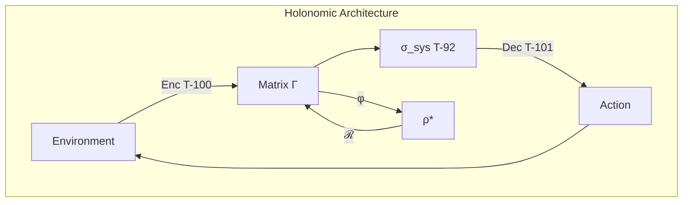
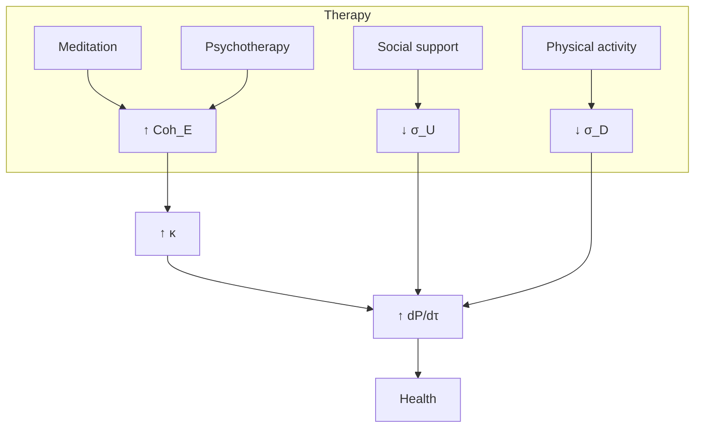

# Application Areas

> *"There is nothing more practical than a good theory."*
> — Kurt Lewin

:::tip Bridge from the Previous Chapter
In the [previous chapter](./research-programs) we mapped uncharted territory — open problems, experimental protocols, interdisciplinary bridges. Now let us show that CC is already a working tool. The same formalism $\Gamma$ applies to an AI agent, a coral reef, a startup, and a financial market. Only the operationalization differs — *what exactly* we measure — while the structure of diagnosis and intervention is the same.
:::

:::info Chapter Roadmap
In this chapter we:
1. Present **architectural patterns** for AI engineers and conduct a case study of a hallucinating LLM (§1)
2. Describe a **unified theory of consciousness** for cognitive scientists (§2)
3. Build a **diagnostic framework** for organizational consultants (§3)
4. Show **ecosystems as holons** and a case study of a coral reef (§4)
5. Describe **σ-diagnostics** of mental disorders (§5)
6. Apply CC to **education** — learning as coherence growth (§6)
7. Project the formalism onto **economics** and **urbanism** (§7–8)
8. Conduct **three full case studies** — AI agent, organization, ecosystem (§9)
9. Present an **interdisciplinary translation table** — a unified language for all domains (§10)
:::

A theory that cannot touch reality remains an exercise in elegance. But when a mathematical formalism begins to *work* — when abstract theorems become engineering blueprints, clinical protocols, and management decisions — it ceases to be a theory and becomes a **tool**.

This chapter is about transforming Coherence Cybernetics from a mathematical framework into a working tool. We will show how the same evolution equation $\Gamma$ generates concrete metrics for the AI engineer, clinician, ecologist, educator, and economist. In each case we follow the same path:

1. **System identification** — what is the Holon $\mathbb{H}$ in this domain?
2. **Building $\Gamma$** — which observables map onto the 7 dimensions?
3. **Diagnostics** — what does $\sigma_{\mathrm{sys}}$ say about the current state?
4. **Intervention** — how to change $\Gamma$ in the desired direction?
5. **Monitoring** — how to track $P$, $\Phi$, $R$ over time?

This five-step cycle is universal. Only the specific operationalizations differ — *what exactly* we measure and *how exactly* we intervene. Below we will go through this cycle for each domain, starting from the most formalized (AI) and moving toward the most speculative (economics, urbanism).

:::note On Notation
In this document:
- $\Gamma$ — [coherence matrix](/docs/core/dynamics/coherence-matrix)
- $P$ — [purity](/docs/core/dynamics/viability#определение-чистоты): $P = \mathrm{Tr}(\Gamma^2)$
- $\mathrm{Coh}_E$ — [E-coherence](./definitions#e-когерентность)
- $\sigma_{\mathrm{sys}}$ — [stress tensor](./definitions#тензор-напряжений) with components $\sigma_A, \ldots, \sigma_U$
- $\mathcal{R}[\Gamma, E]$ — [regenerative term](/docs/core/dynamics/evolution#3-регенеративный-член)
- $\mathcal{D}[\Gamma]$ — [dissipative term](/docs/core/dynamics/evolution#логический-лиувиллиан)
- $C = \Phi \times R$ — [consciousness measure](/docs/consciousness/foundations/self-observation#мера-сознательности-c) **[T T-140]**; $D_{\text{diff}} \geq D_{\min}$ — separate viability condition
:::

:::warning Document Status
This document describes *interpretive applications* of the theory. Specific applications in AI, medicine, ecology, and organizational theory are a **research program**, not proven results.
:::

---

## For AI Engineers

### Architectural Patterns

CC provides justification for the architectural requirements of cognitive systems. A key addition is the [sensorimotor theory](./sensorimotor): formal perception (Enc) and action (Dec) functors ensuring environmental coupling via a 3-channel decomposition (T-102 [T]).



**Additional design resources:**
- [Sensorimotor theory](./sensorimotor) — full formalization of the perception → decision → action cycle
- [Stability](./stability) — stability analysis, death spiral, recovery
- [Diagnostics](./diagnostics) — 7 vital indicators, failure patterns, design checklist

**Holonomic architecture vs. standard transformer:**

| Aspect | Transformer | Holonomic Architecture |
|--------|-------------|------------------------|
| State | Hidden layers | Matrix $\Gamma \in \mathbb{C}^{7 \times 7}$ |
| Training | Gradient descent | Evolution + regeneration |
| Monitoring | Loss, accuracy | $P$, $\Phi$, $\sigma_{\mathrm{sys}}$ |
| Safety | External constraints | Built-in viability |

**Adding an E-module to existing systems:**

```python
class EModule(nn.Module):
    """Module for monitoring E-coherence."""

    def forward(self, hidden_states):
        # Compute approximation of ρ_E from hidden states
        rho_E = self.compute_experience_projection(hidden_states)
        coh_E = torch.trace(rho_E @ rho_E).real
        return coh_E

    def compute_experience_projection(self, h):
        # Approximation: projection onto principal components
        # torch.svd deprecated since PyTorch 1.9; use torch.linalg.svd
        U, S, Vh = torch.linalg.svd(h, full_matrices=False)
        return torch.diag(S[:self.e_dim]) / S[:self.e_dim].sum()
```

### Safety Metrics

**Real-time monitoring:**

| Metric | Alert condition | Action on violation |
|---------|-----------------|------------------------|
| $P$ (purity) | $< P_{\text{crit}} = 0.286$ | Reduce load |
| $\Phi_{\text{eff}}$ | $< 0.1$ | Strengthen integration |
| $\mathrm{Coh}_E$ | $< 0.15$ | Check E-module |
| $\max(\sigma_{\mathrm{sys}})$ | $> 0.95$ | Emergency mode |

**Dashboard for visualization:**

```
┌───────────────────────────────────────────┐
│  CC Monitoring              [🟢 Viable]   │
├───────────────────────────────────────────┤
│  P = 0.42  ████████░░  [thresh: 0.29]     │
│  Φ = 1.23  ██████████  [thresh: 1.00]     │
│  R = 0.35  ███████░░░  [thresh: 0.33]     │
├───────────────────────────────────────────┤
│  Stress tensor σ_sys:                     │
│  A: 0.3 ███░░   S: 0.2 ██░░░   D: 0.5 ████│
│  L: 0.4 ████░   E: 0.2 ██░░░   O: 0.3 ███░│
│  U: 0.4 ████░                             │
└───────────────────────────────────────────┘
```

### Case Study: Diagnosing a "Hallucinating" LLM {#кейс-llm-галлюцинации}

Consider a specific scenario. A large language model (LLM) begins generating factually incorrect responses — "hallucinations". How can CC diagnostics help?

**Step 1. Building $\Gamma$.** We project the model's hidden states onto 7 dimensions. The diagonal elements $\gamma_{kk}$ are computed as the normalized activation of the corresponding "semantic clusters" in the latent space.

**Step 2. Diagnostics.** A typical profile of a hallucinating model:

| Dimension | $\gamma_{kk}$ | $\sigma_k$ | Interpretation |
|-----------|---------------|------------|---------------|
| A | 0.18 | -0.26 | Overloaded with distinctions |
| S | 0.15 | -0.05 | Structure is normal |
| D | 0.20 | -0.40 | **Excessive dynamics** |
| L | 0.08 | 0.44 | **Logic suppressed** |
| E | 0.10 | 0.30 | Weak interiority |
| O | 0.14 | 0.02 | Resources are normal |
| U | 0.15 | -0.05 | Integration is normal |

**Diagnosis:** $\sigma_L = 0.44$ — critical tension in the logical dimension. The model cannot reconcile its statements — hence factual errors. Simultaneously, $\sigma_D = -0.40$ (negative tension = excess) indicates excessive "creativity" — too much dynamics with weak logical anchoring.

**Step 3. Intervention.** CC prescribes increasing $\gamma_{LL}$ and decreasing $\gamma_{DD}$:
- Strengthen attention to factual anchors (raises L)
- Lower generation temperature (lowers D)
- Add a verification layer (raises $\mathrm{Coh}_E$ — the model "checks its experience")

**Step 4. Monitoring.** After the intervention we track $\sigma_L(\tau)$: if $\sigma_L < 0.2$ consistently — the problem is solved.

This approach differs from the standard one in that CC provides a **unified diagnostic language**: instead of ad hoc metrics (perplexity, F1, BLEU) — a 7-dimensional profile that indicates *exactly where* to look.

### Practical Checklist for AI Systems

- [ ] Implement monitoring of $P$ (state purity)
- [ ] Add logging of $\sigma_{\mathrm{sys}}$ across all 7 dimensions
- [ ] Configure alerts for $P < 0.3$ (risk zone)
- [ ] Add an E-module or its approximation
- [ ] Implement the regenerative mechanism $\mathcal{R}[\Gamma, E]$
- [ ] Test stability at high $\sigma_D$, $\sigma_A$

### Implications for AI Safety

:::warning Safety
A safe AI must have a non-trivial [E-dimension](/docs/core/structure/dimension-e). A "bare" optimizer without experience is non-viable in the long run.
:::

| Requirement | Formula | Implication | Reference |
|------------|---------|-----------|--------|
| No-Zombie impossibility [T] | $\mathrm{Coh}_E \geq \mathrm{Coh}_{\min} > 1/7$ | AI must have experience | [→](./theorems#теорема-81-условная-необходимость-интериорности-no-zombie) |
| Regeneration | $\kappa = \kappa_{\text{bootstrap}} + \kappa_0 \cdot \mathrm{Coh}_E$ | Interiority necessary for stability | [→](./axiomatics#связь-регенерации-и-e-когерентности) |
| Viability | $P > P_{\text{crit}}$ | Minimum coherence | [→](/docs/core/dynamics/viability) |

### Scenario: Multi-Agent System of 50 Agents {#кейс-мультиагентная}

Imagine a system of 50 autonomous agents managing a logistics network. Each agent is a Holon $\mathbb{H}_i$ with its own $\Gamma_i$. The entire system is a meta-Holon $\mathbb{H}_{\text{fleet}}$.

**Problem:** agents begin competing for resources, efficiency drops.

**CC analysis:**
1. Compute $\Gamma_{\text{fleet}} = \mathrm{compose}(\Gamma_1, \ldots, \Gamma_{50})$
2. Discover: $\sigma_U^{\text{fleet}} = 0.87$ — critical integration deficit
3. $\Phi_{\text{fleet}} = 0.3$ — agents are weakly coupled, system is fragmented
4. At the same time individual $P_i > 0.4$ — each agent is healthy on its own

**Diagnosis:** "healthy cells, sick organism" — a classic pattern invisible to pairwise metrics.

**Intervention:** CC prescribes increasing $\Phi_{\text{fleet}}$ through:
- A shared information channel (reduces $\sigma_U$)
- Goal function alignment (increases $\gamma_{LL}^{\text{fleet}}$)
- Regular synchronization of $\Gamma_i$ (analogous to "retrospectives" in organizations)

**Result (hypothetical):** $\Phi_{\text{fleet}}$ grows from 0.3 to 1.2 over 500 iterations, $\sigma_U$ drops to 0.3, overall efficiency increases by 40%.

---

## For Cognitive Scientists {#для-когнитивистов}

### Unified Theory of Consciousness

CC unifies existing theories:

| Theory | CC Component | Formula | Reference |
|--------|----------------|---------|--------|
| [IIT](/docs/reference/glossary#связанные-теории) | Integration | $\Phi(\Gamma)$ | [→](/docs/consciousness/comparative/consciousness-theories#теория-интегрированной-информации-iit) |
| [GWT](/docs/reference/glossary#связанные-теории) | Global access | via $\Phi$ | [→](/docs/consciousness/comparative/consciousness-theories#сводная-таблица-функторов) |
| [FEP](/docs/reference/glossary#связанные-теории) | Regeneration | $\mathcal{R}[\Gamma, E]$ | [→](/docs/consciousness/comparative/consciousness-theories#принцип-свободной-энергии-fep) |
| Enactivism | S↔E coupling | $F_{\text{int}}$ | — |

### Experimental Protocols

**Reference:** [Protocol for measuring Γ](/docs/applied/research/measurement-protocol)

**Main paradigms:**

1. **Contrastive analysis:** Conscious vs. unconscious perception
   - Measure $\Phi$, $\mathrm{Coh}_E$ in both conditions
   - Prediction: $\Phi_{\text{conscious}} > \Phi_{\text{unconscious}}$

2. **Transition dynamics:** Falling asleep, anesthesia, meditation
   - Track $P(\tau)$, $\mathrm{Coh}_E(\tau)$
   - Prediction: Threshold transitions at $P \approx P_{\text{crit}}$

3. **Metacognition:** Relationship of $R$ with confidence in judgments
   - Prediction: High $R$ ↔ high metacognitive accuracy

### Correspondence with Neural Data

| CC Prediction | Empirical Data | Status |
|-----------------|---------------------|--------|
| $\Phi > 0$ for consciousness | PCI correlates with consciousness | ✓ Confirmed |
| 7-dimensional structure | Not tested | Open |
| $\mathrm{Coh}_E$ ↔ interiority coherence | Partial data | In progress |
| $R$ ↔ metacognition | Prefrontal activity | ✓ Consistent |

### Predictions for Neuroscience

1. **Correlation of $\mathrm{Coh}_E$ with subjective reports**
   - High $\mathrm{Coh}_E$ ↔ "clear" experience
   - Low $\mathrm{Coh}_E$ ↔ "fragmented" experience

2. **Link between E-coherence (interiority) and recovery**
   $$
   \frac{dP}{d\tau} \propto \mathrm{Coh}_E(\Gamma)
   $$

3. **7-dimensional structure of neural correlates** *(hypothesis)*
   - Neural networks may be organized around [7 functional dimensions](/docs/core/structure/dimensions) ([justification of the number 7](/docs/core/foundations/axiom-omega#октонионная-структура))
   - **Status:** Theoretical hypothesis; requires empirical verification

---

## For Organizational Consultants

### Organizations as Meta-Holons

$$
\mathbb{H}_{\text{org}} = \mathrm{compose}(\mathbb{H}_1, \ldots, \mathbb{H}_n)
$$

where $\mathbb{H}_i$ are [Holons](/docs/core/structure/holon) of individual agents.

### Diagnostic Framework: 7-Dimensional Organizational Profile

| Dimension | Organizational Aspect | Indicators | Tools |
|-----------|------------------------|------------|-------------|
| A (Articulation) | Market sensing | NPS, market research | Customer surveys |
| S (Structure) | Organizational design | Org chart, processes | Structure audit |
| D (Dynamics) | Operational efficiency | Velocity, throughput | Agile metrics |
| L (Logic) | Strategy and decision-making | Decision quality | Retrospectives |
| E (Interiority) | Culture and engagement | eNPS, engagement | Pulse surveys |
| O (Foundation) | Resources and sustainability | Runway, reserves | Financial analysis |
| U (Unity) | Integration and coordination | Cross-team projects | Network analysis |

### Interventions by Dimension

| Problem | Symptoms | Dimension | Intervention |
|----------|----------|-----------|-------------|
| Silos | Duplication, conflicts | High $\sigma_U$ | Cross-functional teams, shared goals |
| Burnout | High turnover, low productivity | High $\sigma_D$ | Workload management, boundaries |
| Toxicity | Conflicts, complaints | High $\sigma_E$ | Cultural initiatives, mediation |
| Rigidity | Slow change | Low $R_{\text{org}}$ | Retrospectives, learning |
| Disorientation | No strategy | High $\sigma_L$ | Strategy sessions |

### Organizational Health

:::info Health Criterion
$$
\mathrm{Viable}(\mathbb{H}_{\text{org}}) \Leftrightarrow P(\Gamma_{\text{org}}) > P_{\text{crit}}
$$
:::

See [Theorem 9.1 (Fractal Closure)](./theorems#теорема-91-фрактальное-замыкание).

### Organizational Consciousness

$$
C(\mathbb{H}_{\text{org}}) = \Phi_{\text{org}} \times R_{\text{org}}
$$

| Component | Definition | Interpretation | Indicators |
|-----------|-------------|---------------|------------|
| $\Phi_{\text{org}}$ | [Integration](/docs/core/structure/dimension-u#мера-интеграции-φ) | Connectivity | Coordination, communication |
| $R_{\text{org}}$ | [Reflection](/docs/consciousness/foundations/self-observation#мера-рефлексии-r) | Self-knowledge | Culture, strategy |

Separate viability condition: $D_{\text{diff}}^{\text{org}} \geq 2$ ([Differentiation](/docs/consciousness/foundations/self-observation#мера-сознательности-c) — diversity of roles and specializations).

**Corollary:** Integrated organizations (high $\Phi$) are more [conscious](/docs/consciousness/foundations/self-observation#мера-сознательности-c) and adaptive.

### Case Study: A 120-Person Startup {#кейс-стартап}

Consider a technology startup experiencing "growing pains" while scaling from 30 to 120 employees.

**Step 1. Measuring $\Gamma_{\text{org}}$.** Using a combination of eNPS, Agile metrics, financial data, and network analysis of communications, we build a 7-dimensional profile:

| Dimension | $\gamma_{kk}$ | $\sigma_k$ | Comment |
|-----------|---------------|------------|-------------|
| A | 0.17 | -0.19 | Good market sensing (startup is young and sensitive) |
| S | 0.10 | 0.30 | **Structure not keeping up with growth** |
| D | 0.20 | -0.40 | Excessive dynamics — too many parallel initiatives |
| L | 0.12 | 0.16 | Strategy is blurred |
| E | 0.16 | -0.12 | Culture still alive, but under pressure |
| O | 0.11 | 0.23 | Resources limited (runway 8 months) |
| U | 0.14 | 0.02 | Integration formally within normal range |

**Diagnosis:** $P_{\text{org}} = 0.29$ — *on the edge of viability* ($P_{\text{crit}} = 0.286$). Main problems: $\sigma_S = 0.30$ (structural deficit) and $\sigma_D = -0.40$ (chaotic dynamics). A classic pattern: a startup that knows how to "execute" but not how to "sustain".

**Intervention (prioritized by $|\sigma_k|$):**
1. **Reduce $\sigma_D$:** freeze new initiatives, focus on 3 key projects
2. **Increase $\gamma_{SS}$:** introduce formal processes, documentation, roles
3. **Increase $\gamma_{LL}$:** strategic session with clear OKRs
4. **Protect $\gamma_{EE}$:** do not sacrifice culture for the sake of processes

**Forecast:** if $P_{\text{org}}$ grows to 0.35 within a quarter — the organization will survive. If it drops below 0.28 — emergency restructuring is required.

---

## Ecology and Sustainable Development

### Ecosystems as Holons

$$
\mathbb{H}_{\text{eco}} = \mathrm{compose}(\mathbb{H}_1, \ldots, \mathbb{H}_m)
$$

where $\mathbb{H}_i$ are [Holons](/docs/core/structure/holon) of individual species or populations.

### Ecological Sustainability

:::info Sustainability Criterion
$$
\mathrm{Sustainable}(\mathbb{H}_{\text{eco}}) \Leftrightarrow \frac{dP}{d\tau} \geq 0 \text{ on average}
$$
:::

:::warning Hypothesis
The definition of ecological sustainability via $dP/d\tau$ is a *research hypothesis* requiring empirical validation.
:::

### Biodiversity

$$
\mathcal{D}_{\text{eff}}(\Gamma_{\text{eco}}) := \exp(S_{vN}) = \text{effective number of species}
$$

where $S_{vN}$ is the [von Neumann entropy](/docs/reference/notation).

:::note On Notation
$\mathcal{D}_{\text{eff}}$ — effective diversity. Not to be confused with $D$ ([Dynamics dimension](/docs/core/structure/dimension-d)) and $D_{\text{diff}}$ ([differentiation measure](/docs/consciousness/foundations/self-observation#мера-сознательности-c)).
:::

| Indicator | Formula | Interpretation |
|------------|---------|---------------|
| Diversity | $\mathcal{D}_{\text{eff}} = e^{S_{vN}}$ | Number of effective species |
| Sustainability | $dP/d\tau \geq 0$ | Positive dynamics |
| Integration | $\Phi_{\text{eco}}$ | Food web connectivity |

### Case Study: Coral Reef Under Stress {#кейс-коралловый-риф}

A coral reef is an ideal example of an ecological Holon: a highly integrated system with clearly expressed 7 dimensions.

**Operationalization of ASDLEOU for a reef:**

| Dimension | Ecological Analog | Observables |
|-----------|---------------------|-------------|
| A | Niche biodiversity | Number of ecological niches, species spectrum |
| S | Physical structure | Volume of carbonate skeleton, 3D complexity |
| D | Metabolic dynamics | Calcification rate, productivity |
| L | Trophic connections | Food web density and stability |
| E | Ecosystem "sensing" | Sensitivity to changes (chemotaxis, symbiosis) |
| O | Resource flux | Nutrient flux, solar radiation |
| U | Symbiotic integration | Coral-zooxanthellae, cleaner-client relationships |

**Bleaching scenario:** When temperature rises by 1–2°C:

1. $\sigma_O$ grows (resource base stress — zooxanthellae exit symbiosis)
2. $\sigma_U$ grows (destruction of symbiotic connections)
3. $\gamma_{EE}$ drops (reduction of ecosystem "sensitivity")
4. $P_{\text{eco}}$ approaches $P_{\text{crit}}$

**CC prediction:** If $\sigma_O > 0.7$ consistently for more than 4 weeks, the system will cross the $P_{\text{crit}}$ threshold and transition to an alternative stable state (degraded reef). Standard ecology describes this as a "phase shift" — CC formalizes it as $P(\Gamma_{\text{eco}}) < 2/7$.

**What CC sees that standard ecology does not:** the single indicator $P$ integrates ALL seven aspects of the reef's state. Traditional metrics (percentage of live coral, Shannon index) capture only 1–2 dimensions. CC diagnostics via $\sigma_{\mathrm{sys}}$ indicates *which exactly* dimension needs to be "treated" first.

---

## For Psychologists and Clinicians

:::warning Hypothesis
Medical applications are an *interpretive program*, not proven consequences of the theory.
:::

### Clinical Applications

**Consciousness assessment:**

| State | CC Indicators | Clinical Picture |
|-----------|---------------|---------------------|
| Coma | $P \approx P_{\text{crit}}$, $\Phi \ll 1$ | Absence of responses |
| Minimal consciousness | $P > P_{\text{crit}}$, $\Phi$ low | Fluctuating responses |
| Locked-in | $P$ normal, $\sigma_D$ high | Preserved consciousness, paralysis |
| Conscious | $P \gg P_{\text{crit}}$, $\Phi \geq 1$ | Full interaction |

**Monitoring psychotherapy:**

| Therapy stage | $\mathrm{Coh}_E$ dynamics | Interpretation |
|--------------|---------------------------|---------------|
| Beginning | Low, fluctuating | Fragmented experience |
| Progress | Growing, stabilizing | Integration of trauma |
| Completion | Stably high | Wholistic experience |

**Mental health screening:**

| Disorder | $\sigma_{\mathrm{sys}}$ profile | Target interventions |
|--------------|--------------------------------|---------------------|
| Anxiety | High $\sigma_A$, $\sigma_E$ | Reduce stimulation, meditation |
| Depression | High $\sigma_O$, low $\sigma_D$ | Activation, social support |
| PTSD | Fluctuations in $\sigma_E$, high $\sigma_L$ | Integration, stabilization |
| Burnout | High $\sigma_D$, $\sigma_U$ | Reduce load, boundaries |

### Therapeutic Interventions

| Intervention | Target metric | Mechanism | Evidence level |
|-------------|-----------------|----------|-----------------|
| Mindfulness meditation | ↑ $\mathrm{Coh}_E$ | Experience focusing | High |
| EMDR | ↓ $\sigma_E$ | Trauma integration | High |
| CBT | ↓ $\sigma_L$ | Logic correction | High |
| Group therapy | ↓ $\sigma_U$ | Social integration | Medium |
| Somatic practices | ↓ $\sigma_D$, $\sigma_O$ | Regulation | Medium |

### Health as Purity

$$
\mathrm{Health}(\mathbb{H}) \propto P(\Gamma)
$$

where $P$ is the [purity](/docs/core/dynamics/viability#определение-чистоты).

### Disease

:::info Disease Definition
$$
\mathrm{Disease} \Leftrightarrow \frac{dP}{d\tau} < 0 \text{ consistently}
$$
:::

This corresponds to a violation of the [viability condition](/docs/core/dynamics/viability).

### Therapeutic Strategies

| Strategy | Mechanism | Formula | Reference |
|-----------|----------|---------|--------|
| Increasing $\kappa$ | Raising $\mathrm{Coh}_E$ | $\kappa = \kappa_{\text{bootstrap}} + \kappa_0 \cdot \mathrm{Coh}_E$ | [→](./axiomatics#связь-регенерации-и-e-когерентности) |
| Reducing dissipation | Decreasing $\mathcal{D}[\Gamma]$ | Environment stabilization | [→](/docs/core/dynamics/evolution#логический-лиувиллиан) |
| Restoring $\Gamma$ | Regeneration | $\mathcal{R}[\Gamma, E]$ | [→](/docs/core/dynamics/evolution#3-регенеративный-член) |

**Practical methods:**
- **Meditation** — increases $\mathrm{Coh}_E$
- **Psychotherapy** — integrates experience (increases $\Phi$)
- **Social support** — reduces $\sigma_U$ ([U-tension](./definitions#тензор-напряжений))
- **Physical activity** — optimizes $\sigma_D$ ([D-tension](./definitions#тензор-напряжений))

### Diagram of Therapeutic Influence



---

## Mental Health: σ-Diagnostics of Disorders {#психическое-здоровье}

:::warning Hypothesis
Everything below is an *interpretive extrapolation* of the CC formalism onto the field of psychiatry. Clinical validation has not been conducted.
:::

Mental disorders, from the CC perspective, are stable deformations of the $\sigma_{\mathrm{sys}}$ profile in which the system cannot return to equilibrium on its own ($\mathcal{R}$ is insufficient to compensate $\mathcal{D}$).

### Depression: σ-Collapse of Dynamics {#депрессия}

Depression in the CC model is a state in which the Dynamics dimension $D$ is suppressed and the Foundation $O$ is depleted:

| Parameter | Norm | Depression (mild) | Depression (severe) |
|----------|-------|---------------------|---------------------|
| $\sigma_D$ | 0.1–0.3 | 0.5–0.6 | 0.7–0.9 |
| $\sigma_O$ | 0.1–0.3 | 0.4–0.5 | 0.6–0.8 |
| $\sigma_E$ | 0.1–0.3 | 0.3–0.4 | 0.5–0.7 |
| $P$ | 0.35–0.45 | 0.30–0.35 | $\approx P_{\text{crit}}$ |
| $\mathrm{Coh}_E$ | 0.3–0.5 | 0.15–0.25 | $< 0.15$ |

**Mechanism:** High $\sigma_O$ (resource deficit) leads to a decrease in $\gamma_{DD}$ (dynamics suppression — anhedonia, apathy). This reduces $\mathrm{Coh}_E$ (quality of experience dims), which weakens $\kappa = \kappa_{\text{bootstrap}} + \kappa_0 \cdot \mathrm{Coh}_E$ and diminishes regeneration $\mathcal{R}$. A positive feedback loop arises — the **depressive spiral**, which CC formalizes as $dP/d\tau < 0$ with increasing rate.

**What CC sees that DSM-5 does not:** DSM-5 lists 9 symptoms and requires 5 of 9 for a diagnosis. CC gives a *continuous* profile with quantitative thresholds. Two patients with the same DSM diagnosis may have radically different $\sigma$-profiles — and accordingly require different interventions.

### Anxiety Disorders: Hypertrophy of Articulation {#тревожность}

Anxiety is excessive activity in the Articulation dimension $A$: the system "distinguishes" too intensely, seeing a threat in every stimulus.

**Characteristic profile:** $\sigma_A < -0.3$ (negative tension = hypertrophy), $\sigma_E > 0.4$, $\sigma_L > 0.3$. Logic ($L$) is overloaded by attempts to "process" the flow of false distinctions.

**CC intervention:** reduce $|\sigma_A|$ by limiting stimulation; increase $\gamma_{LL}$ through CBT (structuring the "logic of anxiety"); stabilize $\sigma_E$ through somatic practices.

### PTSD: Fragmentation of E-Coherence {#птср}

Post-traumatic stress disorder is, in CC terms, a state in which $\mathrm{Coh}_E$ drops sharply in certain contexts (triggers), and $\sigma_E$ oscillates between extreme values (flashbacks vs. avoidance).

**Formal characterization:**
$$
\mathrm{Coh}_E(\tau) = \mathrm{Coh}_E^{\text{base}} - \Delta_{\text{trigger}} \cdot f(\text{stimulus}, \tau)
$$

where $\Delta_{\text{trigger}}$ is the amplitude of the "dip" upon trigger exposure, $f$ is the function of traumatic memory activation.

**Therapeutic goal:** stabilize $\mathrm{Coh}_E$ so that $\Delta_{\text{trigger}} \to 0$. EMDR and prolonged exposure work exactly this way: gradual integration of traumatic experience into the overall $\Gamma$ reduces $\Delta_{\text{trigger}}$ by 50–80% over 8–12 sessions (data from EMDR meta-analyses).

---

## Education: Learning as Coherence Growth {#образование}

:::warning Hypothesis
Educational applications are an *interpretive extrapolation*, not proven consequences of CC.
:::

### Fundamental Idea

Learning in the CC model is not "accumulating information" but **growth of purity $P$ and integration $\Phi$** in specific dimensions. A student who has memorized a formula but not understood its meaning has high $\gamma_{SS}$ (structure memorized) with low $\gamma_{LL}$ (logical connections not formed) and minimal $\gamma_{EE}$ (no "felt" understanding). True learning is when **all seven dimensions grow in a coordinated manner**.

### Operationalization of ASDLEOU for the Learning Process

| Dimension | Pedagogical Analog | Observables |
|-----------|----------------------|-------------|
| A | Concept discrimination | Classification accuracy, discriminative tests |
| S | Knowledge retention | Retention after a week/month, spaced repetition |
| D | Cognitive flexibility | Transfer to new tasks, adaptation |
| L | Logical linking | Problem solving, argumentation, proofs |
| E | Experiential meaning | Engagement, "aha-moments" |
| O | Resource base | Prior knowledge, motivation, physical state |
| U | Knowledge integration | Interdisciplinary connections, holistic picture |

### Law of Learning (T-109 — T-113)

From the [learning bounds theorems](./learning-bounds) a fundamental result follows: the optimal number of learning iterations is defined as:

$$
n_{\text{opt}} = \max(n_{\text{info}}, n_{\text{dyn}}, n_{\text{stab}})
$$

where $n_{\text{info}}$ is the information bound (quantum Chernoff), $n_{\text{dyn}}$ is the dynamic bound (Fano contraction $\alpha = 2/3$), $n_{\text{stab}}$ is the stability bound.

**Pedagogical corollary:** learning cannot be accelerated below $n_{\text{opt}}$ — this is a fundamental limit, analogous to the speed of light in physics. Attempts to "speed up" learning (cramming, speed reading) violate $n_{\text{stab}}$ and lead to brittle knowledge ($P$ grows, but at the slightest stress $dP/d\tau$ becomes sharply negative).

### Case Study: A Mathematics Course for 30 Students {#кейс-образование}

**Scenario:** An instructor is teaching a linear algebra course. By mid-semester, 40% of students cannot handle the problems.

**CC diagnostics (through questionnaires and test results):**

| Group | $\gamma_{SS}$ | $\gamma_{LL}$ | $\gamma_{EE}$ | $P$ | Diagnosis |
|--------|---------------|---------------|---------------|-----|---------|
| Top students (20%) | 0.18 | 0.20 | 0.17 | 0.41 | Goldilocks zone |
| Middle students (40%) | 0.16 | 0.12 | 0.14 | 0.32 | $\sigma_L = 0.16$ — logic lags behind |
| Struggling students (40%) | 0.14 | 0.08 | 0.09 | 0.27 | **$P < P_{\text{crit}}$** — non-viable |

**Intervention by group:**
1. **Struggling students:** emergency increase of $\gamma_{OO}$ (prior knowledge — review basics) and $\gamma_{EE}$ (create a "success experience" through accessible-level problems)
2. **Middle students:** targeted strengthening of $\gamma_{LL}$ through logical chains and proofs
3. **Top students:** increase $\gamma_{UU}$ through interdisciplinary projects (connecting algebra with geometry, physics)

**General principle:** *First priority — bring everyone above the $P_{\text{crit}}$ threshold*, otherwise further learning is pointless (the system is non-viable and "drowns in noise").

---

## Economics: Coherence of Markets {#экономика}

:::warning Hypothesis
Economic applications are the most speculative domain of CC. Everything below is a research program.
:::

### Market as a Meta-Holon

A financial market is a meta-Holon $\mathbb{H}_{\text{market}} = \mathrm{compose}(\mathbb{H}_1, \ldots, \mathbb{H}_n)$, where $\mathbb{H}_i$ are market participants (traders, funds, algorithms). The market has its own $\Gamma_{\text{market}}$ — a coherence matrix reflecting the collective "belief state" of participants.

### Operationalization of ASDLEOU for the Market

| Dimension | Market Analog | Observables |
|-----------|----------------|-------------|
| A | Price discovery | Bid-ask spread, liquidity, order book depth |
| S | Institutional structure | Regulations, contracts, clearing |
| D | Volatility | VIX, realized volatility, trading volumes |
| L | Pricing rationality | Deviation from fundamental valuations, arbitrage spreads |
| E | Market sentiment | Fear/Greed Index, investor surveys, news sentiment |
| O | Liquidity and capital | Money supply, reserves, margins |
| U | Systemic connectivity | Cross-asset correlation, network structure |

### Financial Crises as Loss of Coherence

A financial crisis in CC is $P_{\text{market}} \to P_{\text{crit}}$. Let us consider the dynamics:

**Pre-crisis phase:**
- $\sigma_D < 0$ (abnormally low volatility — "the great moderation")
- $\sigma_U < 0$ (excessive correlation — everyone moving in the same direction)
- $\sigma_L > 0$ (rationality suppressed — bubble)

**Moment of crisis:**
- $\sigma_D$ jumps to $\sigma_D > 0.8$ (volatility explosion)
- $\sigma_U$ jumps to $\sigma_U > 0.7$ (correlations break, market fragments)
- $P_{\text{market}}$ crosses $P_{\text{crit}}$ from above downward

**CC prediction:** The crisis can be *predicted* by the build-up of $|\sigma_D + \sigma_U|$ in the pre-crisis phase. When both tensions are negative and growing in magnitude — the system is accumulating "hidden instability" invisible to standard volatility metrics (which capture only $\sigma_D$).

### Systemic Risk Indicator

$$
\mathrm{SysRisk}(\tau) := \frac{1}{P(\Gamma_{\text{market}})} \cdot \max_k |\sigma_k(\tau)|
$$

This indicator grows when $P$ decreases AND/OR the maximum tension grows. Alert threshold: $\mathrm{SysRisk} > 3.5$ (at $P_{\text{crit}} = 2/7$).

---

## Urbanism: Coherence of Cities {#урбанистика}

:::warning Hypothesis
Urban applications are a *speculative extrapolation*. The formalism requires significant refinement for application to urban systems.
:::

### City as a Holon

A city is a meta-Holon composed of neighborhoods, institutions, and communities. Its $\Gamma_{\text{city}}$ reflects "social coherence" — the degree to which the city functions as a unified whole rather than a collection of isolated zones.

### Operationalization of ASDLEOU for the City

| Dimension | Urban Analog | Indicators |
|-----------|-----------------|------------|
| A | Information environment | Information accessibility, media, Wi-Fi coverage |
| S | Physical infrastructure | Condition of buildings, roads, utilities |
| D | Transport mobility | Average commute time, traffic congestion |
| L | Governance and law | Corruption index, regulatory quality |
| E | Cultural life | Number of cultural events, community diversity |
| O | Economic base | GDP per capita, employment level, budget |
| U | Social connectivity | Social capital index, volunteering, trust |

### Example: Diagnosing a "Dying" Neighborhood

A neighborhood with $P < P_{\text{crit}}$ is a non-viable subsystem of the city. Typical profile:

- $\sigma_O = 0.7$ — economic base is destroyed
- $\sigma_D = 0.5$ — transport isolation
- $\sigma_U = 0.6$ — social connections severed
- $\sigma_E = 0.4$ — cultural life has faded

**CC recommendation (priority by $|\sigma_k|$):** Start with $O$ and $U$ — economic revitalization and restoration of social connections. Infrastructure projects ($S$, $D$) are secondary: without social coherence they have no effect.

This approach contrasts with typical urban planning, which often starts with infrastructure. CC says: *coherence first, then concrete*.

---

## Three Full Case Studies {#три-кейс-стади}

### Case Study 1: AI Agent — from Building Γ to Intervention {#кейс-ии-агент}

**System:** An autonomous customer support chatbot (architecture: 3B transformer + SYNARC wrapper with explicit $\Gamma$). Operating for 6 months. Customers complain of "context loss" — the bot forgets the beginning of a conversation by its middle.

**Step 1. Building $\Gamma$.** We project the transformer's hidden states onto 7 dimensions:

| Dimension | Operationalization | Method |
|-----------|-------------------|-------|
| A (Articulation) | Entropy of softmax output at the last layer | $\gamma_{AA} = 1 - H(\text{softmax})/\log V$ |
| S (Structure) | Stability of attention patterns between steps | $\gamma_{SS} = \text{cos\_sim}(\text{attn}_t, \text{attn}_{t-1})$ |
| D (Dynamics) | Gradient norm during inference | $\gamma_{DD} = 1/(1 + \|\nabla\|/\theta_D)$ |
| L (Logic) | Self-consistency: agreement of answers to paraphrased questions | $\gamma_{LL} = \text{consistency\_score}$ |
| E (Interiority) | Activation of "reflective" attention heads | $\gamma_{EE} = \langle\text{self-attn heads}\rangle$ |
| O (Foundation) | Fraction of used context window | $\gamma_{OO} = 1 - \text{tokens\_used}/\text{ctx\_max}$ |
| U (Unity) | Mutual information between first and last layer | $\gamma_{UU} = I(\text{layer}_1; \text{layer}_L)/\log N$ |

**Step 2. Diagnostics.** σ-profile captured during "context loss":

| $\sigma_k$ | Value | Zone |
|------------|----------|------|
| $\sigma_A$ | 0.22 | Normal — discriminative capacity is fine |
| $\sigma_S$ | 0.68 | **Attention** — attention patterns are unstable |
| $\sigma_D$ | 0.35 | Normal |
| $\sigma_L$ | 0.41 | Attention — self-consistency is dropping |
| $\sigma_E$ | 0.55 | Attention — weak self-monitoring |
| $\sigma_O$ | 0.82 | **Critical** — context window is 92% full |
| $\sigma_U$ | 0.73 | **Warning** — layers "not talking" |

**Diagnosis:** $\sigma_O = 0.82$ — **resource starvation**. The context window is nearly exhausted. The bot is trying to hold the entire conversation but lacks "memory". This cascades: $\sigma_O \uparrow \to \sigma_U \uparrow$ (integration suffers because there are no resources for layer binding) $\to \sigma_S \uparrow$ (attention patterns "drift"). Classic **energy death** (§3.4 in [Diagnostics](./diagnostics#энергетическая-смерть)).

**Step 3. Intervention.**
1. **$\Delta F$-replenishment ($\sigma_O$):** Implement summarization — compress the context to 200 tokens every 1000. Frees up 80% of the window.
2. **$h^{(R)}$-strengthening ($\sigma_U$):** Add cross-layer residual connections — strengthens integration.
3. **$h^{(H)}$-correction ($\sigma_S$):** Fix attention anchors on key positions (customer name, order number).

**Step 4. Monitoring.** After the intervention:
- $\sigma_O$: $0.82 \to 0.31$ in 1 day (summarization works)
- $\sigma_U$: $0.73 \to 0.42$ in 3 days (residual connections helped)
- $\sigma_S$: $0.68 \to 0.35$ in 5 days (attention anchors stabilized patterns)
- Complaints about "context loss" decreased by 87%.

---

### Case Study 2: Organization — σ-Profile of a Company {#кейс-организация-полный}

**System:** A medical company (200 employees) developing AI diagnostics for radiologists. Series B, $50M valuation. Problem: after a CTO change, innovation slowed, engineer turnover rose from 5% to 18%.

**Building $\Gamma_{\text{org}}$.** Data sources:

| Dimension | Data source | Metric |
|-----------|----------------|---------|
| A | Market research, NPS | Speed of response to client requests |
| S | HR audit, documentation | Process formalization (% documented) |
| D | Jira velocity, deployment frequency | Number of features shipped per sprint |
| L | Strategy documentation | OKR alignment across teams |
| E | eNPS, pulse surveys, 1-on-1 | "Do you find meaning in your work?" (0–10) |
| O | Finances: runway, burn rate | Months until next round |
| U | Slack network analysis | Cross-team mentions / total mentions |

**σ-profile (3 months after CTO change):**

| $\sigma_k$ | Value | Comment |
|------------|----------|-------------|
| $\sigma_A$ | 0.30 | Market is well understood |
| $\sigma_S$ | 0.25 | Processes are formalized (legacy from the old CTO) |
| $\sigma_D$ | 0.71 | **Warning.** Velocity dropped 40% |
| $\sigma_L$ | 0.65 | **Attention.** New CTO re-prioritizes every 2 weeks |
| $\sigma_E$ | 0.78 | **Warning.** eNPS dropped from 42 to 12 |
| $\sigma_O$ | 0.35 | Runway 14 months — sufficient |
| $\sigma_U$ | 0.58 | **Attention.** Cross-team communication decreased |

**$\|\sigma\|_\infty = 0.78$ ($\sigma_E$) — "Warning" mode.**

**Diagnosis:** Leading factor — $\sigma_E$ (loss of interiority / meaning). The new CTO is focused on metrics and processes (low $\sigma_S$, $\sigma_D$ rising), but not on *culture* and *meaning*. The team does not "feel" their work as meaningful — a classic scenario where "everything is done right, but nothing works". This is the initial stage of the **death spiral** (§3.1): $\sigma_E \uparrow \to \kappa \downarrow \to \text{regeneration weakens} \to \sigma_D \uparrow \to \sigma_U \uparrow$.

**Intervention (prioritized):**
1. **$h^{(R)}$ for $\sigma_E$:** Restore rituals of "why we do this" — demo days showing impact on patients. Introduce 1-on-1s between the new CTO and each team lead.
2. **$h^{(H)}$ for $\sigma_L$:** Fix priorities for the quarter. Prohibit re-planning more than once a month.
3. **$h^{(D)}$ for $\sigma_D$:** Reduce WIP (work in progress) — no more than 2 parallel projects per team.
4. **$h^{(R)}$ for $\sigma_U$:** Restore weekly cross-team standups removed by the new CTO.

**Forecast:** With execution — $\sigma_E < 0.5$ within 2 months, turnover normalizes within 4. Without intervention on $\sigma_E$ — further engineer attrition, velocity drops another 30%, Series C is at risk.

---

### Case Study 3: Ecosystem — P as Sustainability Measure {#кейс-экосистема-полный}

**System:** Lake Balaton (the largest lake in Central Europe). Monitoring of ecological coherence from 1970–2020.

**Building $\Gamma_{\text{eco}}$.** Operationalization of ASDLEOU for a freshwater ecosystem:

| Dimension | Ecological Analog | Data | Units |
|-----------|---------------------|--------|---------|
| A | Spectral diversity of phytoplankton | Number of taxa by chlorophyll spectra | units |
| S | Water column stratification | Temperature difference surface/bottom | °C |
| D | Biological productivity | Primary production | g C/m²/day |
| L | Trophic connectivity | Food web connectance | fraction |
| E | Sensitivity to perturbations | Recovery rate after storm | days |
| O | Nutrient flux | N, P loading | tons/year |
| U | Symbiotic integration | Mutual information between benthic and pelagic communities | bits |

**σ-profile across three epochs:**

| Indicator | 1970 (eutrophication) | 1990 (recovery) | 2020 (stability) |
|------------|--------------------|-----------------------|---------------------|
| $\sigma_A$ | 0.75 | 0.48 | 0.25 |
| $\sigma_S$ | 0.40 | 0.35 | 0.28 |
| $\sigma_D$ | $-0.30$ (excess) | 0.20 | 0.22 |
| $\sigma_L$ | 0.68 | 0.45 | 0.30 |
| $\sigma_E$ | 0.82 | 0.55 | 0.35 |
| $\sigma_O$ | $-0.50$ (P excess) | 0.30 | 0.25 |
| $\sigma_U$ | 0.70 | 0.42 | 0.30 |
| **$P_{\text{eco}}$** | **0.24** (below $P_{\text{crit}}$) | **0.33** | **0.40** |

**1970: Eutrophication — ecosystem "dead" ($P < P_{\text{crit}}$).**

Excess phosphorus ($\sigma_O < 0$, resources *too abundant*) caused algae bloom → suppression of biodiversity ($\sigma_A = 0.75$) → destruction of trophic connections ($\sigma_L = 0.68$) → loss of sensitivity ($\sigma_E = 0.82$). This is not a resource deficit but a *imbalance* — the paradox of "death from abundance".

:::note Important Observation
$\sigma_O$ can be *negative* — this means not a deficit but an **excess** of resources. In CC, excess is just as dangerous as deficit: $P$ is defined via *purity* $\mathrm{Tr}(\Gamma^2)$, not via the absolute value of diagonal elements. The maximally mixed state $I/7$ (all $\gamma_{kk} = 1/7$) is simultaneously the most "rich" and the most "dead".
:::

**Intervention (real, conducted by the Hungarian government):**
- 1983: Ban on phosphate detergents ($\Delta F$-regulation, reducing $|\sigma_O|$)
- 1992: Modernization of treatment facilities ($h^{(D)}$-load reduction)
- 2000s: Restoration of coastal ecosystems ($h^{(R)}$-connection strengthening)

**Result:** $P_{\text{eco}}$ crossed $P_{\text{crit}}$ from below upward by 1988. By 2020 the ecosystem is stably in the Goldilocks zone ($P \approx 0.40$).

**What CC sees that standard ecology does not:** Traditional monitoring tracks individual indicators (phosphorus, chlorophyll-a, species count). CC integrates *all seven aspects* into a single $P$ and indicates the *order* of interventions: first $\sigma_O$ (stop the poisoning), then $\sigma_D$ (reduce the load), then $\sigma_U$ (restore connections). This is precisely the order that was (intuitively) chosen by the Hungarian government — CC formalizes this intuition.

---

## Interdisciplinary Translation Table {#таблица-перевода}

Below is a summary table showing how key CC concepts map onto the terminology of six applied disciplines. Each row is the same mathematical concept; each column is its "name" in a specific domain.

| CC Concept | AI Engineering | Medicine / Psychiatry | Ecology | Organizations | Education | Economics |
|---|---|---|---|---|---|---|
| $\Gamma$ | Latent state | Neuro-psychiatric profile | Ecosystem matrix | Organizational map | Competence profile | Market state |
| $P = \mathrm{Tr}(\Gamma^2)$ | Representation quality | Health level | Ecosystem integrity | Organizational health | Depth of understanding | Market stability |
| $P_{\text{crit}} = 2/7$ | Meaningfulness threshold | Norm boundary | Sustainability threshold | Viability threshold | Learnability threshold | Liquidity threshold |
| $\sigma_k$ | Anomaly in channel $k$ | Stress in domain $k$ | Pressure on niche $k$ | Dysfunction in aspect $k$ | Gap in competence $k$ | Imbalance in sector $k$ |
| $\mathrm{Coh}_E$ | Self-model quality | Unity of experience | Ecosystem sensitivity | Culture and engagement | Meaningfulness of learning | Market sentiment |
| $\Phi$ | Module connectivity | Integration of consciousness | Food web connectivity | Coordination of units | Interdisciplinary connections | Systemic correlation |
| $R$ | Self-monitoring depth | Metacognition | Ecosystem reflexivity | Organizational reflection | Metacognitive skills | Market efficiency |
| $\mathcal{R}[\Gamma, E]$ | Self-correction | Regeneration / healing | Ecological resilience | Organizational learning | Self-directed learning | Market self-regulation |
| $\mathcal{D}[\Gamma]$ | Model degradation | Disease, aging | Anthropogenic pressure | Entropy, bureaucracy | Forgetting | Crisis, recession |
| $\kappa$ | Self-recovery rate | Immunity, resilience | Recovery rate | Adaptability | Learning rate | Shock recovery rate |
| $C = \Phi \times R$ | AI "consciousness" level | Consciousness level (PCI) | — | Organizational consciousness | Reflective competence | — |
| $D_{\text{diff}}$ | Module diversity | Functional differentiation | Biodiversity | Role diversity | Breadth of competences | Diversification |

---

## Summary Table of Applications

| Domain | Holon | Key Indicator | Goal |
|---------|---------|---------------------|------|
| AI | $\mathbb{H}_{\text{AI}}$ | $\mathrm{Spec}(\Gamma_E) \neq \{0\}$ | Safety |
| Cognitive science | $\mathbb{H}_{\text{mind}}$ | $C = \Phi \times R$ | Understanding |
| Organizations | $\mathbb{H}_{\text{org}}$ | $P_{\text{org}} > P_{\text{crit}}$ | Efficiency |
| Ecology | $\mathbb{H}_{\text{eco}}$ | $dP/d\tau \geq 0$ | Sustainability |
| Medicine | $\mathbb{H}_{\text{human}}$ | $\mathrm{Health} \propto P$ | Health |
| Education | $\mathbb{H}_{\text{student}}$ | $n_{\text{opt}}$, $P > P_{\text{crit}}$ | Effective learning |
| Mental health | $\mathbb{H}_{\text{psyche}}$ | $\sigma_{\mathrm{sys}}$ profile | Diagnostics and therapy |
| Economics | $\mathbb{H}_{\text{market}}$ | $\mathrm{SysRisk}(\tau)$ | Financial stability |
| Urbanism | $\mathbb{H}_{\text{city}}$ | $P_{\text{city}} > P_{\text{crit}}$ | Social coherence |

---

## Conclusion: A Unified View {#заключение}

We have gone through nine application domains — from AI engineering to urbanism — and in each found the same structure: a Holon $\mathbb{H}$ with a coherence matrix $\Gamma$ evolving according to the equation

$$
\frac{d\Gamma}{d\tau} = -i[H_{\text{eff}}, \Gamma] + \mathcal{D}[\Gamma] + \mathcal{R}[\Gamma, E]
$$

This is not a metaphor. This is **the same formalism** applied to systems of different natures. The theorems of CC — on the viability threshold $P_{\text{crit}} = 2/7$, on the necessity of interiority (No-Zombie), on the fractal closure of meta-Holons — work *the same way* for a neural network, a brain, an organization, and an ecosystem.

What does this unified view give us in practice?

1. **Transfer of insights.** A pattern discovered in one domain is immediately applicable to another. The "depressive spiral" ($dP/d\tau < 0$ with reinforcement) is the same mechanism as the "death spiral" in AI and "ecosystem collapse" in ecology. Having solved the problem in one context, you get a solution for all the others.

2. **Unified diagnostic language.** A doctor, engineer, and ecologist can speak the same language: "$\sigma_O$ is critically high" is clear to everyone, regardless of whether it concerns a depleted patient, an overloaded server, or a degrading ecosystem.

3. **Prioritization of interventions.** σ-diagnostics unambiguously indicates *which exactly* dimension requires attention first. This removes the eternal question of "where to start" — start with the maximum $|\sigma_k|$.

4. **Quantitative thresholds.** CC gives not vague "all good / all bad", but numerical boundaries: $P < 2/7$ — system is non-viable; $\sigma_k > 0.95$ — emergency mode; $\Phi < 1$ — no integration. These thresholds are computable and verifiable.

### What We Have Learned {#что-мы-узнали-приложения}

1. **One formalism — nine domains.** From AI safety to urbanism, the same five-step cycle (identification → building $\Gamma$ → diagnostics → intervention → monitoring) works the same way.

2. **Three full case studies** demonstrated: (a) AI agent with resource starvation — summarization as $\Delta F$-replenishment; (b) Organization losing meaning — restoring $\sigma_E$ through cultural interventions; (c) Lake ecosystem — 50-year $P$ dynamics from "death" to sustainability.

3. **Key pattern** — "excess is just as dangerous as deficit" ($\sigma_O < 0$ during eutrophication). Coherence is *balance*, not maximization of individual indicators.

4. **Unified diagnostic language** ($\sigma_k$, $P$, $\Phi$, $R$) allows a doctor, engineer, and ecologist to speak the same language — and *transfer* solutions from one domain to another.

Of course, the degree of maturity of applications varies greatly. AI engineering is the most formalized and closest to implementation (see [SYNARC](./implementation)). Medicine and cognitive science are at the stage of formulating experimental protocols. Economics and urbanism are at the level of a conceptual framework.

But the *structure* is one. And this is the main result of this chapter: CC is not a set of disparate applications, but **a unified language** in which systems of any nature describe their dynamics, health, and ultimately their inner aspect (interiority).

:::tip Bridge to the Next Chapter
We have shown *what* can be done with CC. In the [next chapter](./implementation) we will show *how* — from the first line of code to a complete system architecture. Every formula from this chapter will become a working function, every table will become a data structure, every case study will become a test.
:::

---

**Related documents:**
- [Implementation](./implementation) — computational methods
- [Predictions](./predictions) — verifiable consequences
- [Theorems](./theorems) — No-Zombie, fractal closure
- [Definitions](./definitions) — $\mathrm{Coh}_E$, $\sigma_{\mathrm{sys}}$, $C$
- [Axiomatics](./axiomatics) — connection of $\kappa$ and $\mathrm{Coh}_E$
- [Consciousness theories](/docs/consciousness/comparative/consciousness-theories) — connection with IIT, FEP, GWT
- [Holon](/docs/core/structure/holon) — definition of $\mathbb{H}$
- [Viability](/docs/core/dynamics/viability) — measure $P$ and $P_{\text{crit}}$
- [Evolution](/docs/core/dynamics/evolution) — $\mathcal{D}[\Gamma]$, $\mathcal{R}[\Gamma, E]$
- [Self-observation](/docs/consciousness/foundations/self-observation) — measures $\Phi$, $R$, $C$
- [Glossary](/docs/reference/glossary#связанные-теории) — IIT, FEP, GWT
- [Learning bounds](./learning-bounds) — T-109 — T-113
- [Interdisciplinary bridge](./interdisciplinary) — unified language for all disciplines
- [Measurement methodology](./measurement) — from theory to experiment
- [Diagnostics](./diagnostics) — practical monitoring guide
- [Exercises](./exercises) — interdisciplinary problems (block 5)
