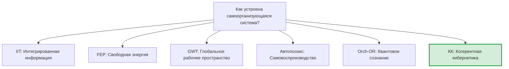

# Сравнение с Альтернативными Теориями

> *«Настоящая проверка теории — не то, может ли она объяснить известные факты, а то, предсказывает ли она новые.»*
> — Имре Лакатос

Научная теория живёт не в вакууме. Её ценность определяется не только внутренней красотой, но и тем, *что она может, чего не могут другие*. В этом разделе мы систематически сопоставляем Кибернетику Когерентности (КК) с основными альтернативными подходами — честно, отмечая как преимущества, так и ограничения каждого.

Если вы учёный, работающий в одной из этих традиций, этот раздел покажет, как перевести ваши идеи на язык КК — и наоборот. Если вы новичок, он поможет понять интеллектуальный ландшафт, в котором существует КК.

---

## 1. Обзор теоретического ландшафта {#обзор}

### 1.1 Шесть теорий за одним столом

Представим, что за круглым столом сидят шесть теорий. Каждая из них пытается ответить на вопрос: «Как устроена самоорганизующаяся система, способная к опыту?»

### 1.2 Мастер-таблица сравнения

| Характеристика | IIT (Тонони) | FEP (Фристон) | GWT (Баарс) | Автопоэзис (Матурана) | Orch-OR (Пенроуз) | **КК** |
|---|---|---|---|---|---|---|
| **Центральный объект** | Информационная структура $\Phi$ | Генеративная модель $q(\theta)$ | Глобальное рабочее пространство | Живая клетка | Микротрубочки | **Матрица $\Gamma$** |
| **Мера сознания** | $\Phi_{\text{IIT}}$ (integrированная информация) | Нет явной | Доступ к GW | Нет количественной | Объективная редукция | **$C = \Phi \times R$** |
| **Динамика** | Нет (статическая) | Вариационный вывод | Нет формальной | Качественная | Квантовая гравитация | **$\mathcal{L}_\Omega[\Gamma]$ (полная)** |
| **Порог сознания** | $\Phi > 0$ | Нет | Доступ к GW | Автопоэтический | Orch-OR событие | **$P > 2/7 \land R \geq 1/3 \land \Phi \geq 1$** |
| **Субъективный опыт** | Постулирован (аксиома) | Не объяснён | Не объяснён | Предполагается | Квантовая когеренция | **Необходимое следствие ([Теорема No-Zombie](./theorems#теорема-81-условная-необходимость-интериорности-no-zombie))** |
| **Фальсифицируемость** | Слабая (NP-hard) | Слабая (всё совместимо) | Умеренная | Слабая | Слабая | **Сильная (5+ предсказаний)** |
| **Вычислимость** | NP-hard для $\Phi$ | Аппроксимации | Нет формулы | Нет формулы | Неясно | **$O(N^3)$, $N=7$** |

---

## 2. Теория интегрированной информации (IIT) {#iit}

### 2.1 Что утверждает IIT

Теория интегрированной информации (Integrated Information Theory), разработанная Джулио Тонони в 2004–2023 годах, строится на пяти аксиомах субъективного опыта:

1. **Внутренняя данность (Intrinsicality):** опыт существует для самой системы
2. **Композиция (Composition):** опыт структурирован
3. **Информативность (Information):** каждый опыт специфичен
4. **Интеграция (Integration):** опыт неразложим на независимые части
5. **Исключение (Exclusion):** опыт определён — не больше и не меньше

Из этих аксиом выводится мера $\Phi_{\text{IIT}}$ — количество интегрированной информации. Чем выше $\Phi$, тем «сознательнее» система.

### 2.2 Что КК берёт у IIT

КК наследует центральную интуицию IIT: **сознание связано с интеграцией**. Мера $\Phi$ в КК (определённая через спектральный зазор графа связей — [мера интеграции](/docs/core/structure/dimension-u#мера-интеграции-φ)) вдохновлена $\Phi_{\text{IIT}}$.

### 2.3 Чего IIT не может, а КК может

| Ограничение IIT | Решение в КК |
|-----------------|--------------|
| **Нет динамики.** $\Phi$ — мгновенный снимок, IIT не описывает, как система эволюционирует во времени | $\Gamma(\tau)$ эволюционирует по полному уравнению $\mathcal{L}_\Omega$ — КК описывает рождение, жизнь и смерть сознания |
| **NP-hard вычисление.** Точное вычисление $\Phi_{\text{IIT}}$ для систем более 20 элементов практически невозможно | $\Phi$ в КК вычисляется за $O(N^2)$ из $7 \times 7$ матрицы |
| **Только интеграция.** IIT смотрит на одну характеристику — интегрированность | КК имеет тройной порог: $P > 2/7$ И $R \geq 1/3$ И $\Phi \geq 1$ — одной интеграции недостаточно |
| **Нет теории действия.** IIT ничего не говорит о том, как сознательная система *действует* | КК имеет полную [сенсомоторную теорию](./sensorimotor): функторы Enc/Dec |
| **Нет объяснения необходимости.** IIT не объясняет, *зачем* сознание нужно | Теорема No-Zombie [Т]: сознание необходимо для жизнеспособности |

### 2.4 Мост IIT→КК

Для исследователей, работающих в IIT: ваш $\Phi_{\text{IIT}}$ — приближение к $\Phi_{\text{КК}}$ при специальных условиях. Конкретнее:

$$
\Phi_{\text{IIT}} \approx \Phi_{\text{КК}} \quad \text{когда система близка к чистому состоянию } (P \to 1)
$$

При низкой чистоте ($P \to 2/7$) расхождение растёт, и КК даёт более информативную картину.

---

## 3. Принцип свободной энергии (FEP) {#fep}

### 3.1 Что утверждает FEP

Принцип свободной энергии (Free Energy Principle) Карла Фристона утверждает, что любая система, которая существует (не рассеивается), минимизирует **вариационную свободную энергию** — разницу между своей внутренней моделью мира и реальным потоком наблюдений:

$$
F = D_{\text{KL}}[q(\theta) \| p(\theta | o)] - \ln p(o)
$$

Отсюда выводится *активный вывод* (active inference): система действует так, чтобы привести мир в соответствие со своей моделью (или модель в соответствие с миром).

### 3.2 Что КК берёт у FEP

КК и FEP разделяют фундаментальную идею: **жизнеспособная система активно поддерживает себя**, а не пассивно адаптируется. [Вариационная формулировка КК](./variational) напрямую связана с FEP — каноническое $\Delta F$ голонома ([определение](/docs/core/dynamics/evolution#каноническое-delta-f) [Т]) — аналог вариационной свободной энергии Фристона.

### 3.3 Чего FEP не может, а КК может

| Ограничение FEP | Решение в КК |
|-----------------|--------------|
| **Нет теории сознания.** FEP описывает, *что* система делает, но не *переживает* ли она это | КК имеет явные меры сознательности: $C$, $R$, $\Phi$, $\mathrm{Coh}_E$ |
| **Чрезмерная универсальность.** «Всё минимизирует свободную энергию» — включая камень и термостат. Отсутствие фальсифицируемости | КК имеет чёткий порог: $P > 2/7$. Камень $P \approx 1/7$ — не жизнеспособен |
| **Нет конкретной размерности.** FEP не указывает, какие переменные нужны | КК фиксирует 7 конкретных измерений с обоснованием |
| **Нет регенерации.** Активный вывод — минимизация ошибки предсказания. Нет аналога $\mathcal{R}$ | КК имеет регенеративный член, связывающий опыт и восстановление |

### 3.4 Мост FEP→КК

FEP — частный случай КК при двух упрощениях:
1. Игнорируется E-измерение (опыт не рассматривается)
2. Регенерация $\mathcal{R}$ поглощается в вариационный вывод

В этом пределе минимизация свободной энергии $\Delta F$ КК совпадает с активным выводом Фристона. Подробнее — [Вариационная формулировка](./variational).

---

## 4. Теория глобального рабочего пространства (GWT) {#gwt}

### 4.1 Что утверждает GWT

Теория Бернарда Баарса (1988) и Станисласа Деана предлагает «театральную» метафору: сознание — это **прожектор**, освещающий сцену (глобальное рабочее пространство), на которой различные когнитивные модули могут обмениваться информацией. Бессознательные процессы — зрители в тёмном зале; сознательные — то, что на сцене.

### 4.2 Что КК берёт у GWT

Идея GWT о том, что сознание связано с глобальной доступностью информации, перекликается с мерой $\Phi$ в КК: высокая интеграция ($\Phi \geq 1$) означает, что информация доступна всем 7 измерениям.

### 4.3 Чего GWT не может, а КК может

| Ограничение GWT | Решение в КК |
|-----------------|--------------|
| **Нет математического формализма.** «Глобальное рабочее пространство» — метафора, не уравнение | КК — полностью формализована: $\Gamma$, $\mathcal{L}_\Omega$, все пороги вычислимы |
| **Нет количественной меры.** Сознание в GWT — бинарно: «в пространстве» или «не в пространстве» | КК: непрерывные меры $C$, $R$, $\Phi$ — сознание градуировано |
| **Нет теории возникновения.** GWT описывает архитектуру сознания, но не объясняет, как она возникает | КК описывает полный цикл: от хаоса $\Gamma = I/7$ до сознательности через [бифуркацию](./bifurcation) |
| **Только когнитивный уровень.** GWT работает на уровне нейронных ансамблей, но не масштабируется на клетки или общества | КК применима к любому масштабу: клетка, организм, ИИ, социум |

---

## 5. Автопоэзис (Матурана и Варела) {#autopoeisis}

### 5.1 Что утверждает автопоэзис

Умберто Матурана и Франсиско Варела в 1970-х годах ввели понятие **автопоэзиса** — способности живой системы непрерывно воспроизводить собственные компоненты. Живая клетка — автопоэтическая система: она строит мембрану, которая замыкает её от среды, и воспроизводит молекулы, из которых состоит мембрана.

### 5.2 Связь с КК

Автопоэзис — **необходимое, но не достаточное** условие для сознания в КК. Оно соответствует [аксиоме автопоэзиса (AP)](/docs/core/foundations/axiom-septicity): $\varphi(\Gamma^*) = \Gamma^*$ — неподвижная точка самовоспроизводства. Но автопоэтическая система может быть бессознательной (как бактерия), если её $R < 1/3$ или $\Phi < 1$.

| Автопоэзис | КК |
|------------|-----|
| Операциональная замкнутость | $\Gamma$ — замкнутая динамика |
| Структурное сопряжение | Функтор $\mathrm{Enc}$ (T-100) |
| Автопоэтическая организация | $\varphi(\Gamma^*) = \Gamma^*$ |
| Нет количественной меры | $P$, $R$, $\Phi$, $C$ — точные числа |
| Нет формальной динамики | $\mathcal{L}_\Omega$ — полная динамика |

---

## 6. Orch-OR (Пенроуз—Хамерофф) {#orch-or}

### 6.1 Что утверждает Orch-OR

Роджер Пенроуз и Стюарт Хамерофф предложили, что сознание возникает при **объективной редукции** (Objective Reduction) квантовых суперпозиций в микротрубочках нейронов. Каждый акт «коллапса» — момент осознанного опыта.

### 6.2 Связь с КК

КК оперирует с матрицей плотности $\Gamma$ — квантовым объектом. Но в КК квантовость — это **формализм**, а не утверждение о субстрате: $\Gamma$ может описывать нейронный ансамбль, программный агент или социальную систему. Orch-OR, напротив, привязывает сознание к конкретному физическому процессу (декогеренция в микротрубочках).

КК не противоречит Orch-OR, но **строже**: даже если Пенроуз прав насчёт микротрубочек, это будет лишь частная реализация общего формализма КК на биологическом субстрате.

---

## 7. Сводная таблица предсказаний {#сводная-таблица}

Что предсказывает каждая теория и что — нет?

| Предсказание | IIT | FEP | GWT | Автопоэзис | Orch-OR | **КК** |
|---|:---:|:---:|:---:|:---:|:---:|:---:|
| Невозможность зомби | ? | Нет | Нет | Нет | Да | **Да [Т]** |
| Точный порог сознания | ~Да | Нет | Нет | Нет | Нет | **Да [Т]** |
| Семимерная классификация стресса | Нет | Нет | Нет | Нет | Нет | **Да [Т]** |
| Связь опыта и регенерации | Нет | Нет | Нет | Нет | Нет | **Да [Т]** |
| Потолок SAD = 3 | Нет | Нет | Нет | Нет | Нет | **Да [С]** |
| Доязыковое познание | Да | Да | Нет | Да | ? | **Да [И]** |
| Нейроосцилляции из щели | Нет | Нет | Нет | Нет | ? | **Да [Г]** |
| Оптимальность N=7 для обучения | Нет | Нет | Нет | Нет | Нет | **Да [Т]** |
| Верхняя граница P=3/7 | Нет | Нет | Нет | Нет | Нет | **Да [Т]** |

---

## 8. Честная оценка ограничений КК {#ограничения}

Ни одна теория не совершенна. Вот что КК пока **не может**:

1. **Эмпирическая проверка.** Главная слабость — отсутствие экспериментальных подтверждений. КК генерирует предсказания, но ни одно из них пока не проверено в лаборатории.

2. **Калибровка.** Формулы содержат параметры (пороги $\theta_i$ для [диагностики](./diagnostics)), которые требуют эмпирической калибровки для конкретных систем.

3. **Масштабирование.** Композиция голономов теоретически описана, но практическая работа с большими системами (общество из миллионов агентов) вычислительно сложна.

4. **Феноменологическая адекватность.** Вопрос, *адекватно* ли 7 измерений описывают реальный субъективный опыт, остаётся открытым [С].

Эти ограничения — не фатальные дефекты, а **открытые проблемы**, определяющие программу исследований (см. [Программы исследований](./research-programs)).

---

## 9. Заключение: единое поле или вавилонская башня? {#заключение}

Современная наука о сознании и самоорганизации напоминает вавилонскую башню: множество языков, мало взаимопонимания. IIT говорит на языке информации, FEP — на языке байесовского вывода, GWT — на языке когнитивной архитектуры, автопоэзис — на языке биологической организации.

КК претендует на роль **единого языка** — не потому, что все остальные ошибаются, а потому, что все они описывают разные проекции одного и того же формализма. IIT — это проекция КК на $\Phi$-компоненту. FEP — проекция на $\Delta F$. GWT — проекция на глобальную доступность. Автопоэзис — проекция на $\varphi$.

Это амбициозное притязание. Но оно фальсифицируемо: если найдётся теория, которая делает все предсказания КК плюс ещё что-то, значит, КК — не метатеория. Пока что таких конкурентов нет.

---

**Дальнейшее чтение:**
- [Уникальные предсказания](./predictions) — полный перечень фальсифицируемых предсказаний
- [Философские основания](./philosophy) — онтологический статус КК
- [Сравнение теорий сознания](/docs/consciousness/comparative/consciousness-theories) — подробный анализ
- [Панпсихизм: критический анализ](/docs/consciousness/comparative/panpsychism-analysis) — почему КК ≠ панпсихизм
- [Вариационная формулировка](./variational) — мост КК↔FEP
