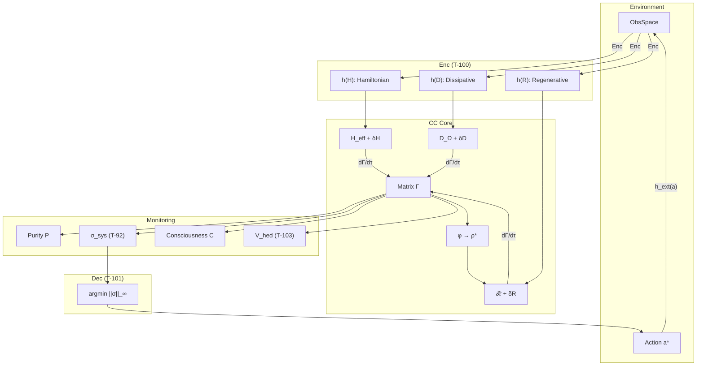

# Computational Implementation

> *"Theory without practice is dead, practice without theory is blind."*
> — Immanuel Kant

:::tip Bridge from the Previous Chapter
In the [previous chapter](./applications) we showed nine application domains of CC — from AI to ecology — and three detailed case studies. In each of them formulas appeared: $P = \mathrm{Tr}(\Gamma^2)$, $\sigma_k = \mathrm{clamp}(1 - 7\gamma_{kk}, 0, 1)$, $\kappa = \kappa_{\text{bootstrap}} + \kappa_0 \cdot \mathrm{Coh}_E$. But a formula on paper and a formula in a computer are two different objects. A paper formula operates with ideal numbers; a computer — with floating-point numbers, limited precision, and finite memory. This chapter is the bridge between them.
:::

:::info Chapter Roadmap
In this chapter we:
1. Run a **minimal example** in 10 lines (§1)
2. Show the **five-step protocol** for translating a formula into code: identify → write → protect → test → optimise (§2)
3. Build the complete **system architecture** — from `HolonState` to `control_loop` (§3–7)
4. Implement the **canonical decomposition** of $F_{\text{ext}}$ via three channels (§8)
5. Go through **typical pitfalls** and create a debugging checklist (§9)
6. Discuss **optimisations**: GPU, sparse matrices, Monte Carlo (§10)
:::

A physicist wrote the evolution equation $d\Gamma/d\tau$. A mathematician proved the theorem on critical purity. A philosopher reflected on why $E$-coherence links experience and stability. Now the moment of truth arrives: **can this be run?**

The computational implementation of Coherence Cybernetics is the bridge between formulas and a working system. It plays a role analogous to a laboratory practical in physics: this is where abstract constructs take on flesh — in the form of matrices, loops, and numerical results that can be verified and reproduced.

This chapter is structured as a **laboratory guide**. We begin with a minimal ten-line example — so that the reader can immediately run something on their own computer and see how purity $P$ changes over time. We then gradually unfold the full architecture: data structures, the evolution algorithm, viability monitoring, the control loop. Every code block is preceded by an explanation — *what* it does, *why*, and *how* it connects to the theoretical results of the preceding chapters.

The path from formula to code is non-trivial. The coherence matrix $\Gamma$ on paper is an ideal object: infinite precision, continuous time, guaranteed positive semidefiniteness. In a computer everything is different: finite arithmetic generates rounding errors, time discretisation violates the CPTP-channel property, and numerical instability can turn a positive-semidefinite matrix into a non-physical one in a single step. We discuss these pitfalls and show how to deal with them.

:::note On notation in the code
Code is written in **[Verum](https://verum-lang.org)** — a dependently-typed systems language with refinement types, effect tracking, and a built-in proof DSL. Correspondences:
- `gamma` ($\Gamma$) — [coherence matrix](/docs/core/dynamics/coherence-matrix)
- `purity` ($P$) — [purity](/docs/core/dynamics/viability#определение-чистоты): $P = \mathrm{Tr}(\Gamma^2)$
- `stress_tensor` ($\sigma_{\mathrm{sys}}$) — [stress tensor](./definitions#тензор-напряжений)
- `coh_E` ($\mathrm{Coh}_E$) — [E-coherence](./definitions#e-когерентность)
- `kappa` ($\kappa$) — [regeneration rate](./axiomatics#связь-регенерации-и-e-когерентности)
- `phi` ($\varphi$) — [self-modelling operator](/docs/proofs/categorical/formalization-phi)
- `differentiation` ($D_{\text{diff}}$) — [differentiation measure](/docs/consciousness/foundations/self-observation#мера-сознательности-c)
- `reflection` ($R$) — [reflection measure](/docs/consciousness/foundations/self-observation#мера-рефлексии-r)
:::

:::warning Document status
This implementation is **demonstration pseudocode**. For the base class `Holon` see [Computational Implementation](/docs/reference/computational). For the full implementation with consciousness measures see [Interiority Hierarchy](/docs/proofs/consciousness/interiority-hierarchy#61-алгоритм-классификации-уровня). For L-unification algorithms see [Constructive Algorithms](/docs/reference/computational#конструктивные-алгоритмы-из-l-унификации).
:::

## Quick Start {#быстрый-старт}

### Installation

Before diving into theory, let's make sure the code runs. Working with coherence matrices requires only two standard packages — NumPy for linear algebra and SciPy for the matrix exponential.

```toml
# Verum.toml — Coherence Cybernetics uses only the standard library.
[package]
name = "cc"
version = "0.1.0"

[dependencies]
# std.math (linalg, complex, random, constants) is part of the Verum stdlib.
```

### Minimal Example (10 lines)

This example is the shortest path from zero to a working CC system. We create a random coherence matrix $\Gamma$, define a Hamiltonian, and run 100 steps of unitary evolution. At each step purity $P$ and $E$-coherence $\mathrm{Coh}_E$ are computed — the two key metrics characterising the viability and coherence of the system's interiority.

Note the initialisation: $\Gamma = LL^\dagger / \mathrm{Tr}(LL^\dagger)$, where $L = I + 0.1 \cdot \text{noise}$. This is the *Cholesky parametrisation* — a standard technique guaranteeing that $\Gamma$ is positive semidefinite and has unit trace. Without this guarantee, all further computations are meaningless.

```verum
mount std.math.linalg.{StaticMatrix, expm, identity};
mount std.math.complex.Complex;
mount std.math.random.{XorShift128, Rng};

fn main() using [IO, Random] {
    let mut rng = XorShift128.seed(Random.next_key());

    // Cholesky parametrisation: Γ = L L† / Tr(L L†) — guarantees Γ ≥ 0 and Tr = 1.
    let noise: StaticMatrix<Complex, 7, 7> = StaticMatrix.random_gaussian(&mut rng);
    let l = identity::<Complex, 7>() + noise * Complex.from_real(0.1);
    let mut gamma = &l @ l.adjoint();
    gamma = &gamma / gamma.trace();

    // Diagonal Hamiltonian: natural frequencies of the 7 dimensions.
    let h = StaticMatrix.<Complex, 7, 7>.diagonal_from_reals(
        [1.0, 0.8, 1.2, 0.9, 1.1, 0.7, 1.0]
    );

    for step in 0..100 {
        // dt = 0.01 — small for numerical stability.
        let u = expm(Complex.i().neg() * &h * Complex.from_real(0.01));
        gamma = &u @ &gamma @ u.adjoint();
        gamma = &gamma / gamma.trace();

        let p = (gamma @ gamma).trace().real();
        let e = 4;                                     // Experience index
        let coh_e = (gamma[e, e].real().pow(2)
                   + 2.0 * (0..7).filter(|i| *i != e)
                                  .map(|i| gamma[e, *i].abs().pow(2))
                                  .sum()) / p;
        IO.println(f"Step {step}: P={p:.3f}, Coh_E={coh_e:.3f}");
    }
}
```

When run, you will see that purity $P$ remains constant under purely unitary evolution — this is expected, since $U\Gamma U^\dagger$ preserves the spectrum. But $\mathrm{Coh}_E$ will oscillate: the Hamiltonian "mixes" coherence between dimensions, and the projection onto the $E$-subspace fluctuates.

### Viability Check

The simplest check: is the system alive or not. The threshold $P_{\text{crit}} = 2/7$ is not a tuneable parameter, but a **consequence of a theorem** on distinguishability in 7-dimensional space. If purity falls below this value, the matrix $\Gamma$ becomes indistinguishable from the maximally mixed state $I/7$ by Frobenius norm — the system literally loses its identity.

```verum
/// Critical purity — not a tunable parameter but a theorem consequence (T-39a).
pub const P_CRIT: Float = 2.0 / 7.0;          // ≈ 0.286

pub pure fn is_viable(gamma: &StaticMatrix<Complex, 7, 7>) -> Bool {
    (gamma @ gamma).trace().real() > P_CRIT
}

// Usage.
if !is_viable(&gamma) {
    IO.println("⚠️ System is non-viable!");
}
```

---

## From Formula to Code {#from-formula-to-code}

Translating a mathematical theorem into working code is one of the subtlest stages of implementation. A formula on paper operates with ideal objects: exact real numbers, continuous time, infinite precision. Code works with floating-point numbers, discrete steps, and finite memory. This section is a step-by-step guide to bridging the gap.

### Step 1: Identify the Mathematical Object

Every CC theorem operates on the coherence matrix $\Gamma \in D(\mathbb{C}^7)$ — the set of positive-semidefinite Hermitian $7 \times 7$ matrices with unit trace. In code this is an `np.ndarray` of shape `(7, 7)` with dtype `complex128`. The three invariants — Hermiticity, positive semidefiniteness, and unit trace — must be verified after every operation.

```verum
mount std.math.linalg.eigvalsh;

/// Validates the three fundamental invariants of Γ after every mutating operation.
/// In release builds `@cfg(debug_assertions)` causes the call to be compiled out.
@cfg(debug_assertions)
pub fn validate_gamma(gamma: &StaticMatrix<Complex, 7, 7>, label: Text)
    using [IO] -> Bool
{
    let prefix = if label.is_empty() { "".text() } else { f"[{label}] " };
    let mut ok = true;

    // Invariant 1: Hermiticity — Γ = Γ†.
    let diff_h = (gamma - gamma.adjoint()).max_abs_element();
    if diff_h > 1.0e-10 {
        IO.println(f"{prefix}Hermiticity VIOLATED: max|Γ - Γ†| = {diff_h:.2e}");
        ok = false;
    }

    // Invariant 2: Unit trace — Tr(Γ) = 1.
    let tr = gamma.trace().real();
    if (tr - 1.0).abs() > 1.0e-10 {
        IO.println(f"{prefix}Trace VIOLATED: Tr(Γ) = {tr:.12f}");
        ok = false;
    }

    // Invariant 3: Positive semidefiniteness — λ_min ≥ 0.
    let lam_min = eigvalsh(gamma).iter().min().unwrap();
    if lam_min < -1.0e-10 {
        IO.println(f"{prefix}Positivity VIOLATED: λ_min = {lam_min:.2e}");
        ok = false;
    }

    ok
}
```

### Step 2: Write the Formula Literally

Take $E$-coherence as an example (T-128 [T]):

$$
\mathrm{Coh}_E(\Gamma) = \frac{\gamma_{EE}^2 + 2\sum_{i \neq E} |\gamma_{Ei}|^2}{\mathrm{Tr}(\Gamma^2)}
$$

A direct Python transcription looks like this:

```verum
/// Literal translation of the Coh_E formula (T-73 [T]).
///
/// Factor 2 comes from Hermitian symmetry: |γ_Ei|² = |γ_iE|²,
/// so the sum over row E and column E is doubled.
pub pure fn coh_e_literal(gamma: &StaticMatrix<Complex, 7, 7>)
    -> Float { 1.0/7.0 <= self && self <= 1.0 }
{
    const E: Int = 4;                      // A=0, S=1, D=2, L=3, E=4, O=5, U=6
    let numerator = gamma[E, E].real().pow(2)
                  + 2.0 * (0..7).filter(|i| *i != E)
                                 .map(|i| gamma[E, *i].abs().pow(2))
                                 .sum();
    let denom = (gamma @ gamma).trace().real();
    if denom > 1.0e-12 { numerator / denom } else { 1.0 / 7.0 }
}
```

### Step 3: Add Numerical Protection

The formula assumes $\mathrm{Tr}(\Gamma^2) > 0$, but in computations the denominator can become vanishingly small. Every division needs protection. Every `np.clip` needs a justification for its range. The theorem guarantees $\mathrm{Coh}_E \in [1/7, 1]$, so `np.clip` at the end is not a hack but **encoding a mathematical constraint**.

### Step 4: Write a Test for the Analytic Case

The best test is a case where the answer is known analytically:

```verum
mount std.test.{test, assert_close};

@test fn coh_e_pure_e_state() {
    // For the pure |E⟩ state, Coh_E = 1.
    let mut gamma = StaticMatrix.<Complex, 7, 7>.zeros();
    gamma[4, 4] = Complex.one();
    assert_close(coh_e_literal(&gamma), 1.0, 1.0e-10);
}

@test fn coh_e_maximally_mixed() {
    // For I/7, Coh_E = 1/7.
    let gamma = identity::<Complex, 7>() / Complex.from_real(7.0);
    assert_close(coh_e_literal(&gamma), 1.0 / 7.0, 1.0e-10);
}
```

### Step 5: Optimise (Only If Needed)

The generator `sum(... for i in ...)` runs in $O(N)$, but for $N = 7$ this is not a bottleneck. Optimisation via NumPy vectorisation is justified only when called repeatedly in a hot loop:

```verum
/// SIMD-vectorised Coh_E for hot loops. Semantically identical to `coh_e_literal`.
pub pure fn coh_e_vectorized(gamma: &StaticMatrix<Complex, 7, 7>)
    -> Float { 1.0/7.0 <= self && self <= 1.0 }
{
    const E: Int = 4;
    let row_e   = gamma.row(E);                                // StaticVector<Complex, 7>
    let norm_sq = row_e.frobenius_norm_sq();                   // Σ |γ_Ei|²
    let diag_sq = gamma[E, E].abs().pow(2);
    let numer   = gamma[E, E].real().pow(2) + 2.0 * (norm_sq - diag_sq);
    let denom   = (gamma @ gamma).trace().real().max(1.0e-12);
    (numer / denom).clamp(1.0 / 7.0, 1.0)
}
```

This five-step protocol — **identify, write, protect, test, optimise** — applies to any CC formula.

---

## Algorithm Complexity

Before building a large system, it is useful to understand how many computational resources each operation requires. Since $N = 7$ is fixed axiomatically, all matrix operations are technically $O(1)$ — but the coefficients matter when simulating thousands of interacting holonoms.

| Operation | Complexity | Note |
|-----------|-----------|------|
| Computing $P = \mathrm{Tr}(\Gamma^2)$ | $O(N^2)$ | $N = 7$ |
| Unitary evolution | $O(N^3)$ | Matrix exponential |
| Dissipation (Lindblad) | $O(m \cdot N^2)$ | $m$ operators |
| $\Phi_{\text{eff}}$ | $O(n \cdot k)$ | Graph Laplacian |
| Computing $R$ | $O(N^3)$ | Requires $\varphi(\Gamma)$ |
| Full evolution step | $O(N^3 + m \cdot N^2)$ | — |

### Scalability

| System size | $N$ | Step time | Memory |
|-------------|-----|-----------|--------|
| Minimal Holonom | 7 | ~1 ms | ~1 KB |
| Composition of 2 Holonoms | 49 | ~10 ms | ~20 KB |
| Composition of 10 Holonoms | 7^10 ≈ 2.8×10^8 | Not applicable | — |

:::warning Exponential growth
The full tensor product quickly becomes infeasible. For large systems use approximations (MPS, mean-field).
:::

---

## Optimisations

For a single $7 \times 7$ holonom optimisation is unnecessary — all operations fit within microseconds. But when simulating ensembles (populations of agents, neural networks of holonoms) performance becomes critical. The three approaches below cover the main scenarios.

### GPU Acceleration via JAX

JAX allows Python code to be automatically compiled into GPU kernels via the `@jit` decorator. For mass simulations (e.g., 10,000 holonoms in parallel) this gives a 100–1000× speedup.

```verum
mount std.math.gpu.{GPUBackend, device};

/// GPU-executed evolution step. `@kernel(gpu)` dispatches the body to a device.
/// The same code path works on CPU if no GPU is available.
@kernel(gpu)
pub pure fn evolve_step_gpu(
    gamma: &StaticMatrix<Complex, 7, 7>,
    h:     &StaticMatrix<Complex, 7, 7>,
    dt:    Float,
) -> StaticMatrix<Complex, 7, 7>
{
    let u = expm(Complex.i().neg() * h * Complex.from_real(dt));
    let g = &u @ gamma @ u.adjoint();
    &g / g.trace()
}
```

### Sparse Matrices for Large Systems

When composing holonoms, the tensor product generates sparse matrices. Instead of storing the full $49 \times 49$ matrix, one can work only with non-zero elements.

```verum
mount std.math.linalg.sparse.{SparseMatrix, expm_multiply};

// For a sparse Hamiltonian: compute exp(-i H dt) |ψ⟩ without materialising expm(H).
let h_sparse: SparseMatrix<Complex, 7, 7> = h.to_sparse();
let gamma_evolved = expm_multiply(
    Complex.i().neg() * h_sparse * Complex.from_real(dt),
    gamma.flatten(),
);
```

### Monte Carlo Parallelisation

Statistical properties of CC systems (distribution of $P$ in an ensemble, average $\mathrm{Coh}_E$) are estimated via Monte Carlo. Each trajectory is independent — an ideal case for parallelisation.

```verum
mount std.async.{nursery, spawn};

pub async fn run_trajectory(seed: UInt64) -> TrajectoryResult using [Random] {
    let mut rng = XorShift128.seed(seed);
    let mut holon = initialize_holon(InitConfig { random: true, ..InitConfig.default() });
    let mut env = Environment.new(EnvConfig.default());
    for _ in 0..1000 {
        holon = evolve_holon(holon, 0.01, &env);
    }
    TrajectoryResult { purity: holon.purity, entropy: holon.entropy }
}

/// Structured concurrency via `nursery`: 100 trajectories, ≤ 8 in parallel.
pub async fn run_ensemble() -> List<TrajectoryResult> using [Random, Scheduler] {
    nursery(|n| async {
        let handles = (0..100).map(|i| n.spawn(run_trajectory(i as UInt64))).collect();
        for h in handles { h.await }
    }).await
}
```

---

## Test Examples

Tests in CC play the role of **experimental verification**. Each test encodes a mathematical theorem: if the test passes, the implementation is consistent with the theory. If it does not pass — either there is a bug in the code, or (more interestingly) the formula has been translated incorrectly. The suite below covers the fundamental invariants: purity bounds, trace preservation, Hermiticity, positivity, and threshold values.

```verum
mount std.test.{test, assert, assert_close, property};

/// Random valid Γ via Cholesky parametrisation (helper for tests).
fn _random_gamma() using [Random] -> StaticMatrix<Complex, 7, 7> {
    let mut rng = XorShift128.seed(Random.next_key());
    let noise: StaticMatrix<Complex, 7, 7> = StaticMatrix.random_gaussian(&mut rng);
    let l = identity::<Complex, 7>() + noise * Complex.from_real(0.1);
    let g = &l @ l.adjoint();
    &g / g.trace()
}

fn _evolve_one_step(gamma: StaticMatrix<Complex, 7, 7>, dt: Float)
    using [Random] -> StaticMatrix<Complex, 7, 7>
{
    let mut state = initialize_holon(InitConfig { random: false, ..InitConfig.default() });
    state.gamma = gamma;
    evolve_holon(state, dt, &Environment.new(EnvConfig.default())).gamma
}

@test fn purity_bounds() using [Random] {
    let gamma = _random_gamma();
    let p = (gamma @ gamma).trace().real();
    assert(1.0/7.0 - 1.0e-10 <= p && p <= 1.0 + 1.0e-10);
}

@test fn trace_preservation() using [Random] {
    let evolved = _evolve_one_step(_random_gamma(), 0.01);
    assert_close(evolved.trace().real(), 1.0, 1.0e-10);
}

@test fn hermiticity_preservation() using [Random] {
    let evolved = _evolve_one_step(_random_gamma(), 0.01);
    assert((&evolved - evolved.adjoint()).frobenius_norm() < 1.0e-10);
}

@test fn positivity_preservation() using [Random] {
    let evolved = _evolve_one_step(_random_gamma(), 0.01);
    let eigs = eigvalsh(&evolved);
    assert(eigs.iter().all(|v| *v >= -1.0e-10));
}

@test fn viability_threshold() {
    assert_close(P_CRITICAL, 2.0 / 7.0, 1.0e-10);
}

@test fn coh_e_bounds() using [Random] {
    let coh = compute_coherence_e(&_random_gamma());
    assert(1.0/7.0 - 1.0e-10 <= coh && coh <= 1.0 + 1.0e-10);
}

/// Property test: every evolution step preserves all three invariants of Γ.
@property fn evolution_preserves_invariants(seed: UInt64) using [Random] {
    let mut rng = XorShift128.seed(seed);
    let gamma = _random_gamma();
    let evolved = _evolve_one_step(gamma.clone(), 0.01);

    assert_close(evolved.trace().real(), 1.0, 1.0e-10);
    assert((&evolved - evolved.adjoint()).frobenius_norm() < 1.0e-10);
    assert(eigvalsh(&evolved).iter().all(|v| *v >= -1.0e-10));
}
```

---

## System Architecture

The diagram below shows the full data flow in a CC system. The environment (ObsSpace) passes through the perception functor Enc (T-100), which decomposes the observation into three influence channels. The CC core evolves the matrix $\Gamma$ according to the three-term equation. Monitoring computes viability metrics. The action functor Dec (T-101) selects the optimal action — the one that minimises the maximum stress $\|\sigma_{\mathrm{sys}}\|_\infty$.



## Data Structure

The central data structure — `HolonState` — is the programmatic reflection of the mathematical object "holonom in state $\Gamma$". Each field corresponds to a specific theoretical construct. Note that we store not only the matrix $\Gamma$ but all derived metrics: this avoids redundant computation in the hot loop.

```verum
mount std.math.linalg.{StaticMatrix, StaticVector, expm, identity};
mount std.math.complex.Complex;

/// State of a Holonom in Coherence Cybernetics.
/// See the Holonom definition: /docs/core/structure/holon.
pub type HolonState is {
    // State core (with refinement predicates enforced at use-sites).
    mut gamma:        StaticMatrix<Complex, 7, 7>,    // Γ: Hermitian, PSD, Tr=1
    mut hamiltonian:  StaticMatrix<Complex, 7, 7>,    // H: Hermitian
    mut lindblad_ops: [StaticMatrix<Complex, 7, 7>; 7],  // {L_k}
    phi:              pure fn(&StaticMatrix<Complex, 7, 7>)
                            -> StaticMatrix<Complex, 7, 7>,  // φ: CPTP self-model

    // Viability metrics.
    mut purity:       Float { 1.0/7.0 <= self && self <= 1.0 },   // P = Tr(Γ²)
    mut entropy:      Float { 0.0     <= self && self <= (7.0).ln() }, // S_vN

    // Consciousness measures (see /docs/consciousness/foundations/self-observation).
    mut integration:     Float { self >= 0.0  },   // Φ: integration measure
    mut differentiation: Float { self >= 1.0  },   // D_diff = 1 + Coh_E·6  (T-128 [T])
    mut reflection:      Float { 0.0 <= self && self <= 1.0 }, // R
    mut consciousness:   Float { self >= 0.0  },   // C = Φ·R  (T-140 [T])

    // Stress tensor (see definitions.md#тензор-напряжений).
    mut stress_tensor: StaticVector<Float, 7>,    // σ_sys

    // Viability.
    mut viable: Bool,                             // P > P_crit ∧ dP/dτ > -ε
    mut margin: Float { -1.0 <= self && self <= 1.0 },  // 1 - max(σ_sys)
};
```

## Deriving Lindblad Operators from Ω

Lindblad operators are the mathematical tool for describing decoherence. In CC they are not specified manually, but **derived** from the structure of the subobject classifier $\Omega$. This is a fundamental point: decoherence is not an external parameter, but a consequence of the system's internal logic.

:::info L-unification in code
Lindblad operators $L_k$ are **computed** from the subobject classifier $\Omega$, not specified manually. See [Constructive Algorithms](/docs/reference/computational#конструктивные-алгоритмы-из-l-унификации).
:::

:::note Simplified Lindblad operators
In this implementation the Lindblad operators are **diagonal projectors** $L_k = |k\rangle\langle k|$ (standard decoherence in the basis of dimensions). These are **not** the $G_2$-structured operators from the [Fano channel](/docs/proofs/gap/fano-channel). For the full implementation with $G_2$-compatible Lindblad operators (projectors onto Fano triplets) see [Constructive Algorithms](/docs/reference/computational#конструктивные-алгоритмы-из-l-унификации).
:::

In the simplified implementation each Lindblad operator is a projector onto one of the seven basis states. This corresponds to decoherence that "erases" superpositions between dimensions, leaving only diagonal elements. The full $G_2$-compatible implementation uses projectors onto Fano triplets and preserves a finer coherence structure.

```verum
/// Computes Lindblad operators from the Ω structure.
///
/// **Simplification**: returns diagonal projectors L_k = |k⟩⟨k|.
/// The full G₂ implementation uses Fano lines (see /docs/proofs/gap/fano-channel).
///
/// Algorithm: L_k = √χ_{S_k}; for atom projectors √P = P.
/// See /docs/reference/computational#конструктивные-алгоритмы-из-l-унификации.
pub pure fn compute_lindblad_from_omega(gamma: &StaticMatrix<Complex, 7, 7>)
    -> [StaticMatrix<Complex, 7, 7>; 7]
{
    (0..7).map(|k| {
        let mut l_k = StaticMatrix.<Complex, 7, 7>.zeros();
        l_k[k, k] = Complex.one();       // projector onto |k⟩
        l_k
    }).to_array()
}
```

## Evolution Algorithm

Implementation of the [evolution equation](/docs/core/dynamics/evolution) with [emergent internal time](/docs/proofs/dynamics/emergent-time) τ:

$$
\frac{d\Gamma(\tau)}{d\tau} = -i[H_{eff}, \Gamma] + \mathcal{D}[\Gamma] + \mathcal{R}[\Gamma, E]
$$

This is the heart of the entire implementation — the function that advances the system state by one step. The three terms of the equation are applied sequentially: first unitary evolution (reversible, spectrum-preserving), then dissipation (irreversible, destroying coherence), and regeneration (restoring coherence via the $E$-link).

:::warning Lie–Trotter splitting and positivity
The evolution is implemented via **sequential** application of the unitary, dissipative, and regenerative terms (Lie–Trotter splitting). For finite step $dt$ this splitting does **not guarantee** preservation of positive semidefiniteness $\Gamma \geq 0$. For small $dt$ the error is of order $O(dt^2)$. For large steps it is recommended to: (1) reduce $dt$, (2) add projection onto the cone $\Gamma \geq 0$ after each step, or (3) use Runge–Kutta methods for open quantum systems.
:::

```verum
/// One evolution step according to the full CC equation.
///
/// `dt` — internal time τ step (see /docs/proofs/dynamics/emergent-time).
///
/// Three terms:
/// 1. Unitary     —i[H_eff, Γ]  (see /docs/core/dynamics/evolution#1-unitary-term)
/// 2. Dissipative  D[Γ]          (see /docs/core/dynamics/evolution#логический-лиувиллиан)
/// 3. Regenerative ℛ[Γ, E]        (see /docs/core/dynamics/evolution#3-регенеративный-член)
pub fn evolve_holon(mut state: HolonState, dt: Float { self > 0.0 && self <= 0.1 },
                    env: &Environment) -> HolonState
{
    let mut gamma = state.gamma.clone();

    // 1. Unitary evolution.
    let u = expm(Complex.i().neg() * &state.hamiltonian * Complex.from_real(dt));
    gamma = &u @ &gamma @ u.adjoint();

    // 2. Dissipation: Lindblad equation.
    for l_k in &state.lindblad_ops {
        let l_dag = l_k.adjoint();
        gamma = &gamma + Complex.from_real(dt) * (
              l_k   @ &gamma @ &l_dag
            - Complex.from_real(0.5) * (&l_dag @ l_k @ &gamma)
            - Complex.from_real(0.5) * (&gamma @ &l_dag @ l_k)
        );
    }

    // 3. Regeneration: κ = κ_bootstrap + κ₀·Coh_E (resolves the bootstrap paradox).
    let coh_e = compute_coherence_e(&gamma);
    let kappa = KAPPA_BOOTSTRAP + KAPPA_0 * coh_e;
    let delta_f = compute_free_energy_gradient(&gamma, env);

    if delta_f > 0.0 {
        let gamma_target = compute_target_state(&gamma, env);
        gamma = &gamma + Complex.from_real(dt * kappa) * (gamma_target - &gamma);
    }

    // Normalise: Tr(Γ) = 1.
    gamma = &gamma / gamma.trace();

    update_metrics(state, gamma)
}

/// E-coherence Coh_E(Γ) = (γ_EE² + 2·Σ_{i≠E}|γ_Ei|²) / Tr(Γ²) ∈ [1/7, 1] (T-73 [T]).
pub pure fn compute_coherence_e(gamma: &StaticMatrix<Complex, 7, 7>)
    -> Float { 1.0/7.0 <= self && self <= 1.0 }
{
    const E: Int = 4;
    let diag_sq = gamma[E, E].real().pow(2);
    let cross   = (0..7).filter(|i| *i != E)
                         .map(|i| gamma[E, *i].abs().pow(2))
                         .sum();
    let p = (gamma @ gamma).trace().real();
    if p < 1.0e-12 { 1.0 / 7.0 }
    else           { ((diag_sq + 2.0 * cross) / p).clamp(1.0 / 7.0, 1.0) }
}

/// Target state Γ_target = φ(Γ).
/// **Simplification**: maximum-eigenvalue projector, interpolated with current Γ.
/// Full φ — see /docs/proofs/categorical/formalization-phi.
pub pure fn compute_target_state(gamma: &StaticMatrix<Complex, 7, 7>, _env: &Environment)
    -> StaticMatrix<Complex, 7, 7>
{
    let (eigvals, eigvecs) = eigh(gamma);
    let max_idx = eigvals.argmax();
    let psi_target = eigvecs.column(max_idx);

    // α ∈ [0.01, 0.1] — attraction rate toward the target (hyperparameter).
    const ALPHA: Float = 0.1;
    let gamma_pure = psi_target.outer(psi_target.conjugate());
    Complex.from_real(1.0 - ALPHA) * gamma + Complex.from_real(ALPHA) * gamma_pure
}

/// Free energy gradient ΔF = F_env − F_sys. ΔF > 0 activates regeneration.
pub pure fn compute_free_energy_gradient(
    gamma: &StaticMatrix<Complex, 7, 7>,
    env:   &Environment,
) -> Float
{
    let p = (gamma @ gamma).trace().real();
    env.available_energy - (1.0 - p)
}

/// Update all derived metrics after a gamma change.
pub pure fn update_metrics(mut state: HolonState, gamma: StaticMatrix<Complex, 7, 7>)
    -> HolonState
{
    state.gamma = gamma;
    state.purity = (&state.gamma @ &state.gamma).trace().real();
    let eigs = eigvalsh(&state.gamma);
    state.entropy = eigs.iter()
        .filter(|v| **v > 1.0e-12)
        .map(|v| -v * v.ln())
        .sum();
    state
}
```

## Pitfalls: Typical Implementation Errors {#pitfalls}

:::danger Pitfall 1: Forgetting Hermitian conjugation
**Problem:** You use `gamma.T` instead of `gamma.conj().T`. For real matrices there is no difference, but $\Gamma$ is a *complex* matrix. The error does not manifest immediately: $\Gamma$ slowly loses Hermiticity, and after 1000 steps the eigenvalues become complex — all metrics turn into NaN.

**Solution:** Use `gamma.conj().T` (or `.T.conj()`) everywhere. Add `assert np.allclose(gamma, gamma.conj().T)` in the hot loop (in debug mode).
:::

:::danger Pitfall 2: Large time step dt
**Problem:** $dt = 0.1$ seems "normal." But the Lie–Trotter splitting introduces an error $O(dt^2)$ *at each step*. After 1000 steps the error is of order $1000 \cdot dt^2 = 10$. The matrix ceases to be positive semidefinite, $P > 1$ (impossible for a legitimate $\Gamma$).

**Solution:** $dt \leq 0.01$ for demonstrations, $dt \leq 0.001$ for quantitative results. Or use Runge–Kutta methods for open quantum systems.
:::

:::danger Pitfall 3: Division by zero in Coh_E
**Problem:** The formula $\mathrm{Coh}_E = (\gamma_{EE}^2 + 2\sum|\gamma_{Ei}|^2)/\mathrm{Tr}(\Gamma^2)$. If $\Gamma \to 0$ (impossible for a normalised matrix, but possible due to rounding errors), the denominator $\mathrm{Tr}(\Gamma^2) \to 0$.

**Solution:** Always check the denominator: `max(denominator, 1e-12)`. The theorem guarantees $\mathrm{Coh}_E \in [1/7, 1]$, so `np.clip(..., 1/7, 1.0)` is not a hack but the encoding of a mathematical constraint.
:::

:::danger Pitfall 4: F_ext as a fourth term
**Problem:** Adding `gamma += dt * F_ext` is the "obvious" way to model environmental influence. But by T-102 [T], a fourth type of CPTP-generator does not exist (LGKS, T-57 [T]). Adding a 4th term violates the CPTP property of the evolution — $\Gamma$ may cease to be a density matrix.

**Solution:** The environment enters *only* through modifications of the three existing channels: $\delta H$, $\delta D$, $\delta R$. See `decompose_f_ext()` below.
:::

:::danger Pitfall 5: Regeneration without bootstrap
**Problem:** $\kappa = \kappa_0 \cdot \mathrm{Coh}_E$ — the formula from early versions of the theory. When $\mathrm{Coh}_E = 0$ (initial state), $\kappa = 0$ — no regeneration, $\mathrm{Coh}_E$ cannot grow, $\kappa$ is zero forever. The chicken-and-egg problem.

**Solution:** Full formula: $\kappa = \kappa_{\text{bootstrap}} + \kappa_0 \cdot \mathrm{Coh}_E$ (T-59 [T]). The term $\kappa_{\text{bootstrap}} = 1/7$ ensures minimal regeneration even when $\mathrm{Coh}_E = 0$.
:::

---

## Canonical Decomposition of F_ext {#canonical-decomposition-f-ext}

How does the environment interact with the holonom? The naive approach is to add a fourth term $F_{\text{ext}}$ to the evolution equation. But theorem T-102 [T] forbids this: by the LGKS theorem (T-57 [T]) exactly three types of CPTP-generators exist. Therefore any external influence is **decomposed** into modifications of the three existing channels: $\delta H$, $\delta D$, $\delta R$.

:::warning Critical correction (T-102 [T])
By [T-102 (completeness of the three-term equation)](./sensorimotor#теорема-полнота-трёх-членов) [T], `F_ext` is **not a 4th term** of the evolution equation, but a modification of the three existing channels. A fourth type of CPTP-generator does not exist (LGKS, T-57 [T]).
:::

### Decomposition Algorithm

Each sensory signal is classified by its type of influence: informational signals (A, S, L) modify the energy landscape via $\delta H$; load signals (D, O) strengthen or weaken decoherence via $\delta D$; integrative signals (E, U) modulate regeneration via $\delta R$. This classification is not arbitrary — it follows from the structure of the seven dimensions.

```verum
/// Environmental observation — three optional channels of influence.
pub type Observation is {
    sensory_input:       Maybe<Map<Text, Float>>,    // → δH (informational)
    noise_level:         Maybe<Map<Text, Float>>,    // → δD (load)
    integration_signal:  Maybe<Map<Text, Float>>,    // → δR (integrative)
};

/// Decomposes the external influence into 3 channels (T-102 [T]).
///
/// Instead of `dΓ = H + D + R + F_ext` (incorrect), we use
/// `dΓ = (H + δH) + (D + δD) + (R + δR)` (correct).
///
/// See /docs/applied/coherence-cybernetics/sensorimotor#среда-через-3-канала.
pub pure fn decompose_f_ext(obs: &Observation, _gamma: &StaticMatrix<Complex, 7, 7>)
    -> (StaticMatrix<Complex, 7, 7>,                     // δH
        StaticMatrix<Complex, 7, 7>,                     // δD
        StaticMatrix<Complex, 7, 7>)                     // δR
{
    let mut d_h = StaticMatrix.<Complex, 7, 7>.zeros();  // Hamiltonian channel
    let mut d_d = StaticMatrix.<Complex, 7, 7>.zeros();  // Dissipative channel
    let mut d_r = StaticMatrix.<Complex, 7, 7>.zeros();  // Regenerative channel

    // Informational dimensions: A=0, S=1, L=3 → δH.
    if let Maybe.Some(s) = &obs.sensory_input {
        for (key, idx) in [("I_A", 0), ("I_S", 1), ("I_L", 3)] {
            d_h[idx, idx] = Complex.from_real(s.get(key).unwrap_or(0.0));
        }
    }

    // Load dimensions: D=2, O=5 → δD.
    if let Maybe.Some(n) = &obs.noise_level {
        for (key, idx) in [("I_D", 2), ("I_O", 5)] {
            d_d[idx, idx] = Complex.from_real(n.get(key).unwrap_or(0.0));
        }
    }

    // Integrative dimensions: E=4, U=6 → δR.
    if let Maybe.Some(r) = &obs.integration_signal {
        for (key, idx) in [("I_E", 4), ("I_U", 6)] {
            d_r[idx, idx] = Complex.from_real(r.get(key).unwrap_or(0.0));
        }
    }

    (d_h, d_d, d_r)
}
```

### Updated evolve_holon (without F_ext)

The canonical version of evolution takes three channel modifications as input instead of an abstract "external influence." This is not merely a stylistic difference — it is **correct physics**: any interaction with the external world occurs through one of the three existing mechanisms, not through a mythical fourth channel.

```verum
/// Canonical evolution: three modified channels (T-102 [T]).
///
/// `F_ext` is NOT a separate term — the environment enters via δH, δD, δR.
pub fn evolve_holon_canonical(
    mut state:    HolonState,
    dt:           Float { self > 0.0 && self <= 0.1 },
    delta_h:      Maybe<StaticMatrix<Complex, 7, 7>>,
    delta_d:      Maybe<StaticMatrix<Complex, 7, 7>>,
    delta_r:      Maybe<StaticMatrix<Complex, 7, 7>>,
) -> HolonState
{
    let zero_m = StaticMatrix.<Complex, 7, 7>.zeros();
    let h_total = &state.hamiltonian + delta_h.unwrap_or(zero_m.clone());

    // 1. Modified unitary evolution.
    let u = expm(Complex.i().neg() * &h_total * Complex.from_real(dt));
    let mut gamma = &u @ &state.gamma @ u.adjoint();

    // 2. Modified dissipation.
    let gamma2_factor = 1.0 + delta_d.as_ref()
        .map_or(0.0, |m| m.diagonal().iter().map(|c| c.abs()).max().unwrap_or(0.0));
    for l_k in &state.lindblad_ops {
        let l_dag = l_k.adjoint();
        gamma = &gamma + Complex.from_real(dt * gamma2_factor) * (
              l_k   @ &gamma @ &l_dag
            - Complex.from_real(0.5) * (&l_dag @ l_k @ &gamma)
            - Complex.from_real(0.5) * (&gamma @ &l_dag @ l_k)
        );
    }

    // 3. Modified regeneration.
    let coh_e = compute_coherence_e(&gamma);
    let mut kappa = KAPPA_BOOTSTRAP + compute_kappa_0(&gamma, 1.0) * coh_e;
    kappa += delta_r.as_ref()
        .map_or(0.0, |m| m.diagonal().iter().map(|c| c.abs()).max().unwrap_or(0.0));

    let env_default = Environment.new(EnvConfig.default());
    if compute_free_energy_gradient(&gamma, &env_default) > 0.0 {
        let target = compute_target_state(&gamma, &env_default);
        gamma = &gamma + Complex.from_real(dt * kappa) * (target - &gamma);
    }

    gamma = &gamma / gamma.trace();
    update_metrics(state, gamma)
}
```

### Bootstrap Resolution of the Chicken-and-Egg Problem {#bootstrap-resolution}

The problem: $R$ depends on $\varphi(\Gamma)$, but $\varphi$ requires $R$ to define the target state.

**Resolution** ([T-59](/docs/core/foundations/axiom-omega#теорема-kappa-bootstrap-bound) [T]):

1. $\kappa_{\mathrm{bootstrap}} = \omega_0/N = 1/7$ — minimal regeneration **without** knowledge of $\rho^*$ (T-59 [T])
2. At initialisation: $\rho^{(0)}_* = I/7$ (trivial self-model)
3. Iteration: $\rho^{(n+1)}_* = \varphi(\Gamma^{(n)})$ — exponential convergence ([T-72](./theorems#теорема-72-условная-неподвижная-точка-рефлексии) [T])

This protocol is analogous to the **boot sequence** of an operating system: a minimal bootloader (BIOS) starts the kernel, the kernel starts the drivers, the drivers activate full functionality. Similarly, $\kappa_{\text{bootstrap}}$ starts minimal regeneration, which gradually "spins up" the full self-modelling cycle.

```verum
// Bootstrap protocol (T-59 [T]): iterate until φ(Γ) stabilises.
let mut rho_star = identity::<Complex, 7>() / Complex.from_real(7.0);   // I/7: trivial self-model

for _ in 0..MAX_BOOTSTRAP_ITERATIONS {
    state = evolve_holon_canonical(state, DT, Maybe.None, Maybe.None, Maybe.None);
    let rho_star_new = compute_phi(&state.gamma);                       // φ(Γ)
    if (&rho_star_new - &rho_star).frobenius_norm() < EPSILON { break; }
    rho_star = rho_star_new;
}
```

---

## Viability Monitoring

Monitoring is the "dashboard" of a CC system. The stress tensor $\sigma_{\mathrm{sys}} \in \mathbb{R}^7$ shows how much each of the seven dimensions is deviated from the norm. If even one component reaches unity, the system loses viability. This is a direct analogue of vital-signs monitoring in medicine: not all indicators need to be bad — one critical one suffices.

The canonical formula for the $D$-component (T-92/T-158 [T]) — `clamp(1 - N * gamma_DD, 0, 1)` — is especially elegant: the dynamics stress is determined by a single diagonal element of the coherence matrix. The other components have a more complex structure, including external estimates (environment prediction error, computational load, etc.).

```verum
/// Full stress tensor σ_sys ∈ ℝ⁷ over all 7 dimensions.
pub pure fn compute_stress_tensor(
    gamma: &StaticMatrix<Complex, 7, 7>,
    env:   &Environment,
) -> StaticVector<Float, 7>
{
    const N: Int = 7;
    StaticVector.<Float, 7>.from_array([
        // σ_A: Articulation.
        compute_env_prediction_error(gamma, env) / THETA_A,
        // σ_S: Structure.
        compute_structural_complexity(gamma) / THETA_S,
        // σ_D: Dynamics — canonical formula T-92/T-158: clamp(1 − N·γ_DD, 0, 1).
        (1.0 - (N as Float) * gamma[2, 2].real()).clamp(0.0, 1.0),
        // σ_L: Logic.
        compute_viability_uncertainty(gamma) / THETA_L,
        // σ_E: Interiority.
        (compute_self_model_error(gamma) + compute_exp_fragmentation(gamma)) / THETA_E,
        // σ_O: Grounding.
        (compute_memory_load() + compute_grounding_deficit(gamma)) / THETA_O,
        // σ_U: Unity.
        (compute_consciousness_deficit(gamma) + compute_nash_distance(gamma)) / THETA_U,
    ])
}

/// Viability check: margin = 1 − ‖σ‖_∞. `viable` iff `margin > 0`.
pub pure fn check_viability(sigma: &StaticVector<Float, 7>) -> (Bool, Float) {
    let max_stress = sigma.iter().max().unwrap_or(&0.0);
    let margin = 1.0 - max_stress;
    (margin > 0.0, margin)
}

// =============================================================================
// Helper functions for the stress tensor
// =============================================================================
// Some helpers are stubs (STUB) — in a full implementation they must compute
// real metrics from the system state. Stub values are in [0, 1].

/// Environment prediction error (A-dimension).
pub pure fn compute_env_prediction_error(
    _gamma: &StaticMatrix<Complex, 7, 7>,
    env:    &Environment,
) -> Float { self >= 0.0 && self <= 1.0 }
{
    env.prediction_error
}

/// Structural complexity (S-dimension): rank(Γ)/N ∈ [1/7, 1].
pub pure fn compute_structural_complexity(gamma: &StaticMatrix<Complex, 7, 7>)
    -> Float { 1.0/7.0 <= self && self <= 1.0 }
{
    (matrix_rank(gamma) as Float) / 7.0
}

/// Computational load (D-dimension) — STUB. Returns 0.3 (moderate load).
pub pure fn compute_computational_load()
    -> Float { self >= 0.0 && self <= 1.0 }
{
    0.3
}

/// Viability uncertainty (L-dimension): 0 if P > P_crit + 0.1, grows as P → P_crit.
pub pure fn compute_viability_uncertainty(gamma: &StaticMatrix<Complex, 7, 7>)
    -> Float { self >= 0.0 }
{
    let p = (gamma @ gamma).trace().real();
    (P_CRITICAL + 0.1 - p).max(0.0)       // 0.1 = early-warning buffer
}

/// Self-model error (E-dimension): ε = ‖off_diag(Γ)‖_F / ‖Γ‖_F ∈ [0, 1].
pub pure fn compute_self_model_error(gamma: &StaticMatrix<Complex, 7, 7>)
    -> Float { self >= 0.0 && self <= 1.0 }
{
    let norm = gamma.frobenius_norm();
    if norm < 1.0e-12 { return 1.0; }
    let off_diag = gamma - StaticMatrix.<Complex, 7, 7>.diagonal(gamma.diagonal());
    off_diag.frobenius_norm() / norm
}

/// Experience fragmentation (E-dimension): 1 − γ_EE ∈ [0, 1].
pub pure fn compute_exp_fragmentation(gamma: &StaticMatrix<Complex, 7, 7>)
    -> Float { self >= 0.0 && self <= 1.0 }
{
    1.0 - gamma[4, 4].real()
}

/// Memory load (O-dimension) — STUB. Returns 0.3.
pub pure fn compute_memory_load() -> Float { self >= 0.0 && self <= 1.0 } { 0.3 }

/// Grounding deficit (O-dimension): 1 − γ_OO.
pub pure fn compute_grounding_deficit(gamma: &StaticMatrix<Complex, 7, 7>)
    -> Float { self >= 0.0 && self <= 1.0 }
{
    1.0 - gamma[5, 5].real()
}

/// Consciousness deficit (U-dimension) — STUB: requires full Φ · R (T-140).
pub pure fn compute_consciousness_deficit(_gamma: &StaticMatrix<Complex, 7, 7>)
    -> Float { self >= 0.0 && self <= 1.0 }
{
    0.2
}

/// Nash-equilibrium distance (U-dimension) — STUB. Relevant in multi-agent contexts.
pub pure fn compute_nash_distance(_gamma: &StaticMatrix<Complex, 7, 7>)
    -> Float { self >= 0.0 && self <= 1.0 }
{
    0.1
}
```

## Control Loop

Implementation of control based on the [viability condition](/docs/core/dynamics/viability):

$$
\mathrm{Viable}(\Gamma) \Leftrightarrow \|\sigma_{\mathrm{sys}}(\Gamma)\|_\infty < 1
$$

The control loop is the outer shell that at each step: (1) evolves the state, (2) computes the stress tensor, (3) determines the control zone, (4) selects and applies an action. Four zones — from safe to critical — form **layered protection**, analogous to alert levels in aviation.

```verum
/// A zone-based action tag returned from the control loop.
pub type Action is
    | Continue   { reason: Text }
    | ReduceLoad { reason: Text }
    | Regenerate { reason: Text }
    | Emergency  { reason: Text };

/// Main control loop for a CC system.
///
/// Zones (by margin = 1 − max(σ)):
/// - margin > 0.3   — safe
/// - margin > 0.1   — caution
/// - margin > 0.05  — warning
/// - margin ≤ 0.05  — critical
pub fn control_loop(mut holon: HolonState, env: &Environment, max_steps: Int)
    using [IO]
{
    for step in 0..max_steps {
        // 1. State evolution.
        holon = evolve_holon(holon, 0.01, env);

        // 2. Monitoring (see definitions.md#эквивалентность-условий).
        let sigma = compute_stress_tensor(&holon.gamma, env);
        let (viable, margin) = check_viability(&sigma);

        // 3. Zone-based control — pattern match on margin.
        let action = match margin {
            m if m > MARGIN_SAFE    => normal_operation(&holon),
            m if m > MARGIN_CAUTION => reduce_risk(&holon, &sigma),
            m if m > MARGIN_WARNING => activate_recovery(&holon, &sigma),
            _                       => emergency_mode(&holon, &sigma),
        };

        // 4. Action application.
        holon = apply_action(holon, action, env);

        // 5. Logging.
        log_state(step, &holon, &sigma, margin);

        if !viable {
            IO.println(f"WARNING: Viability lost at step {step}");
            break;
        }
    }
}

pub pure fn normal_operation(_holon: &HolonState) -> Action {
    Action.Continue { reason: "Continue normal operation".text() }
}

pub pure fn reduce_risk(_holon: &HolonState, _sigma: &StaticVector<Float, 7>) -> Action {
    Action.ReduceLoad { reason: "Reduce system load".text() }
}

pub pure fn activate_recovery(_holon: &HolonState, _sigma: &StaticVector<Float, 7>) -> Action {
    Action.Regenerate { reason: "Activate enhanced regeneration".text() }
}

pub pure fn emergency_mode(_holon: &HolonState, _sigma: &StaticVector<Float, 7>) -> Action {
    Action.Emergency { reason: "Switch to protective mode".text() }
}

pub fn apply_action(holon: HolonState, _a: Action, _env: &Environment) -> HolonState {
    // Simplified: actions are logged; full implementation feeds back into the next evolve.
    holon
}

pub fn log_state(_step: Int, _holon: &HolonState, _sigma: &StaticVector<Float, 7>, _margin: Float)
    using [Logger]
{
    // Structured log entry (Logger context provides the concrete sink).
}

pub pure fn frobenius_distance<const R: Int, const C: Int>(
    a: &StaticMatrix<Complex, R, C>,
    b: &StaticMatrix<Complex, R, C>,
) -> Float { self >= 0.0 }
{
    (a - b).frobenius_norm()
}

/// Enc: ObsSpace → End(D(ℂ⁷)) — perception functor (T-100 [T]).
/// A fourth channel is impossible (T-57, LGKS [T]).
pub pure fn encode_environment(obs: &Observation, _gamma: &StaticMatrix<Complex, 7, 7>)
    -> (StaticMatrix<Complex, 7, 7>,    // h(H): Hamiltonian channel
        StaticMatrix<Complex, 7, 7>,    // h(D): Dissipative channel
        StaticMatrix<Complex, 7, 7>)    // h(R): Regenerative channel
{
    let mut h_h = StaticMatrix.<Complex, 7, 7>.zeros();
    let mut h_d = StaticMatrix.<Complex, 7, 7>.zeros();
    let mut h_r = StaticMatrix.<Complex, 7, 7>.zeros();

    // Informational dimensions → h(H): A=0, S=1, L=3.
    if let Maybe.Some(s) = &obs.sensory_input {
        h_h[0, 0] = Complex.from_real(s.get("I_A").unwrap_or(0.0));
        h_h[1, 1] = Complex.from_real(s.get("I_S").unwrap_or(0.0));
        h_h[3, 3] = Complex.from_real(s.get("I_L").unwrap_or(0.0));
    }
    // Load dimensions → h(D): D=2, O=5.
    if let Maybe.Some(n) = &obs.noise_level {
        h_d[2, 2] = Complex.from_real(n.get("I_D").unwrap_or(0.0));
        h_d[5, 5] = Complex.from_real(n.get("I_O").unwrap_or(0.0));
    }
    // Integrative dimensions → h(R): E=4, U=6.
    if let Maybe.Some(r) = &obs.integration_signal {
        h_r[4, 4] = Complex.from_real(r.get("I_E").unwrap_or(0.0));
        h_r[6, 6] = Complex.from_real(r.get("I_U").unwrap_or(0.0));
    }

    (h_h, h_d, h_r)
}

/// Update Γ based on an observation via Enc (T-100 [T]).
/// The environment modifies 3 channels — not a 4th (T-102 [T]).
pub fn update_from_observation(mut holon: HolonState, obs: &Observation) -> HolonState {
    let (h_h, h_d, h_r) = encode_environment(obs, &holon.gamma);
    holon.hamiltonian = &holon.hamiltonian + h_h;
    // δD, δR applied at next evolve_holon_canonical call.
    holon._h_d_pending = Maybe.Some(h_d);
    holon._h_r_pending = Maybe.Some(h_r);
    holon
}

/// Environment: energy availability and prediction error as top-level observables.
pub type Environment is {
    available_energy: Float { 0.0 <= self && self <= 1.0 },
    prediction_error: Float { 0.0 <= self && self <= 1.0 },
};

pub type EnvConfig is {
    energy:           Float,
    prediction_error: Float,
};

implement Default for EnvConfig {
    fn default() -> Self {
        EnvConfig { energy: 0.5, prediction_error: 0.3 }   // neutral defaults
    }
}

implement Environment {
    pub fn new(c: EnvConfig) -> Environment {
        Environment {
            available_energy: c.energy.clamp(0.0, 1.0),
            prediction_error: c.prediction_error.clamp(0.0, 1.0),
        }
    }
}
```

## Threshold Values {#пороговые-значения}

CC threshold values are not arbitrary hyperparameters, but **consequences of theorems**. $P_{\text{crit}} = 2/7$ is derived from the Frobenius norm in 7-dimensional space. $\kappa_{\text{bootstrap}} = 1/7$ follows from the structure of the axiom $\Omega^7$. The calibration table $\omega_0$ links abstract internal time to the physical frequencies of specific systems — from quantum ($10^{15}$ Hz) to social ($10^{-7}$ Hz).

:::info Derived constants
The key threshold values are **derived** from the structure of the theory. See [Axiom of Septicity](/docs/core/foundations/axiom-septicity).
:::

```verum
/// Critical purity P_crit = 2/N = 2/7 — theorem, derived by 5 methods from UHM axioms.
/// See /docs/proofs/dynamics/theorem-purity-critical.
pub const P_CRITICAL: Float = 2.0 / 7.0;              // ≈ 0.286

/// κ_bootstrap = ω₀/N — minimal regeneration (T-kappa_bootstrap [T]).
/// See /docs/core/foundations/axiom-septicity#теорема-kappa-bootstrap.
pub const KAPPA_BOOTSTRAP: Float = 1.0 / 7.0;          // ≈ 0.143 for ω₀ = 1
pub const KAPPA_0:         Float = 0.1;                // default scaling

/// κ₀ from Γ-structure: κ₀ ≈ ω₀ · |γ_OE| · |γ_OU| / γ_OO.
/// See /docs/core/foundations/axiom-septicity#структурный-анзац-kappa0.
pub pure fn compute_kappa_0(gamma: &StaticMatrix<Complex, 7, 7>, omega_0: Float)
    -> Float { self >= 0.0 }
{
    let g_oe = gamma[5, 4].abs();            // O = 5, E = 4
    let g_ou = gamma[5, 6].abs();            // O = 5, U = 6
    let g_oo = gamma[5, 5].real();
    if g_oo > 0.0 { omega_0 * g_oe * g_ou / g_oo } else { 0.0 }
}

/// ω₀ calibration lookup — canonical frequencies by system class.
/// See /docs/core/foundations/axiom-omega#калибровка.
pub type SystemType is QuantumSystem | Neuron | Cell | Organism | SocialSystem;

pub pure fn omega_0_base(s: SystemType) -> Float { self > 0.0 } {
    match s {
        SystemType.QuantumSystem => 1.0e15,    // ~ 10¹⁵ Hz (electronic)
        SystemType.Neuron        => 1.0e3,     // ~ 1 kHz (spike frequency)
        SystemType.Cell          => 1.0,       // ~ 1 Hz (metabolism)
        SystemType.Organism      => 1.0e-5,    // ~ 10⁻⁵ Hz (circadian)
        SystemType.SocialSystem  => 1.0e-7,    // ~ 10⁻⁷ Hz (group dynamics)
    }
}

/// Calibrate ω₀ with a √γ_OO structural correction.
pub pure fn calibrate_omega_0(s: SystemType, gamma: &StaticMatrix<Complex, 7, 7>)
    -> Float { self > 0.0 }
{
    let base = omega_0_base(s);
    let g_oo = gamma[5, 5].real();
    if g_oo > 0.0 { base * g_oo.sqrt() } else { base }
}

// Thresholds for σ_sys components (definitions.md#тензор-напряжений).
// Principled choice is θ_k = 1 (U(7) symmetry); values below are operational
// hyperparameters. Calibrate empirically or keep at 1.0 otherwise.
pub const THETA_A: Float = 3.5;              // Articulation
pub const THETA_S: Float = 2.0;              // Structure
pub const THETA_D: Float = 1.0;              // Dynamics (via C_MAX)
pub const THETA_L: Float = 1.0;              // Logic
pub const THETA_E: Float = 2.5;              // Interiority
pub const THETA_O: Float = 1.0;              // Grounding
pub const THETA_U: Float = 1.5;              // Unity

/// Platform-dependent computational limits.
pub const C_MAX: Float = 1000.0;             // ops/s
pub const M_MAX: Float = 1.0e9;              // bytes

/// Control-zone thresholds (margin = 1 − max(σ)).
pub const MARGIN_SAFE:    Float = 0.3;       // safe: max(σ) < 0.7
pub const MARGIN_CAUTION: Float = 0.1;       // caution: max(σ) < 0.9
pub const MARGIN_WARNING: Float = 0.05;      // warning: max(σ) < 0.95

pub type InitConfig is {
    random:      Bool,
    hamiltonian: Maybe<StaticMatrix<Complex, 7, 7>>,
};

implement Default for InitConfig {
    fn default() -> Self { InitConfig { random: false, hamiltonian: Maybe.None } }
}

/// Initialise a Holonom from a configuration via Cholesky parametrisation.
pub fn initialize_holon(c: InitConfig) using [Random] -> HolonState {
    let mut rng = XorShift128.seed(Random.next_key());
    let noise: StaticMatrix<Complex, 7, 7> = if c.random {
        StaticMatrix.random_gaussian(&mut rng) * Complex.from_real(0.1)
    } else {
        StaticMatrix.<Complex, 7, 7>.zeros()
    };
    let l = identity::<Complex, 7>() + noise;
    let mut gamma = &l @ l.adjoint();
    gamma = &gamma / gamma.trace();

    let h_default = StaticMatrix.<Complex, 7, 7>.diagonal_from_reals(
        [1.0, 0.8, 1.2, 0.9, 1.1, 0.7, 1.0]
    );
    let hamiltonian = c.hamiltonian.unwrap_or(h_default);

    HolonState {
        gamma:           gamma.clone(),
        hamiltonian:     hamiltonian,
        lindblad_ops:    compute_lindblad_from_omega(&gamma),
        phi:             |g| StaticMatrix.<Complex, 7, 7>.diagonal(g.diagonal()),
        purity:          (&gamma @ &gamma).trace().real(),
        entropy:         0.0,
        integration:     0.0,
        differentiation: 1.0,
        reflection:      0.0,
        consciousness:   0.0,
        stress_tensor:   StaticVector.<Float, 7>.zeros(),
        viable:          true,
        margin:          0.5,
    }
}

/// Dec: (Γ, σ_sys) → a* — action functor (T-101 [T]).
/// Optimal action: a* = argmin ‖σ_sys(Γ(τ+δτ | a))‖_∞.
/// Practical implementation: act on the most stressed component via its channel.
pub pure fn select_action(_holon: &HolonState, sigma: &StaticVector<Float, 7>)
    -> (Text, Text)
{
    let idx = sigma.argmax();
    match idx {
        0 => ("reduce_articulation", "h(D): Reduce input flow"),
        1 => ("simplify_structure",  "h(H): Restructure"),
        2 => ("slow_dynamics",       "h(D): Reduce computational load"),
        3 => ("relax_constraints",   "h(H): Cognitive correction"),
        4 => ("focus_experience",    "h(R): Strengthen reflection"),
        5 => ("reconnect_ground",    "h(R) + ΔF: Restore resources"),
        6 => ("integrate",           "h(R): Strengthen integration"),
        _ => ("wait",                "Wait"),
    }
}
```

## Integration with External Systems

The class `CoherenceCyberneticsAgent` is a façade that unifies all components into a single **perception — reflection — action** cycle. This is the minimal interface sufficient for connecting CC to any external environment: a robotics platform, a simulation, a dialogue system. The three methods (`perceive`, `reflect`, `act`) correspond to the three phases of the cognitive cycle, and the method `is_viable` serves as a "viability detector" that can trigger emergency protocols.

```verum
/// Agent based on Coherence Cybernetics.
/// Implements the cycle: perception → reflection → action.
pub type CoherenceCyberneticsAgent is {
    mut holon:       HolonState,
    mut environment: Environment,
};

pub type AgentConfig is { init: InitConfig, env: EnvConfig };

implement CoherenceCyberneticsAgent {
    pub fn new(c: AgentConfig) using [Random] -> CoherenceCyberneticsAgent {
        CoherenceCyberneticsAgent {
            holon:       initialize_holon(c.init),
            environment: Environment.new(c.env),
        }
    }

    /// Update Γ based on an observation (A-dimension).
    pub fn perceive(&mut self, obs: &Observation) {
        self.holon = update_from_observation(self.holon.clone(), obs);
    }

    /// Select action based on σ_sys. See definitions.md#тензор-напряжений.
    pub fn act(&self) -> (Text, Text) {
        let sigma = compute_stress_tensor(&self.holon.gamma, &self.environment);
        select_action(&self.holon, &sigma)
    }

    /// Reflective update: R = 1 − ‖Γ − φ(Γ)‖²_F / ‖Γ‖²_F.
    /// See /docs/consciousness/foundations/self-observation#мера-рефлексии-r.
    pub fn reflect(&mut self) {
        let phi_gamma = (self.holon.phi)(&self.holon.gamma);
        let norm_sq = self.holon.gamma.frobenius_norm_sq();
        self.holon.reflection =
            1.0 - frobenius_distance(&self.holon.gamma, &phi_gamma).pow(2) / norm_sq;
    }

    /// Viability check: P > P_critical. See /docs/core/dynamics/viability.
    pub fn is_viable(&self) -> Bool { self.holon.purity > P_CRITICAL }
}
```

---

## Debugging Coherent Systems {#debugging-coherent-systems}

Debugging a CC system differs qualitatively from debugging ordinary software. Errors here often manifest not as exceptions or crashes, but as **silent violations of physical invariants**: the matrix ceases to be positive semidefinite, the trace drifts away from unity, purity goes outside the theoretical bounds. Such errors can accumulate for thousands of steps before becoming noticeable.

### Typical Problems and Their Solutions

**Problem 1: Negative eigenvalues of $\Gamma$**

The most common error. Occurs due to a too-large step $dt$ in the Lie–Trotter splitting. The dissipative term is second order in $dt$, and at $dt > 0.1$ it can "throw" the matrix out of the positive-semidefinite cone.

*Symptoms:* $P > 1$ (impossible for a legitimate $\Gamma$); NaN in $\mathrm{Coh}_E$.

*Solution:* Reduce $dt$. If this is not possible — add projection onto the cone $\Gamma \geq 0$ after each step:

```verum
/// Projects Γ onto the cone of positive-semidefinite matrices.
///
/// Method: zero out negative eigenvalues — this is the nearest (by Frobenius
/// norm) PSD matrix. Renormalises so that Tr(Γ) = 1.
pub pure fn project_to_positive_cone(gamma: &StaticMatrix<Complex, 7, 7>)
    -> StaticMatrix<Complex, 7, 7>
    where requires is_hermitian(gamma)
{
    let (eigvals, eigvecs) = eigh(gamma);
    let clamped = eigvals.map(|v| v.max(0.0));
    let fixed = &eigvecs
        @ StaticMatrix.<Complex, 7, 7>.diagonal(clamped)
        @ eigvecs.adjoint();
    &fixed / fixed.trace()
}
```

**Problem 2: $P$ "freezing" near $1/7$**

Purity monotonically decreases to $1/7$ and stays there. The system is effectively dead — this is the maximally mixed state.

*Cause:* Regeneration ($\mathcal{R}$) is not activating. Either $\Delta F \leq 0$ (the environment provides no resources), or $\kappa \approx 0$ (no $E$-coherence to amplify regeneration).

*Solution:* Check that `environment.available_energy` is sufficiently large. Check $\mathrm{Coh}_E$ — if it is also near $1/7$, the system has fallen into a trap: no experience to regenerate with, and no regeneration to acquire experience. This is precisely why $\kappa_{\text{bootstrap}}$ exists.

**Problem 3: Oscillations of $P$ without convergence**

Purity oscillates around $P_{\text{crit}}$: the system is alternately alive and dead, indefinitely.

*Cause:* Conflict between dissipation and regeneration — they are balanced, but unstably.

*Solution:* This may be **correct behaviour** near a bifurcation. Ensure that $\Delta F$ is not oscillating synchronously with $P$, creating positive feedback. If it is — add damping to $\kappa$ (e.g., use a rolling average of $\mathrm{Coh}_E$).

**Problem 4: Hermiticity violation**

$\Gamma$ ceases to be Hermitian: $\Gamma \neq \Gamma^\dagger$. Usually a bug in matrix operations.

*Cause:* The typical error is confusing `.T` (transposition) with `.conj().T` (Hermitian conjugation). For real matrices there is no difference, but $\Gamma$ is complex.

*Solution:* After each step: `gamma = (gamma + gamma.conj().T) / 2` — projection onto Hermitian matrices.

### Debugging Checklist

When a problem arises, check in the following order:

1. $\mathrm{Tr}(\Gamma) = 1$? If not — problem in normalisation.
2. $\Gamma = \Gamma^\dagger$? If not — problem in conjugation.
3. $\lambda_{\min}(\Gamma) \geq 0$? If not — problem in step $dt$.
4. $P \in [1/7, 1]$? If not — problem in positivity.
5. $\mathrm{Coh}_E \in [1/7, 1]$? If not — problem in the formula.
6. $\kappa > 0$? If not — bootstrap is not working.
7. $\Delta F \gtrless 0$? Determines whether regeneration is active.

---

## Conclusion {#conclusion}

The computational implementation of CC is not simply "translating formulas into Python." It is an independent discipline that uncovers subtle questions hidden behind the mathematical smoothness of the theory: the problem of invariant preservation under discretisation, the bootstrap chicken-and-egg paradox, the conflict between numerical stability and physical accuracy.

Key lessons from this chapter:

1. **Three invariants — that is all.** If $\Gamma$ is Hermitian, positive semidefinite, and has unit trace — the system is correct. All other metrics ($P$, $\mathrm{Coh}_E$, $R$, $\sigma$) are derived quantities.

2. **$dt$ determines accuracy.** Lie–Trotter splitting with step $dt$ introduces an error $O(dt^2)$ at each step. For long simulations this can accumulate. Rule of thumb: $dt \leq 0.01$ for demonstrations, $dt \leq 0.001$ for quantitative results.

3. **Tests encode theorems.** Each `assert` in the test suite is a programmatic verification of a mathematical statement. If a test fails after a code change — a theorem has been violated.

4. **Bootstrap is necessary.** Without $\kappa_{\text{bootstrap}}$ the system cannot start — the self-model requires regeneration, and regeneration requires the self-model. The sequential approximation protocol (T-59 [T]) resolves this paradox.

5. **The environment enters through three channels, not a fourth.** The decomposition $F_{\text{ext}} = \delta H + \delta D + \delta R$ (T-102 [T]) is not a technical detail, but a consequence of the fundamental LGKS theorem. A fourth type of CPTP-generator does not exist.

The demonstration pseudocode presented in this chapter is a starting point. The full implementation includes $G_2$-compatible Lindblad operators, the spectral formula for $\varphi$, and constructive algorithms from L-unification. But even the simplified version is sufficient to observe the core CC phenomena: the viability threshold, regeneration via $E$-coherence, bootstrap of self-modelling.

### What We Learned {#what-we-learned-implementation}

1. **Three invariants** — Hermiticity, positive semidefiniteness, unit trace — are all that needs to be checked. If they hold, the system is correct.

2. **Five-step protocol** (identify → write → protect → test → optimise) — a universal method for translating any CC formula into code.

3. **Five pitfalls** — forgotten Hermitian conjugation, large $dt$, division by zero, the fourth term, regeneration without bootstrap — cover 90% of errors in a first implementation.

4. **The environment enters through three channels** ($\delta H$, $\delta D$, $\delta R$), not through a mythical fourth. This is not an engineering decision — it is a consequence of the LGKS theorem.

5. **Bootstrap is necessary** — $\kappa_{\text{bootstrap}} = 1/7$ resolves the chicken-and-egg paradox, analogously to a BIOS booting the operating system.

:::tip Bridge to the Next Chapter
We have learned to *implement* CC in code. But code is a *tool*, not an *answer*. How many observations does an agent need in order to learn? Do absolute lower bounds on learning speed exist? In the [next chapter](./learning-bounds) we prove that such bounds exist — an information bound, a dynamical bound, and a stabilisation bound — and that $N = 7$ is the minimal architecture capable of learning through regeneration.
:::

---

## Further Reading {#further-reading}

### Theoretical Foundations

- [Introduction to CC](./introduction) — motivation, central concepts, and section map
- [Axiomatics](./axiomatics) — L-unification, relation between $\kappa$ and $\mathrm{Coh}_E$, derivation of thresholds
- [Theorems](./theorems) — formal statements on which the code is based
- [Definitions](./definitions) — precise definitions of $\sigma_{\mathrm{sys}}$, $\mathrm{Coh}_E$, $C$, Enc, Dec

### Dynamics and Stability

- [Sensorimotor Theory](./sensorimotor) — Enc/Dec functors, completeness of the three-term equation (T-100 — T-103)
- [Stability](./stability) — stability analysis, death spiral, recovery
- [Diagnostics](./diagnostics) — practical guide, failure patterns
- [Bifurcation](./bifurcation) — phase transitions, critical points

### Mathematical Apparatus

- [Evolution](/docs/core/dynamics/evolution) — equation $d\Gamma/d\tau$
- [Emergent Time](/docs/proofs/dynamics/emergent-time) — derivation of $\tau$ from the structure of $\Gamma$
- [Viability](/docs/core/dynamics/viability) — condition $P > P_{\text{crit}}$
- [Formalisation of $\varphi$](/docs/proofs/categorical/formalization-phi) — CPTP channels
- [Axiom $\Omega^7$](/docs/core/foundations/axiom-omega) — calibration protocol for $\omega_0$, $\lambda_m$

### Implementation

- [Computational Implementation](/docs/reference/computational) — base class `Holon`
- [Constructive Algorithms](/docs/reference/computational#конструктивные-алгоритмы-из-l-унификации) — computing $L_k$, $\mathcal{L}_\Omega$, $\varphi$
- [Interiority Hierarchy](/docs/proofs/consciousness/interiority-hierarchy#61-алгоритм-классификации-уровня) — full implementation with consciousness measures

### Consciousness and Self-Observation

- [Self-Observation](/docs/consciousness/foundations/self-observation) — measures $R$, $\Phi$, $C$
- [Interiority Hierarchy](/docs/proofs/consciousness/interiority-hierarchy) — levels L0 — L4
- [Coherence Matrix](/docs/core/dynamics/coherence-matrix) — the central object of the theory

### Measurement and Practice

- [Measurement Methodology](./measurement) — from code to experiment
- [Interdisciplinary Bridge](./interdisciplinary) — how code relates to real systems
- [Exercises](./exercises) — practical tasks using the code


---

**Related documents:**
- [Definitions](/docs/applied/coherence-cybernetics/definitions)
- [Axiomatics](/docs/applied/coherence-cybernetics/axiomatics)
- [Theorems](/docs/applied/coherence-cybernetics/theorems)
- [Engineering Insights](/docs/applied/research/engineering-insights)
