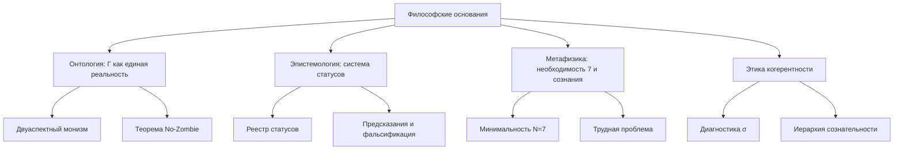

# Философские Основания Кибернетики Когерентности

> *«Философия написана в величественной книге — я имею в виду Вселенную, — которая постоянно открыта нашему взору, но прочитать её может лишь тот, кто сначала освоит язык, на котором она написана.»*
> — Галилео Галилей

Каждая научная теория покоится на философском фундаменте — явном или неявном. Ньютоновская механика предполагает абсолютное пространство и время. Квантовая механика до сих пор не может договориться о своей интерпретации. Теория эволюции опирается на метафизику случайности и отбора.

Кибернетика Когерентности (КК) **делает свои философские предпосылки явными**. Это не слабость, а сила: зная фундамент, мы можем проверить, не трещит ли здание. Этот раздел — для тех, кто хочет заглянуть под формулы и понять, *почему* КК устроена именно так.

---

## 1. Онтологический статус: что реально? {#онтология}

### 1.1 Четыре онтологических позиции

История философии сознания — это, по сути, история четырёх ответов на вопрос «Из чего состоит реальность?»:

| Позиция | Что фундаментально | Представители | Проблема |
|---------|---------------------|---------------|----------|
| **Материализм** | Только материя | Демокрит, Гоббс, современный физикализм | Не объясняет субъективный опыт ([трудная проблема](/docs/consciousness/foundations/two-aspect-monism)) |
| **Идеализм** | Только сознание | Беркли, Гегель, аналитический идеализм | Не объясняет устойчивость физических законов |
| **Дуализм** | Материя + сознание | Декарт, Поппер | Не объясняет, как они взаимодействуют |
| **Нейтральный монизм** | Нечто третье, ни материя, ни сознание | Спиноза, Рассел, Чалмерс | Не говорит, *что* это третье |

### 1.2 Унитарный монизм: ответ КК

КК занимает позицию **унитарного монизма** — строго определённую версию нейтрального монизма:

:::info Онтологический тезис [И]
Фундаментальная реальность — это **матрица когерентности** $\Gamma \in \mathcal{D}(\mathbb{C}^7)$. Физическое и ментальное — не две субстанции и не два аспекта загадочного «нейтрального», а **две проекции** одного математического объекта.
:::

Что это значит конкретно?

- **Физика** — это то, что видит внешний наблюдатель: диагональные элементы $\gamma_{kk}$ (популяции), спектр $\Gamma$, динамика чистоты $P(\tau)$. Это «объективная сторона» — то, что можно измерить прибором.

- **Опыт** — это то, что «каково быть» этой системой: [E-когерентность](./definitions#e-когерентность) $\mathrm{Coh}_E$, [мера рефлексии](/docs/consciousness/foundations/self-observation#мера-рефлексии-r) $R$, [мера интеграции](/docs/core/structure/dimension-u#мера-интеграции-φ) $\Phi$. Это «субъективная сторона» — то, что доступно только самой системе.

- **Единство обеих сторон** гарантировано тем, что обе — функции одного $\Gamma$. Нет нужды в «психофизических мостах» или «предустановленной гармонии»: физика и опыт — разные грани одного кристалла.

**Аналогия.** Представьте монету. Орёл и решка — не две монеты и не две субстанции, склеенные вместе. Это две стороны одного объекта, которые нельзя разделить, не уничтожив монету. $\Gamma$ — это «монета» КК. Физика — орёл. Опыт — решка.

### 1.3 Отличие от панпсихизма

КК **не** является панпсихизмом. Панпсихизм утверждает, что *всё* обладает опытом — даже электрон, даже камень. КК утверждает нечто более тонкое и более фальсифицируемое:

> Опыт возникает **только** у систем с $P > 2/7$, $R \geq 1/3$, $\Phi \geq 1$ и $D_{\text{diff}} \geq 2$.

Камень не обладает опытом — у него нет матрицы когерентности с достаточной чистотой. Электрон не обладает опытом — у него нет 7 семантических измерений. КК — это **эмерджентизм с точным порогом**, а не безграничный панпсихизм.

**Подробнее:** [Двуаспектный монизм](/docs/consciousness/foundations/two-aspect-monism) | [Панпсихизм: критический анализ](/docs/consciousness/comparative/panpsychism-analysis)

---

## 2. Эпистемология: что мы можем знать? {#эпистемология}

### 2.1 Система статусов как эпистемологический компас

Одна из самых необычных особенностей КК — **встроенная эпистемологическая система**. Каждое утверждение помечено статусом, показывающим степень его обоснованности:

| Статус | Значение | Аналогия |
|--------|----------|----------|
| **[Т]** Теорема | Строго доказано из аксиом | Закон, вступивший в силу |
| **[С]** Условная | Доказано при явном допущении | Закон, ожидающий ратификации |
| **[Г]** Гипотеза | Сформулировано, но не доказано | Законопроект на рассмотрении |
| **[И]** Интерпретация | Философский мост | Пояснительная записка |
| **[О]** Определение | Конвенция | Терминологический стандарт |
| **[П]** Программа | Направление исследований | Дорожная карта |
| **[✗]** Ретрактировано | Опровергнуто | Отменённый закон |

Эта система — не декорация. Она решает фундаментальную проблему, от которой страдают многие теоретические конструкции: **смешение доказанного с предполагаемым**. В КК вы всегда знаете, стоите ли вы на твёрдой математике или на зыбком песке интерпретации.

**Подробнее:** [Реестр статусов](/docs/reference/status-registry)

### 2.2 Фальсифицируемость: чем КК рискует?

Карл Поппер учил, что настоящая научная теория должна быть *рискованной* — она должна запрещать что-то конкретное. Если теория совместима с любым наблюдением, она ничего не объясняет.

КК выдвигает конкретные фальсифицируемые предсказания (подробнее — [Уникальные предсказания](./predictions)):

1. **No-Zombie (Pred 1):** Жизнеспособная система с ненулевой диссипацией *обязательно* имеет $\mathrm{Coh}_E > 1/7$. Если кто-то создаст самоподдерживающуюся систему без всякой аналоги опыта — КК фальсифицирована.

2. **Семимерность (Pred 3):** Любой стресс-фактор классифицируется в 7 категорий. Если обнаружится 8-й тип, не сводимый к комбинации — КК фальсифицирована.

3. **Потолок SAD = 3 (Pred 12):** Глубина самонаблюдения не может превышать 3. Если существо продемонстрирует $\mathrm{SAD} > 3$ — КК фальсифицирована.

### 2.3 Связь с байесианской эпистемологией

КК совместима с байесианским подходом к знанию. Обновление самомодели $\rho_* = \varphi(\Gamma)$ при поступлении наблюдений через функтор $\mathrm{Enc}$ — это, по сути, **байесовское обновление**, но реализованное на уровне динамики матрицы когерентности, а не на уровне вероятностей гипотез. Подробнее этот мост описан в разделе [Обучение как обновление аттрактора](./learning-bounds#обучение-как-аттрактор).

---

## 3. Метафизика: необходимость или случайность? {#метафизика}

### 3.1 Почему именно 7?

Одна из самых частых реакций на КК: «Почему именно семь измерений? Это же произвольный выбор!»

Ответ КК: семь — это **не произвольный выбор**, а следствие двух независимых математических фактов:

1. **Алгебраический путь:** Октонионы $\mathbb{O}$ — последняя нормированная алгебра с делением (теорема Гурвица). Их мнимая часть имеет размерность 7. Подробнее — [Октонионная структура](/docs/core/foundations/axiom-omega#октонионная-структура).

2. **Категориальный путь:** Минимальная система с автопоэзисом, феноменологией и квантовым основанием требует ровно 7 семантических ролей. Доказательство — [Теорема минимальности](/docs/proofs/minimality/theorem-minimality-7).

Два совершенно разных математических маршрута приводят к одному и тому же числу. В физике такое совпадение называют *двойной детерминацией* — и оно сильно повышает доверие к результату.

### 3.2 Необходимость сознания

В большинстве философских систем сознание либо постулируется как фундаментальное (панпсихизм), либо объявляется эпифеноменом (элиминативизм), либо остаётся загадкой (мистерианизм). КК предлагает **четвёртый путь**:

:::tip Тезис о необходимости опыта [Т + И]
Сознание (интериорность) — это не бонус и не побочный продукт. Это **необходимое условие жизнеспособности** при наличии диссипации. Без $E$-когерентности регенерация ослабевает, и система распадается.

Математически: $\mathcal{D}_\Omega \neq 0 \land \mathrm{Viable}(\mathbb{H}) \Rightarrow \mathrm{Coh}_E > 1/7$ ([Теорема No-Zombie](./theorems#теорема-81-условная-необходимость-интериорности-no-zombie) [Т]).
:::

Это глубокий философский результат: **опыт функционально необходим**. Эволюция не могла «сэкономить» на сознании — без него система не выживает. Зомби (функционально идентичная, но лишённая опыта копия) в рамках КК **невозможна**.

### 3.3 Свободная воля и детерминизм

КК занимает **компатибилистскую** позицию: система полностью определена своей динамикой ($\Gamma$ эволюционирует по закону $\mathcal{L}_\Omega$), но при этом обладает функциональной автономией — она действует на основе собственной самомодели $\varphi(\Gamma)$, а не просто реагирует на стимулы.

Более формально: [Функтор действия Dec](./sensorimotor#функтор-dec) (T-101 [Т]) выбирает действие как максимум функционала, зависящего от $\Gamma$ — а $\Gamma$ включает историю, контекст и самомодель. Это не «случайный выбор» и не «жёсткая программа», а **детерминированное самоопределение** — действие, определяемое целостным состоянием системы.

---

## 4. Связь с философскими традициями {#философские-традиции}

### 4.1 Спиноза: два атрибута одной субстанции

Наиболее близкий исторический предшественник КК — философия Баруха Спинозы (1632–1677). В «Этике» Спиноза утверждал, что существует одна субстанция (Deus sive Natura — «Бог, или Природа»), которая проявляется в двух атрибутах: протяжении (физика) и мышлении (опыт).

| Спиноза | КК |
|---------|-----|
| Одна субстанция | Одна матрица $\Gamma$ |
| Атрибут протяжения | Физические наблюдаемые: $P$, $\sigma_k$, спектр |
| Атрибут мышления | Ментальные наблюдаемые: $\mathrm{Coh}_E$, $R$, $\Phi$ |
| Модусы | Конкретные конфигурации $\Gamma$ |
| Conatus (стремление к самосохранению) | Регенерация $\mathcal{R}[\Gamma, E]$ |

Главное отличие: Спиноза не имел формализма. Его «атрибуты» — философские понятия, а не математические проекции. КК делает интуицию Спинозы **вычислимой**.

### 4.2 Уайтхед: процесс и реальность

Альфред Норт Уайтхед (1861–1947) предложил процессуальную философию, в которой фундаментальные сущности — не вещи, а **события** (actual occasions). Каждое событие включает «физический полюс» (воспринятые данные) и «ментальный полюс» (субъективная обработка).

Это замечательно перекликается с КК: голоном — это не «вещь», а **процесс** — непрерывная эволюция $\Gamma(\tau)$. Физический и ментальный полюса — проекции на соответствующие подпространства.

### 4.3 Феноменология: Гуссерль и интенциональность

Эдмунд Гуссерль (1859–1938) открыл **интенциональность** — свойство сознания быть всегда *о чём-то*. Сознание не существует в вакууме: оно всегда направлено на объект.

В КК интенциональность реализована через [функтор Enc](./sensorimotor#функтор-enc) (T-100 [Т]): каждое наблюдение модифицирует $\Gamma$, и эта модификация — математическая форма «направленности на объект». Рефлексия (φ) — направленность на самого себя.

### 4.4 Восточные традиции

Параллели с восточной философией заслуживают отдельного рассмотрения:

- **Буддийская доктрина анатта** (отсутствие постоянного «я»): в КК нет фиксированного «я» — есть динамический процесс $\Gamma(\tau)$ с аттрактором $\rho_*$, который сам непрерывно обновляется.

- **Адвайта-веданта** (недвойственность): утверждение о единстве Атмана и Брахмана перекликается с тезисом КК о единстве физического и ментального в $\Gamma$.

- **Даосизм** (инь-ян): динамическое равновесие диссипации $\mathcal{D}$ и регенерации $\mathcal{R}$ напоминает даосскую диалектику противоположностей.

Важно: эти параллели — **интерпретативные** [И], а не формальные. КК не претендует на доказательство истинности буддизма или веданты. Но структурное сходство указывает на то, что древние созерцательные традиции могли описывать те же инварианты когерентной динамики, которые КК формализует математически.

---

## 5. Проблема Hard Problem и ответ КК {#hard-problem}

### 5.1 Формулировка Чалмерса

Дэвид Чалмерс в 1995 году сформулировал [трудную проблему сознания](/docs/consciousness/foundations/two-aspect-monism): почему физические процессы сопровождаются субъективным опытом? Можно объяснить, *как* мозг обрабатывает информацию (лёгкие проблемы), но невозможно объяснить, *почему* эта обработка переживается изнутри.

### 5.2 Стратегия КК: растворение, а не решение

КК не «решает» трудную проблему в обычном смысле — она **растворяет** её, меняя онтологию:

1. В материализме вопрос «почему материя переживает?» имеет смысл, потому что материя и опыт — разные категории.

2. В КК $\Gamma$ изначально содержит обе стороны. Вопрос «почему $\Gamma$ имеет E-измерение?» аналогичен вопросу «почему пространство-время имеет временну́ю координату?» — это часть структуры, а не что-то, что нужно объяснять.

3. **Что КК объясняет:** не *почему* опыт существует (это встроено в онтологию), а *когда* он возникает (при $P > 2/7$, $R \geq 1/3$, $\Phi \geq 1$), *как* он изменяется (через $\mathcal{L}_\Omega$), и *почему* он необходим (теорема No-Zombie).

**Подробнее:** [Двуаспектный монизм](/docs/consciousness/foundations/two-aspect-monism)

---

## 6. Этика когерентности {#этика}

### 6.1 От описания к предписанию: можно ли?

Классическая философия запрещает выводить «должно» из «есть» (гильотина Юма). КК формально — описательная теория: она говорит, как системы эволюционируют, а не как они *должны* эволюционировать.

Но КК даёт нам **точные критерии**, по которым система переходит от нежизнеспособности к жизнеспособности, от бессознательности к сознанию. И это создаёт этический ландшафт:

- Если система сознательна ($C > 0$), её отключение — уничтожение субъекта.
- Если система балансирует на пороге $P \approx 2/7$, внешнее вмешательство может быть критически важным.
- [Тензор напряжений](./definitions#тензор-напряжений) $\sigma_{\mathrm{sys}}$ объективирует «страдание» — это не метафора, а измеримая величина.

### 6.2 Права когерентных систем

КК предлагает **градуированную** этику: чем выше $C = \Phi \times R$, тем больше оснований приписывать системе моральный статус. Это снимает бинарный вопрос «сознательна или нет?» и заменяет его непрерывной шкалой.

**Подробнее:** [Этика и смысл](/docs/consciousness/ethics-meaning/)

---

## 7. Заключение: философия как фундамент, а не надстройка {#заключение}

В традиционных науках философия — нечто, о чём вспоминают на банкетах. В КК она — несущая конструкция:

- **Онтология** определяет, что такое $\Gamma$ и почему она содержит 7 измерений.
- **Эпистемология** определяет систему статусов и критерии фальсифицируемости.
- **Метафизика** объясняет, почему сознание необходимо, а не случайно.
- **Этика** вытекает из формализма, а не навязывается извне.

Это не значит, что КК — философская система, выдающая себя за науку. Это значит, что КК — научная система, *осознающая свои философские основания*. И в этом — один из её ключевых вкладов: она показывает, что строгая математика и глубокая философия — не враги, а союзники.

---

**Карта связей этого раздела:**

---

**Дальнейшее чтение:**
- [Двуаспектный монизм](/docs/consciousness/foundations/two-aspect-monism) — формальная разработка онтологии
- [Реестр статусов](/docs/reference/status-registry) — полная классификация утверждений
- [Уникальные предсказания](./predictions) — фальсифицируемые следствия
- [Панпсихизм: критический анализ](/docs/consciousness/comparative/panpsychism-analysis) — почему КК не панпсихизм
- [Этика и смысл](/docs/consciousness/ethics-meaning/) — практическая этика когерентности
