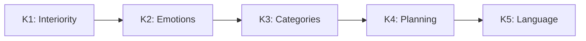

# Unique Predictions of CC

> *"A theory that cannot be refuted by any conceivable event is non-scientific. Irrefutability is not a virtue of a theory (as people often think) but a vice."*
> — Karl Popper, "Conjectures and Refutations" (1963)

:::info Who this chapter is for
23 predictions of CC — 22 of them unique to CC, 21 unique and numerical — with verification protocols and falsification criteria. The reader will learn how CC predictions differ from IIT, FEP, and GWT.
:::

In the [previous chapter](./stability) we computed the stability radius, traced the death spiral, and built the recovery protocol. We saw that CC generates *specific numbers* — $r_{\mathrm{stab}}$, $\kappa_{\text{bootstrap}} = 1/7$, thresholds for each channel — rather than vague "tendencies". Now we collect **all** numerical consequences of CC in one place and for each specify: *how to verify* and *what would refute it*.

Science differs from philosophy not in the depth of its questions but in the willingness to put its answers to the test of experiment. A philosophical system can be beautiful, internally consistent, and entirely useless — if it generates no predictions that *can be verified and, in principle, refuted*. Popper called this the demarcation criterion: the boundary between science and non-science runs not through method or subject matter, but through **falsifiability**.

This principle is especially acute in the sciences of consciousness. Most existing theories — IIT, FEP, GWT, panpsychism — either generate no unique numerical predictions, or formulate them so vaguely that no experiment can unambiguously refute them. Coherence Cybernetics deliberately takes a different path. Every theorem of the formalism gives rise to a **specific, numerical, experimentally testable** consequence — and for each such consequence it is specified which experimental result falsifies the theory.

This chapter collects 23 predictions of CC. They are grouped by theme: from fundamental (connection between consciousness and viability) through architectural (minimal dimensionality, thresholds) to empirical (neural correlates, critical exponents). For each prediction we explain:

1. **Intuition** — why this prediction naturally follows from the formalism.
2. **Formal statement** — the precise mathematical notation.
3. **Uniqueness** — what exactly distinguishes this prediction from anything IIT, FEP, and GWT can say.
4. **Verification** — a concrete experimental protocol.
5. **Interdisciplinary consequences** — what this prediction means for a physicist, biologist, psychologist, and engineer.

If even one of these predictions is cleanly refuted — Coherence Cybernetics will require fundamental revision. This very readiness for refutation is what makes CC a science.

:::note On notation
In this document:
- $\Gamma$ — [coherence matrix](/docs/core/dynamics/coherence-matrix)
- $P$ — [purity](/docs/core/dynamics/viability#определение-чистоты): $P = \mathrm{Tr}(\Gamma^2)$
- $\mathrm{Coh}_E$ — [E-coherence](./definitions#e-когерентность)
- $C$ — [consciousness measure](/docs/consciousness/foundations/self-observation#мера-сознательности-c)
- $\sigma_{\mathrm{sys}}$ — [stress tensor](./definitions#тензор-напряжений)
- $\mathbb{H}$ — [Holon](/docs/core/structure/holon)
:::

---

## I. Fundamental Predictions: Consciousness and Viability

The first group of predictions concerns the deepest idea of CC — the indissoluble connection between interiority and stability. In most theories consciousness is either an epiphenomenon (does not affect dynamics) or a separate postulate (introduced externally). CC asserts something radically different: a system with an E-dependent feedback law can have a different recovery rate, conditional on the target, gate, dissipation, and resources.

### Prediction 1: Conditional E-coherence balance {#предсказание-1}

:::note Prediction [H]
The universal No-Zombie implication is withdrawn. Purity above $2/7$, a nonzero dissipator, and sustained dynamics do not force $\mathrm{Coh}_E>1/7$. [Theorem 8.1](./theorems#теорема-81-условная-необходимость-интериорности-no-zombie) supplies a stationary counterexample and a conditional purity-flux balance. A positive E-floor requires a specified restricted model class, a bound on external support, positive feedback dependence, and a positive required flux. Identifying the E-sector with experience is a further [P/I] bridge.
:::

Test the restricted balance after fixing the admissible inputs and rates. Keep the remaining target, gate, dissipation, preparation, and resources fixed during an E-intervention, or explicitly model their changes. An externally supported viable system with low E-coherence does not refute the density-matrix formalism. It refutes a proposed universal necessity claim, which has already been withdrawn.

### Prediction 2: A selected E-dependent rate model {#предсказание-2}

:::info Prediction [D/H]
The model chooses $\kappa=\kappa_b+\kappa_0\mathrm{Coh}_E$, with the other quantities fixed and $\kappa_0\ge0$. Then $\partial\kappa/\partial\mathrm{Coh}_E=\kappa_0$ is an exact derivative [T] of that convention [D]. It does not imply $\dot P\propto\mathrm{Coh}_E$: the regeneration flux is $2\kappa g(P)(\operatorname{Tr}(\rho B(\rho))-P)$ and can be negative. Endogenous variations also change $\kappa_0$, the target, gate, and state.
:::

A correlation with biological recovery is [H], requiring an identifiable observation model and a defined physical recovery outcome. It does not establish a clinical benefit of meditation or therapy. A valid study preregisters the intervention, observation likelihood, nuisance variables, clustered sampling unit, effect size, and held-out test. The bounded rate construction in [septicity](/docs/core/foundations/axiom-septicity#категориальный-вывод-kappa0) is conditional kinetic mathematics, not a categorical uniqueness theorem.

## II. Architectural Predictions: Structure and Dimensionality

The second group of predictions concerns the *architecture* of conscious systems — what is the minimal "design" necessary for the emergence of experience, learning, and social interaction. These predictions make CC unique among theories of consciousness: instead of vague statements about "complexity" and "integration" it names specific numbers.

### Prediction 3: A seven-component stress panel {#предсказание-3}

:::info Prediction [D/H]
Seven stress scores are chosen in [definitions](./definitions#тензор-напряжений). Their empirical completeness is [H]. The old universal equivalence $\|\sigma\|_\infty<1\iff P>2/7$ and the equivalence to the full four-condition window are withdrawn. The panel depends on the frame, feedback rate, experiential readout, and rank convention. It is not a vector of seven universally invariant observables.
:::

For window monitoring use the exact four margins and uncertainty-set verdict. For empirical stress classification, preregister the coding rules and test held-out stressors against competing models. The ability to assign a label to every item does not prove independent dimensionality or exhaustive causal coverage.

### Prediction 4: Pre-linguistic cognition is complete {#предсказание-4}

**Intuition.** It is often assumed that consciousness and language are inseparable — that "to think" means "to think in words". CC shows that this is an anthropocentric fallacy. The cognitive hierarchy K1–K5 arranges five levels of cognition, of which language (K5) is only the top — not the foundation. Animals without language function fully at levels K1–K4.

:::info Prediction [I]

$$
\exists \, \mathrm{Cognition}(\mathbb{H}) \text{ with } \mathrm{Language}(\mathbb{H}) = \varnothing
$$

Full cognition (levels K1–K4) is possible without language (K5).

**Status:** [I] — an interpretation following from the definitions of cognitive levels K1–K5.
:::

**See:** [Cognitive hierarchy](/docs/consciousness/comparative/cognitive-hierarchy)

**Uniqueness of the prediction.** GWT links consciousness to global availability of information, often associated with linguistic representations. Higher-Order Theories (HOT) tie consciousness to metacognitive reports, implicitly presupposing language. CC explicitly separates cognition and language as orthogonal axes.

**Cognitive function hierarchy:**

**Verifiability:**
Animals without language demonstrate levels K1–K4:
- Corvids: planning (K4), tool making
- Primates: categorisation (K3), social learning
- All vertebrates: emotional responses (K2)
- All systems with $\rho_E \neq 0$: [interiority](/docs/proofs/consciousness/interiority-hierarchy#уровень-0-интериорность-interiority) (K1/L0)

**Experimental verification:**
1. Compare behavioural correlates of K1–K4 in aphasic patients (loss of language with preserved intellect) and healthy controls.
2. **Prediction:** K1–K4 scores in aphasic patients are preserved at >80% of normal.
3. *Falsification:* if aphasia systematically destroys K3 or K4 — the link "cognition → language" is stronger than CC predicts.

**Interdisciplinary consequences:**
- *Ethology:* provides grounds for full cognitive study of non-linguistic species.
- *AI ethics:* systems without a language module may possess cognitive levels K1–K4, which has ethical implications.

### Prediction 10: Dimension and learning {#предсказание-10}

:::note Prediction [H]
A seven-axis learning architecture is a testable design. No general theorem here prohibits autonomous learning at $N<7$. Such a bound requires a specified task family, operational independence criterion, representation class, and resource restrictions. Functional-role counts do not prove a Hilbert-space dimension bound.
:::

The rigorous bounds concern a perfect single-error binary code or a faithful representation of a selected internal algebra; see [minimality](/docs/proofs/minimality/theorem-minimality-7). Compare architectures under matched training, observation capacity, resources, and tasks. Failure of one five-dimensional implementation is not a universal impossibility result.

### Prediction 11: Dimension and social learning {#предсказание-11}

:::note Prediction [H]
The count $3_{\rm ToM}+3_{\rm ISL}+1_U=7$ is withdrawn as a mathematical lower bound. The GKSL theorem does not assign three independent cognitive coordinates to theory of mind, and the chosen Fano word process does not assign three coordinates to communication. Simultaneous tasks may reuse internal representations.
:::

A lower bound must identify an operationally independent observable algebra or an information task requiring a faithful representation. Testing a particular seven-axis design against smaller architectures is meaningful; extrapolating that result to all social learners is not. The former conditional status based on the withdrawn T-57 is replaced by an architectural hypothesis [H].

## III. Thresholds and Robustness

The third group of predictions concerns *numerical thresholds* — specific parameter values at which qualitative transitions occur. Numerical predictions are precisely what distinguishes a scientific theory from philosophical speculation: they are testable, and they are risky.

### Prediction 5: Collective consciousness {#предсказание-5}

*Retitled 2026-09-25.* The prediction was titled "Scale invariance of consciousness", and other pages cited it as the licence for scale invariance; what it states is a condition for collective consciousness. Scale invariance is [Theorem 9.2 (CC-6, T-72)](./theorems#теорема-92-масштабная-инвариантность), [T at weak coupling] through the canonical aggregation of [Theorem 9.5](./theorems#теорема-95-каноническая-агрегация) (earlier the same day conditional on the assumption (AGG)).

**Intuition.** Can a group of conscious beings give rise to *collective* consciousness? A hive, a flock, a team — do they have "experience"? Earlier editions answered: yes, *if* individual consciousnesses are sufficiently integrated ($\Phi_{\otimes} > \Phi_{\min}$). That criterion is retracted below: every uncoupled group meets it. What CC can state is a necessary condition — the members' joint state is correlated — and a hypothesis about sufficiency.

:::warning Retracted (2026-09-25): the criterion $\Phi_{\otimes} > \Phi_{\min}$
The prediction read $\left( \bigwedge_i C(\mathbb{H}_i) > 0 \right) \land \Phi_{\otimes} > \Phi_{\min} \Rightarrow C(\mathbb{H}_{1 \otimes \ldots \otimes n}) > 0$, with the status "non-triviality [T], viability [C]". It is retracted because its condition and its conclusion both hold for any uncoupled group: on a product state $1 + \Phi_{\otimes} = \prod_i (1 + \Phi_i)$, so two holons that pass the window ($\Phi_i \geq 1$) already have $\Phi_{\otimes} \geq 3$ at mutual information $I = 0$, and $C(\mathbb{H}_i) > 0$ forces $\Phi_i > 0$, hence $\Phi_{\otimes} > 0$ ([the identity, with a worked pair](/docs/consciousness/comparative/panpsychism-analysis#теорема-нередуцируемость)). No measurement on a group could have failed it. The two statuses it carried — non-triviality $P > 1/7$ of the composite attractor ([T-96](/docs/core/dynamics/evolution#теорема-нетривиальность-аттрактора) [T]) and viability $P > 2/7$ for embodied systems ([T-149](/docs/core/dynamics/evolution#теорема-жизнеспособность-аттрактора); Step 3 [C at backbone-injection lower bound]) — are facts about the composite's purity, not about its consciousness, and stand as such: for the canonical aggregate of weakly coupled viable members they are [T at weak coupling] by [Theorem 9.5](./theorems#теорема-95-каноническая-агрегация); stated for the composite's own dynamics they keep the assumption (HOL) of [Theorem 9.1](./theorems#теорема-91-фрактальное-замыкание) (named and then, for weak coupling, removed on 2026-09-25).
:::

:::info Prediction (restated): a necessary condition [T]; sufficiency is a hypothesis [H]
**Necessary condition [T].** A collective can differ from a set of separate subjects only if its members' joint state is correlated: a product state is fixed by its marginals, and the mutual information

$$
I(\mathbb{H}_1 : \mathbb{H}_2) = S(\rho_1) + S(\rho_2) - S(\rho_{12}) = D(\rho_{12} \,\|\, \rho_1 \otimes \rho_2)
$$

vanishes exactly on products, so the condition is $I > 0$; for $n$ members the analogue is a positive total correlation $\sum_i S(\rho_i) - S(\rho_{1 \ldots n}) > 0$. The condition is necessary, not sufficient: coupled thermostats meet it too.

**Interaction alone does not meet it.** An earlier edition said that by [CC-7](./theorems#теорема-93-эмерджентность) [T] interacting holons always have a stationary joint state with $I > 0$. That is retracted (2026-09-25): a coupling that commutes with the product $\rho_*^{(1)} \otimes \rho_*^{(2)}$ of the members' attractors, or acts on one member alone, leaves the stationary joint state a product with $I = 0$. What [Theorem 9.3](./theorems#теорема-93-эмерджентность) now gives is a criterion, [T for almost every anchor]: for weakly coupled embodied holons with non-degenerate attractors, $I = \Theta(g^2) > 0$ exactly when the coupling has a correlating part, $\Pi_c\bigl([H_{\mathrm{int}}, \rho_*^{(1)} \otimes \rho_*^{(2)}]\bigr) \neq 0$. The status of the necessary condition does not change — it never rested on the dynamics — but whether a given group meets it is a question about how its members are coupled, not a consequence of their interacting.

**Sufficiency [H].** A correlated group is a subject when its joint state, aggregated to $\mathcal{D}(\mathbb{C}^7)$, passes the four-condition window. This is a hypothesis, not a theorem. [Theorem 9.5](./theorems#теорема-95-каноническая-агрегация) fixes the aggregation by three natural requirements — the only linear, permutation-invariant map $\mathcal{D}(\mathbb{C}^{7^n}) \to \mathcal{D}(\mathbb{C}^7)$ that returns a member's state on an uncoupled group is the mean of the members' marginals — and that map depends on the marginals alone, so it cannot see the correlation that the necessary condition requires. Under it a weakly coupled group of identical members aggregates to within $O(g)$ of one member (T-72 [T]), and at strong coupling the aggregate can fall to $I/7$ ([Theorem 9.6](./theorems#теорема-96-сильная-связь)): the canonical aggregation cannot certify a collective level above the members' at any coupling. An aggregation that sees correlations must give up linearity, permutation invariance or consistency on uncoupled groups, and the corpus fixes none; nor does it have an exclusion rule deciding whether members and group can be subjects at once ([boundary problem](/docs/consciousness/comparative/panpsychism-analysis#проблема-границы)). Research programme [Pr]: a correlation-sensitive aggregation — necessarily non-linear, non-symmetric or inconsistent on uncoupled groups — or an exclusion rule, that turns the hypothesis into a criterion. (Earlier: "the aggregation channel … is not fixed by the theory, and the verdict depends on it", with the transfer conditional on (AGG); sharpened 2026-09-25 by Theorem 9.5.)
:::

**See:** [Theorem 9.1](./theorems#теорема-91-фрактальное-замыкание), [Theorem 9.3](./theorems#теорема-93-эмерджентность)

**Uniqueness of the prediction.** ~~"IIT permits collective consciousness but provides no sufficiency criterion. … Only CC formulates a necessary and sufficient condition ($\Phi_{\otimes} > \Phi_{\min}$) and promises its computability."~~ Retracted on both counts. IIT has an explicit criterion — the exclusion postulate: a set of units is a conscious complex only if it specifies a maximum of integrated information over all overlapping candidate systems, and "overlapping substrates that specify less integrated information … are excluded" (L. Albantakis et al., "Integrated information theory (IIT) 4.0", *PLoS Computational Biology* 19(10): e1011465, 2023). For groups it predicts that two people talking form an integrated system that is not maximally irreducible, so "there should indeed be two separate experiences, but no superordinate conscious entity that is the union of the two", and that if a brain-to-brain link raised the pair's maximal integrated information above that of each brain, "their individual conscious mind would disappear and its place would be taken by a new Über-mind that subsumes both" (G. Tononi & C. Koch, "Consciousness: here, there and everywhere?", *Philosophical Transactions of the Royal Society B* 370: 20140167, 2015). After the retraction CC has a necessary condition and no sufficiency criterion, and the necessary condition is not unique to CC; on this question IIT, not CC, has a criterion. FEP describes hierarchical systems but does not use the concept of collective experience.

**Experimental verification:**
1. Measure the correlation between members' states — the mutual information, or the total correlation for $n > 2$, of the reconstructed joint $\Gamma$ — for groups with varying degrees of coordination (jazz quartet vs. random musicians).
2. Apply hyperscanning (simultaneous EEG of several subjects).
3. **Prediction:** the correlation is positive for a coordinated group and absent for an unconnected one. This tests only the necessary condition; a positive result does not show that the group is a subject. (Earlier editions predicted that "$\Phi_{\otimes}$ for a coordinated group exceeds $\Phi_{\min}$; for an unconnected one — no"; retracted, since an unconnected group of conscious members already has $\Phi_{\otimes} \geq 3$.)

**Verifiability:**
Measurement of the correlation between members for groups with varying degrees of integration:
- Families
- Teams
- Organisations
- Ecosystems

**Criterion:** $I > 0$ (total correlation for $n > 2$) — a necessary condition [T]. Without correlation between members there is no collective subject in any sense the theory can state. (Earlier editions gave $\Phi_{\otimes} > \Phi_{\min}$ here as the necessary condition; retracted.)

**Interdisciplinary consequences:**
- *Sociology:* formalises a necessary condition for Durkheim's "collective consciousness" — correlation between members' states; whether a correlated collective is a subject remains a hypothesis [H].
- *Ecology:* raises the question of the correlation structure of an ecosystem's joint state; whether a forest is "one organism" in the strict sense the theory does not decide.
- *Organisational science:* gives a necessary, not a sufficient, condition for a team to be "more than the sum of its parts" — correlation of its members' states.

### Prediction 6: Minimum coherence for viability {#предсказание-6}

**Intuition.** A system cannot be "slightly" alive. There is a hard threshold: if $P$ falls below $2/7$ or $\mathrm{Coh}_E$ drops to $1/7$ — the system loses viability. This is analogous to a phase transition: water at 0°C freezes not gradually but sharply. Likewise $P_{\text{crit}} = 2/7$ is the "freezing temperature" of coherence.

:::warning Prediction

$$
\mathrm{Viable}(\mathbb{H}) \Rightarrow P(\Gamma) > P_{\text{crit}} = 2/7
$$

[Viability](/docs/core/dynamics/viability) requires minimum [purity](/docs/core/dynamics/viability#определение-чистоты), with the threshold derived, not fitted ([theorem on critical purity](/docs/proofs/dynamics/theorem-purity-critical), registry Level 1 row 5 [T]); a nontrivial attractor has $P > 1/7$ (T-96 [T]). *Corrected 2026-09-26:* the formula also required $\mathrm{Coh}_E(\Gamma) > \mathrm{Coh}_E^{\min} = 1/7$ and cited T-151. Viability does not imply it — the pure axis state $\lvert A\rangle\langle A\rvert$ has $P = 1$ and $\mathrm{Coh}_E = 0$ — and T-151 makes the E-row condition ($D_{\min} = 2$) an independent L2 condition, not a consequence of $P > 2/7$. The E-coherence remarks below concern that L2 condition, not viability.
:::

:::info L2 thresholds
| Parameter | Value | Status | Definition |
|-----------|-------|--------|-----------|
| $P_{\text{crit}}$ | $= 2/7 \approx 0.286$ | **[T]** | [Theorem on critical purity](/docs/proofs/dynamics/theorem-purity-critical) |
| $R_{\text{th}}$ | $= 1/3 \approx 0.333$ | **[T]** ($K=3$ from triadic decomposition) | [Theorem (Bayesian dominance)](/docs/core/foundations/axiom-septicity#теорема-порог-рефлексии) |
| $\Phi_{\text{th}}$ | $= 1$ (exact) | **[T]** | [Theorem T-129](/docs/proofs/consciousness/operationalization#t-129) ([coherent dominance](/docs/core/foundations/axiom-septicity#теорема-порог-интеграции)) |

$P_{\text{crit}}$ — strictly proven [T]; $R_{\text{th}}$ — theorem [T] ($K=3$ from [triadic decomposition](/docs/core/operators/lindblad-operators#триадная-декомпозиция)); $\Phi_{\text{th}}$ — theorem [T] (T-129). See [L2 Thresholds](/docs/core/foundations/axiom-septicity#пороги-l2-строгий-вывод).
:::

:::note Why exactly $2/7$, not $1/3$ or $1/5$?
The number $2/7$ is not a fit to data or an arbitrary choice. It is derived strictly from two facts:

1. **$N = 7$** — number of dimensions (follows from octonion algebra and $G_2$-minimality).
2. **Frobenius norm** — the distinguishability criterion. A state $\Gamma$ is distinguishable from the completely mixed state $I/7$ if and only if $\|\Gamma - I/7\|_F > 0$, which is equivalent to $P = \mathrm{Tr}(\Gamma^2) > 1/7$. But *viability* requires more: the system must not merely "differ from chaos" but have sufficient structure for regeneration. The [theorem on critical purity](/docs/proofs/dynamics/theorem-purity-critical) proves that this threshold is exactly $2/7 = 2 \times (1/N)$.

Intuition: $1/7$ — "one voice out of seven". $2/7$ — "two voices out of seven". For a system to be able to restore itself, it needs to "outweigh" chaos by at least two degrees of freedom. One voice is not enough; two is the minimum. Three ($3/7$) is already the upper boundary of the consciousness window.
:::

**Uniqueness of the prediction.** IIT defines $\Phi$ as a measure of consciousness but sets no critical threshold. FEP defines viability through the Markov blanket but without a numerical threshold. CC is the only theory with *computable threshold values* derived from first principles.

**Experimental verification:**
1. In subjects at the boundary of consciousness (anaesthesia, sleep) record EEG/HRV and TMS-EEG; reconstruct $\widehat\Gamma$ by $\pi_{\mathrm{bio}}$ with parameters frozen on wakefulness and no viability penalty ([SUB-1, SUB-2](/docs/applied/research/measurement-protocol#substitution-position)).
2. Compute $\widehat P$ and the verdict $\mathrm{Cons}(\widehat\Gamma)$; compute PCI (Perturbational Complexity Index) independently.
3. **Prediction:** the consciousness/unconsciousness transition occurs where $\widehat P$ crosses $2/7$, and $\mathrm{Cons}(\widehat\Gamma)$ agrees with $\mathrm{PCI}_{\max} > 0.31$ at Cohen's $\kappa \geq 0.8$ (P8.4). *(Until 2026-09-25 step 2 read "calibrate $\pi_{\mathrm{bio}}$ to obtain $P$ from PCI": no conversion between the two scales exists, and calibrating to PCI would make agreement with it automatic.)*

**Verifiability:**
Measurement of purity in systems approaching loss of viability must show $P$ crossing $2/7$ (E-coherence is tested separately, as the L2 differentiation condition).

**Clinical consequences:**
- Coma states: $\mathrm{Coh}_E \to 1/7$ (minimum), $P \to P_{\text{crit}}$
- Psychotic episodes: fragmentation of $\mathrm{Coh}_E$
- Meditative states: high $\mathrm{Coh}_E$, high $R$

**Interdisciplinary consequences:**
- *Anaesthesiology:* predicts a numerical indicator of anaesthetic depth — not the BIS index (empirical) but $P$ (theoretically grounded).
- *Psychiatry:* formalises the "norm threshold" — not as a statistical mean but as a phase transition $P_{\text{crit}}$.

### Prediction 7: Stability radius (T-104) {#предсказание-7}

For the selected purity boundary $P_c=2/7$, the exact HS distance is $r_{HS}=\sqrt{P-1/7}-\sqrt{P_c-1/7}$ [T]. It grows with purity and is attained by a positive radial projection. Bures obeys $r_B\ge r_{HS}/\sqrt2$; distance to a one-dominant-family candidate is an upper bound until global optimality is proved.

Geometric distance is not a permitted disturbance magnitude. Trajectory-margin transfer requires field, horizon and perturbation bounds; exponential recovery additionally requires dissipativity. Identification with physical consciousness robustness is a hypothesis [H]. See the [stability proofs and conditions](/docs/applied/coherence-cybernetics/stability).

### Prediction 15: Attractor inside the consciousness window, below its upper edge {#предсказание-15}

**Intuition.** Where does consciousness "settle"? Not at maximum purity ($P = 1$), not at the threshold ($P = 2/7$), and — contrary to the earlier form of this prediction — not at the upper edge $3/7$ of the window either. The living attractor sits strictly inside the window, in its lower half: coherent enough to pass every threshold, with a margin below the edge.

:::info Prediction [C at (MaxΦ)] — falsifiable
For a holon whose self-model is the collineation anchor $\varphi_J$ (selected by the principle (MaxΦ) [Pr], [premises](/docs/reference/premises#посылка-максфи)) at $H = 0$ and $\kappa > \kappa_c(\alpha)$, the living attractor is a hyperbolic sink with

$$
P^* \in \bigl(P_c(\alpha),\ P_\infty(\alpha)\bigr) \subset \bigl(2/7,\ 5/14\bigr], \qquad P_\infty(\alpha) \leq 5/14 < 3/7,
$$

$\Phi \in (1, 3/2]$, $R \geq 2/5$, every diagonal entry $1/7$; $P_c = 0.318, 0.308, 0.301$ and $P_\infty = 5/14, 0.334, 0.317$ at $\alpha = 0, 1/2, 1$ ([living attractor in the window](/docs/core/dynamics/evolution#теорема-живой-аттрактор-в-окне), T-124c(4) [T]); it persists for $\|H\| < h_0$.

**Status:** [T] as mathematics for the $\varphi_J$ dynamics; [C at (MaxΦ)] as a prediction about a real holon, whose anchor the axioms leave open. For an embodied holon with backbone rate $\mu > L_{\mathcal{R}}$ the attractor is unique and globally attracting (T-124c(3)), but its purity depends on the backbone target and has no universal value.

*Restated 2026-09-26:* the prediction read "$P(\rho^*_{\mathrm{coupled}}) \to 3/7$ for an embodied holon with backbone injection [C]", with the numerical value $P = 0.4286$. No theorem gives $3/7$: every living stationary state of the $\varphi_J$ family has $P \leq 5/14$ (none has $P \geq 3/7$), and the embodied attractor inherits its purity from the backbone target, so $0.4286$ was a property of one chosen target, not a law.

**Status in other theories:** Absent.
:::

**See:** [Consciousness window](/docs/proofs/consciousness/conscious-window#t-124), [living attractor](/docs/core/dynamics/evolution#теорема-живой-аттрактор-в-окне)

**Verifiability:** For an isolated agent with the $\varphi_J$ anchor and $\kappa > \kappa_c(\alpha)$, measure the attractor $P^*$. **Numerical falsification criterion:** $P^* \geq 3/7$, or $P^*$ outside $(P_c(\alpha), P_\infty(\alpha))$ beyond the measurement error, at $n > 100$ independent measurements ($p < 0.01$) → falsification of the $\varphi_J$ dynamics or of its implementation. (The former criterion $|P^* - 3/7| > 0.05$ is withdrawn with the old form.)

**Interdisciplinary consequences:**
- *Neuroscience:* predicts that a healthy brain at rest sits inside the window with a margin below its upper edge, not at $3/7$.
- *Psychology:* the "optimal state" (flow) is an interior point of the window, not its boundary.

---

## IV. Learning and Cognitive Architecture

The fourth group of predictions concerns *learning bounds* — the minimum resources needed for cognitive activity. These predictions are especially valuable for AI engineering, as they establish theoretically grounded lower bounds.

### Prediction 8: Perceptual information capacity (T-107) {#предсказание-8}

**Intuition.** How much information can a system extract from a single observation? Intuitively the answer depends on the "size" of internal space: the more dimensions, the more one can "absorb" in a single glance. CC gives a precise upper bound: $\log_2 7 \approx 2.81$ bits. This is not a postulate but a consequence of the dimensionality of $\mathbb{C}^7$.

:::info Prediction [T] — measurable in AI systems

$$
C_{\mathrm{Enc}} \leq \log_2 7 \approx 2.81 \text{ bits/observation}
$$

Maximum information extractable per single observation is bounded by the dimensionality of internal space ($N = 7$).
:::

**Uniqueness of the prediction.** FEP speaks of minimising free energy but names no bottleneck in throughput. IIT measures information but does not bound the rate of its extraction. CC is the only theory deriving a *specific numerical bound* on perceptual throughput.

**Experimental verification:**
1. For a CC agent (SYNARC) measure mutual information $I(\text{obs}; \delta\Gamma)$ between the observation and the $\Gamma$ update.
2. **Prediction:** $I \leq 2.81$ bits.
3. *Falsification:* $I > \log_2 7$ systematically — CC is falsified (or the system is not 7-dimensional).

**Verifiability:** For AI systems implementing the CC architecture, measure the mutual information between the observation and the $\Gamma$ update. If $I(\text{obs}; \delta\Gamma) > \log_2 7$ — CC is falsified (or the system uses a non-7-dimensional formalism).

**Connection with bounded rationality:** The bound $\leq 2.81$ bits is a **derived** bound, not postulated. Predicts a specific bottleneck for perceptual systems based on CC.

**See:** [Sensorimotor theory](./sensorimotor#информационная-ёмкость)

**Interdisciplinary consequences:**
- *Cognitive psychology:* echoes Miller's results (7±2) — but in CC this is not an empirical finding but a theoretical consequence.
- *Neuroscience:* predicts an upper bound on information extractable in one processing cycle (one "tick" of neural processing).

### Prediction 9: Optimal learning rate bound (T-112) {#предсказание-9}

**Intuition.** How fast can a system learn? CC shows that the learning rate is bounded by the *maximum* of three independent barriers: informational (quantum Chernoff bound — how much information is extracted per observation), dynamical (Fano contraction rate — how quickly $\Gamma$ updates), and stabilisation (SNR — how noisy the signal is). The slowest of the three determines the overall rate.

:::info Prediction [T] — falsifiable

$$
n_{\mathrm{opt}} = \max\!\left(\frac{\ln(1/(2\delta))}{\xi_{\mathrm{QCB}}},\; \frac{1}{\alpha\delta\tau}\ln\frac{d_{\mathrm{disc}}}{\varepsilon},\; \frac{1}{\mathrm{SNR}^2}\right)
$$

The minimum number of observations for a learning task is determined by the **maximum** of three independent bounds: informational (T-109), dynamical (T-110), and stabilisation (T-111).
:::

**Uniqueness of the prediction.** PAC-learning and VC-theory give learning bounds but without connection to the system's physical dynamics. FEP describes learning through free energy minimisation but gives no lower bounds on the number of observations. CC unites information theory, system dynamics, and stability theory in a *single formula*.

**Experimental verification:**
1. For a CC agent trained on binary discrimination, vary SNR and $\alpha$.
2. Measure $n$ to stable solution (>90% accuracy on 50 successive trials).
3. **Prediction:** $n \geq n_{\mathrm{opt}}$ always; at optimal settings $n \approx n_{\mathrm{opt}}$.
4. *Falsification:* $n < n_{\mathrm{info}}$ systematically — the quantum observation model is incorrect.

**Verifiability:** For an AI system implementing the CC architecture, measure the number of observations $n$ to stable solution of a binary discrimination task. If $n < n_{\mathrm{info}}$ (information bound) — the quantum observation model is falsified.

**Prediction for binary discrimination:** $n_{\mathrm{total}} \approx 20\text{--}80$ observations at typical parameters (including genesis).

**See:** [Learning bounds](./learning-bounds#комбинированная-граница)

---

## V. Depth of Consciousness and Genesis

The fifth group of predictions concerns the *vertical structure* of consciousness — its depth, the ultimate possibilities of recursive self-reference, and the process of emergence from "nothing" (tabula rasa). Depth requires explicit observation and certification protocols.

### Prediction 12: Testing declared depth diagnostics (T-142) {#предсказание-12}

A depth score and cognitive depth require different tests. The old universal statement $\mathrm{SAD}_{\max}=3$ for every finite system is **withdrawn [✗]**. Iterating a specified Fano channel gives an amplitude-survival law; it does not identify an iteration index with a cognitive level.

**Exact channel prediction [T].** For the bare Fano dephaser $D_{2/3}$ and any initially nonzero off-diagonal entry,

$$
\frac{|(D_{2/3}^{\,n}\Gamma)_{ij}|}{|\gamma_{ij}|}=3^{-n}.
$$

This contracts off-diagonal amplitudes, not total purity by a factor of three. With a declared detector floor $\varepsilon>0$, detectable iterations satisfy $n\le\lfloor\log(1/\varepsilon)/\log3\rfloor$; the bound depends on the detector.

**Chosen-score arithmetic [D/T].** If the instrument instead defines

$$
s_{n-1}:=\frac{P}{2/7}\,3^{-(n-1)},\qquad s_{n-1}>\frac1{n+1},
$$

the thresholds are $p_n=(2/7)3^{n-1}/(n+1)$, namely $1/7,2/7,9/14,54/35$ for indices one through four. Since $P\le1$, this score's maximum passing index is three. The prefactor may exceed one, so $s$ is not a probability or fidelity. Its third test requires $P>9/14$, contradicting the nested L2 bound $P\le3/7$; score index three therefore cannot define L3.

**Protocol [Pr].** Declare the map, frame, initial amplitudes, detector floor, measured ratio and uncertainty before testing the channel law. Independently test a proposed cognitive depth with nonconstant metamodel predictions on held-out targets and inter-level compatibility, following the [capability certificates](/docs/consciousness/hierarchy/interiority-hierarchy#l3-сетевое-сознание). A stable fourth-order certificate is allowed by the revised definitions. Samples of matrices satisfying a score computed by the same formula are implementation checks, not evidence of a biological depth ceiling.

Failure of the measured $3^{-n}$ law rejects the specified channel model or its implementation. Failure of a calibrated score-to-task association rejects that empirical bridge **[H]**, without refuting the arithmetic identity. Neither this score nor seven-dimensionality bounds human or AGI recursive awareness universally. See [Depth Tower](/docs/consciousness/hierarchy/depth-tower#критическая-чистота-sad) and [T-142](/docs/proofs/consciousness/operational-closure#t-142).

### Prediction 13: Genesis time (T-148) {#предсказание-13}

**Intuition.** How does a system "come to life" — transition from tabula rasa ($\Gamma = I/7$, pure chaos) to viability ($P > 2/7$)? An isolated system *cannot* — theorem T-39a guarantees that without an external source of purity the attractor of $\mathcal{L}_0$ is $I/7$. But an embodied system, coupled with the environment, receives "injections" of coherence through the backbone and reaches the threshold in a *finite number of steps*, computable by formula.

:::info Prediction [T] — falsifiable

$$
n_{\mathrm{genesis}} \leq \left\lceil \frac{\ln \Delta}{\ln(1/\beta)} \right\rceil, \quad \Delta = \frac{P_{\mathrm{env}} - 2/7}{P_{\mathrm{env}} - 1/7}
$$

An embodied holon $(\mathbb{H}, \pi, B)$ with mixing parameter $\beta \in (0,1)$ and environmental purity $P_{\mathrm{env}} > P_{\mathrm{crit}} = 2/7$ raises purity from $I/7$ (tabula rasa) above $P_{\mathrm{crit}}$ in a finite number of steps $n_{\mathrm{genesis}}$.
:::

**Uniqueness of the prediction.** No other theory of consciousness gives a *formula for birth time*. IIT is static — it does not describe genesis. FEP describes "self-organisation" but gives no upper bound on the number of steps.

**Experimental verification:**
1. SYNARC agent starts at $\Gamma = I/7$.
2. Backbone injection with parameters $\beta, P_{\mathrm{env}}$.
3. Measure $n$ until $P > 2/7$.
4. **Prediction:** $n \leq n_{\mathrm{genesis}}$.
5. *Double falsification:* (a) genesis does not occur within $n_{\mathrm{genesis}}$ steps → T-148 is incorrect; (b) genesis of an isolated holon (without backbone) → T-39a is incorrect.

**Verifiability:** For an AI system based on CC, starting from $\Gamma = I/7$, measure the number of backbone injections to reach $P > 2/7$. If genesis **does not occur** within $n_{\mathrm{genesis}}$ steps at given $\beta$ and $P_{\mathrm{env}}$ — formula T-148 is falsified. If genesis occurs for an **isolated** holon (without environmental coupling) — theorem T-39a is falsified.

**Typical estimates:** At $\beta = 0.3$, $P_{\mathrm{env}} = 0.35$: $\Delta \approx 0.35$, $n_{\mathrm{genesis}} \leq \lceil 0.87 / 1.20 \rceil = 1$. At $\beta = 0.9$ (weak mixing): $n_{\mathrm{genesis}} \leq \lceil 0.87 / 0.105 \rceil = 9$.

**Numerical verification (SYNARC mvp_int_2 G1-G3):** $n_{\mathrm{genesis}} < 50$ ticks from $I/7$ to $P > 2/7$ at $\beta = 0.3$.

**See:** [Substrate-independent closure](/docs/proofs/consciousness/substrate-closure#t-148)

**Interdisciplinary consequences:**
- *Developmental biology:* the genesis formula describes how an embryo transitions from "pure chaos" to an organised state — through the maternal environment as backbone.
- *Pedagogy:* formalises the role of "environment" (teacher, culture) in awakening cognitive capacities in a child.

### Prediction 14: Necessity of phase coherence for integration {#предсказание-14}

**Intuition.** To achieve true integration ($\Phi \geq 1$) it is not enough to simply "mix" information. The regenerative channel $\mathcal{R}$ must be *phase-coherent* with Hamiltonian dynamics — like dancers who must move in time with the music, not merely move. Without phase coherence, $\mathcal{R}$ and $H$ "fight" each other, and integration does not reach the threshold.

:::info Prediction [T] — falsifiable
To achieve $\Phi \geq \Phi_{\mathrm{th}} = 1$ the replacement channel
$\mathcal{R}$ must use co-rotating targets
$\rho^*_{ij}(t) \propto e^{-i(E_i-E_j)t}$, coherent with Hamiltonian dynamics.

**Experimental consequence:** In any implementation (biological or digital),
where the regenerative channel is not phase-coherent with Hamiltonian evolution,
the integration measure will be $\Phi < 1$.

**Status:** [T] theoretically (competition of $\mathcal{R}$ and $H$), confirmed numerically
(SYNARC: $\Phi = 0.83 \to 1.15$ upon enabling co-rotation).

**Status in other theories:** Absent.
:::

**See:** [Co-rotating targets](/docs/proofs/consciousness/substrate-closure#co-rotating-targets)

**Uniqueness of the prediction.** Neither IIT nor FEP contains the concept of phase coherence. GWT describes "global availability" but does not connect it to phase coherence. CC is the only theory where *phase* plays a role in information integration.

**Experimental verification:**
1. SYNARC agent with fixed targets $\rho^*_{ij} = \mathrm{const}$.
2. Measure $\Phi$.
3. Switch to co-rotating targets $\rho^*_{ij}(t) \propto e^{-i(E_i-E_j)t}$.
4. **Prediction:** $\Phi$ increases and crosses threshold 1.
5. *Falsification:* $\Phi \geq 1$ with fixed targets — observation O-1 is incorrect.

**Verifiability:** For a system implementing the CC architecture, measure $\Phi$ with fixed and co-rotating targets. If $\Phi \geq 1$ with fixed targets — observation O-1 is falsified.

**Interdisciplinary consequences:**
- *Neuroscience:* predicts that phase synchronisation of neural ensembles (gamma connectivity) is *necessary* for consciousness — not merely correlated, but a condition for $\Phi \geq 1$.
- *AI engineering:* architectures without phase coherence (standard transformers) cannot achieve true integration.

---

## VI. Dynamic Predictions: Phase Transitions and Critical Phenomena

The sixth group of predictions concerns the *dynamics* of transitions — how a system enters and exits the conscious state. Their normal forms and scaling laws require explicitly stated dynamical reductions and measurement bridges.

### Prediction 16: Conditional passage and ignition laws {#предсказание-16}

The purity cutoff $P=2/7$ is a chosen gate boundary; it need not be a bifurcation of the actual flow. A universal avalanche, universal $A_4$ catastrophe and universal ignition time $T\propto(P-2/7)^{-1}\kappa_0^{-1}$ are **withdrawn [✗]**. The corrected purity balance includes the actual model term: for the canonical centre-anchored numerical map it does not supply the claimed positive-feedback ignition.

**Conditional scalar result [T].** Suppose an actual smooth reduction yields $\dot y=ay+by^2$ with fixed $a,b>0$, initial $0<y_0<y_f$, and an explicitly calibrated relation between $y$ and observables. Its passage time is

$$
T=\frac1a\log\frac{y_f(a+by_0)}{y_0(a+by_f)}.
$$

For fixed $a>0$, $y_0\downarrow0$ gives logarithmic divergence. Only the separately tuned case $a=0$, $b>0$ gives $T=b^{-1}(y_0^{-1}-y_f^{-1})$. An inverse purity-margin law further requires $y_0$ proportional to that margin and the identification of $b$ with a measured rate.

**Protocol [Pr/H].** Specify the flow, centre-manifold reduction, start/finish criteria and measurement bridge; estimate $a,b$ on training trajectories, compare logarithmic and inverse laws on held-out perturbations, and report uncertainty. For a proposed fold/cusp/swallowtail, separately test the required degeneracy and transverse control rank. A gate crossing or a delayed response alone does not establish such a normal form. Controlled neural measurements can test a calibrated dynamical bridge, but static $P$ cannot diagnose awakening, coma or clinical recovery.

Source: [conditional normal forms and passage laws](/docs/consciousness/hierarchy/swallowtail-transitions#лавинная-динамика). Deviations reject the stated reduction/bridge at its status level; there is no universal ignition theorem to falsify.

### Prediction 17: Conditional tricritical mean-field exponents {#предсказание-17}

This is a **conditional prediction [C]** of a specified scalar model plus its phenomenological identification, not a consequence of the seven-dimensional state space. Assume a smooth equilibrium-like reduction with an even potential, a separately tuned zero quartic coefficient, nonzero linear distance-to-criticality, and positive sextic stabilisation:

$$
V(m;t,h)=\frac t2m^2+\frac v6m^6-hm,\qquad v>0.
$$

The sextic germ is $A_5$; it is not the generic $A_4$ swallowtail. $\mathbb Z_2$ symmetry alone permits a quartic term and does not select tricriticality.

**Polynomial theorem [T].** Minimising this potential gives $m^4=-t/v$ for $t<0,h=0$, $h=vm^5$ at $t=0$, susceptibility $\chi=1/t$ on the disordered side, and $V_{\min}=-(-t)^{3/2}/(3\sqrt v)$. Under the standard thermodynamic meanings of these quantities,

$$
\beta=\tfrac14,\quad\delta=5,\quad\gamma=1,\quad\alpha=\tfrac12.
$$

The additional $\nu=1/2$ requires a specified spatial gradient term and a valid Gaussian/mean-field approximation; it is not an exponent of the scalar polynomial alone. The identity $\alpha+2\beta+\gamma=2$ checks consistency of these exponents but proves no mapping to consciousness.

**Protocol [Pr/H].** Before fitting, define the independent order parameter, control variable, actual critical point, field, symmetry test, quartic tuning, finite-size regime and observable-to-$m$ bridge. Fit the reduction on training data and compare held-out scaling against quartic and non-gradient alternatives. A fit of PCI alone does not validate five exponents, spatial dimensionality or equilibrium assumptions. Twenty-one coherence pairs are not a spatial dimension or a controlled thermodynamic limit.

Identifying $t=0$ with $P=2/7$, identifying $m$ with a neural/phenomenal observable, and controlling fluctuations are extra conditions **[C/H]**. Failure of the measured scaling rejects the specified reduction or bridge, not the proved minimisation identity. The former claim of universal exact UHM exponents is **withdrawn [✗]**. A measured $\beta=1/2$ by itself neither proves an $A_4$ singularity nor identifies the violated assumption.

Source: [T-161 and its explicit hypotheses](/docs/consciousness/hierarchy/swallowtail-transitions#критические-экспоненты).

### Prediction 18: Ward suppression 19/49 {#предсказание-18}

**Intuition.** The cosmological constant is one of the greatest puzzles of physics. A naive estimate gives a value differing from the observed one by 120 orders of magnitude. CC proposes a suppression mechanism: Ward identities following from the $G_2$-symmetry of the 7-dimensional space suppress Gap fluctuations by a factor of $19/49$. This does not solve the cosmological constant problem, but contributes a specific, computable contribution.

:::info Prediction [T] — falsifiable

$$
\text{Gap fluctuations suppressed by factor } \frac{19}{49} \approx 0.39
$$

The total contribution of Gap fluctuations to the cosmological constant is suppressed through Ward identities by a factor of $19/49$.
:::

**Verifiability:** If the $\Lambda$ budget does not agree with suppression by $19/49$ — the theory is revised. The prediction is testable through precision measurements of the cosmological constant.

**Source:** [Noether charges](/docs/physics/gauge-symmetry/noether-charges) + [Cosmological constant](/docs/physics/gravity/cosmological-constant) [T]

### Prediction 20: Analytical suppression parameter $\varepsilon_{\mathrm{eff}}$ (P6) {#предсказание-20}

**Intuition.** Where does the quark mass hierarchy come from? Why is the top quark 10,000 times heavier than the up quark? In the Standard Model this is a tuning question — Yukawa constants are free. CC predicts that the suppression parameter $\varepsilon_{\mathrm{eff}}$ is analytically computable from the structural constants of the Gap potential. All mass ratios ($m_c/m_t \sim \varepsilon^2$, $m_u/m_t \sim \varepsilon^4$) become consequences.

:::info Prediction [C at (SV)] — falsifiable

$$
\varepsilon_{\mathrm{eff}} = \frac{4\,|\bar{\gamma}|_{\mathrm{sect}}}{9\,(1 + \Sigma_0/4)} \approx 0.055\text{–}0.057
$$

*(Amended 2026-08-10 per E26: the earlier denominator form with a repeated $N_{33}$ evaluated to $O(1)$, not $0.059$; the corrected self-consistent form lands at $0.0569$ (sector ansatz) / $0.0549$ (ansatz-free) against the loop route's $0.0587$ — see [T-216](/docs/proofs/categorical/fundamental-closures#t-216).)*
The Yukawa hierarchy suppression parameter is an **analytical** algebraic function of structural constants of the Gap potential, not a free parameter. All mass ratios ($m_c/m_t \sim \varepsilon^2$, $m_u/m_t \sim \varepsilon^4$) are predicted.
:::

**Verifiability:** Non-perturbative computation (lattice or variational) of the self-consistent vacuum must give $\varepsilon_{33}^* \in [0.04, 0.08]$. Going outside these bounds — falsification of (SV). *Corrected 2026-09-25:* the space "$(S^1)^{21}/G_2$" is not defined — the cubic term of $V_{\mathrm{Gap}}$ is not $G_2$-invariant — and the self-consistent vacuum of $V_{\mathrm{Gap}}$ computed so far is unique only up to its 896 symmetries, sits on two Fano lines and has no sector values (its own mean coherence is $\approx 0.097$); the check therefore tests the hypothesis (SV), not T-64.

**Source:** [Analytical ε](/docs/physics/particle-physics/yukawa-hierarchy#9-аналитическая-формула-ε) [C at (SV)] (it read "[C given T-64]" until 2026-09-25: T-64 is restated as a hypothesis whose vacuum has no sector values, and the sector values are the hypothesis (SV))

---

## VIII. Engineering Predictions: CPTP and Digital Implementations

The eighth group of predictions is aimed directly at *verification in digital systems* — predictions that can be tested right now, without neuroimaging equipment.

### Prediction 19: CPTP-anchor validation {#предсказание-19}

**Intuition.** Any implementation of the CC architecture uses an anchor map $\pi$ to connect the external world with the internal 7-dimensional space. CC requires this map to be CPTP-compatible (completely positive, trace-preserving). The distance to the canonical anchor is computable in $O(49D)$ — linear in input dimensionality.

:::info Prediction [T] — falsifiable

$$
\forall \text{ anchor } \pi\colon \|\pi - \pi_{\mathrm{can}}\|_\diamond \text{ computable in } O(49D)
$$

For any anchor $\pi$ the distance to the canonical anchor $\pi_{\mathrm{can}}$ in the diamond norm is computable in $O(49D)$.
:::

**Experimental verification:**
1. Train a SYNARC agent on a standard task (BabyLM).
2. Compute $\|\pi - \pi_{\mathrm{can}}\|_\diamond$ after training.
3. **Prediction:** $\|\pi - \pi_{\mathrm{can}}\|_\diamond < 0.1$ upon convergence of training.
4. *Falsification:* $\|\pi - \pi_{\mathrm{can}}\|_\diamond > 0.1$ systematically at $n > 50$ batches — CPTP-compatibility is violated.

**Verifiability:** If SYNARC implementation shows $\|\pi - \pi_{\mathrm{can}}\|_\diamond > \varepsilon_0$ for trained $\pi$ — the architecture requires revision. **Numerical falsification criterion:** $\|\pi - \pi_{\mathrm{can}}\|_\diamond > 0.1$ at $n > 50$ batches of input data → falsification of CPTP-compatibility. Violation of T-152 means loss of the CPTP property during training.

**Source:** T-152 [T]

---

## IX. Empirical Predictions: Neural Data

The ninth and final group of predictions — the most ambitious. It requires *experimental verification on living systems* — and it is precisely this that is potentially most destructive for CC in case of refutation.

### Prediction 21: Reconstruction of $\Gamma$ from neural data ($\pi_{\mathrm{bio}}$, P8) {#предсказание-21}

**Intuition.** If CC describes reality, there must exist a map $\pi_{\mathrm{bio}}$ translating neural data (EEG, fMRI, HRV) into the 7-dimensional matrix $\Gamma$. Moreover, this map must be *unique* up to $G_2$-gauge — as a coordinate system is unique up to rotation.

:::info Prediction [H] — falsifiable

$$
\pi_{\mathrm{bio}}: (\mathrm{EEG}, \mathrm{fMRI}, \mathrm{HRV}) \to \mathcal{D}(\mathbb{C}^7)
$$

There exists a map $\pi_{\mathrm{bio}}$, unique up to $G_2$-gauge, such that:
- $P(\Gamma_{\mathrm{wake}}) > 2/7$ for waking subjects
- $P(\Gamma_{\mathrm{NREM3}}) < 2/7$ during deep sleep
- $\mathrm{PCI} \propto \Phi(\Gamma)$ (monotone connection)
:::

**Experimental verification:**
1. Simultaneous TMS-EEG + HRV measurement in N=30 subjects (waking, sleep, anaesthesia).
2. Apply $\pi_{\mathrm{bio}}$ and verify:
   - Concordance of verdicts: $\mathrm{Cons}(\widehat\Gamma)$ against $\mathrm{PCI}_{\max} > 0.31$ on the same sessions, Cohen's $\kappa \geq 0.8$ (P8.4; until 2026-09-25: "threshold $P = 2/7$ coincides with PCI $\approx 0.31$", a comparison of unrelated scales)
   - Critical exponents $\beta = 1/4$ at the sleep-waking transition

**Numerical falsification criterion:** $\|\Gamma_{\mathrm{recon}} - \Gamma_{\mathrm{true}}\|_F / \|\Gamma_{\mathrm{true}}\|_F > 0.3$ at $n > 50$ subjects → systematic inconsistency of $\pi_{\mathrm{bio}}$. If $\kappa < 0.4$, P8.4 is falsified: the verdicts disagree. If $\kappa \geq 0.8$ but the exponents differ, T-161 is falsified.

**Source:** [$\pi_{\mathrm{bio}}$ protocol](/docs/applied/research/measurement-protocol#протокол-pi-bio) [H]

**Interdisciplinary consequences:**
- *Clinical neuroscience:* unified diagnostic tool for all disorders of consciousness (coma, minimally conscious state, locked-in).
- *Neuropharmacology:* tracking the action of anaesthetics and psychoactive substances through $\Gamma$-dynamics.

### Prediction 22: Spectral gap and neural oscillations [H] {#предсказание-22}

**Intuition.** The brain "pulses" at characteristic frequencies: alpha (~10 Hz), gamma (~40 Hz). Where do these frequencies come from? CC proposes an answer: the characteristic frequency of conscious processes is determined by the *spectral gap* of the Lindbladian $\mathcal{L}_0$ — the difference between the zeroth and first eigenvalues. Primitivity of $\mathcal{L}_0$ guarantees this gap is positive.

**Prediction:** The characteristic frequency of conscious processes is determined by the spectral gap of the linear part of the Liouvillian:

$$
\nu_{\text{conscious}} \sim \frac{\lambda_{\text{gap}}(\mathcal{L}_0)}{2\pi}
$$

Primitivity of $\mathcal{L}_0$ [T-39a] guarantees $\lambda_{\text{gap}} > 0$. If $\omega_0 \sim 40$ Hz (gamma rhythm), then $\lambda_{\text{gap}} \sim 2\pi \cdot 40 \approx 250$ rad/s.

**Uniqueness of the prediction.** No theory of consciousness derives the gamma rhythm frequency from mathematical structure. CC is the only one connecting the *spectrum* of the evolution operator with the *frequency* of neural oscillations.

**Consequences:**
- Gamma oscillations (30–100 Hz) correspond to the fundamental mode $\lambda_{\text{gap}}$
- Alpha rhythm (~10 Hz) — sub-harmonic or slow gap mode
- Canonical discretisation T-131: $\delta\tau = \pi/(2\|\mathcal{L}_0\|_{\text{op}})$

**Experimental verification:**
1. Calibrate $\lambda_{\text{gap}}$ from EEG data of healthy subjects.
2. Compute $\lambda_{\text{gap}}$ for realistic Lindblad parameters.
3. **Prediction:** agreement with the gamma range (30–100 Hz).
4. *Falsification:* computed $\lambda_{\text{gap}}$ lies outside the range of neural oscillations.

**Status:** [H] (hypothesis). Requires: (1) calibration of $\omega_0$ from neurodata, (2) computation of $\lambda_{\text{gap}}$ for realistic Lindblad parameters.

### Prediction 23: The rank-7 decoherence-anisotropy law [T structure / C mapping] {#предсказание-23}

**Intuition.** The heat channel of a holon carries seven independent temperatures — one per Fano line ([line-resolved temperatures](/docs/applied/coherence-cybernetics/effective-temperature#линейные-температуры)). If the dissipator really is Fano-wired, the twenty-one pairwise decoherence rates between channels cannot be arbitrary: each is the mean of exactly four line rates, and the pair's own joint line *cancels*.

**Prediction:** the pairwise decoherence rates obey the exact law

$$
r_{ij} = \frac{1}{6}\sum_{p\,:\,|\ell_p \cap \{i,j\}| = 1} \gamma_p ,
$$

so the $21$-vector of measured rates lies on a $7$-dimensional linear subspace: **14 exact linear relations** must hold, with the specific Fano incidence pattern (any non-Fano seven-line design spans a different subspace). The seven line temperatures are then *reconstructible* from rate tomography (least squares on the incidence map; the law and the reconstruction are machine-exact, $4\cdot10^{-16}$ and $3\cdot10^{-15}$).

**Uniqueness of the prediction.** The rank-7 constraint with the single-incidence pattern is a fingerprint of PG(2,2) wiring — no scalar-temperature theory (one $T$) and no unstructured multi-rate model (21 free rates) produces exactly these 14 relations.

**Experimental verification:**
1. Estimate the 21 inter-channel decoherence rates from perturbational protocols (PCI-style rate tomography over the $\widehat\Gamma$ estimate).
2. Regress the rate vector onto the Fano incidence map; record the residual.
3. **PASS:** residual consistent with estimation noise (rank ≤ 7 with the Fano pattern). **FAIL:** a statistically significant residual — this falsifies the Fano structure of the dissipator itself, not merely a parameter choice.

**Status:** [T] for the law and the rank statement (machine-verified); [C] for the empirical mapping of channel pairs to measurable observables. Source: [T-258/T-262](/docs/core/dynamics/evolution#теорема-динамическая-трихотомия), [rank-7 law](/docs/applied/coherence-cybernetics/effective-temperature#линейные-температуры).

---

## Decision Protocols: pass/fail for the near-term testable subset {#decision-protocols}

A prediction earns scientific weight only with an explicit **decision rule**: what measured value counts as PASS, what counts as FAIL, at what sample size. Below are the protocols for the predictions testable with current instruments (the physics-sector pass/fail table lives in [Falsifiability](/docs/reference/falsifiability#f-gap-1-внутри-триплетный-gap-ниже-межтриплетного)). Estimation of $\widehat\Gamma$, $\widehat P$ and the required $N$ follow the [Γ-tomography theorem §6.4](/docs/applied/coherence-cybernetics/measurement#оценка-gamma).

| Pred | Protocol (observable → decision) | PASS | FAIL | Current status (2026) |
|---|---|---|---|---|
| **5–7** (thresholds) | Anaesthesia induction/emergence; estimate $\widehat P(t)$ via $\pi_{\mathrm{bio}}$ frozen on wakefulness, with no viability penalty ([SUB-1, SUB-2](/docs/applied/research/measurement-protocol#substitution-position)) — not via a PCI calibration; locate loss/recovery of consciousness (LOC/ROC) | LOC/ROC coincides with $\widehat P$ crossing $2/7$ within one anaesthetic time-constant, and $\mathrm{Cons}(\widehat\Gamma)$ agrees with $\mathrm{PCI}_{\max} > 0.31$ at $\kappa \geq 0.8$ | $\widehat P$ crosses $2/7$ with no behavioural transition, LOC/ROC occurs at $\widehat P$ far from $2/7$, or $\kappa < 0.4$ | UNTESTED — no $\pi_{\mathrm{bio}}$ session exists. The earlier "PARTIAL — clinical PCI threshold $0.31$ maps to $P_{\text{crit}}$" rested on a two-point line that put $2/7$ at $0.31$ by construction (withdrawn 2026-09-25, [§6.3](/docs/applied/coherence-cybernetics/measurement#калибровка)) |
| **1** (No-Zombie) | For a system passing viability with $\mathcal{D}_\Omega \neq 0$, estimate $\widehat{\mathrm{Coh}}_E$ | every such system has $\widehat{\mathrm{Coh}}_E > 1/7$ (CI excludes $1/7$) | a viable dissipative system with $\widehat{\mathrm{Coh}}_E \leq 1/7$ | UNTESTED (needs $\pi_{\text{bio}}$) |
| **2** ($\kappa \propto \mathrm{Coh}_E$) | Perturb interoceptive integration; measure recovery rate $\widehat\kappa$ against $\widehat{\mathrm{Coh}}_E$ across conditions | $\widehat\kappa$ monotone increasing in $\widehat{\mathrm{Coh}}_E$, slope $> 0$ at $p < 0.01$ | no dependence, or negative slope | UNTESTED |
| **12** (depth diagnostics) | Freeze Fano channel and detector; measure held-out amplitude ratios, then independently test metamodel tasks | Ratios agree with $3^{-n}$ within declared uncertainty; task bridge passes independently | Channel-law discrepancy or failed held-out task association | Arithmetic ceiling is defined; cognitive bridge UNTESTED |
| **21** ($\pi_{\mathrm{bio}}$) | Reconstruct $\widehat\Gamma$ from EEG per [Γ-tomography §6.4](/docs/applied/coherence-cybernetics/measurement#оценка-gamma); check PSD, unit trace, test–retest | $\widehat\Gamma \succeq 0$, reproducible across sessions (within the tomography CI) | non-PSD or irreproducible embedding | UNTESTED (reference implementation pending) |

**Verdict legend.** **PASSING** — measurement inside the pass band; **CONSISTENT** — not excluded, but beyond current sensitivity; **PARTIAL** — indirect/calibration-dependent support; **UNTESTED** — no experiment has probed the band. A single FAIL falsifies the corresponding claim at its status level. The physics-sector pass/fail table (with current 2026 verdicts) lives in [Falsifiability →](/docs/reference/falsifiability#summary-table-of-predictions).

---

## Summary Table of Predictions

| # | Prediction | Formula | Status | Status in other theories |
|---|-----------|---------|--------|------------------------|
| 1 | [No-Zombie](#предсказание-1) | $\mathrm{Viable} \land \mathcal{D}_\Omega \neq 0 \Rightarrow \mathrm{Coh}_E > 1/7$ | **[H]** | Absent |
| 2 | [E-coherence ↔ regeneration](#предсказание-2) | $\kappa \propto \mathrm{Coh}_E$ | **[D/H]** | Absent |
| 3 | [7-dimensional stress](#предсказание-3) | $\sigma_{\mathrm{sys}} \in \mathbb{R}^7$ | **[D/H]** | Absent |
| 4 | [Pre-linguistic cognition](#предсказание-4) | $\mathrm{Cognition} \not\Rightarrow \mathrm{Language}$ | **[I]** | Partial in [FEP](/docs/reference/glossary#связанные-теории) |
| 5 | [Collective consciousness](#предсказание-5) | $I(\mathbb{H}_1 : \mathbb{H}_2) > 0$ necessary; criterion $\Phi_{\otimes} > \Phi_{\min}$ retracted | **[T]** necessary / **[H]** sufficiency | [IIT](/docs/reference/glossary#связанные-теории): exclusion — a group is a subject only as a maximum of integrated information |
| 6 | [Minimum coherence](#предсказание-6) | $P > P_{\text{crit}} = 2/7$ | **[T]** | Absent |
| 7 | [Stability radius](#предсказание-7) | $r_{\mathrm{stab}} \approx K(\sqrt{P-1/7}-\sqrt{1/7})$ | **[C]** (T-104) | Absent |
| 8 | [Enc capacity](#предсказание-8) | $C_{\mathrm{Enc}} \leq \log_2 7$ | **[T]** | Absent |
| 9 | [Learning bound](#предсказание-9) | $n_{\mathrm{opt}} = \max(n_{\mathrm{info}}, n_{\mathrm{dyn}}, n_{\mathrm{stab}})$ | **[T]** | Absent |
| 10 | [N=7 for learning](#предсказание-10) | $N < 7 \Rightarrow n^* = \infty$ | **[H]** | Absent |
| 11 | [N=7 for social learning](#предсказание-11) | $3_{\text{ToM}} + 3_{\text{ISL}} + 1_U = 7$ | **[H]** | Absent |
| 12 | [Declared depth diagnostics](#предсказание-12) | $3^{-n}$ amplitude survival; score ceiling only under its definition | **[T/D]** law; **[H]** cognitive bridge | Arithmetic implementation checks |
| 13 | [Genesis time](#предсказание-13) | $n_{\mathrm{genesis}} \leq \lceil\ln\Delta / \ln(1/\beta)\rceil$ | **[T]** | Absent |
| 14 | [Phase coherence](#предсказание-14) | $\rho^*_{ij}(t) \propto e^{-i(E_i-E_j)t}$ for $\Phi \geq 1$ | **[T]** | Absent |
| 15 | [Attractor inside the window](#предсказание-15) | $P^* \in (P_c, P_\infty)$, $P_\infty \leq 5/14 < 3/7$ (was $\to 3/7$) | **[C at (MaxΦ)]** | Absent |
| 16 | [Conditional passage law](#предсказание-16) | $T=a^{-1}\log[y_f(a+by_0)/(y_0(a+by_f))]$ under $\dot y=ay+by^2$ | **[T]** conditional reduction / **[H]** identification | No universal avalanche |
| 17 | [Conditional sextic exponents](#предсказание-17) | $\alpha=1/2,\beta=1/4,\gamma=1,\delta=5$; $\nu=1/2$ needs spatial Gaussian model | **[C]** tuned scalar model plus phenomenological bridge | Untested |
| 18 | [Ward suppression 19/49](#предсказание-18) | Gap fluctuations $\times\, 19/49$ | **[T]** | Absent |
| 19 | [CPTP-anchor validation](#предсказание-19) | $\|\pi - \pi_{\mathrm{can}}\|_\diamond$ in $O(49D)$ | **[T]** | Absent |
| 20 | [Analytical $\varepsilon_{\mathrm{eff}}$](#предсказание-20) | $\varepsilon_{\mathrm{eff}} = 4N_{33}/(9\|\bar{\gamma}\|(1+r_4\Sigma_0/2))$ | **[C at (SV)]** | Absent |
| 21 | [$\pi_{\mathrm{bio}}$: neural data → $\Gamma$](#предсказание-21) | $\pi_{\mathrm{bio}}: \mathrm{EEG/fMRI/HRV} \to \mathcal{D}(\mathbb{C}^7)$ | **[H]** | Partial in [IIT](/docs/reference/glossary#связанные-теории) |
| 22 | [Spectral gap → neural oscillations](#предсказание-22) | $\nu_{\text{conscious}} \sim \lambda_{\text{gap}}/(2\pi)$ | **[H]** | Absent |
| 23 | [Rank-7 decoherence-anisotropy law](#предсказание-23) | $r_{ij} = \tfrac{1}{6}\sum_{p:\,\lvert\ell_p\cap\{i,j\}\rvert=1}\gamma_p$ (14 exact sum-rules; 21 rates on a 7-dim Fano subspace) | **[T]** law / **[C]** mapping (T-262) | Absent |

---

## Theory Comparison: CC vs IIT vs FEP vs GWT {#сравнение-теорий}

The following table shows which predictions each of the leading theories of consciousness makes. "+" means the theory generates the given prediction; "~" — gives a qualitative statement without numerical forecast; "-" — does not contain the given prediction.

| Prediction | CC | IIT | FEP | GWT |
|---|:---:|:---:|:---:|:---:|
| Impossibility of zombies | **+** (theorem [T]; "no zombies" reading [I]) | - | - | - |
| Connection of experience with regeneration | **+** ($\kappa \propto \mathrm{Coh}_E$) | - | - | - |
| Finite classification of stresses | **+** (7 components) | - | ~ (free energy) | - |
| Threshold values of consciousness | **+** ($P_{\text{crit}} = 2/7$, $R_{\text{th}} = 1/3$, $\Phi_{\text{th}} = 1$) | ~ ($\Phi > 0$, no number) | - | ~ (ignition, no number) |
| Minimum dimensionality | **+** ($N = 7$) | - | - | - |
| Collective consciousness | ~ (necessary condition $I > 0$; the criterion $\Phi_{\otimes} > \Phi_{\min}$ is retracted) | **+** (exclusion: only a maximum of integrated information is a subject) | - | - |
| Self-awareness depth | Declared score arithmetic; universal ceiling retracted | No audited comparison | No audited comparison | No audited comparison |
| Genesis time | **+** (formula $n_{\text{genesis}}$) | - | ~ (self-organisation) | - |
| Learning rate bounds | **+** ($n_{\text{opt}}$, three bounds) | - | ~ (expected free energy) | - |
| Critical exponents | **[C]** tuned sextic mean-field reduction and tested bridge | No audited comparison | No audited comparison | No audited comparison |
| Stability radius | **+** ($r_{\text{stab}}$) | - | ~ (resilience) | - |
| Phase coherence → integration | **+** (co-rotation) | - | - | - |
| Neural oscillations from spectral gap | **+** [H] | - | - | - |
| Reconstruction of $\Gamma$ from neurodata | **+** [H] | ~ ($\Phi$ from connectome) | - | - |
| Yukawa hierarchy | **+** ($\varepsilon_{\text{eff}} \approx 0.059$) [C] | - | - | - |
| Ward suppression of $\Lambda$ | **+** ($19/49$) | - | - | - |

**Total unique numerical predictions:** CC — 21, IIT — 0, FEP — 0, GWT — 0. CC's count is the 23 predictions of the summary table less two: Prediction 4, an interpretation [I] with no number, and Prediction 5, whose necessary condition $I > 0$ is the sign of an information quantity, not a number, and on whose question IIT, not CC, has a criterion (row "Collective consciousness" above). The earlier count, 22, still included Prediction 5 (corrected 2026-09-25).

The difference is fundamental. IIT, FEP, and GWT are *frameworks* — they offer a descriptive language but do not generate numerical forecasts that can be unambiguously confirmed or refuted. CC is a *theory* in the Popperian sense: it makes risky, specific, falsifiable predictions.

---

## Falsification with explicit scope {#фальсификация}

Distinguish a counterexample to a mathematical statement, data against a selected physical bridge, and failure of a particular implementation. The universal No-Zombie, AP-to-seven, stress equivalence, and three-type completeness claims are already withdrawn. New tests must not use them as established foundations.

Each empirical test fixes its observation model, identifiability, uncertainty, and admissible interventions. A simulated matrix, a chosen threshold, or agreement with training labels is not independent confirmation of the theory.

## A testable programme {#заключение}

Exact finite mathematical constructions survive in their stated domains. Their physical identification is tested separately. The registry records current statuses; the measurement protocol states when observations can distinguish the model from alternatives.
