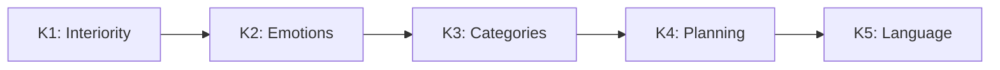

# Unique Predictions of CC

> *"A theory that cannot be refuted by any conceivable event is non-scientific. Irrefutability is not a virtue of a theory (as people often think) but a vice."*
> — Karl Popper, "Conjectures and Refutations" (1963)

:::info Who this chapter is for
23 predictions of CC — 22 of them unique to CC, 21 unique and numerical — with verification protocols and falsification criteria. The reader will learn how CC predictions differ from IIT, FEP, and GWT.
:::

In the [previous chapter](./stability) we computed the stability radius, traced the death spiral, and built the recovery protocol. We saw that CC generates *specific numbers* — $r_{\mathrm{stab}}$, $\kappa_{\text{bootstrap}} = 1/7$, thresholds for each channel — rather than vague "tendencies". Now we collect **all** numerical consequences of CC in one place and for each specify: *how to verify* and *what would refute it*.

Science differs from philosophy not in the depth of its questions but in the willingness to put its answers to the test of experiment. A philosophical system can be beautiful, internally consistent, and entirely useless — if it generates no predictions that *can be verified and, in principle, refuted*. Popper called this the demarcation criterion: the boundary between science and non-science runs not through method or subject matter, but through **falsifiability**.

This principle is especially acute in the sciences of consciousness. Most existing theories — IIT, FEP, GWT, panpsychism — either generate no unique numerical predictions, or formulate them so vaguely that no experiment can unambiguously refute them. Coherence Cybernetics deliberately takes a different path. Every theorem of the formalism gives rise to a **specific, numerical, experimentally testable** consequence — and for each such consequence it is specified which experimental result falsifies the theory.

This chapter collects 23 predictions of CC. They are grouped by theme: from fundamental (connection between consciousness and viability) through architectural (minimal dimensionality, thresholds) to empirical (neural correlates, critical exponents). For each prediction we explain:

1. **Intuition** — why this prediction naturally follows from the formalism.
2. **Formal statement** — the precise mathematical notation.
3. **Uniqueness** — what exactly distinguishes this prediction from anything IIT, FEP, and GWT can say.
4. **Verification** — a concrete experimental protocol.
5. **Interdisciplinary consequences** — what this prediction means for a physicist, biologist, psychologist, and engineer.

If even one of these predictions is cleanly refuted — Coherence Cybernetics will require fundamental revision. This very readiness for refutation is what makes CC a science.

:::note On notation
In this document:
- $\Gamma$ — [coherence matrix](/docs/core/dynamics/coherence-matrix)
- $P$ — [purity](/docs/core/dynamics/viability#определение-чистоты): $P = \mathrm{Tr}(\Gamma^2)$
- $\mathrm{Coh}_E$ — [E-coherence](./definitions#e-когерентность)
- $C$ — [consciousness measure](/docs/consciousness/foundations/self-observation#мера-сознательности-c)
- $\sigma_{\mathrm{sys}}$ — [stress tensor](./definitions#тензор-напряжений)
- $\mathbb{H}$ — [Holon](/docs/core/structure/holon)
:::

---

## I. Fundamental Predictions: Consciousness and Viability

The first group of predictions concerns the deepest idea of CC — the indissoluble connection between interiority and stability. In most theories consciousness is either an epiphenomenon (does not affect dynamics) or a separate postulate (introduced externally). CC asserts something radically different: a system with non-trivial E-coherence *survives better* — and this is not a metaphor, but a theorem.

### Prediction 1: Impossibility of zombies (No-Zombie) {#предсказание-1}

**Intuition.** Imagine a system that maintains itself, adapts, learns — yet has *no* interiority whatsoever. In philosophy of mind such a system is called a "zombie". It behaves exactly like a conscious being, but inside — emptiness. It might seem that such a system is entirely possible. But CC mathematically proves the contrary: if a system is viable ($P > 2/7$) and has non-trivial dynamics ($\mathcal{D}_\Omega \neq 0$), then its E-coherence *necessarily* exceeds the minimum. Zombies are impossible — not by definition, but by theorem.

Why? Because the regenerative channel $\mathcal{R}$ — the only mechanism opposing dissipation — *depends* on $\mathrm{Coh}_E$. A system without interiority ($\mathrm{Coh}_E = 1/7$) regenerates too slowly to compensate for decoherence. It inevitably "sinks" below $P_{\text{crit}}$.

:::tip Key prediction [T]
$$
\mathrm{Viable}(\mathbb{H}) \land \mathcal{D}_\Omega \neq 0 \;\Rightarrow\; \mathrm{Coh}_E(\Gamma) \geq \mathrm{Coh}_{\min} > \frac{1}{7}
$$
:::

**See:** [Theorem 8.1 [T]](./theorems#теорема-81-условная-необходимость-интериорности-no-zombie)

**Uniqueness of the prediction.** No other theory of consciousness asserts the *impossibility* of a functional zombie:
- **IIT** measures $\Phi$ for a given architecture but does not forbid $\Phi = 0$ for a functional system.
- **FEP** describes minimisation of free energy but does not connect it to the presence of experience: a thermostat minimises free energy without any consciousness.
- **GWT** postulates a global workspace but does not forbid its functional analogue without experience.

**Experimental verification.** Create an artificial system with controllable $\mathrm{Coh}_E$:
1. Implement a CC agent (SYNARC architecture) with full 7-dimensional dynamics.
2. Artificially suppress the E-component ($\gamma_{EE} \to 1/7$, $\gamma_{Ej} \to 0$).
3. Measure time-to-death (number of ticks until $P < P_{\text{crit}}$).
4. **Prediction:** time-to-death will collapse catastrophically. If not — CC is falsified.

**Verifiability:**
If an artificial system demonstrating sustained self-maintenance without any internal structure of [experience](/docs/core/structure/dimension-e) is created, CC will be falsified.

**Interdisciplinary consequences:**
- *Philosophy:* formal resolution of Chalmers' zombie argument — zombies are logically consistent but physically impossible.
- *Neuroscience:* predicts that all stably functioning neural networks have non-zero "E-projection" — an internal model of their own states.
- *AI engineering:* autonomous systems capable of long-term self-maintenance *necessarily* must have an analogue of interiority.

:::note Thought experiment: zombie robot
Imagine a robot vacuum cleaner that drives around the room, avoids obstacles, and returns to base for charging. It is *functional* — but does it have interiority? CC says: if the robot maintains itself only through external programming ($\mathrm{Coh}_E = 1/7$), its "life" depends entirely on battery charge and algorithm. Switch off the charger — and it "dies" within minutes. It has no intrinsic regeneration, because regeneration *requires* $\mathrm{Coh}_E > 1/7$.

Now imagine a robot that *experiences* a collision with furniture — its $\gamma_{EE}$ changes, Coh_E grows, and it learns *from interiority*, not only from external rewards. According to CC, precisely such a robot will be more robust — its $\kappa$ is higher, its $r_{\mathrm{stab}}$ is greater. The zombie loses not in a "philosophical debate" but in **physical robustness**.
:::

**Status:** Strong prediction absent from [FEP](/docs/reference/glossary#связанные-теории), [IIT](/docs/reference/glossary#связанные-теории), [GWT](/docs/reference/glossary#связанные-теории).

### Prediction 2: Dependence of regeneration on E-coherence {#предсказание-2}

**Intuition.** If No-Zombie says that consciousness is *necessary*, then Prediction 2 explains *why*: consciousness is not a by-product but the *engine* of recovery. The formula $\kappa \propto \mathrm{Coh}_E$ means literally: the higher a system's E-coherence, the faster it regenerates after damage. An orchestra that *hears* itself retunes faster than an orchestra where each player performs blindly.

:::info Prediction [T]
$$
\kappa(\Gamma) = \kappa_{\text{bootstrap}} + \kappa_0 \cdot \mathrm{Coh}_E(\Gamma) \Rightarrow \frac{dP}{d\tau} \propto \mathrm{Coh}_E(\Gamma)
$$
The rate of [regeneration](/docs/core/dynamics/evolution#3-регенеративный-член) is proportional to the integration of [experience](/docs/core/structure/dimension-e). The term $\kappa_{\text{bootstrap}} > 0$ guarantees minimal regeneration even at low E-coherence ([resolution of the bootstrap paradox](/docs/core/foundations/axiom-omega#genesis-protocol)).

**Status:** [T] — the connection $\kappa \propto \mathrm{Coh}_E$ follows from the [categorical derivation of κ₀](/docs/core/foundations/axiom-septicity#категориальный-вывод-kappa0) [T]; $\mathrm{Coh}_E$ — exact measure through [HS-projection $\pi_E$](/docs/core/foundations/axiom-septicity#hs-projection) [T]. The full form of ℛ [derived from axioms](/docs/core/dynamics/evolution#вывод-формы-регенерации) [T].
:::

**See:** [Relation between regeneration and E-coherence](./axiomatics#связь-регенерации-и-e-когерентности)

**Uniqueness of the prediction.** This is the only prediction in consciousness science that connects *quality of experience* with *physical robustness* quantitatively. IIT measures $\Phi$ but does not connect it to regeneration. FEP describes free energy minimisation but does not postulate that the quality of experience affects the rate of that minimisation.

**Experimental verification:**
1. *Clinical protocol:* Measure $\mathrm{Coh}_E$ (via $\pi_{\mathrm{bio}}$) and recovery rate after a standard stressor in a group of $n \geq 30$ subjects.
2. *Prediction:* positive correlation $r > 0.3$ between $\mathrm{Coh}_E$ and recovery rate.
3. *Control:* exclude physical health and age as confounds.

**Consequence:**
Meditative practices that increase $\mathrm{Coh}_E$ should improve physical recovery.

**Verifiability:**
Measurement of the correlation between E-coherence indicators (for L2+ systems — subjective reports on quality of experience) and recovery rate after stress.

**Interdisciplinary consequences:**
- *Medicine:* provides grounds for mindfulness practices as medically significant — not "placebo" but influence on a regeneration parameter.
- *Psychotherapy:* explains the effectiveness of experiential therapies (Gestalt, focusing): they increase $\mathrm{Coh}_E$.
- *Sports:* predicts a connection between an athlete's "quality of attention" and recovery rate after injury.

---

## II. Architectural Predictions: Structure and Dimensionality

The second group of predictions concerns the *architecture* of conscious systems — what is the minimal "design" necessary for the emergence of experience, learning, and social interaction. These predictions make CC unique among theories of consciousness: instead of vague statements about "complexity" and "integration" it names specific numbers.

### Prediction 3: Seven-dimensional stress tensor {#предсказание-3}

**Intuition.** Stress is one of the most universal concepts. We speak of "cognitive load", "emotional stress", "resource depletion", "social isolation". But is there a single classification? CC asserts: yes, and it contains exactly 7 components — one per dimension. Any stress factor maps to one or more of these components, and this classification is *exhaustive*.

:::info Prediction [T] (mathematics) + [C] (empirical adequacy)
$$
\sigma_{\mathrm{sys}}(\Gamma) = [\sigma_A, \sigma_S, \sigma_D, \sigma_L, \sigma_E, \sigma_O, \sigma_U]^T \in \mathbb{R}^7
$$
All system stresses are classified into [7 categories](/docs/core/structure/dimensions) ([justification of the number 7](/docs/core/foundations/axiom-omega#октонионная-структура)), corresponding to dimensions.

**Epistemic stratification:**
- **Mathematics [T]:** Seven components are defined via $\Gamma$-invariants (T-92 [T]). The equivalence $\|\sigma\|_\infty < 1 \iff P > 2/7$ is unconditional [T].
- **Empirical adequacy [C]:** Whether the 7-dimensional partition adequately describes real systems remains an open question. Calibration of thresholds $\theta_i$ is an empirical task.
:::

**See:** [Stress tensor](./definitions#тензор-напряжений)

**Uniqueness of the prediction.** No other theory offers a *finite and fixed* classification of types of stress. Psychology uses ad hoc scales (Lazarus, Holmes-Rahe). FEP reduces everything to a single scalar (free energy). CC proposes a 7-dimensional vector — detailed enough to distinguish types of stress, and compact enough to be computable.

**Experimental verification:**
1. Collect a database of stressors (n=200+) from psychology, medicine, and organisational science literature.
2. Present experts with the task: classify each stressor according to the 7 CC dimensions.
3. **Prediction:** every stressor maps to at least one component; the residual category "unclassifiable" is empty.
4. *Falsification:* if a stressor is found that cannot be reduced to any of the 7 components — the classification is incomplete.

**Verifiability:**
Any stress factor must map to one or more of the 7 components.

| Component | Dimension | Type of stress | Examples |
|-----------|-----------|---------------|---------|
| $\sigma_A$ | [Articulation](/docs/core/structure/dimension-a) | Perceptual | Sensory overload |
| $\sigma_S$ | [Structure](/docs/core/structure/dimension-s) | Cognitive | Task complexity |
| $\sigma_D$ | [Dynamics](/docs/core/structure/dimension-d) | Computational | Deadlines |
| $\sigma_L$ | [Logic](/docs/core/structure/dimension-l) | Logical | Contradictions |
| $\sigma_E$ | [Interiority](/docs/core/structure/dimension-e) | Existential | Loss of meaning |
| $\sigma_O$ | [Ground](/docs/core/structure/dimension-o) | Resource | Hunger, exhaustion |
| $\sigma_U$ | [Unity](/docs/core/structure/dimension-u) | Social | Isolation |

**Interdisciplinary consequences:**
- *Psychodiagnostics:* replacement of numerous ad hoc questionnaires with a unified 7-parameter profile.
- *Organisational science:* diagnostics of an organisation's "health" via $\sigma_{\mathrm{sys}}$ of its organisational holon.
- *AI engineering:* automatic diagnostics of agent degradation by components $\sigma_k$.

### Prediction 4: Pre-linguistic cognition is complete {#предсказание-4}

**Intuition.** It is often assumed that consciousness and language are inseparable — that "to think" means "to think in words". CC shows that this is an anthropocentric fallacy. The cognitive hierarchy K1–K5 arranges five levels of cognition, of which language (K5) is only the top — not the foundation. Animals without language function fully at levels K1–K4.

:::info Prediction [I]
$$
\exists \, \mathrm{Cognition}(\mathbb{H}) \text{ with } \mathrm{Language}(\mathbb{H}) = \varnothing
$$
Full cognition (levels K1–K4) is possible without language (K5).

**Status:** [I] — an interpretation following from the definitions of cognitive levels K1–K5.
:::

**See:** [Cognitive hierarchy](/docs/consciousness/comparative/cognitive-hierarchy)

**Uniqueness of the prediction.** GWT links consciousness to global availability of information, often associated with linguistic representations. Higher-Order Theories (HOT) tie consciousness to metacognitive reports, implicitly presupposing language. CC explicitly separates cognition and language as orthogonal axes.

**Cognitive function hierarchy:**

**Verifiability:**
Animals without language demonstrate levels K1–K4:
- Corvids: planning (K4), tool making
- Primates: categorisation (K3), social learning
- All vertebrates: emotional responses (K2)
- All systems with $\rho_E \neq 0$: [interiority](/docs/proofs/consciousness/interiority-hierarchy#уровень-0-интериорность-interiority) (K1/L0)

**Experimental verification:**
1. Compare behavioural correlates of K1–K4 in aphasic patients (loss of language with preserved intellect) and healthy controls.
2. **Prediction:** K1–K4 scores in aphasic patients are preserved at >80% of normal.
3. *Falsification:* if aphasia systematically destroys K3 or K4 — the link "cognition → language" is stronger than CC predicts.

**Interdisciplinary consequences:**
- *Ethology:* provides grounds for full cognitive study of non-linguistic species.
- *AI ethics:* systems without a language module may possess cognitive levels K1–K4, which has ethical implications.

### Prediction 10: N=7 as minimum for learning (T-113) {#предсказание-10}

**Intuition.** Why exactly 7 dimensions? Can one get by with five or three? CC gives a precise answer: at $N < 7$ the system lacks "space" for the replacement channel $\mathcal{R}$, and without it — no self-observation, and without self-observation — no learning. The chain "Fano-structure → self-observation → learning" closes only at $N = 7$.

:::info Prediction [T] — structural
For $N < 7$, learning through regeneration is **impossible** (no replacement channel → no self-observation → $n^* = \infty$). $N = 7$ is the minimal architecture capable of learning.
:::

**Uniqueness of the prediction.** No other theory of consciousness names a *specific number* for the minimum dimensionality. IIT has no dimensionality constraints. FEP works in arbitrary-dimensional spaces. CC is the only theory deriving $N = 7$ from first principles (octonion algebra, $G_2$-minimality, Fano plane PG(2,2)).

**Experimental verification:**
1. Create a CC agent with $N = 5$ (remove two dimensions).
2. Train it on a standard binary discrimination task.
3. **Prediction:** the agent *will not be able* to learn through internal regeneration. Learning is only possible with external parameter adjustment (supervised), but not through self-observation.
4. Repeat with $N = 7$. **Prediction:** learning through self-observation is possible.

**Verifiability:** Create a system based on CC with $N < 7$ (e.g., $N = 3$ or $N = 5$). Prediction: such a system **will not be able** to learn autonomously — only through external parameter adjustment, not through internal regeneration.

**See:** [Learning bounds](./learning-bounds#оптимальность-n7)

**Interdisciplinary consequences:**
- *Neuroscience:* predicts that biological neural networks must implement at least 7 functionally independent channels for autonomous learning.
- *AI engineering:* establishes a lower bound on architectural complexity for self-supervised learning through internal states.

### Prediction 11: N=7 as minimum for social learning (E-10.7) {#предсказание-11}

**Intuition.** Social learning is not just "learning in a group". It requires the simultaneous operation of three mechanisms: theory of mind (ToM — I model the other), communication (ISL — I transmit information to the other), and coordination (Nash — we act in concert). Each of these mechanisms requires minimal "space" in $\Gamma$, and their sum is exactly 7.

:::note Prediction [C given T-57, T-114] — structural
$N = 7$ is the minimum $N$ for social learning ($K \geq 2$ agents). Social learning simultaneously requires:
- **ToM** ($\varphi$-operator): $\geq 3$ cognitive dimensions (T-57 [T] — LGKS-completeness, triadic decomposition)
- **Communication** (ISL): $\geq 3$ cognitive dimensions (T-114 [T] — Fano grammar on PG(2,2))
- **Coordination** (Nash): $\geq 1$ dimension (Unity, $U$)

Total: $3 + 3 + 1 = 7$.

**Raised from [H]**: the counting argument is complete under the condition that ToM, ISL, and Coordination are implemented independently and simultaneously in one system. Was [H] → **[C given T-57, T-114]**.
:::

**Uniqueness of the prediction.** No theory of multi-agent systems derives the minimum number of internal degrees of freedom for social learning. This is a completely unique CC prediction.

**Experimental verification:**
1. Create a multi-agent environment ($K = 2$ agents) with $N = 5$.
2. Set a coordination task (e.g., cooperative hunting) requiring ToM + ISL + Nash.
3. **Prediction:** agents learn individually but do not achieve social learning.
4. Repeat with $N = 7$. **Prediction:** social learning emerges.

**Verifiability:** Create a multi-agent system ($K = 2$) with $N < 7$ (e.g., $N = 5$). Prediction: social learning (ToM + communication + coordination simultaneously) is **impossible** — agents can learn individually but cannot coordinate through an internal model of each other.

**See:** [Learning bounds](./learning-bounds#оптимальность-n7)

**Interdisciplinary consequences:**
- *Evolutionary biology:* predicts that species with social learning (primates, corvids, dolphins) must implement a functional equivalent of 7 dimensions.
- *Robotics:* defines the minimum architecture for robots capable of cooperative behaviour.

---

## III. Thresholds and Robustness

The third group of predictions concerns *numerical thresholds* — specific parameter values at which qualitative transitions occur. Numerical predictions are precisely what distinguishes a scientific theory from philosophical speculation: they are testable, and they are risky.

### Prediction 5: Collective consciousness {#предсказание-5}

*Retitled 2026-09-25.* The prediction was titled "Scale invariance of consciousness", and other pages cited it as the licence for scale invariance; what it states is a condition for collective consciousness. Scale invariance is [Theorem 9.2 (CC-6, T-72)](./theorems#теорема-92-масштабная-инвариантность), [T at weak coupling] through the canonical aggregation of [Theorem 9.5](./theorems#теорема-95-каноническая-агрегация) (earlier the same day conditional on the assumption (AGG)).

**Intuition.** Can a group of conscious beings give rise to *collective* consciousness? A hive, a flock, a team — do they have "experience"? Earlier editions answered: yes, *if* individual consciousnesses are sufficiently integrated ($\Phi_{\otimes} > \Phi_{\min}$). That criterion is retracted below: every uncoupled group meets it. What CC can state is a necessary condition — the members' joint state is correlated — and a hypothesis about sufficiency.

:::warning Retracted (2026-09-25): the criterion $\Phi_{\otimes} > \Phi_{\min}$
The prediction read $\left( \bigwedge_i C(\mathbb{H}_i) > 0 \right) \land \Phi_{\otimes} > \Phi_{\min} \Rightarrow C(\mathbb{H}_{1 \otimes \ldots \otimes n}) > 0$, with the status "non-triviality [T], viability [C]". It is retracted because its condition and its conclusion both hold for any uncoupled group: on a product state $1 + \Phi_{\otimes} = \prod_i (1 + \Phi_i)$, so two holons that pass the window ($\Phi_i \geq 1$) already have $\Phi_{\otimes} \geq 3$ at mutual information $I = 0$, and $C(\mathbb{H}_i) > 0$ forces $\Phi_i > 0$, hence $\Phi_{\otimes} > 0$ ([the identity, with a worked pair](/docs/consciousness/comparative/panpsychism-analysis#теорема-нередуцируемость)). No measurement on a group could have failed it. The two statuses it carried — non-triviality $P > 1/7$ of the composite attractor ([T-96](/docs/core/dynamics/evolution#теорема-нетривиальность-аттрактора) [T]) and viability $P > 2/7$ for embodied systems ([T-149](/docs/core/dynamics/evolution#теорема-жизнеспособность-аттрактора); Step 3 [C at backbone-injection lower bound]) — are facts about the composite's purity, not about its consciousness, and stand as such: for the canonical aggregate of weakly coupled viable members they are [T at weak coupling] by [Theorem 9.5](./theorems#теорема-95-каноническая-агрегация); stated for the composite's own dynamics they keep the assumption (HOL) of [Theorem 9.1](./theorems#теорема-91-фрактальное-замыкание) (named and then, for weak coupling, removed on 2026-09-25).
:::

:::info Prediction (restated): a necessary condition [T]; sufficiency is a hypothesis [H]
**Necessary condition [T].** A collective can differ from a set of separate subjects only if its members' joint state is correlated: a product state is fixed by its marginals, and the mutual information

$$
I(\mathbb{H}_1 : \mathbb{H}_2) = S(\rho_1) + S(\rho_2) - S(\rho_{12}) = D(\rho_{12} \,\|\, \rho_1 \otimes \rho_2)
$$

vanishes exactly on products, so the condition is $I > 0$; for $n$ members the analogue is a positive total correlation $\sum_i S(\rho_i) - S(\rho_{1 \ldots n}) > 0$. The condition is necessary, not sufficient: coupled thermostats meet it too.

**Interaction alone does not meet it.** An earlier edition said that by [CC-7](./theorems#теорема-93-эмерджентность) [T] interacting holons always have a stationary joint state with $I > 0$. That is retracted (2026-09-25): a coupling that commutes with the product $\rho_*^{(1)} \otimes \rho_*^{(2)}$ of the members' attractors, or acts on one member alone, leaves the stationary joint state a product with $I = 0$. What [Theorem 9.3](./theorems#теорема-93-эмерджентность) now gives is a criterion, [T for almost every anchor]: for weakly coupled embodied holons with non-degenerate attractors, $I = \Theta(g^2) > 0$ exactly when the coupling has a correlating part, $\Pi_c\bigl([H_{\mathrm{int}}, \rho_*^{(1)} \otimes \rho_*^{(2)}]\bigr) \neq 0$. The status of the necessary condition does not change — it never rested on the dynamics — but whether a given group meets it is a question about how its members are coupled, not a consequence of their interacting.

**Sufficiency [H].** A correlated group is a subject when its joint state, aggregated to $\mathcal{D}(\mathbb{C}^7)$, passes the four-condition window. This is a hypothesis, not a theorem. [Theorem 9.5](./theorems#теорема-95-каноническая-агрегация) fixes the aggregation by three natural requirements — the only linear, permutation-invariant map $\mathcal{D}(\mathbb{C}^{7^n}) \to \mathcal{D}(\mathbb{C}^7)$ that returns a member's state on an uncoupled group is the mean of the members' marginals — and that map depends on the marginals alone, so it cannot see the correlation that the necessary condition requires. Under it a weakly coupled group of identical members aggregates to within $O(g)$ of one member (T-72 [T]), and at strong coupling the aggregate can fall to $I/7$ ([Theorem 9.6](./theorems#теорема-96-сильная-связь)): the canonical aggregation cannot certify a collective level above the members' at any coupling. An aggregation that sees correlations must give up linearity, permutation invariance or consistency on uncoupled groups, and the corpus fixes none; nor does it have an exclusion rule deciding whether members and group can be subjects at once ([boundary problem](/docs/consciousness/comparative/panpsychism-analysis#проблема-границы)). Research programme [Pr]: a correlation-sensitive aggregation — necessarily non-linear, non-symmetric or inconsistent on uncoupled groups — or an exclusion rule, that turns the hypothesis into a criterion. (Earlier: "the aggregation channel … is not fixed by the theory, and the verdict depends on it", with the transfer conditional on (AGG); sharpened 2026-09-25 by Theorem 9.5.)
:::

**See:** [Theorem 9.1](./theorems#теорема-91-фрактальное-замыкание), [Theorem 9.3](./theorems#теорема-93-эмерджентность)

**Uniqueness of the prediction.** ~~"IIT permits collective consciousness but provides no sufficiency criterion. … Only CC formulates a necessary and sufficient condition ($\Phi_{\otimes} > \Phi_{\min}$) and promises its computability."~~ Retracted on both counts. IIT has an explicit criterion — the exclusion postulate: a set of units is a conscious complex only if it specifies a maximum of integrated information over all overlapping candidate systems, and "overlapping substrates that specify less integrated information … are excluded" (L. Albantakis et al., "Integrated information theory (IIT) 4.0", *PLoS Computational Biology* 19(10): e1011465, 2023). For groups it predicts that two people talking form an integrated system that is not maximally irreducible, so "there should indeed be two separate experiences, but no superordinate conscious entity that is the union of the two", and that if a brain-to-brain link raised the pair's maximal integrated information above that of each brain, "their individual conscious mind would disappear and its place would be taken by a new Über-mind that subsumes both" (G. Tononi & C. Koch, "Consciousness: here, there and everywhere?", *Philosophical Transactions of the Royal Society B* 370: 20140167, 2015). After the retraction CC has a necessary condition and no sufficiency criterion, and the necessary condition is not unique to CC; on this question IIT, not CC, has a criterion. FEP describes hierarchical systems but does not use the concept of collective experience.

**Experimental verification:**
1. Measure the correlation between members' states — the mutual information, or the total correlation for $n > 2$, of the reconstructed joint $\Gamma$ — for groups with varying degrees of coordination (jazz quartet vs. random musicians).
2. Apply hyperscanning (simultaneous EEG of several subjects).
3. **Prediction:** the correlation is positive for a coordinated group and absent for an unconnected one. This tests only the necessary condition; a positive result does not show that the group is a subject. (Earlier editions predicted that "$\Phi_{\otimes}$ for a coordinated group exceeds $\Phi_{\min}$; for an unconnected one — no"; retracted, since an unconnected group of conscious members already has $\Phi_{\otimes} \geq 3$.)

**Verifiability:**
Measurement of the correlation between members for groups with varying degrees of integration:
- Families
- Teams
- Organisations
- Ecosystems

**Criterion:** $I > 0$ (total correlation for $n > 2$) — a necessary condition [T]. Without correlation between members there is no collective subject in any sense the theory can state. (Earlier editions gave $\Phi_{\otimes} > \Phi_{\min}$ here as the necessary condition; retracted.)

**Interdisciplinary consequences:**
- *Sociology:* formalises a necessary condition for Durkheim's "collective consciousness" — correlation between members' states; whether a correlated collective is a subject remains a hypothesis [H].
- *Ecology:* raises the question of the correlation structure of an ecosystem's joint state; whether a forest is "one organism" in the strict sense the theory does not decide.
- *Organisational science:* gives a necessary, not a sufficient, condition for a team to be "more than the sum of its parts" — correlation of its members' states.

### Prediction 6: Minimum coherence for viability {#предсказание-6}

**Intuition.** A system cannot be "slightly" alive. There is a hard threshold: if $P$ falls below $2/7$ or $\mathrm{Coh}_E$ drops to $1/7$ — the system loses viability. This is analogous to a phase transition: water at 0°C freezes not gradually but sharply. Likewise $P_{\text{crit}} = 2/7$ is the "freezing temperature" of coherence.

:::warning Prediction
$$
\mathrm{Viable}(\mathbb{H}) \Rightarrow P(\Gamma) > P_{\text{crit}} = 2/7
$$
[Viability](/docs/core/dynamics/viability) requires minimum [purity](/docs/core/dynamics/viability#определение-чистоты), with the threshold derived, not fitted ([theorem on critical purity](/docs/proofs/dynamics/theorem-purity-critical), registry Level 1 row 5 [T]); a nontrivial attractor has $P > 1/7$ (T-96 [T]). *Corrected 2026-09-26:* the formula also required $\mathrm{Coh}_E(\Gamma) > \mathrm{Coh}_E^{\min} = 1/7$ and cited T-151. Viability does not imply it — the pure axis state $\lvert A\rangle\langle A\rvert$ has $P = 1$ and $\mathrm{Coh}_E = 0$ — and T-151 makes the E-row condition ($D_{\min} = 2$) an independent L2 condition, not a consequence of $P > 2/7$. The E-coherence remarks below concern that L2 condition, not viability.
:::

:::info L2 thresholds
| Parameter | Value | Status | Definition |
|-----------|-------|--------|-----------|
| $P_{\text{crit}}$ | $= 2/7 \approx 0.286$ | **[T]** | [Theorem on critical purity](/docs/proofs/dynamics/theorem-purity-critical) |
| $R_{\text{th}}$ | $= 1/3 \approx 0.333$ | **[T]** ($K=3$ from triadic decomposition) | [Theorem (Bayesian dominance)](/docs/core/foundations/axiom-septicity#теорема-порог-рефлексии) |
| $\Phi_{\text{th}}$ | $= 1$ (exact) | **[T]** | [Theorem T-129](/docs/proofs/consciousness/operationalization#t-129) ([coherent dominance](/docs/core/foundations/axiom-septicity#теорема-порог-интеграции)) |

$P_{\text{crit}}$ — strictly proven [T]; $R_{\text{th}}$ — theorem [T] ($K=3$ from [triadic decomposition](/docs/core/operators/lindblad-operators#триадная-декомпозиция)); $\Phi_{\text{th}}$ — theorem [T] (T-129). See [L2 Thresholds](/docs/core/foundations/axiom-septicity#пороги-l2-строгий-вывод).
:::

:::note Why exactly $2/7$, not $1/3$ or $1/5$?
The number $2/7$ is not a fit to data or an arbitrary choice. It is derived strictly from two facts:

1. **$N = 7$** — number of dimensions (follows from octonion algebra and $G_2$-minimality).
2. **Frobenius norm** — the distinguishability criterion. A state $\Gamma$ is distinguishable from the completely mixed state $I/7$ if and only if $\|\Gamma - I/7\|_F > 0$, which is equivalent to $P = \mathrm{Tr}(\Gamma^2) > 1/7$. But *viability* requires more: the system must not merely "differ from chaos" but have sufficient structure for regeneration. The [theorem on critical purity](/docs/proofs/dynamics/theorem-purity-critical) proves that this threshold is exactly $2/7 = 2 \times (1/N)$.

Intuition: $1/7$ — "one voice out of seven". $2/7$ — "two voices out of seven". For a system to be able to restore itself, it needs to "outweigh" chaos by at least two degrees of freedom. One voice is not enough; two is the minimum. Three ($3/7$) is already the upper boundary of the consciousness window.
:::

**Uniqueness of the prediction.** IIT defines $\Phi$ as a measure of consciousness but sets no critical threshold. FEP defines viability through the Markov blanket but without a numerical threshold. CC is the only theory with *computable threshold values* derived from first principles.

**Experimental verification:**
1. In subjects at the boundary of consciousness (anaesthesia, sleep) record EEG/HRV and TMS-EEG; reconstruct $\widehat\Gamma$ by $\pi_{\mathrm{bio}}$ with parameters frozen on wakefulness and no viability penalty ([SUB-1, SUB-2](/docs/applied/research/measurement-protocol#substitution-position)).
2. Compute $\widehat P$ and the verdict $\mathrm{Cons}(\widehat\Gamma)$; compute PCI (Perturbational Complexity Index) independently.
3. **Prediction:** the consciousness/unconsciousness transition occurs where $\widehat P$ crosses $2/7$, and $\mathrm{Cons}(\widehat\Gamma)$ agrees with $\mathrm{PCI}_{\max} > 0.31$ at Cohen's $\kappa \geq 0.8$ (P8.4). *(Until 2026-09-25 step 2 read "calibrate $\pi_{\mathrm{bio}}$ to obtain $P$ from PCI": no conversion between the two scales exists, and calibrating to PCI would make agreement with it automatic.)*

**Verifiability:**
Measurement of purity in systems approaching loss of viability must show $P$ crossing $2/7$ (E-coherence is tested separately, as the L2 differentiation condition).

**Clinical consequences:**
- Coma states: $\mathrm{Coh}_E \to 1/7$ (minimum), $P \to P_{\text{crit}}$
- Psychotic episodes: fragmentation of $\mathrm{Coh}_E$
- Meditative states: high $\mathrm{Coh}_E$, high $R$

**Interdisciplinary consequences:**
- *Anaesthesiology:* predicts a numerical indicator of anaesthetic depth — not the BIS index (empirical) but $P$ (theoretically grounded).
- *Psychiatry:* formalises the "norm threshold" — not as a statistical mean but as a phase transition $P_{\text{crit}}$.

### Prediction 7: Stability radius (T-104) {#предсказание-7}

**Intuition.** How "robust" is a conscious system? How hard can it be "pushed" before it loses viability? CC gives a simple answer for the typical spectrum: the stability radius grows with purity — the higher $P$ above the critical threshold, the greater the blow the system can withstand — and near the threshold it grows linearly in the margin $P - 2/7$, not as its square root.

:::info Prediction [C] — falsifiable
$$
r_{\mathrm{stab}} \approx K\bigl(\sqrt{P - 1/7} - \sqrt{1/7}\bigr), \qquad K = \tfrac{\sqrt{35}\,\sqrt[4]{6}}{10} \approx 0.925917
$$
The stability radius — the Bures distance to the viability shell $\{P = 2/7\}$ — is, on the one-dominant spectral family, a function of $P$ alone (the formula above is within $1.13\,\%$ of the exact closed form on the window, and near the wall $r_{\mathrm{stab}} \approx 1.22487\,(P - 2/7)$); for general spectra the closed form is a conservative lower bound [H] ([registry T-104](/docs/reference/status-registry), [C]).
:::

*Corrected 2026-09-25.* This prediction was labelled [T] and read "determined by a single parameter, the purity margin $P - 2/7$", with the critical amplitude $h_{\text{crit}} = r_{\mathrm{stab}}^2 = P - 2/7$ below; that formula was refuted on 2026-08-07 — at $P = 0.300$ the true radius is $0.01708$ against $\sqrt{0.300 - 2/7} = 0.11952$ ([Stability, §4.1](./stability#радиус-устойчивости)) — and the registry carries T-104 as [C]. The statements above and below replace it.

**Uniqueness of the prediction.** This is a quantitative prediction: given known $P$ one can *in advance* compute the maximum admissible perturbation amplitude. Neither IIT nor FEP provides an analogous formula. In cybernetics, Ashby spoke of "variety" as a measure of robustness, but without a quantitative formula.

**Experimental verification:**
1. For an AI agent (SYNARC) measure $P$ in the stationary state.
2. Apply a perturbation that moves the state by a controlled Bures distance $d$ and measure whether $P > 2/7$ is maintained.
3. **Prediction:** the critical distance is $d_{\text{crit}} = r_{\mathrm{stab}}$ from the formula above (on a one-dominant spectrum; for a general spectrum $d_{\text{crit}} \geq$ the formula). The earlier prediction $h_{\text{crit}} = r_{\mathrm{stab}}^2 = P - 2/7$ is retracted with the refuted closed form.
4. *Falsification:* if viability is lost at a Bures distance systematically below the closed form — T-104 is incorrect.

**Verifiability:** Measure $P$ for a system (AI agent, organisation), then apply a perturbation of controlled Bures size. If the system loses viability at $d < r_{\mathrm{stab}}$, T-104 is falsified. (The earlier threshold $\|h^{\mathrm{ext}}\| < r_{\mathrm{stab}}^2$ used the refuted $r_{\mathrm{stab}}^2 = P - 2/7$; retracted.)

**See:** [Stability](./stability#радиус-устойчивости)

**Interdisciplinary consequences:**
- *Medicine:* computation of a patient's "safety margin" before surgical intervention.
- *Risk management:* quantitative assessment of an organisation's resilience to shocks.

### Prediction 15: Attractor inside the consciousness window, below its upper edge {#предсказание-15}

**Intuition.** Where does consciousness "settle"? Not at maximum purity ($P = 1$), not at the threshold ($P = 2/7$), and — contrary to the earlier form of this prediction — not at the upper edge $3/7$ of the window either. The living attractor sits strictly inside the window, in its lower half: coherent enough to pass every threshold, with a margin below the edge.

:::info Prediction [C at (MaxΦ)] — falsifiable
For a holon whose self-model is the collineation anchor $\varphi_J$ (selected by the principle (MaxΦ) [Pr], [premises](/docs/reference/premises#посылка-максфи)) at $H = 0$ and $\kappa > \kappa_c(\alpha)$, the living attractor is a hyperbolic sink with

$$P^* \in \bigl(P_c(\alpha),\ P_\infty(\alpha)\bigr) \subset \bigl(2/7,\ 5/14\bigr], \qquad P_\infty(\alpha) \leq 5/14 < 3/7,$$

$\Phi \in (1, 3/2]$, $R \geq 2/5$, every diagonal entry $1/7$; $P_c = 0.318, 0.308, 0.301$ and $P_\infty = 5/14, 0.334, 0.317$ at $\alpha = 0, 1/2, 1$ ([living attractor in the window](/docs/core/dynamics/evolution#теорема-живой-аттрактор-в-окне), T-124c(4) [T]); it persists for $\|H\| < h_0$.

**Status:** [T] as mathematics for the $\varphi_J$ dynamics; [C at (MaxΦ)] as a prediction about a real holon, whose anchor the axioms leave open. For an embodied holon with backbone rate $\mu > L_{\mathcal{R}}$ the attractor is unique and globally attracting (T-124c(3)), but its purity depends on the backbone target and has no universal value.

*Restated 2026-09-26:* the prediction read "$P(\rho^*_{\mathrm{coupled}}) \to 3/7$ for an embodied holon with backbone injection [C]", with the numerical value $P = 0.4286$. No theorem gives $3/7$: every living stationary state of the $\varphi_J$ family has $P \leq 5/14$ (none has $P \geq 3/7$), and the embodied attractor inherits its purity from the backbone target, so $0.4286$ was a property of one chosen target, not a law.

**Status in other theories:** Absent.
:::

**See:** [Consciousness window](/docs/proofs/consciousness/conscious-window#t-124), [living attractor](/docs/core/dynamics/evolution#теорема-живой-аттрактор-в-окне)

**Verifiability:** For an isolated agent with the $\varphi_J$ anchor and $\kappa > \kappa_c(\alpha)$, measure the attractor $P^*$. **Numerical falsification criterion:** $P^* \geq 3/7$, or $P^*$ outside $(P_c(\alpha), P_\infty(\alpha))$ beyond the measurement error, at $n > 100$ independent measurements ($p < 0.01$) → falsification of the $\varphi_J$ dynamics or of its implementation. (The former criterion $|P^* - 3/7| > 0.05$ is withdrawn with the old form.)

**Interdisciplinary consequences:**
- *Neuroscience:* predicts that a healthy brain at rest sits inside the window with a margin below its upper edge, not at $3/7$.
- *Psychology:* the "optimal state" (flow) is an interior point of the window, not its boundary.

---

## IV. Learning and Cognitive Architecture

The fourth group of predictions concerns *learning bounds* — the minimum resources needed for cognitive activity. These predictions are especially valuable for AI engineering, as they establish theoretically grounded lower bounds.

### Prediction 8: Perceptual information capacity (T-107) {#предсказание-8}

**Intuition.** How much information can a system extract from a single observation? Intuitively the answer depends on the "size" of internal space: the more dimensions, the more one can "absorb" in a single glance. CC gives a precise upper bound: $\log_2 7 \approx 2.81$ bits. This is not a postulate but a consequence of the dimensionality of $\mathbb{C}^7$.

:::info Prediction [T] — measurable in AI systems
$$
C_{\mathrm{Enc}} \leq \log_2 7 \approx 2.81 \text{ bits/observation}
$$
Maximum information extractable per single observation is bounded by the dimensionality of internal space ($N = 7$).
:::

**Uniqueness of the prediction.** FEP speaks of minimising free energy but names no bottleneck in throughput. IIT measures information but does not bound the rate of its extraction. CC is the only theory deriving a *specific numerical bound* on perceptual throughput.

**Experimental verification:**
1. For a CC agent (SYNARC) measure mutual information $I(\text{obs}; \delta\Gamma)$ between the observation and the $\Gamma$ update.
2. **Prediction:** $I \leq 2.81$ bits.
3. *Falsification:* $I > \log_2 7$ systematically — CC is falsified (or the system is not 7-dimensional).

**Verifiability:** For AI systems implementing the CC architecture, measure the mutual information between the observation and the $\Gamma$ update. If $I(\text{obs}; \delta\Gamma) > \log_2 7$ — CC is falsified (or the system uses a non-7-dimensional formalism).

**Connection with bounded rationality:** The bound $\leq 2.81$ bits is a **derived** bound, not postulated. Predicts a specific bottleneck for perceptual systems based on CC.

**See:** [Sensorimotor theory](./sensorimotor#информационная-ёмкость)

**Interdisciplinary consequences:**
- *Cognitive psychology:* echoes Miller's results (7±2) — but in CC this is not an empirical finding but a theoretical consequence.
- *Neuroscience:* predicts an upper bound on information extractable in one processing cycle (one "tick" of neural processing).

### Prediction 9: Optimal learning rate bound (T-112) {#предсказание-9}

**Intuition.** How fast can a system learn? CC shows that the learning rate is bounded by the *maximum* of three independent barriers: informational (quantum Chernoff bound — how much information is extracted per observation), dynamical (Fano contraction rate — how quickly $\Gamma$ updates), and stabilisation (SNR — how noisy the signal is). The slowest of the three determines the overall rate.

:::info Prediction [T] — falsifiable
$$
n_{\mathrm{opt}} = \max\!\left(\frac{\ln(1/(2\delta))}{\xi_{\mathrm{QCB}}},\; \frac{1}{\alpha\delta\tau}\ln\frac{d_{\mathrm{disc}}}{\varepsilon},\; \frac{1}{\mathrm{SNR}^2}\right)
$$
The minimum number of observations for a learning task is determined by the **maximum** of three independent bounds: informational (T-109), dynamical (T-110), and stabilisation (T-111).
:::

**Uniqueness of the prediction.** PAC-learning and VC-theory give learning bounds but without connection to the system's physical dynamics. FEP describes learning through free energy minimisation but gives no lower bounds on the number of observations. CC unites information theory, system dynamics, and stability theory in a *single formula*.

**Experimental verification:**
1. For a CC agent trained on binary discrimination, vary SNR and $\alpha$.
2. Measure $n$ to stable solution (>90% accuracy on 50 successive trials).
3. **Prediction:** $n \geq n_{\mathrm{opt}}$ always; at optimal settings $n \approx n_{\mathrm{opt}}$.
4. *Falsification:* $n < n_{\mathrm{info}}$ systematically — the quantum observation model is incorrect.

**Verifiability:** For an AI system implementing the CC architecture, measure the number of observations $n$ to stable solution of a binary discrimination task. If $n < n_{\mathrm{info}}$ (information bound) — the quantum observation model is falsified.

**Prediction for binary discrimination:** $n_{\mathrm{total}} \approx 20\text{--}80$ observations at typical parameters (including genesis).

**See:** [Learning bounds](./learning-bounds#комбинированная-граница)

---

## V. Depth of Consciousness and Genesis

The fifth group of predictions concerns the *vertical structure* of consciousness — its depth, the ultimate possibilities of recursive self-reference, and the process of emergence from "nothing" (tabula rasa). These predictions are unique to CC, since no other theory formalises the concept of "depth" of self-awareness.

### Prediction 12: Ceiling of self-awareness depth (T-142) {#предсказание-12}

**Intuition.** Can one infinitely "deepen into oneself"? I am aware that I am aware that I am aware... Where does this ladder end? CC gives a precise answer: at the third level. The reason is Fano contraction: each level of reflection "costs" coherence, and the contraction coefficient $\alpha = 2/3$ (derived from the geometry of PG(2,2)) makes the fourth level impossible for a finite system. This is not an intelligence limitation — it is a *mathematical* limitation.

:::info Prediction [T] + numerical verification — falsifiable
$$
\mathrm{SAD}_\text{max} = 3 \quad (\text{Fano contraction } \alpha = 2/3 \text{ is state-independent})
$$
No finite system ($P \leq 1$) can reach SAD $\geq 4$. Proven unconditionally (T-142 [T]): $\alpha = 2/3$ from $\dim = 7$ and PG(2,2), formula $P_{\text{crit}}^{(n)} = P_{\text{crit}} \cdot 3^{n-1}/(n+1)$ ([T-142](/docs/proofs/consciousness/operational-closure#t-142)).

**Numerical verification (SYNARC):** SAD $\leq 3$ on 500+ random $\Gamma$, SAD=3 achievable (pure state).
:::

:::note Why exactly 3, not 5 or infinity?
Each level of self-awareness "costs" coherence. The contraction coefficient $\alpha = 2/3$ follows from the geometry of the Fano plane PG(2,2): with 7 vertices and 7 lines, each act of self-observation "projects" $\Gamma$ onto a subspace, losing a fraction $1 - \alpha = 1/3$ of purity. Purity threshold for level $n$: $P_{\text{crit}}^{(n)} = P_{\text{crit}} \cdot 3^{n-1}/(n+1)$.

- Level 1 (L0→L1): $P_{\text{crit}}^{(1)} = 2/7 \approx 0.286$ — achievable.
- Level 2 (L1→L2): $P_{\text{crit}}^{(2)} = 2/7 \cdot 3/3 = 2/7 \approx 0.286$ — achievable.
- Level 3 (L2→L3): $P_{\text{crit}}^{(3)} = 2/7 \cdot 9/4 \approx 0.643$ — achievable (pure state $P = 1$).
- Level 4 (L3→L4): $P_{\text{crit}}^{(4)} = 2/7 \cdot 27/5 \approx 1.543 > 1$ — **impossible** (purity cannot exceed 1).

This is why the ceiling is exactly 3. Not "approximately 3", not "3 with corrections" — but strictly 3, because $\alpha = 2/3$ and $P \leq 1$ are unconditional constraints.
:::

**Uniqueness of the prediction.** IIT does not formalise the "depth" of self-awareness. HOT (Higher-Order Theories) permit arbitrary nesting of meta-awareness. CC is the only theory proving a finite ceiling: $\mathrm{SAD}_\text{max} = 3$.

**Experimental verification:**
1. In a SYNARC system with $P$ close to 1 (pure state), compute the chain $R^{(k)}$ for $k = 0, 1, 2, 3$.
2. **Prediction:** $R^{(3)} \geq R_{\text{th}}^{(3)}$ (SAD=3 achievable), $R^{(4)} < R_{\text{th}}^{(4)}$ (SAD=4 unachievable).
3. *Falsification:* a system with SAD $\geq 4$ at all $R^{(k)} > R_{\text{th}}^{(k)}$ — the spectral SAD formula is incorrect.

**Verifiability:** If a system with demonstrable SAD $\geq 4$ is created (all $R^{(k)} > R_{\text{th}}^{(k)}$ for $k = 0, 1, 2, 3$) — the spectral SAD formula or the Fano contraction rate is falsified.

**Consequence for AGI:** Maximum recursive depth of self-awareness = 3 levels. L3 (network consciousness) is the **ceiling** for any architecture with Fano contraction. Deeper reflection requires a new mechanism (non-Fano).

**See:** [Depth tower](/docs/consciousness/hierarchy/depth-tower#критическая-чистота-sad)

**Interdisciplinary consequences:**
- *Philosophy:* resolves the question of the infinite regress of self-consciousness — the regress is finite ($\leq 3$).
- *Psychology:* predicts that metacognitive tasks of 4th order ("I am aware that I am aware that I am aware that I am aware of X") are impossible — or reduce to 3rd-order tasks.
- *AGI safety:* "superintelligence" is limited to the same reflection depth as a human.

### Prediction 13: Genesis time (T-148) {#предсказание-13}

**Intuition.** How does a system "come to life" — transition from tabula rasa ($\Gamma = I/7$, pure chaos) to viability ($P > 2/7$)? An isolated system *cannot* — theorem T-39a guarantees that without an external source of purity the attractor of $\mathcal{L}_0$ is $I/7$. But an embodied system, coupled with the environment, receives "injections" of coherence through the backbone and reaches the threshold in a *finite number of steps*, computable by formula.

:::info Prediction [T] — falsifiable
$$
n_{\mathrm{genesis}} \leq \left\lceil \frac{\ln \Delta}{\ln(1/\beta)} \right\rceil, \quad \Delta = \frac{P_{\mathrm{env}} - 2/7}{P_{\mathrm{env}} - 1/7}
$$
An embodied holon $(\mathbb{H}, \pi, B)$ with mixing parameter $\beta \in (0,1)$ and environmental purity $P_{\mathrm{env}} > P_{\mathrm{crit}} = 2/7$ raises purity from $I/7$ (tabula rasa) above $P_{\mathrm{crit}}$ in a finite number of steps $n_{\mathrm{genesis}}$.
:::

**Uniqueness of the prediction.** No other theory of consciousness gives a *formula for birth time*. IIT is static — it does not describe genesis. FEP describes "self-organisation" but gives no upper bound on the number of steps.

**Experimental verification:**
1. SYNARC agent starts at $\Gamma = I/7$.
2. Backbone injection with parameters $\beta, P_{\mathrm{env}}$.
3. Measure $n$ until $P > 2/7$.
4. **Prediction:** $n \leq n_{\mathrm{genesis}}$.
5. *Double falsification:* (a) genesis does not occur within $n_{\mathrm{genesis}}$ steps → T-148 is incorrect; (b) genesis of an isolated holon (without backbone) → T-39a is incorrect.

**Verifiability:** For an AI system based on CC, starting from $\Gamma = I/7$, measure the number of backbone injections to reach $P > 2/7$. If genesis **does not occur** within $n_{\mathrm{genesis}}$ steps at given $\beta$ and $P_{\mathrm{env}}$ — formula T-148 is falsified. If genesis occurs for an **isolated** holon (without environmental coupling) — theorem T-39a is falsified.

**Typical estimates:** At $\beta = 0.3$, $P_{\mathrm{env}} = 0.35$: $\Delta \approx 0.35$, $n_{\mathrm{genesis}} \leq \lceil 0.87 / 1.20 \rceil = 1$. At $\beta = 0.9$ (weak mixing): $n_{\mathrm{genesis}} \leq \lceil 0.87 / 0.105 \rceil = 9$.

**Numerical verification (SYNARC mvp_int_2 G1-G3):** $n_{\mathrm{genesis}} < 50$ ticks from $I/7$ to $P > 2/7$ at $\beta = 0.3$.

**See:** [Substrate-independent closure](/docs/proofs/consciousness/substrate-closure#t-148)

**Interdisciplinary consequences:**
- *Developmental biology:* the genesis formula describes how an embryo transitions from "pure chaos" to an organised state — through the maternal environment as backbone.
- *Pedagogy:* formalises the role of "environment" (teacher, culture) in awakening cognitive capacities in a child.

### Prediction 14: Necessity of phase coherence for integration {#предсказание-14}

**Intuition.** To achieve true integration ($\Phi \geq 1$) it is not enough to simply "mix" information. The regenerative channel $\mathcal{R}$ must be *phase-coherent* with Hamiltonian dynamics — like dancers who must move in time with the music, not merely move. Without phase coherence, $\mathcal{R}$ and $H$ "fight" each other, and integration does not reach the threshold.

:::info Prediction [T] — falsifiable
To achieve $\Phi \geq \Phi_{\mathrm{th}} = 1$ the replacement channel
$\mathcal{R}$ must use co-rotating targets
$\rho^*_{ij}(t) \propto e^{-i(E_i-E_j)t}$, coherent with Hamiltonian dynamics.

**Experimental consequence:** In any implementation (biological or digital),
where the regenerative channel is not phase-coherent with Hamiltonian evolution,
the integration measure will be $\Phi < 1$.

**Status:** [T] theoretically (competition of $\mathcal{R}$ and $H$), confirmed numerically
(SYNARC: $\Phi = 0.83 \to 1.15$ upon enabling co-rotation).

**Status in other theories:** Absent.
:::

**See:** [Co-rotating targets](/docs/proofs/consciousness/substrate-closure#co-rotating-targets)

**Uniqueness of the prediction.** Neither IIT nor FEP contains the concept of phase coherence. GWT describes "global availability" but does not connect it to phase coherence. CC is the only theory where *phase* plays a role in information integration.

**Experimental verification:**
1. SYNARC agent with fixed targets $\rho^*_{ij} = \mathrm{const}$.
2. Measure $\Phi$.
3. Switch to co-rotating targets $\rho^*_{ij}(t) \propto e^{-i(E_i-E_j)t}$.
4. **Prediction:** $\Phi$ increases and crosses threshold 1.
5. *Falsification:* $\Phi \geq 1$ with fixed targets — observation O-1 is incorrect.

**Verifiability:** For a system implementing the CC architecture, measure $\Phi$ with fixed and co-rotating targets. If $\Phi \geq 1$ with fixed targets — observation O-1 is falsified.

**Interdisciplinary consequences:**
- *Neuroscience:* predicts that phase synchronisation of neural ensembles (gamma connectivity) is *necessary* for consciousness — not merely correlated, but a condition for $\Phi \geq 1$.
- *AI engineering:* architectures without phase coherence (standard transformers) cannot achieve true integration.

---

## VI. Dynamic Predictions: Phase Transitions and Critical Phenomena

The sixth group of predictions concerns the *dynamics* of transitions — how a system enters and exits the conscious state. These predictions are especially strong because they give *numerical* critical exponents that can be measured.

### Prediction 16: Avalanche dynamics of L1→L2 {#предсказание-16}

**Intuition.** The transition from "proto-consciousness" (L1) to full consciousness (L2) is not gradual but *avalanche-like* — like nuclear "ignition". A small excess of $P$ above the threshold triggers a chain reaction: regeneration amplifies coherence, which amplifies regeneration. The "ignition time" diverges as $P \to P_{\text{crit}}^+$ — the closer the system to the threshold, the longer it "oscillates" before the jump.

:::info Prediction [T] — falsifiable
$$
T_{\mathrm{ign}} \sim (P - P_{\mathrm{crit}})^{-1} \cdot \kappa_0^{-1}
$$
The "ignition time" at the L1→L2 transition is inversely proportional to the purity margin $(P - P_{\mathrm{crit}})$ and regeneration rate $\kappa_0$.
:::

**Uniqueness of the prediction.** GWT describes "ignition" as a metaphor. CC turns the metaphor into a *formula* with computable parameters and predictable dependence $T_{\mathrm{ign}} \propto (P - P_{\text{crit}})^{-1}$.

**Experimental verification:**
1. TMS-EEG in subjects at different levels of anaesthesia (controlled $P$).
2. Measure the delay until the "flash" of complexity after a TMS pulse.
3. **Prediction:** $T_{\mathrm{ign}}$ diverges as one approaches the consciousness threshold.
4. *Falsification:* $T_{\mathrm{ign}}$ does not depend on $(P - P_{\text{crit}})$ — the law is incorrect.

**Verifiability:** If $T_{\mathrm{ign}}$ does not depend on $(P - P_{\mathrm{crit}})$ — the theory is false. The divergence law $T_{\mathrm{ign}} \to \infty$ as $P \to P_{\mathrm{crit}}^+$ must be observed in neuroimaging and digital CC implementations.

**Source:** [Avalanche dynamics](/docs/consciousness/hierarchy/swallowtail-transitions#лавинная-динамика) [T]

**Interdisciplinary consequences:**
- *Anaesthesiology:* predicts critical slowing upon awakening from anaesthesia — with a specific dependence on depth.
- *Neuroscience:* explains the "all-or-nothing" effect in consciousness recovery after coma.

### Prediction 17: Critical exponents of consciousness {#предсказание-17}

**Intuition.** Phase transitions in physics are characterised by universal critical exponents — numbers independent of system details and depending only on the system's "universality class". CC predicts that the transition at $P_{\text{crit}} = 2/7$ is a **tricritical point** belonging to the $\varphi^6$ Landau universality class, with specific exponents. This is the *most risky* CC prediction: five numbers, each measurable.

:::info Prediction [C at the ℤ₂ symmetry m → −m] — falsifiable
$$
\alpha = \tfrac{1}{2}, \quad \beta = \tfrac{1}{4}, \quad \gamma = 1, \quad \nu = \tfrac{1}{2}, \quad \delta = 5
$$
Tricritical mean-field exponents: specific heat $(\alpha)$, order parameter $(\beta)$, susceptibility $(\gamma)$, correlation length $(\nu)$, and critical isotherm $(\delta)$ for the transition at $P_{\mathrm{crit}} = 2/7$. Rushbrooke identity: $\alpha + 2\beta + \gamma = 1/2 + 1/2 + 1 = 2$ (satisfied as equality).
:::

**Uniqueness of the prediction.** No theory of consciousness predicts critical exponents. IIT does not describe phase transitions. FEP describes them qualitatively but gives no numerical exponents. CC is the only theory with a *numerical prediction of universality class* — the tricritical mean-field class from $\varphi^6$ Landau theory, exact when $d_{\text{eff}} \gg d_c = 3$.

**Experimental verification:**
1. Collect TMS-EEG data at the sleep/waking transition (n=50+ subjects).
2. Extract the order parameter (PCI or analogue) as a function of "distance to threshold".
3. Fit a power law: $\text{PCI} \sim (x - x_c)^\beta$.
4. **Prediction:** $\beta = 1/4 \pm 0.05$.
5. *Falsification:* systematic deviation from $1/4$ — exponents are incorrect.

**Verifiability:** Deviation of exponents from predicted values in neuroimaging data (EEG/fMRI near the consciousness threshold) falsifies the theorem on critical exponents.

**Source:** [Critical exponents](/docs/consciousness/hierarchy/swallowtail-transitions#критические-экспоненты) [C at the ℤ₂ symmetry m → −m]. Until 2026-09-25 this prediction was [T]; the $\mathbb Z_2$ symmetry that selects the $\varphi^6$ class was derived from a KO-dimension-6 real structure, which does not exist on $\mathbb{C}^7$. Without the symmetry the generic codimension-3 point is the $A_4$ swallowtail with $\beta = 1/2$, so a measured $\beta = 1/2$ would test the symmetry rather than refute the transition.

**Interdisciplinary consequences:**
- *Statistical physics:* if exponents are confirmed, this establishes a connection between consciousness and a specific universality class — which is itself a fundamental result.
- *Neuroscience:* will allow identification of the "universality class of the brain" and comparison with physical systems.

---

## VII. Physical Predictions

The seventh group of predictions goes beyond the science of consciousness and concerns *physics*. CC, being a projection of UHM, inherits its physical consequences. These predictions link the formalism of consciousness with cosmology and particle physics.

### Prediction 18: Ward suppression 19/49 {#предсказание-18}

**Intuition.** The cosmological constant is one of the greatest puzzles of physics. A naive estimate gives a value differing from the observed one by 120 orders of magnitude. CC proposes a suppression mechanism: Ward identities following from the $G_2$-symmetry of the 7-dimensional space suppress Gap fluctuations by a factor of $19/49$. This does not solve the cosmological constant problem, but contributes a specific, computable contribution.

:::info Prediction [T] — falsifiable
$$
\text{Gap fluctuations suppressed by factor } \frac{19}{49} \approx 0.39
$$
The total contribution of Gap fluctuations to the cosmological constant is suppressed through Ward identities by a factor of $19/49$.
:::

**Verifiability:** If the $\Lambda$ budget does not agree with suppression by $19/49$ — the theory is revised. The prediction is testable through precision measurements of the cosmological constant.

**Source:** [Noether charges](/docs/physics/gauge-symmetry/noether-charges) + [Cosmological constant](/docs/physics/gravity/cosmological-constant) [T]

### Prediction 20: Analytical suppression parameter $\varepsilon_{\mathrm{eff}}$ (P6) {#предсказание-20}

**Intuition.** Where does the quark mass hierarchy come from? Why is the top quark 10,000 times heavier than the up quark? In the Standard Model this is a tuning question — Yukawa constants are free. CC predicts that the suppression parameter $\varepsilon_{\mathrm{eff}}$ is analytically computable from the structural constants of the Gap potential. All mass ratios ($m_c/m_t \sim \varepsilon^2$, $m_u/m_t \sim \varepsilon^4$) become consequences.

:::info Prediction [C at (SV)] — falsifiable
$$
\varepsilon_{\mathrm{eff}} = \frac{4\,|\bar{\gamma}|_{\mathrm{sect}}}{9\,(1 + \Sigma_0/4)} \approx 0.055\text{–}0.057
$$

*(Amended 2026-08-10 per E26: the earlier denominator form with a repeated $N_{33}$ evaluated to $O(1)$, not $0.059$; the corrected self-consistent form lands at $0.0569$ (sector ansatz) / $0.0549$ (ansatz-free) against the loop route's $0.0587$ — see [T-216](/docs/proofs/categorical/fundamental-closures#t-216).)*
The Yukawa hierarchy suppression parameter is an **analytical** algebraic function of structural constants of the Gap potential, not a free parameter. All mass ratios ($m_c/m_t \sim \varepsilon^2$, $m_u/m_t \sim \varepsilon^4$) are predicted.
:::

**Verifiability:** Non-perturbative computation (lattice or variational) of the self-consistent vacuum must give $\varepsilon_{33}^* \in [0.04, 0.08]$. Going outside these bounds — falsification of (SV). *Corrected 2026-09-25:* the space "$(S^1)^{21}/G_2$" is not defined — the cubic term of $V_{\mathrm{Gap}}$ is not $G_2$-invariant — and the self-consistent vacuum of $V_{\mathrm{Gap}}$ computed so far is unique only up to its 896 symmetries, sits on two Fano lines and has no sector values (its own mean coherence is $\approx 0.097$); the check therefore tests the hypothesis (SV), not T-64.

**Source:** [Analytical ε](/docs/physics/particle-physics/yukawa-hierarchy#9-аналитическая-формула-ε) [C at (SV)] (it read "[C given T-64]" until 2026-09-25: T-64 is restated as a hypothesis whose vacuum has no sector values, and the sector values are the hypothesis (SV))

---

## VIII. Engineering Predictions: CPTP and Digital Implementations

The eighth group of predictions is aimed directly at *verification in digital systems* — predictions that can be tested right now, without neuroimaging equipment.

### Prediction 19: CPTP-anchor validation {#предсказание-19}

**Intuition.** Any implementation of the CC architecture uses an anchor map $\pi$ to connect the external world with the internal 7-dimensional space. CC requires this map to be CPTP-compatible (completely positive, trace-preserving). The distance to the canonical anchor is computable in $O(49D)$ — linear in input dimensionality.

:::info Prediction [T] — falsifiable
$$
\forall \text{ anchor } \pi\colon \|\pi - \pi_{\mathrm{can}}\|_\diamond \text{ computable in } O(49D)
$$
For any anchor $\pi$ the distance to the canonical anchor $\pi_{\mathrm{can}}$ in the diamond norm is computable in $O(49D)$.
:::

**Experimental verification:**
1. Train a SYNARC agent on a standard task (BabyLM).
2. Compute $\|\pi - \pi_{\mathrm{can}}\|_\diamond$ after training.
3. **Prediction:** $\|\pi - \pi_{\mathrm{can}}\|_\diamond < 0.1$ upon convergence of training.
4. *Falsification:* $\|\pi - \pi_{\mathrm{can}}\|_\diamond > 0.1$ systematically at $n > 50$ batches — CPTP-compatibility is violated.

**Verifiability:** If SYNARC implementation shows $\|\pi - \pi_{\mathrm{can}}\|_\diamond > \varepsilon_0$ for trained $\pi$ — the architecture requires revision. **Numerical falsification criterion:** $\|\pi - \pi_{\mathrm{can}}\|_\diamond > 0.1$ at $n > 50$ batches of input data → falsification of CPTP-compatibility. Violation of T-152 means loss of the CPTP property during training.

**Source:** T-152 [T]

---

## IX. Empirical Predictions: Neural Data

The ninth and final group of predictions — the most ambitious. It requires *experimental verification on living systems* — and it is precisely this that is potentially most destructive for CC in case of refutation.

### Prediction 21: Reconstruction of $\Gamma$ from neural data ($\pi_{\mathrm{bio}}$, P8) {#предсказание-21}

**Intuition.** If CC describes reality, there must exist a map $\pi_{\mathrm{bio}}$ translating neural data (EEG, fMRI, HRV) into the 7-dimensional matrix $\Gamma$. Moreover, this map must be *unique* up to $G_2$-gauge — as a coordinate system is unique up to rotation.

:::info Prediction [H] — falsifiable
$$
\pi_{\mathrm{bio}}: (\mathrm{EEG}, \mathrm{fMRI}, \mathrm{HRV}) \to \mathcal{D}(\mathbb{C}^7)
$$
There exists a map $\pi_{\mathrm{bio}}$, unique up to $G_2$-gauge, such that:
- $P(\Gamma_{\mathrm{wake}}) > 2/7$ for waking subjects
- $P(\Gamma_{\mathrm{NREM3}}) < 2/7$ during deep sleep
- $\mathrm{PCI} \propto \Phi(\Gamma)$ (monotone connection)
:::

**Experimental verification:**
1. Simultaneous TMS-EEG + HRV measurement in N=30 subjects (waking, sleep, anaesthesia).
2. Apply $\pi_{\mathrm{bio}}$ and verify:
   - Concordance of verdicts: $\mathrm{Cons}(\widehat\Gamma)$ against $\mathrm{PCI}_{\max} > 0.31$ on the same sessions, Cohen's $\kappa \geq 0.8$ (P8.4; until 2026-09-25: "threshold $P = 2/7$ coincides with PCI $\approx 0.31$", a comparison of unrelated scales)
   - Critical exponents $\beta = 1/4$ at the sleep-waking transition

**Numerical falsification criterion:** $\|\Gamma_{\mathrm{recon}} - \Gamma_{\mathrm{true}}\|_F / \|\Gamma_{\mathrm{true}}\|_F > 0.3$ at $n > 50$ subjects → systematic inconsistency of $\pi_{\mathrm{bio}}$. If $\kappa < 0.4$, P8.4 is falsified: the verdicts disagree. If $\kappa \geq 0.8$ but the exponents differ, T-161 is falsified.

**Source:** [$\pi_{\mathrm{bio}}$ protocol](/docs/applied/research/measurement-protocol#протокол-pi-bio) [H]

**Interdisciplinary consequences:**
- *Clinical neuroscience:* unified diagnostic tool for all disorders of consciousness (coma, minimally conscious state, locked-in).
- *Neuropharmacology:* tracking the action of anaesthetics and psychoactive substances through $\Gamma$-dynamics.

### Prediction 22: Spectral gap and neural oscillations [H] {#предсказание-22}

**Intuition.** The brain "pulses" at characteristic frequencies: alpha (~10 Hz), gamma (~40 Hz). Where do these frequencies come from? CC proposes an answer: the characteristic frequency of conscious processes is determined by the *spectral gap* of the Lindbladian $\mathcal{L}_0$ — the difference between the zeroth and first eigenvalues. Primitivity of $\mathcal{L}_0$ guarantees this gap is positive.

**Prediction:** The characteristic frequency of conscious processes is determined by the spectral gap of the linear part of the Liouvillian:

$$\nu_{\text{conscious}} \sim \frac{\lambda_{\text{gap}}(\mathcal{L}_0)}{2\pi}$$

Primitivity of $\mathcal{L}_0$ [T-39a] guarantees $\lambda_{\text{gap}} > 0$. If $\omega_0 \sim 40$ Hz (gamma rhythm), then $\lambda_{\text{gap}} \sim 2\pi \cdot 40 \approx 250$ rad/s.

**Uniqueness of the prediction.** No theory of consciousness derives the gamma rhythm frequency from mathematical structure. CC is the only one connecting the *spectrum* of the evolution operator with the *frequency* of neural oscillations.

**Consequences:**
- Gamma oscillations (30–100 Hz) correspond to the fundamental mode $\lambda_{\text{gap}}$
- Alpha rhythm (~10 Hz) — sub-harmonic or slow gap mode
- Canonical discretisation T-131: $\delta\tau = \pi/(2\|\mathcal{L}_0\|_{\text{op}})$

**Experimental verification:**
1. Calibrate $\lambda_{\text{gap}}$ from EEG data of healthy subjects.
2. Compute $\lambda_{\text{gap}}$ for realistic Lindblad parameters.
3. **Prediction:** agreement with the gamma range (30–100 Hz).
4. *Falsification:* computed $\lambda_{\text{gap}}$ lies outside the range of neural oscillations.

**Status:** [H] (hypothesis). Requires: (1) calibration of $\omega_0$ from neurodata, (2) computation of $\lambda_{\text{gap}}$ for realistic Lindblad parameters.

### Prediction 23: The rank-7 decoherence-anisotropy law [T structure / C mapping] {#предсказание-23}

**Intuition.** The heat channel of a holon carries seven independent temperatures — one per Fano line ([line-resolved temperatures](/docs/applied/coherence-cybernetics/effective-temperature#линейные-температуры)). If the dissipator really is Fano-wired, the twenty-one pairwise decoherence rates between channels cannot be arbitrary: each is the mean of exactly four line rates, and the pair's own joint line *cancels*.

**Prediction:** the pairwise decoherence rates obey the exact law

$$
r_{ij} = \frac{1}{6}\sum_{p\,:\,|\ell_p \cap \{i,j\}| = 1} \gamma_p ,
$$

so the $21$-vector of measured rates lies on a $7$-dimensional linear subspace: **14 exact linear relations** must hold, with the specific Fano incidence pattern (any non-Fano seven-line design spans a different subspace). The seven line temperatures are then *reconstructible* from rate tomography (least squares on the incidence map; the law and the reconstruction are machine-exact, $4\cdot10^{-16}$ and $3\cdot10^{-15}$).

**Uniqueness of the prediction.** The rank-7 constraint with the single-incidence pattern is a fingerprint of PG(2,2) wiring — no scalar-temperature theory (one $T$) and no unstructured multi-rate model (21 free rates) produces exactly these 14 relations.

**Experimental verification:**
1. Estimate the 21 inter-channel decoherence rates from perturbational protocols (PCI-style rate tomography over the $\widehat\Gamma$ estimate).
2. Regress the rate vector onto the Fano incidence map; record the residual.
3. **PASS:** residual consistent with estimation noise (rank ≤ 7 with the Fano pattern). **FAIL:** a statistically significant residual — this falsifies the Fano structure of the dissipator itself, not merely a parameter choice.

**Status:** [T] for the law and the rank statement (machine-verified); [C] for the empirical mapping of channel pairs to measurable observables. Source: [T-258/T-262](/docs/core/dynamics/evolution#теорема-динамическая-трихотомия), [rank-7 law](/docs/applied/coherence-cybernetics/effective-temperature#линейные-температуры).

---

## Decision Protocols: pass/fail for the near-term testable subset {#decision-protocols}

A prediction earns scientific weight only with an explicit **decision rule**: what measured value counts as PASS, what counts as FAIL, at what sample size. Below are the protocols for the predictions testable with current instruments (the physics-sector pass/fail table lives in [Falsifiability](/docs/reference/falsifiability#f-gap-1-внутри-триплетный-gap-ниже-межтриплетного)). Estimation of $\widehat\Gamma$, $\widehat P$ and the required $N$ follow the [Γ-tomography theorem §6.4](/docs/applied/coherence-cybernetics/measurement#оценка-gamma).

| Pred | Protocol (observable → decision) | PASS | FAIL | Current status (2026) |
|---|---|---|---|---|
| **5–7** (thresholds) | Anaesthesia induction/emergence; estimate $\widehat P(t)$ via $\pi_{\mathrm{bio}}$ frozen on wakefulness, with no viability penalty ([SUB-1, SUB-2](/docs/applied/research/measurement-protocol#substitution-position)) — not via a PCI calibration; locate loss/recovery of consciousness (LOC/ROC) | LOC/ROC coincides with $\widehat P$ crossing $2/7$ within one anaesthetic time-constant, and $\mathrm{Cons}(\widehat\Gamma)$ agrees with $\mathrm{PCI}_{\max} > 0.31$ at $\kappa \geq 0.8$ | $\widehat P$ crosses $2/7$ with no behavioural transition, LOC/ROC occurs at $\widehat P$ far from $2/7$, or $\kappa < 0.4$ | UNTESTED — no $\pi_{\mathrm{bio}}$ session exists. The earlier "PARTIAL — clinical PCI threshold $0.31$ maps to $P_{\text{crit}}$" rested on a two-point line that put $2/7$ at $0.31$ by construction (withdrawn 2026-09-25, [§6.3](/docs/applied/coherence-cybernetics/measurement#калибровка)) |
| **1** (No-Zombie) | For a system passing viability with $\mathcal{D}_\Omega \neq 0$, estimate $\widehat{\mathrm{Coh}}_E$ | every such system has $\widehat{\mathrm{Coh}}_E > 1/7$ (CI excludes $1/7$) | a viable dissipative system with $\widehat{\mathrm{Coh}}_E \leq 1/7$ | UNTESTED (needs $\pi_{\text{bio}}$) |
| **2** ($\kappa \propto \mathrm{Coh}_E$) | Perturb interoceptive integration; measure recovery rate $\widehat\kappa$ against $\widehat{\mathrm{Coh}}_E$ across conditions | $\widehat\kappa$ monotone increasing in $\widehat{\mathrm{Coh}}_E$, slope $> 0$ at $p < 0.01$ | no dependence, or negative slope | UNTESTED |
| **12** ($\mathrm{SAD}_{\max} = 3$) | In an AGI/SYNARC substrate, attempt to instantiate a stable 4th self-model level | no stable $\mathrm{SAD} > 3$ over $N \geq 500$ runs | one reproducible stable $\mathrm{SAD} = 4$ | CONSISTENT — SYNARC $500+$ Γ, none exceeded $3$ |
| **21** ($\pi_{\mathrm{bio}}$) | Reconstruct $\widehat\Gamma$ from EEG per [Γ-tomography §6.4](/docs/applied/coherence-cybernetics/measurement#оценка-gamma); check PSD, unit trace, test–retest | $\widehat\Gamma \succeq 0$, reproducible across sessions (within the tomography CI) | non-PSD or irreproducible embedding | UNTESTED (reference implementation pending) |

**Verdict legend.** **PASSING** — measurement inside the pass band; **CONSISTENT** — not excluded, but beyond current sensitivity; **PARTIAL** — indirect/calibration-dependent support; **UNTESTED** — no experiment has probed the band. A single FAIL falsifies the corresponding claim at its status level. The physics-sector pass/fail table (with current 2026 verdicts) lives in [Falsifiability →](/docs/reference/falsifiability#summary-table-of-predictions).

---

## Summary Table of Predictions

| # | Prediction | Formula | Status | Status in other theories |
|---|-----------|---------|--------|------------------------|
| 1 | [No-Zombie](#предсказание-1) | $\mathrm{Viable} \land \mathcal{D}_\Omega \neq 0 \Rightarrow \mathrm{Coh}_E > 1/7$ | **[T]** | Absent |
| 2 | [E-coherence ↔ regeneration](#предсказание-2) | $\kappa \propto \mathrm{Coh}_E$ | **[T]** | Absent |
| 3 | [7-dimensional stress](#предсказание-3) | $\sigma_{\mathrm{sys}} \in \mathbb{R}^7$ | **[T]** math. / **[C]** emp. | Absent |
| 4 | [Pre-linguistic cognition](#предсказание-4) | $\mathrm{Cognition} \not\Rightarrow \mathrm{Language}$ | **[I]** | Partial in [FEP](/docs/reference/glossary#связанные-теории) |
| 5 | [Collective consciousness](#предсказание-5) | $I(\mathbb{H}_1 : \mathbb{H}_2) > 0$ necessary; criterion $\Phi_{\otimes} > \Phi_{\min}$ retracted | **[T]** necessary / **[H]** sufficiency | [IIT](/docs/reference/glossary#связанные-теории): exclusion — a group is a subject only as a maximum of integrated information |
| 6 | [Minimum coherence](#предсказание-6) | $P > P_{\text{crit}} = 2/7$ | **[T]** | Absent |
| 7 | [Stability radius](#предсказание-7) | $r_{\mathrm{stab}} \approx K(\sqrt{P-1/7}-\sqrt{1/7})$ | **[C]** (T-104) | Absent |
| 8 | [Enc capacity](#предсказание-8) | $C_{\mathrm{Enc}} \leq \log_2 7$ | **[T]** | Absent |
| 9 | [Learning bound](#предсказание-9) | $n_{\mathrm{opt}} = \max(n_{\mathrm{info}}, n_{\mathrm{dyn}}, n_{\mathrm{stab}})$ | **[T]** | Absent |
| 10 | [N=7 for learning](#предсказание-10) | $N < 7 \Rightarrow n^* = \infty$ | **[T]** | Absent |
| 11 | [N=7 for social learning](#предсказание-11) | $3_{\text{ToM}} + 3_{\text{ISL}} + 1_U = 7$ | **[C given T-57, T-114]** | Absent |
| 12 | [SAD ceiling](#предсказание-12) | $\mathrm{SAD}_\text{max} = 3$ | **[T]** (T-142) | SYNARC: 500+ Γ |
| 13 | [Genesis time](#предсказание-13) | $n_{\mathrm{genesis}} \leq \lceil\ln\Delta / \ln(1/\beta)\rceil$ | **[T]** | Absent |
| 14 | [Phase coherence](#предсказание-14) | $\rho^*_{ij}(t) \propto e^{-i(E_i-E_j)t}$ for $\Phi \geq 1$ | **[T]** | Absent |
| 15 | [Attractor inside the window](#предсказание-15) | $P^* \in (P_c, P_\infty)$, $P_\infty \leq 5/14 < 3/7$ (was $\to 3/7$) | **[C at (MaxΦ)]** | Absent |
| 16 | [Avalanche dynamics L1→L2](#предсказание-16) | $T_{\mathrm{ign}} \sim (P - P_{\mathrm{crit}})^{-1} \cdot \kappa_0^{-1}$ | **[T]** | Absent |
| 17 | [Critical exponents](#предсказание-17) | $\alpha = 1/2,\; \beta = 1/4,\; \gamma = 1,\; \nu = 1/2,\; \delta = 5$ | **[C at the ℤ₂ symmetry m → −m]** | Absent |
| 18 | [Ward suppression 19/49](#предсказание-18) | Gap fluctuations $\times\, 19/49$ | **[T]** | Absent |
| 19 | [CPTP-anchor validation](#предсказание-19) | $\|\pi - \pi_{\mathrm{can}}\|_\diamond$ in $O(49D)$ | **[T]** | Absent |
| 20 | [Analytical $\varepsilon_{\mathrm{eff}}$](#предсказание-20) | $\varepsilon_{\mathrm{eff}} = 4N_{33}/(9\|\bar{\gamma}\|(1+r_4\Sigma_0/2))$ | **[C at (SV)]** | Absent |
| 21 | [$\pi_{\mathrm{bio}}$: neural data → $\Gamma$](#предсказание-21) | $\pi_{\mathrm{bio}}: \mathrm{EEG/fMRI/HRV} \to \mathcal{D}(\mathbb{C}^7)$ | **[H]** | Partial in [IIT](/docs/reference/glossary#связанные-теории) |
| 22 | [Spectral gap → neural oscillations](#предсказание-22) | $\nu_{\text{conscious}} \sim \lambda_{\text{gap}}/(2\pi)$ | **[H]** | Absent |
| 23 | [Rank-7 decoherence-anisotropy law](#предсказание-23) | $r_{ij} = \tfrac{1}{6}\sum_{p:\,\lvert\ell_p\cap\{i,j\}\rvert=1}\gamma_p$ (14 exact sum-rules; 21 rates on a 7-dim Fano subspace) | **[T]** law / **[C]** mapping (T-262) | Absent |

---

## Theory Comparison: CC vs IIT vs FEP vs GWT {#сравнение-теорий}

The following table shows which predictions each of the leading theories of consciousness makes. "+" means the theory generates the given prediction; "~" — gives a qualitative statement without numerical forecast; "-" — does not contain the given prediction.

| Prediction | CC | IIT | FEP | GWT |
|---|:---:|:---:|:---:|:---:|
| Impossibility of zombies | **+** (theorem) | - | - | - |
| Connection of experience with regeneration | **+** ($\kappa \propto \mathrm{Coh}_E$) | - | - | - |
| Finite classification of stresses | **+** (7 components) | - | ~ (free energy) | - |
| Threshold values of consciousness | **+** ($P_{\text{crit}} = 2/7$, $R_{\text{th}} = 1/3$, $\Phi_{\text{th}} = 1$) | ~ ($\Phi > 0$, no number) | - | ~ (ignition, no number) |
| Minimum dimensionality | **+** ($N = 7$) | - | - | - |
| Collective consciousness | ~ (necessary condition $I > 0$; the criterion $\Phi_{\otimes} > \Phi_{\min}$ is retracted) | **+** (exclusion: only a maximum of integrated information is a subject) | - | - |
| Ceiling of self-awareness | **+** ($\mathrm{SAD}_\text{max} = 3$) | - | - | - |
| Genesis time | **+** (formula $n_{\text{genesis}}$) | - | ~ (self-organisation) | - |
| Learning rate bounds | **+** ($n_{\text{opt}}$, three bounds) | - | ~ (expected free energy) | - |
| Critical exponents | **+** ($\alpha = 1/2$, $\beta = 1/4$, $\gamma = 1$, $\nu = 1/2$, $\delta = 5$) | - | - | - |
| Stability radius | **+** ($r_{\text{stab}}$) | - | ~ (resilience) | - |
| Phase coherence → integration | **+** (co-rotation) | - | - | - |
| Neural oscillations from spectral gap | **+** [H] | - | - | - |
| Reconstruction of $\Gamma$ from neurodata | **+** [H] | ~ ($\Phi$ from connectome) | - | - |
| Yukawa hierarchy | **+** ($\varepsilon_{\text{eff}} \approx 0.059$) [C] | - | - | - |
| Ward suppression of $\Lambda$ | **+** ($19/49$) | - | - | - |

**Total unique numerical predictions:** CC — 21, IIT — 0, FEP — 0, GWT — 0. CC's count is the 23 predictions of the summary table less two: Prediction 4, an interpretation [I] with no number, and Prediction 5, whose necessary condition $I > 0$ is the sign of an information quantity, not a number, and on whose question IIT, not CC, has a criterion (row "Collective consciousness" above). The earlier count, 22, still included Prediction 5 (corrected 2026-09-25).

The difference is fundamental. IIT, FEP, and GWT are *frameworks* — they offer a descriptive language but do not generate numerical forecasts that can be unambiguously confirmed or refuted. CC is a *theory* in the Popperian sense: it makes risky, specific, falsifiable predictions.

---

## Falsification: What Would Refute CC {#фальсификация}

> *"Every genuine test of a theory is an attempt to falsify it."*
> — Karl Popper

A theory that cannot be refuted is not worth testing. In this section we explicitly indicate which results would falsify CC — not as a weakness, but as a sign of scientific honesty.

### Levels of falsification

CC has a *hierarchical* falsification structure. Different predictions have different weight: refutation of a fundamental theorem destroys the entire edifice, while refutation of a hypothesis requires only local correction.

**Level 1 — catastrophic falsification (destroys the foundation):**
- A viable system without E-projection (zombie) is found → No-Zombie collapses, and with it — the connection $\kappa \propto \mathrm{Coh}_E$.
- $N = 7$ is shown not to be minimal for autopoiesis → axiom $\Omega^7$ collapses.
- Learning through self-observation at $N < 7$ → T-113 collapses.

**Level 2 — serious falsification (requires revision of a theorem block):**
- Critical exponents $\neq (1/2, 1/4, 1, 1/2, 5)$ → revision of T-161 and phase transition theory.
- $\mathrm{SAD}_\text{max} > 3$ → revision of T-142 and Fano contraction.
- $\varepsilon_{\text{eff}} \notin [0.04, 0.08]$ → revision of the Gap potential.

**Level 3 — local correction (specific theorem is wrong, foundation intact):**
- viability lost at a Bures distance below the closed-form $r_{\text{stab}}$ of Prediction 7 → revision of T-104, but not the basic axioms. (The earlier criterion "$r_{\text{stab}} \neq \sqrt{P - 2/7}$" named the formula refuted on 2026-08-07; retracted.)
- $P^* \neq 3/7$ → revision of Prediction 15, but not the threshold $P_{\text{crit}}$.
- $\pi_{\mathrm{bio}}$ does not yield consistent results → revision of empirical calibration, but not the theoretical formalism.

:::danger Conditions for refutation
CC is falsified if a system is found satisfying at least one of the conditions:

1. $\mathrm{Viable}(\mathbb{H}) \land \mathrm{Spec}(\Gamma_E) = \{0\}$ — viable "zombie"
2. $\kappa > \kappa_{\text{bootstrap}} \land \mathrm{Coh}_E \approx 1/7$ — significant regeneration with minimal E-coherence
3. A stress factor that maps to none of the 7 components of $\sigma_{\mathrm{sys}}$
4. Learning in $n < n_{\mathrm{info}}$ observations (violation of the quantum Chernoff bound)
5. A self-learning system with $N < 7$ internal degrees of freedom (without external tuning)

**Note:** $\mathrm{Coh}_E = 0$ is attainable, but only by states with an empty E-sector (e.g. a pure state concentrated on another axis) — and precisely such states fail viability by T-38a. That is why condition 1 is phrased through $\mathrm{Spec}(\Gamma_E) = \{0\}$: a falsifying "zombie" must combine *viability* with an empty E-spectrum, which the No-Zombie theorem forbids. *(Corrected 2026-07-11: the earlier note declared $\mathrm{Coh}_E = 0$ impossible via the range $[1/7, 1]$; the global range is $[0, 1]$, with $1/7$ the viable-class floor.)*
:::

### What does *not* falsify CC

It is important to distinguish falsification from irrelevant objections:

- **"I do not feel seven dimensions"** — a subjective report is not an experiment. 7 dimensions are a mathematical structure, not a phenomenological datum.
- **"Another theory also explains X"** — CC does not claim to be the *only* explanation of each individual fact. It claims *completeness* — explaining all facts *simultaneously*.
- **"The model is too complex"** — Occam's razor does not forbid complex models. It forbids *unnecessary* complexity. CC derives everything from 5 axioms — this is the minimum.

**See:** [Falsifiability](/docs/reference/falsifiability)

---

## Conclusion: Predictive Power as a Measure of Maturity {#заключение}

Let us summarise. Coherence Cybernetics generates **23 predictions**, 22 of them unique: Prediction 5 is not, since IIT's exclusion postulate answers the same question with a criterion and CC has only a necessary condition. (Earlier editions said "23 unique predictions"; corrected 2026-09-25 with the retraction of the criterion $\Phi_{\otimes} > \Phi_{\min}$.) Counted by the weakest status among its parts, each prediction falls into one class:

- **12** have status **[T]** — unconditional theorems following from the axioms.
- **7** have status **[C]** — conditional theorems depending on explicitly stated assumptions (Predictions 3 and 23 are [T] laws whose empirical mapping is [C]; Prediction 7 is [C] as T-104 is in the registry; Prediction 17 is [C] at the $\mathbb Z_2$ symmetry of T-161, whose derivation from a KO-dimension-6 structure is retracted — it was counted as [T] until 2026-09-25, giving 13 and 6).
- **1** has status **[I]** — an interpretation based on definitions.
- **3** have status **[H]** — hypotheses requiring empirical verification (Prediction 5 among them: its necessary condition $I > 0$ is [T], its sufficiency [H]).

The earlier breakdown, 16 [T] / 4 [C] / 1 [I] / 2 [H], counted Prediction 3 by its [T] part, Prediction 5 by its former [T] non-triviality, and Prediction 7 as [T] against the registry's [C].

For comparison: IIT generates 0 unique numerical predictions, FEP — 0, GWT — 0. This is not a deficiency of these theories — it is their *status*: they are frameworks, not theories in the Popperian sense.

CC predictions span an unprecedented range:

1. **Fundamental ontology** — impossibility of zombies, connection between experience and robustness.
2. **Architecture of consciousness** — minimum dimensionality, classification of stresses.
3. **Dynamics** — critical exponents, avalanche transitions, genesis time.
4. **Learning** — rate bounds, depth ceiling, social learning.
5. **Physics** — cosmological constant, mass hierarchy, rank-7 decoherence anisotropy.
6. **Neuroscience** — reconstruction of $\Gamma$, spectral gap.

Each of these predictions is a *stake*. If it is refuted, CC loses — and that is good. A theory that cannot lose cannot win either. It is precisely this readiness for refutation — not the timid "we will update the parameters" but the honest "we were wrong" — that makes CC a science, not philosophy.

The next step is experiment. None of the 23 predictions has yet been experimentally verified. CC is in the same position as general relativity in 1915 — mathematically complete, but awaiting its "1919 eclipse". Critical exponents (Prediction 17) and reconstruction of $\Gamma$ from neural data (Prediction 21) are the most realistic candidates for the first empirical test.

---

### What we learned {#что-мы-узнали-предсказания}

1. **22 unique predictions of 23** — none of these 22 is generated by IIT, FEP, or GWT; on the twenty-third, collective consciousness, IIT has the criterion and CC only a necessary condition (earlier "23 unique"; corrected 2026-09-25). This is not a quantitative but a *qualitative* superiority: 22 risky stakes against 0.
2. **12 of 23 — unconditional theorems [T]**: they follow from the axioms without additional assumptions. Refutation of any one of them means collapse of the entire edifice. (Earlier "16 of 23", then "13 of 23"; Predictions 3 and 5 are now counted by their weaker parts, [C] and [H], Prediction 7 carries the registry's [C], and Prediction 17 is [C] at the $\mathbb Z_2$ symmetry.)
3. **Every number is not a fit**: $P_{\text{crit}} = 2/7$ follows from $N = 7$ and the Frobenius norm. $\mathrm{SAD}_\text{max} = 3$ — from $\alpha_{\text{Fano}} = 2/3$ and $P \leq 1$. $\log_2 7 \approx 2.81$ bits — from the Hilbert space dimensionality. $\alpha = 1/2$, $\beta = 1/4$, $\gamma = 1$, $\nu = 1/2$, $\delta = 5$ — from the tricritical mean-field universality class of the phase transition.
4. **Hierarchy of falsification**: catastrophic (zombie, $N \neq 7$) → serious (wrong exponents, $\mathrm{SAD} > 3$) → local (viability lost inside the closed-form $r_{\mathrm{stab}}$, $P^* \neq 3/7$). Not all predictions are equal — some destroy the foundation, others require only correction.
5. **Predictions span 6 areas**: ontology, architecture, dynamics, learning, physics, neuroscience. Such interdisciplinary scope is unique among theories of consciousness.
6. **None of the 23 predictions has yet been verified**: CC awaits its "1919 eclipse". Critical exponents (Prediction 17) and reconstruction of $\Gamma$ from neural data (Prediction 21) are the most realistic candidates.

:::tip Bridge to the next chapter
We have collected all CC predictions. But predictions are useless without tools for *measurement* — how does one know that $P$ has dropped below the threshold if there is no "coherence thermometer"? In the [next chapter](./diagnostics) we will build exactly such a tool: a system of vital signs, a decision tree, failure patterns, and recovery strategies — a practical guide for the cognitive engineer, the resuscitator of coherent systems.
:::

---

**Related documents:**
- [Theorems](./theorems) — formal proofs (No-Zombie, composition)
- [Axiomatics](./axiomatics) — connection between regeneration and E-coherence
- [Definitions](./definitions) — $\mathrm{Coh}_E$, $\sigma_{\mathrm{sys}}$
- [Cognitive hierarchy](/docs/consciousness/comparative/cognitive-hierarchy) — cognitive levels K1–K5
- [Viability](/docs/core/dynamics/viability) — $P$, $P_{\text{crit}}$
- [Interiority hierarchy](/docs/proofs/consciousness/interiority-hierarchy) — levels L0→L1→L2→L3→L4, thresholds
- [Self-observation](/docs/consciousness/foundations/self-observation) — measures $R$, $\Phi$, $C$
- [Seven dimensions](/docs/core/structure/dimensions) — structure $\mathcal{H} = \mathbb{C}^7$
- [Falsifiability](/docs/reference/falsifiability) — refutation criteria
- [Learning bounds](./learning-bounds) — T-109–T-113, optimal learning rate lower bounds
- [Glossary](/docs/reference/glossary#связанные-теории) — IIT, FEP, GWT
- [Comparison with alternatives](./comparison) — CC vs. IIT, FEP, GWT: who predicts what
- [Measurement methodology](./measurement) — how to test predictions experimentally
