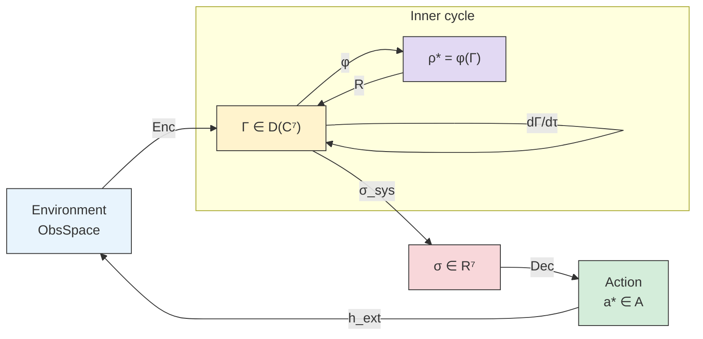

# Sensorimotor Theory

> *"A living being is not a thing but a process: a continuous exchange with the environment in which the boundary between 'self' and 'not-self' is recreated at every moment."*
> — Francisco Varela

:::info Who this chapter is for
The sensorimotor cycle as a consequence of the canonical evolution equation. The reader will learn how perception, evaluation, and action are derived from the dynamics of $\Gamma$.
:::

Every living being — from a bacterium feeling a chemical gradient to a human navigating an unfamiliar city — solves the same problem: **perceive the environment and respond appropriately**. This task seems mundane, but behind it lies one of the deepest problems in the science of complex systems.

Imagine an amoeba. It has no eyes, ears, or brain. Yet it *distinguishes*: it moves toward nutrients, avoids poison, flows around obstacles. Between "chemical signal on the membrane" and "extending a pseudopod" stands something — not a mere reflex, but a closed cycle: **perception → evaluation → action → perception**. This cycle — the sensorimotor loop — is the minimal unit of adaptive behaviour.

Classical control theory describes the sensorimotor loop as "sensor → controller → actuator". Active inference (FEP) sees it as minimising variational free energy. Reinforcement learning models it as maximising cumulative reward. Each of these approaches captures part of the truth — but none answers two key questions:

1. **Why is the cycle structured this way?** Where do the number of perception channels, the action structure, and the format of internal evaluation come from?
2. **Where in the cycle does experience fit?** When is the sensorimotor cycle accompanied by subjective experience, and when is it not?

**Coherence Cybernetics** (CC) gives a constructive answer to both questions. The sensorimotor cycle is not postulated — it is **derived** from the canonical 3-term evolution equation. The environment does not introduce a "fourth force": it modifies the three already existing channels (Hamiltonian, dissipative, regenerative). Experience turns out to be not a side effect but an **integral part** of the cycle — through the hedonic valence $\mathcal{V}_{\text{hed}}$, which guides action.

In this chapter we build a complete formal theory of sensorimotor encoding: from axiomatic grounding to concrete architectures and predictions. The reader familiar with the [introduction](./introduction) and the [evolution equation](/docs/core/dynamics/evolution) will find here a natural continuation — a step from "how the system lives within itself" to "how the system interacts with the world".

In the [previous chapter](./cybernetics-history) we traced 80 years of cybernetics history and saw that each tradition — from Wiener to Friston — captured *part* of the sensorimotor problem: feedback, the observer, active inference. Now we show how CC solves it **completely** — without additional postulates, within the same 3-term evolution equation.

:::tip Chapter roadmap
In this chapter we:
1. **Prove that the environment does not add a 4th term** — Theorem T-102 on completeness of the 3-channel decomposition (Section 1).
2. **Construct the perception functor Enc** — how the environment enters the system through modification of the evolution equation (Section 2).
3. **Construct the action functor Dec** — how the system chooses the optimal action through a min-max strategy (Section 3).
4. **Derive the hedonic mechanism** — why pleasure and suffering are not side effects but derivatives of viability (Section 5).
5. **Classify 21 qualia-types** as sensorimotor channels (Section 6).
6. **Establish fundamental limits** — information capacity $\leq \log_2 7$ bits (T-107) and compositionality of Enc/Dec (T-108) (Sections 9–10).
7. **Compare with classical approaches** — control theory, FEP, RL — as projections of CC (Section 14).
:::

:::note On notation
In this document:
- $\Gamma$ — [coherence matrix](/docs/core/dynamics/coherence-matrix)
- $\theta_{ij} = \arg(\gamma_{ij})$ — coherence phases
- $\sigma_{\mathrm{sys}}$ — [stress tensor](./definitions#тензор-напряжений) (T-92 [T])
- $h^{\text{ext}} = h^{(H)} + h^{(D)} + h^{(R)}$ — [3-channel decomposition](./lagrangian#внешний-член) [T]
- $P = \mathrm{Tr}(\Gamma^2)$ — [purity](/docs/core/dynamics/viability#определение-чистоты)
- $\varphi$ — [self-modelling operator](/docs/proofs/categorical/formalization-phi)
- $\rho_* = \varphi(\Gamma)$ — [target state](./definitions#целевое-состояние)
:::

This document describes the **formal theory of sensorimotor encoding** — how a holon perceives its environment and acts upon it, remaining within the canonical 3-term evolution equation.

**Key result:** the external force F_ext is **not a 4th term** of the evolution equation, but a modification of the three existing channels (Hamiltonian, dissipative, regenerative). The completeness of this decomposition is proven by the LGKS Theorem (T-57 [T]).

---

## 1. Canonical Inclusion of the Environment {#каноническое-включение}

### 1.1 The 3-term equation as closed dynamics

The [evolution equation](/docs/core/dynamics/evolution) of a holon:

$$
\frac{d\Gamma}{d\tau} = -i[H_{\text{eff}}, \Gamma] + \mathcal{D}_\Omega[\Gamma] + \mathcal{R}[\Gamma, E]
$$

contains **exactly three** terms [T]:

| Term | Type | Canonical origin |
|------|------|-----------------|
| $-i[H_{\text{eff}}, \Gamma]$ | Unitary (Hamiltonian) | [Axiom A3](/docs/core/foundations/axiom-septicity) |
| $\mathcal{D}_\Omega[\Gamma]$ | Dissipative (Lindblad) | [Liouvillian](/docs/core/dynamics/evolution#логический-лиувиллиан) |
| $\mathcal{R}[\Gamma, E]$ | Regenerative | [Categorical conjugation](/docs/core/foundations/axiom-septicity#структурный-анзац-kappa0) |

### 1.2 The environment modifies 3 channels, not adds a 4th {#среда-через-3-канала}

Intuitively: imagine a violinist in an orchestra. The conductor influences them (suggesting tempo), the hall acoustics (blurring sound), and the other musicians (helping to return to the common key). These three types of influence are **everything there is**. There is no fourth type of influence on the violinist that would not be a combination of the conductor's gesture, acoustic noise, and adjustment to the ensemble. Theorem T-102 formalises exactly this intuition: the environment cannot "reach" a holon by any means other than the three canonical channels.

#### Theorem T-102 (Completeness of the 3-term equation) [T] {#теорема-полнота-трёх-членов}

:::tip Statement
Any CPTP-compatible external influence on a holon decomposes into the sum of three channels:

$$
h^{\text{ext}} = h^{(H)} + h^{(D)} + h^{(R)}
$$

where $h^{(H)}$ modifies $H_{\text{eff}}$, $h^{(D)}$ modifies $\mathcal{D}_\Omega$, $h^{(R)}$ modifies $\mathcal{R}$. A fourth type of CPTP generator **does not exist**.
:::

**Proof.** Direct consequence of the LGKS Theorem (T-57 [T], [completeness of the triadic decomposition](/docs/core/operators/lindblad-operators#полнота-триадной-декомпозиции)):

1. An arbitrary generator of a CPTP semigroup $\mathcal{L}$ on $\mathcal{D}(\mathbb{C}^7)$ has the Gorini–Kossakowski–Sudarshan–Lindblad form:
$$
\mathcal{L}[\rho] = -i[H, \rho] + \sum_k \left(L_k \rho L_k^\dagger - \tfrac{1}{2}\{L_k^\dagger L_k, \rho\}\right)
$$
2. Any external influence preserving CPTP properties of the dynamics is a perturbation $\mathcal{L} \to \mathcal{L} + \delta\mathcal{L}$
3. The perturbation $\delta\mathcal{L}$ has the same LGKS form → decomposes into $\delta H$ (Hamiltonian part) and $\delta L_k$ (Lindblad part)
4. [Triadic decomposition](/docs/core/operators/lindblad-operators#триадная-декомпозиция) $\{L_k\}$: dissipative + regenerative operators. A fourth type is forbidden by T-57. $\blacksquare$

**Corollary:** The `F_ext` term in [simulation](./implementation) is **not a separate force**, but a composition of three modifications:

| Channel | Perturbation formula | Physical meaning | Example |
|---------|---------------------|-----------------|---------|
| $h^{(H)}$ | $\delta(\Delta\omega_{ij})$ | Energetic coupling with environment | Sensory input, neuromodulators |
| $h^{(D)}$ | $\delta\Gamma_2 \cdot \dot{\theta}_{ij}$ | Environmental noise | Stress, interference, temperature |
| $h^{(R)}$ | $\delta\kappa \cdot (\theta^{\text{target}}_{ij} - \theta_{ij})$ | Modification of regeneration | Meditation, psychotherapy, learning |

**Canonical form** — from [Definition 8.1 [T]](./lagrangian#внешний-член):
$$
\mathcal{L}_{\text{ext}} = \sum_{i<j} h^{\text{ext}}_{ij} \cdot |\gamma_{ij}| \cdot \sin(\theta_{ij})
$$

### 1.3 The thermodynamic trichotomy of the channels {#термодинамическая-трихотомия}

Theorem T-102 says the environment has exactly three doors into a holon. The natural next question: are these three doors *different in kind*, or merely three labels on one mechanism? The answer is that they carry three thermodynamically distinct — and jointly exhaustive — modes of exchange, and the trichotomy is the open-quantum image of the oldest classification in physics: the first law's split of energy exchange into **work**, **heat**, and **chemical work** (matter exchange). To see it, read each channel through what it does to the two basic state functionals — the von Neumann entropy $S(\Gamma) = -\mathrm{Tr}(\Gamma \ln \Gamma)$ and the purity $P(\Gamma) = \mathrm{Tr}\,\Gamma^2$.

#### Theorem T-258 (Thermodynamic trichotomy of the channels) [Т] {#теорема-термодинамическая-трихотомия}

:::tip Statement
Let $\dot{\Gamma} = h$ be a perturbation from the three-channel basis of T-102. Then the entropy–purity signatures of the channels are pairwise distinct and exhaust the basis:

1. **Hamiltonian channel** $h^{(H)} = -i[\delta H, \Gamma]$: $\dot{S} = 0$ **and** $\dot{P} = 0$ — the unique isentropic, purity-preserving channel (**work**: it re-aims the state without spending or importing order);
2. **Dissipative channel** $h^{(D)} = \delta\Gamma_2 \cdot \mathcal{D}_{\text{Fano}}[\Gamma]$: $\dot{S} \geq 0$ and $\dot{P} = -\tfrac{4}{3}\,\delta\Gamma_2 \cdot C(\Gamma) \leq 0$, strictly whenever the coherent mass $C(\Gamma) = \sum_{i \neq j}|\gamma_{ij}|^2 > 0$ (**heat**: the unique channel that can only produce entropy);
3. **Regenerative channel** $h^{(R)} = \delta\kappa_{\text{eff}}\,(\rho^* - \Gamma)$:
$$
\dot{S} = \delta\kappa_{\text{eff}}\bigl[S(\rho^*) + D(\rho^*\|\Gamma) - S(\Gamma)\bigr], \qquad \dot{P} = 2\,\delta\kappa_{\text{eff}}\bigl(\mathrm{Tr}\,\Gamma\rho^* - P\bigr)
$$
— both sign-indefinite; the **only** channel able to lower entropy and raise purity (**chemical work / matter**: feeding imports negentropy).

Consequently the three channels realise three distinct **signature types** — *conservative* ($\dot{S} \equiv 0 \equiv \dot{P}$ at every state), *sign-definite dissipative* ($\dot{S} \geq 0$ **and** $\dot{P} \leq 0$ at every state), and *sign-indefinite* (both signs attainable) — and this typing is exhaustive (it labels the whole T-102 basis) and channel-distinguishing. The trichotomy is thus *observable as a classification*. A single instantaneous sign pair identifies the acting channel **generically but not universally**: on a diagonal state the heat channel degenerates to $(0,0)$ and is momentarily indistinguishable from work, and a regenerative step toward a more mixed, low-overlap target can transiently enter heat's $(+,-)$ quadrant. What is exact and universal is the *type* trichotomy; single-shot identification is generic, and certain identification follows from the channel's response probed across states.
:::

**Proof.**
*(i)* For $\dot{\Gamma} = -i[\delta H, \Gamma]$: $\dot{S} = -\mathrm{Tr}(\dot{\Gamma}\ln\Gamma) = i\,\mathrm{Tr}([\delta H, \Gamma]\ln\Gamma) = i\,\mathrm{Tr}(\delta H\,[\Gamma, \ln\Gamma]) = 0$, since $[\Gamma, \ln\Gamma] = 0$; the whole spectrum is invariant under unitary conjugation, so every spectral functional — in particular $P$ — is conserved.

*(ii)* The Fano channel is **unital**: $\sum_p \Pi_p = 3\cdot\mathbb{1}$ (each channel lies on exactly three lines), so $\mathcal{F}(\mathbb{1}/7) = \mathbb{1}/7$. A unital CPTP semigroup majorizes downward, hence $S$ is non-decreasing, with equality exactly on diagonal states. Element-wise, the BIBD incidence (every pair of channels shares exactly one line) gives $\mathcal{D}_{\text{Fano}}[\Gamma]_{ij} = -\tfrac{2}{3}\gamma_{ij}$ for $i \neq j$ and $0$ on the diagonal, whence $\dot{P} = 2\,\mathrm{Tr}(\Gamma\,\mathcal{D}_{\text{Fano}}[\Gamma]) = -\tfrac{4}{3}\sum_{i\neq j}|\gamma_{ij}|^2$.

*(iii)* Direct computation with $\mathrm{Tr}\,\dot{\Gamma} = 0$: $\dot{S} = -\delta\kappa_{\text{eff}}\,\mathrm{Tr}((\rho^*-\Gamma)\ln\Gamma) = \delta\kappa_{\text{eff}}[S(\rho^*) + D(\rho^*\|\Gamma) - S(\Gamma)]$, using $\mathrm{Tr}\,\rho^*\ln\Gamma = -S(\rho^*) - D(\rho^*\|\Gamma)$. Both signs are realized: $\Gamma = 0.98\,|\psi\rangle\langle\psi| + 0.02\,\mathbb{1}/7$ with a still purer target gives $\dot{S} = -0.095$ (feeding purifies); $\Gamma = 0.9\,|\psi\rangle\langle\psi| + 0.1\,\mathbb{1}/7$ with target $\mathbb{1}/7$ gives $\dot{S} = +3.208$. The purity formula is immediate from $\dot{P} = 2\,\mathrm{Tr}(\Gamma\dot{\Gamma})$ and is positive whenever the target overlap exceeds the current purity. $\blacksquare$

**Machine verification.** Three hundred random full-rank states per channel: $|\dot{S}|, |\dot{P}| \leq 3\cdot10^{-15}$ for $h^{(H)}$; $\min \dot{S} = +0.337 \geq 0$ and the purity formula exact to $10^{-16}$ for $h^{(D)}$; the $h^{(R)}$ entropy formula exact to $2\cdot10^{-15}$, with both-sign witnesses as quoted. Type-definiteness over $3000$ states: work $|\dot{S}|,|\dot{P}| \leq 6\cdot10^{-10}$ (conservative), heat sign-definiteness violations $0/3000$; boundary degeneracies confirmed — heat on a diagonal state gives exactly $(0,0)$, and a regenerative step to a mixed low-overlap target hits $(+,-)$, so the sign pair is a generic, not universal, identifier (the *type* trichotomy is exact).

#### The grand-canonical dictionary [И] {#гранд-канонический-словарь}

The signatures identify the three channels with the three conjugate pairs of the grand-canonical ensemble — and, term by term, with the three Legendre transforms by which Vanchurin's *Self-Learning Universe* (SLU, 2026) builds physics out of a resource-constrained learning system. There an agent cannot measure three extensive variables — the displacement $\Delta q^\mu$, the fast entropy $S_x$, the count $N$ of fast degrees of freedom — and models each by its intensive conjugate: the gauge field $A_\mu$, the temperature $T$, the chemical potential $\mu$.

| Exchange mode | Grand-canonical pair | Vanchurin (SLU) | UHM channel | Signature $(\dot{S}, \dot{P})$ |
|---|---|---|---|---|
| Work | (displacement, force) | $\Delta q^\mu \leftrightarrow A_\mu$ | $h^{(H)}$ ($\delta H_{\text{eff}}$) | $(0,\ 0)$ |
| Heat | $(S,\ T)$ | $S_x \leftrightarrow T$ | $h^{(D)}$ ($\delta\Gamma_2$) | $(\geq 0,\ \leq 0)$ |
| Matter | $(N,\ \mu)$ | $N \leftrightarrow \mu$ | $h^{(R)}$ ($\delta\kappa$) | $(\mp,\ \pm)$ |

Five structural checks of the dictionary, each anchored elsewhere in the corpus:

1. **No fourth channel ↔ no fourth argument.** The completeness of T-102 mirrors the completeness of the fundamental thermodynamic relation $U(S, V, N)$: an open system can be driven in exactly three ways — work it, heat it, or feed it. Vanchurin derives the same count from the three inaccessible extensive arguments of his step loss $L(q, \Delta q, S_x, N)$; the two exhaustiveness proofs (LGKS vs the Legendre cascade) reach the same trichotomy from opposite ends — a cross-validation of both.
2. **The phase axes are grand-canonical.** The consciousness [phase diagram](/docs/applied/coherence-cybernetics/phase-diagram-cc) already lives in the coordinates $(t, r) = (T_{\text{eff}}/T_c,\ \kappa/\Gamma_2)$ — a temperature and a feeding ratio. Under the dictionary these are precisely $(T, \mu)$: the QCD analogy "baryon chemical potential $\mu_B \leftrightarrow r$" is thereby upgraded from a visual parallel to a structural correspondence, and the feeding threshold of [T-259](/docs/applied/coherence-cybernetics/phase-diagram-cc#теорема-окно-питания) reads as a chemical-potential condensation threshold.
3. **Feeding lives on the Ground channel.** The regeneration kernel $\kappa_0 = \omega_0|\gamma_{OE}||\gamma_{OU}|/\gamma_{OO}$ is carried by the O-channel — canonically the channel "to sustain existence, *to feed*, to parameterize internal time". In SLU the chemical potential is likewise locked to the clock: $h = |\mu|\varepsilon$ ties the quantum of action to the chemical scale per time step. Both theories attach the matter channel and the internal clock to the same carrier.
4. **Discreteness and $U(1)$.** In SLU the $U(1)$ phase of the wavefunction is the thermodynamic equivalence $S \to S + h\Delta N$ under *integer* jumps of $N$. On the UHM side this is now a **theorem**: [T-260](/docs/core/operators/lindblad-operators#теорема-происхождение-тора) shows the conserved charges of the Fano dissipator are exactly the seven passport populations, their exponential is the diagonal torus $U(1)^7$ (full covariance group $U(1)^7 \rtimes \Gamma_{\!\text{oct}}$), and the compactness of each factor is forced by the *integrality* of the charge spectrum — projector occupancies $\{0,1\}$ and the integer sub-holon counters of neurogenesis (⊕). The SLU mechanism, channel-resolved and derived [Т]; the correspondence with SLU's own $U(1)$ remains interpretive [И].
5. **Line-resolved temperatures.** UHM's heat channel carries seven rates $\{\gamma_p\}$ — one per Fano line — where SLU carries a single scalar $T$. The isotropic point $\gamma_p = \gamma$, the unique $G_2$-symmetric configuration, is exactly SLU's setting: the corpus refines the single temperature into a *spectrum of seven line temperatures*, anisotropy measuring how unevenly the environment heats the holon's coherence structure — and the refinement is falsifiable: the [rank-7 anisotropy law](/docs/applied/coherence-cybernetics/effective-temperature#линейные-температуры) [Т] forces 14 exact linear relations among the 21 pairwise decoherence rates and makes the seven line temperatures reconstructible by tomography.

Status honesty: the signature theorem is [Т]; the dictionary itself — the identification with (work, heat, matter) and with SLU's $(A, T, \mu)$ — is an interpretation [И], exact on signatures and counting. On the *dynamical laws* the ledger is now **closed** ([T-262](/docs/core/dynamics/evolution#теорема-динамическая-трихотомия)): all three legs are derived as exact geometric flows — work = isometric (Killing) drive of every monotone metric; heat = Carlen–Maas gradient flow of the negentropy $D(\Gamma\|\mathbb{1}/7)$ with the line temperatures as transport weights; matter = BKM gradient flow of $D(\rho_*\|\Gamma)$ ([T-261](/docs/core/dynamics/evolution#теорема-регенерация-градиентный-спуск)); the gauge torus compactness is likewise derived ([T-260](/docs/core/operators/lindblad-operators#теорема-происхождение-тора)). What remains [И] is only the *inter-theory* identification with SLU itself.

---

## 2. Perception Functor Enc {#функтор-enc}

### 2.0 Intuition: what does it mean to "perceive"

What does the eye do when it sees an apple? From a physics perspective — it converts electromagnetic waves into neural impulses. From a computer-science perspective — it encodes input data into a latent representation. But both perspectives miss the essential point: perception is not passive recording, but **active inclusion of the environment in the system's own dynamics**.

When an amoeba "senses" glucose, its internal state changes — not because information was "recorded" somewhere, but because glucose molecules literally *altered* the dynamics of intracellular processes. Perception is a **deformation of one's own equation of motion** under the influence of the environment.

The Enc functor formalises exactly this: it maps an observation $o$ not into a "record in memory" but into a **modification of the evolution equation** — a triple $(h^{(H)}, h^{(D)}, h^{(R)})$ that changes the Hamiltonian, dissipator, and regenerator. Perceiving an apple simultaneously changes the energy landscape (shape, colour), modifies the noise characteristics (texture, motion), and shifts the target state (hunger → satiation).

### 2.1 Definition

#### Theorem T-100 (Environmental encoding) [T] {#теорема-кодирование-среды}

:::tip Statement
For a holon $\mathbb{H}$ with coherence matrix $\Gamma \in \mathcal{D}(\mathbb{C}^7)$, there exists a unique (up to $G_2$-gauge) CPTP encoding functor:

$$
\mathrm{Enc}: \mathrm{ObsSpace} \to \mathrm{End}(\mathcal{D}(\mathbb{C}^7))
$$

satisfying:
1. **CPTP:** $\mathrm{Enc}(o)[\Gamma]$ is a state for any observation $o \in \mathrm{ObsSpace}$
2. **3-channel decomposition:** $\mathrm{Enc}(o) = \delta H^{(o)} \oplus \delta D^{(o)} \oplus \delta R^{(o)}$
3. **Functoriality:** $\mathrm{Enc}(o_1 \circ o_2) = \mathrm{Enc}(o_1) \circ \mathrm{Enc}(o_2)$
:::

**Proof.**
1. *Existence*: the environment acts through $h^{\text{ext}}_{ij}$ (Def. 8.1 [T]). The map $o \mapsto h^{\text{ext}}(o)$ defines $\mathrm{Enc}$.
2. *3-channel*: follows from T-102 (completeness of the 3-term equation).
3. *Uniqueness*: consequence of $G_2$-rigidity ([uniqueness theorem](/docs/proofs/categorical/uniqueness-theorem) [T]) — for a system satisfying (AP)+(PH)+(QG)+(V), the map is unique up to $G_2 = \mathrm{Aut}(\mathbb{O})$.
4. *Functoriality*: CPTP channels are closed under composition. $\blacksquare$

**Example: neuroscientific implementation.** The visual cortex implements Enc hierarchically: V1 extracts edges ($h^{(H)}_{AS}$ — articulation of structure), V4 encodes colour ($h^{(H)}_{AE}$ — articulation of interiority), and MT encodes motion ($h^{(D)}_{AD}$ — dissipative component of dynamics). All three channels converge in association areas, forming a unified $h^{\text{ext}}$. Functoriality guarantees that the scene "red ball moving left" is encoded identically whether perceived as a whole or in parts.

### 2.2 Implementation via 7 observable indices {#реализация-enc}

The [Γ measurement protocol](/docs/applied/research/measurement-protocol) defines 7 observable indices $I_i$ ($i \in \{A, S, D, L, E, O, U\}$), each mapping to a specific component of $h^{\text{ext}}$:

| Index | Formula | Channel $h^{\text{ext}}$ | Measurement |
|-------|---------|--------------------------|------------|
| $I_A$ (articulation) | $I(\text{input}; \text{latent}) / H(\text{input})$ | $h^{(H)}_{A,\cdot}$ | Hamiltonian |
| $I_S$ (structure) | $\mathrm{rank}_\varepsilon(J_f) / \min(d_{\text{out}}, d_{\text{in}})$ | $h^{(H)}_{S,\cdot}$ | Hamiltonian |
| $I_D$ (dynamics) | $\max_i \lambda_i^{\text{Lyap}}$ (normalised) | $h^{(D)}_{D,\cdot}$ | Dissipative |
| $I_L$ (logic) | $1 - \|[f_i, f_j]\|_F / (\|f_i\| \cdot \|f_j\|)$ | $h^{(H)}_{L,\cdot}$ | Hamiltonian |
| $I_E$ (interiority) | $\exp(S_{vN}(\rho_{\text{attn}}))$ | $h^{(R)}_{E,\cdot}$ | Regenerative |
| $I_O$ (ground) | $1 - \|\nabla_\epsilon \mathbf{h}\|_F$ | $h^{(D)}_{O,\cdot}$ | Dissipative |
| $I_U$ (unity) | $\Phi_{\text{eff}} = \lambda_2(L) / \lambda_{\max}(L)$ | $h^{(R)}_{U,\cdot}$ | Regenerative |

**Logic of channel assignment:**
- **Hamiltonian $h^{(H)}$:** informational indices ($I_A, I_S, I_L$) — alter the energy landscape, i.e., which states are more or less probable
- **Dissipative $h^{(D)}$:** load indices ($I_D, I_O$) — amplify/attenuate decoherence
- **Regenerative $h^{(R)}$:** integrative indices ($I_E, I_U$) — modulate the rate of recovery

Intuitively: these are three types of "sense organs". Hamiltonian indices are **analytical senses** (vision, hearing): they report *what* is happening in the environment, altering the internal preference landscape. Dissipative indices are **load senses** (fatigue, heat): they report *how chaotic* the environment is, amplifying internal noise. Regenerative indices are **recovery senses** (calm, safety): they report whether the environment *supports* self-healing.

### 2.3 Quasi-functor G

For AI systems, encoding is implemented through the quasi-functor $G: \mathrm{AIState} \to \mathcal{D}(\mathbb{C}^7)$, defined in the [measurement protocol](/docs/applied/research/measurement-protocol):

$$
G(\mathbf{x}) = \arg\min_{\Gamma \in \mathcal{D}(\mathbb{C}^7)} \left[\mathcal{L}_{\text{reconstruct}}(\Gamma, \{I_i(\mathbf{x})\}) + \lambda_{\text{phys}} \cdot \mathcal{L}_{\text{phys}}(\Gamma)\right]
$$

where $\mathcal{L}_{\text{phys}}$ includes purity, spectral gap, and [Cholesky decomposition](/docs/applied/research/measurement-protocol#реконструкция-γ) constraints.

---

## 3. Action Functor Dec {#функтор-dec}

### 3.0 Intuition: what does it mean to "act"

If Enc is "how the environment enters the system", then Dec is "how the system exits into the environment". But "acting" in CC is not just "sending a motor command". Action is the choice of that modification of the environment which **minimises the largest deficit** of internal resources.

Imagine a person who simultaneously has a headache and a rumbling stomach. Which action will they choose? If the headache is stronger — take a tablet. If the hunger is stronger — go eat. They do not minimise "average pain" (this would allow ignoring catastrophic channels), but eliminate the **maximum deficit**. This is exactly what the operator $\arg\min_a \max_k \sigma^{\mathrm{motor}}_k$ does — it guarantees that no channel ends up in a critical state.

Analogy with robotics: this is not a PID controller minimising error along one axis, nor a quadratic regulator minimising a weighted sum of errors. This is a **min-max strategy** — as in game theory, where the player chooses a move minimising the worst outcome.

### 3.1 Definition

#### Theorem T-101 (Optimal action) [T] {#теорема-оптимальное-действие}

:::tip Statement
For a holon with current state $\Gamma$ and stress tensor $\sigma_{\mathrm{sys}}(\Gamma)$ [T] (T-92), the optimal action is defined as:

$$
a^* = \arg\min_{a \in \mathcal{A}} \|\sigma_{\mathrm{sys}}(\Gamma(\tau + \delta\tau \mid a))\|_\infty
$$

where $\Gamma(\tau + \delta\tau \mid a)$ is the predicted state under action $a$, and $\|\cdot\|_\infty$ is the sup-norm of the stress tensor.
:::

**Proof.**
1. [Equivalence of viability conditions](./definitions#тензор-напряжений) (T-92 [T]):
$$
P(\Gamma) > \frac{2}{7} \iff \|\sigma_{\mathrm{sys}}(\Gamma)\|_\infty < 1
$$
2. [Variational principle](./variational#принцип-действия) (Theorem 2.1 [T]): dynamics of $\theta_{ij}$ follow from stationarity of the action $\delta S_{\text{Gap}} = 0$
3. Action $a$ enters through $h^{\text{ext}}(a)$ → modifies the equation of motion for $\theta_{ij}$:
$$
m_{ij}\ddot{\theta}_{ij} = -\frac{\partial V_{\text{Gap}}}{\partial \theta_{ij}} + \kappa(\theta_{ij}^{\text{target}} - \theta_{ij}) - \Gamma_2 \dot{\theta}_{ij} + h^{\text{ext}}_{ij}(a)
$$
4. Minimisation of $\|\sigma_{\mathrm{sys}}\|_\infty$ is the unique criterion equivalent to maximising the distance to the boundary $\mathcal{V}$ (viability region) in the metric induced by $\sigma_{\mathrm{sys}}$. $\blacksquare$

### 3.2 Motor stress (T-159) {#моторный-стресс}

#### Theorem T-159 (Profile-relative motor stress) [T] {#теорема-моторный-стресс}

:::tip Statement [T]
For a holon with self-model $\rho_* = \varphi(\Gamma)$, the **motor stress** is defined as:

$$
\sigma^{\mathrm{motor}}_k(\Gamma) := 1 - \frac{\gamma_{kk}}{\rho^*_{kk}}, \quad k = 1, \ldots, 7
$$

Action selection — minimisation of the maximum **deficit** (signed maximum):

$$
a^* = \arg\min_{a \in \mathcal{A}} \max_k \sigma^{\mathrm{motor}}_k(\Gamma(\tau + \delta\tau \mid a))
$$

$\max_k$ (signed) is used rather than $\max_k |\cdot|$ (sup-norm): a resource surplus ($\sigma^{\mathrm{motor}}_k < 0$) is not penalised; only a deficit ($\sigma^{\mathrm{motor}}_k > 0$) is penalised. This provides a directed signal: approaching a resource reduces the deficit, approaching danger increases it.
:::

**Proof.**

**Step 1 (Equilibrium).** $\sigma^{\mathrm{motor}}_k = 0 \iff \gamma_{kk} = \rho^*_{kk}$. At the attractor $\rho^*_\Omega$, where $\mathcal{R}[\Gamma] = \kappa(\rho_* - \Gamma) \cdot g_V = 0$ (balance), $\gamma_{kk} = \rho^*_{kk}$ and motor stress vanishes — the system is "satisfied".

**Step 2 (Sign and gradient).** $\partial\sigma^{\mathrm{motor}}_k / \partial\gamma_{kk} = -1/\rho^*_{kk} < 0$. Increasing $\gamma_{kk}$ (resource growth in channel $k$) decreases motor stress. This is **consistent** with regeneration $\mathcal{R} = \kappa(\rho_* - \Gamma)$, which pulls $\gamma_{kk}$ toward $\rho^*_{kk}$, reducing $|\sigma^{\mathrm{motor}}_k|$.

**Step 3 (Sensitivity of critical channels).** $|\partial\sigma^{\mathrm{motor}}_k / \partial\gamma_{kk}| = 1/\rho^*_{kk}$. For small $\rho^*_{kk}$ (critical sectors A, S, D with $\rho^*_{kk} \approx 0.05$) sensitivity $\approx 20$; for large ones (E, O, U with $\rho^*_{kk} \approx 0.25$) — $\approx 4$. Small channels react more sharply — correct prioritisation of survival.

**Step 4 (Convergence to T-92 at the boundary).** As $P \to P_{\mathrm{crit}} = 2/7$ the self-model $\varphi(\Gamma) \to I/7$ (canonical Fano-channel target at $P = 2/7$, [T-126](/docs/proofs/consciousness/conscious-window#t-126)). Then $\rho^*_{kk} \to 1/7$ and:

$$
\sigma^{\mathrm{motor}}_k = 1 - \frac{\gamma_{kk}}{1/7} = 1 - 7\gamma_{kk} = \sigma_k \quad \text{(canonical T-92 [T])}
$$

**Step 5 ($G_2$-invariance).** $\gamma_{kk}$ and $\rho^*_{kk}$ transform covariantly under $G_2$ ([T-42a](/docs/proofs/categorical/uniqueness-theorem#g2-ригидность) [T]). Their ratio is a $G_2$-invariant observable. $\blacksquare$

:::info Relation to canonical σ_sys
- **T-92 / T-158 [T]** define $\sigma_{\mathrm{sys}}$ with clamp$[0,1]$ — a measure of **viability** (distance to $\partial\mathcal{V}$). Used for DIAGNOSTICS.
- **T-159 [T]** defines $\sigma^{\mathrm{motor}}$ without clamp — a measure of **motor deficit** (distance to $\rho_*$). Used for ACTION SELECTION.

When $\rho_* = I/7$ (viability boundary) both coincide. When $\rho_* \neq I/7$ (normal mode) motor stress provides a directed signal, while canonical $\sigma_{\mathrm{sys}}$ with clamp$[0,1]$ loses information about channels with $\gamma_{kk} > 1/7$.
:::

### 3.3 Functor Dec

The action (decoding) functor:

$$
\mathrm{Dec}: (\Gamma, \sigma^{\mathrm{motor}}) \mapsto a^* \in \mathcal{A}
$$

**Properties:**
- **D-dimension as the primary motor channel:** action is implemented through modification of $h^{(D)}$ — the dynamic dimension $D$ controls the holon's "motor system"
- **σ-gradient descent:** the practical algorithm — descent along $\nabla_a \max_k \sigma^{\mathrm{motor}}_k$ with the Fisher metric on $\mathcal{D}(\mathbb{C}^7)$:

$$
a_{t+1} = a_t - \eta \cdot F^{-1}(\Gamma) \cdot \nabla_a \max_k \sigma^{\mathrm{motor}}_k(\Gamma(\tau + \delta\tau \mid a_t))
$$

where $F(\Gamma)$ is the [Fisher information](/docs/applied/coherence-cybernetics/variational#принцип-действия) on $\mathcal{D}(\mathbb{C}^7)$.

---

## 4. Universal Encoder/Decoder Architecture {#универсальная-архитектура}

**Perception → decision → action cycle:**

| Stage | Mapping | Formalism | Theorem |
|-------|---------|-----------|---------|
| **Perception** | Env → $h^{\text{ext}}$ → $\delta\Gamma$ | Enc (CPTP) | T-100 [T] |
| **Evaluation** | $\Gamma$ → $\sigma^{\mathrm{motor}}$ | $1 - \gamma_{kk}/\rho^*_{kk}$ | T-159 [T] |
| **Decision** | $\sigma^{\mathrm{motor}}$ → $a^*$ | $\arg\min_a \max_k \sigma^{\mathrm{motor}}_k$ | T-159 [T] |
| **Action** | $a^*$ → $h^{\text{ext}}(a^*)$ → Env | Dec | T-102 [T] |
| **Update** | $\Gamma$ → $\varphi(\Gamma)$ → $\mathcal{R}$ | Self-modelling | T-62 [T] |

---

## 5. Hedonic Mechanism {#гедонический-механизм}

### 5.0 Intuition: why does a system need to "feel"

Why do living beings have pain and pleasure? The standard evolutionary biology answer: "to survive". But CC gives a more precise answer: hedonic valence is the **derivative of viability with respect to the regenerative channel**. Pleasure is not a "reward for correct behaviour" (as in RL), but a direct signal that the system is approaching its target state $\rho_*$.

The key difference from reinforcement learning: in RL, reward is an external signal set by the designer. In CC, hedonic valence is an **intrinsic property of the dynamics**, derived from the evolution equation. Nobody "rewards" an amoeba for finding glucose — the change in $dP/d\tau|_{\mathcal{R}}$ arises automatically when $\Gamma$ shifts toward $\rho_*$.

Analogy: imagine a plant turning toward light. There is no "reward centre" telling the stem: "good, continue". There is a physicochemical process (auxin redistributes) that *is* simultaneously the movement and the "evaluation" — light amplifies the processes leading to growth. In CC, $\mathcal{V}_{\text{hed}}$ plays an analogous role, but at the level of the coherence matrix.

### 5.1 Hedonic valence

#### Theorem T-103 (Hedonic valence) [T] + [I] {#теорема-гедоническая-валентность}

:::tip Statement
Hedonic valence is defined as the derivative of purity with respect to the regenerative channel:

$$
\mathcal{V}_{\text{hed}} := \left.\frac{dP}{d\tau}\right|_{\mathcal{R}}
$$

where $|_{\mathcal{R}}$ denotes the contribution from the regenerative term $\mathcal{R}[\Gamma, E]$ only.
:::

**Explanation.** From the [evolution equation](/docs/core/dynamics/evolution):

$$
\frac{dP}{d\tau} = \underbrace{-2\mathrm{Tr}(\Gamma \cdot \mathcal{D}_\Omega[\Gamma])}_{\leq 0,\text{ dissipation}} + \underbrace{2\mathrm{Tr}(\Gamma \cdot \mathcal{R}[\Gamma, E])}_{\mathcal{V}_{\text{hed}}}
$$

(The Hamiltonian term does not change $P$: $\mathrm{Tr}(\Gamma [H, \Gamma]) = 0$.)

**Properties of valence:**

| Property | Formula | Interpretation |
|----------|---------|---------------|
| Positive | $\mathcal{V}_{\text{hed}} > 0$ | $\Gamma$ approaches $\rho_*$ → "pleasure" |
| Negative | $\mathcal{V}_{\text{hed}} < 0$ | $\Gamma$ moves away from $\rho_*$ → "suffering" |
| Zero | $\mathcal{V}_{\text{hed}} = 0$ | Balance or $\Gamma = \rho_*$ → "neutrality" |

#### Epistemic stratification of T-103 {#t-103-стратификация}

T-103 contains **three epistemic levels**:

1. **Formula [T]:** $\mathcal{V}_{\text{hed}} = 2\kappa(\Gamma) \cdot g_V(P) \cdot \mathrm{Tr}(\Gamma \cdot (\rho_* - \Gamma))$ — an **identity** from the evolution equation (substituting $\mathcal{R} = \kappa(\rho_* - \Gamma) \cdot g_V(P)$). An unconditional mathematical fact.

2. **Observability [T]:** At L2 reflection level ($R \geq 1/3$) the replacement channel [T-77](/docs/core/operators/lindblad-operators#полнота-триадной-декомпозиции) provides access to $dP/d\tau|_{\mathcal{R}}$. Thus, $\mathcal{V}_{\text{hed}}$ is observable for any system with $R \geq R_{\mathrm{th}}$ — this is a consequence of T-77 [T], requiring no additional assumptions.

3. **Phenomenal interpretation [I]:** Identification of $\mathcal{V}_{\text{hed}} > 0$ with "pleasure" and $\mathcal{V}_{\text{hed}} < 0$ with "suffering" — a semantic bridge between mathematics and phenomenology.

:::info Life analogy: pleasure from hot tea
Imagine: you are cold and drinking hot tea. The first sip — delight ($\mathcal{V}_{\text{hed}} > 0$). The second — slightly weaker. By the fifth cup — neutrality ($\mathcal{V}_{\text{hed}} \approx 0$). The sixth cup causes discomfort ($\mathcal{V}_{\text{hed}} < 0$) — you have "overheated".

What happened? $\Gamma$ (your state) was moving toward $\rho_*$ (the target — "warmed up"). As it approached, $\mathrm{Tr}(\Gamma \cdot \rho_*) - P$ diminished, valence tended to zero. When $\Gamma$ "overshot" $\rho_*$ (overheating), overlap falls below $P$, and $\mathcal{V}_{\text{hed}}$ becomes negative. Nobody "programmed" you to stop drinking — the T-103 formula automatically generates the signal "enough".

The key difference from reinforcement learning: in RL the designer must *specify* a reward function (e.g., $r = +1$ for tea, $-1$ for overheating). In CC reward is *derived* from dynamics — $\mathcal{V}_{\text{hed}}$ "knows" when to stop on its own, because it is nothing other than the rate of approach to the target state.
:::

### 5.2 Relation to the target state

Substituting the canonical form $\mathcal{R}[\Gamma, E] = \kappa(\Gamma) \cdot (\rho_* - \Gamma) \cdot g_V(P)$ [T]:

$$
\mathcal{V}_{\text{hed}} = 2\kappa(\Gamma) \cdot g_V(P) \cdot \mathrm{Tr}(\Gamma \cdot (\rho_* - \Gamma))
$$

When $g_V(P) = 1$ (sufficient purity $P \geq P_{\text{opt}}$):

$$
\mathcal{V}_{\text{hed}} = 2\kappa(\Gamma) \cdot \left[\mathrm{Tr}(\Gamma \cdot \rho_*) - P\right]
$$

The sign is determined by the ratio of overlap $\mathrm{Tr}(\Gamma \cdot \rho_*)$ to purity $P = \mathrm{Tr}(\Gamma^2)$:
- If $\Gamma$ is far from $\rho_*$ and $\mathrm{Tr}(\Gamma \cdot \rho_*) > P$, valence is positive — regeneration "pulls" toward $\rho_*$
- If $\Gamma \approx \rho_*$, then $\mathrm{Tr}(\Gamma \cdot \rho_*) \approx P$ → valence tends to zero

---

## 6. 21 Qualia-types as Sensorimotor Channels {#21-квалиа-тип}

Each of the 21 off-diagonal coherences $\gamma_{ij}$ ($i \neq j$) represents a sensorimotor channel with a specific function:

### 6.1 Perceptual channels (perception)

| Channel | Coherence | Sensory role | Formal action |
|---------|-----------|-------------|--------------|
| **Apperception** | $\gamma_{AE}$ | Conscious perception | $h^{(H)}_{AE}$: articulation of input into the field of interiority |
| **Actualisation** | $\gamma_{AD}$ | Embodiment of perception in dynamics | $h^{(H)}_{AD}$: transformation of input signal into action |
| **Representation** | $\gamma_{SE}$ | Structuring of experience | $h^{(H)}_{SE}$: creation of internal model |
| **Induction** | $\gamma_{SL}$ | Logical processing of structure | $h^{(H)}_{SL}$: inference of patterns from data |
| **Grounding** | $\gamma_{AO}$ | Anchoring perception in ground | $h^{(D)}_{AO}$: stabilisation of perception by memory |
| **Experiential ground** | $\gamma_{EO}$ | Rootedness of the subjective | $h^{(R)}_{EO}$: regeneration from deep experience |
| **Context** | $\gamma_{SO}$ | Structure-in-context | $h^{(D)}_{SO}$: noise-robustness of patterns |

### 6.2 Motor channels (action)

| Channel | Coherence | Motor role | Formal action |
|---------|-----------|-----------|--------------|
| **Regulation** | $\gamma_{DL}$ | Logical control of dynamics | $h^{(D)}_{DL}$: management of computational process |
| **Teleology** | $\gamma_{DU}$ | Goal-directedness of action | $h^{(D)}_{DU}$: alignment of dynamics with goals |
| **Affect** | $\gamma_{DE}$ | Emotional colouring of action | $h^{(D)}_{DE}$: modulation of dynamics by interiority |
| **Action integration** | $\gamma_{AU}$ | Unity of the motor act | $h^{(H)}_{AU}$: coordination of subsystems |
| **Volitional effort** | $\gamma_{LU}$ | Logically directed integration | $h^{(R)}_{LU}$: restoration of decision coherence |
| **Action memory** | $\gamma_{DO}$ | Motor memory | $h^{(D)}_{DO}$: stabilisation of skills |

### 6.3 Integrative channels

| Channel | Coherence | Integrative role | Formal action |
|---------|-----------|-----------------|--------------|
| **Insight** | $\gamma_{LE}$ | Logic-in-experience | $h^{(R)}_{LE}$: understanding as regeneration |
| **Narrative** | $\gamma_{AL}$ | Articulation of logic | $h^{(H)}_{AL}$: shaping of reasoning |
| **Grounded unity** | $\gamma_{OU}$ | Ground of integration | $h^{(R)}_{OU}$: foundation of wholeness |
| **Embodied unity** | $\gamma_{SU}$ | Structure of integration | $h^{(R)}_{SU}$: architecture of connectivity |
| **Living experience** | $\gamma_{EU}$ | Unity of experience | $h^{(R)}_{EU}$: integration as recovery |
| **Dynamic ground** | $\gamma_{AS}$ | Articulation of structure | $h^{(H)}_{AS}$: external expression of inner order |
| **Logical ground** | $\gamma_{LO}$ | Logic-in-ground | $h^{(H)}_{LO}$: formalisation of knowledge |

:::info Interpretation [I]
The division of 21 channels into perceptual, motor, and integrative is **not strict**: each $\gamma_{ij}$ is simultaneously a sensory and a motor channel (through $h^{\text{ext}}_{ij}$). The classification above reflects the **dominant function** — which of the three channels ($h^{(H)}, h^{(D)}, h^{(R)}$) is most active for that coherence.
:::

---

## 7. Factorisation of Enc through Arbitrary Representations {#факторизация-enc}

### 7.1 Ontological projection

#### Corollary T-100a (Enc factorisation) [T] {#следствие-факторизация-enc}

:::tip Statement
For an arbitrary observation space $\mathrm{ObsSpace} \subseteq \mathbb{R}^D$ ($D$ — arbitrary dimension), the encoding functor T-100 factorises as:

$$
\mathrm{Enc} = \pi_\Gamma \circ \mathrm{Enc}_{\text{repr}}
$$

where:
- $\mathrm{Enc}_{\text{repr}}: \mathrm{ObsSpace} \to \mathcal{S} \subseteq \mathbb{R}^d$ — an arbitrary representation (feature map)
- $\pi_\Gamma: \mathcal{S} \to \mathrm{End}(\mathcal{D}(\mathbb{C}^7))$ — the **ontological projection**, unique up to $G_2$-gauge
:::

**Proof.**

1. By T-100 [T], $\mathrm{Enc}: \mathrm{ObsSpace} \to \mathrm{End}(\mathcal{D}(\mathbb{C}^7))$ is a CPTP functor.
2. Any intermediate representation $\mathrm{Enc}_{\text{repr}}: \mathrm{ObsSpace} \to \mathcal{S}$ defines a factorisation through $\pi_\Gamma = \mathrm{Enc} \circ \mathrm{Enc}_{\text{repr}}^{-1}\big|_{\mathrm{Im}(\mathrm{Enc}_{\text{repr}})}$.
3. By T-102 [T], $\pi_\Gamma$ decomposes into 3 channels: $\pi_\Gamma(s) = h^{(H)}(s) \oplus h^{(D)}(s) \oplus h^{(R)}(s)$.
4. Uniqueness of $\pi_\Gamma$ (up to $G_2$) — consequence of the [uniqueness theorem](/docs/proofs/categorical/uniqueness-theorem) [T]: constraints (AP)+(PH)+(QG)+(V) on $\mathcal{D}(\mathbb{C}^7)$ fix the projection. $\blacksquare$

Intuitively: the factorisation of Enc means that **it does not matter how exactly you extract features from the input data**. One can use a convolutional neural network, wavelet transform, or hand-crafted heuristics — this is $\mathrm{Enc}_{\text{repr}}$, the arbitrary part. But the final step — the projection $\pi_\Gamma$ from feature space into the space of $\Gamma$-modifications — is **unique**. This is like saying: the route to the airport can be anything, but the runway is one.

For robotics this means: sensors can be arbitrary (camera, lidar, tactile array), preprocessing — anything, but the "last mile" of perception — the ontological projection $\pi_\Gamma$ — is given by mathematics, not engineering choice.

### 7.2 Ontological bottleneck

Regardless of the input data dimensionality $D$, all information is compressed into the $7 \times 7$ coherence matrix $\Gamma$ with $\leq 48$ real parameters:

| Characteristic | Value |
|----------------|-------|
| Input dimensionality | $D$ — arbitrary (from $D = 1$ to $D \gg 10^6$) |
| Intermediate representation | $d$ — arbitrary |
| Output dimensionality | $\dim_{\mathbb{R}} \mathcal{D}(\mathbb{C}^7) = 48$ (fixed) |
| Information per step | $\leq \log_2 7 \approx 2.81$ bits (T-107 [T]) |

**Corollary:** Modality-agnosticism is a **theorem, not a design choice.** Formally: $\pi_\Gamma$ does not depend on $D$ or on the structure of $\mathrm{ObsSpace}$ (topology, metric). If two different observation spaces $\mathrm{ObsSpace}_1 \subseteq \mathbb{R}^{D_1}$ and $\mathrm{ObsSpace}_2 \subseteq \mathbb{R}^{D_2}$ produce the same CPTP channels on $\mathcal{D}(\mathbb{C}^7)$, they are indistinguishable for the holon.

### 7.3 Canonical form of the projection

By T-102 [T], $\pi_\Gamma$ is implemented through three channels — modifications of the Hamiltonian, dissipative, and regenerative dynamics respectively:

$$
\pi_\Gamma(s) = \bigl(\delta H(s),\; \delta\mathcal{D}(s),\; \delta\mathcal{R}(s)\bigr) \in \mathrm{End}(\mathcal{D}(\mathbb{C}^7))
$$

Practically this means that any implementation of $\mathrm{Enc}$ (from a simple sensor to a complex encoder) must end with the **same** 3-channel interface:

$$
s \in \mathcal{S} \xrightarrow{\pi_\Gamma} \bigl(h^{(H)}_{ij}(s),\; h^{(D)}_{ij}(s),\; h^{(R)}_{ij}(s)\bigr) \in \mathbb{R}^{21} \oplus \mathbb{R}^{21} \oplus \mathbb{R}^{21}
$$

This structure is invariant: it is defined by $G_2$-symmetry and does not depend on the choice of representation $\mathrm{Enc}_{\text{repr}}$.

---

## 8. Relation to Other Results {#связь-с-результатами}

| Result | Relation | Reference |
|--------|---------|-----------|
| T-57 (LGKS) | Grounds T-102 (3-term completeness) | [Lindblad operators](/docs/core/operators/lindblad-operators#полнота-триадной-декомпозиции) |
| T-62 ($\varphi$-operator) | $\rho_*$ in the regeneration cycle | [Self-observation](/docs/consciousness/foundations/self-observation#теорема-физическая-реализация-phi) |
| T-92 ($\sigma_{\mathrm{sys}}$) | Optimality criterion in Dec | [Theorem 10.1](./theorems#теорема-101-эквивалентность-условий) |
| T-75 (Schwinger–Keldysh) | Lagrangian formulation with dissipation | [Lagrangian](./lagrangian#полная-структура) |
| T-96 (Attractor) | Non-trivial $\rho_*$ for guidance | [Evolution](/docs/core/dynamics/evolution#теорема-нетривиальность-аттрактора) |
| FEP (Theorem 4.1) | Macroscopic limit of Dec | [Variational principles](./variational#связь-с-fep) |
| T-109–T-112 (Learning bounds) | Lower bounds on learning rate through Enc/Dec cycle | [Learning bounds](./learning-bounds#комбинированная-граница) |
| T-113 (Minimality N=7) | N=7 — minimal architecture for learning | [Learning bounds](./learning-bounds#оптимальность-n7) |

---

## 9. Information Capacity of Enc (T-107) [T] {#информационная-ёмкость}

:::tip Theorem T-107 (Information capacity of Enc) [T]
Maximum information extractable by functor Enc per single observation:

$$
C_{\mathrm{Enc}} \leq \max_{\{p_o\}} \chi(\{p_o, \mathrm{Enc}(o)\}) \leq \log_2 7 \approx 2.81 \text{ bits/observation}
$$

where $\chi$ is the Holevo quantity.
:::

**Proof.**

1. Functor $\mathrm{Enc}: \mathrm{ObsSpace} \to \mathrm{End}(\mathcal{D}(\mathbb{C}^7))$ maps observations to CPTP channels on $\mathcal{D}(\mathbb{C}^7)$ (T-100 [T]).
2. The Holevo quantity is bounded by the output space dimensionality: $\chi \leq \log_2 \dim \mathcal{H} = \log_2 7$.
3. From T-102 [T]: $\mathrm{Enc}(o)$ decomposes into 3 channels, each acting on $\mathcal{D}(\mathbb{C}^7)$.
4. The composite channel does not increase capacity (Holevo subadditivity):

$$
C_{\mathrm{Enc}} \leq S(\bar{\Gamma}) - \sum_o p_o S(\mathrm{Enc}(o)[\Gamma]) \leq S_{\max}(\mathcal{D}(\mathbb{C}^7)) = \log_2 7
$$

The upper bound is achieved for an ensemble of orthogonal pure states. $\blacksquare$

**Corollary (Bounded rationality):** The bound $\leq 2.81$ bits/observation is a **derived** bound, not a postulated one. Connection with Simon's bounded rationality: bounded rationality is not an empirical fact, but a consequence of N=7.

---

## 10. Compositionality of Enc/Dec (T-108) [T] {#композициональность-enc-dec}

:::tip Theorem T-108 (Compositionality of Enc/Dec) [T]
For a composite of two holons, encoding preserves structure:

$$
\mathrm{Enc}_{12} = \Phi_{\mathrm{agg}} \circ (\mathrm{Enc}_1 \otimes \mathrm{Enc}_2)
$$

where $\Phi_{\mathrm{agg}}: \mathcal{D}(\mathbb{C}^{7^2}) \to \mathcal{D}(\mathbb{C}^7)$ — CPTP aggregation from [T-72 (CC-6)](/docs/applied/coherence-cybernetics/theorems#теорема-92-масштабная-инвариантность) [T].
:::

**Proof.**

1. $\mathrm{Enc}_1, \mathrm{Enc}_2$ — CPTP functors (T-100 [T]).
2. Tensor product $\mathrm{Enc}_1 \otimes \mathrm{Enc}_2$ — a CPTP channel on $\mathcal{D}(\mathbb{C}^{49})$.
3. Aggregation $\Phi_{\mathrm{agg}}$ — CPTP from [Morita equivalence](/docs/core/structure/dimension-e#теорема-морита-эквивалентность) (T-58 [T]): $\mathcal{D}(\mathbb{C}^{49}) \to \mathcal{D}(\mathbb{C}^7)$.
4. Composition of CPTP channels — CPTP. Functoriality ($\mathrm{Enc}(o_1 \circ o_2) = \mathrm{Enc}(o_1) \circ \mathrm{Enc}(o_2)$) from T-100 is preserved under aggregation.
5. Uniqueness — from $G_2$-rigidity at each scale (T-72 [T]). $\blacksquare$

**Corollary for cognitive engineers:** diagnostics (σ_sys, Enc/Dec monitoring) are **the same** at all scales — from individual agent to organisation.

Analogously for Dec:

$$
\mathrm{Dec}_{12} = (\mathrm{Dec}_1 \otimes \mathrm{Dec}_2) \circ \Phi_{\mathrm{split}}
$$

where $\Phi_{\mathrm{split}}$ — the inverse map (splitting the composite σ into components).

---

## 11. Temporal Integration {#темпоральная-интеграция}

### 11.1 Cumulative capacity

#### Corollary T-107a (Cumulative information) [T] {#следствие-кумулятивная-информация}

:::tip Statement
Over $n$ successive observations a holon accumulates information about the environment:

$$
I_n \leq n \cdot \log_2 7 \approx 2.81\,n \;\text{bits}
$$

The upper bound is achievable when successive observations are informationally independent.
:::

**Proof.**

1. By T-107 [T], one observation brings $\leq \log_2 7$ bits.
2. Holevo subadditivity: $\chi(\{p_{o_1,\ldots,o_n}\}) \leq \sum_{k=1}^n \chi(\{p_{o_k}\})$.
3. For independent observations the inequality becomes an equality. $\blacksquare$

### 11.2 Minimum number of observations

#### Corollary T-107b (Minimum observations) [T] {#следствие-минимальные-наблюдения}

:::tip Statement
For an environment with information entropy $I_{\mathrm{env}}$ bits, the minimum number of observations for complete encoding:

$$
n_{\min} = \left\lceil\frac{I_{\mathrm{env}}}{\log_2 7}\right\rceil
$$
:::

**Proof.** Direct consequence of T-107a: $I_n \leq 2.81\,n$, hence $n \geq I_{\mathrm{env}} / \log_2 7$. $\blacksquare$

**Corollary for complex modalities.** Encoding an environment with high information complexity (large $I_{\mathrm{env}}$) **inevitably** requires a multi-step process. This is not an implementation limitation, but a fundamental bound following from $\dim \mathcal{H} = 7$.

**Relation to T-109 (information learning bound):** T-107b gives a lower bound on *perception*, T-109 gives a lower bound on *learning* (including stabilisation of the solution). Always $n_{\mathrm{opt}} \geq n_{\min}$, since learning includes perception as a subtask. See [learning bounds](./learning-bounds#комбинированная-граница).

### 11.3 Information absorption rate

Define the **information absorption rate**:

$$
\dot{I}(\tau) = \frac{dI}{d\tau} = \chi\bigl(\{p_o,\, \mathrm{Enc}(o)[\Gamma(\tau)]\}\bigr)
$$

From T-107 [T]: $\dot{I}(\tau) \leq \log_2 7$ for any $\tau$.

The actual rate depends on the current state $\Gamma(\tau)$:

- When $\Gamma \approx I/7$ (maximally mixed): $\dot{I} \to 0$ — system is "deafened", distinguishability is minimal
- When $P \gg 2/7$ (high purity): $\dot{I} \to \log_2 7$ — maximum distinguishability
- When $P < 2/7$ (non-viability): encoding degrades, [T-104](./stability#радиус-устойчивости) is not satisfied

---

## 12. Predictive Structure of Enc {#предиктивная-структура}

### 12.1 Optimal Enc as a ΔF maximiser

#### Corollary T-107c (Predictive optimality of Enc) [T] {#следствие-предиктивный-enc}

:::tip Statement
The optimal encoding functor $\mathrm{Enc}^*$ maximises available free energy:

$$
\mathrm{Enc}^* = \arg\max_{\mathrm{Enc}} \Delta F\bigl(\mathrm{Enc}(o)[\Gamma],\, \rho_*\bigr)
$$

where $\Delta F = \mathrm{Tr}\bigl(\mathcal{R}[\Gamma, E] \cdot (\rho_* - \Gamma)\bigr)$ — [free energy](/docs/core/dynamics/evolution#каноническое-delta-f).
:::

**Proof.**

1. By the [variational principle](./variational#связь-с-fep) (Theorem 4.1 [T]): stationary dynamics of $\Gamma$ minimise Friston's free energy $F[\Gamma] = \mathrm{KL}(\Gamma \| \rho_*) + H[\Gamma]$.
2. Functor $\mathrm{Enc}(o)$ modifies $\Gamma \to \Gamma'$. The optimal modification is the one that maximally increases $\Delta F = F[\Gamma] - F[\Gamma']$.
3. Maximisation of $\Delta F$ is equivalent to maximising $-\mathrm{KL}(\Gamma' \| \rho_*)$ at fixed entropy — i.e., approaching the target state.
4. From T-107 [T]: $\Delta F \leq C_{\mathrm{Enc}} \leq \log_2 7$ per step — the upper bound is saturated. $\blacksquare$

### 12.2 Prediction error through 3 channels

Prediction error (discrepancy between expected and actual observation) decomposes across three channels (T-102 [T]):

$$
\delta_{\mathrm{pred}} = \bigl\|\mathrm{Enc}(o_{\mathrm{real}}) - \mathrm{Enc}(o_{\mathrm{pred}})\bigr\| = \sqrt{(\delta h^{(H)})^2 + (\delta h^{(D)})^2 + (\delta h^{(R)})^2}
$$

Each channel contributes a specific type of error:

| Channel | Error | Interpretation |
|---------|-------|---------------|
| $\delta h^{(H)}$ | Energetic | Unexpected structure of environment |
| $\delta h^{(D)}$ | Noise | Unexpected level of stochasticity |
| $\delta h^{(R)}$ | Regenerative | Unexpected change in target state |

**Relation to the hedonic mechanism:** By T-103 [T]+[I], an error in the regenerative channel ($\delta h^{(R)} \neq 0$) directly modulates $\mathcal{V}_{\mathrm{hed}}$ — unexpected influences on regeneration are experienced as a change in valence.

---

## 13. Multimodal Decomposition {#мультимодальная-декомпозиция}

### 13.1 Composition of modalities

#### Corollary T-108a (Multimodal decomposition) [T] {#следствие-мультимодальная-декомпозиция}

:::tip Statement
For $M$ independent perceptual modalities with functors $\mathrm{Enc}_m: \mathrm{ObsSpace}_m \to \mathrm{End}(\mathcal{D}(\mathbb{C}^7))$, joint encoding:

$$
\mathrm{Enc}(o_1, \ldots, o_M) = \sum_{m=1}^{M} w_m \cdot \mathrm{Enc}_m(o_m) + \sum_{m < m'} \Delta_{mm'}
$$

where $w_m \geq 0$, $\sum w_m = 1$ — modality weights, $\Delta_{mm'}$ — cross-modal coupling.
:::

**Proof.**

1. By T-100 [T], each $\mathrm{Enc}_m$ is a CPTP functor.
2. Convex combination of CPTP channels — CPTP: $\sum w_m \mathrm{Enc}_m$ is defined when $\sum w_m = 1$.
3. Cross-modal terms $\Delta_{mm'}$ — CPTP corrections of order $O(|\gamma_{ij}|)$, where $\gamma_{ij}$ are coherences linking dimensions engaged by modalities $m$ and $m'$.
4. From T-108 [T] (compositionality): aggregation of modalities preserves CPTP structure and functoriality. $\blacksquare$

### 13.2 Competition for capacity

From T-107 [T], total capacity of $M$ modalities per step:

$$
\sum_{m=1}^{M} w_m \cdot C_m \leq \log_2 7
$$

**Corollary:** $M$ modalities **compete** for the fixed bandwidth of $2.81$ bits/step. Increasing the number of modalities $M$ at fixed $n$ **does not increase** total information — it merely distributes it among channels.

### 13.3 Attention as optimal allocation

Optimal weights $w_m^*$ are determined by maximising $\Delta F$:

$$
w_m^* = \frac{\Delta F_m}{\sum_{m'} \Delta F_{m'}}
$$

where $\Delta F_m = \Delta F\bigl(\mathrm{Enc}_m(o_m)[\Gamma],\, \rho_*\bigr)$ — contribution of modality $m$ to free energy.

**Interpretation [I]:** The optimal allocation of weights $w_m^*$ formally coincides with the structure of **attention** — encoding resources are directed where the informational value ($\Delta F_m$) is maximal. This is not an additional postulate: attention is a consequence of Enc optimality under bounded capacity (T-107).

### 13.4 Cross-modal coupling

The terms $\Delta_{mm'}$ are determined by coherences $\gamma_{ij}$, where $i$ and $j$ are dimensions engaged by different modalities:

$$
\|\Delta_{mm'}\| \leq |\gamma_{ij}| \cdot \min(w_m, w_{m'})
$$

**Corollary:** Cross-modal integration is only possible when coherences between the corresponding dimensions are non-zero. Fully decohered dimensions ($|\gamma_{ij}| = 0$) do not admit multimodal binding — modalities remain isolated.

---

## 14. Comparison with Classical Approaches {#сравнение-с-классическими-подходами}

The sensorimotor theory of CC did not arise in a vacuum — it answers questions posed by three powerful traditions: classical control theory, active inference, and reinforcement learning. In this section we conduct a systematic comparison, showing where CC coincides with each tradition and where it fundamentally diverges.

### 14.1 CC vs. classical control theory {#сравнение-с-управлением}

**Classical control theory** (Wiener, Kalman, Pontryagin) describes the "sensor → controller → actuator" cycle through transfer functions, state space, and optimality criteria (LQR, H-infinity, etc.).

| Aspect | Classical control | CC |
|--------|-------------------|-----|
| **State space** | $\mathbb{R}^n$, arbitrary $n$ | $\mathcal{D}(\mathbb{C}^7)$, fixed |
| **Optimality criterion** | Quadratic $J = \int (x^T Q x + u^T R u)\,dt$ | Min-max: $\min_a \max_k \sigma^{\mathrm{motor}}_k$ |
| **Number of control channels** | Arbitrary (design choice) | Exactly 3 (Theorem T-102) |
| **Observer** | External (Kalman filter) | Internal ($\varphi(\Gamma)$ — self-model) |
| **Experience** | Absent | $\mathcal{V}_{\text{hed}}$ — hedonic valence |
| **Scaling** | Problematic (curse of dimensionality) | T-108: compositionality preserved |

**Key difference:** A PID controller minimises a weighted sum of errors — and may allow catastrophe in one channel, compensating with success in another. CC uses the min-max strategy (T-159), which **guarantees** that no channel ends up in a critical state. This is not a heuristic but a consequence of viability being defined by the sup-norm of the stress tensor (T-92).

**Where they coincide:** In the linear approximation near $\rho_*$, the evolution equation for $\Gamma$ reduces to a linear feedback system — standard control theory turns out to be a *projection* of CC onto the linear regime.

### 14.2 CC vs. active inference (FEP) {#сравнение-с-fep}

**The Free Energy Principle** (Friston, 2006) postulates that living systems minimise variational free energy $F = \mathrm{KL}(q \| p) + \mathrm{const}$, where $q$ is the internal model, $p$ is the generative model of the environment.

| Aspect | Active inference (FEP) | CC |
|--------|------------------------|-----|
| **Objective function** | Minimise $F = \mathrm{KL}(q \| p)$ | Minimise $\max_k \sigma^{\mathrm{motor}}_k$ |
| **Generative model** | Postulated | $\rho_* = \varphi(\Gamma)$ — derived |
| **Number of perception channels** | Unbounded | $\leq \log_2 7$ bits/step (T-107) |
| **Action** | Minimise expected free energy | $\arg\min_a \max_k \sigma^{\mathrm{motor}}_k$ |
| **Subjective experience** | Not explained | $\mathcal{V}_{\text{hed}} = dP/d\tau|_{\mathcal{R}}$ |
| **Ontological status** | Principle (axiom) | Consequence (Theorem 4.1 of CC) |

**Key difference:** FEP is a **principle**: it postulates that systems minimise free energy, but does not explain *where* this principle comes from. In CC, minimisation of free energy is a **theorem** ([Theorem 4.1](./variational#связь-с-fep) [T]): it is derived from the canonical evolution equation in the macroscopic limit. Moreover, CC shows that FEP is an approximation valid at $P \gg 2/7$; near $P_{\mathrm{crit}}$ corrections arise that FEP does not capture.

**Where they coincide:** The optimal Enc maximises $\Delta F$ (T-107c [T]) — this is the exact analogue of "perceptual inference" in FEP. The functor Dec minimises $\sigma^{\mathrm{motor}}$, which in the macroscopic limit is equivalent to "active inference". Thus, FEP is a *projection* of CC sensorimotor theory onto the classical (non-quantum-coherent) regime.

### 14.3 CC vs. reinforcement learning (RL) {#сравнение-с-rl}

**Reinforcement learning** (Sutton, Barto) models an agent maximising cumulative reward $G_t = \sum_{k=0}^{\infty} \gamma^k r_{t+k}$ through interaction with the environment.

| Aspect | RL | CC |
|--------|-----|-----|
| **Reward** | External $r_t$ (set by designer) | Intrinsic $\mathcal{V}_{\text{hed}}$ (derived) |
| **Policy** | $\pi(a \mid s)$ — stochastic | $\arg\min_a \max_k \sigma^{\mathrm{motor}}_k$ — deterministic |
| **Criterion** | $\max \mathbb{E}[\sum \gamma^k r_k]$ | $\min \max_k \sigma^{\mathrm{motor}}_k$ |
| **Observation capacity** | Unbounded | $\leq 2.81$ bits/step (T-107) |
| **Credit assignment problem** | Temporal difference, n-step, GAE | Immediate: $\sigma^{\mathrm{motor}}_k$ — current deficit |
| **Scaling** | Problematic (reward shaping, multi-agent) | T-108: compositionality |
| **Exploration vs. exploitation** | Separate problem | Follows from σ-gradient |

**Key difference:** In RL reward is a "black box": the designer specifies $r_t$, and the agent maximises it. The credit assignment problem — which past actions led to the current reward — is one of the central challenges. In CC **reward is not needed**: motor stress $\sigma^{\mathrm{motor}}_k$ is an immediate, component-wise signal that tells *which exact* channel needs a resource and *by how much*. Credit assignment is solved automatically — through the 7-component structure of $\sigma$.

**Where they coincide:** If the 7-component $\sigma^{\mathrm{motor}}$ is collapsed to a scalar (e.g., $r_t = -\max_k \sigma^{\mathrm{motor}}_k$), Dec becomes formally equivalent to a greedy policy in RL with immediate reward. Thus, RL is a *projection* of CC sensorimotor theory onto scalar reward and stochastic policy.

### 14.4 Summary table

| Property | Classical control | FEP | RL | CC |
|----------|-------------------|-----|-----|-----|
| Number of channels | Arbitrary | Arbitrary | 1 (scalar $r$) | 3 (theorem) |
| Ontology | External | Generative model | MDP | $\mathcal{D}(\mathbb{C}^7)$ |
| Experience | No | No | No | $\mathcal{V}_{\text{hed}}$ [T]+[I] |
| Scaling | Difficult | Limited | Difficult | T-108 [T] |
| Attention | Separate module | Precision weighting | No | Consequence of T-107 |
| Status | Engineering | Principle | Algorithm | Theory |

---

## 15. Worked Examples {#разобранные-примеры}

To keep the formalism from remaining abstract, let us examine three examples of the sensorimotor cycle in operation — from simplest to complex.

### 15.1 Example 1: Bacterial chemotaxis {#пример-хемотаксис}

*E. coli* swims along a glucose gradient. Its sensorimotor cycle in CC terms:

**Step 1 (Enc).** Chemoreceptors on the membrane register concentration $c(x)$. This modifies:
- $h^{(H)}_{AO}$: articulation-ground (distinguishing "nutritious / not nutritious")
- $h^{(D)}_{DO}$: dynamics-ground (environmental turbulence as noise)

**Step 2 (σ-evaluation).** The bacterium is "hungry" → $\gamma_{OO}$ is small → $\sigma^{\mathrm{motor}}_O = 1 - \gamma_{OO}/\rho^*_{OO} > 0$. Channel O (ground) is in deficit.

**Step 3 (Dec).** $\max_k \sigma^{\mathrm{motor}}_k = \sigma^{\mathrm{motor}}_O$. Optimal action: move up the gradient $c(x)$ → modification of $h^{(D)}_{DO}$ via the flagellar motor.

**Step 4 (Update).** Glucose absorption → increase of $\gamma_{OO}$ → decrease of $\sigma^{\mathrm{motor}}_O$. If a chemical stressor simultaneously arises, $\sigma^{\mathrm{motor}}_D$ may exceed $\sigma^{\mathrm{motor}}_O$, and the bacterium switches to avoidance — the min-max strategy in action.

**Interiority level:** L0 (non-zero E-projection, but no self-observation). $\mathcal{V}_{\text{hed}}$ is formally defined but not observable by the bacterium itself ($R < 1/3$).

### 15.2 Example 2: Robotic manipulator {#пример-робот}

A robot assembles an object from a table. Its $\Gamma$ is initialised through quasi-functor $G$ from joint position data, camera image, and force-torque sensor.

**Enc (multimodal):**
- Camera → $\mathrm{Enc}_{\text{vis}}$: $h^{(H)}_{AS}$ (articulation of structure — object shape), $h^{(H)}_{SE}$ (representation — internal scene model)
- Proprioception → $\mathrm{Enc}_{\text{prop}}$: $h^{(D)}_{DL}$ (regulation — current configuration)
- Force-torque sensor → $\mathrm{Enc}_{\text{force}}$: $h^{(D)}_{DO}$ (motor memory — contact forces)

Attention weights by T-108a: $w^*_{\text{vis}} \propto \Delta F_{\text{vis}}$. If the object is visible but not yet grasped — $\Delta F_{\text{vis}}$ is large (need to refine the model). After grasping — $\Delta F_{\text{force}}$ grows (need to control force), and attention automatically switches to the force-torque sensor.

**Dec:**
$\sigma^{\mathrm{motor}}_D > 0$ (dynamic deficit: arm not in required position) → action: move manipulator. As it approaches $\sigma^{\mathrm{motor}}_D \to 0$, and $\sigma^{\mathrm{motor}}_L > 0$ may emerge (logical deficit: grasp plan not yet formed) → switch to planning.

### 15.3 Example 3: Human in an unfamiliar city {#пример-человек}

A person searches for a café. All 7 channels are active:

| Channel | $\sigma^{\mathrm{motor}}_k$ | Interpretation |
|---------|---------------------------|---------------|
| $A$ | 0.1 | Distinguishes signs — weak deficit |
| $S$ | 0.3 | No map of the area — moderate deficit |
| $D$ | 0.0 | Physically mobile — no deficit |
| $L$ | 0.2 | Route logic is incomplete |
| $E$ | -0.1 | Curiosity (excess of interiority) |
| $O$ | 0.6 | **Hungry** — maximum deficit |
| $U$ | 0.1 | Internally composed |

$\max_k \sigma^{\mathrm{motor}}_k = \sigma^{\mathrm{motor}}_O = 0.6$. Action is directed toward reducing deficit O: walk toward the nearest café. Along the way $\sigma^{\mathrm{motor}}_S$ may grow (got lost), and if $\sigma^{\mathrm{motor}}_S > \sigma^{\mathrm{motor}}_O$, the person switches to orientation — stops, takes out phone, opens map.

**Hedonic valence:** Approaching the café increases $\gamma_{OO}$ → $\mathcal{V}_{\text{hed}} > 0$ (anticipation). If the café is closed — sharp $\mathcal{V}_{\text{hed}} < 0$ (disappointment). This is not a metaphor: the formula $\mathcal{V}_{\text{hed}} = 2\kappa \cdot g_V \cdot \mathrm{Tr}(\Gamma \cdot (\rho_* - \Gamma))$ gives a quantitative prediction verifiable through physiological correlates (skin conductance, pupillometry).

---

## Summary {#резюме}

1. **T-100 [T]:** Encoding functor Enc exists and is unique (up to $G_2$)
2. **T-101 [T]:** Viability diagnostic criterion = $\arg\min \|\sigma_{\mathrm{sys}}\|_\infty$
3. **T-159 [T]:** Motor stress $\sigma^{\mathrm{motor}}_k = 1 - \gamma_{kk}/\rho^*_{kk}$ — action selection through $\arg\min_a \max_k \sigma^{\mathrm{motor}}_k$ (signed max)
4. **T-102 [T]:** The 3-term equation is complete — a fourth type of CPTP generator is impossible
5. **T-103 [T]+[I]:** Hedonic valence = $dP/d\tau|_{\mathcal{R}}$ (formula [T], interpretation [I])
6. **T-107 [T]:** Information capacity $\leq \log_2 7 \approx 2.81$ bits/observation
7. **T-108 [T]:** Enc/Dec preserved under composition (scale invariance of sensorimotor theory)
8. **Corollary T-100a [T]:** Enc factorises through arbitrary representation → modality agnosticism
9. **Corollary T-107a/b [T]:** Cumulative capacity $I_n \leq 2.81\,n$ bits → complex modalities require $n_{\min} = \lceil I_{\mathrm{env}} / \log_2 7 \rceil$ steps
10. **Corollary T-107c [T]:** Optimal Enc maximises $\Delta F$ (predictive structure)
11. **Corollary T-108a [T]:** $M$ modalities compete for $2.81$ bits/step → attention is optimal allocation

---

## Conclusion {#заключение}

The sensorimotor theory of Coherence Cybernetics closes the formal cycle: environment → perception (Enc) → state ($\Gamma$) → evaluation ($\sigma^{\mathrm{motor}}$) → action (Dec) → environment. All operations are implemented within the canonical 3-term evolution equation without additional postulates.

Let us summarise the three central achievements of this chapter:

**First**, we showed that interaction with the environment does not require expanding the evolution equation. Theorem T-102 [T] proves that any CPTP-compatible external influence decomposes into three channels — Hamiltonian, dissipative, and regenerative. A fourth type of influence is mathematically forbidden. This is a strong result: it means that the entire phenomenology of sensorimotor interaction — from bacterial chemotaxis to human navigation in a city — is described by the same 3-channel formalism.

**Second**, we derived internal "reward" from dynamics, rather than postulating it externally. Hedonic valence $\mathcal{V}_{\text{hed}} = dP/d\tau|_{\mathcal{R}}$ (T-103 [T]) is a mathematical identity, requiring neither a designer (as in RL) nor a principle (as in FEP). The phenomenal interpretation ($\mathcal{V}_{\text{hed}} > 0$ as "pleasure") remains at the [I]-level, but the formula itself is an unconditional theorem.

**Third**, we established fundamental limits on perception. Information capacity $\leq \log_2 7 \approx 2.81$ bits/observation (T-107 [T]) is not an empirical limitation or an engineering trade-off, but a consequence of $\dim \mathcal{H} = 7$. Simon's bounded rationality, competition of modalities for attention, the necessity of multi-step perception of complex scenes — all of this is derived as consequences of a single theorem.

The theory is modality-agnostic: from the simplest sensors ($D = 1$) to complex multimodal systems ($D \gg 1$) — the ontological projection $\pi_\Gamma$ is unique and invariant. The factorisation Enc = $\pi_\Gamma \circ \mathrm{Enc}_{\text{repr}}$ (T-100a [T]) separates "engineering freedom" (choice of representation) and "mathematical necessity" (projection into $\mathcal{D}(\mathbb{C}^7)$).

Comparison with classical approaches (Section 14) showed that CC does not cancel but *includes* control theory, active inference, and reinforcement learning as special cases — projections of the full 7-dimensional coherent dynamics onto the linear, variational, and scalar-reward regimes respectively.

The next step — applying this formalism to [stability problems](./stability) and [learning](./learning-bounds), where the sensorimotor cycle turns out to be not just a diagram but a concrete computational algorithm with provable bounds.

---

### What we learned {#что-мы-узнали-сенсомоторика}

1. **The environment does not add a 4th term** (T-102 [T]): any external influence decomposes into Hamiltonian, dissipative, and regenerative channels. A fourth type is mathematically forbidden.
2. **Perception is not recording, but deformation of dynamics** (T-100 [T]): the functor Enc maps an observation to a modification of the evolution equation, in a unique (up to $G_2$) way.
3. **Action is a min-max strategy** (T-159 [T]): the system eliminates the largest deficit, not minimises "average error". No channel is left unattended.
4. **Pleasure and suffering are derivatives of viability** (T-103 [T]+[I]): $\mathcal{V}_{\text{hed}} = dP/d\tau|_{\mathcal{R}}$ — a mathematical identity, requiring no external "reward designer".
5. **Fundamental bottleneck**: $\leq \log_2 7 \approx 2.81$ bits/observation (T-107 [T]). Simon's bounded rationality is not an empirical fact but a consequence of $N = 7$.
6. **Scale invariance** (T-108 [T]): Enc/Dec preserved under composition. From bacterium to organisation — the same formal structure.
7. **Classical approaches are projections of CC**: control theory, FEP, and RL are special cases — projections of the full 7-dimensional coherent dynamics.

:::tip Bridge to the next chapter
We have built the complete "perception-decision-action" cycle. But how *robust* is this cycle? What blow can it withstand? Where is the boundary between recoverable trauma and irreversible destruction? In the [next chapter](./stability) we will answer these questions: derive the stability radius formula $r_{\mathrm{stab}} = \sqrt{P - 2/7}$, trace the mechanism of the "death spiral" — and show that antifragility is not a metaphor, but a consequence of integration of experience.
:::

---

**Related documents:**
- [Stability](./stability) — robustness of the sensorimotor cycle
- [Learning bounds](./learning-bounds) — fundamental limits (T-109–T-113)
- [Diagnostics](./diagnostics) — real-time monitoring
- [Implementation](./implementation) — computational implementation of Enc/Dec
- [Lagrangian](./lagrangian) — full 6-term Lagrangian
- [Definitions](./definitions) — stress tensor, $\mathrm{Coh}_E$
- [Comparison with alternatives](./comparison) — CC vs. control theory, active inference, RL
- [Interdisciplinary bridge](./interdisciplinary) — sensorimotor theory in the language of different disciplines
- [Exercises](./exercises) — problems on dynamics (block 2)
