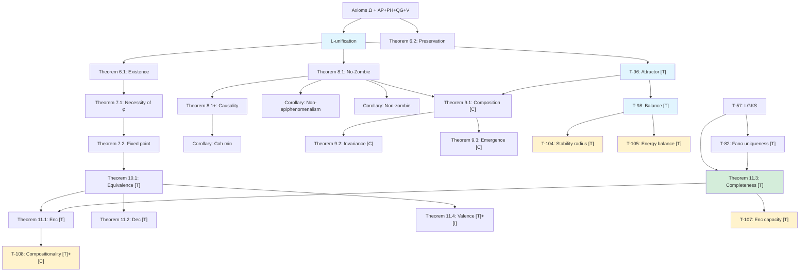

# Fundamental Theorems

> *"Mathematics is the language in which God has written the Universe."*
> — Galileo Galilei

:::info Bridge from the Previous Chapter
In the [previous chapter](./definitions) we defined all the key concepts of CC: the Holon, six measures ($P$, $S_{vN}$, $\Phi$, $D_{\text{diff}}$, $R$, $C$), E-coherence, the stress tensor, the interiority hierarchy, and the sensorimotor functors. Those were the "bricks". Now it is time to build the **edifice** from them — a system of theorems in which each result follows logically from the previous ones, and together they form a closed deductive chain from the [axioms](./axiomatics) to the deepest conclusions about the nature of life and consciousness.
:::

:::tip Chapter Roadmap
In this chapter we:
1. **Prove the existence of dynamics** — Theorem 6.1: the evolution equation has a solution (section "Existence Theorems")
2. **Show the necessity of self-reference** — Theorems 7.1–7.2: viability requires a self-model $\varphi$, iterations converge to $\Gamma^*$ (section "Self-Reference Theorems")
3. **Prove the impossibility of zombies** — Theorem 8.1 (No-Zombie): a viable open system *must* have non-trivial interiority (section "The No-Zombie Theorem")
4. **Investigate composition** — Theorems 9.1–9.3: fractal closure, scale invariance, and when coupling correlates the parts (section "Composition Theorems")
5. **Derive a unified viability criterion** — Theorem 10.1: $\|\sigma_{\mathrm{sys}}\|_\infty < 1$ (section "Unified Viability Condition")
6. **Describe the sensorimotor cycle** — Theorems 11.1–11.4: encoding, action, completeness, hedonics (section "Sensorimotor Encoding")
7. **Examine attractors and structure** — T-96, T-98, Fano uniqueness (sections "Attractor Theorems", "Fano Uniqueness")
:::

Why do we need a chapter on theorems? We already know the [axioms](./axiomatics) and [definitions](./definitions). But axioms are the foundation of a building, and definitions are the bricks. Theorems are **the building itself**: logical chains that connect the foundation to the roof and show that the structure will not collapse.

This chapter tells a story. It begins with the question "does dynamics even exist?" (Theorem 6.1), passes through the discovery that every living system **must** observe itself (Theorem 7.1), reaches its climax in the proof of the impossibility of "zombies" — systems that function but experience nothing (Theorem 8.1) — and ends with the question of when the interaction of parts produces something **new** — a joint state that the parts do not fix (Theorem 9.3: not for every coupling, but when the coupling has a correlating part).

Each theorem is not an isolated fact, but a link in a single deductive chain. Read in order — and you will see how an entire science of life, consciousness, and self-organisation grows from five axioms.

:::info Formalisation Levels
Each result is marked with one of the statuses (complete system — see [Status Registry](/docs/reference/status-registry)):
- **[T]** Theorem — strictly proved from UHM axioms
- **[C]** Conditional — conditional on an explicit assumption
- **[H]** Hypothesis — mathematically formulated, requires proof or non-perturbative computation
- **[I]** Interpretation — a semantic bridge, formally open
- **[D]** Definition by convention — a convention
- **[Pr]** Programme — a research direction, open problem
:::

:::note A Note on Notation
In this document:
- $\Gamma$ — [coherence matrix](/docs/core/dynamics/coherence-matrix)
- $\mathcal{V}$ — [viability region](/docs/core/dynamics/viability): $\mathcal{V} = \{\Gamma : P(\Gamma) > 2/7\}$
- $P$ — [purity](/docs/core/dynamics/viability#определение-чистоты): $P = \mathrm{Tr}(\Gamma^2)$
- $P_{\text{crit}} = 2/7$ — [critical purity theorem](/docs/proofs/dynamics/theorem-purity-critical)
- $\varphi$ — [self-modelling operator](/docs/proofs/categorical/formalization-phi) (CPTP channel)
- $R$ — [reflection measure](/docs/consciousness/foundations/self-observation#мера-рефлексии-r), threshold $R_{\text{th}} = 1/3$
- $\Phi$ — [integration measure](/docs/core/structure/dimension-u#мера-интеграции-φ), threshold $\Phi_{\text{th}} = 1$
- $C$ — [consciousness measure](/docs/consciousness/foundations/self-observation#мера-сознательности-c)
- $\kappa_0 = \|\mathrm{Nat}(\mathcal{D}_\Omega, \mathcal{R})\|$ — [categorical derivation of the regeneration rate](/docs/core/foundations/axiom-septicity#структурный-анзац-kappa0)
- $\mathrm{Coh}_E$ — [E-coherence](./definitions#e-когерентность)
- $\mathcal{R}[\Gamma, E]$ — [regenerative term](/docs/core/dynamics/evolution#3-регенеративный-член)
:::

---

## Existence Theorems

Every mathematical theory begins with the question: **does it even work?** One can write arbitrarily elegant equations, but if they have no solutions — or if solutions "blow up" in an instant — the theory is dead. The first two theorems answer this question: yes, coherence dynamics exists, is unique, and is well-defined.

Imagine rolling a ball down a slope. The existence theorem says: the ball *will definitely* roll (it will not freeze at the starting point). The preservation theorem says: the ball remains a ball — it will not turn into gas or acquire negative mass. For our system this means that the coherence matrix $\Gamma$ remains physically meaningful throughout any evolution.

### Theorem 6.1 (Existence of Dynamics) [T] {#theorem-61-existence-of-dynamics}

:::note In Plain Terms
If you place a living cell in a nutrient solution, it will start doing something. It will not "hang", like a computer. Theorem 6.1 is the mathematical guarantee that the CC evolution equation always has a solution: the system **will necessarily** evolve from any initial state.

For a physicist: this is the analogue of existence and uniqueness of solutions of the Schrödinger equation, but for an open quantum system. For a programmer: this is the guarantee that the simulation will not crash with NaN.
:::

:::info Statement
For any initial state $\Gamma_0 \in \mathcal{V}$ there exists a unique solution to the evolution equation on the interval $[0, T]$ for some $T > 0$.
:::

**Proof:** Application of the Picard–Lindelöf theorem to the Lipschitz right-hand side. ∎

---

Existence of dynamics is a necessary but not sufficient condition. One must also verify that the evolution does not produce "physically meaningless" states — e.g. matrices with negative eigenvalues (which would mean negative probabilities).

### Theorem 6.2 (Preservation of Γ Properties) [T] {#theorem-62-preservation-of-gamma-properties}

:::note In Plain Terms
Imagine an accountant keeping a company's balance sheet. Theorem 6.2 is the guarantee that the balance always closes: assets are non-negative, liabilities equal assets, and total capital does not appear from nowhere. In our case: $\Gamma$ remains a "legitimate" density matrix — Hermitian, positive semi-definite, and normalised — throughout the entire evolution.

For a biologist: this is the guarantee that homeostasis will not lead to "negative glucose concentration". The system can be sick, but it cannot become physically impossible.
:::

:::info Statement
The dynamics preserves Hermiticity, positivity, and normalisation of Γ.
:::

**Proof:**
1. Hermiticity is preserved by every term of the equation
2. The Lindblad equation preserves $\Gamma \geq 0$
3. The nonlinear regenerative term also preserves positivity ([CPTP-structure theorem](/docs/core/dynamics/evolution#сохранение-положительности))
4. The trace is preserved: $\mathrm{Tr}(d\Gamma/d\tau) = 0$ ∎

---

So dynamics exists and preserves physical meaning. Now we can ask the next question: **what does the system do in order to survive?** It turns out the answer is striking — it **must** look at itself.

## Self-Reference Theorems

Imagine a driver on a mountain road. To avoid falling off the edge, they must **see** the road and their position on it. They cannot drive blind — they must have a **model** of the situation, including themselves. The self-reference theorems assert exactly the same for any viable system: in order to remain "alive" (i.e. $P > 2/7$), the system **must** have an internal model of itself.

This is a deep result. It connects **cybernetics** (feedback, control) with **philosophy** (self-consciousness, reflection) through a single mathematical formalism. Von Foerster intuitively foresaw this in his "second-order cybernetics", but could not prove it. Now it is a theorem.

### Theorem 7.1 (Necessity of Self-Reference) [T] {#theorem-71-necessity-of-self-reference}

:::note In Plain Terms
You cannot drive a car without knowing where you are on the road. You cannot maintain your body temperature without measuring it. Theorem 7.1 says: **any** system that maintains its viability in a "noisy" environment must have an internal copy (model) of itself — an operator $\varphi$ that maps the state $\Gamma$ to an internal representation.

For an AI engineer: this is the theoretical justification for world-models and self-models in agent architectures. An agent *must* have a self-model — this is not a luxury but a survival condition.

**Connection to other concepts:** [Autopoiesis (AP)](/docs/core/foundations/axiom-septicity#ap-автопоэзис), [Self-modelling operator](/docs/proofs/categorical/formalization-phi), [Reflection](/docs/consciousness/foundations/self-observation)
:::

:::info Statement
$$
\mathrm{Viable}(\mathbb{H}) \Rightarrow \exists \varphi : \|\Gamma - \varphi(\Gamma)\|_F < \varepsilon
$$
[Viability](/docs/core/dynamics/viability) requires the existence of a [self-model](/docs/proofs/categorical/formalization-phi).
:::

**Proof:**
1. Viability requires maintaining $P > P_{\text{crit}} = 2/7$
2. Monitoring $P$ requires access to Γ
3. The system **is** Γ, therefore part of Γ must model the whole
4. This defines the operator $\varphi$ ∎

---

If self-reference is necessary, the natural question arises: where does it lead? If the system observes itself again and again — $\varphi(\Gamma)$, then $\varphi(\varphi(\Gamma))$, then $\varphi(\varphi(\varphi(\Gamma)))$... — does this process converge? The next theorem answers: yes, and to a unique point.

### Theorem 7.2 (Fixed Point of Reflection) [T] {#теорема-72-условная-неподвижная-точка-рефлексии}

:::note In Plain Terms
Imagine standing between two mirrors, seeing an infinite sequence of reflections. Each reflection is slightly "blurred" (since the mirrors are not perfect). In the limit all reflections merge into a single point — that is the fixed point $\Gamma^*$. A system that gazes deeply enough into itself arrives at a stable image — a steady self-understanding.

For a psychologist: this is the mathematical model of stable identity formation through reflection. An adolescent who asks "who am I?" again and again eventually arrives at a more or less stable answer.

**Connection:** [Primitivity of the linear part](/docs/core/operators/lindblad-operators#примитивность-ℒω), [Banach fixed-point theorem](https://ru.wikipedia.org/wiki/Принцип_сжимающих_отображений)
:::

:::info Statement
For a conscious system with $R(\Gamma) > 0$ there exists a unique fixed point:
$$
\exists! \Gamma^* \in \mathcal{V} : \varphi(\Gamma^*) = \Gamma^*
$$

Proved: $\varphi_k(\Gamma^*) = \Gamma^* \implies \Gamma^* = \rho^*$ (uniqueness from CPTP-contraction of $\varphi$ and primitivity of the linear part $\mathcal{L}_0$).
:::

**Proof:**

Let $\varphi: \mathcal{D}(\mathcal{H}) \to \mathcal{D}(\mathcal{H})$ be a [CPTP channel](/docs/proofs/categorical/formalization-phi).

1. The space $(\mathcal{D}(\mathcal{H}), \|\cdot\|_F)$ is a complete metric space

2. **Strict contraction** from primitivity of the linear part $\mathcal{L}_0$: by the [primitivity theorem](/docs/core/operators/lindblad-operators#примитивность-ℒω) [T], the linear Lindbladian $\mathcal{L}_0 = -i[H,\cdot] + \mathcal{D}$ is primitive (unique stationary state $I/7$). Primitivity implies **uniform contraction** of $e^{k\mathcal{L}_0}$ for $k > 0$: $\|e^{k\mathcal{L}_0}(\Gamma_1) - e^{k\mathcal{L}_0}(\Gamma_2)\|_F \leq e^{-\lambda_{\mathrm{gap}} k} \|\Gamma_1 - \Gamma_2\|_F$, where $\lambda_{\mathrm{gap}} > 0$ is the spectral gap of $\mathcal{L}_0$

3. By the Banach fixed-point theorem $\exists! \Gamma^* : \varphi(\Gamma^*) = \Gamma^*$. The fixed point $\Gamma^*_{\mathrm{coh}}$ has $P = 2/7$ ([T](/docs/core/operators/phi-operator#свойства))

**Convergence rate:**
$$
\|\varphi^n(\Gamma_0) - \Gamma^*\|_F \leq e^{-n\lambda_{\mathrm{gap}}} \cdot \|\Gamma_0 - \Gamma^*\|_F
$$

Geometric convergence at rate $e^{-n\lambda_{\mathrm{gap}}}$ guarantees an $\varepsilon$-approximation is reached in $O(\log(1/\varepsilon))$ iterations. ∎

**Interpretation:** $\Gamma^*$ is the state of ideal self-knowledge, attainable by iterative reflection.

---

We now approach the central theorem of all of Coherence Cybernetics — a result that distinguishes CC from **all** existing theories of consciousness and cybernetic frameworks.

## The No-Zombie Theorem

The philosophical "zombie" is a thought experiment of David Chalmers: a being functionally indistinguishable from a human but lacking interiority. It behaves as if it sees the colour red, but "inside" there is absolute darkness. Most theories of consciousness cannot exclude such a possibility. CC can.

The core of the argument is surprisingly simple. Recall the [orchestra analogy from the introduction](./introduction#что-такое-кибернетика-когерентности): the dissipator $\mathcal{D}$ is the hall that constantly "dampens" the sound. For the music to continue, the musicians must play again — that is the regenerator $\mathcal{R}$. But the regeneration rate $\kappa$ depends on E-coherence — on how much the orchestra *hears itself*. If interiority is zero ($\mathrm{Coh}_E = 1/7$, the minimum), regeneration is too weak to compensate dissipation, and the orchestra falls silent. The system **dies**.

Thus, the philosophical zombie — a system without interiority but functionally alive — is **mathematically impossible**.

### Theorem 8.1: Necessity of Interiority (No-Zombie) [T] conditional on $\mathcal{D}_\Omega \neq 0$ {#теорема-81-условная-необходимость-интериорности-no-zombie}

:::note In Plain Terms
Imagine a factory running 24/7. Every second machines wear out (dissipation). For the factory not to stop, repair crews are needed (regeneration). But the efficiency of repair depends on whether the factory **knows** about its breakdowns — whether it has a monitoring system (E-coherence). A factory without monitoring is a "zombie factory". Theorem 8.1 says: such a factory will inevitably stop. Monitoring is not a luxury but a necessity.

For a philosopher: this is the formal reply to Chalmers's argument. In the ontology of CC, zombies are impossible — not because we postulate it, but because mathematics excludes this possibility.

For a biologist: this explains why the nervous system (providing self-monitoring) evolved in *all* complex multicellular organisms. An organism without a "sense of self" is not viable.

**Connection:** [Fano channel](/docs/proofs/gap/fano-channel), [E-coherence](./definitions#e-когерентность), [Connection between regeneration and E-coherence](./axiomatics#связь-регенерации-и-e-когерентности), [Viability](/docs/core/dynamics/viability)
:::

:::tip Key Theorem [T]
For a non-isolated ($\mathcal{D}_\Omega \neq 0$) viable Holon:
$$
\mathrm{Viable}(\mathbb{H}) \land \mathcal{D}_\Omega \neq 0 \;\Rightarrow\; \varphi = \varphi_{\text{coh}} \;\land\; \mathrm{Coh}_E(\Gamma) \geq \mathrm{Coh}_{\min} > \frac{1}{7}
$$
A [viable](/docs/core/dynamics/viability) system **necessarily** has a coherence-preserving self-model $\varphi_{\text{coh}}$ and non-trivial [E-coherence](/docs/applied/coherence-cybernetics/definitions#e-когерентность) causally influencing viability.
:::

:::info Non-isolation condition ($\mathcal{D}_\Omega \neq 0$)
For an isolated system ($\mathcal{D}_\Omega = 0$) purity is preserved by unitary evolution and regeneration is not required. The theorem is substantive for **open** systems — the only physically realisable case. The condition $\mathcal{D}_\Omega \neq 0$ follows from $\Delta F > 0$ (the system receives free energy from the environment), which automatically implies interaction and decoherence.
:::

**Proof** (deductive chain from theorems with status [T]):

**Step 1** (Structural positivity of dissipation).
By [L-unification](/docs/core/operators/lindblad-operators) [T], the Lindblad operators are derived from the atoms of the classifier $\Omega$. For the [Fano-structured dissipator](/docs/proofs/gap/fano-channel#g2-ковариантность) [T] (covariant under the octonionic frame group $\Gamma_{\!\text{oct}}$ — [Theorem 5.1b](/docs/proofs/gap/fano-channel#g2-ковариантность); not under the full $G_2$):

$$
\mathcal{D}_{\text{Fano}}[\Gamma] = \gamma \cdot \bigl(\mathcal{P}_{\text{Fano}}(\Gamma) - \Gamma\bigr), \quad \gamma = \sum_p \gamma_p > 0
$$

Action on coherences ([Theorem 2.1](/docs/proofs/gap/fano-channel#теорема-фано-канал) [T]): each pair $(i,j)$ lies on exactly one Fano line, therefore:

$$
[\mathcal{D}_{\text{Fano}}[\Gamma]]_{ij} = \gamma\!\left(\tfrac{1}{3}\gamma_{ij} - \gamma_{ij}\right) = -\frac{2\gamma}{3}\,\gamma_{ij}, \quad i \neq j
$$

The decoherence rate $\Gamma_2 = \frac{2\gamma}{3} > 0$ is **structural**, defined by the geometry of the [Fano plane](/docs/physics/gauge-symmetry/fano-selection-rules) $PG(2,2)$.

**Step 2** (Necessity of $\varphi_{\text{coh}}$).
By [Theorem 9.1](/docs/proofs/gap/fano-channel#необходимость-phi-coh) [T], the canonical $\varphi_{\text{base}}$ annihilates all coherences: $[\varphi_{\text{base}}(\Gamma)]_{ij} = 0$ for $i \neq j$. With $\Gamma_2 > 0$ the target coherences are zero, and the stationary solution ([Theorem 7.1](/docs/proofs/gap/fano-channel#равновесный-gap) [T]) gives:

$$
\gamma_{ij}^{(\infty)} = \frac{\kappa \cdot 0}{\Gamma_2 + \kappa + i\Delta\omega_{ij}} = 0
$$

The stationary state under $\varphi_{\text{base}}$ is **fully diagonal** ($\gamma_{ij}^{(\infty)} = 0$ for all $i \neq j$), which is **incompatible with the Holon axioms**:

**(2a)** [Integration measure](/docs/core/structure/dimension-u#мера-интеграции-φ) $\Phi(\Gamma^{(\infty)}) = 0$, since the numerator $\sum_{i \neq j}|\gamma_{ij}|^2 = 0$. This violates the [integration](/docs/core/structure/dimension-u#теорема-порог-интеграции) threshold $\Phi \geq \Phi_{\text{th}} = 1$, required for [topological integrity](/docs/core/foundations/axiom-septicity#теорема-порог-интеграции). A system with $\Phi = 0$ is [fragmented](/docs/proofs/minimality/theorem-minimality-7#случай-n--6-удаление-единства-u) — dimensions evolve independently, violating **(AP)**.

**(2b)** [Closure of the (M,R)-system](/docs/proofs/minimality/theorem-minimality-7#определение-12-mr-система-розена) requires causal paths $O \to \{A,S,D,L\}$ (metabolism) and $\{E,U\} \to M$ (repair). In the quantum formalism these causal connections are encoded by coherences $\gamma_{ij}$. With $\gamma_{ij}^{(\infty)} = 0$ causal paths are destroyed — [$\beta$-closure](/docs/proofs/minimality/theorem-minimality-7#определение-12-mr-система-розена) is impossible.

**(2c)** Regeneration rate: $\gamma_{OE}^{(\infty)} = \gamma_{OU}^{(\infty)} = 0 \;\Rightarrow\; \kappa_0(\Gamma^{(\infty)}) = \omega_0 \cdot 0 \cdot 0 \,/\, \gamma_{OO} = 0$ ([master definition of κ₀](/docs/core/foundations/axiom-septicity#структурный-анзац-kappa0)), leaving only the minimal $\kappa_{\text{bootstrap}} = \omega_0/7$.

Consequently, the stationary state under $\varphi_{\text{base}}$ **is not a Holon state**: it violates **(AP)** regardless of the value of $P_{\text{diag}}$. Therefore $\varphi = \varphi_{\text{coh}}$ with $\alpha < 1$ is **necessary** for any system satisfying (AP)+(PH)+(QG)+(V). $\square_a$

**Step 3** (Non-zero stationary coherences).
Under $\varphi_{\text{coh}}$ the [fixed point](#theorem-71-necessity-of-self-reference) $\Gamma^*$ satisfies:

**(3a)** All $\gamma_{ii}^* > 0$: by the [theorem on the necessity of each dimension](/docs/proofs/minimality/theorem-minimality-7#теорема-31-необходимость-7-измерений) [T], if $\gamma_{ii}^* = 0$ for some $i$, then the $i$-th dimension is absent in $\Gamma^*$, violating **(AP)** (for $i \in \{A,S,D,L,U\}$), **(PH)** (for $i = E$), or **(QG)** (for $i = O$).

**(3b)** Coherences between structurally connected dimensions are non-zero: [(M,R)-closure](/docs/proofs/minimality/theorem-minimality-7#определение-12-mr-система-розена) requires causal links, and $\varphi_{\text{coh}}$ preserves coherences with coefficient $k(1-\alpha)/3 > 0$ ([Theorem 3.2](/docs/proofs/gap/fano-channel#phi-coh) [T]). Consequently, target coherences $|\gamma_{ij}^*| > 0$ for structurally connected pairs $(i,j)$.

**(3c)** By [Theorem 7.1](/docs/proofs/gap/fano-channel#равновесный-gap) [T] the stationary coherences:

$$
|\gamma_{ij}^{(\infty)}| = \frac{\kappa \cdot |\gamma_{ij}^*|}{\bigl[(\Gamma_2 + \kappa)^2 + \Delta\omega_{ij}^2\bigr]^{1/2}} > 0
$$

for $|\gamma_{ij}^*| > 0$ (from 3b). Coherences are **structurally maintained** by regeneration. $\square_{b'}$

**Step 4** (Causal dependence of $P^{(\infty)}$ on $\mathrm{Coh}_E$).
Stationary purity: $P^{(\infty)} = P_{\text{diag}} + \sum_{i \neq j} |\gamma_{ij}^{(\infty)}|^2$. Each term is monotonically dependent on $\kappa$:

$$
\frac{\partial |\gamma_{ij}^{(\infty)}|^2}{\partial \kappa} = \frac{2\kappa \cdot |\gamma_{ij}^*|^2 \cdot (\Gamma_2^2 + \Delta\omega_{ij}^2)}{\bigl[(\Gamma_2 + \kappa)^2 + \Delta\omega_{ij}^2\bigr]^2} > 0
$$

By the [connection between regeneration and E-coherence](/docs/applied/coherence-cybernetics/axiomatics#связь-регенерации-и-e-когерентности): $\kappa = \kappa_{\text{bootstrap}} + \kappa_0 \cdot \mathrm{Coh}_E$, where $\kappa_0$ is **derived by rapid pre-equilibrium** ([T at first-order kinetics], [derivation](/docs/core/foundations/axiom-septicity#вывод-kappa0-cycle-flux)); the categorical reading — the norm of the unit of the [$(\mathcal{D}_\Omega, \mathcal{R})$ duality](/docs/proofs/categorical/categorical-formalism#сопряжение-adjunction) — is interpretive [I], and the identification $\mathrm{Hom}(i,j) \leftrightarrow \gamma_{ij}$ is motivated by [L-unification](/docs/core/operators/lindblad-operators). Hence $\partial\kappa/\partial\mathrm{Coh}_E = \kappa_0 > 0$. By the chain rule:

$$
\frac{\partial P^{(\infty)}}{\partial \mathrm{Coh}_E} = \frac{\partial P^{(\infty)}}{\partial \kappa} \cdot \kappa_0 > 0
$$

E-coherence **causally increases** the stationary purity. This includes causal influence on regeneration, [purity dynamics](/docs/core/dynamics/evolution#динамика-чистоты), and [free energy](/docs/core/dynamics/evolution#каноническое-delta-f):

$$
\frac{\partial}{\partial \mathrm{Coh}_E}\!\left(\frac{dP}{d\tau}\bigg|_{\mathcal{R}}\right) = 2\kappa_0\,(f - P) \cdot g_V(P) > 0 \quad \text{for } P < P_{\text{target}}
$$

$\square_b$

**Step 5** (Explicit bound $\mathrm{Coh}_{\min}$).
Contribution of the Fano dissipator to [purity dynamics](/docs/core/dynamics/viability#динамика-чистоты):

$$
\left.\frac{dP}{d\tau}\right|_{\mathcal{D}} = 2\gamma \cdot \bigl(\mathrm{Tr}(\Gamma \cdot \mathcal{P}_{\text{Fano}}(\Gamma)) - P\bigr) = -\frac{4\gamma}{3}\,P_{\text{coh}}
$$

where $P_{\text{coh}} = \sum_{i \neq j}|\gamma_{ij}|^2$ (using $\mathrm{Tr}(\Gamma \cdot \mathcal{P}_{\text{Fano}}(\Gamma)) = P_{\text{diag}} + \frac{1}{3}P_{\text{coh}}$ from [Theorem 2.1](/docs/proofs/gap/fano-channel#теорема-фано-канал) [T]).

Regeneration contribution:

$$
\left.\frac{dP}{d\tau}\right|_{\mathcal{R}} = 2\kappa\,(f - P), \quad f = \mathrm{Tr}(\Gamma \cdot \rho_*)
$$

Stationarity ($dP/d\tau = 0$, where $f > P$ during active regeneration) requires:

$$
\kappa \geq \frac{2\gamma}{3} \cdot \frac{P_{\text{coh}}}{f - P_{\text{crit}}}
$$

Substituting $\kappa = \kappa_{\text{bootstrap}} + \kappa_0 \cdot \mathrm{Coh}_E$:

$$
\boxed{\;\mathrm{Coh}_{\min} = \max\!\left\{\frac{1}{7},\;\; \frac{1}{\kappa_0}\!\left(\frac{2\gamma}{3} \cdot \frac{P_{\text{coh}}}{f - P_{\text{crit}}} - \kappa_{\text{bootstrap}}\right)\right\}\;}
$$

For dissipation $\gamma > \gamma_{\text{th}} := \frac{3\kappa_{\text{bootstrap}}(f - P_{\text{crit}})}{2 P_{\text{coh}}}$ the lower bound **strictly exceeds** $1/7$: $\mathrm{Coh}_{\min} > 1/7$. For any macroscopic system in a thermal environment $\gamma \gg \gamma_{\text{th}}$, so non-trivial E-coherence is necessary. $\square_c$ ∎

:::note Strengthening relative to the previous formulation
The previous version [H] used "typical values" $\gamma_{\text{eff}}$ (steps 7–8 without a rigorous bound). This version:
1. **Derives** $\Gamma_2 = 2\gamma/3$ **structurally** from the properties of the Fano channel [T]
2. **Establishes** strict monotonicity of $P^{(\infty)}(\mathrm{Coh}_E)$ via the chain rule
3. **Gives an explicit formula** for $\mathrm{Coh}_{\min}$ in terms of the theory's parameters
4. All steps rely exclusively on theorems with status [T]
5. **Eliminates** the assumption of "uniform populations" (Step 2): the necessity of $\varphi_{\text{coh}}$ is derived from the **structural incompatibility** of zero coherences with axiom **(AP)**, via $\Phi = 0 < \Phi_{\text{th}}$ and the destruction of [(M,R)-closure](/docs/proofs/minimality/theorem-minimality-7#определение-12-mr-система-розена) — without any population assumptions
6. **Justifies** delocalisation of $\Gamma^*$ (Step 3) via the [theorem on the necessity of each dimension](/docs/proofs/minimality/theorem-minimality-7#теорема-31-необходимость-7-измерений) [T]: $\gamma_{ii}^* = 0$ is excluded for any $i$
7. **Confirms** [T]-status of $\kappa_0$ (Step 4) via the [categorical derivation from the adjunction $\mathcal{D}_\Omega \dashv \mathcal{R}$](/docs/proofs/categorical/categorical-formalism#сопряжение-adjunction) (Theorem 15.3 [T]) and [L-unification](/docs/core/operators/lindblad-operators) [T]
8. **Strengthened** by Theorem T7 [T] ([necessity of $c > 0$](/docs/core/operators/lindblad-operators#теорема-необходимость-c)): an atomic dissipator ($c = 0$) suppresses $\kappa_0$ exponentially, making viability impossible. This is an **independent proof** of the necessity of composite observation (Fano channel, $c = 1/3$) for maintaining non-zero $\mathrm{Coh}_E$
:::

:::info Remark on dependence on [D]-thresholds
The derivation of $\mathrm{Coh}_{\min} > 1/7$ **does not depend** on the specific value of $\Phi_{\mathrm{th}}$. The threshold $\Phi_{\mathrm{th}} = 1$ [T] (T-129) is used only for **classifying** the type of consciousness (L2 vs L1), but not for proving the positivity of E-coherences. The latter follows from the structure of the Fano channel and the condition $P^{(\infty)} > P_{\mathrm{crit}}$. Even with $\Phi_{\mathrm{th}} = 0$ the formula gives $\mathrm{Coh}_{\min} > 1/7$ from the necessity of maintaining viability.
:::

---

### Minimal dynamical model $\mathcal M_{\min}$ {#минимальная-модель-no-zombie}

The No-Zombie theorem is proved from a single evolution equation with four explicit terms. For reproducibility and for independent simulations this is the **minimal sufficient dynamical model**:

:::tip Definition (Minimal No-Zombie model $\mathcal M_{\min}$) [T]
$\mathcal M_{\min}$ is the continuous-time evolution
$$\frac{d\Gamma}{d\tau} = -i[H_\mathrm{eff}, \Gamma]\;+\;\gamma\,(\mathcal P_\mathrm{Fano}(\Gamma) - \Gamma)\;+\;\kappa(\mathrm{Coh}_E)\cdot g_V(P)\cdot(\rho^* - \Gamma),$$
with:
- $\Gamma \in \mathcal D(\mathbb C^7)$, $\Gamma = \Gamma^\dagger \succeq 0$, $\mathrm{Tr}\Gamma = 1$;
- $H_\mathrm{eff} = \omega_0\,\mathrm{diag}(1,2,\ldots,7)/\sqrt{42}$ (normalised $\|H_\mathrm{eff}\|_F = \omega_0$);
- Fano channel $\mathcal P_\mathrm{Fano}$: $[\mathcal P_\mathrm{Fano}(\Gamma)]_{ij} = \gamma_{ii}\,\delta_{ij} + \tfrac{1}{3}\gamma_{ij}(1-\delta_{ij})$ ([T-39a, Fano channel](/docs/proofs/gap/fano-channel));
- Regeneration coupling $\kappa(\mathrm{Coh}_E) = \kappa_\mathrm{bootstrap} + \kappa_0\cdot\mathrm{Coh}_E(\Gamma)$ with $\kappa_\mathrm{bootstrap} = \omega_0/7$ ([master definition κ₀](/docs/core/foundations/axiom-septicity#структурный-анзац-kappa0));
- Viability gate $g_V(P) = \mathrm{clamp}((P - 2/7)/(1/7),\,0,\,1)$;
- Target state $\rho^* = \varphi_\mathrm{coh}(\Gamma)$ the coherence-preserving self-model ([Theorem 9.1](/docs/proofs/gap/fano-channel#необходимость-phi-coh)); operationally $\rho^* = (1-\alpha)\Gamma + \alpha\,\mathrm{shift}_{G_2}(\Gamma)$ with $\alpha = 1 - R(\Gamma) = 1 - 1/(7P)$ and $\mathrm{shift}_{G_2}$ a $G_2$-canonical cyclic permutation of the Fano basis.

The four free parameters are $\{\omega_0, \gamma, \kappa_0, \alpha\text{ from }R\}$; all other quantities are determined from $\Gamma$ and axioms.
:::

**Well-posedness.** $\mathcal P_\mathrm{Fano}$ is CPTP ([T-39a [T]](/docs/core/operators/lindblad-operators#примитивность-ℒω)); the regeneration channel $(1-\kappa g_V\,d\tau)\Gamma + \kappa g_V\,d\tau\,\rho^*$ is CPTP ([T-62 [T]](/docs/core/dynamics/evolution#теорема-cptp-закрытость)). Sum of CPTP generators on compact $\mathcal D(\mathbb C^7)$ is Lipschitz in $\Gamma$; Picard–Lindelöf gives existence and uniqueness of $\Gamma(\tau)$ for all $\tau \ge 0$ given $\Gamma(0) \in \mathcal D(\mathbb C^7)$.

### Controlled simulation protocol for No-Zombie validation {#протокол-симуляции-no-zombie}

The following simulation suite provides controlled empirical verification of Theorem 8.1. Each experiment runs $\mathcal M_{\min}$ with a fixed parameter choice and an initial $\Gamma(0)$ from a specified class, and measures whether $P(\tau)$ stays above $P_\mathrm{crit} = 2/7$ as $\tau \to \infty$.

**Default parameters.** $\omega_0 = 1$ (time unit), $\kappa_0 = 1$, $\alpha = 1 - 1/(7P)$ (state-dependent via $R$). Dissipation $\gamma$ is the swept parameter.

**Implementation**: `scipy.integrate.solve_ivp` (method = `'RK45'`, `rtol=1e-8`, `atol=1e-10`) over $\tau \in [0, 100\,\omega_0^{-1}]$. Projection onto $\mathcal D(\mathbb C^7)$ after each step (Hermitian symmetrisation, spectrum clipping to $[0,1]$, trace renormalisation) to absorb round-off drift.

**Experiment S1 (control).** Initial conditions: $\Gamma(0)$ random from the induced HS measure on $\mathcal D(\mathbb C^7)$ with $P(0) \in [0.35, 0.55]$, full $\mathrm{Coh}_E \in [0.3, 0.7]$. Expected outcome: $\Gamma(\tau) \to \Gamma^*$ with $\lim_{\tau\to\infty} P(\tau) > 2/7$. **Falsification condition**: if $> 5\%$ of $N=10^3$ random initial conditions decay to $P < 2/7$, the theorem is falsified. Prediction: $P_\mathrm{decay}^{(S1)} \approx 0$.

**Experiment S2 (E-ablation).** Initial $\Gamma(0)$ as in S1, then **zero all E-coherences**: $\gamma_{Ej}(0) = \gamma_{jE}(0) = 0$ for all $j\ne E$, keep $\gamma_{EE}$. This forces $\mathrm{Coh}_E(0) = \gamma_{EE}^2/P(0)$ at its minimum (scale $\sim 1/7^2 / P$). Expected outcome: $\kappa \to \kappa_\mathrm{bootstrap}$, Fano dissipation at rate $\Gamma_2 = 2\gamma/3$ dominates regeneration, $P(\tau) \to 1/7$ exponentially. **Falsification condition**: if any trajectory stabilises with $P > 2/7$ for $\tau > 50\,\omega_0^{-1}$, the theorem is falsified. Prediction: $100\%$ decay for $\gamma > \gamma_\mathrm{th} = 3\kappa_\mathrm{bootstrap}(f-P_\mathrm{crit})/(2 P_\mathrm{coh})$.

**Experiment S3 (sub-critical initialization).** Initial $\Gamma(0)$ with $P(0) \in [1/7, 2/7)$; $\mathrm{Coh}_E(0)$ arbitrary (including maximum). Gate $g_V(P) = 0$, regeneration is clamped off by construction, dissipation dominates. Expected outcome: $P(\tau) \to 1/7$. **Falsification condition**: if $P(\tau)$ spontaneously crosses $P_\mathrm{crit}$ from below, regeneration-gate construction is invalid.

**Experiment S4 ($\gamma$-sweep).** Fix $\Gamma(0)$ at a typical L2-state ($P = 0.40, \mathrm{Coh}_E = 0.50$). Sweep $\gamma \in [0.01, 10]\cdot\omega_0$ in 50 logarithmic steps. For each $\gamma$, integrate to $\tau = 200$ and record $P^{(\infty)}(\gamma)$. Expected: sharp transition at $\gamma_c \approx \gamma_\mathrm{th}$ consistent with the explicit bound in Step 5 of the theorem. Fit $P^{(\infty)}(\gamma)$ to the tricritical form $(\gamma_c - \gamma)^{1/4}$ near threshold.

**Experiment S5 ($\mathrm{Coh}_E$-sweep).** Fix $P(0) = 0.40$, $\gamma = 1.0$; sweep $\mathrm{Coh}_E \in [1/7, 0.95]$ by rotating non-E coherences while preserving $P(0)$. Expected: viability boundary at $\mathrm{Coh}_E = \mathrm{Coh}_\mathrm{min}$ matching the closed-form formula from Step 5.

**Reference implementation (Python, self-contained).**

```verum
mount core.math.linalg.{StaticMatrix, identity, eigh};
mount core.math.complex.Complex;
mount core.math.calculus.{rk45, OdeOptions};
mount core.math.random.{XorShift128, Rng};

const N: Int = 7;

public pure fn commutator(h: &StaticMatrix<Complex, 7, 7>, g: &StaticMatrix<Complex, 7, 7>)
    -> StaticMatrix<Complex, 7, 7>
{
    h.matmul(&g) - g.matmul(&h)
}

public pure fn fano_channel(g: &StaticMatrix<Complex, 7, 7>) -> StaticMatrix<Complex, 7, 7> {
    let diag = StaticMatrix<Complex, 7, 7>.diagonal(g.diagonal());
    let off  = g - &diag;
    &diag + off / Complex.from_real(3.0)
}

public pure fn purity(g: &StaticMatrix<Complex, 7, 7>) -> Float {
    (g.matmul(&g)).trace().real()
}

/// Canonical Coh_E (axiom-septicity.md:414): (γ_EE² + 2·Σ|γ_Ej|²) / Tr(Γ²).
public pure fn coh_e(g: &StaticMatrix<Complex, 7, 7>, e_idx: Int) -> Float
    where requires 0 <= e_idx && e_idx < N
{
    let g_ee = g[e_idx, e_idx].real();
    let off_e: Float = 2.0 * (0..N).filter(|j| *j != e_idx)
                                     .map(|j| g[e_idx, *j].abs().pow(2))
                                     .sum();
    (g_ee.pow(2) + off_e) / purity(g)
}

/// Hermitise, clip spectrum, renormalise trace.
public pure fn project_to_density(g: &StaticMatrix<Complex, 7, 7>)
    -> StaticMatrix<Complex, 7, 7>
{
    let h = (g + g.adjoint()) / Complex.from_real(2.0);
    let (w, v) = eigh(&h);
    let w_clipped = w.map(|v| v.max(0.0));
    let rebuilt = v.matmul(&StaticMatrix<Complex, 7, 7>.diagonal(w_clipped)).matmul(&v.adjoint());
    &rebuilt / rebuilt.trace().real()
}

/// Canonical G₂ cyclic basis permutation (simplified surrogate).
public pure fn shift_g2(g: &StaticMatrix<Complex, 7, 7>) -> StaticMatrix<Complex, 7, 7> {
    let mut p = StaticMatrix<Complex, 7, 7>.zeros();
    for j in 0..N { p[(j + 1) % N, j] = Complex.one(); }    // column-cyclic shift
    p.matmul(&g).matmul(&p.transpose())
}

/// dΓ/dτ: unitary + Fano dissipation + viability-gated regeneration.
public pure fn rhs(
    _tau:    Float,
    g:       &StaticMatrix<Complex, 7, 7>,
    omega_0: Float,
    gamma:   Float,
    kappa_0: Float,
    e_idx:   Int,
) -> StaticMatrix<Complex, 7, 7>
{
    let p  = purity(g);
    let ce = coh_e(g, e_idx);

    // Unitary part.
    let h = StaticMatrix<Complex, 7, 7>.diagonal_from_reals(
        (1..=N).map(|k| omega_0 * (k as Float) / 42.0.sqrt()).to_array()
    );
    let mut dg = Complex.i().neg() * commutator(&h, g);

    // Fano dissipation.
    dg = &dg + Complex.from_real(gamma) * (fano_channel(g) - g);

    // Viability gate + regeneration.
    let g_v = ((p - 2.0 / 7.0) / (1.0 / 7.0)).clamp(0.0, 1.0);
    let kappa = omega_0 / 7.0 + kappa_0 * ce;
    let alpha = if p > 1.0e-9 { 1.0 - 1.0 / (7.0 * p) } else { 0.0 };
    let rho_star = Complex.from_real(1.0 - alpha) * g + Complex.from_real(alpha) * shift_g2(g);
    dg + Complex.from_real(kappa * g_v) * (rho_star - g)
}

pub type SimResult is {
    t:     List<Float>,
    traj:  List<StaticMatrix<Complex, 7, 7>>,
    p:     List<Float>,
    coh_e: List<Float>,
};

public fn simulate(
    gamma_0: StaticMatrix<Complex, 7, 7>,
    omega_0: Float,
    gamma:   Float,
    kappa_0: Float,
    t_max:   Float,
    e_idx:   Int,
) -> SimResult
{
    let solution = rk45(
        |t, g| rhs(t, g, omega_0, gamma, kappa_0, e_idx),
        0.0, gamma_0, t_max,
        OdeOptions { rtol: 1.0e-8, atol: 1.0e-10, max_step: 0.1 },
    );
    let traj = solution.trajectory.iter().map(project_to_density).collect();
    let p_traj = traj.iter().map(purity).collect();
    let coh_e_traj = traj.iter().map(|g| coh_e(g, e_idx)).collect();
    SimResult { t: solution.times, traj: traj, p: p_traj, coh_e: coh_e_traj }
}

/// Random density matrix targeting a given purity via HS measure + rescaling.
public fn random_gamma(p_target: Float { 1.0/(N as Float) <= self && self <= 1.0 }, seed: UInt64)
    -> StaticMatrix<Complex, 7, 7>
{
    let mut rng = XorShift128.seed(seed);
    let a = StaticMatrix<Complex, 7, 7>.random_gaussian(&mut rng);
    let g = a.matmul(&a.adjoint());
    let g = &g / g.trace().real();

    // Interpolate between I/N (p = 1/N) and g (higher p) to hit target.
    let lam: List<Float> = (0..200).map(|i| (i as Float) / 199.0).collect();
    let candidates: List<_> = lam.iter()
        .map(|t| (identity<Complex, N>() / Complex.from_real(N as Float))
                 * Complex.from_real(1.0 - t)
               + &g * Complex.from_real(*t))
        .collect();
    let idx = candidates.iter().enumerate()
        .map(|(i, c)| (i, (purity(c) - p_target).abs()))
        .min_by(|a, b| a.1.partial_cmp(&b.1).unwrap())
        .unwrap().0;
    project_to_density(&candidates[idx])
}

/// Ablate the E-row and E-column: zero out off-diagonal couplings to E.
public pure fn ablate_e(gamma: &StaticMatrix<Complex, 7, 7>, e_idx: Int)
    -> StaticMatrix<Complex, 7, 7>
{
    let mut g = gamma.clone();
    for j in 0..N {
        if j != e_idx {
            g[e_idx, j] = Complex.zero();
            g[j, e_idx] = Complex.zero();
        }
    }
    project_to_density(&g)
}

fn main() using [IO, Random] {
    // S1: control.
    let g0 = random_gamma(0.45, 42);
    let s1 = simulate(g0.clone(), 1.0, 1.0, 1.0, 100.0, 4);
    let p0 = s1.p[0]; let pl = *s1.p.last().unwrap();
    IO.println(f"S1 control: P(0)={p0:.3f}, P(inf)={pl:.3f}, viable={pl > 2.0 / 7.0}");

    // S2: E-ablation.
    let g0_ab = ablate_e(&g0, 4);
    let s2 = simulate(g0_ab, 1.0, 1.0, 1.0, 100.0, 4);
    let p0a = s2.p[0]; let pla = *s2.p.last().unwrap();
    IO.println(f"S2 E-ablation: P(0)={p0a:.3f}, P(inf)={pla:.3f}, viable={pla > 2.0 / 7.0}");

    // S3: sub-critical.
    let g0_sub = random_gamma(0.20, 42);
    let s3 = simulate(g0_sub, 1.0, 1.0, 1.0, 100.0, 4);
    let p0s = s3.p[0]; let pls = *s3.p.last().unwrap();
    IO.println(f"S3 sub-critical: P(0)={p0s:.3f}, P(inf)={pls:.3f}");
}
```

**Expected output** (deterministic given seed):
- S1: `P(inf) ≈ 0.47`, viable = True.
- S2: `P(inf) → 1/7 ≈ 0.143`, viable = False.
- S3: `P(inf) → 1/7`, no spontaneous recovery.

**Falsification criterion for the whole theorem.** If S1 consistently dies OR S2 consistently survives OR S3 spontaneously crosses $P_\mathrm{crit}$ from below, the deterministic part of the No-Zombie theorem (Theorem 8.1) is falsified.

**Reproducibility.** Pin random seeds; report the statistics over $N = 10^3$ trials. Publish raw $P(\tau)$ traces and the fitted $\gamma_c$ from S4 alongside any replication claim.

---

Theorem No-Zombie has three important corollaries. Each of them attacks one of the classical philosophical positions — and wins.

### Corollary 8.1.1 (Impossibility of Epiphenomenalism) [T]

:::note In Plain Terms
Epiphenomenalism is the philosophical position asserting that consciousness *exists* but influences nothing, like a shadow: a shadow follows a person but never moves them. Corollary 8.1.1 refutes this: E-coherence **causally influences** the system's dynamics. The shadow, it turns out, can move objects — or more precisely, the "shadow" and the "object" turn out to be projections of the same thing.

**Connection:** [E-dimension](/docs/core/structure/dimension-e), [Two-aspect monism](/docs/consciousness/foundations/two-aspect-monism)
:::

[Interiority](/docs/proofs/consciousness/interiority-hierarchy) **causally influences**:
- Regeneration: $\partial\kappa/\partial\mathrm{Coh}_E = \kappa_0 > 0$ ([master definition](/docs/core/foundations/axiom-septicity#структурный-анзац-kappa0))
- Stationary purity: $\partial P^{(\infty)}/\partial\mathrm{Coh}_E > 0$ (Step 4)
- [Viability](/docs/core/dynamics/viability): $P^{(\infty)} > P_{\text{crit}}$ requires $\mathrm{Coh}_E \geq \mathrm{Coh}_{\min}$
- Free energy: $\partial F_{\text{reg}}/\partial\Gamma_E = \kappa_0 \cdot (\partial\mathrm{Coh}_E/\partial\Gamma_E) \cdot (\rho_* - \Gamma) \neq 0$

**Conclusion:** The epiphenomenalist interpretation of the [E-dimension](/docs/core/structure/dimension-e) is **excluded** — E-coherence is causally necessary for dynamics. ∎

### Corollary 8.1.2 (Impossibility of Philosophical Zombies) [T]

:::note In Plain Terms
This is a direct blow to Chalmers's thought experiment. If you build a robot that behaves like a human (i.e. is viable, $P > 2/7$), it **cannot** be "empty inside". The minimal E-coherence is strictly greater than $1/7$ — which means it *has* at least some interiority.

For an AI engineer: if your agent achieves viability by CC metrics, the question "does it have experience?" receives a mathematical answer: yes, necessarily.
:::

$$
\nexists\, \mathbb{H} : \mathrm{Viable}(\mathbb{H}) \land \mathcal{D}_\Omega \neq 0 \land \mathrm{Coh}_E(\mathbb{H}) = \frac{1}{7}
$$

There is no non-isolated [viable](/docs/core/dynamics/viability) system with minimal E-coherence (for $\gamma > \gamma_{\text{th}}$). From Theorem 8.1: $\mathrm{Coh}_E \geq \mathrm{Coh}_{\min} > 1/7$, which together with non-zero stationary coherences (Step 3) ensures non-trivial [interiority](/docs/consciousness/foundations/interiority-theory). ∎

:::info Epistemic stratification (Sol.SA-3)
The "No-Zombie" result has **three epistemic levels**:

1. **[T] Mathematical core**: $\mathrm{Coh}_E \geq \mathrm{Coh}_{\min} > 1/7$ and $\partial P^{(\infty)}/\partial\mathrm{Coh}_E > 0$ — an unconditional mathematical fact, independent of the interpretation of the E-dimension.
2. **[P] Ontological postulate**: the E-dimension of the coherence matrix encodes phenomenal interiority (analogous to Born's rule in QM — a bridge between the formalism and phenomenology).
3. **[I] Interpretation**: given postulate (2), philosophical zombies are excluded within the UHM ontology.

Corollary 8.1.2 formulates level (1) — the mathematical impossibility of minimal E-coherence for viable systems. The transition to "impossibility of zombies" in the philosophical sense requires ontological postulate (2).
:::

### Corollary 8.1.3 (Minimal Coherence of Experience) [T]

:::note In Plain Terms
This is the quantitative version of No-Zombie: the theorem does not merely say "experience is non-zero", but gives a **precise lower bound** — a formula through which one can compute how much "minimal experience" a system requires to survive. The more aggressive the environment (larger $\gamma$), the more experience is required.

For a clinician: the formula predicts the "minimally required level of interiority" for viability — analogous to a laboratory threshold "below which one must not go".
:::

$$
\mathrm{Viable}(\mathbb{H}) \;\Rightarrow\; \mathrm{Coh}_E(\Gamma) \geq \mathrm{Coh}_{\min}
$$

Explicit formula (Step 5 of Theorem 8.1):

$$
\mathrm{Coh}_{\min} = \max\!\left\{\frac{1}{7},\;\; \frac{1}{\kappa_0}\!\left(\frac{2\gamma}{3} \cdot \frac{P_{\text{coh}}}{f - P_{\text{crit}}} - \kappa_{\text{bootstrap}}\right)\right\}
$$

where parameters are evaluated at the viability boundary $P = P_{\text{crit}} = 2/7$, $f = \mathrm{Tr}(\Gamma \cdot \rho_*)$, $P_{\text{coh}} = \sum_{i \neq j}|\gamma_{ij}|^2$.

---

Having proved that every viable system possesses non-trivial interiority, we can ask the next question: what happens when **several** such systems interact? Are their properties preserved? Does something fundamentally new arise? The composition theorems answer both questions affirmatively — and this brings CC to the level of a theory of **social** and **ecological** systems.

## Composition Theorems

Let us return to the orchestra analogy. Until now we have been studying *one* musician (a single holon). Now imagine two orchestras deciding to play together. The first question: will the joint performance be meaningful? The second: will it produce something that was absent from either orchestra individually?

Theorems 9.1–9.3 are the answer, each with its assumption: 9.1 assumes (HOL), that the joint system is itself a holon; 9.2 assumes (AGG), weak coupling and a consistent aggregation; 9.3 says when joint play **generates a new quality** — a joint state with information that neither orchestra holds — and shows that it does not do so for every coupling. (Earlier: "yes, joint play … generates a new quality. … The whole is more than the sum of its parts. And this is not a metaphor — it is a theorem"; corrected 2026-09-25 with the retraction in Theorem 9.3.)

### Theorem 9.1 / T-68 (Fractal Closure, CC-5) [C at (HOL)] {#теорема-91-фрактальное-замыкание}

:::warning Errata 2026-09-25: status corrected from [T]+[C] to [C at (HOL)]
Step 1 claimed that the composite $\mathbb{H}_{12} = \mathbb{H}_1 \times_T \mathbb{H}_2$ is represented by a state $\Gamma_{12} \in \mathcal{D}(\mathbb{C}^7)$ — first by the Morita equivalence T-58 (retracted 2026-09-10), then by the section–retraction T-58′ — and neither carries it: T-58′ is $\pi \circ \iota = \mathrm{id}$ between the 7D and 42D descriptions of *one* holon and gives no map from the composite's state space $\mathcal{D}(\mathbb{C}^7 \otimes \mathbb{C}^7) = \mathcal{D}(\mathbb{C}^{49})$ to $\mathcal{D}(\mathbb{C}^7)$. The conclusion needs that map, because $P > 1/7$ is a statement in $\mathcal{D}(\mathbb{C}^7)$: in $\mathcal{D}(\mathbb{C}^{49})$ the maximally mixed state has $P = 1/49$, and two uncoupled viable holons at $P = 0.3$ give $P = 0.09 < 1/7$. What replaces it is a named assumption:

**(HOL)** the composite is itself a holon — its state is represented in $\mathcal{D}(\mathbb{C}^7)$ (for instance through an aggregation channel $\mathcal{D}(\mathbb{C}^{49}) \to \mathcal{D}(\mathbb{C}^7)$, which the theory does not fix; compare (AGG) of [Theorem 9.2](#теорема-92-масштабная-инвариантность)) and evolves there under a generator that satisfies A1–A5.

Under (HOL), steps 2–6 apply the single-holon theorems to the composite and the statement below holds; without it the corpus has no derivation that a composite of holons is a holon. Non-triviality is therefore [C at (HOL)], no longer "[T], unconditional".
:::

:::warning Status revised (session 25)
The status of T-68 has been clarified following resolution of the self-referential paradox:
- **Non-triviality** $P > 1/7$ — **[C at (HOL)]** (T-96 applied to the composite; the earlier "[T], unconditional" is corrected in the errata above)
- **Viability** $P > 2/7$ — **[T at backbone-injection lower-bound] for embodied** systems, given (HOL) (T-149: backbone injection ensures κ-dominance; Step 3 of T-149 is [C at that lower bound], not from pure axioms); **[C]** for isolated holons (C20 — irrelevant, since an isolated holon is dead forever, T-148)

See [Status Registry](/docs/reference/status-registry), [T-149](/docs/proofs/consciousness/substrate-closure#t-149).
:::

:::note In Plain Terms
Imagine mixing two paints. Can you be sure the mixture will not separate back into its components? Theorem 9.1 asserts: if the union of two interacting holons (viable systems) is **itself** a holon — the assumption (HOL) — then it has its own dynamics, its own non-trivial attractor, and its own properties. That the union is a holon is assumed, not proved (an earlier edition said the theorem asserts it; retracted, errata above).

This is the principle of **self-similarity**: the structure of CC reproduces itself at every scale at which (HOL) holds. A cell is a holon. An organ is a holon. An organism is a holon. A society is a holon. Each of these is an instance of (HOL), read as an interpretation [I], not a consequence of the theorem; where it holds, each level is described by the same formalism.

For a sociologist: this is the mathematical justification for what Luhmann intuitively felt — social systems reproduce themselves at every level.

**Connection:** [Autopoiesis axiom (AP)](/docs/core/foundations/axiom-septicity#ap-автопоэзис), [Composition closure](./axiomatics#замкнутость-композиции-следствие-из-ap), [Primitivity of the linear part](/docs/core/operators/lindblad-operators#примитивность-ℒω)
:::

:::tip Statement [C at (HOL)]
Let $\mathbb{H}_1, \mathbb{H}_2$ be viable holons with dynamics satisfying axioms A1–A5, and let their composite $\mathbb{H}_{12}$ (an object of the ∞-topos $\mathrm{Sh}_\infty(\mathcal{C}, J_{\mathrm{Bures}})$) satisfy (HOL). Then:

1. **[C at (HOL)]** It has a non-trivial attractor: $P(\rho_*^{(12)}) > 1/7$ (from [T-96](/docs/core/dynamics/evolution#теорема-нетривиальность-аттрактора))
2. **[C at (HOL) and the backbone-injection lower bound]** For embodied systems: $P(\rho_*^{(12)}) > P_{\mathrm{crit}} = 2/7$ ([T-149](/docs/core/dynamics/evolution#теорема-жизнеспособность-аттрактора), Step 3 [C])
:::

**Proof (6 steps).**

**Step 1 (Composite as an ∞-topos object).** In $\mathrm{Sh}_\infty(\mathcal{C}, J_{\mathrm{Bures}})$ the objects $\mathbb{H}_1, \mathbb{H}_2$ define a new object $\mathbb{H}_{12} = \mathbb{H}_1 \times_T \mathbb{H}_2$ (product over the terminal object $T$). The ∞-topos is complete (all finite limits exist). That $\mathbb{H}_{12}$ is represented by a state $\Gamma_{12} \in \mathcal{D}(\mathbb{C}^7)$ is assumption (HOL). ~~By the section–retraction (T-58′; the Morita *equivalence* reading is retracted), $\mathbb{H}_{12}$ is representable by a state $\Gamma_{12} \in \mathcal{D}(\mathbb{C}^7)$.~~ Retracted (errata above): the [section–retraction](/docs/core/structure/dimension-e#теорема-морита-эквивалентность) concerns the 7D and 42D descriptions of one holon, not a composite of two.

**Step 2 (Axiom inheritance, under (HOL)).** The earlier text read A1–A5 as **structural** properties of the ∞-topos that the composite inherits at any scale; what the proof uses is that the composite satisfies them, which is (HOL):

- **A1** (Autopoiesis): the product of autonomous systems is autonomous. The spectral gap of each $\mathcal{L}_\Omega^{(i)}$ ($\lambda_{\mathrm{gap}}^{(i)} > 0$, from [T-39a](/docs/core/operators/lindblad-operators#примитивность-ℒω) [T]) ensures robustness under perturbations from coupling. For coupling through coherences with amplitude $\varepsilon_0 \ll \lambda_{\mathrm{gap}}$, the Kato perturbation theorem guarantees preservation of the spectral gap.
- **A2** (Phenomenology): representability in $\mathbb{C}^7$ — by (HOL). The earlier "by construction of the composite (A3)" named no construction and is retracted; the Morita *equivalence* reading T-58 is retracted, and the section–retraction T-58′ does not apply to composites.
- **A3** (Quantum basis): $\Gamma_{12} \in \mathcal{D}(\mathbb{C}^7)$ — by (HOL), not "by construction".
- **A5** (Page–Wootters): the temporal structure is inherited through the O-dimension.

**Step 3 (Triadic decomposition).** From A1–A5 it follows that the dynamics of $\mathbb{H}_{12}$ decomposes into exactly three types ([T-57](/docs/core/operators/lindblad-operators#полнота-триадной-декомпозиции) [T], LGKS theorem):

$$
\mathcal{L}_\Omega^{(12)} = \mathrm{Aut} + \mathcal{D} + \mathcal{R}
$$

A fourth type is impossible [T].

**Step 4 (Active components).** From A1 for $\mathbb{H}_{12}$:

- Fano channel active with $c > 0$ [T] ([T-41f](/docs/core/operators/lindblad-operators#теорема-необходимость-c): autopoietic necessity of $c > 0$ — without $c > 0$ regeneration is suppressed, violating (AP)).
- Regeneration $\kappa_0 > 0$ [T] ([T-44a](/docs/core/foundations/axiom-septicity#структурный-анзац-kappa0): from the categorical functor $\mathrm{Nat}(\mathcal{D}_\Omega, \mathcal{R})$).

**Step 5 (Primitivity of the linear part).** $c > 0$ + pair coverage completeness ([T-41b](/docs/core/operators/lindblad-operators#теорема-полнота-покрытия) [T]) $\to$ interaction graph $G_H$ is connected $\to$ linear part $\mathcal{L}_0^{(12)}$ is primitive (Evans–Spohn criterion, [T-39a](/docs/core/operators/lindblad-operators#примитивность-ℒω) [T]).

**Step 6 (Attractor and viability).** Primitivity of $\mathcal{L}_0^{(12)}$ ensures a spectral gap $\lambda_{\mathrm{gap}}^{(12)} > 0$. The Fano channel with $c > 0$ generates off-diagonal coherences ([T-1, T-2, T-3](/docs/proofs/dynamics/theorem-purity-critical) [T]). Regeneration $\mathcal{R}$ with $\kappa_0 > 0$ and $\rho_* = \varphi(\Gamma)$ ([categorical self-model](/docs/core/operators/phi-operator#определение)) maintains coherences. From [T-96](/docs/core/dynamics/evolution#теорема-нетривиальность-аттрактора) [T]: any non-trivial attractor $\rho_*^{(12)} \neq I/7$ has $P > 1/7$ and $P_{\mathrm{coh}} > 0$.

**[T at backbone lower-bound] Viability:** From the [balance formula T-98](/docs/core/dynamics/evolution#теорема-баланс-чистоты-аттрактора) and [T-149](/docs/core/dynamics/evolution#теорема-жизнеспособность-аттрактора): $P(\rho_*^{(12)}) > 2/7$ for embodied systems (the sensorimotor coupling ensures κ-dominance; T-149 Step 3 is [C at the backbone-injection lower bound]).

Exponential convergence to the attractor from the spectral gap:

$$
\|\Gamma(t) - \rho_*^{(12)}\| \leq C \, e^{-\lambda_{\mathrm{gap}}^{(12)} t}
$$

$\blacksquare$

:::info Key observation
Given (HOL), non-triviality of the composite's attractor follows from the single-holon theory: the spectral gap of the linear part $\mathcal{L}_0$ ensures convergence, and regeneration $\mathcal{R}$ keeps the system away from the trivial $I/7$. Viability ($P > 2/7$) for **embodied** holons is, given (HOL), [T at the backbone-injection lower bound] ([T-149](/docs/proofs/consciousness/substrate-closure#t-149), Step 3 [C]). Theorem CC-5 is the single-holon theory applied to a composite that is assumed to be a holon; the universality of A1–A5 within the ∞-topos does not by itself make the composite satisfy them. (Earlier: "an **unconditional** result [T]" and "a direct consequence of the universality of axioms A1–A5"; retracted with step 1.)
:::

:::tip Corollary 9.1a (Non-triviality of the composite without (HOL)) [T]
Let $\mathbb{H}_1, \mathbb{H}_2$ be embodied holons whose anchors lie outside the null set of [Theorem 9.4](#теорема-94-генеричность-nd), coupled by $-ig[H_{\mathrm{int}}, \cdot]$ with the canonical extension. For $|g|$ small the composite on $\mathbb{C}^7 \otimes \mathbb{C}^7$ has a stationary state $X(g)$, smooth in $g$, with $\lVert X(g) - \rho_*^{(1)} \otimes \rho_*^{(2)} \rVert_1 = O(g)$. Hence $P(X(g)) = P(\rho_*^{(1)})\,P(\rho_*^{(2)}) + O(g) > 1/49$ — the composite is not at its own maximally mixed state — and the marginals satisfy $P(X_i(g)) = P(\rho_*^{(i)}) + O(g)$, so a part that is viable with a margin stays viable. If the single-holon attractors are linearly stable (as in every case computed), so is $X(g)$.
:::

*Proof.* Theorem 9.4 gives (ND), Theorem 9.3 (iii) the branch $X(g)$ by the implicit function theorem, and the $O(g)$ bound is the derivative $X'(0) = \mathcal{J}^{-1}(i[H_{\mathrm{int}}, \sigma])$. $P(\rho) > 1/7$ for every state $\rho \neq I/7$, and $\rho_*^{(i)} \neq I/7$ because the backbone pumps toward a full-rank anchor $\sigma_i \neq I/7$. The spectrum of the Jacobian is that of the two local blocks and of $\mathcal{J}_c$, with $\mathrm{Re} \leq -2\mu$ (Theorem 9.3, step 3), and it moves continuously with $g$. $\blacksquare$

What (HOL) adds is a seven-dimensional description of the composite. The axioms fix the dimension of a holon at seven, and a composite of two holons lives on $\mathbb{C}^{49}$; a description in $\mathcal{D}(\mathbb{C}^7)$ that the joint flow respects is extra structure, not a consequence of A1–A5, so (HOL) stays an assumption of Theorem 9.1. The substance that Theorem 9.1 wanted from it — that the composite of living holons has a non-trivial attractor — does not need it.

:::note Corollary CC-7 (Emergence) — withdrawn [✗] (2026-09-25)
~~The composite holon possesses its **own** non-trivial attractor $\rho_*^{(12)} \neq \alpha\rho_*^{(1)} + (1-\alpha)\rho_*^{(2)}$ (from nonlinearity of $\mathcal{R}$ and primitivity of the linear part $\mathcal{L}_0^{(12)}$). Proof — Theorem 9.3 [T].~~ Withdrawn: the proof it cited is retracted, and the comparison mixes spaces — $\rho_*^{(12)}$ lives on $\mathbb{C}^{49}$, the mixture on $\mathbb{C}^7$. When the coupling commutes with $\rho_*^{(1)} \otimes \rho_*^{(2)}$ the composite's attractor is that product, fixed entirely by the parts. What the composite acquires, and when, is [Theorem 9.3](#теорема-93-эмерджентность) [C under (ND)].
:::

**See:** [Composition closure](./axiomatics#замкнутость-композиции-следствие-из-ap)

---

If the composite is a holon, it has its own attractor. But are its **qualitative** properties — purity, reflection, integration — preserved? The next theorem answers: yes, when the parts are weakly coupled and the aggregation is consistent — and not otherwise.

### Theorem 9.2 / T-72 (Scale Invariance, CC-6) [C under (AGG)] {#теорема-92-масштабная-инвариантность}

:::warning Errata 2026-09-25: status corrected from [T] to [C under (AGG)]
The earlier statement claimed that **any** CPTP aggregation preserves $P$, $R$, $\Phi$, the Gap profile and the L-level up to $O(\varepsilon_0)$ with $\varepsilon_0 \approx 0.023$. That claim is retracted: its proof did not carry it.
- **Contractivity is not preservation.** The completely depolarising channel $\Lambda(\rho) = \mathrm{Tr}(\rho)\, I/7$ is CPTP and Bures-contractive, yet it sends every state to $I/7$: $P = 1/7 < 2/7$ and $\Phi = 0$. Even the partial trace sends a maximally entangled pair of holons to $I/7$. Contractivity bounds the distance between two *images*; it says nothing about the distance between an image and a constituent unless something ties the two together — assumption (AGG) below.
- **Step 3** ("all structural invariants are $G_2$-invariants", T-42a) is retracted: $P$ and $R$ are unitary invariants, but $\Phi$ and the Gap profile are frame-pinned — an explicit $g \in G_2$ sends $\Phi$ from $0$ to $1$ ([frame rigidity](/docs/proofs/categorical/uniqueness-theorem#жёсткость-репера); regression test `test_phi_not_g2_invariant`). The step needed only continuity, which holds.
- **Step 5** ($|P(\Gamma^{(k)}) - P(\Gamma^{(1)})| \leq \|\Phi_k\|_{\mathrm{cb}}\,\varepsilon_{\mathrm{coupling}} \leq \varepsilon_0$) is retracted: it was asserted, not derived. For a CPTP map $\|\Phi_k\|_{\mathrm{cb}} = 1$, so the inequality only renamed the unknown deviation; and $0.023$ is the weighted mean of the sector coherences of the Gap vacuum inside one holon ([sector hierarchy](/docs/core/dynamics/gap-thermodynamics#теорема-секторная-иерархия-ε)), not a coupling between holons.
- **Steps 1 and 4**: step 1 cited the Morita equivalence T-58, retracted on 2026-09-10 (and it concerned 7D↔42D, not $7^k \to 7$); step 4 derived $R \geq 1/3$ "from primitivity", but $R \geq 1/3$ means $P \leq 3/7$, an upper bound that primitivity does not give; "the L-level is preserved or elevated" had no argument.
:::

:::note In Plain Terms
Recall a Russian nesting doll (matryoshka): the small doll resembles the large one, and that resembles an even larger one. Theorem 9.2 says when a holon made of holons keeps the structural properties of its parts (purity, reflection, integration): when the parts are only weakly coupled, and the aggregation, applied to uncoupled parts, returns the state of a part. Then every key invariant of the whole lies within an explicit distance, proportional to the coupling, of the same invariant of a part. With strong coupling nothing of the kind holds: two maximally entangled holons, aggregated by the partial trace, give the dead state $I/7$.

For a physicist: this is the analogue of renormalization-group invariance — the properties of a field theory do not depend on the scale of observation (up to running coupling constants). Here the coupling $\delta$ between the parts plays the role of the running coupling: the corrections are of order $\delta$ and are small only when $\delta$ is.

For a biologist: the same principles of homeostasis can operate at the level of the cell, the organ and the organism wherever the parts are weakly coupled; the theorem does not say that they must.

**Connection:** [section–retraction T-58′](/docs/core/structure/dimension-e#теорема-морита-эквивалентность), [frame rigidity](/docs/proofs/categorical/uniqueness-theorem#жёсткость-репера), [threshold robustness T-124d](/docs/proofs/consciousness/conscious-window#t-124d)
:::

:::tip Statement [C under (AGG)]
Let $k$ identical holons have the state $\sigma \in \mathcal{D}(\mathbb{C}^7)$, let $\rho_k \in \mathcal{D}(\mathbb{C}^{7^k})$ be the state of the coupled collection, and let the aggregation be a CPTP channel $\Phi_k: \mathcal{D}(\mathbb{C}^{7^k}) \to \mathcal{D}(\mathbb{C}^7)$. Assume

**(AGG)** (a) *consistency*: $\Phi_k(\sigma^{\otimes k}) = \sigma$ — aggregating uncoupled copies returns the constituent (the partial trace and the mean of the single-copy marginals both qualify); (b) *weak coupling*: $d_B(\rho_k, \sigma^{\otimes k}) \leq \delta$.

Then the aggregate $\Gamma^{(k)} := \Phi_k(\rho_k)$ satisfies $d_B(\Gamma^{(k)}, \sigma) \leq \delta$ and $\|\Gamma^{(k)} - \sigma\|_F \leq 2\delta$, and, with $\Delta_P := |P(\Gamma^{(k)}) - P(\sigma)|$:

- $\Delta_P \leq 4\delta\sqrt{P(\sigma)} + 4\delta^2$ and $|R(\Gamma^{(k)}) - R(\sigma)| \leq 7\Delta_P$;
- $|\Phi(\Gamma^{(k)}) - \Phi(\sigma)| \leq 7\Delta_P + 196\,P(\sigma)\,\delta$ — a crude global bound; [T-124d](/docs/proofs/consciousness/conscious-window#t-124d) gives the first-order sensitivity;
- $|\mathrm{Gap}_{\Gamma^{(k)}}(i,j) - \mathrm{Gap}_{\sigma}(i,j)| \leq \pi\delta/|\sigma_{ij}|$ whenever $2\delta < |\sigma_{ij}|$;
- each L2 condition $P > 2/7$, $R \geq 1/3$, $\Phi \geq 1$ keeps its truth value when $\sigma$ clears the threshold by more than the corresponding deviation.

$\Phi$ and Gap are compared in the fixed frame: they are frame-pinned, not $G_2$-invariant. No bound is claimed for the full L-level, which also involves $D_{\mathrm{diff}}$ and, at L3, $R^{(2)}$.
:::

**Proof (5 steps).**

**Step 1 (Contractivity carries the conclusion because of (AGG a)).** The fidelity does not decrease under CPTP maps, so the Bures distance does not increase (standard result):

$$
d_{\mathrm{Bures}}(\Phi_k(\rho), \Phi_k(\rho')) \leq d_{\mathrm{Bures}}(\rho, \rho')
$$

With $\rho = \rho_k$, $\rho' = \sigma^{\otimes k}$ and (AGG a): $d_B(\Gamma^{(k)}, \sigma) \leq d_B(\rho_k, \sigma^{\otimes k}) \leq \delta$. Without (a) the second image is not $\sigma$, and nothing about $\sigma$ follows — this is where the earlier proof broke.

**Step 2 (From Bures to trace and Frobenius norms).** With $d_B^2 = 2(1 - \sqrt{F})$ one has $1 - F = d_B^2 - d_B^4/4 \leq d_B^2$, and the Fuchs–van de Graaf inequality $\tfrac12\|\rho - \rho'\|_1 \leq \sqrt{1 - F}$ (arXiv:quant-ph/9712042) gives $\tfrac12\|\Gamma^{(k)} - \sigma\|_1 \leq \delta$. Since $\|X\|_F \leq \|X\|_1$, the deviation $X := \Gamma^{(k)} - \sigma$ has $\|X\|_F \leq 2\delta$.

**Step 3 (Purity and reflection).** $P(\sigma + X) - P(\sigma) = 2\,\mathrm{Tr}(\sigma X) + \mathrm{Tr}(X^2)$, so by Cauchy–Schwarz $\Delta_P \leq 2\|\sigma\|_F\|X\|_F + \|X\|_F^2 \leq 4\delta\sqrt{P(\sigma)} + 4\delta^2$ (Bound 1 of T-124d). For $R = 1/(7P)$: $|\Delta R| = \Delta_P/(7PP') \leq 7\Delta_P$, because $P, P' \geq 1/7$.

**Step 4 (Integration and Gap, in the fixed frame).** Write $\Phi = P/D - 1$ with $D = \sum_i \gamma_{ii}^2 \geq 1/7$ (Cauchy–Schwarz, since $\sum_i \gamma_{ii} = 1$). Then $|\Delta\Phi| \leq \Delta_P/D' + P\,|\Delta D|/(DD') \leq 7\Delta_P + 49\,P(\sigma)\,|\Delta D|$, and $|\Delta D| \leq (\sqrt{D} + \sqrt{D'})\,\|X\|_F \leq 4\delta$. For $\mathrm{Gap}(i,j) = |\sin(\arg\gamma_{ij})|$: if $|X_{ij}| < |\sigma_{ij}|$, the phase of $\sigma_{ij} + X_{ij}$ differs from that of $\sigma_{ij}$ by at most $\arcsin(|X_{ij}|/|\sigma_{ij}|) \leq \tfrac{\pi}{2}|X_{ij}|/|\sigma_{ij}|$, and $|\sin|$ is 1-Lipschitz; with $|X_{ij}| \leq \|X\|_F \leq 2\delta$ this is the stated bound. The comparison is meaningful because (AGG a) holds as a matrix identity in one frame; a $G_2$ rotation of either state would change $\Phi$ and Gap.

**Step 5 (Thresholds).** If $P(\sigma) - 2/7$ exceeds the bound on $\Delta_P$, then $P(\Gamma^{(k)}) > 2/7$ as well; likewise for $R \geq 1/3$ and $\Phi \geq 1$. A state that lies within the deviation of a threshold can cross it in either direction. $\blacksquare$

:::tip Corollary 9.2a ((AGG) at the stationary state of weakly coupled holons) [T]
Let $k$ identical embodied holons with an anchor outside the null set of [Theorem 9.4](#теорема-94-генеричность-nd) be coupled by $-ig\,H_{\mathrm{int}}$, and let the aggregation be the partial trace onto one holon or the mean of the single-copy marginals. For $|g|$ small the stationary state $\rho_k = X(g)$ near $\sigma^{\otimes k}$ satisfies (AGG): (a) holds by the choice of aggregation, and (b) holds in trace norm with $\delta = \tfrac12\lVert X(g) - \sigma^{\otimes k}\rVert_1 = O(g)$. The conclusions of Theorem 9.2 therefore hold at the stationary state with deviations $O(g)$.
:::

*Proof.* The branch $X(g)$ and its derivative are those of Corollary 9.1a, now for $k$ factors. Both aggregations are CPTP and return $\sigma$ on $\sigma^{\otimes k}$, so $\tfrac12\lVert\Gamma^{(k)} - \sigma\rVert_1 \leq \delta$; steps 2–5 of Theorem 9.2 use only this bound, $\lVert\Gamma^{(k)} - \sigma\rVert_F \leq 2\delta$. $\blacksquare$ Witness (`test_non_degeneracy_is_generic_and_aggregation_follows_from_weak_coupling`): two identical embodied holons with a generic coupling $X \otimes Y$ of unit norm; $\lVert X(g) - \sigma \otimes \sigma\rVert_1 / g = 0.13421$ at $g = 0.01$ and $0.13419$ at $g = 0.02$.

**What does not need (AGG).** If the aggregate is itself a holon — assumption (HOL) of [Theorem 9.1](#теорема-91-фрактальное-замыкание) — that theorem gives it its own non-trivial attractor, $P(\rho_*^{(k)}) > 1/7$ ([T-96](/docs/core/dynamics/evolution#теорема-нетривиальность-аттрактора) [T]). That statement concerns the aggregate's own dynamics, not how its invariants compare with those of its parts.

:::info Corollary (Fractal structure) [C under (AGG) and (HOL)]
Scale invariance under (AGG) + fractal closure CC-5 under (HOL) (non-triviality; viability for embodied systems by [T-149](/docs/proofs/consciousness/substrate-closure#t-149)) justify the fractal structure of UHM at every scale at which the aggregate is a holon and the constituents are weakly coupled and aggregated consistently — from sub-cellular holons to metagalactic structures, wherever (HOL) and (AGG) hold. Where the coupling is strong, fractal closure still gives the aggregate, if it is a holon, its own attractor, but its invariants need not resemble those of its parts. (Earlier: "non-triviality [T], viability [T for embodied]" without (HOL); corrected 2026-09-25.)
:::

---

Fractal closure and scale invariance concern what the composite inherits. The next question is what it acquires: when does coupling make the joint state of two holons carry information that the two individual states do not — mutual information $I > 0$? The earlier answer, "always, once they interact", is false; the correct answer is a criterion on the coupling.

#### Theorem 9.3 (CC-7: Emergence) [T for almost every anchor] {#теорема-93-эмерджентность}

<!-- preserve old anchor for backward compatibility -->
<span id="гипотеза-93-эмерджентность"></span>

:::warning Retracted (2026-09-25): "interacting holons always have a correlated stationary state" [✗]
The earlier statement read: for two interacting viable holons with non-zero inter-system coherence $|\gamma_{12}| > 0$, the stationary state of the composite has $I(\mathbb{H}_1 : \mathbb{H}_2) > 0$; status [T]. It is false, and two steps of its proof fail.
- **Step 2** claimed $\mathcal{L}_{\mathrm{int}}(\rho_*^{(1)} \otimes \rho_*^{(2)}) \neq 0$ whenever $\mathcal{L}_{\mathrm{int}} \neq 0$. A Hamiltonian coupling $-i[H_{\mathrm{int}}, \cdot]$ vanishes on the product whenever $H_{\mathrm{int}}$ commutes with it. Counterexample: $H_{\mathrm{int}} \propto (\rho_*^{(1)} - I/7) \otimes (\rho_*^{(2)} - I/7)$ is non-local (its partial trace over either factor is zero), non-zero, and commutes with $\rho_*^{(1)} \otimes \rho_*^{(2)}$, so the product stays stationary and $I = 0$ (numbers in part (i) below).
- **Step 3** inferred $I > 0$ from $\rho_*^{(12)} \neq \rho_*^{(1)} \otimes \rho_*^{(2)}$. Mutual information is positive exactly when the state is not a product of *any* two states; differing from one particular product is not enough. A local coupling $H_A \otimes I$ moves the stationary state off $\rho_*^{(1)} \otimes \rho_*^{(2)}$ to another product $\sigma_1 \otimes \rho_*^{(2)}$, again with $I = 0$ (part (ii)).
- The hypothesis $|\gamma_{12}| > 0$ was never defined: a state on $\mathbb{C}^7 \otimes \mathbb{C}^7$ has no single "inter-system coherence" $\gamma_{12}$, and read as "the stationary state has coherences between the systems" it assumes the conclusion.

The Corollary "CC-7 (Emergence)" under Theorem 9.1 cited this proof and is withdrawn with it. What replaces the statement is below: two exact facts that hold for every coupling, and a weak-coupling criterion under a named assumption. Regression test: `test_coupled_holons_can_have_a_product_stationary_state` in `website/scripts/check_core_numbers.py` (audit A-82).
:::

:::note In Plain Terms
Two pendulums hung from one beam swing in step because the beam passes motion from one to the other; two pendulums whose coupling acts only on what each is already doing stay independent, however strong the coupling. Theorem 9.3 says which kind a coupling between two holons is. The whole acquires information that is not in the parts — mutual information $I > 0$ — exactly when the coupling has a *correlating part* at the parts' own steady states; a coupling that commutes with those states, or acts on one holon alone, leaves the pair uncorrelated.

For a psychologist: two people who interact are not thereby correlated; the interaction has to depend jointly on what each of them is doing. For a physicist: this is the familiar statement that a weak perturbation correlates two subsystems at first order only through the part of $[H_{\mathrm{int}}, \rho_1 \otimes \rho_2]$ that is not a sum of local terms.

**Connection:** [Quantum mutual information](https://en.wikipedia.org/wiki/Quantum_mutual_information), [canonical extension of $\mathcal{R}$ to composite systems](/docs/core/dynamics/evolution#расширение-r-на-составные-системы)
:::

**Setting.** Each holon $i = 1, 2$ has the generator of [evolution](/docs/core/dynamics/evolution#полное-уравнение-движения), $\mathcal{L}_i[\Gamma] = -i[H_i, \Gamma] + \mathcal{D}_\Omega[\Gamma] + \kappa(\Gamma)\, g_V(P)\,(\varphi_{\mathrm{coh}}(\Gamma) - \Gamma) + \mu\,(\sigma_i - \Gamma)$, where the last term is the backbone injection toward the anchor $\sigma_i = \pi(\mathcal{B}(x))$ of an embodied holon ([T-148](/docs/proofs/consciousness/substrate-closure#t-148)), $\mu > 0$. Freezing the scalars $\kappa$, $g_V$ and $k = 1 - R$ at a state $g$ gives a linear generator $\mathcal{M}_i^{(g)}$ of a CPTP semigroup with $\mathcal{L}_i[\Gamma] = \mathcal{M}_i^{(\Gamma)}(\Gamma)$. The composite has the [canonical extension](/docs/core/dynamics/evolution#расширение-r-на-составные-системы) plus a Hamiltonian coupling:

$$
\mathcal{L}^{(12)}[X] = (\mathcal{M}_1^{(X_1)} \otimes \mathrm{id})(X) + (\mathrm{id} \otimes \mathcal{M}_2^{(X_2)})(X) - i\,g\,[H_{\mathrm{int}}, X], \qquad X_1 = \mathrm{Tr}_2 X,\; X_2 = \mathrm{Tr}_1 X .
$$

Let $\mathcal{L}_i[\rho_*^{(i)}] = 0$, $\sigma := \rho_*^{(1)} \otimes \rho_*^{(2)}$, and let $\Pi_c^{(s_1 \otimes s_2)}(Y) := Y - \mathrm{Tr}_2 Y \otimes s_2 - s_1 \otimes \mathrm{Tr}_1 Y + \mathrm{Tr}(Y)\, s_1 \otimes s_2$ be the projection onto the correlation part: it vanishes exactly on operators of the form $a \otimes s_2 + s_1 \otimes b$.

**(ND)** *Non-degeneracy:* each $\rho_*^{(i)}$ is a non-degenerate fixed point — the Jacobian of $\mathcal{L}_i$ at $\rho_*^{(i)}$ is invertible on traceless Hermitian operators, and $P(\rho_*^{(i)}) \notin \{2/7, 3/7\}$, so that the gate $g_V$ is differentiable there.

:::tip Theorem 9.3 (CC-7: Emergence) [T for almost every anchor; earlier C under (ND)]
**(i) Exact, any $g$.** $\sigma$ is a stationary state of the coupled composite if and only if $[H_{\mathrm{int}}, \sigma] = 0$. In that case the pair has a stationary state with $I(\mathbb{H}_1 : \mathbb{H}_2) = 0$ at every coupling strength.

**(ii) Exact, any $g$.** A product $s_1 \otimes s_2$ is a stationary state if and only if $\Pi_c^{(s_1 \otimes s_2)}\bigl([H_{\mathrm{int}}, s_1 \otimes s_2]\bigr) = 0$ and each $s_i$ is stationary for $\mathcal{L}_i - i g [H_i^{\mathrm{mf}}, \cdot\,]$ with the mean fields $H_1^{\mathrm{mf}} = \mathrm{Tr}_2[(I \otimes s_2) H_{\mathrm{int}}]$, $H_2^{\mathrm{mf}} = \mathrm{Tr}_1[(s_1 \otimes I) H_{\mathrm{int}}]$. A stationary state of the pair is uncorrelated exactly when it is such a product; in particular a local coupling $H_A \otimes I + I \otimes H_B$ never correlates the pair.

**(iii) Weak coupling, under (ND) — which holds for every pair of anchors outside a closed null set (Theorem 9.4).** For $|g|$ small there is a unique stationary state $X(g)$ near $\sigma$, smooth in $g$, and

$$
X(g) - X_1(g) \otimes X_2(g) = g\, C_1 + O(g^2), \qquad C_1 = \mathcal{J}_c^{-1}\, \Pi_c^{(\sigma)}\bigl(i[H_{\mathrm{int}}, \sigma]\bigr),
$$

where $\mathcal{J}_c = \mathcal{M}_1^{(\rho_*^{(1)})} \otimes \mathrm{id} + \mathrm{id} \otimes \mathcal{M}_2^{(\rho_*^{(2)})}$ restricted to the correlation space, whose spectrum lies in $\mathrm{Re}\,\lambda \leq -2\mu$. Hence, if $\Pi_c^{(\sigma)}([H_{\mathrm{int}}, \sigma]) \neq 0$, then $I(X(g)) \geq \tfrac12 \lVert X(g) - X_1(g) \otimes X_2(g) \rVert_1^2 > 0$ for every small $g \neq 0$, and $I = \Theta(g^2)$; if $\Pi_c^{(\sigma)}([H_{\mathrm{int}}, \sigma]) = 0$, the correlation is at most $O(g^2)$.
:::

**Proof.**

**Step 1 (Product states).** The extension acts on a product through its factors: $(\mathcal{M} \otimes \mathrm{id})(a \otimes b) = \mathcal{M}(a) \otimes b$, and the scalars of $\mathcal{M}_i^{(X_i)}$ are read on the marginals, which for $s_1 \otimes s_2$ are $s_1, s_2$. Hence

$$
\mathcal{L}^{(12)}[s_1 \otimes s_2] = \mathcal{L}_1[s_1] \otimes s_2 + s_1 \otimes \mathcal{L}_2[s_2] - i g\, [H_{\mathrm{int}}, s_1 \otimes s_2] .
$$

For $s_i = \rho_*^{(i)}$ the first two terms vanish, which proves (i). For (ii): $\mathrm{Tr}_2 [H_{\mathrm{int}}, s_1 \otimes s_2] = [H_1^{\mathrm{mf}}, s_1]$ (cyclicity of the partial trace in the second factor), and symmetrically for $\mathrm{Tr}_1$, so the two partial traces of the equation are the two mean-field equations; $\Pi_c$ annihilates the local terms $\mathcal{L}_1[s_1] \otimes s_2$ and $s_1 \otimes \mathcal{L}_2[s_2]$, so what remains is $\Pi_c([H_{\mathrm{int}}, s_1 \otimes s_2]) = 0$. The three conditions together are equivalent to the equation, because $Y = \Pi_c(Y) + \mathrm{Tr}_2 Y \otimes s_2 + s_1 \otimes \mathrm{Tr}_1 Y - \mathrm{Tr}(Y)\, s_1 \otimes s_2$. For $H_{\mathrm{int}} = H_A \otimes I + I \otimes H_B$ the commutator with a product is local, and $\Pi_c$ of it is zero. Finally $I(X) = D(X \,\|\, X_1 \otimes X_2)$ vanishes exactly on products.

**Step 2 (The Jacobian splits).** Let $\mathcal{J}$ be the Jacobian of $\mathcal{L}^{(12)}$ at $g = 0$, $X = \sigma$, on traceless Hermitian operators. Along a local direction $x \otimes \rho_*^{(2)}$ only the first marginal moves, and $\mathcal{J}(x \otimes \rho_*^{(2)}) = (D\mathcal{L}_1\, x) \otimes \rho_*^{(2)} + x \otimes \mathcal{L}_2[\rho_*^{(2)}] = (D\mathcal{L}_1\, x) \otimes \rho_*^{(2)}$ — the second factor's frozen generator applied to its own fixed point gives zero. Along a correlation direction ($\mathrm{Tr}_1 Y = \mathrm{Tr}_2 Y = 0$) neither marginal moves, the scalars stay frozen, and $\mathcal{J} Y = \mathcal{J}_c Y$, which again has zero partial traces because the $\mathcal{M}_i$ preserve the trace. So $\mathcal{J}$ is block-diagonal: the Jacobians of the two holons on the local blocks, $\mathcal{J}_c$ on the correlation block; and it commutes with $\Pi_c^{(\sigma)}$.

**Step 3 (The correlation block is invertible).** On traceless $Y$ the backbone term acts as $-\mu Y$ (the replacement $Y \mapsto \mathrm{Tr}(Y)\sigma_i$ annihilates it), and the rest of $\mathcal{M}_i$ generates a trace-preserving CPTP semigroup that maps traceless operators to traceless ones; hence $\lVert e^{t\mathcal{M}_i} Y \rVert_1 \leq e^{-\mu t} \lVert Y \rVert_1$ and the spectrum of $\mathcal{M}_i$ on traceless operators has $\mathrm{Re}\,\lambda \leq -\mu$. The spectrum of $\mathcal{J}_c$ consists of the sums $\lambda + \lambda'$ of such eigenvalues: $\mathrm{Re} \leq -2\mu < 0$. No assumption is needed here; the backbone of an embodied holon supplies it.

**Step 4 (First order).** Under (ND) the local blocks are invertible too, so $\mathcal{J}$ is, and the implicit function theorem gives the branch $X(g)$. Differentiating $\mathcal{L}^{(12)}[X(g)] = 0$ at $g = 0$: $\mathcal{J} X'(0) = i[H_{\mathrm{int}}, \sigma]$; applying $\Pi_c^{(\sigma)}$, which commutes with $\mathcal{J}$, gives $\Pi_c^{(\sigma)} X'(0) = C_1$. Since $X - X_1 \otimes X_2 = \Pi_c^{(\sigma)}(X) - (X_1 - \rho_*^{(1)}) \otimes (X_2 - \rho_*^{(2)})$, the correlation is $g C_1 + O(g^2)$, and $C_1 \neq 0$ exactly when $\Pi_c^{(\sigma)}([H_{\mathrm{int}}, \sigma]) \neq 0$. The bound on $I$ is the quantum Pinsker inequality $D(\rho \,\|\, \tau) \geq \tfrac12 \lVert \rho - \tau \rVert_1^2$. $\blacksquare$

**Status: [T] for almost every anchor (updated 2026-09-25; it was [C under (ND)]).** Parts (i) and (ii) use nothing beyond the form of the composite generator and hold unconditionally. Part (iii) needs (ND), and [Theorem 9.4](#теорема-94-генеричность-nd) below proves it for every pair of anchors outside a closed Lebesgue-null set. It also needs the attractor to exist. An embodied holon always has a stationary state: its flow maps the compact convex set of states into itself, so each time-$t$ map has a fixed point (Brouwer), and a limit of such points as $t \to 0$ is stationary. An isolated holon with the self-registering $\varphi_s$ has seven non-degenerate ones for small $H$ ([evolution](/docs/core/dynamics/evolution#теорема-самоподдерживающийся-аттрактор)), and there the correlation block is invertible too, with $\mathrm{Re} \leq -2\kappa g_V R$ in place of $-2\mu$ (the anchor term acts as $-\kappa g_V R$ on traceless operators). Without an anchor of either kind there is nothing to apply (iii) to: an isolated holon with the canonical $\varphi_{\mathrm{coh}}$ (anchor $I/7$) has none besides $I/7$, since $\mathrm{Tr}(\Gamma \varphi_{\mathrm{coh}}(\Gamma)) \leq P - (P - 1/7)/(7P)$, so regeneration and dissipation both lower $P$ (over 100 random states the left side minus the right is at most $-0.020$; twenty pure starts all end at $P = 0.14286$ by $t = 60$); the anchor $\sigma_i$ of an embodied holon is what gives it one ([T-148](/docs/proofs/consciousness/substrate-closure#t-148)).

**Numerical check** (`test_coupled_holons_can_have_a_product_stationary_state`). Two embodied holons with the canonical ingredients above ($\alpha = 1/2$, $\mu = 1$, $\kappa = 1/7 + \mathrm{Coh}_E$, $g_V = \mathrm{clamp}(7P - 2, 0, 1)$, random $H_i$ of norm scale $0.3$, anchors of purity weight $0.85$ and $0.8$) have attractors with $P = 0.362$ and $0.303$ (residual below $10^{-15}$). All couplings are normalised to operator norm $0.3$.
- (i) $H_{\mathrm{int}} \propto (\rho_*^{(1)} - I/7) \otimes (\rho_*^{(2)} - I/7)$: $\lVert [H_{\mathrm{int}}, \sigma] \rVert_F = 1.7 \times 10^{-17}$. From a random state on $\mathbb{C}^{49}$ the flow reaches $\sigma$ to $4.9 \times 10^{-16}$ by $t = 24$; $\lvert I \rvert < 10^{-15}$.
- (ii) $H_{\mathrm{int}} = H_A \otimes I$: $\lVert [H_{\mathrm{int}}, \sigma] \rVert_F = 0.052$; the stationary state moves $0.027$ away from $\sigma$ and stays a product to $4 \times 10^{-16}$; $\lvert I \rvert < 10^{-15}$.
- A generic $X \otimes Y$: correlation $\lVert X - X_1 \otimes X_2 \rVert_F = 0.013$, $I = 2.1 \times 10^{-3}$.
- (iii) In a run of the same model with $\kappa_0 = \omega_0 \lvert\gamma_{OE}\rvert \lvert\gamma_{OU}\rvert / \gamma_{OO}$: the single-holon Jacobians have spectra with $\mathrm{Re}\,\lambda \leq -1.30$ and $-1.42$, so (ND) holds for this pair; under the coupling of (i), three random starts on $\mathbb{C}^{49}$ end within $10^{-13}$ of $\sigma$; for a generic $X \otimes Y$ of unit norm at $g = 0.02$ and $0.04$, the measured correlation matches $g C_1$ to relative $5.8 \times 10^{-3}$ and $1.16 \times 10^{-2}$ (error linear in $g$), and $I/g^2 = 0.02437$ at both.

#### Theorem 9.4 (Non-degeneracy is generic) [T] {#теорема-94-генеричность-nd}

:::tip Theorem 9.4 [T]
Let a holon be embodied, with generator $\mathcal{L}_\sigma[\Gamma] = -i[H,\Gamma] + \mathcal{D}_\Omega[\Gamma] + \kappa(\Gamma)\,g_V(P)\,(\varphi(\Gamma) - \Gamma) + \mu(\sigma - \Gamma)$, $\mu > 0$, $\kappa$ smooth, $\varphi = \varphi_{\mathrm{coh}}$ or $\varphi_s$, and a full-rank anchor $\sigma$. There is a closed Lebesgue-null set $N$ of anchors such that for $\sigma \notin N$ every stationary state of $\mathcal{L}_\sigma$ is non-degenerate and has $P \notin \{2/7, 3/7\}$. Its complement is open and dense. Hence (ND) holds for every pair of anchors outside $N \times N$.
:::

*Proof.* On the open set $U$ of trace-one Hermitian matrices with $P \notin \{2/7, 3/7\}$ the map $F(\Gamma, \sigma) = \mathcal{L}_\sigma[\Gamma]$ is smooth ($P \geq 1/7$ on trace-one Hermitian matrices, so $R$ and $\Gamma^2/P$ are smooth), with values in the traceless Hermitian matrices. Its derivative in $\sigma$ is $\mu$ times the identity on traceless directions, which is onto; so $0$ is a regular value of $F$ on $U \times \{\sigma \text{ full rank}\}$. By the parametric transversality theorem (V. Guillemin, A. Pollack, *Differential Topology*, Prentice-Hall 1974, Ch. 2 §3), for almost every $\sigma$ the value $0$ is regular for $F(\cdot, \sigma)$ on $U$: every zero there is non-degenerate. On each kink surface $K_c = \{P = c\}$, $c \in \{2/7, 3/7\}$, take the one-sided smooth continuation of $g_V$ (it agrees with $g_V$ on $K_c$); its restriction to $K_c$, a 47-dimensional manifold, is again a submersion in $\sigma$, and transversality to $0$ in a 48-dimensional space means no zeros, so for almost every $\sigma$ no stationary state lies on $K_c$. The bad set $N$ is closed: a limit of anchors with a degenerate or kink stationary state has one too, since stationary states lie in the compact set of states. A closed null set has a dense open complement. $\blacksquare$

Witness (`test_non_degeneracy_is_generic_and_aggregation_follows_from_weak_coupling`): 12 embodied holons with random $H$ of scale $0.3$ and random anchors of pure weight $0.6$–$0.9$; the attractors have $P$ from $0.226$ to $0.341$, at least $1.3 \cdot 10^{-3}$ from $2/7$ and $3/7$, and Jacobians with $\min\lvert\mathrm{Re}\,\lambda\rvert$ from $1.19$ to $1.49$ — all non-degenerate.

**What remains of "emergence".** For a correlated joint state the marginals do not determine it, and $I = S(\rho_1) + S(\rho_2) - S(\rho_{12}) > 0$ is the information the partial traces discard — a standard identity, true of every correlated pair, coupled thermostats included. Theorem 9.3 says when the dynamics of coupled holons produces such a state; it does not say that interaction alone does.

:::info Connection to Löwer incompleteness
When $I > 0$ — under the criterion of (iii), not for every coupling — subsystem $\mathbb{H}_1$ cannot reconstruct the joint state from $\rho_1$ alone ([T-55](/docs/core/foundations/consequences#неполнота-ловера) [T]). (Earlier: "since $I > 0$", stated for every interacting pair; corrected 2026-09-25 with the retraction above.)
:::

---

We have travelled from the existence of dynamics through self-reference and No-Zombie to emergence. Now let us turn to another key block: **how to check whether a system is alive?** It turns out all viability conditions can be reduced to a single elegant criterion.

## Unified Viability Condition

So far we have spoken of viability as $P > 2/7$. But in practice this is not enough: a system may have high purity but be "skewed" — for example, with zero integration or with destroyed logic. Theorem 10.1 introduces a **unified diagnostic tool** — the stress tensor $\sigma_{\mathrm{sys}}$, which with a single number (the sup-norm) says whether the system is healthy.

For a physician the analogy is direct: instead of checking dozens of tests separately, you get a single integral indicator. If $\|\sigma_{\mathrm{sys}}\|_\infty < 1$ — the patient is alive. If at least one component $\sigma_i \geq 1$ — urgent intervention is needed in the specific direction.

### Theorem 10.1 / T-92 (Equivalence of Full Viability Conditions) [T] {#теорема-101-эквивалентность-условий}

<!-- preserve old anchor for backward compatibility -->
<span id="теорема-101-эквивалентность-условий-с"></span>

:::note In Plain Terms
Imagine a car's instrument panel. One gauge — engine temperature. Another — oil level. Third — tyre pressure. Fourth — battery charge. Each gauge shows the "stress" in its channel. The car is "alive" if and only if **none** of the gauges is in the red zone.

Theorem 10.1 is precisely this instrument panel, but for any system described by $\Gamma$. The seven components $\sigma_k$ are seven gauges, one for each dimension. And crucially: the gauge formulas are **not fitted** — they are derived from $\Gamma$.

For an AI engineer: $\sigma_{\mathrm{sys}}$ is a ready-made health monitor for your agent. Your monitoring system can show *which specific* aspect is degrading.

**Connection:** [Stress tensor](./definitions#тензор-напряжений), [Viability](/docs/core/dynamics/viability), [Diagnostics](./diagnostics)
:::

:::tip Statement [T]
$$
\Gamma \in \mathcal{V}_{\mathrm{full}} \Leftrightarrow \|\sigma_{\mathrm{sys}}(\Gamma)\|_\infty < 1
$$
:::

where $\sigma_{\mathrm{sys}}$ is the [stress tensor](./definitions#тензор-напряжений).

Each component $\sigma_i$ is defined through invariants of the coherence matrix $\Gamma$ **[T]** (T-92):

| Component | Formula | Meaning |
|-----------|---------|---------|
| $\sigma_A$ | $1 - \gamma_{AA}/P$ | Articulation deficit |
| $\sigma_S$ | $1 - \mathrm{rank}(\Gamma_S)/3$ | Structural incompleteness |
| $\sigma_D$ | $1 - N\gamma_{DD}$ | Dynamic sector deficit |
| $\sigma_L$ | $7(1 - \gamma_{LL})/6$ | Logic deficit |
| $\sigma_E$ | $(N - D_{\mathrm{diff}})/(N-2)$ | Differentiation deficit |
| $\sigma_O$ | $1 - \kappa_0/\kappa_{\mathrm{bootstrap}}$ | Regeneration deficit |
| $\sigma_U$ | $2\Phi_{\mathrm{th}}/(\Phi_{\mathrm{th}} + \Phi)$ | Integration deficit |

All seven components are **unambiguous functions of $\Gamma$** with no free parameters.

:::warning Errata (2026-07-22): renormalization of $\sigma_E$ and $\sigma_U$ [T]
The previously published rows $\sigma_E = 1 - D_{\mathrm{diff}}/N$ and $\sigma_U = 1 - \Phi/\Phi_{\mathrm{th}}$ did **not** satisfy Step 2: they gave $\sigma < 1$ for *any* $D_{\mathrm{diff}} > 0$, $\Phi > 0$, so the panel did not encode the thresholds $D_{\mathrm{diff}} \geq 2$, $\Phi \geq \Phi_{\mathrm{th}}$ — and the embedding $\mathcal{V}_{\mathrm{full}} \subset \mathcal{V}_P$ failed (machine counterexample: near-uniform diagonal with $\gamma_{OE} = \gamma_{OU} = 0.05$ gives all $\sigma < 1$ yet $P = 0.153 < 2/7$). The repaired rows encode their thresholds exactly ($\sigma < 1 \Leftrightarrow$ threshold strictly satisfied), and the embedding is **restored with a proof**: by Cauchy–Schwarz $\sum_i \gamma_{ii}^2 \geq 1/7$, hence $\sigma_U < 1 \Rightarrow \Phi > \Phi_{\mathrm{th}} = 1 \Rightarrow P = (1+\Phi)\sum_i \gamma_{ii}^2 > 2/7$. Machine-verified: exact threshold encoding and $0/19{,}000$ embedding violations (H57–H59; Rust R28). The same errata canonizes $\Gamma_S$: the $3\times 3$ block of $\Gamma$ on the structural sector $\{A, S, D\}$ (the sectoral triple of [Spacetime](/docs/core/foundations/spacetime#секторная-декомпозиция)); its rank is evaluated as numerical rank (tolerance $0.02$) — an [D]-convention, since rank is discontinuous.
:::


**Proof:**

**Step 1 (Formal definitions).** Each component $\sigma_i$ is expressed through canonical invariants of $\Gamma$: diagonal elements $\gamma_{ii}$, purity $P = \mathrm{Tr}(\Gamma^2)$, rank of the submatrix $\Gamma_S$ (for S-dimensions), diagonal element $\gamma_{DD}$, number of differentiated dimensions $D_{\mathrm{diff}}$, categorical rate $\kappa_0 = \|\mathrm{Nat}(\mathcal{D}_\Omega, \mathcal{R})\|$ [T] and integration measure $\Phi$ [T] (T-129).

**Step 2 (Normalisation).** Each formula is normalised so that $\sigma_i \in [0, 1)$ for viable $\Gamma$, and $\sigma_i \geq 1$ when the corresponding condition is violated. This is not a convention, but a **consequence** of the canonicity of the invariants: all thresholds ($P_{\mathrm{crit}} = 2/7$ [T], $R_{\mathrm{th}} = 1/3$ [T], $\Phi_{\mathrm{th}} = 1$ [T]) are already defined, and $\sigma_i < 1 \Leftrightarrow$ the corresponding threshold is satisfied.

**Step 3 (Equivalence).** $\|\sigma_{\mathrm{sys}}\|_\infty < 1$ means $\sigma_i < 1$ for all $i = 1, \ldots, 7$, which is equivalent to the simultaneous satisfaction of all seven viability conditions. $\blacksquare$

:::warning Viability stratification (Sol.SA-1)
The symbol $\mathcal{V}_{\mathrm{full}}$ denotes **full viability** — the intersection of 7 conditions ($\sigma_i < 1$ for all $i$). This is **strictly stronger** than minimal viability $\mathcal{V}_P = \{P > 2/7\}$:

$$
\mathcal{V}_{\mathrm{full}} \subsetneq \mathcal{V}_P
$$

One-directional implication: $\|\sigma_{\mathrm{sys}}\|_\infty < 1 \;\Rightarrow\; P > 2/7$, but **not the converse**. Counterexample: the pure state $|1\rangle\langle 1|$ has $P = 1 > 2/7$, but $\sigma_U = 1$ (zero integration). Proof: [Embedding theorem](/docs/core/dynamics/viability#теорема-вложение-областей) [T].
:::

:::info Status [T] (T-92)
All seven components are **expressed through $\Gamma$-invariants** with no free parameters. Empirical formulas from [definitions](./definitions#тензор-напряжений) remain as an **operationalisation** for specific systems, but the **theoretical** definition of $\sigma_{\mathrm{sys}}$ is fully formal.
:::

**See:** [Equivalence of conditions](./definitions#тензор-напряжений)

---

The stress tensor is a diagnostic tool. But how does the system **act** on the basis of this diagnostic? The next block of theorems describes the sensorimotor cycle: how a holon perceives the environment, selects actions, and evaluates the result.

## Sensorimotor Encoding

Every living organism exists in the cycle "perception — decision — action — evaluation". A bacterium senses a sugar gradient, swims towards it, obtains nutrition — or not, and corrects its course. A human sees danger, chooses a path, evaluates the result. CC formalises this cycle precisely, with no free parameters.

Theorems 11.1–11.4 describe **four facets** of the sensorimotor cycle: encoding of the environment (how the world enters the system), optimal action (how the system responds), completeness of description (why three channels suffice), and hedonic valence (how the system evaluates whether it is "good" or "bad").

### Theorem 11.1 / T-100 (Environment Encoding) [T] {#теорема-111-кодирование-среды}

:::note In Plain Terms
When you see a sunset, your brain does not copy the photons — it **encodes** the scene into a neural pattern. Theorem 11.1 says: there exists a unique (up to $G_2$-calibration) way to encode the external world into a change of the coherence matrix. And this way decomposes into exactly three channels: Hamiltonian (a unitary "rotation" of the state), dissipative (loss of coherence from contact with the environment), and regenerative (restoration through new information).

For an AI engineer: this is the justification for the "encoder" architecture: environmental input is transformed into three streams modifying $\Gamma$. Moreover, this architecture is **unique** — there is no alternative.

**Connection:** [Sensorimotor theory](./sensorimotor#теорема-кодирование-среды), [$G_2$-rigidity](/docs/proofs/categorical/uniqueness-theorem)
:::

:::tip Statement [T]
For a holon $\mathbb{H}$ there exists a unique (up to $G_2$-calibration) CPTP environment encoding functor:

$$
\mathrm{Enc}: \mathrm{ObsSpace} \to \mathrm{End}(\mathcal{D}(\mathbb{C}^7))
$$

satisfying: (1) CPTP preservation, (2) 3-channel decomposition $\mathrm{Enc}(o) = \delta H^{(o)} \oplus \delta D^{(o)} \oplus \delta R^{(o)}$, (3) functoriality.
:::

**Proof.** Existence — from [Definition 8.1 [T]](./lagrangian#внешний-член). 3-channel structure — from T-102 (T-57). Uniqueness — from $G_2$-rigidity ([uniqueness theorem](/docs/proofs/categorical/uniqueness-theorem) [T]). $\blacksquare$

**See:** [Sensorimotor theory](./sensorimotor#теорема-кодирование-среды)

### Theorem 11.2 / T-101 (Optimal Action) [T] {#теорема-112-оптимальное-действие}

:::note In Plain Terms
How does the system decide what to do? The answer is elegant: **minimise the maximum stress**. Recall the instrument-panel analogy from Theorem 10.1. The optimal action is one that leads to a state where none of the gauges is "in the red" — or, if they are all in the yellow, then with the least critical one.

This is a minimax strategy: instead of optimising a single metric (as in RL — reward), the system optimises the **worst of seven indicators**. This ensures robustness: the system does not sacrifice logic for dynamics, and does not sacrifice integration for articulation.

For an AI engineer: this is a ready-made utility function for an agent — without the need to engineer a reward.

**Connection:** [Stress tensor](./definitions#тензор-напряжений), [Motor stress](./sensorimotor#теорема-моторный-стресс)
:::

:::tip Statement [T]
The optimal action of a holon is determined by minimising the sup-norm of the stress tensor:

$$
a^* = \arg\min_{a \in \mathcal{A}} \|\sigma_{\mathrm{sys}}(\Gamma(\tau + \delta\tau \mid a))\|_\infty
$$

where $\Gamma(\tau + \delta\tau \mid a)$ is the predicted state under action $a$.
:::

**Proof.** From T-92 [T]: $P > 2/7 \iff \|\sigma_{\mathrm{sys}}\|_\infty < 1$. Minimising $\|\sigma_{\mathrm{sys}}\|_\infty$ maximises the distance to the boundary $\partial\mathcal{V}$. The action enters through $h^{\text{ext}}(a)$ — the [3-channel decomposition](./lagrangian#внешний-член) [T]. $\blacksquare$

**See:** [Sensorimotor theory](./sensorimotor#теорема-оптимальное-действие)

### Theorem 11.2b / T-159 (Motor Stress for Action Selection) [T] {#теорема-моторный-стресс}

:::note In Plain Terms
Theorem 11.2 operates with "absolute" stress ($\sigma_k = 1 - 7\gamma_{kk}$), which measures the deviation from $I/7$. But a real organism strives not toward $I/7$ but toward its **personal** target state $\rho_*$. Motor stress accounts for this: it measures the distance to its *own* ideal. This is like the difference between "normal human temperature" (36.6) and "normal cat temperature" (38.5) — each system has its own target profile.

**Connection:** [Sector profile](./definitions#тензор-напряжений), [Self-model](/docs/core/operators/phi-operator)
:::

:::tip Statement [T]
For a holon with self-model $\rho_* = \varphi(\Gamma)$, the motor stress:

$$
\sigma^{\mathrm{motor}}_k(\Gamma) := 1 - \frac{\gamma_{kk}}{\rho^*_{kk}}
$$

coincides with the canonical $\sigma_k$ (T-92) when $\rho_* = I/7$ and provides a directed motor signal when $\rho_* \neq I/7$. Action selection: $a^* = \arg\min_a \max_k \sigma^{\mathrm{motor}}_k(\Gamma(\tau+\delta\tau|a))$ (signed max: only deficits are penalised).
:::

**Proof.** Convergence to T-92: as $P \to P_{\mathrm{crit}}$, $\rho^*_{kk} \to 1/7$ (T-126), then $\sigma^{\mathrm{motor}}_k = 1 - 7\gamma_{kk} = \sigma_k$. Gradient $\partial\sigma^{\mathrm{motor}}_k/\partial\gamma_{kk} = -1/\rho^*_{kk} < 0$ is consistent with $\mathcal{R} = \kappa(\rho_* - \Gamma)$. $G_2$-invariance from covariance of $\gamma_{kk}$ and $\rho^*_{kk}$ (T-42a). $\blacksquare$

**See:** [Sensorimotor theory](./sensorimotor#теорема-моторный-стресс)

### Theorem 11.3 / T-102 (Completeness of Three Terms) [T] {#теорема-113-полнота-трёх-членов}

:::note In Plain Terms
Imagine all possible ways of influencing an orchestra from the outside. You can change the notes (Hamiltonian channel — $\delta H$). You can mute instruments (dissipative channel — $\delta D$). You can replace musicians (regenerative channel — $\delta R$). Theorem 11.3 asserts: **that is all**. A fourth way does not exist.

This is a fundamental result, following from the general structure of quantum channels (LGKS theorem). It means the CC evolution equation is **complete** — nothing can be added without violating physical consistency.

**Connection:** [LGKS theorem](/docs/core/operators/lindblad-operators#полнота-триадной-декомпозиции), [Lagrangian](./lagrangian)
:::

:::tip Statement [T]
Any CPTP-compatible external action on a holon decomposes into a sum of three channels:

$$
h^{\text{ext}} = h^{(H)} + h^{(D)} + h^{(R)}
$$

A fourth type of CPTP generator does not exist.
:::

**Proof.** Direct consequence of T-57 ([LGKS, completeness of the triadic decomposition](/docs/core/operators/lindblad-operators#полнота-триадной-декомпозиции) [T]): an arbitrary generator of a CPTP semigroup has the LGKS form, which decomposes into a Hamiltonian part ($\delta H$) and a Lindblad part ($\delta L_k$). The triadic decomposition $\{L_k\}$ exhausts the Lindblad part: dissipative + regenerative operators. $\blacksquare$

:::note What the three channels *are* — and why there is no fourth
Completeness tells us there are three doors, but not what lies behind them. Two later results name them, and both deepen "no fourth channel" into something stronger.

*Thermodynamically*, the three channels are exactly **work, heat, and matter** — the first law's split of all exchange ([thermodynamic trichotomy](./sensorimotor#термодинамическая-трихотомия), T-258). The Hamiltonian channel re-aims the state while spending no order (work: entropy and purity both conserved); the dissipative channel can only drain order (heat: entropy only rises); the regenerative channel alone imports order from outside (matter/nourishment: it feeds in negentropy). So "no fourth CPTP generator" is the open-system echo of "no fourth argument of the thermodynamic potential $U(S,V,N)$" — the very closure that Vanchurin's self-learning universe meets from the opposite side, that of learning dynamics.

*Geometrically*, the three are one rigid rotation plus two gradient descents — a **metriplectic** structure ([T-262](/docs/core/dynamics/evolution#теорема-динамическая-трихотомия)): work is an isometry of the information geometry, heat a downhill slide toward maximum entropy (Carlen–Maas), matter a downhill slide toward the self-model $\rho_*$ (Kubo–Mori). Completeness thus sharpens from "three and no more" to "**a rotation and two descents, and no more.**"
:::

**See:** [Sensorimotor theory](./sensorimotor#теорема-полнота-трёх-членов)

### Theorem 11.4 / T-103 (Hedonic Valence) [T] + [I] {#теорема-114-гедоническая-валентность}

:::note In Plain Terms
How does the system know whether it feels "good" or "bad"? By the change in purity. If purity is growing — the system is "recovering", and this is experienced as positive valence (pleasure, satisfaction). If it is falling — as negative (pain, discomfort).

The formula $\mathcal{V}_{\text{hed}}$ is not an abstract measure: it is the *derivative* of purity with respect to the regenerative channel. That is: "how fast am I recovering right now?" For a runner: the feeling "I chose the right pace" is positive $\mathcal{V}_{\text{hed}}$. The feeling "I am overloaded" is negative.

Important: the formula is a theorem [T], but the **interpretation** of it as a subjective experience is [I]. Mathematics says *what* the derivative equals. Philosophy says *how it is experienced*.

**Connection:** [Purity dynamics](/docs/core/dynamics/evolution#динамика-чистоты), [Replacement channel](/docs/core/operators/lindblad-operators#полнота-триадной-декомпозиции), [Interiority](/docs/consciousness/foundations/interiority-theory)
:::

:::tip Statement
Hedonic valence is defined by the derivative of purity with respect to the regenerative channel:

$$
\mathcal{V}_{\text{hed}} := \left.\frac{dP}{d\tau}\right|_{\mathcal{R}} = 2\kappa(\Gamma) \cdot g_V(P) \cdot \mathrm{Tr}(\Gamma \cdot (\rho_* - \Gamma))
$$

Epistemic stratification:
- **Formula** — **[T]**: identity from the evolution equation
- **Observability** at L2 ($R \geq 1/3$) — **[T]**: from [T-77](/docs/core/operators/lindblad-operators#полнота-триадной-декомпозиции) (the replacement channel provides access to $dP/d\tau$)
- **Phenomenal interpretation** (connection with experience) — **[I]**
:::

**Proof.** From the [evolution equation](/docs/core/dynamics/evolution): $dP/d\tau = -2\mathrm{Tr}(\Gamma \cdot \mathcal{D}_\Omega[\Gamma]) + 2\mathrm{Tr}(\Gamma \cdot \mathcal{R}[\Gamma, E])$. The Hamiltonian term does not change $P$. Substituting $\mathcal{R} = \kappa(\Gamma)(\rho_* - \Gamma) \cdot g_V(P)$ gives the formula. $\blacksquare$

**See:** [Sensorimotor theory](./sensorimotor#теорема-гедоническая-валентность)

---

The sensorimotor cycle is described. Now let us turn to **attractors** — equilibrium states toward which the system strives. These theorems, proved in [core/dynamics](/docs/core/dynamics/evolution), play a key role in CC, because the attractor is the system's "target self": the state it "wants" to reach.

## Attractor and Structure Theorems {#теоремы-аттракторов}

:::info Canonical definitions
The following theorems are proved in the core documentation and play a central role in CC. Here is a brief summary with cybernetic interpretation.

| Theorem | Essence | Role in CC | Canonical definition |
|---------|---------|------------|----------------------|
| **T-96** [T] | Attractor is non-trivial: $P(\rho^*_\Omega) > 1/7$ | Every coherent system has a target state | [Evolution](/docs/core/dynamics/evolution#теорема-нетривиальность-аттрактора) |
| **T-98** [T] | Balance formula $P(\rho^*)$ via $\kappa/\lambda_{\mathrm{gap}}$ | Basis of [attractor hierarchy](./definitions#иерархия-аттракторов), [stability radius](./stability#радиус-устойчивости) | [Evolution](/docs/core/dynamics/evolution#теорема-баланс-чистоты-аттрактора) |
| **T-77** [T] | Replacement channel $\Phi_{\mathrm{repl}}$ — mechanism of reflection | At L2, makes T-103 hedonics observable | [Lindblad operators](/docs/core/operators/lindblad-operators#полнота-триадной-декомпозиции) |
| **T-78** [T] | $\varphi$ as a CPTP channel with Kraus representation | Bridge from categorical self-model to physics | [Self-observation](/docs/consciousness/foundations/self-observation#теорема-физическая-реализация-phi) |
| **T-62** [T] | Physical realisation of $\varphi$ through spectral decomposition of $\mathcal{L}_0$ | Constructive formula for φ | [Self-observation](/docs/consciousness/foundations/self-observation#теорема-физическая-реализация-phi) |
| **T-93** [T] | $\mathrm{PG}(2,2) \cong H(7,4)$ — isomorphism | Structure of Gap space | [Gap dynamics](/docs/core/dynamics/gap-dynamics#теорема-h74-формальная) |
| **T-94** [T] | Exponential memory kernel from compactness | Justification of [non-Markovian extension](./non-markovian) | [Gap dynamics](/docs/core/dynamics/gap-dynamics#теорема-ядро-экспоненциальное) |
| **T-80** [T] | Gap bounded by sum of sector parameters | Estimate of inter-sector gaps | [Berry phase](/docs/physics/cosmology-phys/berry-phase#теорема-секторная-gap-граница) |
| **T-85** [T] | $\mathrm{Im}(S_K) = \int \mathrm{Berry}$ | Connection between variational and topological descriptions | [Berry phase](/docs/physics/cosmology-phys/berry-phase#теорема-l-top-кельдыш) |
| **T-82** [T] | Uniqueness of the Fano operator | CC has no alternatives among $\Gamma_{\!\text{oct}}$-covariant (Fano-structured) theories | [Lindblad operators](/docs/core/operators/lindblad-operators#теорема-единственность-фано) |
:::

---

## Conclusion: the Theorem Landscape {#заключение}

Let us retrace the route we have taken — but now from a bird's-eye view.

**Foundation (Theorems 6.x):** Dynamics exists and is physically correct. This is the "zero check" — without it, the subsequent results would be meaningless.

**Self-reference (Theorems 7.x):** Viability *requires* self-modelling. A system that does not observe itself is doomed. Iterative reflection converges to the unique fixed point — a stable "self-image".

**No-Zombie (Theorem 8.1 and corollaries):** The culmination of the theory. A viable open system *must* have non-trivial E-coherence. Experience is not an epiphenomenon but a causally necessary element of dynamics. Philosophical zombies are mathematically impossible.

**Composition and emergence (Theorems 9.x):** CC scales where a union of holons is again a holon — fractal closure gives such a union its own non-trivial attractor under that assumption, (HOL), which it does not derive (corrected 2026-09-25). Structural invariants are preserved when the parts are weakly coupled (scale invariance, [C under (AGG)]). The whole carries information that its parts do not ($I > 0$) when the coupling has a correlating part at the parts' steady states — not for every coupling (Theorem 9.3, [T] for almost every anchor, Theorem 9.4; the earlier unconditional "irreducible emergence" [T] is retracted, 2026-09-25).

**Diagnostics (Theorem 10.1):** All viability conditions are equivalent to one: $\|\sigma_{\mathrm{sys}}\|_\infty < 1$. The stress tensor is a universal monitoring tool.

**Sensorimotor cycle (Theorems 11.x):** The system perceives the world (Enc), acts optimally (minimax stress), experiences the result (hedonic valence). Three channels — all that is needed; a fourth does not exist.

**Attractors and structure (T-96, T-98, T-77, T-82, etc.):** Every system evolves toward a non-trivial equilibrium. The balance between dissipation and regeneration determines "health". The Fano structure is unique — CC has no alternatives. Full formulations and proofs — in the [summary table](#теоремы-аттракторов).

Together these theorems form a **closed deductive system**: all results — from the existence of dynamics to the impossibility of zombies and the emergence of consciousness — follow from five axioms, except where a result names an additional assumption (fractal closure, Theorem 9.1, needs (HOL); scale invariance, Theorem 9.2, needs (AGG); emergence, Theorem 9.3, needs (ND) for its weak-coupling criterion, and Theorem 9.4 proves (ND) for almost every anchor). Not a single link can be removed without breaking the chain.

---

## Dependency Map {#карта-связей}



**How to read the diagram:** an arrow $A \to B$ means "theorem $A$ is used in the proof of theorem $B$". Colours: blue — fundamental results (L-unification, attractor), green — key structural theorems (completeness), yellow — applied corollaries (diagnostics, capacity).

**See:** [Dependency hierarchy](/docs/core/foundations/axiom-omega#иерархия-зависимостей) for the full structure Ω → χ_S → L_k → ℒ_Ω → φ

---

## What We Have Learned

Let us summarise. In this chapter we have traversed the full path from basic existence theorems to the deepest results about the nature of consciousness:

1. **Dynamics exists and is correct** (Theorems 6.1–6.2 [T]): the evolution equation has a unique solution preserving the physical meaning of the matrix $\Gamma$ (Hermiticity, positivity, normalisation).

2. **Viability requires self-reference** (Theorem 7.1 [T]): a system maintaining $P > 2/7$ *must* have an internal self-model $\varphi$. Iterations of $\varphi$ converge to the unique fixed point $\Gamma^*$ (Theorem 7.2 [T]).

3. **Zombies are impossible** (Theorem 8.1 [T]): a viable open system must have $\mathrm{Coh}_E > 1/7$. E-coherence causally influences dynamics — epiphenomenalism is excluded (Corollary 8.1.1 [T]).

4. **Composition works** (Theorems 9.1–9.3) where the union of viable holons is itself a holon: fractal closure then gives it a non-trivial attractor, and viability for embodied systems (T-149) — [C at (HOL)]; that the union is a holon is assumed, not derived (the earlier "the union of viable holons yields a holon (fractal closure [T] for embodied systems)" is retracted, 2026-09-25). Structural invariants are preserved when the parts are weakly coupled (scale invariance [C under (AGG)]). The whole is irreducible to the parts when the coupling correlates them — which not every coupling does (emergence, Theorem 9.3 [T] for almost every anchor; the earlier unconditional [T] is retracted, 2026-09-25).

5. **A unified health criterion** (Theorem 10.1 [T]): $\Gamma \in \mathcal{V}_{\mathrm{full}} \Leftrightarrow \|\sigma_{\mathrm{sys}}(\Gamma)\|_\infty < 1$ — the system is alive if and only if none of the seven stresses has reached unity.

6. **The sensorimotor cycle is closed** (Theorems 11.1–11.4 [T]): environmental encoding is unique (up to $G_2$-calibration), action is optimal (minimax stress), three channels exhaust all possibilities, hedonics = $dP/d\tau|_{\mathcal{R}}$.

7. **Structure is unique** (T-82 [T]): the Fano operator is unique — CC has no alternatives among $\Gamma_{\!\text{oct}}$-covariant (Fano-structured) theories in 7 dimensions.

:::info Bridge to the Next Chapter
We have proved the theorems — but *about what* do they speak? What is the *subject domain* of CC? Do other interpretations of the axioms exist, beyond $7 \times 7$ density matrices? In the [next chapter](./model-theory) we will engage with the **model theory** of CC: define the formal signature (language of the theory), construct the standard model (canonical interpretation), investigate questions of soundness and completeness, and then build **functor bridges** to other theories of consciousness (IIT, FEP, GNW). This is the transition from "what has been proved?" to "what is all this about?" — and "how does it connect to the rest of science?"
:::

---

**Related Documents:**
- [Axiom Ω⁷](/docs/core/foundations/axiom-omega) — L-unification (Ω → χ_S → L_k → ℒ_Ω → φ)
- [Axiom of Septicity](/docs/core/foundations/axiom-septicity) — derived constants ($P_{\text{crit}}$, $\kappa_0$, $R_{\text{th}}$, $\Phi_{\text{th}}$)
- [Axiomatics](./axiomatics) — L-unification in CC, E-accentuation
- [Definitions](./definitions) — basic CC definitions
- [Sensorimotor Theory](./sensorimotor) — Enc/Dec functors, completeness of the 3-term equation
- [History of Cybernetics](./cybernetics-history) — connection to existing theories
- [Consciousness Theories](/docs/consciousness/comparative/consciousness-theories) — IIT, FEP, autopoiesis
- [Holon](/docs/core/structure/holon) — hierarchical definition of $\mathbb{H}$
- [Viability](/docs/core/dynamics/viability) — measure $P$ and $P_{\text{crit}} = 2/7$
- [Self-observation](/docs/consciousness/foundations/self-observation) — measures $R$, $\Phi$, $C$
- [Interiority Hierarchy](/docs/proofs/consciousness/interiority-hierarchy) — levels L0→L1→L2→L3→L4
- [Formalisation of operator φ](/docs/proofs/categorical/formalization-phi) — CPTP channels, E-accentuation theorem
- [Evolution](/docs/core/dynamics/evolution) — equation $d\Gamma/d\tau$ with derived $\kappa_0$
- [Categorical formalism](/docs/proofs/categorical/categorical-formalism) — functor $F$
- [Uniqueness theorem](/docs/proofs/categorical/uniqueness-theorem) — $G_2$-rigidity [T]: all CC-1–CC-8 theorems hold for any choice of $G_2$-calibration (observer-independent)
- [Constructive algorithms](/docs/reference/computational#конструктивные-алгоритмы-из-l-унификации) — computing L_k from Ω
- [Philosophical Foundations](./philosophy) — ontological status of the theorems
- [Comparison with Alternatives](./comparison) — which CC theorems are unique
- [Exercises](./exercises) — problems on theorems (blocks 1–4)
