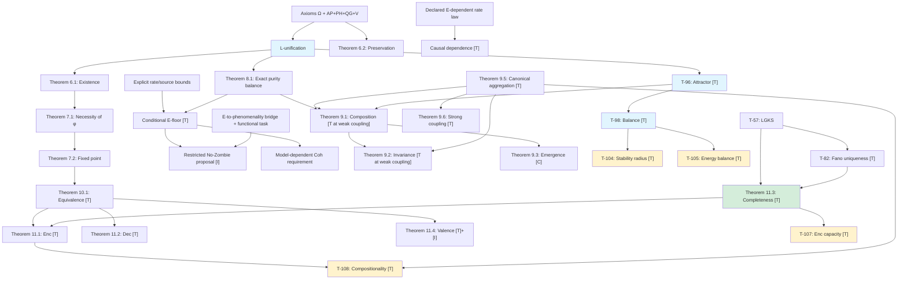

# Fundamental Theorems

> *"Mathematics is the language in which God has written the Universe."*
> — Galileo Galilei

:::info Bridge from the Previous Chapter
In the [previous chapter](./definitions) we defined all the key concepts of CC: the Holon, six measures ($P$, $S_{vN}$, $\Phi$, $D_{\text{diff}}$, $R$, $C$), E-coherence, the stress tensor, the interiority hierarchy, and the sensorimotor functors. Those were the "bricks". Now it is time to build the **edifice** from them — a system of theorems in which each result follows logically from the previous ones, and together they form a closed deductive chain from the [axioms](./axiomatics) to the deepest conclusions about the nature of life and consciousness.
:::

:::tip Chapter Roadmap
In this chapter we:
1. **Prove the existence of dynamics** — Theorem 6.1: the evolution equation has a solution (section "Existence Theorems")
2. **Show the necessity of self-reference** — Theorems 7.1–7.2: viability requires a self-model $\varphi$, iterations converge to $\Gamma^*$ (section "Self-Reference Theorems")
3. **Derive a conditional E-requirement** — Theorem 8.1: an explicit stationary purity balance and rate/source bounds (section "The No-Zombie Theorem")
4. **Investigate composition** — Theorems 9.1–9.3: fractal closure, scale invariance, and when coupling correlates the parts (section "Composition Theorems")
5. **Derive a unified viability criterion** — Theorem 10.1: $\|\sigma_{\mathrm{sys}}\|_\infty < 1$ (section "Unified Viability Condition")
6. **Describe the sensorimotor cycle** — Theorems 11.1–11.4: encoding, action, completeness, hedonics (section "Sensorimotor Encoding")
7. **Examine attractors and structure** — T-96, T-98, Fano uniqueness (sections "Attractor Theorems", "Fano Uniqueness")
:::

Why do we need a chapter on theorems? We already know the [axioms](./axiomatics) and [definitions](./definitions). But axioms are the foundation of a building, and definitions are the bricks. Theorems are **the building itself**: logical chains that connect the foundation to the roof and show that the structure will not collapse.

This chapter tells a story. It begins with the question "does dynamics even exist?" (Theorem 6.1), passes through the discovery that every living system **must** observe itself (Theorem 7.1), derives the conditional dynamical scope of the No-Zombie proposal (Theorem 8.1) — and ends with the question of when the interaction of parts produces something **new** — a joint state that the parts do not fix (Theorem 9.3: not for every coupling, but when the coupling has a correlating part).

Each theorem is not an isolated fact, but a link in a single deductive chain. Read in order — and you will see how an entire science of life, consciousness, and self-organisation grows from five axioms.

:::info Formalisation Levels
Each result is marked with one of the statuses (complete system — see [Status Registry](/docs/reference/status-registry)):
- **[T]** Theorem — strictly proved from UHM axioms
- **[C]** Conditional — conditional on an explicit assumption
- **[H]** Hypothesis — mathematically formulated, requires proof or non-perturbative computation
- **[I]** Interpretation — a semantic bridge, formally open
- **[D]** Definition by convention — a convention
- **[Pr]** Programme — a research direction, open problem
:::

:::note A Note on Notation
In this document:
- $\Gamma$ — [coherence matrix](/docs/core/dynamics/coherence-matrix)
- $\mathcal{V}$ — [viability region](/docs/core/dynamics/viability): $\mathcal{V} = \{\Gamma : P(\Gamma) > 2/7\}$
- $P$ — [purity](/docs/core/dynamics/viability#определение-чистоты): $P = \mathrm{Tr}(\Gamma^2)$
- $P_{\text{crit}} = 2/7$ — [critical purity theorem](/docs/proofs/dynamics/theorem-purity-critical)
- $\varphi$ — [self-modelling operator](/docs/proofs/categorical/formalization-phi) (specified numerical map; a channel only with frozen coefficients)
- $R$ — [reflection measure](/docs/consciousness/foundations/self-observation#мера-рефлексии-r), threshold $R_{\text{th}} = 1/3$
- $\Phi$ — [integration measure](/docs/core/structure/dimension-u#мера-интеграции-φ), threshold $\Phi_{\text{th}} = 1$
- $C$ — [consciousness measure](/docs/consciousness/foundations/self-observation#мера-сознательности-c)
- $\kappa_0$ — a selected regular kinetic rate with explicit assumptions.
- $\mathrm{Coh}_E$ — [E-coherence](./definitions#e-когерентность)
- $\mathcal{R}[\Gamma, E]$ — [regenerative term](/docs/core/dynamics/evolution#3-регенеративный-член)
:::

---

## Existence and preservation

### Theorem 6.1: Well-posed initial values [T under explicit hypotheses] {#theorem-61-existence-of-dynamics}

Let $H$ be Hermitian, $\mathcal L$ a finite-dimensional GKSL generator, $B(\rho)\in\mathcal D_7$, and $a(\rho)\ge0$. Assume a locally Lipschitz extension of

$$
F(\rho)=-i[H,\rho]+\mathcal L(\rho)+a(\rho)(B(\rho)-\rho)
$$

to a neighbourhood in Hermitian trace-one space. The initial-value problem has a unique local solution. If $\mathcal D_7$ is invariant, it continues for every finite positive time because the state space is compact and the vector field is bounded there. This theorem concerns the continuous model; it does not guarantee absence of NaN or accuracy of an arbitrary discretisation. Continuity of coefficients alone does not imply uniqueness.

### Theorem 6.2: Preservation of density states [T] {#theorem-62-preservation-of-gamma-properties}

Under the hypotheses above, Hermiticity and trace are preserved. For $v\in\ker\rho$, $v^*(-i[H,\rho])v=0$, $v^*\mathcal L(\rho)v\ge0$ from the CP part of GKSL, and $v^*a(B-\rho)v=a v^*Bv\ge0$. The vector field therefore lies in the tangent cone of the positive cone at its boundary. Under the stated regularity the invariance criterion preserves $\mathcal D_7$ and the continuation argument applies. A nonlinear density-preserving law need not be one linear completely positive map.

## Self-observation: limits of inference

### Theorem 7.1: Universal self-model necessity withdrawn [✗] {#theorem-71-necessity-of-self-reference}

$P>2/7$ does not imply an internal informational observation. A state sustained by a fixed input can remain stationary in the selected domain without state-dependent feedback. The formal condition $\|\rho-\varphi(\rho)\|<\varepsilon$ is always satisfied by identity; it does not prove that the system measures or knows itself. A substantive claim requires an observation law, a certificate available to a register, and a specified control class. The former four steps supplied none of these.

### Theorem 7.2: Fixed point of a chosen self-model [T] {#теорема-72-условная-неподвижная-точка-рефлексии}

For the selected family $M_{\rm coh}(\rho)=(1-R(\rho))\mathcal P(\rho)+R(\rho)I/7$, with $R=1/(7P)$ and $\mathcal P$ fixing $I/7$ and nonexpansive in HS norm,

$$
\|M_{\rm coh}(\rho)-I/7\|_F\le\tfrac67\|\rho-I/7\|_F.
$$

Subtract $I/7$ and use $0\le1-R\le6/7$. Iteration gives geometric convergence and the unique fixed point $I/7$. This is a distance estimate to the indicated state, not a proof of global contraction between arbitrary inputs. It is not implied by another generator's spectral gap and does not apply to every self-model. The logical support reflector is a separate construction.

---

## The No-Zombie Theorem: conditional dynamical content

The question is whether a declared dissipative system needs E-dependent regeneration to sustain a declared viability class. This requires rate and source assumptions; it does not follow merely from a nonzero dissipator. The identification of E with interiority is **[P/I]**. A mathematical dependence on E does not, by itself, refute philosophical zombies or epiphenomenalism.

### Theorem 8.1: Purity balance and a conditional E-floor [T under stated bounds] {#теорема-81-условная-необходимость-интериорности-no-zombie}

:::warning Withdrawal of the former universal statement
The claim $\mathrm{Viable}\land\mathcal D_\Omega\ne0\Rightarrow\varphi=\varphi_{\mathrm{coh}}\land\mathrm{Coh}_E>1/7$ is **retracted [✗]**. Canonical $\mathrm{Coh}_E$ ranges from zero to one; $1/7$ is its value at $I/7$, not a universal minimum. The canonical $\varphi_{\mathrm{coh}}$ with anchor $I/7$ does not supply positive purity regeneration. Bootstrap rates and independent environmental injection can maintain purity without a universal E-floor. The precise replacement is the balance theorem below.
:::

Consider a specified state-valued target $\tau(\Gamma)$ and dynamics

$$
\dot\Gamma=-i[H,\Gamma]+\gamma(\mathcal P_{\mathrm{Fano}}\Gamma-\Gamma)
+\kappa(\Gamma)g_V(P)(\tau(\Gamma)-\Gamma)+\mathcal J_{\mathrm{ext}}(\Gamma).
$$

Write $W=P_{\mathrm{coh}}=\sum_{i\ne j}|\gamma_{ij}|^2$, $h=\operatorname{Tr}(\Gamma\tau)-P$, $J_P=2\operatorname{Tr}(\Gamma\mathcal J_{\mathrm{ext}})$, and $\kappa=\kappa_b+\kappa_0\mathrm{Coh}_E$. Then the exact purity balance is

$$
\dot P=-\frac{4\gamma}{3}W+2(\kappa_b+\kappa_0\mathrm{Coh}_E)g_Vh+J_P.
$$

**Proof.** $\dot P=2\operatorname{Tr}(\Gamma\dot\Gamma)$; the commutator has zero trace contribution, and the Fano channel keeps the diagonal while multiplying off-diagonals by $1/3$. The remaining terms follow by substitution. No phenomenological identification is used.

**Stationary pointwise bound [T].** If $W>0$, $J_P=0$, $g_V>0$, $h>0$ and $\kappa_0>0$ at a stationary state, then

$$
\mathrm{Coh}_E=\frac1{\kappa_0}\left(\frac{2\gamma W}{3g_Vh}-\kappa_b\right).
$$

A necessary nonnegative lower bound uses the positive part of this expression. The quantity is state-dependent and can be below $1/7$; no $\max\{1/7,\ldots\}$ may be inserted without another assumption. If $\kappa_0=0$, the equation instead constrains the bootstrap rate and yields no E-bound. Replacing $P$ by $P_{\mathrm{crit}}$ or dropping the gate changes the equation and needs an explicit inequality direction and hypothesis.

**Uniform exclusion theorem [T under explicit bounds].** On a proposed stationary viability class suppose

$$
\gamma\ge\gamma_{\min}>0,\quad W\ge W_{\min}>0,\quad J_P\le J_{\max},\quad
0\le g_V\le g_{\max},\quad h\le h_{\max},\quad
0\le\kappa_b\le K_b,\quad0\le\kappa_0\le K_0,
$$

with $g_{\max},h_{\max},K_0>0$. Every stationary state in that class obeys

$$
\mathrm{Coh}_E\ge c_{\min}:=\max\left\{0,\frac{4\gamma_{\min}W_{\min}/3-J_{\max}}{2K_0g_{\max}h_{\max}}-\frac{K_b}{K_0}\right\}.
$$

**Proof.** At stationarity, dissipation is at least $4\gamma_{\min}W_{\min}/3$, whereas the positive sources are at most $2(K_b+K_0\mathrm{Coh}_E)g_{\max}h_{\max}+J_{\max}$. Rearrange. If $c_{\min}>1/7$, the proposed class contains no stationary state with $\mathrm{Coh}_E\le1/7$. If $c_{\min}>1$, the class has no stationary state at all. The bounds, including a positive required off-diagonal weight, are substantive premises; $\mathcal D_\Omega\ne0$ alone supplies none of them.

### Canonical self-model: why preserving some coherence is insufficient

For $\tau=\varphi_{\mathrm{coh}}\Gamma=(1-R)\mathcal D_\alpha\Gamma+RI/7$,

$$
h=-R(P-1/7)-(1-R)\alpha W\le0.
$$

Thus this model cannot balance positive Fano purity loss in the source-free equation. Choosing a nonunital anchor, sharpening map, Hamiltonian-driven environment or external injection changes the gain term and must be stated. A failure of a diagonal replacement channel does not prove the uniqueness or necessity of this particular canonical model.

For a **fixed target and fixed effective rate** $k=\kappa g_V$, a diagonal Hamiltonian gives stationary pair magnitude

$$
|\gamma_{ij}^*|^2=\frac{k^2|\tau_{ij}|^2}{(d+k)^2+\Delta\omega_{ij}^2},\qquad d=2\gamma/3,
$$

and its derivative with respect to $k$ is

$$
\frac{2k|\tau_{ij}|^2[d(d+k)+\Delta\omega_{ij}^2]}{[(d+k)^2+\Delta\omega_{ij}^2]^2}\ge0.
$$

This monotonicity holds with the indicated quantities frozen. It is not a universal derivative of an endogenous attractor with respect to its own E-statistic. For a general smooth equilibrium branch, sensitivity is determined by the full Jacobian and can change sign or fail at a bifurcation.

### Counterexamples to a universal floor

A nonzero dephasing generator can vanish on a particular diagonal pure state with $\mathrm{Coh}_E=0$. That state remains pure without any regeneration. This refutes a claim based only on $P>2/7$ and $\mathcal D\ne0$; it is not asserted to pass an independently required integration gate.

A stronger embodied counterexample permits nonzero coherence on every pair. Choose a full-rank state $\rho$ of purity $P>2/7$ with $\mathrm{Coh}_E<1/7$, and let $F(\rho)$ be its Hermitian trace-zero velocity under the specified internal dynamics. For

$$
\mu>\|F(\rho)\|_{\mathrm{op}}/\lambda_{\min}(\rho),\qquad\sigma:=\rho-F(\rho)/\mu,
$$

$\sigma$ is a density matrix, and adding the legitimate backbone $\mu(\sigma-\Gamma)$ makes $\rho$ an exact equilibrium. This is a constructive counterexample to excluding such states for **all** environmental anchors. It does not guarantee stability; a stability claim requires the full Jacobian.

For example let $p_E=0.01$, other populations $(1-p_E)/6$, $v_i=\sqrt{p_i}$, and

$$
\rho=(1-r)\operatorname{diag}(p)+rvv^\dagger,\quad
r^2=\frac{0.35-\sum_ip_i^2}{1-\sum_ip_i^2}.
$$

It is full rank, every pair is coherently populated, $P=0.35$, $\Phi>1$, and $\mathrm{Coh}_E<1/7$. The backbone construction applies. It fails the **stipulated proxy** $D^{7D}\ge2$: that gate itself entails $\mathrm{Coh}_E\ge1/6$ by definition. Such definitional exclusion must not be presented as a dynamical no-zombie theorem or as a literal extension-entropy calculation.

### Minimal model for a declared balance test {#минимальная-модель-no-zombie}

A reproducible model **[D]** specifies the Hamiltonian, Fano dissipator, target map, bootstrap/E-dependent rate, gate and independent environmental sources. The source-free special case is obtained by $\mathcal J_{\mathrm{ext}}=0$; the canonical $I/7$ anchor and a nonunital source are distinct models. The uniform bound requires all of its listed inequalities to hold on the tested class.

### Controlled simulation protocol {#протокол-симуляции-no-zombie}

1. Fix the target, environment, rates, gate, E-projection and definition of sustained viability before sampling states.
2. Verify the exact purity balance and the hypotheses of the proposed uniform bound; distinguish stationary states from finite-time survival.
3. Compare E-dependent regeneration with bootstrap-only and independent-source controls. E-ablation must preserve positivity and must account for diagonal E-population: removing off-diagonal E entries does not generally make canonical $\mathrm{Coh}_E$ zero.
4. Report basin dependence, eigenvalues of the tangent Jacobian and uncertainty of parameter bounds. Do not require all random states to share an attractor in a bistable gated system.
5. A counterexample satisfying **all** assumptions refutes a mathematical bound. Simulations validate a chosen implementation; biological/phenomenal necessity requires independent measurements and the declared bridge.

No universal $1/4$ critical exponent or macroscopic rate hierarchy is assumed. At $P\le2/7$ a source-free nonnegative-gate model with Fano dissipation has $\dot P\le0$ when its gate is zero; independent injection changes this conclusion.

### Corollary 8.1.1: explicit causal dependence [T / I]

For a declared rate law with $\kappa_0>0$, holding other inputs fixed gives $\partial\kappa/\partial\mathrm{Coh}_E=\kappa_0$. At points where the target difference and gate are nonzero, changing this input changes the generator. The phenomenological identification of this causal input with experience is **[P/I]**. Neither strict monotonicity of every stationary purity nor the refutation of every form of epiphenomenalism follows automatically.

### Corollary 8.1.2: the scope of “No-Zombie” [C / I]

Under the uniform bound with $c_{\min}>1/7$, the declared stationary class excludes $\mathrm{Coh}_E\le1/7$ **[T at the bounds]**. Interpreting those excluded states as philosophical zombies additionally requires an E-to-phenomenality bridge **[P/I]** and a task-specific equivalence of functional behaviour. There is no general theorem excluding all functionally capable systems without phenomenal experience.

### Corollary 8.1.3: quantitative E-requirement [T under bounds]

The explicit $c_{\min}$ above is a model-dependent stationary resource requirement. It is not a universal minimum of experience or a clinical diagnostic threshold. With stronger bootstrap or independent sources it can vanish; with larger required coherence dissipation it can increase. Its empirical interpretation must be calibrated separately.

## Composition Theorems

Let us return to the orchestra analogy. Until now we have been studying *one* musician (a single holon). Now imagine two orchestras deciding to play together. The first question: will the joint performance be meaningful? The second: will it produce something that was absent from either orchestra individually?

Theorems 9.1–9.6 are the answer. 9.1 and 9.2 were first proved under assumptions — (HOL), that the joint system is itself a holon, and (AGG), a consistent aggregation and weak coupling; Theorem 9.5 fixes the aggregation (it is unique) and proves for weak coupling what both assumed, and Theorem 9.6 shows that the coupling must be weak. 9.3 says when joint play **generates a new quality** — a joint state with information that neither orchestra holds — and shows that it does not do so for every coupling. (Earlier: "yes, joint play … generates a new quality. … The whole is more than the sum of its parts. And this is not a metaphor — it is a theorem"; corrected 2026-09-25 with the retraction in Theorem 9.3.)

### Theorem 9.1: conditional persistence under weak coupling {#теорема-91-фрактальное-замыкание}

Assume fixed linear local GKSL generators with unique stationary states $\rho_i^0$, and invertible restrictions $\mathcal L_i|_{\mathrm{Tr}=0}$. For a stationary joint state of $\mathcal L_1\otimes\mathrm{id}+\mathrm{id}\otimes\mathcal L_2+g\mathcal L_{\mathrm{int}}$, partial trace gives

$$
\mathcal L_i(\rho_i^g-\rho_i^0)=-g\operatorname{Tr}_j\mathcal L_{\mathrm{int}}(\rho_{12}^g).
$$

Thus $\|\rho_i^g-\rho_i^0\|_F\le |g|\|\mathcal L_i^{-1}\|\|\operatorname{Tr}_j\mathcal L_{\mathrm{int}}\|_{F\to F}$, using $\|\rho_{12}^g\|_F\le1$. If twice this bound is smaller than $P(\rho_i^0)-2/7$, both marginals retain structural majority [T at these assumptions]. The actual joint dimension is49. A seven-dimensional aggregation must be declared separately.

The old proof via universal T-57 trichotomy, necessary c>0 and T-41b pair coverage is withdrawn [✗]. Linear primitivity does not imply a coherent or living nonlinear attractor. Applying this perturbation result to nonlinear feedback or claiming every organism/society is a holon requires additional premises. The precise canonical marginal-aggregation result below is retained.

### Theorem 9.2 / T-72 (Scale Invariance, CC-6) [T at weak coupling] {#теорема-92-масштабная-инвариантность}

:::tip Status raised 2026-09-25: from "conditional on (AGG)" to [T at weak coupling]
The theorem is an implication, (AGG) ⇒ bounds, and the implication is proved; what was conditional was its application to holons. [Theorem 9.5](#теорема-95-каноническая-агрегация) proves (AGG) for weakly coupled embodied holons. Part (a) of (AGG) holds for the canonical aggregation $\mathcal{M}_k$, the only permutation-invariant consistent one; part (b) is needed only for the marginals — form (b′) below, since the aggregate depends on nothing else — and holds with $\delta = O(g)$ at the stationary state (Corollary 9.2a), along every trajectory from a compact part of the basin (Theorem 9.5 (f)), and from every initial state with explicit constants under backbone dominance (Theorem 9.5 (e)). At strong coupling the transfer fails: the canonical aggregate of two viable holons can be $I/7$ ([Theorem 9.6](#теорема-96-сильная-связь)).
:::

:::warning Errata 2026-09-25: status corrected from [T] to [C under (AGG)]
The earlier statement claimed that **any** CPTP aggregation preserves $P$, $R$, $\Phi$, the Gap profile and the L-level up to $O(\varepsilon_0)$ with $\varepsilon_0 \approx 0.023$. That claim is retracted: its proof did not carry it.
- **Contractivity is not preservation.** The completely depolarising channel $\Lambda(\rho) = \mathrm{Tr}(\rho)\, I/7$ is CPTP and Bures-contractive, yet it sends every state to $I/7$: $P = 1/7 < 2/7$ and $\Phi = 0$. Even the partial trace sends a maximally entangled pair of holons to $I/7$. Contractivity bounds the distance between two *images*; it says nothing about the distance between an image and a constituent unless something ties the two together — assumption (AGG) below.
- **Step 3** ("all structural invariants are $G_2$-invariants", T-42a) is retracted: $P$ and $R$ are unitary invariants, but $\Phi$ and the Gap profile are frame-pinned — an explicit $g \in G_2$ sends $\Phi$ from $0$ to $1$ ([frame rigidity](/docs/proofs/categorical/uniqueness-theorem#жёсткость-репера); regression test `test_phi_not_g2_invariant`). The step needed only continuity, which holds.
- **Step 5** ($|P(\Gamma^{(k)}) - P(\Gamma^{(1)})| \leq \|\Phi_k\|_{\mathrm{cb}}\,\varepsilon_{\mathrm{coupling}} \leq \varepsilon_0$) is retracted: it was asserted, not derived. For a CPTP map $\|\Phi_k\|_{\mathrm{cb}} = 1$, so the inequality only renamed the unknown deviation; and $0.023$ is the weighted mean of the sector coherences of the Gap vacuum inside one holon ([sector hierarchy](/docs/core/dynamics/gap-thermodynamics#теорема-секторная-иерархия-ε)), not a coupling between holons.
- **Steps 1 and 4**: step 1 cited the Morita equivalence T-58, retracted on 2026-09-10 (and it concerned 7D↔42D, not $7^k \to 7$); step 4 derived $R \geq 1/3$ "from primitivity", but $R \geq 1/3$ means $P \leq 3/7$, an upper bound that primitivity does not give; "the L-level is preserved or elevated" had no argument.
:::

:::note In Plain Terms
Recall a Russian nesting doll (matryoshka): the small doll resembles the large one, and that resembles an even larger one. Theorem 9.2 says when a holon made of holons keeps the structural properties of its parts (purity, reflection, integration): when the parts are only weakly coupled, and the aggregation, applied to uncoupled parts, returns the state of a part. Then every key invariant of the whole lies within an explicit distance, proportional to the coupling, of the same invariant of a part. With strong coupling nothing of the kind holds: two maximally entangled holons, aggregated by the partial trace, give the dead state $I/7$.

For a physicist: this is the analogue of renormalization-group invariance — the properties of a field theory do not depend on the scale of observation (up to running coupling constants). Here the coupling $\delta$ between the parts plays the role of the running coupling: the corrections are of order $\delta$ and are small only when $\delta$ is.

For a biologist: the same principles of homeostasis can operate at the level of the cell, the organ and the organism wherever the parts are weakly coupled; the theorem does not say that they must.

**Connection:** [section–retraction T-58′](/docs/core/structure/dimension-e#теорема-морита-эквивалентность), [frame rigidity](/docs/proofs/categorical/uniqueness-theorem#жёсткость-репера), [threshold robustness T-124d](/docs/proofs/consciousness/conscious-window#t-124d)
:::

:::tip Statement [T]
Let $k$ identical holons have the state $\sigma \in \mathcal{D}(\mathbb{C}^7)$, let $\rho_k \in \mathcal{D}(\mathbb{C}^{7^k})$ be the state of the coupled collection, and let the aggregation be a CPTP channel $\Phi_k: \mathcal{D}(\mathbb{C}^{7^k}) \to \mathcal{D}(\mathbb{C}^7)$. Assume

**(AGG)** (a) *consistency*: $\Phi_k(\sigma^{\otimes k}) = \sigma$ — aggregating uncoupled copies returns the constituent (the partial trace and the mean of the single-copy marginals both qualify; the mean marginal $\mathcal{M}_k$ is the only permutation-invariant choice, [Theorem 9.5](#теорема-95-каноническая-агрегация) (a)); (b) *weak coupling*: $d_B(\rho_k, \sigma^{\otimes k}) \leq \delta$ — or, for $\Phi_k = \mathcal{M}_k$, only (b′) $\max_i \tfrac12\lVert (\rho_k)_i - \sigma \rVert_1 \leq \delta$ on the single-copy marginals, which (b) implies.

Then the aggregate $\Gamma^{(k)} := \Phi_k(\rho_k)$ satisfies $d_B(\Gamma^{(k)}, \sigma) \leq \delta$ (under (b)) and $\|\Gamma^{(k)} - \sigma\|_F \leq 2\delta$ (under (b) or (b′)), and, with $\Delta_P := |P(\Gamma^{(k)}) - P(\sigma)|$:

- $\Delta_P \leq 4\delta\sqrt{P(\sigma)} + 4\delta^2$ and $|R(\Gamma^{(k)}) - R(\sigma)| \leq 7\Delta_P$;
- $|\Phi(\Gamma^{(k)}) - \Phi(\sigma)| \leq 7\Delta_P + 196\,P(\sigma)\,\delta$ — a crude global bound; [T-124d](/docs/proofs/consciousness/conscious-window#t-124d) gives the first-order sensitivity;
- $|\mathrm{Gap}_{\Gamma^{(k)}}(i,j) - \mathrm{Gap}_{\sigma}(i,j)| \leq \pi\delta/|\sigma_{ij}|$ whenever $2\delta < |\sigma_{ij}|$;
- each L2 condition $P > 2/7$, $R \geq 1/3$, $\Phi \geq 1$ keeps its truth value when $\sigma$ clears the threshold by more than the corresponding deviation.

$\Phi$ and Gap are compared in the fixed frame: they are frame-pinned, not $G_2$-invariant. No bound is claimed for the full L-level, which also involves $D_{\mathrm{diff}}$ and, at L3, $R^{(2)}$.
:::

**Proof (5 steps).**

**Step 1 (Contractivity carries the conclusion because of (AGG a)).** The fidelity does not decrease under CPTP maps, so the Bures distance does not increase (standard result):

$$
d_{\mathrm{Bures}}(\Phi_k(\rho), \Phi_k(\rho')) \leq d_{\mathrm{Bures}}(\rho, \rho')
$$

With $\rho = \rho_k$, $\rho' = \sigma^{\otimes k}$ and (AGG a): $d_B(\Gamma^{(k)}, \sigma) \leq d_B(\rho_k, \sigma^{\otimes k}) \leq \delta$. Without (a) the second image is not $\sigma$, and nothing about $\sigma$ follows — this is where the earlier proof broke.

**Step 2 (From Bures to trace and Frobenius norms).** With $d_B^2 = 2(1 - \sqrt{F})$ one has $1 - F = d_B^2 - d_B^4/4 \leq d_B^2$, and the Fuchs–van de Graaf inequality $\tfrac12\|\rho - \rho'\|_1 \leq \sqrt{1 - F}$ (arXiv:quant-ph/9712042) gives $\tfrac12\|\Gamma^{(k)} - \sigma\|_1 \leq \delta$. Under (b′) with $\Phi_k = \mathcal{M}_k$ the same bound follows from the convexity of the trace norm: $\tfrac12\lVert \mathcal{M}_k(\rho_k) - \sigma \rVert_1 \leq \max_i \tfrac12\lVert (\rho_k)_i - \sigma \rVert_1$; and (b) implies (b′), because the partial trace does not increase the trace distance. Since $\|X\|_F \leq \|X\|_1$, the deviation $X := \Gamma^{(k)} - \sigma$ has $\|X\|_F \leq 2\delta$. Steps 3–5 use nothing else.

**Step 3 (Purity and reflection).** $P(\sigma + X) - P(\sigma) = 2\,\mathrm{Tr}(\sigma X) + \mathrm{Tr}(X^2)$, so by Cauchy–Schwarz $\Delta_P \leq 2\|\sigma\|_F\|X\|_F + \|X\|_F^2 \leq 4\delta\sqrt{P(\sigma)} + 4\delta^2$ (Bound 1 of T-124d). For $R = 1/(7P)$: $|\Delta R| = \Delta_P/(7PP') \leq 7\Delta_P$, because $P, P' \geq 1/7$.

**Step 4 (Integration and Gap, in the fixed frame).** Write $\Phi = P/D - 1$ with $D = \sum_i \gamma_{ii}^2 \geq 1/7$ (Cauchy–Schwarz, since $\sum_i \gamma_{ii} = 1$). Then $|\Delta\Phi| \leq \Delta_P/D' + P\,|\Delta D|/(DD') \leq 7\Delta_P + 49\,P(\sigma)\,|\Delta D|$, and $|\Delta D| \leq (\sqrt{D} + \sqrt{D'})\,\|X\|_F \leq 4\delta$. For $\mathrm{Gap}(i,j) = |\sin(\arg\gamma_{ij})|$: if $|X_{ij}| < |\sigma_{ij}|$, the phase of $\sigma_{ij} + X_{ij}$ differs from that of $\sigma_{ij}$ by at most $\arcsin(|X_{ij}|/|\sigma_{ij}|) \leq \tfrac{\pi}{2}|X_{ij}|/|\sigma_{ij}|$, and $|\sin|$ is 1-Lipschitz; with $|X_{ij}| \leq \|X\|_F \leq 2\delta$ this is the stated bound. The comparison is meaningful because (AGG a) holds as a matrix identity in one frame; a $G_2$ rotation of either state would change $\Phi$ and Gap.

**Step 5 (Thresholds).** If $P(\sigma) - 2/7$ exceeds the bound on $\Delta_P$, then $P(\Gamma^{(k)}) > 2/7$ as well; likewise for $R \geq 1/3$ and $\Phi \geq 1$. A state that lies within the deviation of a threshold can cross it in either direction. $\blacksquare$

:::tip Corollary 9.2a ((AGG) at the stationary state of weakly coupled holons) [T]
Let $k$ identical embodied holons with an anchor outside the null set of [Theorem 9.4](#теорема-94-генеричность-nd) be coupled by $-ig\,H_{\mathrm{int}}$, and let the aggregation be the partial trace onto one holon or the mean of the single-copy marginals. For $|g|$ small the stationary state $\rho_k = X(g)$ near $\sigma^{\otimes k}$ satisfies (AGG): (a) holds by the choice of aggregation, and (b) holds in trace norm with $\delta = \tfrac12\lVert X(g) - \sigma^{\otimes k}\rVert_1 = O(g)$. The conclusions of Theorem 9.2 therefore hold at the stationary state with deviations $O(g)$.
:::

*Proof.* The branch $X(g)$ and its derivative are those of Corollary 9.1a, now for $k$ factors. Both aggregations are CPTP and return $\sigma$ on $\sigma^{\otimes k}$, so $\tfrac12\lVert\Gamma^{(k)} - \sigma\rVert_1 \leq \delta$; steps 2–5 of Theorem 9.2 use only this bound, $\lVert\Gamma^{(k)} - \sigma\rVert_F \leq 2\delta$. $\blacksquare$ Witness (`test_non_degeneracy_is_generic_and_aggregation_follows_from_weak_coupling`): two identical embodied holons with a generic coupling $X \otimes Y$ of unit norm; $\lVert X(g) - \sigma \otimes \sigma\rVert_1 / g = 0.13421$ at $g = 0.01$ and $0.13419$ at $g = 0.02$.

**What does not need (AGG).** If the aggregate is itself a holon — assumption (HOL) of [Theorem 9.1](#теорема-91-фрактальное-замыкание) — that theorem gives it its own non-trivial attractor, $P(\rho_*^{(k)}) > 1/7$ ([T-96](/docs/core/dynamics/evolution#теорема-нетривиальность-аттрактора) [T]). That statement concerns the aggregate's own dynamics, not how its invariants compare with those of its parts.

:::info Corollary (Fractal structure) [T at weak coupling]
Scale invariance and fractal closure, both proved for weak coupling through the canonical aggregation ([Theorem 9.5](#теорема-95-каноническая-агрегация)), give UHM a fractal structure at every scale at which the constituents are embodied, viable and weakly coupled, $|g|\,s(H_{\mathrm{int}}) < \varepsilon_V$: the canonical aggregate is viable and its invariants lie within $O(g)$ of a part's. What is inherited is the parts' state, not something new: the canonical aggregate depends only on the marginals. Where the coupling is strong, nothing of the kind need hold — the aggregate of two viable holons can be $I/7$ ([Theorem 9.6](#теорема-96-сильная-связь)); a composite that is assumed to be a holon in the sense of (HOL) still has its own attractor. (Earlier: "non-triviality [T], viability [T for embodied]" without (HOL), corrected 2026-09-25 to "[C under (AGG) and (HOL)]"; raised the same day with Theorem 9.5.)
:::

---

Fractal closure and scale invariance concern what the composite inherits. The next question is what it acquires: when does coupling make the joint state of two holons carry information that the two individual states do not — mutual information $I > 0$? The earlier answer, "always, once they interact", is false; the correct answer is a criterion on the coupling.

#### Theorem 9.3 (CC-7: Emergence) [T for almost every anchor] {#теорема-93-эмерджентность}

<!-- preserve old anchor for backward compatibility -->

:::warning Retracted (2026-09-25): "interacting holons always have a correlated stationary state" [✗]
The earlier statement read: for two interacting viable holons with non-zero inter-system coherence $|\gamma_{12}| > 0$, the stationary state of the composite has $I(\mathbb{H}_1 : \mathbb{H}_2) > 0$; status [T]. It is false, and two steps of its proof fail.
- **Step 2** claimed $\mathcal{L}_{\mathrm{int}}(\rho_*^{(1)} \otimes \rho_*^{(2)}) \neq 0$ whenever $\mathcal{L}_{\mathrm{int}} \neq 0$. A Hamiltonian coupling $-i[H_{\mathrm{int}}, \cdot]$ vanishes on the product whenever $H_{\mathrm{int}}$ commutes with it. Counterexample: $H_{\mathrm{int}} \propto (\rho_*^{(1)} - I/7) \otimes (\rho_*^{(2)} - I/7)$ is non-local (its partial trace over either factor is zero), non-zero, and commutes with $\rho_*^{(1)} \otimes \rho_*^{(2)}$, so the product stays stationary and $I = 0$ (numbers in part (i) below).
- **Step 3** inferred $I > 0$ from $\rho_*^{(12)} \neq \rho_*^{(1)} \otimes \rho_*^{(2)}$. Mutual information is positive exactly when the state is not a product of *any* two states; differing from one particular product is not enough. A local coupling $H_A \otimes I$ moves the stationary state off $\rho_*^{(1)} \otimes \rho_*^{(2)}$ to another product $\sigma_1 \otimes \rho_*^{(2)}$, again with $I = 0$ (part (ii)).
- The hypothesis $|\gamma_{12}| > 0$ was never defined: a state on $\mathbb{C}^7 \otimes \mathbb{C}^7$ has no single "inter-system coherence" $\gamma_{12}$, and read as "the stationary state has coherences between the systems" it assumes the conclusion.

The Corollary "CC-7 (Emergence)" under Theorem 9.1 cited this proof and is withdrawn with it. What replaces the statement is below: two exact facts that hold for every coupling, and a weak-coupling criterion under a named assumption. Regression test: `test_coupled_holons_can_have_a_product_stationary_state` in `website/scripts/check_core_numbers.py` (audit A-82).
:::

:::note In Plain Terms
Two pendulums hung from one beam swing in step because the beam passes motion from one to the other; two pendulums whose coupling acts only on what each is already doing stay independent, however strong the coupling. Theorem 9.3 says which kind a coupling between two holons is. The whole acquires information that is not in the parts — mutual information $I > 0$ — exactly when the coupling has a *correlating part* at the parts' own steady states; a coupling that commutes with those states, or acts on one holon alone, leaves the pair uncorrelated.

For a psychologist: two people who interact are not thereby correlated; the interaction has to depend jointly on what each of them is doing. For a physicist: this is the familiar statement that a weak perturbation correlates two subsystems at first order only through the part of $[H_{\mathrm{int}}, \rho_1 \otimes \rho_2]$ that is not a sum of local terms.

**Connection:** [Quantum mutual information](https://en.wikipedia.org/wiki/Quantum_mutual_information), [canonical extension of $\mathcal{R}$ to composite systems](/docs/core/dynamics/evolution#расширение-r-на-составные-системы)
:::

**Setting.** Each holon $i = 1, 2$ has the generator of [evolution](/docs/core/dynamics/evolution#полное-уравнение-движения), $\mathcal{L}_i[\Gamma] = -i[H_i, \Gamma] + \mathcal{D}_\Omega[\Gamma] + \kappa(\Gamma)\, g_V(P)\,(\varphi_{\mathrm{coh}}(\Gamma) - \Gamma) + \mu\,(\sigma_i - \Gamma)$, where the last term is the backbone injection toward the anchor $\sigma_i = \pi(\mathcal{B}(x))$ of an embodied holon ([T-148](/docs/proofs/consciousness/substrate-closure#t-148)), $\mu > 0$. Freezing the scalars $\kappa$, $g_V$ and $k = 1 - R$ at a state $g$ gives a linear generator $\mathcal{M}_i^{(g)}$ of a CPTP semigroup with $\mathcal{L}_i[\Gamma] = \mathcal{M}_i^{(\Gamma)}(\Gamma)$. The composite has the [canonical extension](/docs/core/dynamics/evolution#расширение-r-на-составные-системы) plus a Hamiltonian coupling:

$$
\mathcal{L}^{(12)}[X] = (\mathcal{M}_1^{(X_1)} \otimes \mathrm{id})(X) + (\mathrm{id} \otimes \mathcal{M}_2^{(X_2)})(X) - i\,g\,[H_{\mathrm{int}}, X], \qquad X_1 = \mathrm{Tr}_2 X,\; X_2 = \mathrm{Tr}_1 X .
$$

Let $\mathcal{L}_i[\rho_*^{(i)}] = 0$, $\sigma := \rho_*^{(1)} \otimes \rho_*^{(2)}$, and let $\Pi_c^{(s_1 \otimes s_2)}(Y) := Y - \mathrm{Tr}_2 Y \otimes s_2 - s_1 \otimes \mathrm{Tr}_1 Y + \mathrm{Tr}(Y)\, s_1 \otimes s_2$ be the projection onto the correlation part: it vanishes exactly on operators of the form $a \otimes s_2 + s_1 \otimes b$.

**(ND)** *Non-degeneracy:* each $\rho_*^{(i)}$ is a non-degenerate fixed point — the Jacobian of $\mathcal{L}_i$ at $\rho_*^{(i)}$ is invertible on traceless Hermitian operators, and $P(\rho_*^{(i)}) \notin \{2/7, 3/7\}$, so that the gate $g_V$ is differentiable there.

:::tip Theorem 9.3 (CC-7: Emergence) [T for almost every anchor; earlier C under (ND)]
**(i) Exact, any $g$.** $\sigma$ is a stationary state of the coupled composite if and only if $[H_{\mathrm{int}}, \sigma] = 0$. In that case the pair has a stationary state with $I(\mathbb{H}_1 : \mathbb{H}_2) = 0$ at every coupling strength.

**(ii) Exact, any $g$.** A product $s_1 \otimes s_2$ is a stationary state if and only if $\Pi_c^{(s_1 \otimes s_2)}\bigl([H_{\mathrm{int}}, s_1 \otimes s_2]\bigr) = 0$ and each $s_i$ is stationary for $\mathcal{L}_i - i g [H_i^{\mathrm{mf}}, \cdot\,]$ with the mean fields $H_1^{\mathrm{mf}} = \mathrm{Tr}_2[(I \otimes s_2) H_{\mathrm{int}}]$, $H_2^{\mathrm{mf}} = \mathrm{Tr}_1[(s_1 \otimes I) H_{\mathrm{int}}]$. A stationary state of the pair is uncorrelated exactly when it is such a product; in particular a local coupling $H_A \otimes I + I \otimes H_B$ never correlates the pair.

**(iii) Weak coupling, under (ND) — which holds for every pair of anchors outside a closed null set (Theorem 9.4).** For $|g|$ small there is a unique stationary state $X(g)$ near $\sigma$, smooth in $g$, and

$$
X(g) - X_1(g) \otimes X_2(g) = g\, C_1 + O(g^2), \qquad C_1 = \mathcal{J}_c^{-1}\, \Pi_c^{(\sigma)}\bigl(i[H_{\mathrm{int}}, \sigma]\bigr),
$$

where $\mathcal{J}_c = \mathcal{M}_1^{(\rho_*^{(1)})} \otimes \mathrm{id} + \mathrm{id} \otimes \mathcal{M}_2^{(\rho_*^{(2)})}$ restricted to the correlation space, whose spectrum lies in $\mathrm{Re}\,\lambda \leq -2\mu$. Hence, if $\Pi_c^{(\sigma)}([H_{\mathrm{int}}, \sigma]) \neq 0$, then $I(X(g)) \geq \tfrac12 \lVert X(g) - X_1(g) \otimes X_2(g) \rVert_1^2 > 0$ for every small $g \neq 0$, and $I = \Theta(g^2)$; if $\Pi_c^{(\sigma)}([H_{\mathrm{int}}, \sigma]) = 0$, the correlation is at most $O(g^2)$.
:::

**Proof.**

**Step 1 (Product states).** The extension acts on a product through its factors: $(\mathcal{M} \otimes \mathrm{id})(a \otimes b) = \mathcal{M}(a) \otimes b$, and the scalars of $\mathcal{M}_i^{(X_i)}$ are read on the marginals, which for $s_1 \otimes s_2$ are $s_1, s_2$. Hence

$$
\mathcal{L}^{(12)}[s_1 \otimes s_2] = \mathcal{L}_1[s_1] \otimes s_2 + s_1 \otimes \mathcal{L}_2[s_2] - i g\, [H_{\mathrm{int}}, s_1 \otimes s_2] .
$$

For $s_i = \rho_*^{(i)}$ the first two terms vanish, which proves (i). For (ii): $\mathrm{Tr}_2 [H_{\mathrm{int}}, s_1 \otimes s_2] = [H_1^{\mathrm{mf}}, s_1]$ (cyclicity of the partial trace in the second factor), and symmetrically for $\mathrm{Tr}_1$, so the two partial traces of the equation are the two mean-field equations; $\Pi_c$ annihilates the local terms $\mathcal{L}_1[s_1] \otimes s_2$ and $s_1 \otimes \mathcal{L}_2[s_2]$, so what remains is $\Pi_c([H_{\mathrm{int}}, s_1 \otimes s_2]) = 0$. The three conditions together are equivalent to the equation, because $Y = \Pi_c(Y) + \mathrm{Tr}_2 Y \otimes s_2 + s_1 \otimes \mathrm{Tr}_1 Y - \mathrm{Tr}(Y)\, s_1 \otimes s_2$. For $H_{\mathrm{int}} = H_A \otimes I + I \otimes H_B$ the commutator with a product is local, and $\Pi_c$ of it is zero. Finally $I(X) = D(X \,\|\, X_1 \otimes X_2)$ vanishes exactly on products.

**Step 2 (The Jacobian splits).** Let $\mathcal{J}$ be the Jacobian of $\mathcal{L}^{(12)}$ at $g = 0$, $X = \sigma$, on traceless Hermitian operators. Along a local direction $x \otimes \rho_*^{(2)}$ only the first marginal moves, and $\mathcal{J}(x \otimes \rho_*^{(2)}) = (D\mathcal{L}_1\, x) \otimes \rho_*^{(2)} + x \otimes \mathcal{L}_2[\rho_*^{(2)}] = (D\mathcal{L}_1\, x) \otimes \rho_*^{(2)}$ — the second factor's frozen generator applied to its own fixed point gives zero. Along a correlation direction ($\mathrm{Tr}_1 Y = \mathrm{Tr}_2 Y = 0$) neither marginal moves, the scalars stay frozen, and $\mathcal{J} Y = \mathcal{J}_c Y$, which again has zero partial traces because the $\mathcal{M}_i$ preserve the trace. So $\mathcal{J}$ is block-diagonal: the Jacobians of the two holons on the local blocks, $\mathcal{J}_c$ on the correlation block; and it commutes with $\Pi_c^{(\sigma)}$.

**Step 3 (The correlation block is invertible).** On traceless $Y$ the backbone term acts as $-\mu Y$ (the replacement $Y \mapsto \mathrm{Tr}(Y)\sigma_i$ annihilates it), and the rest of $\mathcal{M}_i$ generates a trace-preserving CPTP semigroup that maps traceless operators to traceless ones; hence $\lVert e^{t\mathcal{M}_i} Y \rVert_1 \leq e^{-\mu t} \lVert Y \rVert_1$ and the spectrum of $\mathcal{M}_i$ on traceless operators has $\mathrm{Re}\,\lambda \leq -\mu$. The spectrum of $\mathcal{J}_c$ consists of the sums $\lambda + \lambda'$ of such eigenvalues: $\mathrm{Re} \leq -2\mu < 0$. No assumption is needed here; the backbone of an embodied holon supplies it.

**Step 4 (First order).** Under (ND) the local blocks are invertible too, so $\mathcal{J}$ is, and the implicit function theorem gives the branch $X(g)$. Differentiating $\mathcal{L}^{(12)}[X(g)] = 0$ at $g = 0$: $\mathcal{J} X'(0) = i[H_{\mathrm{int}}, \sigma]$; applying $\Pi_c^{(\sigma)}$, which commutes with $\mathcal{J}$, gives $\Pi_c^{(\sigma)} X'(0) = C_1$. Since $X - X_1 \otimes X_2 = \Pi_c^{(\sigma)}(X) - (X_1 - \rho_*^{(1)}) \otimes (X_2 - \rho_*^{(2)})$, the correlation is $g C_1 + O(g^2)$, and $C_1 \neq 0$ exactly when $\Pi_c^{(\sigma)}([H_{\mathrm{int}}, \sigma]) \neq 0$. The bound on $I$ is the quantum Pinsker inequality $D(\rho \,\|\, \tau) \geq \tfrac12 \lVert \rho - \tau \rVert_1^2$. $\blacksquare$

**Status: [T] for almost every anchor (updated 2026-09-25; it was [C under (ND)]).** Parts (i) and (ii) use nothing beyond the form of the composite generator and hold unconditionally. Part (iii) needs (ND), and [Theorem 9.4](#теорема-94-генеричность-nd) below proves it for every pair of anchors outside a closed Lebesgue-null set. It also needs the attractor to exist. An embodied holon always has a stationary state: its flow maps the compact convex set of states into itself, so each time-$t$ map has a fixed point (Brouwer), and a limit of such points as $t \to 0$ is stationary. An isolated holon with the self-registering $\varphi_s$ has seven non-degenerate ones for small $H$ ([evolution](/docs/core/dynamics/evolution#теорема-самоподдерживающийся-аттрактор)), and there the correlation block is invertible too, with $\mathrm{Re} \leq -2\kappa g_V R$ in place of $-2\mu$ (the anchor term acts as $-\kappa g_V R$ on traceless operators). Without an anchor of either kind there is nothing to apply (iii) to: an isolated holon with the canonical $\varphi_{\mathrm{coh}}$ (anchor $I/7$) has none besides $I/7$, since $\mathrm{Tr}(\Gamma \varphi_{\mathrm{coh}}(\Gamma)) \leq P - (P - 1/7)/(7P)$, so regeneration and dissipation both lower $P$ (over 100 random states the left side minus the right is at most $-0.020$; twenty pure starts all end at $P = 0.14286$ by $t = 60$); the anchor $\sigma_i$ of an embodied holon is what gives it one ([T-148](/docs/proofs/consciousness/substrate-closure#t-148)).

**Numerical check** (`test_coupled_holons_can_have_a_product_stationary_state`). Two embodied holons with the canonical ingredients above ($\alpha = 1/2$, $\mu = 1$, $\kappa = 1/7 + \mathrm{Coh}_E$, $g_V = \mathrm{clamp}(7P - 2, 0, 1)$, random $H_i$ of norm scale $0.3$, anchors of purity weight $0.85$ and $0.8$) have attractors with $P = 0.362$ and $0.303$ (residual below $10^{-15}$). All couplings are normalised to operator norm $0.3$.
- (i) $H_{\mathrm{int}} \propto (\rho_*^{(1)} - I/7) \otimes (\rho_*^{(2)} - I/7)$: $\lVert [H_{\mathrm{int}}, \sigma] \rVert_F = 1.7 \times 10^{-17}$. From a random state on $\mathbb{C}^{49}$ the flow reaches $\sigma$ to $4.9 \times 10^{-16}$ by $t = 24$; $\lvert I \rvert < 10^{-15}$.
- (ii) $H_{\mathrm{int}} = H_A \otimes I$: $\lVert [H_{\mathrm{int}}, \sigma] \rVert_F = 0.052$; the stationary state moves $0.027$ away from $\sigma$ and stays a product to $4 \times 10^{-16}$; $\lvert I \rvert < 10^{-15}$.
- A generic $X \otimes Y$: correlation $\lVert X - X_1 \otimes X_2 \rVert_F = 0.013$, $I = 2.1 \times 10^{-3}$.
- (iii) In a run of the same model with $\kappa_0 = \omega_0 \lvert\gamma_{OE}\rvert \lvert\gamma_{OU}\rvert / \gamma_{OO}$: the single-holon Jacobians have spectra with $\mathrm{Re}\,\lambda \leq -1.30$ and $-1.42$, so (ND) holds for this pair; under the coupling of (i), three random starts on $\mathbb{C}^{49}$ end within $10^{-13}$ of $\sigma$; for a generic $X \otimes Y$ of unit norm at $g = 0.02$ and $0.04$, the measured correlation matches $g C_1$ to relative $5.8 \times 10^{-3}$ and $1.16 \times 10^{-2}$ (error linear in $g$), and $I/g^2 = 0.02437$ at both.

#### Theorem 9.4 (Non-degeneracy is generic) [T] {#теорема-94-генеричность-nd}

:::tip Theorem 9.4 [T]
Let a holon be embodied, with generator $\mathcal{L}_\sigma[\Gamma] = -i[H,\Gamma] + \mathcal{D}_\Omega[\Gamma] + \kappa(\Gamma)\,g_V(P)\,(\varphi(\Gamma) - \Gamma) + \mu(\sigma - \Gamma)$, $\mu > 0$, $\kappa$ smooth, $\varphi = \varphi_{\mathrm{coh}}$ or $\varphi_s$, and a full-rank anchor $\sigma$. There is a closed Lebesgue-null set $N$ of anchors such that for $\sigma \notin N$ every stationary state of $\mathcal{L}_\sigma$ is non-degenerate and has $P \notin \{2/7, 3/7\}$. Its complement is open and dense. Hence (ND) holds for every pair of anchors outside $N \times N$.
:::

*Proof.* On the open set $U$ of trace-one Hermitian matrices with $P \notin \{2/7, 3/7\}$ the map $F(\Gamma, \sigma) = \mathcal{L}_\sigma[\Gamma]$ is smooth ($P \geq 1/7$ on trace-one Hermitian matrices, so $R$ and $\Gamma^2/P$ are smooth), with values in the traceless Hermitian matrices. Its derivative in $\sigma$ is $\mu$ times the identity on traceless directions, which is onto; so $0$ is a regular value of $F$ on $U \times \{\sigma \text{ full rank}\}$. By the parametric transversality theorem (V. Guillemin, A. Pollack, *Differential Topology*, Prentice-Hall 1974, Ch. 2 §3), for almost every $\sigma$ the value $0$ is regular for $F(\cdot, \sigma)$ on $U$: every zero there is non-degenerate. On each kink surface $K_c = \{P = c\}$, $c \in \{2/7, 3/7\}$, take the one-sided smooth continuation of $g_V$ (it agrees with $g_V$ on $K_c$); its restriction to $K_c$, a 47-dimensional manifold, is again a submersion in $\sigma$, and transversality to $0$ in a 48-dimensional space means no zeros, so for almost every $\sigma$ no stationary state lies on $K_c$. The bad set $N$ is closed: a limit of anchors with a degenerate or kink stationary state has one too, since stationary states lie in the compact set of states. A closed null set has a dense open complement. $\blacksquare$

Witness (`test_non_degeneracy_is_generic_and_aggregation_follows_from_weak_coupling`): 12 embodied holons with random $H$ of scale $0.3$ and random anchors of pure weight $0.6$–$0.9$; the attractors have $P$ from $0.226$ to $0.341$, at least $1.3 \cdot 10^{-3}$ from $2/7$ and $3/7$, and Jacobians with $\min\lvert\mathrm{Re}\,\lambda\rvert$ from $1.19$ to $1.49$ — all non-degenerate.

**What remains of "emergence".** For a correlated joint state the marginals do not determine it, and $I = S(\rho_1) + S(\rho_2) - S(\rho_{12}) > 0$ is the information the partial traces discard — a standard identity, true of every correlated pair, coupled thermostats included. Theorem 9.3 says when the dynamics of coupled holons produces such a state; it does not say that interaction alone does.

:::info Connection to Löwer incompleteness
When $I > 0$ — under the criterion of (iii), not for every coupling — subsystem $\mathbb{H}_1$ cannot reconstruct the joint state from $\rho_1$ alone ([observation-fibre theorem](/docs/applied/research/reconstruction-identifiability#fiber-theorem)). (Earlier: "since $I > 0$", stated for every interacting pair; corrected 2026-09-25 with the retraction above.)
:::

#### Theorem 9.5 (Canonical aggregation: viability and invariants pass to the aggregate at weak coupling) [T at weak coupling] {#теорема-95-каноническая-агрегация}

Theorems 9.1 and 9.2 needed two things the corpus did not have: a map from the composite's states on $(\mathbb{C}^7)^{\otimes k}$ to $\mathcal{D}(\mathbb{C}^7)$, and a reason why the image of a *coupled* composite should be a living holon. The theorem below supplies both. The map is not chosen: it is the only one that treats the parts alike and returns a part's state when the parts are uncoupled. That it sends coupled composites to living holons is proved for weak coupling, with an explicit threshold, and Theorem 9.6 shows that the threshold cannot be dropped.

:::note In Plain Terms
If each of $k$ musicians plays in tune, and they listen to each other only a little, the ensemble — heard as "one musician", by averaging what each plays — is also in tune; how far it can drift is fixed by how strongly they couple, and the listening can only push each musician by that much. If they lock together strongly enough, each musician's own line can dissolve into pure harmony with the others, and the averaged "one musician" is then noise, though the ensemble as a whole is ordered.
:::

**Setting.** $k$ embodied holons with generators $\mathcal{L}_i[\Gamma] = -i[H_i, \Gamma] + \mathcal{D}_\Omega[\Gamma] + \kappa_i(\Gamma)\,g_V(P)\,(\varphi_i(\Gamma) - \Gamma) + \mu_i(\sigma_i - \Gamma)$, $\mu_i > 0$, any regeneration target $\varphi_i$ and any $\kappa_i \geq 0$, with the gate $g_V(P) = \mathrm{clamp}\bigl((P - 2/7)/(3/7 - 2/7), 0, 1\bigr)$ of [evolution](/docs/core/dynamics/evolution#полное-уравнение-движения), which vanishes for $P \leq 2/7$. The composite on $(\mathbb{C}^7)^{\otimes k}$ carries the canonical extension of Theorem 9.3 and a coupling: $\mathcal{L}^{(k)}[X] = \sum_i \mathcal{M}_i^{(X_i)}$ acting on factor $i$, minus $ig[H_{\mathrm{int}}, X]$, with marginals $X_i = \mathrm{Tr}_{\neq i} X$. Write $s(H) = \lambda_{\max}(H) - \lambda_{\min}(H)$ for the spread of a Hermitian operator, and $\rho_{\mathrm{lin}}^{(i)}$ for the stationary state of the regeneration-free part $\mathcal{L}_i^0 = -i[H_i, \cdot] + \mathcal{D}_\Omega + \mu_i(\sigma_i \mathrm{Tr} - \mathrm{id})$. Call holon $i$ *viable* if every stationary state of $\mathcal{L}_i$ has $P > 2/7$.

:::tip Theorem 9.5 [T at weak coupling]
**(a) The canonical aggregation [T].** Among all linear maps $A$ from operators on $(\mathbb{C}^7)^{\otimes k}$ to operators on $\mathbb{C}^7$ that are invariant under permutations of the factors and consistent on uncoupled identical copies — $A(\sigma^{\otimes k}) = \sigma$ for every state $\sigma$ — there is exactly one, the mean marginal

$$
\mathcal{M}_k(X) = \frac1k \sum_{i=1}^k \mathrm{Tr}_{\neq i}\, X .
$$

It is CPTP, $U(7)$-covariant ($\mathcal{M}_k(U^{\otimes k} X U^{\dagger\otimes k}) = U \mathcal{M}_k(X) U^\dagger$, so in particular $G_2$-covariant), and it depends on $X$ only through the marginals.

**(b) Exact marginal equation [T], any $g$.** Along every trajectory of the composite,

$$
\frac{d X_i}{dt} = \mathcal{L}_i[X_i] - ig\,\mathrm{Tr}_{\neq i}[H_{\mathrm{int}}, X], \qquad \lVert \mathrm{Tr}_{\neq i}[H_{\mathrm{int}}, X] \rVert_1 \leq s(H_{\mathrm{int}}) .
$$

**(c) Viability of a part is a threshold on its linear part [T].** Holon $i$ is viable if and only if $P(\rho_{\mathrm{lin}}^{(i)}) > 2/7$. In that case every state $\Gamma$ with $P(\Gamma) \leq 2/7$ has $\lVert \mathcal{L}_i[\Gamma] \rVert_1 \geq \varepsilon_V^{(i)} := \mu_i \bigl(P(\rho_{\mathrm{lin}}^{(i)}) - 2/7\bigr) / \bigl(2\sqrt{P(\rho_{\mathrm{lin}}^{(i)})}\bigr)$. A sufficient condition in terms of the anchor: $\mu_i\,(P(\sigma_i) - 2/7) > 2\sqrt{P(\sigma_i)}\,\lVert -i[H_i, \sigma_i] + \mathcal{D}_\Omega[\sigma_i] \rVert_1$.

**(d) Every stationary composite has living parts [T].** If every part is viable and $|g|\,s(H_{\mathrm{int}}) < \min_i \varepsilon_V^{(i)}$, then every stationary state of the composite — there is at least one — has $P(X_i) > 2/7$ for every $i$. For identical parts and a permutation-symmetric stationary state, $\mathcal{M}_k(X) = X_1$ is viable. Neither (ND) nor (HOL) is used.

**(e) Every trajectory, with explicit constants, under backbone dominance [T].** If the parts are identical and $\mu > L_{\mathcal{R}}$ (the regime of [backbone dominance](/docs/core/dynamics/evolution#теорема-единственность-нетривиального-аттрактора), which gives a unique stationary state $\rho_*$), then for every initial state of the composite and every $t \geq 0$

$$
\lVert X_i(t) - \rho_* \rVert_1 \leq e^{-(\mu - L_{\mathcal{R}})t}\,\lVert X_i(0) - \rho_* \rVert_1 + \frac{|g|\,s(H_{\mathrm{int}})}{\mu - L_{\mathcal{R}}},
$$

so $\tfrac12\lVert \mathcal{M}_k(X(t)) - \rho_* \rVert_1$ obeys the same bound halved.

**(f) The basin, in general [T].** If the parts are identical and $\rho_*$ is a non-degenerate stationary state of $\mathcal{L}$ whose Jacobian spectrum lies in $\mathrm{Re}\,\lambda < 0$, with basin of attraction $\mathfrak{B}$, then for every compact $K \subset \mathfrak{B}$ there are $g_0, C, T > 0$ such that for $|g| < g_0$ every trajectory of the composite whose initial marginals lie in $K$ satisfies $\lVert X_i(t) - \rho_* \rVert_1 \leq C|g|$ for all $t \geq T$.

**(g) (HOL) up to a forcing of size $|g|\,s(H_{\mathrm{int}})$ [T].** For identical parts, a permutation-invariant $H_{\mathrm{int}}$ and a permutation-invariant initial state, the aggregate $\Gamma(t) = \mathcal{M}_k(X(t))$ equals $X_1(t)$ and obeys $\dot\Gamma = \mathcal{L}[\Gamma] + u(t)$ with $\lVert u(t) \rVert_1 \leq |g|\,s(H_{\mathrm{int}})$: the canonical aggregate is a holon of the parts' own kind, driven by a bounded forcing. For a local coupling $H_A \otimes I + I \otimes H_B$ a product state stays a product and the forcing is the mean-field Hamiltonian term of Theorem 9.3 (ii): there (HOL) holds exactly.
:::

**Proof.**

**(a)** On states, $A(\sigma^{\otimes k}) = \sigma = \sigma\,(\mathrm{Tr}\,\sigma)^{k-1}$. Both sides are homogeneous polynomials of degree $k$ on the real space of Hermitian matrices that agree on the open cone of positive definite matrices, hence everywhere. Polarisation gives, for Hermitian $a_1, \ldots, a_k$ and their symmetrised product $\mathrm{Sym}(a_1 \otimes \cdots \otimes a_k)$, $A(\mathrm{Sym}(a_1 \otimes \cdots \otimes a_k)) = \tfrac1k \sum_i a_i \prod_{j \neq i} \mathrm{Tr}\,a_j = \mathcal{M}_k(\mathrm{Sym}(a_1 \otimes \cdots \otimes a_k))$. These symmetrised products span the permutation-invariant operators, and both $A$ and $\mathcal{M}_k$ factor through the symmetrisation $X \mapsto \tfrac1{k!}\sum_\pi U_\pi X U_\pi^\dagger$ ($A$ by assumption, $\mathcal{M}_k$ because permuting the factors permutes the marginals). So $A = \mathcal{M}_k$. Partial traces are CPTP and $\mathrm{Tr}_{\neq i}(U^{\otimes k} X U^{\dagger\otimes k}) = U X_i U^\dagger$. Without the permutation invariance there is no uniqueness: each $\mathrm{Tr}_{\neq i}$ alone is consistent.

**(b)** $\mathcal{M}_j^{(X_j)}$ generates a trace-preserving semigroup, so $\mathrm{Tr} \circ \mathcal{M}_j^{(X_j)} = 0$ and the partial trace over factor $j \neq i$ kills the $j$-th term; the $i$-th term commutes with tracing out the other factors and gives $\mathcal{M}_i^{(X_i)}(X_i) = \mathcal{L}_i[X_i]$. For the bound, $[H, X] = [H - cI, X]$ with $c = (\lambda_{\max} + \lambda_{\min})/2$, so $\lVert [H, X] \rVert_1 \leq 2\lVert H - cI \rVert_\infty \lVert X \rVert_1 = s(H)$, and the partial trace does not increase the trace norm.

**(c)** For $P(\Gamma) \leq 2/7$ the gate is closed and $\mathcal{L}_i[\Gamma] = \mathcal{L}_i^0[\Gamma]$. On traceless $Y$ the anchor term reduces to $-\mu_i Y$, and $-i[H_i, \cdot] + \mathcal{D}_\Omega$ generates trace-preserving CP maps, which do not increase the trace norm; so $\lVert e^{t\mathcal{L}_i^0} Y \rVert_1 \leq e^{-\mu_i t}\lVert Y \rVert_1$, $\mathcal{L}_i^0$ is invertible on traceless operators with $\lVert (\mathcal{L}_i^0)^{-1} \rVert_{1 \to 1} \leq 1/\mu_i$, and it has exactly one stationary state $\rho_{\mathrm{lin}}$, the limit of its flow. If $P(\rho_{\mathrm{lin}}) \leq 2/7$, then $\mathcal{L}_i[\rho_{\mathrm{lin}}] = \mathcal{L}_i^0[\rho_{\mathrm{lin}}] = 0$: a stationary state that is not viable. If $P(\rho_{\mathrm{lin}}) > 2/7$ and $P(\Gamma) \leq 2/7$, put $Y = \Gamma - \rho_{\mathrm{lin}}$; then $\lVert \mathcal{L}_i[\Gamma] \rVert_1 = \lVert \mathcal{L}_i^0 Y \rVert_1 \geq \mu_i \lVert Y \rVert_1$ and $P(\rho_{\mathrm{lin}}) - 2/7 \leq P(\rho_{\mathrm{lin}}) - P(\Gamma) = -2\mathrm{Tr}(\rho_{\mathrm{lin}} Y) - \mathrm{Tr}\,Y^2 \leq 2\sqrt{P(\rho_{\mathrm{lin}})}\,\lVert Y \rVert_1$, which is the bound; in particular no stationary state has $P \leq 2/7$. For the sufficient condition: $\mathcal{L}_i^0[\sigma_i] = -i[H_i, \sigma_i] + \mathcal{D}_\Omega[\sigma_i]$, so $\lVert \rho_{\mathrm{lin}} - \sigma_i \rVert_1 \leq \lVert \mathcal{L}_i^0[\sigma_i] \rVert_1/\mu_i$, and the same purity inequality with $\sigma_i$ in place of $\rho_{\mathrm{lin}}$ gives $P(\rho_{\mathrm{lin}}) > 2/7$.

**(d)** A stationary state exists: the composite flow maps the compact convex set of states into itself (frozen, its generator is of GKSL form), so each time-$t$ map has a fixed point (Brouwer), and a limit of such points as $t \to 0$ is stationary. At a stationary state (b) gives $\lVert \mathcal{L}_i[X_i] \rVert_1 \leq |g|\,s(H_{\mathrm{int}}) < \varepsilon_V^{(i)}$, and (c) excludes $P(X_i) \leq 2/7$.

**(e)** Put $Y = X_i - \rho_*$ and split $\mathcal{L} = \mathcal{A} + \mathcal{R}$ with $\mathcal{A} = -i[H, \cdot] + \mathcal{D}_\Omega + \mu(\sigma\,\mathrm{Tr} - \mathrm{id})$ and $\mathcal{R}$ the regenerative term. By (b), $\dot Y = \mathcal{A}Y + (\mathcal{R}(X_i) - \mathcal{R}(\rho_*)) + u$ with $\lVert u \rVert_1 \leq |g|\,s(H_{\mathrm{int}})$, and $\lVert e^{t\mathcal{A}}Y \rVert_1 \leq e^{-\mu t}\lVert Y \rVert_1$ as in (c). Duhamel's formula gives $\lVert Y(t) \rVert_1 \leq e^{-\mu t}\lVert Y(0) \rVert_1 + \int_0^t e^{-\mu(t-s)}\bigl(L_{\mathcal{R}}\lVert Y(s) \rVert_1 + |g|\,s(H_{\mathrm{int}})\bigr)\,ds$, and Gronwall's inequality applied to $e^{\mu t}\lVert Y(t) \rVert_1$ gives the bound. The aggregate is a mean of the marginals, and the trace norm is convex.

**(f)** This is the robustness of an exponentially stable equilibrium under a bounded non-vanishing perturbation (H. K. Khalil, *Nonlinear Systems*, 3rd ed., Prentice Hall 2002, §9.2), applied to the marginal equation (b), whose forcing is bounded by $\varepsilon = |g|\,s(H_{\mathrm{int}})$ whatever the rest of the composite does. In detail: with $\mathcal{J}$ the Jacobian at $\rho_*$ on the 48-dimensional space of traceless Hermitian matrices, solve $\mathcal{J}^{\mathsf T} Q + Q\mathcal{J} = -I$ and put $V(y) = \langle y, Q y \rangle$. Near $\rho_*$ the field is $C^1$ (non-degeneracy keeps $P(\rho_*)$ off the kinks of the gate), so on a ball $\lVert y \rVert \leq r$ one has $\dot V \leq -\tfrac12\lVert y \rVert^2 + 2\lVert Q \rVert\,\lVert y \rVert\,\varepsilon$: a sublevel set $\Omega_c = \{V \leq c\}$ inside the ball is forward invariant once $\varepsilon$ is small, and every trajectory in it ends in $\lVert y \rVert \leq 4\lVert Q \rVert\,\varepsilon$ (all norms on the finite-dimensional space are equivalent, which gives $C$). The unperturbed flow carries the compact $K$ into $\Omega_{c/2}$ by a common time $T$ (each point enters the open interior at some time, and by continuity so does a neighbourhood; finitely many neighbourhoods cover $K$; $\Omega_{c/2}$ is forward invariant). The field is Lipschitz on the compact state space with some constant $\Lambda$, so up to time $T$ the perturbed marginal stays within $\varepsilon T e^{\Lambda T}$ of the unperturbed one and is in $\Omega_c$ at time $T$ for $\varepsilon$ small.

**(g)** The canonical extension and a permutation-invariant $H_{\mathrm{int}}$ commute with the permutations of the factors, so a permutation-invariant initial state stays invariant, all marginals coincide, and $\mathcal{M}_k(X) = X_1$; (b) is the equation. For a local coupling the commutator with a product is local, the flow keeps products, and the partial trace of the coupling term is $-ig[H_1^{\mathrm{mf}}, X_1]$. $\blacksquare$

**Numerical check** (`test_viability_passes_to_the_aggregate_only_at_weak_coupling`, `test_canonical_aggregation_is_unique_and_the_octonion_product_is_dead`). (a): for $k = 2$ and dimension 3 the linear conditions have full rank, 729 of 729 unknowns, and the solution equals the mean marginal to $10^{-13}$; without permutation invariance 324 free parameters remain. The embodied holon of Theorem 9.3 ($\mu = 1$, anchor of pure weight $0.8$) has $P(\rho_*) = 0.3115$ and $P(\rho_{\mathrm{lin}}) = 0.3223$, so $\varepsilon_V = 0.03225$. Coupled to a copy through $H_{\mathrm{int}}$ diagonal in a basis of maximally entangled vectors (spread $s = 1.8246$), (d) guarantees living parts for $g \leq 0.01768$; the marginal identity (b) holds at the stationary state to $10^{-15}$. From a maximally entangled pure start and from a product start the marginals of the composite with a generic coupling end at distance $0.0643\,g$ from $\rho_*$ at $g = 0.01$ and $0.02$ (f). Under backbone dominance ($\kappa = 0.1$, $\mu = 3.5$, $L_{\mathcal{R}} \leq 29\kappa$) the bound (e) holds at every sampled time from a maximally entangled start; the measured distance is at most $4.3\%$ of it.

**What this changes.** Theorem 9.1 wanted "the composite is a holon" and Theorem 9.2 wanted "a consistent aggregation and weak coupling". Part (a) fixes the aggregation; parts (d)–(f) prove that the aggregate of weakly coupled viable holons is viable and within $O(g)$ of a part's state, at every stationary state, along every trajectory from a compact part of the basin, and from every initial state with explicit constants under backbone dominance; part (g) says in what sense the aggregate *is* a holon. Two features limit what can be read from it. The canonical aggregate sees only the marginals, so it is blind to the correlations that Theorem 9.3 is about: it cannot certify anything the parts do not already have ([collective consciousness](/docs/consciousness/subjects/collective-consciousness) needs a different aggregation, and the theory does not fix one). And the weak-coupling condition cannot be dropped:

#### Theorem 9.6 (Strong coupling kills every marginal aggregate; the octonion product kills every uncoupled pair) [T] {#теорема-96-сильная-связь}

:::tip Theorem 9.6 [T]
**(a)** Let $\{\Phi_n\}_{n=1}^{49}$ be an orthonormal basis of $\mathbb{C}^7 \otimes \mathbb{C}^7$ of maximally entangled vectors (for instance $\Phi_{mn} = 7^{-1/2}\sum_j \omega^{jn}\,|j\rangle|j + m\rangle$, $\omega = e^{2\pi i/7}$), and $H_{\mathrm{int}} = \sum_n E_n |\Phi_n\rangle\langle\Phi_n|$ with pairwise distinct $E_n$. For two holons of the form of Theorem 9.5, every stationary state $X(g)$ has marginals $X_i(g) = I/7 + O(1/g)$. Hence $P(X_i(g)) \to 1/7$, and every aggregation that factors through the marginals — the canonical $\mathcal{M}_2$ among them — gives a dead aggregate at strong coupling, although each part alone is viable.

**(b)** Let $V: \mathbb{C}^7 \otimes \mathbb{C}^7 \to \mathbb{C}^7$, $V(e_i \otimes e_j) = e_i \times e_j$, be the octonion (Fano) product. Then $VV^\dagger = 6I$; $W = V/\sqrt6$ is a co-isometry, $\Pi = W^\dagger W$ a rank-7 projection inside the antisymmetric subspace, and $\mathcal{E}_\times(X) = WXW^\dagger + \mathrm{Tr}((I - \Pi)X)\,I/7$ is a $G_2$-covariant CPTP map. It is not consistent, and it kills uncoupled parts: $P(\mathcal{E}_\times(X)) \leq 5/21 < 2/7$ for every separable $X$, and $P(\mathcal{E}_\times(\sigma \otimes \sigma)) \leq 1/7 + \tfrac67\bigl(\tfrac{1 - P(\sigma)}{2}\bigr)^2 < 0.2523$ for every viable $\sigma$.
:::

*Proof.* (a) Write the composite generator as $\mathcal{L}_0 + g\mathcal{B}$ with $\mathcal{B} = -i[H_{\mathrm{int}}, \cdot]$. $\mathcal{L}_0$ is continuous on the compact set of states, so bounded there by some $c$, and at a stationary state $\lVert \mathcal{B}X \rVert = \lVert \mathcal{L}_0[X] \rVert/g \leq c/g$. $\mathcal{B}$ is anti-Hermitian for the Hilbert–Schmidt product; its kernel is spanned by the $|\Phi_n\rangle\langle\Phi_n|$, and on the orthogonal complement (the off-diagonal elements in the $\Phi$ basis) it multiplies by $-i(E_n - E_m)$, so $\lVert \mathcal{B}Y \rVert_2 \geq \min_{n \neq m}|E_n - E_m|\,\lVert Y \rVert_2$ there. Hence $X = \sum_n p_n |\Phi_n\rangle\langle\Phi_n| + O(1/g)$, and $\mathrm{Tr}_2|\Phi_n\rangle\langle\Phi_n| = \mathrm{Tr}_1|\Phi_n\rangle\langle\Phi_n| = I/7$ for a maximally entangled vector. (b) $VV^\dagger = 6I$ because each index $k$ lies on three Fano lines, each giving two ordered pairs; $V$ is antisymmetric, $VS = -V$ for the swap $S$, so $\Pi \leq (I - S)/2$; and $V(ga \otimes gb) = gV(a \otimes b)$ for $g \in G_2$. Put $w = \mathrm{Tr}(\Pi X)$: then $\mathcal{E}_\times(X) = A + (1 - w)I/7$ with $A \geq 0$, $\mathrm{Tr}A = w$, and $P = \mathrm{Tr}A^2 + 2w(1 - w)/7 + (1 - w)^2/7 \leq 1/7 + 6w^2/7$. For $X = \sigma \otimes \sigma$, $w \leq \mathrm{Tr}\bigl(\tfrac{I - S}{2}\sigma \otimes \sigma\bigr) = (1 - P(\sigma))/2 < 5/14$ when $P(\sigma) > 2/7$. For a pure product, $w = \lVert a \times b \rVert^2/6$; with $a = x + iy$ ($x, y$ real) the map $b \mapsto a \times b$ has operator norm at most $|x| + |y| \leq \sqrt2\,\lVert a \rVert$, because $b \mapsto x \times b$ has norm $|x|$; so $w \leq 1/3$, by convexity for every separable $X$, and $P \leq 1/7 + 6/63 = 5/21$. $\blacksquare$

**Numerical check.** Two copies of the holon above, coupled through the Bell-basis $H_{\mathrm{int}}$ (energies uniform in $[-1, 1]$): the stationary marginals have $P = 0.3115$ at $g = 0.0177$ (the guaranteed threshold), $0.3114$ at $0.1$, $0.3102$ at $0.3$, $0.2970$ at $1$ — still viable far beyond the threshold, which is conservative — then $0.2227$ at $3$ and $0.1559$ at $10$ (canonical aggregate $0.1548$), while the purity of the joint state on $\mathbb{C}^{49}$ stays at $0.03$–$0.10$. For (b): the bound $\lVert a \times b \rVert^2 \leq 2$ is attained at $a = (e_1 + ie_2)/\sqrt2$, $b = (e_3 - ie_6)/\sqrt2$; over random pure products the aggregate never exceeds $P = 0.207$, and over identical viable pairs $0.147$.

**Routes that fail.** The $G_2$-covariant octonion product (b) is the aggregation the Fano structure suggests, and it is dead on every uncoupled pair. The Petz recovery map of the partial trace, with reference $\sigma \otimes \sigma$, runs the other way, from $\mathcal{D}(\mathbb{C}^7)$ to $\mathcal{D}(\mathbb{C}^{49})$, and supplies no aggregation. The self-model of the composite acts on $\mathbb{C}^{49}$ and does not reduce the dimension. An *exact* (HOL) — an autonomous generator on $\mathcal{D}(\mathbb{C}^7)$ satisfying A1–A5 that the aggregate follows — is not available in general: the forcing in (g) depends on the correlations, which the aggregate does not see; it is exact for local couplings and holds up to $|g|\,s(H_{\mathrm{int}})$ in general.

---

We have travelled from the existence of dynamics through self-reference and No-Zombie to emergence. Now let us turn to another key block: **how to check whether a system is alive?** It turns out all viability conditions can be reduced to a single elegant criterion.

## Unified Viability Condition

So far we have spoken of viability as $P > 2/7$. But in practice this is not enough: a system may have high purity but be "skewed" — for example, with zero integration or with destroyed logic. Theorem 10.1 introduces a **unified diagnostic tool** — the stress tensor $\sigma_{\mathrm{sys}}$, which with a single number (the sup-norm) says whether the system is healthy.

For a physician the analogy is direct: instead of checking dozens of tests separately, you get a single integral indicator. If $\|\sigma_{\mathrm{sys}}\|_\infty < 1$ — the patient is alive. If at least one component $\sigma_i \geq 1$ — urgent intervention is needed in the specific direction.

### Diagnostic panel scope {#теорема-101-эквивалентность-условий}

The universal T-92 equivalence is withdrawn. The seven raw scores define a separate region V_sigma; their U-condition implies structural majority, but they neither equal the four-part Cap2 gate nor imply biological viability. Uniform-diagonal Cap2 states already fail the raw L-condition. Use the exact four margins in the corrected definitions.

[Definitions and exact margins](./definitions#sigma-sys-formal) | [Reconstruction identifiability](/docs/applied/research/reconstruction-identifiability)

## Sensorimotor Encoding

Every living organism exists in the cycle "perception — decision — action — evaluation". A bacterium senses a sugar gradient, swims towards it, obtains nutrition — or not, and corrects its course. A human sees danger, chooses a path, evaluates the result. CC formalises this cycle precisely, with no free parameters.

Theorems 11.1–11.4 describe **four facets** of the sensorimotor cycle: encoding of the environment (how the world enters the system), optimal action (how the system responds), completeness of description (why three channels suffice), and hedonic valence (how the system evaluates whether it is "good" or "bad").

### Observation-to-control interfaces {#теорема-111-кодирование-среды}

T-100 is a design specification. Choose an observation category and a channel/control-valued interface; verify positivity and any composition laws. Universal encoder uniqueness T-42a and forced trichotomy T-57 are withdrawn. Different encoders satisfying covariance exist; distinguish them using the observation-law fibres and calibration, not the symmetry of the codomain.

[Definitions and exact margins](./definitions#sigma-sys-formal) | [Reconstruction identifiability](/docs/applied/research/reconstruction-identifiability)

### Theorem 11.2 / T-101 (Optimal Action) [T] {#теорема-112-оптимальное-действие}

:::note In Plain Terms
How does the system decide what to do? The answer is elegant: **minimise the maximum stress**. Recall the instrument-panel analogy from Theorem 10.1. The optimal action is one that leads to a state where none of the gauges is "in the red" — or, if they are all in the yellow, then with the least critical one.

This is a minimax strategy: instead of optimising a single metric (as in RL — reward), the system optimises the **worst of seven indicators**. This ensures robustness: the system does not sacrifice logic for dynamics, and does not sacrifice integration for articulation.

For an AI engineer: this is a ready-made utility function for an agent — without the need to engineer a reward.

**Connection:** [Stress tensor](./definitions#тензор-напряжений), [Motor stress](./sensorimotor#теорема-моторный-стресс)
:::

:::tip Statement [T]
The optimal action of a holon is determined by minimising the sup-norm of the stress tensor:

$$
a^* = \arg\min_{a \in \mathcal{A}} \|\sigma_{\mathrm{sys}}(\Gamma(\tau + \delta\tau \mid a))\|_\infty
$$

where $\Gamma(\tau + \delta\tau \mid a)$ is the predicted state under action $a$.
:::

**Design criterion.** Choose a calibrated loss and action set. Finite nonempty action sets have a minimizer; compact sets do for continuous losses. Neither existence nor uniqueness follows from the withdrawn universal panel equivalence.

**See:** [Sensorimotor theory](./sensorimotor#теорема-оптимальное-действие)

### Target-dependent motor scores {#теорема-моторный-стресс}

Define sigma_k=1-rho_kk/target_kk only for positive target populations. With a frozen target its derivative is -1/target_kk. If the target depends on rho, differentiate the target too. Zero total stationary drift does not imply zero regeneration or equality to the anchor. General G2 rotations do not preserve diagonal ratios; the universal T-42a justification is withdrawn.

[Definitions and exact margins](./definitions#sigma-sys-formal) | [Reconstruction identifiability](/docs/applied/research/reconstruction-identifiability)

### Admissible additional generators {#теорема-113-полнота-трёх-членов}

T-102 and its T-57 completeness premise are withdrawn. Nonnegative sums of GKSL generators are admissible; a signed difference need not be. A replacement term can itself be GKSL, so Hamiltonian/dissipation/regeneration is a grouping convention. The thermodynamic work/heat/matter dictionary is conditional on reservoir and charge choices, not a universal theorem of quantum channels.

[Definitions and exact margins](./definitions#sigma-sys-formal) | [Reconstruction identifiability](/docs/applied/research/reconstruction-identifiability)

### Theorem 11.4 / T-103 (Hedonic Valence) [T] + [I] {#теорема-114-гедоническая-валентность}

:::note In Plain Terms
How does the system know whether it feels "good" or "bad"? By the change in purity. If purity is growing — the system is "recovering", and this is experienced as positive valence (pleasure, satisfaction). If it is falling — as negative (pain, discomfort).

The formula $\mathcal{V}_{\text{hed}}$ is not an abstract measure: it is the *derivative* of purity with respect to the regenerative channel. That is: "how fast am I recovering right now?" For a runner: the feeling "I chose the right pace" is positive $\mathcal{V}_{\text{hed}}$. The feeling "I am overloaded" is negative.

Important: the formula is a theorem [T], but the **interpretation** of it as a subjective experience is [I]. Mathematics says *what* the derivative equals. Philosophy says *how it is experienced*.

**Connection:** [Purity dynamics](/docs/core/dynamics/evolution#динамика-чистоты), [Replacement channel](/docs/core/operators/lindblad-operators#полнота-триадной-декомпозиции), [Interiority](/docs/consciousness/foundations/interiority-theory)
:::

:::tip Statement
Hedonic valence is defined by the derivative of purity with respect to the regenerative channel:

$$
\mathcal{V}_{\text{hed}} := \left.\frac{dP}{d\tau}\right|_{\mathcal{R}} = 2\kappa(\Gamma) \cdot g_V(P) \cdot \mathrm{Tr}(\Gamma \cdot (\rho_* - \Gamma))
$$

Epistemic stratification:
- **Formula** — **[T]**: identity from the evolution equation
- **Observability** at L2 ($R \geq 1/3$) — **[T]**: from [T-77](/docs/core/operators/lindblad-operators#полнота-триадной-декомпозиции) (the replacement channel provides access to $dP/d\tau$)
- **Phenomenal interpretation** (connection with experience) — **[I]**
:::

**Proof.** From the [evolution equation](/docs/core/dynamics/evolution): $dP/d\tau = -2\mathrm{Tr}(\Gamma \cdot \mathcal{D}_\Omega[\Gamma]) + 2\mathrm{Tr}(\Gamma \cdot \mathcal{R}[\Gamma, E])$. The Hamiltonian term does not change $P$. Substituting $\mathcal{R} = \kappa(\Gamma)(\rho_* - \Gamma) \cdot g_V(P)$ gives the formula. $\blacksquare$

**See:** [Sensorimotor theory](./sensorimotor#теорема-гедоническая-валентность)

---

The sensorimotor cycle is described. Now let us turn to **attractors** — equilibrium states toward which the system strives. These theorems, proved in [core/dynamics](/docs/core/dynamics/evolution), play a key role in CC, because the attractor is the system's "target self": the state it "wants" to reach.

## Attractor and Structure Theorems {#теоремы-аттракторов}

:::info Canonical definitions
The following theorems are proved in the core documentation and play a central role in CC. Here is a brief summary with cybernetic interpretation.

| Theorem | Essence | Role in CC | Canonical definition |
|---------|---------|------------|----------------------|
| **T-96** [T] | Attractor is non-trivial: $P(\rho^*_\Omega) > 1/7$ | Every coherent system has a target state | [Evolution](/docs/core/dynamics/evolution#теорема-нетривиальность-аттрактора) |
| **T-98** [T] | Balance formula $P(\rho^*)$ via $\kappa/\lambda_{\mathrm{gap}}$ | Basis of [attractor hierarchy](./definitions#иерархия-аттракторов), [stability radius](./stability#радиус-устойчивости) | [Evolution](/docs/core/dynamics/evolution#теорема-баланс-чистоты-аттрактора) |
| **T-77** [T] | Replacement channel $\Phi_{\mathrm{repl}}$ — mechanism of reflection | At L2, makes T-103 hedonics observable | [Lindblad operators](/docs/core/operators/lindblad-operators#полнота-триадной-декомпозиции) |
| **T-78** [T] | $\varphi$ as a CPTP channel with Kraus representation | Bridge from categorical self-model to physics | [Self-observation](/docs/consciousness/foundations/self-observation#теорема-физическая-реализация-phi) |
| **T-62** [T] | Physical realisation of $\varphi$ through spectral decomposition of $\mathcal{L}_0$ | Constructive formula for φ | [Self-observation](/docs/consciousness/foundations/self-observation#теорема-физическая-реализация-phi) |
| **T-93** [T] | $\mathrm{PG}(2,2) \cong H(7,4)$ — isomorphism | Structure of Gap space | [Gap dynamics](/docs/core/dynamics/gap-dynamics#теорема-h74-формальная) |
| **T-94** [T] | Exponential memory kernel from compactness | Justification of [non-Markovian extension](./non-markovian) | [Gap dynamics](/docs/core/dynamics/gap-dynamics#теорема-ядро-экспоненциальное) |
| **T-80** [T] | Gap bounded by sum of sector parameters | Estimate of inter-sector gaps | [Berry phase](/docs/physics/cosmology-phys/berry-phase#теорема-секторная-gap-граница) |
| **T-85** [✗] | Former exact Keldysh/Berry relation withdrawn: the displayed Hermitian-product trace has zero imaginary part | A genuine relation requires independently supplied microscopic dynamics and a parameter-dependent eigenbundle [H/Pr] | [Berry audit](/docs/physics/cosmology-phys/berry-phase#теорема-l-top-кельдыш) |
| **T-82** [T] | Uniqueness of the Fano operator | CC has no alternatives among $\Gamma_{\!\text{oct}}$-covariant (Fano-structured) theories | [Lindblad operators](/docs/core/operators/lindblad-operators#теорема-единственность-фано) |
:::

---

## Conclusion: the Theorem Landscape {#заключение}

Let us retrace the route we have taken — but now from a bird's-eye view.

**Foundation (Theorems 6.x):** Dynamics exists and is physically correct. This is the "zero check" — without it, the subsequent results would be meaningless.

**Self-reference (Theorems 7.x):** Viability *requires* self-modelling. A system that does not observe itself is doomed. Iterative reflection converges to the unique fixed point — a stable "self-image".

**No-Zombie (Theorem 8.1 and corollaries):** the exact purity balance gives a stationary E-floor only under explicit rate, source and required-coherence bounds. The philosophical interpretation requires an E-to-phenomenality bridge; no universal floor is proved.

**Composition and emergence (Theorems 9.x):** CC scales wherever the parts are weakly coupled: the canonical aggregate — the mean marginal, the only permutation-invariant aggregation that returns a part on uncoupled copies — of viable embodied holons is viable, and its invariants lie within $O(g)$ of a part's (fractal closure and scale invariance, [T at weak coupling], Theorem 9.5; earlier conditional on the assumptions (HOL) and (AGG), raised 2026-09-25). At strong coupling this fails: the aggregate of two viable holons can be $I/7$ (Theorem 9.6). The whole carries information that its parts do not ($I > 0$) when the coupling has a correlating part at the parts' steady states — not for every coupling (Theorem 9.3, [T] for almost every anchor, Theorem 9.4; the earlier unconditional "irreducible emergence" [T] is retracted, 2026-09-25).

**Diagnostics (Theorem 10.1):** All viability conditions are equivalent to one: $\|\sigma_{\mathrm{sys}}\|_\infty < 1$. The stress tensor is a universal monitoring tool.

**Sensorimotor cycle (Theorems 11.x):** The system perceives the world (Enc), acts optimally (minimax stress), experiences the result (hedonic valence). Three channels — all that is needed; a fourth does not exist.

**Attractors and structure (T-96, T-98, T-77, T-82, etc.):** Every system evolves toward a non-trivial equilibrium. The balance between dissipation and regeneration determines "health". The Fano structure is unique — CC has no alternatives. Full formulations and proofs — in the [summary table](#теоремы-аттракторов).

The mathematical results use the five axioms together with each named assumption and regime; the corrected No-Zombie result specifically requires rate and source bounds, and its phenomenal interpretation requires an explicit bridge (fractal closure and scale invariance, Theorems 9.1–9.2, hold at weak coupling by Theorem 9.5 — their earlier assumptions (HOL) and (AGG) are needed only beyond it, where Theorem 9.6 shows the transfer can fail; emergence, Theorem 9.3, needs (ND) for its weak-coupling criterion, and Theorem 9.4 proves (ND) for almost every anchor).

---

## Dependency Map {#карта-связей}

**How to read the diagram:** an arrow $A \to B$ means "theorem $A$ is used in the proof of theorem $B$". Colours: blue — fundamental results (L-unification, attractor), green — key structural theorems (completeness), yellow — applied corollaries (diagnostics, capacity).

**See:** [Dependency hierarchy](/docs/core/foundations/axiom-omega#иерархия-зависимостей) for the full structure Ω → χ_S → L_k → ℒ_Ω → φ

---

## What We Have Learned

Let us summarise. In this chapter we have traversed the full path from basic existence theorems to the deepest results about the nature of consciousness:

1. **Dynamics exists and is correct** (Theorems 6.1–6.2 [T]): the evolution equation has a unique solution preserving the physical meaning of the matrix $\Gamma$ (Hermiticity, positivity, normalisation).

2. **Viability requires self-reference** (Theorem 7.1 [T]): a system maintaining $P > 2/7$ *must* have an internal self-model $\varphi$. Iterations of the canonical $\varphi_{\mathrm{coh}}$ converge to its unique fixed point, $I/7$ (Theorem 7.2 [T], restated 2026-09-25) — so the self-model that keeps a holon alive cannot be $\varphi_{\mathrm{coh}}$ alone.

3. **Conditional E-requirement** (Theorem 8.1): purity balance and explicit rate/source bounds determine whether a positive E-floor is required. Identification with phenomenal necessity remains a separate bridge.

4. **Composition works at weak coupling** (Theorems 9.1–9.6): the canonical aggregate of weakly coupled viable embodied holons — the mean marginal, which is unique — is viable, and its purity, reflection, integration and Gap profile lie within $O(g)$ of a part's (fractal closure and scale invariance, [T at weak coupling], Theorem 9.5); the threshold on the coupling is explicit, and it cannot be dropped — at strong coupling the aggregate of two viable holons can be $I/7$ (Theorem 9.6). (Earlier, 2026-09-25: "[C at (HOL)]" and "[C under (AGG)]"; before that, "the union of viable holons yields a holon (fractal closure [T] for embodied systems)", retracted.) The whole is irreducible to the parts when the coupling correlates them — which not every coupling does (emergence, Theorem 9.3 [T] for almost every anchor; the earlier unconditional [T] is retracted, 2026-09-25).

5. **A unified health criterion** (Theorem 10.1 [T]): $\Gamma \in \mathcal{V}_{\mathrm{full}} \Leftrightarrow \|\sigma_{\mathrm{sys}}(\Gamma)\|_\infty < 1$ — the system is alive if and only if none of the seven stresses has reached unity.

6. **The sensorimotor cycle is closed** (Theorems 11.1–11.4 [T]): environmental encoding is unique (up to $G_2$-calibration), action is optimal (minimax stress), three channels exhaust all possibilities, hedonics = $dP/d\tau|_{\mathcal{R}}$.

7. **Structure is unique** (T-82 [T]): the Fano operator is unique — CC has no alternatives among $\Gamma_{\!\text{oct}}$-covariant (Fano-structured) theories in 7 dimensions.

:::info Bridge to the Next Chapter
We have proved the theorems — but *about what* do they speak? What is the *subject domain* of CC? Do other interpretations of the axioms exist, beyond $7 \times 7$ density matrices? In the [next chapter](./model-theory) we will engage with the **model theory** of CC: define the formal signature (language of the theory), construct the standard model (canonical interpretation), investigate questions of soundness and completeness, and then build **functor bridges** to other theories of consciousness (IIT, FEP, GNW). This is the transition from "what has been proved?" to "what is all this about?" — and "how does it connect to the rest of science?"
:::

---

**Related Documents:**
- [Axiom Ω⁷](/docs/core/foundations/axiom-omega) — L-unification (Ω → χ_S → L_k → ℒ_Ω → φ)
- [Axiom of Septicity](/docs/core/foundations/axiom-septicity) — derived constants ($P_{\text{crit}}$, $\kappa_0$, $R_{\text{th}}$, $\Phi_{\text{th}}$)
- [Axiomatics](./axiomatics) — L-unification in CC, E-accentuation
- [Definitions](./definitions) — basic CC definitions
- [Sensorimotor Theory](./sensorimotor) — Enc/Dec functors, completeness of the 3-term equation
- [History of Cybernetics](./cybernetics-history) — connection to existing theories
- [Consciousness Theories](/docs/consciousness/comparative/consciousness-theories) — IIT, FEP, autopoiesis
- [Holon](/docs/core/structure/holon) — hierarchical definition of $\mathbb{H}$
- [Viability](/docs/core/dynamics/viability) — measure $P$ and $P_{\text{crit}} = 2/7$
- [Self-observation](/docs/consciousness/foundations/self-observation) — measures $R$, $\Phi$, $C$
- [Interiority Hierarchy](/docs/proofs/consciousness/interiority-hierarchy) — levels L0→L1→L2→L3→L4
- [Formalisation of operator φ](/docs/proofs/categorical/formalization-phi) — CPTP channels, E-accentuation theorem
- [Evolution](/docs/core/dynamics/evolution) — equation $d\Gamma/d\tau$ with derived $\kappa_0$
- [Categorical formalism](/docs/proofs/categorical/categorical-formalism) — functor $F$
- [Uniqueness theorem](/docs/proofs/categorical/uniqueness-theorem) — $G_2$-rigidity [T]: all CC-1–CC-8 theorems hold for any choice of $G_2$-calibration (observer-independent)
- [Constructive algorithms](/docs/reference/computational#конструктивные-алгоритмы-из-l-унификации) — computing L_k from Ω
- [Philosophical Foundations](./philosophy) — ontological status of the theorems
- [Comparison with Alternatives](./comparison) — which CC theorems are unique
- [Exercises](./exercises) — problems on theorems (blocks 1–4)
