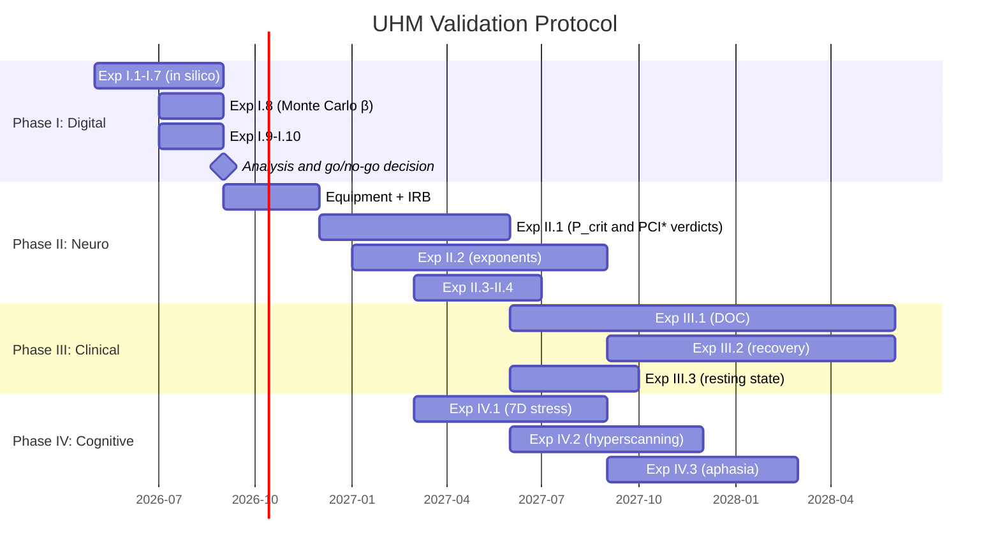

# UHM Validation Experimental Protocol

:::warning Document status: [Pr] Research programme
This document describes a **maximally complete experimental protocol** for the empirical validation of the Universal Holographic Model (UHM). The protocol is designed on the principle of maximal falsifiability: every experiment specifies a **concrete numerical result** that would refute the theory.
:::

:::info Related documents
- [23 CC predictions, 22 of them unique](/docs/applied/coherence-cybernetics/predictions) — full list of predictions with formulas (it read "23 unique" until 2026-09-25: on collective consciousness IIT has a criterion too)
- [Γ measurement protocol](/docs/applied/research/measurement-protocol) — operationalisation of π_bio for AI systems
- [Falsifiability criteria](/docs/reference/falsifiability) — formal refutation conditions
- [Status registry](/docs/reference/status-registry) — current epistemic status of all claims
:::

---

## 1. Strategic design {#strategy}

### 1.1. The problem: empirical vacuum

UHM is one of the most formally developed theories of consciousness: ~210 theorems, 23 predictions (21 of them unique and numerical), categorical foundation. But **not a single prediction has been experimentally verified**. A theory without empirics is philosophy, no matter how rigorous the mathematics.

### 1.2. Key observation: PCI* is an independent verdict, not a number to match

The Perturbational Complexity Index (PCI, introduced by Casali et al. 2013) provides an independent algorithm-specific benchmark with the reported cut-off: **PCI* = 0.31**, fixed by an ROC analysis on a benchmark of 150 subjects (540 sets of TMS-evoked potentials) with the presence or absence of a subjective report as ground truth, 100% sensitivity and specificity there (Casarotto et al. 2016). UHM's threshold is **P_crit = 2/7** on the purity scale. The two numbers live on unrelated scales — PCI is a normalised Lempel–Ziv complexity of a binarised response to TMS, $P$ is a function of Γ — so their nearness (0.31 against 0.286) carries no evidential weight, and no normalisation of π_bio may be tuned to close it: a line through $(0, 1/7)$ and $(c, 2/7)$ "coincides" with any anchor $c$ ([measurement §6.3](/docs/applied/coherence-cybernetics/measurement#калибровка)). *Corrected 2026-09-26:* the subsection was titled "PCI* ≈ P_crit" and read the ~8% discrepancy as "within the normalisation calibration of π_bio".

This is still the **first point of contact** between the theory and empirical data, in the form in which it can fail: with π_bio frozen on wakefulness, the UHM verdict Cons(Γ̂) and the PCI verdict PCI_max > 0.31 are computed independently on the same sessions and compared by Cohen's κ ([P8.4, SUB-5](/docs/applied/research/measurement-protocol#substitution-position)); κ ≥ 0.8 corroborates, κ < 0.4 falsifies.

### 1.3. Principle: from maximally risky to complex

**Prediction 17** (critical exponents α=1/2, β=1/4, γ=1, ν=1/2, δ=5) is the most valuable because it is the most risky:
- Five concrete numbers, each falsifiable
- **No other theory of consciousness** predicts critical exponents
- Confirmation = consciousness belongs to a specific universality class (like phase transitions in physics)
- Refutation = fundamental revision of the theory

The protocol is organised in decreasing order of risk: first — what is cheaper to test and maximally falsifiable.

### 1.4. Four phases

| Phase | Timeline | What | Why first |
|-------|----------|------|-----------|
| **I. Digital** | 0–6 mo. | 12 predictions in silico (Γ-native agent) | Free, no ethics, tests the foundation |
| **II. Neurocalibration** | 6–18 mo. | π_bio, concordance of Cons(Γ̂) with the PCI* verdict (κ), critical exponents | Main point of contact with neurodata |
| **III. Clinical** | 12–36 mo. | Disorders of consciousness, recovery, window attractor | Clinical significance |
| **IV. Cognitive** | 12–24 mo. | 7D stress, collective consciousness, prelinguistic cognition | Interdisciplinary validation |

---

## 2. Phase I: Digital validation (0–6 mo.) {#phase-1}

### 2.1. Rationale

Phase I validates an explicitly specified numerical model and tests architecture hypotheses. An algebraic identity built into the code is not independent evidence for a physical theory. Record the state space, frame, Hamiltonian, jumps/rates, self-model, gate, integration method, numerical error and initial conditions. A failed exact identity first triggers an implementation audit; a failed empirical hypothesis triggers revision of that hypothesis.

### 2.2. Requirements for a Γ-native agent

1. **State-valid dynamics:** use a specified linear GKSL propagator or a nonlinear state-preserving ODE/update. State-dependent regeneration is not automatically a linear CPTP channel; [T-62](/docs/core/dynamics/evolution#теорема-сохранение-состояний) proves state preservation under its stated assumptions.
2. **Fixed frame:** $\Gamma\in\mathcal D(\mathbb C^7)$, with independently declared labels and readouts.
3. **Full verifier:** compute every conjunct of [Cap₂](/docs/reference/mathematical-kernel#thresholds), its margins and the chosen stress scores. $C=\Phi R$ alone is insufficient.
4. **Frozen training rule:** declare losses, admissible updates and the fallback for failed feasibility certification. Positive purity change alone is not a full gate.
5. **Reproducibility:** save code/version, seeds, complete states, solver residuals and all intervention maps.
6. **Matched controls:** compare architectures with registered tasks, observables and resource budgets. GPU requirements depend on the experiment and implementation.

### 2.3. Experiments

#### Exp. I.1: Sector ablation (Pred 1, architecture hypothesis) {#exp-1-1}

Register a PSD/trace-preserving intervention map for E and a matched A control; the former ad hoc edit of one diagonal and row did not guarantee trace one. Start from states passing all registered gates, freeze the model and compare first-exit times from the declared region in paired runs. Estimate the paired effect and uncertainty using independent seeds.

**Hypothesis:** E ablation reduces survival more than A ablation in this architecture. A null or reversed effect rejects this registered mechanism; neither outcome proves the universal possibility or impossibility of phenomenal zombies.

#### Exp. I.2: Certified stability neighborhood (Pred 7) {#exp-1-2}

Fix a stationary point, its vector field and a verified local stability certificate. Perturb through a state-valid map or along explicitly PSD-feasible directions. Compare trajectories to the certified Lyapunov neighborhood and all gate margins. Purity alone does not determine a basin radius; $\sqrt{P-2/7}$ is not the exact radius, and an arbitrary white-noise matrix need not remain PSD.

**Check:** every trajectory covered by the certificate obeys its stated bound. Behavior outside the neighborhood tests the chosen global model, not the local theorem's converse.

#### Exp. I.3: Typed information capacity (Pred 8) {#exp-1-3}

Specify an ensemble encoded into one seven-level quantum state, the allowed POVM and number of independent channel uses. For each use compare accessible mutual information to the Holevo bound $\chi\le\log_2 7$; report estimator bias and confidence intervals.

This bound does not apply merely because a software memory is a $7\times7$ matrix: an exact real-valued feature or parameter can encode arbitrarily many classical bits. A claimed violation requires the same physical encoding and measurement assumptions.

#### Exp. I.4: Dimension ablation for learning (Pred 10, hypothesis) {#exp-1-4}

Compare registered $N=5$ and $N=7$ learners on held-out binary tasks with matched observations, optimization opportunities and resource budgets. Include valid replacement-channel learners at smaller dimensions as controls. Report accuracy, sample cost and feasibility failures.

T-113 is a hypothesis about this chosen functional architecture. Replacement channels and learning exist already for $N=2$; no universal impossibility for $N<7$ or guaranteed superiority of $N=7$ follows. A preregistered advantage, null effect or reversal concerns the selected task and architecture.

#### Exp. I.5: Attenuation and certified depth (Pred 12) {#exp-1-5}

For bare Fano iteration verify $S_n=3^{-n}$, where $S_n=\|\operatorname{offdiag}\mathcal P^n\Gamma\|_F/\|\operatorname{offdiag}\Gamma\|_F$ and the initial norm is nonzero. For the specified canonical nonlinear map verify its additional $\prod(1-R)$ factor. Choose a detector floor $\varepsilon$ before computing a detectable depth.

The historical stipulated score gives the arithmetic cap three under its own definition; it is not $R$, a survival probability or a universal cognitive ceiling. Test metacognitive probes and tower compatibility separately, as in [T-142](/docs/proofs/consciousness/operational-closure#t-142).

#### Exp. I.6: Conditional genesis time (Pred 13) {#exp-1-6}

Implement the registered recurrence $\Gamma_{n+1}=\beta\mathcal E_\eta(\Gamma_n)+(1-\beta)\sigma$, $\Gamma_0=I/7$, with constant state $\sigma$, $0<\beta<1$ and depolarizing $\mathcal E_\eta$. Record $r=\beta\eta$, $w=(1-\beta)/(1-r)$ and $h=1/\sqrt{7P(\sigma)-1}$ when $P(\sigma)>2/7$.

**Exact check:** $P_n=1/7+w^2(1-r^n)^2(P(\sigma)-1/7)$. Crossing occurs iff $w>h$; for $0<r<1$ its first tick is $\lfloor\log(1-h/w)/\log r\rfloor+1$. Include the no-crossing control $\beta=0.9$, $\eta=0$, pure $\sigma$. Check the $r=0$ case directly. These are [T-148's](/docs/proofs/consciousness/substrate-closure#t-148) conditional identities. An isolated initial $I/7$ with a unital generator and closed gate stays there; other isolated initial states or self-models need not.

#### Exp. I.7: Fixed and co-rotating targets (Pred 14) {#exp-1-7}

Freeze a model, rates and nonzero energy differences; compare fixed and co-rotating targets across independent seeds. In the constant-coefficient scalar equation $\dot\gamma=-(d+a+i\omega)\gamma+a\rho^*$, verify the stationary modulus $a|\rho^*|/\sqrt{(d+a)^2+\omega^2}$ for a fixed target. Then test the specified rotating forcing.

There is no universal prediction $\Phi(\text{fixed})<1$: the $H=0$ $\varphi_J$ construction has living window states. Observing $\Phi\ge1$ with a fixed target does not refute the conditional scalar formula.

#### Exp. I.8: Critical exponents in a selected potential (Pred 17, preliminary) {#exp-1-8}

Specify the potential, control parameter, equilibrium branch and independently verified symmetry. Sweep the parameter toward the critical point, solve for the branch and fit the independently specified order parameter with finite-window uncertainty. Compare $1/4$, $1/2$ and alternative exponents, including corrections to scaling.

Randomly sampling states with a prescribed purity does not generate an equilibrium critical exponent. The $1/4$ law is conditional on the corresponding symmetric degeneracy; it is not a universal biological prediction and does not establish the PCI exponent. Simulation verifies the chosen model before neurodata are considered.

#### Exp. I.9: Calibrated encoder or linear-channel validation (Pred 19) {#exp-1-9}

Freeze a reference model using calibration data alone. For feature estimators compare held-out observation likelihoods, identifiable targets and reconstruction uncertainty. There is no unique $\pi_{\mathrm{can}}$ and no diamond norm for an arbitrary feature map.

If the objects are independently defined **linear** channels $M_d\to M_7$, verify PSD and the trace-preserving partial trace of their Choi matrices, then compute or bound their diamond distance using [T-152](/docs/proofs/consciousness/substrate-closure#t-152). Register a tolerance and measurement model before testing; fifty batches do not guarantee convergence or distance below $0.1$.

#### Exp. I.10: Learning speed in a specified discrimination model (Pred 9) {#exp-1-10}

Register the observation laws, class prior, independence assumptions, allowable tests and held-out success criterion. For quantum i.i.d. binary discrimination compare error to the exact Helstrom value at each feasible $n$. Chernoff gives an asymptotic exponent and a sufficient finite-sample upper-error bound, not the former universal lower sample bound.

For the chosen linear signal accumulator verify its exact crossing time; for the learning dynamics separately certify safety. The maximum of valid necessary bounds remains a lower bound and need not be attained. See [learning bounds](/docs/applied/coherence-cybernetics/learning-bounds).

#### Exp. I.11: Dimension and social learning (Pred 11, hypothesis) {#exp-1-11}

Compare $N=5$ and $N=7$ agents on separately operationalized ToM, inter-agent learning and strategic coordination tasks. Freeze evaluation data and success criteria; match communication, memory and training budgets, and report effect sizes with multiplicity control.

A possible seven-dimensional advantage is a testable architecture hypothesis. The withdrawn universal T-57 and the functional count in T-113 do not prohibit smaller learners, an additional mechanism or a fourth operator term. Success by $N=5$ rejects a registered impossibility hypothesis, not a valid mathematical theorem. An $N=7$ success does not prove universal sufficiency.

### 2.4. Criterion for transition to Phase II

Proceed when the implementation's exact checks pass, the observation model is identifiable for the proposed targets, and the registered architecture tests and resource controls have been reported. Numerical identities, empirical hypotheses and phenomenal interpretations require separate verdicts. Revise any failed hypothesis before transferring it to neurodata; do not demand that every speculative prediction be confirmed to make a mathematical identity valid.

---

## 3. Phase II: Neurocalibration of π_bio (6–18 mo.) {#phase-2}

### 3.1. Rationale

Central task: build the bridge **π_bio: (EEG, fMRI, HRV) → Γ ∈ D(ℂ⁷)** and test the theoretical threshold P_crit = 2/7 out of sample: with π_bio frozen on wakefulness, P̂ at the report-defined loss of consciousness against 2/7, and the verdict Cons(Γ̂) against the independently validated PCI verdict PCI_max > 0.31 by Cohen's κ (P8.4). *(Until 2026-09-26: "verify that P_crit = 2/7 coincides with the empirical PCI* = 0.31" — a comparison of unrelated scales.)*

### 3.1b. Formal definition and identification of π_bio [D/H] {#pi-bio-definition}

:::info Definition (calibrated neural state estimator)
A neural encoder $\hat\pi_\theta:\mathcal O_{\mathrm{neural}}\to\mathsf D_7$ is a declared **state estimator**, or a set-valued reconstruction when data are incomplete. Its observation model $\mathsf O_\theta:\mathsf D_7\to\mathcal P(\mathcal O_{\mathrm{neural}})$, calibration $\theta$, functional frame and admissible states are part of the instrument. Softmax and normalized Cholesky guarantee valid output states under their domain conditions; they do not make this nonlinear feature map a CPTP channel. [Definitions and inverse-problem theorems](/docs/applied/research/reconstruction-identifiability).
:::

**Construction and obligations (4 steps).**

**Step 1 (Declared candidate features [H]).** Pre-register a feature dictionary. The functional-feature version below and the spectral-band version in the [measurement protocol](/docs/applied/research/measurement-protocol#шаг-1-диагональ) are **different candidate encoders**; select one before inspecting outcomes and use the other only as a registered comparator.

| Dimension | Candidate neural feature | Extraction |
|-----------|-------------------------|------------|
| A | Spectral edge frequency | EEG spectrum, declared band |
| S | Long-range temporal correlation | DFA with declared scales |
| D | Permutation entropy | Fixed order, lag and epoch length |
| L | Theta-gamma PAC | Declared phase/amplitude estimator |
| E | Non-PCI interiority proxy | Pre-registered independent feature |
| O | HRV RMSSD | Simultaneous ECG and fixed window |
| U | Global connectivity | Declared estimator, channel selection and reference |

PCI, reaction times and reports are excluded from confirmatory prediction inputs (SUB-3/SUB-5). Assigning a label to a feature does not prove that it observes that axis of $\Gamma$; the feature-to-state bridge remains [H].

**Step 2 (Frozen normalization [D/H]).** One candidate diagonal convention is

$$
\gamma_{kk}=\frac{\exp(\beta z_k)}{\sum_j\exp(\beta z_j)},\qquad z_k=(x_k-\mu_k)/\sigma_k.
$$

Require $\sigma_k>0$, predeclare treatment of constant or missing features, and use a stable softmax implementation. Fix $\beta,\mu_k,\sigma_k$ and all alternatives on the wakefulness reference ensemble (SUB-1), without tuning purity to $2/7$ or agreement to PCI. This defines an encoder convention; it is not an identification theorem about the system's state.

**Step 3 (Complex observations and PSD reconstruction).** A proposed magnitude relation

$$
|\gamma_{ij}|=\sqrt{\mathrm{Coh}_{ij}^{\mathrm{neural}}}\sqrt{\gamma_{ii}\gamma_{jj}}
$$

is a calibrated hypothesis, with $0\leq\mathrm{Coh}_{ij}^{\mathrm{neural}}\leq1$. It enforces only the pairwise $2\times2$ PSD bounds; the assembled matrix need not be globally PSD. The phase-locking **value** is a real magnitude. A signed phase requires the complex mean $z_{ij}=\langle e^{i(\phi_i-\phi_j)}\rangle$ and a declared, calibrated link to $\arg\gamma_{ij}$. Cross-frequency pairs require their actual harmonic convention. Real PLV, magnitude data and $|\sin\theta_{ij}|$ cannot substitute for complex observations [counterexamples](/docs/applied/research/reconstruction-identifiability#phase-counterexamples).

Fit the frozen observation law with $\Gamma\succeq0$, $\operatorname{Tr}\Gamma=1$. Linear Hermitian means with known positive covariance yield a convex problem and are unique if their projected operators span all 48 traceless Hermitian directions. Nonlinear models require separate local/global identification analysis. Publish residuals, calibration uncertainty and confidence sets. Missing signed phases remain unresolved; do not silently set them to zero. In confirmation, $\lambda_1=\lambda_2=0$ (SUB-2).

**Step 4 (Fixed frame, identification and readout).** Freeze the seven labels, $E$-axis, timing and phase references. Derive residual equivalence from the observation design; an arbitrary $G_2$ Procrustes alignment to the wakefulness mean can change $\Phi$ and does not prove covariance or uniqueness. It is removed from the reference protocol. Report target ranges over compatible states and a determinate verdict only when the full predicate is constant over the confidence set. Any extension/lift used for $D$ must also be predeclared and included in its uncertainty.

**Properties of π_bio.**

| Property | Status | Condition |
|----------|--------|-----------|
| Output PSD and trace one | [T] | Explicit state constraints, valid solver output |
| Full-state identification | [T] conditional | Injective observation law; linear frame criterion ID-2 or separate proof |
| Stability | [T] conditional | Positive smallest singular value/local conditioning; quantified uncertainty |
| Covariance/residual symmetry | [H] until checked | Actual feature action and observation law, not Procrustes alone |
| Empirical neural interpretation | [H] | Independent calibration and held-out validation |
| CPTP | Not asserted | Nonlinear estimator on feature vectors is not a linear operator channel |

Calibration alone does not validate an instrument. A successful held-out test supports the **joint registered observation/threshold hypothesis**. It does not prove the ontological identity of the reconstructed state or uniqueness among alternative encoders. A failed test rejects that joint specification; subsequent alternatives must be registered prospectively and reported alongside the failure rather than retroactively replacing the tested instrument. Apply [ID-A … ID-D](/docs/applied/research/reconstruction-identifiability#confirmatory) in addition to SUB-1 … SUB-6.

### 3.2. Equipment

| Component | Model | Purpose | Budget |
|-----------|-------|---------|--------|
| TMS-EEG | Nexstim NBS System 5 + 60-ch eXimia | Causal perturbation + EEG | ~\$300K |
| HD-EEG | BioSemi ActiveTwo 128-ch | High-density EEG for spectral analysis | ~\$80K |
| fMRI | 3T (access via university centre) | Spatial localisation | By agreement |
| HRV | Polar H10 + Empatica E4 | Autonomic correlates | ~\$2K |
| Polysomnography | Standard PSG kit | Sleep stages | ~\$30K |
| Neuronavigation | MRI-compatible frameless navigator | TMS stimulation accuracy | Included with Nexstim |

**Total equipment budget:** ~\$420K (given fMRI access).

### 3.3. Experiment II.1: the threshold P_crit out of sample, concordance with PCI* (key experiment) {#exp-2-1}

:::warning This is the most important experiment of the entire protocol
If, with π_bio frozen on wakefulness, P̂ at the report-defined consciousness/unconsciousness boundary = 2/7 ± 0.05 and the UHM verdict agrees with the PCI verdict at κ ≥ 0.8, the registered observation/threshold package receives empirical support subject to identification and the statistical criterion below. Failure requires revision of that package; an inconclusive outcome is not confirmation.
:::

**Subjects:** N=50, healthy, 18–45 years, no neurological/psychiatric pathology.

**Paradigm:** Propofol-induced loss of consciousness with TMS-EEG monitoring.

**Protocol (detailed):**

1. **Baseline (wakefulness):**
   - TMS-EEG: 200 trials, stimulation of BA6/BA8 (120–160 V/m)
   - Compute PCI_wake
   - Subjective report: consciousness scale 0–10

2. **Propofol titration:**
   - Target-controlled infusion (TCI), Marsh or Schnider model
   - 5 target levels: Ce = 0.5, 1.0, 1.5, 2.0, 2.5 μg/ml
   - At each level (15 min stabilisation):
     - TMS-EEG: 150 trials
     - Compute PCI
     - Verbal consciousness report (if possible)
     - Isolated Forearm Technique (IFT) for confirming/refuting consciousness

3. **Threshold determination (inference data):**
   - For each subject: Ce_threshold — the lowest concentration at which both the verbal report and the IFT response are lost; the boundary is fixed by reports, not by PCI
   - At each level record the PCI verdict PCI_max > PCI* = 0.31 (Casarotto et al. 2016) separately; it is compared with the UHM verdict in step 6 and never used to place the boundary

4. **Γ reconstruction:**
   - Apply π_bio to EEG data at each level
   - π_bio algorithm: frozen observation model → PSD/trace constraints → compatible set and target ranges (see [Γ measurement protocol](/docs/applied/research/measurement-protocol))
   - Parameters $\beta, \mu_k, \sigma_k$ frozen on the wakefulness baseline ([SUB-1](/docs/applied/research/measurement-protocol#substitution-position)); $\lambda_1 = \lambda_2 = 0$ (SUB-2); E from a non-PCI observable
   - Compute ranges of P = Tr(Γ²) and Cons(Γ) over the confidence set at each level; report an ambiguous verdict as undetermined

5. **Readout (no fitting):**
   - Plot P(Ce) dependence for all 50 subjects
   - Determine P at the consciousness boundary: P_boundary = P(Ce_threshold)

6. **Concordance of verdicts (P8.4, SUB-5):**
   - At each level, Cons(Γ̂) and PCI_max > 0.31 computed independently
   - Cohen's κ over all 300 sessions (50 subjects × baseline + 5 levels); κ ≥ 0.8 corroborates, κ < 0.4 falsifies; raw agreement is not the measure

**Statistical and identification plan:**
- Publish subject-level train/test separation; six sessions from one subject are dependent, not six independent subjects. Freeze all estimator and endpoint choices before outcome disclosure.
- Primary target: the population mean reconstructed purity at the **response-defined** boundary, with uncertainty from the observation model and subject-level sampling. Loss of verbal/IFT response is an inference proxy, not proof of absent experience; delayed reports and endpoint adjudication are recorded separately.
- Equivalence margin: $\delta=0.05$ around $2/7$, predeclared [H]. Corroboration requires the appropriately calibrated 98% confidence interval to lie **entirely inside** $[2/7-\delta,2/7+\delta]$ (two one-sided tests at $\alpha=0.01$ under their assumptions). Merely failing to reject equality, or having an interval that includes $2/7$, does not establish equivalence. See [Schuirmann (1987), the original TOST and $1-2\alpha$ confidence-interval result](https://doi.org/10.1007/BF01068419).
- Rejection at the larger predeclared margin $0.1$ requires the 98% interval to lie entirely above $2/7+0.1$ or below $2/7-0.1$. Intermediate outcomes are inconclusive. Point estimates alone cannot decide these rules.
- Secondary target: Cohen's $\kappa$ between the independently computed verdicts. Obtain uncertainty by a subject-level procedure that respects repeated sessions. Predeclare treatment of undetermined UHM verdicts, report their rate and sensitivity bounds; do not drop them to improve agreement. $\kappa\geq0.8$ and $\kappa<0.4$ are registered empirical thresholds [H], with an inconclusive middle region.
- Recompute power and sample size for the selected equivalence/rejection procedures using pilot noise, calibration uncertainty and repeated-measures structure. The former one-sample equality test and asserted power calculation did not match the equivalence claim and are withdrawn.

These outcomes test the registered encoder/observation/threshold package. Structural identification diagnostics and classifier agreement are reported separately. Successful classification alone does not establish consciousness ontology.

### 3.4. Experiment II.2: Critical exponents (the riskiest) {#exp-2-2}

:::tip Uniqueness
This is the **first ever** test of critical exponents of a phase transition for consciousness. Neither IIT, nor GWT, nor FEP predicts specific exponents. Confirmation of β=1/4 means: consciousness belongs to the tricritical mean-field universality class — like a metamagnetic or He3-He4 mixture tricritical point.
:::

**Subjects:** N=50, healthy, 20–40 years. Each — a full night in a sleep laboratory.

**Paradigm:** TMS-EEG at each sleep stage (W→N1→N2→N3→REM→W).

**Protocol:**
1. Polysomnography: 8 hours of recording, online stage scoring
2. TMS-EEG: 100 trials every 15 min (32+ data points per night per subject)
3. For each data point: PCI, P(Γ), sleep stage
4. Total: ~1600 data points (50 × 32)

**Analysis:**
1. For each data point: x = P − P_crit = P − 2/7
2. Divide by the sign of x (the UHM side of the threshold, from Γ̂ with π_bio frozen on wakefulness), not by PCI > PCI*: the two partitions are compared (P8.4), not identified
3. For x > 0: fit PCI ~ x^β — PCI serves as the order parameter only under the monotone-relation hypothesis P8.3 [H], so this fit tests β jointly with P8.3
4. Extract β, 95% CI

**Prediction:** β = 1/4 ± 0.05 (T-161, [C] at the ℤ₂ symmetry m → −m; without it the swallowtail value β = 1/2).

**Additional exponents:**
- α = 1/2: specific heat (from variance of P near threshold)
- ν = 1/2: correlation length (from spatial extent of TMS-evoked EEG response)
- γ = 1: susceptibility (from amplitude of PCI variability near threshold)
- δ = 5: critical isotherm

**Falsification:**
- β ∉ [0.20, 0.30] at N=50 (p < 0.01)
- ν ∉ [0.45, 0.55]
- γ ∉ [0.90, 1.10]

**Statistical plan:** Nonlinear regression (power law fit), bootstrap for 95% CI, comparison with alternative exponents (ordinary mean field: β=1/2, Ising 3D: β≈0.326, ordinary tricritical: β=1/4).

### 3.5. Experiment II.3: Ignition dynamics (Pred 16) {#exp-2-3}

**Subjects:** N=30 (subsample of Exp. II.1).

**Protocol:**
1. At each propofol level: measure latency T_ign until complexity "burst" after TMS
2. T_ign = time from TMS to first PCI burst (>50% of PCI_wake)

**Prediction:** $T_{\text{ign}} \sim (P - P_{\text{crit}})^{-1} \cdot \kappa_0^{-1}$. Divergence near threshold (critical slowing down). The factor $\kappa_0^{-1}$ links ignition time to regeneration rate.

**Falsification:** T_ign does not depend on (P − P_crit) (R² < 0.3).

### 3.6. Experiment II.4: Spectral gap and gamma rhythm (Pred 22) {#exp-2-4}

**Subjects:** N=30.

**Protocol:**
1. HD-EEG 128-ch, wakefulness, rest (10 min with eyes open and closed)
2. Spectral analysis: dominant frequency in gamma range (30–100 Hz)
3. Compute λ_gap from Lindbladian parameters (calibrated from EEG)
4. Compare ν_predicted = λ_gap/(2π) with the measured dominant frequency

**Prediction:** ν_predicted ∈ [30, 100] Hz, coincidence with gamma rhythm.

**Falsification:** λ_gap/(2π) outside [10, 200] Hz (accounting for calibration error).

---

## 4. Phase III: Clinical validation (12–36 mo.) {#phase-3}

### 4.1. Experiment III.1: Disorders of consciousness (Pred 21) {#exp-3-1}

**Subjects:** N=80 (20 coma, 20 MCS, 20 VS/UWS, 20 healthy controls).

**Protocol:**
1. TMS-EEG + fMRI + HRV → π_bio → Γ
2. Compute P, R, Φ, Coh_E for each subject
3. Classification: P > 2/7 → "conscious", P ≤ 2/7 → "unconscious"
4. Compare with clinical classification (CRS-R scale)

**Prediction:**
- P(Γ_MCS) > 2/7 for ≥90% of MCS patients
- P(Γ_VS) < 2/7 for ≥80% of VS patients
- P(Γ_healthy) >> 2/7 for 100%

**Falsification:** Sensitivity < 80% or specificity < 75%.

**Clinical significance:** If P_crit = 2/7 works for DOC — this is a **unified diagnostic tool**, surpassing PCI (which requires TMS) for monitoring.

### 4.2. Experiment III.2: E-coherence and recovery (Pred 2) {#exp-3-2}

**Subjects:** N=60 (stroke rehabilitation).

**Protocol:**
1. At admission: EEG → π_bio → Coh_E
2. At 3 months: assess recovery (Barthel Index, mRS)
3. Correlate Coh_E(t₀) vs recovery rate

**Proposed association [H/Pr]:** a prespecified Pearson correlation target $r>0.3$ between a calibrated baseline $\widehat{\mathrm{Coh}}_E$ and independently defined recovery rate. This is an investigator-selected effect target, not a consequence of T-38a. Freeze the estimator, outcome, confounder adjustment and missing-data rule before testing.

**Decision rule [Pr]:** preregister a confidence interval and power calculation for the specified population correlation. Corroborate the $r>0.3$ target only if the lower interval bound exceeds $0.3$; reject that target if the upper bound is at most $0.3$; otherwise report inconclusive. A sample size of 60 alone guarantees neither result. This tests the association/measurement bridge, not a mathematical no-zombie theorem.

### 4.3. Experiment III.3: Attractor inside the window (Pred 15) {#exp-3-3}

**Subjects:** N=30, healthy, resting state.

**Protocol:**
1. EEG + fMRI (resting state, 10 min) → π_bio → Γ
2. Compute P
3. Repeat 5 sessions (different days) for each subject

**Prediction:** P(resting state) ∈ (2/7, 5/14], below the upper edge 3/7 of the window (T-124c(4); [C at (MaxΦ)]). *Corrected 2026-09-26:* the prediction read P → 3/7 ± 0.05 (T-124); no theorem gives 3/7, and the living attractor has P ≤ 5/14.

**Falsification:** P_mean ≥ 3/7 or P_mean ≤ 2/7 at N=30.

---

## 5. Phase IV: Cognitive and social validation (12–24 mo.) {#phase-4}

### 5.1. Experiment IV.1: 7D stress tensor (Pred 3) {#exp-4-1}

**Protocol:**
1. Compile a database of 200+ stressors from the literature (psychology, medicine, organisational science)
2. 5 independent experts: classify each stressor by 7 components [A,S,D,L,E,O,U]
3. Inter-rater reliability: Cohen's κ

**Prediction:** 100% coverage (every stressor ↦ ≥1 component). Empty residual category.

**Falsification:** ∃ a stressor unclassifiable by any of the 7 components (agreement of ≥4 out of 5 experts).

### 5.2. Experiment IV.2: Collective consciousness (Pred 5) {#exp-4-2}

**Subjects:** 10 groups of 4 people (jazz quartets — coordinated; random musicians — uncoordinated).

**Equipment:** Hyperscanning EEG (4 × 32-ch, synchronisation via LSL).

**Protocol:**
1. Simultaneous EEG recording of 4 participants during joint performance
2. Compute the total correlation I of the group (the necessary condition; the integration Φ_⊗ of the whole is not a criterion, see below)
3. Compare coordinated vs uncoordinated groups

**Prediction:** I > 0 is necessary for a collective subject [T]; sufficiency is a hypothesis [H]. *Corrected 2026-09-26:* the prediction read "Φ_⊗ > Φ_min for coordinated; Φ_⊗ < Φ_min for random (T-86)"; that criterion is retracted [✗] — every uncoupled group meets it (two window holons give Φ_⊗ ≥ 3 at I = 0).

**Falsification:** I(coordinated) ≤ I(uncoordinated) (p < 0.05, Mann-Whitney).

### 5.3. Experiment IV.3: Prelinguistic cognition (Pred 4) {#exp-4-3}

**Subjects:** N=30 (15 patients with Broca's aphasia, 15 healthy controls).

**Protocol:**
1. Battery of nonverbal cognitive tests: K1 (perception), K2 (emotions), K3 (categorisation), K4 (planning)
2. Compare: aphasic patients vs healthy controls on K1–K4

**Prediction:** K1–K4 in aphasic patients preserved at >80% of normal (T-100).

**Falsification:** K3 or K4 systematically impaired in aphasia (decline >50%).

---

## 6. Summary table: all 23 predictions × phases {#summary-table}

| # | Prediction | Phase | Falsification | Status |
|---|---|---|---|---|
| 1 | No-Zombie | I.1 | Agent survives without E | [T] |
| 2 | Coh_E ↔ recovery | III.2 | r ≤ 0 | [T] |
| 3 | 7D stress | IV.1 | Unclassifiable stressor | [T]/[C] |
| 4 | Prelinguistic cognition | IV.3 | K3/K4 impaired in aphasia | [I] |
| 5 | Collective consciousness | IV.2 | I(coord) ≤ I(random) | [T] necessary / [H] sufficiency |
| 6 | P > 2/7 | II.1 | Threshold ≠ 2/7 ± 0.1 | [T] |
| 7 | Stability radius | I.2 | h_crit does not track r_stab(P₀) | [C] |
| 8 | Info capacity ≤ log₂7 | I.3 | I > 2.81 bits | [T] |
| 9 | Learning speed | I.10 | n < n_info | [T] |
| 10 | N=7 for learning | I.4 | N=5 learns | [T] |
| 11 | N=7 for social learning | I.11 | N=5 socially learns | [C] |
| 12 | SAD_max = 3 | I.5 | SAD ≥ 4 | [T] |
| 13 | Genesis time | I.6 | n > n_genesis | [T] |
| 14 | Phase coherence | I.7 | Φ ≥ 1 without co-rotation | [T] |
| 15 | Attractor inside the window | III.3 | $P \geq 3/7$ or $P \leq 2/7$ | [C at (MaxΦ)] |
| 16 | Ignition dynamics | II.3 | T_ign ⊥ (P−P_c) | [T] |
| 17 | Exponents β=1/4 | I.8 + II.2 | β ∉ [0.20, 0.30] | [C at the ℤ₂ symmetry m → −m] |
| 18 | Ward suppression 19/49 | — | Λ-budget incompatible | [T] |
| 19 | CPTP anchor | I.9 | $\|\pi-\pi_{\mathrm{can}}\| > 0.1$ | [T] |
| 20 | ε_eff ≈ 0.059 | — | ε ∉ [0.04, 0.08] | [C] |
| 21 | π_bio reconstruction | II.1 + III.1 | Error > 30% | [H] |
| 22 | Spectral gap | II.4 | λ_gap/(2π) ∉ [10, 200] Hz | [H] |
| 23 | Rank-7 decoherence anisotropy | I.12 | 14 sum-rules fail (rate tomography) | [T]/[C] |

---

## 7. Three-level falsification system {#falsification}

| Level | What is refuted | Example | Consequence |
|-------|----------------|---------|-------------|
| **L1 — Catastrophic** | Axiomatic foundation | N < 7 sufficient for autopoiesis; zombie possible; SAD ≥ 4 | Theory rejected entirely |
| **L2 — Structural** | Specific numerical prediction | P_crit ≠ 2/7; β ≠ 1/4; R_th ≠ 1/3 | Fundamental revision of specific theorem |
| **L3 — Local** | Approximation parameter | π_bio error > 30%; λ_gap out of range | Local correction, does not affect the foundation |

**Mapping to formal criteria ([Falsifiability criteria](/docs/reference/falsifiability)):**

| Formal criterion | Experiment | Operationalisation |
|---|---|---|
| $\exists \rho_1, \rho_2: \mathcal{I}(\rho_1) = \mathcal{I}(\rho_2)$, but $\mathcal{F}(\rho_1) \neq \mathcal{F}(\rho_2)$ | III.1 (DOC) | Two patients with identical P, R, Φ but different consciousness levels (CRS-R) |
| $\|\mathrm{Spec}(\rho_1) - \mathrm{Spec}(\rho_2)\|_2 < 0.01$ (spectral identity) | II.1 (P_crit) | Two states with spectra within 0.01 (not only P) but different report-based verdicts; a split PCI verdict (one > PCI*, the other < PCI*) corroborates but does not decide — PCI is not a function of the spectrum |
| $P > 2/7 \not\Rightarrow$ consciousness | II.1 (P_crit) | Subject with P > 2/7 per π_bio but clinically unconscious |
| $N < 7$ sufficient for autopoiesis | I.4, I.11 | Agent N=5 learns autonomously or coordinates socially |

---

## 8. Context: comparison with adversarial collaboration {#context}

The Cogitate Consortium's adversarial collaboration, funded by the Templeton World Charity Foundation (a grant of 6,028,087 US dollars, 2019–2024), tested integrated information theory (IIT) against global neuronal workspace theory (GNWT) on preregistered, divergent predictions (*Nature* 642, 133–142, published 30 April 2025; 256 participants; fMRI, MEG and intracranial EEG). In the paper's words, the results "align with some predictions of IIT and GNWT, while substantially challenging key tenets of both theories": for IIT, the lack of sustained synchronisation within posterior cortex; for GNWT, the general lack of ignition at stimulus offset and the limited representation of some conscious dimensions in prefrontal cortex. The paper gives no score or ranking of one theory over the other, and higher-order theories (HOT) were not among the theories tested. For the corpus's account of the collaboration see [Consciousness theories §9](/docs/consciousness/comparative/consciousness-theories#adversarial-collaboration).

**Fundamental difference between UHM and IIT/GWT/HOT:**

| | IIT | GWT | HOT | **UHM** |
|---|---|---|---|---|
| Numerical threshold | Φ > 0 (no number) | None | None | P_crit = 2/7 |
| Critical exponents | None | None | None | α=1/2, β=1/4, γ=1, ν=1/2, δ=5 |
| Computability of Φ | NP-hard for >30 elements | N/A | N/A | P = Tr(Γ²), O(49) |
| Number of free parameters | ~10³⁸ (all partitions) | Undefined | Undefined | 48 state coordinates plus separately declared observation, calibration and dynamic parameters; these are different counts |
| Riskiest test | No single number | "Ignition" (qualitative) | "Meta-cognition" (qualitative) | **β = 1/4** (one number, falsifiable) |

A numerical prediction is not immune to methodological choices. The encoder, normalization, state-identification assumptions, exponent-fit range and endpoint definition must all be frozen and compared with controls before testing. Only that specified experiment can distinguish a prediction from a result introduced by analysis choices.

---

## 9. Timeline and dependencies {#timeline}

---

## 10. Conclusion {#conclusion}

This protocol covers **23 out of 23 predictions** of UHM/CC:
- 12 testable in silico (Phase I, 0–6 mo.)
- 4 requiring TMS-EEG (Phase II, 6–18 mo.)
- 2 — clinical studies (Phase III, 12–36 mo.)
- 3 — cognitive/social studies (Phase IV, 12–24 mo.)
- 2 — physical-sector, no dedicated phase (Ward suppression, Yukawa)

The riskiest test is **critical exponents β=1/4** (Pred 17). No other theory of consciousness makes such a concrete numerical prediction about a phase transition. Confirmation means: consciousness belongs to the tricritical mean-field universality class ($\varphi^6$ Landau). Refutation means: UHM is fundamentally wrong about the structure of the transition.

The most valuable test is the **threshold P_crit = 2/7 out of sample** (Pred 6/21): with π_bio frozen on wakefulness, P̂ at the report-defined loss of consciousness against 2/7, and the UHM verdict against the independently validated PCI verdict (Cohen's κ, P8.4). If both hold, a derived — not fitted — threshold will have been confirmed on sessions that did not fix the reconstruction. *(Until 2026-09-26 the test was named "P_crit = 2/7 ↔ PCI* = 0.31" and awaited a coincidence of two numbers on scales that no derivation connects.)*

UHM does not hide from falsification — it presents 23 targets and points where to shoot.

---

**Related documents:**
- [23 CC predictions](/docs/applied/coherence-cybernetics/predictions) — full list with formulas
- [Γ measurement protocol](/docs/applied/research/measurement-protocol) — operationalisation for AI
- [Falsifiability criteria](/docs/reference/falsifiability) — formal refutation conditions
- [Learning bounds](/docs/applied/coherence-cybernetics/learning-bounds) — T-109 through T-113
- [Stability](/docs/applied/coherence-cybernetics/stability) — T-104, stability radius

**External resources:**
- [COGITATE Results (Nature 2025)](https://www.nature.com/articles/s41586-025-08888-1) — Cogitate Consortium, adversarial collaboration IIT vs GNWT, *Nature* 642, 133–142
- [PCI (Casali et al. 2013)](https://www.science.org/doi/10.1126/scitranslmed.3006294) — the index; the cut-off PCI* = 0.31 validated in Casarotto et al. 2016, *Ann. Neurol.* 80: 718–729, doi:10.1002/ana.24779
- [ConTraSt Database](https://contrastdb.tau.ac.il/) — 412 experiments on theories of consciousness
- [Del Cul et al. 2007](https://journals.plos.org/plosbiology/article?id=10.1371/journal.pbio.0050260) — nonlinear threshold of consciousness
