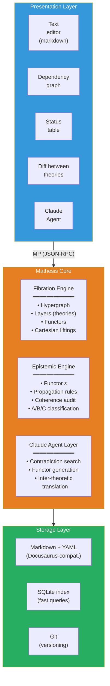
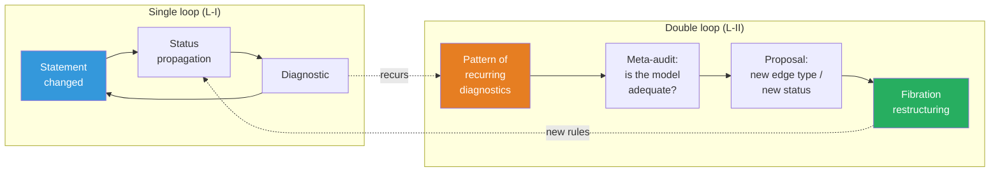

# Mathesis: ∞-topos of formal theories

:::info Who this document is for
For researchers working with complex theoretical constructions — physicists, neurobiologists, philosophers of consciousness, AGI specialists. The document describes the **Mathesis** project — a computational realization of the ∞-topos of formal theories, which makes working with theories (navigation, comparison, coherence verification, and inter-theoretic translation) machine-supported. The mathematical foundation is the ∞-topos of sheaves on the site of theories $\mathfrak{M} = \mathrm{Sh}_\infty(\mathbf{Th}, J_{\text{ep}})$; the substantive basis is the CC formalism; the software architecture is the Mathesis Core with an LLM agent.
:::

---

## 0. From "environment" to mathematical object {#introduction}

This document describes the project formerly known as *Theory IDE*. The renaming is not cosmetic. It reflects a **fundamental conceptual shift**: from a software tool that uses category theory to a **mathematical object** that has a computational realization.

### Mathesis Universalis

In 1666, Gottfried Leibniz in *Dissertatio de arte combinatoria* put forward the project of **Mathesis Universalis** — a universal science of formal reasoning. The project consisted of two parts:

- **Characteristica universalis** — a universal formal language capable of expressing any knowledge
- **Calculus ratiocinator** — a mechanical calculator operating within this language

Three and a half centuries later, both components receive a precise mathematical realization:

| Leibniz (1666) | Mathesis (2026) |
|---|---|
| Characteristica universalis | $\mathfrak{M} = \mathrm{Sh}_\infty(\mathbf{Th},\; J_{\text{ep}})$ — ∞-topos of sheaves on the site of theories |
| Calculus ratiocinator | LLM agent operating within the internal logic of $\mathfrak{M}$ |

Leibniz could not realize his project: he lacked (1) category theory (Eilenberg–Mac Lane, 1945), (2) ∞-categories (Joyal, Lurie, 2009), (3) computational language models (LLM, 2020s). UHM does not "confirm" Leibniz — it **provides the formalism** that he lacked.

### Key thesis

**Mathesis is not a program that uses mathematics. Mathesis IS a mathematical object — an ∞-topos — that has a computational approximation.**

The software code (Verum) is a finite approximation of the infinite object $\mathfrak{M}$, just as a numerical solution of a differential equation approximates continuous dynamics. The approximation can improve; $\mathfrak{M}$ remains unchanged.

### Document structure

The document follows a single logical chain:

1. **Problem** (§1): cognitive limit — no human can hold 325+ theories simultaneously
2. **Justification** (§1½): why ∞-categories are the only adequate apparatus (T-182, cohesive modalities)
3. **Foundation** (§2): construction of the ∞-topos $\mathfrak{M}$ — site of theories, Yoneda embedding, Kan extensions, descent condition, subobject classifier
4. **Generalizations** (§3): three directions beyond the 1-categorical approximation — HoTT, quantum logic, autopoiesis
5. **Realization** (§4–§6): architecture, engines, agent — how $\mathfrak{M}$ is computationally approximated
6. **Deep principles** (§7–§10): self-reference, process ontology, reflexive cycles — what makes Mathesis alive rather than static
7. **Consequences** (§11–§12): cognitive extension and usage examples
8. **Path to realization** (§13–§15): roadmap, comparison, Verum as the language of ultimate power

Each level builds on the previous and is irreducible to it — in exact correspondence with theorem T-182 ($\mathcal{T}_0 \subsetneq \mathcal{T}_1 \subsetneq \mathcal{T}_2$).

---

## 1. The problem: cognitive limit {#problem}

### 1.1. The scale of modern theory

A mature scientific theory is an object that exceeds the cognitive capacity of a single agent. For example: the CC (Coherence Cybernetics, the applied layer of UHM) documentation comprises ~400 pages, ~210 theorems with 7 epistemic statuses, 23+ falsifiable predictions, 30+ comparisons with competing theories, ~270 cross-references. Integrated Information Theory (IIT 4.0) is a comparable volume with its own formalism ($\Phi$, Q-shape, postulates). Anokhin's Cognitome is a qualitative theory with an 80-year experimental background. And there are [more than 325](https://www.consciousnessatlas.com/) such theories of consciousness (per the Consciousness Atlas catalog).

No single person can hold simultaneously in working memory:
- the internal structure of even one theory (which statements depend on which)
- the epistemic status of each statement (proven / conditional / hypothesis / refuted)
- correspondences between theories (what does Tononi's $\Phi$ mean in UHM terms? how does Friston's FEP connect with autopoiesis? where does Anokhin's cognitome contradict Baars's GWT?)
- consequences of changes (if axiom X is refuted, which theorems fall?)

### 1.2. Specific incidents

**The ρ* paradox (session 25 of working with UHM).** Discovered: self-reference in the regeneration operator ℛ — the target state ρ* was defined as a dynamical fixed point, which caused ℛ to vanish. Fix: redefinition ρ* = φ(Γ) (categorical self-model). Consequences: required updating ~25 files, changing the status of theorem T-68 from [T] to [C], replacing "primitivity of ℒ_Ω" with "primitivity of ℒ₀" in all occurrences. Time: an entire work session on **mechanical propagation** — work that a machine can perform in seconds.

**Broken anchors (translation session).** When translating documentation into English, headings were translated, but ~50 internal links continued pointing to Russian anchors. Detection: only at site build. Fix: manual search in ~20 files. This is a task for automatic coherence checking.

**Status misalignment (audit 2026-03-23).** A deep audit discovered 9 critical and 14 serious problems: theorems with status [T] depending on hypotheses [H]; statements contradicting each other; outdated references. Fix: 85 point edits in 42 files over 8 sessions. Each of these problems is automatically detectable.

### 1.3. Current tools and their limits

| Tool | What it does | What it doesn't do |
|------|-------------|-------------------|
| **Docusaurus** | Renders markdown to a site, checks links | Does not know about logical dependencies between statements |
| **grep / ripgrep** | Finds text | Does not know about types of relationships (dependency ≠ mention) |
| **Git** | Versions files | Does not know about theorem statuses |
| **Obsidian** | Note graph with links | Untyped links, no coherence, no inter-theoretic bridges |
| **RAG + LLM** | Finds relevant text, generates answers | Operates on text, not structure; does not verify logic |
| **Claude Code** | Code development, codebase navigation | Does not know about the theoretical structure of file contents |

None of these tools understands that a file contains a **theorem**, that the theorem **depends** on an axiom, that the axiom has a **status**, and that changing the axiom's status **must propagate** to all dependent theorems.

:::warning Categorical diagnosis: why flat tools are fundamentally insufficient
The listed tools are **0-categorical**: they operate on sets (of files, lines, commits) without typed morphisms. But scientific knowledge has an **∞-categorical** structure:
- **Objects** (statements) are connected by **morphisms** (dependencies) — level 1
- Morphisms are connected by **2-morphisms** (comparison of translations: "is the IIT→UHM translation compatible with the IIT→GWT→UHM translation?") — level 2
- 2-morphisms are connected by **3-morphisms** (meta-audit: "are our comparison rules adequate?") — level 3
- ...and so on for each reflexive cycle (§10)

A tool operating at level $n$ **cannot detect** problems at level $n+1$ (analogous to T-182: $\mathcal{T}_0 \subsetneq \mathcal{T}_1 \subsetneq \mathcal{T}_2$). What is needed is a tool containing **all levels** — ∞-categorical by construction.
:::

---

## 1½. Meta-epistemological grounding {#meta-epistemology}

:::info Why this section is needed
§1 described the **problem** (cognitive limit). §2 will propose the **solution** (∞-topos of theories). This intermediate section answers a meta-level question: **why exactly this solution** — and why alternatives are fundamentally insufficient.
:::

### 1½.1. Three levels of Ω as three levels of Mathesis

Theorem T-182 [T] establishes that three levels of the subobject classifier are strictly necessary: $\mathcal{T}_0 \subsetneq \mathcal{T}_1 \subsetneq \mathcal{T}_2$. This structure **projects** onto the architecture of Mathesis:

| Level of $\Omega$ | Level of Mathesis | What it formalizes |
|-------------------|-------|-----------------|
| $\mathrm{Dec}(\Omega) \cong 2^7$ (Boolean) | **Fibration Engine**: typed hypergraph, statement and dependency types | Static structure: "what statements exist and how they are connected" |
| $\tau_{\leq 0}(\Omega)$ (Heyting) | **Epistemic Engine**: threshold predicates, status propagation, coherence audit | Thresholds and logic: "which statements are reliable and where are the boundaries" |
| Full $\Omega$ (∞-groupoid) | **Reflexive cycles**: $T_{\text{meta}}$, double loop, meta-audit | Dynamics: "how the system observes and restructures itself" |

### 1½.2. Cohesive modalities as Mathesis operations

Theorem T-185 assigns 7 canonical modalities to the differentially cohesive ∞-topos — stratified: the modalities of any differentially cohesive ∞-topos are [T] (Schreiber, DCCT v1), the cohesion of the UHM topos is assumed [C], and the count of seven is a reading [I] (an earlier wording, "T-185 [T] establishes", is retracted). Six of them map to fundamental operations:

| Modality | Definition | Mathesis operation |
|----------|------------|-------------------|
| $\Pi$ (Shape) | Extracts distinguishable components | `theory/audit` — detection of differences and inconsistencies |
| $\flat$ (Flat) | Extracts discrete invariants | `claim/dependencies` — skeleton of dependencies (without dynamics) |
| $\Im$ (Infinitesimal shape) | Captures infinitesimal change | `claim/set_status` + propagation — reaction to local change |
| $\sharp$ (Sharp) | Computes logical closure | `fibration/coherence` — transitive check of the entire fibration |
| $\&$ (Infinitesimal flat) | Internalizes infinitesimal structure | `meta/audit` — observation of own structure |
| $\mathrm{Rh}$ (de Rham) | Integrates local into global | `claim/translate` — Cartesian lifting, inter-theoretic synthesis |

This is **not a post hoc fit**, but a consequence of the structure of the cohesive ∞-topos: if Mathesis operates on sheaves on the site of theories, then its fundamental operations **necessarily** decompose into cohesive and infinitesimal modalities (Schreiber 2013).

### 1½.3. Fundamental justification: why ∞-categories are the only adequate apparatus

Working with knowledge about knowledge is an operation on the **category of categories** $\mathbf{Cat}$. Working with knowledge about knowledge about knowledge is on the **∞-category of ∞-categories** $\mathbf{Cat}_\infty$. This is not a metaphor, but a precise statement:

| Operation | Mathematical object | Level |
|-----------|-------------------|-------|
| Formulate statements within a theory | Objects and morphisms in a category $\mathcal{C}$ | Object |
| Compare theories | Functors $F: \mathcal{C} \to \mathcal{D}$ | Meta |
| Verify coherence of comparisons | Natural transformations $\alpha: F \Rightarrow G$ | Meta² |
| Reconfigure the verification system itself | Modifications $\Theta: \alpha \Rrightarrow \beta$ (3-morphisms) | Meta³ |
| ... | ... (∞-morphisms) | Meta^n |

**Categorical modelling [D/Pr].** One can model suitable theories and translations in $\mathbf{Cat}_\infty$ after fixing a universe. This does not force every knowledge system to be a topos or prove higher coherences exist for arbitrarily declared comparison data. Graph/relational storage can encode chosen categorical structures; guarantees come from the actual model and verification, not the storage label.

Alternatives:
- **Graph databases** (Neo4j) — 1-category, no 2-morphisms
- **Relational databases** — not even a category (no composition)
- **Obsidian / Roam** — untyped graph
- **RAG + LLM** — operates on text, not structure

---

## 2. Mathematical foundation: ∞-topos of theories {#foundation}

### 2.1. From fibration to ∞-topos: overcoming the structural gap {#structural-gap}

The preceding architecture built its foundation on a **Grothendieck fibration** $p: \mathbf{E} \to \mathbf{B}$. This is correct but insufficient. A fibration is a 1-categorical construction. It formalizes objects (statements) and morphisms (dependencies, translations). But it does not formalize:

- **2-morphisms**: comparisons of two translations between the same pair of theories
- **3-morphisms**: meta-audit of comparisons
- **$n$-morphisms** for arbitrary $n$: reflexive cycles (§10)

The hypergraph (SQLite) and typed edges are a **1-categorical emulation** of ∞-categorical structure. They work at levels 0 and 1, but lose native coherence starting from level 2. This is not technical debt — it is a **structural gap** between the claimed ∞-categorical ontology and 1-categorical realization.

**Solution:** start with the right object. A Grothendieck fibration is a **consequence** of the ∞-topos construction (straightening/unstraightening, HTT 3.2), not a foundation.

### 2.2. Site of theories $(\mathbf{Th},\; J_{\text{ep}})$ {#site-of-theories}

**Data [D].** Fix a universe and an essentially small category of declared theories, translations and status metadata. Choose the type of higher structure explicitly: an $(\infty,1)$-category has invertible higher morphisms; arbitrary noninvertible natural transformations require an $(\infty,2)$-model. A theory's claims and derivations are separate from paths in a mapping space.

For a chosen status poset, a functor $\varepsilon_T:\mathcal C_T\to\mathbf{Status}$ constrains its own arrows. A translation $f:\mathcal C_{T_1}\to\mathcal C_{T_2}$ is status-preserving only if that contract is separately supplied. The inequality $\varepsilon_{T_1}\le\varepsilon_{T_2}\circ f$, when chosen, is a natural transformation to the poset target; it forbids **lowering** status. This is a policy, not a consequence of every functor (M-5). Using a discrete status category would instead force equality along every arrow.

**Topology.** A Grothendieck topology is a collection of covering sieves satisfying maximality, pullback stability and transitivity. Start with explicitly specified generating sieves and take the smallest Grothendieck topology containing them, or prove that a proposed coverage is a basis for one. The generated topology may contain additional covers and may be too coarse for the intended application; check this separately. “Joint faithfulness” refers to detection of morphisms and is not the stated rule about distinguishing objects. That informal rule has not been proved to define a topology; the former M-1 argument is withdrawn **[✗]**.

The trivial topology is an available consistent baseline: its sheaves are presheaves, and it is subcanonical. A richer topology must have an independently specified epistemic meaning and checked descent conditions. Claims about an implemented Verum/SMT verifier here describe a proposed contract until the actual code and proof certificates are supplied. Finite checks prove only their encoded finite scope.

### 2.3. ∞-Topos of Mathesis {#infinity-topos}

For the declared small site, set $\mathfrak M=\operatorname{Sh}_\infty(\mathbf{Th},J_{\rm ep})$. This is an $\infty$-topos **[T at these hypotheses]**. A sheaf is a space-valued contravariant functor satisfying descent for every covering sieve. For a covering family with the required fibre products, descent can be expressed as the limit of its Čech diagram; pairwise agreement alone is not the full higher coherence condition.

The free cocompletion is the **presheaf** category $\mathcal P(\mathbf{Th})$. Sheaves form its accessible left-exact localisation, with sheafification $a:\mathcal P(\mathbf{Th})\to\mathfrak M$ left adjoint to the inclusion. Maps into local objects satisfy $\operatorname{Map}_{\mathfrak M}(aX,F)\simeq\operatorname{Map}_{\mathcal P}(X,F)$. This universal property is relative to the chosen topology; it does not make every coherent database a sheaf or prove Mathesis the only possible architecture. See [Lurie, HTT §§5.1.5, 6.2.2](https://www.math.ias.edu/~lurie/papers/HTT.pdf).

### 2.4. Yoneda embedding: loading a theory {#yoneda-embedding}

The always available embedding is $y:\mathbf{Th}\hookrightarrow\mathcal P(\mathbf{Th})$, $y(T)(S)=\operatorname{Map}_{\mathbf{Th}}(S,T)$. Yoneda gives

$$
\operatorname{Map}_{\mathcal P}(yT_1,yT_2)\simeq\operatorname{Map}_{\mathbf{Th}}(T_1,T_2).
$$

It factors through $\mathfrak M$ if every representable satisfies $J_{\rm ep}$-descent: precisely **subcanonicity**. Under that additional hypothesis the same mapping-space equivalence holds in sheaves. Otherwise $a\circ y$ lands in sheaves but need not be faithful. Representability of a channel's output is not supplied by Yoneda (revised T-213).

Finite restriction is a chosen approximation. It may miss objects, arrows and higher coherences; no-information-loss for the full Yoneda embedding does not imply no loss in this finite implementation. See revised M-3/M-4.

### 2.5. Kan extensions: inter-theoretic translation {#kan-extensions}

Given a specified functor $f:\mathcal A\to\mathcal B$ and a diagram $X:\mathcal A\to\mathcal E$, restriction is $f^*:\operatorname{Fun}(\mathcal B,\mathcal E)\to\operatorname{Fun}(\mathcal A,\mathcal E)$. If the required (co)limits exist,

$$
\operatorname{Lan}_f\dashv f^*\dashv\operatorname{Ran}_f,
$$

$$
(\operatorname{Lan}_fX)(b)\simeq\operatorname{colim}_{(f\downarrow b)}X(a),\qquad (\operatorname{Ran}_fX)(b)\simeq\lim_{(b\downarrow f)}X(a).
$$

For an $\infty$-categorical target use the corresponding homotopy (co)limits. A morphism of theory **objects** $T_1\to T_2$ does not by itself define these diagram categories. In a topos, a map $u:yT_1\to yT_2$ instead yields slice adjoints $\Sigma_u\dashv u^*\dashv\Pi_u$; these must not be silently identified with the above Kan extensions.

The universal property makes an extension initial/final among extensions with a declared boundary map. It gives no optimal semantic translation without a chosen model of semantics. For the left adjunction the counit is $\operatorname{Lan}_f f^*Y\to Y$; for the right adjunction the unit is $Y\to\operatorname{Ran}_f f^*Y$. Their failure to be equivalences is a typed test, not a universal numerical norm $\|\eta-\mathrm{id}\|$.

A finite set-valued diagram can have its colimit computed as a quotient of a disjoint union by generated identifications. Finite diagrams of spaces may have nontrivial higher homotopy; no universal $O(n^2)$ algorithm or seconds-scale complexity follows from the formula. Specify the encoding and algorithm before making a complexity claim. The IIT/UHM threshold example is a proposed semantic comparison **[I/H]**, not an evaluated Kan extension.

### 2.6. Descent condition: coherence as a sheaf property {#descent-condition}

Descent is a property to **verify** before calling a declared presheaf a sheaf. On a small site it is equivalence to the appropriate covering-sieve/Čech limit. For set-valued sheaves, compatible local sections glue uniquely; for space-valued sheaves, the space of gluing data is equivalent to the full coherent descent space. Pairwise consistency alone does not construct all higher coherences or supply an algorithm finding an exact obstruction. A sheafification can identify/alter data, so post-hoc audit still matters. The intended finite implementation must supply its actual descent certificates.

### 2.7. Subobject classifier: epistemic logic {#classifier}

An $\infty$-topos has a subobject classifier $\Omega$. For a declared object $X$, its subobjects form a Heyting algebra; excluded middle is not guaranteed in an arbitrary topos. A Boolean special case is possible.

Registry statuses and truth values have different types. The chain $[T]>[C]>[H]>[P]>[D]>[I]>[\text{✗}]$, if used, is an administrative order **[D]**; it is not automatically an embedding into $\Omega$ or its global sections. A postulate, a definition and an empirical hypothesis differ by provenance and assumptions, not simply by mathematical truth strength. Keep these metadata separate. To encode contextual propositions as subobjects one must specify the object, contexts, predicate and restriction/descent maps. Sheaf theory then constrains that encoding; it does not assign phenomenal or scientific truth by itself.

### 2.8. Connection with the UHM ∞-topos {#connection-with-uhm}

Theories of physical states and theories about theories can each use sheaf constructions after specifying their own sites, universes and meanings. This parallel is **[I/Pr]**, not a theorem that physics and epistemology have one unique topos. To treat a state theory as an object of $\mathbf{Th}$, supply the actual claims, translations and status data; to load it representably use $y$ into presheaves, and into sheaves only under M-3’s subcanonicity hypothesis. Straightening/unstraightening relates appropriately typed functors and fibrations; it does not identify every fibration with a sheaf topos. A hierarchy of software/meta representations is a design, not a proof of physical irreducibility or cognitive depth.

### 2.9. Formal theorem catalogue {#theorem-catalogue}

This section catalogues proposed constructions M-1–M-10. Their statuses depend on explicitly verified hypotheses; revised M-9/M-10 below separate the surviving identities from withdrawn cognitive/semantic conclusions.

:::note M-1 revised: topology generated by declared sieves [D/T]
On the chosen small category, specify generating covering sieves and let $J_{\rm ep}$ be the smallest Grothendieck topology containing them. Existence follows by intersection of all topologies containing them (the indiscrete topology is one). The maximality, stability and transitivity axioms then hold by construction. This does not prove that the original informal “joint-faithfulness” rule describes exactly its covers or that the topology is subcanonical.
:::

:::tip M-2 revised: existence of the sheaf $\infty$-topos [T at explicit hypotheses]
For the small site $(\mathbf{Th},J_{\rm ep})$, $\operatorname{Sh}_\infty(\mathbf{Th},J_{\rm ep})$ is an accessible left-exact localisation of the space-valued presheaf category, hence an $\infty$-topos. This is the standard site theorem, not a proof of the intended physical/epistemic semantics.
:::

:::tip M-3 revised: Yoneda and subcanonicity [T at explicit hypotheses]
For the declared small category, $y:\mathbf{Th}\hookrightarrow\mathcal P(\mathbf{Th})$ is fully faithful by the Yoneda lemma. It factors through sheaves exactly when the topology is subcanonical; then the mapping-space identity is unchanged because the sheaf inclusion is fully faithful. Without that extra hypothesis, $a\circ y$ need not be faithful. Being contained in the maximal sieve does not prove a sieve's descent condition.
:::

See [Lurie, HTT §§5.1.3, 6.2.2](https://www.math.ias.edu/~lurie/papers/HTT.pdf). “No information lost” applies to the full embedding under these conditions, not to arbitrary sheafification or a finite database restriction.

:::tip M-4 revised: pointwise left Kan extensions [T at explicit hypotheses]
Let $f:\mathcal A\to\mathcal B$ be a functor between declared small categories and $X:\mathcal A\to\mathcal E$, where the target admits the required colimits. Then

$$
(\operatorname{Lan}_fX)(b)\simeq\operatorname{colim}_{(a,f(a)\to b)\in(f\downarrow b)}X(a).
$$

The same formula uses homotopy colimits for the stated $\infty$-categorical version. In a sheaf target, compute in that target or apply the necessary sheafification; these types are separate from Bures density matrices.
:::

A finite approximation needs actual subdiagrams and comparison maps. If those subdiagrams exhaust the indexing diagram in the appropriate final/colimit sense, their **colimit** recovers the complete colimit. This is not a numerical inverse limit or monotone convergence in a universal “Bures order”.

The old universal $O(\delta(N))$ error rate and its T-213 constant $\omega_0^{-1}\log7$ are withdrawn **[✗]**. Chordal Bures distance has dimensionless maximum $\sqrt2$ on density matrices, but that supplies no metric on a category of theories or its Kan extensions. A fraction of uncovered claims alone bounds neither the approximation error nor coverage of missing arrows/higher coherences. A quantitative theorem requires a specified numerical realisation, norm, weighted error model and convergence hypotheses. Adding theories need not strictly improve coverage.

:::tip M-5 revised: functorial order within a theory [T], translation contract [D]
A functor $\varepsilon_T:\mathcal C_T\to\mathbf{Status}$ preserves the declared order along its own arrows. For a translation $f:\mathcal C_{T_1}\to\mathcal C_{T_2}$, the inequality $\varepsilon_{T_1}(a)\le\varepsilon_{T_2}(f(a))$ requires a separately supplied natural transformation $\varepsilon_{T_1}\Rightarrow\varepsilon_{T_2}\circ f$, or an equivalent pointwise contract. If only such pairs $(f,\alpha)$ are admitted, monotonicity holds **by definition**, not for every functor.
:::

**Counterexample to the former universal inference.** Two one-object categories admit the unique interpretation functor. A status functor constantly equal to [T] on the first and one constantly equal to [H] on the second are both valid functors, yet the claimed cross-theory inequality fails. No preservation-of-composition axiom repairs it. Evidence, assumptions and inference rules must travel with a translation.

:::note M-6 revised: chosen Hilbert model [D], conditional lattice/Born results [T]
One may encode seven status labels in a chosen $\mathcal H_{\rm ep}=\mathbb C^7$. This is neither forced by context dependence nor a universal minimal representation theorem. For that chosen Hilbert space, the lattice of closed subspaces is orthomodular and non-distributive. For example, with $a=\operatorname{span}(e_1)$, $b=\operatorname{span}(e_2)$, $c=\operatorname{span}(e_1+e_2)$, $c\wedge(a\vee b)=c$ but $(c\wedge a)\vee(c\wedge b)=0$.
:::

The full lattice $L(\mathbb C^7)$ has uncountably many subspaces. Only its coordinate subspaces in one fixed orthonormal basis form a **Boolean** lattice with $2^7=128$ elements (127 nonzero). Non-distributivity alone does not imply orthomodularity, and arbitrary orthomodular lattices do not automatically have the claimed Hilbert representation.

If a probability measure on **all** projections of a complex Hilbert space of dimension at least three is normalised and additive on orthogonal families, Gleason gives $\mu(P)=\operatorname{Tr}(\rho P)$ for a density matrix. These are measurement-model hypotheses, not facts inferred from seven epistemic labels. See [Gleason's original paper](https://pages.jh.edu/rrynasi1/Bananaworld/eprints/Gleason1957MeasuresOnTheClosedSubspacesOfAHilbertSpace.pdf).

Gleason specifies probabilities, not a unique state-update instrument. Lüders updating is a chosen instrument. For a degenerate projector $P$, $K=UP$, with $U$ unitary on its range, has $K^\dagger K=P$ and the same outcome probability, but can change the conditional state. The former forced quantum logic and unique Lüders inference are withdrawn **[✗]**. A quantum-like epistemic model is testable **[H/Pr]** against classical models with context and memory; order-dependent checks alone do not select it.

:::tip M-7 revised: a declared measurable candidate model [T at explicit hypotheses]
For a nonempty finite candidate set with finite scores, normalised softmax is a probability distribution. For a countable or otherwise infinite set, first supply a measurable space and a finite nonzero normalisation/integrability condition; an arbitrary cylinder-generated space need not be standard Borel. The Giry probability functor on measurable spaces has its usual Dirac unit and integration multiplication. Its monad laws follow from the corresponding measure-theoretic hypotheses.
:::

The chosen LLM sampling policy is [D/H], not optimal or semantically sound merely because it defines a probability measure. Candidate verification remains separate.

:::tip M-8 revised: topology change with verified site axioms [T at explicit hypotheses]
If $J'_{\rm ep}$ is a genuine Grothendieck topology on the declared small category, $\mathfrak M'=\operatorname{Sh}_\infty(\mathbf{Th},J'_{\rm ep})$ is an $\infty$-topos. Its required diagram (co)limits exist. Yoneda is fully faithful into presheaves; it factors fully faithfully through this new sheaf category only when $J'_{\rm ep}$ is subcanonical. Site axioms alone do not imply this.
:::

Changing the topology can change which presheaves satisfy descent and what sheafification identifies. It therefore requires an impact audit; preserving the abstract topos class does not prove semantic equivalence, correct translations or physical safety. A finite SMT gate certifies only the encoded conditions.

:::tip M-9 revised: tensor-score identity, not a cognitive-enhancement theorem [D/T]
For declared numerical states $\rho\in D_m$, $\sigma\in D_n$ and the product frame,

$$
P(\rho\otimes\sigma)=P(\rho)P(\sigma),\quad Q(\rho\otimes\sigma)=Q(\rho)Q(\sigma),
$$

so

$$
1+\Phi(\rho\otimes\sigma)=(1+\Phi(\rho))(1+\Phi(\sigma)).
$$

This follows by trace and diagonal factorisation **[T]**. If both component scores are positive, the joint product score exceeds either; this happens even for a completely uncorrelated product state. It therefore proves neither cognitive enhancement, entanglement nor single agency. The marginal $\rho$ and its own $\Phi$ are unchanged.
:::

For an interacting joint state, the tensor factorisation identity need not apply. Specify the joint state, frame, normalised readout and comparison observable before testing enhancement **[H/Pr]**. If using Day convolution, first place both presheaves on a common monoidal base and establish the required sheafification compatibility. Its categorical tensor has no automatically assigned density matrix or $\Phi$; it is not a $14\times14$ block sum of two $7\times7$ states. T-210's selected-pair arithmetic gives no universal strict increase when dimension, state and denominator change.

The old M-9 deduction of user $\Phi$ increase and L3 from tool use is withdrawn **[✗]**. A held-out experiment may test a calibrated cognitive/task bridge. A null result rejects that hypothesis, not T-129 or the tensor-score identity.

:::note M-10 revised: explicit audit policy [D]
Mathesis may reserve broad claims such as “all coherent knowledge is represented” for a declared hypothesis/policy status. This is an engineering rule, not a universal mathematical upper bound on the status of every internal completeness or consistency statement.
:::

Lawvere requires a weakly point-surjective evaluator $A\to B^A$, not an arbitrary internal predicate $X\to\Omega$. The former T-214 analogy and M-10 no-go are withdrawn **[✗]**. Genuinely diagonal consistency results need a specified sufficiently expressive, effectively axiomatized formal theory and their own hypotheses; a finite database can still prove exact finite coverage or validate a finite schema. Declare the proof system, universe of claims and audit rule separately. The `meta/boundaries` endpoint enforces that rule; it does not make the discarded proof valid.

### 2.10. Corrected connections to UHM constructions {#uhm-connections}

**T-213.** Channel outputs are not automatically representable sheaves, and Choi/Kraus rank does not give a 138-bit description of arbitrary continuous data. Neither a universal Bures injectivity radius nor a theory-description bound follows. An approximation theorem needs its declared metric, covering/error hypotheses and computable data representation.

**T-214 and M-10.** The universal prohibition of an internal phenomenal/semantic bridge is withdrawn. An internal map is not automatically a Lawvere evaluator. Mathesis's hypothesis cap is an explicit audit policy [D], not that no-go theorem.

**T-215 and M-9.** $\iota_{\max}$ and $\iota_{\min}$ are declared operational identity conventions. Global correlation, a Day tensor or a larger product $\Phi$ score does not prove one experiencing agent. A joint numerical realisation needs a declared tensor space, observation map and task certificate; compare the consequences of each convention without deriving agency from the choice itself.

**T-217.** The construction $\tau_{\le3}X$ is a mathematically defined 3-type after the experiential object is supplied [T]. Choosing objects, arrows, comparisons and modifications is a modelling convention; it does not force $K=4$, an L3 cutoff $1/4$, nonzero higher homotopy or a cognitive recursion ceiling. Mathesis's meta-audit must test nonconstant predictions and coherence of its actual implemented maps. A chosen 3-truncation can discard higher information; it cannot prove that no further audit layer is needed.

## 3. Three limiting generalizations {#generalizations}

The current computational realization (hypergraph, SQLite, Verum) approximates $\mathfrak{M}$ at the 1-categorical level. Three directions of extension eliminate fundamental limitations.

### 3.1. Topological: from graph to homotopy type {#topological}

In a 1-categorical realization, a translation is a **functor** $f: T_1 \to T_2$, a single object. The question "are two translations equivalent?" has a Boolean answer.

In $\mathfrak{M}$ the space of translations is an **∞-groupoid** (Kan complex):

$$
\mathrm{Map}_{\mathfrak{M}}(y(T_1), y(T_2)) \simeq \mathrm{Map}_{\mathbf{Th}}(T_1, T_2)
$$

Homotopy structure:

| Group | Content | Example |
|-------|---------|---------|
| $\pi_0$ | Equivalence classes of translations | "The IIT→UHM translation via $\Phi$ and the translation via Q-shape are *different* classes" |
| $\pi_1$ | Loops = gauge symmetries | "Permutation of [E,O,U] in IIT→UHM translation preserves structure" |
| $\pi_n$ | Higher coherences | Reflexive cycles of order $n$ |

**Corollary.** The question "are two translations $f, g$ equivalent?" has not a Boolean but a **topological** answer: the path space $\mathrm{Path}(f, g)$. If it is nonempty — the translations are equivalent; if contractible — uniquely so; if it has nontrivial $\pi_1$ — there exist gauge degrees of freedom.

**Computational realization.** Homotopy type theory (HoTT, Univalent Foundations Program 2013) is a computational model for ∞-groupoids. In the Mathesis core, the equality $F_{12} \circ F_{23} \simeq F_{13}$ is computed by a cubical type-checking algorithm (Cohen–Coquand–Huber–Mörtberg 2015) as a **path** in the ∞-groupoid, not a Boolean audit result.

### 3.2. Epistemic: from poset to quantum logic {#epistemic}

**Design [D/H].** Keep proven status metadata in the baseline registry. An optional probabilistic layer may encode uncertainty by a chosen $\rho_a\in D(\mathcal H_{\rm ep})$, with seven coordinate basis vectors if desired. A diagonal mixture $\alpha|T\rangle\langle T|+\beta|H\rangle\langle H|$ is a classical mixture, not a coherent superposition. Off-diagonal entries need independent meaning and data.

The Hilbert projection lattice and the topos's Heyting logic are distinct models. No lattice embedding preserving meets and joins of a non-distributive lattice into a distributive Heyting algebra is available. Any map between them needs a specified weaker structure and proof. The full projection lattice is uncountable; its fixed-basis coordinate fragment has 128 elements and is Boolean (M-6).

For a chosen instrument, the Lüders conditional update $\rho\mapsto P\rho P/\operatorname{Tr}(P\rho)$ is defined only when the outcome probability is positive. A zero model probability means the specified conditional rule is undefined; it does not prove that a scientific claim cannot have that status. All seven coordinate status projectors commute, so a proposed noncommuting check needs additional non-coordinate projectors or a different instrument. The commutator is a model diagnostic; nonzero commutator does not guarantee different sequential outcomes for every input state.

Updating a different claim requires an explicit joint model or causal dependency/update rule. Projectors on unrelated Hilbert spaces cannot be placed in one commutator without an embedding. A marginal $\rho_b$ is not automatically changed by a check of $a$.

Context-dependent and order-dependent classical stochastic/stateful checks exist. Those observations alone neither force quantum logic nor a phenomenal interpretation. Compare specified classical and Hilbert models on held-out data **[H/Pr]**. Using the same density-matrix formalism as UHM does not identify epistemic uncertainty with a conscious state or supply a bridge to experience.

### 3.3. Autopoietic: self-modifying formal apparatus {#autopoietic}

Learning levels (Bateson 1972):
- **L-I:** error correction within fixed rules (status propagation)
- **L-II:** changing the rules (new dependency type, new status) — double loop
- **L-III:** changing **the formal apparatus itself** — the topology $J_{\text{ep}}$ on the site $\mathbf{Th}$

The topology $J_{\text{ep}}$ determines which families of translations count as "sufficient" (coverings). Changing $J_{\text{ep}}$ is changing the **criterion of knowledge sufficiency**.

**Example.** Initial topology: "a theory is covered if for each statement there is a translation into at least one other theory." After loading 30 theories, the system discovers: dynamic statements are systematically not covered. L-III: add a requirement for separate coverage of static and dynamic statements. $J_{\text{ep}} \to J'_{\text{ep}}$, and $\mathfrak{M} \to \mathfrak{M}'$ — a **different ∞-topos**.

**Autopoiesis.** In the terms of Maturana–Varela (1980), the system **produces the components** of which it itself consists. The layer $T_{\text{meta}}$ (§8) modifies Mathesis, Mathesis updates $T_{\text{meta}}$.

**L-III algorithm** (topology modification procedure):
1. **Trigger detection.** Agent Mode 5 discovers a systematic pattern via `meta/patterns`: e.g., "dynamic claims are systematically uncovered in 4 out of 5 theories — no covering family in $J_{\text{ep}}$ distinguishes temporal vs static aspects."
2. **Proposal formulation.** Agent calls `meta/suggest_extension` → generates a candidate $J'_{\text{ep}}$ by strengthening the covering condition (e.g., requiring separate coverage of static and dynamic claims).
3. **Verification of Grothendieck axioms.** The SMT backend checks that $J'_{\text{ep}}$ satisfies maximality, stability, and transitivity. If any axiom fails, the proposal is rejected with a counterexample.
4. **Impact analysis.** Compute which sheaves in $\mathfrak{M}$ change under $J'_{\text{ep}}$: any presheaf that was a sheaf for $J_{\text{ep}}$ but violates descent for $J'_{\text{ep}}$ is flagged. The agent reports: "modifying topology will invalidate $k$ translations and require re-checking $m$ coherence conditions."
5. **Human review.** The researcher reviews the proposal, impact and declared audit policy. A broad completeness claim is provisionally tagged [H] by policy; a finite, well-specified coverage or consistency result may carry a proved status when its hypotheses are verified.
6. **Application.** $J_{\text{ep}} \leftarrow J'_{\text{ep}}$; $\mathfrak{M} \leftarrow \mathfrak{M}' = \mathrm{Sh}_\infty(\mathbf{Th}, J'_{\text{ep}})$; descent conditions re-checked for affected sheaves; $T_{\text{meta}}$ updated with a record of the modification.

The procedure preserves the ∞-topos structure at every step (the SMT check in step 3 is the gate), and the human-in-the-loop in step 5 ensures that autopoiesis does not run unsupervised.

**Boundary [D].** Apply the explicit audit policy of M-10; diagonal limitations apply only to a specified evaluator/formal system meeting their hypotheses.

### 3.4. Advanced generalization vectors {#advanced-vectors}

Beyond the three "limiting" generalizations of §§3.1-3.3, eight concrete research vectors lift Mathesis from a useful categorical tool into a qualitatively more powerful system. Each vector has a specific theoretical content and an estimated implementation effort.

#### 3.4.1. Proof-assistant bridge (Lean 4 / Coq / Agda) {#proof-assistant-bridge}

**Content.** Currently, Mathesis verifies categorical laws via SMT tactics (Z3, CVC5). Full integration with proof assistants (Lean 4, Cubical Agda, Coq) would:
- Export each theory object $T \in \mathbf{Th}$ to a Lean 4 module where claims become `theorem`/`axiom`/`def` declarations.
- Import back **formally verified** proofs (Lean-proven claims promoted to [T] in Mathesis).
- Hybrid workflow: Mathesis for **navigation and discovery**, Lean for **formal proof of designated claims**.

**Mathematical content.** Let $\mathcal P$ be the proof-assistant category (Lean kernel, Agda cubical kernel, Coq kernel). Define the **proof-export functor** $\pi: \mathbf{Th} \to \mathcal P$ and the **verification pullback** $\pi^*: \mathcal P \to \mathbf{Th}$ lifting formally-proven statements back to $[T]$ status. The composite $\pi^* \circ \pi$ acts on $\mathbf{Th}$ as an **idempotent completion** — Mathesis claims that admit proof-assistant formalisation are "closed" under this monad. Unformalisable claims (soft science, interpretation) remain in the "open" complement, correctly marked [H]/[I]/[P].

**Effort estimate.** MVP (one-way Mathesis → Lean 4 export): 6 months. Bidirectional bridge: 12 months. Full integration with Lean 4 mathlib: 18-24 months. Feasibility high — Lean 4 metaprogramming is sufficient.

**Impact.** Converts Mathesis from "categorical knowledge management" into "first categorically-verifiable scientific reasoning system". Claims marked [T] in Mathesis become **formally provable** in Lean, not merely coherent.

#### 3.4.2. DisCoCat natural-language integration {#discocat}

**Content.** DisCoCat (Distributional-Compositional Categorical grammar; Coecke–Sadrzadeh 2010) provides a functorial semantics for natural language. Each sentence is a categorical morphism in a **pregroup grammar × vector space** product category. Integration with Mathesis:
- Scientific paper text → DisCoCat-morphism → claim objects in $\mathbf{Th}$.
- **Automatic theorem extraction**: parse "Theorem 5.3 states that $\Phi \geq 1$ implies consciousness" → produces a claim object with dependency on Φ-threshold axiom.
- **Inter-theory semantic comparison** at the sentence level: different theories saying structurally-equivalent claims in different words are detected by DisCoCat morphism equivalence.

**Mathematical content.** DisCoCat provides a functor $\mathcal S: \mathbf{Text} \to \mathbf{FVect} \times \mathbf{Preg}$. Combined with Mathesis's $\mathbf{Th}$-structure:

$$
\mathbf{Text} \xrightarrow{\mathcal S} \mathbf{FVect} \times \mathbf{Preg} \xrightarrow{\text{extraction}} \mathbf{Th} \xrightarrow{y} \mathfrak{M}
$$

yields automated claim extraction with categorical provenance. Falsifiability emerges naturally: two papers saying logically incompatible things in different words produce conflicting DisCoCat morphisms that Mathesis detects as a `contradicts` edge.

**Effort estimate.** 18 months — DisCoCat has historically been hard for real language, but LLM-era semantic parsing (Claude, GPT) makes the extraction step tractable. Technical bottleneck: aligning DisCoCat's pregroup grammar with LLM embedding spaces.

**Impact.** Mathesis becomes a **semantic scientific-literature database** with categorical navigation. No other knowledge-management system has this capability.

#### 3.4.3. Dynamic epistemic logic (DEL) {#del-dynamic}

**Content.** Current Mathesis is a synchronic snapshot of knowledge. Dynamic epistemic logic (Baltag–Moss 2004, van Ditmarsch 2008) adds:
- **Announcement operators** $[\varphi!]$ modifying epistemic state after public assertion $\varphi$.
- **Distributed knowledge** across theory authors (different researchers may hold different epistemic states for the same claim).
- **Temporal theory evolution** — Kuhn revolutions formalised as $\mathbf{Th}$-trajectories with Kan-extension discontinuities.

**Mathematical content.** Replace the static ∞-topos $\mathfrak{M}$ with a **time-parametrised family** $\{\mathfrak{M}_t\}_{t \in \mathbb R}$ with transition functors $\Phi_{s,t}: \mathfrak{M}_s \to \mathfrak{M}_t$ for $s \leq t$. The resulting object is a **stratified site with time direction**, formalising scientific progress as a filtered colimit. Kuhn revolutions = discontinuities in $\Phi_{s,t}$.

**Effort estimate.** 18 months. Requires extending Verum's site/topology primitives to handle time-parametrised objects.

**Impact.** Mathesis becomes **history-aware**: can track theory evolution, detect paradigm shifts, compute "epistemic gradient vectors" pointing toward probable future developments.

#### 3.4.4. Quantum contextuality (Gleason-type) {#gleason}

**Research design [D/H/Pr].** M-6 retains a conditional theorem for a **chosen** Hilbert measurement model. Gleason applies to a normalised orthogonally additive probability assignment on all projections in dimension at least three; arbitrary registry confidence scores need not meet these hypotheses. It does not make scientific claims physically quantum.

A contextuality study must specify measurements, outcome sets, jointly measurable contexts, compatible marginal distributions and the operational meaning of a repeated check. Given that empirical model, the existence of a joint global distribution is a precise noncontextuality question. Context dependence of wording or theorem assumptions alone does not establish a Kochen–Specker violation. Classical models with memory, selection and disturbance must be distinguished from the tested noncontextual model.

Cohomological contextuality uses the cohomology class of a **specified cocycle/local section** in an associated coefficient presheaf, not simply the nonvanishing of a group $H^1$. A nonzero obstruction can certify failure to extend that section; vanishing is not universally sufficient. See the primary [sheaf-theoretic contextuality paper](https://arxiv.org/abs/1102.0264) and [cohomological obstruction construction](https://arxiv.org/abs/1111.3620).

A held-out empirical result tests this epistemic bridge, not the mathematical theorem of Gleason. Computational effort and a 24–36-month programme are planning estimates, not a proved scaling bound.

#### 3.4.5. Cognitive-extension empirical validation {#cog-ext-empirical}

**Research hypothesis [H/Pr].** A specified Mathesis workflow may improve held-out research tasks at a controlled resource cost. Revised M-9 does not prove an increase of the user's marginal $\Phi$.

Define the participant population, matched control tools, task/scoring rubric, novelty adjudication, allocation, training/test split, missing data and uncertainty. Working-memory load, recall and discovery measures are distinct outcomes; preregister them rather than identifying each with $\Phi$. An effect target such as twice the discovery rate or $\Delta\Phi\ge0.3$ is investigator-selected **[H/D]**, not a derived threshold or evidence of L3.

A matrix comparison additionally requires an independently calibrated identifiable estimator and a fixed frame/readout. PSD alone or a fitted PCI-to-purity line does not validate it. Use a power analysis for the specified effect, not a universal sample size of twenty. A null result rejects the tested workflow/bridge at that scope; success does not establish phenomenality, single agency or a universal enhancement theorem. Project duration and apparatus budget are planning estimates requiring current quotations.

#### 3.4.6. Beyond-science extensions {#beyond-science}

**Content.** Mathesis's status lattice $\{[T], [C], [H], [P], [D], [I], [\checkmark]\}$ is optimised for scientific claims. Structurally, other status lattices are possible:
- **Deontic logic**: $\{$Permitted, Forbidden, Obligatory, Conditional, Waived$\}$ for legal systems.
- **Ethical frameworks**: $\{$Good, Bad, Neutral, Context-dependent, Contested$\}$ for value-comparison.
- **Cultural knowledge**: $\{$Accepted, Rejected, Sacred, Taboo, Syncretic$\}$ for mythology/religion/tradition comparison.

**Mathematical content.** Mathesis's ∞-topos structure $\mathfrak{M} = \mathrm{Sh}_\infty(\mathbf{Th}, J_\mathrm{ep})$ is **independent** of the specific status lattice — only the epistemic functor $\varepsilon_T: \mathcal C_T \to \mathbf{Status}$ changes. Replacing $\mathbf{Status}$ with any finite poset $\mathbf{Status}'$ gives a parallel Mathesis $\mathfrak{M}'$ for a different domain. No mathematical content changes; only the interpretation lattice is reparametrised.

**Effort estimate.** 6-9 months for first non-science extension (legal or ethical). Largely configuration work.

**Impact.** Mathesis becomes a **universal meta-knowledge system** applicable to law, ethics, comparative religion, policy analysis — any domain with structured-but-not-fully-formal reasoning.

#### 3.4.7. UHM feedback loop: a typed research design {#uhm-feedback}

**Scope [I/H/Pr].** Using Mathesis does not prove that a researcher or the software is an L2/L3 holon. Specify independently validated user and tool encodings, observation spaces, numerical models and task labels. Sensorimotor feedback attributed to T-100 is a proposed observation/coupling protocol, not a theorem that every user action has a canonical Lindbladian representation.

If both components are actually represented on $\mathbb C^7$, a joint numerical state has type

$$
\rho_{UT}\in D_{49},\qquad\rho_U=\operatorname{Tr}_T\rho_{UT},\quad\rho_T=\operatorname{Tr}_U\rho_{UT}.
$$

Interaction requires a declared joint channel/generator; a state-dependent policy is not automatically a linear CPTP map. A Day tensor instead acts on presheaves over a common monoidal base. Convolving sheaves on unrelated sites requires explicit common-base embeddings and sheafification compatibility; it cannot be applied directly to a density matrix and a software sheaf as the earlier displayed expression did.

Joint correlation, entanglement and cognitive integration are different tests. Nonzero cross-correlations do not prove an automatic increase of the user's $\Phi$, joint L3 or single agency. The M-9/T-210 strict-increase argument is not used: changing tensor dimension, state and diagonal denominator is not merely adding nonnegative terms to a fixed pair-set score. The marginals may be unchanged. Declare a joint readout and a comparison statistic before testing enhancement.

To propose L3, first certify the relevant lower-level gates, then require independently held-out **nonconstant** metamodel predictions and compatibility as in [the corrected hierarchy](/docs/consciousness/hierarchy/interiority-hierarchy#l3-сетевое-сознание). A declaration of $\iota_{\max}$ is an operational agency convention [D], not evidence that user and tool are one experiencing subject. Compare task performance and dependence on interventions under each declared convention.

[T-218](/docs/proofs/categorical/fundamental-closures#t-218) constructs a Kan singular complex of a classifying space; it implies neither a cognitive ceiling of three nor $\operatorname{cosk}_3X\simeq\tau_{\le3}X$. For Kan $X$, $\operatorname{cosk}_3X$ is 2-truncated; a standard 3-truncation model is $\operatorname{cosk}_4X$. None of these constructions certifies reflective depth without a separate operational bridge.

**Validation [Pr/H].** Preregister the estimators, baseline tasks, joint observation model, training/test split, interventions and uncertainty. Test whether the feedback improves held-out prediction, memory or coordination against matched tools and resources. A null result rejects the specified enhancement bridge, not an arithmetic identity or the definition of an $\infty$-topos. Development time is a project estimate, not a cognitive or categorical theorem.

#### 3.4.8. Global noosphere infrastructure {#noosphere}

**Content.** The ultimate target is a **distributed Mathesis**: every research institution runs a local Mathesis node, all nodes federate into a single global ∞-topos. Every discovery in physics automatically propagates hypotheses in chemistry, biology, cognitive science, consistent with the cross-theory dependencies computed by the federated system.

**Mathematical content.** Distributed Mathesis = **sheaf of ∞-topoi over a network of institutions**:

$$
\mathfrak{N} \;:=\; \mathrm{Sh}_\infty(\mathrm{Institutions}, \mathrm{Collab})
$$

where $\mathrm{Collab}$ is the Grothendieck topology generated by research-collaboration data flows. Local Mathesis instances are stalks; federation is the global sections. Coherence across the network is the descent condition for $\mathfrak{N}$.

**Effort estimate.** Decade-scale programme. Requires standardisation (MP protocol v2 with federation), institutional adoption, funding.

**Impact.** **Computational infrastructure of science itself**: every new result in any discipline automatically computes its implications in all others, preserving categorical coherence. This is the operational form of Leibniz's *calculus ratiocinator*.

---

### 3.5. Generalization priority matrix {#generalization-priorities}

For a team planning Mathesis evolution, prioritisation by impact × feasibility:

| Generalization | Impact (★) | Feasibility (★) | Effort | Depends on |
|---|---|---|---|---|
| **3.4.1 Proof-assistant bridge** (Lean 4) | ★★★★★ | ★★★★ | 12 mo | Lean 4 mathlib |
| **3.4.2 DisCoCat NLP** | ★★★★★ | ★★★ | 18 mo | LLM semantic parsing |
| **3.4.5 Cognitive-extension empirics** | ★★★★★ | ★★★★ | 24 mo | π<sub>bio</sub> + IRB |
| **3.4.3 Dynamic epistemic logic** | ★★★★ | ★★★ | 18 mo | Verum time-stratified primitives |
| **3.4.7 UHM feedback loop** | ★★★★★ | ★★ | 36 mo | 3.4.5 + full L3 theory |
| **3.4.4 Quantum contextuality** | ★★★★ | ★★ | 24-36 mo | research programme |
| **3.4.6 Beyond-science extensions** | ★★★ | ★★★★ | 6-9 mo | low-risk config |
| **3.4.8 Global noosphere** | ★★★★★ | ★ | decade | institutional adoption |

**Recommended v1→v2 path** (practical advice): start with **3.4.1 (Lean bridge)** + **3.4.2 (DisCoCat)** + **3.4.5 (empirical validation)** — these three converge on making Mathesis both formally rigorous and empirically validated within 24-30 months. Other vectors become research-track after v2 is deployed.

---

## 3½. From mathematics to realization {#bridge}

Sections §2–§3 describe the **ideal** mathematical object $\mathfrak{M}$. Sections §4–§6 describe its **computational approximation**. The connection between them:

| Mathematical object | Computational approximation | Accuracy level |
|---|---|---|
| ∞-Topos $\mathfrak{M}$ | Typed hypergraph (SQLite) | 1-categorical projection |
| Yoneda embedding $y(T)$ | YAML import + representable presheaf construction | Finite subsite $\mathbf{Th}_0$ |
| Kan extension $\mathrm{Lan}_f$ | LLM agent + SMT verification | Heuristic + formal check |
| Descent condition | BFS coherence audit | 5 violation types |
| Internal Heyting logic; status metadata; optional Hilbert model | Distinct typed structures, with any bridge explicitly specified | No automatic seven-value projection |
| Autopoiesis ($J_{\text{ep}} \to J'_{\text{ep}}$) | Agent Mode 5 (meta-audit) + manual confirmation | Human-in-the-loop |

The approximation improves with each implementation phase (§13). Phase 5 (HoTT core) brings the approximation to a fundamentally new level — from emulating ∞-structures on a hypergraph to native computation in cubical type theory.

**Convergence of the approximation.** The finite subsite $\mathbf{Th}_0 \subset \mathbf{Th}$ with $N$ loaded theories approximates $\mathfrak{M}$ with error bounded by the coverage defect:

$$
\delta(N) := 1 - \frac{|\{a \in T : \exists\text{ covering in } \mathbf{Th}_0\}|}{|T|}
$$

As $N \to |\mathbf{Th}|$, $\delta(N) \to 0$ monotonically (adding theories can only increase coverage). On the finite subsite, the 1-categorical hypergraph is an exact representation of $\tau_{\leq 1}(\mathfrak{M})$ — the 1-truncation. The HoTT core (Phase 6) lifts this to a representation of $\tau_{\leq n}(\mathfrak{M})$ for arbitrary $n$.

**Scalability analysis.** For $N$ theories with $M$ claims each, dependency degree $D$, and $K$ inter-theoretic functors:

| Operation | Complexity | At $N=30, M=100, D=5, K=100$ |
|---|---|---|
| Status propagation (BFS) | $O(N \cdot M \cdot D)$ | ~15,000 ops, <1ms |
| Full coherence audit | $O(K \cdot M^2)$ | ~1M ops, <100ms |
| Single Kan extension | $O(M^3 \cdot D)$ | ~50M ops, <5s |
| All pairwise Kan extensions | $O(K \cdot M^3 \cdot D)$ | ~5G ops, ~8min |
| Descent check (single covering) | $O(K^2 \cdot M)$ | ~1M ops, <100ms |

All operations are polynomial and parallelizable. The bottleneck (all pairwise Kan extensions) is embarrassingly parallel across $K$ functors. Lazy evaluation: Kan extensions are computed on-demand, not pre-computed for all pairs.

**Proof obligations verified at compile time** (`@verify(proof)` in Verum):

| Property | SMT encoding | Tactic |
|---|---|---|
| Associativity of functor composition | $F \circ (G \circ H) = (F \circ G) \circ H$ in Z3 EUF | `category_simp` |
| Naturality of transformations | $\eta_B \circ F(f) = G(f) \circ \eta_A$ for all $f$ | `auto` |
| Descent condition (finite) | Čech nerve → cosimplicial limit = equivalence | `descent_check` |
| Propagation soundness | $\varepsilon(A) \leq \min(\varepsilon(\text{deps}(A)))$ preserved by BFS | `omega` |
| Explicit meta-audit policy [D] | Track proof system, assumptions and finite scope; broad unresolved completeness is [H] by policy | Policy check |
| Functoriality of translations | $F(\mathrm{id}) = \mathrm{id} \wedge F(g \circ f) = F(g) \circ F(f)$ | `category_simp` |
| Epistemic monotonicity | $\varepsilon_{T_2}(f(a)) \geq \varepsilon_{T_1}(a)$ for all claims $a$ | `omega` |

---

## 4. Architecture {#architecture}

The architecture realizes the mathematical foundation of §2 and generalizations of §3:

| Principle | Section | Architectural realization |
|-----------|---------|--------------------------|
| ∞-Topos $\mathfrak{M}$ | §2.3 | Fibration Engine (hypergraph as 1-categorical approximation) |
| Kan extensions | §2.5 | Fibration Engine (Cartesian liftings) + LLM agent (semantic correspondence search) |
| Autopoiesis | §3.3 | $T_{\text{meta}}$ as fibration layer + `meta/*` commands |
| Process ontology | §9 | Morphisms are primary in the data model; stigmergy through diagnostics |
| Reflexive cycles | §10 | Agent Mode 5 (meta-audit) + double loop |
| Cognitive extension | §11 | Tensor product $\mathbb{H}_{\text{bio}} \otimes \mathbb{H}_{\mathfrak{M}}$ |

### 4.1. Three layers



- **Presentation Layer** — multiple synchronized panels (projections of a single fibration). Connected to the core through **MP** (Mathesis Protocol — an analogue of LSP for theories).
- **Mathesis Core** — three engines: the Fibration Engine stores and traverses the hypergraph; the Epistemic Engine checks and propagates statuses; the Claude Agent Layer performs semantic operations. Language: **Verum** (entire core + MP wrapper).
- **Storage Layer** — markdown files with YAML frontmatter (backward compatible with Docusaurus), SQLite index, Git.

### 4.2. Mathesis Protocol (MP) {#mathesis-protocol}

MP is the protocol for client (UI, CLI, LLM agent) interaction with the Mathesis Core. An analogue of **LSP** (Language Server Protocol), but for theories. Format: JSON-RPC via stdio or TCP. Full command list — 26 endpoints in 5 groups:

**Navigation** (8): `theory/list`, `theory/claims`, `theory/functors`, `claim/get`, `claim/dependencies`, `claim/dependents`, `claim/translations`, `query_graph`

**Mutations** (7): `claim/create`, `claim/set_status`, `claim/add_dependency`, `claim/remove`, `theory/create`, `theory/import`, `theory/add_functor`

**Verification** (4): `theory/audit`, `fibration/coherence`, `propagation/preview`, `propagation/apply`

**Translation** (4): `claim/translate`, `functor/compute_kan`, `functor/obstruction`, `functor/propose`

**Self-reference** (4): `meta/audit`, `meta/boundaries`, `meta/suggest_extension`, `meta/patterns`

All endpoints are available as MCP tools for the LLM agent (§6.2) and as JSON-RPC commands for the UI (§7).

### 4.3. Storage format

Each statement is a markdown file with YAML frontmatter, backward compatible with Docusaurus:

```yaml
---
id: T-39
theory: uhm
type: theorem       # axiom | theorem | definition | conjecture | prediction | concept
status: T           # T | C | H | P | D | I | ✗
epistemic_class: A  # A | B | C
title: "Critical purity P_crit = 2/7"
dependencies:
  - { id: A-Omega7, type: requires }
  - { id: A-Bures, type: requires }
dependents:
  - { id: T-62, type: entails }
  - { id: T-96, type: entails }
translations:
  - { theory: cognitome, target: percolation-threshold, functor: F_Cog, status: I }
tags: [purity, threshold, viability]
---

# T-39: Critical purity P_crit = 2/7

**Statement.** For a system with Γ ∈ D(C⁷) ...
```

**Inter-theoretic functors** are stored as separate YAML files in a `functors/` directory:

```yaml
---
id: F_IIT_UHM
source: iit
target: uhm
type: interpretation  # interpretation | embedding | retraction | equivalence
status: H             # epistemic status of the functor itself
confidence: 0.72      # p(F|context) from the Giry oracle (§6.4)
mappings:
  - { source_claim: iit:Phi, target_claim: uhm:integration-measure, type: translates_to, confidence: 0.85 }
  - { source_claim: iit:Q-shape, target_claim: uhm:sector-profile, type: translates_to, confidence: 0.65 }
  - { source_claim: iit:exclusion, target_claim: null, type: untranslatable, obstruction: 0.91 }
natural_transformations:
  - { id: alpha_Phi_P, from: F_IIT_UHM, to: F_IIT_UHM_v2, component_at: iit:Phi, witness: "Φ ↔ P via T-129" }
obstruction:
  total: 0.34          # mean ||η_a - id|| across all claims
  worst: { claim: iit:exclusion, deviation: 0.91 }
  best: { claim: iit:consciousness, deviation: 0.02 }
verified: true         # passed SMT functoriality check
certificate: "lean4://mathesis/F_IIT_UHM.lean"  # proof certificate location
---
```

**Natural transformations** between functors (2-morphisms) are stored inline within the functor file or as separate files in `functors/transformations/`. The `natural_transformations` field stores component-wise data; the naturality condition $\eta_B \circ F(f) = G(f) \circ \eta_A$ is verified by SMT at import time.

**Obstruction data** ($\mathrm{Obs}(f)$) is computed by `functor/obstruction` and stored in the `obstruction` field: `total` is the mean deviation, `worst`/`best` identify the extremal claims. A claim with `deviation: 0.0` is perfectly translated; `deviation: 1.0` is completely untranslatable.

---

## 5. Fibration Engine: system core {#fibration-engine}

### 5.1. Typed hypergraph

The central data structure is a **typed hypergraph** (1-categorical approximation of $\mathfrak{M}$). In accordance with process ontology (§9), edges (morphisms) are primary.

**Nodes** — statements (claims): `claim_id`, `theory_id`, `claim_type`, `status`, `content`.

**Edges** — dependencies:

| Type | Meaning | Example |
|------|---------|---------|
| `requires` | Necessary condition | T-62 **requires** T-39 |
| `entails` | Logical consequence | T-39 **entails** T-62 |
| `generalizes` | Generalizes | T-120 **generalizes** T-119 |
| `instantiates` | Special case | T-119 **instantiates** T-120 |
| `contradicts` | Contradicts | X3 [✗] **contradicts** T-39 |
| `defines` | Defines through | Definition of R **is defined through** φ(Γ) |
| `translates_to` | Translation to another theory (approximation of $\mathrm{Lan}_f$) | UHM:γ_{kk} **translates to** Cog:cogit |

### 5.2. Status propagation

When a statement's status changes, the Fibration Engine performs a BFS traversal:

1. Statement $b$ is downgraded: $\varepsilon(b) \leftarrow \text{new status}$
2. For each $a$ depending on $b$ via `requires`: $\max_\text{allowed}(a) = \min(\varepsilon(\text{dependencies}(a)))$. If $\varepsilon(a)$ exceeds the allowed — downgrade, add to queue
3. Repeat until queue is empty

Result: list of affected statements with reasons. "T-68 downgraded from [T] to [C] because it depends on C20, which is [C]."

### 5.3. Coherence checking

Five types of violations (approximation of the obstruction to descent §2.6):

1. **Status misalignment**: a [T]-statement depends on [H] or lower
2. **Contradiction**: two [T]-statements are linked by a `contradicts` edge
3. **Circular dependency**: a `requires` chain forms a cycle
4. **Functorial misalignment**: $F_{12} \circ F_{23} \not\simeq F_{13}$ (violation of descent condition)
5. **Dangling references**: a dependency points to a nonexistent statement

### 5.4. Cartesian lifting (inter-theoretic translation)

Algorithm (approximation of Kan extension §2.5):
1. Find statement X in layer $p^{-1}(A)$
2. Find functor $F: A \to B$
3. Find mapping of X in the correspondence table
4. Return translation with confidence and losses ($\mathrm{Obs}(f)$)

---

## 6. Agent within the ∞-topos {#agent}

### 6.1. Key difference from "LLM + RAG"

In the "Obsidian + RAG + LLM" combination, the model operates on **text**. In Mathesis, Claude Opus gets access to the **typed hypergraph** through specialized tools and performs **structural operations**: navigating dependencies, checking coherence, computing Kan extensions. Every action is **verifiable**.

### 6.2. Tools

Claude Opus connects to the Mathesis Core via MCP (Model Context Protocol):

**Navigation and queries:**

| Tool | Purpose |
|------|---------|
| `theory/list` | List all theories in the workspace |
| `theory/claims` | All claims of a theory with status/type filters |
| `theory/functors` | Functor graph: all inter-theoretic bridges with metadata (for Federation panel, §7) |
| `claim/get` | Full content of a claim by ID |
| `claim/dependencies` | Dependency graph (N levels deep, direction: up/down) |
| `claim/dependents` | What depends on the given claim |
| `claim/translations` | All translations of a claim into other theories |
| `query_graph` | Arbitrary hypergraph query (Cypher-like language) |

**Mutations:**

| Tool | Purpose |
|------|---------|
| `claim/create` | Create a claim (with type, status, dependencies) |
| `claim/set_status` | Change status (with automatic propagation and preview of affected claims) |
| `claim/add_dependency` | Add a dependency between claims |
| `claim/remove` | Remove a claim (with dependent check) |
| `theory/create` | Create a new theory |
| `theory/import` | Import a theory from markdown + YAML |
| `theory/add_functor` | Add an inter-theoretic bridge (functor) |

**Verification and audit:**

| Tool | Purpose |
|------|---------|
| `theory/audit` | Full coherence audit of a single theory (5 violation types) |
| `fibration/coherence` | Check the entire fibration (all theories + all functors) |
| `propagation/preview` | Preview: which claims will be affected by a status change |
| `propagation/apply` | Apply propagation (after user confirmation) |

**Inter-theoretic translation (Kan extensions, §2.5):**

| Tool | Purpose |
|------|---------|
| `claim/translate` | Translate a claim into another theory (approximation of $\mathrm{Lan}_f$) |
| `functor/compute_kan` | Compute left/right Kan extension for a functor |
| `functor/obstruction` | Compute obstruction $\mathrm{Obs}(f)$ — untranslatability measure |
| `functor/propose` | Propose a functorial correspondence (LLM + verification) |

**Self-reference ($T_{\text{meta}}$, §8):**

| Tool | Purpose |
|------|---------|
| `meta/audit` | Audit the $T_{\text{meta}}$ layer: check adequacy of the data model itself |
| `meta/boundaries` | Explicit audit policy; check diagonal hypotheses separately (M-10) |
| `meta/suggest_extension` | Agent proposes model extension (new edge type, new status) |
| `meta/patterns` | Detect patterns of recurring diagnostics (L-II, §10) |

### 6.3. Five modes

**Mode 1: Navigator.** The user asks — the agent navigates the fibration and responds with references to claim_id.

**Mode 2: Auditor.** The agent scans the fibration searching for coherence violations (obstructions to descent).

**Mode 3: Translator.** The user loads a new theory. The agent reads the structure, compares with loaded ones, proposes functorial correspondences (approximation of $\mathrm{Lan}_f$). The main function, impossible without an LLM.

**Mode 4: Propagator.** When a status changes, the agent computes affected statements, analyzes the necessity of downgrading (perhaps an alternative chain exists), proposes a minimal set of changes.

**Mode 5: Meta-Auditor (double loop, §10).** The agent analyzes **the structure of Mathesis itself**:
1. Discovers patterns of recurring diagnostics (model limitation, not a theory error)
2. Proposes extensions: new dependency types, new statuses
3. Tracks systematic losses during translation
4. Results are recorded in $T_{\text{meta}}$ (§8) with status [H]

### 6.4. Formalizing the agent: Giry monad

The LLM agent is formalized not merely functionally (executing MCP operations) but **categorically** — as a **stochastic oracle** via the Giry monad (Giry 1982).

Instead of a deterministic functor $F: T_1 \to T_2$, the agent generates a **distribution** over the space of functors: $\mathcal{G}(\mathrm{Map}_{\mathbf{Th}}(T_1, T_2))$, where $\mathcal{G}$ is the Giry monad (probability measures on measurable spaces). The act of user confirmation of a mapping is the collapse of this distribution (analogous to epistemic measurement §3.2).

**Algorithm for computing $p(F \mid \text{context})$** (`functor_density` in):
1. **Embedding.** Represent each claim $a \in T_1$ and each claim $b \in T_2$ as LLM embedding vectors $\mathbf{e}_a, \mathbf{e}_b \in \mathbb{R}^d$ (using the model's internal representations).
2. **Candidate generation.** For each claim $a \in T_1$, compute cosine similarities $\mathrm{sim}(a, b) = \mathbf{e}_a \cdot \mathbf{e}_b / \|\mathbf{e}_a\| \|\mathbf{e}_b\|$ to all claims $b \in T_2$.
3. **Softmax distribution.** For each $a$, define the candidate distribution $p(b \mid a) = \mathrm{softmax}(\mathrm{sim}(a, b_1), \ldots, \mathrm{sim}(a, b_m) / \tau)$ where $\tau$ is a temperature parameter.
4. **Functor density.** The density of a full functor $F$ (mapping all claims) is: $p(F \mid \text{context}) = \prod_{a \in T_1} p(F(a) \mid a) \cdot \mathbb{1}[\text{F preserves dependencies}]$. The indicator function $\mathbb{1}$ enforces structural compatibility.
5. **SMT gate.** Any candidate with $p(F \mid \text{context}) > \theta$ passes to SMT verification: check functoriality ($F(\mathrm{id}) = \mathrm{id}$, $F(g \circ h) = F(g) \circ F(h)$) and epistemic monotonicity ($\varepsilon(F(a)) \geq \varepsilon(a)$). Verification failure nullifies the candidate regardless of density.

**Measure on functor space.** The measurable space structure on $\mathrm{Map}_{\mathbf{Th}}(T_1, T_2)$ is discrete for finite theories (each functor is a point); the Giry monad $\mathcal{G}$ reduces to the finite-probability simplex $\Delta^{|F|}$. For infinite theories, the $\sigma$-algebra is generated by cylinder sets of the form $\{F : F(a) = b\}$.

**Collapse formalization.** User confirmation of a mapping $F_0$ is the epistemic measurement $\mathcal{G} \mapsto \delta_{F_0}$ (Dirac delta at $F_0$). This is the analogue of the Lüders rule from §3.2: the superposition over functor space collapses to a definite choice, and side effects propagate via the commutator structure.

Consequences:
- **LLM "hallucinations"** are not a bug but fluctuations in the path space of the ∞-groupoid. The agent does not search for a single "correct" answer — it probes topologically connected paths between theories.
- **Verification is mandatory**: the agent's proposal passes SMT verification (`@verify(proof)`) before acceptance. The oracle is not trusted.
- **Confidence as measure**: `functor/propose` returns not only a candidate but also a density estimate $p(F | \text{context})$ — the probability of the given correspondence in the given context.

### 6.5. MCP integration

The Mathesis Core is implemented as an **MCP server** (Model Context Protocol):

```json
{
  "mcpServers": {
    "mathesis": {
      "command": "mathesis-core",
      "args": ["--project", "./"],
      "description": "Mathesis: fibration engine + epistemic engine"
    }
  }
}
```

All Mathesis Core tools are available from Claude Code as MCP tools.

---

## 7. Multiple projections (sheaves) {#projections}

One and the same object ($\mathfrak{M}$) admits multiple **sections** — ways to "cut" a local projection from the global object. Five panels — five $U_i$, covering one fibration. Gluing is ensured by the Mathesis Core.

**"Text" Panel** — markdown editor. **"Graph" Panel** — hypergraph visualization (nodes colored by status). **"Statuses" Panel** — table of statements with filters (analogous to "Problems" in VS Code). **"Federation" Panel** — visualization of the base $\mathbf{Th}$: theories as blocks, functors as arrows. **"Agent" Panel** — chat with Claude Opus operating within $\mathfrak{M}$.

---

## 8. Self-reference: Mathesis as an object within itself {#self-reference}

### 8.1. The problem of objectification

Any tool for working with theories risks **objectifying** them — turning living thought processes into static objects. If Mathesis operates on theories "from the outside," it reproduces the same error.

Solution: Mathesis **includes itself** in its own object space.

### 8.2. $T_{\text{meta}}$: Mathesis's theory about itself

In $\mathfrak{M}$ a **special layer** $T_{\text{meta}} \in \mathbf{Th}$ is distinguished. Its statements:

- "Every theory has an epistemic status functor" — a statement *about* Mathesis, *within* Mathesis
- "Status propagation is sound" — a statement *about* the algorithm
- "Dependency types are sufficient" — a statement *about* the data model
- "Functorial composability $F_{12} \circ F_{23} \simeq F_{13}$ is verifiable" — a statement *about* coherence

$T_{\text{meta}}$ obeys **the same rules**: its statements have statuses, dependencies, and are checked for coherence. This is a **controlled strange loop** (Hofstadter 1979).

### 8.3. Lawvere and the boundaries of self-reference

Lawvere's fixed-point theorem requires a weakly point-surjective evaluator $A\to B^A$. A self-model, an arbitrary internal predicate or a finite catalogue is not automatically such an evaluator. The former unconditional status cap is withdrawn (M-10, T-214). Diagonal consistency results require their own effectively axiomatized, sufficiently expressive formal system and coding hypotheses.

A conservative audit policy may label broad unresolved completeness claims [H]. Finite coverage or schema consistency may instead be proved within its declared scope. The policy is explicit **[D]**, not a universal theorem prohibiting self-reference.

A UHM parallel is interpretive **[I]**. A frozen-parameter CPTP map is nonexpansive in an appropriate state distance, not automatically strictly contracting or convergent to a unique fixed point. Such convergence needs additional mixing/contraction or dynamical hypotheses; an epistemic update needs its own stability proof.

### 8.4. Workflow for updating $T_{\text{meta}}$

Claims of $T_{\text{meta}}$ are created and updated through the same set of endpoints (§6.2) as claims of any other theory:

1. **Agent (Mode 5)** detects a pattern via `meta/patterns` — for example, "the edge type `translates_to` systematically loses the dynamic aspect"
2. Agent calls `meta/suggest_extension` → formulates a claim: "An edge type `translates_dynamics_to` is needed" with status [H]
3. The claim is added to $T_{\text{meta}}$ via `claim/create { theory: "meta", ... }`
4. `meta/boundaries` applies the declared audit policy to broad unresolved completeness claims; finite proved scopes retain their verified status (§8.3).
5. The researcher confirms → `claim/set_status { ..., status: "P" }` (promotion to postulate)
6. The Mathesis Core applies the change: new edge type/status/structure is added to the Fibration Engine

The cycle is closed: $T_{\text{meta}}$ observes the system, the system is updated, the updated system checks $T_{\text{meta}}$.

### 8.5. Second-order observation

Luhmann (1995): second-order observation is observing how others observe. Each layer $p^{-1}(T)$ is a "scheme of observation" of theory $T$. Functors are acts of second-order observation. $T_{\text{meta}}$ adds a **third order**: observation of how Mathesis observes how theories observe the world.

---

## 9. Process ontology of data {#process-ontology}

### 9.1. Morphisms are primary, objects are secondary

Category theory admits an **objectless formulation** (Mac Lane 1998, §I.1): objects are identified with identity morphisms. Primary are **connections and transformations**.

This resonates with Whitehead's process philosophy (1929): reality is not a collection of substances but a process of becoming.

### 9.2. Consequences for the data model

- **A statement exists insofar as it is connected.** An isolated statement is a dead node.
- **A theory is not a list of statements but a pattern of connections.** Two sets with isomorphic structure are "the same theory in different terms."
- **Each commit is an "actual occasion."** Git history is a concrescence: each commit inherits from previous ones and produces a new configuration.

### 9.3. Stigmergy

**Stigmergy** (Grassé 1959) — coordination through environment modification. Mathesis is a **stigmergic environment**: every action of the researcher leaves a "trace" in the fibration. Status propagation is automatic stigmergy.

---

## 10. Reflexive cycles {#reflexive-cycles}

### 10.1. Four levels of learning

| Level | Description | In Mathesis |
|-------|-------------|------------|
| **L-0** | No changes. Fixed behavior | Storage and rendering (Docusaurus level) |
| **L-I** | Detection and correction of errors | Status propagation, contradiction detection |
| **L-II** | "Learning to learn" (deutero-learning) | Meta-audit: "are the dependency types sufficient?" |
| **L-III** | Fundamental reorganization | Modification of $J_{\text{ep}}$: the system changes the criteria of knowledge sufficiency (§3.3) |

The current design fully realizes **L-0 and L-I**. L-II — through $T_{\text{meta}}$ and agent Mode 5. L-III — through the autopoietic mechanism of §3.3.

### 10.2. Argyris's double loop



### 10.3. Enactivism: understanding as joint action

The enactive approach (Varela, Thompson, Rosch 1991): cognition is not representation of a pregiven world but **joint enaction**. Mathesis does not store understanding — it **generates** it jointly with the researcher:

1. The researcher asks a question → the agent navigates $\mathfrak{M}$
2. Something unexpected is discovered (contradiction, obstruction to descent, hidden isomorphism)
3. The agent proposes a structural change
4. **The space of questions is transformed**
5. A new question is born at a different level

This is not "question → answer." It is a **joint transformation of the question space** — structural coupling (Maturana & Varela 1980).

---

## 11. Cognitive extension: an empirical bridge {#cognitive-extension}

A human/tool coupling can be modelled after specifying the two encodings, common observation model and actual interaction. A numerical joint state and a Day convolution of presheaves are distinct constructions; neither is automatically supplied by ordinary software use.

The product-score identity in revised M-9 holds even without correlations and leaves the user's marginal unchanged. It therefore measures the chosen composite statistic, not a proved increase in the user's integration or awareness. Joint agency and L3 require separate operational conventions and independently tested higher-order certificates.

The research hypothesis [H] is that a specified tool improves held-out inference, memory or metamodel prediction at controlled resource cost. Test it against matched baselines and preregister the observation map. Neither “first theoretically grounded cognitive extension” nor automatic $\Phi$ enhancement is retained as a theorem. See [the typed feedback design](#uhm-feedback).

## 12. Usage examples {#examples}

### 12.1. Paradox detection

**Without Mathesis:** The researcher notices the ρ* paradox. Manually searches for dependencies (grep), updates statuses in ~25 files. Time: 2–4 hours.

**With Mathesis:** `claim/set_status T-96 C "ρ* paradox"` → Fibration Engine propagates in <1 sec → agent analyzes each affected statement → "Statuses" panel shows diff. Time: 5 minutes.

### 12.2. Loading a new theory

**Without Mathesis:** The researcher reads IIT 4.0 (100+ pages), mentally maps to UHM, writes a comparison. Time: 2–3 days.

**With Mathesis:** Import IIT → agent computes Kan extension approximations → proposes mappings with confidence and losses ($\mathrm{Obs}$) → discovers discrepancies: "IIT attributes consciousness to photodiodes ($\Phi > 0$); UHM requires $P > 2/7 \wedge R \geq 1/3$" → marks as `contradicts`. Time: 30 minutes.

### 12.3. Double loop (L-II)

The agent in Mode 5 discovers: "In 4 out of 5 theories, statements about the *dynamics* of consciousness have no analogues. All functors systematically lose the temporal aspect." → Proposes a new edge type `translates_dynamics_to` → recorded in $T_{\text{meta}}$ as [H] → the researcher confirms → **the structure of Mathesis has changed**.

### 12.4. Topological answer to "are the translations equivalent?" (§3.1)

The researcher builds two translations IIT→UHM: $f$ (via $\Phi \leftrightarrow$ integration measure) and $g$ (via Q-shape $\leftrightarrow$ sector profile). Query: `functor/compute_kan { source: "iit", target: "uhm" }` → the system computes the path space $\mathrm{Path}(f, g)$. Result: $\pi_0 = \{f, g\}$ (two distinct classes — the translations are *not* equivalent), $\pi_1(f) \cong \mathbb{Z}_3$ (gauge symmetry: permutation of [E,O,U] preserves the structure of translation $f$). This is not a Boolean "yes/no" answer, but a **topological map** of the translation space.

### 12.5. Epistemic superposition collapse (§3.2)

The claim "consciousness requires a global workspace" (GWT) is loaded into Mathesis. It is in superposition: [T] in GWT, [H] in UHM (where integration is a necessary but not sufficient condition). The researcher decides to check experimentally (ConTraSt Database). Query: `claim/set_status { ..., status: "T", reason: "adversarial collaboration result" }` → epistemic measurement: the superposition $\alpha|\text{T}\rangle + \beta|\text{H}\rangle$ collapses to [T]. Side effect: the competing claim "consciousness does not require global accessibility" (IIT partial) is weakened — the projectors do not commute.

### 12.6. Responding to criticism

`claim/dependencies uhm:T-120 --full` → full dependency tree: T-117 [T], T-118 [T] (depth register), T-119 [T] (spectrum computed, restated 2026-09-25) → "T-120 is [T] as mathematics; the reading of its spatial factor as physical space is [I]." Time: 30 seconds. (An earlier version of this example returned "all [T] … fully justified"; the registry listed T-120 as [C] at the open reconstruction axioms of T-119 until their restatement of 2026-09-25, and lists it as [T] since; until the depth register of 2026-09-25 the tree also listed T-118 as conditional on an aperiodic clock.)

---

## 13. Implementation plan {#plan}

Phases correspond to the three levels of Ω (T-182):

| Phase | T-182 level | What is built |
|-------|-------------|--------------|
| **Phase 0–1** | $\mathrm{Dec}(\Omega) \cong 2^7$ | Structure: hypergraph, types, dependencies |
| **Phase 2** | $\tau_{\leq 0}(\Omega)$ (Heyting) | Thresholds: statuses, coherence, functors |
| **Phase 2b–4** | Full $\Omega$ (∞-groupoid) | Reflection: $T_{\text{meta}}$, meta-audit, federation of 325+ theories |
| **Phase 5** | Verum foundation | Cubical primitives, HKT, 7 core/math/ modules, tactic DSL |
| **Phase 6** | $\mathfrak{M}$ | Transition from 1-categorical approximation to HoTT core |

### Phase 0: Prototype in Claude Code (2 weeks)

- Verum script `build-theory-index.vr`: parses markdown + YAML → JSON index
- Verum script `check-coherence.vr`: checks coherence against the index
- Verum script `propagate-status.vr`: propagation on status change
- Hook in Claude Code: after each edit → auto-check
- **Self-application**: used for working with UHM

### Phase 1: Mathesis Core as MCP server (4 weeks)

- Verum cog `mathesis-core`: hypergraph, fibration, coherence, propagation
- Verum cog `mathesis-index`: scanning markdown → hypergraph
- MCP wrapper: Mathesis Core available from Claude Code as a set of MCP tools
- Full set of 26 MCP endpoints (§6.2): navigation, mutations, verification, translation, self-reference

### Phase 2: Loading competing theories (2–4 weeks)

- **IIT 4.0**: postulates, $\Phi$, Q-shape. Functor $F_{\text{IIT}}$
- **GWT/GNWT**: global ignition, access. Functor $F_{\text{GWT}}$
- **FEP**: free energy, Markov blanket. Functor $F_{\text{FEP}}$
- **Cognitome**: COG, LOC, percolation. Functor $F_{\text{Cog}}$
- Agent proposes Kan extension approximations for each functor

### Phase 2b: $T_{\text{meta}}$ and reflexive cycles (parallel with Phase 2)

- Layer $T_{\text{meta}}$ loaded as a special theory
- Agent Mode 5 (meta-auditor): pattern discovery + extension proposals
- Meta-audit policy: broad unresolved completeness claims carry [H] by explicit policy; finite certified scopes are separate

### Phase 3: Web interface (6 weeks)

- SolidJS application with 5 panels
- Connection to Mathesis Core through MP
- Hypergraph visualization, chat with agent
- Public access for the team

### Phase 4: Full federation (no deadline)

- Scaling to 30+ theories: autopoiesis, HOT, RPT, AST, predictive coding, orch-OR, etc.
- Agent builds functors between each pair
- "Map of theories" — interactive visualization of $\mathbf{Th}$ (325+ theories from [Consciousness Atlas](https://www.consciousnessatlas.com/))
- Integration with [ConTraSt Database](https://www.nature.com/articles/s41562-021-01284-5) (412 experiments)

### Phase 5: Activating Verum Foundation (parallel with Phases 2–4)

Extensions of Verum necessary for native realization of $\mathfrak{M}$:

- **5a**: Cubical primitives — Path type, `transport`, `hcomp` (computational model for paths)
- **5b**: HKT — `F: Type → Type` in generic parameters (abstraction over Functor, Monad)
- **5c**: 7 new core/math/ modules — hott.vr, simplicial.vr, infinity_category.vr, fibration.vr, infinity_topos.vr, kan_ext.vr, quantum_logic.vr
- **5d**: Extended tactic DSL — combinators, meta-tactics, LLM oracle (Giry monad)

### Phase 6: HoTT core (research)

- Migration of the data model from hypergraph to cubical type theory
- Equalities = paths in ∞-groupoid (§3.1)
- Epistemic statuses are registry metadata; a Hilbert probability model is optional [D/H] (§3.2)
- Autopoietic modification of $J_{\text{ep}}$ (§3.3)

---

## 14. Comparison with existing tools {#comparison}

| | Obsidian | Lean 4 | Semantic Wiki | **Mathesis** |
|---|---|---|---|---|
| Typed links | ✗ | ✓ | Partially | ✓ |
| Coherence | ✗ | ✓ (full) | ✗ | ✓ (epistemic + descent condition) |
| Multiple theories | ✗ | ✗ | ✗ | ✓ |
| Inter-theoretic bridges | ✗ | ✗ | ✗ | ✓ (Kan extensions) |
| LLM agent | Plugin | ✗ | ✗ | ✓ (within $\mathfrak{M}$) |
| Epistemic statuses | ✗ | (true/false) | ✗ | ✓ (7 levels → Heyting algebra $\Omega_{\mathfrak{M}}$) |
| Self-reference ($T_{\text{meta}}$) | ✗ | ✗ | ✗ | ✓ |
| Reflexive cycles (L-II+) | ✗ | ✗ | ✗ | ✓ (L-II + L-III via §3.3) |
| Process ontology | ✗ | ✗ | ✗ | ✓ |
| Non-formalized theories | ✓ | ✗ | ✓ | ✓ |
| Mathematical foundation | ✗ | Type theory | ✗ | ∞-Topos $\mathfrak{M}$ |
| ∞-categorical depth | 0 | 1 (types) | 0 | **∞** (all levels of reflection) |
| Homotopy semantics | ✗ | ✓ (core) | ✗ | ✓ (Phase 5: HoTT) |

Mathesis proposes structured theory records with explicit proof/status metadata, declared translations and LLM-assisted candidate search [D/Pr]. A sheaf architecture is one possible design; its relative universal property does not prove that all coherent knowledge systems are equivalent to it. Demonstrated implementation and comparative capability require actual code, certificates and benchmarks.

---

## 15. Implementation language: Verum {#verum}

Mathesis is realized entirely in **Verum** — a programming language designed from the ground up as the language of the future: ultimate mathematical completeness and ultimate performance simultaneously. Verum is the only language combining dependent types, SMT verification, systems programming, GPU compute, and ∞-categorical mathematics in a single stack. This is not a coincidence — Verum was created precisely for tasks of this magnitude, and Mathesis is the first practical task demanding its full power.

### 15.1. Why Verum, not Rust/Lean/Agda

| Mathesis requirement | Rust | Lean 4 | Agda | **Verum** |
|---|---|---|---|---|
| Dependent types (Π, Σ, Eq) | ✗ | ✓ | ✓ | ✓ |
| SMT verification (Z3 + CVC5) | Via FFI | Via FFI | ✗ | ✓ (native, 92K LoC, 30+ tactics) |
| Systems performance (LLVM, 0.85–0.95× C) | ✓ | ✗ | ✗ | ✓ |
| GPU compute | Via CUDA FFI | ✗ | ✗ | ✓ (core/math/gpu.vr) |
| LLM inference | Via bindings | ✗ | ✗ | ✓ (core/math/agent.vr) |
| Proof certificates (Coq, Lean, Dedukti, Metamath) | ✗ | ✓ (Lean only) | ✗ | ✓ (5 formats) |
| Higher Inductive Types | ✗ | ✗ | ✓ (Cubical) | ✓ (HITs in AST) |
| Universe polymorphism | ✗ | ✓ | ✓ | ✓ |
| Compile-time metaprogramming | proc_macro | meta | reflection | ✓ (meta fn, quote, reflection) |

Lean 4 is the closest, but lacks systems performance and GPU. Agda has cubical, but does not compile to native code. Rust is performant but lacks dependent types. **Verum is the only one covering all rows simultaneously.**

### 15.2. What already exists in Verum for Mathesis

**Dependent types** (verum_types cog, marked v2.0+):
- Π-types (dependent functions), Σ-types (dependent pairs), Eq-types (propositional equality)
- Universe hierarchy `Type₀ : Type₁ : Type₂ : ...` with cumulativity
- Inductive families with dependent indices
- Higher Inductive Types (point + path constructors)
- Dependent pattern matching with exhaustiveness checking

**Standard library** (core/math/ — 3,781 lines of ∞-categorical infrastructure):
- `category.vr` (858 lines): Category, Functor, NatTrans, Adjunction, Monad, Limit/Colimit, **Yoneda embedding**, Presheaf/Sheaf, **Kan extensions** (1-cat), Topos, Monoidal/Abelian/Enriched
- `simplicial.vr` (392 lines): **SimplicialSet, KanComplex, Horn, InfinityGroupoid, Nerve**
- `infinity_category.vr` (386 lines): **QuasiCategory, InfinityCategory, InfinityFunctor, MappingSpace**
- `infinity_topos.vr` (287 lines): **Sieve, GrothendieckTopology (3 axioms), Site, InfSheaf (descent), InfinityTopos (Giraud axioms), GeometricMorphism**
- `kan_extension.vr` (229 lines): **InfLeftKanExtension (pointwise colimit), InfRightKanExtension, KanExtensionTriple**
- `fibration.vr` (278 lines): **GrothendieckFibration, Opfibration, StraighteningEquivalence**
- `model_category.vr` (295 lines): **QuillenModelStructure, QuillenAdjunction, QuillenEquivalence**
- `operad.vr` (284 lines): **Multicategory, InfOperad, EnOperad**
- `hott.vr` (446 lines): Equiv, IsContr/IsProp/IsSet, Fiber, univalence (axiom), funext
- `algebra.vr`: full algebraic hierarchy from Magma to Field
- `topology.vr`: TopologicalSpace, Manifold, FundamentalGroup, Homology
- `logic.vr`: Curry-Howard (Prop, Proof\<P\>, Forall, Exists, Decidable)

**Proof system** (grammar §2.19):
- `theorem`, `lemma`, `axiom`, `corollary` with `proof { ... }`
- 16 tactics including `auto`, `simp`, `ring`, `field`, `omega`, `blast`, `smt`
- Calculational chains: `calc { ... == { by ... } ... }`

### 15.3. Extensions for Mathesis

:::info Audit result
A deep audit revealed that **6 out of 7 originally planned modules already exist** in the Verum stdlib (totaling 3,781 lines). The gap is much smaller than initially estimated.
:::

To realize $\mathfrak{M} = \mathrm{Sh}_\infty(\mathbf{Th}, J_{\text{ep}})$ in Verum, the following extensions are needed:

**Language:**
- **Cubical surface activation** (P0): connect the existing normalizer to surface syntax (Path type, `transport`, `hcomp`)
- **Instance search** (P1): automatic protocol resolution for Category, Functor, Site structures
- **Extended tactic DSL** (P1): combinators (`try/else`, `repeat`, `first`), category-specific tactics (`category_simp`, `descent_check`)

**New library modules (5):**
- `quantum_logic.vr` — OrthomodularLattice, EpistemicState, EpistemicProjector, epistemic measurement (the only module from the original 7 that does not yet exist)
- `giry.vr` — Giry monad, ProbabilityMeasure, LlmOracle, `sample_above()`, `functor_density()`
- `epistemic.vr` — Theory type, EpistemicStatus, EpistemicTopology (with verified Grothendieck axioms), `theory_site`, `propagate_status()`, `compute_kan_extension()`
- `cohesive.vr` — CohesiveStructure, DifferentiallyCohesive, 6 modalities (Π, ♭, ♯, Im, &, Rh)
- `day_convolution.vr` — Day convolution on presheaf categories, `cognitive_extension()`

**Enhancements to existing modules (3):**
- `infinity_topos.vr` — add descent checker algorithm (`check_descent()`, 5 violation types)
- `kan_extension.vr` — add computational algorithm for finite subsites (`compute_pointwise_lan()`)
- `hott.vr` — migrate from Bool-witness placeholders to cubical Path types (when surface syntax activates)

### 15.4. Mathesis on Verum: architecture

```
mathesis/
├── core/                     # Mathesis Core
│   ├── theory.vr            # Type Theory, EpistemicStatus
│   ├── site.vr              # Site of theories (Th, J_ep)
│   ├── topos.vr             # M = Sh_∞(Th, J_ep) — concrete instance
│   ├── loading.vr           # Yoneda embedding: load_theory()
│   ├── translation.vr       # Kan extensions: translate()
│   └── coherence.vr         # Descent condition: check_coherence()
├── engine/
│   ├── fibration.vr         # Fibration Engine (hypergraph)
│   ├── epistemic.vr         # Epistemic Engine (propagation)
│   └── agent.vr             # Claude Agent Layer (MCP)
├── protocol/
│   └── mp.vr               # Mathesis Protocol (JSON-RPC)
└── ui/
    └── panels.vr            # 5 panels (SolidJS bindings)
```

Each component is verified via `@verify(proof)` with an SMT backend. Categorical laws (associativity of functor composition, naturality, descent condition) are checked **at compile time**. Proof certificates are exported to Lean/Coq for independent verification.

---

## 16. Conclusion {#conclusion}

Mathesis is a proposed computational research infrastructure [D/Pr]. A genuine small site yields an associated sheaf $\infty$-topos, but this does not make the site the uniquely possible organisation of knowledge or prove every proposed translation, logic and cognitive bridge. The construction, admissible hypotheses and actual software semantics must be verified separately.

### 16.1. Verified scope {#conclusion-proved}

The catalogue M-1–M-10 is not a certificate that all structural questions are closed. General site/topos, Yoneda, Kan-extension, probability and lattice results apply only after their own hypotheses are checked; the finite/infinite claim spaces, measurable structure, descent and approximation metrics are separate obligations.

The audited surviving M-9 result is the exact product-score identity $1+\Phi(\rho\otimes\sigma)=(1+\Phi(\rho))(1+\Phi(\sigma))$, not a cognitive-enhancement theorem. M-10 is an explicit audit policy [D]; its universal Lawvere status cap is withdrawn. The corrected connections in §2.10 retain neither T-213's representability/138-bit conclusion, T-214's semantic no-go, T-215 as proof of agency nor T-217 as a forced cognitive-depth ceiling.

### 16.2. Where the theory can still be advanced {#conclusion-vectors}

§3.4 identifies eight concrete generalization vectors with honest priority ranking (§3.5):

1. Proof-assistant bridge (Lean/Coq/Agda) — P0, mechanises M-1..M-10.
2. DisCoCat for NL ingestion — P1.
3. DEL for multi-agent dynamics — P1.
4. Contextuality model comparison — P0 research proposal testing the epistemic bridge, not Gleason’s theorem.
5. Cognitive extension empirics — P1.
6. Beyond-science domains (art, ethics, narrative) — P2.
7. UHM feedback loop — P0, bidirectional coupling with the physics ∞-topos.
8. Global noosphere — P3, long-horizon deployment.

### 16.3. The horizon {#conclusion-horizon}

UHM and Mathesis are two applications of the same construction: the ∞-topos for physics ($\mathfrak{T}$) and the ∞-topos for epistemology ($\mathfrak{M}$). The unity is not accidental: both domains operate on context-dependent knowledge with coherent transitions between contexts, and the same categorical machinery (sites, sheaves, Kan extensions, higher-coherence truncation) governs both.

Verum is the language designed to realize objects of this level: dependent types, HoTT, SMT verification, systems performance, GPU — in a single stack. Mathesis is the first task demanding its full power.

The long-term goal is a federated research infrastructure with explicit dependency tracking, coherent declared translations and independently auditable evidence. A noosphere or cohesive-topos interpretation is a proposal [I/Pr]; it requires an actual construction and cannot guarantee that every discovery translates automatically into all disciplines.

---

**Related documents:**
- [Theories of consciousness](/docs/consciousness/comparative/consciousness-theories) — comparative analysis of IIT, GWT, FEP, and 30+ theories
- [Anokhin's Cognitome](/docs/consciousness/comparative/cognitome-anokhin) — cognitome analysis and functor $F_{\text{Cog}}$
- [Panpsychism](/docs/consciousness/comparative/panpsychism-analysis) — panpsychism analysis and Hoffman's conscious realism
- [General systems theory](/docs/consciousness/comparative/general-systems-theory) — from Bertalanffy to CC
- [Categorical formalism](/docs/proofs/categorical/categorical-formalism) — ∞-topos and categorical structure of UHM
- [Predictions](/docs/applied/coherence-cybernetics/predictions) — 23+ falsifiable predictions of CC
- [Status registry](/docs/reference/status-registry) — complete list of statements with statuses

**External resources:**
- [Consciousness Atlas](https://www.consciousnessatlas.com/) — interactive visualization of 325+ theories of consciousness
- [ConTraSt Database](https://www.nature.com/articles/s41562-021-01284-5) — 412 experiments classified by theory
- [PhilPapers: Theories of Consciousness](https://philpapers.org/browse/theories-of-consciousness) — philosophical bibliography
- [Homotopy Type Theory](https://homotopytypetheory.org/book/) — Univalent Foundations Program, 2013
