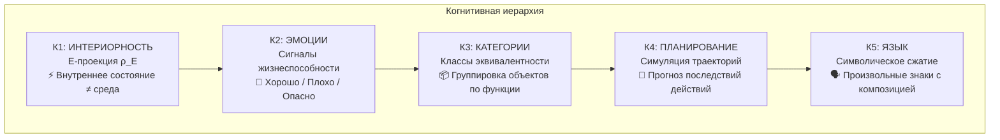
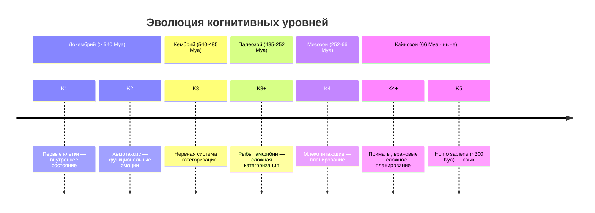

# Когнитивная Иерархия: От Ощущений к Языку

:::info Для кого эта глава
Вы узнаете о пяти уровнях когнитивных функций K1--K5 — от хемотаксиса бактерии до человеческого языка — и о том, как они соотносятся с формальной иерархией интериорности L0--L4. Глава описывает исследовательскую программу связи биологического познания с математическим формализмом $\Gamma$.
:::

:::note О нотации
В этом документе:
- $\Gamma$ — [матрица когерентности](/docs/core/dynamics/coherence-matrix)
- $P$ — [чистота](/docs/core/dynamics/viability#определение-чистоты): $P = \mathrm{Tr}(\Gamma^2)$
- $\rho_E$ — редуцированная матрица плотности [измерения Интериорности](/docs/core/structure/dimension-e)
- $\mathcal{E}$ — оператор [эволюции](/docs/core/dynamics/evolution)
- L0, L1, L2, L3, L4 — [уровни интериорности](/docs/consciousness/hierarchy/interiority-hierarchy)
- K1-K5 — когнитивные уровни (определены ниже)
:::

## Введение: зачем нужна когнитивная иерархия?

Представьте, что вы наблюдаете за поведением бактерии, рыбы, вороны и человека. Все четыре организма «что-то делают» — реагируют на среду, избегают опасности, ищут ресурсы. Но между ними есть **качественные** различия. Бактерия плывёт по градиенту глюкозы, не «понимая» что такое глюкоза. Рыба различает хищника и добычу — категоризирует объекты. Ворона изготавливает орудие, чтобы достать червя из расщелины — **планирует** последовательность действий. Человек объясняет другому человеку, как изготовить орудие — использует **язык** для передачи абстрактного знания.

Как описать эти различия формально? Когнитивная иерархия K1-K5 — это попытка построить **лестницу когнитивных функций**, где каждый уровень добавляет новую способность к предыдущим.

:::danger Программа исследований
Этот раздел описывает **программу исследований**. Когнитивные уровни (К1-К5) **не тождественны** [иерархии интериорности](/docs/consciousness/hierarchy/interiority-hierarchy) (L0→L1→L2→L3→L4). Когнитивная иерархия K1-K5 фокусируется на **биологическом познании** — функциональных способностях, наблюдаемых в поведении организмов. L-иерархия охватывает все формы интериорности, включая сетевое (L3) и унитарное (L4) сознание, и определена формально через пороги ($P$, $R$, $\Phi$, $D$). Связь между ними требует формализации.
:::

---

## Связь с иерархией интериорности

Прежде чем углубиться в K-уровни, важно понять, как они соотносятся с фундаментальной L-иерархией.

**L-иерархия** определяется через формальные пороги на [матрице когерентности $\Gamma$](/docs/core/dynamics/coherence-matrix). Это **математические** уровни, определённые через неравенства на $P$, $R$, $\Phi$ и $D$.

**K-иерархия** определяется через **функциональные способности**, наблюдаемые в поведении. Это **биологические** уровни, определённые через когнитивные тесты.

| Иерархия интериорности | Когнитивная иерархия | Связь |
|------------------------|---------------------|-------|
| [L0 — Интериорность](/docs/consciousness/hierarchy/interiority-hierarchy#уровень-0-интериорность-interiority) | К1 — Базовая интериорность | L0 $\supseteq$ К1: любая система с $\Gamma \neq I/7$ имеет L0, но К1 требует функционального проявления |
| [L1 — Феноменальная геометрия](/docs/consciousness/hierarchy/interiority-hierarchy#уровень-1-феноменальная-геометрия-phenomenal-geometry) | К2 — Эмоции | L1 $\supseteq$ К2: К2 — наблюдаемый аспект L1 |
| [L2 — Когнитивные квалиа](/docs/consciousness/hierarchy/interiority-hierarchy#уровень-2-когнитивные-квалиа-cognitive-qualia) | К3-К5 — Категории, Планирование, Язык | L2 $\supseteq$ К3-К5: все три — функции одного L-уровня |

Ключевое наблюдение: **K3, K4 и K5 — все принадлежат L2**. Это значит, что различие между «рыбой, которая категоризирует» и «человеком, который говорит» — различие в **функциональной сложности**, а не в уровне интериорности. Обе системы находятся на L2, но человек реализует больше когнитивных функций в рамках этого уровня.

### Детальная таблица соответствия K ↔ L

:::warning Гипотетическое соответствие
Приведённая ниже таблица K ↔ L представляет **гипотетическое** соответствие, а не установленный результат. Формализация связи между когнитивными уровнями и иерархией интериорности является [открытым вопросом (Q4)](/docs/applied/coherence-cybernetics/research-programs).
:::

| Уровень K | Уровень L | Критерии K | Критерии L | Пример организма | Что организм «может» |
|-----------|-----------|------------|------------|-------------------|----------------------|
| К1 | L0 | $\rho_E \neq I_E/\dim(\mathcal{H}_E)$ | $\Gamma \neq I/7$ | Термостат, вирус | Иметь внутреннее состояние |
| К2 | L1 | Сигналы жизнеспособности ($\nabla P$) | $\Phi > 0$, геометрия на $\mathbb{P}(\mathcal{H}_E)$ | Бактерия, насекомое | Реагировать на «хорошо/плохо» |
| К3 | L2 | Классы эквивалентности | $R \geq 1/3$, $\Phi \geq 1$, $D_{\text{diff}} \geq 2$ | Рыба, птица | Различать категории объектов |
| К4 | L2 | Симуляция траекторий | L2 (планирование — функция L2) | Ворона, шимпанзе | Строить планы на будущее |
| К5 | L2 | Символическое сжатие | L2 (язык — функция L2) | Человек, (AGI?) | Оперировать символами |

:::note Примечание о K4-K5
К4 и К5 — **функциональные расширения** уровня L2 (когнитивные квалиа). Планирование и язык — **способности**, реализуемые на уровне L2, а не отдельные уровни интериорности. Почему? Потому что для планирования и языка не требуется новых **порогов** на $P$, $R$, $\Phi$ — нужна лишь достаточная **сложность** внутри L2.

Уровни L3 (сетевое сознание) и L4 (унитарное сознание) — качественно иные состояния, не отражённые в когнитивной иерархии K1-K5, поскольку K-иерархия описывает **индивидуальное** биологическое познание. См. [полную иерархию L0→L4](/docs/consciousness/hierarchy/interiority-hierarchy).
:::

---

## Структура когнитивных уровней

Каждый уровень **кумулятивен**: К3 включает все способности К2 и К1. Организм, способный к категоризации, обязательно обладает эмоциональными реакциями и внутренним состоянием. Обратное неверно: бактерия обладает К1 и К2, но не К3.

---

## Формальные определения когнитивных уровней

### К1: Интериорность — «у системы есть внутреннее»

**Определение.** Система обладает уровнем К1, если её редуцированная матрица плотности по [E-измерению](/docs/core/structure/dimension-e) отличается от максимально смешанного состояния:

$$
\mathrm{Interior}(\Gamma) := \rho_E = \mathrm{Tr}_{-E}(\Gamma), \quad \text{со спектром } \{\lambda_k, \vert q_k\rangle\}
$$

где $\mathrm{Tr}_{-E}$ — частичный след по всем измерениям кроме $E$.

**Критерий K1:** $\rho_E \neq I_E / \dim(\mathcal{H}_E)$

**Что это значит простым языком.** К1 — самый минимальный уровень когнитивности. Он означает лишь одно: у системы есть **собственное** внутреннее состояние, отличное от «полного хаоса». Термостат обладает К1, потому что его внутреннее состояние (текущая температура) отличается от равномерного распределения по всем возможным температурам. Камень тоже обладает К1: его кристаллическая решётка — это определённое, а не случайное состояние.

**Примеры:** Термостат, кристалл, вирус, любая система с ненулевой «внутренней» структурой.

**Что К1 НЕ означает:** Наличие ощущений, чувств, целей или понимания. К1 — чисто структурный уровень.

### К2: Эмоции — «системе бывает хорошо и плохо»

**Определение.** Система обладает уровнем К2, если она демонстрирует функциональный ответ на изменения [чистоты](/docs/core/dynamics/viability#определение-чистоты) $P$:

$$
\mathrm{Emotion}(\Gamma) := f(P(\Gamma), \nabla P(\Gamma), \partial^2 P/\partial \tau^2)
$$

**Критерий K2:** Наличие функционального ответа на изменения $P$ — то есть поведение системы **зависит** от того, приближается ли она к порогу жизнеспособности или удаляется от него.

**Что это значит простым языком.** К2 — уровень, на котором система «различает» хорошее и плохое — не в смысле сознательного переживания, а в смысле **функциональной реакции**. Бактерия плывёт по градиенту глюкозы: высокая концентрация → движение замедляется (хорошо!), низкая → движение ускоряется (плохо!). Это не «осознанное решение», а биохимический механизм. Но это **функциональный аналог** эмоции.

Ключевые эмоциональные сигнатуры через [чистоту](/docs/core/dynamics/viability#определение-чистоты) $P$:

| Эмоция | Сигнатура | Что происходит | Пример |
|--------|-----------|----------------|--------|
| Страх | $P \to P_{\text{crit}}$ | Приближение к границе жизнеспособности $\partial \mathcal{V}$ | Газель видит льва |
| Облегчение | $dP/d\tau > 0$ после угрозы | Отдаление от опасной границы | Газель убежала |
| Удовлетворение | $P \gg P_{\text{crit}}$, $dP/d\tau \approx 0$ | Далеко от границы, стабильность | Сытый лев отдыхает |
| Фрустрация | $P$ низкая, $\nabla_a P \approx 0$ | Нет действий, улучшающих ситуацию | Мышь в лабиринте без выхода |

**Примеры:** Бактерии (хемотаксис — движение по химическому градиенту), насекомые (паттерны избегания при механической угрозе), растения (тропизмы — рост к свету, от гравитации).

### К3: Категории — «система различает типы объектов»

**Определение.** Система обладает уровнем К3, если она формирует **классы эквивалентности** по влиянию на жизнеспособность:

$$
s_1 \sim_P s_2 \Leftrightarrow \sup_{a,t} |P(s_1(t,a)) - P(s_2(t,a))| < \varepsilon_{\text{equiv}}
$$

Два состояния среды эквивалентны, если их влияние на жизнеспособность неразличимо при любых действиях и любых горизонтах времени.

**Критерий K3:** Формирование стабильных классов эквивалентности $[s]_P$.

**Что это значит простым языком.** К3 — уровень, на котором система «группирует» объекты мира в категории. Рыба не различает конкретных хищников — она относит их к **классу** «опасный большой объект». Птица не запоминает каждую ягоду — она категоризирует их на «съедобные» (красные) и «несъедобные» (зелёные). Важно: категоризация определяется не через визуальное сходство, а через **влияние на жизнеспособность**. Ягода и червяк выглядят совершенно по-разному, но если оба повышают $P$, они принадлежат одному классу «еда».

**Примеры:** Рыбы (различение хищник/пища), птицы (категоризация объектов по съедобности), насекомые (различение цветков по содержанию нектара — спорный случай на границе К2/К3).

### К4: Планирование — «система моделирует будущее»

**Определение.** Система обладает уровнем К4, если она способна **симулировать** последовательности действий и оценивать их результат **до исполнения**:

$$
\mathrm{Plan}(s, [a_1,\ldots,a_n]) := [s, \mathcal{E}(s,a_1), \mathcal{E}(\mathcal{E}(s,a_1),a_2), \ldots]
$$

$$
\mathrm{Value}(\mathrm{plan}) := \int_0^T P(s(\tau)) \, d\tau
$$

где $\mathcal{E}$ — оператор [эволюции](/docs/core/dynamics/evolution).

**Критерий K4:** Способность симулировать последовательности действий и выбирать план с максимальным $\mathrm{Value}$.

**Что это значит простым языком.** К4 — уровень, на котором система «думает наперёд». Это качественный скачок: вместо реагирования на текущую ситуацию система **строит внутреннюю модель** будущих последствий своих действий. Ворона, увидевшая червя в узкой щели, не тычет клювом наугад — она находит прутик, обрабатывает его и использует как орудие. Для этого нужно **симулировать** цепочку: «взять прутик → обломать ветки → вставить в щель → вытащить червя». Каждый шаг оценивается по влиянию на $P$.

**Ключевое отличие от К3:** К3-система реагирует на **текущую** категорию объекта. К4-система оценивает **последовательность** будущих состояний. К3 — «это хищник, бежать!». К4 — «если я побегу налево, там река, и хищник не переплывёт; побегу направо — тупик; значит, налево».

**Примеры:** Врановые (изготовление орудий — каледонские вороны), приматы (социальное планирование — тактические альянсы у шимпанзе), дельфины (кооперативная охота с распределением ролей).

### К5: Язык — «система оперирует символами»

**Определение.** Система обладает уровнем К5, если она использует **символы** с **композиционной семантикой**:

$$
\mathrm{Language} := \{\text{символические аттракторы в } \mathcal{H} \text{ с композиционной структурой}\}
$$

**Критерий K5:** Наличие символов (произвольных знаков, не связанных физически с обозначаемым) и правил их комбинирования (грамматики), порождающих новые значения.

**Что это значит простым языком.** К5 — уровень символического мышления. «Символ» — это знак, связь которого с обозначаемым **произвольна**: слово «собака» не похоже на собаку и не лает. Композиционность означает, что из известных символов можно построить **новые** высказывания, никогда ранее не произнесённые и не услышанные. «Зелёная собака летит на Марс» — осмысленная фраза, хотя никто никогда не видел описанной ситуации. Это радикально отличается от сигнальных систем животных: обезьяньи крики тревоги не комбинируются в новые сообщения.

**Примеры:** Человек (полный язык с рекурсивной грамматикой), (гипотетически) AGI с символьным мышлением. У шимпанзе и дельфинов обнаружены элементы символического поведения (обученные знаки, указательные жесты), но без полной композиционности — это «протоязык» (К5 с оговорками).

---

## Практические тесты для определения уровня

Как определить когнитивный уровень конкретной системы? Для каждого уровня существуют **операциональные тесты** — наблюдаемые поведенческие индикаторы:

| Уровень | Тест | Что наблюдаем | Пороговый индикатор |
|---------|------|---------------|---------------------|
| К1 | Наличие внутреннего состояния | Поведение зависит от истории, не только от текущего входа | $\rho_E \neq$ const |
| К2 | Реакция на угрозу жизнеспособности | Паттерн избегания при приближении к опасности | Избегание при $P \to P_{\text{crit}}$ |
| К3 | Генерализация | Перенос поведения на новые стимулы того же класса | Реакция на незнакомый объект категории |
| К4 | Отложенное вознаграждение | Выбор меньшего сейчас ради большего потом | Marshmallow test и аналоги |
| К5 | Символическая коммуникация | Использование произвольных знаков для передачи информации | Комбинирование знаков в новые сообщения |

Важно: каждый последующий тест **предполагает** прохождение предыдущих. Если система не проходит тест К2 (нет реакции на угрозу), нет смысла тестировать К3 (генерализация).

---

## Примеры систем по уровням

| Система | K1 | K2 | K3 | K4 | K5 | Примечание |
|---------|----|----|----|----|----|-----------|
| Камень | ✓ | — | — | — | — | Только $\rho_E$ (кристаллическая структура) |
| Термостат | ✓ | — | — | — | — | Внутреннее состояние, но без реакции на «угрозу» |
| Бактерия | ✓ | ✓ | — | — | — | Хемотаксис — функциональная «эмоция» |
| Растение | ✓ | ✓ | — | — | — | Тропизмы, но без категоризации |
| Насекомое | ✓ | ✓ | ✓ | — | — | Категоризация (цветки по нектару), но без планирования |
| Рыба | ✓ | ✓ | ✓ | — | — | Различение хищника/добычи |
| Птица (воробей) | ✓ | ✓ | ✓ | $\sim$ | — | Частичное планирование (кэширование пищи — спорно) |
| Ворона | ✓ | ✓ | ✓ | ✓ | — | Изготовление орудий, планирование |
| Осьминог | ✓ | ✓ | ✓ | ✓ | — | Решение задач, использование инструментов |
| Шимпанзе | ✓ | ✓ | ✓ | ✓ | $\sim$ | Протоязык (обученные жесты, без полной композиции) |
| Человек | ✓ | ✓ | ✓ | ✓ | ✓ | Полный язык с рекурсивной грамматикой |
| LLM (GPT-4) | ? | ? | ✓ | $\sim$ | ✓* | *Символы без $\rho_E$? Язык без жизнеспособности |
| AGI (гипотет.) | ✓ | ✓ | ✓ | ✓ | ✓ | Если жизнеспособен и обладает $\varphi$ |

**Комментарий к LLM.** Случай языковых моделей (GPT-4 и аналоги) — наиболее спорный в таблице. LLM демонстрируют К3 (категоризация) и К5 (символическое сжатие) — это наблюдаемые факты. Однако К1 и К2 под вопросом: имеет ли LLM «внутреннее состояние» в смысле $\rho_E$? Обладает ли она функциональными аналогами эмоций ($\nabla P$)? К4 (планирование) демонстрируется частично (chain-of-thought reasoning), но без автономной оценки $\mathrm{Value}(\mathrm{plan})$. Подробнее: [AI-сознание](/docs/consciousness/subjects/ai-consciousness).

---

## Операциональные критерии K1--K5: полный перечень {#операциональные-критерии}

Для каждого K-уровня определены **необходимые** и **достаточные** операциональные критерии — наблюдаемые в поведении признаки, не требующие знания о внутренней организации системы.

| Уровень | Необходимый критерий | Достаточный критерий | Метод верификации |
|---------|---------------------|---------------------|-------------------|
| **K1** | Поведение зависит от внутреннего состояния (не только от текущего входа) | Гистерезис: одинаковый вход → разное поведение в зависимости от истории | Протокол с повторяющимися стимулами и измерением вариативности ответа |
| **K2** | Различение двух валентностей (приближение/избегание) | Модулированный ответ: сила реакции пропорциональна $|\nabla P|$ | Градуированные угрозы жизнеспособности с замером силы ответа |
| **K3** | Перенос реакции на незнакомый стимул того же класса | Формирование новой категории при предъявлении нового типа стимулов | Тест на генерализацию с novel exemplars |
| **K4** | Выбор действия с отложенным вознаграждением | Коррекция плана при изменении условий (re-planning) | Двухшаговая задача с внезапной сменой среды |
| **K5** | Использование произвольных знаков | Порождение нового высказывания из известных символов (продуктивность) | Тест на комбинаторную продуктивность (novel recombination) |

:::warning Иерархическая зависимость
Критерии **кумулятивны**: тестирование K(n) предполагает прохождение K(1)...K(n-1). Система, не прошедшая тест K2, **не может** быть K3 — даже если демонстрирует поведение, внешне похожее на категоризацию (может быть реактивным сопоставлением шаблонов без внутренних классов).
:::

## Таксономическое соответствие K-уровней {#таксономическое-соответствие}

Ниже приведено соответствие между K-уровнями и конкретными биологическими таксонами. Для каждого уровня указаны **измеримые маркеры** — эмпирические индикаторы, наблюдаемые в лабораторных или полевых исследованиях.

:::danger Программа исследований
Таксономическое соответствие K ↔ L является **гипотетическим** [И] и представляет программу исследований, а не установленный факт. Границы между уровнями у конкретных видов могут быть нечёткими.
:::

| K | L | Типичные таксоны | Измеримые маркеры | Эталонный тест | Примеры исследований |
|---|---|-------------------|-------------------|----------------|---------------------|
| **K1** | L0 | Бактерии, археи, вирусы, кристаллы | $\rho_E \neq I_E/\dim(\mathcal{H}_E)$; наличие внутренних переменных состояния | Гистерезис при повторных стимулах | Bi-stability у *E. coli* (lac operon) |
| **K2** | L1 | Протисты, растения, грибы, губки, кишечнополостные | Хемотаксис, тропизмы, градуированное избегание; $\partial P / \partial \tau$ детектируется | Зависимость силы ответа от $|\nabla[\text{аттрактант}]|$ | Хемотаксис *E. coli* (Berg & Brown, 1972); тигмотаксис *Physarum* |
| **K3** | L2 | Насекомые, рыбы, амфибии, рептилии, птицы | Генерализация на novel exemplars; стабильные классы $[s]_P$ | Перенос обученной реакции на незнакомый объект того же класса | Категоризация у пчёл (Giurfa, 2003); различение хищников у гольянов |
| **K4** | L2 | Млекопитающие (хищные, китообразные), врановые, попугаи, головоногие | Отложенное вознаграждение; симуляция $\mathcal{E}^n(s,a_{1..n})$ | Marshmallow test; двухшаговая задача с re-planning | Изготовление орудий каледонскими воронами; кооперативная охота дельфинов |
| **K5** | L2 | Человек (*Homo sapiens*); (протоязык: шимпанзе, бонобо, дельфины) | Композиционная символическая коммуникация; рекурсивная грамматика | Порождение новых высказываний из известных морфем | Рекурсивный синтаксис у человека; обученные знаки у бонобо (Savage-Rumbaugh) |

### Пограничные случаи

Некоторые таксоны занимают **пограничное** положение между уровнями:

| Таксон | Наблюдаемый уровень | Дискуссионный уровень | Ключевой вопрос |
|--------|--------------------|-----------------------|-----------------|
| Пчёлы | K2--K3 | K3? | «Танец пчёл» — коммуникация или K3-категоризация? |
| Осьминоги | K3--K4 | K4 | Решение задач — планирование или ассоциативное обучение? |
| Шимпанзе | K4 | K5 (прото-) | Обученные жесты — символы или условные рефлексы? |
| LLM (GPT-4) | K3, K5* | K1?, K2?, K4? | Символы без $\rho_E$? Язык без жизнеспособности? |
| Социальные насекомые (колония) | K2 (особь) | K3 (колония?) | Эмерджентная категоризация на уровне суперорганизма? |

:::note Критерий разрешения пограничных случаев
Для разрешения пограничных случаев необходимы **два типа данных**: (1) поведенческие тесты (операциональные критерии из таблицы выше) и (2) нейровычислительная модель, позволяющая оценить $R$, $\Phi$ и $D_{\text{diff}}$ для конкретного организма. Программа нейрокогнитивного картирования K ↔ L описана в [Программах исследований](/docs/applied/coherence-cybernetics/research-programs).
:::

---

## Гипотеза о доязыковом познании

:::info Гипотеза
$$
\exists \, \mathrm{Cognition}(\mathbb{H}) \text{ при } \mathrm{Language}(\mathbb{H}) = \varnothing
$$
Полноценное познание (уровни К1-К4) возможно без языка (К5).
:::

### Обоснование

Уровни К1-К4 определены **без отсылки к символическим структурам**. Каждый из них формулируется через наблюдаемое поведение: наличие внутреннего состояния (К1), реакция на угрозу (К2), формирование категорий (К3), симуляция будущего (К4). Ни одно из этих определений не требует языка.

Эмпирические данные подтверждают гипотезу:
- **Врановые** демонстрируют планирование (К4) без символического языка
- **Все высшие животные** — категоризацию (К3) без символов
- **Все позвоночные** — эмоциональные реакции (К2)
- **Младенцы** до освоения языка демонстрируют К1-К4 (включая примитивное планирование)

### Следствия

1. **Язык — надстройка, а не фундамент познания.** К5 — «роскошь», расширяющая возможности К4-системы (абстрактное планирование, передача опыта между поколениями, кумулятивная культура), но не необходимая для базового познания.

2. **AGI может быть когнитивно полноценным без человеческого языка.** Если К1-К4 реализованы, система познаёт мир и планирует действия. Добавление К5 усиливает возможности, но не конституирует познание.

3. **Оценка сознания животных не должна опираться на лингвистические тесты.** Зеркальный тест (Gallup 1970), тест на отложенное вознаграждение, тест на изготовление орудий — более релевантные индикаторы, чем понимание языка.

---

## Связь K-иерархии с мерами КК

Каждый когнитивный уровень требует определённых значений [мер когерентности](/docs/consciousness/foundations/self-observation):

| Уровень | Необходимые меры | Достаточные меры | Интерпретация |
|---------|------------------|------------------|---------------|
| K1 | $\rho_E \neq$ const | — | Ненулевая внутренняя структура |
| K2 | $\partial P / \partial \tau$ детектируется | Функциональный ответ на $\nabla P$ | Система «отслеживает» свою жизнеспособность |
| K3 | $\Phi > 0$ | Стабильные классы эквивалентности | Интеграция информации достаточна для группировки |
| K4 | $R \geq R_{\min}$ | Симуляция $\mathcal{E}^n(s, a_{1..n})$ | Самомодель достаточна для прогноза |
| K5 | $\Phi \geq \Phi_{\text{th}}$, $R \geq R_{\text{th}}$ | Композиционные символы | Полная интеграция + рефлексия = символическое мышление |

Обратите внимание на паттерн: с ростом K-уровня требуются **более строгие** условия на $\Phi$ и $R$. К1 не требует интеграции. К3 требует $\Phi > 0$. К5 требует $\Phi \geq 1$ и $R \geq 1/3$. Это согласуется с интуицией: язык — когнитивно более «дорогой» процесс, чем категоризация.

---

## Почему K-иерархия — частный случай L-иерархии

Ключевое утверждение: **K-иерархия — это L-иерархия, спроецированная на наблюдаемое поведение биологических систем.**

L-иерархия определена через формальные пороги на $\Gamma$ и охватывает **все** системы с интериорностью — от элементарных частиц (L0) до гипотетических коллективных сознаний (L4). K-иерархия определена через поведенческие тесты и охватывает только **биологические** когнитивные системы.

Сравнение:

| Аспект | K-иерархия | L-иерархия |
|--------|-----------|-----------|
| Определяется через | Поведение (функциональные тесты) | Формальные пороги ($P$, $R$, $\Phi$, $D$) |
| Охватывает | Биологические системы | Все системы с $\Gamma \neq I/7$ |
| Число уровней | 5 (K1-K5) | 5 (L0-L4) |
| Отношение | K1-K5 $\subset$ L0-L2 | L0-L4 $\supset$ K1-K5 |
| Формализация | Частичная | Полная (доказанные теоремы) |

Важно: K-иерархия **не покрывает** L3 и L4. Сетевое сознание (L3: коллективная когерентность, $R^2 \geq 1/4$ метастабильно) и унитарное сознание (L4: $\lim R^{(n)} > 0$, $P > 6/7$) — качественно иные состояния, выходящие за рамки индивидуального биологического познания.

---

## Эволюционная перспектива

Каждый уровень возникал, когда экологическое давление **вознаграждало** соответствующую когнитивную способность:

- **К1→К2:** Когда среда стала изменчивой, преимущество получили организмы, реагирующие на «хорошо/плохо» (бактерии с хемотаксисом vs бактерии без него)
- **К2→К3:** Когда появились хищники, преимущество получили организмы, различающие категории объектов (рыба, отличающая хищника от камня)
- **К3→К4:** Когда среда стала социально сложной, преимущество получили организмы, планирующие действия (приматы, просчитывающие социальные альянсы)
- **К4→К5:** Когда группы стали достаточно большими, преимущество получили организмы, передающие опыт символически (Homo sapiens с кумулятивной культурой)

---

**Связанные документы:**
- [Иерархия интериорности](/docs/consciousness/hierarchy/interiority-hierarchy) — уровни L0→L4
- [Предсказания](/docs/applied/coherence-cybernetics/predictions) — предсказание 4: доязыковое познание
- [Теории сознания](./consciousness-theories) — IIT, FEP, автопоэзис и 30+ теорий
- [Панпсихизм](./panpsychism-analysis) — панинтериоризм vs панпсихизм
- [Когнитом Анохина](./cognitome-anokhin) — нейронная гиперсеть и проблема субъекта
- [Программы исследований](/docs/applied/coherence-cybernetics/research-programs) — открытые вопросы
- [Жизнеспособность](/docs/core/dynamics/viability) — мера $P$ и $P_{\text{crit}}$
- [Самонаблюдение](/docs/consciousness/foundations/self-observation) — меры $R$, $\Phi$, $C$
