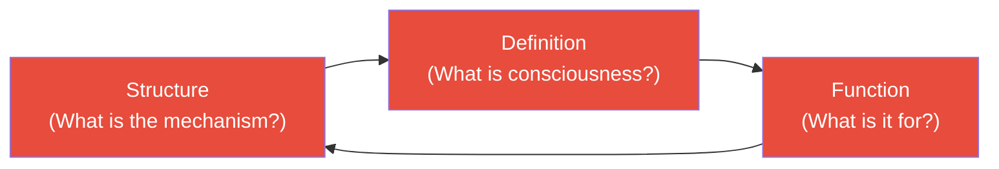
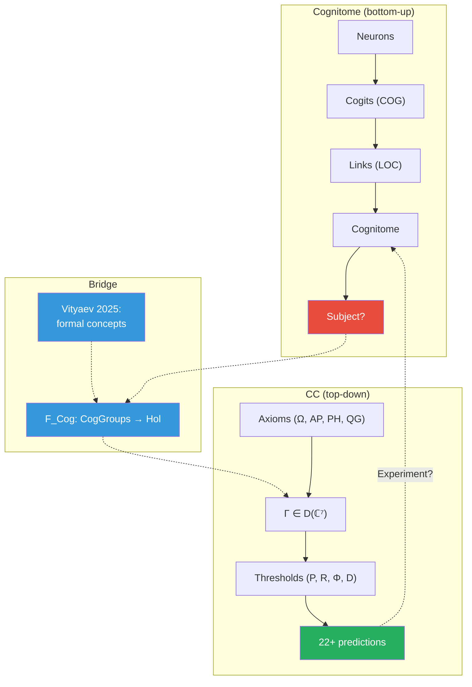

# Anokhin's Cognitome: Neural Hypernetwork and the Subject Problem

:::info Who this chapter is for
You will learn about K.V. Anokhin's cognitome theory — a neural hypernetwork that claims to solve the "Who problem" in consciousness science. The chapter analyses the cognitome's strengths and limitations and shows how the functor $F_{\text{Cog}}$ connects it to the $\Gamma$ formalism.
:::

> "The main problem of consciousness science is not the problem 'What?' and not the problem 'How?', but the problem 'Who?' — who is the subject of conscious experience."
>
> — K.V. Anokhin

:::note On notation
In this document:
- $\Gamma$ — [coherence matrix](/docs/core/dynamics/coherence-matrix)
- $\varphi$ — [self-modelling operator](/docs/proofs/categorical/formalization-phi)
- $\Phi$ — [integration measure](/docs/core/structure/dimension-u#мера-интеграции-φ)
- $R$ — [reflection measure](/docs/consciousness/foundations/self-observation#мера-рефлексии-r)
- L0–L4 — [interiority levels](/docs/consciousness/hierarchy/interiority-hierarchy)
- $\mathbf{Hol}$ — [Holon category](/docs/proofs/categorical/categorical-formalism)
:::

---

## 1. Introduction: the Anokhin Scientific School {#введение}

### Who is K.V. Anokhin?

**Konstantin Vladimirovich Anokhin** (b. 1957) is a neurobiologist, full member of the Russian Academy of Sciences, director of the Institute for Advanced Brain Research at Moscow State University, head of the Neuroscience Department at the NRC "Kurchatov Institute", and laureate of the I.P. Pavlov Prize. His cognitome theory is one of the few modern theories of consciousness developed in the Russian scientific tradition and to have received international recognition.

**Key publication:** Anokhin K.V. (2021). "Cognitome: In Search of a Fundamental Neuroscientific Theory of Consciousness". *Zhurnal Vysshei Nervnoi Deyatel'nosti im. I.P. Pavlova*, Vol. 71, No. 1, pp. 39–71. English translation: *Neuroscience and Behavioral Physiology*, Vol. 51, pp. 915–937 (Springer). Invited talks at ASSC (Association for the Scientific Study of Consciousness), TSC 2018 (Tucson), First International Conference "Computer Methods of Cognitome Analysis" (HSE University, 2022, 260 participants from 10 countries).

### Dynasty: from P.K. Anokhin to K.V. Anokhin

K.V. Anokhin is the **grandson** of Pyotr Kuzmich Anokhin (1898–1974), the founder of the **theory of functional systems** (TFS). This is not merely a family connection but an intellectual continuity spanning three generations:

**Pyotr Kuzmich Anokhin** — a student of Ivan Petrovich Pavlov, he departed early from the classical reflexological approach. Pavlov described behaviour as a chain of reflexes: stimulus → response. Anokhin the elder saw that this was wrong: the organism does not react to stimuli — it **acts** for the sake of a result, **predicts** that result, and **compares** reality with the prediction. This was revolutionary: in 1935, decades before cybernetics existed, Anokhin introduced concepts that today read like descriptions of predictive coding.

Key TFS concepts that anticipated modern theories:

| TFS Concept (1935–1974) | Modern Analogue | Anticipated by |
|--------------------------|-------------------|-------------|
| **Action Result Acceptor** — neural model of the expected result | Predictive coding (Clark 2013) | ~60 years |
| **Anticipatory Reflection** — ability to predict the future | Bayesian brain (Doya 2007) | ~50 years |
| **Systemogenesis** — functional systems form as a whole | Neuroconstructivism (Westermann 2007) | ~30 years |
| **Reverse Afferentation** — comparison of result with prediction | Prediction error minimization (Friston 2010) | ~40 years |

K.V. Anokhin develops this tradition, extending from neurophysiology to **consciousness science**, and poses the question: what brain substrate gives rise not merely to adaptive behaviour but to **subjective experience**?

### Anokhin's Definition of Consciousness

Anokhin provides an operational definition: consciousness is **"internal, qualitative, subjective states and processes of perception or awareness"** that commence upon waking and continue until sleep, death, or coma. This definition establishes the *explanandum* (what needs to be explained), not the *explanans* (what does the explaining).

### The Main Problem vs. the Hard Problem {#main-vs-hard}

Anokhin draws an important distinction:

- **The Hard Problem** (Chalmers 1995): why do physical processes give rise to subjective experience?
- **The Main Problem** (the Mind-brAIN problem): what is the nature of the mind–brain relationship **as a whole**?

The key thesis: **solving the Hard Problem does not automatically solve the Main Problem**. Modern neuroscience is fixated on the Hard Problem but neglects a prerequisite — a theory of the **bearer** of consciousness (the mind as a cognitive structure). Without answering "Who?", the question "Why?" is unresolvable.

:::note Parallel with CC
CC dissolves this distinction: [two-aspect monism](/docs/consciousness/foundations/two-aspect-monism) treats physical and phenomenal aspects as two "faces" of a single matrix $\Gamma$. The Hard Problem does not arise because interiority (the E-dimension) is not an epiphenomenon of physics but its integral aspect. The Main Problem is resolved by the formalism $\Gamma \in \mathcal{D}(\mathbb{C}^7)$.
:::

---

## 2. The "Who" Problem: Deficiencies of Existing Theories {#проблема-кто}

### The Blind Spot of Consciousness Science

Anokhin systematically analyses the leading theories of consciousness and discovers a **common deficiency**: none of them answers the question "Who is the subject of consciousness?"

| Theory | What it explains | What it doesn't explain | Metaphor |
|--------|------------------|--------------------------|----------|
| **IIT** (Tononi) | Information integration ($\Phi$) | Who integrates? What is a "system" with max $\Phi$? | "Temperature was measured — but who has the fever?" |
| **GWT** (Bernard Baars) | Global workspace | Who "reads" the contents of the workspace? | "The bulletin board was described — but who reads it?" |
| **TNGS** (Edelman) | Neural Darwinism, reentrant signalling | Who is the subject of selection? | "Selection was explained — but who is being selected?" |
| **HOT** (Rosenthal) | Higher-order thoughts about thoughts | Who has these thoughts? | "The mirror was described — but who looks into it?" |
| **FEP** (Friston) | Free energy minimisation | What minimises it? Where is the agent's boundary? | "The equation was written — but who 'solves' it?" |

All these theories describe **mechanisms** (how) and **correlates** (what) of consciousness, but not a model of the **subject** — the one who experiences. Anokhin calls this the "blind spot" and regards it not as an accidental oversight but as a **systemic problem**: modern neuroscience inherited from behaviourism a taboo on discussing the subject.

### The Homunculus Paradox

Anokhin formulates a deep paradox: all theories attempt to "kill the homunculus" (eliminate the mysterious "who" inside the brain), yet **they all unwittingly reintroduce it**. His exact formulation: C-processes that accompany C'-processes "cannot themselves be causal" (Edelman), yet they perform the function of informing "us" — that is, the "who" that was expelled as a homunculus.

Anokhin's conclusion: "Who" is **neither** a mystical entity **nor** an eliminable illusion. It is a new fundamental organizational level requiring a specialized theory.

:::note Parallel with CC
CC addresses the "Who" problem through the [self-modelling operator $\varphi(\Gamma)$](/docs/proofs/categorical/formalization-phi) (T-62 [T]): the subject is the **self-model** of the holon, constructed by a CPTP channel. The subject is neither postulated from outside nor reduced to a specific neural structure — it is **constructed** from the dynamics of $\Gamma$. This is the formal answer to Anokhin's question: "Who?" is $\varphi(\Gamma)$.
:::

---

## 3. Ten Properties of Consciousness {#десять-свойств}

### Properties and their explanation

Drawing on the works of Searle, Edelman, Damasio, Tononi, and others, Anokhin identifies **10 properties** of conscious experience. Let us consider each and show its mapping into the CC formalism:

| # | Property | Plain-language description | Mapping in CC |
|---|----------|---------------------------|----------------|
| 1 | **Subjectivity** | Experiences belong to "someone". My pain is mine, not yours | $\varphi(\Gamma)$ — the self-model is unique for each $\Gamma$ |
| 2 | **Qualitiveness** | Experiences have a "what it is like". Red does not resemble blue | $\mathrm{Coh}_E$ — projective geometry of the [E-dimension](/docs/core/structure/dimension-e) |
| 3 | **Intentionality** | Consciousness is always *about something* — an apple, a thought, pain | Coherences $\gamma_{ij}$ between sectors — directedness |
| 4 | **Wholeness (unity)** | Experience is given as a unified whole, not a set of parts | $\Phi \geq 1$ — [integration measure](/docs/core/structure/dimension-u#мера-интеграции-φ) |
| 5 | **Temporality** | Experience unfolds in time | $\dot{\Gamma} = \mathcal{L}_\Omega[\Gamma]$ — continuous dynamics |
| 6 | **Situatedness** | Experience is tied to a concrete situation | State $\Gamma(t)$ at a specific moment |
| 7 | **Selectivity** | Attention singles out a part from the stream | $\sigma_k$ (stress vector) — sector prioritisation |
| 8 | **Privacy** | Experience is accessible only to the subject | $\varphi(\Gamma)$ — internal operator, not observable from outside |
| 9 | **Changeability** | The stream of consciousness changes continuously | $\Gamma(t)$ evolves continuously under $\mathcal{L}_\Omega$ |
| 10 | **Connectedness** | Experiences are linked to one another | Coherences $\gamma_{ij}$ — 21 pairs of links (T-146 [T]) |

### Reduction to qualitiveness

Anokhin makes an important philosophical move: he shows that all 10 properties **reduce** to a single fundamental characteristic — **qualitiveness** (the presence of a subjective quality of experience). If qualitiveness is present, the remaining properties follow from it. Without qualitiveness there is no subjectivity (no "someone"), no unity (nothing to unify), no privacy (nothing to conceal).

In CC terms this means: $\mathrm{Coh}_E > 1/7$ (non-zero coherence of the E-dimension) is a **necessary** condition from which all 10 properties follow. The No-Zombie Theorem [T] formalises this connection: a viable system ($P > 2/7$) **necessarily** has $\mathrm{Coh}_E > 1/7$.

---

## 4. Four Ingredients of Consciousness {#четыре-ингредиента}

Anokhin identifies four **necessary components** of any episode of conscious experience:

| Ingredient | Question | Example | If removed |
|------------|----------|---------|------------|
| **Who** | Who experiences? | Subject (I, the organism) | No experience (zombie illusion) |
| **What** | What is experienced? | Content (red patch, pain, thought) | Empty consciousness (limiting case) |
| **Where** | Where is the experience localised? | Bodily/spatial anchor | Dissociation (depersonalisation) |
| **When** | When does the experience occur? | Moment in the stream of consciousness | Atemporal states (deep meditation?) |

Remove any of the four — and the episode of consciousness collapses or is pathologically deformed. There is no "red without a subject" (this is precisely the zombie problem). There is no "subject without content" (empty consciousness is a limiting case, achievable only in meditative practice and described as "nothing that someone still experiences").

In CC terms: **Who** = $\varphi(\Gamma)$, **What** = the sectoral distribution $\gamma_{kk}$, **Where** = the [A-dimension](/docs/core/structure/dimension-a) (agency, embodiment), **When** = moment $t$ in the evolution of $\Gamma(t)$.

---

## 5. Tinbergen's Five Questions for Consciousness {#пять-вопросов}

### Original formulation

**Niko Tinbergen** (1907–1988) — Dutch ethologist and Nobel laureate (1973) — proposed four questions necessary for a complete explanation of any biological phenomenon. Anokhin extends them to five as applied to consciousness:

1. **Structure** (mechanism): What is the neural (or abstract) mechanism of consciousness?
2. **Function** (function): What is consciousness for? What is its adaptive value?
3. **Development** (ontogeny): How does consciousness arise in the course of individual development?
4. **Learning** (learning): How does consciousness change through learning?
5. **Evolution** (phylogeny): How did consciousness arise in the course of evolution?

### Why are these questions difficult?

Each question in isolation seems tractable. The difficulty is that they are **interdependent** (see the next section). But the value of Tinbergen's framing lies in its **completeness**: a theory of consciousness that answers only one question (e.g., only "Structure") is necessarily incomplete.

---

## 6. The Circular Trap {#циркулярная-ловушка}

### The essence of the problem

Anokhin formulates the **key methodological problem**: Tinbergen's five questions cannot be solved separately.

- To answer the question of **structure**, one must know what consciousness is (**definition**)
- To give a **definition**, one must know the **function** (what the thing being defined is for)
- To understand the **function**, one must know the **structure** (what exactly performs the function)

This is the **circular trap**: each question presupposes the answer to the others. Any attempt to solve them sequentially (structure first, then function, then development) inevitably runs into the fact that the first step already requires the results of the last.

### Escaping the trap

Anokhin argues: the only way out is to build a theory that answers **all five questions simultaneously** within a unified formalism. Not "first define, then explain", but "definition, structure, function, development, and evolution are different aspects of a single formal object".

:::info CC's Position: solving the circular trap
CC claims to resolve the circular trap through the unified formalism $\Gamma \in \mathcal{D}(\mathbb{C}^7)$:

| Tinbergen's Question | CC Answer | Reference |
|----------------------|-----------|--------|
| **Structure** | $\dot\Gamma = \mathcal{L}_\Omega[\Gamma]$ (evolution equation) | [Evolution](/docs/core/dynamics/evolution) |
| **Function** | $V_{\text{hed}} = dP/d\tau$ [T] — hedonic vector directs toward viability | [T-103](/docs/applied/coherence-cybernetics/theorems) |
| **Development** | T-148 [T] — genesis of levels L0→L2 through thresholds | [Theorems](/docs/applied/coherence-cybernetics/theorems) |
| **Learning** | T-109..T-113 [T] — informational, dynamical, stability bounds | [Learning Bounds](/docs/applied/coherence-cybernetics/learning-bounds) |
| **Evolution** | L0→L4 — phylogenesis of interiority as growth of $P$, $R$, $\Phi$ | [Hierarchy](/docs/consciousness/hierarchy/interiority-hierarchy) |

All five answers are derived from **one** matrix $\Gamma$ and **one** evolution equation. The definition (what is consciousness?) is given through thresholds ($P > 2/7 \wedge R \geq 1/3 \wedge \Phi \geq 1 \wedge D \geq 2$), which simultaneously form part of the structure ($\Gamma$), explain the function ($V_{\text{hed}}$), and are traceable in development (L0→L2).
:::

---

## 7. The Cognitome: from Connectome to Hypernetwork {#когнитом}

### Connectome: necessary but insufficient

The **connectome** (term: Sporns, Hagmann 2005) — the complete map of neural connections in the brain. It is a **graph**: nodes = neurons (or brain areas), edges = synaptic connections (or white-matter tracts). Major projects: Human Connectome Project (NIH, since 2009), the complete connectome of C. elegans (302 neurons, ~7,000 connections).

The connectome describes **structure** (who is connected to whom), but not **cognitive properties** (what that structure "knows"). Analogy: a road map shows routes, but not the contents of the cargo being transported.

### Cognitome: Anokhin's answer

The **cognitome** (Anokhin 2014) — a neural **hypernetwork** (hypergraph) that describes not connections but **cognitive elements** and their combinations:

| | Connectome | Cognitome |
|---|---|---|
| **Type of structure** | Graph (nodes + edges) | Hypergraph (nodes + hyperedges) |
| **Nodes** | Neurons | Cognitive groups (**cogits**) |
| **Edges** | Synapses (pairs) | Associative links (**hyperedges** — connect 3+ cogits) |
| **Describes** | Anatomical connectivity | Cognitive organisation |
| **Dimensionality** | Fixed (as many as there are neurons) | Growing (each instance of learning adds new cogits) |
| **Analogy** | Road map | Knowledge map |

The key difference is **hyperedges**. In an ordinary graph, an edge connects **two** nodes. In a hypergraph, a hyperedge can connect **an arbitrary number** of nodes simultaneously. This is necessary for cognitive operations: the concept "a red car is moving fast" connects simultaneously the cogits "colour-red", "object-car", "speed-high" — this is a triple (not pairwise) association.

### COG and LOC: the formal structure of the cognitome {#cog-loc}

In Anokhin's formal terminology, the cognitome consists of two types of elements:

**COG** (Cognitive Group of Neurons) — a vertex of the cognitome. Two subtypes exist:
1. **Functional systems** — goal-directed neural structures (from P.K. Anokhin's TFS)
2. **Cellular ensembles** — Hebbian correlation groups (from Shvyrkov's system-evolutionary theory)

Each COG is a **subset of neurons** from the underlying connectome, united by a common experience and stored in long-term memory. In algebraic topology terms: a COG is a **hypersimplex** (relational simplex) whose **base** is formed from vertices of the neural network, and whose **apex** possesses an **emergent cognitive quality** absent in any individual neuron.

**LOC** (Link of COGs) — an edge between COGs. The key mechanism: LOCs are encoded by **overlapping neurons** of the linked COGs. Neurons participating simultaneously in multiple COGs create the link between them. A LOC represents a "unit of causal knowledge of a cognitive agent."

:::note Parallel with CC
The LOC mechanism via neuron overlap is a concrete biological realisation of what CC models as off-diagonal coherences $\gamma_{ij}$. A coherence $\gamma_{ij} \neq 0$ means that sectors $i$ and $j$ "overlap" in the quantum-informational sense — an analogue of shared neurons in COGs.
:::

### Cogits: elementary units of the cognitome

A **cogit** (from Lat. cogito — I think) — the minimal group of neurons possessing a cognitive property: the ability to encode an elementary meaning (object, feature, action, relation). Cogits are COGs in the established terminology.

Cogits are not individual neurons (too fine: a single neuron does not encode meaning) and not brain areas (too coarse: a brain area encodes too much). Cogits are an **intermediate level** of organisation, roughly corresponding to neural assemblies of ~100–10,000 neurons.

Cogits form during **learning**: each new experience creates or modifies a cogit. The aggregate of cogits and their associative links — the cognitome — **grows** throughout life. The newborn's brain has a minimal cognitome; the brain of an elderly scholar — an enormous one.

### From topography to topology: cross-species universality {#topology}

Anokhin introduces a critically important distinction:

- **Topographic** approach: binding consciousness to specific brain regions (neocortex, thalamo-cortical system). Works only for mammals.
- **Topological** approach: consciousness is determined by the **organisational principles** of the cognitome, independent of anatomy.

This is necessary to explain consciousness in **different species**:
- **Birds**: developed consciousness without neocortex (crows and parrots demonstrate metacognitive abilities)
- **Cephalopods**: an entirely different nervous system (octopuses — distributed intelligence with 9 "brains")
- **Insects**: potentially the simplest forms of consciousness with a minimal nervous system

Anokhin's topological argument unexpectedly brings the cognitome closer to CC: if consciousness is determined by organisational principles rather than substrate, then the cognitome **in principle** admits substrate-independence — though Anokhin himself does not take this step explicitly.

:::info Deep parallel with CC
CC postulates substrate-independence axiomatically: $\Gamma \in \mathcal{D}(\mathbb{C}^7)$ is tied neither to neurons nor to silicon. Anokhin arrives at an **analogous conclusion** from the biological side: if the topological principles of the cognitome are invariant with respect to anatomy, then they are in principle realisable on any substrate. The difference: CC formalises this principle; the cognitome points toward it.
:::

---

## 8. Consciousness as Integration in the Cognitome {#сознание-когнитом}

### Mechanism: percolation

Anokhin proposes: **consciousness** is **large-scale integration** of cognitive elements in the cognitome hypernetwork. When a sufficiently large number of cogits are synchronously activated and form a **connected** subset of the hypergraph — an episode of conscious experience arises.

The key concept is **percolation** (seeping through). In physics, percolation is the process by which a liquid passes through a porous medium: at low porosity the liquid is blocked, but once a critical threshold is exceeded it "seeps" through the entire medium. Analogously in the cognitome: at low activation, cogits are active locally; once the threshold is exceeded, activation "seeps" through the hypernetwork, binding disparate cogits into a unified whole.

### Solving the "Who" Problem

Anokhin proposes an answer to his own question: **subject = cognitome** (the whole, not any part of it). The "Who" problem is resolved by **identifying** the subject with the entire cognitome, not with any subset of it.

Key ideas:

1. **Percolation = consciousness threshold**: consciousness arises when activation "seeps" through the hypernetwork (analogy with a phase transition)
2. **Subject = cognitome**: the "Who" problem is resolved by identifying the subject with the **entire cognitome** (not a part of it)
3. **Content = active subgraph**: the "What" of consciousness is the specific pattern of cogit activation at a given moment
4. **Deutero-learning**: the cognitome is capable of learning to learn (meta-learning) — forming new strategies for forming cogits

### The explanatory gap: Anokhin's position {#explanatory-gap}

Anokhin proposes a non-trivial solution to the explanatory gap problem (Levine 1983): the gap exists **only while the bearer of consciousness remains unspecified**. Once the structure of the cognitive system (the cognitome) is theoretically elaborated, subjective properties become **natural consequences** of that organisation — the gap closes not through philosophical argument but through theory development.

:::note Parallel with CC
CC resolves the gap problem structurally: the operator Gap$(i,j) = |\sin(\arg(\gamma_{ij}))| \in [0,1]$ specifies the **opacity** between external and internal aspects. At Gap = 0 the aspects coincide (full transparency); at Gap = 1 — complete dissociation. The explanatory gap is not a metaphysical abyss but a **measurable quantity** depending on the phase of coherence. This formalises Anokhin's intuition: the gap is an artefact of an incomplete theory, not a property of reality.
:::

### Limitations

Anokhin honestly acknowledges that at the present stage cognitome theory is:
- **Qualitative**: there are no quantitative equations of cognitome dynamics. Exactly when is percolation "sufficient" for consciousness? What is the threshold? The theory does not answer
- **Biologically constrained** (partially): tied to neural structures, though the topological argument (§7) opens a path toward substrate-independence
- **Not falsifiable in the strict sense**: there are no numerical predictions for experimental testing. "Percolation in a hypergraph" is a description, not a number
- **Residual circularity**: the cognitome is defined through cognitive properties, which are in turn defined through the cognitome. Anokhin diagnoses this circular trap in other theories (§6) but does not fully escape it himself

---

## 9. P.K. Anokhin's Legacy: Theory of Functional Systems {#тфс}

The cognitome theory is the logical development of TFS. The intellectual lineage is clearly traceable:

| TFS Concept (P.K. Anokhin) | Development in the cognitome (K.V. Anokhin) | Comment |
|---|---|---|
| Functional system | Cogit (elementary cognitive unit) | From organism system to unit of knowledge |
| Action Result Acceptor | Predictive model in the cognitome | From neurophysiology to cognitive science |
| Anticipatory Reflection | Anticipation through activation of associated cogits | Prediction through propagation of activation |
| Systemogenesis | Cogitogenesis (formation of cogits in ontogenesis) | From formation of reflexes to formation of knowledge |
| Useful result | Cognitive function of a cogit | From adaptation to cognition |

### The Shvyrkov–Alexandrov School {#shvyrkov}

Between P.K. Anokhin and K.V. Anokhin stands a critically important intermediate link:

**Vyacheslav Borisovich Shvyrkov** (1939–1994) — P.K. Anokhin's closest student. He developed the **system-evolutionary theory** within systemic psychophysiology. His key contributions:
- Rejection of the "triggering stimulus" concept: neurons are specialised not for stimuli but for **behavioural acts**
- **Cellular ensembles**: when the same physical stimulus triggers different behavioural acts, **different** sets of neurons are involved
- Behaviour as a **behavioural-temporal continuum**, not a chain of isolated acts

**Yuri Iosifovich Alexandrov** (b. 1953) — the continuator of Shvyrkov's school. He developed the concept of the **structure of individual experience** as an aggregate of functional systems with inter-system relations.

K.V. Anokhin synthesises: Shvyrkov's cellular ensembles become **cogits** (COGs), Alexandrov's inter-system relations become **links of cogits** (LOCs), and the entire structure becomes the **cognitome** (a hypernetwork).

This continuity is a strength of the theory: it does not arise ex nihilo, but develops an **80-year neurophysiological tradition** with a rich experimental base.

---

## 10. Comparing the Cognitome and CC {#сравнение}

### Two approaches to one problem

The cognitome and CC solve **the same task** — explaining the nature of consciousness — but approach it from opposite directions:

- **Cognitome**: from neurobiology "upward" to the subject (bottom-up)
- **CC**: from mathematical formalism "downward" to predictions (top-down)

### Expanded comparison table

| Aspect | Cognitome (Anokhin) | CC |
|--------|---------------------|-----|
| **Substrate** | Neural hypernetwork (biological) | $\Gamma \in \mathcal{D}(\mathbb{C}^7)$ (substrate-independent) |
| **"Who" problem** | Central: cognitome = subject | $\varphi(\Gamma)$ = self-model (T-62 [T]) |
| **Consciousness threshold** | Percolation in hypergraph (qualitative) | $P > 2/7 \wedge R \geq 1/3 \wedge \Phi \geq 1 \wedge D \geq 2$ [T] |
| **Dynamics** | Not formalised | $\mathcal{L}_\Omega = -i[H,\cdot] + \mathcal{D} + \mathcal{R}$ (complete) |
| **10 properties of consciousness** | Reduce to qualitiveness | 21 pairs $\gamma_{ij}$ (T-146 [T]) — each property has a formal correlate |
| **Circular trap** | Identified as a problem | Resolved: all 5 questions → unified formalism |
| **Falsifiability** | Low (qualitative theory) | High (22+ quantitative predictions) |
| **Learning** | Cogitogenesis, deutero-learning | T-109..T-113 [T] (informational, dynamical, stability bounds) |
| **Evolution** | Phylogenesis of cognitive systems (qualitative) | [L0→L4 hierarchy](/docs/consciousness/hierarchy/interiority-hierarchy) + T-148 genesis [T] |
| **Composition** | Hyperedges in cognitome | $\mathbb{H}_1 \otimes \mathbb{H}_2$ with $\Phi$-threshold [T] |
| **Neurobiological concreteness** | High (cogits, synapses, brain areas) | Low (abstract 7 dimensions) |
| **Connection to physics** | Absent | Einstein equations, SM [C]/[T] |
| **Mathematical apparatus** | Hypergraph theory (qualitative); Vityaev 2025 (formal concepts) | Category theory, quantum information theory |
| **Explanatory gap** | Closes through a theory of the bearer (qualitative) | Formalised as Gap$(i,j) = |\sin(\arg(\gamma_{ij}))|$ |
| **Cross-species universality** | Yes (topological argument) | Yes (substrate-independence) |
| **Experimental status** | Experimental base on memory; no cognitome-specific tests | No experimental tests |
| **Critical reception** | Percy 2024: "borderline"; Kanaev & Dryaeva 2023 | New theory, minimal reception |
| **Tradition** | Anokhin → Shvyrkov → Alexandrov → K.V. Anokhin (80+ years) | New (no direct line of inheritance) |

### Hypergraph vs. coherence matrix

Structural comparison of the two central objects:

| Cognitome | CC | Comment |
|-----------|-----|---------|
| Cogit (group of neurons) | Subspace of $\Gamma$ (sector $\gamma_{kk}$) | Elementary cognitive unit |
| Hyperedge $(c_i, c_j, c_k)$ | Coherence $\gamma_{ij}$ | Link between elements. Cognitome allows multidimensional links (hyperedges); CC — only pairwise ($\gamma_{ij}$), but with the full structure of the 7×7 matrix |
| Percolation in hypergraph | $P > P_{\text{crit}} = 2/7$ | Threshold of collective activation. Qualitative in Anokhin, numerical in CC |
| Cognitome (whole) | Holon $\mathbb{H}$ | Subject as whole |
| Deutero-learning | SAD levels (T-110 [T]) | Learning to learn |

---

## 11. What the Cognitome Does Better than CC {#преимущества-когнитома}

Objectivity requires acknowledging the cognitome's strengths:

**1. Neurobiological concreteness.** Cogits are real groups of neurons that can (in principle) be detected experimentally through calcium imaging, multi-electrode arrays, or two-photon microscopy. CC operates with abstract $\gamma_{ij}$ that require an "anchor map" — a correspondence between mathematical measures and neural correlates. This map has not yet been built.

**2. The "Who" problem is posed explicitly.** Anokhin was the **first** to show systematically that IIT, GWT, and other theories are "blind" to the subject. This is valuable **meta-theoretical** work that reveals a common blind spot. Even if the cognitome does not fully resolve the problem, the framing of the question is Anokhin's contribution.

**3. Scientific tradition.** The connection to P.K. Anokhin's TFS, the school of Yu.I. Alexandrov and V.B. Shvyrkov provides an experimental background: neural specialisations, systemogenesis, neural assemblies. This represents **80+ years** of experimental work. CC has no experimental prehistory.

**4. The "meso" level.** The cogit — an intermediate level between the neuron and the brain area. This level of description (~100–10,000 neurons) is the most promising for experimental neuroscience: concrete enough for experiment and abstract enough for theory. CC operates at the macro level (7 dimensions), not detailing the mesostructure.

**5. Cross-species universality.** The topological argument (§7) requires that a theory of consciousness work for mammals, birds, and cephalopods. The cognitome in principle allows this: if cogits are defined functionally rather than anatomically, the theory is not tied to a specific brain architecture. CC achieves this formally ($\Gamma$ is substrate-independent) but lacks experimental anchoring to specific species.

---

## 12. What CC Does Better than the Cognitome {#преимущества-кк}

**1. Formalisation.** CC provides **equations**: $\dot\Gamma = \mathcal{L}_\Omega[\Gamma]$, $\sigma_k = \text{clamp}(1 - 7\gamma_{kk}, 0, 1)$, $V_{\text{hed}} = dP/d\tau$. From these equations theorems with proofs follow. The cognitome describes processes in words, without equations.

**2. Substrate-independence.** CC is applicable to any system with $\Gamma \neq I/7$ — biological, silicon, hybrid. The cognitome is tied to neural tissue: to apply it to AGI it must be reformulated.

**3. Exact thresholds.** $P_{\text{crit}} = 2/7$ [T], $R_{\text{th}} = 1/3$ [T], $\Phi_{\text{th}} = 1$ [T] — **numbers** that can be tested experimentally. "Percolation in a hypergraph" is a description, not a number. When is percolation "sufficient" for consciousness? The cognitome does not answer.

**4. Falsifiability.** 22+ [predictions](/docs/applied/coherence-cybernetics/predictions) of CC — each can be refuted by a specific experiment. The cognitome at this stage does not generate testable numerical predictions.

**5. Connection to physics.** CC derives the Einstein equations (T-120 [T]), emergent spacetime, elements of the Standard Model. The cognitome is a purely neurobiological theory with no extension into fundamental physics.

**6. Resolving the circular trap.** CC answers all 5 of Tinbergen's questions within a unified formalism (see §6). The cognitome identifies the trap but offers only a partial way out — the cognitome is defined through cognitive properties, which are in turn defined through the cognitome.

---

## 13. Mathematisation of the Cognitome: Vityaev (2025) {#mathematisation}

### The first attempt at formalisation

**E. Vityaev** (2025, arXiv:2512.10988, talk at MathAI 2025) undertook the only attempt to date at a **mathematical formalisation** of the cognitome. Instead of algebraic topology (the descriptive language of Anokhin himself), a different apparatus is used:

| Anokhin's Concept | Vityaev's Formalisation | Comment |
|-------------------|------------------------|---------|
| Cogit (COG) | **Probabilistic formal concept** — a fixed point of the prediction operator | Definition 19: a pair $(A,B)$ such that $\Pi_R^\infty(B) = B$ |
| Link of cogits (LOC) | **Maximally specific causal relation** (MSCR) | Definition 16: causal relation with maximum conditional probability |
| Percolation | Iteration of the prediction operator $\Pi_R$ | Definition 17: $\Pi_R(L) = L \cup \{C \mid \exists R \in \mathcal{R}: R_{\text{left}} \subset L, R_{\text{right}} = C\}$ |
| Cognitome | Totality of formal concepts and MSCRs | Fixed point of cascading activation |

**Theorem 1 (Vityaev):** If $L$ is compatible, then $\Pi_R(L)$ remains compatible and consistent — cascading predictions do not generate logical contradictions.

### Limitations of the formalisation

Vityaev's formalisation:
- **Does not use** hypergraph structure (incidence matrices, tensor formalisms)
- **Does not derive** the percolation threshold quantitatively
- **Is not connected** to dynamics (no evolution equations)
- **Does not generate** numerical predictions

It is more of an **algebraic semantics** of the cognitome than a dynamical theory.

:::info Comparison with CC
CC formalises analogous concepts in a fundamentally different way: COG → diagonal element $\gamma_{kk}$, LOC → coherence $\gamma_{ij}$, percolation → $P > P_{\text{crit}} = 2/7$, dynamics → $\dot\Gamma = \mathcal{L}_\Omega[\Gamma]$. Vityaev's formalisation and CC are **compatible**: probabilistic formal concepts can be regarded as the classical limit of the quantum-informational structures of CC. This suggests a possible route toward synthesis.
:::

---

## 14. The Cognitome and Knowledge Communication {#knowledge-communication}

### The transport knowledge stack

Cognitome theory finds an unexpected application in the **theory of knowledge communication** (the "Managed Epistemology" project, anticomplexity.org). The five-level **transport knowledge stack** models the transmission of executable knowledge between agents:

| Level | Name | Function |
|-------|------|----------|
| 5 | Executable knowledge | Private dynamic states regulating behaviour |
| 4 | Semantic | Projecting syntaxes onto the executive apparatus |
| 3 | Syntactic | Pattern recognition, hierarchical encoding schemes |
| 2 | Semiotic | Code recognition from signal packets |
| 1 | Signal | Physical transmission medium |

### Connection to the cognitome

The stack levels maintain **vertical connectivity** reflecting internal activation fronts through cognitome structures. The cognitome of P.K. and K.V. Anokhin is drawn upon as the neurocognitive foundation:
- The **afferent segment** (TFS) defines the available executive apparatus for projecting semantic codes
- The **efferent output** links semantic processing to execution
- Cogits (COGs) occupy "special cognitive positions" regulating behaviour outside afferent-efferent functions

### The metatextual processor as a model of cognitive integration

The concept of the **metatext** (base text + a group of correlated models) and the **metatextual processor** (a tool maintaining the coherence of these models) structurally resembles CC:

| Metatext | CC | Cognitome |
|----------|-----|-----------|
| Correlated models | 21 coherences $\gamma_{ij}$ | Hyperedges LOC |
| Vertical connectivity | Evolution of $\Gamma(t)$ across levels | Percolation through layers |
| Socialisation (including LLMs) | Composition $\mathbb{H}_1 \otimes \mathbb{H}_2$ | Communication of cognitomes |
| 8 metatextuality criteria | 5 consciousness thresholds of CC | 10 properties of consciousness |

This points to a deeper connection: **knowledge communication between agents reproduces at the macro level the same organisational principles as cognitive integration within a single agent**.

---

## 15. Critical Reception {#criticism}

### Academic criticism

**Percy (2024/2025)**, *Journal of Consciousness Studies*: classifies Anokhin's 2021 paper as "borderline". The criteria for a theory of consciousness are distributed across **three disconnected lists** (3 principles, 10 properties in a table, 8 questions separately), creating a "lack of clarity". The theory develops requirements for other theories but does not demonstrate that the cognitome itself satisfies all requirements.

**Kanaev and Dryaeva (2023)**, *ЖВНД*: agree with the non-reductive approach but argue that **anticipatory reflection** cannot be the main system-forming principle — it is more of a consequence than a cause of evolutionary development.

### Philosophical criticism

**The "subjective abstraction" problem** (scorcher.ru): commentators note that the cognitome does not explain the mechanism by which attention extracts shapes, emotions, and meanings from neural activity. Consciousness is a "form of material processes", not a "process" as Anokhin formulates it.

**The problem of residual circularity**: subject = cognitome is an **identification**, not an **explanation**. Why precisely the whole (and not a part) gives rise to subjectivity? How is the whole "more than the sum of its parts" in the precise sense? The cognitome provides a structural answer but not a mechanistic one.

### Experimental status

As of 2026 there are **no published experiments** specifically testing cognitome predictions about consciousness. Anokhin's laboratory (Kurchatov Institute / MSU) works on:
- Memory reconsolidation and reparation
- Calcium imaging with genetically encoded indicators (FGCaMP7)
- Hippocampal place cell dynamics during free exploration

These studies test **memory mechanisms**, not cognitome-specific hypotheses about consciousness. The meso-level gap remains: nobody has demonstrated (a) that groups of ~100–10,000 neurons possess the claimed cognitive properties, (b) that they form a hypernetwork rather than a graph, (c) that percolation in this hypernetwork corresponds to conscious states.

---

## 16. Mapping Functor (hypothesis) [I] {#функтор-когнитом}

### Construction

**Hypothesis.** There exists a functor:

$$
F_{\text{Cog}}: \mathbf{CogGroups} \to \mathbf{Hol}
$$

where $\mathbf{CogGroups}$ is the category of cognitive groups (cogits with hyperedges), and $\mathbf{Hol}$ is the [holon category](/docs/proofs/categorical/categorical-formalism).

### Proposed construction

| Cognitome | CC | Mapping | What is lost |
|-----------|-----|---------|--------------|
| Cogit $c_i$ | Diagonal element $\gamma_{ii}$ | $F_{\text{Cog}}(c_i) = \gamma_{ii}$ | Internal structure of the cogit |
| Hyperedge $(c_i, c_j)$ | Coherence $\gamma_{ij}$ | $F_{\text{Cog}}(e_{ij}) = \gamma_{ij}$ | Multidimensional associations |
| Cognitome $\mathcal{K}$ | Holon $\mathbb{H}$ | $F_{\text{Cog}}(\mathcal{K}) = \mathbb{H}$ | Meso-level structure |
| Percolation | $P > P_{\text{crit}}$ | Threshold → number | Process details |
| Cogitogenesis | $d\Gamma/d\tau$ | Dynamics → equation | Neurobiological mechanisms |

:::warning Status [I]
$F_{\text{Cog}}$ is an **interpretational hypothesis**. For a rigorous construction one must:
1. Define the category $\mathbf{CogGroups}$ formally (objects, morphisms, composition)
2. Show that the 7 dimensions of CC are sufficient to encode the cognitome's structure
3. Prove that percolation in the hypergraph corresponds to $P > 2/7$
4. Connect Vityaev's formalisation (probabilistic formal concepts) with the quantum-informational structure of $\Gamma$

Point 3 is the most concrete and potentially testable: if the cognitome can be formalised as a hypergraph, the percolation threshold can be computed and compared with $P_{\text{crit}}$. If the thresholds coincide — this is strong evidence in favour of both theories.

Point 4 is opened up by Vityaev's work (2025): the prediction operator $\Pi_R$ can be regarded as the classical limit of the CPTP channel $\varphi(\Gamma)$, and the fixed points $\Pi_R^\infty(B) = B$ — as classical analogues of the attractor $\rho^* = \varphi(\Gamma)$.
:::

---

## Conclusion: Prospects for Synthesis {#conclusion}

### Fundamental convergence

The cognitome and CC solve the same problem — the nature of consciousness — from different sides. However, deep analysis reveals not merely "parallelism" but a **fundamental convergence** at the level of structural principles:

| Principle | Cognitome | CC | Convergence |
|-----------|-----------|-----|-------------|
| Subject as whole | Cognitome = subject | $\varphi(\Gamma)$ = self-model | Both: subject not reducible to parts |
| Consciousness threshold | Percolation | $P > 2/7$ | Both: phase transition |
| Connection through overlap | LOCs encoded by shared neurons | $\gamma_{ij} \neq 0$ — quantum coherence | One structure at different levels |
| Topological invariance | Topography → topology | Substrate-independence of $\Gamma$ | One and the same principle |
| Growth through learning | Cogitogenesis | $d\Gamma/d\tau$ | Structure built by experience |
| Closing the explanatory gap | Through a theory of the bearer | Through two-aspect monism + Gap | The gap is an artefact, not ontology |

This convergence is not accidental: both theories target the same object (consciousness), and if the object is real, then any adequate descriptions of it must converge.

### Programme for synthesis

The synthesis of the cognitome and CC presupposes three stages:

1. **Anchor map**: constructing a correspondence $\pi: \text{Neural Data} \to \mathcal{D}(\mathbb{C}^7)$ mapping neural data (calcium imaging, MEA) into the space of $\Gamma$. Cogits provide concrete biological units that can be mapped to sectors $\gamma_{kk}$.

2. **Threshold verification**: computing the percolation threshold in the cognitome hypergraph and comparing it with $P_{\text{crit}} = 2/7$. If the thresholds coincide — this is the strongest evidence in favour of both theories.

3. **Unification of formalisms**: connecting Vityaev's probabilistic formal concepts with the CPTP channels of CC through the large-number limit (quantum-classical correspondence).

If the cognitome provides neurobiological concreteness and meso-level structure, while CC provides formal thresholds, dynamical equations, and falsifiable predictions, their unification could become one of the most powerful approaches to the problem of consciousness.

---

**Related documents:**
- [Panpsychism](./panpsychism-analysis) — analysis of panpsychism and Hoffman's conscious realism
- [Theories of Consciousness](./consciousness-theories) — IIT, FEP, autopoiesis, and 30+ theories
- [Cognitive Hierarchy](./cognitive-hierarchy) — K1–K5 levels
- [General Systems Theory](./general-systems-theory) — from Bertalanffy to CC
- [Interiority Hierarchy](/docs/consciousness/hierarchy/interiority-hierarchy) — L0→L4 levels
- [Formalisation of φ](/docs/proofs/categorical/formalization-phi) — self-modelling operator
- [Self-Observation](/docs/consciousness/foundations/self-observation) — reflection measure $R$
- [Predictions](/docs/applied/coherence-cybernetics/predictions) — falsifiable predictions of CC
