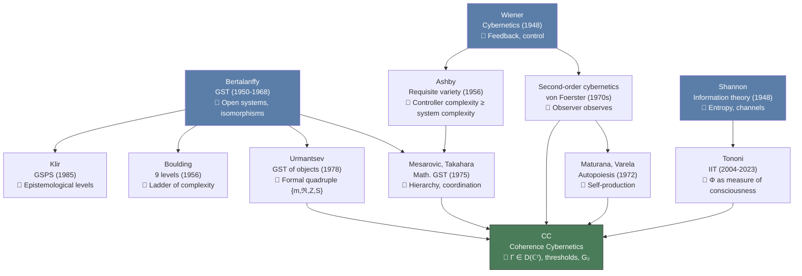
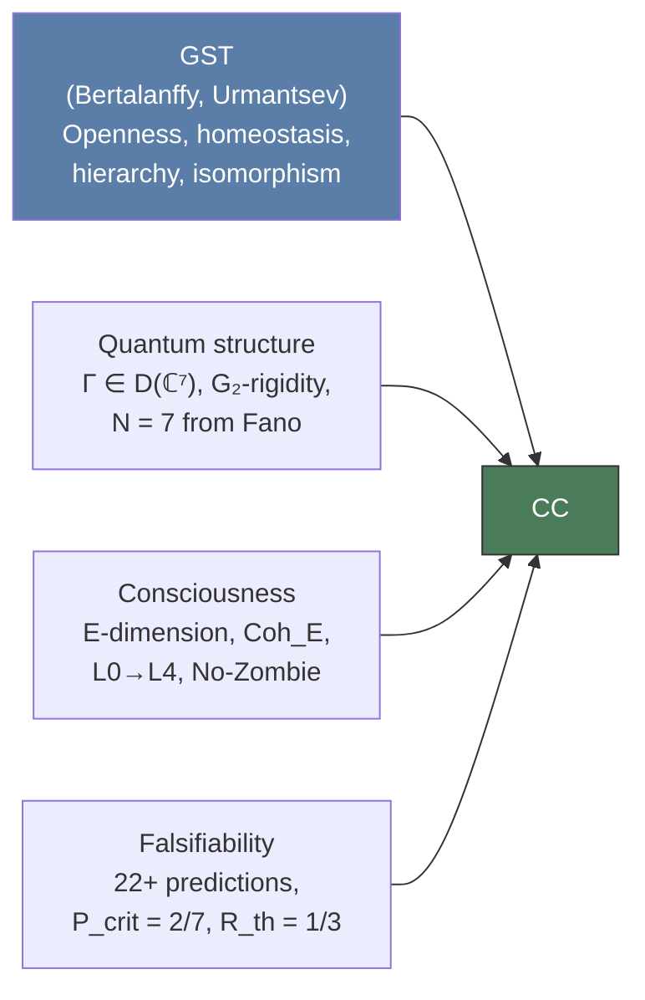

# General Systems Theory and Coherence Cybernetics

:::info Who this chapter is for
You will learn how Coherence Cybernetics mathematically generalizes the General Systems Theory (GST) of Bertalanffy and Urmantsev. The central concepts of GST — open systems, equifinality, hierarchy — are reproduced as special cases of the $\Gamma$ formalism.
:::

:::note About notation
In this document:
- $\Gamma$ — [coherence matrix](/docs/core/dynamics/coherence-matrix)
- $\mathcal{L}_\Omega = \mathcal{L}_0 + \mathcal{R}$ — [evolution equation](/docs/core/dynamics/evolution)
- $\Phi$ — [integration measure](/docs/core/structure/dimension-u#мера-интеграции-φ)
- $R$ — [reflection measure](/docs/consciousness/foundations/self-observation#мера-рефлексии-r)
- $P$ — [purity](/docs/core/dynamics/coherence-matrix) $\mathrm{Tr}(\Gamma^2)$
- $\varphi$ — [self-modelling operator](/docs/proofs/categorical/formalization-phi)
- $\mathbb{H}$ — [Holon](/docs/core/structure/holon)
- $V_{\mathrm{hed}}$ — [hedonic valence](/docs/applied/coherence-cybernetics/theorems#теорема-114-гедоническая-валентность) $dP/d\tau$
:::

## Introduction: why do we need general systems theory? {#введение}

In the mid-twentieth century an intellectual shift occurred that transformed the face of science: researchers in completely different fields — from cell biology to the sociology of organisations — discovered that they were describing their objects using **the same differential equations**. The growth of a bacterial population obeys the same laws as the spread of rumours in a social network. Heat transfer in a building is formally indistinguishable from the flow of capital in an economy. This observation raised the question: do **universal laws** exist that govern systems of **any nature**?

The answer was **General Systems Theory** (GST) — an interdisciplinary programme founded by Ludwig von Bertalanffy in the 1930s–1950s and developed by several schools over seventy years.

Coherence Cybernetics (CC) claims not only meta-status among [theories of consciousness](/docs/consciousness/comparative/consciousness-theories), but also the mathematical generalisation of GST. This is a serious claim: GST is a great intellectual tradition with proven heuristic value. A claim to generalisation obliges one to show that the CC formalism **reproduces** the central concepts of GST as special cases, and also **adds** what GST cannot.

In this section we trace the path from Bertalanffy through Urmantsev to CC, show precise correspondences, and honestly identify limitations.

---

## Ludwig von Bertalanffy: the birth of GST (1950–1968) {#берталанфи}

### Biography and context

**Ludwig von Bertalanffy** (1901–1972) was an Austrian theoretical biologist who received his doctorate from the University of Vienna. In the 1930s, working on problems of organism growth, Bertalanffy discovered that the equations for cell-mass growth were formally identical to the equations of chemical kinetics. This observation became the seed of his central idea.

After World War II Bertalanffy emigrated — first to Canada (University of Alberta), then to the United States. In 1954, together with economist Kenneth Boulding, physiologist Ralph Gerard, and mathematician Anatol Rapoport, he founded the **Society for General Systems Research** (now the International Society for the Systems Sciences). His principal book — *General System Theory: Foundations, Development, Applications* (1968) — collected ideas developed since the 1930s.

### Central idea

Bertalanffy argued: there exist **general laws of systems**, independent of the nature of the constituent elements — physical, biological, or social. These laws describe **structural isomorphisms** between systems of different natures.

A simple example. The Bertalanffy growth equation:

$$
\frac{dW}{dt} = \eta W^{2/3} - \kappa W
$$

describes the growth of an organism's mass $W$, where $\eta W^{2/3}$ is nutrient uptake (proportional to surface area) and $\kappa W$ is expenditure (proportional to mass). But **exactly the same** equation describes the growth of a crystal, the accumulation of capital by a firm, and the spread of infection in a population. Bertalanffy saw in this not a coincidence, but a **law**.

### Key concepts

- **Open system** — a system that exchanges matter, energy, or information with its environment. This is the opposite of classical thermodynamically closed systems. Living organisms are open systems by definition: they consume food and excrete waste.

- **Equifinality** — the property of open systems to reach the same final state from different initial conditions. An organism reaches its adult size regardless of whether it received more or less nourishment at the start of life (within viability limits). Closed systems lack this property — their final state is uniquely determined by initial conditions.

- **Isomorphisms between sciences** — the same mathematical structures (systems of ODEs, feedback, hierarchy) appear in physics, biology, economics, and sociology.

### Mathematical apparatus

Bertalanffy proposed an extremely general formalisation:

$$
\frac{dx_i}{dt} = f_i(x_1, \ldots, x_n), \quad i = 1, \ldots, n
$$

A system of ordinary differential equations (ODEs) as a **universal language** for describing dynamics. Any system whose dynamics can be described through the interaction of variables fits this format.

**The strength and weakness of this approach** are interrelated. The formalism is maximally general — it covers everything, but precisely for this reason generates no specific predictions. The statement "dynamics is described by a system of ODEs" is true for such a wide class of objects that it becomes trivial. Bertalanffy's GST is more a **philosophical programme** and **heuristic principle** than a mathematical theory with theorems and refutable predictions.

:::info Bertalanffy's key contribution
Bertalanffy did not discover the laws of systems — he discovered the **possibility** of such laws. His main achievement was legitimising interdisciplinary systems thinking as a scientific programme. Before Bertalanffy, comparing a living organism with a firm was considered a metaphor; after him — a research strategy.
:::

---

## Yu.A. Urmantsev: GST of objects (1978–2009) {#урманцев}

### Biography and context

**Yunir Abdinovich Urmantsev** (1925–2009) was a Soviet and Russian philosopher-systemologist, professor at Moscow University. Urmantsev set himself the task that Bertalanffy had not solved: to create a **formal** general systems theory, not a programmatic declaration. The result was *General Systems Theory* (1978) and subsequent works, up to *Foundations of General Systems Theory* (2003).

Urmantsev worked in a tradition different from the Anglo-American systems movement. Where Bertalanffy, Boulding, and Ashby were biologists and engineers, Urmantsev was a philosopher who sought logical rigour in the spirit of Soviet philosophy of science.

### Central construction

Urmantsev defined a **system** as a quadruple:

$$
\mathcal{S} = \{m, \, \mathfrak{R}, \, Z, \, S\}
$$

| Component | Notation | Description | Example (for a living cell) |
|-----------|----------|-------------|------------------------------|
| Elements | $m$ | Set of system components | Organelles: nucleus, mitochondria, ribosomes |
| Relations | $\mathfrak{R}$ | Connections between elements | Metabolic pathways, signalling cascades |
| Composition laws | $Z$ | Rules by which elements form the system | Genetic code, protein assembly rules |
| Properties | $S$ | Observable characteristics of the system as a whole | Metabolic activity, capacity for division |

### Key results

- **Law of systems transformations** — Urmantsev systematically classified ways of changing a system. A system can be changed in four ways: (1) by changing elements $m$, (2) by changing relations $\mathfrak{R}$, (3) by changing laws $Z$, (4) by changing everything simultaneously. This yields a complete combinatorics of transformations.

- **Polymorphism and isomorphism of systems** — formal mappings between systems of different natures. Two systems are isomorphic if a bijection exists between them that preserves relations and laws.

- **Algebraic approach** — groupoids and polygroupoids as tools for describing systems transformations. Urmantsev was the first to attempt to give GST an algebraic form.

### Mapping to CC

| Urmantsev ($\mathcal{S}$) | CC formalization | Comment |
|---------------------------|-----------------|---------|
| Elements $m$ | Dimensions $k \in \{A, S, D, L, E, O, U\}$ | 7 semantic roles |
| Relations $\mathfrak{R}$ | Coherences $\gamma_{ij}$ (off-diagonal elements of $\Gamma$) | 21 coherence pairs |
| Composition laws $Z$ | [Evolution operator](/docs/core/dynamics/evolution) $\mathcal{L}_\Omega$ | Dynamics derived from structure $\Omega$ |
| Properties $S$ | Observables: $P$, $\Phi$, $R$, $\sigma_k$ | Concrete functions of $\Gamma$ |

Urmantsev's advantage is the explicit attempt at algebraic formalisation. But his algebra remains **descriptive**: it classifies types of systems and transformations, but does not derive dynamics from structure, as [L-unification](/docs/applied/coherence-cybernetics/axiomatics#l-унификация-вывод-l_k-из-ω) does in CC.

:::note Urmantsev and the problem of consciousness
Urmantsev never addressed the problem of consciousness. His GST is a theory of **objects** (systems of any nature), not a theory of **subjects** (systems possessing inner experience). Herein lies the fundamental limitation of his approach and, simultaneously, its honesty: he did not claim what his formalism could not deliver.
:::

---

## Other GST schools {#другие-школы}

GST is not a monolithic theory but a family of approaches. Each emphasises its own aspect of "systemness". Let us consider the key schools and their connection to CC.

### Mesarovic and Takahara (1975): mathematical GST

**Mihajlo Mesarovic** (Case Western Reserve University, USA) and **Yasuhiko Takahara** (Tokyo Institute of Technology) created the most rigorous mathematical GST. Their definition: a system is a mapping $S \subseteq X \times Y$ (input → output). The central theme is hierarchical multilevel systems with the task of coordinating layers.

Key concepts:
- **Stratified description** — one object is described at several levels of abstraction (e.g. a factory: the parts level, the workshop level, the enterprise level)
- **Coordination** — reconciling decisions between layers of a hierarchy

This is the closest formalism to CC in classical GST: the idea of stratification resonates with the way CC distinguishes levels of description — from $\Gamma$ (micro) through observables $P, \Phi, R$ (meso) to holon behaviour (macro). However, Mesarovic has neither quantum algebra nor a concept of consciousness.

### Klir (1969, 1985): systems epistemology

**George Klir** (Binghamton University, USA) proposed the **General Systems Problem Solver (GSPS)** — an epistemological hierarchy of models. Eight levels of knowledge organisation:

1. Source (data)
2. Data → variables
3. Generative systems (rules)
4. Structured systems (compositions)
5. Metasystems (change of rules)
6–8. Meta-meta levels

The idea of systems epistemology resonates with the [SAD hierarchy](/docs/consciousness/hierarchy/interiority-hierarchy) of CC (SAD-0: reaction, SAD-1: model of self, SAD-2: model of the model, SAD-3: reflection of the model). However, Klir has no formal thresholds for transitions between levels — no analogue of $P_{\mathrm{crit}}$ or $R_{\mathrm{th}}$.

### Boulding (1956): nine levels of complexity

**Kenneth Boulding** (one of the co-founders of the GST society) proposed an intuitive "ladder of complexity" — nine levels of systems:

| Level | Description | Analogue in CC | Comment |
|-------|-------------|----------------|---------|
| 1 | Static frameworks (crystal) | None (CC describes dynamic systems) | Structure without dynamics |
| 2 | Clockwork mechanisms | $P \ll 2/7$, deterministic dynamics | Predictable, no feedback |
| 3 | Cybernetic systems (thermostat) | Feedback, but without $\varphi$ | Control without self-modelling |
| 4 | Open systems (cell) | $\mathcal{L}_\Omega = \mathcal{L}_0 + \mathcal{R}$ | Exchange with environment |
| 5 | Plants (genetic society) | L0 (proto-interiority) | Growth, reproduction |
| 6 | Animals | L1 (perceptual interiority) | Sensations, movement |
| 7 | Human | L2–L3 ($P > 2/7$, SAD $\geq 1$) | Self-awareness, language |
| 8 | Social systems | Composition of holons (T-68) | Collective coherence |
| 9 | Transcendent | Open question | Unformalizable? |

Boulding's ladder is intuitively correct and pedagogically valuable, but stated descriptively. CC offers **formal criteria** for transitions between levels: not "sufficient complexity" but concrete numbers ($P_{\mathrm{crit}} = 2/7$, $R_{\mathrm{th}} = 1/3$, $\Phi_{\mathrm{th}} = 1$).

### Ackoff and Emery (1972): goal-setting

**Russell Ackoff** and **Fred Emery** placed **goal-setting** at the centre of systemness. A system is "purposeful" if it is capable of choosing both goals and means. Purposeful systems differ from goal-directed systems (choice of means, but not goals) and reactive systems (state-maintaining: homeostasis maintenance).

In CC the analogue of goal-setting is [hedonic valence](/docs/applied/coherence-cybernetics/theorems#теорема-114-гедоническая-валентность) $V_{\mathrm{hed}} = dP/d\tau$ — a formally derived internal "compass" of the system that directs behaviour towards increasing coherence. Here $V_{\mathrm{hed}}$ is not a postulated "goal" but a **consequence** of the dynamics $\mathcal{L}_\Omega$: the system "aims" to increase $P$ because this is a mathematical property of its evolution equation.

### Lem and Turchin: the metasystem transition

**Stanisław Lem** in *Summa Technologiae* (1964) discussed the **metasystem transition** — a qualitative leap when a control system itself becomes the object of control at the next level. Life → consciousness → mind: a chain of metasystem transitions.

**Valentin Turchin** (1970) formalised this idea in *The Phenomenon of Science*: a metasystem transition $M \to M'$ creates a new level of control. A set of systems $\{S_i\}$ is united under the control of a metasystem $S'$, which controls them as a whole.

In CC the metasystem transition corresponds to:
- **Individual level**: growth of SAD (self-observation observing self-observation) — each SAD level is a metasystem transition in the space of self-modelling
- **Group level**: [composition of holons](/docs/applied/coherence-cybernetics/theorems) — transition from individual $\Gamma$ to group coherence

---

## Genealogy: from GST to CC {#генеалогия}

The connection of CC to the intellectual traditions of the twentieth century is most clearly expressed by a diagram. CC inherits ideas from **three foundational programmes**: general systems theory, cybernetics, and information theory.

Each arrow in the diagram is not merely "inspiration" but concrete structural inheritance. Bertalanffy gave the idea of an open system ($\mathcal{L}_\Omega$ includes exchange with the environment via $\mathcal{R}$). Wiener gave feedback ($\varphi \to \rho^* \to \mathcal{R}$). Shannon gave information measures ($S_{vN}$, $D_{KL}$). Urmantsev gave the structural quadruple (elements, relations, laws, properties). Von Foerster gave the observer ($\varphi$-operator). Tononi gave the integration measure ($\Phi$).

CC is distinguished by **uniting** all these elements in a single quantum-algebraic formalism, where they do not merely coexist but are **derived** from one another.

---

## How CC generalizes GST: formal justification {#кк-обобщает-отс}

The key argument: CC does not add "yet another variable" to GST but **derives** GST concepts as projections onto a subset of dimensions.

### Generalization table

| GST concept | CC formalization | Status | What is added |
|-------------|-----------------|--------|---------------|
| System | [Holon](/docs/core/structure/holon) $\mathbb{H}$ | [D] | Fixed dimension $N=7$ |
| Open system | $\mathcal{L}_\Omega = \mathcal{L}_0 + \mathcal{R}$ (dissipation + regeneration) | [T] | Concrete dynamics, not just "exchange" |
| Homeostasis | $P > 2/7$ ([viability region](/docs/core/dynamics/viability) $\mathcal{V}$) | [T] | Exact numerical threshold |
| Feedback | $\varphi(\Gamma) \to \rho^* \to \mathcal{R}$ (self-modelling → regeneration) | [T] | Self-modelling, not just feedback |
| Equifinality | [Primitivity](/docs/core/dynamics/evolution) $\mathcal{L}_0$ → unique attractor $I/7$ (T-39a) | [T] | Proven uniqueness of attractor |
| Hierarchy | [L0→L4](/docs/consciousness/hierarchy/interiority-hierarchy) interiority levels | [T] | Formal transition thresholds |
| Systems isomorphism | [Substrate-independence](/docs/consciousness/foundations/interiority-theory) (T-153) | [T] | Proven theorem, not just analogy |
| System element | Dimension $k \in \{A, S, D, L, E, O, U\}$ | [D] | 7 semantic roles |
| Connection | Coherence $\gamma_{ij}$ | [T] | Quantum coherence |
| Integrity | $\Phi \geq 1$ — [integration threshold](/docs/core/structure/dimension-u#мера-интеграции-φ) for consciousness | [T] | Numerical threshold |
| Entropy | $S_{vN}(\Gamma) = -\mathrm{Tr}(\Gamma \ln \Gamma)$ | [T] | Quantum (von Neumann) entropy |
| Goal-setting | $V_{\mathrm{hed}} = dP/d\tau$ — hedonic valence (T-103) | [T] | Not a postulated goal, but a consequence of dynamics |
| Metasystem transition | Composition of holons (T-68) | [C] | Quantitative threshold ($\Phi_{12} > 1$) |

:::info Status notation
[D] — definition, [T] — theorem, [C] — conditional theorem. Details: [status registry](/docs/reference/status-registry).
:::

### Formal construction of the generalization

**Statement.** For any classical GST system $\mathcal{S} = (m, \mathfrak{R}, Z)$ one can construct a holon $\mathbb{H}$ that reproduces its structure.

**Construction:**

1. **Elements → dimensions.** Each element $m_k$ is mapped to a dimension $k$ with weight $\gamma_{kk}$. The weight reflects the "significance" of the element in the system: $\gamma_{kk} = 0$ means the element is inactive, $\gamma_{kk} = 1/7$ is the equilibrium value.

2. **Relations → coherences.** Each relation $r_{ij} \in \mathfrak{R}$ is mapped to a coherence $\gamma_{ij}$. If elements $m_i$ and $m_j$ are strongly connected, $|\gamma_{ij}|$ is large; if independent, $\gamma_{ij} \approx 0$.

3. **Laws → evolution operator.** Law $Z$ is mapped to $\mathcal{L}_\Omega$ acting on $\Gamma$. The specific form of $\mathcal{L}_\Omega$ is determined by the axioms of CC.

**Two cases by number of elements:**

- If the number of elements $|m| < 7$, the holon projects onto a subspace — unused dimensions have $\gamma_{kk} = 0$.
- If $|m| > 7$, elements are grouped by [semantic roles](/docs/core/foundations/axiom-septicity). This is an inevitable compression: the 7 dimensions of CC are the **minimum** number covering all fundamental aspects, but not every specific element.

Thus, **any GST system has a representation as a holon** (with possible information loss during projection).

:::warning Limitation of the argument
The mapping $\mathcal{S} \mapsto \mathbb{H}$ is surjective but **not injective**: different GST systems may map to the same holon. This is the inevitable cost of 7-dimensional projection. The inverse mapping (from holon to GST system) is uniquely defined only when the interpretation of dimensions is fixed. Analogy: the projection of a three-dimensional object onto a plane loses depth information; but if the viewpoint is known, the object can be reconstructed.
:::

### Summary table: Bertalanffy — Urmantsev — CC

| Aspect | Bertalanffy | Urmantsev | CC |
|--------|-------------|-----------|-----|
| **System definition** | Set of elements in interaction | $\{m, \mathfrak{R}, Z, S\}$ | Holon $\mathbb{H} = (\Gamma, \varphi, E)$ |
| **Mathematics** | System of ODEs | Groupoids | $\Gamma \in \mathcal{D}(\mathbb{C}^7)$, $\mathcal{L}_\Omega$ |
| **Dynamics** | $\dot{x}_i = f_i(x_1, \ldots, x_n)$ | Descriptive | $\dot{\Gamma} = \mathcal{L}_\Omega[\Gamma]$ |
| **Thresholds** | None | None | $P_{\mathrm{crit}} = 2/7$, $R_{\mathrm{th}} = 1/3$, $\Phi_{\mathrm{th}} = 1$ |
| **Subjective experience** | Not considered | Not considered | Central object (E-dimension) |
| **Predictions** | None specific | None specific | 22+ falsifiable |
| **Substrate** | Abstract | Abstract | Abstract + proven independence (T-153) |
| **Feedback** | Postulated | Classified | Derived from $\varphi$ |
| **Hierarchy** | Descriptive | Descriptive | L0→L4 with formal criteria |
| **Classical/quantum** | Classical | Classical | Quantum ($\Gamma$ — density matrix) |

### What CC adds to the GST description

Beyond generalising existing concepts, CC introduces a **principally new layer** absent in Bertalanffy and Urmantsev:

1. **Dissipation** ($\mathcal{L}_0$): Lindblad dynamics with proven primitivity (T-39a [T]) — unique attractor $I/7$ towards which the system tends without regeneration

2. **Regeneration** ($\mathcal{R}$): nonlinear term determined by self-model $\varphi(\Gamma)$ — the system resists decay through self-modelling

3. **Observables**: $P$, $\Phi$, $R$, $\sigma_k$ — concrete functions of $\Gamma$, not abstract "properties" of the system. Each observable is computable from $\Gamma$, and its value determines the qualitative state of the system

---

## What GST cannot do, but CC can {#преимущества-кк}

**1. Exact thresholds instead of qualitative descriptions.**

GST speaks of "sufficient complexity" for emergent properties. When is a system "sufficiently complex"? Bertalanffy does not answer. Urmantsev classifies types of complexity but specifies no numerical boundaries. CC **derives** concrete numbers:
- $P_{\mathrm{crit}} = 2/7$ — [consciousness threshold](/docs/core/dynamics/viability)
- $R_{\mathrm{th}} = 1/3$ — [reflection threshold](/docs/consciousness/foundations/self-observation#мера-рефлексии-r)
- $\Phi_{\mathrm{th}} = 1$ — [integration threshold](/docs/core/structure/dimension-u#мера-интеграции-φ)

These numbers follow from the axioms and are not chosen ad hoc. They can be **refuted** by experiment — therein lies their strength.

**2. Subjective experience.**

GST is entirely silent on qualia and consciousness. Even Boulding's ladder, which includes "human" and "transcendent", does not formalise inner experience. CC formalises [interiority](/docs/consciousness/foundations/interiority-theory) through $\mathrm{Coh}_E$ and proves the [No-Zombie theorem](/docs/applied/coherence-cybernetics/theorems#теорема-81-условная-необходимость-интериорности-no-zombie): any viable system necessarily possesses non-zero interiority.

**3. Falsifiable predictions.**

CC formulates [22+ predictions](/docs/applied/coherence-cybernetics/predictions), each with a concrete numerical criterion. If even one turns out to be false, the theory will require revision. GST does not generate predictions verifiable by experiment — it is too general for that.

**4. Substrate-independence with proof.**

GST **postulates** isomorphisms between sciences — systems of different natures "resemble" one another. CC **proves** (T-153 [T]): any system with $\Gamma \in \mathcal{D}(\mathbb{C}^7)$ satisfying the thresholds possesses interiority — **independently of physical substrate**. This is not an analogy but a theorem.

---

## What CC cannot do (where GST excels) {#преимущества-отс}

Objectivity requires acknowledging areas where GST retains an advantage.

**1. Decades of empirical validation.**

GST has been applied in ecology (population models), biology (organism growth), management (organisational theory), engineering (systems engineering, INCOSE) — with proven heuristic value. The concepts of "feedback", "open system", and "homeostasis" have become working tools. CC is a young theory whose empirical verification still lies ahead.

**2. Accessibility.**

GST does not require quantum theory, category theory, or spectral geometry. It is accessible to a biologist, engineer, or manager. Bertalanffy's book can be read without specialised preparation. CC makes high demands on mathematical preparation — this limits the circle of potential users and critics.

**3. Systems without consciousness.**

GST naturally describes engineering, economic, and ecological systems without claiming to explain their "inner life". For a water supply system or a stock market, GST is the ideal language. CC is oriented towards systems with potential interiority; for purely mechanical systems ($P \ll 2/7$) its apparatus is excessive — why invoke $G_2$-rigidity to describe a thermostat?

**4. Modularity.**

GST combines easily with other approaches (control theory, operations research, synergetics). A systems engineer takes the concept of subsystem from GST, stability from control theory, and optimisation from operations research. CC represents a monolithic formalism whose integration with applied disciplines is an open task.

---

## Conclusion {#итоги}

The relationship of CC and GST can be expressed by the formula:

$$
\text{CC} \;\approx\; \text{GST} \;+\; \text{quantum structure} \;+\; \text{consciousness} \;+\; \text{falsifiability}
$$

CC **reproduces** the central concepts of GST — openness, homeostasis, equifinality, hierarchy, isomorphism — as consequences of its axioms. At the same time it **adds** what GST does not contain: exact thresholds, quantum-algebraic dynamics, formalisation of subjective experience, and falsifiable predictions.

However, the claim to generalisation remains **programmatic** until the predictions of CC have passed empirical verification. Bertalanffy's GST earned its status through decades of application; CC must earn its own — through experiment.

---

**Related documents:**
- [Theories of Consciousness](./consciousness-theories) — IIT, FEP, autopoiesis and 30+ more theories
- [Anokhin's Cognitome](./cognitome-anokhin) — Russian theory of consciousness
- [Panpsychism](./panpsychism-analysis) — pan-interiority vs panpsychism
- [Cognitive Hierarchy](./cognitive-hierarchy) — K1-K5 levels
- [Interiority Hierarchy](/docs/consciousness/hierarchy/interiority-hierarchy) — L0→L4 levels
- [Axiomatics](/docs/applied/coherence-cybernetics/axiomatics) — formal foundations of CC
- [Predictions](/docs/applied/coherence-cybernetics/predictions) — 22+ falsifiable predictions
- [History of Cybernetics](/docs/applied/coherence-cybernetics/cybernetics-history) — first/second/third-order cybernetics
