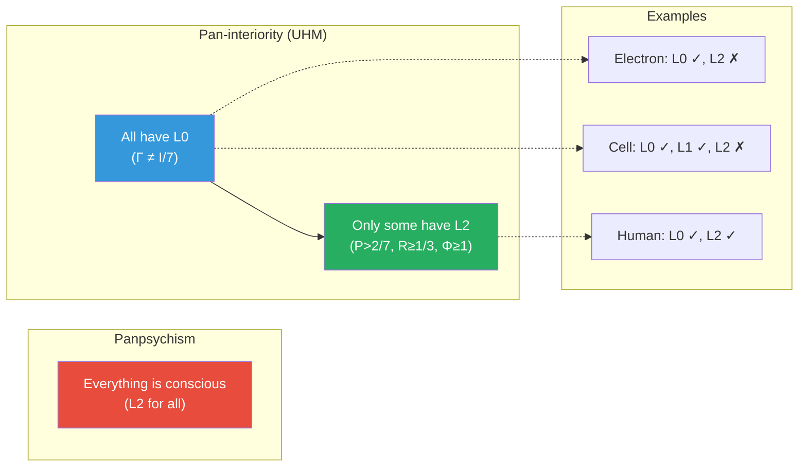
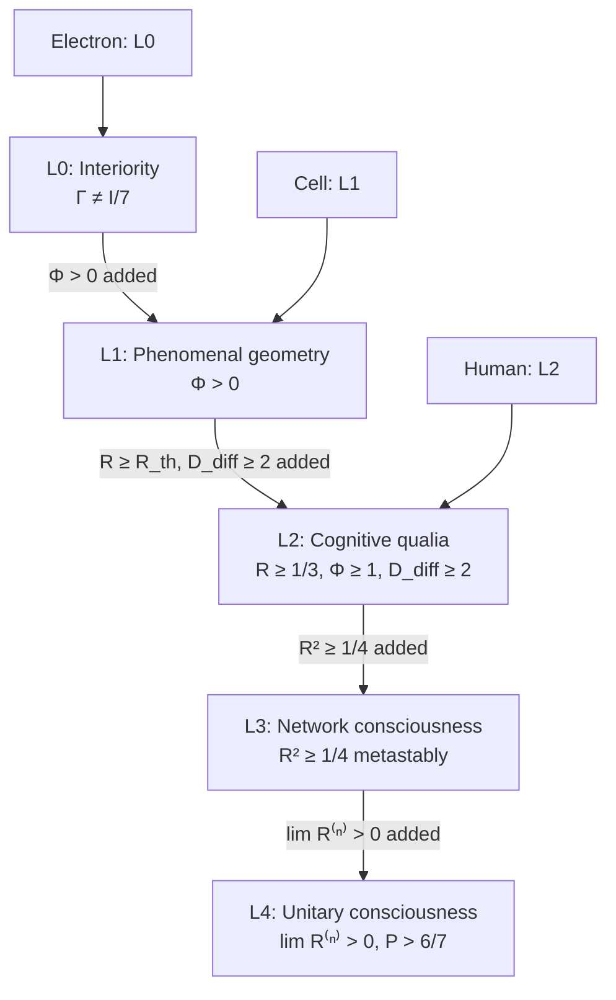

# Panpsychism: Categorical Analysis

:::info Who this chapter is for
You will learn how UHM's position (pan-interiority) differs from classical panpsychism and Hoffman's Conscious Realism. The analysis is conducted through the categorical apparatus: five ontological positions are compared as functors from the category $\mathbf{Hol}$ to the category of phenomenal properties.
:::

:::note About notation
In this document:
- $\Gamma$ — [coherence matrix](/docs/core/dynamics/coherence-matrix)
- $\varphi$ — [self-modelling operator](/docs/proofs/categorical/formalization-phi)
- $C$ — [consciousness measure](/docs/consciousness/foundations/self-observation#мера-сознательности-c)
- $\Phi$ — [integration measure](/docs/core/structure/dimension-u#мера-интеграции-φ)
- $R$ — [reflection measure](/docs/consciousness/foundations/self-observation#мера-рефлексии-r)
- $\rho_E$ — reduced density matrix of the [Interiority dimension](/docs/core/structure/dimension-e)
- L0, L1, L2, L3, L4 — [interiority levels](/docs/consciousness/hierarchy/interiority-hierarchy)
- $\mathbf{Hol}$ — [category of Holons](/docs/proofs/categorical/categorical-formalism)
:::

## The Strasbourg problem: where does consciousness come from? {#страсбургская-проблема}

In 1994 in Strasbourg, at the conference *Toward a Science of Consciousness*, David Chalmers posed a question that split the science of consciousness into two camps: **why do physical processes accompany subjective experience?** Why can a "zombie" not exist — a being physically identical to a human but devoid of inner experience?

This question — the hard problem of consciousness — generated three response strategies:

1. **Eliminativism** (Dennett): there is no problem, subjective experience is an illusion
2. **Emergentism** (IIT, GWT): consciousness emerges from complexity
3. **Panpsychism**: consciousness is fundamental — it **always existed**

Panpsychism is the most radical and most ancient of these strategies. Its idea is maximally simple: if consciousness cannot arise from non-conscious matter (since the mechanism is unclear), then consciousness is a **fundamental property**, inherent in all matter from the very beginning. An electron possesses mass, charge, spin — and, possibly, some elementary "inner experience".

The appeal of this position lies in bypassing the hard problem. If consciousness is fundamental, there is no need to explain how it "emerges" from physics. The problem, however, shifts: if an electron possesses experience, how does the electron's experience **combine** with the experience of other electrons into a unified human experience? This is the **combination problem** — the main difficulty of panpsychism.

---

## Definition of panpsychism

**Panpsychism** (from the Greek πᾶν — all, ψυχή — soul) is a metaphysical position:

$$
\forall X \in \mathrm{Ob}(\mathbf{Phys}) : \mathrm{Consciousness}(X) \neq \varnothing
$$

where $\mathbf{Phys}$ is the category of physical objects.

In ordinary language: **every** physical object possesses at least a minimal form of consciousness or proto-consciousness. A stone, an atom, a thermostat — all "experience something".

But this simple thesis splits into many incompatible positions: what exactly does "consciousness" mean? Full-fledged experience (as in humans) or something minimal? And how does the minimal become full-fledged? Below we consider the main variants.

---

## Variants of panpsychism {#варианты-панпсихизма}

### 1. Eliminative panpsychism (Strawson) {#элиминативный}

**Galen Strawson** (b. 1952, son of philosopher P.F. Strawson) in the article *Realistic Monism: Why Physicalism Entails Panpsychism* (2006) proposed a radical argument: if physicalism is true and consciousness is real, then consciousness must be a property of matter at the fundamental level. Strawson rejects emergentism as "magic" — in his view, a genuinely new quality cannot arise from that which does not possess that quality.

**Claim:** Everything possesses consciousness **in the full sense** (L2 in CC terminology).

**Category $\mathbf{Pan}_{\mathrm{elim}}$:**

$$
\mathrm{Ob}(\mathbf{Pan}_{\mathrm{elim}}) := \{X \mid C(X) > 0\}
$$

where $C$ is the [consciousness measure](/docs/consciousness/foundations/self-observation#мера-сознательности-c).

**Critique from UHM — formal refutation:**

$$
\exists X : \Gamma_X = I/7 \Rightarrow C(X) = 0
$$

The maximally mixed state ($\Gamma = I/7$ — the equiprobable superposition of all 7 dimensions) has **zero** consciousness. This is not a philosophical argument but a **mathematical fact**: for $\Gamma = I/7$, purity $P = 1/7$ < $P_{\text{crit}} = 2/7$, reflection $R = 0$, integration $\Phi = 0$. All thresholds are violated. A system with $\Gamma = I/7$ is **maximal chaos**, in which neither coherence, nor integration, nor self-modelling is possible.

**Conclusion:** Eliminative panpsychism **contradicts** the UHM formalism. Systems with zero consciousness exist. Not everything possesses experience. **[T]**

### 2. Constitutive panpsychism (Goff, Chalmers) {#конститутивный}

**Philip Goff** (b. 1977, Durham University) and **David Chalmers** (b. 1966, NYU) represent a more refined position: micro-subjects (elementary bearers of proto-experience) **combine** into macro-consciousness. Goff set this out in the book *Galileo's Error: Foundations for a New Science of Consciousness* (2019).

**Claim:** Micro-subjects exist, and their combination generates macro-consciousness.

**Category $\mathbf{Pan}_{\mathrm{const}}$:**

$$
\mathrm{Ob}(\mathbf{Pan}_{\mathrm{const}}) := \{(\{X_i\}, \oplus) \mid X_i \text{ — micro-subject}, \oplus \text{ — combination operation}\}
$$

**Combination problem:**

The central difficulty of constitutive panpsychism: there is no definition of the operation $\oplus$ such that:

$$
C(X_1 \oplus X_2) = f(C(X_1), C(X_2))
$$

for any function $f$. Why? Because the experience of the whole is **not reducible** to a function of the experiences of the parts. You see a red apple — but your experience of the "red apple" is not the sum of the experience of neuron-1 and the experience of neuron-2. Between individual proto-experiences and the unified macro-experience there is a **gap** that nobody has filled.

**UHM's approach to the combination problem:**

UHM proposes a concrete mechanism:

$$
\mathbb{H}_{1 \otimes 2} := (\Gamma_1 \otimes \Gamma_2, \varphi_{12})
$$

The operation is the **tensor product** with the condition of sufficient [integration](/docs/core/structure/dimension-u#мера-интеграции-φ):

$$
\Phi_{12} > \Phi_{\min} \Rightarrow C(\mathbb{H}_{12}) \neq f(C(\mathbb{H}_1), C(\mathbb{H}_2))
$$

[Emergence](/docs/applied/coherence-cybernetics/theorems#теорема-93-эмерджентность) [T] — a consequence of nonlinearity and primitivity.

:::warning Status: mathematical correlation, not philosophical solution
UHM provides the **condition** for emergence ($\Phi_{12} > \Phi_{\min}$), but does not explain the **constitution** — *how exactly* micro-experiences unite into a single experience. This is a mathematical reformulation of the problem, not its solution in the philosophical sense.
:::

#### Theorem (Categorical irreducibility of integrated experience) [T] {#теорема-нередуцируемость}

:::tip Theorem [T]
The functor $F: (\mathbf{Hol}, \otimes) \to (\mathbf{Exp}, \boxtimes)$ is **colax-monoidal but not monoidal** when $\Phi_{12} > 1$. Specifically: the coherence map $\mu: F(\Gamma_1 \otimes \Gamma_2) \to F(\Gamma_1) \boxtimes F(\Gamma_2)$ is **irreversible** when $\Phi_{12} > 1$.
:::

**What this means in plain terms.** If two holons are sufficiently integrated ($\Phi_{12} > 1$), the experience of the whole **cannot be recovered** from the experiences of the parts. Information about the unified experience **is lost** upon decomposition into parts. This is the **mathematical** analogue of the intuition: your experience of the "red apple" is not the sum of the experiences of individual neurons.

**Proof.**

**(a)** By definition of $F$, the experience of the composite $F(\Gamma_1 \otimes \Gamma_2) = (s_{12}, q_{12}, c_{12})$ is determined by the spectrum, qualities, and context of the **joint** matrix $\Gamma_1 \otimes \Gamma_2$.

**(b)** The product of experiences $F(\Gamma_1) \boxtimes F(\Gamma_2) = (s_1 \otimes s_2, q_1 \times q_2, (c_1, c_2))$ is the componentwise product.

**(c)** **Spectral non-coincidence.** The spectrum of $\Gamma_1 \otimes \Gamma_2$ in the presence of quantum correlations ($\Phi_{12} > 1$) **does not factorise**: $\mathrm{spec}(\Gamma_1 \otimes \Gamma_2) \neq \mathrm{spec}(\Gamma_1) \otimes \mathrm{spec}(\Gamma_2)$. This is the standard property of entangled states (Schmidt decomposition [T]).

**(d)** **Irreversibility.** The projection $\mu$ (partial trace) loses information about correlations. At $\Phi_{12} > 1$ the loss is strictly positive: $\Phi_{12} > 1 \Rightarrow P_{\text{coh}}^{(12)} > P_{\text{diag}}^{(12)}$ (T-129 [T]).

**(e)** **Colax-monoidality.** The existence of the irreversible projection $\mu$ makes $F$ a **colax-monoidal functor**. At $\Phi_{12} < 1$ the projection is reversible — $F$ is locally monoidal. $\blacksquare$

**Categorical formulation of the combination problem:** The combination problem = the question "is $F$ strictly monoidal?". UHM gives a precise answer: **no, when $\Phi > 1$** [T]. Integrated experience is irreducible to the product of the experiences of the parts.

:::info What has been resolved and what remains
- **Resolved [T]:** Emergence as irreversibility of the coherence map $\mu$
- **Resolved [T]:** Emergence threshold: $\Phi_{12} = 1$ (T-129a [T])
- **Open [P]:** Constitutive mechanism: *how exactly* the spectral irreducibility is **experienced** as unified experience. This is an analogue of the hard problem — UHM formalises the *condition* of emergence, not the *content* of the unified experience.
:::

### 3. Panprotopsychism (Chalmers)

**Chalmers** (2010, *The Character of Consciousness*) proposed a softened version: everything possesses not "experience" but "proto-mental" properties — something that is not itself consciousness, but under the right combination generates it.

**Analogy:** H₂O. Neither hydrogen nor oxygen is wet by itself. But their combination is wet. The "proto-wetness" of hydrogen + the "proto-wetness" of oxygen → the wetness of water. Analogously: the "proto-experience" of an electron + the "proto-experience" of another electron + the right combination → human experience.

**Category $\mathbf{Pan}_{\mathrm{proto}}$:**

$$
\mathrm{Ob}(\mathbf{Pan}_{\mathrm{proto}}) := \{X \mid \mathrm{Int}(X) \neq \varnothing, C(X) = 0\}
$$

**Correspondence in UHM — level L0:**

$$
\mathrm{L0}(\Gamma) := \Gamma \neq I/7 \quad \text{(interiority)}
$$

$$
\mathbf{Pan}_{\mathrm{proto}} \cong \mathrm{L0} \setminus \mathrm{L2}
$$

L0 is the **precise** formal analogue of panprotopsychism. A system at level L0 possesses "something inner" ($\Gamma \neq I/7$) but not consciousness ($C = 0$, since the L2 thresholds are not met).

### 4. Russellian monism (Russell, Strawson) {#расселианский}

**Bertrand Russell** in *The Analysis of Matter* (1927) pointed to a fundamental gap in physics: it describes only the **structural** properties of matter (mass, charge, spin), defined through relations with other objects. But what fills this structure **from within**? Physics is silent. Russell suggested: the inner nature of matter may be mental.

**Russell's category ($\mathbf{Russell}$):**

$$
\mathrm{Ob}(\mathbf{Russell}) := \{(S_{\mathrm{ext}}, I_{\mathrm{int}}) \mid S \text{ — structure}, I \text{ — intrinsic}\}
$$

**Correspondence in UHM:**

| Russell | UHM | Comment |
|---------|-----|---------|
| $S_{\mathrm{ext}}$ (structural properties) | Hamiltonian $H$, Lindblad operators $\{L_k\}$ | Physical laws = structure |
| $I_{\mathrm{int}}$ (inner nature) | [E-projection](/docs/core/structure/dimension-e) $\rho_E$ | Interiority = intrinsic |

**Functor:**

$$
F_{\mathrm{Russell}}: \mathbf{Russell} \to \mathbf{Hol}, \quad (S, I) \mapsto (\Gamma, \varphi)
$$

where $\Gamma$ is constructed from $S$ and $I$. Russellian monism is the **closest** metaphysical position to [two-aspect monism](/docs/consciousness/foundations/two-aspect-monism) of UHM.

---

## UHM's position: Pan-interiority {#панинтериоризм}

### Definition

UHM does not accept any form of panpsychism. Instead it proposes **pan-interiority** — a position according to which **all** systems with $\Gamma \neq I/7$ possess interiority (L0), but **not all** possess consciousness (L2).

:::warning Key distinction
UHM asserts **pan-interiority**, not panpsychism:

$$
\forall \Gamma \neq I/7 : \mathrm{L0}(\Gamma) = \mathrm{true}
$$

But **not**:

$$
\forall \Gamma : \mathrm{L2}(\Gamma) = \mathrm{true}
$$
:::

### Theorem (Pan-interiority ≠ Panpsychism)

$$
\mathrm{L0}(\Gamma) \not\Rightarrow \mathrm{L2}(\Gamma)
$$

**Proof:**

L2 requires $R \geq R_{\text{th}} = 1/3$ [T], $\Phi \geq \Phi_{\text{th}} = 1$ [T] (T-129) and $D_{\text{diff}} \geq 2$ [T] (T-151) ([L2 thresholds](/docs/core/foundations/axiom-septicity#пороги-l2-строгий-вывод)).

For the [fundamental mode Γ](/docs/reference/glossary#таксономия-конфигураций-γ) (e.g. an electron):

$$
R(\Gamma_e) \approx 0, \quad \Phi(\Gamma_e) \ll 1
$$

Consequently, $\mathrm{L0}(\Gamma_e) = \mathrm{true}$, but $\mathrm{L2}(\Gamma_e) = \mathrm{false}$. $\blacksquare$

### Hierarchy of interiority levels

---

## Hoffman's Conscious Realism {#хоффман}

### Biography and intellectual trajectory

**Donald D. Hoffman** (b. 1955) is a professor of cognitive science, philosophy, and logic at the University of California, Irvine (UC Irvine). He began his career with classical psychophysics of visual perception: his early works (1980s–2000s) are devoted to computational modelling of the perception of shape, colour, and objects.

The turning point was the recognition of a paradox: if evolution shapes perception, why should perception be **true**? Together with Chaitanya Prakash and Manish Singh, Hoffman formalised this question in the **"Fitness Beats Truth" theorem** (2009–2015), showing through evolutionary game models that organisms perceiving an "interface" (a compressed adaptive representation) systematically outcompete organisms with "true" perception.

From this result Hoffman arrived at a radical ontological position: space-time is not objective reality but a **user interface** of conscious agents.

:::warning Important classification
Hoffman **himself** rejects the label "panpsychist". His position is **objective idealism** (Conscious Realism): conscious agents are the only fundamental reality, and the physical world is a derivative of their interactions. This is closer to Leibniz (monadology) or Berkeley than to Strawson or Goff.
:::

### The "Fitness Beats Truth" Theorem (FBT) {#fbt}

**Claim** (Hoffman, Singh, Prakash 2015): In evolutionary games (Maynard Smith formalism) on typical fitness landscapes, organisms with the "interface" strategy (compression: many world states → one perceptual category) defeat organisms with "true perception" (isomorphism $W \to X$).

**In plain terms.** Imagine two organisms in a forest. The first sees the world "as it is" — distinguishes 1000 shades of green in the foliage. The second compresses: all edible things are green, all poisonous are red. The second makes decisions faster and spends fewer resources on computation. Evolution selects for **survival**, not **truth**. Hence: our perception of space-time is an adaptive interface, not a map of reality.

:::note Connection to CC
CC admits a similar interpretation [I]: the agent $\mathbb{H}$'s perception of its environment $E$ is mediated by [functor $F$](/docs/proofs/categorical/categorical-formalism#3-функтор-f-на-объектах), which need not be accurate — functional adequacy is sufficient. But CC does not postulate the illusoriness of space-time: it is [emergent](/docs/core/foundations/spacetime), not interfacial.
:::

### Full formalism: conscious agent

**Definition (Hoffman, Prakash 2014).** A conscious agent (CA) is a sextuple:

$$
C = (X, G, A, W, D, N)
$$

| Component | Description | Example |
|-----------|-------------|---------|
| $X$ (experience) | All possible experiences of the agent | Colours, sounds, emotions |
| $G$ (actions) | All available actions | Movements, decisions |
| $A: G \times W \to W$ | Action $g$ in world $w$ → new world state | Pressing a button changes the screen |
| $W$ (world) | World states (can be another agent!) | Surrounding environment |
| $D: X \times G \to G$ | Experience → decision (choice of action) | You see danger → you run |
| $N: W \times X \to X$ | World state → experience | Photons → "red" |

Key idea: $W$ need not be the "physical world". For two agents $C_1$ and $C_2$, the world of each is **the other agent**. Physical space-time is the **emergent interface** of a network of interacting agents.

### Composition of conscious agents {#композиция-ca}

**Closure theorem** (Hoffman, Prakash 2014): For any two CAs $C_1$ and $C_2$, their interaction forms a new CA: $C_1 \otimes C_2 = C_{12}$.

This means that **ConsAgents** is a monoidal category. Hoffman interprets this as the principle "conscious agents are all there is".

:::note Parallel with CC
In CC [theorem 9.1](/docs/applied/coherence-cybernetics/theorems#теорема-91-фрактальное-замыкание) (fractal closure) gives an analogous result: $\mathbb{H}_1 \otimes \mathbb{H}_2$ is again a holon, provided sufficient integration $\Phi_{12} > 1$. But in CC the closure is **strictly proven** and has a **quantitative threshold**, whereas in Hoffman closure is postulated axiomatically.
:::

### CC's position: pan-interiority vs objective idealism {#панинтериоризм-vs-идеализм}

Hoffman and CC diverge on a key ontological question:

| | Hoffman (Conscious Realism) | CC (Pan-interiority) |
|---|---|---|
| **What is fundamental?** | Only conscious agents | Holons $\mathbb{H}$ at all levels L0–L4 |
| **Is there a non-conscious reality?** | No — everything reduces to CA | Yes — L0 (interiority) without consciousness (L2) |
| **Relation of L0 and L2** | L0 = L2 (everything is conscious) | L0 $\supsetneq$ L2 strictly [T] |
| **Physical world** | Illusion (interface) | Emergent (real but derivative) |
| **Consciousness threshold** | No threshold (everything is CA) | $P > 2/7 \wedge R \geq 1/3 \wedge \Phi \geq 1 \wedge D \geq 2$ [T] |
| **Dynamics** | Cycle $N \to D \to A$ (discrete) | $\dot\Gamma = \mathcal{L}_\Omega[\Gamma]$ (continuous) |
| **Falsifiability** | Low (no quantitative predictions) | High (22+ predictions) |

### Functor $F_{\text{Hoffman}}$ (hypothesis) [I] {#функтор-хоффман}

**Functor construction** $F_{\text{Hoffman}}: \mathbf{Hol}_{\text{L2}} \to \mathbf{ConsAgents}$:

| CA component | Correspondence in CC |
|--------------|----------------------|
| $X$ (experience) | [Experiential space](/docs/proofs/categorical/categorical-formalism#2-категория-exp) |
| $G$ (actions) | Space of CPTP channels $\{\Psi\}$ |
| $N$ (perception) | [Functor $F$](/docs/proofs/categorical/categorical-formalism#3-функтор-f-на-объектах) |
| $D$ (decision) | [Operator $\varphi$](/docs/proofs/categorical/formalization-phi) |
| $A$ (action) | [Regenerative term](/docs/core/dynamics/evolution#3-регенеративный-член) $\mathcal{R}[\Gamma, E]$ |
| $W$ (world) | Environment $E$ in $\mathbb{H}$ |

:::info Status [I]
The functor $F_{\text{Hoffman}}$ is an **interpretational hypothesis**. For a full proof of equivalence it is necessary to show completeness, faithfulness, and compatibility with composition. This is a **research programme**.
:::

### What Hoffman does better than CC {#преимущества-хоффмана}

1. **Evolutionary epistemology.** FBT is a strictly proven theorem providing deep grounds for scepticism towards naïve realism. CC has no analogue of this result.

2. **Accessibility of exposition.** *The Case Against Reality* (2019) is a bestseller; TED talk with 3M+ views. CC is currently accessible only to specialists.

3. **Radicality of the question.** Hoffman poses the question "what if space-time is not reality?" with maximum sharpness.

4. **Mathematical elegance.** The six-component CA is minimal and convenient for combinatorics.

---

## Comparative table of panpsychism variants

| Variant | Author | Year | Claim | Correspondence in UHM | Main problem |
|---------|--------|------|-------|----------------------|--------------|
| Eliminative | Strawson | 2006 | Everything is conscious (L2) | — | Contradicts $\Gamma = I/7 \Rightarrow C = 0$ [T] |
| Constitutive | Goff, Chalmers | 2010/2019 | Micro-subjects combine | $\mathbb{H}_1 \otimes \mathbb{H}_2$ | Combination problem (reformulated, not solved) |
| Panprotopsychism | Chalmers | 2010 | Proto-mental properties | L0 — interiority | No mechanism for L0→L2 transition |
| Russellian | Russell, Chalmers, Goff | 1927/2010 | Intrinsic + structure | $\rho_E$ + $(H, \{L_k\})$ | No dynamics |
| Obj. idealism | Hoffman | 2014 | Only CA, physics is interface | Functor [I] | No thresholds, low falsifiability |
| **Pan-interiority (UHM)** | — | — | All have L0, not all have L2 | $\mathrm{L0} \supsetneq \mathrm{L2}$ | Interiority is a primitive; does not explain *why* it exists |

---

**Related documents:**
- [Anokhin's Cognitome](./cognitome-anokhin) — neural hypernetwork and the "Who" problem
- [Theories of Consciousness](./consciousness-theories) — IIT, FEP, autopoiesis and 30+ theories
- [Cognitive Hierarchy](./cognitive-hierarchy) — K1-K5 levels
- [General Systems Theory](./general-systems-theory) — from Bertalanffy to CC
- [Interiority Hierarchy](/docs/consciousness/hierarchy/interiority-hierarchy) — L0→L4 levels
- [Two-Aspect Monism](/docs/consciousness/foundations/two-aspect-monism) — UHM ontology
- [Theorems](/docs/applied/coherence-cybernetics/theorems) — emergence, composition
- [Categorical Formalism](/docs/proofs/categorical/categorical-formalism) — category $\mathbf{Hol}$, functor $F$
- [Formalisation of φ](/docs/proofs/categorical/formalization-phi) — CPTP channels
- [Glossary](/docs/reference/glossary#связанные-теории) — Conscious Realism
