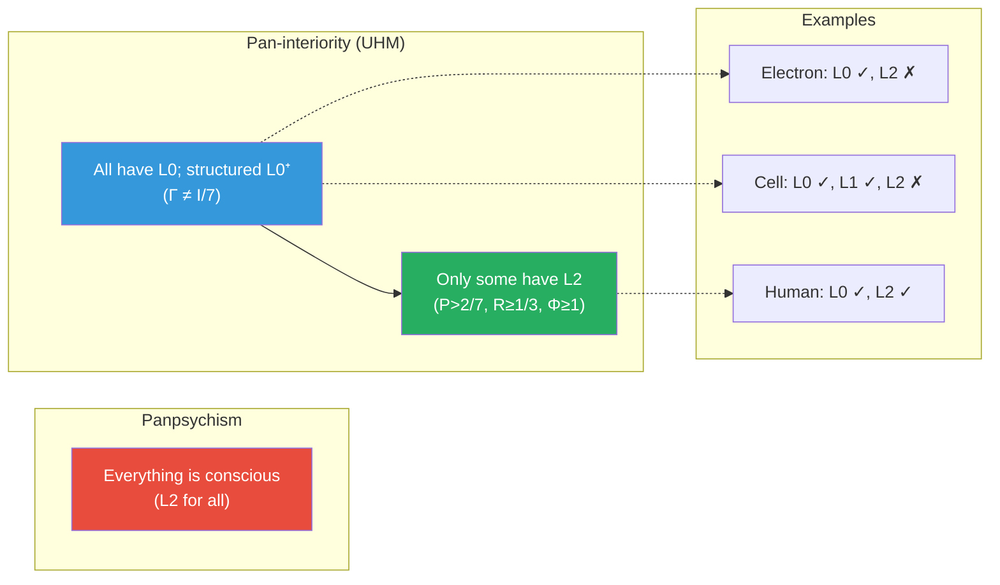
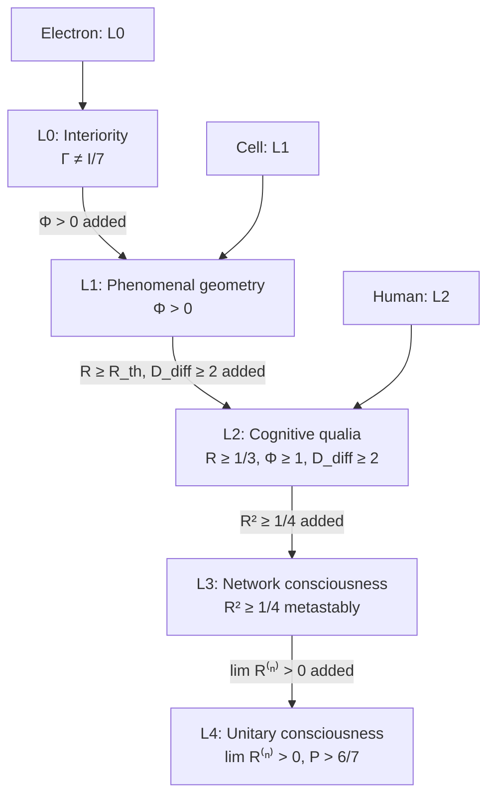

# Panpsychism: Categorical Analysis

:::info Who this chapter is for
You will learn how UHM's position (pan-interiority) differs from classical panpsychism and Hoffman's Conscious Realism. The analysis is conducted through the categorical apparatus: five ontological positions are compared as functors from the category $\mathbf{Hol}$ to the category of phenomenal properties.
:::

:::note About notation
In this document:
- $\Gamma$ — [coherence matrix](/docs/core/dynamics/coherence-matrix)
- $\varphi$ — [self-modelling operator](/docs/proofs/categorical/formalization-phi)
- $C$ — [consciousness measure](/docs/consciousness/foundations/self-observation#мера-сознательности-c)
- $\Phi$ — [integration measure](/docs/core/structure/dimension-u#мера-интеграции-φ)
- $R$ — [reflection measure](/docs/consciousness/foundations/self-observation#мера-рефлексии-r)
- $\rho_E$ — reduced density matrix of the [Interiority dimension](/docs/core/structure/dimension-e)
- L0, L1, L2, L3, L4 — [interiority levels](/docs/consciousness/hierarchy/interiority-hierarchy)
- $\mathbf{Hol}$ — [category of Holons](/docs/proofs/categorical/categorical-formalism)
:::

## The Strasbourg problem: where does consciousness come from? {#страсбургская-проблема}

In 1994 in Strasbourg, at the conference *Toward a Science of Consciousness*, David Chalmers posed a question that split the science of consciousness into two camps: **why do physical processes accompany subjective experience?** Why can a "zombie" not exist — a being physically identical to a human but devoid of inner experience?

This question — the hard problem of consciousness — generated three response strategies:

1. **Eliminativism** (Dennett): there is no problem, subjective experience is an illusion
2. **Emergentism** (IIT, GWT): consciousness emerges from complexity
3. **Panpsychism**: consciousness is fundamental — it **always existed**

Panpsychism is the most radical and most ancient of these strategies. Its idea is maximally simple: if consciousness cannot arise from non-conscious matter (since the mechanism is unclear), then consciousness is a **fundamental property**, inherent in all matter from the very beginning. An electron possesses mass, charge, spin — and, possibly, some elementary "inner experience".

The appeal of this position lies in bypassing the hard problem. If consciousness is fundamental, there is no need to explain how it "emerges" from physics. The problem, however, shifts: if an electron possesses experience, how does the electron's experience **combine** with the experience of other electrons into a unified human experience? This is the **combination problem** — the main difficulty of panpsychism.

---

## Definition of panpsychism

**Panpsychism** (from the Greek πᾶν — all, ψυχή — soul) is a metaphysical position:

$$
\forall X \in \mathrm{Ob}(\mathbf{Phys}) : \mathrm{Consciousness}(X) \neq \varnothing
$$

where $\mathbf{Phys}$ is the category of physical objects.

In ordinary language: **every** physical object possesses at least a minimal form of consciousness or proto-consciousness. A stone, an atom, a thermostat — all "experience something".

But this simple thesis splits into many incompatible positions: what exactly does "consciousness" mean? Full-fledged experience (as in humans) or something minimal? And how does the minimal become full-fledged? Below we consider the main variants.

---

## Variants of panpsychism {#варианты-панпсихизма}

### 1. Eliminative panpsychism (Strawson) {#элиминативный}

**Galen Strawson** (b. 1952, son of philosopher P.F. Strawson) in the article *Realistic Monism: Why Physicalism Entails Panpsychism* (2006) proposed a radical argument: if physicalism is true and consciousness is real, then consciousness must be a property of matter at the fundamental level. Strawson rejects emergentism as "magic" — in his view, a genuinely new quality cannot arise from that which does not possess that quality.

**Claim:** Everything possesses consciousness **in the full sense** (L2 in CC terminology).

**Category $\mathbf{Pan}_{\mathrm{elim}}$:**

$$
\mathrm{Ob}(\mathbf{Pan}_{\mathrm{elim}}) := \{X \mid C(X) > 0\}
$$

where $C$ is the [consciousness measure](/docs/consciousness/foundations/self-observation#мера-сознательности-c).

**Critique from UHM — formal refutation:**

$$
\exists X : \Gamma_X = I/7 \Rightarrow C(X) = 0
$$

The maximally mixed state ($\Gamma = I/7$ — the equal-weight mixture of all 7 dimensions) has **zero** consciousness. This is not a philosophical argument but a **mathematical fact**: for $\Gamma = I/7$, purity $P = 1/7 < P_{\text{crit}} = 2/7$ and integration $\Phi = 0$, so $C = \Phi \times R = 0$. (Formally the reflection measure here is $R = 1/(7P) = 1$; the [interiority hierarchy](/docs/consciousness/hierarchy/interiority-hierarchy#уровень-0-интериорность-interiority) calls this value an artefact of the trivial self-model at $P = 1/7$. The purity and integration thresholds are violated; the reflection threshold is met only trivially.) A system with $\Gamma = I/7$ is **maximal chaos**, in which neither coherence, nor integration, nor self-modelling is possible.

**Conclusion:** Eliminative panpsychism **contradicts** the UHM formalism. Systems with zero consciousness exist. Not everything possesses experience. **[T]**

:::warning Correction: the thesis refuted above is not Strawson's
Galen Strawson ("Realistic monism: why physicalism entails panpsychism", *Journal of Consciousness Studies* 13(10–11): 3–31, 2006) argues that a physicalist who takes experience to be real must accept *micropsychism* — "at least some ultimates are intrinsically experience-involving" — and, since he would "bet a lot against there being such radical heterogeneity at the very bottom of things", that all of them are. He explicitly rejects the thesis this section attributes to him: "Panpsychism certainly does not require one to hold the view that things like stones and tables are subjects of experience — I don't believe this for a moment". He ascribes no reasoning or reflection (L2) to ultimates, and he names William James's objection to many subjects composing one larger subject as the problem he has to face. Two consequences [I]: (1) the refutation above refutes "everything is L2", a thesis no contemporary panpsychist defends; against Strawson's actual thesis — every ultimate has an experiential aspect, composites need not be subjects — UHM's universal L0 with a threshold for L2 is a near relative, not a refutation; (2) "eliminative" is this page's label, not Strawson's: he calls his position realistic monism, or real physicalism.
:::

### 2. Constitutive panpsychism (Goff, Chalmers) {#конститутивный}

**Philip Goff** (b. 1977, Durham University) and **David Chalmers** (b. 1966, NYU) represent a more refined position: micro-subjects (elementary bearers of proto-experience) **combine** into macro-consciousness. Goff set this out in the book *Galileo's Error: Foundations for a New Science of Consciousness* (2019).

**Claim:** Micro-subjects exist, and their combination generates macro-consciousness.

**Category $\mathbf{Pan}_{\mathrm{const}}$:**

$$
\mathrm{Ob}(\mathbf{Pan}_{\mathrm{const}}) := \{(\{X_i\}, \oplus) \mid X_i \text{ — micro-subject}, \oplus \text{ — combination operation}\}
$$

**Combination problem:**

The central difficulty of constitutive panpsychism: there is no definition of the operation $\oplus$ such that:

$$
C(X_1 \oplus X_2) = f(C(X_1), C(X_2))
$$

for any function $f$. Why? Because the experience of the whole is **not reducible** to a function of the experiences of the parts. You see a red apple — but your experience of the "red apple" is not the sum of the experience of neuron-1 and the experience of neuron-2. Between individual proto-experiences and the unified macro-experience there is a **gap** that nobody has filled.

**UHM's approach to the combination problem:**

UHM proposes a concrete mechanism:

$$
\mathbb{H}_{1 \otimes 2} := (\Gamma_1 \otimes \Gamma_2, \varphi_{12})
$$

The operation is the **tensor product** with the condition of sufficient [integration](/docs/core/structure/dimension-u#мера-интеграции-φ):

$$
\Phi_{12} > \Phi_{\min} \Rightarrow C(\mathbb{H}_{12}) \neq f(C(\mathbb{H}_1), C(\mathbb{H}_2))
$$

[Emergence](/docs/applied/coherence-cybernetics/theorems#теорема-93-эмерджентность) [T] — a consequence of nonlinearity and primitivity.

:::warning Status: mathematical correlation, not philosophical solution
UHM provides the **condition** for emergence ($\Phi_{12} > \Phi_{\min}$), but does not explain the **constitution** — *how exactly* micro-experiences unite into a single experience. This is a mathematical reformulation of the problem, not its solution in the philosophical sense.
:::

#### Theorem (Categorical irreducibility of integrated experience) [T] {#теорема-нередуцируемость}

:::tip Theorem [T]
The functor $F: (\mathbf{Hol}, \otimes) \to (\mathbf{Exp}, \boxtimes)$ is **colax-monoidal but not monoidal** when $\Phi_{12} > 1$. Specifically: the coherence map $\mu: F(\Gamma_1 \otimes \Gamma_2) \to F(\Gamma_1) \boxtimes F(\Gamma_2)$ is **irreversible** when $\Phi_{12} > 1$.
:::

**What this means in plain terms.** If two holons are sufficiently integrated ($\Phi_{12} > 1$), the experience of the whole **cannot be recovered** from the experiences of the parts. Information about the unified experience **is lost** upon decomposition into parts. This is the **mathematical** analogue of the intuition: your experience of the "red apple" is not the sum of the experiences of individual neurons.

**Proof.**

**(a)** By definition of $F$, the experience of the composite $F(\Gamma_1 \otimes \Gamma_2) = (s_{12}, q_{12}, c_{12})$ is determined by the spectrum, qualities, and context of the **joint** matrix $\Gamma_1 \otimes \Gamma_2$.

**(b)** The product of experiences $F(\Gamma_1) \boxtimes F(\Gamma_2) = (s_1 \otimes s_2, q_1 \times q_2, (c_1, c_2))$ is the componentwise product.

**(c)** **Spectral non-coincidence.** The spectrum of $\Gamma_1 \otimes \Gamma_2$ in the presence of quantum correlations ($\Phi_{12} > 1$) **does not factorise**: $\mathrm{spec}(\Gamma_1 \otimes \Gamma_2) \neq \mathrm{spec}(\Gamma_1) \otimes \mathrm{spec}(\Gamma_2)$. This is the standard property of entangled states (Schmidt decomposition [T]).

**(d)** **Irreversibility.** The projection $\mu$ (partial trace) loses information about correlations. At $\Phi_{12} > 1$ the loss is strictly positive: $\Phi_{12} > 1 \Rightarrow P_{\text{coh}}^{(12)} > P_{\text{diag}}^{(12)}$ (T-129 [T]).

**(e)** **Colax-monoidality.** The existence of the irreversible projection $\mu$ makes $F$ a **colax-monoidal functor**. At $\Phi_{12} < 1$ the projection is reversible — $F$ is locally monoidal. $\blacksquare$

:::warning Correction (2026-09-25): as stated, this theorem does not hold
The composite in the statement is written $\Gamma_1 \otimes \Gamma_2$ — a product state. For a product the spectrum does factorise (the eigenvalues of $A \otimes B$ are the products $\lambda_i \mu_j$), the partial traces return $\Gamma_1$ and $\Gamma_2$ exactly, and the mutual information is zero; step (c) fails. Nor is $\Phi_{12} > 1$ a mark of correlation. If $\Phi_{12}$ is the integration measure of the joint $49 \times 49$ matrix (the page defines no other), then purity and diagonal purity are both multiplicative on products, and the identity $P = P_{\text{diag}}(1 + \Phi)$ gives

$$
1 + \Phi(\Gamma_1 \otimes \Gamma_2) = (1 + \Phi_1)(1 + \Phi_2).
$$

Two uncorrelated holons with $\Phi_1 = \Phi_2 = 1$ therefore have $\Phi_{12} = 3$ with nothing shared between them. (Checked numerically on three random pairs of $7 \times 7$ states: the identity holds to machine precision, the spectra factorise, $|I(1{:}2)| \leq 10^{-15}$.) The same holds for the condition $\Phi_{12} > \Phi_{\min}$ in "UHM's approach to the combination problem" above: a product of two conscious holons satisfies it automatically. The statement can be repaired only by replacing the product with a correlated joint state $\rho_{12} \neq \rho_1 \otimes \rho_2$; "$\mu$ is irreversible" then says that the marginals do not determine the joint state. That is [CC-7](/docs/applied/coherence-cybernetics/theorems#теорема-93-эмерджентность) [T], $I(\mathbb{H}_1 : \mathbb{H}_2) > 0$, and it holds for every correlated pair, classically correlated ones included. What this does and does not show about the combination problem is assessed [below](#что-отвечает-аппарат-угм).
:::

**Categorical formulation of the combination problem:** The combination problem = the question "is $F$ strictly monoidal?". UHM gives a precise answer: **no, when $\Phi > 1$** [T] — as stated; see the correction above. Integrated experience is irreducible to the product of the experiences of the parts.

:::info What has been resolved and what remains
- **Resolved [T]:** Emergence as irreversibility of the coherence map $\mu$
- **Resolved [T]:** Emergence threshold: $\Phi_{12} = 1$ (T-129a [T])
- **Open [P]:** Constitutive mechanism: *how exactly* the spectral irreducibility is **experienced** as unified experience. This is an analogue of the hard problem — UHM formalises the *condition* of emergence, not the *content* of the unified experience.
- **Correction (2026-09-25):** the two "resolved" lines rest on the theorem corrected above. The value $\Phi_{12} = 1$ is not an emergence threshold for composites — a product of two L2 holons already has $\Phi_{12} \geq 3$ — and T-129a [T] concerns single states. What stands is CC-7 [T]: a correlated composite has a joint state that its parts do not fix.
:::

### 3. Panprotopsychism (Chalmers)

**Chalmers** (2010, *The Character of Consciousness*) proposed a softened version: everything possesses not "experience" but "proto-mental" properties — something that is not itself consciousness, but under the right combination generates it.

**Analogy:** H₂O. Neither hydrogen nor oxygen is wet by itself. But their combination is wet. The "proto-wetness" of hydrogen + the "proto-wetness" of oxygen → the wetness of water. Analogously: the "proto-experience" of an electron + the "proto-experience" of another electron + the right combination → human experience.

**Category $\mathbf{Pan}_{\mathrm{proto}}$:**

$$
\mathrm{Ob}(\mathbf{Pan}_{\mathrm{proto}}) := \{X \mid \mathrm{Int}(X) \neq \varnothing, C(X) = 0\}
$$

**Correspondence in UHM — level L0:**

By the [canonical definition](/docs/consciousness/hierarchy/interiority-hierarchy#уровень-0-интериорность-interiority) **[D]**, L0 is universal — every system with $\Gamma \in \mathcal{D}(\mathcal{H})$ possesses an inner aspect. What panprotopsychism tracks is its **structured** (non-degenerate) case:

$$
\mathrm{L0}^{+}(\Gamma) := \Gamma \neq I/7 \quad \text{(structured interiority)}
$$

$$
\mathbf{Pan}_{\mathrm{proto}} \cong \mathrm{L0}^{+} \setminus \mathrm{L2}
$$

L0⁺ is the **precise** formal analogue of panprotopsychism. A system at level L0⁺ possesses "something inner" with structure ($\Gamma \neq I/7$) but not consciousness ($C = 0$, since the L2 thresholds are not met); the degenerate $I/7$ retains bare interiority under the canonical definition while carrying zero structure and zero consciousness ($C(I/7) = 0$ **[T]**).

### 4. Russellian monism (Russell, Strawson) {#расселианский}

**Bertrand Russell** in *The Analysis of Matter* (1927) pointed to a fundamental gap in physics: it describes only the **structural** properties of matter (mass, charge, spin), defined through relations with other objects. But what fills this structure **from within**? Physics is silent. Russell suggested: the inner nature of matter may be mental.

**Russell's category ($\mathbf{Russell}$):**

$$
\mathrm{Ob}(\mathbf{Russell}) := \{(S_{\mathrm{ext}}, I_{\mathrm{int}}) \mid S \text{ — structure}, I \text{ — intrinsic}\}
$$

**Correspondence in UHM:**

| Russell | UHM | Comment |
|---------|-----|---------|
| $S_{\mathrm{ext}}$ (structural properties) | Hamiltonian $H$, Lindblad operators $\{L_k\}$ | Physical laws = structure |
| $I_{\mathrm{int}}$ (inner nature) | [E-projection](/docs/core/structure/dimension-e) $\rho_E$ | Interiority = intrinsic |

**Functor:**

$$
F_{\mathrm{Russell}}: \mathbf{Russell} \to \mathbf{Hol}, \quad (S, I) \mapsto (\Gamma, \varphi)
$$

where $\Gamma$ is constructed from $S$ and $I$. Russellian monism is the **closest** metaphysical position to [two-aspect monism](/docs/consciousness/foundations/two-aspect-monism) of UHM.

---

## UHM's position: Pan-interiority {#панинтериоризм}

### Definition

UHM does not accept any form of panpsychism. Instead it proposes **pan-interiority** — a position according to which **every** system possesses interiority (L0 is universal by the [canonical definition](/docs/consciousness/hierarchy/interiority-hierarchy#уровень-0-интериорность-interiority)), every system with $\Gamma \neq I/7$ possesses structured interiority (L0⁺), but **not all** possess consciousness (L2).

:::warning Key distinction
UHM asserts **pan-interiority**, not panpsychism:

$$
\forall \Gamma \neq I/7 : \mathrm{L0}^{+}(\Gamma) = \mathrm{true}
$$

But **not**:

$$
\forall \Gamma : \mathrm{L2}(\Gamma) = \mathrm{true}
$$
:::

```mermaid
graph LR
    subgraph "Panpsychism"
        direction TB
        ALL_CONS["Everything is conscious<br/>(L2 for all)"]
    end

    subgraph "Pan-interiority (UHM)"
        direction TB
        ALL_L0["All have L0; structured L0⁺<br/>(Γ ≠ I/7)"]
        SOME_L2["Only some have L2<br/>(P>2/7, R≥1/3, Φ≥1)"]
        ALL_L0 --> SOME_L2
    end

    subgraph "Examples"
        ELEC["Electron: L0 ✓, L2 ✗"]
        CELL["Cell: L0 ✓, L1 ✓, L2 ✗"]
        HUMAN["Human: L0 ✓, L2 ✓"]
    end

    ALL_L0 -.-> ELEC
    ALL_L0 -.-> CELL
    SOME_L2 -.-> HUMAN

    style ALL_CONS fill:#e74c3c,color:#fff
    style ALL_L0 fill:#3498db,color:#fff
    style SOME_L2 fill:#27ae60,color:#fff
```

### Theorem (Pan-interiority ≠ Panpsychism)

$$
\mathrm{L0}(\Gamma) \not\Rightarrow \mathrm{L2}(\Gamma)
$$

**Proof:**

L2 requires $R \geq R_{\text{th}} = 1/3$ [T], $\Phi \geq \Phi_{\text{th}} = 1$ [T] (T-129) and $D_{\text{diff}} \geq 2$ [T] (T-151) ([L2 thresholds](/docs/core/foundations/axiom-septicity#пороги-l2-строгий-вывод)).

For the [fundamental mode Γ](/docs/reference/glossary#таксономия-конфигураций-γ) (e.g. an electron):

$$
\Phi(\Gamma_e) \ll 1 \quad (\text{while } R(\Gamma_e) = 1/(7P) \approx 1 \text{ is a formal artefact at } P \approx 1/7)
$$

Consequently, $\mathrm{L0}(\Gamma_e) = \mathrm{true}$, but $\mathrm{L2}(\Gamma_e) = \mathrm{false}$: the integration threshold fails. (An earlier edition gave $R(\Gamma_e) \approx 0$; that value is retracted, since $R = 1/(7P) \geq 1/7$ for every state and is close to $1$ near $I/7$, as the [interiority hierarchy](/docs/consciousness/hierarchy/interiority-hierarchy#уровень-0-интериорность-interiority) notes for the electron.) $\blacksquare$

### Hierarchy of interiority levels

```mermaid
graph TD
    L0[L0: Interiority<br/>Γ ≠ I/7]
    L1[L1: Phenomenal geometry<br/>Φ > 0]
    L2[L2: Cognitive qualia<br/>R ≥ 1/3, Φ ≥ 1, D_diff ≥ 2]
    L3[L3: Network consciousness<br/>R² ≥ 1/4 metastably]
    L4[L4: Unitary consciousness<br/>lim R⁽ⁿ⁾ > 0, P > 6/7]

    L0 -->|"Φ > 0 added"| L1
    L1 -->|"R ≥ R_th, D_diff ≥ 2 added"| L2
    L2 -->|"R² ≥ 1/4 added"| L3
    L3 -->|"lim R⁽ⁿ⁾ > 0 added"| L4

    ELEC[Electron: L0] --> L0
    CELL[Cell: L1] --> L1
    HUMAN[Human: L2] --> L2
```

---

## Hoffman's Conscious Realism {#хоффман}

### Biography and intellectual trajectory

**Donald D. Hoffman** (b. 1955) is a professor of cognitive science, philosophy, and logic at the University of California, Irvine (UC Irvine). He began his career with classical psychophysics of visual perception: his early works (1980s–2000s) are devoted to computational modelling of the perception of shape, colour, and objects.

The turning point was the recognition of a paradox: if evolution shapes perception, why should perception be **true**? Together with Chetan Prakash and Manish Singh, Hoffman formalised this question in the **"Fitness Beats Truth" theorem** (2009–2015), showing through evolutionary game models that organisms perceiving an "interface" (a compressed adaptive representation) systematically outcompete organisms with "true" perception.

From this result Hoffman arrived at a radical ontological position: space-time is not objective reality but a **user interface** of conscious agents.

:::warning Important classification
Hoffman **himself** rejects the label "panpsychist". His position is **objective idealism** (Conscious Realism): conscious agents are the only fundamental reality, and the physical world is a derivative of their interactions. This is closer to Leibniz (monadology) or Berkeley than to Strawson or Goff.
:::

### The "Fitness Beats Truth" Theorem (FBT) {#fbt}

**Claim** (Hoffman, Singh, Prakash 2015): In evolutionary games (Maynard Smith formalism) on typical fitness landscapes, organisms with the "interface" strategy (compression: many world states → one perceptual category) defeat organisms with "true perception" (isomorphism $W \to X$).

**In plain terms.** Imagine two organisms in a forest. The first sees the world "as it is" — distinguishes 1000 shades of green in the foliage. The second compresses: all edible things are green, all poisonous are red. The second makes decisions faster and spends fewer resources on computation. Evolution selects for **survival**, not **truth**. Hence: our perception of space-time is an adaptive interface, not a map of reality.

:::note Connection to CC
CC admits a similar interpretation [I]: the agent $\mathbb{H}$'s perception of its environment $E$ is mediated by [functor $F$](/docs/proofs/categorical/categorical-formalism#3-функтор-f-на-объектах), which need not be accurate — functional adequacy is sufficient. But CC does not postulate the illusoriness of space-time: it is [emergent](/docs/core/foundations/spacetime), not interfacial.
:::

### Full formalism: conscious agent

**Definition (Hoffman, Prakash 2014).** A conscious agent (CA) is a sextuple:

$$
C = (X, G, A, W, D, N)
$$

| Component | Description | Example |
|-----------|-------------|---------|
| $X$ (experience) | All possible experiences of the agent | Colours, sounds, emotions |
| $G$ (actions) | All available actions | Movements, decisions |
| $A: G \times W \to W$ | Action $g$ in world $w$ → new world state | Pressing a button changes the screen |
| $W$ (world) | World states (can be another agent!) | Surrounding environment |
| $D: X \times G \to G$ | Experience → decision (choice of action) | You see danger → you run |
| $N: W \times X \to X$ | World state → experience | Photons → "red" |

Key idea: $W$ need not be the "physical world". For two agents $C_1$ and $C_2$, the world of each is **the other agent**. Physical space-time is the **emergent interface** of a network of interacting agents.

### Composition of conscious agents {#композиция-ca}

**Closure theorem** (Hoffman, Prakash 2014): For any two CAs $C_1$ and $C_2$, their interaction forms a new CA: $C_1 \otimes C_2 = C_{12}$.

This means that **ConsAgents** is a monoidal category. Hoffman interprets this as the principle "conscious agents are all there is".

:::note Parallel with CC
In CC [theorem 9.1](/docs/applied/coherence-cybernetics/theorems#теорема-91-фрактальное-замыкание) (fractal closure) gives an analogous result: $\mathbb{H}_1 \otimes \mathbb{H}_2$ is again a holon. The difference is not "proved versus postulated": Hoffman and Prakash ("Objects of consciousness", *Frontiers in Psychology* 5: 577, 2014) prove their two join theorems — an undirected and a directed join of two conscious agents is again a conscious agent — by construction, in a section titled "The combination problem". The difference is that CC's closure carries a dynamics and a threshold, and that its status is split: the composite has a non-trivial attractor (T-96 [T]), while its viability is conditional (registry entry CC-5, [C]). The integration condition $\Phi_{12} > 1$ once quoted here is no mark of integration between the parts — see the [correction](#теорема-нередуцируемость) in §2.
:::

### CC's position: pan-interiority vs objective idealism {#панинтериоризм-vs-идеализм}

Hoffman and CC diverge on a key ontological question:

| | Hoffman (Conscious Realism) | CC (Pan-interiority) |
|---|---|---|
| **What is fundamental?** | Only conscious agents | Holons $\mathbb{H}$ at all levels L0–L4 |
| **Is there a non-conscious reality?** | No — everything reduces to CA | Yes — L0 (interiority) without consciousness (L2) |
| **Relation of L0 and L2** | L0 = L2 (everything is conscious) | L0 $\supsetneq$ L2 strictly [T] |
| **Physical world** | Illusion (interface) | Emergent (real but derivative) |
| **Consciousness threshold** | No threshold (everything is CA) | $P > 2/7 \wedge R \geq 1/3 \wedge \Phi \geq 1 \wedge D \geq 2$ [T] |
| **Dynamics** | Cycle $N \to D \to A$ (discrete) | $\dot\Gamma = \mathcal{L}_\Omega[\Gamma]$ (continuous) |
| **Falsifiability** | Low (no quantitative predictions) | High (22+ predictions) |

### Functor $F_{\text{Hoffman}}$ (hypothesis) [I] {#функтор-хоффман}

**Functor construction** $F_{\text{Hoffman}}: \mathbf{Hol}_{\text{L2}} \to \mathbf{ConsAgents}$:

| CA component | Correspondence in CC |
|--------------|----------------------|
| $X$ (experience) | [Experiential space](/docs/proofs/categorical/categorical-formalism#2-категория-exp) |
| $G$ (actions) | Space of CPTP channels $\{\Psi\}$ |
| $N$ (perception) | [Functor $F$](/docs/proofs/categorical/categorical-formalism#3-функтор-f-на-объектах) |
| $D$ (decision) | [Operator $\varphi$](/docs/proofs/categorical/formalization-phi) |
| $A$ (action) | [Regenerative term](/docs/core/dynamics/evolution#3-регенеративный-член) $\mathcal{R}[\Gamma, E]$ |
| $W$ (world) | Environment $E$ in $\mathbb{H}$ |

:::info Status [I]
The functor $F_{\text{Hoffman}}$ is an **interpretational hypothesis**. For a full proof of equivalence it is necessary to show completeness, faithfulness, and compatibility with composition. This is a **research programme**.
:::

### What Hoffman does better than CC {#преимущества-хоффмана}

1. **Evolutionary epistemology.** FBT is a strictly proven theorem providing deep grounds for scepticism towards naïve realism. CC has no analogue of this result.

2. **Accessibility of exposition.** *The Case Against Reality* (2019) is a bestseller; TED talk with 3M+ views. CC is currently accessible only to specialists.

3. **Radicality of the question.** Hoffman poses the question "what if space-time is not reality?" with maximum sharpness.

4. **Mathematical elegance.** The six-component CA is minimal and convenient for combinatorics.

---

## Precedents and related programmes: combination, boundaries, cosmopsychism, idealism {#прецеденты-и-родственные-программы}

This section sets UHM's pan-interiority against the literature the page has not cited so far: the combination problem as the field now states it, the boundary problem, cosmopsychism and analytic idealism. For each it gives the sources, the leading proposals and their standing, and then — marked as interpretation [I] — what UHM's composite-system results actually answer and which assumptions the answer rests on.

### Where pan-interiority sits in the field's vocabulary {#место-панинтериоризма}

The field now works with definitions due to David Chalmers ("The combination problem for panpsychism", in G. Brüntrup & L. Jaskolla (eds.), *Panpsychism: Contemporary Perspectives*, Oxford University Press, 2016, pp. 179–214). *Panpsychism*: some fundamental physical entities have conscious experiences. *Panprotopsychism*: fundamental physical entities have protophenomenal properties — "special properties that are not themselves phenomenal (there is nothing it is like to have them) but that can collectively constitute phenomenal properties". *Constitutive* views ground macro-experience in the micro-level; *emergent* views let it arise as something new under contingent laws.

By the interiority hierarchy's own definition, [L0](/docs/consciousness/hierarchy/interiority-hierarchy#уровень-0-интериорность-interiority) "is not 'consciousness' or 'experience' in the ordinary sense" but "a mathematical property of the object", and the structure at [L1](/docs/consciousness/hierarchy/interiority-hierarchy#уровень-1-феноменальная-геометрия-phenomenal-geometry) "is not yet perceived"; awareness appears at L2 through reflection and integration. In Chalmers' vocabulary this is a constitutive panprotopsychism with a structural-functional account of awareness [I] — the shape of Sam Coleman's panqualityism (qualities without subjects at the base, awareness constituted functionally), which Chalmers discusses among the combinatorial options. Three consequences follow.

1. The contrast drawn above — "panpsychism = L2 for all" — is not the contrast with the field: no contemporary panpsychist ascribes reflection to electrons (see the [correction in §1](#элиминативный)). The contrast that stands is UHM's sharp threshold.
2. The combination problem that reaches UHM is the panprotopsychist one: how non-phenomenal structure constitutes experience. Chalmers argues that this faces a gap of its own, between the non-phenomenal and the phenomenal, on top of the familiar ones.
3. Another page of the corpus calls the same position "emergentism with an exact threshold" and says that "the combination problem does not arise" ([Philosophical foundations of CC](/docs/applied/coherence-cybernetics/philosophy#онтология)). The two readings face different problems: panprotopsychism faces the gap just named; emergentism avoids the combination problem but, on Chalmers' analysis, must treat its threshold as a contingent psychophysical law and faces the problem of mental causation. The corpus asserts both readings; it has to choose one.

### The combination problem, stated precisely {#проблема-комбинации-точно}

William James posed the problem (*The Principles of Psychology*, 1890, vol. 1, ch. 6): "Take a sentence of a dozen words, and take twelve men and tell to each one word. Then stand the men in a row or jam them in a bunch, and let each think of his word as intently as he will; nowhere will there be a consciousness of the whole sentence." William Seager named it ("Consciousness, information and panpsychism", *Journal of Consciousness Studies* 2(3): 272–288, 1995). The Stanford Encyclopedia entry "Panpsychism" (Philip Goff, William Seager & Sean Allen-Hermanson, revised 2022) records the consensus: "It is generally agreed, both by its proponents and by its opponents, that the hardest problem facing panpsychism is what has become known as the 'combination problem.'"

Chalmers (2016) splits the problem into three subproblems plus further aspects, and insists that a solution must address all of them:

| Subproblem | Question | Sharpest form |
|---|---|---|
| Subject combination | How do micro-subjects combine into a macro-subject? | *Subject-summing*: given any group of subjects and any further subject, the group can apparently exist without the further one |
| Quality combination | How do micro-qualities yield macro-qualities? | *Palette*: a handful of fundamental qualities against the vast array of experienced ones |
| Structure combination | How does micro-structure yield the structure of experience? | *Structural mismatch*: the structure of experience is unlike the physical structure of the brain |
| Further aspects | Unity, boundary (Rosenberg 1998), awareness, grain | Why one bounded, homogeneous, aware field rather than a jagged array of micro-experiences |

Two authors turned the subject problem into a choice. Sam Coleman ("The real combination problem: panpsychism, micro-subjects, and emergence", *Erkenntnis* 79(1): 19–44, 2014) argues that "subjects cannot combine": each subject's point of view excludes the others', so fusing micro-subjects could only yield a new, emergent macro-subject — which defeats panpsychism's motive; he recommends giving up micro-subjects and keeping qualities without subjects at the base. Philip Goff (*Consciousness and Fundamental Reality*, Oxford University Press, 2017) concludes from the same problem that micropsychism fails and defends cosmopsychism with "grounding by subsumption" (below); Daniel Stoljar's review (*Notre Dame Philosophical Reviews*, 2018.02.09) replies that in the relevant cases "grounding just is grounding by analysis", so subsumption offers no escape. Subsection 2 above presents Goff and Chalmers as defenders of micro-level constitutive panpsychism; neither is: Goff's considered view in *Consciousness and Fundamental Reality* is cosmopsychism, and Chalmers analyses constitutive panpsychism without endorsing it.

### Leading proposals and their standing {#предложения-и-их-статус}

| Proposal | Who | What it does | Standing, and whose judgment |
|---|---|---|---|
| Emergent panpsychism: macro-subjects arise under new laws | Gregg Rosenberg (*A Place for Consciousness*, OUP 2004); integrated information theory read as such a law | Avoids combination by making macro-subjects fundamental | Pays with mental causation and contingent laws (Chalmers 2016, who also reads IIT this way); the SEP calls Rosenberg's view "a form of layered emergentism" |
| Phenomenal bonding | Goff, "The phenomenal bonding solution to the combination problem" (in Brüntrup & Jaskolla 2016, pp. 283–302) | A phenomenal relation among micro-subjects, such as co-consciousness, constitutes a new subject | "One of the more promising approaches", yet hard pressed to avoid both a single universal subject and fragmentary subjects (Chalmers 2016) |
| Quantum holism, combinatorial infusion | Seager, "Panpsychism, aggregation and combinatorial infusion", *Mind and Matter* 8(2): 167–184 (2010); Rodolfo Gambini & Jorge Pullin, *Mind and Matter* 22(1): 51–94 (2024) and *J. Consciousness Studies* 32(7): 7–32 (2025) | An entangled whole is a new fundamental entity; the supervenience assumptions behind the combination problem fail at the quantum level, where the joint state space grows exponentially | Worth close examination, but "it does not seem that there is the sort of stable brain-level entanglement that would be needed", and a structural-mismatch worry remains (Chalmers 2016) |
| Panqualityism with functional awareness | Coleman (2012, 2014) | Qualities without subjects at the base; awareness constituted functionally | Open to a quality–awareness gap: qualities without awareness remain conceivable (Chalmers 2016) |
| Formal closure of composition | Hoffman & Prakash, "Objects of consciousness", *Frontiers in Psychology* 5: 577 (2014) | Theorems: the join of two conscious agents is a conscious agent | Proved by construction inside conscious realism (Hoffman & Prakash 2014); closure of a formalism, not by itself a new subject [I] |
| Cosmopsychism | Itay Shani (2015); Yujin Nagasawa & Khai Wager (2016); Goff (2017) | The cosmos is the one fundamental subject; individual subjects derive from it | Trades combination for its reverse, a problem that, in Chalmers' judgment (2016), seems "just as hard as the original combination problem" — [below](#космопсихизм) |

Overall standing, in Chalmers' judgment (2016): "It is fair to say that no proposed solution has yet gained much support." His conclusion names the avenues most worth exploring — phenomenal bonding or quantum holism for subjects, small palettes for qualities, "principles of informational composition" for structure, and a somewhat deflationary account of awareness — and adds that it is not at all clear whether they can work together.

### What UHM's machinery answers, and what it leaves open {#что-отвечает-аппарат-угм}

The tools UHM brings are its composite-system results: fractal closure [CC-5](/docs/applied/coherence-cybernetics/theorems#теорема-91-фрактальное-замыкание) (registry [C]: a non-trivial composite attractor, T-96 [T]; viability conditional), scale invariance [CC-6](/docs/applied/coherence-cybernetics/theorems#теорема-92-масштабная-инвариантность) (T-72 [T]), emergence [CC-7](/docs/applied/coherence-cybernetics/theorems#теорема-93-эмерджентность) [T], and the terminal object with its corollary, [cohomological monism](/docs/core/foundations/consequences#когомологический-монизм): $H^n(X, A) = 0$ for $n > 0$ and locally constant $A$ [T]; its reading as "reality is one" rests on a definition, and its philosophical gloss is [I]. Taken subproblem by subproblem [I]:

- **Is a composite the same kind of thing?** By CC-5 two viable holons compose into an object of the same type with its own non-trivial attractor [T]; that it is again viable is conditional [C]. This is a closure property of the formalism — the answer Hoffman and Prakash's join theorems gave in 2014. It does not say that the composite is a subject.
- **Is the whole more than its parts?** By CC-7 [T], with inter-system coherence the stationary joint state has $I(\mathbb{H}_1 : \mathbb{H}_2) > 0$ and is not the product of the parts' states. This holds for any correlated pair — two coupled thermostats as much as two brains — so it cannot be what makes a composite a subject. The colax-monoidal theorem of §2, once [corrected](#теорема-нередуцируемость), says no more than this. Seager (2010) made this non-factorisation argument for panpsychism before UHM, and Gambini & Pullin (2024–2025) develop it in detail.
- **Subject combination.** UHM's answer is a criterion, not a constitution: a system is an L2 subject when its $\Gamma$ passes the four-condition window, and the registry classifies this "if and only if" as a definition, [T-153 [D]](/docs/proofs/consciousness/substrate-closure#t-153). The conceivability objection to subject-summing is therefore not refuted but kept outside the theory's language — which [T-214 [T]](/docs/proofs/categorical/fundamental-closures#t-214) says is unavoidable for any bridge to experience.
- **Quality combination (palette).** The corpus defines the phenomenal functor on $7 \times 7$ states. For a composite it either aggregates first — a CPTP channel $\mathcal{D}(\mathbb{C}^{7^k}) \to \mathcal{D}(\mathbb{C}^7)$ (CC-6, step 1), contractive in the Bures metric (step 2), which can only lose distinguishability — or applies $F$ to the joint matrix (the theorem of §2). It does not say which of the two is the composite subject's content. The palette problem is moved into this choice, not answered.
- **Structure combination.** In UHM the structure of the inner side is the structure of $\Gamma$ itself (the spectral form of $\rho_E$, the Fano holonomies) — premise (1) of Chalmers' structural-mismatch argument. The corpus's reduction to seven collective observable modes ([T-153a [T]](/docs/proofs/consciousness/substrate-closure#t-153a)) is an informational rather than a spatial route, which is the route Chalmers names as the panpsychist's best option; whether it reproduces the structure of, say, the visual field is untested.
- **Unity.** Cohomological monism guarantees that local self-models glue into a global one: the obstruction class vanishes on the contractible base. The base is the nerve of the whole category $\mathcal{C}$, so this unifies the world, not a subject; it cannot say which glued whole is a subject.

The combination story rests on three assumptions, named here because the corpus does not name them:

1. **The subject of a composite is a $7 \times 7$ state.** The joint state lives on $\mathbb{C}^{7^N}$, while the thresholds are defined on $\mathcal{D}(\mathbb{C}^7)$, so the composite must first be represented there — by a product over the terminal object with a section–retraction (CC-5, step 1) or by an aggregation channel (CC-6, step 1). The theory does not fix which channel, and the verdict depends on it.
2. **Nested subjects coexist.** The corpus has no exclusion rule: CC-6 lets the L-level of an aggregate be "preserved or elevated", [Claim C.2](/docs/consciousness/subjects/collective-consciousness#эмерджентные-уровни) [C] gives a family or a scientific community an L-level above its members', and [Prediction 5](/docs/applied/coherence-cybernetics/predictions#предсказание-5) (non-triviality [T], viability [C]) asserts collective consciousness. Members and group are subjects at once — the opposite of the answer of integrated information theory (next subsection).
3. **Passing the window makes a subject, not merely a well-organised system.** This is T-153 [D], a definition.

### The boundary problem {#проблема-границы}

The boundary problem asks what fixes the edges of an experiencing subject: why my experience stops at me — not at each of my neurons, and not at me together with my room. Gregg Rosenberg framed it ("The boundary problem for phenomenal individuals", in S. R. Hameroff, A. W. Kaszniak & A. C. Scott (eds.), *Toward a Science of Consciousness II*, MIT Press, 1998) and developed it in *A Place for Consciousness: Probing the Deep Structure of the Natural World* (Oxford University Press, 2004). Andrés Gómez-Emilsson and Chris Percy put it in one line: "Once you've proposed a binding mechanism that creates larger, unified, macro 1PPs, what mechanism puts a stop to that process?" (a 1PP is a first-person perspective).

- **Rosenberg's own answer.** Higher-level "natural individuals" emerge from lower-level ones, and experience is tied to his "carrier" theory of causation — "a form of layered emergentism, according to which human minds co-exist with the micro-level conscious subjects that give rise to them" (SEP "Panpsychism", 2022). Chalmers (2016) classes it as emergent panpsychism in which high-level individuals exert a small amount of downward causation.
- **Fekete, van Leeuwen and Edelman.** Tomer Fekete, Cees van Leeuwen and Shimon Edelman ("System, subsystem, hive: boundary problems in computational theories of consciousness", *Frontiers in Psychology* 7: 1041, 2016) show that any graded measure of consciousness which counts a system as conscious will also count most of its subsystems, "irrelevantly extended" versions of it and groups of individuals — so it either measures something epiphenomenal or implies "a bizarre proliferation of minds" — unless it rests on intrinsic, "systemic" properties that separate systems whose existence is a matter of fact from systems whose existence is a matter of interpretation.
- **Integrated information theory: exclusion.** Experience is "definite"; the conscious complex is the set of units whose integrated information is maximal, and "overlapping substrates that specify less integrated information are excluded" (L. Albantakis et al., "Integrated information theory (IIT) 4.0", *PLoS Computational Biology* 19(10): e1011465, 2023). Giulio Tononi and Christof Koch draw the consequence for groups: two people talking form an integrated system, but its integrated information is below that of each brain, so "there should indeed be two separate experiences, but no superordinate conscious entity" (preprint arXiv:1405.7089; published as "Consciousness: here, there and everywhere?", *Philosophical Transactions of the Royal Society B* 370: 20140167, 2015). Chalmers (2016, in a footnote) objects that such a rule makes consciousness extrinsic: intrinsically identical systems may be conscious or not depending on their surroundings.
- **Electromagnetic topology.** Gómez-Emilsson & Percy ("Don't forget the boundary problem! How EM field topology can address the overlooked cousin to the binding problem for consciousness", *Frontiers in Human Neuroscience* 17: 1233119, 2023) propose that topologically closed pockets of the brain's electromagnetic field give observer-independent hard boundaries, and outline a three-stage empirical test. They document the neglect of the problem: a Scopus search found 5 papers with "boundary problem" against 92 with "binding problem".

UHM on the boundary problem [I]:

1. **UHM takes the proliferation horn.** With no exclusion rule and nested subjects allowed (assumption 2 above), UHM accepts what Fekete et al. call a proliferation of minds — the kind of conclusion Eric Schwitzgebel argues that standard materialist criteria already imply ("If materialism is true, the United States is probably conscious", *Philosophical Studies* 172(7): 1697–1721, 2015). To make this respectable UHM would have to show that its measure is "systemic" in Fekete et al.'s sense; the corpus does not.
2. **The subject is individuated by a choice.** T-153 [D] asks only that *some* faithful CPTP map $G$ onto $\mathcal{D}(\mathbb{C}^7)$ exist, and [T-253](/docs/proofs/consciousness/substrate-closure#t-253) builds such a map from *any* isometry $V: \mathbb{C}^7 \to \mathcal{H}_S$. Different seven-mode sectors of the same substrate give different $\Gamma$ and different values of $\Phi$; the integration measure is frame-pinned, not even $G_2$-invariant ([frame decision D-0910](/docs/proofs/categorical/uniqueness-theorem#g2-ригидность)). The four-condition predicate is therefore a property of the substrate together with a chosen sector, and nothing in the corpus fixes the sector intrinsically. This is the boundary problem in UHM's own terms, and it is sharper than in integrated information theory, which at least has a maximum rule.
3. **Cohomological monism cannot supply boundaries.** Global contractibility removes global obstructions; the object everything contracts to is the terminal object $T$, whose image among states is the maximally mixed $I/7$ ([Axiom Ω⁷, property 3](/docs/core/foundations/axiom-omega)), on which $C = 0$. Boundaries would have to come from local structure — the corpus's [local–global dichotomy](/docs/core/foundations/consequences#локально-глобальная-дихотомия) has $H^*_{\text{loc}} \neq 0$ near $T$ — but no result connects local cohomology to the edges of a subject.
4. **What UHM does offer.** A computable criterion: for a chosen sector and grouping the window either holds or fails. That makes the boundary problem well posed inside UHM, not solved.

### Cosmopsychism {#космопсихизм}

Cosmopsychism reverses the direction of explanation: the cosmos as a whole is the one fundamental conscious subject, and individual minds derive from it. It matters for UHM because UHM also has a "one" at the top of its formalism — the terminal object — and because cosmopsychism is the leading alternative for anyone who finds bottom-up combination hopeless.

- **Sources.** Itay Shani, "Cosmopsychism: a holistic approach to the metaphysics of experience", *Philosophical Papers* 44(3): 389–437 (2015): an all-pervading cosmic consciousness is the single ontological ultimate and the ground from which individual conscious creatures emerge. Yujin Nagasawa & Khai Wager, "Panpsychism and priority cosmopsychism", in Brüntrup & Jaskolla (2016), pp. 113–129: the cosmos is the one basic conscious entity, prior to its parts, on the model of Jonathan Schaffer's priority monism ("Monism: the priority of the whole", *Philosophical Review* 119(1): 31–76, 2010), which argues from quantum entanglement that the cosmos is the one fundamental object. Goff (2017): cosmopsychism with grounding by subsumption.
- **Standing.** The SEP (2022) names these authors among those "attracted to cosmopsychism on the grounds that it is better fitted than micropsychism to deal with the combination problem". The price is the reverse problem. Chalmers (2016) called it the decomposition problem — "how does a single subject give rise to multiple dependent subjects?" — and judged that such problems "seem just as hard as the original combination problem"; later, renaming it the "constitution problem", he rated it "very serious" while finding some cosmic avenues "more promising than analogs in the micropsychist case" (Chalmers, "Idealism and the mind-body problem", in W. Seager (ed.), *The Routledge Handbook of Panpsychism*, Routledge, 2020, pp. 353–373).
- **UHM [I].** UHM's "one" is cohomological, not psychological: the nerve of $\mathcal{C}$ contracts to the terminal object $T$, whose image among states is $I/7$, a state with $C = 0$; the whole that is prior in UHM's formalism is not a subject. The Universe is treated as a holon whose viability stage sits at $P = 3/7$ ([T-266 [C]](/docs/physics/gravity/cosmological-constant#теорема-стадия-вселенной)); whether it also meets the other conditions and is a subject is an open item (H1.1 in the [hole register](/docs/reference/epistemic-vertical#регистр-дыр)), and the corpus stresses that nesting is unbounded while self-reference depth is capped at three — "never one bottomless mind" ([The Universe as Holonom, §3](/docs/core/foundations/universe-as-holonom#многоуровневая-организация)). UHM is therefore not cosmopsychist: it avoids the decomposition problem only by positing no cosmic subject, and it keeps the bottom-up problem. It shares one inference with Schaffer — the state of a correlated whole is not fixed by the states of its parts (CC-7) — and Schaffer published it in 2010.

### Analytic idealism {#аналитический-идеализм}

Analytic idealism, Bernardo Kastrup's view, holds that there is only cosmic consciousness and that individual minds are split-off parts of it. It matters for UHM because it offers the one mechanism for subject boundaries in this section that has a clinical model, and because UHM has a formal analogue of that mechanism.

- **Source.** Bernardo Kastrup, "The universe in consciousness", *Journal of Consciousness Studies* 25(5–6): 125–155 (2018).
- **What it holds.** "There is only cosmic consciousness. We, as well as all other living organisms, are but dissociated alters of cosmic consciousness, surrounded by its thoughts. The inanimate world we see around us is the extrinsic appearance of these thoughts. The living organisms we share the world with are the extrinsic appearances of other dissociated alters." The model is dissociative identity disorder: an alter is a region of mental contents cut off from the rest by dissociation, and that cut is the subject's boundary. Kastrup claims that the view escapes the hard problem, the combination problem and the decombination problem.
- **Standing.** A minority position. Chalmers (2020, cited above) finds identity cosmopsychism with this kind of fragmentation "a coherent view that is worth taking seriously" but massively revisionary: "It makes us pathological subjects who are entirely unaware of the vast majority of experiences we are having", which "entails a massive failure of introspection". His verdict on idealism as a whole: implausible, yet "not significantly less plausible than its main competitors".
- **UHM [I].** The formal analogue of dissociation is restriction: an individual's self-model acts on its reduced state and cannot reach coherences present only in the joint state ([collective unconscious, property 1](/docs/consciousness/subjects/collective-consciousness#определение-коллективного-бессознательного)). The differences are of kind. UHM posits no cosmic subject; its "extrinsic appearance" is the external side of each $\Gamma$, not the appearance of a cosmic mind's thoughts; and restriction is the normal relation of a part to a whole, not a pathology. Kastrup gives boundaries a mechanism; UHM's partial trace describes privacy but does not say which subsystems are subjects.

### Summary {#сводка-прецедентов}

| Problem | Standing in the literature (whose judgment) | UHM ingredient | What it answers [I] | What stays open |
|---|---|---|---|---|
| Subject combination | The hardest problem of panpsychism (SEP 2022); no solution with wide support (Chalmers 2016) | CC-5 [C]; T-153 [D] | Closure of the formalism; a criterion of *when* | How non-phenomenal structure constitutes a subject; T-214 [T] puts the bridge outside the theory |
| Quality combination | Open (Chalmers 2016) | Phenomenal functor on $\mathcal{D}(\mathbb{C}^7)$; aggregation of CC-6 | Nothing yet | Which state carries the composite's content; aggregation only loses distinguishability |
| Structure combination | Open; the mismatch argument is "a significant challenge" (Chalmers 2016) | Seven collective modes, T-153a [T] | An informational route | Whether it yields the structure of experience |
| Irreducibility of the whole | Standard for correlated states; argued for panpsychism by Seager (2010) and Gambini & Pullin (2024–25) | CC-7 [T] | The joint state is not fixed by the parts | Holds for any correlated pair; no mark of a subject |
| Boundary | Neglected (5 papers against 92, Gómez-Emilsson & Percy 2023); IIT answers with exclusion | None; nested subjects allowed | A computable test once a sector is chosen | The choice of sector and of aggregation; the proliferation of minds |
| Decomposition (cosmopsychism, idealism) | "Very serious" (Chalmers 2020) | Terminal object $T$ (image $I/7$); cohomological monism | Not posed: UHM has no cosmic subject | Whether the Universe-holon is a subject (H1.1) |

---

## Comparative table of panpsychism variants

| Variant | Author | Year | Claim | Correspondence in UHM | Main problem |
|---------|--------|------|-------|----------------------|--------------|
| Eliminative (this page's label; Strawson: realistic monism) | Strawson | 2006 | Every ultimate is experiential; stones and tables are not subjects ([correction](#элиминативный)) | Universal L0 — a near relative [I] | The combination problem, which Strawson concedes |
| Constitutive | Goff, Chalmers | 2010/2019 | Micro-subjects combine | $\mathbb{H}_1 \otimes \mathbb{H}_2$ | Combination problem (reformulated, not solved) |
| Panprotopsychism | Chalmers | 2010 | Proto-mental properties | L0 — interiority | No mechanism for L0→L2 transition |
| Russellian | Russell, Chalmers, Goff | 1927/2010 | Intrinsic + structure | $\rho_E$ + $(H, \{L_k\})$ | No dynamics |
| Obj. idealism | Hoffman | 2014 | Only CA, physics is interface | Functor [I] | No thresholds, low falsifiability |
| Cosmopsychism | Shani; Nagasawa & Wager; Goff | 2015–2017 | The cosmos is the one fundamental subject | Terminal object $T$ — not a subject [I] | The decomposition ("constitution") problem |
| Analytic idealism | Kastrup | 2018 | Only cosmic consciousness; we are its dissociated alters | Partial trace as restriction [I] | Massively revisionary about introspection (Chalmers 2020) |
| **Pan-interiority (UHM)** | — | — | All have L0, not all have L2 | $\mathrm{L0} \supsetneq \mathrm{L2}$ | Interiority is a primitive; does not explain *why* it exists |

---

**Related documents:**
- [Anokhin's Cognitome](./cognitome-anokhin) — neural hypernetwork and the "Who" problem
- [Theories of Consciousness](./consciousness-theories) — IIT, FEP, autopoiesis and 30+ theories
- [Cognitive Hierarchy](./cognitive-hierarchy) — K1-K5 levels
- [General Systems Theory](./general-systems-theory) — from Bertalanffy to CC
- [Interiority Hierarchy](/docs/consciousness/hierarchy/interiority-hierarchy) — L0→L4 levels
- [Two-Aspect Monism](/docs/consciousness/foundations/two-aspect-monism) — UHM ontology
- [Theorems](/docs/applied/coherence-cybernetics/theorems) — emergence, composition
- [Categorical Formalism](/docs/proofs/categorical/categorical-formalism) — category $\mathbf{Hol}$, functor $F$
- [Formalisation of φ](/docs/proofs/categorical/formalization-phi) — CPTP channels
- [Glossary](/docs/reference/glossary#связанные-теории) — Conscious Realism
- [The Soul: A Decomposition](/docs/consciousness/comparative/soul-decomposition) — the oldest name for interiority, decomposed under the Γ formalism
- [Two-Aspect Monism: precedents](/docs/consciousness/foundations/two-aspect-monism#прецеденты-и-родственные-программы) — Pauli and Jung, Bohm, Velmans, Chalmers' double-aspect information, Russellian monism as a field
