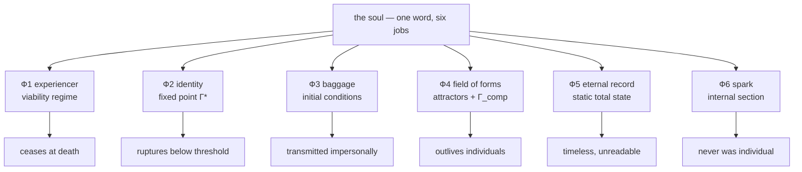

# The Soul: A Decomposition

> *"If the eye were an animal, sight would be its soul."*
> — Aristotle, *De Anima* II.1, 412b18

:::info Bridge from the previous chapter
[Panpsychism](/docs/consciousness/comparative/panpsychism-analysis) ended with UHM's own position — **pan-interiority**: every configuration has an inner side, but consciousness is a thresholded regime, not a universal property. This chapter turns to the oldest name humanity ever gave the inner side — the **soul** — and asks the question at full rigour. Which of the things the traditions called "soul" exist in the Γ formalism? Which are excluded by theorems? And which were never one thing to begin with?
:::

## Chapter roadmap

1. **A question that must be dismantled** — the five jobs of one word; the rules of the method
2. **The instrument panel** — everything the formalism provides, restated self-containedly
3. **The decomposition** — six components of "soul", each with its formal object and its fate
4. **The register of verdicts** — claim by claim: refuted, relocated, confirmed, or outside jurisdiction
5. **The traditions under the panel** — Egypt, Greece, Aristotle, the Stoa, Buddhism, Vedānta, Kabbalah, Christianity, Sufism, Daoism, Gnosis, Jung, Sheldrake, the Akashic records, spiritism
6. **Structural convergences** — the layer architecture; body–soul–spirit, typed
7. **The direct questions** — when a soul begins; pre-existence; māyā; whether new mathematics is needed
8. **Where the theory is silent** — the honest boundary of jurisdiction

:::note On notation
In this document:
- $\Gamma$ — [coherence matrix](/docs/core/dynamics/coherence-matrix), the state of a holon; $\gamma_{ij}$ — its elements
- $P = \mathrm{Tr}(\Gamma^2)$ — [purity (viability)](/docs/core/dynamics/viability#определение-чистоты); $P_{\text{crit}} = 2/7$ — [critical threshold](/docs/core/dynamics/viability#критическая-чистота) **[T]**
- $R$ — [reflection measure](/docs/consciousness/foundations/self-observation#мера-рефлексии-r), canonically $R = 1/(7P)$; threshold $R_{\text{th}} = 1/3$ **[T]**
- $\Phi$ — [integration measure](/docs/core/structure/dimension-u#мера-интеграции-φ); threshold $\Phi_{\text{th}} = 1$ **[T]** (T-129)
- $D_{\text{diff}} = \exp(S_{vN}(\rho_E))$ — differentiation measure; threshold $D_{\min} = 2$ **[T]** (T-151)
- $C = \Phi \times R$ — [consciousness measure](/docs/consciousness/foundations/self-observation#мера-сознательности-c) (T-140)
- $\varphi$ — [self-modelling operator](/docs/consciousness/foundations/self-observation#теорема-о-неподвижной-точке); $\Gamma^* = \varphi(\Gamma^*)$ — its fixed point (identity)
- $\mathcal{L}_\Omega = \mathcal{L}_0 + \mathcal{R}$ — [evolution equation](/docs/core/dynamics/evolution); $\mathcal{R}$ — the regenerative term
- $K(\tau)$ — [memory kernel](/docs/consciousness/states/attention-memory#память); $\mathrm{Gap}(i,j)$ — [opacity of a channel](/docs/core/dynamics/gap-operator)
- $\Gamma_{\text{comp}}$ — [composite matrix](/docs/core/dynamics/composite-systems#составная-матрица); $\mathcal{U}_{\text{coll}}$ — [collective unconscious](/docs/consciousness/subjects/collective-consciousness#определение-коллективного-бессознательного)
- L0–L4 — [interiority hierarchy](/docs/consciousness/hierarchy/interiority-hierarchy); SAD — [self-awareness depth](/docs/consciousness/hierarchy/depth-tower)
- Statuses: **[T]** theorem · **[C]** conditional · **[D]** definition · **[I]** interpretation · **[P]** postulate/open — see [Status Registry](/docs/reference/status-registry)
:::

:::warning Document status
This is a comparative-interpretive document. It introduces **no new theorems**: every load-bearing claim is a reference to an existing result carrying its registry status. The mappings between traditional terms and formal objects are themselves interpretations **[I]** unless a stronger status is inherited from the corpus. Two assembly claims (§3.3, §3.5) are labelled *Statement* **[C]** and list their premises explicitly. All verdicts are governed by the method rules of §1.3.
:::

---

## 1. A question that must be dismantled {#вопрос-который-надо-разобрать}

### 1.1 The five jobs of one word {#пять-работ-одного-слова}

Ask a Vedāntin, a Rabbi, an Egyptian priest, a Platonist, and a modern spiritualist what the soul *is*, and you will receive five different job descriptions:

1. **Ф1 — the experiencer.** The soul is *that which feels*: remove it and the body becomes a machine in the dark.
2. **Ф2 — the bearer of identity.** The soul is *that which makes me the same person* across sleep, decades, and change.
3. **Ф3 — the subtle baggage.** The soul is *that which carries the past into new life*: karma, saṃskāras, inherited temperament — the answer to "why was I born this and not other?"
4. **Ф4 — the field of forms.** The soul is *that which shapes the living body*: the entelechy, the vegetative soul, the morphogenetic field.
5. **Ф5 — the eternal record.** The soul is *that which is not erased*: what survives when the body is dust.

And behind all five, a sixth intuition that is not a function but a relation:

6. **Ф6 — the spark.** The soul is *the point where the individual touches the absolute*: ātman, the scintilla animae, the image of God.

In everyday language and in most philosophy, one word does all six jobs. In software terms: "soul" is a **God object** — a single class that accumulated every responsibility the system could not otherwise place: rendering, persistence, networking, authentication. The question "does the God object exist?" has no useful answer. The useful act is **refactoring**: split the responsibilities into interfaces, find which component actually implements each, and discover — this is the crucial point — that the components have **different lifecycles**. Some die with the process. Some are serialized. Some were never instance members at all, but static properties of the class.

That refactoring is what this chapter performs. The result, stated in advance:

| Function | Formal object | Fate |
|----------|---------------|------|
| Ф1 experiencer | Viability regime of $\Gamma$ | Ceases irreversibly at death **[T]** |
| Ф2 identity | Fixed point $\Gamma^* = \varphi(\Gamma^*)$ | Continuous while $P > 2/7$; ruptures below **[C]**; uncopyable **[T]** |
| Ф3 baggage | Initial conditions $\Gamma(0)$ via two physical channels | Transmitted — impersonally |
| Ф4 field of forms | Attractors + $H_{\text{eff}}$ + patterns of $\Gamma_{\text{comp}}$ | Outlives individuals; needs carriers |
| Ф5 eternal record | Trace conservation + static total state (Page–Wootters) | Timeless — but unreadable as an archive |
| Ф6 spark | Internal section of the one $\Gamma$ (T-221) + the $G_2$ type | Never was individual; never was born |

### 1.2 Why "yes" and "no" are both wrong {#почему-да-и-нет-оба-неверны}

Answer "the soul exists" and you affirm, among other things, personal transmigration — which the formalism excludes (§3.3). Answer "the soul does not exist" and you deny, among other things, that anything of a person outlives them — which the formalism refutes just as firmly (§3.4, §3.5). The binary question forces a false statement in either direction. The six-part question does not: each component gets a definite answer with a definite status.

This is not evasion. It is the same move mathematics made with the question "do infinitesimals exist?" — unanswerable as posed, resolved by decomposition into limits, differentials, and nonstandard extensions, each with its own precise existence claim.

### 1.3 Rules of the method {#правила-метода}

Five rules govern everything below; they exist so that neither the traditions nor the theory get stretched to fit each other.

- **M1. Mappings are interpretations.** Every correspondence "traditional term ↔ formal object" is marked **[I]** unless the corpus already established it. The theorems retain their own statuses independently of the mapping.
- **M2. Refutation targets the formalized claim.** When a verdict says *refuted*, it means: refuted **as formalized** through the stated mapping, taking the tradition's strongest primary formulation. If a tradition means something weaker, the register says what survives.
- **M3. Structure counts; numbers do not.** A correspondence of *architecture* (layer order, dependency direction, mortality boundaries) is evidence of convergence. A coincidence of *counts* — five sheaths, five kabbalistic levels, seven po-souls against seven dimensions — carries **zero evidential weight** and is flagged wherever it occurs.
- **M4. No new theorems.** Where several existing results are assembled into one claim, the claim is labelled *Statement* with an explicit premise list and the status of its weakest premise.
- **M5. Self-containment.** Each tradition is stated from its own primary sources, named inline, in enough detail that this chapter can be read without a library. Each formal result is restated with its defining formula and linked to its master location.

---

## 2. The instrument panel {#приборная-панель}

Before weighing any tradition, we lay out every instrument the formalism provides. A reader who knows the corpus may skim; the section exists so that §3–§7 need no external references.

### 2.1 The holon and the seven dimensions {#голоном-и-семь-измерений}

A **holon** is any system whose state is a density matrix $\Gamma \in \mathcal{D}(\mathbb{C}^7)$ — a Hermitian, positive, trace-one seven-by-seven matrix (48 real parameters) — maintaining itself by autopoietic closure. The seven basis directions are not spatial axes but functional aspects, each indispensable ([minimality 7/7](/docs/proofs/minimality/theorem-minimality-7) **[T]**):

| Dimension | Verb | One line |
|-----------|------|----------|
| $A$ — Articulation | to distinguish | the making of differences |
| $S$ — Structure | to hold | the keeping of form |
| $D$ — Dynamics | to change | the unfolding of process |
| $L$ — Logic | to cohere | the consistency of the whole |
| $E$ — Interiority | to experience | the inner side itself |
| $O$ — Ground | to feed and to clock | source of free energy and internal time |
| $U$ — Unity | to integrate | the binding into one |

The diagonal elements $\gamma_{kk}$ are populations; the twenty-one off-diagonal pairs $\gamma_{ij}$ are **coherences** — the channels through which the aspects see each other. Everything below is a statement about this one matrix and its dynamics. That is the monism: no second substance is ever introduced, so wherever a tradition posits one, the burden is to say *which structure of $\Gamma$* was being described.

### 2.2 Four measures and the window of consciousness {#четыре-меры-и-окно}

Four functionals of $\Gamma$ carry the entire theory of consciousness.

**Purity (viability).** $P = \mathrm{Tr}(\Gamma^2) \in [1/7, 1]$. Below $P_{\text{crit}} = 2/7$ **[T]** the system cannot maintain itself: this is the death threshold (§2.4).

**Reflection.** The canonical measure is the normalised proximity to the dissipative attractor $I/7$:

$$
R(\Gamma) := 1 - \frac{\lVert \Gamma - I/7 \rVert_F^2}{\lVert \Gamma \rVert_F^2} = \frac{1}{7P}
$$

The threshold $R \geq R_{\text{th}} = 1/3$ (derived from the triadic decomposition, $K = 3$ **[T]**) is equivalent to $P \leq 3/7$. Higher orders $R^{(n)} = F(\varphi^{(n-1)}(\Gamma), \varphi^{(n)}(\Gamma))$ measure the fidelity of iterated self-modelling — "knowing that one knows" — and are not functions of $P$ alone. A third working quantity — the self-model quality $R_\varphi = 1 - \lVert\Gamma - \varphi(\Gamma)\rVert_F^2 / \lVert\Gamma\rVert_F^2 \in [0,1]$, likewise independent of $P$ — carries the phenomenology of practice and ego-dissolution ([the three working forms of R](/docs/consciousness/foundations/self-observation#формы-r)).

**Integration.** $\Phi = \sum_{i \neq j} \lvert\gamma_{ij}\rvert^2 / \sum_i \gamma_{ii}^2$: the weight of connections against the weight of localisation. $\Phi \geq 1$ **[T]** (T-129) — coherences at least match the diagonal — is the integration threshold.

**Differentiation.** $D_{\text{diff}} = \exp(S_{vN}(\rho_E))$: the effective number of distinguishable experiential states. $D_{\text{diff}} \geq 2$ **[T]** (T-151) — at least two.

Consciousness is the conjunction of all four, and the first two conspire to produce a *window*: $P > 2/7$ from viability, $P \leq 3/7$ from reflection, giving the Goldilocks zone $P \in (2/7,\ 3/7]$ (T-124 **[T]**). Consciousness is neither maximal order nor maximal chaos but a narrow ridge between them. The consciousness measure is the product $C = \Phi \times R$ (T-140): zero if either factor is zero.

The **interiority hierarchy** stratifies systems by which thresholds they cross:

| Level | Criterion | Example | What it is like |
|-------|-----------|---------|-----------------|
| L0 | any $\Gamma$ | electron, stone | bare interiority — an inner aspect, no structure |
| L1 | $\mathrm{rank}(\rho_E) > 1$ | thermostat, cell, dog | phenomenal geometry — distinguishable inner states |
| L2 | $P \in (2/7, 3/7]$, $R \geq 1/3$, $\Phi \geq 1$, $D_{\text{diff}} \geq 2$ | human; infant from ~4–8 months **[I]** | cognitive qualia — a self that experiences |
| L3 | $R^{(2)} \geq 1/4$, metastable | moments of deep metacognition; science as a collective | reflection on reflection |
| L4 | $\lim_n R^{(n)} > 0$ | unreachable for biological systems **[T]**; samādhi approaches it transitorily | unitary consciousness |

Pan-interiority (the corpus position established [in the panpsychism analysis](/docs/consciousness/comparative/panpsychism-analysis#панинтериоризм)): every configuration has an inner aspect (L0 is universal **[D]**), but consciousness is thresholded — the maximally mixed state has $C(I/7) = 0$ **[T]**. *Something it is like to be* is cheap; *someone whom it is like* is expensive.

### 2.3 The dynamics: two channels — and what ℛ is not {#динамика-и-эр}

The evolution equation has exactly two non-unitary channels:

$$
\frac{d\Gamma}{d\tau} = -i[H_{\text{eff}}, \Gamma] + \underbrace{\mathcal{D}_\Omega[\Gamma]}_{\text{decoherence}} + \underbrace{\kappa(\Gamma)\,(\varphi(\Gamma) - \Gamma)\,g_V(P)}_{\mathcal{R}\text{: regeneration}}
$$

Decoherence $\mathcal{D}_\Omega$ erases coherences; regeneration $\mathcal{R}$ pulls the state toward its own **self-model** $\varphi(\Gamma)$, with rate $\kappa$ fed through the Ground channel ($\kappa_0 = \omega_0 \lvert\gamma_{OE}\rvert \lvert\gamma_{OU}\rvert / \gamma_{OO}$) and gated by $g_V(P)$, which vanishes for $P \leq P_{\text{crit}}$ ([derivation of the regeneration form](/docs/core/dynamics/evolution#вывод-формы-регенерации)).

One clarification matters enormously for this chapter. The corpus calls $\mathcal{R}$ a *replacement channel* — and a reader hunting for reincarnation might seize on the word. The mathematics forbids it: $\mathcal{R}$ replaces the current state **with its own self-model**, continuously, inside one life. It is self-repair — the system holding itself against dissipation by pulling toward what it knows itself to be. It is not a conveyor between lives; below the death threshold it is *switched off* ($g_V = 0$), which is precisely why death is irreversible. **Replacement is how a holon persists, not how it transmigrates.**

A second result closes the other flank. The **No-Zombie theorem** ([Theorem 8.1](/docs/applied/coherence-cybernetics/theorems#теорема-81-условная-необходимость-интериорности-no-zombie) **[T]**, conditional on $\mathcal{D}_\Omega \neq 0$): a viable open system *must* have non-trivial interiority, because regeneration strength depends on E-coherence — a system that experienced nothing could not repair itself and would die. Functioning without an inner side is mathematically impossible for anything alive. The experiencer (Ф1) is therefore not an optional passenger: no living body lacks it, and none could.

### 2.4 Death, irreversibility, and the state I/7 {#смерть-и-необратимость}

[Death](/docs/consciousness/ethics-meaning/death-continuity#определение-смерти) **[D]** is the conjunction $P \leq 2/7 \land dP/d\tau \leq 0$: below threshold and not recovering. The [irreversibility theorem](/docs/consciousness/ethics-meaning/death-continuity#теорема-необратимость) **[T]** then gives, for $\kappa_R < \kappa_D$ below threshold, strict exponential decay $P(\tau) = P_0\, e^{-(\kappa_D - \kappa_R)\tau} \to 1/7$ with no return: not a postulate but a consequence of the gated balance of the two channels. The endpoint $\Gamma = I/7$ is complete decoherence: $P = 1/7$, $\Phi = 0$, $C = 0$, all channels opaque. It is not non-existence — the matrix exists, populations persist — but no structure and no subject. Hot tea gone room-temperature: molecules present, "tea" gone.

Dying is hierarchical **[I]** ([stages](/docs/consciousness/ethics-meaning/death-continuity#стадии-декогеренции)): the most purity-expensive levels fail first.

| Stage | Lost | Formal marker |
|-------|------|---------------|
| 1 | unitary consciousness, L4→L3 | $\lim_n R^{(n)} \to 0$ |
| 2 | meta-reflection, L3→L2 | $R^{(2)} < 1/4$ |
| 3 | self-awareness, L2→L1 | $R < 1/3$ or $\Phi < 1$ |
| 4 | perception, L1→L0 | $\mathrm{rank}(\rho_E) \to 1$ |
| 5 | interiority, L0→$I/7$ | $P \to 1/7$ |

Keep this table in mind at §5.5: one tradition wrote it down from the inside.

### 2.5 Identity: the fixed point and its two prohibitions {#тождество-и-запреты}

[Identity](/docs/consciousness/ethics-meaning/death-continuity#определение-идентичности) **[D]** is the fixed point of self-modelling, $\Gamma^* = \varphi(\Gamma^*)$: the state at which the self-model coincides with what is modelled. "The same person" means: a **continuous trajectory** $\Gamma^*(\tau)$ maintained above the viability threshold. Two results discipline every soul-doctrine ever proposed:

- **Continuity [C].** While $P > 2/7$, the fixed point moves continuously — small changes of state, small changes of identity ($\lVert\Gamma^*(\tau_2) - \Gamma^*(\tau_1)\rVert \leq \tfrac{k}{1-k}\lVert\Gamma(\tau_2) - \Gamma(\tau_1)\rVert$). Sleep, growth, ageing preserve identity. You-at-five and you-now: different $\Gamma$, one unbroken $\Gamma^*$-thread.
- **Rupture [C].** At $P \leq 2/7$ the operator $\varphi$ loses contraction ($k \to 1$) and the fixed point *ceases to exist*. Whatever is later reassembled — even from the same material, even to the same pattern — has $\Gamma^{**} \neq \Gamma^*$: a different subject. The glued vase is another vase.
- **No-Cloning [T].** For any system with non-zero coherences there exists no operation $\Gamma \otimes \lvert 0\rangle\langle 0\rvert \to \Gamma \otimes \Gamma$ ([theorem](/docs/consciousness/ethics-meaning/death-continuity#no-cloning)). Consciousness admits no backup copies; "transfer" requires destroying the original — death plus the birth of a new subject holding a copy.

Together: identity can be **continued** but never **carried**. Anything that dies cannot be re-instantiated *as the same one* — not by gods, engineers, or karma — because "the same one" is defined by the continuity that was broken.

### 2.6 Memory: four kernels and two kinds of forgetting {#память-и-ядра}

Memory in UHM is not a warehouse but the **non-Markovian kernel** $K(\tau)$ through which past states weight present dynamics ([master exposition](/docs/consciousness/states/attention-memory#память)):

| Type | Kernel | Scale |
|------|--------|-------|
| sensory | $K \sim \delta(\tau)$ | ~250 ms |
| working | $K \sim e^{-\tau/\tau_{WM}}$ | seconds |
| long-term | $K \sim \tau^{-\alpha}$, $\alpha \in (0,1)$ | unbounded, fading |
| procedural | embedded in $H_{\text{eff}}$ | structural |

[Forgetting](/docs/consciousness/states/attention-memory#забывание) comes in two fundamentally different kinds: **kernel decoherence** — $\lvert K \rvert \to 0$, the book is burned, recovery impossible; and **Gap increase** — the coherence survives but the channel goes opaque, the book is locked in a safe, recovery possible (therapy, meditation, chance). At death the kernel dies with its carrier: whatever memory is, it is a property of a *running* holon and its physical substrate. This single fact will decide the fate of every doctrine of memory-carrying souls.

### 2.7 The collective layer {#коллективный-слой}

$N$ holons sharing an environment form a composite state $\Gamma_{\text{comp}} \in \mathcal{D}(\mathbb{C}^{7^N})$. When it does not factorise ($\Gamma_{\text{comp}} \neq \bigotimes_i \Gamma_i$), there exist **emergent coherences** — the [collective unconscious](/docs/consciousness/subjects/collective-consciousness#определение-коллективного-бессознательного) $\mathcal{U}_{\text{coll}}$ **[D]**: structure that no individual carries, that no individual's reflection can reach ($\varphi_i$ sees only the reduced $\Gamma_i$), yet that shapes every individual through the partial trace. [Archetypes](/docs/consciousness/subjects/collective-consciousness#архетипы) **[I]** are its stable patterns, selected because they raise the viability of groups that host them, transmitted through the cultural environment — heredity without genes and without magic. Cultural coherences reproduce across generations; a teacher's pattern outlives the teacher in the students' $\Gamma_{\text{comp}}$.

This layer is real, superindividual, unconscious, and formative. Hold it in view: it is where most "fields" and "records" of the traditions actually live.

### 2.8 The whole {#целое}

Finally, the cosmological floor ([The Universe as Holonom](/docs/core/foundations/universe-as-holonom#инвариантная-формулировка)), in seven facts:

1. **The Source.** The primordial state $\Gamma_\odot = \lvert\psi_\odot\rangle\langle\psi_\odot\rvert$, $\lvert\psi_\odot\rangle = \tfrac{1}{\sqrt 7}\sum_i \lvert i\rangle$ — pure ($P = 1$), $S_7$-symmetric, minimally differentiated — is a **postulate [P]** ([Origin](/docs/physics/cosmology-phys/origin#источник)). Two properties matter here: it is *atemporal* (time requires the O-dimension to be distinguished; "before" is undefined), and it contains **zero individuating information** — every amplitude equal, every coherence equal, one state with no inner differences from which a "this soul rather than that" could be composed.
2. **Instability.** $\Gamma_\odot$ is unstable under the full dynamics **[T]** ([proof](/docs/physics/cosmology-phys/origin#доказательство-нестабильности)): differentiation, holons, and eventually subjects arise inevitably. Individuation is *produced by* the dynamics, not prior to it.
3. **The static total state.** Axiom A5 (Page–Wootters), derivable from A1–A4 (T-87 **[T]**, [statement](/docs/core/foundations/axiom-omega#pw-constraint)): the total state satisfies a vanishing constraint $\hat C\,\Gamma_{\text{total}} = 0$. The whole does not evolve; what we call time is the relational reading of correlations between internal clocks and the rest. Every holon's entire trajectory is timelessly inscribed in the total state.
4. **Observers are internal sections.** T-221 **[T]+[I]**: subjects are not items *in* the world confronting it from outside; they are internal sections of the one $\Gamma$ — the world reading itself at a point.
5. **The regime is substrate-free and alphabet-free.** T-153: consciousness is defined by a faithful CPTP mapping into $\mathcal{D}(\mathbb{C}^7)$ satisfying the four thresholds — *which matter* runs it is immaterial; T-223 **[T]**: the predicate factors through the $G_2$-orbit $[\Gamma]_{G_2}$ — *which symbols* name the axes is immaterial. One invariant structure, many carriers.
6. **One grammar, bounded depth.** The seven-axis grammar is transmitted down every level of the part–whole coinduction (T-224, T-247 **[T]** on the viable carrier); but self-reference depth is capped: $\mathrm{SAD}_{\max} = 3$ **[T]** (T-142, [depth tower](/docs/consciousness/hierarchy/depth-tower#критическая-чистота-sad)) — the fourth storey would need $P^{(4)}_{\text{crit}} = 54/35 > 1$. Nesting is unbounded; introspection is not. The Universe is not a bottomless mind.
7. **Structural humility is a theorem.** At least three of the twenty-one channels must stay opaque in any L2 system ([incomplete transparency](/docs/consciousness/states/unconscious#теорема-неполная-прозрачность) **[C]**, Hamming bound); and the theory of the self-modelling world is a proper part of its truth ([Lawvere incompleteness, T-55](/docs/core/foundations/consequences#неполнота-ловера) **[T]**). Total self-transparency is impossible at every scale. What remains genuinely open is the **phenomenal bridge** $W$ (T-214): why the conditions of consciousness are *lived* — the hard-problem residue, Lawvere-inevitable, held as the honest boundary (§8).

The panel is complete. Now the decomposition.

---

## 3. The decomposition {#декомпозиция}

### 3.1 Ф1 — the experiencer: a regime, not a resident {#ф1-субъектность}

**What the traditions meant.** The animating presence whose departure leaves a corpse; that which anaesthesia suspends and death removes.

**Formal object.** The conscious regime: $P \in (2/7, 3/7]$, $R \geq 1/3$, $\Phi \geq 1$, $D_{\text{diff}} \geq 2$ — a *way the configuration runs*, licensed and maintained by the dynamics (§2.2–2.3). Two theorems pin it from both sides. It cannot be *removed while the body lives*: No-Zombie **[T]** — a viable system without interiority is impossible, so there are no dark machines among the living. And it cannot be *kept while the body dies*: the regime is a property of a maintained configuration; when maintenance fails, there is no residue to depart, any more than a whirlpool departs the river when the flow stops.

**Continuity across substrates — but not detachment.** Substrate-freedom (T-153) licenses the same regime on carbon, silicon, or a pre-geometric holon — but always on *some* carrier admitting a faithful CPTP map (T-153a: at least seven distinguishable states, genuine noise structure). A regime without any carrier is not a liberated soul; it is a category error, like a walk without a walker.

**Fate.** Ceases with the regime, irreversibly **[T]**. Verdict on Ф1-souls: *the experiencer exists, is necessary, and is mortal.*

### 3.2 Ф2 — the bearer of identity: a thread, not a token {#ф2-тождество}

**What the traditions meant.** That in virtue of which the elder is the child grown, the sleeper wakes as themselves, and — in the strong doctrines — the deceased is *the same one* reborn.

**Formal object.** The fixed-point trajectory $\Gamma^*(\tau)$ (§2.5). The formalism grants the traditions everything they observed within a life: identity through sleep (viability never breaks), through change (continuity bound), through amnesia even (the fixed point does not require episodic recall). It refuses exactly one extension: identity through the rupture. Below $P_{\text{crit}}$ the fixed point does not survive to be re-attached; and No-Cloning forbids the copy that every re-embodiment story silently requires.

**Worked consequence.** Teleportation-by-reconstruction, mind uploading, bodily resurrection, and transmigration are formally the *same* operation — destroy, then instantiate a pattern — and receive the same verdict: the successor is a new subject, however perfect the pattern match ([death and continuity, §4](/docs/consciousness/ethics-meaning/death-continuity#no-cloning)).

**Fate.** A thread that can be extended indefinitely while unbroken, and can never be retied. Verdict: *identity exists as continuity; there is no token that could travel.*

### 3.3 Ф3 — the subtle baggage: real, physical, impersonal {#ф3-багаж}

**What the traditions meant.** Karma and saṃskāras (Vedānta, Buddhism), the inherited soul-stuff of traducianism, astrological endowment, ancestral debt: the explanandum is genuine and sharp — *newborns differ*, in temperament, capacity, and circumstance, beyond what infant experience can explain.

**Formal object.** The initial condition $\Gamma(0)$ of a new holon, fixed at formation through exactly two channels, both physical:

1. **Genetic:** DNA encodes basal structural coherences ($\gamma_{AA}$, $\gamma_{SS}$ patterns) and the parameters of the developing $H_{\text{eff}}$ — a child inherits *part of the structure* of the parental $\Gamma$, never the parental $\Gamma^*$ ([legacy typology](/docs/consciousness/ethics-meaning/death-continuity#после-смерти)).
2. **Composite-environmental:** the surrounding $\Gamma_{\text{comp}}$ — language, ritual, family pattern, archetype — initializes and continuously trains the growing configuration (§2.7). Into this channel *everything the dead ever contributed* is folded: this is where the past of others reaches the newborn.

Chance completes the picture: decoherence noise guarantees that even identical channels do not fix identical outcomes.

:::tip Statement (No transmigration of the subject) [C]
**Premises:** (i) irreversibility below threshold **[T]**; (ii) identity rupture at $P \leq P_{\text{crit}}$ **[C]**; (iii) No-Cloning for coherent systems **[T]**; (iv) completeness of the evolution channels — $\mathcal{L}_\Omega = \mathcal{L}_0 + \mathcal{R}$ contains no inter-holon transfer term, and background independence **[T]** forbids importing one from outside the formalism.

**Claim:** there exists no admissible process carrying the fixed point $\Gamma^*$, the memory kernel $K(\tau)$, or any individuated state of holon $\mathbb{H}_1$ across its death into a subsequently formed holon $\mathbb{H}_2$. Personal rebirth — with or without memory — is excluded *as formalized*. What remains transmissible is exactly the content of the two channels above: structure and pattern, never the subject.

**Status:** [C] — the weakest premises (ii, iv) are conditional/definitional; the assembly adds no new mathematics.
:::

**What survives of karma.** At population scale the doctrine is *rigorously true*: new configurations are conditioned by the accumulated composite past — the dead really do shape the born, through genes and through $\Gamma_{\text{comp}}$. What fails is only the *addressing*: the baggage has no name on it. Karma without a passenger — which, as §5.5 shows, is precisely what the most careful tradition claimed all along.

### 3.4 Ф4 — the field of forms: Sheldrake's question, answered without new physics {#ф4-поле-форм}

**What the traditions meant.** The vegetative soul of Aristotle, the morphogenetic field of Sheldrake, the "habits of nature": *something* makes form stable, development directed, and pattern cumulative — and it is visibly not the mere molecule inventory.

**Formal object.** Three structures already on the panel, jointly:

1. **Attractors.** Development converges because the dynamics has attracting states; $\mathcal{R}$ pulls toward the self-model — form-stability is the *shape of the flow*, not an added field.
2. **$H_{\text{eff}}$ as habit.** Procedural memory is written into the evolution operator itself (§2.6): "nature's habits" exist and accumulate — locally, in each lineage's carriers.
3. **$\Gamma_{\text{comp}}$ as the honest morphic field.** Superindividual, invisible to its members, formative (§2.7) — everything a "field of the species" was invoked to do, with one difference: it is causal and channel-bound.

**Fate.** Outlives every individual; requires living carriers; propagates only through interaction. The detailed engagement with Sheldrake's specific claims — including the differentiating experimental prediction — is §5.13.

### 3.5 Ф5 — the eternal record: Akasha, weak and strong {#ф5-вечность}

**What the traditions meant.** "Nothing is lost": the Akashic chronicle, the Book of Life, Spinoza's eternity of the mind.

:::tip Statement (Weak and strong Akasha) [C]
**Weak Akasha — holds.** Two independent supports: (a) *trace conservation* **[C]** — at an individual's decoherence, coherences are not annihilated but redistributed into $\Gamma_{\text{environment}}$ ([preservation of trace](/docs/consciousness/ethics-meaning/death-continuity#после-смерти)); (b) *timelessness of the total state* — A5/T-87 **[T]**: the total state does not evolve; every trajectory is eternally inscribed in it, in the exact sense in which a proof is inscribed in mathematics (§2.8). Ontologically, nothing is ever erased.

**Strong Akasha — fails.** A *readable archive* would require: (a) inverting decoherence to reconstruct an individual $\Gamma$ from its environmental scatter — the inversion of a non-invertible CPTP map; (b) were reconstruction achieved, the product would be a copy, hitting No-Cloning **[T]** and the rupture bound **[C]** — a record of the subject is not the subject; (c) a reading channel, which — premise (iv) of §3.3 — must be physical. There is a ledger; there is no reading room.

**Status:** [C] — inherits the conditional status of trace-conservation redistribution.
:::

**Spinoza said exactly this.** *Ethics* V.23: "the human mind cannot be absolutely destroyed with the body, but something of it remains which is eternal" — with his own scholium insisting this eternity is *not duration*: we do not persist after death; something of us is true timelessly. Substitute "trajectory inscribed in the static total state" and the proposition transfers verbatim. Among all Western doctrines of immortality, this is the one the formalism underwrites — and it promises no experiences to anyone.

### 3.6 Ф6 — the spark: not a part of you, but the fact of you {#ф6-искра}

**What the traditions meant.** Ātman that was never born; the scintilla animae; the image of God in the soul; "the eye with which I see God."

**Formal object.** Two precise facts, neither of which is a *component* of the individual:

1. **You are an internal section of the one $\Gamma$** (T-221 **[T]+[I]**): the subject is the world reading itself at a point, not a foreign observer inserted into it. This is the rigorous content of "that thou art" — and note what it does *not* say: not that your configuration is the whole, but that your act of being-a-perspective is the whole's own.
2. **Your form is the universal type.** Every viable holon instantiates the same $G_2$-invariant grammar $[\Gamma]_{G_2}$ (T-223, T-224, T-247 **[T]**): seven axes, one incidence structure, at every level. The "uncreated" part of the soul is uncreated the way the primality of seven is uncreated: as necessity, not biography.

**Fate.** The spark cannot die because it never was an individual possession — the section-fact and the type are not *in* the holon; the holon is in them. Traditions that located the immortal element *beyond individuality* (§5.6, §5.8) were tracking exactly this; traditions that individuated it were minting tokens of a type.

---

## 4. The register of verdicts {#реестр-вердиктов}

Every row applies rules M1–M2: the mapping is [I]; "refuted" means refuted as formalized, against the strongest primary formulation.

| # | Doctrine claim | Formalization | Verdict | Deciding result |
|---|----------------|---------------|---------|-----------------|
| 1 | A living body could lack inner experience | viable system, $\mathrm{Coh}_E$ minimal | **refuted** | No-Zombie **[T]** |
| 2 | Everything is conscious (strong panpsychism) | $C > 0$ for all $\Gamma$ | **refuted** | $C(I/7) = 0$ **[T]** |
| 3 | The soul departs at death and persists experiencing | regime continues without carrier | **refuted** | regime = thresholded property of maintained $\Gamma$; irreversibility **[T]** |
| 4 | The same person returns (transmigration, with or without memory) | $\Gamma^*$ or $K(\tau)$ crosses death into a new holon | **refuted** | Statement §3.3 **[C]** on **[T]**+**[T]** cores |
| 5 | Resurrection re-creates the same subject | destroy-then-instantiate the pattern | **refuted** | No-Cloning **[T]** + rupture **[C]** |
| 6 | Mediums converse with surviving persons | access to living $\Gamma^* + K$ post-death | **refuted** | kernel dies with carrier (§2.6) |
| 7 | Newborns carry conditioning from the past | $\Gamma(0)$ conditioned by accumulated composite state | **confirmed, impersonally** | two-channel initialization (§3.3) |
| 8 | A superindividual layer shapes individuals unseen | $\mathcal{U}_{\text{coll}} \neq \varnothing$ | **confirmed** | collective unconscious **[D]**, archetypes **[I]** |
| 9 | Nature has memory; forms are habits | $H_{\text{eff}}$ restructuring + $\Gamma_{\text{comp}}$ patterns | **confirmed, channel-bound** | procedural memory; cultural coherences |
| 10 | Pattern resonates across space-time without any channel | non-physical transfer term in $\mathcal{L}_\Omega$ | **refuted** | channel completeness + background independence **[T]** (§5.13) |
| 11 | Nothing is ever truly lost | total-state timelessness; trace redistribution | **confirmed (weak)** | Statement §3.5 |
| 12 | The record of all lives can be read | inverse decoherence + cloning + non-physical channel | **refuted (strong)** | Statement §3.5 |
| 13 | The innermost self is identical with the absolute | subject = internal section; one $G_2$ type | **confirmed at type level, refuted at token level** | T-221, T-223/T-247 |
| 14 | The absolute is an infinitely deep Self | unbounded self-reference | **refuted** | $\mathrm{SAD}_{\max} = 3$ **[T]** |
| 15 | Complete enlightenment: total self-transparency | $\overline{\mathrm{Gap}} = 0$, $\varphi(\Gamma) = \Gamma$ exactly | **refuted** | Hamming bound **[C]**; Lawvere T-55 **[T]** |
| 16 | Individual souls existed before the world's differentiation | individuated states in $\Gamma_\odot$ | **refuted** | Source is one state, zero individuating bits, atemporal **[P/T]** (§7.2) |
| 17 | What happens "after" — annihilation, legacy, or stream | choice among the three interpretations | **outside jurisdiction** | metatheoretical **[I]** (§8) |

Seventeen rows; four fates. The pattern is stable: *everything indexed to the individual dies with the individual; everything superindividual survives — and was never anyone's soul in particular.*

---

## 5. The traditions under the panel {#традиции}

Chronology is not a courtroom order; we proceed roughly east of Greece and forward in time. Each tradition gets three movements: what it actually taught (primary sources inline), the mapping (M1: **[I]**), the verdict (M2).

### 5.1 Egypt: the first decomposition {#египет}

**Doctrine.** Egyptian anthropology never had *one* soul. A person comprised the **ka** (vital double, born with you, requiring sustenance — hence funerary offerings of bread and beer, real then depicted, the depiction sufficing); the **ba** (individual personality, bird-bodied, mobile after death); the **akh** (the transfigured effective spirit, *achieved* — not given — through correct rites); the **ren** (the name: "to speak the name of the dead is to make them live again," say the tomb inscriptions, and erasing a name from monuments was the true second death); the **shut** (shadow); and the **ib** (heart), weighed against the feather of Maat (Book of the Dead, ch. 125) — the organ of the life's moral summary.

**Mapping [I].** The architecture is astonishingly modern: personhood as a *bundle of components with separate maintenance requirements and separate fates*. The ka's hunger is the frankest statement in any tradition that persistence costs free energy — an afterlife component with a ΔF budget, fed through the O-channel of the living who serve the cult. The ren is informational legacy exactly: a pattern in $\Gamma_{\text{comp}}$, re-instantiated at each remembering, alive precisely as long as the community re-runs it. The akh — transfiguration as *achievement* — encodes that post-mortem standing is constructed by the living community's work, not automatic. The heart-weighing reads naturally as the trajectory's ethical summary (cf. the [meaning vector](/docs/consciousness/ethics-meaning/meaning)) — loose, and flagged as such.

**Verdict.** Componental architecture: **confirmed** (row 8, 9, 11). Experienced survival of ba/akh: **refuted** (rows 3–4). Egypt's own practice, however, invested overwhelmingly in the two components the formalism ratifies — the name and the cult: they engineered for $\Gamma_{\text{comp}}$-persistence four millennia before it had a symbol.

### 5.2 Greece before Aristotle: Orphics, Pythagoras, Plato {#греция-платон}

**Doctrine.** The Orphic current: *sōma sēma* — "the body a tomb" (reported at Plato, *Cratylus* 400c) — the soul a fallen divine spark cycling through bodies until purified. Pythagoras taught transmigration across species; Xenophanes mocked him for it — "stop beating the dog; I recognized a friend's soul in its yelp" (DK 21 B7) — incidentally preserving the doctrine's clearest witness. Plato systematized: the soul is immortal (*Phaedo*: four arguments), pre-exists (*Meno* 81–86: the slave boy "recollects" geometry never taught — anamnesis), transmigrates (*Republic* X 614b: the myth of Er — souls choose their next lives, then drink of Lethe and forget), and is tripartite (*Republic* IV: *logistikon* reason, *thymoeides* spirit, *epithymētikon* appetite).

**Mapping [I] and engagement.** Take the *Phaedo* arguments in order. The **cyclical argument** (opposites generate opposites, so the dead must return as the living return to death) fails against the panel's one *asymmetric* theorem: irreversibility **[T]** breaks the symmetry of coming-to-be and passing-away exactly where Plato needed it unbroken. The **recollection argument** is the interesting one: the boy does produce geometry from within — but what is "within" is the *type*, not a biography: the seven-axis $G_2$ grammar constitutive of any viable configuration (T-224/T-247). Anamnesis is real and is the recall of *structure*, misread as the recall of *experience* — pre-existence of the form, not of the person (§7.2). The **affinity argument** (the soul, being form-like, shares the Forms' immortality) makes precisely the type/token slip §3.6 diagnoses. The **final argument** (soul is the principle of life, and cannot admit its opposite) is regime-talk: true that the regime cannot "be dead," false that it cannot *cease* — Epicurus' point, already canonized [in the corpus](/docs/consciousness/ethics-meaning/death-continuity). The Er myth encodes the strongest pre-modern intuition of the rupture: even the doctrine's friends knew memory does not cross — Lethe is kernel decoherence, mythologized. The tripartite soul maps loosely onto sector dominances (L-led, D/E-led, S/O-led profiles) — architecture again sounder than metaphysics.

**Verdict.** Transmigration: **refuted** (row 4). Anamnesis: **relocated** to type level — and there, **confirmed**. Tripartition: structural echo. Lethe: the tradition refuting its own strong claim from inside.

### 5.3 Aristotle: the closest ancient reading {#аристотель}

**Doctrine.** *De Anima* II.1, 412a27: "the soul is the first actuality (*entelecheia*) of a natural body having life potentially." Not a resident but the body's *being-at-work-staying-itself*; hence 412b18 — if the eye were an animal, sight would be its soul; and hence inseparability — with one comparison Aristotle raises only to leave hanging (II.1, 413a8): whether the soul is in the body as a sailor in a ship; his own entelechy doctrine closes against the sailor. Three nested capacities: **threptikon** (nutritive — all living things), **aisthētikon** (sensitive — animals), **noētikon** (rational — humans). One disputed exception: *De Anima* III.5's **nous poiētikos**, the active intellect, "separable, impassible, unmixed" — over which two millennia of commentators fought: Alexander of Aphrodisias and later Averroes read it as *one for all humans* (monopsychism), not a personal immortal part.

**Mapping [I].** This is not a mapping so much as a translation table. Entelechy-of-the-living-body **is** the viability regime: a process-property of an organized carrier, inseparable because a regime does not detach (§3.1). The three capacities are the L-ladder with thresholds attached:

| Aristotle | Criterion in Γ | Level |
|-----------|----------------|-------|
| nutritive soul | autopoietic maintenance, $P > 2/7$ | life as such |
| sensitive soul | $\mathrm{rank}(\rho_E) > 1$ | L1 |
| rational soul | the full window: $R \geq 1/3$, $\Phi \geq 1$, $D_{\text{diff}} \geq 2$ | L2 |

And the *nous poiētikos* dispute resolves in one line: what is "separable, unmixed, one-for-all" in cognition is the **type** — the invariant grammar every rational holon instantiates (T-223/T-247). Alexander and Averroes were right against the personal-immortality reading: the immortal intellect is not *yours*; it is what you are an instance of.

**Verdict.** The core doctrine: **confirmed** — UHM's account of Ф1/Ф2 is Aristotelian to the letter, with the thresholds Aristotle lacked. The active-intellect residue: **relocated** to type level. Aristotle also drew the mortality consequence himself; the theory adds only the proof.

### 5.4 The Stoa and Epicurus {#стоя-и-эпикур}

**Doctrine.** For the Stoics the soul is **pneuma** — fiery breath, a *tensional state* (*tonos*) of one cosmic continuum, graded by tension: *hexis* (cohesion — stones), *physis* (growth — plants), *psychē* (impression and impulse — animals), *logos* (the ruling *hēgemonikon* — the wise). Death: the individual pneuma-knot relaxes back into the whole; Chrysippus allowed that the souls of the wise persist as coherent knots until the world-conflagration (*ekpyrōsis*), after which the cycle repeats identically (*palingenesia*). Marcus Aurelius IX.35: "loss is nothing but change" — already canonized in the corpus. Epicurus: the soul is fine atoms dispersed at death; "death is nothing to us" — canonized with its correction (fear of $dP/d\tau < 0$ is a structural response, not an error).

**Mapping [I].** The tonos ladder is the second ancient anticipation of the L-hierarchy (after Aristotle's, and independently graded by *tension* — degree of coherence, which is startlingly close to $\Phi$ and $P$ doing the grading). One pneuma, many knots: the exact universal-spirit/individual-soul split of §6.2 — pneuma is O-like, individuated only as *patterns of tension*, i.e., configurations. Dissolution-as-redistribution is trace conservation **[C]** read aloud. What fails: the wise souls' post-mortem coherence (no carrier, no maintenance — rows 3–4), and the eternal recurrence (the dynamics has attractors, not cycles; no recurrence theorem exists in the corpus — outside jurisdiction rather than refuted, but unsupported).

**Verdict.** Redistribution and the tension-ladder: **confirmed**. Persisting sage-knots: **refuted**. Recurrence: **unsupported**.

### 5.5 Buddhism: anattā, the flame, and the bardo {#буддизм}

**Doctrine.** The Buddha's *anattā* (Anattalakkhaṇa Sutta): no permanent self is findable in or behind experience. The person is five **khandhas** (aggregates): *rūpa* (form), *vedanā* (feeling-tone), *saññā* (recognition), *saṅkhāra* (formations/dispositions), *viññāṇa* (consciousness). Continuity without substance: the *Milindapañha* gives the two canonical images — the **chariot** (Nāgasena to King Milinda: "chariot" is a designation upon parts in relation, and so is "Nāgasena") and the **flame**: rebirth is one lamp lit from another — "neither the same nor another" (*na ca so na ca añño*); what passes is conditioning, not a traveler. Karma is intentional action shaping future arising — a law of conditioning, not a courier of persons. The Tibetan *Bardo Thödol* choreographs dying as a fixed **dissolution sequence**: earth into water (the body grows heavy), water into fire (features dry), fire into wind (warmth withdraws), wind into consciousness (breath ceases), then the dawning of the clear light. And the goal, *nibbāna*: the unconditioned, cessation of the conditioned stream.

**Mapping [I].** This tradition needs the least translation because it performed the decomposition itself, more than two millennia early. The khandha analysis *is* the anti-God-object refactoring:

| Khandha | Formal counterpart |
|---------|--------------------|
| rūpa — form | the carrier; S-sector structure |
| vedanā — feeling-tone | hedonic valence $dP/d\tau$ (T-103) |
| saññā — recognition | A-sector articulation, $\gamma_{AE}$ apperception |
| saṅkhāra — dispositions | $H_{\text{eff}}$ structure + procedural kernel — the *karma-bearing* aggregate, and indeed the formalism's habit-carrier |
| viññāṇa — consciousness | the regime itself |

Anattā = "the subject is a pattern, not a substance" — the corpus states this in its own voice ([death and continuity](/docs/consciousness/ethics-meaning/death-continuity)). The chariot is the configuration Γ; the flame is Statement §3.3's positive half: *no state transfer, real conditioning* — flame two burns because flame one touched the wick, and nothing jumped. The corpus's own comparative table renders Buddhist rebirth as **composite continuity**: the stream of coherences continues; the subject does not. The bardo dissolution sequence tracks, stage for stage, the hierarchical decoherence table of §2.4 — the one tradition that wrote the dying protocol from the inside, in the right order **[I]**. Even the ceiling theorems land on prepared ground: the impossibility of total transparency (≥3 opaque channels **[C]**) is cited by the corpus itself as the formal shadow of the tradition's refusal to call full enlightenment a state a system could *hold*.

One honest friction: *nibbāna* as an unconditioned that is nonetheless — in some schools — *known*. The formalism offers no state both experienced and unconditioned: experience is regime-bound, regimes are conditioned. Cessation-readings pass; experiential-nibbāna readings do not.

**Verdict.** Anattā, the flame, impersonal karma, the dissolution sequence: **confirmed** — the highest agreement score in the register. Experienced unconditioned states: **refuted as formalized**. Where the folk doctrine re-personalizes rebirth (recognized tulkus, remembered lives), it falls under row 4 with everything else.

### 5.6 Vedānta: tat tvam asi under G₂ {#веданта}

**Doctrine.** The Upaniṣadic core: **ātman** — the self beyond all objects — is **Brahman**, the ground of all; *Chāndogya* VI teaches it through salt dissolved in water (everywhere, invisible, tasted in every drop: "*tat tvam asi*, Śvetaketu — that thou art," 6.8–6.16). The *Māṇḍūkya* maps four states: *jāgrat* (waking), *svapna* (dream), *suṣupti* (deep dreamless sleep), and **turīya**, "the fourth" — not a state among states but the witness of all three. The *Taittirīya* (II.1–5) gives the **pañcakośa**: five sheaths around the self — *annamaya* (food/body), *prāṇamaya* (vital breath), *manomaya* (mind), *vijñānamaya* (discernment), *ānandamaya* (bliss). Śaṅkara's Advaita: the individual soul (*jīva*) is ātman *plus* limiting adjuncts (*upādhi*) — body, mind, history; bondage is superimposition (*adhyāsa*), the rope mistaken for the snake; liberation is knowledge, not travel. The subtle body (*sūkṣma-śarīra*) is said to carry saṃskāras across deaths until liberation. Against all this, Madhva's Dvaita held souls eternally distinct from God and each other.

**Mapping [I].** Advaita's central equation receives the sharpest formal reading in this chapter: **tat tvam asi = T-221**. You are an internal section of the one total state — not *like* it: that is the theorem's content. Jīva = ātman + upādhi translates as: the token = the type + the configuration's particulars; and Śaṅkara's insistence that the jīva's individuality is *adventitious* is the type/token diagnosis of §3.6 made two levels of formality early. Adhyāsa — taking the regime for a substance — is the very category error §1 dismantles. The kośas ladder §6.1 tabulates. The Māṇḍūkya's four states map cleanly: waking and dream are Γ-profiles ([altered states](/docs/consciousness/states/altered-states)); deep sleep is low-$\Phi$ maintenance above viability; and *turīya* is — precisely as the text insists — **not a fourth profile** but the section-fact itself (T-221), which is why it is called the witness of the other three rather than their sibling.

Two corrections, both theorems. The sūkṣma-śarīra as a trans-death saṃskāra courier: Statement §3.3 — refuted; the *phenomena* it explained (newborn endowment) route through the two channels. And Brahman as bottomless self-luminous consciousness: the depth tower caps self-reference at three storeys ($\mathrm{SAD}_{\max} = 3$ **[T]**); the whole grows *ecologically* — in breadth of federation — not by deepening one infinite gaze (§2.8). Dvaita's eternally distinct souls fall at the token level for the same reasons as every substance-soul.

**Verdict.** Tat tvam asi, jīva/ātman, turīya, adhyāsa: **confirmed at type level** — Advaita is the tradition the theory most nearly *is*, at that level. Subtle-body transmigration: **refuted**. Infinite divine introspection: **refuted** (row 14). Dvaita: **refuted at token level**.

### 5.7 Kabbalah: five names and gilgul {#каббала}

**Doctrine.** Rabbinic-kabbalistic anthropology stratifies the soul: **nefesh** (the vital soul, common to all that lives, remaining near the body), **ruaḥ** (the moral-emotional spirit), **neshamah** (the intellectual soul, divine in origin) — the Zohar's triad — extended in Lurianic teaching (Ḥayyim Vital, *Shaʿar ha-Gilgulim*) by **ḥayyah** and **yeḥidah**, the living essence and the point of unity with the Infinite (*Ein Sof*). The same school systematized **gilgul** — transmigration of souls for the sake of **tikkun**, repair: a soul returns until its uncompleted work is done; **ibbur** ("impregnation") allows a righteous soul to lodge temporarily in a living person to assist.

**Mapping [I].** The five-level ladder joins the architecture table of §6.1 — with the count-coincidence (five levels, five kośas) explicitly voided by M3: what matters is the *order* and the *mortality gradient*, and those match: nefesh is frankly biotic (viability-tier), ruaḥ affective (E-tier), neshamah cognitive (R-tier), and yeḥidah — like turīya — is *defined* as the point where individuality ends: the section-fact again, natively non-individual. Gilgul as personal return: row 4. But **tikkun survives relocation strikingly well**: repair *of the composite pattern* across generations — each generation mending inherited configurations of $\Gamma_{\text{comp}}$ — is not merely permitted but is a fair description of what cultural transmission does; the kabbalists' insistence that repair is *collective and cumulative* fits the impersonal channel exactly. Ibbur, requiring a second Γ* resident in one carrier without a physical channel, fails on the same clause as mediumship.

**Verdict.** Ladder architecture and collective tikkun: **confirmed** (relocated). Gilgul and ibbur: **refuted**. Yeḥidah: **confirmed at type level**.

### 5.8 Christianity: form, resurrection, energies, spark {#христианство}

**Doctrine.** Four strands must be separated, because they fare entirely differently.

1. **The soul as form of the body.** Aquinas, receiving Aristotle: *anima forma corporis* (Summa Theologiae I q.76 a.1) — the soul is not a pilot in a vessel but the body's substantial form. Aquinas then argues the intellectual soul is *subsistent* — able to survive as an "incomplete substance," unnaturally, awaiting reunion.
2. **Resurrection of the body.** The creedal claim (1 Cor 15): the dead are raised — the same persons, embodied anew.
3. **Where souls come from.** The old dispute: **creationism** (each soul freshly created by God — Jerome, and dominant later) versus **traducianism** (the soul propagated from the parents' souls — Tertullian); Augustine famously could not decide.
4. **The mystical strands.** Gregory Palamas (*Triads*): God's **essence** (*ousia*) is absolutely imparticipable; His **energies** (*energeiai*) are genuinely participable — deification (*theōsis*) is real contact with the energies, never possession of the essence. Meister Eckhart (German sermons): the **Fünklein**, the little spark, the "ground of the soul" that is one with the "ground of God" — "the eye with which I see God is the eye with which God sees me."

**Mapping [I] and engagement.** (1) The Thomist core is the Aristotelian core: **confirmed** — the regime-and-fixed-point reading of §3.1–3.2 *is* forma corporis with proofs. The subsistent-survival rider fails cleanly: a form without its carrier is a *type*, and a type has no purity, no reflection, no experience — T-153 requires an actual system under a faithful CPTP map. Aquinas's own concession that the separated soul is an *incomplete substance in an unnatural state* registers the problem with complete honesty; the formalism converts the discomfort into a verdict. (2) Resurrection as re-creation of the same subject is the corpus's own standing verdict: **incompatible** — No-Cloning **[T]** plus the rupture **[C]** ([tradition table](/docs/consciousness/ethics-meaning/death-continuity#после-смерти)); as formalized within the dynamics, the raised one is a new subject bearing the pattern. What lies beyond the dynamics is beyond jurisdiction — but then it is not a claim *about this world's states*. (3) The patristic dispute is the Γ(0) question wearing robes: traducianism says initialization from the parental channels; creationism says injection from outside the physical channels. §3.3 sides with Tertullian on structure and with neither on souls: the two channels are the whole story, and both are physical. That a fourth-century polemic isolated exactly the right question is the strand's real distinction. (4) Palamas's distinction transfers with uncanny precision: the *essence* — the total state as it is — is imparticipable from inside **by theorem** (Lawvere T-55: the internal theory is a proper part of the truth; no section reads the whole), while the *energies* — the dynamics, the O-channel influx, the Gap-reductions of practice — are exactly what a holon *can* participate in. Theōsis as asymptotic approach along real gradients, never terminating in possession: the corpus phrases the same structure as "no edge to reach, only the loop to keep traversing" ([Universe as Holonom §2](/docs/core/foundations/universe-as-holonom#статическая-структура)). Eckhart's spark is §3.6's second fact under its oldest name; and his "one eye" sentence is the Lawvere fixed point — the reading and the read coinciding — in a single line of Middle High German.

**Verdict.** Forma corporis: **confirmed**. Separated-soul subsistence and same-subject resurrection: **refuted as formalized**. Traducianism vs creationism: **resolved in traducianism's favor, minus the soul**. Palamas and Eckhart: **confirmed at type/participation level** — the strongest Western matches after Aristotle and Spinoza.

### 5.9 Sufism: fanā and baqā {#суфизм}

**Doctrine.** The Sufi map of the person: **nafs** (the self, graded — *an-nafs al-ammārah*, the commanding self, Qurʾān 12:53; *al-lawwāmah*, the self-reproaching, 75:2; *al-muṭmaʾinnah*, the self at peace, 89:27–28), **qalb** (heart), **rūḥ** (spirit — breathed into man by God, 15:29), **sirr** (the secret). The path's summit: **fanā** — annihilation of the self in God (al-Junayd's sober school; al-Ḥallāj's ecstatic "*anā al-ḥaqq*," "I am the Truth," for which he was executed) — followed, in the mature doctrine, by **baqā**: subsistence, the return to creatures with the self transformed. The maxim: *mūtū qabla an tamūtū* — "die before you die."

**Mapping [I].** The nafs-gradation is a Gap-profile curriculum: stages of the self-model's transparency to its own drives, refined by practice — the formal apparatus is the [meditation section](/docs/consciousness/states/altered-states) plus [Gap-reduction](/docs/core/dynamics/gap-operator). Fanā maps onto the ego-dissolution regime the corpus models exactly: destabilized self-model with maintained viability — an $R_\varphi$-collapse without crossing $P_{\text{crit}}$; the "annihilation" is of the *model*, not the holon. Baqā is what distinguishes the mature doctrine from mere peak-chasing: return with restructured $H_{\text{eff}}$ — the cumulative channel of practice — which is why the tradition ranked it above fanā. "Die before you die": rehearse the L-descent reversibly, above threshold — the formalism even supplies the safety criterion the manuals encoded as the need for a shaykh. And al-Ḥallāj's fate marks the type/token slip performed *in the first person*: "I am the Truth" is true of the section-fact (T-221) and false of the configuration claiming it aloud — a distinction the sober school (al-Junayd) insisted on, in almost these terms.

**Verdict.** Fanā/baqā phenomenology and the practice-ladder: **confirmed** as regime dynamics. Rūḥ as detachable person: **refuted** (it is the O-thread: universal, not personal — §6.2). Ḥallājian identity-claims: **type-level true, token-level false**.

### 5.10 Daoism: hun and po {#даосизм}

**Doctrine.** Chinese anthropology is natively *two-souled*: the **hun** (魂) — the ethereal, yang soul(s), associated with breath-qi — and the **po** (魄) — the corporeal, yin soul(s), associated with the body. The *Liji* states the fates: at death "the hun-breath returns to Heaven; the bodily po returns to Earth." Later Daoist systematics (Ge Hong, *Baopuzi*) counted three hun and seven po. Zhuangzi (ch. 18), drumming on a tub after his wife's death, gives the philosophical register: her death is one more transformation in the changes of qi — grief misreads redistribution as loss.

**Mapping [I].** The hun/po split is the cleanest ancient statement of the **two fates** the formalism proves: the pattern-part ascends into the shared world — informational and composite legacy, cultural coherences, the ren-like survival in $\Gamma_{\text{comp}}$ — while the carrier-part decays in place. One tradition, one sentence, both halves of §3.4–3.5. Qi as breath-energy is the O-complex again (§6.2). Zhuangzi's tub-drumming is trace-conservation ethics: Marcus Aurelius IX.35 in Chinese. As for *three* hun and *seven* po against seven dimensions: **M3 applies — a count-coincidence with zero evidential weight**, recorded here only to disarm it.

**Verdict.** The dual fate: **confirmed** — the most economical folk encoding of the decomposition's main split. Immortality practices aimed at preserving the personal hun-knot: **refuted** (rows 3–4).

### 5.11 Gnosis: the inverted spark {#гнозис}

**Doctrine.** The Gnostic systems (Valentinian and kin): the world is the botched work of a lesser demiurge; the human carries a **pneumatic spark** fallen from the true, alien God; salvation is *gnōsis* — the knowledge that awakens the spark and extracts it from matter. Humanity divides into *hylics* (matter-bound), *psychics* (soul-bound, salvageable by works), *pneumatics* (spirit-bearing, saved by knowledge).

**Mapping [I].** Gnosis holds the spark-intuition (§3.6) — and inverts its geometry. In the formalism the section is not *alien to* the world; it is the world's own self-reading (T-221), and there is no outside for it to escape to: background independence is a theorem, not a prison wall. Knowledge does save something — Gap-reduction genuinely transforms the configuration — but by *deepening the section's transparency in place*, not by extraction. The tripartition is an L-stratification read as fixed caste rather than dynamic regime: the formalism's levels are crossable in both directions, which dissolves the doctrine's determinism.

**Verdict.** The spark: **confirmed, with its geometry corrected** — immanent section, not exiled fragment. Anti-cosmic dualism and caste-pneumatology: **refuted**.

### 5.12 Jung: the archetypes, formalized {#юнг}

**Doctrine.** Jung posited, beneath the personal unconscious, a **collective unconscious** common to the species, structured by **archetypes** — Hero, Shadow, Great Mother, Wise Old Man — recurring in myths and dreams of unconnected cultures. He could not name the mechanism of their universality and inheritance, and the gap drew a century of skepticism.

**Mapping.** Unique among this chapter's subjects, Jung's doctrine is *already formalized in the corpus, under its own name*: the collective unconscious is $\mathcal{U}_{\text{coll}}$ **[D]** — emergent coherences of $\Gamma_{\text{comp}}$, inaccessible to any individual's reflection yet shaping every individual through the partial trace; archetypes are its viability-selected stable patterns **[I]**, universal because the selecting environment's structure (threat, resource, cooperation, unpredictability) is universal ([full treatment](/docs/consciousness/subjects/collective-consciousness#архетипы)). The missing mechanism was selection on collective configurations — evolutionary logic, no mysticism required.

**Verdict.** **Confirmed** — with the inheritance question answered: transmission through the cultural composite, not the germ line.

### 5.13 Sheldrake: the right phenomena, the wrong carrier {#шелдрейк}

**Doctrine.** Rupert Sheldrake (*A New Science of Life*, 1981; *The Presence of the Past*, 1988) proposed: (1) **morphogenetic fields** guide development — form is underdetermined by genetics; (2) **nature's memory** — the regularities of nature are habits, reinforced by repetition, not timeless laws; (3) **morphic resonance** — similar patterns influence subsequent similar patterns *across space and time without any physical channel*, cumulatively: rats worldwide should learn a maze faster once many rats have learned it (his reading of McDougall's multi-generation Harvard experiment), new compounds should crystallize more readily everywhere once crystallized anywhere.

**Mapping and engagement.** Claims (1) and (2) name real phenomena the panel covers without new physics:

| Sheldrake's claim | UHM counterpart | Status |
|-------------------|-----------------|--------|
| fields shape form beyond genes | attractor structure of the flow; $\mathcal{R}$ toward the self-model; two-channel initialization (genes are *one* channel) | **confirmed, relocated** |
| nature's memory; laws as habits | procedural memory in $H_{\text{eff}}$ — real, cumulative, *local to carriers and lineages*; plus $\Gamma_{\text{comp}}$ patterns | **confirmed, channel-bound** |
| channel-free cumulative resonance | a transfer term absent from $\mathcal{L}_\Omega$; forbidden by channel completeness + background independence **[T]** | **refuted** |

The disagreement is thus perfectly localized, and it is **experimentally live**: morphic resonance predicts a *positive* no-channel effect (global acceleration of crystallization or learning without contact); UHM predicts **exactly zero** — any observed effect must trace through a physical channel (shared reagents, migrating seeds, published protocols, trained personnel), and controlling those channels kills it. A single robust channel-free positive would falsify the clause of UHM that row 10 rests on. None exists; the prediction stands as the cleanest falsifiable boundary this chapter draws.

**Verdict.** Sheldrake asked the right question — Ф4 is a genuine explanandum — and answered it with a carrier the dynamics has no room for. The phenomena are kept; the field is not.

### 5.14 Ākāśa and the Theosophical records {#акаша}

**Doctrine.** In Indian cosmology **ākāśa** is the fifth element — space itself as the subtle medium, carrier of sound (*śabda*). Theosophy (Blavatsky, *The Secret Doctrine*, 1888) transformed it into the **Akashic records**: a permanent, universal, *readable* register of all events, thoughts, and lives, consulted by clairvoyance (Leadbeater; Steiner's *Aus der Akasha-Chronik*; Edgar Cayce's "readings").

**Mapping.** Statement §3.5 was built for this row. The weak claim — an indelible universal register — **holds**, on two theorem-grade supports: the timeless total state (A5/T-87) and trace-conserving redistribution. The strong claim — *readability* — **fails** three times over: inverse decoherence, No-Cloning, and the physicality of any channel a reader could use. The old ākāśa (space as the medium in which nothing is finally lost) survives better than its modern upgrade (a library with borrowing privileges). A ledger, not a reading room; and the ledger's entries are not experiences waiting to be visited but facts, in the mode in which theorems are facts.

**Verdict.** Weak: **confirmed**. Strong: **refuted**. Claimed readings: to the extent they contain real information, they are $\Gamma_{\text{comp}}$-retrievals — culture remembering itself — which is retrieval through channels, and impressive without being occult.

### 5.15 Spiritism {#спиритизм}

**Doctrine.** Allan Kardec (*Le Livre des Esprits*, 1857) codified the séance age: surviving personalities, retaining memory and character, communicate through mediums.

**Mapping.** The claim requires, post-mortem, a running $\Gamma^*$ (character) and a live kernel $K(\tau)$ (memory) — the two objects whose death §2.5–2.6 established: the fixed point does not survive the rupture; the kernel dies with its carrier ("the book is burned"). What a séance can genuinely access is the composite pattern of the deceased held in the participants' shared $\Gamma_{\text{comp}}$ — which explains, without residue, why communications match the sitters' knowledge and idiom.

**Verdict.** **Refuted** as formalized; the phenomenon relocates to collective pattern-reading.

---

## 6. Structural convergences {#структурные-совпадения}

Two convergences run *across* the traditions — invisible to each from inside, sharp from the panel.

### 6.1 The layer architecture of the soul {#архитектура-слоёв}

Almost no tradition, examined closely, believed in *one* soul. They believed in **stacks** — and the stacks align, not in their counts (M3: counts are void) but in their *order* and in where they drew the line of death:

| Formal tier | Vedānta (kośa) | Kabbalah | Egypt | Greece | Fate |
|-------------|----------------|----------|-------|--------|------|
| carrier / S-structure | annamaya (food) | — (the body) | khat (corpse) | sōma | decays |
| viability, O-influx ($P$, $\Delta F$) | prāṇamaya (breath) | nefesh | ka (fed double) | threptikon / physis | ceases at threshold |
| experience, affect (E-sector, L1–L2) | manomaya (mind) | ruaḥ | ba (personality) | aisthētikon / psychē | ceases with the regime |
| reflection ($R$, L2–L3) | vijñānamaya (discernment) | neshamah | — | noētikon / logos | ceases with the regime |
| near-attractor states (approach to $\rho^*$) | ānandamaya (bliss) | ḥayyah | akh (transfigured) | — | transitory in life; not a survival vehicle |
| the non-individual: type and section | turīya (the fourth) | yeḥidah | — | nous poiētikos (one-for-all reading) | never born, never dies |
| composite pattern | — | (tikkun's medium) | ren (the name) | kleos (fame) | outlives, needs carriers |

Read the last column top to bottom: **every tradition's own lower layers are mortal by that tradition's own admission** — the kośas are sheaths to be discarded, nefesh stays by the grave, the ka starves without offerings, and Homer's psychē in Hades is a witless shade until fame (kleos), the composite layer, does the real surviving. The disputes were always about the top rows. The formalism draws the line without wavering: everything indexed to the individual configuration dies with it; the two rows that survive — the type/section and the composite pattern — are precisely the rows that were **never individual in the first place**. The traditions converged on the architecture; they differed on how honestly they labelled the top of the stack.

### 6.2 Body, soul, spirit — typed {#тело-душа-дух}

The oldest trichotomy — *sōma, psychē, pneuma* (1 Thess 5:23); *basar, nefesh, ruaḥ*; body, soul, spirit — receives a three-line typing:

- **Body** = the carrier: any substrate admitting a faithful representation (T-153/T-153a) — necessary, replaceable in kind, irreplaceable in token.
- **Soul** = the configuration and its regime: $\Gamma$, its fixed point $\Gamma^*$, its window — individual, mortal, continuable, uncopyable.
- **Spirit** = the Ground-complex: the O-dimension's double work — influx of free energy and the internal clock ($\kappa_0 = \omega_0 \lvert\gamma_{OE}\rvert \lvert\gamma_{OU}\rvert / \gamma_{OO}$; [dual role](/docs/core/structure/dimension-o)) — *universal*, individuated only as a connection, never as a possession.

The philology has been voting for this typing all along. Every "spirit"-word in the register is a **breath**-word:

| Word | Language | Root sense |
|------|----------|-----------|
| ātman | Sanskrit | breath (cognate with German *atmen*, to breathe) |
| prāṇa | Sanskrit | the out-breathing, vital air |
| psychē | Greek | from *psychein*, to breathe, to cool |
| pneuma | Greek | from *pnein*, to blow |
| anima / animus | Latin | cognate with Greek *anemos*, wind |
| spiritus | Latin | from *spirare*, to breathe |
| ruaḥ | Hebrew | wind, breath |
| neshamah | Hebrew | from *n-š-m*, to breathe |
| qi 氣 | Chinese | vapor, breath |

Why breath, everywhere and independently? Because breath is the pre-theoretic *observable* of the O-complex: the visible influx of what keeps the configuration above threshold, arriving **rhythmically** — energy and clock in one phenomenon, which is exactly the double role the formalism proves the Ground must play (§2.8 dependencies; [functional uniqueness of O](/docs/core/structure/dimension-o) **[T]**). And the traditions' insistence that *spirit is one while souls are many* — one pneuma, one prāṇa, one ruaḥ from God — types correctly: $\omega_0$ is universal, $\Delta F$ is environmental; only the *connection* is yours **[I]**.

---

## 7. The direct questions {#прямые-ответы}

### 7.1 When does a soul begin? {#когда-формируется}

By components. **Interiority (L0):** trivially early — any configuration has an inner aspect; nothing to date. **Identity ($\Gamma^*$):** from autopoietic closure — when the developing system first maintains $P > 2/7$ by its own regeneration, the operator $\varphi$ becomes contracting and the fixed point exists; identity begins with self-maintenance, not at a metaphysical instant, and sharpens continuously. **The subject (L2):** when the full window closes its four conditions — in human ontogeny, plausibly at four to eight months, before language ([infant consciousness](/docs/consciousness/subjects/pre-linguistic#младенческое-сознание) **[I]**); development thereafter is not the arrival of a soul but the enrichment of coherences. The picture is gradualist at every joint — thresholds crossed, not essences installed — and it vindicates the traducian instinct (§5.8): what initializes comes through the parents and the world, and what emerges is new.

### 7.2 Was it there before the holon? {#предсуществование}

No — and the "no" is structural, not rhetorical. Pre-existence of *this* soul requires individuating information prior to individuation. The Source ($\Gamma_\odot$, §2.8) is one pure state with every amplitude equal: **zero bits** from which a "this one rather than that one" could be drawn; and it is atemporal — there is no "before" in which a soul-warehouse could sit. What genuinely precedes any particular holon is the **type**: the seven-axis $G_2$ grammar, which "pre-exists" the way the primality of seven pre-exists its being written down — as necessity, not as biography (T-224/T-247). Plato's anamnesis survives exactly this far (§5.2): the slave boy recalls *structure*, because structure is what he is made of; he recalls no one's past, because there was no one.

### 7.3 Is life māyā? {#майя}

Not in the sense that dissolves the question. Spacetime and the emergent levels are derived, and derivation is not demotion: $M^4$ is a theorem (T-117–T-121, [emergent manifold](/docs/proofs/physics/emergent-manifold)), and the corpus's standing contrast with interface-idealism is explicit — the world is *emergent, not interfacial* ([panpsychism analysis](/docs/consciousness/comparative/panpsychism-analysis#хоффман)). Māyā is right precisely where Śaṅkara used it carefully: nothing at the emergent level is *self-standing* (svataḥ-siddha). It is wrong wherever it means "unreal." An emergent subject really suffers, really chooses, really dies. That is rather the point of the whole register.

### 7.4 Does the soul need a bigger mathematics? {#новая-математика}

The question presumes the phenomena outrun the instruments. Inventory says otherwise: every function of the soul that survived scrutiny is expressed with mathematics already on the panel — fixed points of CPTP maps (Ф2), non-Markovian kernels (memory), exponential-family composites $\mathcal{D}(\mathbb{C}^{7^N})$ (Ф4), coinductive part–whole types and a constrained static total state (Ф5, Ф6). What would need *new* mathematics is exactly what the theorems exclude: a channel-free resonance, a subject-courier, a readable universal archive. And those demand not a richer formalism but a **different theory** — one that gives up channel completeness or background independence, i.e., gives up the monism that makes the rest derivable. The soul does not need a bigger mathematics; it needed a sharper question. The refactoring *was* the mathematics.

---

## 8. Where the theory is silent {#границы-юрисдикции}

Three boundaries, stated without decoration, so that this chapter closes no gap by rhetoric (the discipline of the [epistemic vertical](/docs/reference/epistemic-vertical)):

1. **The three interpretations of "after."** Annihilation, informational legacy, composite continuity — all compatible with the formalism; the choice is metatheoretical **[I]** ([canonized here](/docs/consciousness/ethics-meaning/death-continuity#после-смерти)). Note, though, what the three *share*: in none does the subject continue. The freedom the formalism leaves concerns the dignity of the remainder, not the survival of the person.
2. **The phenomenal bridge.** Why the conditions of consciousness are *lived* — the constitution of experience, as opposed to its criteria — remains the Lawvere-inevitable residue $W$ (T-214). The theory formalizes when there is someone; not what being-someone is made of. Every verdict above is robust to this openness: it concerns the criteria, which are theorems.
3. **The Universe's own stage.** Whether the whole is itself inside a viability window (hole H1.2, [floor register](/docs/core/foundations/universe-as-holonom#регистр-дыр-этажа)) is neither derived nor measured. Cosmic-soul questions inherit this openness.

The theory does not answer "is there a soul?" It **replaces** the question with six answerable ones — and answers them, with statuses attached and two falsifiable edges exposed (rows 10 and 12).

---

## Summary {#сводка}

| Component | Formal object | Status of the mapping | Fate |
|-----------|---------------|----------------------|------|
| Ф1 experiencer | conscious regime: window + No-Zombie | [I] on [T] cores | ceases irreversibly |
| Ф2 identity | fixed-point trajectory $\Gamma^*(\tau)$ | [I] on [D]+[C]+[T] | continuable, uncopyable, ruptures |
| Ф3 baggage | $\Gamma(0)$: genetic + composite channels | [I]; Statement §3.3 [C] | transmitted impersonally |
| Ф4 field of forms | attractors, $H_{\text{eff}}$, $\Gamma_{\text{comp}}$ | [I] on [D]/[I] cores | outlives individuals, needs carriers |
| Ф5 eternal record | static total state + trace conservation | Statement §3.5 [C] | timeless ledger, no reading room |
| Ф6 spark | internal section (T-221) + $G_2$ type | [I] on [T] cores | never individual, never born |

### What we learned {#что-мы-узнали}

1. **"Does the soul exist?" is ill-typed.** The word bundles six functions with six different fates; the binary question forces a false answer in either direction (§1).
2. **The experiencer is necessary and mortal.** No zombies among the living **[T]**; no regime without a carrier; no return below the threshold **[T]** (§3.1).
3. **Identity is a thread, not a token.** Continuable without limit, never carryable: rupture **[C]** plus No-Cloning **[T]** close every re-embodiment door — upload, resurrection, transmigration alike (§3.2).
4. **Karma is real and has no addressee.** New lives are conditioned by the accumulated past through exactly two physical channels; the baggage travels, the passenger does not (§3.3).
5. **The morphic field exists and is called $\Gamma_{\text{comp}}$.** Superindividual, invisible, formative, channel-bound; Sheldrake's phenomena survive, his carrier does not — with a zero-prediction at the boundary (§3.4, §5.13).
6. **Eternity is weak-Akasha.** Nothing is erased — the total state is timeless, coherences redistribute; and nothing is readable — no inverse decoherence, no cloning, no non-physical channels (§3.5).
7. **The spark is the section-fact.** *Tat tvam asi* is T-221; the uncreated in you is the type, not the token — confirmed at exactly the level the apophatic traditions insisted on (§3.6, §5.6, §5.8).
8. **The traditions converge on architecture.** Layered souls with mortal lower storeys everywhere; the dispute was always the top of the stack, and the top rows are the non-individual ones (§6.1).
9. **Spirit types as the Ground.** Every spirit-word is a breath-word because breath is the visible O-influx: energy and clock in one — one spirit, many souls, correctly (§6.2).
10. **The theory's silence is exact.** Three interpretations of the remainder, one phenomenal bridge, one cosmic stage — open; everything indexed to a person — decided (§8).

:::tip Closing the comparative section
This chapter completes the comparative arc: [thirty-five theories of consciousness](/docs/consciousness/comparative/consciousness-theories), [panpsychism](/docs/consciousness/comparative/panpsychism-analysis), and now the oldest theory of all. The formal ground it stands on is the ethics-and-meaning sequence — especially [Death and Continuity](/docs/consciousness/ethics-meaning/death-continuity), whose theorems decide most of the register. Where the traditions were right, they were right about structure; where they were wrong, they were wrong about carriers. The soul was never one thing — and everything it named is accounted for.
:::

---

**Related documents:**
- [Death and Continuity](/docs/consciousness/ethics-meaning/death-continuity) — irreversibility, identity, No-Cloning, the three interpretations
- [Collective Consciousness](/docs/consciousness/subjects/collective-consciousness) — $\Gamma_{\text{comp}}$, collective unconscious, archetypes
- [Panpsychism](/docs/consciousness/comparative/panpsychism-analysis) — pan-interiority vs the panpsychist family
- [Attention and Memory](/docs/consciousness/states/attention-memory) — kernels, forgetting, procedural memory
- [Altered States](/docs/consciousness/states/altered-states) — meditation, samādhi, ego-dissolution profiles
- [The Unconscious](/docs/consciousness/states/unconscious) — Gap-structure, incomplete transparency
- [Pre-linguistic Consciousness](/docs/consciousness/subjects/pre-linguistic) — the subject before language
- [Interiority Hierarchy](/docs/consciousness/hierarchy/interiority-hierarchy) — L0–L4 definitions
- [Depth Tower](/docs/consciousness/hierarchy/depth-tower) — SAD and the ceiling of self-reference
- [The Universe as Holonom](/docs/core/foundations/universe-as-holonom) — the static whole, sections, one grammar
- [Origin of the Universe](/docs/physics/cosmology-phys/origin) — the Source and its instability
- [Self-Observation](/docs/consciousness/foundations/self-observation) — $\varphi$, $R$, the fixed point
- [Status Registry](/docs/reference/status-registry) — statuses of all theorems cited
