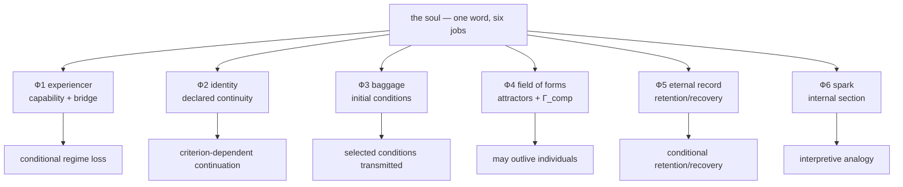

# The Soul: A Decomposition

:::info Scope of the comparison
This is a comparative interpretation [I], with hypotheses attached to the physical/phenomenal map. “Confirmed/refuted” below must be read at the declared model scope; the revised kernel does not establish universal soul, survival or clinical verdicts. Numerical gates, observer sections and state-transfer theorems have distinct types.
:::

> *"If the eye were an animal, sight would be its soul."*
> — Aristotle, *De Anima* II.1, 412b18

:::info Bridge from the previous chapter
[Panpsychism](/docs/consciousness/comparative/panpsychism-analysis) ended with UHM's own position — **pan-interiority**: every configuration has an inner side, but consciousness is a thresholded regime, not a universal property. This chapter turns to a longstanding name used for several aspects of living and personhood — the **soul** — and asks the question at full rigour. Which proposed functions admit a precise model? What would connect that model to a historical claim? Which questions require different kinds of evidence? Pan-interiority and the phenomenal reading of the numerical gates remain interpretations [I/H].
:::

## Chapter roadmap

1. **A question that must be dismantled** — the five jobs of one word; the rules of the method
2. **The instrument panel** — the selected definitions and conditional results
3. **The decomposition** — six components of "soul", each with its formal object and its fate
4. **The register of assessments** — distinctions, supported results and open bridges
5. **The traditions under the panel** — Egypt, Greece, Aristotle, the Stoa, Buddhism, Vedānta, Kabbalah, Christianity, Sufism, Daoism, Gnosis, Jung, Sheldrake, the Akashic records, spiritism
6. **Structural convergences** — the layer architecture; body–soul–spirit, typed
7. **The direct questions** — when a soul begins; pre-existence; māyā; whether new mathematics is needed
8. **Where the theory is silent** — the honest boundary of jurisdiction

:::note On notation
In this document:
- $\Gamma$ — [coherence matrix](/docs/core/dynamics/coherence-matrix), the state of a holon; $\gamma_{ij}$ — its elements
- $P=\operatorname{Tr}(\Gamma^2)$ — purity; $P_{\mathrm{crit}}=2/7$ is the declared cut used here, with physical interpretation requiring calibration [D/I/H].
- $R=1/(7P)$ — the canonical purity diagnostic; the selected $R\ge1/3$ criterion is equivalent to $P\le3/7$ [T under D], not a universal metacognition threshold.
- $\Phi=P/Q-1$, $Q=\sum_i\gamma_{ii}^2$ — integration in a specified frame; $\Phi\ge1$ is a declared gate [D].
- $D_{\text{diff}} = \exp(S_{vN}(\rho_E))$ — differentiation measure; threshold $D_{\min} = 2$ **[D]** (T-151, an independent L2 threshold)
- $C = \Phi \times R$ — [consciousness measure](/docs/consciousness/foundations/self-observation#мера-сознательности-c) (T-140)
- $\varphi$ — [self-modelling operator](/docs/consciousness/foundations/self-observation#теорема-о-неподвижной-точке); $\Gamma^* = \varphi(\Gamma^*)$ — its fixed point
- $\mathcal{L}_\Omega = \mathcal{L}_0 + \mathcal{R}$ — [evolution equation](/docs/core/dynamics/evolution); $\mathcal{R}$ — the regenerative term
- $K(\tau)$ — [memory kernel](/docs/consciousness/states/attention-memory#память); $\mathrm{Gap}(i,j)$ — [opacity of a channel](/docs/core/dynamics/gap-operator)
- $\Gamma_{\text{comp}}$ — [composite matrix](/docs/core/dynamics/composite-systems#составная-матрица); $\mathcal{U}_{\text{coll}}$ — [collective unconscious](/docs/consciousness/subjects/collective-consciousness#определение-коллективного-бессознательного)
- L0–L4 — [interiority hierarchy](/docs/consciousness/hierarchy/interiority-hierarchy); SAD — [self-awareness depth](/docs/consciousness/hierarchy/depth-tower)
- Statuses: **[T]** theorem · **[C]** conditional · **[D]** definition · **[I]** interpretation · **[P]** postulate/open — see [Status Registry](/docs/reference/status-registry)
:::

:::warning Document status
This chapter proposes comparisons [I], not proofs of religious doctrines. Definitions of model quantities, conditional mathematical results and empirical hypotheses [H] must remain distinct. A historical summary names selected texts or schools; it does not establish a uniform doctrine across every period. Unverified historical generalizations are not premises of the mathematics.
:::

---

## 1. A question that must be dismantled {#вопрос-который-надо-разобрать}

### 1.1 The five jobs of one word {#пять-работ-одного-слова}

Ask a Vedāntin, a Rabbi, an Egyptian priest, a Platonist, and a modern spiritualist what the soul *is*, and you will receive five different job descriptions:

1. **Ф1 — the experiencer.** The soul is *that which feels*: remove it and the body becomes a machine in the dark.
2. **Ф2 — the bearer of identity.** The soul is *that which makes me the same person* across sleep, decades, and change.
3. **Ф3 — the subtle baggage.** The soul is *that which carries the past into new life*: karma, saṃskāras, inherited temperament — the answer to "why was I born this and not other?"
4. **Ф4 — the field of forms.** The soul is *that which shapes the living body*: the entelechy, the vegetative soul, the morphogenetic field.
5. **Ф5 — the eternal record.** The soul is *that which is not erased*: what survives when the body is dust.

And behind all five, a sixth intuition that is not a function but a relation:

6. **Ф6 — the spark.** The soul is *the point where the individual touches the absolute*: ātman, the scintilla animae, the image of God.

In everyday language and in most philosophy, one word does all six jobs. In software terms: "soul" is a **God object** — a single class that accumulated every responsibility the system could not otherwise place: rendering, persistence, networking, authentication. The question "does the God object exist?" has no useful answer. The useful act is **refactoring**: split the responsibilities into interfaces, find which component actually implements each, and discover — this is the crucial point — that the components have **different lifecycles**. Some die with the process. Some are serialized. Some were never instance members at all, but static properties of the class.

That refactoring is what this chapter performs. The result, stated in advance:

| Function | Formal analogue | Scope of continuation |
|---|---|---|
| Ф1 experiencer | Capability regime plus a phenomenal bridge | Depends on the actual dynamics and bridge |
| Ф2 identity | Declared criterion on state/model histories | State transfer and personal continuity are distinct |
| Ф3 baggage | Initial conditions and incoming influences | Selected conditions may be transmitted through specified channels |
| Ф4 field of forms | Attractors, learned dynamics and composite patterns | May persist while carriers and reproduction mechanisms persist |
| Ф5 eternal record | Retention and recovery on a specified channel | No complete archive follows from trace preservation |
| Ф6 spark | Observer-section or type analogy | Philosophical interpretation, not an immortality theorem |

### 1.2 Why the intended meaning matters {#почему-да-и-нет-оба-неверны}

A six-part question makes the proposed meanings and evidence explicit. The revised formalism supplies conditional state/capability results; it does not by itself refute personal transmigration or prove that a complete personal record survives. Those questions require a physical channel and identity/phenomenal bridge (§3.3–§3.5).

This is not evasion. It is the same move mathematics made with the question "do infinitesimals exist?" — unanswerable as posed, resolved by decomposition into limits, differentials, and nonstandard extensions, each with its own precise existence claim.

### 1.3 Rules of the method {#правила-метода}

- **M1. Type the claim.** Separate the historical account, the proposed mathematical analogue, the empirical bridge and the conclusion. A theorem about the analogue does not validate the bridge.
- **M2. State the tested scope.** A refutation requires explicit assumptions and an actual contradiction. Absence of a mechanism from one effective equation does not prove physical impossibility; lack of supporting evidence does not prove impossibility either.
- **M3. Compare structure without erasing differences.** A structural analogy suggests a research question. Similar counts of layers provide no mathematical identification; similar order does not establish common doctrine or mortality boundaries.
- **M4. Keep conditional premises visible.** Fixed points, decay, cloning and recovery retain their own assumptions. A philosophical conclusion cannot acquire stronger status by citing them together.
- **M5. Identify sources and uncertainty.** Attribute claims to texts or schools. Where a historical interpretation remains disputed or has not been checked against a specified passage, label it as a provisional summary rather than the tradition's definitive position.

## 2. The instrument panel {#приборная-панель}

Before weighing any tradition, we lay out every instrument the formalism provides. A reader who knows the corpus may skim; the section exists so that §3–§7 need no external references.

### 2.1 The holon and the seven dimensions {#голоном-и-семь-измерений}

A **holon** is represented here by a density matrix $\Gamma \in \mathcal{D}(\mathbb{C}^7)$ — a Hermitian, positive semidefinite, trace-one seven-by-seven matrix (48 real parameters) — together with separately specified processes of self-maintenance. The seven basis directions are functional labels in the chosen model. Claims of minimality depend on the stipulated admissibility and representation assumptions; they do not prove that every possible organism or philosophy has exactly this ontology:

| Dimension | Verb | One line |
|-----------|------|----------|
| $A$ — Articulation | to distinguish | the making of differences |
| $S$ — Structure | to hold | the keeping of form |
| $D$ — Dynamics | to change | the unfolding of process |
| $L$ — Logic | to cohere | the consistency of the whole |
| $E$ — Interiority | to experience | the inner side itself |
| $O$ — Ground | to sustain | grounding/resource role; a clock requires its own construction |
| $U$ — Unity | to integrate | the binding into one |

The diagonal entries are populations and the twenty-one off-diagonal pairs are coherences in this frame. Calling those entries channels of experience is an interpretation requiring a readout. UHM proposes a monist account; this philosophical choice is not a theorem excluding every ontology that is absent from the chosen representation.

### 2.2 Four measures and the window of consciousness {#четыре-меры-и-окно}

The declared numerical kernel uses $P=\operatorname{Tr}\Gamma^2$, $Q=\sum_i\gamma_{ii}^2$, $R=1/(7P)$ and $\Phi=P/Q-1$. Since $P=1/7+\|\Gamma-I/7\|_F^2$, canonical $R$ is a purity diagnostic, not proof of reflective competence. The chosen $R\ge1/3$ cut is equivalent to $P\le3/7$ **[T under D]**; triadic category theory does not force this cut.

A declared differentiation variable $D_{\rm diff}$ is separate from this seven-dimensional matrix. The minimal one-dimensional E-sector has entropy zero and effective rank one; an extended $\rho_E$ requires its actual normalised construction. The operational $\mathrm{Cap}_2$ certificate checks $P>2/7$, $R\ge1/3$, $\Phi\ge1$ and $D_{\rm diff}\ge2$ **[D]**. Reading that certificate as experience is **[I/H]**. Purity below $2/7$ alone is not a universal physical death theorem.

For a specified model map $M$, $R_M=1-\|\Gamma-M\Gamma\|_F^2/P$ differs from canonical $R$ and can be negative. Consecutive-iterate fidelity can equal one at a trivial fixed point, so it cannot alone certify metacognition. See [typed self-observation](/docs/consciousness/foundations/self-observation#формы-r).

| Level | Declared mathematical/operational content | Phenomenal reading |
|---|---|---|
| L0 | Interior aspect assigned to an admitted state [D] | Pan-interiority [I] |
| L1 | Specified nontrivial experiential sector/model [D/H] | Content geometry [I/H] |
| L2 | Full $\mathrm{Cap}_2$ certificate in a fixed readout | Experience bridge [I/H] |
| L3 | L2 plus an independent held-out metamodel prediction test [D/Pr] | Metacognition [H] |
| L4 | Explicit stronger higher-order certificate; no universal biological ceiling | Unitary-consciousness interpretation [I/H] |

The same phase Gap profile can accompany different purity/integration gates; zero phase Gap is not complete self-knowledge. A chosen Fano SAD score has a maximum index of three **by its definition**, not a theorem limiting cognitive recursion. No diagnoses or infant developmental dates follow from these static scalars.

### 2.3 Effective dynamics and the regeneration term {#динамика-и-эр}

The displayed effective equation separates two non-unitary terms; this is a selected model, not an exhaustive theorem about all physical interactions:

$$
\frac{d\Gamma}{d\tau} = -i[H_{\text{eff}}, \Gamma] + \underbrace{\mathcal{D}_\Omega[\Gamma]}_{\text{decoherence}} + \underbrace{\kappa(\Gamma)\,(\varphi(\Gamma) - \Gamma)\,g_V(P)}_{\mathcal{R}\text{: regeneration}}
$$

The chosen dissipative term $\mathcal D_\Omega$ and self-model map $\varphi$ require explicit definitions. For $\kappa g_V\ge0$, the regeneration direction points toward $\varphi(\Gamma)$; well-posedness and preservation of the state domain must be established for the full equation. The rate convention $\kappa_0=\omega_0|\gamma_{OE}||\gamma_{OU}|/\gamma_{OO}$ requires $\gamma_{OO}>0$ or a separately justified extension. A selected gate $g_V=0$ below $P_{\mathrm{crit}}$ does not prove absence of other inputs or mechanisms.

The displayed regeneration term is an intramodel update, not an inter-holon state-transfer channel by definition. Its gating does not prove universal irreversibility, absence of other physical couplings, or a metaphysical prohibition on transfer; these require the actual full dynamics.

Revised [No-Zombie](/docs/applied/coherence-cybernetics/theorems#теорема-81-условная-необходимость-интериорности-no-zombie) retains only model-specific conditional balance results. The universal E-coherence floor and inference from viability to an experiencer are withdrawn; independent input or bootstrap invalidates the closed-loss premise. A phenomenal bridge remains [I/H].

### 2.4 Death, irreversibility, and the state I/7 {#смерть-и-необратимость}

The conjunction $P\le2/7$ and $dP/d\tau\le0$ is a chosen model label **[D]**, not a clinically validated universal criterion. Under a specified primitive unital mixing semigroup, the state can converge to $I/7$; a nonunital generator can instead converge to a purer state. Turning off one regeneration term does not prove every remaining dynamics cannot recover purity. A nonnegative bootstrap or independent input must be included in the balance.

For the special depolarising equation $\dot\Gamma=\lambda(I/7-\Gamma)$, $\lambda>0$, the exact solution gives

$$
P(t)=\frac17+\left(P(0)-\frac17\right)e^{-2\lambda t}.
$$

It is the **excess purity**, not purity itself, that decays exponentially. Its equilibrium has $\Phi=0$ and chosen $C=0$, but zero coherences have undefined phase Gap; they are not twenty-one phase-opaque channels.

A clinical sequence of loss/recovery of metacognition, integration or memory is **[H/Pr]** and requires independent temporal evidence. Static purity cuts do not force that order or imply disappearance of a mathematical fixed point. Phenomenal extinction and personal identity are separate bridge/convention claims.

### 2.5 Identity, fixed points and transfer {#тождество-и-запреты}

A fixed point of a declared self-model map exists/varies continuously only under its actual hypotheses. A strict contraction on a complete metric state space has a unique fixed point; parameter continuity bounds require a uniform contraction constant and parameter regularity. A purity cut alone neither destroys fixed points nor forces distinct identity after a gap. Defining identity by continuity of a maintained trajectory is a convention **[D/I]**, not a quantum no-go theorem.

**Exact no-cloning [T at scope].** No one channel can clone an arbitrary unknown nonorthogonal pure-state family. In an isometric dilation, input overlap $z$ would equal $z^2$ times an environment overlap of modulus at most one, requiring $|z|\le|z|^2$, impossible for $0<|z|<1$. Exact broadcasting of a declared family of density states is possible only for a commuting family. These results concern a *single state-independent process for a family*, not the presence of off-diagonal entries in one known state. See the primary [no-broadcasting theorem](https://arxiv.org/abs/quant-ph/9511010).

A known state can be independently prepared as many times as a physical preparation process permits. SWAP gives $\rho\otimes\sigma\mapsto\sigma\otimes\rho$ and transfers the arbitrary input intact to another register; it does not erase that input. Standard teleportation consumes source-register entanglement/measurement resources while transferring the state, rather than proving destruction of an experiencing subject. Whether transfer, reconstruction or two identical preparations preserve a person requires a separately specified identity bridge **[I/H]**. See [corrected death/continuity scope](/docs/consciousness/ethics-meaning/death-continuity#no-cloning).

### 2.6 Memory, loss and retrieval {#память-и-ядра}

A memory kernel $K(\tau)$ is one possible representation of history dependence, not the only form of memory. An exponential kernel can model fading influence; a power-law tail requires a stated domain and normalization/integrability conditions; a delta kernel is an instantaneous limit, not a finite sensory-retention interval. Numerical timescales require empirical calibration. Learned parameters and external records can also store information.

The important distinction for continuation is between **loss of accessible information** and **failure of a particular retrieval procedure**. Decay of one kernel does not prove erasure in every physical carrier. A phase Gap value does not certify that a record is recoverable. Recovery needs an actual encoding, accessible channel and decoder; see [death and continuity](/docs/consciousness/ethics-meaning/death-continuity#после-смерти) and [the temporal-memory readout](/docs/consciousness/phenomenology/temporal-consciousness#окно-памяти). Thus loss of a running process may end its current memory function while records elsewhere remain. Whether those records support reconstruction or personal continuity is a separate question.

### 2.7 The collective layer {#коллективный-слой}

Given an explicit subsystem representation, a joint state can be written as $\Gamma_{\mathrm{comp}}\in\mathcal D((\mathbb C^7)^{\otimes N})$, with local marginals obtained by partial trace. Failure to factorize means correlation, not necessarily quantum coherence or entanglement: even a diagonal mixture can be correlated. The marginal map is a description of a subsystem, not a causal force.

A single marginal generally does not determine the joint state. This limited observability does not prove that no individual can learn a collective pattern through repeated observations or communication. Cultural transmission requires actual interactions, records, learning and resources. Some patterns may persist across generations; others are lost or transformed. The proposed identification of selected collective patterns with Jungian archetypes is [I/H], not a consequence of nonfactorization or a proof of their universality.

### 2.8 The whole {#целое}

The cosmological realisation is a model proposal **[P/H]**; none of the following choices alone proves an inevitable universe or subject.

1. **Initial state.** The equal-amplitude pure anchor $|\psi_\odot\rangle\langle\psi_\odot|$ and the mixed matrix $I/7$ are different states. Symmetry does not identify them or prove absence of individuating physical information without a declared encoding.
2. **Stability.** A frozen unital generator fixes $I/7$; it need not be unstable. A pure anchor under a specified nonunital/input dynamics has different stability. Cosmogenesis requires the actual generator, Jacobian modes, constraints and control parameters. The former universal instability/inevitable individuation deduction is withdrawn; see [revised Origin](/docs/physics/cosmology-phys/origin#доказательство-нестабильности).
3. **Relational clock.** A Page–Wootters clock/system construction requires a chosen factorisation, constraint and conditioning rule. A seven-dimensional matrix alone does not impose a vanishing cosmological constraint or encode every entire trajectory.
4. **Observers.** Modelling an observer by an internal section is a declared categorical construction/readout **[D/I]**. It does not prove the physical or phenomenal identity of that section with a subject.
5. **Sector and frame.** Exact recovery holds on a declared isometric code; arbitrary substrate compression is not faithful. Canonical $P,R$ are unitary invariants, but $\Phi$ depends on the native frame and the experiential variable on its chosen sector. A compatible relabelling preserves the corresponding data; arbitrary $G_2$ quotienting does not preserve the full gate.
6. **Higher-order depth.** The optional Fano SAD index has a definitional maximum of three, whereas operational recursion requires independent predictive certificates. The universal ceiling and the purported $P_{\rm crit}^{(4)}=54/35$ cognitive deduction are withdrawn; [Depth Tower](/docs/consciousness/hierarchy/depth-tower#критическая-чистота-sad) imposes no universal cosmic depth.
7. **Transparency and bridge.** Hamming bounds require an actual coding model; they force no three opaque phase channels. Phase Gap cannot identify the full capability certificate. Lawvere applies to an evaluator meeting its hypotheses and supplies no universal T-214 prohibition of an internal phenomenal bridge. That bridge remains **[I/H]**, to be specified and supported independently.

## 3. The decomposition {#декомпозиция}

```mermaid
graph TD
    SOUL["the soul — one word, six jobs"]
    F1["Ф1 experiencer<br/>capability + bridge"]
    F2["Ф2 identity<br/>declared continuity"]
    F3["Ф3 baggage<br/>initial conditions"]
    F4["Ф4 field of forms<br/>attractors + Γ_comp"]
    F5["Ф5 eternal record<br/>retention/recovery"]
    F6["Ф6 spark<br/>internal section"]
    SOUL --> F1
    SOUL --> F2
    SOUL --> F3
    SOUL --> F4
    SOUL --> F5
    SOUL --> F6
    F1 --> D1["conditional regime loss"]
    F2 --> D2["criterion-dependent continuation"]
    F3 --> D3["selected conditions transmitted"]
    F4 --> D4["may outlive individuals"]
    F5 --> D5["conditional retention/recovery"]
    F6 --> D6["interpretive analogy"]
```

### 3.1 Ф1 — the experiencer: a regime, not a resident {#ф1-субъектность}

A candidate operational regime is the calibrated $\mathrm{Cap}_2$ certificate (§2.2). Its identification with the experiencer is **[I/H]**, not a mathematical identity theorem. The former universal No-Zombie proof is withdrawn: a dynamics can receive independent purity input or bootstrap, and a numerical E-coherence variable does not automatically denote experience.

A specified realisation needs a carrier, physical readout and differentiation model. Conditional loss of that regime under a declared mixing/no-repair dynamics is not universal phenomenal extinction. These requirements make the proposed comparison with “soul as a mode of living” explicit **[I]**; they neither prove nor refute every separable-soul doctrine.

### 3.2 Ф2 — the bearer of identity: a thread, not a token {#ф2-тождество}

The proposed formal analogue is continuity of a specified maintained state/model trajectory **[D/I]**. Its existence and stability require the conditions in §2.5; no scalar threshold proves a break of personal identity.

SWAP, teleportation, preparation of a known state and approximate classical reconstruction are different operations. No-cloning forbids an exact uniform copier for the relevant unknown family, not all reconstruction or transfer. Whether a successor, transferred register or duplicate is “the same person” is a declared identity criterion **[I/H]**, not a consequence of cloning impossibility. The former universal verdict that all these procedures destroy a subject is withdrawn.

### 3.3 Ф3 — inherited conditions {#ф3-багаж}

**Question.** Why do new organisms differ in capacities, dispositions and circumstances? Traditions also ask about responsibility, suffering and rebirth; those further questions should not be reduced to an account of newborn variation.

**Formal analogue [I/H].** A chosen initial condition $\Gamma(0)$ and subsequent inputs can model selected effects of biological inheritance, prenatal and later environments, and cultural transmission. These are examples of pathways, not a theorem that there are exactly two complete channels. Language and instruction usually influence a developmental history rather than fixing every component at birth. Only retained and causally transmitted effects of earlier lives enter such a model; not everything anyone contributed must survive.

Noise requires its own stochastic law. A deterministic master equation can describe the same ensemble evolution from identical data; random realizations can coincide, and correlated noise need not differentiate them. Therefore decoherence does not guarantee distinct outcomes.

:::note State transfer and identity [D/I/H]
Transmission of selected conditions is distinct from continuation of a person. The actual state-transfer process, resources and identity criterion must be specified. Neither a chosen purity gate nor no-cloning establishes completeness of the channels, universal irreversibility or impossibility of reconstruction (§2.4–§2.5).
:::

**Relation to karma [I].** Inherited consequences provide a useful comparison with conditioning across generations. They do not establish the religious law of karmic fruition, its relation to intention, or rebirth. In [AN 6.63](https://www.dhammatalks.org/suttas/AN/AN6_63.html), karma is tied to intentional action and its results; it is not simply a synonym for all genetic or cultural influence.

### 3.4 Ф4 — organization and formative mechanisms {#ф4-поле-форм}

**Question.** How do organized forms develop, maintain themselves and recur? Several mathematical mechanisms can address parts of this problem:

1. **Attracting dynamics.** Convergence requires a specified flow, domain and stability result. The presence of a regeneration term alone does not establish an attractor or explain all morphogenesis.
2. **Learned dynamics.** Changes in effective parameters can retain the effects of prior interactions. Identifying this with a particular habit requires a learning and retrieval mechanism.
3. **Composite patterns.** Interactions and records can propagate organization beyond one carrier. The representation $\Gamma_{\mathrm{comp}}$ does not itself supply those interactions or a new field.

**Conditional continuation.** A pattern can outlast an individual when other carriers and reproduction mechanisms preserve it. Those carriers may include nonliving records or engineered systems. Neither perpetual persistence nor the reproduction of every detail follows. This gives a concrete programme for studying lineage and organization without declaring all historical formative-field theories solved (§5.13).

### 3.5 Ф5 — the eternal record: Akasha, weak and strong {#ф5-вечность}

**What the traditions meant.** "Nothing is lost": the Akashic chronicle, the Book of Life, Spinoza's eternity of the mind.

:::note Information retention and recovery: distinct scopes [T/C/I]
Trace preservation means normalisation, not conservation of every coherence or a readable environmental archive. A specified global unitary dilation retains joint distinguishability, but reduced system/environment states separately can lose it. Recovery from an actual channel requires an injective/reversible restriction, a correctable code or additional accessible data; a generic erasure channel has no full inverse. Neither this nor no-cloning forbids all records, known preparations or code recovery. A Page–Wootters static-state construction is conditional and does not prove an eternal archive of every life. “Weak/strong Akasha” is an interpretation [I/H], not the former blanket retention/impossibility theorem.
:::
**Spinoza: a philosophical comparison.** *Ethics* V.23 distinguishes eternity from bodily duration. Comparing this with a static mathematical representation may clarify that a timeless proposition is different from an ongoing process. It does not translate Spinoza’s argument into Page–Wootters, establish an eternal record, or decide the contested meaning of the mind’s eternity. The proposed correspondence is [I], not a mathematical endorsement of his doctrine.

### 3.6 Ф6 — the spark as an interpretive question {#ф6-искра}

**Question.** Traditions speak of ātman, the divine image or a spark beyond ordinary individuality. These concepts differ about personhood, God and liberation.

**Two possible analogies [I].** An observer can be represented by a specified internal section/readout of a model. Several instances can also share a mathematical type. Neither construction identifies an experiencing subject with the absolute. An internal section need not exist without its categorical hypotheses, and its philosophical interpretation adds premises beyond them. Likewise, a seven-axis/Fano template is a chosen shared structure, not a theorem that every rational system instantiates one $G_2$ type.

**What the comparison preserves.** A perspective can depend on a larger organization, and a description can distinguish common structure from an individual's particular history. These are useful questions about situatedness and participation. A timeless type does not make its instances immortal; the existence of a section does not prove an unborn experiencer. “Spark” remains an interpretive comparison rather than a survival verdict.

## 4. The register of verdicts {#реестр-вердиктов}

The table distinguishes results inside a specified model from the historical or phenomenal claims that motivated it. An unestablished bridge remains unestablished even when the model has a theorem.

| # | Claim | Present assessment | Required distinction or evidence |
|---|---|---|---|
| 1 | Viability entails experience | Open [I/H] | Operational balance and phenomenal bridge |
| 2 | $C>0$ for every admitted state | False for canonical $C$ [C] | $C(I/7)=0$; this does not refute every panpsychist meaning of consciousness |
| 3 | Experience continues after departure from a body | Not settled here [I/H] | Carrier, process and phenomenal criterion |
| 4 | The same person returns | Not settled by no-cloning | Physical transmission and identity criterion |
| 5 | Resurrection restores the same subject | Not settled here [I/H] | Preparation/recovery and personal identity |
| 6 | Mediums communicate with surviving persons | Not established here [H] | Controlled information access and evidence of its attributed source |
| 7 | New lives inherit prior conditions | Selected pathways can be modelled [I/H] | Actual encoding and developmental influence; no exhaustive two-channel theorem |
| 8 | Collective organization shapes individuals | A modelling possibility [I/H] | Dynamics of interactions; nonfactorization alone is insufficient |
| 9 | Forms and habits preserve a past | Conditional [C/I/H] | Learning, retention and reproduction mechanisms |
| 10 | Earlier patterns influence distant later systems | Requires a specified competing model [H] | A declared causal exclusion can yield a null effect; equation omission is not a universal no-go |
| 11 | No information is ever lost | Conditional distinguishability result only [C] | Accessible joint unitary dilation versus reduced erasure |
| 12 | A complete record of lives is readable | Not established here [H] | Retention, accessible channel and decoder |
| 13 | The self is identical with the absolute | Philosophical interpretation [I] | Section/type analogies do not prove this identity |
| 14 | The absolute has infinite depth | Not refuted by SAD | A definitional finite score is not a universal recursion bound |
| 15 | Complete self-transparency | Requires a specified observation/representation problem | Phase Gap alone does not establish or forbid it |
| 16 | Persons pre-existed their present embodiment | Not settled by the chosen Source model [I/H] | Individuating encoding and continuity criteria |
| 17 | Process, legacy and personal continuation coincide | These are distinct claims [D/I/H] | A process can end while records remain; records do not settle subject identity |

The conclusions are component-specific. Individual and collective patterns can both be lost; both can sometimes be retained in another carrier. Mathematical type persistence and persistence of an experiencing person are different questions.

---

## 5. The traditions under the panel {#традиции}

The following accounts select texts, schools and motifs. They are not comprehensive histories or declarations that a tradition has one settled doctrine. The comparisons are [I]; model-to-world identifications require [H] evidence. Disputed readings are retained as disputed rather than used to prove a formal conclusion.

### 5.1 Egypt: the first decomposition {#египет}

**Doctrine.** Selected Egyptian funerary accounts distinguish several aspects of a person; there is no single inventory uniform across all periods. A person comprised the **ka** (vital double, born with you, requiring sustenance — hence funerary offerings of bread and beer, real then depicted, the depiction sufficing); the **ba** (individual personality, bird-bodied, mobile after death); the **akh** (the transfigured effective spirit, *achieved* — not given — through correct rites); the **ren** (the name: "to speak the name of the dead is to make them live again," say the tomb inscriptions, and erasing a name from monuments was the true second death); the **shut** (shadow); and the **ib** (heart), weighed against the feather of Maat (Book of the Dead, ch. 125) — the organ of the life's moral summary.

**Comparison [I].** Names, ritual maintenance, vitality and post-mortem standing distinguish several questions about a person. Remembering a name can be compared with maintaining a cultural record; offerings can motivate a comparison with dependence on sustaining practices. Neither comparison translates ka into free energy or akh into a community's computational product.

**Assessment.** The multi-component account helps resist treating every use of “soul” as the same object. UHM does not confirm Egyptian afterlife ontology or prove experienced survival of ba/akh impossible. The relative roles of particular components vary across texts and periods; the brief account above is a provisional historical synthesis, not one universal Egyptian layer model.

### 5.2 Greece before Aristotle: Orphics, Pythagoras, Plato {#греция-платон}

**Doctrine.** The Orphic current: *sōma sēma* — "the body a tomb" (reported at Plato, *Cratylus* 400c) — the soul a fallen divine spark cycling through bodies until purified. Pythagoras taught transmigration across species; Xenophanes mocked him for it — "stop beating the dog; I recognized a friend's soul in its yelp" (DK 21 B7) — incidentally preserving the doctrine's clearest witness. Plato systematized: the soul is immortal (*Phaedo*: four arguments), pre-exists (*Meno* 81–86: the slave boy "recollects" geometry never taught — anamnesis), transmigrates (*Republic* X 614b: the myth of Er — souls choose their next lives, then drink of Lethe and forget), and is tripartite (*Republic* IV: *logistikon* reason, *thymoeides* spirit, *epithymētikon* appetite).

**Mapping [I] and engagement.** The Phaedo’s cyclical, recollection, affinity and life-principle arguments can be compared to trajectory, learning, type/token and regime constructions. The comparison does not prove a universal irreversible death asymmetry, instantiate recollection through a forced seven-axis grammar, or settle rebirth. Testing a proposed continuity or memory-transfer claim requires its actual dynamics, observable channel and identity bridge; metaphysical analogies carry no matrix-theorem status.

**Assessment [I].** Recollection, tripartition and the myth of Er supply distinct philosophical questions. A common mathematical type is not a proof of anamnesis, and the story of forgetting does not by itself refute Plato’s account of identity. Neither transmigration nor its impossibility follows from the present mapping.

### 5.3 Aristotle: organization and differentiated capacities {#аристотель}

**Doctrine.** *De Anima* II.1, 412a27: "the soul is the first actuality (*entelecheia*) of a natural body having life potentially." Not a resident but the body's *being-at-work-staying-itself*; hence 412b18 — if the eye were an animal, sight would be its soul; and hence inseparability — with one comparison Aristotle raises only to leave hanging (II.1, 413a8): whether the soul is in the body as a sailor in a ship; the scope of separability remains an interpretive issue, especially for intellect. Three nested capacities: **threptikon** (nutritive — all living things), **aisthētikon** (sensitive — animals), **noētikon** (rational — humans). One disputed exception: *De Anima* III.5's **nous poiētikos**, the active intellect, "separable, impassible, unmixed" — over which two millennia of commentators fought: Alexander of Aphrodisias and Averroes developed different accounts; their precise relation to personal immortality is disputed and is not decided here.

**Comparison [I].** Aristotle's differentiated capacities suggest studying organization through what it enables: maintenance, perception and reasoning. These are separate empirical tasks. A purity threshold does not establish nutritive life, a matrix rank does not establish sensation, and the $\mathrm{Cap}_2$ certificate does not by itself establish rationality.

The active intellect remains a disputed historical problem. Alexander's and Averroes's accounts must not be collapsed into one doctrine merely because both distinguish intellect from ordinary embodied faculties. The universal claim T-223 is withdrawn [✗]. Invariance under a specified group survives as a mathematical result; it establishes neither an immortal common mind nor a universal $G_2$ soul type.

**Assessment.** Embodied organization is a productive comparison; identifying entelechy with a viability regime is an interpretation rather than a translation theorem. No universal mortality or survival conclusion follows.

### 5.4 The Stoa and Epicurus {#стоя-и-эпикур}

**Doctrine.** For the Stoics the soul is **pneuma** — fiery breath, a *tensional state* (*tonos*) of one cosmic continuum, graded by tension: *hexis* (cohesion — stones), *physis* (growth — plants), *psychē* (impression and impulse — animals), *logos* (rational organization; distinct from the ethical achievement of wisdom). Death: the individual pneuma-knot relaxes back into the whole; Chrysippus allowed that the souls of the wise persist as coherent knots until the world-conflagration (*ekpyrōsis*), after which the cycle repeats identically (*palingenesia*). Marcus Aurelius IX.35: "loss is nothing but change" — already canonized in the corpus. Epicurus: the soul is fine atoms dispersed at death; "death is nothing to us" — a philosophical argument whose relation to deprivation, anticipation and grief needs separate examination.

**Mapping [I].** The tonos account offers a comparison between a common physical order and individuated organisations maintained within it. This can guide questions about dependence and change, but neither $\Phi$ nor $P$ is a historical or empirically validated measure of pneuma. Trace preservation is normalisation; it does not prove that a deceased person's structure redistributes intact. Continued organisation needs an actual carrier, dynamics and resources. Attractors in one specified model do not exclude cycles in every possible model.

**Assessment [I/H].** Maintenance and transformation are useful points of comparison. Post-mortem persistence and recurrence require separately stated physical hypotheses; the conditional decay theorem alone neither validates nor universally refutes them.

### 5.5 Buddhism: anattā, the flame, and the bardo {#буддизм}

**Texts and distinctions.** [SN 22.59](https://www.dhammatalks.org/suttas/SN/SN22_59.html) examines form, feeling, perception, formations and consciousness as impermanent and not appropriately identified as self or possession. This is the specific not-self analysis cited here; a further assertion about everything “behind experience” needs a separate argument. The *Milindapañha* uses the chariot and flame as images for designation and continuity; their use here is an analogy, not a derivation of rebirth.

Karma concerns intentional action and its results, not all causation indiscriminately (AN 6.63, §3.3). Accounts of rebirth therefore cannot simply be replaced by genetic or cultural inheritance. Tibetan bardo literature presents particular contemplative and ritual accounts of dying and transition; its dissolution sequence is neither a universal Buddhist doctrine nor an established physiological L-level sequence.

Nibbāna also requires a distinction. [Itivuttaka 44](https://www.dhammatalks.org/suttas/KN/Iti/iti44.html) describes liberation with remaining life faculties, where pleasure and pain can still be experienced, and distinguishes this from the remainderless case. Thus “cessation of the entire conditioned stream” is not an adequate definition of liberation during life. Broader claims about the unconditioned and post-mortem status require their own textual and interpretive scope.

**Comparison [I].** The aggregates suggest examining several aspects of embodied experience without identifying them with matrix axes:

| Aggregate | Possible research question |
|---|---|
| rūpa — form | What bodily organization supports the investigated capacity? |
| vedanā — feeling-tone | How are pleasant, unpleasant and neutral tone distinguished? |
| saññā — perception/recognition | What distinguishes recognition from raw discrimination? |
| saṅkhāra — formations | How do intentions and dispositions affect subsequent processes? |
| viññāṇa — consciousness | Which state/report/experience bridge is being proposed? |

The [organization/lineage distinction](/docs/consciousness/ethics-meaning/death-continuity#определение-идентичности) makes a related separation between structure and causal continuation. It neither confirms nor refutes Buddhist rebirth. A model of conditioned variables may address changes in attention, attachment and response without deciding whether it represents what a tradition calls unconditioned. Finite Gap or SAD scores establish no universal bound on liberation.

**Assessment [I/H].** These distinctions support specific investigations of identification, conditioning and suffering. The matrix formalism does not confirm Buddhism as a whole, settle bardo or rebirth, or identify liberation with erasure of a subject. See the [spiritual synthesis](/docs/consciousness/ethics-meaning/spiritual-synthesis).

### 5.6 Vedānta: identity and its interpretations {#веданта}

**Doctrine.** The Upaniṣadic core: **ātman** — the self beyond all objects — is **Brahman**, the ground of all; *Chāndogya* VI teaches it through salt dissolved in water (everywhere, invisible, tasted in every drop: "*tat tvam asi*, Śvetaketu — that thou art," 6.8–6.16). The *Māṇḍūkya* maps four states: *jāgrat* (waking), *svapna* (dream), *suṣupti* (deep dreamless sleep), and **turīya**, "the fourth" — not a state among states but the witness of all three. The *Taittirīya* (II.1–5) gives the **pañcakośa**: five sheaths around the self — *annamaya* (food/body), *prāṇamaya* (vital breath), *manomaya* (mind), *vijñānamaya* (discernment), *ānandamaya* (bliss). Śaṅkara's Advaita: the individual soul (*jīva*) is ātman *plus* limiting adjuncts (*upādhi*) — body, mind, history; bondage is superimposition (*adhyāsa*), the rope mistaken for the snake; liberation is knowledge, not travel. The subtle body (*sūkṣma-śarīra*) is said to carry saṃskāras across deaths until liberation. Against all this, Madhva's Dvaita held souls eternally distinct from God and each other.

**Comparison [I].** The distinction between a particular biography and a proposed deeper ground invites a comparison with instance/type and observer/whole relations. This does not make *tat tvam asi* identical with T-221: a section of a model is not the Advaitic identity of ātman and Brahman. Nor does a fixed point or low integration score establish turīya or dreamless sleep.

The opening summary follows an Advaita-oriented reading of the cited Upaniṣads; Dvaita and other Vedānta schools dispute its interpretation. Kośas, upādhis and turīya therefore retain their own meanings rather than being asserted as matrix layers. A shared type cannot decide whether individuality is ultimately real.

**Assessment [I/H].** Self-inquiry and the distinction between identification and awareness offer philosophical comparisons. Rebirth, the subtle body and ultimate identity remain separate claims. Neither no-cloning nor the Fano SAD convention refutes them, and neither a section nor a type confirms them.

### 5.7 Kabbalah: five names and gilgul {#каббала}

**Doctrine.** Rabbinic-kabbalistic anthropology stratifies the soul: **nefesh** (the vital soul, common to all that lives, remaining near the body), **ruaḥ** (the moral-emotional spirit), **neshamah** (the intellectual soul, divine in origin) — the Zohar's triad — extended in Lurianic teaching (Ḥayyim Vital, *Shaʿar ha-Gilgulim*) by **ḥayyah** and **yeḥidah**, the living essence and the point of unity with the Infinite (*Ein Sof*). The same school systematized **gilgul** — transmigration of souls for the sake of **tikkun**, repair: a soul returns until its uncompleted work is done; **ibbur** ("impregnation") allows a righteous soul to lodge temporarily in a living person to assist.

**Comparison [I].** Distinctions among vitality, moral life, understanding and relation to the divine can be compared with different explanatory tasks. Their order does not establish a common mortality gradient with kośas or UHM gates. Yeḥidah is not defined here as the disappearance of personal identity.

Tikkun can motivate reflection on responsibility for inherited conditions and collective repair. This is a secular analogue, not a replacement of its theological meaning. Gilgul and ibbur require separate accounts of what persists, how it interacts and how identity is recognized; one fixed-point model neither proves nor excludes them.

**Assessment.** Productive analogy [I], with historical interpretation depending on the text and school. No theorem here confirms the ladder or settles personal return.

### 5.8 Christianity: form, resurrection, energies, spark {#христианство}

**Doctrine.** Four strands must be separated, because they fare entirely differently.

1. **The soul as form of the body.** Aquinas, receiving Aristotle: *anima forma corporis* (Summa Theologiae I q.76 a.1) — the soul is not a pilot in a vessel but the body's substantial form. Aquinas then argues the intellectual soul is *subsistent* — able to survive as an "incomplete substance," unnaturally, awaiting reunion.
2. **Resurrection of the body.** The creedal claim (1 Cor 15): the dead are raised — the same persons, embodied anew.
3. **Where souls come from.** The old dispute: **creationism** (each soul freshly created by God — Jerome, and dominant later) versus **traducianism** (the soul propagated from the parents' souls — Tertullian); Augustine famously could not decide.
4. **The mystical strands.** Gregory Palamas (*Triads*): God's **essence** (*ousia*) is absolutely imparticipable; His **energies** (*energeiai*) are genuinely participable — deification (*theōsis*) is real contact with the energies, never possession of the essence. Meister Eckhart (German sermons): the **Fünklein**, the little spark, the "ground of the soul" that is one with the "ground of God" — "the eye with which I see God is the eye with which God sees me."

**Mapping [I] and engagement.** The regime/type reading can be compared to forma corporis and the essence/energies distinction as an interpretation. Exact no-cloning of an unknown nonorthogonal family does not prove resurrection impossible; known-state preparation and SWAP have different scopes. Identity across reconstruction is a bridge/convention, and the former unconditional Lawvere claim that no internal section can describe the whole is withdrawn unless a real evaluator/diagonal system is exhibited. These qualifications preserve the comparison without presenting a historical or theological verdict as a matrix theorem.

**Assessment [I/H].** Embodied form, personal resurrection, creation and participation are distinct claims. None is confirmed or refuted by calling the state a regime or the observer a section. Biological inheritance does not resolve creationism versus traducianism, and Palamas’s theological energies are not identified with physical free energy. The comparisons with Aquinas, Palamas and Eckhart remain interpretive.

### 5.9 Sufism: fanā and baqā {#суфизм}

**Doctrine.** The Sufi map of the person: **nafs** (the self, graded — *an-nafs al-ammārah*, the commanding self, Qurʾān 12:53; *al-lawwāmah*, the self-reproaching, 75:2; *al-muṭmaʾinnah*, the self at peace, 89:27–28), **qalb** (heart), **rūḥ** (spirit — breathed into man by God, 15:29), **sirr** (the secret). The path's summit: **fanā** — annihilation of the self in God (al-Junayd's sober school; al-Ḥallāj's ecstatic "*anā al-ḥaqq*," "I am the Truth," associated with the later reception of his execution; its historical causation is not reduced here to one utterance) — followed, in the mature doctrine, by **baqā**: subsistence, the return to creatures with the self transformed. The maxim: *mūtū qabla an tamūtū* — "die before you die."

**Comparison [I/H].** Fanā and baqā can prompt investigation of altered self-identification and durable changes in action after a practice. A changing self-model and learned dispositions are possible models, but their relation to these religious concepts requires evidence and interpretation. Neither phase Gap nor $R_M$ establishes ego dissolution, spiritual attainment or safety of a practice.

“Die before you die” is a spiritual formulation here, not a reversible simulation of physiological death. Maintaining $P>2/7$ supplies no clinical safety certificate. A model section also cannot decide the truth of al-Ḥallāj's utterance, whose interpretation and historical setting are contested.

**Assessment.** The distinction between a transient experience and enduring transformation is fruitful. Identification with divine truth and accounts of rūḥ remain theological claims; they are not resolved by type/token terminology.

### 5.10 Daoism: hun and po {#даосизм}

**Doctrine.** Selected Chinese ritual and Daoist accounts distinguish the **hun** (魂) — the ethereal, yang soul(s), associated with breath-qi — and the **po** (魄) — the corporeal, yin soul(s), associated with the body. The *Liji* states the fates: at death "the hun-breath returns to Heaven; the bodily po returns to Earth." Later Daoist systematics (Ge Hong, *Baopuzi*) counted three hun and seven po. Zhuangzi (ch. 18), drumming on a tub after his wife's death, gives the philosophical register: her death is one more transformation in the changes of qi — the passage presents a response to grief through reflection on transformation, not a theorem denying bereavement.

**Comparison [I].** Hun and po distinguish aspects of embodiment and post-mortem transformation in selected Chinese accounts. They are not simply “cultural pattern” and “material carrier,” and no theorem maps their respective fates to two UHM channels. Zhuangzi's account can invite reflection on change and grief without making conservation of trace an ethical argument or proving that no personal loss occurs.

**Assessment.** Transformation and dependence are interpretive meeting points. Claims of personal immortality require their own evidence and criteria. The counts of hun and po provide no support for seven-dimensional minimality; the historical associations vary across sources.

### 5.11 Gnosis: the inverted spark {#гнозис}

**Doctrine.** The Gnostic systems (Valentinian and kin): the world is the botched work of a lesser demiurge; the human carries a **pneumatic spark** fallen from the true, alien God; salvation is *gnōsis* — the knowledge that awakens the spark and extracts it from matter. Humanity divides into *hylics* (matter-bound), *psychics* (soul-bound, salvageable by works), *pneumatics* (spirit-bearing, saved by knowledge).

**Comparison [I].** Some Gnostic narratives locate liberation in knowledge of a person's relation to a larger order. This can be compared with changes in self-understanding. The proposed dualism conflicts with UHM's chosen monist interpretation, but conflict between starting ontologies is not a mathematical refutation of one by the other. Background independence supplies no theorem about every possible theological “outside.”

**Assessment.** The analogy of a spark remains interpretive. Ancient Gnostic texts differ in cosmology and anthropology; a static threefold classification should not be attributed uniformly to all of them or identified with the L-hierarchy. Neither salvation nor fixed human worth follows from a matrix gate.

### 5.12 Jung: archetypes and collective-pattern models {#юнг}

**Doctrine.** Jung posited, beneath the personal unconscious, a **collective unconscious** common to the species, structured by **archetypes** — Hero, Shadow, Great Mother, Wise Old Man — recurring in myths and dreams of unconnected cultures. The nature of these forms, their proposed inheritance and the evidence for cross-cultural universality remain separate historical and empirical questions.

**Comparison [I/H].** The corpus's use of the name “collective unconscious” for selected composite structures is a modelling proposal. It does not prove Jung's theory by definition. Recurring symbolic patterns can motivate competing hypotheses involving learning, transmission, shared developmental constraints and recurrent environments. Their relative explanatory roles need evidence; cultural transmission alone cannot be declared the resolved mechanism of every archetype.

**Assessment.** Collective patterns and individual access are testable questions once observations and interactions are specified (§2.7). Neither the universality of particular archetypes nor the exclusion of biological contributions follows from partial trace or group-level stability.

### 5.13 Sheldrake: competing formative explanations {#шелдрейк}

**Doctrine.** Rupert Sheldrake (*A New Science of Life*, 1981; *The Presence of the Past*, 1988) proposed: (1) **morphogenetic fields** guide development — form is underdetermined by genetics; (2) **nature's memory** — the regularities of nature are habits, reinforced by repetition, not timeless laws; (3) **morphic resonance** — similar patterns influence subsequent similar patterns *across space and time by a proposed morphic influence*, cumulatively: rats worldwide should learn a maze faster once many rats have learned it (his reading of McDougall's multi-generation Harvard experiment), new compounds should crystallize more readily everywhere once crystallized anywhere.

**Comparison and test [I/H].** Development, recurrence and memory are genuine explanatory tasks. Their existence does not establish Sheldrake's proposed mechanism; representing collective states does not explain all of them either. An influence missing from one effective equation is not forbidden by category theory or background independence.

A precise null model can still make a sharp prediction. Suppose an intervention changes an earlier pattern $X$, while the later outcome obeys $Y=F(Z,\xi)$ and the joint law of $(Z,\xi)$ is invariant under that intervention. Then

$$
\mathcal L(Y\mid\operatorname{do}(X=x))
=\mathcal L(Y\mid\operatorname{do}(X=x'))
$$

for admitted interventions [C]. This is an explicit causal-independence assumption, not a universal zero-effect theorem of UHM. A competing resonance model must specify how and by how much it changes that law. Reproducible disagreement would challenge the stipulated causal model; it would not alone identify the cause or establish that every ordinary physical pathway had been excluded.

**Assessment.** The resonance hypothesis is not established by the formal analogies in this chapter. No comprehensive experimental verdict is supplied here. A controlled comparison of quantitative models is the appropriate next step, with shared materials, information and environmental influences included in the causal account.

### 5.14 Ākāśa and the Theosophical records {#акаша}

**Doctrine.** In Indian cosmology **ākāśa** is the fifth element — space itself as the subtle medium, carrier of sound (*śabda*). Theosophy (Blavatsky, *The Secret Doctrine*, 1888) transformed it into the **Akashic records**: a permanent, universal, *readable* register of all events, thoughts, and lives, consulted by clairvoyance (Leadbeater; Steiner's *Aus der Akasha-Chronik*; Edgar Cayce's "readings").

**Mapping [I/H].** An archive analogy needs an actual retention and recovery channel. Trace conservation supplies no immutable register; a static constrained model does not prove that every accessible environmental state contains every life. Generic erasure prevents full inversion, while reversible restrictions and correctable codes can permit recovery. No-cloning of an unknown family does not forbid reading a classical record or preparing a known state. The weak/strong archive verdict remains model-dependent (§3.5).

**Assessment [I/H].** Both a universal archive and privileged access to it need evidence beyond the stated formalism. Ordinary records and cultural transmission can explain some acquired information, but they cannot be declared the source of every claimed reading without examining the case. Retention, recovery accuracy and attribution to a particular life are separate tests.

### 5.15 Spiritism {#спиритизм}

**Doctrine.** Allan Kardec (*Le Livre des Esprits*, 1857) codified the séance age: surviving personalities, retaining memory and character, communicate through mediums.

**Comparison [I/H].** A claim of communication with a deceased person has at least three components: information was obtained; ordinary access does not account for it under the protocol; its source is that surviving person. These are distinct evidential steps. Memory held by participants, records and information leakage are possible explanations to test, not a universal explanation established without investigation.

**Assessment.** The formalism neither establishes the claimed communication nor proves every post-mortem carrier impossible. A fixed point's mathematical existence and a kernel's effective decay do not decide the source of a message. Controlled recovery of independently specified information would address one component; phenomenal survival and personal attribution require further criteria.

---

## 6. Structural convergences {#структурные-совпадения}

Several traditions distinguish bodily life, perception, understanding and a person's relation to a larger order. Comparing these distinctions is useful when their differences remain visible. The following groupings are heuristic [I], not a proof that the traditions discovered the same hierarchy.

### 6.1 The layer architecture of the soul {#архитектура-слоёв}

The table groups selected motifs by a question they raise. Each cell is a suggested comparison, not a translation or a claim of the same place in a universal stack:

| Question | Vedānta motifs | Kabbalistic motifs | Egyptian motifs | Greek motifs |
|---|---|---|---|---|
| Embodiment | annamaya | bodily life | bodily preservation | sōma |
| Sustaining life | prāṇamaya | nefesh | ka and offerings | nutritive capacity |
| Affective and perceptual life | manomaya | selected uses of ruaḥ | aspects attributed to ba | sensitive capacity |
| Discernment | vijñānamaya | neshamah | no equivalent asserted | reasoning, nous |
| Transformation and fulfilment | ānandamaya in the sheath account | ḥayyah in later accounts | akh | no equivalent asserted |
| Relation to a proposed ultimate | turīya in Advaita readings | yeḥidah | no equivalent asserted | disputed readings of active intellect |
| Remembered or inherited effects | dispositions and teaching | collective dimensions of tikkun | ren and commemoration | kleos |

The entries differ in ontology and purpose: a sheath, a capacity, a funerary component and a relation to God are not objects of one type. In particular, kośas do not share a demonstrated mortality order with nefesh/ruaḥ/neshamah, and being associated with a grave or requiring offerings does not mean a tradition declares the component nonexistent after death.

The useful common question is **what must be maintained for a claimed capacity or continuity to persist?** UHM can specify carriers, inputs, observations and reconstruction conditions. It does not derive a universal line below which every tradition's layers die and above which only impersonal types survive.

### 6.2 Body, soul, spirit — typed {#тело-душа-дух}

Body, soul and spirit can be used as three different questions: what carries a process, how it is organized, and how a tradition understands its relation to a sustaining or ultimate order. The triad in 1 Thessalonians 5:23 is a textual point of comparison, not proof that every tradition uses the same anthropology.

A declared UHM interpretation [I] might assign **body** to a physical realization, **soul** to its organized capacities and identity questions, and **spirit** to questions of dependence and participation. None of these assignments proves that a carrier is irreplaceable, that every soul is uncopyable, or that a theological spirit equals an O coordinate. Exact state recovery and personal continuity keep their separate conditions (§2.5).

Breath-related meanings of terms such as pneuma, spiritus and ruaḥ make respiration a useful historical motif of animation and dependence. The precise histories and later theological meanings differ; this is not a universal etymology of every “soul” word or evidence of independent discovery of one formalism. A full comparative linguistic claim would require its own source study.

Breathing can suggest a measurable rhythmic and sustaining process. It does not construct a tensor clock from the O axis or establish a universal frequency $\omega_0$. Clock realization and calibration require [their own data](/docs/core/operators/emergent-time); [temporal experience](/docs/consciousness/phenomenology/temporal-consciousness) adds a further empirical bridge.

---

## 7. The direct questions {#прямые-ответы}

### 7.1 When does a soul begin? {#когда-формируется}

The answer depends on what is being dated. Pan-interiority assigns an inner aspect within a philosophical interpretation [I]; it is not an empirical developmental clock. A self-model's fixed point appears only under its actual existence conditions; crossing $P=2/7$ does not make a map contractive.

The onset of a particular operational capacity requires a measured developmental trajectory and a validated readout. Its phenomenal interpretation remains a further hypothesis. No infant age or universal moment of ensoulment follows from the four static $\mathrm{Cap}_2$ gates. Biological development can instead be studied as the acquisition, maintenance and integration of distinct capacities, without treating the result as a resolution of creationism or traducianism.

### 7.2 Was it there before the holon? {#предсуществование}

The proposed cosmological anchor does not settle personal pre-existence. A pure state has zero von Neumann entropy, but this does not mean “zero possible individuating bits”: the two pure states $|A\rangle\langle A|$ and $|O\rangle\langle O|$ each have zero entropy and can encode distinguishable alternatives. Information claims require an ensemble, encoding and accessible observations.

Likewise, a chosen atemporal representation does not prove that every physical or theological use of “before” is meaningless. A claim of this person's pre-existence requires an identity relation, a proposed history and evidence appropriate to that claim. A mathematical type being available before an instance is constructed neither proves that a person pre-existed nor excludes it. T-221 and the shared template do not resolve Plato's anamnesis.

### 7.3 Is life māyā? {#майя}

Dependence, appearance and nonexistence are different notions. A dependent process can have real consequences within a model; deriving a representation does not establish its empirical adequacy or make its contents insignificant. Likewise, Advaita's use of māyā should not be reduced without argument to the claim that nothing matters or no one suffers.

The comparison can ask how identification with a changing description differs from the conditions that sustain it. UHM's physical realizations and Advaita's account of levels of reality retain different premises. No spacetime reconstruction theorem proves or refutes māyā, and practical responsibility requires explicit ethical premises rather than a slogan about unreality. See [the comparative synthesis](/docs/consciousness/ethics-meaning/spiritual-synthesis).

### 7.4 Does the soul need a bigger mathematics? {#новая-математика}

The existing mathematics supplies several candidate models, not a complete inventory theorem. Fixed points, memory kernels, composite states and constrained clocks each require specified hypotheses. A new transfer/recovery channel need not violate monism merely by being absent from one displayed effective equation. The need for a richer model is decided by an explicit empirical or logical deficiency, not the withdrawn universal no-go claims.

---

## 8. Where the theory is silent {#границы-юрисдикции}

Three boundaries, stated without decoration, so that this chapter closes no gap by rhetoric (the discipline of the [epistemic vertical](/docs/reference/epistemic-vertical)):

1. **Process, legacy and personal continuation.** The [revised continuity chapter](/docs/consciousness/ethics-meaning/death-continuity#после-смерти) separates these three claims. A process can end while some records and effects remain. Survival or non-survival of the same experiencing subject additionally requires an identity and phenomenal bridge; no universal conclusion follows from trace preservation or no-cloning.
2. **The phenomenal bridge.** The state/report/experience relation requires its own declared map and evidence [I/H]. T-214’s universal internal-map prohibition is withdrawn: Lawvere’s evaluator hypotheses do not apply to every predicate. Unresolved identity does not make every operational criterion a theorem or every historical verdict immune to new evidence.
3. **The Universe's own stage.** Whether the whole is itself inside a viability window (hole H1.2, [floor register](/docs/core/foundations/universe-as-holonom#регистр-дыр-этажа)) is neither derived nor measured. Cosmic-soul questions inherit this openness.

The decomposition makes six different questions explicit. Some have conditional mathematical answers; others remain historical, empirical, normative or metaphysical questions. This separation supports concrete tests without presenting the remaining questions as already settled.

---

## Summary {#сводка}

| Component | Formal analogue | Status and limit |
|---|---|---|
| Ф1 experiencer | Operational capability and phenomenal bridge | [D/I/H]; no universal mortality theorem |
| Ф2 identity | Criterion on state/model histories | [D/I/H]; transfer and personal continuation remain distinct |
| Ф3 baggage | Initial conditions and developmental inputs | [I/H]; selected channels, no completeness claim |
| Ф4 field of forms | Attractors, learned dynamics and collective patterns | [C/I/H]; stability and transmission require mechanisms |
| Ф5 eternal record | Encoding, retention and recovery | [C/I/H]; neither universal archive nor universal no-reading theorem |
| Ф6 spark | Section/type analogy | [I]; no identity with the absolute established |

### What we learned {#что-мы-узнали}

1. The word “soul” can combine distinct questions; specifying its intended meaning makes a substantive answer possible.
2. Organization, state transfer, identity and experience require different contracts and evidence.
3. Conditional decay does not prove universal extinction; no-cloning does not prohibit all transfer or reconstruction.
4. Cultural and biological consequences may persist, while records and collective patterns can also be lost.
5. Mathematical sections, shared types and preserved trace do not prove divine identity or a complete eternal archive.
6. Historical traditions disagree on important points. Their differences guide inquiry rather than being erased by a shared matrix vocabulary.
7. The resulting programme is constructive: specify a capacity, realization, channel, resource budget and observable outcome, then test the proposed bridge.

:::tip Closing the comparative section
This chapter connects [theories of consciousness](/docs/consciousness/comparative/consciousness-theories), [panpsychism](/docs/consciousness/comparative/panpsychism-analysis) and historical accounts of the soul. The revised [death and continuity](/docs/consciousness/ethics-meaning/death-continuity) chapter supplies conditional mathematical results and explicit identity distinctions. The [spiritual synthesis](/docs/consciousness/ethics-meaning/spiritual-synthesis) develops the comparison without treating selected structural analogies as a complete explanation or refutation of the traditions.

:::

---

**Related documents:**

- [Death and Continuity](/docs/consciousness/ethics-meaning/death-continuity) — irreversibility, identity, No-Cloning, the three interpretations
- [Collective Consciousness](/docs/consciousness/subjects/collective-consciousness) — $\Gamma_{\text{comp}}$, collective unconscious, archetypes
- [Panpsychism](/docs/consciousness/comparative/panpsychism-analysis) — pan-interiority vs the panpsychist family
- [Attention and Memory](/docs/consciousness/states/attention-memory) — kernels, forgetting, procedural memory
- [Altered States](/docs/consciousness/states/altered-states) — meditation, samādhi, ego-dissolution profiles
- [The Unconscious](/docs/consciousness/states/unconscious) — Gap-structure, incomplete transparency
- [Pre-linguistic Consciousness](/docs/consciousness/subjects/pre-linguistic) — the subject before language
- [Interiority Hierarchy](/docs/consciousness/hierarchy/interiority-hierarchy) — L0–L4 definitions
- [Depth Tower](/docs/consciousness/hierarchy/depth-tower) — the chosen SAD score and higher-order operational certificates
- [The Universe as Holonom](/docs/core/foundations/universe-as-holonom) — the static whole, sections, one grammar
- [Origin of the Universe](/docs/physics/cosmology-phys/origin) — the Source and its instability
- [Self-Observation](/docs/consciousness/foundations/self-observation) — $\varphi$, $R$, the fixed point
- [Status Registry](/docs/reference/status-registry) — statuses of all theorems cited
