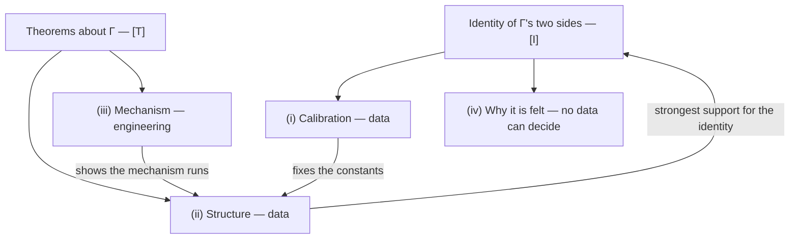

# The Empirical Programme: Four Tasks

:::info What this section is
The consciousness chapters state what UHM proves about the coherence matrix $\Gamma$ and what it only interprets. This section collects, in one place, the work that proofs cannot do: fixing which coherence corresponds to which quality, checking that the geometry of experience is the geometry the theory commits to, and building systems in which the mechanism runs. Nothing here is new doctrine. The pages gather protocols and criteria scattered over the corpus, give each claim the status of its registry row, and mark every new proposal as a research programme **[Pr]** or a hypothesis **[H]**.
:::

## The starting point {#starting-point}

UHM's position on experience has three parts, and they carry different statuses.

1. **The identity.** $\Gamma$ is one object with an external side (physics) and an internal side (experience). This is an ontological position, [two-aspect monism](/docs/consciousness/foundations/two-aspect-monism), with status **[I]**: it "reformulates the hard problem rather than solving it" ([epistemic status](/docs/consciousness/foundations/two-aspect-monism#следствие-трудная-проблема)).
2. **The mathematics.** What is proved about the internal side is proved as mathematics: a viable dissipative holon has $\mathrm{Coh}_E > 1/7$ ([T-38a [T]](/docs/applied/coherence-cybernetics/theorems#теорема-81-условная-необходимость-интериорности-no-zombie); the identification "E = interiority" is a postulate [P] and the reading "no zombies" is [I], registry row 38a); the phenomenal functor is unique under the axioms ([uniqueness [T]](/docs/consciousness/foundations/two-aspect-monism#теорема-единственность-фв)); a quality is fixed exactly by its dissimilarities to all others, and to within twice the covering radius by finitely many probes ([enriched Yoneda for qualia [T]](/docs/proofs/categorical/categorical-formalism#enriched-yoneda), the construction of Tsuchiya, Phillips & Saigo 2022 applied to UHM's quality space).
3. **The residue.** Two things are left open on purpose. *Why* this structure is felt is not explained ([what UHM does not explain](/docs/consciousness/foundations/two-aspect-monism#что-угм-не-объясняет), item 1), and [T-214 [T]](/docs/proofs/categorical/fundamental-closures#t-214) shows that the bridge from states to experience cannot be an internal morphism of the theory. *Which* ray $[\lvert q\rangle]$ is red is "an empirical question, analogous to determining the mass of the electron" (item 2; the earlier identification of this residue with the $G_2$-frame is [retracted](/docs/consciousness/foundations/two-aspect-monism#калибровка-как-g2-репер)).

The second residue is where proofs stop and measurement starts. That is why this section exists.

## Four tasks and what decides them {#four-tasks}

| Task | Question | What decides it | Kind of evidence | Page |
|---|---|---|---|---|
| **(i) Calibration** | Which coherence pattern corresponds to which quality, and how a substrate maps into $\Gamma$ | Data: reports, discriminations, similarity judgements, psychophysics, neural signals | Third-person measurement against a declared ground truth | [Calibration](./calibration) |
| **(ii) Structure** | Is the geometry of quality space the geometry $\Gamma$ commits to: seven axes, Fano relations, the window $2/7 < P \leq 3/7$, the F-Band sums | Data: similarity structures, reconstructed $\Gamma$, their invariants | Third-person measurement of relations, not of single qualities | [Structure](./structure) |
| **(iii) Mechanism** | Can a system be built in which $\Gamma$-dynamics, regeneration and a self-model in the window actually run, and do the predicted functional signatures appear and disappear with them | Engineering of a cognitive architecture, with ablation tests | Construction plus third-person tests on the construction | [Engineering](./engineering) |
| **(iv) The hard problem** | Why any of this is felt at all | Neither data nor engineering | None possible: every datum is third-person | This page, [below](#hard-problem) |

### (i) Calibration is empirical {#task-calibration}

The mathematics fixes the *form* of the correspondence — the functor $F$ into rays of $\mathbb{P}(\mathcal{H}_E)$ with the Fubini–Study metric — but not its constants. Two calibrations are needed, and neither can be derived:

- the **measurement calibration**: the free parameters $\theta$ of a reconstruction $\pi_{\mathrm{bio}}$ (or of the map $G$ for an artificial system) that takes signals to $\hat\Gamma$ ([measurement protocol](/docs/applied/research/measurement-protocol#протокол-pi-bio));
- the **phenomenal calibration**: which ray is which quality, and the monotone map $f$ from perceived dissimilarity to $d_{\mathrm{FS}}$ that the [enriched Yoneda theorem](/docs/proofs/categorical/categorical-formalism#enriched-yoneda) needs before it can be tested ("the refutation needs a calibration $f$ … which is not fixed").

Both are settled by fitting to data where the answer is independently known, and by testing on data that did not enter the fit. The corpus has one hard rule for this: [no threshold without ground truth](/docs/applied/research/measurement-protocol#граница-валидации).

### (ii) Structure is empirical, and it is the strongest channel {#task-structure}

A single calibrated quality supports nothing: any theory can be fitted to one point. A **relation** among many qualities is different. UHM commits in advance to a geometry — complex projective space with the Fubini–Study metric for quality, seven axes and seven Fano lines for $\Gamma$, a window and two bands for a living state — and that commitment forbids specific patterns (for example, dissimilarity matrices that no configuration of rays can realise). A theory that has fixed its geometry before the data can lose to the data. This is why the structural level is the strongest empirical support the identity can receive: it cannot prove the identity [I], but a structure that survives many chances to fail is what makes the identity worth holding. The [structure page](./structure) lists each invariant with its status and what would confirm or refute it.

### (iii) The mechanism is an engineering task {#task-engineering}

The theory specifies a mechanism: CPTP dynamics of $\Gamma$, regeneration $\mathcal{R} = \kappa(\Gamma)(\varphi(\Gamma) - \Gamma)\,g_V$ read through a self-model, viability in the window. Whether that mechanism can be realised, and what a realisation does, is answered by building one and testing it — including ablations that remove the self-model, the $E$-coherences or a Fano line and check that the predicted signatures go with them. This is the programme of the [engineering page](./engineering), which links the corpus's AI chapter, the [ten in-silico tests](/docs/consciousness/subjects/ai-consciousness#agi-инженерные-тесты), and the [Phase I](/docs/applied/research/experimental-protocol#phase-1) of the experimental protocol.

### (iv) The hard problem is decided by neither {#hard-problem}

Chalmers' question — why physical processing is accompanied by experience at all — is not a calibration problem and not an engineering problem.

- **Not by data.** Every measurement — a report, a discrimination, a similarity judgement, an EEG trace, a reconstructed $\hat\Gamma$ — is a third-person record. A perfect correlation between records and $\Gamma$ still leaves open why the correlated structure is felt. Inside UHM this is sharpened, not lamented: the environment's noise channel carries exactly zero information about the phase-carried quality ([T-302 [T]](/docs/consciousness/phenomenology/qualia-structure#теорема-разрыв)), and no bridge from states to experience is an internal morphism ([T-214 [T]](/docs/proofs/categorical/fundamental-closures#t-214)).
- **Not by engineering.** A system that passes every functional test shows that the mechanism runs. Whether it is felt is again the identity, not an extra test result.
- **What UHM does with it.** It closes the question by identity — the internal side of $\Gamma$ *is* experience [I] — and says plainly that this is a position, "the boundary between map and territory" ([two-aspect monism](/docs/consciousness/foundations/two-aspect-monism#граница-карты-и-территории)), not a derivation. This residue is not specific to UHM [I]: every theory of consciousness ends with one unexplained primitive — a psychophysical law, an identity, a fundamental property — and the [comparison of axiomatic choices](/docs/consciousness/foundations/two-aspect-monism#сравнение-аксиоматических-выборов) shows that UHM's is one primitive, not two or three.

The practical consequence is a division of labour. The hard problem is acknowledged once, here, and not re-argued on the other three pages; they deal only with what data and engineering can decide.

## What this section does not claim {#non-claims}

- It reports **no data**. Every prediction collected here is untested unless its source page says otherwise (see the [verdict table of the falsifiability page](/docs/reference/falsifiability#summary-table-of-predictions)).
- It does **not** upgrade any status. Proposals made here for the first time are [Pr] or [H]; a protocol that passes would corroborate a claim at its existing status, and one that fails would refute it at that status.
- It does **not** read consciousness off a measurement in systems where no ground truth exists — language models, fungal networks, simulated agents — for the reason given in the [substitution theorem](/docs/applied/research/measurement-protocol#substitution-position).
- It does **not** revive the withdrawn numerical bridge between the perturbational complexity index and purity: "the closeness of $\mathrm{PCI}^* = 0.31$ to $2/7 \approx 0.286$ is a coincidence of two unrelated scales" ([Step 5](/docs/applied/research/measurement-protocol#pci-связь)); the testable form is a concordance of verdicts (P8.4, SUB-5).

## Sources gathered in this section {#sources}

| Source | What is taken from it |
|---|---|
| [Two-aspect monism](/docs/consciousness/foundations/two-aspect-monism) | The identity [I], the residues, relational definiteness, the Tsuchiya–Saigo precedent |
| [Categorical formalism §6.2.1](/docs/proofs/categorical/categorical-formalism#enriched-yoneda) | Enriched Yoneda for qualia [T]: isometry, finite probes, probe counts, realisability |
| [Qualia structure](/docs/consciousness/phenomenology/qualia-structure) | 21 channels, 7 holonomies, the decoder T-301, fading, access conditions |
| [Emotional taxonomy](/docs/consciousness/phenomenology/emotional-taxonomy) | Valence and arousal from $dP/d\tau$ |
| [Falsifiability](/docs/reference/falsifiability) | Predictions 1–4, refutation criterion, F-Gap, F-ISF, F-Neural, F-Band |
| [Measurement protocol](/docs/applied/research/measurement-protocol) | $\pi_{\mathrm{bio}}$, P8.1–P8.6, the substitution theorem, SUB-1…SUB-6 |
| [Experimental protocol](/docs/applied/research/experimental-protocol) | Four phases, Γ-native agent, three-level falsification |
| [CC predictions](/docs/applied/coherence-cybernetics/predictions) | 23 predictions, decision protocols, falsification levels |
| [Phenomenology map](/docs/applied/research/phenomenology-map) | Experience → observable → test |
| [AI consciousness](/docs/consciousness/subjects/ai-consciousness) | Architectural requirements, tests E1–E10 |
| [Console roadmap](/docs/applied/console/roadmap-validation) | Validation stages V0–V2 for a self-report and wearable instrument |

**Next:** [Calibration →](./calibration)
