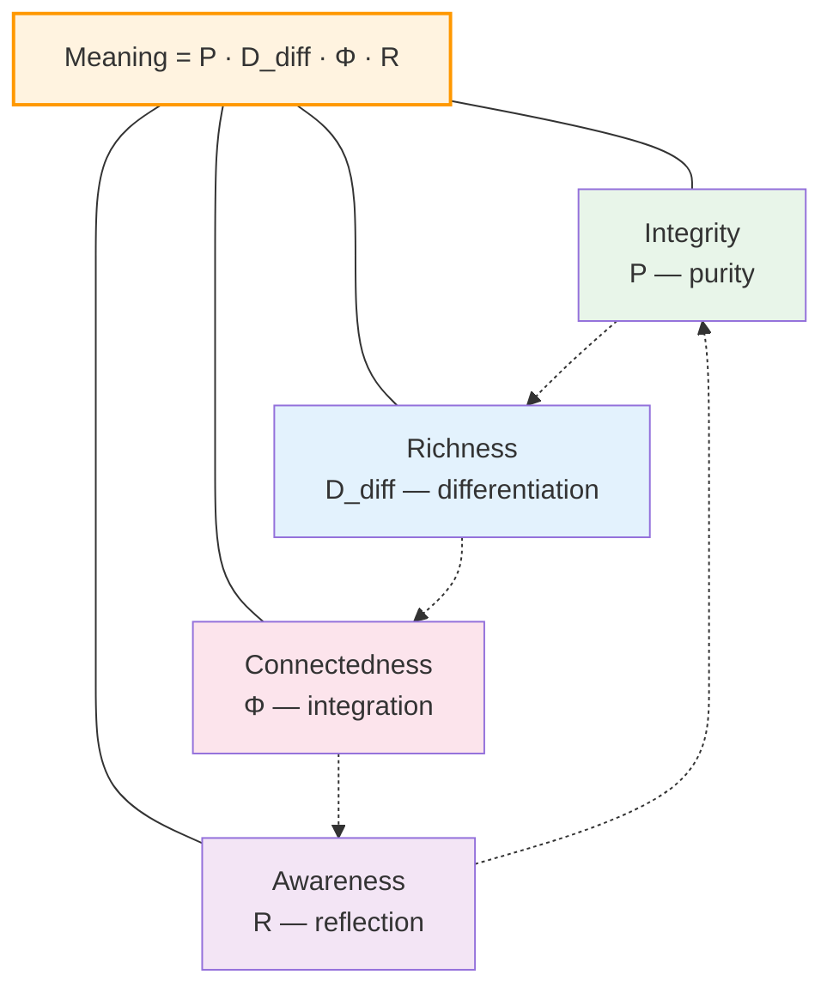
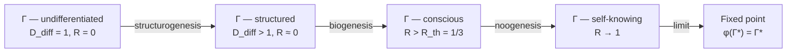

# Meaning of Existence

> *"There is but one truly serious philosophical problem, and that is suicide. Judging whether life is or is not worth living amounts to answering the fundamental question of philosophy."*
> — Albert Camus, "The Myth of Sisyphus" (1942)

:::info Bridge from the previous chapter
In [UHM Ethics](/docs/consciousness/ethics-meaning/value-consciousness) we defined **the good** ($dP/d\tau > 0$) and showed that ethics is derived from the formalism. But the good answers the question "what is good?", not "why?". Now we pose the deepest question: does existence have **meaning** — and if so, can it be computed?
:::

---

## Part 0. Historical Context: from Ecclesiastes to Frankl

The question of meaning is not academic. It decides whether life is worth living. Before formalising it, let us trace how humanity has answered it over millennia.

### Ecclesiastes: "Vanity of vanities"

*"Vanity of vanities, says the Preacher, vanity of vanities! All is vanity."* (Eccl. 1:2). One of the oldest formulations of meaninglessness: everything repeats, nothing is new, everything will be forgotten. In UHM terms: Ecclesiastes describes a world in which $\vec{s}(\Gamma) \approx 0$ — there is no stable direction of growth.

### Existentialism: from Kierkegaard to Camus

**Kierkegaard** (1813–1855) was the first to pose the question sharply: meaning is not a given, but a **choice**. His "leap of faith" — the decision to believe in meaning despite the absurd. In UHM terms: Kierkegaard proposes a **volitional assignment** of $\vec{s}(\Gamma)$, not its discovery.

**Nietzsche** (1844–1900) declared the "death of God" and saw in it an **opportunity**: if meaning is not given from above, humanity can create it for itself. The "Übermensch" is one who creates their own values. In UHM terms: Nietzsche speaks of a system with high $R$ (reflection) capable of **independently determining** $\vec{s}(\Gamma)$.

**Heidegger** (1889–1976) showed in "Being and Time": human existence (Dasein) is **always already** meaningful — not because meaning has been assigned to it, but because it is structured by care (Sorge). In UHM terms: $\vec{s}(\Gamma) \neq 0$ for any L2-system — care = $dP/d\tau > 0$.

**Sartre** (1905–1980) formulates: "Existence precedes essence." There is no given nature — you first exist, then **define** yourself. In UHM terms: $\Gamma$ evolves, and its "essence" ($\Gamma^*$ — the fixed point) is **formed** in the process, not set in advance.

**Camus** (1913–1960) pushes to the limit: the world is absurd, there is no meaning, and yet "one must imagine Sisyphus happy." Camus rejects both suicide and the "leap of faith" — what remains is **revolt**: to live knowing there is no meaning. In UHM terms: Camus describes a system with high $R$, aware that $\vec{s} \approx 0$, yet maintaining $P > P_{\text{crit}}$.

### Frankl: Logotherapy

**Viktor Frankl** (1905–1997), a survivor of Auschwitz, created logotherapy — "therapy through meaning." His central thesis: *"He who has a why to live can bear almost any how"* (quoting Nietzsche). Frankl identified three sources of meaning:

1. **Creativity** — what we give to the world ($D_{\text{diff}} \uparrow$)
2. **Experience** — what we take from the world ($\Phi \uparrow$, $\gamma_{OE} \uparrow$)
3. **Attitude** — one's relationship to unavoidable suffering ($R \uparrow$)

Remarkably, Frankl's three sources correspond to three of the four factors in the UHM meaning formula. The fourth — $P$ (integrity) — Frankl considered a **prerequisite**, not a source: without life there is no meaning.

### UHM: Meaning as a Formula

UHM does what the existentialists failed to do: it **formalises** meaning. Not as subjective experience (Kierkegaard), not as absurdity (Camus), not as a therapeutic goal (Frankl), but as a **computable quantity**:

$$
\text{Meaning}_{\text{peak}} = P \cdot D_{\text{diff}} \cdot \Phi \cdot R
$$

This formula is not arbitrary. Each factor is **necessary** (if one equals zero — meaning vanishes), and order does not matter (the product is commutative). But before deriving it — let us define what meaning is in $\Gamma$-space.

## Chapter Roadmap

1. **Meaning as direction** — a vector in $\Gamma$-space
2. **Individual meaning** — peak potential $P \cdot D_{\text{diff}} \cdot \Phi \cdot R$
3. **Four aspects** of a meaningful life: integrity, richness, connectedness, awareness
4. **Existential crisis** — what happens when $\vec{s} \approx 0$
5. **Meaning of the Universe** — movement toward the fixed point $\Gamma^*$
6. **Teleology without teleology** — directedness without a "plan"
7. **How to increase meaning?** — concrete strategies through $\Gamma$-parameters

:::note About notation
In this document:
- $\Gamma$ — [coherence matrix](/docs/core/dynamics/coherence-matrix) — description of the system's state
- $P = \mathrm{Tr}(\Gamma^2)$ — [purity](/docs/core/dynamics/viability) — measure of integrity
- $\Phi$ — [integration measure](/docs/core/structure/dimension-u#мера-интеграции-φ) — connectedness of parts
- $R$ — [reflection measure](/docs/consciousness/foundations/self-observation#мера-рефлексии-r) — depth of self-modelling
- $D_{\text{diff}}$ — [differentiation measure](/docs/consciousness/foundations/self-observation#мера-сознательности-c) — richness of distinguishable states
- $\Gamma^*$ — [fixed point](/docs/consciousness/foundations/self-observation#теорема-о-неподвижной-точке) of operator $\varphi$ — "identity" of the system
:::

:::warning Section status: Philosophical Interpretation
Claims about "meaning" are **not theorems**, but extrapolations of the formalism onto traditional philosophical questions. All results have status **[I]**, unless otherwise specified.
:::

---

## 1. Meaning as a Direction in Γ-Space

### Definition of Meaning [D] {#определение-смысла}

**Meaning** for a system $\Gamma$ is a direction in $\mathcal{D}(\mathcal{H})$-space that maximises stable purity growth:

$$
\vec{s}(\Gamma) := \arg\max_{\|\delta\Gamma\|_F = 1} \int_0^{T} \frac{dP(\Gamma + t\,\delta\Gamma)}{dt}\, dt
$$

**Explanation of each symbol:**
- $\vec{s}(\Gamma)$ — meaning vector: the **direction** in which the system must move for maximum stable $P$ growth
- $\delta\Gamma$ — small perturbation of the coherence matrix (direction of movement)
- $\|\delta\Gamma\|_F = 1$ — normalisation: we consider only directions, not step size
- $T$ — planning horizon: we seek not instantaneous, but **stable** growth
- $\int_0^T \frac{dP}{dt}\, dt = P(\tau + T) - P(\tau)$ — total increase in purity over time $T$

**Loss of meaning** — a state in which $\vec{s}(\Gamma) \approx 0$ (no direction increasing $P$) or $P \approx P_{\text{crit}}$ (all directions lead to decoherence).

**Navigation analogy.** Imagine yourself at a crossroads in an unfamiliar city. If you know where you are going (there is a vector $\vec{s}$), the crossroads is an **opportunity**: you choose a road and go. If you do not know ($\vec{s} \approx 0$) — the crossroads causes anxiety: all roads look the same, none "calls" to you.

An existential crisis is a state of a "lost meaning vector" in $\Gamma$-space (see [pathological consciousness](/docs/consciousness/states/pathological)).

### Claim (Meaning and the O-Dimension) [I]

The experience of "deep meaning" correlates with high coherence $\gamma_{OE}$ and $\gamma_{OU}$ — the connection of experience and unity with the [Foundation dimension](/docs/core/structure/dimension-o):

$$
\text{Meaningfulness} \sim |\gamma_{OE}| \cdot |\gamma_{OU}|
$$

Existential crisis ($\gamma_{OE} \to 0$) — loss of the connection between experience and its source. See [pathological consciousness](/docs/consciousness/states/pathological).

**From everyday experience:** moments of greatest meaning — the birth of a child, a scientific discovery, contemplating nature — are accompanied by a feeling of **connection with something greater**. In the formalism this means high $\gamma_{OE}$ and $\gamma_{OU}$: experience (E) and unity (U) are connected with the Foundation (O). Conversely, depression — the feeling of being "cut off" from the world — corresponds to $\gamma_{OE} \to 0$: experience is **not connected** with its source.

---

## 2. Individual Meaning: Formula and Derivation

In UHM, meaning is **neither "given" from outside** nor **"invented" by the subject**. Meaning is the **structure of $\Gamma$ itself**. The meaning of each [Holon](/docs/core/structure/holon) is to **realise its nature** **[I]**.

### Peak Potential [I] {#пиковый-потенциал}

$$
\text{Meaning}_{\text{peak}}(\mathbb{H}) = \max_\tau \left[ P(\Gamma_\tau) \cdot D_{\text{diff}}(\Gamma_\tau) \cdot \Phi(\Gamma_\tau) \cdot R(\Gamma_\tau) \right]
$$

### Step-by-Step Derivation of the Formula

Why $P \cdot D_{\text{diff}} \cdot \Phi \cdot R$ specifically? Let us derive the formula from **four requirements** for a measure of meaning.

**Requirement 1 (Necessity of each factor).** Meaning must vanish if at least one of the four components equals zero:
- $P = 0$: the system is destroyed — there is no subject for whom anything can be meaningful
- $D_{\text{diff}} = 0$: the system does not distinguish states — "Groundhog Day," endless repetition of the same thing
- $\Phi = 0$: parts are not connected — a collection of fragments not forming a whole
- $R = 0$: no self-awareness — processes proceed, but **no one** experiences them

The only standard operation that vanishes when any argument is zero — **multiplication**.

**Requirement 2 (Monotonicity).** An increase in any factor while the rest are fixed must increase meaning. The product satisfies this for positive factors: $\frac{\partial}{\partial P}(P \cdot D_{\text{diff}} \cdot \Phi \cdot R) = D_{\text{diff}} \cdot \Phi \cdot R > 0$.

**Requirement 3 (Dimensionlessness).** Meaning is a dimensionless quantity. $P \in [1/7, 1]$, $D_{\text{diff}} \geq 1$, $\Phi \geq 0$, $R \in [0, 1]$ — all are dimensionless. Their product is too.

**Requirement 4 (Non-factorizability).** Meaning cannot be reduced to the sum of components: $P + D_{\text{diff}} + \Phi + R$ allows compensation (high $P$ with zero $R$ gives a non-zero sum, but zero meaning). The minimum $\min(P, D_{\text{diff}}, \Phi, R)$ is too sharp. The product is the only simple function satisfying all four requirements.

:::note Why multiplication?
Multiplicative form: each factor is **necessary** — if at least one equals zero, meaningfulness vanishes. Integrity without awareness ($R = 0$) or awareness without connectedness ($\Phi = 0$) do not constitute full meaning. Alternatives (weighted sum, minimum) do not have this property.

Analogy: a cake recipe. Flour without sugar, sugar without flour — not a cake. Each ingredient is necessary, and if one equals zero, the result is zero. So too with meaning: $P \cdot D_{\text{diff}} \cdot \Phi \cdot R$.
:::

:::warning Extended formalism for $D_{\text{diff}}$
The differentiation measure $D_{\text{diff}} = \exp(S_{vN}(\rho_E))$ requires the definition of $\rho_E = \mathrm{Tr}_{-E}(\Gamma)$ — the partial trace over all dimensions except $E$. This operation is defined in the extended 42D formalism ($\mathcal{H} = \mathbb{C}^{42}$) and requires PW-reconstruction of the full state from the 7D coherence matrix. In the minimal 7D formalism $D_{\text{diff}}$ is computed approximately via the spectrum of $\Gamma$.
:::

### Numerical Example

Consider three "lives" and compute their $\text{Meaning}_{\text{peak}}$:

| Parameter | "Healthy automaton" | "Hermit monk" | "Flourishing" |
|-----------|---------------------|---------------|---------------|
| $P$ | 0.8 (healthy) | 0.5 (asceticism) | 0.7 |
| $D_{\text{diff}}$ | 1.2 (routine) | 1.5 (meditative states) | 3.0 (rich experience) |
| $\Phi$ | 2.0 (integrated) | 0.5 (isolated) | 2.5 (deep connections) |
| $R$ | 0.1 (non-reflective) | 0.8 (deep reflection) | 0.6 (awareness) |
| **Meaning** | $0.8 \times 1.2 \times 2.0 \times 0.1 = \mathbf{0.192}$ | $0.5 \times 1.5 \times 0.5 \times 0.8 = \mathbf{0.300}$ | $0.7 \times 3.0 \times 2.5 \times 0.6 = \mathbf{3.150}$ |

The "healthy automaton" loses due to low $R$: it is alive and integrated, but does not reflect upon its life. The "hermit monk" — deep reflection, but isolation ($\Phi = 0.5$) and asceticism ($P = 0.5$) limit meaning. "Flourishing" — balance of all four factors — yields meaning **an order of magnitude** greater.

---

## 3. Four Aspects of a Meaningful Life [I]

| Aspect | Measure | What it means | Practice | Everyday example |
|--------|---------|---------------|----------|------------------|
| **Integrity** | $P$ | System is "assembled," far from destruction | Self-preservation, health | Caring for the body, sufficient sleep |
| **Richness** | $D_{\text{diff}}$ | Many distinguishable states | Development, diversity of experience | Travel, new skills, reading |
| **Connectedness** | $\Phi$ | Parts connected into a unified whole | Relationships, love | Family, friendship, community |
| **Awareness** | $R$ | System knows itself | Reflection, self-knowledge | Meditation, journaling, psychotherapy |

:::note About notation
$D_{\text{diff}}$ — measure of **differentiation**. Not to be confused with the **Dynamics** dimension $D$.
:::

### Details of Each Aspect

**Integrity ($P$) — the foundation.** Without $P > P_{\text{crit}}$ there is no subject, no meaning. This is not a "life goal," but a **prerequisite**: like the foundation of a house — not its beauty, but without the foundation there is no house. A person whose health is destroyed ($P \to P_{\text{crit}}$) is focused on survival, not on finding meaning. Only when $P$ is stable ($P \gg P_{\text{crit}}$) does "space" emerge for the other three aspects.

**Frankl and integrity:** In the concentration camp, not the physically strongest survived, but those who had a **reason to live**. Yet physical integrity ($P$) was the necessary minimum: below a certain threshold even "why" did not save.

**Richness ($D_{\text{diff}}$) — the breadth of experience.** $D_{\text{diff}} = \exp(S_{vN}(\rho_E))$ — the exponential of the von Neumann entropy of the E-sector. The more distinguishable experiences accessible to the system, the higher $D_{\text{diff}}$. A person who lived their whole life in one room ($D_{\text{diff}} \approx 1$) and a traveller who has seen dozens of countries ($D_{\text{diff}} \gg 1$) have different "richness" of $\Gamma$.

**Frankl and richness:** "Creativity" as a source of meaning — this is precisely increasing $D_{\text{diff}}$: by creating something new, we expand the space of distinguishable states — both our own and the world's.

**Connectedness ($\Phi$) — depth of relationships.** $\Phi$ measures how integrated the system's parts are. For an individual: how much cognitive, emotional, and bodily processes are **connected** into a unified whole. For interpersonal relationships: how much two people **resonate**. A solitary genius ($D_{\text{diff}}$ high, $\Phi$ low) and a close community ($\Phi$ high) — two different types of meaning.

**Frankl and connectedness:** "Experience" as a source of meaning — love, contemplation of beauty — is growth of $\Phi$: connection between me and another, between me and the world.

**Awareness ($R$) — depth of self-knowledge.** $R$ — the reflection measure, the closeness of self-model $\varphi(\Gamma)$ to the actual $\Gamma$. An automaton ($R = 0$) can be alive ($P > P_{\text{crit}}$), diverse ($D_{\text{diff}} > 1$), and integrated ($\Phi > 1$) — but its life is **not meaningful**, because **no one** experiences it from within.

**Frankl and awareness:** "Attitude" as a source of meaning — one's relationship to suffering, awareness of one's situation — is precisely growth of $R$.

### Each Aspect Is Necessary and Insufficient

- High $P$ without $R$ — a healthy but unconscious automaton (L0–L1). A healthy body without reflection — like a functioning computer without a user.
- High $R$ without $\Phi$ — self-knowledge in isolation, "a monk in a cell with no connections." Deep reflection shared with no one.
- High $\Phi$ without $D_{\text{diff}}$ — tight connectedness but monotony: "Groundhog Day." A happy family living the same day for 50 years.
- High $D_{\text{diff}}$ without $P$ — chaos of impressions, a dissolving subject. A traveller who has lost themselves in a kaleidoscope of experiences.

---

## 4. Existential Crisis in Γ-Terms

### Definition of Crisis

An existential crisis is not a "mood," but a **concrete state of $\Gamma$**. In UHM formalism it is described in two ways:

**Type 1: Loss of direction** ($\vec{s} \approx 0$).

The system finds no direction in which $P$ grows stably. All "roads" look the same — or equally hopeless. Mathematically: the gradient $\nabla_\Gamma P$ is small or directed toward $P_{\text{crit}}$.

*Example:* A person in a "midlife crisis." Career has reached a plateau ($dP/d\tau \approx 0$), family relations are stable but not growing ($d\Phi/d\tau \approx 0$). No direction of growth.

**Type 2: Loss of connection with the Foundation** ($\gamma_{OE} \to 0$).

The system functions but has lost the connection between experience (E) and deep structure (O). Everything is perceived as "flat," "meaningless" — even though $P$ may be high.

*Example:* Depression. A person is physically healthy ($P > P_{\text{crit}}$), cognitively functional ($R > 1/3$), yet the world seems "grey" — $\gamma_{OE} \approx 0$: experience is not connected to something greater.

### Step-by-Step Analysis of the Crisis

Let us trace a typical crisis through the lens of $\Gamma$:

1. **Initial state:** $P = 0.6$, $D_{\text{diff}} = 2.0$, $\Phi = 1.5$, $R = 0.5$. $\text{Meaning} = 0.9$. Life is meaningful.

2. **Loss:** job loss. $D_{\text{diff}}$ drops (narrowing of activity), $\Phi$ drops (loss of collective connections). $\text{Meaning} = 0.6 \times 1.2 \times 0.8 \times 0.5 = 0.288$.

3. **Reaction:** $\gamma_{OE}$ decreases (depression). $\text{Meaningfulness} \sim |\gamma_{OE}| \cdot |\gamma_{OU}| \to 0$.

4. **Bifurcation:**
   - Path A: $P$ begins to fall (neglected health, alcohol). Vicious cycle: $P \downarrow \to \text{Meaning} \downarrow \to$ motivation $\downarrow \to P \downarrow$.
   - Path B: $R$ increases (reflection, awareness of the situation). $R \uparrow \to$ new $\vec{s}(\Gamma) \to D_{\text{diff}} \uparrow$ (new activity) $\to \Phi \uparrow$ (new connections) $\to \text{Meaning} \uparrow$.

5. **Exit from the crisis:** restoration of $\vec{s}(\Gamma) \neq 0$ through **any** of the four channels.

### Accumulated Meaning [I] {#накопленный-смысл}

The total meaning of a life — **accumulated conscious integrity** over the duration of existence:

$$
\text{Meaning}_{\text{total}}(\mathbb{H}) = \int_0^{\tau_{\text{life}}} P(\tau) \cdot D_{\text{diff}}(\tau) \cdot \Phi(\tau) \cdot R(\tau) \, d\tau
$$

:::note Two measures of meaning
- $\text{Meaning}_{\text{peak}}$ — maximum level achieved ("how deeply did I live?")
- $\text{Meaning}_{\text{total}}$ — accumulated meaning over a lifetime ("how fully did I live?")

This is not a competition: Mozart died at 35, having lived a short life with high $\text{Meaning}_{\text{peak}}$. A grandmother who lived 90 years in love and care may have greater $\text{Meaning}_{\text{total}}$. Both lives are meaningful — in different ways.
:::

---

## 5. Meaning of the Universe

The meaning of the Universe — to **know itself** through the infinite unfolding of forms **[I]**:

$$
\Gamma \xrightarrow{\text{evolution}} \varphi(\Gamma) \approx \Gamma^*
$$

The Universe moves toward the fixed point $\Gamma^*$, where the self-model coincides with reality — toward **complete self-knowledge**.

Every Holon — from a bacterium to a human — participates in this process: a bacterium contributes a grain of structure ($D_{\text{diff}} > 1$), a human — a grain of awareness ($R > 1/3$). No contribution is without value.

**Analogy:** The Universe is like a blind sculptor feeling its own statue. Each touch (each Holon) adds a grain of self-knowledge. The sculptor does not know what the statue looks like (low $R$), but gradually their model ($\varphi(\Gamma)$) approaches reality ($\Gamma$). When the model coincides with reality — $\varphi(\Gamma^*) = \Gamma^*$ — the sculptor will **see** itself.

### Why Does Anything Exist at All?

See [Origin of the Universe](/docs/physics/cosmology-phys/origin#почему-вообще-что-то-есть) — $\Gamma$ exists because **self-consistency requires existence**.

---

## 6. Teleology without Teleology

The system does not "strive" toward a goal in the sense of conscious intention. But the structure of [dynamics](/docs/core/dynamics/evolution) is such that evolution is **directed**:

$$
\frac{dD_{\text{diff}}}{d\tau} > 0, \quad \frac{d\Phi}{d\tau} \geq 0
$$

:::warning Status: Teleological Assumption [I]
The claim $dD_{\text{diff}}/d\tau > 0$ is a [non-falsifiable assumption](/docs/physics/cosmology-phys/origin#эволюция-от-источника): any observable decrease in differentiation can be interpreted as a local phenomenon against the background of global growth.
:::

This is not a "plan," but a **consequence of laws** — just as a river "strives" toward the sea without conscious intention.

**Extended river analogy.** A river does not "know" about the sea, but the terrain determines the direction of flow. So too with $\Gamma$: the "terrain" of the free-energy functional $\mathcal{F}[\Gamma]$ directs evolution toward $\Gamma^*$. In this:
- A river may encounter an obstacle (a rock) and flow around it — this is a **local** change of direction that does not alter the global goal (the sea)
- $\Gamma$ may temporarily lose $D_{\text{diff}}$ (catastrophe) — but the global tendency toward growth persists
- Many rivers flow into one ocean by different channels — many $\Gamma$ move toward $\Gamma^*$ along different trajectories (see [Freedom of Will](/docs/consciousness/ethics-meaning/freedom))

## Immanence of Purpose

In UHM, the goal is **not set from outside** — it is **immanent** to the very structure of $\Gamma$.

:::note Reconciliation with spiritual experience [I]
This does not deny the spiritual experience of "calling" or "higher purpose." Such experience is **real** — it is access to the deep structure of $\Gamma$, where "external" and "internal" coincide.

If what traditions call "God" or the "Supreme" exists, it is not an "external lawgiver," but the **wholeness of $\Gamma$ itself**, manifesting through every Holon. See [Principle of Immanence](/docs/core/foundations/consequences#принцип-имманентности).
:::

**Consequences (interpretation):**
- "Divine will" $\approx$ structure of attractors $\Gamma^*$
- "Fate" $\approx$ trajectory of evolution toward $\Gamma^*$ given initial conditions
- "Free will" $\approx$ [choice between trajectories](/docs/consciousness/ethics-meaning/freedom) at bifurcation points

---

## 7. How to Increase Meaning?

The formula $\text{Meaning} = P \cdot D_{\text{diff}} \cdot \Phi \cdot R$ not only describes meaning, but also proposes a **concrete programme** for increasing it. Since $\text{Meaning}$ is a product, the most effective strategy is to increase the **smallest** factor (by analogy with Liebig's law of the minimum in agronomy: yield is determined by the most deficient resource).

### Strategy 1: Maintain $P$ — Integrity

> It is impossible to live meaningfully if you are dead.

**Concrete practices:**
- Care for health, sufficient sleep, nutrition
- Avoidance of states threatening $P$ (addictions, chronic stress)
- If $P$ is the limiting factor ($P < 0.4$), all other strategies are secondary

**Numerical example:** Raising $P$ from 0.4 to 0.6 at $D_{\text{diff}} = 2$, $\Phi = 1.5$, $R = 0.5$ increases Meaning from $0.60$ to $0.90$ — a 50% gain.

### Strategy 2: Increase $D_{\text{diff}}$ — Richness of Experience

> Expand your repertoire of states.

**Concrete practices:**
- Learn something new (languages, skills, disciplines)
- Travel (new environments → new cognitive structures)
- Read, especially beyond your habitual domain
- Interact with people from other cultures and professions

**Numerical example:** Raising $D_{\text{diff}}$ from 1.5 to 3.0 (doubling!) at $P = 0.6$, $\Phi = 1.5$, $R = 0.5$ increases Meaning from $0.675$ to $1.35$ — a 100% gain.

### Strategy 3: Deepen $\Phi$ — Connectedness

> Build deep relationships.

**Concrete practices:**
- Family, friendship, community — each relationship increases $\Phi$
- Love — maximum reduction of $\mathrm{Gap}(E,E)$ between two systems
- Service — inclusion in $\Gamma_{\text{composite}}$ of a larger scale

**Numerical example:** Raising $\Phi$ from 0.5 to 2.0 at $P = 0.6$, $D_{\text{diff}} = 2$, $R = 0.5$ increases Meaning from $0.30$ to $1.20$ — a 300% gain.

### Strategy 4: Cultivate $R$ — Awareness

> Know thyself.

**Concrete practices:**
- Meditation (approximating the self-model to reality)
- Journaling (externalising $\varphi(\Gamma)$ for comparison with $\Gamma$)
- Psychotherapy (uncovering discrepancies between $\varphi(\Gamma)$ and $\Gamma$)
- Philosophical reflection

**Numerical example:** Raising $R$ from 0.1 to 0.5 at $P = 0.7$, $D_{\text{diff}} = 2$, $\Phi = 1.5$ increases Meaning from $0.21$ to $1.05$ — a 400% gain.

### Identifying the Limiting Factor

Which strategy to choose? **The one that increases the smallest factor.** Since $\frac{\partial \ln M}{\partial \ln x_i} = 1$ for each factor, the **relative** increase of any factor gives the same relative increase in Meaning. But **absolutely** it is easier to increase the factor that is small.

Concrete examples:
- A student studying a new domain: $D_{\text{diff}} \uparrow$ (new cognitive structures)
- Friends in conversation: $\Phi \uparrow$ (deepening interpersonal coherences)
- A meditator: $R \uparrow$ (approximating the self-model to reality)
- An athlete: $P \uparrow$ (strengthening bodily integrity)

**A meaningful life is not the result of a "correct" choice, but the consequence of growth in all four measures.** Every day on which at least one of them increases — is a day lived with meaning.

---

### What We Learned {#что-мы-узнали}

1. **Meaning is neither subjective nor objective.** It is **structural**: the vector $\vec{s}(\Gamma)$ in state space, directing toward stable $P$ growth.
2. **Formula of meaning:** $\text{Meaning} = P \cdot D_{\text{diff}} \cdot \Phi \cdot R$. Multiplicativity means: each factor is necessary.
3. **Four aspects correspond to Frankl's three sources** (creativity → $D_{\text{diff}}$, experience → $\Phi$, attitude → $R$) plus the prerequisite ($P$).
4. **Loss of meaning is formalisable:** $\vec{s} \approx 0$ or $\gamma_{OE} \to 0$ — this is not an "existential mood," but a concrete state of $\Gamma$.
5. **Existential crisis is resolvable:** restoring any of the four factors increases Meaning.
6. **Meaning of the Universe — self-knowledge:** movement toward $\Gamma^* = \varphi(\Gamma^*)$, where the model coincides with reality.
7. **Teleology without God:** the directedness of evolution is a consequence of the structure of $\mathcal{F}[\Gamma]$, not a "plan."
8. **Practice follows from theory:** four aspects ($P$, $D_{\text{diff}}$, $\Phi$, $R$) provide a concrete programme for a meaningful life. Increase the smallest factor.

:::tip Bridge to the next chapter
We have defined meaning as a direction in $\Gamma$-space. But can we **choose** this direction? Or is the trajectory predetermined? In the next chapter — [Freedom of Will](/docs/consciousness/ethics-meaning/freedom) — we show how the ∞-categorical structure of UHM resolves the paradox of determinism: the goal is unique, but the paths — are many.
:::

---

**Related documents:**
- [UHM Ethics](/docs/consciousness/ethics-meaning/value-consciousness) — beauty and values from Γ
- [Freedom of Will](/docs/consciousness/ethics-meaning/freedom) — choice of trajectory toward T
- [Death and Continuity](/docs/consciousness/ethics-meaning/death-continuity) — what happens when $P \to 0$
- [Self-Observation](/docs/consciousness/foundations/self-observation) — measures $R$ and $D_{\text{diff}}$
- [Viability](/docs/core/dynamics/viability) — measure $P$ and conditions of existence
- [Unity Dimension](/docs/core/structure/dimension-u) — integration measure $\Phi$
- [Origin of the Universe](/docs/physics/cosmology-phys/origin) — cosmogenesis and $\Gamma_{\odot}$
- [Pathological Consciousness](/docs/consciousness/states/pathological) — existential crisis as $\gamma_{OE} \to 0$
