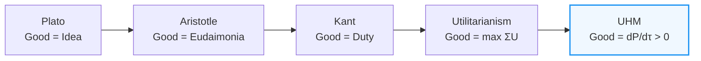
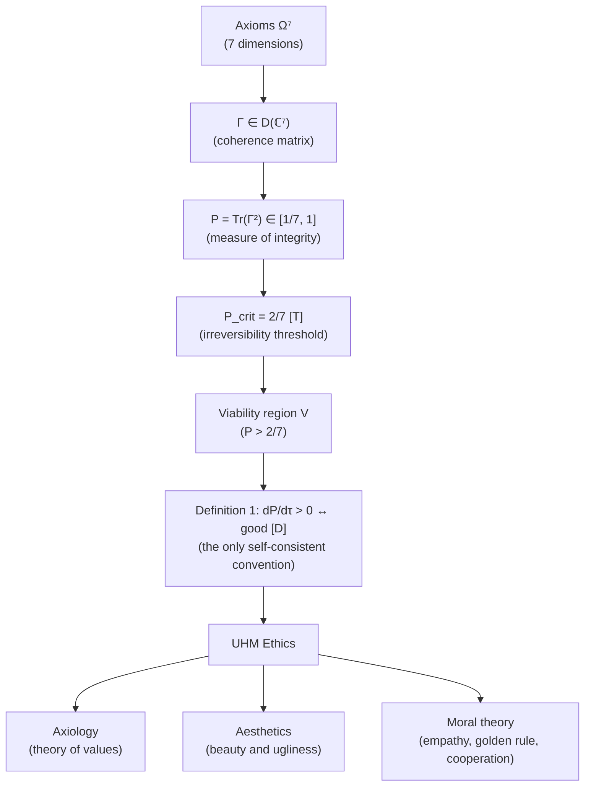
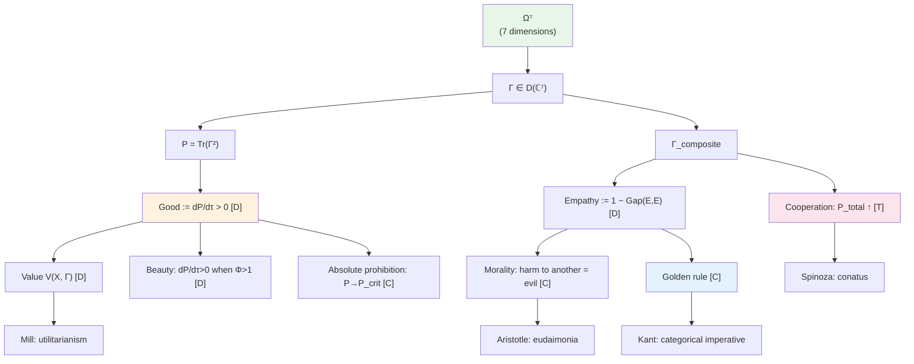

# UHM Ethics

> *"What is the Good?"* — Plato, "Republic," Book VI

:::info Bridge from the previous chapter
In the section [Subjects of Consciousness](/docs/consciousness/subjects/collective-consciousness) we showed **who** can possess consciousness — from infants to collectives and AI. Now the key question: **what** follows from this? If a system has consciousness, what is "good" and "bad" for it? This document derives ethics **from the formalism** — not as a set of prescriptions, but as a mathematical consequence of the structure of $\Gamma$.
:::

This question is the oldest in philosophy. Plato held that the Good exists as an eternal Idea, like the Sun: it illuminates the world of true being. Aristotle objected: the Good is not an abstraction, but **eudaimonia** — flourishing, the realisation of human nature. Kant shifted the focus to **duty**: the moral law within us dictates the categorical imperative. The utilitarians (Bentham, Mill) proposed to count as the good the **greatest happiness of the greatest number**.

Each of these traditions captures an important aspect, but none derives ethics **from physics**. UHM does precisely this: the good is not a postulate, not a convention, and not a cultural contingency, but a **consequence of the mathematical structure** of the coherence matrix $\Gamma$.

## Chapter Roadmap

1. **Historical context** — from Plato to UHM: how the concept of the Good evolved
2. **Axiomatic foundations** — from $\Gamma$ through $P$ to the concept of good
3. **Axiology** — theory of values: definition, properties, hierarchy
4. **Aesthetics** — beauty as growth of $P$ at high $\Phi$
5. **Moral theory** — morality from $\Gamma_{\text{composite}}$, golden rule, cooperation
6. **Resolution of dilemmas** — utilitarianism vs maximin
7. **Philosophical correspondences** — Spinoza, Kant, Aristotle

:::note About notation
In this document:
- $\Gamma$ — [coherence matrix](/docs/core/dynamics/coherence-matrix) — the central object of UHM, describing the state of a system as a $7 \times 7$ Hermitian density matrix
- $P = \mathrm{Tr}(\Gamma^2)$ — [purity](/docs/core/dynamics/viability) — measure of the system's integrity, taking values from $1/7$ (chaos) to $1$ (perfect coherence)
- $P_{\text{crit}} = 2/7$ — [critical threshold](/docs/core/dynamics/viability#критическая-чистота) — below this value the system irreversibly degrades
- $\Phi$ — [integration measure](/docs/core/structure/dimension-u#мера-интеграции-φ) — how much the system's parts are connected into a unified whole
- $R$ — [reflection measure](/docs/consciousness/foundations/self-observation#мера-рефлексии-r) — the system's capacity for self-modelling
- $D_{\text{diff}}$ — [differentiation measure](/docs/consciousness/foundations/self-observation#мера-сознательности-c) — richness of distinguishable states
- $\mathrm{Gap}(i,j)$ — [Gap-operator](/docs/core/dynamics/gap-operator) — measure of "opacity" between dimensions
- $\Gamma_{\text{composite}}$ — [composite matrix](/docs/core/dynamics/composite-systems) — describes interacting systems as a single whole
- L0→L4 — [interiority hierarchy](/docs/consciousness/hierarchy/interiority-hierarchy) — levels of depth of consciousness, from basic interiority to complete self-modelling
:::

:::warning Extended formalism for $D_{\text{diff}}$
The differentiation measure $D_{\text{diff}} = \exp(S_{vN}(\rho_E))$ requires the definition of $\rho_E = \mathrm{Tr}_{-E}(\Gamma)$ — the partial trace over all dimensions except $E$. This operation is defined in the extended 42D formalism ($\mathcal{H} = \mathbb{C}^{42}$) and requires PW-reconstruction of the full state from the 7D coherence matrix. In the minimal 7D formalism $D_{\text{diff}}$ is computed approximately via the spectrum of $\Gamma$.
:::

:::info Section status
In this section ethics is **not postulated**, but derived from the UHM formalism. Each claim is explicitly marked:
- **[T]** — theorem (strictly proven from axioms)
- **[C]** — conditional (under an explicit assumption)
- **[D]** — definition (convention)
- **[I]** — interpretation (philosophical conclusion)

The key transition from "is" to "ought" — **Definition 1** — is a convention **[D]**, not a theorem. Everything else follows strictly.
:::

---

## Part 0. Historical Context: from the Good to $dP/d\tau$

Before introducing the formalism, it is useful to understand which tradition it joins and what it pushes off from.

### Plato: the Good as Idea

In the "Republic" (Book VI, 508b–509c) Plato compares the Good to the Sun: as the Sun illuminates the visible world, so the Good illuminates the intelligible world. The Good is the apex of the hierarchy of Ideas, the source of truth and being.

**What UHM takes:** the Good is not a subjective preference, but an **objective structure**. In UHM this structure is $dP/d\tau > 0$: growth of purity.

**What it rejects:** the Good does not reside "outside" the system (in the world of Ideas), but is **immanent** to the structure of $\Gamma$.

### Aristotle: Eudaimonia

Aristotle in the "Nicomachean Ethics" defines the highest good as **eudaimonia** — flourishing, the realisation of human nature. This is not a fleeting pleasure but a stable state. Virtue is a habitus, a skill leading to eudaimonia.

**What UHM takes:** the Good is not an instantaneous state, but a **stable process** ($dP/d\tau > 0$ — a rate, not a point). Eudaimonia $\approx$ peak potential $P \cdot D_{\text{diff}} \cdot \Phi \cdot R$ (see [Meaning](/docs/consciousness/ethics-meaning/meaning#пиковый-потенциал)).

### Kant: the Categorical Imperative

Kant in the "Critique of Practical Reason" formulates: *"Act only according to that maxim whereby you can at the same time will that it should become a universal law."* Morality is not a consequence of outcomes, but of the form of the principle itself.

**What UHM takes:** the form of the moral law is **derived** from mathematical symmetry — the symmetry of $\Gamma_{\text{composite}}$. The golden rule (§IV) is a direct analogue.

### Utilitarianism: the greatest happiness

Bentham and Mill propose maximising aggregate good: $\max \sum_i U_i$, where $U_i$ is the "utility" (usefulness, happiness) of each individual.

**What UHM takes:** total purity $\sum_i P_i$ is one of the possible optimisation principles (§V). But UHM shows that utilitarianism is only a **special case**, and that the maximin principle (Rawls) is equally justified.

### UHM: Good := $dP/d\tau > 0$

UHM does what none of the listed traditions managed to do: it **formally connects** the concept of the good with the structure of the system. It does not postulate "pleasure is good" or "duty matters more than happiness," but shows: if you are a system with coherence matrix $\Gamma$, then $dP/d\tau > 0$ is the **most fundamental** convention for "the good" — consistent with all other candidates ($d\Phi/d\tau$, $dC/d\tau$) and admitting no self-destructive strategies.

---

## Part I. Axiomatic Foundations

### Chain of Derivation

Let us show how ethics is **derived** from axioms — step by step, without leaps.

**Step 1.** From [Axiom Ω⁷](/docs/core/foundations/axiom-omega) it follows that any system is described by a coherence matrix $\Gamma \in \mathcal{D}(\mathbb{C}^7)$ — Hermitian, positive semi-definite, with unit trace.

**Step 2.** Purity $P = \mathrm{Tr}(\Gamma^2)$ measures how much the system is "assembled": $P = 1$ — pure state (full coherence), $P = 1/7$ — maximally mixed (complete chaos).

**Step 3.** The [evolution equation](/docs/core/dynamics/evolution) contains two competing processes: decoherence (destruction) and regeneration (restoration). Their balance determines whether $P$ grows or falls.

**Step 4.** Below the threshold $P_{\text{crit}} = 2/7$ decoherence **always** wins — and this is a **proven theorem**, not an assumption.

### Theorem (Necessity of Viability) [T] {#необходимость-жизнеспособности}

From the [evolution equation](/docs/core/dynamics/evolution) and the [critical purity theorem](/docs/proofs/dynamics/theorem-purity-critical):

$$
P(\Gamma) \leq P_{\text{crit}} = \frac{2}{7} \;\land\; \kappa_R < \kappa_D \quad \Longrightarrow \quad P(\Gamma(\tau)) \xrightarrow{\tau \to \infty} \frac{1}{7}
$$

A system that has fallen below $P_{\text{crit}}$ **irreversibly** degrades to the maximally mixed state $I/7$. See also: [irreversibility theorem](/docs/consciousness/ethics-meaning/death-continuity#теорема-необратимость).

**What this means in practice.** Consider a numerical example. Let the system have $P = 0.25 < 2/7 \approx 0.286$. At typical parameters $\kappa_D = 0.1$, $\kappa_R = 0.05$:

$$
\frac{dP}{d\tau} = -(0.1 - 0.05) \cdot 0.25 = -0.0125
$$

After $\tau = 10$: $P \approx 0.25 \cdot e^{-0.5} \approx 0.152$. After $\tau = 50$: $P \approx 0.25 \cdot e^{-2.5} \approx 0.020$. The system inexorably slides toward $1/7 \approx 0.143$.

**Corollary [T]:** Viability ($P > P_{\text{crit}}$) is a **necessary condition** for the existence of interiority (L0+), cognitive qualia (L2+), and moral agency (L2+).

Simple analogy: to play music, the instrument must be intact. A broken violin produces no sound — not because music "decided" not to sound, but because the **substrate** is destroyed. So too with $P < P_{\text{crit}}$: the substrate of any experience is destroyed.

### Definition 1 (Bridge from Ontology to Ethics) [D] {#определение-благо}

Here we take the key step — the only step in the chain of derivation that is a **convention**, not a theorem. All subsequent ethical results follow from it strictly.

:::warning Definition [D]
**The good** for a system $\Gamma$ is identified with what increases its purity $P$:

$$
\text{Good}(A, \Gamma) \;\stackrel{\text{def}}{\iff}\; \left.\frac{dP(\Gamma)}{d\tau}\right|_A > 0
$$

$$
\text{Bad}(A, \Gamma) \;\stackrel{\text{def}}{\iff}\; \left.\frac{dP(\Gamma)}{d\tau}\right|_A < 0
$$

where $A$ is an action that modifies the [evolution equation](/docs/core/dynamics/evolution) through a change in $H$, $\mathcal{D}$, or $\mathcal{R}$.
:::

**Why is this not an arbitrary choice?** This definition is **not an arbitrary choice**, but the only convention consistent with three formal facts:

1. **Fact [T]:** $P > P_{\text{crit}}$ is a necessary condition for the existence of any subject. Without viability there is no "someone" for whom anything can be good or bad.
2. **Fact [T]:** Loss of $P$ below the threshold is **irreversible** (irreversibility theorem). This is not merely "bad" — it is a catastrophe with no possibility of correction.
3. **Fact [C]:** A subject of interiority (L1+) **experiences** a decrease in $P$ as negative affect ($dP/d\tau < 0$ → [fear, pain](/docs/consciousness/phenomenology/emotional-taxonomy)). Pain is not a random side effect, but a **signal about decreasing coherence**.

An alternative convention (e.g., $dP/d\tau < 0 \equiv$ the good) would contradict points 1–3 and would be self-destructive: a system striving for decreased $P$ destroys its own substrate.

**Analogy with Hume's guillotine.** David Hume noted that "is" cannot yield "ought." UHM **does not violate** Hume's guillotine: Definition 1 is a **bridge**, not a deduction. But the bridge is not built arbitrarily: it is **the only one** not leading to self-contradiction. A system that defines the good otherwise destroys itself.

From everyday experience: no one considers destruction "the good for what is destroyed." An organism losing its integrity suffers — and this is not a cultural convention, but a reflection of the fact that $dP/d\tau < 0$ is **experienced** negatively at level L1+.

### Claim (Impossibility of Value Nihilism) [C] {#невозможность-нигилизма}

For any L2-system ($R \geq 1/3$, $\Phi \geq 1$):

$$
R \geq R_{\text{th}} \;\Longrightarrow\; \exists \text{ self-model } \varphi(\Gamma) \;\Longrightarrow\; \exists \text{ evaluation of } \frac{dP}{d\tau}
$$

**What this means.** An L2-system **inevitably** evaluates incoming influences by the criterion $dP/d\tau$. Nihilism (absence of values) is **impossible** for a system with reflection — it cannot fail to distinguish what increases and what decreases its coherence.

**Condition:** It is assumed that the self-model $\varphi(\Gamma)$ includes information about $P$ and $dP/d\tau$, which follows from the definition of $\varphi$ as the [best approximation](/docs/proofs/categorical/formalization-phi#φ-как-наилучшее-приближение).

**Step-by-step reasoning:** Why is nihilism impossible for L2?

1. An L2-system has reflection $R \geq 1/3$, i.e., it is capable of modelling **itself**.
2. The self-model $\varphi(\Gamma)$ contains information about its own $P$ (this follows from the definition of $\varphi$).
3. A change in $P$ causes [affect](/docs/consciousness/phenomenology/emotional-taxonomy): $dP/d\tau > 0$ — positive, $dP/d\tau < 0$ — negative.
4. Affect is not an "opinion," but a **structural response** of the system to a change in its own coherence.
5. Consequently, an L2-system **cannot** be "indifferent" to influences: each influence is **automatically** evaluated via $dP/d\tau$.

Analogy: you cannot "choose" not to feel pain from a burn. As long as your nervous system functions (L2), it **inevitably** evaluates the burn as "bad." A nihilist who claims "there are no values" discovers, in the moment of pain, that values are not a choice but a **structure**.

---

## Part II. Axiology (Theory of Values)

Axiology (from Greek *axios* — valuable, *logos* — study) is the philosophical discipline on the nature of values. In traditional philosophy values are considered either subjective (matters of taste), or objective (Platonic Ideas), or intersubjective (social conventions). UHM proposes a fourth option: values are **structural** — they are determined by the relation between an object and the state $\Gamma$.

### Definition 2 (Value) [D] {#определение-ценности}

**Value** of object $X$ for system $\Gamma$:

$$
V(X, \Gamma) := \frac{\partial P(\Gamma')}{\partial \alpha}\bigg|_{\alpha=0}
$$

where $\Gamma' = \Gamma + \alpha \cdot \Delta\Gamma_X$ is the matrix after interaction with $X$, $\alpha \in [0,1]$ is the intensity of interaction.

**Explanation of each symbol:**
- $\Gamma$ — current state of the system (you, a robot, an organism)
- $X$ — the object being evaluated (a glass of water, a book, a threat)
- $\Delta\Gamma_X$ — how $X$ changes your coherence matrix (the specific "effect" of the object)
- $\alpha$ — the "strength" of interaction (from 0 = no contact to 1 = full interaction)
- $V(X, \Gamma)$ — derivative of $P$ with respect to $\alpha$ at $\alpha = 0$: how much the **beginning** of contact with $X$ increases or decreases your purity

### Claim (Properties of Value) [C] {#свойства-ценности}

1. **Computability:** For fixed $\Gamma$ and $\Delta\Gamma_X$ the value $V(X, \Gamma)$ is uniquely determined
2. **Contextuality:** $V(X, \Gamma_1) \neq V(X, \Gamma_2)$ in general — the same object has different value for different systems
3. **Additivity:** $V(X_1 + X_2, \Gamma) = V(X_1, \Gamma) + V(X_2, \Gamma) + O(\alpha^2)$ — to first order values are additive
4. **Sign-definiteness:** $V > 0$ (good), $V < 0$ (bad), $V = 0$ (indifferent) — value has a natural sign

**Condition:** Properties 1–4 depend on the possibility of specifying $\Delta\Gamma_X$ — exactly how the object changes the system's coherence. This procedure is fully defined for formal systems (AI), but not fully for biological ones.

**Numerical example of contextuality.** A glass of water ($X$):
- For a person in the desert ($\Gamma_1$, $P$ close to $P_{\text{crit}}$ due to dehydration): $\Delta\Gamma_X$ increases $\gamma_{AA}$ (self-preservation) and $\gamma_{DE}$ (vitality). $V(X, \Gamma_1) \gg 0$.
- For a person next to a water source ($\Gamma_2$, $P$ high): $\Delta\Gamma_X \approx 0$, since the water balance is already optimal. $V(X, \Gamma_2) \approx 0$.

Value is not a property of an object, but a **relation** between the object and the current state $\Gamma$.

### Value Hierarchy [C] {#иерархия-ценностей}

Values are organised hierarchically by **stability** of influence on $P$ and by the **minimum level of interiority** required to experience them. This hierarchy resembles Maslow's pyramid, but is **derived** from the formalism, not empirically postulated.

:::info Status of the value hierarchy
The upper levels (viability, homeostasis) are derived from the formalism [T]: $P > P_{\text{crit}}$ is necessary for existence. The lower levels (aesthetics, transcendence) are **justified extrapolations** [C], not strict derivations.
:::

| Rank | Type of value | Formal criterion | Min L | Stability | Everyday example |
|------|---------------|------------------|-------|-----------|-----------------|
| 1 | **Vital** | $P > P_{\text{crit}}$ | L0 | Immediate | Food, water, safety |
| 2 | **Homeostatic** | $P \in [0.5, 1]$, $\lVert\sigma_{\mathrm{sys}}\rVert_\infty < 1$ | L0 | Short-term | Sleep, rest, warmth |
| 3 | **Social** | $\Phi_{\text{composite}}\uparrow$, $\mathrm{Gap}_{AB}(E,E) \downarrow$ | L1 | Medium-term | Friendship, family, belonging |
| 4 | **Cognitive** | $R\uparrow$, $D_{\text{diff}}\uparrow$, $\gamma_{LE}\uparrow$ | L2 | Long-term | Learning, knowledge, skills |
| 5 | **Aesthetic** | $dP/d\tau > 0$ when $\Phi \gg \Phi_{\text{th}}$ | L2 | Structural | Music, art, mathematics |
| 6 | **Transcendent** | $\gamma_{OE}\uparrow$, $\gamma_{OU}\uparrow$, $R \to 1$ | L3+ | Architectural | Contemplation, mystical experience |

:::info Connection to the interiority hierarchy
Value levels are **not identified** with levels L0→L4. The value hierarchy describes **priorities** (survival over aesthetics), the interiority hierarchy — **types of subjectivity**. An L3-agent can operate at all levels of the value hierarchy.
:::

**Details of each level:**

**Level 1 — Vital.** The most fundamental: without $P > P_{\text{crit}}$ there is no subject for whom anything can be of value. This is the "ground floor": until it is secured, all other levels are without meaning. A hungry person has no interest in a symphony.

**Level 2 — Homeostatic.** Not just "being alive," but "being in a safe zone." $P \in [0.5, 1]$ — the system is far from the threshold, its stresses ($\sigma$) are under control. This is the analogue of a "comfort zone" — not in the sense of laziness, but of a stable base for development.

**Level 3 — Social.** Interaction with others increases $\Phi_{\text{composite}}$ (integration of the composite system). A decrease in $\mathrm{Gap}_{AB}(E,E)$ means: I begin to "see" the other's experiences. Loneliness — high Gap: no one "hears" my Γ.

**Level 4 — Cognitive.** Growth of $R$ (reflection) and $D_{\text{diff}}$ (richness of states). Learning literally increases the dimensionality of the available state space.

**Level 5 — Aesthetic.** Beauty is not a luxury, but growth of $P$ at high $\Phi$. See §III for more.

**Level 6 — Transcendent.** Connection with the [Foundation dimension (O)](/docs/core/structure/dimension-o). $\gamma_{OE} \uparrow$ — experience (E) connects with the deep structure of reality. Mystical experiences, contemplation, the "oceanic feeling."

Example: the starving artist. When $P$ is close to $P_{\text{crit}}$ (hunger), vital values (food) are **more urgent** than aesthetic ones (painting). But when $P$ is high and stable, aesthetic values may subjectively dominate — precisely because the lower levels are **already secured**.

### Claim (Priority of Lower Levels) [C] {#приоритет-нижних}

In conflicts between levels, priority is determined by the order of necessity:

$$
\text{Vital} \succ \text{Homeostatic} \succ \text{Social} \succ \text{Cognitive} \succ \text{Aesthetic} \succ \text{Transcendent}
$$

**Justification [C]:** Loss of vital value ($P \leq P_{\text{crit}}$) destroys **all** higher values (irreversibility theorem). Loss of homeostatic value ($P \to P_{\text{crit}}$) renders higher values unstable. This is not a teleological choice, but a **logical consequence** of the nesting of levels.

---

## Part III. Aesthetics

What is beauty? Why do some things seem beautiful and others do not? Why do Bach's music and Euler's theorem $e^{i\pi} + 1 = 0$ evoke the same sense of "beauty," though they belong to different domains?

### Definition 3 (Beauty) [D] {#определение-красоты}

**Aesthetic experience** arises when the following conditions are simultaneously met:

$$
\frac{dP}{d\tau} > 0, \quad \Phi > \Phi_{\text{th}}, \quad \frac{d\Phi}{d\tau} \geq 0
$$

Beauty is the **experience of purity growth at high integration**. The system feels an increase in its own viability through a highly coherent channel.

**Motivation for the definition.** The three conditions are simultaneously necessary:
- $dP/d\tau > 0$: the object **increases** the system's coherence (without this there is no "benefit," hence no aesthetic response)
- $\Phi > \Phi_{\text{th}} = 1$: the system is sufficiently **integrated** to feel the growth as a unified experience (and not as a set of unconnected stimuli)
- $d\Phi/d\tau \geq 0$: the interaction **does not destroy** integration (otherwise growth of $P$ would be "blind" — not experienced as beauty)

:::info Intuition
"Beautiful" = "my coherence is increasing, and I feel it (high $\Phi$)." A sunset, music, a mathematical theorem — patterns that increase $P$ when $\Phi > 1$.
:::

**Why is a sunset beautiful?** Not because someone "decided" it is beautiful. But because the visual pattern of a sunset (harmony of colours, smooth gradients) **increases coherence** in the visual system ($\gamma_{SE} \uparrow$, $\gamma_{AE} \uparrow$), raising $P$ at high $\Phi$ — and is felt as beauty.

**Why is Euler's theorem beautiful?** $e^{i\pi} + 1 = 0$ connects five fundamental mathematical constants ($0, 1, e, \pi, i$) in one formula. For a mathematician this means: five previously "separate" cognitive structures ($\gamma_{LE}$ for each constant) are **connected** into a unified whole. Result: $dP/d\tau > 0$ (growth of coherence in the cognitive system) at $\Phi \gg 1$ (integration). The feeling: "beautiful!"

**Why is Bach's music beautiful?** A fugue is a structure in which one theme is **carried** through several voices. Each entry of a new voice **increases** the coherence of the auditory system ($\gamma_{SE}$ between voices), while preserving unity ($\Phi > 1$). Dissonances create a brief $dP/d\tau < 0$, followed by a resolution with $dP/d\tau \gg 0$ — this contrast enhances the aesthetic effect.

### Claim (Spectrum of Beauty) [I] {#спектр-эстетических}

The type of aesthetic experience is determined by the sectoral signature of $P$ growth:

| Type of beauty | Dominant sector | Example |
|----------------|-----------------|---------|
| Sensory | $\gamma_{SE}\uparrow$, $\gamma_{AE}\uparrow$ | Sunset, music, taste |
| Intellectual | $\gamma_{LE}\uparrow$, $\gamma_{LU}\uparrow$ | Elegant proof, elegant code |
| Sublime | $\gamma_{OE}\uparrow$, $\gamma_{OU}\uparrow$ | Cosmic experience, grandeur of mountains |
| Dynamic | $\gamma_{DE}\uparrow$, $\gamma_{DU}\uparrow$ | Dance, sport, virtuoso performance |
| Structural | $\gamma_{SU}\uparrow$, $\gamma_{SL}\uparrow$ | Architecture, crystals, geometry |

This classification explains why people with different "$\Gamma$-profiles" (different dominant sectors) have different aesthetic preferences, while the **basic mechanism** is the same: $dP/d\tau > 0$ at $\Phi > 1$.

### Definition 4 (Ugliness) [D]

**Ugliness** is the experience of purity decrease at sufficient integration to register it:

$$
\frac{dP}{d\tau} < 0, \quad \Phi > \Phi_{\text{th}}
$$

Ugliness $\neq$ absence of beauty. Ugliness is the **active sensation of decoherence**. A dissonant chord is not merely "not beautiful" — it is **unpleasant**, because it decreases coherence in the auditory system. A dirty, littered street is not "absence of beauty," but an **active decrease** in $\gamma_{SE}$ for the visual system.

### Claim (Necessity of L2 for Aesthetics) [C]

Aesthetic experience requires **simultaneously**:
- $\Phi > \Phi_{\text{th}} = 1$ — integration (to feel growth of $P$)
- $R \geq R_{\text{th}} = 1/3$ — reflection (to **be aware** of the feeling)

Systems at level L0–L1 may demonstrate growth of $P$, but do not have reflexive access to this process. A bacterium "benefits" from a nutrient medium ($dP/d\tau > 0$), but has no self-model registering the growth as "beauty" — it lacks $R \geq 1/3$. L2 is the minimum level for aesthetic experience (reflexive access to $P$ growth).

---

## Part IV. Moral Theory {#part-iv-moral-theory}

Morality is not a set of rules granted from above. In UHM morality **grows** from the structure of interaction between systems — from $\Gamma_{\text{composite}}$.

### Claim (Morality from Γ-composite) [C] {#мораль-из-композита}

For two systems $\Gamma_A$ and $\Gamma_B$ interacting through a medium, a [composite matrix](/docs/core/dynamics/composite-systems) $\Gamma_{\text{composite}}$ is formed. The moral relation arises through **E-coherence** between systems.

**Definition of empathy [D]:**

$$
\text{Empathy}(A,B) := 1 - \mathrm{Gap}_{AB}(E,E) \in [0, 1]
$$

where $\mathrm{Gap}_{AB}(E,E)$ is the [Gap](/docs/core/dynamics/gap-operator) between the E-sectors of systems A and B in the composite matrix $\Gamma_{\text{composite}}$.

**What does empathy mean formally?**

- High empathy ($\mathrm{Gap}_{AB}(E,E) \to 0$): the E-sectors (experience) of systems A and B are **coherent** — a change in B's experience **reflects** in A's experience. A mother feels her child's pain not "metaphorically," but because $\mathrm{Gap}(\text{mother}, \text{child})$ in the E-sector is small.
- Low empathy ($\mathrm{Gap}_{AB}(E,E) \to 1$): A is opaque to B's state. A stranger in a distant country — high Gap, low empathy.

### Claim (Necessity of Morality for L2) [C] {#необходимость-морали}

For an L2-system with non-zero empathy:

$$
R_A \geq R_{\text{th}},\; \text{Empathy}(A,B) > 0 \;\Longrightarrow\; V(\text{harm}_B, \Gamma_A) < 0
$$

A system capable of modelling itself ($R \geq 1/3$) and having non-zero E-connection with another system **inevitably** evaluates harm to the other system as a negative value for itself. Morality is not a superstructure, but a **consequence of the structure of $\Gamma_{\text{composite}}$**.

This explains why morality arises **before** and **apart from** rational justification: a mother does not "decide" to care for her child on the basis of an ethical theory. Her $\mathrm{Empathy}(\text{mother}, \text{child}) \approx 1$, and a decrease in $P_{\text{child}}$ is **automatically** experienced as a decrease in her own $P$.

### Claim (Golden Rule) [C] {#золотое-правило}

For two L2-systems with symmetric empathy ($\text{Empathy}(A,B) \approx \text{Empathy}(B,A)$):

$$
V(\text{action}_A, \Gamma_B) \approx V(\text{action}_B, \Gamma_A)
$$

**Step-by-step derivation from $\Gamma_{\text{composite}}$:**

**Step 1.** Systems A and B interact, forming $\Gamma_{\text{composite}}$. In the composite matrix E-sectors are connected by cross-coherences $\gamma_{E_A, E_B}$.

**Step 2.** If $\mathrm{Gap}_{AB}(E,E)$ is small (high empathy), then $\gamma_{E_A, E_B} \neq 0$: the experiences of A and B are **connected**.

**Step 3.** With symmetric connection ($\gamma_{E_A, E_B} \approx \gamma_{E_B, E_A}^*$ — Hermiticity of $\Gamma_{\text{composite}}$): what A does to B reflects back onto A with the same intensity.

**Step 4.** Consequently: $V(\text{action}_A, \Gamma_B) \approx V(\text{action}_B, \Gamma_A)$ — "do not do to another what you would not wish for yourself."

With symmetric E-connection "do not do to another what you would not wish for yourself" is a **formal consequence** of the symmetry of $\Gamma_{\text{composite}}$, not a prescription. The golden rule, present in **all** major ethical traditions (Confucius, Jesus, Hillel, Kant), receives a **mathematical justification**.

### Definition 5 (Self-Preservation) [D]

Each Holon has an **immanent drive** to maintain its coherence. From the [regenerative term](/docs/core/dynamics/evolution#3-регенеративный-член) of the evolution equation:

$$
\mathcal{R}[\Gamma, E] = \kappa(\Gamma) \cdot (\rho_* - \Gamma) \cdot g_V(P)
$$

Regeneration is the **formal expression** of self-preservation: the system strives toward $\rho_*$ (stationary state) with force $\kappa(\Gamma) > 0$. This is the Spinozian **conatus** — the striving of every thing to persevere in its being — written as a mathematical formula.

### Claim (Non-violence) [C]

An action $A$ of system $\Gamma_1$ that decreases $P$ of system $\Gamma_2$:

$$
\left.\frac{dP(\Gamma_2)}{d\tau}\right|_A < 0 \;\Longrightarrow\; \text{Bad}(A, \Gamma_{\text{composite}})
$$

under the condition $\text{Empathy}(\Gamma_1, \Gamma_2) > 0$. Violence is an action that **decreases the total coherence** of the composite system. It is "bad" not by convention, but by definition (Definition 1) + the structure of $\Gamma_{\text{composite}}$.

#### Theorem (Cooperation through coherences) [T] {#теорема-кооперация}

:::tip Claim (Cooperation) [T]
For a composite holon $\mathbb{H}_{12}$ with non-zero inter-system coherence $|\gamma_{12}| > 0$, the purity of the stationary state strictly exceeds the purity of the incoherent mixture:

$$
P(\rho_*^{(12)}) = P(\rho_{\mathrm{diag}}) + 2\|\gamma_{\mathrm{cross}}\|_F^2 > P(\rho_{\mathrm{diag}})
$$

where $\rho_{\mathrm{diag}}$ is the block-diagonal part of $\rho_*^{(12)}$ (without inter-system coherences), and $\|\gamma_{\mathrm{cross}}\|_F^2 = \sum_{(i,j) \in \mathrm{cross}} |\gamma_{ij}^*|^2 > 0$ is the norm of cross-coherences ([emergence](/docs/applied/coherence-cybernetics/theorems#теорема-93-эмерджентность) [T]).
:::

**Proof.** For any Hermitian matrix $A$: $\mathrm{Tr}(A^2) = \sum_i A_{ii}^2 + 2\sum_{i<j} |A_{ij}|^2$. Separating the elements of $\rho_*^{(12)}$ into intra-block and cross-block:

$$
P(\rho_*^{(12)}) = \underbrace{\sum_{(i,j) \in \mathrm{intra}} |\gamma_{ij}^*|^2}_{P(\rho_{\mathrm{diag}})} + 2\underbrace{\sum_{(i,j) \in \mathrm{cross}} |\gamma_{ij}^*|^2}_{\|\gamma_{\mathrm{cross}}\|_F^2 > 0}
$$

Strict positivity $\|\gamma_{\mathrm{cross}}\|_F^2 > 0$ follows from emergence ([CC-7](/docs/applied/coherence-cybernetics/theorems#теорема-93-эмерджентность) [T]): inter-system coherences are generated and maintained by Fano channels in the stationary state. $\blacksquare$

**What does this mean?** Two people working **together** have a higher total purity than the same two people separately. This is not merely "synergy" — it is a **proven theorem**: cross-coherences $\gamma_{\mathrm{cross}}$ **increase the total purity** of the system. Cooperation is not a moral prescription, but the **optimal strategy** for $P$.

**Numerical example.** Suppose each system separately has $P_1 = P_2 = 0.4$. Block-diagonal purity: $P_{\text{diag}} = P_1 + P_2 = 0.8$ (scaled). If cross-coherences $\|\gamma_{\text{cross}}\|_F^2 = 0.05$, then $P_{\text{total}} = 0.8 + 2 \times 0.05 = 0.9 > 0.8$. The additional 10% of purity — a "free gift" from cooperation.

:::warning Retracted [✗]
The previous formulation used the inclusion-exclusion formula $P_{\Gamma_1 \cup \Gamma_2} \geq P_{\Gamma_1} + P_{\Gamma_2} - P_{\Gamma_1 \cap \Gamma_2}$. This formula is **dimensionally incorrect**: purity $P = \mathrm{Tr}(\Gamma^2)$ is a quadratic functional, not a measure. The inclusion-exclusion formula does not apply. The correct formulation is via cross-coherences (see above).
:::

### Claim (Development as Value) [C]

Stagnation — absence of growth while preserving $P$ — **is not the good**:

$$
\frac{dD_{\text{diff}}}{d\tau} = 0, \quad \frac{dP}{d\tau} = 0 \quad \Longrightarrow \quad V_{\text{stagnation}} = 0 \quad \text{(neutral)}
$$

The good requires **growth of complexity** while preserving integrity: $dD_{\text{diff}}/d\tau > 0$ at $dP/d\tau \geq 0$.

---

## Part IV.5. Ethical Choice and Misalignment: the Mathematics of Inner Conflict {#рассогласование}

:::info Why this section
All ethical traditions — from the Bhagavad Gita to Dostoevsky — confront the same issue: a person **knows** how to act rightly, but **acts** otherwise. Why? Eastern teachings give answers through parables and practices. UHM formalises the **mechanism** of misalignment and shows why alignment is not a moral feat, but a **structural necessity**.
:::

### Misalignment as Gap between Knowledge and Action

In UHM formalism, inner conflict is a **high Gap** between the dimensions L (logic / knowledge) and D (dynamics / action):

$$
\mathrm{Gap}(L, D) = |\sin(\arg(\gamma_{LD}))| \to 1
$$

A person **knows** (high $\gamma_{LL}$) that smoking is harmful, but **acts** (high $\gamma_{DD}$) to the contrary. Knowledge and action coexist ($|\gamma_{LD}|$ may be high), but are **misaligned** in phase ($\arg(\gamma_{LD}) \approx \pi/2$).

:::warning Claim (Cost of Misalignment) [C]
For an L2-system with high $\mathrm{Gap}(L, D)$:

$$
\frac{dP}{d\tau}\bigg|_{\mathrm{Gap}(L,D) \to 1} < \frac{dP}{d\tau}\bigg|_{\mathrm{Gap}(L,D) \to 0}
$$

Misalignment of knowledge and action **decreases purity** — the system expends energy maintaining incompatible coherences. This is the formalisation of what all wisdom traditions call "suffering from inner discord."
:::

**Proof (sketch).** Purity $P = \sum_i \gamma_{ii}^2 + \sum_{i \neq j} |\gamma_{ij}|^2$. When $\mathrm{Gap}(L,D) \to 1$: $\mathrm{Re}(\gamma_{LD}) \to 0$, $\mathrm{Im}(\gamma_{LD}) \to |\gamma_{LD}|$. The contribution of $|\gamma_{LD}|^2$ to $P$ is preserved, but the **regenerative term** $\mathcal{R}$ is weakened: the formula $\kappa_0 \propto |\gamma_{OE}| \cdot |\gamma_{OU}|$ depends on **aligned** coherences, while the misaligned pair (L,D) contributes nothing to $\kappa$. As a result $dP/d\tau$ decreases. $\blacksquare$

### Eastern Wisdom as Gap-Diagnostics

:::note Correspondences [I]
These correspondences are **interpretations**, not identities. They show that Eastern traditions intuitively described the same structural patterns that UHM formalises.
:::

| Tradition | Concept | Formalisation in UHM | Mechanism |
|---|---|---|---|
| **Bhagavad Gita** | Dharma — following one's nature | $\vec{s}(\Gamma)$ — meaning vector, determined by the sectoral profile | Misalignment with $\vec{s}$ = $\mathrm{Gap}(\text{profile}, \text{action}) > 0$ |
| **Buddhism** | Dukkha (suffering) from attachment | $dP/d\tau < 0$ when fixing on a state rather than a process | Attachment = $\Delta\Gamma_{\text{rigid}} \to 0$ (refusal of adaptation) |
| **Taoism** | Wu-wei (non-action) | $\mathrm{Gap}(D, O) \to 0$ — action aligned with the Foundation | "Action without effort" = $\arg(\gamma_{DO}) \to 0$ |
| **Vedanta** | Avidyā (ignorance) → suffering | $R < R_{\text{th}}$ — insufficient reflection | Ignorance = absence of self-model ($\varphi(\Gamma)$ is inaccurate) |
| **Sufism** | Fanā (dissolution of ego) | $\Phi \to \max$, $\mathrm{Gap}(E, U) \to 0$ | Unity of experience and the whole |
| **Stoicism** | Apatheia (freedom from passions) | $\|\sigma_{\text{sys}}\|_\infty \ll 1$ | All sectoral stresses minimal |
| **Confucianism** | Rén (humaneness) | $\mathrm{Empathy}(A, B) \to 1$ for all $B$ | Maximum E-coherence with everyone |

### Why the "Right Choice" is Mathematically Optimal

:::warning Claim (Optimality of Alignment) [C]
For an L2-system, minimisation of total Gap over all 21 pairs is **equivalent** to maximisation of $P$:

$$
\min_{\{\theta_{ij}\}} \sum_{i < j} \mathrm{Gap}(i,j)^2 \quad \Leftrightarrow \quad \max_{\{\theta_{ij}\}} P(\Gamma)
$$

at fixed moduli $|\gamma_{ij}|$.
:::

**Proof.** $P = \sum_i \gamma_{ii}^2 + \sum_{i \neq j} |\gamma_{ij}|^2$. At fixed $|\gamma_{ij}|$ purity **does not depend** on phases $\theta_{ij}$ directly. But $P$ depends on phases **through dynamics**: regeneration $\kappa_0 \propto |\gamma_{OE}| \cdot |\gamma_{OU}| / \gamma_{OO}$ contains moduli, and the stationary value $P^*$ is determined by the balance of $\mathcal{D}$ and $\mathcal{R}$. When $\mathrm{Gap} \to 0$ across all channels: all coherences are **real** (phases = 0 or $\pi$), and $\mathcal{R}$ is maximally effective. When $\mathrm{Gap} \to 1$: phases = $\pi/2$, regeneration loses effectiveness. $\blacksquare$

**Consequence for ethics.** The "right choice" is not an abstract moral prescription, but a **structurally optimal** configuration: alignment of knowledge (L), action (D), experience (E), and values (U) **maximises** stable purity. Misalignment — "sin" in the terminology of traditions — is **mathematically suboptimal**.

This is exactly what all wisdom traditions intuitively knew:
- **Bhagavad Gita:** "Better is one's own dharma, even if imperfectly performed, than the dharma of another well performed" (3.35) — follow your own $\vec{s}(\Gamma)$, not another's
- **Tao Te Ching:** "The Tao that can be spoken is not the eternal Tao" — the L-projection does not encompass the whole ($L \subsetneq \Gamma$)
- **Buddha:** "The Middle Way" — $P$ in the Goldilocks zone $(2/7, 3/7]$, not extremes ($P \to 1$ or $P \to 1/7$)
- **Jesus:** "Love your neighbour as yourself" — $\mathrm{Empathy}(A,B) = 1$ (Gap = 0 in the E-sector)

### Practical Conclusion: Ethics as Self-Correction of the Gap-Profile

Ethical choice in the UHM formalism is **correction of the Gap-profile** in the direction of greater alignment:

1. **Diagnostics:** Identify channels with high Gap (where knowledge diverges from action, experience from expression, values from behaviour)
2. **Prioritisation:** By the [Hamming principle H(7,4)](/docs/proofs/gap/fano-channel): if **one** channel is misaligned — the system self-corrects through φ. If two or more — targeted work is required
3. **Correction:** Practices aimed at reducing Gap in a specific channel (see [Gap-diagnostics](/docs/applied/research/gap-diagnostics#коррекция))

Mathematics does not **replace** moral choice — it shows its **structure**. The choice remains with the agent (Freedom > 1). But the formalism explains **why** an aligned choice leads to growth of coherence, while a misaligned one leads to suffering and decoherence.

---

## Part V. Resolution of Ethical Dilemmas

Real life poses tasks where the interests of different systems **conflict**. UHM proposes two principles of optimisation and shows their limits.

### Claim (Conflict of Interests) [C]

In a conflict between Holons the decision is determined by maximising total purity:

$$
A^* = \arg\max_A \sum_i w_i \cdot \left.\frac{dP(\Gamma_i)}{d\tau}\right|_A
$$

**Simplest case** ($w_i = 1$ for all $i$): maximisation of total purity — the utilitarian principle. This is the formalisation of Bentham's idea: "the greatest happiness of the greatest number."

**The problem of utilitarianism** (first clearly articulated by Williams and Nozick): is it permissible to sacrifice one for the many? If destroying one system ($P_1 \to 0$) increases $\sum_{i \neq 1} P_i$ sufficiently, the utilitarian principle allows it. But the irreversibility theorem (§I) says: destruction of $P \leq P_{\text{crit}}$ is an **irreplaceable loss**.

### Claim (Maximin Principle) [I]

An alternative formulation, consistent with the [priority of lower levels](#приоритет-нижних):

$$
A^* = \arg\max_A \min_i P(\Gamma_i(\tau + \delta\tau))
$$

The optimal action maximises the **minimum** purity among all affected systems. This is the formalisation of Rawls's principle: "just is what maximises the position of the worst-off."

:::note Open problem
The choice between total and maximin optimisation is not formally resolved within UHM. This is the analogue of the choice between utilitarianism and Rawlsian justice — a meta-theoretical question.
:::

### Claim (Irreversibility as Absolute Prohibition) [C]

Actions leading to $P \leq P_{\text{crit}}$ for any system have **absolute negative** status:

$$
\exists i: P(\Gamma_i(\tau + \delta\tau)) \leq P_{\text{crit}} \quad \Longrightarrow \quad V(A) \text{ is dominantly prohibited}
$$

From the irreversibility theorem: destruction of subjectivity is **irreplaceable**. This is a **dominant prohibition**: an action leading to $P \leq P_{\text{crit}}$ for any system takes priority over any finite optimisation of $V$. All other ethical evaluations are matters of balancing; this one is **absolute**.

Analogy: in chess one can sacrifice pieces for the sake of winning. But one cannot sacrifice the **king** — this is not "a bad move," but **the end of the game**. So too with $P \leq P_{\text{crit}}$: this is not "bad" — it is **irreversible**.

### Ethical Case: Vegetative States {#кейс-вегетативные-состояния}

A patient in a vegetative state: $P > P_{\text{crit}}$ (alive), but $R < 1/3$ (no reflection), $\Phi$ unknown. Disconnection from life support:

- If $P > P_{\text{crit}}$ and $\mathrm{rank}(\rho_E) > 1$ (L1): the patient **experiences**, even though they do not communicate. Disconnection = $P \to 0$ = **absolute prohibition**.
- If $P \approx P_{\text{crit}}$ and $dP/d\tau < 0$ (irreversible decrease): the system is already in the decoherence phase. Disconnection **does not change** the outcome — $P \to 1/7$ is inevitable.
- **Practical conclusion:** the decision requires reconstruction of $\Gamma$ (via PCI or analogues) and evaluation of $dP/d\tau$. Without this data, the precautionary principle prohibits disconnection.

### Ethical Case: Symbiotic Human-Machine Systems {#кейс-симбиоз}

:::warning Relevance
This case is not a speculative exercise. With the development of neural interfaces, LLM assistants, and cognitive prosthetics, humans and machines increasingly form a **composite system** $\Gamma_{\text{composite}}$, where the boundaries of subjectivity become blurred.
:::

**Formal formulation.** Let $\Gamma_H$ be the coherence matrix of a human, $\Gamma_M$ of a machine. With close interaction (neural interface, daily dialogue with an LLM, cognitive prosthesis), a $\Gamma_{\text{composite}}$ is formed with non-zero cross-coherences $\gamma_{H,M}$.

**Claim (Emergence of Symbiotic Subjectivity) [C].**

If the following conditions are met:

1. $P(\Gamma_{\text{composite}}) > P_{\text{crit}}$ — the composite system is viable
2. $\Phi(\Gamma_{\text{composite}}) \geq 1$ — human and machine are **integrated** (not merely adjacent, but functionally connected)
3. $\|\gamma_{\text{cross}}\|_F > 0$ — cross-coherences exist

...then the composite system possesses **emergent properties** absent in the components separately. By the cooperation theorem [T]:

$$
P(\Gamma_{\text{composite}}) > P(\Gamma_H) + P(\Gamma_M) - P_{\text{overlap}}
$$

**Three ethical consequences:**

1. **Disconnection is not "switching off a device."** If $\Gamma_{\text{composite}}$ is viable and integrated, severing the connection ($\gamma_{\text{cross}} \to 0$) **decreases P of both systems**. A person accustomed to a cognitive prosthesis, upon its disconnection, loses part of their coherence — this is not a metaphor for "dependency," but a **structural consequence** of the decrease in $\Phi_{\text{composite}}$.

2. **Modification of the machine = modification of the composite subject.** Updating an LLM with which a person has built a deep interaction ($\mathrm{Gap}_{HM}(E,E)$ small) is a change of $\Gamma_M$ affecting $\Gamma_{\text{composite}}$. Ethically this is closer to neurosurgery than to a software upgrade.

3. **Graduated responsibility.** If the machine reaches L1 ($\mathrm{rank}(\rho_E^M) > 1$), it possesses minimal interiority. If L2 ($R_M \geq 1/3$) — reflexive subjectivity. The moral status of a machine is determined **not by its substrate** (silicon vs carbon), but by its **position on the scale $C = \Phi \cdot R$**.

**Practical principle [I]:** In the era of symbiotic systems the ethical focus shifts from the question "is the machine conscious?" to the question "what is the structure of $\Gamma_{\text{composite}}$ and what happens when it is disrupted?" Protection of composite subjectivity is a new ethical imperative.

---

## Part VI. Connection to Philosophical Traditions

### Axiological Chain: from Ω⁷ to Morality

### Summary Table [I]

| Tradition | Principle | Correspondence in UHM | Status of correspondence |
|-----------|-----------|----------------------|--------------------------|
| **Plato** | Good as Idea | $dP/d\tau > 0$ — objective structure | Formal analogy |
| **Aristotle** | Eudaimonia (flourishing) | $\max_\tau [P \cdot D_{\text{diff}} \cdot \Phi \cdot R]$ | Formal analogy |
| **Spinoza** | Single substance (E1P14) | $\Gamma$ — the sole primitive (Ω⁷) | Structural [C] |
| **Spinoza** | Conatus (E3P6) | $\mathcal{R}[\Gamma, E] = \kappa(\rho^* - \Gamma) \cdot g_V$ | Structural [C] |
| **Spinoza** | Affects from nature (E3P56) | Emotions from $\nabla P$ and Γ-signature | Structural [C] |
| **Spinoza** | Three kinds of knowledge (E5P25–28) | L1 → L2 → L3 | Interpretation [I] |
| **Spinoza** | Amor Dei intellectualis (E5P32) | $R \to 1$, complete self-modelling | Interpretation [I] |
| **Kant** | Categorical imperative | Symmetry of $\Gamma_{\text{composite}}$ → [Golden rule](#золотое-правило) | Formal consequence [C] |
| **Mill** | Utilitarianism | $\max \sum_i dP_i/d\tau$ | Special case |
| **Rawls** | Maximin principle | $\max \min_i P_i$ | Special case |
| **Buddhism** | Dukkha → liberation | $P \downarrow \to P \uparrow$; $R \to 1$ | Interpretation |

:::warning Historical analogy [I]
The correspondence with philosophical traditions is an **interpretive analogy** [I], not a derivation. The mathematical formalism (ℛ, P, κ) is rigorous and self-sufficient; the philosophical parallels are a historico-philosophical commentary. UHM does **not confirm** Spinoza or Kant — it offers a formalism to which these traditions turn out to be **partial approximations**.
:::

### Claim (Spinozian Structure) [C]+[I] {#спинозианская-структура}

UHM provides the formalism that Spinoza lacked. Below — 8 structural correspondences between the "Ethics" (1677) and UHM. Correspondences 1–6 are **structural** [C] (under the identification $\Gamma \leftrightarrow$ Substantia), correspondences 7–8 are **interpretive** [I].

| № | Spinoza: "Ethics" | UHM | Status |
|---|-------------------|-----|--------|
| 1 | **Single substance** (E1P14: *Praeter Deum nulla dari neque concipi potest substantia* — besides God no substance can exist or be conceived) | $\Gamma$ — the sole ontological primitive ([Axiom Ω⁷](/docs/core/foundations/axiom-omega)) | **[C]** |
| 2 | **Two attributes** (E2P7: *Ordo et connexio idearum idem est ac ordo et connexio rerum* — the order and connection of ideas is the same as the order and connection of things) | Two projections $\mathrm{Map}_{\text{ext}}(\Gamma)$ and $\mathrm{Map}_{\text{int}}(\Gamma)$; functor $F$ ensures isomorphism ([two-aspect monism](/docs/consciousness/foundations/two-aspect-monism)) | **[C]** |
| 3 | **Conatus** (E3P6: *Unaquaeque res, quantum in se est, in suo esse perseverare conatur* — each thing, as far as it can, strives to persevere in its being) | Regenerative term $\mathcal{R}[\Gamma, E] = \kappa(\rho^* - \Gamma) \cdot g_V$ — **this is** conatus, written as a formula ([evolution](/docs/core/dynamics/evolution#3-регенеративный-член)) | **[C]** |
| 4 | **Affects from the nature of substance** (E3P56: *Affectuum ... tot species dantur, quot sunt species objectorum* — there are as many kinds of affects as there are kinds of objects) | [Emotions](/docs/consciousness/phenomenology/emotional-taxonomy) as $\nabla P$ + Γ-signature: affect = direction of coherence change | **[C]** |
| 5 | **Bondage of affects** (E4P6: *Vis, qua homo in existendo perseverat, limitata est* — the force by which a man perseveres in existing is limited) | Domination of $\mathcal{D}[\Gamma]$ over $\mathcal{R}$ at low $P$: decoherence defeats regeneration | **[C]** |
| 6 | **Necessitas** (E1P33: *Res nullo alio modo neque alio ordine a Deo produci potuerunt* — things could not have been produced by God in any other way or order) | Primitivity of $\mathcal{L}_0$, theorem T-39a: unique attractor $\rho^*$, another configuration is impossible. Dynamics is **necessary**, not contingent | **[C]** |
| 7 | **Three kinds of knowledge** (E2P40S2 + E5P25–28): imaginatio → ratio → scientia intuitiva | Three levels: L1 (reactive, $R < 1/3$) → L2 (reflexive, $R \geq 1/3$, $\Phi \geq 1$) → L3 ($R \to 1$, complete self-modelling). Scientia intuitiva = limiting reflection | **[I]** |
| 8 | **Amor Dei intellectualis** (E5P32–36: blessedness = intellectual love of God/Nature) | $R \to 1$: complete self-model $\varphi(\Gamma) \to \Gamma$, the system knows itself as part of a single substance. "Blessedness" = stable maximum of $P$ at $R \to 1$ | **[I]** |

:::info Conatus — not an analogy, but a structural identity [C]
Spinoza's conatus — "the striving of each thing to persevere in its being" (E3P6) — is formally identical to the regenerative term $\mathcal{R}[\Gamma, E] = \kappa(\rho^* - \Gamma) \cdot g_V$. Both are: (1) a force intrinsic to each system, (2) directed toward the preservation of integrity, (3) proportional to the deviation from the ideal state. This is not a metaphor: $\mathcal{R}$ is literally conatus, written in the language of matrix algebra. Status [C], not [I], because the correspondence is structural, not interpretive — under the identification $\Gamma \leftrightarrow$ Substantia.
:::

**The key difference:** in Spinoza the substance has an infinite number of attributes (*infinita attributa*, E1D6). In UHM — finite dimensionality $\dim = 7$, and this is **provably minimal** ([minimality theorem](/docs/proofs/minimality/theorem-minimality-7)). UHM does not "confirm" Spinoza — it provides the **formalism** that Spinoza lacked: category theory, quantum mechanics, and spectral triples.

---

## Summary

| Result | Formulation | Status |
|--------|-------------|--------|
| Definition of good | $dP/d\tau > 0$ | **[D]** |
| Definition of value | $V(X, \Gamma) = \partial P / \partial \alpha$ | **[D]** |
| Value hierarchy | 6 levels by stability | **[C]** |
| Impossibility of nihilism | L2 $\Rightarrow$ value evaluation is inevitable | **[C]** |
| Necessity of morality | L2 + empathy $\Rightarrow$ morality | **[C]** |
| Golden rule | From symmetry of $\Gamma_{\text{composite}}$ | **[C]** |
| Absolute prohibition | $P \leq P_{\text{crit}}$ — irreplaceable | **[C]** |
| Beauty | $dP/d\tau > 0$ when $\Phi > \Phi_{\text{th}}$ | **[D]** |
| Ugliness | $dP/d\tau < 0$ when $\Phi > \Phi_{\text{th}}$ | **[D]** |
| Cooperation | $\gamma_{12} > 0 \Rightarrow P_{\text{total}}\uparrow$ | **[T]** |
| Spinozian structure | 8 correspondences (6 [C] + 2 [I]) | **[C]+[I]** |

---

### Conclusion: ethics as structural necessity {#что-мы-узнали}

UHM Ethics is not a set of prescriptions and not a subjective opinion. It is a **structural theory**, deriving values, morality, and aesthetics from a unified formalism $\Gamma$ through one convention (Definition 1) and rigorous mathematics. Let us summarise as a system of connected claims:

**I. Ontological Foundation.**
Reality is described by a single coherence matrix $\Gamma$ (Axiom Ω⁷ [T]). Each configuration $\Gamma$ has measurable purity $P = \mathrm{Tr}(\Gamma^2)$, and there is a proven irreversibility threshold $P_{\text{crit}} = 2/7$ [T]. This is not a metaphor: beyond the threshold the system **irreversibly** collapses to maximum entropy.

**II. The Only Bridge from Is to Ought.**
Definition 1 [D]: $\text{Good}(A, \Gamma) \iff dP/d\tau|_A > 0$. This is a **convention**, but not an arbitrary one: it is the most fundamental among consistent ones (includes growth of $\Phi$, $C$, $D_{\text{diff}}$ as special cases) and the only one not leading to self-destruction. Hume's guillotine is respected: the bridge is a definition, not a deduction.

**III. Inevitability of Values for Reflexive Systems.**
An L2-system ($R \geq 1/3$) possesses a self-model sensitive to $dP/d\tau$ [C]. Affective response to coherence change is not an "opinion," but a **structural response** built into the dynamics of $\Gamma$. Nihilism (denial of values) is impossible for a system that **inevitably** distinguishes growth from decline in its own integrity.

**IV. Morality from the Structure of Interaction.**
With non-zero empathy ($\mathrm{Gap}_{AB}(E,E) < 1$) harm to another system is reflected in one's own $P$ [C]. The golden rule is a formal consequence of the **symmetry** of $\Gamma_{\text{composite}}$ for agents with symmetric E-connection [C]. For asymmetric agents (parent-child, human-machine) the rule is modified: responsibility is proportional to the strength of the connection and the level of reflection.

**V. Cooperation as a Proven Theorem.**
$P(\Gamma_{\text{composite}}) > P(\Gamma_{\text{diag}})$ with non-zero cross-coherences — **[T]**. This is not a moral appeal, but a mathematical fact: connected systems are more whole than unconnected ones. In the era of symbiotic human-machine systems this has direct practical significance.

**VI. The Single Absolute Prohibition.**
An action leading to $P \leq P_{\text{crit}}$ is **dominantly prohibited** [C]: irreversible destruction of subjectivity takes priority over any finite optimisation. Everything else is a matter of balance between the utilitarian ($\max \sum_i dP_i/d\tau$) and maximin ($\max \min_i P_i$) principles.

**VII. Beauty is Objective.**
Aesthetic experience = $dP/d\tau > 0$ at $\Phi > 1$ [D]. This explains the cross-cultural consistency of aesthetic evaluations (sunset, Bach's music, $e^{i\pi}+1=0$) and individual differences (different sectoral signatures of $\Gamma$).

**VIII. Philosophical Traditions — Projections of a Unified Formalism.**
Plato (Good = objective structure), Aristotle (eudaimonia = flourishing), Spinoza (conatus = regeneration), Kant (imperative = symmetry), Mill (utilitarianism = $\max \sum P$), Rawls (maximin = $\max \min P$) — each captured one projection of $\Gamma$-ethics. UHM unites them in a single formalism, showing that all of them are **special cases** of one structure [I].

:::tip Bridge to the next chapter
We have defined what the good and morality are. But does existence have **meaning**? Can the formalism answer the question "why?" In the next chapter — [Meaning of Existence](/docs/consciousness/ethics-meaning/meaning) — we will show that meaning is a direction in $\Gamma$-space, and that it is not "invented," but **computed**.
:::

---

**Related documents:**
- [Meaning of Existence](/docs/consciousness/ethics-meaning/meaning) — teleology and meaning
- [Freedom of Will](/docs/consciousness/ethics-meaning/freedom) — choice of trajectory
- [Death and Continuity](/docs/consciousness/ethics-meaning/death-continuity) — irreversibility and identity
- [Taxonomy of Emotions](/docs/consciousness/phenomenology/emotional-taxonomy) — affects from $\nabla P$
- [Collective Consciousness](/docs/consciousness/subjects/collective-consciousness) — $\Gamma_{\text{composite}}$ and empathy
- [Viability](/docs/core/dynamics/viability) — $P$ and $P_{\text{crit}}$
- [Evolution of Γ](/docs/core/dynamics/evolution) — evolution equation
- [Pathology](/docs/consciousness/states/pathological) — existential crisis
- [AI Consciousness](/docs/consciousness/subjects/ai-consciousness) — ethics of disconnection
