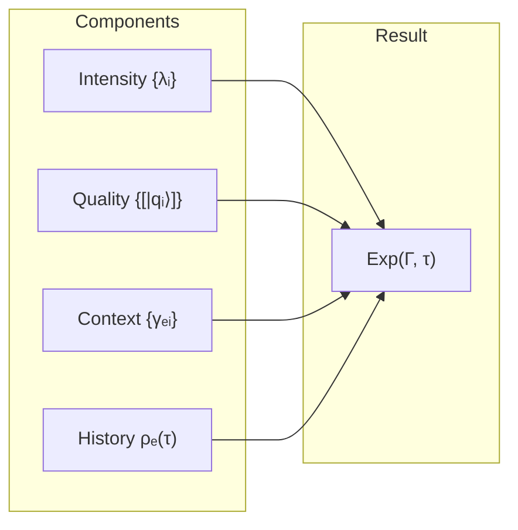

# Theory of Interiority

## "What Is It Like to Be a Bat?"

In 1974 philosopher Thomas Nagel published an essay that became one of the most cited in the philosophy of mind: *"What Is It Like to Be a Bat?"*. His argument is simple and devastating:

A bat perceives the world through echolocation. It has **subjective experience** — "what it is like" to be a bat. But no amount of neurophysiological knowledge about the bat's brain will allow us to **live through** its experience. We can describe the frequency of ultrasound, the neural patterns of echo processing — but between the objective description and the subjective experience there remains an abyss.

Nagel posed the question. Daniel Dennett (1991) tried to sidestep it, arguing that there is no "what it is like" at all. Michael Levin (2019) suggested that subjectivity is more widespread than we think — down to cellular aggregates. But none of these approaches provided a **mathematical language** for describing the content of experience.

**UHM provides this language.** The question "what is it like to be a system $\Gamma$?" receives a precise answer: the content of experience is determined by the spectral decomposition of the **reduced matrix** $\rho_E = \mathrm{Tr}_{-E}(\Gamma)$.

:::info Where we come from
In the [previous chapter](./two-aspect-monism) we established that $\Gamma$ has an inner side (interiority) as an inseparable aspect, not a superstructure. Now we formalise: **what exactly** does this inner side contain? The answer — the spectral decomposition of the reduced matrix $\rho_E$.
:::

### Chapter Roadmap

1. **Reduced matrix $\rho_E$** — how the "projection onto experience" is extracted from the full $\Gamma$
2. **Four components of experience** — intensity, quality, context, history
3. **Projective space of qualities** — the geometry in which sensations live
4. **Fubini-Study metric** — distance between qualities (how much red differs from blue)
5. **Unity of experience** — how the $U$ dimension ensures the wholeness of the "self"
6. **Examples** — the colour red and pain in terms of the formalism

## Reduced Matrix of Experience {#редуцированная-матрица-опыта}

### Motivation: how to extract the "experiential" part from the full description

$\Gamma$ — the full $7 \times 7$ coherence matrix describing **all** aspects of the system: activity, structure, dynamics, logic, interiority, foundation, unity. But we are specifically interested in **interiority** — dimension $E$. How do we isolate precisely this part?

**Analogy.** Imagine a symphony orchestra of seven sections (7 dimensions of $\Gamma$). One section — the woodwinds (dimension $E$, interiority). To understand what this section "hears," we can "mute" the other six sections and listen only to its part — this is $\rho_E = \mathrm{Tr}_{-E}(\Gamma)$. But the full picture of the sound requires knowing how the woodwinds interact with the other sections — this is context $\{\gamma_{Ek}\}$.

### Definition

**The density matrix of the Interiority dimension** $\rho_E$ is obtained by the partial trace of the [coherence matrix](/docs/core/dynamics/coherence-matrix) $\Gamma$ over all dimensions except $E$:

$$
\rho_E := \mathrm{Tr}_{-E}(\Gamma)
$$

where $\mathrm{Tr}_{-E}$ is the partial trace over dimensions $\{A, S, D, L, O, U\}$.

**What is the partial trace?** If the full system is described by matrix $\Gamma$ in the space $\mathcal{H}_E \otimes \mathcal{H}_{\text{rest}}$, then the partial trace is the operation of "summing" over all degrees of freedom except the dimension $E$ of interest. The result is a matrix $\rho_E$ containing all information about the $E$-component accessible without knowledge of the remaining dimensions.

**Numerical example.** Let $\Gamma$ be a state with $\gamma_{EE} = 0.20$ (20% of the resource in interiority). Then $\rho_E$ will have trace 1 (normalisation), but the main contribution to its spectrum will be determined by $\gamma_{EE}$ and coherences $\gamma_{Ek}$.

:::tip Morita equivalence of 7D and 42D formalisms [T]
The partial trace $\mathrm{Tr}_{-E}$ is formally defined in the extended formalism ($\mathcal{H} = \mathbb{C}^{42}$). **However**, the 7D and 42D formalisms are **Morita equivalent** [T]: the sites $(\mathcal{C}_7, J_{\text{Bures}})$ and $(\mathcal{C}_{42}^{\text{PW}}, J_{\text{Bures}})$ induce equivalent sheaf categories $\mathbf{Sh}_\infty(\mathcal{C}_7) \simeq \mathbf{Sh}_\infty(\mathcal{C}_{42}^{\text{PW}})$.

Consequently, $\rho_E$ is uniquely determined via $\Gamma \in \mathcal{D}(\mathbb{C}^7)$ as the E-block of PW-reconstruction. All definitions in this document are **exact** in the 7D formalism.

See [Two levels of formalisation](/docs/core/dynamics/coherence-matrix#two-levels-of-formalization).
:::

:::warning Information completeness [D]
$\rho_E = \mathrm{Tr}_{-E}(\Gamma)$ loses the cross-sectoral coherences $\gamma_{ij}$ for $i,j \notin \{E\}$. The full experiential content is recovered through **context**: $\mathrm{Exp}_k = (\lambda_k, [|q_k\rangle], \mathrm{Context}_k, \mathrm{Hist}_k)$, where $\mathrm{Context}_k = \{\gamma_{Ek} : k \neq E\}$ is taken from the **full** matrix $\Gamma$, not from $\rho_E$. Thus: $\rho_E$ determines intensities and qualities; $\Gamma$ determines context and connections.
:::

## Basic Equation

Experiential content is linked to the spectral decomposition of $\rho_E$:

$$
\rho_E |q_i\rangle = \lambda_i |q_i\rangle
$$

This is the standard eigenvalue problem. $\rho_E$ is a Hermitian matrix, so by the spectral theorem it is diagonalisable and all eigenvalues are real:

- $\lambda_i \in [0, 1]$ — **intensity** of the $i$-th component, $\sum_i \lambda_i = 1$
- $|q_i\rangle \in \mathcal{H}_E$ — **quality** of the $i$-th component
- $\mathcal{H}_E$ — Hilbert space of the [Interiority dimension](/docs/core/structure/dimension-e)

**Interpretation:** Each eigenvalue $\lambda_i$ shows **how strongly** the given component of experience is present. Each eigenvector $|q_i\rangle$ determines **what kind** of component it is — its qualitative character.

:::warning Terminology
The term **"qualia"** is used ONLY for L2 (cognitive qualia at $R \geq R_{\text{th}} = 1/3$, $\Phi \geq \Phi_{\text{th}} = 1$, $D_{\text{diff}} \geq D_{\min} = 2$). For the general case (L0–L2) the term **"experiential content"** is used.

See [Interiority Hierarchy](/docs/proofs/consciousness/interiority-hierarchy) for formal definitions of levels.
:::

## Numerical Examples of Computing $\rho_E$ {#числовые-примеры-rho-e}

To make the formalism tangible, let us consider three concrete examples: how the reduced matrix $\rho_E$ is computed from the full matrix $\Gamma$, and what its spectrum means.

:::note Example 1: Deep sleep (L0)
**Initial $\Gamma$** — nearly maximally mixed state:

$$
\Gamma_{\text{sleep}} = \frac{1}{7}I + \varepsilon \cdot \Delta, \quad \varepsilon \approx 0.02
$$

Diagonal elements: $\gamma_{kk} \approx 1/7 \approx 0.143$ for all $k$. Off-diagonal elements: $|\gamma_{ij}| \lesssim 0.02$ — nearly zero coherences.

**Computing $\rho_E$.** Upon taking the partial trace over $\{A,S,D,L,O,U\}$ we obtain a scalar (one-dimensional E-block in the 7D formalism):

$$
\rho_E^{\text{sleep}} \approx \gamma_{EE} \approx 0.143
$$

In the extended PW formalism $\rho_E$ is a $6 \times 6$ matrix (E participates in 6 pairs). Its spectrum:

$$
\text{Spectrum}(\rho_E^{\text{sleep}}) \approx \{0.17,\; 0.17,\; 0.17,\; 0.17,\; 0.16,\; 0.16\}
$$

**Interpretation.** The spectrum is nearly uniform — there is no dominant component. This is the "white noise" of interiority: the system distinguishes no aspect of experience. Purity $P = \text{Tr}(\Gamma^2) \approx 1/7 + O(\varepsilon^2) \approx 0.144$ — below the threshold $P_{\text{crit}} = 2/7 \approx 0.286$.
:::

:::note Example 2: Wakefulness — perception of red (L2)
**Initial $\Gamma$** — state with dominant E-activity and coherences:

$$
\gamma_{EE} = 0.20, \quad \gamma_{AA} = 0.18, \quad \gamma_{LL} = 0.15
$$
$$
\gamma_{EA} = 0.12 \cdot e^{i \cdot 0.1}, \quad \gamma_{EL} = 0.08 \cdot e^{i \cdot 0.05}, \quad \gamma_{EU} = 0.10 \cdot e^{i \cdot 0.15}
$$

Remaining diagonal: $\gamma_{SS} = 0.14$, $\gamma_{DD} = 0.12$, $\gamma_{OO} = 0.11$, $\gamma_{UU} = 0.10$.

**Spectrum of $\rho_E$** (via PW-reconstruction):

$$
\text{Spectrum}(\rho_E^{\text{awake}}) \approx \{0.52,\; 0.23,\; 0.11,\; 0.07,\; 0.04,\; 0.03\}
$$

**Interpretation.** The dominant eigenvalue $\lambda_1 = 0.52$ — more than half of the experience's "bandwidth" is occupied by a single component (the colour red). The corresponding eigenvector $|q_1\rangle$ determines the specific shade. The second component ($\lambda_2 = 0.23$) — background sensation (spatial context). Purity $P \approx 0.31 > P_{\text{crit}}$.

Measures: $R \approx 0.38 \geq 1/3$ (reflection present), $\Phi \approx 1.2 \geq 1$ (integration present). The system is at level L2 — conscious perception.
:::

:::note Example 3: Deep meditation (upper range of L2)
**Initial $\Gamma$** — state with high coherence between E and U:

$$
\gamma_{EE} = 0.18, \quad \gamma_{UU} = 0.17, \quad \gamma_{OO} = 0.16
$$
$$
\gamma_{EU} = 0.14 \cdot e^{i \cdot 0.03}, \quad \gamma_{EO} = 0.11 \cdot e^{i \cdot 0.04}, \quad \gamma_{EA} = 0.06 \cdot e^{i \cdot 0.08}
$$

**Spectrum of $\rho_E$:**

$$
\text{Spectrum}(\rho_E^{\text{medit}}) \approx \{0.38,\; 0.30,\; 0.15,\; 0.09,\; 0.05,\; 0.03\}
$$

**Interpretation.** The two leading eigenvalues ($\lambda_1 = 0.38$, $\lambda_2 = 0.30$) are close in magnitude — there is no sharp dominance of a single component. This is a "broad" experience: not fixation on an object, but even-handed awareness. Coherence $\gamma_{EU} = 0.14$ — strong connection of experience with unity (a feeling of wholeness). Phases are small ($\theta \lesssim 0.08$) — high transparency of channels. Purity $P \approx 0.29$ — just above $P_{\text{crit}}$, in the Goldilocks window $(2/7, 3/7]$ [T T-124].
:::

### Geometric Intuition: spectrum of $\rho_E$ in different states {#геометрия-спектра}

The spectrum of $\rho_E$ can be visualised as a **bar chart** on an $(n-1)$-simplex. Characteristic patterns:

| State | Spectrum pattern | $\lambda_1 / \lambda_2$ | Geometric analogy |
|-------|-----------------|------------------------|-------------------|
| Deep sleep (L0) | Flat: $\lambda_i \approx 1/n$ | $\approx 1.0$ | Point at the centre of the simplex — maximum entropy |
| Wakefulness (L2) | Peaked: $\lambda_1 \gg \lambda_2$ | $2$--$5$ | Point near the vertex — one component dominates |
| Meditation (L2) | Two-peaked: $\lambda_1 \approx \lambda_2 \gg \lambda_3$ | $1.1$--$1.5$ | Point on the edge of the simplex — two comparable components |
| Flow (flow) | Moderately peaked | $1.5$--$3$ | Between vertex and edge — focus + context |
| Dissociation | Flat with gap $\gamma_{EU} \to 0$ | $\approx 1$ | Centre of simplex, but coherences are severed |

**Key invariant.** The ratio $\lambda_1/\lambda_2$ is a measure of the **focus** of experience:
- $\lambda_1/\lambda_2 \gg 1$: narrow focus (perception of a single object, acute pain)
- $\lambda_1/\lambda_2 \approx 1$: broad scope (panoramic awareness, "pure consciousness")

This ratio is $G_2$-invariant (does not depend on the choice of basis) and therefore is an objective characteristic of the state of consciousness.

---

## Experiential Content: Four Components

What exactly does a system experience? UHM gives the answer through four components, each computable from $\Gamma$:

$$
\mathrm{Exp}(\Gamma, \tau) := (\mathrm{Intensity}, \mathrm{Quality}, \mathrm{Context}, \mathrm{History})
$$

**Analogy with the painter's palette.** Imagine a palette with paints. **Intensity** — how much paint of each colour is on the palette (a lot of red, little blue). **Quality** — the colours themselves (red, blue, green). **Context** — the lighting in the studio, which changes the perception of colours. **History** — how the palette looked a minute ago (the painter just added yellow).

### Component 1: Intensity

Spectrum of eigenvalues of $\rho_E$:

$$
\mathrm{Intensity}(\rho_E) := \{\lambda_i\}_{i=1}^{n}, \quad \text{where } \rho_E|q_i\rangle = \lambda_i|q_i\rangle
$$

Intensity determines the amplitude of the interiority state (at L2+: **loudness**, **brightness**, **strength** of experience).

**Numerical example.** Let $\rho_E$ have spectrum $\{0.6, 0.3, 0.1\}$. This means: the dominant component of experience occupies 60% of the "bandwidth," the second — 30%, the third — 10%. Like a bright red rose against a muted green garden with the barely audible hum of a bee.

### Component 2: Quality

Eigenvectors in projective space:

$$
\mathrm{Quality}(\rho_E) := \{[|q_i\rangle] \in \mathbb{P}(\mathcal{H}_E)\}_{i=1}^{n}
$$

Quality determines the character of the interiority state (at L2+: **timbre**, **colour**, **character** of experience).

The square brackets $[\cdot]$ denote an **equivalence class**: a vector and its multiplication by a complex number yield the same quality. This is physically meaningful: the global phase is unobservable.

### Component 3: Context

Coherences between dimension $E$ and the others:

$$
\mathrm{Context}(\Gamma) := \{\gamma_{EA}, \gamma_{ES}, \gamma_{ED}, \gamma_{EL}, \gamma_{EO}, \gamma_{EU}\}
$$

Context modulates experience through [coherences](/docs/core/dynamics/coherence-matrix#недиагональные-элементы-когерентности):

| Coherence | Description of modulation |
|-----------|--------------------------|
| $\gamma_{EA}$ | Attention — how actively the system processes interiority content |
| $\gamma_{ES}$ | Structural context — bodily sensations, spatial grounding |
| $\gamma_{ED}$ | Dynamic context — temporal unfolding, rhythm of experience |
| $\gamma_{EL}$ | Logical context — conceptual framing (at L2) |
| $\gamma_{EO}$ | Emotional tone — connection to basic dispositions |
| $\gamma_{EU}$ | Unity — how much experience is integrated into a unified "self" |

### Component 4: History

Trajectory of evolution of $\rho_E$ in time window $T_{\mathrm{mem}}$:

$$
\mathrm{History}(\tau, T_{\mathrm{mem}}) := \{\rho_E(\tau') : \tau' \in [\tau - T_{\mathrm{mem}}, \tau]\}
$$

where $T_{\mathrm{mem}} > 0$ is the system's characteristic memory time. History determines adaptation, habituation, expectations. Without history, **anticipation** (prediction of future $\rho_E$ on the basis of the past), **habituation** (decrease of intensity upon repeated stimulation), and **surprise** (divergence between expected and actual $\rho_E$) are impossible.

## Projective Space of Qualities

### Motivation: why qualities live in projective space

The qualities of experience are not merely a set of numbers. They form a **geometric space** with its own metric. This space is the projective space $\mathbb{P}(\mathcal{H}_E)$.

Why projective and not ordinary? Because the **global phase is unobservable**: vectors $|q\rangle$ and $e^{i\theta}|q\rangle$ describe the same quality. Therefore we work not with vectors but with **rays** — equivalence classes:

$$
\mathbb{P}(\mathcal{H}_E) := (\mathcal{H}_E \setminus \{0\}) / \sim
$$

where the equivalence relation is:

$$
|\psi\rangle \sim |\phi\rangle \quad \Leftrightarrow \quad \exists c \in \mathbb{C}^*: |\psi\rangle = c|\phi\rangle
$$

**Analogy.** Think of compass directions. North-east is a direction, not a point. Doubling the compass needle does not change the direction. In the same way, doubling the vector $|q\rangle$ does not change the quality — the direction is the same.

**Topology** (for $\dim(\mathcal{H}_E) = n$):

| Property | Description |
|----------|-------------|
| Compactness | $\mathbb{P}(\mathbb{C}^n)$ is compact |
| Connectedness | $\mathbb{P}(\mathbb{C}^n)$ is connected |
| Isomorphism | $\mathbb{P}(\mathbb{C}^n) \cong S^{2n-1} / U(1)$ |
| Dimension | $\dim_{\mathbb{R}}(\mathbb{P}(\mathbb{C}^n)) = 2n - 2$ |

**Connectedness** means that from any quality one can continuously pass to any other — there are no "isolated islands" in the space of experiences. **Compactness** guarantees that the space of qualities is finite — there are no "infinite expanses."

## Fubini-Study Metric {#метрика-фубини-штуди}

### Motivation: how to measure distance between experiences

Intuitively, red is "closer" to orange than to blue. Pain in a finger is "closer" to pain in the hand than to the smell of a rose. But can this be formalised?

The Fubini-Study metric is the unique (up to a constant) monotone Riemannian metric on projective space (Chentsov-Petz theorem). This is not an arbitrary choice, but a **forced structure**.

**Distance between qualities:**

$$
d_{FS}([|\psi\rangle], [|\phi\rangle]) := \arccos(|\langle\psi|\phi\rangle|) \in [0, \pi/2]
$$

where $[|\psi\rangle]$ is the equivalence class of vector $|\psi\rangle$ in $\mathbb{P}(\mathcal{H}_E)$.

**In plain terms:** Take two vectors $|q_1\rangle$ and $|q_2\rangle$ representing two qualities. Compute their inner product (in absolute value). If it equals 1 — the qualities coincide. If 0 — they are maximally distinct. The Fubini-Study distance is the arccosine of this absolute value.

**Numerical example.** Let $|q_{\text{red}}\rangle = \begin{pmatrix}1\\0\end{pmatrix}$ and $|q_{\text{orange}}\rangle = \begin{pmatrix}\cos 15°\\\sin 15°\end{pmatrix}$. Then:

$$d_{FS} = \arccos(|\cos 15°|) = 15° \approx 0.26 \text{ rad}$$

And for $|q_{\text{blue}}\rangle = \begin{pmatrix}0\\1\end{pmatrix}$:

$$d_{FS}(\text{red}, \text{blue}) = \arccos(0) = \pi/2 \approx 1.57 \text{ rad}$$

Red is indeed closer to orange than to blue.

**Properties:**

| Condition | Value | Interpretation |
|-----------|-------|----------------|
| $d_{FS} = 0$ | $\vert\psi\rangle = e^{i\theta}\vert\phi\rangle$ | Identical qualities |
| $d_{FS} = \pi/2$ | $\langle\psi\vert\phi\rangle = 0$ | Maximally distinct qualities |

**Infinitesimal form** (Riemannian metric):

$$
ds^2 = \langle d\psi|d\psi\rangle - |\langle\psi|d\psi\rangle|^2
$$

## Full Metric on the Experiential Space

Distance between two experiential states $E_1$, $E_2$:

$$
d_{\mathcal{E}}(E_1, E_2) := \sqrt{d_{\lambda}^2 + \alpha \cdot d_{FS}^2 + \beta \cdot d_C^2 + \gamma \cdot d_H^2}
$$

where the metric components are:

| Component | Definition | Description |
|-----------|------------|-------------|
| $d_{\lambda}$ | $\|\boldsymbol{\lambda}_1 - \boldsymbol{\lambda}_2\|_2$ | Euclidean distance between spectra |
| $d_{FS}$ | $\sum_i d_{FS}([\lvert q_i^{(1)}\rangle], [\lvert q_i^{(2)}\rangle])$ | Sum of Fubini-Study distances |
| $d_C$ | $\|\mathrm{Context}_1 - \mathrm{Context}_2\|_F$ | Frobenius norm for contexts |
| $d_H$ | $\int_{\tau-T_{\mathrm{mem}}}^{\tau} \|\rho_E^{(1)}(\tau') - \rho_E^{(2)}(\tau')\|_F \, d\tau'$ | Integral of history difference |

Weights $\alpha, \beta, \gamma > 0$ — model parameters.

:::warning Empirical status
Weights $\alpha$, $\beta$, $\gamma$ have **empirical status** — they are not derived from UHM axioms and require calibration for specific systems.
:::

:::info $G_2$-invariance of the experiential metric [T]
All components of the metric $d_{\mathcal{E}}$ are **$G_2$-invariant**: for $U \in G_2$, $d_{\mathcal{E}}(E_1, E_2) = d_{\mathcal{E}}(UE_1 U^\dagger, UE_2 U^\dagger)$. This follows from:
- $d_\lambda$: the spectrum of $\rho_E$ does not change under unitary conjugation (in particular, under $G_2 \subset U(7)$)
- $d_{FS}$: the Fubini-Study metric is invariant under $U(n)$-transformations (Chentsov-Petz theorem)
- $d_C$, $d_H$: context and history are determined by matrix elements of $\Gamma$, transforming covariantly

Consequently, **the geometry of experiential space is objective** — it does not depend on the choice of gauge ($G_2$-frame). The [$G_2$-rigidity theorem](/docs/proofs/categorical/uniqueness-theorem#инварианты) [T] guarantees: different observers measure the same phenomenal geometry.
:::

## Levels of Completeness of Description

:::info Note
This is a hierarchy of **completeness of description** of a single state. Not to be confused with the [interiority hierarchy](/docs/proofs/consciousness/interiority-hierarchy) (L0→L1→L2→L3→L4), which describes **types of systems**.
:::

| Completeness | Components | Applicability |
|--------------|------------|---------------|
| Spectral | $\{\lambda_i\}$ | Intensities only (insufficient for distinguishing qualities) |
| Geometric | $(\{\lambda_i\}, \{[\lvert q_i\rangle]\})$ | Intensity + quality |
| Contextual | $(\{\lambda_i\}, \{[\lvert q_i\rangle]\}, C)$ | + coherences with other dimensions |
| Full | $(\{\lambda_i\}, \{[\lvert q_i\rangle]\}, C, H)$ | + history of evolution |

## The Isospectrality Problem

**Problem:** There exist matrices $\rho_1 \neq \rho_2$ with $\text{Spectrum}(\rho_1) = \text{Spectrum}(\rho_2)$ but different eigenvectors. Can two completely different experiences have the same "loudness"?

**Answer: yes, and the formalism distinguishes them.** Qualities differ through eigenvectors:

$$
\text{Spectrum}(\rho_1) = \text{Spectrum}(\rho_2), \text{ but } \text{Quality}(\rho_1) \neq \text{Quality}(\rho_2)
$$

$$
\Rightarrow \text{Exp}(\rho_1) \neq \text{Exp}(\rho_2)
$$

Isospectral states can have **equal intensity** but **different quality** of experience.

**Analogy.** Two chords can have the same volume (intensity), but sound completely different (quality): major and minor — isospectral in amplitude, but distinct in timbre.

## Examples of Cognitive Qualia (L2)

When L2 conditions are met: $R \geq 1/3$ [T], $\Phi \geq 1$ [T] (T-129), $D_{\text{diff}} \geq 2$ [T] (T-151) ([L2 thresholds](/docs/core/foundations/axiom-septicity#пороги-l2-строгий-вывод)) the components of experience become reflexively accessible — the system does not merely "experience," but **knows that it experiences**.

### The colour red

| Component | Mathematical representation | Phenomenal interpretation |
|-----------|-----------------------------|--------------------------|
| Intensity | $\lambda_{\text{red}} \in [0, 1]$ | Brightness |
| Quality | $[\vert q_{\text{red}}\rangle] \in \mathbb{P}(\mathcal{H}_E)$ | Shade of red |
| Context | $\gamma_{EA}$ (attention), $\gamma_{EL}$ | Lighting, background |
| History | $\rho_E(\tau - T_{\mathrm{mem}}) \to \rho_E(\tau)$ | Retinal adaptation |

When you look at a red rose: $\lambda_{\text{red}} \approx 0.7$ (dominant component), $|q_{\text{red}}\rangle$ determines the specific shade, $\gamma_{EA}$ is high (you are paying attention), $\gamma_{EO}$ sets the emotional tone (beauty, joy). After a minute of adaptation $\lambda_{\text{red}}$ decreases slightly — history.

### Pain

| Component | Mathematical representation | Phenomenal interpretation |
|-----------|-----------------------------|--------------------------|
| Intensity | $\lambda_{\text{pain}} \in [0, 1]$ | Strength of pain |
| Quality | $[\vert q_{\text{pain}}\rangle] \in \mathbb{P}(\mathcal{H}_E)$ | Sharp/dull/throbbing |
| Context | $\gamma_{ES}$ (structure), $\gamma_{EO}$ | Localisation, emotions |
| History | $\{\rho_E(\tau')\}_{\tau' \in [\tau - T_{\mathrm{mem}}, \tau]}$ | Sensitisation/desensitisation |

The difference between sharp and dull pain is a difference in $|q_{\text{pain}}\rangle$, not in $\lambda_{\text{pain}}$. Intense dull pain ($\lambda = 0.8$, $|q_{\text{dull}}\rangle$) and mild sharp pain ($\lambda = 0.3$, $|q_{\text{sharp}}\rangle$) differ in both components.

## Connection to Neuroscience

How does $\rho_E$ relate to neural correlates of consciousness (NCC)?

In neuroscience, NCC is the minimal neural mechanism sufficient for a specific experience. In UHM:

| Neuroscientific term | Correspondence in UHM |
|---------------------|----------------------|
| NCC (neural correlate of consciousness) | Projection of $\Gamma$ onto the neural basis |
| Contents of consciousness | $\rho_E$ (reduced matrix) |
| Arousal level | $\lambda_{\max}(\rho_E)$ (dominant intensity) |
| Connectivity (functional connectivity) | $\Phi$ (integration measure) |
| Neural differentiation | $D_{\text{diff}}$ |

UHM does not compete with neuroscience, but provides a **mathematical language** in which neural data can be interpreted. Prediction: neural patterns corresponding to conscious perception must satisfy $P > 2/7$, $R \geq 1/3$, $\Phi \geq 1$ (if correctly mapped into the $\Gamma$-formalism).

## Unity of Experience

### The Binding Problem

Neuroscience knows that colour is processed in area V4, shape in area IT, motion in MT. But we see a **unified** object: a red ball flying to the right. How are representations distributed across the cortex unified into a coherent experience?

### UHM's Solution

Subjective unity of experience ("self") is provided by the [Unity dimension (U)](/docs/core/structure/dimension-u) through coherences $\gamma_{EU}$:

$$
\Phi_E := \frac{\sum_{i \neq j} |\gamma_{E_i E_j}|^2}{\sum_i \gamma_{E_i E_i}^2}
$$

where $\Phi_E$ is the **integration measure of the experiential subspace** (not to be confused with the global [integration measure $\Phi$](/docs/core/structure/dimension-u#мера-интеграции-φ), which is computed over the entire matrix $\Gamma$).

**Condition for unified experience:**

$$
\gamma_{EU} > 0 \quad \land \quad \Phi_E > \Phi_{th}
$$

When $\gamma_{EU} \to 0$ or $\Phi_E < \Phi_{th}$, **dissociation** arises — a sense of fragmentation of consciousness. This is observed clinically: in dissociative disorders patients describe experience as "not mine," "watching from the outside" — which corresponds to a decrease in $\gamma_{EU}$.

:::note Connection to the consciousness measure
The unity of experience enters the [consciousness measure](./self-observation#мера-сознательности-c) $C = \Phi \times R$ **[T T-140]** through the component $\Phi$. Differentiation $D_{\text{diff}} \geq 2$ is a separate viability condition ([T-128](/docs/proofs/consciousness/operationalization#t-128)).
:::

## Structure of the Experiential Space

**Intensity space:** $(n-1)$-simplex $\Delta^{n-1} = \{\boldsymbol{\lambda} : \lambda_i \geq 0, \sum_i \lambda_i = 1\}$

**Quality space:** projective space $\mathbb{P}(\mathcal{H}_E)$

## For Different Audiences

### For Engineers

**Computational complexity:**

| Operation | Complexity | Note |
|-----------|------------|------|
| Eigenvalues of $\rho_E$ | $O(n^3)$ | Standard diagonalisation |
| Fubini-Study metric | $O(n)$ | Inner product |
| Full metric $d_{\mathcal{E}}$ | $O(n^3 + T_{\mathrm{mem}}/\Delta\tau)$ | Depends on history length |

**Practical discretisation of history:** Store $T_{\mathrm{mem}} / \Delta\tau$ states with step $\Delta\tau$. Typical value: 100–1000 time points.

### For Psychologists

The theory of interiority provides a **mathematical language for describing phenomenology**:

- **Spectrum of $\rho_E$** — quantitative characterisation of the "palette" of interiority states (at L2+: experiences)
- **Fubini-Study metric** — measure of "distance" between qualities (how much red differs from blue)
- **Context** — how attention, mood, and embodiment modulate experience
- **History** — mechanism of adaptation, habituation, sensitisation

### For Researchers of Inner Landscapes

Experiential content is a **map of inner space**:

- **Intensity** answers the question "how strongly?"
- **Quality** answers the question "what exactly?" (colour, sound, emotion, bodily sensation)
- **Context** answers the question "under what conditions?" (attentional focus, emotional background)
- **History** answers the question "where did it come from and where is it going?"

Altered states of consciousness are characterised by a change in the **geometry** of this space — distances between qualities may contract (synesthesia) or expand (heightened perception).

### What We Learned

- **Experiential content** is fully determined by four components: intensity ($\lambda_i$), quality ($[|q_i\rangle]$), context ($\gamma_{Ek}$), history ($\rho_E(\tau')$).
- **Qualities live in projective space** $\mathbb{P}(\mathcal{H}_E)$, endowed with the Fubini-Study metric — the unique monotone metric (Chentsov-Petz theorem).
- **The geometry of experience is objective** — $G_2$-invariance of the metric $d_{\mathcal{E}}$ guarantees that different observers measure the same phenomenal geometry.
- **Isospectral states** can have equal intensity but different quality — the formalism distinguishes both aspects.
- **Unity of experience** is provided by coherence $\gamma_{EU} > 0$ and integration measure $\Phi_E > \Phi_{\mathrm{th}}$.
- The term "qualia" is correct **only for L2** ($R \geq 1/3$, $\Phi \geq 1$, $D_{\mathrm{diff}} \geq 2$); for L0–L1 "experiential content" is used.

:::tip What's Next
The theory of interiority has described **what** is experienced. The next question: **how** can a system observe its own content? The answer is given by [Self-Observation](./self-observation) — the operator $\varphi$, the reflection measure $R$, and the consciousness measure $C = \Phi \times R$.

For quantitative definitions of stress, cap, and free energy, see [Coherence Cybernetics definitions](/docs/applied/coherence-cybernetics/definitions).
:::

---

**Related documents:**
- [Self-Observation](./self-observation) — operator $\varphi$ and reflection measure R
- [Hard Problem](./two-aspect-monism) — philosophical analysis
- [Dimension E](/docs/core/structure/dimension-e) — dimension of experience
- [Dimension U](/docs/core/structure/dimension-u) — dimension of unity and measure $\Phi$
- [Interiority Hierarchy](/docs/proofs/consciousness/interiority-hierarchy) — formal definitions L0→L1→L2→L3→L4
- [Coherence Matrix](/docs/core/dynamics/coherence-matrix) — definition of $\Gamma$ and $\rho_E$
- [CC Definitions](/docs/applied/coherence-cybernetics/definitions) — operational formulas for engineers
