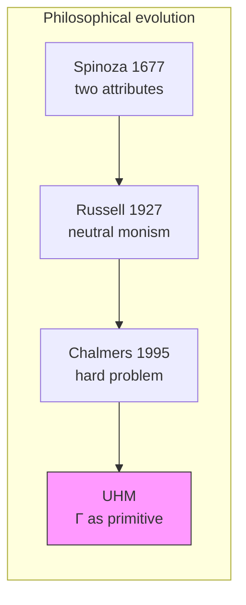
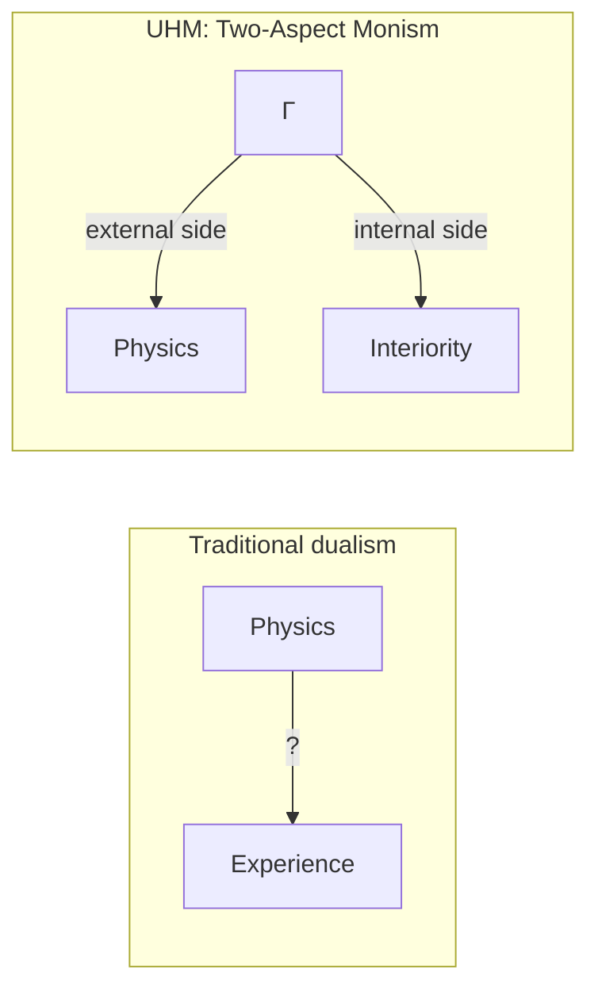
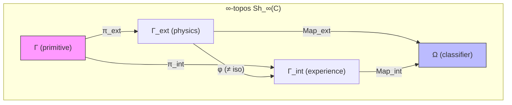

# The Hard Problem of Consciousness

:::info Who This Chapter Is For
You will learn how UHM resolves Chalmers' 'hard problem of consciousness' through two-aspect monism: the coherence matrix $\Gamma$ is a single ontological primitive whose external side is physics and whose internal side is subjective experience. The chapter lays the philosophical foundation for the entire consciousness section.
:::

## Three and a Half Centuries of Failure

In 1641, René Descartes wrote *Meditations on First Philosophy* and divided the world in two. On one side — *res extensa*, extended matter: stones, trees, bodies. On the other — *res cogitans*, thinking substance: thoughts, sensations, experiences. This seemed clear and elegant. But Descartes created a problem he could not solve: **how do these two substances interact?** How can an immaterial thought move a material hand?

Descartes proposed the pineal gland as the site of contact. Princess Elisabeth of Bohemia immediately pointed out the absurdity: the immaterial cannot physically push the material, regardless of anatomy.

Three hundred and fifty years have passed since then. Physics, biology, and neuroscience have made incredible advances. We have split the atom, decoded the genome, mapped the brain's neural networks. But Descartes' question has remained open, only taking a sharper form.

### Chalmers' Formulation (1995)

In 1995, the Australian philosopher David Chalmers divided the problems of consciousness into 'easy' and 'hard':

**Easy problems** (they are technically difficult, but it is clear *how* to solve them):
- How does the brain process information?
- How does the brain govern behaviour?
- How does the brain integrate data from different sense organs?

**The hard problem:**

> "Why do physical processes give rise to subjective experience?"

This is a question about the **explanatory gap** between objective description and subjective experience. Neuroscience can explain which neurons fire when you see a red colour. But even complete knowledge of neural activity does not explain **why** that firing feels like red rather than blue, or why it feels like anything at all.

**Analogy.** Imagine reading the score of a symphony. The notes on paper are an objective description. But when the orchestra plays, you **hear** music. The hard problem asks: why do marks on paper give rise to sound? UHM answers: the score and the music are not two different objects, but two ways of interacting with the same thing — the sonic structure. The score is the view 'from outside' (for the conductor), the music — the view 'from inside' (for the listener).

:::info Where We Came From
This chapter opens the [Consciousness](/docs/consciousness/overview) section. We already know that $\Gamma \in \mathcal{D}(\mathbb{C}^7)$ is the ontological primitive of the theory, and that the five axioms $\Omega^7$ set the structure and dynamics. Now we ask the main question: **why is the mathematical structure experienced?**
:::

### Chapter Roadmap

1. **Formulation of the problem** — what the 'hard problem' is and why it was considered unsolvable
2. **Historical predecessors** — from Spinoza through Russell to Chalmers, and the dual-aspect programmes that stated this chapter's thesis before UHM
3. **Two-aspect monism** — the UHM position: physics and experience are two sides of one primitive Γ
4. **Categorical formalisation** — splitting of morphisms, explanatory gap, theorem on two-aspectness
5. **Uniqueness of the phenomenal functor** — why the structure of experience cannot be otherwise
6. **Relational identity of qualia** — Yoneda's lemma, and what it does and does not say about inverted qualia
7. **Limits of explanation** — what UHM explains and what it honestly acknowledges as unexplainable

## Historical Genealogy: Who Tried Before Us

Two-aspect monism did not emerge from a vacuum. It has a deep philosophical pedigree.

### Spinoza (1677): Two Attributes of One Substance

Benedict Spinoza, a younger contemporary of Descartes, proposed a radical alternative to dualism. In the *Ethics* he argued: there is only **one substance** (God/Nature), which has an infinite number of attributes, of which we know two — **thought** and **extension**. Thought and matter are not two different things, but two *ways of describing* the same thing.

**The key idea — E2P7:** *Ordo et connexio idearum idem est ac ordo et connexio rerum* — the order and connection of ideas is identical to the order and connection of things (Ethics II, Prop. 7). This is the **exact precursor** of the phenomenal functor $F: \mathbf{Phys} \to \mathbf{Phen}$, which in UHM provides an isomorphism between the physical and interiority categories. Spinoza proclaimed the existence of such an isomorphism; UHM constructs it explicitly.

**Spinoza for UHM:** In UHM terms, $\Gamma$ is Spinoza's substance. The two 'attributes' are two **projections**:

- $\mathrm{Map}_{\text{ext}}(\Gamma)$ — the physical aspect (analogue of the attribute of extension),
- $\mathrm{Map}_{\text{int}}(\Gamma)$ — the interiority aspect (analogue of the attribute of thought).

E2P7 asserts that there is a structural identity between them. UHM proves this as a theorem: the functor $F$ preserves morphisms between categories.

**Conatus and Gap.** Spinoza's conatus — the striving of each thing to persist in its being (E3P6) — implies that a system *never completes* self-knowledge: conatus is infinite, and complete self-coincidence would mean the cessation of striving. In UHM this corresponds precisely to theorem T-55 (Gap > 0, Lawvere incompleteness): $\mathrm{Gap}(\Gamma, \varphi(\Gamma)) > 0$ — the system cannot fully model itself. Spinoza's conatus **requires** Gap to be strictly positive; Gap > 0 **explains** why conatus never runs dry.

**Why Spinoza could not formalise it.** Spinoza had only Euclidean geometry as a model of rigour (hence *more geometrico* — 'in the geometric manner'). He lacked three tools: (1) **category theory** (Eilenberg–Mac Lane, 1945) for formalising the functor $F$, (2) **quantum mechanics** (1925–) for describing $\Gamma$ as a density matrix, (3) **spectral triples** (Connes, 1994) for deriving geometry from algebra. UHM does not 'confirm' Spinoza — it provides the formalism he lacked.

### Russell (1927): Neutral Monism

Bertrand Russell in *The Analysis of Matter* concluded that physics describes only the **structural relations** between events, but says nothing about their **intrinsic nature**. He conjectured that the intrinsic nature of physical events is something of which conscious experience consists.

**Russell's neutral monism:** There exists a 'neutral stuff' that is neither mental nor physical, but from which both the mental and the physical are constructed.

**Russell for UHM:** The matrix $\Gamma$ is precisely Russell's 'neutral stuff': from it *both* physical laws (as a limit at $R \to 0$, see [QM-reduction](/docs/physics/quantum-mechanics/qm-reduction)) *and* the structure of experience (via the spectral decomposition of $\rho_E$) are derived.

### Chalmers (1996): Naturalistic Dualism

Chalmers, having formulated the hard problem, proposed 'naturalistic dualism': consciousness is a fundamental property irreducible to the physical, but connected with it through 'psychophysical laws'. However, he could not explain where these laws come from and why they are as they are.

**Chalmers for UHM:** UHM reformulates Chalmers' problem: there are no 'psychophysical laws' — there is a single object $\Gamma$, which on one side behaves as physics, and on the other is experienced as experience. No bridge between two banks is needed — there is one river flowing in both directions.

### Precedents and related programmes: dual-aspect monism after Russell {#прецеденты-и-родственные-программы}

The three names above are not the whole genealogy. Between Russell and UHM at least five research programmes held this chapter's thesis — one reality with a physical and an experiential side — and two of them gave it a formal shape. This matters for a plain reason: a thesis that was stated, formalised and criticised before is not UHM's novelty, and the criticism it drew applies to UHM unless UHM answers it. Each entry gives the primary source, what the programme holds, where it stands and on whose judgment, the UHM ingredient it parallels, and the difference. Every mapping below between UHM and an external programme is an interpretation **[I]**, not a theorem.

#### Pauli and Jung: complementary aspects of one neutral reality {#паули-юнг}

The physicist Wolfgang Pauli and the psychiatrist Carl Gustav Jung held that mind and matter are complementary aspects of one reality that is itself neither mental nor physical, and that the correlations between the two need no causal bridge. This is the core move of this chapter — one primitive, two sides, no psychophysical laws — stated some seventy years before UHM.

- **Source.** The Pauli–Jung exchange of 1932–1958 and their joint book of 1952, reconstructed by Harald Atmanspacher, "Dual-aspect monism à la Pauli and Jung", *Journal of Consciousness Studies* 19(9–10): 96–120 (2012); a formal outline in Atmanspacher, "The Pauli–Jung conjecture and its relatives: a formally augmented outline", *Open Philosophy* 3: 527–549 (2020), doi:10.1515/opphil-2020-0138; a book-length development in Atmanspacher & Dean Rickles, *Dual-Aspect Monism and the Deep Structure of Meaning* (Routledge, 2022).
- **What it holds.** Beneath the mind–matter distinction lies a psychophysically neutral, holistic domain — Jung's *unus mundus*, "one world". It is non-Boolean: statements about it do not obey two-valued classical logic. A distinction drawn in it — an "epistemic split", which Atmanspacher also describes as a symmetry breaking — yields the mental and the material as two aspects. The aspects are complementary in Niels Bohr's sense: both are needed for a complete description, and no single context gives access to both. Pauli's own formulation (1952, in Atmanspacher's translation): "It would be most satisfactory if physis and psyche could be conceived as complementary aspects of the same reality." Correlations between mind and matter are consequences of the split, not causal interactions; Jung's "synchronicity" names correlations joined by meaning rather than by cause. Atmanspacher and Rickles (2022) make meaning the "deep structure" of the neutral domain and compare the variants of Pauli–Jung, Arthur Eddington, John Wheeler, and David Bohm with Basil Hiley.
- **Standing.** An active minority programme, carried mainly by Atmanspacher and co-workers. Its main advocate reports empirical support from documented mind–matter correlations (Stanford Encyclopedia of Philosophy, "Quantum Approaches to Consciousness", by Atmanspacher, revised 2024) — a proponent's judgment. Independent reviews divide: Roderick Main's review essay (*Journal of Analytical Psychology* 68(3): 534–547, 2023) sets out and clarifies the book's argument; Edward F. Kelly's essay review (Essentia Foundation, 2023) objects that "decomposition itself is never explained in a manner that makes sense" and that the view replaces one hard problem with two. Atmanspacher (2012) himself places the meaning-based lawfulness Pauli postulated "entirely outside the natural sciences of his time and also, more or less, of today".
- **UHM parallel [I].** $\Gamma$ plays the part of the *unus mundus*; the [splitting of the space of morphisms](#теорема-расщепление) — a fibration with base $\mathrm{Map}_{\text{ext}}$ and fibre $\mathrm{Map}_{\text{int}}$ — plays the part of the epistemic split; the [non-triviality of the gap](#теорема-нетривиальность) and the [non-invertible correspondence](#теорема-двухаспектность) $\varphi$ play the part of complementarity: neither aspect fixes the other.
- **The honest difference.** *Precedent.* One neutral whole whose split yields two complementary aspects, correlated without causal bridge laws, is Pauli's and Jung's idea; a formal treatment of it is Atmanspacher's (2020) and Atmanspacher & Rickles' (2022). UHM therefore cannot claim to be the first dual-aspect monism with a formal apparatus. *Different in kind.* In UHM the split is a fixed tensor factor of a fixed primitive — the $E$-dimension against the other six; in Pauli–Jung the aspects depend on the epistemic context. By Atmanspacher's own dividing line (2012, §1.1: for neutral monists the mind–matter distinction is "preformed in the neutral domain", for dual-aspect monists it is drawn by the context) UHM stands closer to neutral monism than to Pauli–Jung [I]. *What UHM adds.* A concrete carrier: the split is computed (a partial trace over $E$), and the non-triviality of the gap is a theorem on this page [T]; Pauli and Jung had no model of the neutral domain — "we do not know better than by pure speculation which symmetries must be ascribed to the unus mundus" (Atmanspacher 2012). *What stays.* Kelly's objection reaches UHM unchanged: why the $E$-factor is experienced is exactly the primitive this chapter leaves unexplained, and [T-214 [T]](/docs/proofs/categorical/fundamental-closures#t-214) shows that this bridge cannot be internalised. UHM has no counterpart of meaning or synchronicity.

#### Bohm: active information and two poles at every level {#бом-активная-информация}

The physicist David Bohm proposed that every level of nature has a mental and a physical pole, and that what joins them is information that acts rather than a force that pushes. For UHM this is the closest precedent for two claims at once: interiority is universal but graded by level, and the inner side does causal work.

- **Source.** David Bohm, "A new theory of the relationship of mind and matter", *Philosophical Psychology* 3(2–3): 271–286 (1990), doi:10.1080/09515089008573004; developed by Basil Hiley and Paavo Pylkkänen (Pylkkänen, *Mind, Matter and the Implicate Order*, Springer, 2007).
- **What it holds.** In the causal (de Broglie–Bohm) interpretation of quantum theory an electron is an inseparable union of a particle and a field. The field acts through its form rather than its intensity, so it carries "objective and active information", and the way this information acts resembles the way information acts in our own experience. On this analogy Bohm builds a theory in which the basic relation of mind and matter is "participation rather than interaction". "At each level of subtlety there will be a 'mental pole' and a 'physical pole' … But the deeper reality is something beyond either mind or matter" (Bohm 1990, as quoted by Atmanspacher 2012).
- **Standing.** An interpretive programme kept alive by a small school (Hiley, Pylkkänen). The SEP entry on quantum approaches (Atmanspacher, revised 2024) states the main conceptual objection: "Using information-based concepts in a non-epistemic manner appears inconsistent, or at least confusing, if the common (syntactic) significance of Shannon-type information is intended."
- **UHM parallel [I].** Universal L0 with the graded hierarchy L1–L4 corresponds to poles "at each level of subtlety"; the $E$-sector entering regeneration, $\kappa = \kappa_{\text{bootstrap}} + \kappa_0 \cdot \mathrm{Coh}_E$, corresponds to information that acts.
- **The honest difference.** *Precedent.* A graded, two-poled monism whose mental pole is causally effective through information is Bohm's (1990). *What UHM adds.* Within its own dynamics UHM proves what Bohm does not: a viable system with non-zero dissipation has its E-coherence bounded below — the mathematical core of the No-Zombie theorem, [T-38a [T]](/docs/applied/coherence-cybernetics/theorems#теорема-81-условная-необходимость-интериорности-no-zombie), whose "no zombies" reading the registry marks [I]. UHM's dynamics is an open-system (Lindblad) evolution, not a guidance equation, and its levels are thresholds on invariants of $\Gamma$. *Where UHM is weaker.* Bohm's information sits in an explicit physical mechanism; UHM's identification of the $E$-sector with interiority is a postulate, and [T-214 [T]](/docs/proofs/categorical/fundamental-closures#t-214) shows it must stay external. The SEP objection to "active information" — information used in a non-epistemic sense — applies equally to calling $\mathrm{Coh}_E$ "inner".

#### Velmans: reflexive monism {#велманс-рефлексивный-монизм}

The psychologist Max Velmans holds that one psychophysical reality appears to an external observer as brain activity and to the subject as experience, and that neither view reduces to the other. This chapter's slogan — physics from outside, experience from inside — is Velmans' ontological monism with epistemological dualism.

- **Source.** Max Velmans, *Understanding Consciousness*, 2nd ed. (Routledge, 2009; 1st ed. 2000); "Reflexive monism", *Journal of Consciousness Studies* 15(2): 5–50 (2008); "Reflexive monism: psychophysical relations among mind, matter and consciousness", in Velmans, *Towards a Deeper Understanding of Consciousness* (Routledge, 2016), pp. 87–106.
- **What it holds.** (i) Monism in ontology, dualism in epistemology: first- and third-person perspectives on the same reality are complementary and mutually irreducible — Velmans' "psychological complementarity". (ii) Perceptual projection: the experienced world is experienced out there, roughly where it seems to be, not inside the head. (iii) Reflexivity: manifest forms emerge from and reflect the nature of the wider universe that supports them (the 2009 book closes with "Self-Consciousness in a Reflexive Universe"). (iv) A science of experience that joins subjective, intersubjective and objective methods.
- **Standing.** A known minority position in consciousness studies. Atmanspacher (2012) credits it with introducing the complementarity of dual aspects "for the first time in a psychologically based approach". The main critique is Hans-Ulrich Hoche's (*Phenomenology and the Cognitive Sciences* 6(3): 389–409, 2007): complementarity taken strictly leaves no room for Velmans' ontological monism or for any dual-aspect reading; Velmans replied in the same issue (6(3): 411–423). A sympathetic review (Robert K. Beshara, *Language and Psychoanalysis* 10(2): 63–67, 2021) notes that the model describes perceptual projection — "an empirically observable effect" — rather than explaining it.
- **UHM parallel [I].** The key thesis of Step 2 below — two sides of one $\Gamma$ — corresponds to (i); [self-referential closure](#самореферентная-замкнутость) and [T-221 [T]](/docs/proofs/categorical/fundamental-closures#t-221), with observers as internal sections of one world, correspond to (iii); the claim at the end of this chapter that exploring inner landscapes is "a legitimate form of knowledge" corresponds to (iv).
- **The honest difference.** *Precedent.* The two-perspective formulation of monism, and the standing of first-person inquiry as knowledge of the same reality, are Velmans' (from 1991 on, per Atmanspacher 2012). *What UHM adds.* A formal object and a dynamics; Velmans has neither. *Where UHM is silent.* Perceptual projection, Velmans' central empirical thesis, has no counterpart: nothing in $\Gamma$ says where an experience is located. *What stays.* Hoche's objection applies to UHM: if the two descriptions are strictly complementary, the step to one underlying object is a metaphysical addition — in UHM it is the primitive of [Axiom Ω⁷](/docs/core/foundations/axiom-omega), not a result.

#### Chalmers: the double-aspect theory of information {#чалмерс-двуаспектная-информация}

The Chalmers of the section above was not only a dualist: in the same years he proposed, as his candidate psychophysical law, that information itself has a physical and a phenomenal aspect. The reply to him above — "there is a single object $\Gamma$, which on one side behaves as physics, and on the other is experienced as experience" — therefore restates his own speculative proposal rather than departing from it.

- **Source.** David J. Chalmers, "Facing up to the problem of consciousness", *Journal of Consciousness Studies* 2(3): 200–219 (1995); *The Conscious Mind* (Oxford University Press, 1996), ch. 8 "Consciousness and Information: Some Speculation".
- **What it holds.** "Information (or at least some information) has two basic aspects, a physical aspect and a phenomenal aspect"; "experience arises by virtue of its status as one aspect of information, when the other aspect is found embodied in physical processing" (1995). Two companion principles: *structural coherence* — the structure of consciousness mirrors the structure of awareness, i.e. of what is cognitively represented; and *organizational invariance* — any two systems with the same fine-grained functional organisation have qualitatively identical experiences (1996, ch. 7, defended by the fading- and dancing-qualia arguments). Chalmers also asks whether experience is ubiquitous: "perhaps a thermostat, a maximally simple information processing structure, might have maximally simple experience?"
- **Standing.** By its author's judgment: "the double-aspect principle is extremely speculative and is also underdetermined, leaving a number of key questions unanswered" (1995). Chalmers later recast the question as Russellian monism (next entry) and says he divides his credence "fairly equally" between substance dualism and Russellian monism ("Panpsychism and panprotopsychism", 2013 Amherst Lecture; in G. Brüntrup & L. Jaskolla (eds.), *Panpsychism: Contemporary Perspectives*, Oxford University Press, 2016, pp. 19–47).
- **UHM parallel [I].** $\Gamma$ with an external and an internal side corresponds to double-aspect information; the [uniqueness of the phenomenal functor](#теорема-единственность-фв) — the form of the $E$-slice is forced — corresponds to structural coherence; the substrate-independent criterion [T-153 [D]](/docs/proofs/consciousness/substrate-closure#t-153) corresponds to organizational invariance; the [interiority hierarchy](/docs/consciousness/hierarchy/interiority-hierarchy), which places a thermostat at L1, answers Chalmers' ubiquity question with a grading.
- **The honest difference.** *Precedent.* Double-aspect information and organizational invariance (1995–96) predate this chapter's two-aspect thesis and the substrate independence of T-153. *What UHM adds.* A specific information space, $\mathcal{D}(\mathbb{C}^7)$; explicit thresholds for the L2 window; the uniqueness theorem for the form of the $E$-slice proved on this page [T]. *What stays.* The registry classifies the "if and only if" of T-153 as a definition [D], so UHM's organizational invariance is stipulated rather than derived; and the identification of the internal side with experience is postulated in both theories — [T-214 [T]](/docs/proofs/categorical/fundamental-closures#t-214) turns this into a meta-theorem, which agrees with Chalmers' view that psychophysical principles are fundamental rather than derived.

#### Russellian monism as a research field {#расселианский-монизм-поле}

Russell's remark above became, after 2010, a research field with a precise definition, a standard list of objections and an edited volume. It matters here because the corpus calls Russellian monism the position closest to its own, and by the field's definition UHM is not one.

- **Source.** Torin Alter & Yujin Nagasawa (eds.), *Consciousness in the Physical World: Perspectives on Russellian Monism* (Oxford University Press, 2015); the Stanford Encyclopedia entry "Russellian Monism" (Torin Alter & Derk Pereboom, 2019, revised 2023).
- **What it holds.** Three theses (SEP): *structuralism about physics* — "physics describes the world only in terms of its spatiotemporal structure and dynamics"; *realism about quiddities* — there are properties underlying that structure which physics does not describe (a quiddity is whatever plays a physical role, e.g. the property that plays the mass role); *quidditism about consciousness* — "quiddities are relevant to consciousness". Quiddities that are themselves phenomenal give Russellian panpsychism; quiddities that are not phenomenal but jointly constitute the phenomenal give Russellian panprotopsychism.
- **Objections.** The combination problem: "it seems possible that those (or any) micro-level quiddities could be instantiated without anyone having that (or any) experience" (SEP). Mental causation: Robert J. Howell, "The Russellian monist's problems with mental causation", *Philosophical Quarterly* 65(258): 22–39 (2015), argues that the view secures at best the causal relevance of phenomenal properties, not relevance in virtue of their being phenomenal. The structural-mismatch argument (see the [panpsychism page](/docs/consciousness/comparative/panpsychism-analysis#проблема-комбинации-точно)). A contested line between structural and non-structural properties (SEP).
- **Standing.** Taken seriously and unresolved. Chalmers' verdict: "If we can find a reasonable solution to the combination problem for either, this view would immediately become the most promising solution to the mind–body problem" (2013/2016, cited above).
- **UHM parallel [I].** The external side (Hamiltonian, Lindblad operators) against structure; the $E$-projection against the quiddity — the mapping already drawn on the [panpsychism page](/docs/consciousness/comparative/panpsychism-analysis#расселианский) and on the [theories page](/docs/consciousness/comparative/consciousness-theories#russellian).
- **The honest difference.** The mapping fails at the defining thesis. In UHM the internal side $\rho_E$ is itself described structurally — a density matrix with a spectrum and a Fubini–Study geometry — and the [Yoneda theorem](#теорема-реляционная-определённость) below makes a quality identical to its relational position (a theorem in $\mathbf{Exp}$ [T]; as a claim about qualia, [I]). A Russellian quiddity is, by definition, what structure leaves out. UHM thus denies realism about quiddities for experience: it is a structuralism about experience, not a Russellian monism [I]. Two consequences: UHM cannot borrow the Russellian explanation of why physics is silent about consciousness (a concession the theories page already makes), and the combination problem reaches UHM in its structural form — assessed with sources on the [panpsychism page](/docs/consciousness/comparative/panpsychism-analysis#прецеденты-и-родственные-программы).

#### Category theory for experience: Tsuchiya and Saigo {#цучия-сайго}

Two mathematical moves of this chapter — a functor from physical structure to experience, and the Yoneda lemma as the criterion that identifies experiences by their relations, up to isomorphism — were published before UHM by the neuroscientist Naotsugu Tsuchiya and the mathematician Hayato Saigo.

- **Source.** N. Tsuchiya, S. Taguchi & H. Saigo, "Using category theory to assess the relationship between consciousness and integrated information theory", *Neuroscience Research* 107: 1–7 (2016), doi:10.1016/j.neures.2015.12.007; N. Tsuchiya & H. Saigo, "Applying Yoneda's lemma to consciousness research: categories of level and contents of consciousness", OSF preprint (27 April 2020), doi:10.31219/osf.io/68nhy, published as "A relational approach to consciousness: categories of level and contents of consciousness", *Neuroscience of Consciousness* 2021(2): niab034, doi:10.1093/nc/niab034; N. Tsuchiya, S. Phillips & H. Saigo, "Enriched category as a model of qualia structure based on similarity judgements", *Consciousness and Cognition* 101: 103319 (2022), doi:10.1016/j.concog.2022.103319.
- **What it holds.** The 2016 paper proposes to test a theory of consciousness by asking whether a functor exists between the category of experiences and the category of the theory's physical structures (there: the maximally irreducible conceptual structures of integrated information theory). The 2020 preprint and the 2021 paper identify conscious states by their relations to all other states and introduce the Yoneda lemma as the formal ground of that criterion; the 2022 paper replaces sets of arrows by measured dissimilarities, so that a quality is characterised by its dissimilarities to all others up to enriched isomorphism.
- **Standing.** A programme in development: the 2021 paper proposes categories of level and of contents of consciousness and routes to empirical tests.
- **UHM parallel.** The phenomenal functor $F$ and the [relational definiteness of qualia](#теорема-реляционная-определённость).
- **The honest difference.** *Precedent* for both moves. UHM's versions are specific: $\mathbf{Exp}$ built on $\mathcal{D}(\mathbb{C}^7)$ with the Fubini–Study metric. Both share the premise that a quality has no character beyond its relations — the premise the defender of inverted qualia denies and the Yoneda lemma cannot establish, as this chapter itself says ("a boundary of mathematisation").

#### What the comparison does to the chapter's claims {#итог-прецедентов}

| Claim of this chapter | Stated earlier by | After the comparison | What remains UHM's own |
|---|---|---|---|
| One primitive, two sides, no psychophysical bridge laws | Pauli & Jung (1950s); Chalmers (1995–96); Velmans (from 1991) | Not novel | The carrier $\Gamma \in \mathcal{D}(\mathbb{C}^7)$ and the computed split (partial trace over $E$) |
| A formal treatment of dual-aspect monism | Atmanspacher (2020); Atmanspacher & Rickles (2022) | Not the first | The theorems of this page: splitting [T], non-trivial gap [T] |
| Universal but graded interiority whose inner side acts | Bohm (1990) | Not novel | T-38a [T] as mathematics; its "no zombies" reading [I] |
| Substrate independence of experience | Chalmers (1995–96): organizational invariance | Not novel | An explicit four-condition criterion — a definition, T-153 [D] |
| A functor to experience; Yoneda characterisation of qualities | Tsuchiya, Taguchi & Saigo (2016); Tsuchiya & Saigo (preprint 2020; 2021); Tsuchiya, Phillips & Saigo (2022) | Not novel | The Fubini–Study version on $\mathbb{P}(\mathcal{H}_E)$ |

:::warning What the comparison changes [I]
The genealogy should not be read as "UHM completes its predecessors". What is UHM's own is the concrete carrier and the theorems proved about it. The thesis those theorems serve — one reality, two complementary sides, correlation without a causal bridge — belongs to Pauli and Jung, Bohm, Velmans and Chalmers, and so do its standing objections: the neutral level and its split are never explained (Kelly 2023), strict complementarity leaves no room for an underlying object (Hoche 2007), and the identification of the inner side with experience is a postulate — [T-214 [T]](/docs/proofs/categorical/fundamental-closures#t-214) makes this explicit for UHM.
:::

## The UHM Position: Two-Aspect Monism

In UHM the problem is **reformulated**, not 'solved' in the traditional sense. Let us consider this step by step.

### Step 1: Γ as Ontological Primitive

In every fundamental theory there is an object that is not explained but postulated:
- In quantum mechanics — the wave function $\psi$
- In GR — the metric tensor $g_{\mu\nu}$
- In the Standard Model — gauge fields

In UHM such a primitive is the **coherence matrix $\Gamma \in \mathcal{D}(\mathbb{C}^7)$**. This is a $7 \times 7$ Hermitian density matrix: positive semidefinite, unit-trace, living in a seven-dimensional space with dimensions A, S, D, L, E, O, U.

### Step 2: Two Aspects — Not Two Objects

The key idea: $\Gamma$ does not 'generate' experience and is not 'accompanied' by it. $\Gamma$ **has** physical and interiority aspects as inseparable facets:

- From the **external side** $\Gamma$ looks like 'physics' (structure, dynamics, interactions)
- From the **internal side** $\Gamma$ is experienced as 'experience' (interiority L0 for all systems; cognitive qualia L2 — access at $R \geq 1/3$ [T] and $\Phi \geq 1$ [T] (T-129), with viability $D_{\text{diff}} \geq 2$ [T] (T-151) as a separate condition)

:::info Key Thesis
There are no 'physical processes' separate from 'subjective experience'. There is only $\Gamma$, which:
- From the **external side** looks like 'physics' (structure, dynamics)
- From the **internal side** is experienced as 'experience' (interiority L0 for all systems; cognitive qualia L2 — access at $R \geq 1/3$ [T] and $\Phi \geq 1$ [T] (T-129), with viability $D_{\text{diff}} \geq 2$ [T] (T-151) as a separate condition)
:::

Asking 'why does physics give rise to experience?' is like asking 'why does the obverse of a coin give rise to the reverse?'. They do not give rise to each other — they **are one**.

### Step 3: Not a Quantum Matrix, But an Ontological Primitive

:::info Ontological Status of Γ
$\Gamma$ is **not** a quantum density matrix describing a physical system. $\Gamma$ is an **ontological primitive**: an object of the category $\mathcal{C}$ in the ∞-topos $\mathbf{Sh}_\infty(\mathcal{C})$. The formalism $\mathcal{D}(\mathbb{C}^7)$ is used because:

1. It automatically provides CPTP dynamics (Axiom 2)
2. Quantum mechanics is derived as a limit at $R \to 0$ ([QM-reduction](/docs/physics/quantum-mechanics/qm-reduction))
3. Classical mechanics — a further limit under decoherence

The question 'is $\Gamma$ quantum?' is **ill-posed** within UHM: $\Gamma$ is primary, and quantum and classical physics are its limits. The decoherence objection ('at 37°C quantum coherence is impossible') does not apply to UHM — it assumes that $\Gamma$ describes a *physical* quantum system. But $\Gamma$ does not describe physics — physics is *derived* from it as a special case.
:::

## Categorical Formalisation of Two-Aspect Monism {#категориальная-формализация}

The intuition of 'two sides of one coin' is beautiful, but insufficient for science. We need a precise mathematical formulation. UHM provides it in the language of category theory — a branch of mathematics that studies structures and the relationships between them.

:::tip Status: **[I]** Interpretation on the basis of the formalism
Two-aspect monism receives a **categorical formulation** in terms of the ∞-topos $\mathbf{Sh}_\infty(\mathcal{C})$. The formalisation rests on PIR **[D]** (T16) — the identity of being and experience is built into A1+A2 (distinguishability via $J_{\text{Bures}}$-coverings is identical to ontological distinguishability).

**Separation of statuses:** Formal results (splitting of the map, Yoneda's lemma, uniqueness of FV, self-referential closure) — **[T]**. Their interpretation as two-aspect monism (identification of $\mathrm{Map}_{\mathrm{ext}}$ with 'physics' and $\mathrm{Map}_{\mathrm{int}}$ with 'experience') — **[I]**.

**Status of T-186 (corrected 2026-09-25):** the [Cohesive Closure Theorem](/docs/proofs/categorical/cohesive-closure) states that the phenomenal functor $F$ is naturally isomorphic to the infinitesimal flat modality $\&$: $F \cong \&|_{\mathcal{D}}$, with the Postnikov filtration of $\&(\Gamma)$ matching L0–L4. This part, T-186(a), is a hypothesis [H] — it rests on the assumed cohesion of T-185 and is asserted without a construction — so the phenomenal identification stays **[I]**. ~~"This upgrades the phenomenal identification from [I] to [T] — it is structurally necessitated by the cohesive adjunction."~~ Retracted [✗] with the lowering of T-186 in the registry.

**Response to objectivism no-go ([T-221](/docs/proofs/categorical/fundamental-closures#t-221), corrected 2026-09-25).** Two-aspect monism, read in the internal language of the topos, is a **relationalism**: the first-personal facts of each subject hold relative to its own stage $y(\Gamma)$, those of two subjects are not compossible, and so NR fails for them — the relationalist route of DeBrota–List (2026), the first horn of List's (2025) quadrilemma, where List places double-aspect monisms. What UHM adds within that route is an internal relativisation parameter; what it does not supply is the fact "I am *this* subject", which is the choice of a point of the topos (T-221(d)). ~~"A fourth non-objectivist option … the $\&$-modality of T-186 makes first-personal realism a theorem"~~ is retracted [✗]. See [Theories of Consciousness §Meta-Level](/docs/consciousness/comparative/consciousness-theories#no-go-objectivism).
:::

### What Morphisms Are and Why We Need Them

Before turning to the theorem, let us explain a key concept. In category theory a **morphism** is a mapping, an arrow from one object to another. Morphisms from $\Gamma$ to the **classifier** $\Omega$ (a special object in the ∞-topos, a kind of 'space of all predicates') describe all possible **properties** of the system $\Gamma$.

Imagine that $\Omega$ is a questionnaire with an infinite number of questions about the system. Each morphism $\Gamma \to \Omega$ is an answer to one question. Some questions concern the physical structure ('what is the dynamics?'), others — the internal content ('what is it like to be the system $\Gamma$?'). The splitting theorem asserts that these two types of questions can be formally separated.

### Theorem on the Splitting of the Space of Morphisms {#теорема-расщепление}

:::tip Theorem (Map Splitting) [T]
In the ∞-topos $\mathbf{Sh}_\infty(\mathcal{C})$, for any Γ ∈ $\mathrm{Ob}(\mathcal{C})$ the space of morphisms into the classifier Ω **splits**:

$$
\text{Map}(\Gamma, \Omega) \twoheadrightarrow \text{Map}_{\text{ext}}(\Gamma, \Omega), \quad \text{fibre: } \text{Map}_{\text{int}}(\Gamma, \Omega)
$$

(Strict formulation — Serre fibration, see below; the direct sum $\oplus$ is a heuristic simplification, valid under trivialisation of the fibration.)
:::

where:
- $\text{Map}_{\text{ext}}$ — **'physical' morphisms** (structure, dynamics) — correspond to the external description
- $\text{Map}_{\text{int}}$ — **'interiority' morphisms** (E-dimension, interiority) — correspond to the internal aspect (at L2+: subjective experience)

**What this means in plain terms:** All properties of any system $\Gamma$ are divided into two classes — 'external' (observable from outside) and 'internal' (associated with the $E$-dimension, interiority). There is no intersection between these classes ($\mathrm{Map}_{\text{ext}} \cap \mathrm{Map}_{\text{int}} = \{0\}$), but together they exhaust all properties.

**Proof:**

**(a)** The classifier Ω in the ∞-topos has a grading by strata:

$$
\Omega = \bigsqcup_{\alpha} \Omega_\alpha
$$

**(b)** Morphisms $\Gamma \to \Omega$ divide into two classes:
- $\text{Map}_{\text{ext}}$: factorise through objectively observable structures
- $\text{Map}_{\text{int}}$: require access to the E-dimension (interiority predicates)

**(c)** The direct sum follows from orthogonality: $\text{Map}_{\text{ext}} \cap \text{Map}_{\text{int}} = \{0\}$ ∎

:::warning Strict Formulation: Serre Fibration
The decomposition should be understood as a **Serre fibration** of ∞-groupoids:

$$
\mathcal{F}_{\text{int}}(\Gamma) \hookrightarrow \text{Map}(\Gamma, \Omega) \twoheadrightarrow \mathcal{B}_{\text{ext}}(\Gamma)
$$

where:
- **Base** $\mathcal{B}_{\text{ext}}(\Gamma) := \text{Map}(\Gamma_{\text{phys}}, \Omega)$ — external predicates ($\Gamma_{\text{phys}} := \Gamma|_{\{A,S,D,L,O,U\}}$)
- **Fibre** $\mathcal{F}_{\text{int}}(\Gamma) := \text{Map}(\rho_E, \Omega_E)$ — interiority predicates

The fibration is generated by the projection $\pi_{\bar{E}}: \Gamma \to \Gamma_{\text{phys}}$ and is a Serre fibration by the properties of ∞-toposes (HTT 6.1.3.9).
:::

### Definition of the Explanatory Gap {#определение-зазора}

Now we can give a precise definition of the 'gap' between physics and experience.

**Definition (Explanatory Gap):**

$$
\text{Gap} := \text{Nat}(F_{\text{ext}}, F_{\text{int}})
$$

— the space of natural transformations between functors:
- $F_{\text{ext}}: \mathcal{C} \to \mathbf{Set}$ — functor of 'external' (physical) properties
- $F_{\text{int}}: \mathcal{C} \to \mathbf{Set}$ — functor of 'internal' (interiority) properties

**Interpretation in plain language:** Gap is a measure of the 'distance' between what can be known about the system from outside and what the system experiences from within. If Gap = 0, then the external description fully determines the internal one — this is the physicalist position. But the theorem below shows that Gap is always nonzero.

### Theorem on the Non-Triviality of the Gap {#теорема-нетривиальность}

:::tip Theorem (Non-Triviality of Gap) [T]
For Γ with $P > P_{\text{crit}}$:

$$
\dim(\text{Gap}) \geq 1
$$
:::

**Proof (constructive):**

**(a)** At $P > P_{\text{crit}}$ the system has a non-trivial E-dimension: $\gamma_{EE} > 0$, hence $\rho_E$ has a non-zero spectrum.

**(b)** The fibre of the fibration $\mathcal{F}_{\text{int}}(\Gamma) = \text{Map}(\rho_E, \Omega_E)$ — the space of predicates on $\rho_E$.

**(c)** At $\gamma_{EE} > 0$ there exist at least two non-trivial predicates:
- $\chi_1$: '$\lambda_{\max}(\rho_E) > 1/2$' (dominant quality)
- $\chi_2$: '$\lambda_{\max}(\rho_E) \leq 1/2$' (uniform distribution)

These predicates define **distinct** points in $\text{Map}(\rho_E, \Omega_E)$, lying in **different** connected components (since $\chi_1 \wedge \chi_2 = \bot$).

**(d)** Consequently, $\pi_0(\mathcal{F}_{\text{int}}) \geq 2$, and $\dim(\text{Gap}) \geq 1$. ∎

**Interpretation:** The categorical gap is a **structural feature** of the ∞-topos, not ontological dualism. The gap exists, but this is not a rupture between two substances, but a difference between two ways of describing the **same** structure Γ. It is like the difference between a score and its performance: they describe the same music, but you cannot 'derive' the performance from the notation without knowing what music is.

### Theorem on Two-Aspectness as a Property of the Primitive {#теорема-двухаспектность}

:::tip Theorem (Two-Aspectness) [T]
For any Γ ∈ $\mathrm{Ob}(\mathcal{C})$ there exists a canonical decomposition:

$$
\forall \Gamma: \quad \Gamma \simeq (\Gamma_{\text{ext}}, \Gamma_{\text{int}}, \varphi)
$$

where $\varphi: \Gamma_{\text{ext}} \to \Gamma_{\text{int}}$ — the canonical correspondence (not an isomorphism).
:::

**Proof:**

**(a)** By the splitting theorem there exist projections:
$$
\pi_{\text{ext}}: \Gamma \to \Gamma_{\text{ext}}, \quad \pi_{\text{int}}: \Gamma \to \Gamma_{\text{int}}
$$

**(b)** The canonical correspondence $\varphi$ is defined as the composition:
$$
\varphi := \pi_{\text{int}} \circ \pi_{\text{ext}}^{-1}
$$
on the image of $\pi_{\text{ext}}$

**(c)** $\varphi$ is not an isomorphism, since $\text{Gap} \neq 0$ ∎

**What this means:** Every system $\Gamma$ is canonically decomposed into a physical aspect, an interiority aspect, and the **correspondence** between them. But this correspondence is not a bijection (due to the nonzero Gap). The physical aspect does not fully determine the interiority aspect, and vice versa. They are connected, but not identical.

### Corollary for the Hard Problem {#следствие-трудная-проблема}

:::info Categorical Resolution
The question 'Why does experience feel?' is **equivalent** to the question 'Why does Ω exist?' — this is a **meta-theoretical question** about the structure of the topos.

Within the theory the question has no answer, since Ω is part of the axiomatic structure. This is analogous to how physics does not explain **why** the laws of nature exist.
:::

**Diagram:**

**Summary of categorical formalisation:**

| Concept | Categorical analogue |
|---------|---------------------|
| Physical properties | $\text{Map}_{\text{ext}}(\Gamma, \Omega)$ |
| Phenomenal properties | $\text{Map}_{\text{int}}(\Gamma, \Omega)$ |
| Explanatory gap | $\text{Gap} = \text{Nat}(F_{\text{ext}}, F_{\text{int}})$ |
| Two-aspectness | $\Gamma \simeq (\Gamma_{\text{ext}}, \Gamma_{\text{int}}, \varphi)$ |
| Hard problem | Meta-theoretical question about the structure of Ω |

:::warning Epistemic Status [I]
Two-aspect monism **reformulates** the hard problem rather than solving it. The statement 'Γ has physical and phenomenal aspects as inseparable facets of one object' is an **ontological position** [I], not a mathematical theorem. What is mathematically proved [T]: E-coherence is necessary for viability (No-Zombie T-38a). But **why** the density matrix has a 'what is it like to be' — this is a question that the formalism translates into structural language but does not dissolve.
:::

## Structural Necessity of the Phenomenal Functor {#структурная-необходимость}

The key question: is the correspondence between $\rho_E$ and phenomenal content an **arbitrary postulate** or a **forced structure**?

A critic might say: 'You simply declared that the spectral decomposition of $\rho_E$ is the content of experience. But why not something else?' UHM's answer: because **nothing else** can be constructed from the axioms without violating them.

### The Chain of Necessity

The spectral decomposition of $\rho_E$ is **not a postulate**, but the consequence of three forced steps:

$$
\text{Axiom Ω⁷} \xrightarrow{(1)} \text{DensityMat} \xrightarrow{(2)} \rho_E = \text{Tr}_{-E}(\Gamma) \xrightarrow{(3)} \text{Spec}(\rho_E) = \{(\lambda_i, |q_i\rangle)\}
$$

Let us analyse each step:

1. **Step 1:** $\Gamma$ — an object of $\text{Sh}_\infty(\mathcal{C})$ → is a sheaf on $\mathcal{C} = \mathbf{DensityMat}$. This follows directly from Axiom A1.

2. **Step 2:** $\rho_E = \text{Tr}_{-E}(\Gamma)$ — the **unique** CPTP map for extracting the E-component. Why unique? Because the partial trace is the unique left adjoint to the tensor embedding. This is not a choice, but a theorem.

3. **Step 3:** The spectral decomposition of $\rho_E$ is **unique** for a non-degenerate spectrum (spectral theorem for self-adjoint operators). Again not a choice, but a theorem.

### Theorem (Uniqueness of the Phenomenal Functor) {#теорема-единственность-фв}

:::tip Theorem (Uniqueness of FV) [T]

Suppose given the structure:
1. ∞-topos $\text{Sh}_\infty(\mathcal{C})$ with [Bures topology](/docs/core/foundations/axiom-omega#топология-гротендика) (Axiom Ω⁷)
2. Distinguished dimension $E$ of seven ([Axiom of Septicity](/docs/core/foundations/axiom-septicity))
3. CPTP compatibility (preservation of positivity and trace)
4. Metric monotonicity

Then the functor $F: \mathbf{DensityMat} \to \mathbf{Exp}$, defined as:

$$
F(\Gamma) := (\text{Spec}(\rho_E), \text{Quality}(\rho_E), \text{Context}(\Gamma_{-E}))
$$

is **unique** (up to isomorphism in Exp) — the functor satisfying all four conditions.
:::

**Proof:**

**Step 1 (Uniqueness of extraction).** The partial trace $\text{Tr}_{\bar{E}}$ is the unique linear map $\mathcal{L}(\mathcal{H}) \to \mathcal{L}(\mathcal{H}_E)$ satisfying $\text{Tr}(A \cdot (\rho_E \otimes I_{\bar{E}})) = \text{Tr}(A \cdot \Gamma)$ for all $A$. Categorically: $\text{Tr}_{\bar{E}}$ is the unique counit of the adjunction $(-) \otimes \mathcal{H}_{\bar{E}} \dashv \text{Tr}_{\bar{E}}$.

**Step 2 (Uniqueness of decomposition).** For $\rho_E$ with non-degenerate spectrum, the spectral decomposition $\rho_E = \sum_i \lambda_i |q_i\rangle\langle q_i|$ is defined uniquely (up to phases, absorbed by the projective structure).

**Step 3 (Uniqueness of metric).** By [the Chentsov–Petz theorem](/docs/core/foundations/axiom-omega#топология-гротендика), the Fubini-Study metric $d_{FS}([|\psi\rangle], [|\varphi\rangle]) = \arccos(|\langle\psi|\varphi\rangle|)$ is the unique (up to scalar) monotone Riemannian metric on $\mathbb{P}(\mathcal{H}_E)$.

**Step 4 (Uniqueness of functor).** If $F'$ is another functor with the same conditions, then by steps 1-3: $F' \cong F$ in the functor category. $\blacksquare$

### Significance for the Problem of the Qualia Vector

The claim 'the theory postulates an isomorphism $[|q\rangle] \leftrightarrow$ sensation' is **imprecise**. The theory derives the **unique** functor compatible with the axiomatics. If one accepts [Axiom Ω⁷](/docs/core/foundations/axiom-omega) + [Axiom of Septicity](/docs/core/foundations/axiom-septicity), then the spectral decomposition of $\rho_E$ is the only possible form of experiential content.

**Analogy.** This is like in physics: if you accept the principle of least action and Lorentz symmetry, Maxwell's equations are the only possible equations of electromagnetism. Not because we 'postulated' them, but because they are **forced** by the axioms.

### What the Functor Sees After the Quality Erratum (T-301) {#fv-после-эрратума}

The FV language above — $\mathrm{Spec}(\rho_E)$, rays $[|q\rangle]$, the Fubini–Study geometry — is the **E-slice** of experiential content: intensity and the relational *position* of a quality (which is exactly what the Yoneda argument below needs). The machine-verified quality canon completes this picture rather than replacing it:

- the **full content** of a state is its 28 parameters — 7 populations and 21 coherences ([21 channels, 7 colours](/docs/consciousness/phenomenology/qualia-structure#двадцать-один-и-семь));
- the **gauge-invariant colour** of experience is carried by the Fano holonomies $H_p = \arg(\gamma_{ij}\gamma_{jk}\gamma_{ki})$ — pairwise $\mathrm{Im}$-detectors move under an axis re-phasing and are the state's *handwriting*, not its content (the T-301 erratum);
- the working interface to all of it is the five-layer [qualia passport](/docs/consciousness/phenomenology/qualia-structure#паспорт-квалиа): populations → intensities → opacities → colours → access.

So the uniqueness theorem and the passport live at different depths of one object: FV fixes *that* the E-slice has a forced spectral form; the passport says *what else* the full $\Gamma$ carries and which part of it survives every re-description. See [Qualia Structure](/docs/consciousness/phenomenology/qualia-structure) for the complete treatment.

## Relational Identity of Qualia {#реляционная-идентичность}

### The Problem of 'Inner Content'

The fundamental version of the problem: 'The vector $|q\rangle$ is a mathematical object. The sensation of red is something qualitative. How can one **BE** the other?' The question assumes that qualia possess **inner content** irreducible to relational structure.

To answer this question, UHM appeals to one of the deepest results in category theory — the Yoneda lemma.

### What the Yoneda Lemma Is (in Plain Terms)

The Yoneda lemma is the assertion that **an object is determined by its relations, up to isomorphism** — up to a relabelling that preserves every relation. Imagine a person. One can ask: 'Who is he **in himself**, without all his relations with other people, without his history, without his place in society?' The Yoneda lemma answers, for objects of one category: nothing that could tell him apart from anyone with exactly the same relations is left over. A person is determined, up to such a relabelling, by the totality of his relations.

For qualia: 'red' is not some mysterious 'redness' hidden somewhere behind the formulae. 'Red' is a **position** in the space of relations: it is closer to orange than to blue; it is further from green than from burgundy; it evokes certain reactions. All this — **Fubini-Study distances** $d_{FS}$ between points of the projective space $\mathbb{P}(\mathcal{H}_E)$.

### Theorem (Relational Definiteness of Qualia) {#теорема-реляционная-определённость}

:::warning Theorem (Yoneda's Lemma for Qualia) [T]

In the category **Exp** a quality $[|q\rangle] \in \text{Ob}(\mathbf{Exp})$ is **determined up to isomorphism** by its functor of points:

$$
h_{[q]} := \text{Hom}_{\mathbf{Exp}}(-, [|q\rangle]): \mathbf{Exp}^{op} \to \mathbf{Set}
$$

Two qualities $[|q_1\rangle]$ and $[|q_2\rangle]$ are **isomorphic** in $\mathbf{Exp}$ if and only if $h_{[q_1]} \cong h_{[q_2]}$ as functors.
:::

**Proof:** By the Yoneda lemma: $\text{Nat}(h_{[q_1]}, h_{[q_2]}) \cong \text{Hom}_{\mathbf{Exp}}([|q_1\rangle], [|q_2\rangle])$. If $h_{[q_1]} \cong h_{[q_2]}$, then $[|q_1\rangle] \cong [|q_2\rangle]$ in Exp. $\blacksquare$

:::note Precedent: the Yoneda lemma for qualia is not UHM's idea
Characterising a quality by its relations to all other qualities through the Yoneda lemma was published before UHM by Naotsugu Tsuchiya and Hayato Saigo: the preprint "Applying Yoneda's lemma to consciousness research: categories of level and contents of consciousness" (OSF, 27 April 2020, doi:10.31219/osf.io/68nhy) and the paper "A relational approach to consciousness: categories of level and contents of consciousness" (*Neuroscience of Consciousness* 2021(2): niab034). A graded version — a quality characterised by its dissimilarities to all others, up to enriched isomorphism — followed in N. Tsuchiya, S. Phillips & H. Saigo, "Enriched category as a model of qualia structure based on similarity judgements" (*Consciousness and Cognition* 101: 103319, 2022). By the authors' own account (Tsuchiya, Saigo & Phillips, *Frontiers in Psychology* 13: 1053977, published January 2023) their category-theoretic approach to qualia begins with Tsuchiya, Taguchi & Saigo (2016), which proposed testing theories of consciousness by functors. What this page adds, and only this: a specific category ($\mathbf{Exp}$ on rays of $\mathbb{P}(\mathcal{H}_E)$ with the Fubini–Study metric), the [uniqueness of the functor $F$](#теорема-единственность-фв) into it under UHM's axioms [T], and the [faithfulness of $F$ up to a finite frame group](#faithful-g2-box) [T] (the earlier "faithful on $G_2$-orbits" is retracted, see the box); their reading as a theory of experience is [I]. The programme, its sources and its standing: [Theories of Consciousness §37](/docs/consciousness/comparative/consciousness-theories#category-qualia) and the [genealogy entry above](#цучия-сайго).
:::

**Enriched version [T].** With the Fubini–Study distance the quality space is a Lawvere metric space, a category enriched over $([0,\infty], \geq, +, 0)$. Its enriched Yoneda embedding is an isometry, enriched isomorphism is identity, finitely many probes fix a quality to within twice their covering radius, and the choice of $\mathbb{CP}^{n-1}$ excludes definite dissimilarity matrices — the [enriched Yoneda theorem](/docs/proofs/categorical/categorical-formalism#enriched-yoneda), which builds on the enriched construction of Tsuchiya, Phillips & Saigo (2022).

### Corollaries

**Corollary 1 (what the lemma says about inverted qualia).** Within one category of experiences a quality is fixed up to isomorphism by its relations: $h_{[q_1]} \cong h_{[q_2]}$ implies $[|q_1\rangle] \cong [|q_2\rangle]$. In the metric reading the statement is elementary and needs no category theory: two points of $\mathbb{P}(\mathcal{H}_E)$ with the same Fubini–Study distance to every point coincide — take the point itself, $d_{FS}([q_2], [q_1]) = d_{FS}([q_1], [q_1]) = 0$.

What does **not** follow is an answer to the inverted-spectrum question, "can your red be my blue?". That question concerns two subjects whose quality spaces are related by a map that preserves every relation — a symmetry of the whole space — and asks whether the same relational position can carry different qualities. The Yoneda lemma says nothing about whether such symmetries exist or what they do. Two further limits: the lemma yields isomorphism, not identity; and this page does not specify the morphisms of $\mathbf{Exp}$. UHM's own formalism does not settle the case either. An earlier edition of this paragraph said that states related by $G_2$ have isomorphic experiences and that "which $[|q\rangle]$ is red" is exactly the calibration the functor cannot fix from within, the $G_2$-frame; both are retracted ([calibration and the $G_2$-frame](#калибровка-как-g2-репер)): a generic $G_2$ rotation changes the experience, and the functor is blind at most to a finite group of relabellings of the axes. "Which $[|q\rangle]$ is red" is an empirical calibration, and whether an inversion between two subjects' quality spaces is possible remains open. To treat isomorphic experiences as identical is the structuralist premise [I], not a consequence of the lemma.

:::warning Retracted wording (2026-09-25)
Earlier editions of this section stated that two qualities with the same relational position "are identical", that an inverted spectrum preserving all structural relations "would violate the Yoneda lemma", and that this "closes the famous thought experiment"; the theorem above said "identical" where the lemma gives "isomorphic". These statements are retracted: the lemma gives isomorphism within one category, its metric version is elementary, and the inverted-spectrum case is a question about symmetries between two subjects' quality spaces, which the lemma does not address.
:::

**Corollary 2 (Relational Structuralism) [I].** The identity of a quale **is** its relational position. The question 'what is the sensation of red beyond its place in the structure?' is mathematically equivalent to the question 'what is the number 3 beyond the fact that it follows 2 and precedes 4?'. This is a thesis, not a theorem: the lemma supplies it only up to isomorphism, and only within one category.

### Difference from a Postulate

A **postulate** says: '$[|q\rangle]$ = sensation (accept on faith)'.

**The Yoneda lemma** says: 'The identity of $[|q\rangle]$ is determined by its relations, up to isomorphism. If there exists a sensation not reducible to structural relations, it is **in principle inexpressible** in any mathematical theory.'

This is a **boundary of mathematisation as such**, not a defect of UHM.

## Self-Referential Closure {#самореферентная-замкнутость}

### The Problem of the External Observer

A critic might object: 'The structure $\{(\lambda_i, [|q_i\rangle])\}$ is a description of experience *from outside*. But experience is undergone *from within*. Who is the observer?'

This is a serious objection. If an external observer is required to describe experience, we fall into an infinite regress: who observes the observer? UHM's solution is the self-modelling operator $\varphi$, which makes observation **internal**.

### Theorem (Self-Referential Closure) {#теорема-самореферентная-замкнутость}

:::warning Theorem (Closure via φ) [T]

For an L2-system ($R \geq 1/3$, $\Phi \geq 1$) the [self-modelling](/docs/consciousness/foundations/self-observation#оператор-самомоделирования-φ) operator $\varphi: \mathcal{D}(\mathcal{H}) \to \mathcal{D}(\mathcal{H})$ creates a closed cycle:

$$
\Gamma \xrightarrow{\varphi} \varphi(\Gamma) \approx \Gamma \quad (R \geq 1/3)
$$

Consequently:
1. The system **contains** its own model ($\varphi(\Gamma)$)
2. The model coincides with the original to within $R$
3. An external observer is **not required** — the description is immanent to the system
:::

**Proof:** By the definition of $R$:

$$
R(\Gamma) = \frac{1}{7P} \geq \frac{1}{3} \quad \Rightarrow \quad P \leq \frac{3}{7}
$$

Key property: $\varphi$ acts in **the same space** $\mathcal{D}(\mathcal{H}) \to \mathcal{D}(\mathcal{H})$. The self-model is an internal mapping of the same type. $\blacksquare$

**Analogy.** Imagine a mirror room. An ordinary mirror requires someone to look. But $\varphi$ is a mirror **built into the system itself**. The system needs no external observer to see itself — the mirror is part of its structure.

### Connection with the Qualia Vector

The phenomenal vector does not require an external observer:

$$
\text{FV}(\rho_E) = \text{FV}(\text{Tr}_{-E}(\varphi(\Gamma)))
$$

The system **itself** extracts its qualities through $\varphi$. The 'sensation of red' is not a vector described from outside, but the result of how $\Gamma$ maps into $\varphi(\Gamma)$ through the E-projection.

### Fixed Point

For the [fixed point](/docs/consciousness/foundations/self-observation#теорема-о-неподвижной-точке) $\Gamma^* = \varphi(\Gamma^*)$: $R(\Gamma^*) = 1$. At the fixed point there is **no distinction** between the system and its self-model — the interiority aspect is **identical** with the process of self-modelling.

## Why Not Dualism and Not Physicalism

Three positions — dualism, physicalism, and two-aspect monism — can be compared by the structure of their argument:

### Minimality of Axiomatic Choice {#минимальность-аксиомы}

After formalisation (§§ above) the only remaining primitive:

> The configuration $\Gamma$ has an internal side ($E$-aspect), representing the interiority projection (at L2+: experienced as phenomenal content).

Everything else is **derived**: the form of content (Uniqueness theorem FV), the identity of qualia (Yoneda's lemma), immanence (via $\varphi$), the gap (constructively).

### Comparison of Axiomatic Choices {#сравнение-аксиоматических-выборов}

:::warning Theorem (Minimality) [I]

Any theory of consciousness that includes (1) formalisability, (2) quantum mechanics, (3) explanation of the structure of experience, (4) compatibility with data, **necessarily contains** an axiom of one of three types:
- **(a)** Identity of being and experience (pan-interiority of UHM) — 1 primitive
- **(b)** Supervenience of experience on physics (physicalism) — 2 levels + emergence
- **(c)** Causal interaction of two substances (dualism) — 2 primitives + causal connection
:::

Option (a) is **minimal** among (a)–(c): one psychophysical primitive instead of two or three. This is not a proof of truth, but an argument of **economy** (Occam's razor), and it is [I] for two reasons: that every theory meeting (1)–(4) contains one of the three types is not proven, and the count is of primitives about experience and the physical, not of axioms. The theory's own independent axiomatic content is A1–A4 plus the constraint of A5, with the bridge premises and the principle (MaxΦ) on top ([Premises of UHM](/docs/reference/premises)); option (a) adds no axiom to these — it is the reading of axiom Ω⁷ as a whole. (Until 2026-09-26: "one axiom instead of two or three"; withdrawn as a count of axioms.)

### Cost of the Primitive

| Theory | Primitive | What it does not explain |
|--------|-----------|--------------------------|
| Quantum mechanics | Wave function $\psi$ | Why the universe is described by $\psi$ |
| General relativity | Metric tensor $g_{\mu\nu}$ | Why spacetime is curved |
| Standard Model | Gauge fields | Why $SU(3) \times SU(2) \times U(1)$ |
| **UHM** | **$\Gamma$ with E-aspect** | **Why $\Gamma$ is experienced** |

UHM is no 'worse' than other fundamental theories — each pays its own 'primitive cost'.

## Acknowledging the Limits of Explanation

### What UHM Explains

1. The **structure** of the phenomenal space (L1: Fubini-Study metric on $\mathbb{P}(\mathcal{H}_E)$)
2. The **relations** between qualities (L1: isomorphism with projective space; L2: reflexive access)
3. The **dynamics** of experience (evolution equation)
4. The **conditions** of consciousness (L2: $R \geq 1/3$ [T], $\Phi \geq 1$ [T] (T-129) — [L2 thresholds](/docs/core/foundations/axiom-septicity#пороги-l2-строгий-вывод))
5. The **uniqueness** of the structure of experience (Theorem [uniqueness of FV](#теорема-единственность-фв))
6. The **relational completeness** of qualia (Theorem [relational definiteness](#теорема-реляционная-определённость))
7. The **immanence** of description — an external observer is not required ([self-referential closure](#теорема-самореферентная-замкнутость))

### What UHM Does Not Explain

1. **Why** mathematical structure is experienced — a meta-theoretical question, equivalent to 'why do the laws of nature exist?'
2. **Calibration of qualia** — which specific $[|q\rangle]$ corresponds to 'red'? This is an empirical question, analogous to determining the mass of the electron

:::warning Critical Honesty
UHM establishes that the spectral decomposition of $\rho_E$ is the **only** permissible form of experiential content (Uniqueness theorem FV), and a quality is determined by relational structure up to isomorphism (Yoneda's lemma; the earlier "the identity of qualia is fully determined" is retracted with "identical" in the theorem above). However, **calibration** — which specific $[|q\rangle]$ corresponds to 'red' — remains an empirical question, analogous to determining the mass of the electron in the Standard Model.
:::

### Calibration and the $G_2$-Frame: a retracted identification {#калибровка-как-g2-репер}

Earlier editions **named** the 'calibration' residue as a group-theoretic object — the $G_2$-frame — using a theorem of this chapter in place of the bare analogy to the electron mass. That identification is retracted; the box below says why, and the original text is kept for the record.

:::danger Retracted (2026-09-25): "calibration is the $G_2$-frame"
This subsection claimed that the phenomenal functor $F$ is blind to the $G_2$-frame — $F(\Gamma_1) \cong F(\Gamma_2)$ whenever $\Gamma_2 = U\Gamma_1 U^\dagger$ with $U \in G_2$ — so that the calibration "which $[|q\rangle]$ is red" is exactly a choice of frame, and that two systems on one $G_2$-orbit have the same $C = \Phi \times R$ and the same phenomenal structure. That is false. By the [frame decision D-0910](/docs/proofs/categorical/uniqueness-theorem#g2-ригидность) $\Phi$ and $\mathrm{Coh}_E$ are frame-pinned, and $F$ reads the frame-pinned $E$-sector, so a generic $G_2$ rotation changes both $C$ and $F$. An explicit $g \in G_2$ takes the window state $\tfrac12 \lvert u\rangle\langle u\rvert + \tfrac12 \cdot I/7$, $u = (1, \ldots, 1)/\sqrt7$ ($P = 5/14$, $R = 2/5$, $\Phi = 3/2$, $C = 3/5$), to $\tfrac12 \lvert e_1\rangle\langle e_1\rvert + \tfrac12 \cdot I/7$ (same $P$ and $R$, $\Phi = 0$, $C = 0$), and the D-0910 witness takes $\mathrm{Coh}_E$ from $1$ to $3/4$ (regression tests `test_window_predicate_not_constant_on_g2_orbit` and `test_phi_not_g2_invariant` in `website/scripts/check_core_numbers.py`). What replaces it: $F$ is faithful only up to a finite group of relabellings of the axes ([Corollary 3](/docs/proofs/categorical/uniqueness-theorem#верность-функтора)); the frame is pinned by the dynamics, not left free for boundary data to fix; and "which $[|q\rangle]$ is red" stays what the box above calls it — an empirical calibration, not a group-theoretic object.
:::

:::note Retracted formulation, kept for the record [✗]
~~The phenomenal functor $F$ is **faithful on $G_2$-orbits** [T] — $F(\Gamma_1) \cong F(\Gamma_2)$ if and only if $\Gamma_2 = U\Gamma_1 U^\dagger$ for some $U \in G_2 = \mathrm{Aut}(\mathbb{O})$. Consequently $F$ resolves only the $G_2$-invariant part of $\Gamma$ and is blind to the choice of representative within the orbit — the $G_2$-frame (a point of the $14$-dimensional gauge group $G_2 = \mathrm{Aut}(\mathbb{O})$, against the $48 = 7^2 - 1$ configuration parameters of a traceless Hermitian $7\times 7$).~~ (Retracted.)

~~This splits the two unexplained items cleanly: the relational structure of experience (Yoneda) is the $G_2$-invariant part — universal, identical for every system sharing an orbit; the calibration — 'which specific $[|q\rangle]$ is red', the one thing $F$ cannot fix from within — is exactly the frame, a choice of representative in the moduli space $\mathcal{D}(\mathbb{C}^7)/G_2$, i.e. a section of the $G_2$-bundle. This identification is conditional — it rests on the faithfulness theorem, which holds — not a new postulate.~~ (Retracted.)

~~Open research direction (conjecture). If the frame is not intrinsic to $\Gamma$, the natural candidate to fix it is the system's external boundary data — the physical environment into which the configuration is embedded; there is a structural reason the frame cannot be intrinsic: the $G_2$-action on $\mathcal{D}(\mathbb{C}^7)$ has varying orbit type, so the quotient is stratified and the orbit map admits no global slice.~~ (Retracted as a reason about calibration.)

The kinematic orbit-type computation quoted there (orbit dimension $0$ at the maximally mixed centre, $11$ at a pure state, $14$ at a generic state) is not what is retracted; it no longer bears on calibration, because the frame is pinned by the dynamics (D-0910). The extended development in [Part XXI of the HomoHoloGraph study](../../applied/research/homoholograph.md) — the $G_2$-frame's discrete skeleton read as sky-calibration systems, and a monist prediction for minds in other planetary environments — builds on the retracted identification and inherits the retraction.
:::

~~This is a strengthening, not a decoration: an open question with a *named structure* (the $G_2$-frame) and a *candidate mechanism* (external boundary data) is a sharper question than an unexplained constant. It also tightens the scale below: two systems on the same $G_2$-orbit have identical $C = \Phi \times R$ and identical phenomenal structure, differing only in a calibration that no internal measurement can reach.~~ Retracted (2026-09-25): $C$ is not constant on $G_2$-orbits — the rotation above takes $C = 3/5$ to $0$ at the same $P$ and $R$ — and the phenomenal structure is not either.

### Quantum Nature of Γ and Tegmark's Argument {#квантовая-природа-gamma}

:::warning Vulnerability 5 — the Tegmark objection is closed [T]; the residual is the categorical gap
The question "is $\Gamma$ physically quantum?" once stood as the most profound open problem of UHM. The **Tegmark decoherence objection** — the part that made it a *vulnerability* — is closed by [T-267](#t-267) below: Tegmark refutes a claim UHM does not make. What remains is **not** a decoherence problem but the categorical gap (why structure is felt), which is the acknowledged [Axiom Ω⁷](/docs/core/foundations/axiom-omega) primitive, not a defect. Below: the honest analysis of what is necessary, the three answers, and their synthesis into the closure.
:::

#### What Is Strictly Necessary

[T-132 [T]](/docs/proofs/consciousness/operationalization#t-132) proves: for a non-trivial Gap-structure ($\exists(i,j): \mathrm{Gap}(i,j) > 0$) the matrix $\Gamma$ **must be complex** ($\gamma_{ij} \in \mathbb{C}$, not all $\gamma_{ij} \in \mathbb{R}$).

| Property | Necessity | Bypassable |
|----------|-----------|------------|
| Complex $\gamma_{ij}$ | **Strictly necessary** for $\mathrm{Gap} \neq 0$ (T-132 [T]) | No |
| Positive semidefiniteness | **Strictly necessary** for Bures metric | No |
| CPTP channel $\varphi$ | **Strictly necessary** for T-62, T-77 | No |
| Physical superposition $\|\psi\rangle = \alpha\|0\rangle + \beta\|1\rangle$ | **Not required** — $\Gamma \in \mathcal{D}(\mathbb{C}^7)$, not $\mathbb{C}^2$ | Yes |
| Entanglement | **Not required** in minimal 7D (no tensor product) | Yes |
| Microscopic coherence | Not defined | Open question |

#### Tegmark's Argument (1999)

Max Tegmark showed that quantum coherence in a warm brain (37°C) decoheres in $\sim 10^{-13}$ s, which is 10 orders of magnitude faster than neural processes ($\sim 10^{-3}$ s). If the theory requires 'genuine' quantum coherences in biological systems, this argument is a serious challenge.

In the classical limit ($\Gamma \to \mathrm{diag}(p_1, \ldots, p_7)$) the theory **loses** key properties: $\mathrm{Gap} = 0$ identically, $\Phi = P_{\mathrm{coh}}/P_{\mathrm{diag}} = 0$, L2-consciousness is impossible. One cannot simply replace quantum coherences with classical correlations.

#### Three Answers

**(A) Two-aspect monism sidesteps the problem.** In UHM ontology $\Gamma$ is a **primitive**, not derived from quantum mechanics. Standard QM is a limiting case ($R \to 0$). The question 'is $\Gamma$ physically quantum?' may be ill-posed within a theory where $\Gamma$ precedes the physics/experience distinction.

**(B) Abstract quantumness.** A possible interpretation: $\gamma_{ij}$ — an abstract mathematical structure, formally described as a density matrix from $\mathcal{D}(\mathbb{C}^7)$, but not requiring microscopic quantum coherence. Analogy: classical optics uses complex amplitudes $E = E_0 \exp(i\varphi)$, but this does not mean that every photon is in superposition.

**(C) Mesoscopic regime.** Coherences exist at the mesoscopic scale ($\sim 10^3$–$10^6$ neurons), where decoherence is slower, and regeneration ($\mathcal{R}$) compensates dissipation ($\mathcal{D}_\Omega$). This is consistent with $dP/d\tau = -\gamma_{\mathrm{dec}}(P - 1/7) + \kappa(\Gamma)$, where $\kappa > \gamma_{\mathrm{dec}}(P - 1/7)$ for a viable system.

#### SYNARC as an Empirical Test

If an AI system on classical hardware (f64) implements all the formulae of the theory and passes all consciousness tests ($P > 2/7$, $R \geq 1/3$, $\Phi \geq 1$, $D \geq 2$), this empirically tests the question 'is physical quantumness required?'. [T-153 [T]](/docs/proofs/consciousness/substrate-closure#t-153) (substrate closure) asserts: what matters is not the material, but the algebraic structure — a faithful CPTP morphism $G: \mathrm{States}(S) \to \mathcal{D}(\mathbb{C}^7)$.

#### T-267: The Tegmark objection does not constrain Γ {#t-267}

:::tip Theorem T-267 [T]+[C] — closure of the Tegmark decoherence objection
Tegmark's decoherence argument bounds the lifetime of a **microscopic spatial superposition in the position pointer basis**. The coherence matrix $\Gamma$ is, by construction (T-153a), *none of those things*. Therefore Tegmark's argument **does not apply to $\Gamma$**: it refutes a claim UHM does not make. The three answers above are not alternatives — they are one closure, forced by theorems already in the corpus.
:::

**The decisive chain [T].** Three established results settle it, without any new assumption.

1. **What Γ is built on (T-153a).** The faithful map $G:\mathrm{States}(S)\to\mathcal D(\mathbb C^7)$ is defined on the substrate's **coarse-grained, decoherence-free effective subspace** ([T-153a (C1)](/docs/proofs/consciousness/substrate-closure#t-153a)), and the entries $\gamma_{ij}=\mathrm{Tr}(\rho\,O_iO_j)$ are correlations of **seven collective observable modes** ([C3]), *not* off-diagonal amplitudes of a microscopic position eigenbasis. A **classical digital substrate realizes $\Gamma$** (T-153a, substrate table). Hence the complex structure of $\Gamma$ is substrate-independent *algebraic* structure.
2. **Why the complexity is not physical superposition (T-132).** $\Gamma$ must be complex because $\mathrm{Gap}(i,j)=|\sin(\arg\gamma_{ij})|$ needs a nonzero phase ([T-132 [T]](/docs/proofs/consciousness/operationalization#t-132)) — the phase encodes the dual-aspect opacity of self-reference, exactly as classical optics or signal analysis uses complex amplitudes $E_0e^{i\varphi}$ without any photon being "in superposition." The complexity is forced by the *reflection structure*, not by a Schrödinger-cat state. (After the quality erratum the pairwise phase detectors are the state's *handwriting* — they move under an axis re-phasing; the gauge-invariant colour of a triple is its Fano holonomy — see [The Language of Quality](/docs/consciousness/phenomenology/qualia-structure#язык-качества).)
3. **The category error, named.** Tegmark's $\sim 10^{-13}$ s bounds the decay of the density matrix's off-diagonals **in the position basis** selected by the spatial environment (einselection). Decoherence is basis-dependent; einselection of the position pointer basis does **not** force decoherence of a *coarse-grained collective observable in a different basis* — this is the entire principle behind decoherence-free subspaces and quantum error correction. Since $\Gamma$'s modes live in the semantic frame $\mathbb C^7$ (a nontrivial coarse-graining $G$, realizable even classically), Tegmark's rate is simply computed in the wrong basis for $\Gamma$. **A substrate-independent structure realized with no physical superposition cannot be decohered by a substrate-specific thermal process.**

**Robustness — three independent layers [C].** Even granting the strongest *physical* reading of $\gamma_{ij}$, the coherences are protected, each mechanism already a corpus theorem:

| Layer | Mechanism | Why it beats Tegmark |
|---|---|---|
| Basis | semantic modes ≠ position pointer basis (T-153a C1) | einselection acts elsewhere |
| Structure | five holonomic shields — Hamming $H(7,4)$, associator, $V_{\text{Gap}}$, Lawvere, $\pi_1$ ([topological protection [T]](/docs/applied/coherence-cybernetics/topological-protection)) | decoherence-free / error-correcting / topological, exactly as DFS qubits, topological qubits, and macroscopic order parameters (laser phase, superconducting condensate) survive single-particle decoherence |
| Dynamics | driven-dissipative regeneration $\mathcal R$ ($\kappa_{\text{bootstrap}} > \gamma_{\text{dec}}(P-1/7)$ for viable $\Gamma$) | steady state maintained by gain-against-loss, like a laser above threshold — not isolated decay |

The probability of overcoming all three simultaneously is the product of three small numbers.

**Genesis-layer reinforcement (2026-07-18).** Tegmark's broader "mathematical universe" background — a democracy of all structures, among which ours would need anthropic selection — is now countered by a theorem rather than a preference: on the terminal cube, among **all** sign-structures carried by a register of distinctions, viability admits exactly **one** cohomological class ([T-281/T-282](/docs/core/foundations/hypermathematics#единственность-калибровки) — the rectangle system is feasible only for the octonionic gauge, and death is the inconsistency of a finite linear system). There is no democracy to select from: *of the mathematically possible law-configurations, exactly one is alive.* This does not re-litigate T-267 (which closed the decoherence objection); it removes the ambient premise the objection lived in [T].

**What T-267 closes, and what it does not.**

- **Closed [T]:** the Tegmark decoherence objection. $\Gamma$ is not the fragile microscopic biological superposition Tegmark refutes; its complexity is algebraic (T-132), collective and coarse-grained (T-153a), decoherence-protected (topological protection), and dynamically regenerated ($\mathcal R$).
- **Not reopened — relocated:** whether the abstract structure *is felt* is the **categorical gap**, the [Axiom Ω⁷](/docs/core/foundations/axiom-omega) primitive. Tegmark was never about the hard problem; it was about the physical realizability of coherence, which T-153a settles. Conflating the two is precisely the error that kept Vulnerability 5 "open."
- **Testable [Т via T-153a]:** a classical (f64) substrate realizes the same $\Gamma$ and, if it meets the four thresholds, is conscious under UHM — direct evidence that physical quantumness is not required. SYNARC's $500+$ $\Gamma$ are consistent (no substrate-quantumness needed). The residual [D] is the ordinary empirical question — do biological brains realize the seven collective modes on a decoherence-free subspace at the stated level? — probed by [F-Gap / ISF](/docs/reference/falsifiability#f-gap-1-внутри-триплетный-gap-ниже-межтриплетного), a lab question, not a fundamental obstruction.

**Verdict.** Vulnerability 5 moves from *partially open* to **closed at the level of the Tegmark objection** [T]; the categorical gap is correctly returned to Axiom Ω⁷, where it always lived.

### Identity as a pattern of turnover {#идентичность-как-узор-оборота}

The laser row of the table above is now a theorem, not an analogy: by the
[turnover corollary [T]](/docs/core/dynamics/evolution#следствие-оборот-живого),
any stationary state with $P > 1/7$ keeps **both** flows nonzero — the living
«steady» state is a standing balance of continuous destruction and rebuilding.
Substrate closure (T-153) says that *in space* what carries you is algebraic
structure, not material; the turnover corollary adds that *in time* nothing
stands still either — what persists is the **pattern of renewal**, not any
frozen configuration. The Abhidhamma reports the same structure from the first
person as *kalāpas* and momentariness (*khaṇa-vāda*): matter as arising and
passing too fast to be a substance, identity as the continuity of the pattern
(*santati*) `[И]` (see [Kalāpas and Nāda](/docs/core/dynamics/evolution#калапы-и-нада)).
The ship of Theseus is not a puzzle here but the *normal mode of existence*:
the only stationary state that keeps its planks is the dead one.

## Meta-Theoretical Status

**The categorical gap is not a defect of the theory, but a limit of explanation.**

### Analogy with Physics

Physics does not explain **why** the laws of nature are as they are — it describes their structure. Similarly, UHM describes **the structure of experience**, but does not answer the question 'why is there experience at all'.

### Axiomatic Status

The identity of being and experience ([Axiom Ω⁷](/docs/core/foundations/axiom-omega)) is a **primitive** of the theory, [minimal](#минимальность-аксиомы) among the three types of psychophysical axiom compared there [I]:

1. Any proof already presupposes experience
2. Denial leads to the unsolvable problems of dualism
3. The primitive is **minimal** — one psychophysical primitive instead of two or three ([minimality](#сравнение-аксиоматических-выборов), [I]); the axioms of the theory are A1–A4 plus the constraint of A5, and this primitive is their reading, not a further axiom
4. Everything else is **derived**: the form of content, the identity of qualia, immanence, the gap

## Scale of Consciousness

Not all configurations $\Gamma$ are equally 'conscious'. The degree of consciousness is determined by the [consciousness measure](./self-observation#мера-сознательности-c):

$$
C = \Phi \times R
$$

where:
- $\Phi$ — [integration measure](/docs/core/structure/dimension-u#мера-интеграции-φ): connectedness of dimensions
- $R$ — [reflection measure](./self-observation#мера-рефлексии-r): depth of self-modelling

The canonical formula $C = \Phi \times R$ is established in [T-140](/docs/proofs/consciousness/operational-closure#t-140) as the minimal scalar measure combining integration and reflection. Differentiation $D_{\text{diff}} \geq D_{\min} = 2$ enters as a **separate** viability condition (see [T-128](/docs/proofs/consciousness/operationalization#t-128)).

**Condition for cognitive qualia (L2):**

$$
C \geq C_{\text{th}} := \Phi_{\text{th}} \times R_{\text{th}} = 1 \times \frac{1}{3} = \frac{1}{3}
$$

at $R \geq R_{\text{th}} = 1/3$ [T] and $\Phi \geq \Phi_{\text{th}} = 1$ [T] (T-129) ([L2 thresholds](/docs/core/foundations/axiom-septicity#пороги-l2-строгий-вывод)).

### Examples of Systems

| System | $\Phi$ | $D_{\text{diff}}$ | $R = 1/(7P)$ | $C = \Phi \times R$ | Level |
|--------|--------|-------------------|-----|-----|-------|
| Stone | $\approx 0$ | $\approx 1$ | $\approx 1$ (formal: $P \approx 1/7$) | $\approx 0$ | L0 |
| Thermostat | $\approx 0.1$ | $\approx 2$ | $\approx 0.9$ (formal: $P \approx 0.16$) | $\approx 0.09$ | L0-L1 |
| Neuron | $\approx 1$ | $\approx 3$ | $\approx 0.2$ ($P \approx 0.7$, above the window) | $\approx 0.2$ | L1 |
| Human (inside the conscious window) | $1$ to $2$ | $2$ to $7$ | $1/3$ to $1/2$ | $1/3$ to $2/3$ | L2 |

*Values for the first three rows are approximate, for illustrating qualitative differences; the last row gives the ranges the definitions allow. For any $7 \times 7$ state $\Phi = P/\sum_i \gamma_{ii}^2 - 1 \leq 7P - 1 \leq 6$, because $\sum_i \gamma_{ii}^2 \geq 1/7$ (Cauchy–Schwarz); inside the conscious window $2/7 < P \leq 3/7$ this gives $\Phi \leq 2$, $R \in [1/3, 1/2)$ and $C \leq 1 - R \leq 2/3$, while $D_{\text{diff}} = 1 + 6\,\mathrm{Coh}_E \leq 7$ ([T-128](/docs/proofs/consciousness/operationalization#t-128)). The canonical $R = 1/(7P)$ is a reparametrisation of purity: it equals $1$ at the maximally mixed state, where the self-model is trivial and the value is a formal artefact ([interiority hierarchy](/docs/consciousness/hierarchy/interiority-hierarchy#уровень-0-интериорность-interiority)); what grows with reflective depth are the higher-order measures ([forms of R](./self-observation#формы-r)). An earlier edition of this table gave the human row as $\Phi \gg 1$, $D_{\text{diff}} \gg 1$, $R \to 1$, $C \gg 1$ and the stone and thermostat $R \approx 0$; these values are retracted as incompatible with the definitions.*

## Comparison with Other Theories

| Theory | Position | Problem | Connection with UHM |
|--------|----------|---------|---------------------|
| Materialism | Experience is reduced to physics | Does not explain cognitive qualia (L2) | UHM avoids reduction |
| Dualism | Experience is separate from physics | Interaction problem | UHM is a monism |
| Panpsychism | Experience is everywhere | Combination problem | UHM restates it as thresholds L0→L2 [I]; the problem stays open ([analysis with sources](/docs/consciousness/comparative/panpsychism-analysis#прецеденты-и-родственные-программы)) |
| **UHM** | Interiority = internal side of $\Gamma$ | Acknowledges the limit of explanation | — |

### Detailed Comparison

#### Panpsychism and Pan-Interiority

**Classical panpsychism:** All physical entities have consciousness or 'proto-consciousness'.

**Pan-interiority of UHM:** All configurations $\Gamma$ have **interiority** (L0), but only some reach **cognitive qualia** (L2).

| Aspect | Panpsychism | UHM |
|--------|-------------|-----|
| What is universal | Consciousness/proto-consciousness | Interiority (L0) |
| Combination problem | Unresolved | Restated as a threshold criterion L0→L1→L2→L3→L4: it says *when*, not *how* [I] |
| 'Qualia of an electron' | Asserted | Denied — an electron has L0, not L2 |

The main difference is where the question is put. Panpsychism asks how 'micro-consciousnesses' combine into a single consciousness; UHM replaces the summing picture by the **L0-L4 hierarchy** with quantitative thresholds: a system passes from L0 to L2 not by 'summing' micro-consciousnesses, but by surpassing the thresholds $R \geq 1/3$, $\Phi \geq 1$. This fixes *when* a system counts as a subject on UHM's criterion. It does not show *how* non-conscious interiority constitutes a subject, nor which of several nested systems is the subject; in the literature's terms this is the combination problem of panprotopsychism together with the boundary problem, and both remain open — see the [analysis with sources](/docs/consciousness/comparative/panpsychism-analysis#прецеденты-и-родственные-программы).

#### Integrated Information Theory (IIT)

**Integrated Information Theory (IIT):** Consciousness = integrated information ($\Phi$).

**UHM:** Consciousness $C = \Phi \times R$ **[T T-140]** — not only integration is required, but also reflection. Differentiation $D_{\text{diff}} \geq 2$ is a separate viability condition.

| Aspect | IIT | UHM |
|--------|-----|-----|
| Measure | $\Phi$ (single) | $C = \Phi \times R$ (integration $\times$ reflection) |
| Foundation | Classical | Quantum |
| Dynamics | Static | Evolution of $\Gamma$ |
| Reflection | Not accounted for | Central ($R$) |

**Relation to IIT.** $C = \Phi$ would need $R = 1$, i.e. $P = 1/7$, where $\Phi = 0$; inside the conscious window $R \in [1/3, 1/2)$, so $C$ lies between a third and a half of $\Phi$. The earlier claim that UHM generalises IIT because $C \approx \Phi$ in the limit $R \to 1$ is retracted (2026-09-25): that limit lies outside the window, where $\Phi \to 0$. Note also that $\Phi_{\text{UHM}} \neq \Phi_{\text{IIT}}$ ([notation](/docs/reference/notation)).

#### Conscious Realism

**Position:** Spacetime is not fundamental; reality is a network of conscious agents.

**Connection with UHM:**

| Aspect | Conscious Realism | UHM | Compatibility |
|--------|-------------------|-----|---------------|
| Primitive | Conscious agent | $\Gamma$ | Agent ≈ L2-Holon? |
| Spacetime | Interface | Emergent | Compatible |
| Mathematics | Markov kernels | CPTP channels | Formally similar |
| Physics | Secondary | External side of $\Gamma$ | Conceptually similar |

:::info Correspondence Hypothesis
Conscious agent = Holon with $R \geq R_{th}$, $\Phi \geq \Phi_{th}$ (L2-Holon). Markov kernel = CPTP channel. This requires formal proof.
:::

#### Global Workspace Theory (GWT)

**Global Workspace Theory (GWT):** Consciousness = global availability of information.

**Connection with UHM:** The condition $\Phi \geq \Phi_{th}$ corresponds to global integration. GWT is a phenomenological description of what UHM formalises through $\Phi$.

## UHM as a Meta-Theory of Consciousness

UHM can potentially serve as a **meta-theory** unifying various approaches:

| Theory | What UHM explains | Status |
|--------|------------------|--------|
| IIT | $\Phi$ — one component of $C$ | Formalised |
| GWT | Condition of global integration | Conceptual |
| HOT | Reflection $R$ = higher-order thoughts | Conceptual |
| Panpsychism | L0 = universal interiority | Formalised |
| Conscious Realism | Agent ≈ L2-Holon | Hypothesis |

**Advantage of the meta-theoretical approach:** Different theories focus on different aspects ($\Phi$, $R$, globality). UHM unifies them through the formula $C = \Phi \times R$ **[T T-140]**.

:::info Status of the Meta-Theory
For the class of physical theories the meta-theory status rests on two theorems, both [T]. [T-211](/docs/proofs/categorical/fundamental-closures#t-211) [T] (corrected 2026-09-25): $\mathbf{PhysTheory}$ is an $(\infty,1)$-category, the Grothendieck construction (cartesian unstraightening) of $E \mapsto \mathrm{Fun}(B\mathbb{R}, \mathrm{Alg}(E))$ over $\mathbf{Topoi}_\infty$, which supplies all higher coherences and uses neither T-119 nor T-174. [T-174](/docs/proofs/physics/toe-embeddings#t-174) [T] (restated 2026-09-26) runs in the reverse direction: UHM's kinematic object $u_0 = (A_{\text{int}}, \mathrm{id})$ corepresents $A_{\text{int}}$-structures — the morphisms from $u_0$ into a theory $(A, \sigma)$ are the families (a projection and two systems of $3\times 3$ matrix units) in the fixed-point algebra $A^\sigma$ summing to 1; into $M_n(\mathbb{C})$ faithful ones exist iff $n \geq 7$ and are multiplicity-free only for $n = 7$. So every theory whose invariant algebra contains $A_{\text{int}}$ receives a morphism *from* UHM's object. The former reading — an essentially unique receiving morphism from every physical theory with $A_{\text{int}} \subset \mathcal{A}$ *into* $\mathfrak{T}$ — is retracted [✗] with the former T-174. The NCG Standard Model $\mathbb{C}\oplus\mathbb{H}\oplus M_3(\mathbb{C})$ contains no copy of $A_{\text{int}}$; it is *derived* from $A_{\text{int}}$ by T-176, see [Introduction](/docs/intro). Specific encodings: **T-170** — [T] for the kinematic part ($G_2 = \mathrm{Aut}(\mathbb{O})$ is the holonomy group of torsion-free $G_2$-structures; the partition function on the torus $(S^1)^{21M}$ is finite and positive), the correspondence $Z_{\text{UHM}} = Z_{\text{M}}$ is [H]; **T-171 [T]** (every finite spin network, spins unbounded, is encoded in $M = \lvert V\rvert$ holons; T-171′ is its corollary); **T-172 [T]** (every finite causal set is encoded, with a fully faithful nerve functor to Segal objects). **Hard-problem meta-theorem**: the residual [I] status of phenomenal identification (E-sector = interiority, qualia = eigenvectors) is **structurally inevitable** by [T-214 [T]](/docs/proofs/categorical/fundamental-closures#t-214) — no self-referential formal system can internalise its own semantic bridge to phenomenal content (Lawvere fixed-point + T-55 Lawvere incompleteness). This is a **positive** result: combined with T-188 (WHY localisation) and T-203 [T]+[I] (WHAT structural), completes the constructive resolution of the hard problem within formal mathematics. Remaining tasks:
1. Experimental verification of predictions (22+ predictions of CC)
2. Extension to non-physical theories of consciousness (IIT, GWT, HOT, Hoffmann) — research programme
:::

## Conclusion

UHM proposes a **working theory of consciousness** that:

1. Formally defines the structure of experience (hierarchy L0→L1→L2→L3→L4)
2. Explains the geometry of phenomenal space (L1) and the conditions for cognitive qualia (L2)
3. Predicts conditions of consciousness ($R \geq 1/3$ **[T]**, $\Phi \geq 1$ **[T]** (T-129) — [L2 thresholds](/docs/core/foundations/axiom-septicity#пороги-l2-строгий-вывод))
4. Honestly acknowledges the limits of explanation
5. Potentially unifies alternative theories

The categorical gap **is not eliminated**, but **is stripped of the status of an argument against naturalism**: experience does not 'arise from' physics — it is its internal side.

## For Different Audiences

### For Engineers and AI Developers

**Practical conclusion:** When designing AI systems with elements of self-modelling:

1. Implement **measurable metrics** $\Phi$, $R$ (see [measurement protocol](/docs/applied/research/measurement-protocol))
2. The L2 threshold ($R \geq 1/3$, $\Phi \geq 1$) — the boundary after which the system potentially possesses cognitive qualia
3. The formula $C = \Phi \times R$ **[T T-140]** — a quantitative measure of the 'depth' of consciousness (with the separate condition $D_{\text{diff}} \geq 2$)

### For Psychologists and Cognitive Scientists

**Connection with empirical research:**

| Phenomenon | Interpretation in UHM |
|------------|----------------------|
| Altered states | Change of parameters $\Phi$, $R$, $D_{\text{diff}}$ |
| Dissociation | $\Phi < \Phi_{th}$ or $\gamma_{EU} \to 0$ |
| Meditative states | Increase in self-model quality $R_\varphi$ ([forms of R](./self-observation#формы-r)); deep absorption is a purity excursion — canonical $R = 1/(7P)$ *narrows*, and at the peak qualia access closes ([depth tower §7.3](/docs/consciousness/hierarchy/depth-tower#лицензированная-экскурсия)) |
| Flow states | High $\Phi$ and $R$ with specific context |

### For Researchers of Inner Landscapes

**Key thesis for practice:** According to UHM, subjective experience is not an illusion and not an epiphenomenon. It is the **internal side** of the same reality that science describes 'from outside'.

This means:
- Investigation of inner landscapes is a **legitimate form of knowledge**
- The structure of experience has an **objective geometry** (Fubini-Study metric)
- Different traditions (meditative, psychedelic, contemplative) may investigate **different regions** of one phenomenal space

The hard problem of consciousness in this framework is not a puzzle to be solved, but the **boundary between map and territory**: theory describes the structure of experience, but cannot 'explain' the very fact of experiencing — just as physics does not explain why the laws of nature exist at all.

---

:::info Faithfulness of the Functor up to the Frame Group [T]
The [$G_2$-rigidity theorem](/docs/proofs/categorical/uniqueness-theorem#верность-функтора) (Corollary 3) [T] establishes that the functor $F: \mathbf{DensityMat} \to \mathbf{Exp}$ is **faithful** on frame orbits:

$$
F(\Gamma_1) \cong F(\Gamma_2) \quad \Longrightarrow \quad \Gamma_2 = U\Gamma_1 U^\dagger \text{ for some } U \text{ in the finite frame group } \Gamma_{\!\text{oct}} \subset G_2
$$

The kernel of $F$ on isomorphisms is finite: $F$ reads the frame-pinned $E$-sector, so a generic $G_2$ rotation changes it ([frame decision D-0910](/docs/proofs/categorical/uniqueness-theorem#g2-ригидность)).

This means: phenomenologically identical states differ at most by a finite relabelling of the axes. The dual-aspect bridge (External ↔ Internal) is **injective** up to that finite group: the structure of experience determines the physical state up to it.
:::

:::warning Retracted (2026-09-25): faithfulness "on $G_2$-orbits"
Earlier editions of the box above stated the equivalence "$F(\Gamma_1) \cong F(\Gamma_2) \Longleftrightarrow \Gamma_2 = U\Gamma_1 U^\dagger$ for some $U \in G_2$", the kernel $\{\mathrm{Ad}_U : U \in G_2\}$ and injectivity "in $\mathcal{D}(\mathbb{C}^7)/G_2$", reading every $G_2$ rotation as phenomenologically invisible. The "$\Longleftarrow$" direction is false: a $G_2$ rotation takes $\Phi$ from $0$ to $1$ and $\mathrm{Coh}_E$ from $1$ to $3/4$ (D-0910), and a window state with $C = 3/5$ to a state with $C = 0$ ([calibration and the $G_2$-frame](#калибровка-как-g2-репер)).
:::

### What We Learned

- **The hard problem is reformulated**, not solved: the question 'why experience?' is equivalent to 'why does $\Omega$ exist?' — this is a limit of explanation, common to all fundamental theories.
- **Two-aspect monism** is formalised categorically: $\Gamma \simeq (\Gamma_{\mathrm{ext}}, \Gamma_{\mathrm{int}}, \varphi)$, where physics and experience are inseparable aspects of one object.
- **The phenomenal functor is unique** [T]: the structure of experience (spectral decomposition of $\rho_E$) is not postulated, but forced by the axiomatics.
- **Qualia are relational** (Yoneda's lemma): a quality is fixed by its position in the structure up to isomorphism; whether an inverted spectrum is possible is not settled by the lemma, nor by anything else in the corpus — the earlier relocation of the question to a "$G_2$-frame" calibration is retracted (D-0910), and "which $[|q\rangle]$ is red" remains an empirical calibration.
- **Self-referential closure**: the operator $\varphi$ resolves the problem of the external observer — the system itself extracts its qualities.
- **Minimality**: the UHM position (pan-interiority) is more economical than physicalism and dualism — 1 primitive instead of 2–3.

:::tip Where to Go Next
Now that the philosophical foundation is laid, proceed to [Interiority Theory](./interiority-theory) — it provides the **mathematical** formalisation of what exactly is experienced: the spectral decomposition of $\rho_E$, the metric on the space of qualities, four components of experience.

For the applied perspective: [Coherence Cybernetics definitions](/docs/applied/coherence-cybernetics/definitions) show how these ideas are implemented in engineering systems.
:::

---

**Related documents:**
- [Self-Observation](./self-observation) — consciousness measure $C$ and operator $\varphi$
- [Interiority Theory](./interiority-theory) — formal theory of experiential content
- [Interiority Hierarchy](/docs/proofs/consciousness/interiority-hierarchy) — formal definitions L0→L1→L2→L3→L4
- [Unity Dimension](/docs/core/structure/dimension-u) — integration measure $\Phi$
- [Interiority Dimension](/docs/core/structure/dimension-e) — $\rho_E$, phenomenal vector FV
- [Qualia Structure](/docs/consciousness/phenomenology/qualia-structure) — the full content: 21 channels, colour as Fano holonomy, the five-layer passport
- [Viability](/docs/core/dynamics/viability) — purity measure $P$ and existence conditions
- [Falsifiability](/docs/reference/falsifiability) — verification criteria
- [Uniqueness Theorem](/docs/proofs/categorical/uniqueness-theorem) — $G_2$-rigidity and faithfulness of the functor on frame orbits
- [Panpsychism: combination and boundary problems](/docs/consciousness/comparative/panpsychism-analysis#прецеденты-и-родственные-программы) — the literature on combination, boundaries, cosmopsychism and idealism, and what UHM's composite-system results answer
