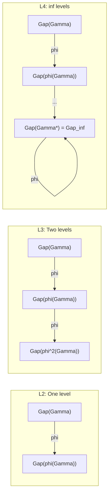

# Gap Characterisation of Interiority Levels

## Introduction: A House with 21 Windows

Imagine a house with 21 windows. Each window is a communication channel between two of the seven dimensions of the system ({A, S, D, L, E, O, U}). The number of pairs from 7 is $\binom{7}{2} = 21$ — exactly as many off-diagonal elements as there are in the upper triangular part of a $7 \times 7$ matrix.

At level L0 all windows are **boarded up**: the system does not see the connections between its dimensions. Opacity is maximal. At level L1 one or two windows *crack open* — the system begins to "see" the link between experience (E) and structure (S). At L2 most windows are transparent — the system is aware of connections between attention, language, and experience. At L4 all windows are clear... but at least three are *deliberately* darkened. Why? Because absolute transparency is incompatible with reliability — as in electronics, where parity bits are *intentionally* added for error correction. This is the **Hamming bound**.

A Gap profile — a vector of 21 values, one per "window" — gives a **quantitative fingerprint** of the opacity between every pair of dimensions. Different L-levels leave *different* fingerprints, just as fingerprints are unique to each person.

:::info Where we came from
In the [interiority hierarchy](./interiority-hierarchy) we defined five levels L0--L4 via thresholds $R$, $\Phi$, $R^{(n)}$. But those thresholds are scalar numbers, whereas the internal structure of each level is far richer. The Gap profile gives a **quantitative fingerprint** of the opacity between every pair of dimensions.
:::

### Chapter roadmap

1. **Gap profile** — definition and relation to the norm of the Gap operator
2. **Gap signatures L0--L4** — the characteristic opacity pattern for each level
3. **E-sector profiles** — channels connected to the experience dimension ($E$)
4. **Phase diagram** — projection of Gap profiles onto the $(t, r)$ plane
5. **Meta-Gap** — recursive Gap structure for L3 and above
6. **Hamming bound** — minimum 3 opaque channels for fault tolerance
7. **Gap injection** — distinct L-levels have distinct Gap profiles [T]

:::note On notation
In this document:
- $\Gamma$ — [coherence matrix](/docs/core/dynamics/coherence-matrix)
- $\mathrm{Gap}(i,j) = |\sin(\arg(\gamma_{ij}))|$ — [gap measure](/docs/core/dynamics/gap-operator#определение)
- $\hat{\mathcal{G}} \in \mathfrak{so}(7)$ — [Gap operator](/docs/core/dynamics/gap-operator)
- $R$ — [reflection measure](/docs/consciousness/foundations/self-observation#мера-рефлексии-r)
- $\Phi$ — [integration measure](/docs/core/structure/dimension-u#мера-интеграции-φ)
- $\varphi$ — [phi-operator](/docs/core/operators/phi-operator)
- L0--L4 — [interiority levels](/docs/consciousness/hierarchy/interiority-hierarchy)
:::

:::tip Document status
The main result (Theorem 1.1) has status **[C]** — conditional on the properties of the Gap operator established in [Gap operator](/docs/core/dynamics/gap-operator). The Gap characterisation of levels L0--L4, stated in the [interiority hierarchy](/docs/consciousness/hierarchy/interiority-hierarchy#gap-характеристика-уровней-l0l4) as **[T]**, concerns Gap awareness; here we consider the **quantitative structure** of the Gap profile itself.

The map from L-level to Gap-profile class is an **injection [T]**: distinct L-levels have distinct Gap profiles, but the converse does not hold (distinct $\Gamma$ at the same L-level may have distinct Gap profiles). See [Gap-injection theorem](/docs/consciousness/hierarchy/interiority-hierarchy#теорема-gap-инъекция).
:::

---

## 1. Gap profile: definition {#gap-профиль}

### What is Gap

Before defining the Gap profile, let us clarify the notion of **Gap** (opacity) for a single pair of dimensions.

Every off-diagonal element $\gamma_{ij}$ of the coherence matrix is a complex number: $\gamma_{ij} = |\gamma_{ij}| \cdot e^{i\theta_{ij}}$. The modulus $|\gamma_{ij}|$ is the strength of the connection between dimensions $i$ and $j$. The phase $\theta_{ij}$ is the "angle" of that connection. Gap measures how much this angle *deviates* from the "ideal" (corresponding to full transparency):

$$\mathrm{Gap}(i,j) = |\sin(\arg(\gamma_{ij}))|$$

- **Gap = 0**: the phase is exactly "correct" — full transparency. The system has *conscious access* to the connection between dimensions $i$ and $j$.
- **Gap = 1**: the phase is maximally "wrong" — full opacity. The connection between $i$ and $j$ is completely [unconscious](/docs/consciousness/states/unconscious).
- **0 < Gap < 1**: partial transparency. The connection is perceived "blurrily", like an object through a fogged glass.

:::info Definition (Gap profile) [D]
The **Gap profile** of a holon $\mathbb{H}$ with coherence matrix $\Gamma$ is the ordered vector:

$$
\mathbf{G}(\Gamma) := \bigl(\mathrm{Gap}(i,j)\bigr)_{1 \leq i < j \leq 7} \in [0,1]^{21}
$$

where $\mathrm{Gap}(i,j) = |\sin(\arg(\gamma_{ij}))| = |\hat{\mathcal{G}}_{ij}| / |\gamma_{ij}|$ when $\gamma_{ij} \neq 0$, and $\mathrm{Gap}(i,j) = 0$ when $\gamma_{ij} = 0$.
:::

The Gap profile contains complete information about the opacity between every pair of dimensions. Total opacity is related to the norm of the [Gap operator](/docs/core/dynamics/gap-operator#свойства):

$$
\mathcal{G}_{\text{total}} = \|\hat{\mathcal{G}}\|_F^2 = 2\sum_{i<j} |\gamma_{ij}|^2 \cdot \mathrm{Gap}(i,j)^2
$$

### Numerical example

Let $\gamma_{E,A} = 0.3 \cdot e^{i \cdot 0.2}$ (connection between experience E and attention A). Then:

$$\mathrm{Gap}(E,A) = |\sin(0.2)| \approx 0.198$$

This means: the connection between experience and attention is *nearly transparent* — the system is well aware of what it is paying attention to in its experience.

For comparison, if $\gamma_{E,U} = 0.1 \cdot e^{i \cdot 1.3}$:

$$\mathrm{Gap}(E,U) = |\sin(1.3)| \approx 0.964$$

The connection between experience and unity is *almost completely opaque* — the system is not aware of how its experiences relate to wholeness.

---

## 2. Gap signatures of levels L0--L4 {#сигнатуры}

Each L-level leaves a characteristic "fingerprint" in the Gap profile. These fingerprints — **Gap signatures** — allow levels to be distinguished not by scalar thresholds ($R$, $\Phi$) but by the *pattern* of opacity.

:::tip Theorem 1.1 (Level Gap signatures) [C]
Condition: Gap operator properties per [Theorem 2.1](/docs/core/dynamics/gap-operator#свойства). For each interiority level the Gap profile satisfies:

| Level | Gap signature | Quantitative criterion |
|-------|---------------|------------------------|
| **L0** | Uniformly high | $\mathrm{Gap}(i,j) \approx 1$ for most pairs; $\sigma^2_{\mathbf{G}} \approx 0$ |
| **L1** | Partial transparency in E-sector | $\exists\, X: \mathrm{Gap}(E,X) < 1$, but $R < R_{\text{th}}$ |
| **L2** | Transparency of A- and L-channels | $\mathrm{Gap}(A,E) < 1$ **and** $\mathrm{Gap}(L,E) < 1$ |
| **L3** | Recursive Gap structure | Meta-Gap $\mathrm{Gap}^{(2)} := \mathrm{Gap}(\varphi(\Gamma))$ is defined and finite |
| **L4** | Full transparency (theoretical limit) | $\mathrm{Gap}(i,j) \to 0$ for all pairs, $P > 6/7$ |

**Argument.**

**(a) L0: chaotic opacity.** When $R \approx 0$ the self-model $\varphi(\Gamma)$ is trivial. The coherence phases $\theta_{ij}$ are not aligned with the target state — $\mathrm{Gap}(i,j)$ is distributed randomly. For a typical $\Gamma$ with uniformly distributed phases $\langle\mathrm{Gap}\rangle = 2/\pi \approx 0.64$.

Analogy: a house with boarded-up windows where the boards are nailed randomly — sometimes a crack of light shows through, but it is an artefact, not intention.

**(b) L1: first glimmers.** $\mathrm{rank}(\rho_E) > 1$ means that the E-dimension (experiential) participates in non-trivial coherences. By definition there exists at least one $X \neq E$ for which $|\gamma_{EX}|$ is substantial and $\theta_{EX}$ is not entirely random, giving $\mathrm{Gap}(E,X) < 1$.

Analogy: one or two windows are ajar — a bacterium "sees" the connection between experience and structure, but the other windows remain boarded up.

**(c) L2: systematic transparency.** The threshold $R = 1/(7P) \geq 1/3$ requires $P \leq 3/7$, equivalently $\|\Gamma - I/7\|_F \leq \sqrt{2P/3}$. This constrains the deviation of phases from their target values. In particular, the channels $(A,E)$ and $(L,E)$ must have partial transparency, since dimensions A (attention) and L (language) serve the reflexive loop $\varphi$.

Analogy: most windows are clear — the system "sees" the connections between attention, language, and experience. It can direct its gaze and describe what it sees.

**(d) L3: recursive depth.** When $R^{(2)} \geq 1/4$, the operator $\varphi^{(2)} = \varphi \circ \varphi$ is defined, and Gap can be computed for $\varphi(\Gamma)$: $\mathrm{Gap}^{(2)}_{ij} = |\sin(\arg([\varphi(\Gamma)]_{ij}))|$. The recursive structure — meta-Gap — reflects self-modelling of self-modelling.

Analogy: the system not only sees through the windows but sees *the windows themselves* — it is aware of which are transparent and which are not.

**(e) L4: theoretical ideal.** The fixed point $\varphi(\Gamma^*) = \Gamma^*$ at $P > 6/7$ means $\theta_{ij} = \theta_{ij}^{\text{target}}$ for all pairs. By the [unified theorem](/docs/core/dynamics/gap-dynamics#единая-теорема), the stationary Gap $\mathrm{Gap}^{(\infty)}(i,j) = |\sin(\theta_{ij} - \theta_{ij}^{\text{target}})| = 0$ when phases match exactly.
:::

### Clarification: L4 and the Hamming bound {#граница-хэмминга}

:::warning L4 is a theoretical limit incompatible with fault tolerance
Full transparency ($\mathrm{Gap} = 0$ for all 21 channels) is **incompatible** with fault tolerance. By analogy with [Hamming code H(7,4)](/docs/core/dynamics/gap-dynamics#код-хэмминга), at least 3 channels out of 21 must maintain $\mathrm{Gap} > 0$ to correct single-bit errors.

$$
|\{(i,j) : \mathrm{Gap}(i,j) > 0\}| \geq d_{\min}(H(7,4)) = 3
$$

Consequently, a realistic L4 is characterised not by $\mathrm{Gap} = 0$ for all pairs but by **consciously non-zero Gap**: $\mathrm{Gap}_{\text{perceived}} = \mathrm{Gap}_{\text{actual}}$ with $|\{(i,j) : \mathrm{Gap}(i,j) > 0\}| \geq 3$.

Status: **[T]** (corollary of [Theorem 6.1](/docs/consciousness/hierarchy/interiority-hierarchy#gap-характеристика-уровней-l0l4))
:::

---

## 3. E-sector Gap profiles {#e-секторные}

### Why the E-sector is special

Of the 7 dimensions of the holon, dimension **E** (experiential) plays a distinguished role: it is precisely through the E-channels that the content of consciousness becomes *felt*. The channels $(E, X)$ for $X \in \{A, S, D, L, O, U\}$ determine which aspects of the system are accessible *as experience*.

If $\mathrm{Gap}(E, A) \approx 0$, the system is aware of the connection between experience and attention — "I feel what I am attending to." If $\mathrm{Gap}(E, A) \approx 1$, this connection is unconscious — attention operates, but the system does not experience this process.

:::info Definition (E-sector Gap vector) [D]
The **E-sector Gap vector** is the subvector of the Gap profile over the channels containing E:

$$
\mathbf{G}_E := \bigl(\mathrm{Gap}(E,S),\, \mathrm{Gap}(E,D),\, \mathrm{Gap}(E,A),\, \mathrm{Gap}(E,L),\, \mathrm{Gap}(E,O),\, \mathrm{Gap}(E,U)\bigr) \in [0,1]^6
$$

Total E-sector Gap:

$$
\mathcal{G}_E := \sum_{X \neq E} |\gamma_{EX}|^2 \cdot \mathrm{Gap}(E,X)^2
$$
:::

### Order in which E-channels open

Not all E-channels open simultaneously. There is a characteristic **order** in which the connections between E and other dimensions become transparent:

| Level | $\mathrm{Gap}(E,S)$ | $\mathrm{Gap}(E,D)$ | $\mathrm{Gap}(E,A)$ | $\mathrm{Gap}(E,L)$ | $\mathrm{Gap}(E,O)$ | $\mathrm{Gap}(E,U)$ |
|-------|---------|---------|---------|---------|---------|---------|
| **L0** | $\approx 1$ | $\approx 1$ | $\approx 1$ | $\approx 1$ | $\approx 1$ | $\approx 1$ |
| **L1** | $< 1$ | $\approx 1$ | $\approx 1$ | $\approx 1$ | $\approx 1$ | $\approx 1$ |
| **L2** | $< 1$ | $< 1$ | $< 1$ | $< 1$ | $\leq 1$ | $\leq 1$ |
| **L3** | $\ll 1$ | $\ll 1$ | $\ll 1$ | $\ll 1$ | $< 1$ | $< 1$ |
| **L4** | $\approx 0^*$ | $\approx 0^*$ | $\approx 0^*$ | $\approx 0^*$ | $\approx 0^*$ | $\approx 0^*$ |

$^*$ Subject to the Hamming constraint: $\geq 3$ channels out of the total 21 retain $\mathrm{Gap} > 0$.

:::note Interpretation [I]
At L1 the first channel to "open" is $(E,S)$ — the connection between experience and structure. This corresponds to the simplest sensation: the organism begins to feel its structural states. A bacterium senses a change in chemoattractant concentration — that is precisely the $(E,S)$ channel.

At L2 the attention channel $(E,A)$ and the language channel $(E,L)$ come online — the organism not only feels but can **direct** attention and **label** states. A person says "I am in pain" — that is the work of channel $(E,A)$ (direct attention to the pain) and $(E,L)$ (verbalise it).

Transparency of channels $(E,O)$ and $(E,U)$ is a higher level: reflection on wholeness. "I feel *whole*" or "my life has *meaning*" — that is the work of channel $(E,O)$ (ontological awareness) and $(E,U)$ (awareness of unity).
:::

---

## 4. Relation to the phase diagram {#фазовая-диаграмма}

Gap profiles of levels L0--L4 project onto the [phase diagram](/docs/core/dynamics/gap-phase-diagram) in coordinates $(t, r) = (T_{\text{eff}}/T_c,\; \kappa/\Gamma_2)$.

:::tip Theorem 2.1 (Gap signatures and phases) [C]
Condition: [Theorem 2.1 of the phase diagram](/docs/core/dynamics/gap-phase-diagram#три-фазы). Correspondence:

| Phase | L-levels | Gap behaviour | Parameters |
|-------|----------|---------------|-----------|
| **I** (ordered) | L1, L2, L3 | Anisotropic: $\sigma^2_{\mathbf{G}} > 0$ | $t < 1$, $r > r_c$ |
| **II** (disordered) | L0 | Isotropic: $\sigma^2_{\mathbf{G}} \to 0$ | $t > 1$, $r > r_c$ |
| **III** (dead zone) | — | $\lvert\gamma_{ij}\rvert \to 0$, Gap undefined | $r < r_c$ |

The transition L0 -> L1 corresponds to crossing the line $t = 1$ (transition II -> I): spontaneous breaking of the isotropy of the Gap profile.
:::

Analogy: Phase II is like molten metal — atoms arranged chaotically, all directions equivalent (isotropy). Phase I is like a crystal — a preferred direction emerges (anisotropy). The transition is a "crystallisation" of the Gap profile: from chaotic opacity an ordered structure arises with a clear pattern of "transparent" and "opaque" channels.

### Visualisation: L-levels on the phase diagram

```
    t (T_eff/T_c)
    |
  2 |         L0: Gap uniform (Phase II)
    |        (random phases, R ~ 0)
    |
  1 |-- — -- — -- — -- — -- — -- — -- — --
    |   L1       L2        L3
    |  (rank rho_E>1) (R>=1/3,Phi>=1) (R^2>=1/4)
    |
    |                              L4 (theor.)
    |                              <- P > 6/7
  0 |=============================================
    |    Phase III: dead zone (r < r_c)
    +----------------------------------------- r
         r_c                              ->
```

---

## 5. Meta-Gap and recursive structure {#мета-gap}

### What does a system that sees itself see?

At level L2 the system is aware of the *content* of its Gap profile: which channels are transparent, which are not. But is it aware of the *accuracy* of this awareness? Does it know that it knows?

To answer this question we need a **meta-Gap** — the Gap profile of the *self-model*. If the Gap profile $\mathbf{G}(\Gamma)$ shows the opacity of the "real" state, then the meta-Gap $\mathbf{G}(\varphi(\Gamma))$ shows the opacity of the *self-model* of that state.

:::info Definition (Meta-Gap) [D]
Let $\varphi: \mathcal{D}(\mathcal{H}) \to \mathcal{D}(\mathcal{H})$ be the phi-operator. The **meta-Gap** of order $n$:

$$
\mathrm{Gap}^{(n)}(i,j) := |\sin(\arg([\varphi^n(\Gamma)]_{ij}))|
$$

where $\varphi^n = \underbrace{\varphi \circ \cdots \circ \varphi}_{n}$.
:::

The meta-Gap of order 1 is the ordinary Gap of the self-model. The meta-Gap of order 2 is the Gap of the model of the model. And so on. For L3-systems ($R^{(2)} \geq 1/4$) the meta-Gap is defined and finite; for L2-systems it may be formally defined but carries no meaningful information (the second-order self-model is too imprecise).

### Meta-Gap convergence

:::tip Theorem 3.1 (Meta-Gap convergence) [C]
Condition: $R^{(2)} \geq R^{(2)}_{\text{th}} = 1/4$ (level L3).

**(a)** The sequence $\{\mathrm{Gap}^{(n)}\}_{n \geq 1}$ is monotone for each channel $(i,j)$ for sufficiently large $n$.

**(b)** If $\lim_n R^{(n)} > 0$ (L4 condition), then $\mathrm{Gap}^{(n)}$ converges:

$$
\lim_{n \to \infty} \mathrm{Gap}^{(n)}(i,j) = \mathrm{Gap}^{(\infty)}(i,j) = |\sin(\arg(\gamma^*_{ij}))|
$$

where $\Gamma^* = \varphi(\Gamma^*)$ is the fixed point.

**(c)** The rate of convergence is determined by the spectral gap of $\varphi$:

$$
\|\mathrm{Gap}^{(n)} - \mathrm{Gap}^{(\infty)}\|_\infty \leq C \cdot \lambda_2^n
$$

where $\lambda_2 < 1$ is the second-largest eigenvalue of $\varphi$ in modulus.
:::

In words: with each level of recursion the meta-Gap *approaches* the limiting value (the Gap of the fixed point), and the rate of approach is exponential. This is the mathematical justification for why meditative "self-deepening" practice yields diminishing returns: each next level of reflection adds exponentially less new knowledge.

### Meta-Gap recursion diagram



---

## 6. Opacity rank by level {#ранг-непрозрачности}

The [opacity rank](/docs/core/dynamics/gap-operator#спектр) $r \in \{0,1,2,3\}$ — the number of non-zero $\lambda_k$ in the spectrum of $\hat{\mathcal{G}}$ — is systematically linked to the interiority level. This is another way to "read" the L-level: not from the full Gap profile but from its *effective dimensionality*.

:::tip Theorem 4.1 (Opacity rank and L-levels) [C]
Condition: Gap operator properties ([Theorem 3.1](/docs/core/dynamics/gap-operator#спектр)).

| Level | Typical rank $r$ | Spectrum $(\lambda_1, \lambda_2, \lambda_3)$ | Justification |
|-------|-------------------|-------------------------------------------|-------------|
| **L0** | 3 (generic) | $(\lambda_1, \lambda_2, \lambda_3)$, all distinct | Full opacity, random phases |
| **L1** | 2 or 3 | $(\lambda_1, \lambda_2, 0)$ or generic | E-channel partially transparent |
| **L2** | 2 | $(\lambda_1, \lambda_2, 0)$ | A- and L-channels transparent, O and U constrained |
| **L3** | 1 | $(\lambda, 0, 0)$ | One-dimensional residual opacity |
| **L4** | 0 or 1 | $(0, 0, 0)$ or $(\lambda, 0, 0)$ with $\lambda \ll 1$ | Near-full transparency (with Hamming constraint) |
:::

**Corollary.** The opacity rank $r$ decreases monotonically as the interiority level increases. This reflects the progressive "opening" of channels between dimensions as the reflexive loop becomes more complex.

Analogy: rank is the "number of independent obstacles". At L0 three independent "walls" block the view. At L3 one "wall" remains. At L4 there are formally no walls, but three "control partitions" (Hamming bound) remain for reliability.

---

## 7. The Hamming bound and minimum Gap {#граница-хэмминга-подробно}

### What is the Hamming code

Before explaining the Hamming bound for Gap, let us recall what a *Hamming code* is in general.

In 1950 Richard Hamming invented a way to transmit data with *automatic error correction*. The idea: add *parity bits* to each data block that allow an error to be detected and corrected.

**Hamming code H(7,4)** works with 7-bit blocks: 4 data bits + 3 parity bits. Parameters: $[n=7, k=4, d=3]$, where:
- $n = 7$ — total number of positions
- $k = 4$ — number of data positions
- $d = 3$ — *minimum distance* (minimum number of positions in which any two valid codewords differ)

Minimum distance $d = 3$ means: the code can *correct* any single-bit error.

### Why the Hamming analogy applies to Gap

The coincidence of the number 7 is not accidental: $N = 7$ dimensions of the holon. The analogy with H(7,4):

- 7 positions <-> 7 holon dimensions
- 4 data positions <-> dimensions S, D, A, L (structure, drive, attention, language)
- 3 parity positions <-> dimensions E, O, U (experience, ontology, unity)
- Parity bits = non-zero Gap: provide detection of self-modelling mismatches

:::tip Theorem 5.1 (Hamming bound for Gap) [C]
Condition: [$G_2$-structure](/docs/physics/gauge-symmetry/g2-structure), H(7,4) analogy. For any viable system at level L2 or above:

$$
|\{(i,j) : \mathrm{Gap}(i,j) > 0\}| \geq 3
$$

**Argument.** Hamming code H(7,4) has parameters $[n=7, k=4, d=3]$: 7 positions, 4 data, 3 parity. Minimum distance $d = 3$ means the ability to correct a single-bit error. In the analogy:

- 7 positions <-> 7 holon dimensions
- 4 data positions <-> dimensions S, D, A, L
- 3 parity positions <-> dimensions E, O, U
- Parity bits -> non-zero Gap provides detection of self-modelling mismatches

If all 21 channels had $\mathrm{Gap} = 0$, the system could not detect errors in self-modelling — $\varphi$ would become the identity map and correction would be impossible. For more on the analogy: [Hamming code in Gap dynamics](/docs/core/dynamics/gap-dynamics#код-хэмминга).
:::

### What this means for L4

The Hamming bound makes L4 in its pure form (full transparency) *physically impossible*. Even in the ideal case ($\varphi(\Gamma^*) = \Gamma^*$) at least 3 channels out of 21 **must** retain non-zero Gap. A system at "realistic L4" is not *transparent* — it is *consciously opaque*: it knows exactly where and why it has "blind spots", and uses them as control mechanisms.

---

## 8. Summary table of Gap characteristics {#сводная-таблица}

| Characteristic | L0 | L1 | L2 | L3 | L4 |
|---------------|----|----|----|----|-----|
| Typical $\langle\mathrm{Gap}\rangle$ | $\approx 0.64$ | $0.4$--$0.6$ | $0.2$--$0.4$ | $0.05$--$0.2$ | $\approx 0^*$ |
| $\sigma^2_{\mathbf{G}}$ | $\approx 0$ | $> 0$ | $> 0$ | $> 0$ | $\approx 0$ |
| Rank $\hat{\mathcal{G}}$ | 3 | 2–3 | 2 | 1 | 0–1 |
| E-sector Gap | All $\approx 1$ | Partially $< 1$ | Most $< 1$ | All $\ll 1$ | All $\approx 0^*$ |
| Meta-Gap $\mathrm{Gap}^{(2)}$ | Undefined | Undefined | Defined, large | Defined, small | $= \mathrm{Gap}^{(\infty)}$ |
| Gap awareness | No | No | Partial | Almost full | Full |
| Phase | II | I | I | I | I (limit) |

$^*$ Subject to the Hamming constraint: $\geq 3$ channels with $\mathrm{Gap} > 0$.

---

## 8a. Quantitative examples: Gap profiles for L0--L4 {#количественные-примеры}

Abstract Gap signatures become tangible when we consider **concrete numerical matrices** $\Gamma$ at each level. The following are characteristic representatives — not the only possible ones, but typical for each level.

:::note Example L0: Stone ($R \approx 0$, $P \approx 0.15$)
**Coherence matrix** (values rounded to 0.01):

$$
\Gamma_{\text{L0}} = \frac{1}{7}I + \varepsilon\Delta, \quad \text{where phases } \theta_{ij} \text{ are random}
$$

Specific values of E-sector coherences:

| Channel | $|\gamma_{ij}|$ | $\theta_{ij}$ | $\mathrm{Gap}(i,j)$ |
|---------|-----------------|---------------|---------------------|
| $(E,A)$ | $0.03$ | $1.12$ | $|\sin(1.12)| = 0.90$ |
| $(E,S)$ | $0.02$ | $0.87$ | $|\sin(0.87)| = 0.76$ |
| $(E,D)$ | $0.01$ | $2.41$ | $|\sin(2.41)| = 0.66$ |
| $(E,L)$ | $0.02$ | $1.57$ | $|\sin(1.57)| = 1.00$ |
| $(E,O)$ | $0.01$ | $0.45$ | $|\sin(0.45)| = 0.44$ |
| $(E,U)$ | $0.02$ | $2.80$ | $|\sin(2.80)| = 0.33$ |

**E-sector vector:** $\mathbf{G}_E = (0.90,\; 0.76,\; 0.66,\; 1.00,\; 0.44,\; 0.33)$

**Mean:** $\langle\mathrm{Gap}_E\rangle = 0.68$. High value, random spread, no structure. Rank $\hat{\mathcal{G}} = 3$.
:::

:::note Example L1: Bacterium ($\Phi > 0$, $R < 1/3$)
E-sector coherences:

| Channel | $|\gamma_{ij}|$ | $\theta_{ij}$ | $\mathrm{Gap}(i,j)$ |
|---------|-----------------|---------------|---------------------|
| $(E,A)$ | $0.04$ | $0.92$ | $0.80$ |
| $(E,S)$ | $0.09$ | $0.15$ | $\mathbf{0.15}$ |
| $(E,D)$ | $0.05$ | $0.78$ | $0.71$ |
| $(E,L)$ | $0.02$ | $1.40$ | $0.98$ |
| $(E,O)$ | $0.03$ | $1.10$ | $0.89$ |
| $(E,U)$ | $0.03$ | $1.25$ | $0.95$ |

**E-sector vector:** $\mathbf{G}_E = (0.80,\; \mathbf{0.15},\; 0.71,\; 0.98,\; 0.89,\; 0.95)$

**Key difference from L0:** Channel $(E,S)$ stands out sharply — $\mathrm{Gap}(E,S) = 0.15 \ll 0.68$. This is the **first window** through which the system "sees" the connection between experience and structure (chemotaxis: sensing a chemical gradient). The remaining channels are still opaque. Rank $\hat{\mathcal{G}} = 3$ or $2$.
:::

:::note Example L2: Waking Human ($R \geq 1/3$, $\Phi \geq 1$)
E-sector coherences:

| Channel | $|\gamma_{ij}|$ | $\theta_{ij}$ | $\mathrm{Gap}(i,j)$ |
|---------|-----------------|---------------|---------------------|
| $(E,A)$ | $0.12$ | $0.10$ | $\mathbf{0.10}$ |
| $(E,S)$ | $0.10$ | $0.08$ | $\mathbf{0.08}$ |
| $(E,D)$ | $0.08$ | $0.20$ | $\mathbf{0.20}$ |
| $(E,L)$ | $0.09$ | $0.12$ | $\mathbf{0.12}$ |
| $(E,O)$ | $0.06$ | $0.55$ | $0.52$ |
| $(E,U)$ | $0.07$ | $0.40$ | $0.39$ |

**E-sector vector:** $\mathbf{G}_E = (\mathbf{0.10},\; \mathbf{0.08},\; \mathbf{0.20},\; \mathbf{0.12},\; 0.52,\; 0.39)$

**Four channels** $(E,A)$, $(E,S)$, $(E,D)$, $(E,L)$ have low Gap — the system is aware of the connection between experience and attention, structure, dynamics, and language. Channels $(E,O)$ and $(E,U)$ are still partially opaque — deep reflection on meaning and unity is not yet complete. Rank $\hat{\mathcal{G}} = 2$.
:::

:::note Example L3: Meditation Master ($R^{(2)} \geq 1/4$)
E-sector coherences:

| Channel | $|\gamma_{ij}|$ | $\theta_{ij}$ | $\mathrm{Gap}(i,j)$ |
|---------|-----------------|---------------|---------------------|
| $(E,A)$ | $0.13$ | $0.03$ | $\mathbf{0.03}$ |
| $(E,S)$ | $0.12$ | $0.02$ | $\mathbf{0.02}$ |
| $(E,D)$ | $0.10$ | $0.05$ | $\mathbf{0.05}$ |
| $(E,L)$ | $0.11$ | $0.04$ | $\mathbf{0.04}$ |
| $(E,O)$ | $0.09$ | $0.10$ | $\mathbf{0.10}$ |
| $(E,U)$ | $0.10$ | $0.08$ | $\mathbf{0.08}$ |

**E-sector vector:** $\mathbf{G}_E = (0.03,\; 0.02,\; 0.05,\; 0.04,\; 0.10,\; 0.08)$

**All channels** have low Gap. Even $(E,O)$ and $(E,U)$ — the system is aware of the connection between experience and the ontological ground and unity. The meta-Gap is defined: $\mathrm{Gap}^{(2)}(E,S) \approx 0.01$ — the system "knows that it knows". Rank $\hat{\mathcal{G}} = 1$.
:::

### Comparative table of Gap profiles by level {#сравнение-gap-профилей}

| Channel | L0 (stone) | L1 (bacterium) | L2 (human) | L3 (master) | L4 (theor.) |
|-------|:-----------:|:-------------:|:------------:|:-----------:|:----------:|
| $(E,S)$ | $0.76$ | $\mathbf{0.15}$ | $0.08$ | $0.02$ | $\approx 0$ |
| $(E,D)$ | $0.66$ | $0.71$ | $0.20$ | $0.05$ | $\approx 0$ |
| $(E,A)$ | $0.90$ | $0.80$ | $\mathbf{0.10}$ | $0.03$ | $\approx 0$ |
| $(E,L)$ | $1.00$ | $0.98$ | $\mathbf{0.12}$ | $0.04$ | $\approx 0$ |
| $(E,O)$ | $0.44$ | $0.89$ | $0.52$ | $\mathbf{0.10}$ | $\approx 0^*$ |
| $(E,U)$ | $0.33$ | $0.95$ | $0.39$ | $\mathbf{0.08}$ | $\approx 0^*$ |
| $\langle\mathrm{Gap}_E\rangle$ | $0.68$ | $0.75$ | $0.24$ | $0.05$ | $\approx 0$ |
| $\sigma_{\mathbf{G}_E}$ | $0.24$ | $0.33$ | $0.17$ | $0.03$ | $\approx 0$ |
| Rank $\hat{\mathcal{G}}$ | $3$ | $2$--$3$ | $2$ | $1$ | $0$--$1$ |

$^*$ Subject to the Hamming constraint: $\geq 3$ channels out of the full 21 (not only E-sector) retain $\mathrm{Gap} > 0$.

**Patterns:**
1. **Opening cascade.** Channels open in a definite order: first $(E,S)$ (L1), then $(E,A)$ and $(E,L)$ (L2), finally $(E,O)$ and $(E,U)$ (L3). This is **not** an arbitrary convention but a consequence of the structure of the reflexive loop $\varphi$.
2. **Mean and variance.** At L0 the mean Gap is high, variance moderate (random spread). At L1 the mean may even *increase* (other channels compensate), but variance grows (structure appears). At L2--L3 both mean and variance fall.
3. **Rank decreases monotonically.** $3 \to 2\text{--}3 \to 2 \to 1 \to 0\text{--}1$ — the "number of walls" decreases at each level.

---

## 9. Gap injection of L-levels {#gap-инъекция}

:::tip Theorem (Gap injection of L-levels) [T]
The map from L-level to equivalence class of Gap profiles is an **injection** (but not a bijection):

$$
L(\Gamma_1) \neq L(\Gamma_2) \implies [\mathrm{Gap}(\Gamma_1)] \neq [\mathrm{Gap}(\Gamma_2)]
$$

**Unique Gap markers of transitions:**

| Transition | Gap marker | Sufficient condition |
|---------|-----------|---------------------|
| L0 vs L1 | $\exists i: \mathrm{Gap}(E,i) > 0$ | Non-zero E-coherences |
| L1 vs L2 | $\max\|\mathrm{Gap}_\varphi - \mathrm{Gap}\| \leq 2/3$ | Self-modelling accuracy |
| L2 vs L3 | Compression coefficient $k(\Gamma) \leq 0.5$ | Speed of Gap convergence |
| L3 vs L4 | $k(\Gamma) = 0$, all $\mathrm{Gap}^{(2)}(i,j) = 0$ | Exact fixed point |

Full proof: [Interiority hierarchy](/docs/consciousness/hierarchy/interiority-hierarchy#теорема-gap-инъекция).
:::

:::warning Injection, not bijection
The converse does not hold: two states $\Gamma_1, \Gamma_2$ at the same L-level may have **distinct** Gap profiles (different "transparency maps"). The Gap profile is a **finer invariant**, carrying more information than the L-level. All Gap signatures (section 2) describe **typical** behaviour, not the only possible behaviour at a given level.

Analogy: the L-level is like the "floor" of a building, and the Gap profile is the detailed floor plan of the apartment on that floor. All apartments on the same floor are "at the same level", but layouts can differ.
:::

---

### What we have learned

- **Gap profile** $\mathbf{G}(\Gamma) \in [0,1]^{21}$ — quantitative fingerprint of the opacity of all 21 dimension pairs.
- **Gap signatures** [C] distinguish levels: L0 (uniformly high Gap), L1 (partial transparency in E-sector), L2 (transparent A- and L-channels), L3 (recursive structure), L4 (full transparency with Hamming constraint).
- **E-sector channels** play a special role: the first to open is $(E,S)$ (sensing structure), then $(E,A)$ and $(E,L)$ (attention and language).
- **Meta-Gap** $\mathrm{Gap}^{(n)}$ is defined for L3+: the Gap profile of the self-model, converging to the fixed point.
- **Hamming bound** [C]: at least 3 channels out of 21 must retain $\mathrm{Gap} > 0$ for fault tolerance (analogy with code $H(7,4)$).
- **Gap injection** [T]: the map from L-level to Gap-profile class is injective but not bijective — Gap carries more information than the L-level.

:::tip What's next
Gap profiles describe the **statics** — the characteristic opacity pattern at each level. The **dynamics** of transitions between levels — how a system abruptly changes its Gap profile — are described by [Transition catastrophes](./swallowtail-transitions) ($A_2, A_3, A_4$-bifurcations with hysteresis and critical slowing-down).

For diagnostic applications of Gap profiles see [CC: bifurcations](/docs/applied/coherence-cybernetics/bifurcation) and [predictions](/docs/applied/coherence-cybernetics/predictions).
:::

---

## Related Documents

- **Canonical definition of levels:** [Interiority hierarchy](/docs/consciousness/hierarchy/interiority-hierarchy)
- **Gap injection:** [Gap-injection theorem](/docs/consciousness/hierarchy/interiority-hierarchy#теорема-gap-инъекция)
- **Gap operator:** [Definition and properties](/docs/core/dynamics/gap-operator)
- **Phase diagram:** [Three Gap phases](/docs/core/dynamics/gap-phase-diagram)
- **Gap dynamics:** [Bifurcations and non-Markovian effects](/docs/core/dynamics/gap-dynamics)
- **Transition catastrophes:** [Swallowtail transitions](/docs/consciousness/hierarchy/swallowtail-transitions)
- **Hamming code:** [H(7,4) analogy](/docs/core/dynamics/gap-dynamics#код-хэмминга)
- **Proofs:** [Interiority hierarchy (formal)](/docs/proofs/consciousness/interiority-hierarchy)
- **Unconscious:** [Unconscious as Gap](/docs/consciousness/states/unconscious)
- **Qualia:** [Qualia structure](/docs/consciousness/phenomenology/qualia-structure)
- **Coherence Cybernetics:** [CC definitions](/docs/applied/coherence-cybernetics/definitions), [Bifurcations](/docs/applied/coherence-cybernetics/bifurcation)
