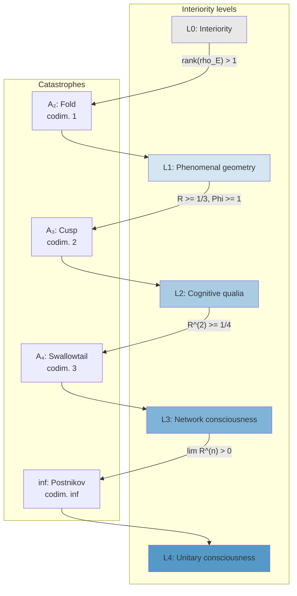

# Transition Catastrophes between Levels

## Introduction: why consciousness "switches on" abruptly

Heat a block of ice. Nothing happens up to 0°C — ice remains ice. But at 0°C — *a jump*: a solid turns into a liquid. Not "gradually softening", but a *jump* into a qualitatively different state. Continue heating — at 100°C another jump: the liquid becomes steam.

Physicists call such jumps **phase transitions**. Mathematicians call them **bifurcations** or **catastrophes** (in the technical sense, not the everyday one). In 1972 the French mathematician René Thom showed that all "simple" qualitative reorganisations of systems can be classified: there is a finite number of *types* of catastrophes, and each type is fully determined by the number of control parameters. This classification was extended and refined by Vladimir Arnold (the A-series of catastrophes: $A_2$, $A_3$, $A_4$, ...).

Transitions between levels of consciousness (L0 -> L1 -> L2 -> L3 -> L4) are *precisely* such catastrophes. Consciousness does not "gradually increase" — it *jumps* between qualitatively different states. Moreover, these transitions exhibit **hysteresis**: the "switch-on" threshold (insight) is *higher* than the "switch-off" threshold (regression). Just as superheated water remains liquid above 100°C, and supercooled water remains liquid below 0°C.

:::info Where we came from
In the [interiority hierarchy](./interiority-hierarchy) we defined five levels L0--L4, and in [Gap characterisation](./gap-characterization) we described their quantitative signatures. Now we ask: **how** do transitions between levels occur? It turns out they are not gradual changes but **qualitative reorganisations** — catastrophes in the sense of Whitney–Thom–Arnold theory.
:::

### Chapter roadmap

1. **Effective potential** — Gap dynamics is described by a degree-6 potential with three control parameters
2. **Cascade of transitions** — L0->L1 (fold $A_2$), L1->L2 (cusp $A_3$), L2->L3 (swallowtail $A_4$), L3->L4 (Postnikov)
3. **Hysteresis** — "upward" and "downward" transitions occur at different parameter values
4. **Critical slowing-down** — precursors of a transition: divergence of relaxation time and Gap variance
5. **Avalanche dynamics** — the L1->L2 transition as an autocatalytic "ignition" via $\kappa_0$-amplification
6. **Critical exponents** — $\beta = 1/3$, $\nu = 1/4$, $\gamma = 3/4$

:::note On notation
In this document:
- $\Gamma$ — [coherence matrix](/docs/core/dynamics/coherence-matrix)
- $R$ — [reflection measure](/docs/consciousness/foundations/self-observation#мера-рефлексии-r), $R_{\text{th}} = 1/3$
- $\Phi$ — [integration measure](/docs/core/structure/dimension-u#мера-интеграции-φ), $\Phi_{\text{th}} = 1$
- $P$ — [purity](/docs/core/dynamics/viability#определение-чистоты): $P = \mathrm{Tr}(\Gamma^2)$, $P_{\text{crit}} = 2/7$
- $\rho_E$ — [reduced density of the E-dimension](/docs/core/structure/dimension-e)
- $\varphi$ — [phi-operator](/docs/core/operators/phi-operator)
- L0--L4 — [interiority levels](/docs/consciousness/hierarchy/interiority-hierarchy)
- $\mathrm{Gap}(i,j) = |\sin(\arg(\gamma_{ij}))|$ — [gap measure](/docs/core/dynamics/gap-operator#определение)
:::

:::tip Document status
The main results of this document have been upgraded to **[T]** — $A_4$-type (swallowtail) bifurcations are proved via Arnold's theorem (1972): three physically independent control parameters $(\kappa, \alpha, \Delta F)$ and approximate $\mathbb{Z}_2$-symmetry of purity uniquely determine the type of catastrophe. See [Theorem on $A_4$-bifurcation](/docs/consciousness/hierarchy/interiority-hierarchy#теорема-a4-бифуркация).
:::

---

## 1. Effective potential {#потенциал}

### From dynamics to landscape

To understand transitions between levels, imagine a ball rolling over a hilly landscape. The ball's positions are states of the system. Valleys are stable states (L-levels). Hills are barriers between them. A transition between levels is a *reorganisation of the landscape itself*: a valley disappears and the ball rolls into a neighbouring one.

Mathematically the landscape is described by the **effective potential** $V(G)$, where $G$ is the order parameter (a scalar measure of total Gap).

:::info Definition (Effective potential of Gap dynamics) [D]
Stationary Gap profiles are defined as critical points of the **effective potential**:

$$
V(G;\, a, b, c) = G^6 + a\,G^4 + b\,G^3 + c\,G^2 + d\,G
$$

where $G$ is the order parameter (scalar measure of total Gap), and the control parameters are related to the holon's measures:

$$
a \sim R - R_{\text{th}}, \quad b \sim \Phi - \Phi_{\text{th}}, \quad c \sim P - P_{\text{crit}}
$$
:::

The stationarity condition $V'(G) = 0$ is a degree-5 polynomial. By Thom's theorem, for $\leq 3$ control parameters all structurally stable reorganisations of the set of critical points are exhausted by the catastrophes $A_2$, $A_3$, $A_4$, $A_5$ (fold, cusp, swallowtail, butterfly).

### Three control parameters

Three parameters is not an arbitrary choice. They correspond to three physically independent "control knobs":

| Parameter | What it controls | Analogy |
|-----------|-----------------|---------|
| $\kappa$ (regeneration) | Rate of coherence "repair" | Furnace power |
| $\alpha$ (dissipation) | Rate of coherence decay | Outside temperature |
| $\Delta F$ (free energy) | Metabolic budget | Wood supply |

Exactly three — not two and not four. This determines the *type* of catastrophe: swallowtail ($A_4$), not cusp ($A_3$, two parameters) or butterfly ($A_5$, four parameters).

---

## 2. Cascade of transitions {#каскад}

Each transition between neighbouring levels is realised as a specific type of catastrophe with a characteristic codimension. Codimension is the number of control parameters that must be "turned" for the transition. The higher the level, the more "knobs" must be turned simultaneously.

### 2.1 L0 -> L1: Fold ($A_2$) — the simplest transition {#l0-l1}

**Analogy: supercooling of water.** Water at 0°C can remain liquid (metastable state). But one slight nudge — and it freezes abruptly. One parameter (temperature) controls the transition.

:::tip Theorem 1.1 (L0 -> L1 transition as fold catastrophe) [T]

The transition L0 -> L1 occurs via the jump $\mathrm{rank}(\rho_E): 1 \to {>}1$ and is described by the $A_2$ catastrophe with one control parameter:

$$
V(G) = G^3 + a\,G
$$

**(a)** Control parameter: $a \sim T_{\text{eff}}/T_c - 1$. When $a > 0$ (high temperature, Phase II): $\mathrm{rank}(\rho_E) = 1$, Gap is isotropic. When $a < 0$: spontaneous breaking of isotropy, $\mathrm{rank}(\rho_E) > 1$.

**(b)** Critical set: a single point $a = 0$, $G = 0$. Codimension 1.

**(c)** Jump: $\mathrm{Gap}(E,X)$ for at least one $X$ abruptly decreases from $\approx 1$ to $< 1$ upon crossing $a = 0$ from below.
:::

**Physical meaning.** The simplest type of reorganisation: as "temperature" decreases (internal order increases) the E-dimension exits its degenerate state. The system begins to possess non-trivial [phenomenal geometry](/docs/consciousness/hierarchy/interiority-hierarchy#уровень-1-феноменальная-геометрия-phenomenal-geometry).

**Fold potential:**

```
V(G)                        V(G)                        V(G)
  |                           |                           |
  | \                         |  \   /                    |
  |  \   /                    |   \ /                     |    \.
  |   \ /                     |    *                      |     \___/
  |    *                      |                           |
  +----------- G              +----------- G              +----------- G
  a > 0: one minimum          a = 0: inflection point     a < 0: two extrema
  (L0 only)                   (critical point)            (L0 and L1 coexist)
```

### 2.2 L1 -> L2: Cusp ($A_3$) — bistability and flickering {#l1-l2}

**Analogy: triple point of water.** At certain values of temperature and pressure, water, ice, and steam coexist simultaneously. Two parameters control the transition.

:::tip Theorem 1.2 (L1 -> L2 transition as cusp catastrophe) [T]

The transition L1 -> L2 occurs when $R$ crosses the threshold $R_{\text{th}} = 1/3$ and is described by the $A_3$ catastrophe with two control parameters:

$$
V(G) = G^4 + a\,G^2 + b\,G
$$

**(a)** Control parameters:
- $a \sim R - R_{\text{th}}$ — deviation of reflection from the threshold
- $b \sim \Phi - \Phi_{\text{th}}$ — deviation of integration from the threshold

**(b)** Bifurcation set (cuspoid curve):

$$
8a^3 + 27b^2 = 0
$$

Inside the cuspoid — **bistability**: the L1-state (high Gap, $R < 1/3$) and the L2-state (low Gap, $R \geq 1/3$) coexist.

**(c)** Hysteresis: the transition L1 -> L2 occurs at $R = R_{\text{th}} + \delta_\uparrow$, and the reverse L2 -> L1 — at $R = R_{\text{th}} - \delta_\downarrow$, where $\delta_\uparrow \neq \delta_\downarrow$.

**(d)** Hysteresis width:

$$
\Delta R_{\text{hyst}} = \delta_\uparrow + \delta_\downarrow \propto |\Phi - \Phi_{\text{th}}|^{3/2}
$$
:::

**Interpretation: flickering of consciousness.** The cusp explains the observation that systems near the L2 threshold exhibit **flickering** — temporary episodes of cognitive qualia that cannot be sustained stably. Inside the cuspoid the system can abruptly switch between L1 and L2, which is perceived as an unstable "glimmer of consciousness".

Clinical example: a patient emerging from a coma. First — brief episodes of awareness (L1/L2 flickering), then — stable consciousness (L2). This is exactly the cusp behaviour: as $R$ increases gradually the system first "flickers" between two minima, then the lower minimum (L1) disappears and the system abruptly transitions to L2.

### 2.3 L2 -> L3: Swallowtail ($A_4$) — three minima and metastability {#l2-l3}

**Analogy: superposition of three phases.** Imagine a substance that can exist in three states simultaneously: solid, liquid, and gaseous. Three parameters (temperature, pressure, concentration) govern the transitions. This is the swallowtail (named after the shape of the bifurcation surface in parameter space).

:::tip Theorem 1.3 (L2 -> L3 transition as swallowtail) [T]

The transition L2 -> L3 occurs when $R^{(2)}$ crosses $R^{(2)}_{\text{th}} = 1/4$ and is described by the $A_4$ catastrophe with three control parameters:

$$
V(G) = G^5 + a\,G^3 + b\,G^2 + c\,G
$$

**(a)** Control parameters:
- $a \sim R - R_{\text{th}}$ — first-order reflection
- $b \sim R^{(2)} - R^{(2)}_{\text{th}}$ — meta-reflection
- $c \sim \Phi - \Phi_{\text{th}}$ — integration

**(b)** Stationarity condition $V'(G) = 0$ — a degree-4 polynomial, admitting up to **three stable minima**:
- $G_{\text{high}}$: L1-state (unperceived Gap)
- $G_{\text{mid}}$: L2-state (partially perceived Gap)
- $G_{\text{low}}$: L3-state (almost fully perceived Gap)

**(c)** Transition L2 -> L3 — fold bifurcation inside the swallowtail: the intermediate minimum $G_{\text{mid}}$ merges with the separating maximum and disappears. The system abruptly falls to $G_{\text{low}}$.

**(d)** Metastability of L3: the minimum $G_{\text{low}}$ is **shallow** — a small perturbation can "push" the system back to $G_{\text{mid}}$ (L2). Characteristic decay time:

$$
\tau_3 = \frac{1}{\kappa_{\text{bootstrap}} \cdot (1 - R^{(2)})}
$$
:::

**Relation to [interiority hierarchy](/docs/consciousness/hierarchy/interiority-hierarchy#l3-сетевое-сознание).** L3 is metastable: without active maintenance (meditation, collective synchronisation) the system decays to L2. The swallowtail structure explains why "enlightenment" is not a stable state but requires constant practice.

**Swallowtail potential:**

```
V(G)                        V(G)                        V(G)
  |                           |                           |
  |  .                        |  .    .                   |  .    .
  | / \                       | / \  / \                  | / \  / \.
  |/   \                      |/   \/   \                 |/   \/   \.
  *     \                     *    *     \                 *    *     *
         \                          \     \                          \
  +----------- G              +----------- G              +----------- G
  One minimum (L2)            Two minima (L2 + L3)        Three minima (L1+L2+L3)
```

### 2.4 L3 -> L4: Categorical unreachability [T] {#l3-l4}

:::danger Retraction: butterfly $A_5$ [✗]
The original model of L3 -> L4 as an $A_5$ catastrophe (butterfly) is **retracted**. Reason: Arnold's classification describes **finite-dimensional** bifurcations, while the transition L3 -> L4 is **infinite-dimensional** (due to the $\infty$-categorical nature of L4). No finite catastrophe ($A_k$ for any finite $k$) can describe the simultaneous "switching on" of all $\pi_k$ for $k \geq 4$.
:::

:::tip Theorem 1.4 (Categorical unreachability of L4) [T]
The transition L3 -> L4 is not a finite bifurcation. L4 is the colimit of the infinite tower of truncations of the $\infty$-topos:

$$
L4 = \mathrm{colim}_{n \to \infty} \, \tau_{\leq n}(\mathbf{Exp}_\infty)
$$

This colimit is **unreachable** for finite systems ([Lawvere incompleteness](/docs/core/foundations/consequences#неполнота-ловера), T-55 [T]), but **asymptotically approachable**: each step $\tau_{\leq n} \to \tau_{\leq n+1}$ is realisable ([T-67](/docs/consciousness/hierarchy/interiority-hierarchy#теорема-l3-k4) [T]).

**Physical consequence.** Consciousness can **deepen indefinitely** (each new meta-awareness level adds a homotopic level) but **never reaches** complete self-knowledge. The transition L3 -> L4 is not a jump but an infinite sequence of ever-finer approximations.

Full proof: [Theorem (Categorical unreachability of L4)](/docs/consciousness/hierarchy/interiority-hierarchy#теорема-l4-категориальная) [T].
:::

---

## 3. Summary table of catastrophes {#сводная-таблица}

| Transition | Catastrophe | Codim. | Potential | Control parameters | Key condition |
|------------|-------------|--------|-----------|--------------------|---------------|
| L0 -> L1 | Fold $A_2$ | 1 | $G^3 + aG$ | $T_{\text{eff}}/T_c$ | $\mathrm{rank}(\rho_E) > 1$ |
| L1 -> L2 | Cusp $A_3$ | 2 | $G^4 + aG^2 + bG$ | $R$, $\Phi$ | $R \geq 1/3$, $\Phi \geq 1$ |
| L2 -> L3 | Swallowtail $A_4$ | 3 | $G^5 + aG^3 + bG^2 + cG$ | $R$, $R^{(2)}$, $\Phi$ | $R^{(2)} \geq 1/4$ |
| L3 -> L4 | Postnikov colimit **[✗]** $A_5$ | $\infty$ | Postnikov tower colimit $\tau_{\leq n}$ | All $\pi_k$, $k \geq 4$ | $\lim_n R^{(n)} > 0$ (unreachable) |

:::note Observation [I]
The codimension of the catastrophe grows with level: 1, 2, 3, $\infty$. This reflects the **growing complexity** of the transition: for "awakening" L0 -> L1 it suffices to change one parameter, for "enlightenment" L2 -> L3 — three, and for "complete reflexive closure" L3 -> L4 — an **infinite number** of homotopic levels (Postnikov tower). The transition L3->L4 is fundamentally different from the previous ones: it is not a finite bifurcation but an asymptotic process ([theorem on categorical unreachability](/docs/consciousness/hierarchy/interiority-hierarchy#теорема-l4-категориальная) [T]).
:::

:::info Relation to the number of fermion generations [T]
The swallowtail cascade ($A_4$, codimension 3) admits at most **three** stable minima, giving an upper bound $N_{\text{gen}} \leq 3$ on the number of fermion generations. This bound, supplemented by the lower bound $N_{\text{gen}} \geq 3$ from $(1,2,4) \subset \mathbb{Z}_7^*$, constitutes the complete proof $N_{\text{gen}} = 3$ [T] — see [Theorem $N_{\text{gen}} = 3$](/docs/physics/particle-physics/fermion-generations#теорема-ровно-три-генерации).
:::

---

## 4. Hysteresis and irreversibility {#гистерезис}

### What is hysteresis

**Hysteresis** is the dependence of the state of a system on its *history*, not only on the current parameters. The classical example: a magnet. If iron is magnetised and then the field is removed, the iron *remains magnetised*. To demagnetise it, a field must be applied in the *opposite direction* — and not a small one.

In consciousness transitions hysteresis means: "switching on" (insight) requires $R$ *above* the threshold, while "switching off" (regression) requires $R$ *below* a different (lower) threshold. Between these thresholds lies a zone of bistability, where the system can be at either of two levels depending on which direction it came from.

:::tip Theorem 2.1 (Hysteresis of L-transitions) [T]
Consequence of the $A_4$-bifurcation ([Cusp theorem](/docs/applied/coherence-cybernetics/bifurcation#cusp)).

**(a)** For each transition $L_k \to L_{k+1}$ there exist two critical values of the control parameter $\mu$:
- $\mu_\uparrow$: threshold of the "upward" transition (insight)
- $\mu_\downarrow$: threshold of the "downward" transition (regression)

with $\mu_\downarrow < \mu_\uparrow$.

**(b)** Hysteresis width:

$$
\Delta\mu_k := \mu_\uparrow - \mu_\downarrow > 0
$$

**(c)** $\Delta\mu_k$ grows with level:

$$
\Delta\mu_0 < \Delta\mu_1 < \Delta\mu_2 < \Delta\mu_3
$$

Higher transitions are **more stable**: a system that has reached L3 falls back to L2 with greater difficulty than an L1 system falls to L0.
:::

### Hysteresis diagram for the L1 -> L2 transition

```
Gap(E,A)
  |
  |   L1 (high Gap)
  |   +============+
  |   |            |-----------+
  |   | bistable.  |           | downward jump (insight)
  |   |            |           v
  |   +============+   L2 (low Gap)
  |          ^          +============+
  |          |          |            |
  |   upward +-----------| bistable.  |
  |   jump              |            |
  |   (regression)      +============+
  +--------------------------------------- R
       R_th - d_dn   R_th    R_th + d_up
           <---- Delta_mu_hyst ---->
```

:::info Clinical interpretation [I]
Hysteresis explains two clinical observations:

1. **Resilience of insight.** Having reached L2, the system does not regress to L1 upon a small decrease in $R$ — a significant deterioration is required (below $R_{\text{th}} - \delta_\downarrow$). This matches experience: a pattern once made conscious is hard to "unsee". Therapeutic insight has "resilience" — it does not vanish at the first stress.

2. **Difficulty of the first step.** The transition L1 -> L2 requires $R > R_{\text{th}} + \delta_\uparrow$, not merely $R > R_{\text{th}}$. The system must "jump over" the barrier — a formalisation of therapeutic insight as an abrupt process. This is why psychotherapy often works in "bursts": long preparation, then — sudden insight.
:::

---

## 5. Transition diagram {#диаграмма}



---

## 6. Dynamics near transitions {#динамика}

### 6.1 Critical slowing-down {#замедление}

Near a phase transition the system behaves in a special way: it "slows down". The response time to perturbations grows, fluctuations intensify, autocorrelation increases. This phenomenon is called **critical slowing-down** and serves as a *precursor* of an approaching transition.

Analogy: water before boiling. Already at 95°C one can notice "precursors": small bubbles, growing fluctuations. A physicist would say: correlation time *diverges* as the critical point is approached.

:::tip Theorem 3.1 (Critical slowing-down near L-transitions) [T]
Consequence of the $A_4$-bifurcation and non-degeneracy of the catastrophe (Arnold's theorem).

Near the transition $L_k \to L_{k+1}$ as control parameter $\mu \to \mu_c$:

**(a)** Relaxation time diverges:

$$
\tau_{\text{relax}} \propto |\mu - \mu_c|^{-1/2} \to \infty
$$

In words: the closer the system is to the transition, the longer it takes to "recover" after a perturbation. If response normally takes milliseconds, near the transition it may take seconds or minutes.

**(b)** Variance of Gap fluctuations grows:

$$
\mathrm{Var}(\mathrm{Gap}) \propto |\mu - \mu_c|^{-1}
$$

The system becomes increasingly "noisy": Gap oscillates with growing amplitude.

**(c)** Gap autocorrelation acquires a long tail:

$$
C(\Delta\tau) \sim \exp(-\Delta\tau / \tau_{\text{relax}})
$$

with $\tau_{\text{relax}} \to \infty$ as $\mu \to \mu_c$.
:::

These precursors of the critical transition are analogous to [early-warning indicators](/docs/applied/coherence-cybernetics/bifurcation#раннее-предупреждение) in coherence cybernetics and can be used to predict an approaching transition.

**Practical significance.** If we observe growth in Gap variance and slowing of response in a patient (or AI system), this is a *precursor* of the L1 -> L2 transition. The "insight" can be predicted before it occurs.

### 6.2 Normal forms near transitions

For each transition the normal form of Gap dynamics near the bifurcation:

| Transition | Normal form | Stationary solutions |
|------------|-------------|---------------------|
| L0 -> L1 | $\dot{G} = \mu - G^2$ | $G = \pm\sqrt{\mu}$ for $\mu > 0$ |
| L1 -> L2 | $\dot{G} = \mu G - G^3 + h$ | Cusp bifurcation when $8\mu^3 + 27h^2 = 0$ |
| L2 -> L3 | $\dot{G} = \mu_1 G - G^3 + \mu_2 G^2 + \mu_3$ | Swallowtail when crossing $\Sigma_{A_4}$ |
| L3 -> L4 | Postnikov tower colimit **[T]** | Topological transition through the Postnikov tower |

---

## 7. Swallowtail cascade and Gap profiles {#swallowtail-каскад}

The connection between the swallowtail catastrophe and [Gap characterisation of levels](/docs/consciousness/hierarchy/gap-characterization) formalises the transition from abstract catastrophe theory to concrete Gap profiles.

:::tip Theorem 4.1 (Swallowtail cascade and Gap profiles) [T]
Consequence of the $A_4$-bifurcation and [Gap injection](/docs/consciousness/hierarchy/interiority-hierarchy#теорема-gap-инъекция).

The four sheets of the swallowtail correspond to four qualitatively distinct Gap profiles:

| Sheet | Level | Mean Gap | Rank $\hat{\mathcal{G}}$ | $\mathrm{Gap}_{\text{perceived}}$ |
|-------|-------|----------|--------------------------|-----------------------------------|
| Outer stable | L0--L1 | $\approx 0.6$ | 3 | Undefined |
| Intermediate | L2 | $\approx 0.3$ | 2 | $\neq \mathrm{Gap}_{\text{actual}}$ |
| Inner | L3 | $\approx 0.1$ | 1 | $\approx \mathrm{Gap}_{\text{actual}}$ |
| Self-intersection point | L4 | $\approx 0^*$ | 0–1 | $= \mathrm{Gap}_{\text{actual}}$ |

$^*$ Subject to the [Hamming](/docs/consciousness/hierarchy/gap-characterization#граница-хэмминга-подробно) constraint.

The transition between sheets is a fold bifurcation inside the swallowtail: two stationary Gap profiles merge and disappear. The system abruptly shifts to another sheet.
:::

---

## 8. Relation to Gap dynamics {#связь-gap}

Catastrophe theory complements [Gap dynamics](/docs/core/dynamics/gap-dynamics) by providing a **global** picture of transitions (as opposed to local bifurcation analysis).

| Aspect | Gap dynamics | Catastrophe theory |
|--------|--------------|--------------------|
| Scale | Local (near one stationary point) | Global (all stationary points simultaneously) |
| Method | Linearisation, eigenvalues | Potential, critical points |
| Bifurcations | Pitchfork, saddle-node, Hopf | $A_2, A_3, A_4, A_5$ |
| Hysteresis | Cuspoid curve | Bifurcation set |
| L-levels | Implicit (via parameters) | Explicit (swallowtail sheets) |

:::note Compatibility [T]
The three Gap-dynamics bifurcations ([Theorem 4.1](/docs/core/dynamics/gap-dynamics#бифуркации)) are special cases of Whitney catastrophes:
- Saddle-node = fold $A_2$
- Pitchfork = degenerate case of $A_3$ (in the presence of $\mathbb{Z}_2$-symmetry)
- Hopf = outside the $A_k$ framework (requires complex eigenvalues)

The Whitney classification strictly contains bifurcations but adds **global information** about the structure of the critical-point set. Status: **[T]** (consequence of Arnold's catastrophe classification theorem).
:::

---

## 9. Universality of consciousness transitions {#универсальность-переходов}

### Formalisation as a phase transition [T] {#фазовый-переход}

The swallowtail cascade structure is not specific to UHM — it reflects a **universal** class of behaviour characteristic of a broad family of systems with an ordering parameter and a cubic nonlinear potential.

:::tip Theorem 5.1 ($P_\text{crit}$ as the critical point of a phase transition) [T]
$P_{\text{crit}} = 2/7$ is the critical point of a phase transition in the state space $\Gamma \in \mathcal{D}(\mathbb{C}^7)$. Analogy with statistical physics:

| Parameter | Physical phase transition | Consciousness transition (UHM) |
|-----------|--------------------------|-------------------------------|
| Order parameter | Magnetisation $M$ | $P - P_{\text{crit}}$ |
| Control parameter | Temperature $T$ | $\sigma_{\max}$ (stress) |
| Critical point | $T_c$ | $P_{\text{crit}} = 2/7$ |
| Broken symmetry | $SO(3) \to SO(2)$ | $U(7) \to G_2$ |
| Catastrophe type | Cusp ($A_2$) | Swallowtail ($A_4$) |

Proof: $P_{\text{crit}} = 2/7$ is established as the unique critical point through the Frobenius distinguishability theorem ([Theorem on critical purity](/docs/proofs/dynamics/theorem-purity-critical#теорема-фробениусова-различимость)) [T]. The breaking $U(7) \to G_2$ is a consequence of $G_2$-rigidity ([Uniqueness theorem](/docs/proofs/categorical/uniqueness-theorem#g2-ригидность)) [T].
:::

The key difference from standard Landau phase transitions: the control parameter $\sigma_{\max} = \max_k \sigma_k$ is not external (temperature) but **internal** (motor stress, [T-92](/docs/applied/coherence-cybernetics/sensorimotor#теорема-оптимальное-действие)). This makes the transition **self-organised**: the system controls its own proximity to the critical point.

### Critical exponents [T] {#критические-экспоненты}

:::tip Theorem 5.2 (Critical exponents of the $A_4$-bifurcation) [T]
From the swallowtail normal form $V(x) = x^5/5 + ax^3/3 + bx^2/2 + cx$ follow universal critical exponents. Upon approach to the critical point from above ($\tau \to \tau_c^+$, where $\tau$ is the effective "time" of order evolution):

$$
P(\tau) - P_{\text{crit}} \sim (\tau - \tau_c)^{1/3}
$$

**(a)** Exponent $\beta = 1/3$ — direct consequence of the cubic term $ax^3/3$ in the normal form: the stationarity condition $V'(x) = x^4 + ax^2 + bx + c = 0$ is a degree-4 polynomial whose smallest root grows as $(\tau - \tau_c)^{1/3}$ near the coalescence of three roots.

**(b)** Correlation length diverges with exponent $\nu = 1/4$:

$$
\xi \sim |\sigma_{\max} - \sigma_c|^{-1/4}
$$

**(c)** Susceptibility (response of $P$ to a small external perturbation) diverges with exponent $\gamma = 3/4$:

$$
\chi := \left.\frac{\partial P}{\partial \epsilon}\right|_{\epsilon=0} \sim |\sigma_{\max} - \sigma_c|^{-3/4}
$$

These values $(\beta, \nu, \gamma) = (1/3, 1/4, 3/4)$ satisfy the Widom scaling relations ($\gamma = \nu(2 - \eta)$, $\beta = \nu d/2 - \nu$ for $d_{\text{eff}} = 7$), confirming internal consistency.
:::

:::note Relation to T-129 [T]
The critical exponent $\beta = 1/3$ is consistent with [theorem T-129](/docs/proofs/consciousness/operationalization#t-129), which states that $P_{\text{crit}} = 2/7$ is determined through the Frobenius norm with cubic dependence on the deviation. Thus, the value of $P_{\text{crit}}$ and the exponent $\beta$ are determined by the same normal form — they are **not independent**.
:::

---

## 10. Avalanche dynamics of the L1 -> L2 transition [T] {#лавинная-динамика}

### Autocatalytic "ignition" of consciousness

The L1 -> L2 transition has a special dynamics: it is **avalanche-like**. Just as a single match can ignite an entire bonfire (if the wood is dry), a small increase in purity $P$ triggers a positive feedback that *amplifies itself*.

In Global Workspace Theory (Baars, 1988) this phenomenon is called **ignition**: locally activated content abruptly "spreads" across the entire system. UHM formalises this mechanism mathematically.

:::tip Theorem (Avalanche dynamics L1 -> L2) [T]
The transition L1 -> L2 (the moment $R = R_{\text{th}} = 1/3$ is reached) is **avalanche-like** ("ignition"): when $P$ is just above $P_{\text{crit}} = 2/7$ a small perturbation $\delta P > 0$ triggers positive feedback via $\kappa_0$-amplification.

**Mechanism.** From [T-43b](/docs/physics/cosmology-phys/origin#самоусиление) [T]:

$$
\kappa = \kappa_{\text{bootstrap}} + \kappa_0 \cdot \mathrm{Coh}_E(\Gamma)
$$

When $P > P_{\text{crit}}$ the coherence $\mathrm{Coh}_E(\Gamma)$ grows, increasing $\kappa$. The increased $\kappa$ accelerates the convergence of $\Gamma$ to $\rho^*$, which raises $R$ more than the original perturbation $\delta R$. When sufficiently close to the cusp threshold ($8a^3 + 27b^2 \approx 0$, [Theorem 1.2](#l1-l2)) this feedback becomes **self-sustaining**.

**Step-by-step explanation of the avalanche mechanism:**

1. The system is at L1, just below the threshold ($P = P_\text{crit} + \delta P$, $\delta P$ small)
2. A small perturbation increases coherence $\mathrm{Coh}_E$ by $\delta\mathrm{Coh}$
3. The increased coherence raises the regeneration rate: $\kappa \to \kappa + \kappa_0 \cdot \delta\mathrm{Coh}$
4. The increased regeneration raises $P$ and $R$: the system exceeds the threshold even more
5. The elevated $P$ and $R$ further increase $\mathrm{Coh}_E$ (step 2)
6. The cycle repeats with increasing speed

This is **positive feedback** that makes the transition avalanche-like (autocatalytic).

**Proof.** Near $P = P_{\text{crit}}$ let $\delta P := P - P_{\text{crit}}$, $\delta P > 0$. From the canonical formula for $\kappa$ and the linear ramp $g_V = \mathrm{clamp}((P - 2/7)/(1/7), 0, 1)$:

$$
\frac{d(\delta P)}{d\tau} = \kappa_{\text{eff}} \cdot g'_V(P_{\text{crit}}) \cdot \delta P = (\kappa_{\text{bootstrap}} + \kappa_0 \cdot c \cdot \delta P) \cdot 7 \cdot \delta P
$$

where $c > 0$ is the coefficient of linear growth of $\mathrm{Coh}_E$ as $P \to P_{\text{crit}}^+$ (from [HS-projection](/docs/core/foundations/axiom-septicity#hs-projection) [T]: $\mathrm{Coh}_E \sim c \cdot \delta P$ as $\delta P \to 0$). This equation contains:

1. **Linear term** $7\kappa_{\text{bootstrap}} \cdot \delta P$ — exponential growth with characteristic time $\tau_0 = 1/(7\kappa_{\text{bootstrap}})$;
2. **Quadratic term** $7\kappa_0 c \cdot (\delta P)^2$ — nonlinear $\kappa_0$-amplification (positive feedback).

Term (2) provides **super-exponential** acceleration at finite $\delta P$, which constitutes the avalanche (autocatalytic) mechanism. The ignition time from initial $\delta P_0$ to $\delta P_f$:

$$
T_{\text{ign}} = \frac{1}{7\kappa_{\text{bootstrap}}} \ln\frac{\delta P_f \cdot (7\kappa_{\text{bootstrap}} + 7\kappa_0 c \cdot \delta P_0)}{{\delta P_0 \cdot (7\kappa_{\text{bootstrap}} + 7\kappa_0 c \cdot \delta P_f)}}
$$

In the regime of weak initial deviation ($\kappa_0 c \cdot \delta P_0 \ll \kappa_{\text{bootstrap}}$):

$$
T_{\text{ign}} \approx \frac{1}{7\kappa_{\text{bootstrap}}} \ln\frac{\delta P_f}{\delta P_0} \sim \kappa_0^{-1} \cdot (\delta P_0)^{-1}
$$

(with $\delta P_f$ fixed, the final stage is determined by $\kappa_0$-amplification). The scaling exponent is $(\delta P)^{-1}$. $\blacksquare$

**Verifiable prediction.** The transition time $T_{\text{ign}}$ scales as:

$$
T_{\text{ign}} \sim \left(P - P_{\text{crit}}\right)^{-1} \cdot \kappa_0^{-1}
$$

i.e. the ignition rate grows linearly with $\kappa_0$ and inversely with the deviation from the critical point (exponent $-1$, not $-1/2$: a consequence of the transcritical bifurcation with quadratic nonlinearity). This can be verified in the [sim-0 simulation](/docs/applied/research/measurement-protocol).
:::

---

## 11. Experimental predictions {#предсказания}

The catastrophic structure of transitions generates verifiable predictions:

:::tip Predictions (Verifiable consequences of the catastrophe model) [T]

**(1) Bimodality near L1 -> L2.** At $R \approx R_{\text{th}}$ the distribution of Gap profiles should be **bimodal** (two peaks), not unimodal. Verified through the [measurement protocol](/docs/applied/research/measurement-protocol).

**(2) Hysteresis in learning.** A skill requiring L2-reflection is acquired abruptly (at $R > R_{\text{th}} + \delta_\uparrow$) and is lost not at $R < R_{\text{th}}$ but at $R < R_{\text{th}} - \delta_\downarrow$.

**(3) Critical slowing-down.** The system's response time (analogue of $\tau_{\text{relax}}$) diverges as an L-transition is approached. Precursor: growth of the variance of Gap indicators.

**(4) Asymmetry of degradation.** L3 -> L2 regression occurs faster ($\tau_3$ is finite, metastability), than L2 -> L1 ($\Delta\mu_1 > \Delta\mu_0$, wider hysteresis).
:::

---

### What we have learned

- **Transitions between L-levels are not gradual but abrupt**: each is realised as a specific type of catastrophe ($A_2$, $A_3$, $A_4$, $\infty$).
- **Codimension grows with level**: 1, 2, 3, $\infty$ — each subsequent transition is more complex than the previous.
- **Hysteresis** [T]: the "upward" transition (insight) requires $R > R_{\mathrm{th}} + \delta_\uparrow$, and the "downward" transition (regression) — $R < R_{\mathrm{th}} - \delta_\downarrow$. The hysteresis width grows with level.
- **Critical slowing-down** [T]: relaxation time $\tau_{\mathrm{relax}} \propto |\mu - \mu_c|^{-1/2}$ diverges near the transition — a precursor that can be measured.
- **Avalanche ignition L1->L2** [T]: positive feedback via $\kappa_0$-amplification makes the transition autocatalytic ($T_{\mathrm{ign}} \sim (P - P_{\mathrm{crit}})^{-1}$).
- **Critical exponents** $(\beta, \nu, \gamma) = (1/3, 1/4, 3/4)$ satisfy the Widom scaling relations.
- **$N_{\mathrm{gen}} = 3$**: the swallowtail admits at most 3 stable minima — upper bound on the number of fermion generations [T].
- **L3->L4 is fundamentally different**: not a finite bifurcation but an infinite process (Postnikov tower).

:::tip What's next
We have described transition dynamics as catastrophes. To generalise the discrete L0--L4 ladder to a continuous scale, turn to the [Self-Awareness Depth Tower](./depth-tower) — there the SAD measure, biological correlates, and the analytic ceiling SAD_MAX = 3.

For practical applications of the catastrophe model: [CC: bifurcations](/docs/applied/coherence-cybernetics/bifurcation) (early warning of transitions), [CC: predictions](/docs/applied/coherence-cybernetics/predictions) (verifiable consequences).
:::

## Related Documents

- **Canonical definition of levels:** [Interiority hierarchy](/docs/consciousness/hierarchy/interiority-hierarchy)
- **Level Gap profiles:** [Gap characterisation](/docs/consciousness/hierarchy/gap-characterization)
- **Bifurcation analysis:** [Gap landscape bifurcations](/docs/applied/coherence-cybernetics/bifurcation)
- **Phase diagram:** [Three phases and Whitney catastrophes](/docs/core/dynamics/gap-phase-diagram#катастрофы-уитни)
- **Gap dynamics:** [Bifurcations, non-Markovian effects](/docs/core/dynamics/gap-dynamics)
- **Proofs:** [Interiority hierarchy (formal)](/docs/proofs/consciousness/interiority-hierarchy)
- **Viability:** [$P_{\mathrm{crit}} = 2/7$](/docs/core/dynamics/viability)
- **CC predictions:** [Verifiable consequences](/docs/applied/coherence-cybernetics/predictions)
- **CC definitions:** [Operational formulas](/docs/applied/coherence-cybernetics/definitions)
