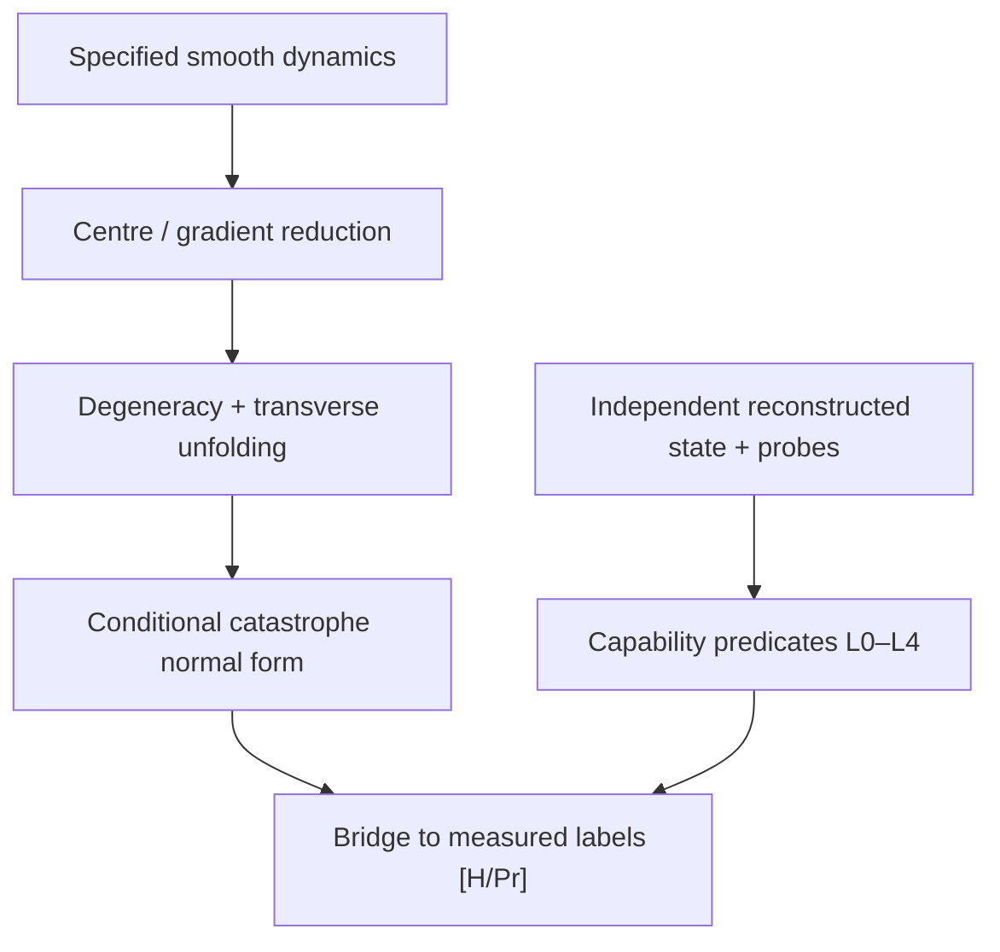

# Conditional Models of Level Transitions

A change of an operational label can occur along a smooth trajectory without a dynamical bifurcation. A bifurcation changes the local dynamics; a statistical phase transition needs a specified ensemble and limit. The [typed kernel](/docs/reference/mathematical-kernel) separates these notions. Phase-only Gap does not determine $\mathsf{Cap}_2$ or higher-order prediction certificates.

:::warning Revision 2026-10-03
The universal L0→L1 fold, L1→L2 cusp, L2→L3 swallowtail, compulsory hysteresis and complete Gap-signature cascade are **withdrawn [✗]**. Three controls do not force an $A_4$ singularity. The conditional mathematical models below retain exact normal forms, discriminants and scaling calculations with their prerequisites.
:::

## 1. A declared effective model {#потенциал}

To use potential catastrophe theory, first supply a smooth reduction of a specified generator to

$$
\dot x=-\partial_x V(x;\lambda),
$$

with a signed local state coordinate $x$, control parameters $\lambda$, a neighbourhood and a validity/error bound. A general Lindblad or nonlinear state flow need not be a one-dimensional gradient system. Pairwise $|\sin\arg\gamma_{ij}|$ is not globally smooth: zero coherence and the absolute value need attention. A smooth local coordinate or continuous weighted statistic must be declared.

**Conditional $A_k$ criterion [T at the smooth reduction].** At $(x_0,\lambda_0)$ require

$$
V_x=V_{xx}=\cdots=V_{x^k}=0,\qquad V_{x^{k+1}}\ne0,
$$

and a transverse $(k-1)$-parameter unfolding. In particular the matrix of control derivatives of $(V_x,\ldots,V_{x^{k-1}})$ has rank $k-1$ at the singular point. A smooth splitting of noncritical directions and the appropriate equivalence of unfoldings are part of the normal-form theorem. The potential convention is $A_k:x^{k+1}$, not $x^k$. Reference: [Ghrist, Applied Dynamical Systems, normal forms](https://www2.math.upenn.edu/~ghrist/preprints/ADS-DRAFT.pdf).

## 2. Normal forms and independent capability tests {#каскад}

### Fold model; no automatic L0→L1 implication {#l0-l1}

$$
V=x^3/3-\mu x,\qquad\dot x=\mu-x^2.
$$

For $\mu>0$ the equilibria are $\pm\sqrt\mu$, with one local minimum and one maximum; for $\mu<0$ there are none. This is a local fold **[T]**. A rank change of an independently declared $\rho_E$ does not force this normal form or a phase change. For example $\rho_E(t)=\operatorname{diag}(1-t,t)$ changes rank at $t=0$ while varying continuously.

### Cusp model; no automatic L1→L2 implication {#l1-l2}

$$
V=x^4/4+a x^2/2+b x,\qquad V_x=x^3+a x+b.
$$

Multiple stationary roots obey

$$
4a^3+27b^2=0.
$$

For $a<0$ and $|b|<2(-a)^{3/2}/(3\sqrt3)$ there are two local minima separated by a maximum **[T]**. Their labels are not L1/L2 without independently evaluating the full capability record. $R\ge1/3$ is only one gate; because $R=1/(7P)$ it decreases when purity increases.

### Swallowtail model; no automatic L2→L3 implication {#l2-l3}

$$
V=x^5/5+a x^3/3+b x^2/2+c x,\qquad V_x=x^4+a x^2+b x+c.
$$

This is the standard local $A_4$ unfolding when the degeneracy and transversality conditions hold. Its quartic derivative has at most four simple roots and hence **at most two nondegenerate interior minima**, since minima and maxima alternate. The former claim of three stable minima and the corresponding fermion-generation bound are **[✗]**. An odd-degree polynomial is not a globally confining potential; a global landscape needs further terms or a specified domain.

L3 requires L2 plus $\mathsf{MetaCert}_2$; fidelity $1/4$, a shallow well, meditation or phase alignment does not replace this test. A well's retention time requires its actual linearisation and, for noise-driven escape, a declared noise model and barrier.

### L3→L4 and categorical typing {#l3-l4}

L4 is the canonical compatible all-order operational ideal **[D]**, not a swallowtail sheet, a fixed point or a colimit of an entire topos. For a specified experiential object $X$, a Postnikov tower is inverse:

$$
\cdots\to\tau_{\le3}X\to\tau_{\le2}X\to\tau_{\le1}X.
$$

Reconstruction through its inverse limit requires convergence; truncation does not force nonzero homotopy at each degree. Neither Lawvere's fixed-point theorem nor finite matrix dimension alone proves universal unreachability. See [corrected categorical scope](./interiority-hierarchy#теорема-l4-категориальная).

## 3. Correct classification table {#сводная-таблица}

| Local potential germ | Catastrophe | Generic unfolding controls | Extra link to L |
|---|---|---:|---|
| $x^3$ | Fold $A_2$ | 1 | Independent L1 realisation |
| $x^4$ | Cusp $A_3$ | 2 | Full $\mathsf{Cap}_2$ |
| $x^5$ | Swallowtail $A_4$ | 3 | Independent metamodel certificate |
| $x^6$ | Butterfly $A_5$ | 4 generically | No canonical L-label |

An even $x^6$ tricritical Landau model is a symmetry-restricted family of the $A_5$ germ, not the generic $A_4$ swallowtail. Exact symmetry can restrict the available perturbations; it must be established in the model.

## 4. Conditional hysteresis {#гистерезис}

For the cusp at fixed $a<0$, quasistatic tracking of a chosen metastable minimum in a noiseless gradient system reaches fold values

$$
b_\pm=\pm\frac{2(-a)^{3/2}}{3\sqrt3},\qquad\Delta b=\frac{4(-a)^{3/2}}{3\sqrt3}.
$$

This gives a hysteresis loop **[T under this tracking protocol]**. Choosing the global minimum instead, noise-driven escape, finite sweep speed or a path outside the bistable region changes the switching law. There is no theorem that every L-transition has hysteresis, that its width grows with L, or that this width is a clinical resilience measure.

## 5. Dependency diagram {#диаграмма}

```mermaid
graph TD
    D["Specified smooth dynamics"] --> C["Centre / gradient reduction"]
    C --> N["Degeneracy + transverse unfolding"]
    N --> A["Conditional catastrophe normal form"]
    M["Independent reconstructed state + probes"] --> L["Capability predicates L0–L4"]
    A --> B["Bridge to measured labels [H/Pr]"]
    L --> B
```

## 6. Dynamics near a verified bifurcation {#динамика}

### Conditional slowing down {#замедление}

In the fold $\dot x=\mu-x^2$, the stable equilibrium $x_*=\sqrt\mu$ has eigenvalue $-2\sqrt\mu$, so the **linearised** relaxation time is

$$
\tau=1/(2\sqrt\mu).
$$

This exponent follows for this nondegenerate fold and this parameter path **[T]**, not for all threshold crossings. With local noise $d\eta=-\lambda\eta\,dt+\sqrt{2D}\,dW_t$, stationary variance is $D/\lambda$ and autocovariance $(D/\lambda)e^{-\lambda|t|}$. Fixed $D$ at the fold gives variance proportional to $\mu^{-1/2}$, not the former universal $\mu^{-1}$. Close enough to the fold the local linear approximation can fail. Bounded Gap variance itself cannot diverge without limit: any $[0,1]$ variable has variance at most $1/4$.

## 7. No forced Gap-sheet correspondence {#swallowtail-каскад}

Different purity/reflection gates occur at identical all-zero phase profiles; the explicit $\Gamma(t)$ counterexample is in [Gap identifiability](./gap-characterization#gap-инъекция). No normal-form theorem fixes means $0.6,0.3,0.1$, opacity ranks or perceived access at L-levels. Those are testable signatures **[H]** only after independent labelling and measurement calibration. Hamming redundancy does not impose three nonzero phase channels.

## 8. Scope of catastrophe theory {#связь-gap}

Local normal forms classify a specified germ, not all global attractors. Saddle-node, symmetry-dependent pitchfork and Hopf are distinct dynamical possibilities; Hopf needs a complex conjugate eigenvalue pair and is not a scalar gradient $A_k$ catastrophe. A Hopf prediction requires its own nondegeneracy and stability calculation.

## 9. What universality would require {#универсальность-переходов}

### T-160: a threshold is not a proved phase transition {#фазовый-переход}

The HS identity $P=1/7+\|\Gamma-I/7\|_F^2$ yields the adopted majority cut $P>2/7$ **[T under that criterion]**. It does not make $2/7$ a bifurcation point of every flow, select an ensemble, or break $U(7)$ to $G_2$. A simple replacement flow $\dot\rho=\sigma-\rho$ has one attracting equilibrium and a smooth solution $\rho(t)=\sigma+e^{-t}(\rho(0)-\sigma)$; it can cross the purity cut without a bifurcation. The old universal T-160 phase-transition identification is **[✗]**; identifying an observed transition is **[H]** until the dynamics, limit and bridge are supplied.

### T-161: exact mean-field calculation under a specified model {#критические-экспоненты}

Declare the even potential

$$
V(m;t,h)=\frac{t}{2}m^2+\frac{v}{6}m^6-hm,\qquad v>0,
$$

at the tuned quartic coefficient zero, with a nonzero linear temperature scaling field $t$. At $h=0,t<0$, minimisation gives $m^4=-t/v$ and $V_{\min}=-(-t)^{3/2}/(3\sqrt v)$. At $t=0$, $h=vm^5$. On the disordered side $\chi=\partial m/\partial h=1/t$. Thus the classical saddle-point exponents are

$$
\beta=1/4,\quad\delta=5,\quad\gamma=1,\quad\alpha=1/2
$$

**[T for this polynomial and thermodynamic interpretation]**. A correlation-length exponent $\nu=1/2$ additionally requires an actual spatial field with a positive gradient term and the Gaussian long-wavelength approximation. A seven-dimensional internal register has no spatial correlation length merely by having 21 complex pairs.

### Exactness and applicability {#механизм-точности}

The symmetry alone does not tune the quartic coefficient, prove a scalar centre reduction, establish detailed balance or suppress fluctuations. Catastrophe equivalence is not a proof that every thermodynamic exponent is invariant under any parameter/observable change. A deterministic equation does not by itself eliminate stochastic or finite-size effects in its physical interpretation. Counting 21 complex pairs is not a spatial dimension or a controlled large-$N$ limit. Universal exactness of these exponents for UHM is **[✗]**. The bridge to biological measurements and whether the stipulated mean-field approximation applies remain **[H/Pr]**.

## 10. Purity feedback: signs and a conditional scalar model {#лавинная-динамика}

The exact balance is

$$
\dot P=-4\gamma W/3+2(\kappa_b+\kappa_0\mathrm{Coh}_E)g_Vh+J_P,
$$

where $h=\operatorname{Tr}(\rho\tau)-P$. Its sign depends on the target and sources. For canonical $\tau=\varphi_{\mathrm{coh}}\rho$, $h\le0$; a larger regeneration rate does not ignite purity. Nor does $\mathrm{Coh}_E$ necessarily vanish or grow linearly at $P=2/7$. Increasing $P$ decreases canonical $R$. The old automatic positive feedback proof is **[✗]**.

If an independently derived scalar reduction is $\dot y=ay+by^2$ with $a,b>0$, then passage from $0<y_0<y_f$ takes

$$
T=\frac1a\log\frac{y_f(a+by_0)}{y_0(a+by_f)}.
$$

As $y_0\to0$ with $a>0$ fixed, it grows logarithmically. Only the separately tuned case $a=0$ gives $T=(1/b)(1/y_0-1/y_f)$. This corrects the former inference of an inverse-deviation law from a nonzero linear bootstrap term.

## 11. Experimental programme {#предсказания}

Fit a declared dynamics and measurement model on training data; preregister parameter paths, independent capability labels and out-of-sample tests. Test a fold, cusp, Hopf and smooth threshold crossing as competing models. Measure uncertainty, finite-size/sweep effects and false positives. Assigning coma, psychosis, therapeutic insight or meditation to a potential sheet is **[H]**, not a diagnosis from a static scalar or a mathematical validation of the phenomenal bridge.

## Related documents

- [Typed kernel](/docs/reference/mathematical-kernel)
- [Canonical hierarchy](./interiority-hierarchy)
- [Depth tower](./depth-tower)
- [Phase-model limitations](/docs/core/dynamics/gap-phase-diagram)
- [Exact purity balance](/docs/applied/coherence-cybernetics/theorems#теорема-81-условная-необходимость-интериорности-no-zombie)
