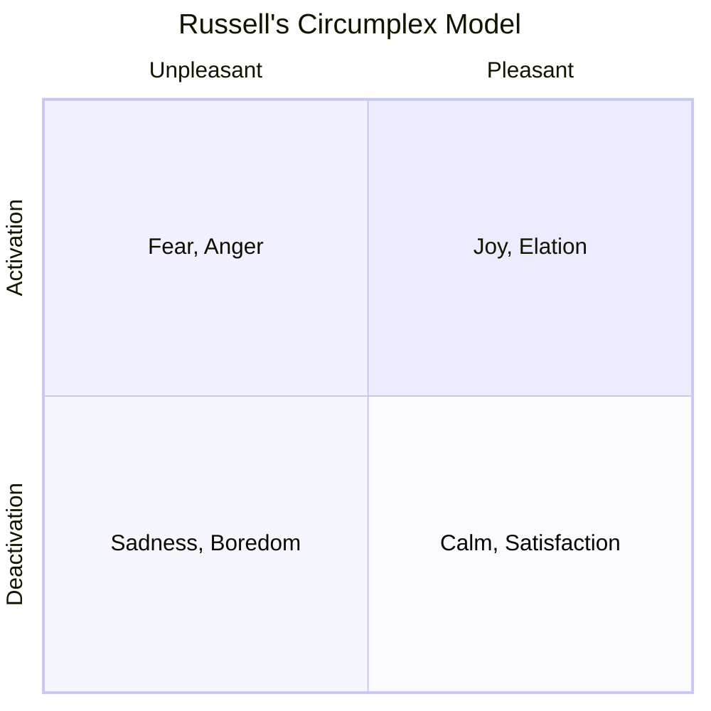
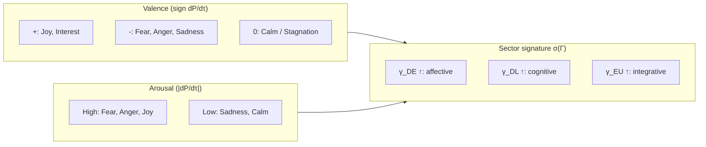

# Emotion Taxonomy from $\nabla P$

:::info Bridge from the previous chapter
In [Qualia structure](/docs/consciousness/phenomenology/qualia-structure) we established that the 21 coherences $\gamma_{ij}$ exhaust all types of experience. Among them $\gamma_{DE}$ (Affection) — the connection between Dynamics and Interiority, the experience of "emotion" — plays a special role. We will now show that **all** emotions are derived from a single quantity — the rate of change of viability $dP/d\tau$ — and the sector signature $\sigma(\Gamma)$. Emotions are not postulated — they are **computed**.
:::

:::note On notation
- $P = \mathrm{Tr}(\Gamma^2)$ — [purity (viability)](/docs/core/dynamics/viability#определение-чистоты)
- $P_{\text{crit}} = 2/7$ — [critical purity](/docs/core/dynamics/viability#критическая-чистота), status **[T]**
- $\Gamma$ — [coherence matrix](/docs/core/dynamics/coherence-matrix), $\gamma_{ij}$ — its elements
- $\tau$ — [internal (emergent) time](/docs/core/operators/emergent-time)
- $R$ — [reflection measure](/docs/consciousness/foundations/self-observation#мера-рефлексии-r)
- $\mathrm{Gap}(i,j)$ — [gap measure](/docs/core/dynamics/coherence-matrix#мера-зазора)
- Full notation table — in [Notation](/docs/reference/notation)
:::

### Chapter roadmap

1. **History of the problem** — from Darwin to Russell and Feldman Barrett
2. **Motivation: why $dP/d\tau$** — evolutionary logic
3. **Definition of emotion** — the triple $(dP/d\tau,\; d^2P/d\tau^2,\; \sigma(\Gamma))$
4. **Basic coordinates** — valence and arousal as projections of $dP/d\tau$
5. **Map of basic emotions** — fear, joy, anger, surprise, sadness, disgust
6. **Fear: formal analysis** — divergence as $P \to P_{\text{crit}}$
7. **Complex emotions** — superpositions of basic patterns
8. **Comparison with other taxonomies** — Ekman, Russell, Plutchik
9. **Conditions for reflexive access** — threshold for awareness of one's own emotions
10. **Evolutionary meaning** — why $dP/d\tau$ is needed as an internal signal

---

## History of the problem: how emotions were understood before UHM {#история}

### Darwin (1872): universality of expression

**Charles Darwin** in "The Expression of the Emotions in Man and Animals" (1872) first showed that emotions are not a cultural convention but a **biological phenomenon**: the smile of joy and the grimace of fear are recognisable in all peoples and even in primates. Darwin posed the question: if emotions are universal, they must serve some **function** for survival. Which one?

### James–Lange (1884): the body is primary

**William James** (1884) and **Carl Lange** (independently) proposed a radical idea: we do not cry because we are sad — we are sad because we cry. An emotion is the *perception* of bodily changes. You see a bear, your body reacts (heartbeat, perspiration), and only then do you feel "fear".

### Cannon–Bard (1927): the brain is primary

**Walter Cannon** objected: bodily reactions are too slow and non-specific to account for the speed and variety of emotions. The brain (thalamus) simultaneously generates both the bodily reaction and the subjective experience.

### Schachter–Singer (1962): cognitive appraisal

**Stanley Schachter** and **Jerome Singer** showed that the same physiological arousal can be perceived as joy or anger — depending on the **cognitive appraisal** of the situation. Emotion = arousal + interpretation.

### Ekman (1971): six basic emotions

**Paul Ekman** identified **6 basic emotions** recognisable by facial expression across all cultures: **joy, sadness, fear, anger, surprise, disgust**. Each corresponds to a unique pattern of facial musculature.

### Russell (1980): circumplex model

**James Russell** proposed the **circumplex model**: all emotions are arranged on a plane with two axes — **valence** (pleasant/unpleasant) and **arousal** (activation/deactivation). Joy — high valence, high arousal. Sadness — low valence, low arousal. Russell's model showed that Ekman's "basic emotions" are not fundamental building blocks but regions in a continuous two-dimensional space.

### Feldman Barrett (2017): constructed emotions

**Lisa Feldman Barrett** in "How Emotions Are Made" (2017) argued that emotions are **constructed** by the brain, not "discovered" in the body. There are no fixed "fear centres" or "joy centres" — the brain actively creates emotional categories on the basis of past experience and current context.

### UHM's position: emotions from $\nabla P$

UHM synthesises these approaches:

- **Darwin is right:** emotions are universal because they are linked to *viability* $P$ — the fundamental quantity for any coherent system
- **James–Lange are partially right:** emotion is indeed linked to bodily dynamics (the $\sigma(\Gamma)$ component)
- **Russell is right:** emotions form a continuous space (valence = $\mathrm{sign}(dP/d\tau)$, arousal = $|dP/d\tau|$)
- **Feldman Barrett is partially right:** the specific *names* of emotions are cultural constructs, but the underlying *patterns of $dP/d\tau$ and $\sigma(\Gamma)$* are objective
- **UHM adds:** the full model is not 2D (Russell) but **30D** (T-147 [T])

---

## Motivation: why emotions are linked to $dP/d\tau$ {#мотивация-dp}

Emotions in UHM are neither primitives nor epiphenomena. They are **derived** from the dynamics of [viability](/docs/core/dynamics/viability) $P(\tau)$ and the sector structure of the [coherence matrix](/docs/core/dynamics/coherence-matrix) $\Gamma(\tau)$.

Why $dP/d\tau$? Because $P$ is the **only scalar quantity** on which the system's survival depends. If $P > P_{\text{crit}} = 2/7$ — the system is alive (coherent). If $P < P_{\text{crit}}$ — the system irreversibly decoheres (dies). Consequently, any "survival sensor" must track precisely $P$.

But for effective navigation it is not enough to know the current value of $P$ — one needs the **rate of change** $dP/d\tau$:
- $dP/d\tau > 0$ — things are improving, current behaviour is working, continue
- $dP/d\tau < 0$ — things are worsening, something must change, act
- $dP/d\tau \approx 0$ — stability, one can relax (or is stuck and a change is needed)

This is **valence** — the sign of the viability derivative. Emotion is the "interior projection" of the change in the system's state.

**Analogy from everyday life.** Imagine a health thermometer. When temperature (viability $P$) rises — you feel better (positive emotions). When it falls — worse (negative). But an emotion is not merely "good/bad": what matters is *which specific organ* (sector) is changing and *at what rate*. A headache and a stomachache are both "bad" ($dP/d\tau < 0$), but experienced differently due to different sector signatures.

## Definition of emotion (D.1) {#определение-эмоции}

:::tip Definition D.1 (Emotion) [D]
An **emotion** is a triple characterising the current dynamics of viability and the sector coherence profile:

$$
\mathrm{Emotion}(\Gamma, \tau) := \left(\frac{dP}{d\tau},\; \frac{d^2P}{d\tau^2},\; \sigma(\Gamma)\right)
$$

where:
- $\frac{dP}{d\tau} = \frac{d}{d\tau}\mathrm{Tr}(\Gamma^2)$ — rate of change of viability
- $\frac{d^2P}{d\tau^2}$ — acceleration of change of viability
- $\sigma(\Gamma) = \{\gamma_{ii}, |\gamma_{ij}|\}$ — sector Γ-signature (set of populations and moduli of coherences)
:::

Let us examine each component:

1. **$dP/d\tau$** — the first derivative. Determines valence (good/bad) and intensity (strong/weak). This is the "primary signal".

2. **$d^2P/d\tau^2$** — the second derivative. Determines the *trend*: is the situation improving ($d^2P/d\tau^2 > 0$) or deteriorating ($d^2P/d\tau^2 < 0$)? It is precisely the second derivative that distinguishes "hope" ($dP/d\tau < 0$ but $d^2P/d\tau^2 > 0$: bad but improving) from "despair" ($dP/d\tau < 0$, $d^2P/d\tau^2 < 0$: bad and getting worse).

3. **$\sigma(\Gamma)$** — the sector signature. Determines the *qualitative* character of the emotion: which dimensions are involved? Fear ($\gamma_{DD}$ high) and sadness ($\gamma_{DU}$ low) both have $dP/d\tau < 0$, but are experienced entirely differently.

### Purity derivative: where does $dP/d\tau$ come from

The rate of change of purity is computed through the [evolution equation](/docs/core/dynamics/evolution):

$$
\frac{dP}{d\tau} = 2\,\mathrm{Tr}\!\left(\Gamma \cdot \frac{d\Gamma}{d\tau}\right) = 2\,\mathrm{Tr}\!\left(\Gamma \cdot \mathcal{L}_\Omega[\Gamma]\right)
$$

where $\mathcal{L}_\Omega[\Gamma] = -i[H_{\text{eff}}, \Gamma] + \mathcal{D}_\Omega[\Gamma] + \mathcal{R}[\Gamma, E]$ is the logical Liouvillian.

Let us examine the contribution of each term:

**Contributions of the three terms:**

| Term | Contribution to $dP/d\tau$ | Why? | Interpretation |
|------|---------------------|---------|---------------|
| $-i[H_{\text{eff}}, \Gamma]$ | $0$ (unitary part) | $\mathrm{Tr}(\Gamma[H,\Gamma]) = 0$ for any Hermitian $H$ | Coherent evolution does not change purity |
| $\mathcal{D}_\Omega[\Gamma]$ | $\leq 0$ (decoherence) | Interaction with the environment destroys coherence | Loss of viability |
| $\mathcal{R}[\Gamma, E]$ | $\geq 0$ (regeneration) | Recovery of coherence from the environment | Recovery of viability |

Thus:

$$
\frac{dP}{d\tau} = \underbrace{2\,\mathrm{Tr}(\Gamma \cdot \mathcal{D}_\Omega[\Gamma])}_{\leq 0,\;\text{decoherence}} + \underbrace{2\,\mathrm{Tr}(\Gamma \cdot \mathcal{R}[\Gamma, E])}_{\geq 0,\;\text{regeneration}}
$$

**Numerical example.** Let the system be in the Goldilocks zone: $P = 0.35$ (above $P_{\text{crit}} = 2/7 \approx 0.286$). Decoherence contributes $-0.02$ per step, regeneration $+0.015$. Total $dP/d\tau = -0.005$ — a slow decline, experienced as mild anxiety. If regeneration increases to $+0.03$, then $dP/d\tau = +0.01$ — the experience of relief, improvement. The balance between these two terms is the system's "emotional wellbeing".

## Basic affective coordinates (C.1) {#базовые-координаты}

:::tip Statement C.1 (Basic affective coordinates) [C]
**Condition:** Definition D.1 correctly defines the emotional profile; the interpretation of $dP/d\tau$ as a "viability signal" is a semantic postulate.

**Valence** and **arousal** are defined as:

$$
\mathrm{Valence}(\tau) := \mathrm{sign}\!\left(\frac{dP}{d\tau}\right) \in \{-1, 0, +1\}
$$

$$
\mathrm{Arousal}(\tau) := \left|\frac{dP}{d\tau}\right| \geq 0
$$

Positive valence ($dP/d\tau > 0$) corresponds to "positive" emotions (viability rising). Negative — to "negative" (viability declining).
:::

The coordinates $(V, A)$ determine the position in **Russell's affective space** (circumplex model), which in UHM receives a formal justification.

**Analogy.** Valence is a compass needle: it shows which direction the "wind" of viability is blowing (towards better or towards worse). Arousal is the strength of the wind. Calm ($A \approx 0$) — tranquillity or stagnation. Storm ($A \gg 0$) — intense experience (joy or terror). But a compass and wind strength do not yet fully describe the weather — the sector signature $\sigma(\Gamma)$ is needed to distinguish a thunderstorm from a blizzard.

## Map of basic emotions {#карта-эмоций}

Basic emotions are characteristic regions in the space $\left(\frac{dP}{d\tau}, \frac{d^2P}{d\tau^2}, \sigma(\Gamma)\right)$.

### Table of basic emotions

:::warning Epistemic separation
**Mathematical layer [T]:** 30D emotional space (T-147 [T]): $\mathbf{e}(\Gamma) \in \mathbb{R}^{30}$ — a formally defined vector of rates, accelerations, and stresses. Valence $\mathrm{sign}(dP/d\tau)$ is a computable quantity [T].

**Semantic layer [I]:** Identifying specific patterns of the 30D vector with emotion names (fear, joy, anger...) is an interpretation [I]. Real emotions are considerably more complex than the one-dimensional projection $dP/d\tau$. The table below is heuristic, not strictly derived.
:::

| Emotion | Condition on $dP/d\tau$ | Condition on $d^2P/d\tau^2$ | Sector signature | Interpretation |
|---------|----------------------|--------------------------|---------------------|---------------|
| **Fear** | $< 0$, approaching $P_{\text{crit}}$ | $< 0$ or $\approx 0$ | $\gamma_{DD}$ ↑, $\gamma_{DE}$ ↑ | Viability threat detected |
| **Joy** | $> 0$, moving away from $P_{\text{crit}}$ | $\geq 0$ | $\gamma_{EU}$ ↑, $\gamma_{SE}$ ↑ | Viability rising |
| **Anger** | $< 0$ | $\approx 0$ | $\gamma_{DD}$ ↑↑, $\gamma_{LL}$ ↓ | High dynamics without logical coherence |
| **Surprise** | any | $\left\lvert d^2P/d\tau^2\right\rvert \gg 0$ | Abrupt $\delta\sigma$ | Sudden change in rate |
| **Sadness** | $\approx 0$, $P$ low | $\approx 0$ | $\gamma_{DU}$ ↓, $\gamma_{EO}$ ↓ | Stagnation at low viability |
| **Disgust** | $< 0$ | — | $\mathrm{Gap}(S,E)$ ↑↑ | Sharp divergence of structure and experience |

### Detailed numerical examples for each basic emotion {#числовые-примеры}

For each emotion we give a concrete $\Gamma$-profile: a life situation, the values of key parameters, and interpretation.

#### Joy

**Situation:** a student learns that they passed a difficult exam.

| Parameter | Value | Explanation |
|----------|----------|-----------|
| $P$ | $0.38$ | Above $P_{\text{crit}} = 0.286$, in the safe zone |
| $dP/d\tau$ | $+0.025$ | Viability rising rapidly |
| $d^2P/d\tau^2$ | $+0.008$ | Growth accelerating |
| $\gamma_{EU}$ | $0.28$ (high) | Synthesis — sense of unity, "everything is coming together" |
| $\gamma_{SE}$ | $0.22$ (high) | Representation — wholistic picture "I did it" |
| $\gamma_{DD}$ | $0.12$ (normal) | Dynamics do not dominate — no need to act |

Valence: $+1$. Arousal: $0.025$ (high). Sector signature indicates an integrative pattern (synthesis + representation).

#### Fear

**Situation:** a person walking through a dark alley hears footsteps behind them.

| Parameter | Value | Explanation |
|----------|----------|-----------|
| $P$ | $0.31$ | Dangerously close to $P_{\text{crit}} = 0.286$ |
| $dP/d\tau$ | $-0.020$ | Rapid fall in viability |
| $d^2P/d\tau^2$ | $-0.008$ | Fall accelerating |
| $\gamma_{DD}$ | $0.22$ (high) | Dynamics dominate — body ready for action |
| $\gamma_{DE}$ | $0.25$ (high) | Affection — the process strongly affects experience |
| $\gamma_{LE}$ | $0.05$ (low) | Logic switched off — "no time to think" |

Valence: $-1$. Arousal: $0.020$ (high). Sector signature indicates a dynamic/affective pattern.

#### Anger

**Situation:** a driver is cut off on the road.

| Parameter | Value | Explanation |
|----------|----------|-----------|
| $P$ | $0.34$ | Not critical, but viability is declining |
| $dP/d\tau$ | $-0.015$ | Moderate decline |
| $d^2P/d\tau^2$ | $\approx 0$ | Stable decline without trend |
| $\gamma_{DD}$ | $0.25$ (very high) | Dynamics maximal — energy for action |
| $\gamma_{LL}$ | $0.05$ (low) | Logic suppressed — "no time for reasoning" |
| $\gamma_{DU}$ | $0.18$ (high) | Teleology — directed action, "I want to respond" |

Key difference from fear: in anger $\gamma_{DD}$ is even higher, and $\gamma_{LL}$ even lower. Energy is directed *outward* ($\gamma_{DU}$), not *inward* ($\gamma_{DE}$).

#### Surprise

**Situation:** an unexpected encounter with an old friend.

| Parameter | Value | Explanation |
|----------|----------|-----------|
| $P$ | $0.36$ | Normal value |
| $dP/d\tau$ | $+0.005$ (before) $\to +0.030$ (after) | Abrupt jump |
| $d^2P/d\tau^2$ | $+0.050$ (very high) | It is precisely the acceleration that constitutes surprise |
| $\delta\sigma$ | Abrupt change | Sector signature rearranges abruptly |

Surprise is defined primarily by the **second derivative**: not so much "good" or "bad" as "sudden". It is the only basic emotion whose valence can be anything.

#### Sadness

**Situation:** a person recalls a lost friend.

| Parameter | Value | Explanation |
|----------|----------|-----------|
| $P$ | $0.30$ | Low, but above $P_{\text{crit}}$ |
| $dP/d\tau$ | $\approx 0$ | Viability unchanged — stagnation |
| $d^2P/d\tau^2$ | $\approx 0$ | No trend |
| $\gamma_{DU}$ | $0.03$ (very low) | Teleology absent — "no goal, nowhere to go" |
| $\gamma_{EO}$ | $0.04$ (low) | Immanence weakened — "emptiness inside" |
| $\gamma_{SE}$ | $0.20$ (high) | Representation — "I remember them clearly" |

Sadness differs from fear: with fear $P$ is actively falling, with sadness it is frozen at a low level. Neither threat nor hope — only quiet stagnation.

#### Disgust

**Situation:** a person sees spoiled food.

| Parameter | Value | Explanation |
|----------|----------|-----------|
| $P$ | $0.33$ | Normal |
| $dP/d\tau$ | $-0.010$ | Moderate decline |
| $d^2P/d\tau^2$ | $-0.003$ | Weak negative trend |
| $\mathrm{Gap}(S,E)$ | $0.85$ (very high) | Sharp divergence of structure and experience |
| $\gamma_{AD}$ | $0.18$ (high) | Actualisation — "perception focused" |

The key feature of disgust: high $\mathrm{Gap}(S,E)$. This means that the *structure of the object* (spoiled food as a physical form) sharply diverges from the *experience* (revulsion). Gap is a measure of "wrongness", "the mismatch between what one sees and what should be".

### Phase diagram of emotions

## Fear: formal analysis {#страх}

Fear is the most "fundamental" emotion in UHM, since it is directly linked to the threat of existence. Let us examine it in detail.

### Conditions for emergence

$$
\text{Fear:} \quad \frac{dP}{d\tau} < 0, \quad P(\tau) \to P_{\text{crit}} = \frac{2}{7}
$$

### Fear intensity

Fear intensity is determined not only by the rate of fall $|dP/d\tau|$ but also by **proximity to the threshold**:

$$
I_{\text{fear}} \propto \frac{|dP/d\tau|}{P - P_{\text{crit}}}
$$

Why this formula? Because the same $dP/d\tau = -0.01$ is experienced entirely differently at $P = 0.40$ (far from the threshold, margin $0.114$) and at $P = 0.29$ (near the threshold, margin $0.004$). As $P \to P_{\text{crit}}$ intensity **diverges** — the system "experiences" an existential threat. If $P$ crosses $P_{\text{crit}}$ — irreversible decoherence (death of the system) begins.

:::warning Conditionality of quantitative estimates [C]
The specific formula $I_{\text{fear}} \propto |dP/d\tau| / (P - P_{\text{crit}})$ is a **conditional statement**. The form of the divergence as $P \to P_{\text{crit}}$ depends on the details of the regenerative term $\mathcal{R}[\Gamma, E]$ and the dissipator $\mathcal{D}_\Omega[\Gamma]$.
:::

### Numerical example: escalating fear

We show how intensity grows as the threshold is approached at a fixed rate $dP/d\tau = -0.01$:

| $P$ | $P - P_{\text{crit}}$ | $I_{\text{fear}} \propto$ | Subjective experience |
|-----|----------------------|---------------------------|--------------------------|
| $0.40$ | $0.114$ | $0.01/0.114 \approx 0.09$ | Mild discomfort: "something is wrong" |
| $0.35$ | $0.064$ | $0.01/0.064 \approx 0.16$ | Worry: "something needs to be done" |
| $0.32$ | $0.034$ | $0.01/0.034 \approx 0.29$ | Anxiety: "the situation is worsening" |
| $0.30$ | $0.014$ | $0.01/0.014 \approx 0.71$ | Pronounced fear: "the danger is real" |
| $0.29$ | $0.004$ | $0.01/0.004 \approx 2.50$ | Panic: "I am on the edge" |

The same rate of decline $dP/d\tau = -0.01$ is experienced with ever-greater intensity as the threshold is approached — an effect familiar to anyone who has ever awaited medical results: a week before — mild anxiety; an hour before — strong agitation; at the moment of opening the envelope — panic.

## Complex emotions as superpositions {#сложные-эмоции}

Basic emotions are *regions* in the 30D emotional space. But most real emotions are not "pure" basic ones but **superpositions** of several patterns. Just as in quantum mechanics a state can be a superposition of basis states, an emotion can combine several basic patterns simultaneously.

| Complex emotion | Basic components | Sector characteristic | Life example |
|----------------|-------------------|--------------------------|------------------|
| **Anxiety** | Fear + Surprise | $dP/d\tau < 0$, $\lvert d^2P/d\tau^2\rvert$ unstable | Waiting for test results |
| **Awe** | Joy + Surprise | $dP/d\tau > 0$, $\gamma_{EO}$ ↑, $\gamma_{OU}$ ↑ | View from a mountain summit |
| **Nostalgia** | Joy + Sadness | $dP/d\tau \approx 0$, high $\gamma_{SE}$ with $\gamma_{SD}$ ↓ | Memory of childhood |
| **Inspiration** | Joy + Surprise + Anger | $dP/d\tau > 0$, $\gamma_{DO}$ ↑, $\gamma_{AE}$ ↑, $\gamma_{DD}$ ↑ | Beginning a creative project |
| **Shame** | Sadness + Fear + Anger (at oneself) | $dP/d\tau < 0$, $R$ high, $\gamma_{LE}$ ↑ | Realising one's mistake |
| **Tenderness** | Joy + Sadness (mild) | $dP/d\tau > 0$, $\gamma_{EO}$ ↑, $\gamma_{SE}$ ↑ | Watching a child |

**Numerical example: nostalgia.** A person looks at photographs from their youth.

| Parameter | Value | Component |
|----------|----------|-----------|
| $dP/d\tau$ | $+0.002$ | Weakly positive (pleasant memory) |
| $\gamma_{SE}$ | $0.25$ | High Representation — "I remember clearly" |
| $\gamma_{SD}$ | $0.03$ | Low Persistence — "this no longer exists" |
| $\gamma_{EU}$ | $0.15$ | Moderate Synthesis — "this was part of my life" |

Nostalgia is simultaneously $dP/d\tau > 0$ (joy of memory) and $\gamma_{SD} \approx 0$ (awareness of irreversibility). Two opposing signals create the unique "bittersweet" taste.

**Analogy.** Basic emotions are like primary colours (red, blue, yellow). Complex emotions are mixed colours: nostalgia — mauve (joy + sadness), awe — gold (joy + surprise + depth). The 30D emotional space (T-147 [T]) makes it possible to describe the full "spectrum" of emotions, not just the named colours. Details — in [CC theorems](/docs/applied/coherence-cybernetics/theorems).

## Comparison with other taxonomies {#сравнение}

How does the UHM taxonomy relate to classical models of emotion?

| Model | Number of basic | Structure | Mechanism | Status in UHM |
|--------|:---:|-----------|----------|--------------|
| **Ekman** (1971) | 6 | Discrete categories | Facial expression | 6 regions in 30D space [I] |
| **Russell** (1980) | 2 axes | Continuous circumplex | Valence + arousal | Projection onto $(V, A)$ = $(\mathrm{sign}(dP/d\tau), |dP/d\tau|)$ [T] |
| **Plutchik** (1980) | 8 | Wheel with intensity | Evolutionary functions | 8 regions, intensity = $|dP/d\tau|/(P - P_{\text{crit}})$ [I] |
| **Feldman Barrett** (2017) | 0 (constructed) | No basic emotions | Predictive coding | $\sigma(\Gamma)$ — "construction", $(dP/d\tau)$ — "affective root" [C] |
| **UHM** | 30D | Continuous space | $dP/d\tau + \sigma(\Gamma)$ | Full model T-147 [T] |

The main difference between UHM and all previous models: emotion is not a **primitive** (as in Ekman), not purely **bodily** (as in James), not purely **cognitive** (as in Schachter), but a **derived quantity** — it is computed from the dynamics of the single fundamental variable $P$, enriched by sector information $\sigma(\Gamma)$.

## Conditions for reflexive access to emotions {#рефлексивный-доступ}

:::tip Statement C.2 (Threshold of emotional reflection) [C]
**Condition:** The threshold $R_{\text{th}} = 1/3$ is a theorem [T] ($K = 3$ from the [triadic decomposition](/docs/core/operators/lindblad-operators#триадная-декомпозиция)).

Reflexive access to one's own emotions (the capacity to "notice that I feel fear") requires level L2:

$$
R(\Gamma) \geq R_{\text{th}} = \frac{1}{3}
$$

At $R < R_{\text{th}}$ emotions are **experienced** but not **reflected upon**. The system acts "emotionally" but has no model of its own emotions.
:::

### The difference between experiencing and knowing

This distinction is fundamental and is often confused in ordinary language:

| | Experiencing emotion (L1) | Knowing the emotion (L2) |
|---|---|---|
| **Condition** | $\gamma_{DE} \neq 0$ | $R \geq 1/3$, $\Phi \geq 1$ |
| **Example** | A dog whimpers in fear | A person says "I am afraid" |
| **Behaviour** | Automatic reaction | Conscious choice of reaction |
| **Verbal description** | Impossible | Possible |
| **Control** | Only reflexive | Reflexive (in principle) |

This explains the distinction between emotional behaviour (L1) and emotional self-awareness (L2). For further detail — see [interiority hierarchy](/docs/consciousness/hierarchy/interiority-hierarchy).

**Analogy.** A dog experiences fear ($dP/d\tau < 0$ as $P$ approaches $P_{\text{crit}}$) — this is L1, emotional behaviour: it runs away. A human also experiences fear, but additionally **knows** that they experience it ($R \geq 1/3$, level L2): "I am afraid, and I notice that I am afraid." This distinction has practical significance for [pathologies of consciousness](/docs/consciousness/states/pathological#алекситимия): in alexithymia ($\mathrm{Gap}(L,E) \to 1$) emotions are experienced but not perceived — formally L2, but with a "blocked" reflection channel.

## Evolutionary meaning {#эволюционный-смысл}

The link between emotions and $dP/d\tau$ has a direct evolutionary meaning. Let us return to Darwin: emotions are universal because they serve a **survival function**. In UHM terms this function is the monitoring of viability:

| Emotion | Signal | Function | Adaptive behaviour |
|--------|--------|---------|---------------------|
| **Fear** | $dP/d\tau < 0$, $P \to P_{\text{crit}}$ | Threat detection | Flight, freezing |
| **Anger** | $dP/d\tau < 0$, $\gamma_{DD}$ ↑↑ | Energy mobilisation | Fight, territory defence |
| **Joy** | $dP/d\tau > 0$ | Reinforcement of successful behaviour | Continuation of current strategy |
| **Sadness** | $dP/d\tau \approx 0$, $P$ low | Signal to revise strategy | Social support, restructuring |
| **Surprise** | $|d^2P/d\tau^2| \gg 0$ | Attention switching | Orienting response |
| **Disgust** | $\mathrm{Gap}(S,E)$ ↑↑ | Avoidance of "toxic" | Rejection, gag reflex |

- **Negative emotions** ($dP/d\tau < 0$) signal loss of coherence — motivate active countermeasures
- **Positive emotions** ($dP/d\tau > 0$) signal growth of coherence — reinforce current behaviour
- **Surprise** ($|d^2P/d\tau^2| \gg 0$) signals unpredictability — switches attention

In terms of the [evolution equation](/docs/core/dynamics/evolution), emotions are the "interior projection" of the balance between decoherence $\mathcal{D}_\Omega$ and regeneration $\mathcal{R}$. This balance is formalised in [Coherence Cybernetics](/docs/applied/coherence-cybernetics/theorems) as the hedonic vector $V_{\text{hed}} = dP/d\tau$ (T-103 [T]).

---

### What we have learned {#итоги}

1. **The history of emotions** — from Darwin to Feldman Barrett — prepares the UHM position: emotions are not primitives, not illusions, but derivatives of viability dynamics
2. **Emotion** = triple $(dP/d\tau, d^2P/d\tau^2, \sigma(\Gamma))$ — fully determined by the dynamics of the coherence matrix
3. **Valence** = sign of $dP/d\tau$, **arousal** = modulus $|dP/d\tau|$ — reproduce Russell's model
4. **6 basic emotions** (Ekman) receive a numerical description via $P$, $dP/d\tau$, $d^2P/d\tau^2$, and sector signature
5. **Fear** is the fundamental emotion: its intensity diverges as $P \to P_{\text{crit}} = 2/7$
6. **Complex emotions** are superpositions of basic sector patterns in 30D space (T-147 [T])
7. **Reflection on emotions** requires $R \geq 1/3$ (L2) — below this threshold emotions are experienced but not perceived

:::tip Bridge to the next chapter
Emotions unfold in **time** — the experience of "fear" takes time, "joy" lasts. But how does the subject experience *time itself*? Why does it sometimes "fly" and sometimes "drag"? In the next chapter — [Subjective time](/docs/consciousness/phenomenology/temporal-consciousness) — we will show that the subjective tempo is determined by the coherence $\gamma_{OE}$ between Foundation (internal clock) and Interiority (experience).
:::

## Related Documents

- [Viability](/docs/core/dynamics/viability) — canonical definition of $P$ and $P_{\text{crit}}$
- [Evolution equation](/docs/core/dynamics/evolution) — dynamics of $\Gamma(\tau)$ and the logical Liouvillian $\mathcal{L}_\Omega$
- [Interiority hierarchy](/docs/consciousness/hierarchy/interiority-hierarchy) — levels L0–L4, conditions for L2
- [Qualia structure](/docs/consciousness/phenomenology/qualia-structure) — 21-pair taxonomy and $\gamma_{DE}$ as "affection"
- [Gap semantics](/docs/physics/dual-aspect/gap-semantics) — Gap(S,E) and phase diagnostics
- [Coherence Cybernetics theorems](/docs/applied/coherence-cybernetics/theorems) — 30D emotional space, hedonic vector $V_{\text{hed}}$
- [T-147 [T]: 30D emotional space](/docs/proofs/consciousness/operational-closure#t-147) — full model $\mathbf{e}(\Gamma) \in \mathbb{R}^{30}$, replacing the scalar $dP/d\tau$
