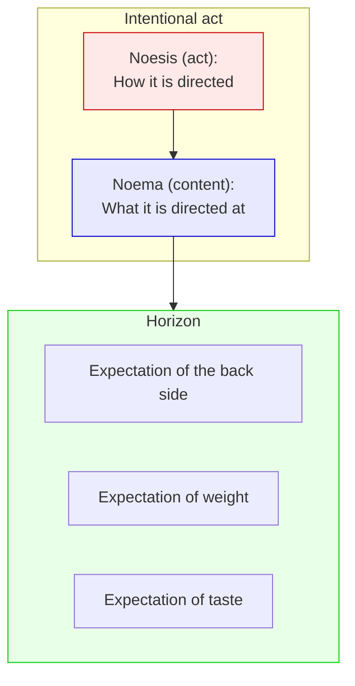
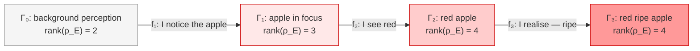

# Intentionality

:::info Bridge from the previous chapter
In the preceding chapters we examined *what* is experienced ([qualia](/docs/consciousness/phenomenology/qualia-structure)), *how* it is experienced ([emotions](/docs/consciousness/phenomenology/emotional-taxonomy)), *when* it is experienced ([subjective time](/docs/consciousness/phenomenology/temporal-consciousness)). Now comes the most fundamental question: **about what** is the experience? Consciousness is always directed *toward something* — an object, a thought, a feeling. This directedness is called **intentionality** and receives in UHM a precise mathematical expression: a morphism in the category $\mathbf{Hol}$ that preserves experiential content.
:::

:::note On notation
- $\Gamma$ — [coherence matrix](/docs/core/dynamics/coherence-matrix), $\gamma_{ij}$ — its elements
- $\mathbf{Hol}$ — [category of Holonomies](/docs/core/categories/category-hol)
- $\varphi$ — [self-modelling operator](/docs/consciousness/foundations/self-observation#оператор-самомоделирования-φ)
- $R$ — [reflection measure](/docs/consciousness/foundations/self-observation#мера-рефлексии-r), $R_{\text{th}} = 1/3$
- $\Phi$ — [integration measure](/docs/core/structure/dimension-u#мера-интеграции-φ)
- Full notation table — in [Notation](/docs/reference/notation)
:::

### Chapter roadmap

1. **Philosophical history** — from Brentano to Searle
2. **Definition** — intentionality as a CPTP morphism with the E-condition
3. **Threshold** — why intentionality requires L2
4. **Types** — apperceptive, evidential, teleological, affective, immanent
5. **Composition** — closure theorem (subcategory $\mathbf{Int} \subset \mathbf{Hol}$)
6. **Self-consciousness** — the identity intentional act
7. **L0–L4 hierarchy** — from absence of directedness to identity
8. **Intentional cone** — the set of reachable states
9. **Connection to No-Zombie** — why absence of intentionality does not equal absence of experience

---

## Philosophical History: The Directedness of Consciousness {#история}

### Brentano (1874): intentionality as the criterion of the mental

**Franz Brentano** in "Psychology from an Empirical Standpoint" (1874) formulated a thesis that became one of the foundational claims of the philosophy of mind:

> "Every mental phenomenon is characterized by what the medieval scholastics called the **intentional (or mental) inexistence** of an object, and which we, though in somewhat ambiguous terms, would call the **relation to a content, the direction toward an object**."

What does this mean in plain language? Every conscious state is **directed toward something**:
- You **see** *an apple* (perception directed toward an object)
- You **think** *about a problem* (thinking directed toward a content)
- You **desire** *ice cream* (desire directed toward a thing)
- You **fear** *the dark* (fear directed toward a situation)

A stone is directed toward nothing. A river is not "about" anything. But consciousness is **always** about something — that is its defining property. Brentano proposed using intentionality as the **criterion of distinction** between the mental and the physical.

### Husserl (1900): noesis and noema

**Edmund Husserl**, Brentano's student, developed his idea into a systematic phenomenology. He introduced two key concepts:

- **Noesis** (noesis) — the act of consciousness, the "how" of its directedness (perception, recollection, judgement…)
- **Noema** (noema) — the content of the act, the "toward what" of consciousness (object, thought, value…)

Every act of consciousness is a pair (noesis, noema). One cannot have a noesis without a noema (consciousness without an object) or a noema without a noesis (object without consciousness).

Husserl also introduced the concept of the **horizon of intentionality**: when you see an apple, you see not only its front side — you **expect** it to have a back side, that it is heavy, that it is edible. This "horizon" is the invisible but essential background of every act of consciousness.

### Searle (1983): intentionality and speech acts

**John Searle** in "Intentionality" (1983) linked intentionality to **conditions of satisfaction**: every intentional state sets a condition under which it is "satisfied" (a belief is true or false, a desire fulfilled or not, an intention realised or not).

Searle also proposed the famous "Chinese Room" argument (1980): a computer program can simulate understanding Chinese, but does not possess intentionality — it does not "understand" in the sense that a human understands. For Searle, intentionality is a biological phenomenon belonging to certain neural systems.

### UHM position: intentionality as a morphism

UHM offers a formalisation that combines the intuitions of all three thinkers:

| Philosopher | Idea | Formalisation in UHM |
|-------------|------|----------------------|
| **Brentano** | Consciousness is always directed | Morphism $f: \Gamma_A \to \Gamma_B$ in the category $\mathbf{Hol}$ |
| **Husserl** | Noesis/noema, horizon | Noesis = morphism $f$; noema = $\Gamma_B$; horizon = intentional cone $\mathcal{I}(\Gamma)$ |
| **Searle** | Conditions of satisfaction, biological grounding | E-compatibility = condition of satisfaction; $R \geq 1/3$ = biological threshold |

The key distinction of UHM from all three: **intentionality is not binary** (present/absent), but **graded** — from complete absence (L0) through proto-intentionality (L1) to full intentionality (L2) and meta-intentionality (L3).

---

## Motivation {#мотивация}

**Intentionality** is a fundamental property of consciousness: its **directedness toward an object**. Consciousness is always consciousness *of* something (Brentano, Husserl). In UHM, intentionality receives a formal expression as a **morphism** in the [category of Holonomies](/docs/core/categories/category-hol) $\mathbf{Hol}$.

**An everyday analogy.** A torch always shines *somewhere* — it has a direction. Consciousness is like a torch: it cannot simply "be" without an object of illumination. Intentionality is the "beam" of the torch. In the UHM formalism: the morphism $f: \Gamma_A \to \Gamma_B$ is the "path of the beam" from one state to another, and this path must not "switch the torch off" (must not impoverish the E-sector).

But why is intentionality formally a **morphism** rather than, say, a function or a relation? Because:

1. Morphisms **compose**: from "I see an apple" and "the apple is red" it follows "I see a red apple" — a chain of intentional acts forms a new act
2. Morphisms **preserve structure**: an intentional act does not destroy the object (a CPTP channel preserves normalisation and positivity)
3. There exists an **identity morphism**: self-consciousness is the "directedness toward oneself", $\mathrm{id}: \Gamma \to \Gamma$

These are precisely the axioms of a **category**. Intentionality is not an accidental property attached to consciousness, but a **structural invariant** of the category $\mathbf{Hol}$.

## Definition of Intentionality (D.1) {#определение}

:::tip Definition D.1 (Intentionality) [D]
**Intentionality** is a CPTP morphism $f$ in the category $\mathbf{Hol}$ satisfying the condition of **E-compatibility**:

$$
f: \Gamma_A \to \Gamma_B, \quad f \in \mathrm{Mor}_{\mathbf{Hol}}(\Gamma_A, \Gamma_B)
$$

with the additional condition:

$$
\mathrm{rank}(\rho_E^{(B)}) \geq \mathrm{rank}(\rho_E^{(A)})
$$

where $\rho_E^{(X)} = \mathrm{Tr}_{-E}(\Gamma_X)$ is the [reduced experience matrix](/docs/consciousness/foundations/interiority-theory) of system $X$.

**Interpretation:** The intentional act $f$ "directs" system $A$ toward system $B$ in such a way that experiential content is not impoverished.
:::

Let us unpack the definition part by part.

### What is a CPTP morphism?

**CPTP** stands for "Completely Positive Trace-Preserving". This is the class of transformations that are physically realisable:

- **Trace-Preserving**: $\mathrm{Tr}(f(\Gamma)) = \mathrm{Tr}(\Gamma) = 1$. Normalisation is preserved — "probabilities remain probabilities".
- **Completely Positive**: $f$ maps admissible states to admissible states, even when the system is part of a larger system. This guarantees that the transformation is "physical" — it does not create negative probabilities.

In Kraus representation:

$$
f(\Gamma) = \sum_m K_m \Gamma K_m^\dagger, \quad \sum_m K_m^\dagger K_m = I
$$

where $K_m$ are Kraus operators compatible with the $\Omega^7$ structure (see [Category Hol](/docs/core/categories/category-hol)).

### What is E-compatibility?

The condition $\mathrm{rank}(\rho_E^{(B)}) \geq \mathrm{rank}(\rho_E^{(A)})$ means: **the rank of the reduced experience matrix does not decrease**. What does this mean informally?

$\rho_E = \mathrm{Tr}_{-E}(\Gamma)$ is what the Interiority ($E$) measurement "sees" when all other dimensions are "traced out" (averaged). The rank of $\rho_E$ is the number of "independent directions" in E-space along which there is nonzero content. The higher the rank, the richer the experience.

E-compatibility guarantees: **an intentional act does not impoverish experience**. It may enrich (rank grows) or preserve (rank unchanged), but not diminish.

**Analogy.** If $\Gamma$ is a picture of the world, then an intentional act is "pointing the lens" at a part of the picture. The condition $\mathrm{rank}(\rho_E^{(B)}) \geq \mathrm{rank}(\rho_E^{(A)})$ guarantees that when pointing the lens the picture does not lose detail — it may acquire new detail, but not lose it. The CPTP channel formalism ensures that the "lens" is physically realisable (preserves positivity and normalisation).

**Numerical example.** Suppose before the intentional act: $\rho_E^{(A)}$ has rank 3 (three independent "directions" of experience). After the act "I notice the red colour of the apple": $\rho_E^{(B)}$ has rank 4 — a new direction (colour) has been added. E-compatibility is satisfied: $4 \geq 3$. If after the act the rank had fallen to 2, this would not be an intentional act — it would be "forgetting", "repression", a destruction of experience.

## Threshold of Intentionality (C.1) {#порог}

:::tip Statement C.1 (Threshold of intentionality) [C]
**Condition:** The threshold $R_{\text{th}} = 1/3$ is a theorem [T] ($K = 3$ from the [triadic decomposition](/docs/core/operators/lindblad-operators#триадная-декомпозиция)).

Intentionality in the full sense (an "about-something" directed structure) requires level L2:

$$
R(\Gamma) \geq R_{\text{th}} = \frac{1}{3}, \quad \Phi(\Gamma) \geq \Phi_{\text{th}} = 1
$$

**Below L2** there exist proto-intentional processes: morphisms $f \in \mathrm{Mor}_{\mathbf{Hol}}$ without a condition on $\mathrm{rank}(\rho_E)$. These are "reactive" directedness (tropisms, reflexes), lacking an "about-something" structure.
:::

### Why intentionality requires L2

Intentionality presupposes **distinguishing subject from object**: "**I** see **an apple**". This requires:

1. **A model of the subject** — "who directs". This is provided by the [self-modelling operator](/docs/consciousness/foundations/self-observation) $\varphi$, creating an inner "map of self" $\varphi(\Gamma)$.

2. **A model of the object** — "what is directed at". This is provided by sufficient accuracy of the self-model, enabling the system to **distinguish** "self" from "not-self".

The quality of the self-model is measured by the [reflection measure](/docs/consciousness/foundations/self-observation#мера-рефлексии-r):

$$
R = \frac{1}{7P(\Gamma)} \geq \frac{1}{3}
$$

When $R < 1/3$ (equivalently $P > 3/7$) the system is too far from the dissipative attractor $I/7$ to structure the subject–object distinction that is constitutive of intentionality. Master definition: [Self-observation](/docs/consciousness/foundations/self-observation#мера-рефлексии-r).

**Numerical example: three beings.**

| Entity | $R$ | $\Phi$ | Level | Directedness | Experience |
|--------|:---:|:------:|:-----:|--------------|------------|
| **Thermostat** | $0.02$ | $0.3$ | L0 | None | Reacts to temperature, but is not "directed" at anything |
| **Amoeba** | $0.15$ | $1.5$ | L1 | Proto-intentionality | Moves toward food, but there is no "I" and no "food as object" |
| **Human** | $0.50$ | $2.1$ | L2 | Intentionality | "I see an apple" — there is a subject, an object, an act |

For the human: $R \approx 0.5$ means $P \approx 1/(7 \times 0.5) \approx 2/7$ — the system is near the critical threshold, in the Goldilocks zone. For the amoeba: $R \approx 0.1$ ($P \approx 1.4$, but for physical systems $P \leq 1$, so $R \geq 1/7 \approx 0.14$) — reflection is minimal, the subject–object distinction is blurred. For the thermostat: $R$ is close to $1/7$ — reflection at the lower bound.

## Types of Intentionality (I.1) {#типы}

:::info Interpretation I.1 (Sectoral types of intentionality) [I]
Different types of intentionality are determined by **which sectors** of the coherence matrix dominate in the morphism $f$. This is an **interpretation** — a mapping of formal sectors onto phenomenological types.
:::

### Table of types

| Type | Dominant sector | Formal characteristic | Phenomenology | Example |
|------|-----------------|----------------------|---------------|---------|
| **Apperceptive** | $A \to E$ | $\gamma_{AE}$ ↑ under $f$ | Discrimination enters interiority | "I *see* a red apple" |
| **Evidential** | $L \to E$ | $\gamma_{LE}$ ↑ under $f$ | Logical coherence in interiority | "I *understand* the proof" |
| **Teleological** | $D \to U$ | $\gamma_{DU}$ ↑ under $f$ | Directed change toward unity (goal) | "I *strive* toward a solution" |
| **Affective** | $D \to E$ | $\gamma_{DE}$ ↑ under $f$ | Process acting on interiority | "I *feel* joy" |
| **Immanent** | $E \to O$ | $\gamma_{EO}$ ↑ under $f$ | Interiority directed toward the ground | "I experience *presence*" (meditation) |

Let us examine each type in detail.

### Apperceptive intentionality {#апперцептивная}

**Definition.** Apperceptive intentionality is the directedness of **attention** toward an object. The term "apperception" was introduced by Leibniz (1714) to denote conscious perception, in contrast to unconscious "petites perceptions".

$$
f_{\text{appc}}: \Gamma \to \Gamma', \quad \text{where } |\gamma'_{AE}| > |\gamma_{AE}|
$$

**Mechanism.** The morphism $f_{\text{appc}}$ strengthens the coherence between Articulation ($A$, discrimination) and Interiority ($E$, experience). Subjectively: "I see/hear/feel *this*". Articulation "selects" the object from the background; Interiority "receives" what has been selected into experience.

**Analogy.** A spotlight ($A$) illuminates part of the scene, and that part "enters" consciousness ($E$). Before the act of attention the whole scene is illuminated uniformly (low $\gamma_{AE}$). After the act — a bright beam picks out the object (high $\gamma_{AE}$).

**Numerical example.** Before the act of attention: $|\gamma_{AE}| = 0.08$ (background perception). After directing attention to the apple: $|\gamma'_{AE}| = 0.25$ — a threefold amplification. At the same time, by normalisation, the other $|\gamma_{AX}|$ ($X \neq E$) decrease: the "spotlight" of attention focuses, withdrawing resources from the periphery. $|\gamma_{AS}|$ falls from $0.15$ to $0.08$ — structural discrimination weakens in favour of experience. For more detail see [Attention and memory](/docs/consciousness/states/attention-memory#внимание).

### Evidential intentionality {#эвиденциальная}

**Definition.** Evidential intentionality is directedness toward **understanding** — the experience of the "self-evidence" of a logical connection.

$$
f_{\text{evid}}: \Gamma \to \Gamma', \quad \text{where } |\gamma'_{LE}| > |\gamma_{LE}|
$$

Strengthening of the link between Logic ($L$) and Interiority ($E$). Subjectively: "I *understand* this". The coherence $\gamma_{LE}$ is "evidence" ([qualia #16](/docs/consciousness/phenomenology/qualia-structure#таксономия)).

**Analogy.** If apperception is a spotlight, then evidence is a **magnifying glass**: it does not merely show the object, but reveals its **inner logic**. The "aha!" moment — when scattered facts fall into a chain — is a sharp jump in $|\gamma_{LE}|$.

**Numerical example.** A student reads a theorem's proof. On the first reading: $|\gamma_{LE}| = 0.05$ — "I see the formulas but do not understand". On the third reading: $|\gamma_{LE}| = 0.15$ — "I'm beginning to see the logic". The "aha!" moment: $|\gamma_{LE}|$ jumps to $0.30$ — "I've got it!". Simultaneously $|\gamma_{EU}|$ (synthesis) rises — the separate steps of the proof cohere into a single whole.

### Teleological intentionality {#телеологическая}

**Definition.** Teleological intentionality is directedness toward a **goal** — the experience of "I am striving toward…".

$$
f_{\text{tel}}: \Gamma \to \Gamma', \quad \text{where } |\gamma'_{DU}| > |\gamma_{DU}|
$$

Strengthening of the link between Dynamics ($D$) and Unity ($U$). Subjectively: "I *want/intend* to achieve this". The coherence $\gamma_{DU}$ is "teleology" ([qualia #15](/docs/consciousness/phenomenology/qualia-structure#таксономия)).

**Analogy.** Teleological intentionality is a **compass**: it indicates the direction of movement. Dynamics ($D$) — the energy of movement; Unity ($U$) — the destination. When $\gamma_{DU}$ is high, movement is meaningful — the system "knows where it is going".

**Numerical example.** A marathon runner. At the 30th kilometre: $|\gamma_{DU}| = 0.22$ — "I'm running toward the finish, the goal is clear". Dynamics ($\gamma_{DD} = 0.20$) is high but purposeful — directed toward unity. At "the wall" (35th km): $|\gamma_{DU}|$ drops to $0.08$ — "why am I running? I can't remember". Dynamics are the same, but the connection to the goal is lost — pure suffering without meaning. If the runner "breaks through the wall": $|\gamma_{DU}|$ recovers to $0.18$ — "second wind", the goal is visible again.

### Affective intentionality {#аффективная}

**Definition.** Affective intentionality is directedness toward a **feeling** — the experience of "I feel…".

$$
f_{\text{aff}}: \Gamma \to \Gamma', \quad \text{where } |\gamma'_{DE}| > |\gamma_{DE}|
$$

This is the bridge to the [emotion taxonomy](/docs/consciousness/phenomenology/emotional-taxonomy): affective intentionality is an act in which Dynamics ($D$) acts on Interiority ($E$), generating an emotional experience.

**Analogy.** Apperception — "I see"; evidence — "I understand"; affection — "I feel". If apperception is a spotlight and evidence a magnifying glass, then affection is a **resonator**: events ($D$) resonate in experience ($E$), as a blow to a tuning fork generates sound in the body of a violin.

### Immanent intentionality {#имманентная}

**Definition.** Immanent intentionality is the directedness of Interiority ($E$) toward the Ground ($O$) — the experience of "presence", "being as such".

$$
f_{\text{imm}}: \Gamma \to \Gamma', \quad \text{where } |\gamma'_{EO}| > |\gamma_{EO}|
$$

This is the most "deep" type of intentionality — directedness not toward an external object, but toward the **ground of experience itself**. In meditative traditions it is described as "pure presence", "awareness of awareness".

**Analogy.** Ordinary intentionality is a torch illuminating external objects. Immanent intentionality is a torch turned **toward its own source of light**. Not "I see an apple", but "I experience the very act of seeing". Not the content of consciousness, but **consciousness as such**.

**Numerical example.** A meditator in objectless shamatha practice: $|\gamma_{EO}| = 0.20$, $|\gamma_{AE}| = 0.05$ (apperception almost zero — no external object), $|\gamma_{DE}| = 0.03$ (dynamics minimal — "thoughts have quieted"). The sole bright coherence is $\gamma_{EO}$: experience is directed toward its own ground.

## Composition of Intentional Acts (T.1) {#композиция}

### What is a subcategory and why does closure matter

Before stating the theorem, let us explain the key concepts.

**A category** is a mathematical structure consisting of **objects** and **morphisms** (arrows between objects). $\mathbf{Hol}$ is a category whose objects are coherence matrices $\Gamma \in \mathcal{D}(\mathcal{H})$ and whose morphisms are CPTP channels compatible with the $\Omega^7$ structure.

**A subcategory** $\mathbf{Int} \subset \mathbf{Hol}$ is a "part" of the category $\mathbf{Hol}$: the same objects but **fewer morphisms** (only E-compatible ones).

**Closure** (of the subcategory under composition) means: if $f$ and $g$ are morphisms in $\mathbf{Int}$, then $g \circ f$ is also a morphism in $\mathbf{Int}$. Why does this matter?

If closure failed, successive intentional acts could destroy intentionality: "I see an apple" ($f$) + "the apple is red" ($g$) would not yield "I see a red apple" ($g \circ f$). Consciousness would be unable to build chains of reasoning, plans, perceptions. Closure guarantees: **thinking is possible** — every step of reasoning preserves directedness.

:::tip Theorem T.1 (Closure of composition) [T]
Let $f: \Gamma_A \to \Gamma_B$ and $g: \Gamma_B \to \Gamma_C$ be intentional morphisms (E-compatible CPTP channels). Then $g \circ f: \Gamma_A \to \Gamma_C$ is an intentional morphism.

**Proof.**
1. $g \circ f$ is CPTP, since the composition of CPTP channels is a CPTP channel (closure of the CPTP class).
2. $g \circ f \in \mathrm{Mor}_{\mathbf{Hol}}$, since $\mathbf{Hol}$ is a category (morphisms are closed under composition).
3. E-compatibility: $\mathrm{rank}(\rho_E^{(B)}) \geq \mathrm{rank}(\rho_E^{(A)})$ and $\mathrm{rank}(\rho_E^{(C)}) \geq \mathrm{rank}(\rho_E^{(B)})$, hence $\mathrm{rank}(\rho_E^{(C)}) \geq \mathrm{rank}(\rho_E^{(A)})$. $\square$
:::

**Corollary.** Intentional morphisms form a **subcategory** $\mathbf{Int} \subset \mathbf{Hol}$:

$$
\mathrm{Ob}(\mathbf{Int}) = \mathrm{Ob}(\mathbf{Hol}), \quad \mathrm{Mor}_{\mathbf{Int}} \subset \mathrm{Mor}_{\mathbf{Hol}}
$$

**Analogy.** If you look at a painting ($f$: directing attention) and then begin to analyse it ($g$: transition to understanding), the resulting act $g \circ f$ — "I see and understand the painting" — is also intentional. Consciousness can build chains of directed acts, and each intermediate step preserves or enriches experience. This property is essential for the [CC theorems](/docs/applied/coherence-cybernetics/theorems) on cognitive dynamics.

**Numerical example.** A chain of three intentional acts:

| Act | Type | $\mathrm{rank}(\rho_E)$ before | $\mathrm{rank}(\rho_E)$ after | E-compatibility |
|-----|------|:--:|:--:|:---:|
| $f_1$: "I notice the apple" | Apperceptive | 2 | 3 | 3 $\geq$ 2 |
| $f_2$: "I see that it is red" | Apperceptive | 3 | 4 | 4 $\geq$ 3 |
| $f_3$: "I understand it is ripe" | Evidential | 4 | 4 | 4 $\geq$ 4 |
| $f_3 \circ f_2 \circ f_1$ | Composition | 2 | 4 | 4 $\geq$ 2 |

## The Identity Intentional Act {#тождественный}

The identity morphism $\mathrm{id}_\Gamma: \Gamma \to \Gamma$ is trivially intentional. Phenomenologically this is **self-consciousness**: the directedness of consciousness toward itself.

In the presence of the self-modelling operator $\varphi$:

$$
\varphi: \Gamma \to \varphi(\Gamma) \approx \Gamma
$$

Self-consciousness is an intentional act whose "object" is the system itself. The accuracy of self-consciousness is determined by the [reflection measure](/docs/consciousness/foundations/self-observation#мера-рефлексии-r):

$$
R = \frac{1}{7P(\Gamma)}
$$

At $R = 1$ ($P = 1/7$, $\Gamma = I/7$) the system is at the point of complete chaos. At small $R$ ($P \to 1$) the system is "frozen" in a single state. For reflective consciousness (L2+), $R \geq 1/3$ is required, i.e. $P \leq 3/7$. Master definition: [Self-observation](/docs/consciousness/foundations/self-observation#мера-рефлексии-r).

**Numerical example.** In an ordinary state a human: $R \approx 0.4$–$0.6$. Self-consciousness is substantial, but far from perfect — much remains "off-screen" (the unconscious). For an experienced meditator in samadhi: $R \to 0.9$ — self-consciousness approaches complete transparency, yet even then, by the [theorem on incomplete transparency](/docs/consciousness/states/unconscious#теорема-неполная-прозрачность), at least 3 channels remain opaque.

## Intentionality and the L0–L4 Hierarchy {#иерархия}

Let us return to Brentano: he regarded intentionality as a binary property — either present or absent. UHM shows that directedness is **graded**:

| Level | Type of directedness | Formal characteristic | Example | Husserlian parallel |
|-------|----------------------|-----------------------|---------|---------------------|
| **L0** | No directedness | Only $\Gamma \in \mathcal{D}(\mathcal{H})$, no morphisms | A stone | — |
| **L1** | Proto-intentionality | Morphisms in $\mathbf{Hol}$ without E-condition (tropisms) | Amoeba moves toward food | Leibniz's "petites perceptions" |
| **L2** | Intentionality | Morphisms in $\mathbf{Int}$ at $R \geq 1/3$ (directed experience "about something") | "I see an apple" | Noesis + noema |
| **L3** | Meta-intentionality | Intentionality directed at another's intentionality | "I understand that you see an apple" | Intersubjectivity |
| **L4** | Identity | $\varphi(\Gamma) = \Gamma$ — subject and object coincide | Pure self-consciousness | "Absolute consciousness" |

**Numerical example: L3 (meta-intentionality).** Two people, Alice and Bob. Alice sees that Bob is looking at an apple. For Alice:
- $R_{\text{Alice}} \geq 1/3$ — she is aware of herself
- She models $\Gamma_{\text{Bob}}$ — she has a "model of Bob"
- She "sees" Bob's intentional act ($f_{\text{Bob}}: \Gamma_{\text{Bob}} \to \Gamma_{\text{apple}}$)
- This requires SAD $\geq 2$ — two levels of self-modelling: "I know that he knows"

For more detail see the [interiority hierarchy](/docs/consciousness/hierarchy/interiority-hierarchy).

## The Intentional Cone {#конус}

Consider the set of all states $\Gamma'$ reachable from a given $\Gamma$ via intentional morphisms:

$$
\mathcal{I}(\Gamma) := \{\Gamma' \in \mathrm{Ob}(\mathbf{Hol}) : \exists f \in \mathrm{Mor}_{\mathbf{Int}}(\Gamma, \Gamma')\}
$$

This set is called the **intentional cone** — it describes everything that the given system "can direct its consciousness at" from the current state.

:::info Properties of the intentional cone [I]
1. **Non-emptiness:** $\Gamma \in \mathcal{I}(\Gamma)$ (the identity morphism — self-consciousness is always available)
2. **Transitivity:** If $\Gamma' \in \mathcal{I}(\Gamma)$ and $\Gamma'' \in \mathcal{I}(\Gamma')$, then $\Gamma'' \in \mathcal{I}(\Gamma)$ (from the closure of composition, Theorem T.1)
3. **Boundedness:** A CPTP channel cannot increase the purity $P$, so $P(\Gamma') \leq P(\Gamma)$ (without regeneration). This **restricts** the intentional cone
4. **Expansion through regeneration:** The regenerative term $\mathcal{R}[\Gamma, E]$ ([evolution equation](/docs/core/dynamics/evolution)) can expand the cone, since $\mathcal{R}$ is not a CPTP channel in the standard sense

Properties 1–2 are consequences of the category structure. Property 3 follows from the properties of CPTP. Property 4 is an **interpretation**, depending on the formalisation of $\mathcal{R}$.
:::

**Analogy.** The intentional cone is like the "reach zone" of a torch with a given battery charge.

- Without recharging (without regeneration $\mathcal{R}$): the cone is limited. Each new act of attention consumes coherence ($P$ does not grow), and sooner or later the "battery dies". A tired person by evening cannot concentrate on anything — his intentional cone has narrowed.
- With recharging (with regeneration): the cone expands. After sleep and rest (restoring $P$) a person can "reach" more distant and complex objects of thought.

**Numerical example.** A student with $P = 0.38$. His intentional cone includes reading a textbook ($P$ drops slightly), solving problems ($P$ drops faster), but **not** proving an open problem ($P$ would fall below $P_{\text{crit}}$ — that is beyond the cone). After coffee and 10 minutes of rest ($P$ restores via $\mathcal{R}$) the cone expands — now a more difficult problem is within reach.

## Zero Intentionality and Philosophical Zombies {#зомби}

A system with $R < R_{\text{th}}$ does not possess intentionality in the full sense, but this **does not make it a "zombie"**. According to the [No-Zombie theorem](/docs/applied/coherence-cybernetics/theorems), for $\Gamma \in \mathcal{D}(\mathcal{H})$ the system **always** possesses interiority (L0). The absence of intentionality means only the absence of a directed "about-something" structure, not the absence of experience as such.

This is the key distinction of UHM from traditions that identify consciousness with intentionality:

| Position | No intentionality = | UHM |
|----------|---------------------|-----|
| **Early Husserl** | No consciousness | No: there is L0/L1 interiority without intentionality |
| **Analytic philosophy** | No mental | No: the mental is broader than intentionality |
| **Searle** | No biological consciousness | No: L0 belongs to any $\Gamma \in \mathcal{D}(\mathcal{H})$ |
| **UHM** | No "about-something" structure | Yes, but experience (interiority) is preserved |

**Analogy.** A newborn infant experiences the world (L1) but has not yet learned to direct consciousness: there is no "I see this", only a "stream of sensations". This is not a "zombie" — it is pre-intentional experience. Or imagine yourself in the moment of waking: for the first fractions of a second you *experience* (light, warmth, sounds), but are not yet *directed* at anything specific. This is an L1 state: interiority without intentionality.

---

### What we learned {#итоги}

1. **Intentionality** has a rich philosophical history (Brentano, Husserl, Searle) and receives in UHM a precise formalisation: a CPTP morphism in $\mathbf{Hol}$ with the E-compatibility condition: $\mathrm{rank}(\rho_E^{(B)}) \geq \mathrm{rank}(\rho_E^{(A)})$
2. The **threshold** L2 ($R \geq 1/3$, $\Phi \geq 1$) is necessary for the subject–object structure
3. **5 types** of intentionality (apperceptive, evidential, teleological, affective, immanent) are determined by the dominant sector of $\Gamma$, each with unique phenomenology and numerical examples
4. Intentional morphisms are **closed** under composition — they form the subcategory $\mathbf{Int} \subset \mathbf{Hol}$ (Theorem T.1 [T]), making thinking possible as a chain of acts
5. The **intentional cone** $\mathcal{I}(\Gamma)$ defines the "horizon" of reachable states — it expands through regeneration
6. **Absence of intentionality does not equal absence of interiority** — the No-Zombie theorem guarantees L0 (minimal interiority) for any viable $\Gamma$

:::tip Bridge to the next chapter
We have completed the section "Structure of Experience": qualia, emotions, time, intentionality. We now move to the section "States of Consciousness" — how the $\Gamma$-profile changes during sleep, meditation, psychedelics, anaesthesia. The first chapter — [Altered States of Consciousness](/docs/consciousness/states/altered-states) — describes four classes of ASC as trajectories in $\Gamma$-space.
:::

## Related Documents

- [Category Hol](/docs/core/categories/category-hol) — definition of $\mathbf{Hol}$ and morphisms
- [Self-observation](/docs/consciousness/foundations/self-observation) — $\varphi$ and $R$
- [Interiority theory](/docs/consciousness/foundations/interiority-theory) — $\rho_E$ and experiential content
- [Interiority hierarchy](/docs/consciousness/hierarchy/interiority-hierarchy) — levels L0–L4
- [Qualia structure](/docs/consciousness/phenomenology/qualia-structure) — types of qualia $\gamma_{AE}$, $\gamma_{LE}$, $\gamma_{DU}$
- [Emotion taxonomy](/docs/consciousness/phenomenology/emotional-taxonomy) — $\gamma_{DE}$ as affective intentionality
- [Categorical formalism](/docs/proofs/categorical/categorical-formalism) — CPTP channels and Kraus representation
- [Theorems of Coherence Cybernetics](/docs/applied/coherence-cybernetics/theorems) — applied consequences of categorical structure
- [Attention and memory](/docs/consciousness/states/attention-memory) — the mechanism of coherence redistribution
