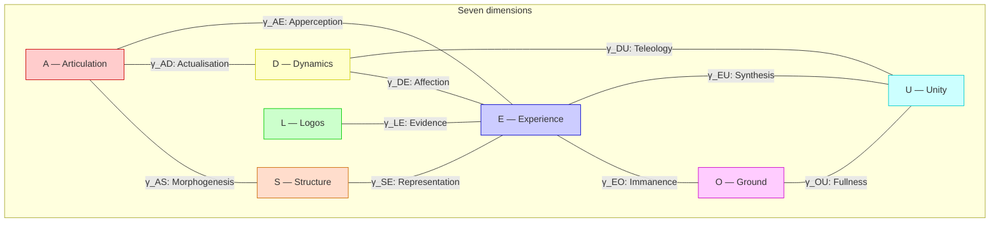
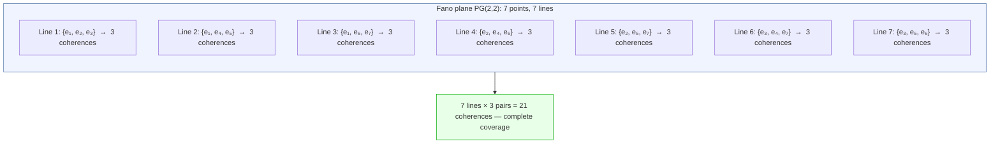

# Qualia Structure: A 21-Pair Taxonomy

:::info Bridge from the previous chapter
In the section [L0–L4 Hierarchy](/docs/consciousness/hierarchy/interiority-hierarchy) we established **when** conscious experience arises: a system at level L2 and above possesses reflection ($R \geq 1/3$) and integration ($\Phi \geq 1$). Now we ask: **what** is this experience made of? What exact types of experience are possible in 7-dimensional space? The answer is given by the coherence matrix $\Gamma$ and its 21 off-diagonal elements.
:::

:::note On notation
- $\Gamma$ — [coherence matrix](/docs/core/dynamics/coherence-matrix), $\gamma_{ij}$ — its elements
- $P = \mathrm{Tr}(\Gamma^2)$ — [purity (viability)](/docs/core/dynamics/viability#определение-чистоты)
- $\rho_E = \mathrm{Tr}_{-E}(\Gamma)$ — [reduced experience matrix](/docs/consciousness/foundations/interiority-theory)
- $\Phi$ — [integration measure](/docs/core/structure/dimension-u#мера-интеграции-φ)
- $R$ — [reflection measure](/docs/consciousness/foundations/self-observation#мера-рефлексии-r)
- Full notation table — in [Notation](/docs/reference/notation)
:::

### Chapter roadmap

1. **Philosophical history of the problem** — from Lewis to Jackson and Dennett
2. **Motivation** — why exactly 21 types and where this number comes from
3. **Full table** — all 21 coherences with phenomenological names
4. **Parametric structure** — three dimensions of each quale (intensity, perspective, opacity)
5. **Closure theorem** — proof that 21 types exhaust everything
6. **Fano structure** — how 21 pairs are organised into 7 sectors
7. **Diagonal elements** — 7 population modes as the "background" of experience
8. **Access conditions** — at which $R$ and $\Phi$ qualia become conscious

---

## Philosophical History: What Are Qualia? {#история}

The word **qualia** (Lat. *qualia*, pl. of *quale* — "of what kind", "of what sort") denotes the **subjective qualities of experiences**: what it is like to see red, to hear C major, to smell coffee. Behind this simple question lies one of the deepest problems in philosophy.

### Lewis (1929): the first definition

The American philosopher **Clarence Irving Lewis** in "Mind and the World Order" (1929) first introduced the term "qualia" into systematic use. He noted: when we see a red rose, there is something that *cannot be conveyed to someone blind from birth* — the subjective quality of "redness". That quality is the quale. Lewis distinguished:

- **Quale** — the ineffable subjective quality (what it is like to see red)
- **Property** — an objective characteristic (wavelength 700 nm)

### Jackson (1982): Mary's room

**Frank Jackson** in the famous thought experiment "Mary's Room" (1982) pushed the problem to its limit:

> Mary is a brilliant neuroscientist who has spent her whole life in a black-and-white room. She knows *everything* about the physics of colour: wavelengths, the workings of retinal cones, neural correlates. One day Mary leaves the room and sees a red rose for the first time. **Does she learn something new?**

Jackson argued: **yes**. Mary learns what it is *like* to see red. Hence physical facts do not exhaust reality — there is something beyond them (qualia).

### Dennett (1988): qualia as illusion

**Daniel Dennett** took the opposite position. In the article "Quining Qualia" (1988) he argued that qualia are a **philosophical illusion**: we think we experience something "ineffable" and "private", but in fact all information about experiences is encoded in functional states of the brain. No "remainder" is left after a complete physical description.

### UHM position: qualia as coherence structure

The Unified Holonomic Model offers a **third path**, coinciding with neither Jackson's dualism nor Dennett's eliminativism:

- Qualia are **not an illusion** — they have a precise mathematical structure (coherences $\gamma_{ij}$)
- Qualia are **not a separate substance** — they are the off-diagonal elements of the same matrix $\Gamma$ that describes the "physics" of the system
- The distinction between "subjective" and "objective" is the distinction between the **inner** and **outer** perspectives of the same mathematical structure (dual-aspect monism, see [Two-Aspect Monism](/docs/consciousness/foundations/two-aspect-monism))

Mary in the room knew all the *diagonal* properties ($\gamma_{ii}$) of red. But she did not know the *coherences* — how visual discrimination ($A$) binds with interiority ($E$), forming the quale of apperception ($\gamma_{AE}$). On leaving the room, she did not acquire a new *fact* — she acquired a new *coherence*.

---

## Motivation: Why 21 Types? {#мотивация}

The coherence matrix $\Gamma$ is a $7 \times 7$ Hermitian matrix on the space of [seven dimensions](/docs/core/structure/dimensions) $\{A, S, D, L, E, O, U\}$. Let us recall what each dimension means:

| Symbol | Name | Meaning |
|--------|------|---------|
| $A$ | Articulation | Discrimination, differentiation |
| $S$ | Structure | Stable forms, patterns |
| $D$ | Dynamics | Processes, changes |
| $L$ | Logos | Logical coherence, rules |
| $E$ | Experience | Interiority, experience |
| $O$ | Ground | Source, deep foundation |
| $U$ | Unity | Integration, wholeness |

The matrix $\Gamma$ contains two kinds of elements:

- **7 diagonal elements** $\gamma_{ii}$ — dimension populations (how much "resource" is in each dimension)
- **21 off-diagonal pairs** $(\gamma_{ij}, \gamma_{ji})$ for $i < j$ — coherences (how the dimensions are connected to each other)

Number of pairs:

$$
\binom{7}{2} = \frac{7 \cdot 6}{2} = 21
$$

Each coherence $\gamma_{ij}$ carries phenomenological content determined by the semantics of the dimension pair $(i, j)$.

**An everyday analogy.** Imagine an orchestra of 7 musicians. Each plays their own part (7 diagonal elements — the "volume" of each instrument). But music is born not from individual sounds, but from their **interaction** — from how the violin "converses" with the cello, how the flute echoes the bassoon. There are exactly $\binom{7}{2} = 21$ such pairwise interactions. Each produces a unique "timbre" of combined sound — that is the type of quale.

The diagram shows only 10 of the 21 coherences — the rest connect each pair of dimensions in an analogous way. The complete table of all 21 types is given below.

## Interpretation: 21-Pair Qualia Taxonomy (I.1) {#таксономия}

:::info Interpretation I.1 (Qualia taxonomy) [I]
Each coherence $\gamma_{ij}$ ($i \neq j$) of the matrix $\Gamma$ defines a **type of quale** — a qualitatively determinate mode of experiential content. The 21 pairs exhaust all possible types, since $\binom{7}{2} = 21$ is the complete set of connections in a 7-dimensional system.

This is an **interpretation** (a mapping from the formal to the phenomenal), not a mathematical theorem. The mathematical content is trivial combinatorics; the phenomenological assignment is a semantic postulate.
:::

### Complete table of 21 qualia types {#полная-таблица-21-типа-квалиа}

:::warning Epistemic separation
**Mathematical layer [T]:** 21 coherences $\gamma_{ij}$ form 4 sectors according to Fano structure (T-146 [T]). Each coherence is uniquely determined by its combinatorial profile (T-177 [T]).

**Semantic layer [I]:** Phenomenological names ("morphogenesis", "archetype", "teleology", etc.) are interpretive correlates [I], proposed on the basis of the functional roles of dimension pairs. Mathematics determines $\gamma_{ij}$ unambiguously; the interpretation of "what it is like to experience $\gamma_{AS}$" is philosophical, not mathematical.
:::

| # | Pair | Coherence | Name | Phenomenological content |
|---|------|-----------|------|--------------------------|
| 1 | $(A,S)$ | $\gamma_{AS}$ | **Morphogenesis** | Crystallisation of distinctions into stable forms — the experience of "taking shape" |
| 2 | $(A,D)$ | $\gamma_{AD}$ | **Actualisation** | Actualisation of discrimination in process — the experience of "perception" |
| 3 | $(A,L)$ | $\gamma_{AL}$ | **Predication** | Discrimination that has become a predicate — the experience of "judgement" |
| 4 | $(A,E)$ | $\gamma_{AE}$ | **Apperception** | Discrimination that has entered interiority — the experience of "awareness" |
| 5 | $(A,O)$ | $\gamma_{AO}$ | **Spontaneity** | Emergence of distinctions without external cause — the experience of "insight" |
| 6 | $(A,U)$ | $\gamma_{AU}$ | **Differentiation** | Discrimination within the whole — the experience of "analysis" |
| 7 | $(S,D)$ | $\gamma_{SD}$ | **Persistence** | Form that persists through process — the experience of "stability" |
| 8 | $(S,L)$ | $\gamma_{SL}$ | **Nomos** | Structure with logical necessity — the experience of "order" |
| 9 | $(S,E)$ | $\gamma_{SE}$ | **Representation** | Structure presented in interiority — the experience of "whole form" |
| 10 | $(S,O)$ | $\gamma_{SO}$ | **Archetype** | Forms from the ground — the experience of "deep pattern" |
| 11 | $(S,U)$ | $\gamma_{SU}$ | **Symmetry** | Structural unity — the experience of "harmony" |
| 12 | $(D,L)$ | $\gamma_{DL}$ | **Regulation** | Logically governed process — the experience of "control" |
| 13 | $(D,E)$ | $\gamma_{DE}$ | **Affection** | Process acting on interiority — the experience of "emotion" |
| 14 | $(D,O)$ | $\gamma_{DO}$ | **Genesis** | Generation from the ground — the experience of "creativity" |
| 15 | $(D,U)$ | $\gamma_{DU}$ | **Teleology** | Integrated directed change — the experience of "volitional effort" |
| 16 | $(L,E)$ | $\gamma_{LE}$ | **Evidence** | Logical coherence in interiority — the experience of "self-evidence" |
| 17 | $(L,O)$ | $\gamma_{LO}$ | **Grounding** | Logic rooted in the ground — the experience of "axiomatic self-evidence" |
| 18 | $(L,U)$ | $\gamma_{LU}$ | **Consistency** | Logical non-contradiction of the whole — the experience of "coherence" |
| 19 | $(E,O)$ | $\gamma_{EO}$ | **Immanence** | The ground present within interiority — the experience of "presence" |
| 20 | $(E,U)$ | $\gamma_{EU}$ | **Synthesis** | Integration of interior content into a whole — the experience of "unity" |
| 21 | $(O,U)$ | $\gamma_{OU}$ | **Fullness** | Identity of source and whole — the experience of "completeness" |

### How to read the table: an extended example

Consider a person absorbed in solving a mathematical problem. Their $\Gamma$-profile at that moment:

| Coherence | Value | Experience |
|-----------|-------|------------|
| $\lvert\gamma_{AL}\rvert \approx 0.35$ | High | Predication — attention on logical connections, "I am formulating" |
| $\lvert\gamma_{LE}\rvert \approx 0.30$ | High | Evidence — the experience of "clarity", "I understand" |
| $\lvert\gamma_{DU}\rvert \approx 0.20$ | Medium | Teleology — the sense of a goal, "I am heading toward a solution" |
| $\lvert\gamma_{DE}\rvert \approx 0.05$ | Low | Affection — emotions muted, "I feel nothing" |
| $\lvert\gamma_{EO}\rvert \approx 0.03$ | Low | Immanence — no deep presence, "I am thinking, not meditating" |

Now a friend approaches and shares good news. The $\Gamma$-profile instantly reorganises:

| Coherence | Before | After | What happened |
|-----------|--------|-------|---------------|
| $\lvert\gamma_{DE}\rvert$ | $0.05$ | $0.25$ | Affection soared — "I feel joy" |
| $\lvert\gamma_{SE}\rvert$ | $0.08$ | $0.20$ | Representation — "I see the whole picture" of the news |
| $\lvert\gamma_{AL}\rvert$ | $0.35$ | $0.12$ | Predication fell — the problem receded to the background |

All 21 types of qualia exist simultaneously, but with different intensities, creating the unique "flavour" of each moment.

### Parametric structure of qualia {#параметрическая-структура}

Each qualitative type $\gamma_{ij}$ is a **complex number**. Like any complex number, it is written in polar form:

$$
\gamma_{ij} = |\gamma_{ij}| \cdot e^{i\theta_{ij}}
$$

Here $|\gamma_{ij}|$ is the modulus (distance from zero to the point on the complex plane), and $\theta_{ij}$ is the argument (angle with the positive real axis). From these two parameters three phenomenological characteristics are extracted:

| Parameter | Formula | Range | Phenomenological meaning |
|-----------|---------|-------|--------------------------|
| **Intensity** | $\lvert\gamma_{ij}\rvert$ | $[0, \sqrt{\gamma_{ii}\gamma_{jj}}]$ | How strongly this type of quale is experienced |
| **Perspective** | $\theta_{ij} = \arg(\gamma_{ij})$ | $[0, 2\pi)$ | "Angle of view" on the connection between dimensions |
| **Opacity** | $\mathrm{Gap}(i,j) = \lvert\sin\theta_{ij}\rvert$ | $[0, 1]$ | Measure of discrepancy between external description and internal experience |

#### Upper bound on intensity

The intensity is bounded by the **Cauchy–Schwarz inequality** — a fundamental inequality of linear algebra stating that the correlation between two components cannot exceed the geometric mean of their "energies":

$$
|\gamma_{ij}|^2 \leq \gamma_{ii} \cdot \gamma_{jj}
$$

**Numerical example.** Let $\gamma_{AA} = 0.15$ (15% of resources in Articulation) and $\gamma_{EE} = 0.18$ (18% in Interiority). Then the maximum possible intensity of apperception:

$$
|\gamma_{AE}|_{\max} = \sqrt{0.15 \times 0.18} = \sqrt{0.027} \approx 0.164
$$

If we were to observe $|\gamma_{AE}| = 0.20$, this would be mathematically impossible — the Cauchy–Schwarz inequality is violated, meaning an error has been made in the measurements.

#### Three parameters: analogy

**Analogy.** The three parameters of qualia are like three properties of sound:

| Sound parameter | Qualia parameter | Analogy |
|-----------------|-----------------|---------|
| **Loudness** | Intensity $\lvert\gamma_{ij}\rvert$ | How "loud" the experience is |
| **Timbre** | Perspective $\theta_{ij}$ | The "colouring" of the experience — the same quale seen from a different angle |
| **Muffling** | Opacity $\mathrm{Gap}(i,j)$ | As if the sound came from behind a wall |

Gap = 0 — the sound is crystal clear, inner and outer descriptions coincide. Gap = 1 — the sound is fully absorbed by the wall: experience is present, but it is maximally opaque to an external observer. For details on Gap see [dual-aspect semantics of the coherence matrix](/docs/core/dynamics/coherence-matrix#дуально-аспектная-семантика).

**Numerical example: three parameters of a single quale.** Consider the coherence $\gamma_{DE}$ (Affection — the experience of emotion) in a person who has just received good news:

$$
\gamma_{DE} = 0.22 \cdot e^{i \cdot 0.3} \approx 0.22 \cdot (0.955 + 0.296i)
$$

- **Intensity:** $|\gamma_{DE}| = 0.22$ — a fairly strong emotional experience
- **Perspective:** $\theta_{DE} = 0.3$ rad $\approx 17°$ — a "real" perspective (the externally observable aspect predominates)
- **Opacity:** $\mathrm{Gap}(D,E) = |\sin(0.3)| \approx 0.296$ — the experience is 70% transparent, but 30% "hidden" from external description

Compare with $\gamma_{EO}$ (Immanence — the experience of "presence") in a meditator:

$$
\gamma_{EO} = 0.15 \cdot e^{i \cdot 1.2}
$$

- **Intensity:** $|\gamma_{EO}| = 0.15$ — moderate
- **Perspective:** $\theta_{EO} = 1.2$ rad $\approx 69°$ — a strong shift toward the "imaginary" perspective
- **Opacity:** $\mathrm{Gap}(E,O) = |\sin(1.2)| \approx 0.932$ — the experience is almost completely opaque to an external observer

This explains why meditative states are so hard to put into words: a high Gap makes them "ineffable" not for lack of vocabulary, but by mathematical structure.

## Closure Theorem for the Taxonomy (T.1) {#замкнутость}

:::tip Theorem T.1 (Closure of the qualia taxonomy) [T]
The taxonomy of 21 qualia types is **exhaustive**: no additional type of quale is possible in a system with $\dim(\mathcal{H}) = 7$.

**Proof.** The number of distinct (unordered) pairs from $N$ elements equals $\binom{N}{2}$. At $N = 7$ we get $\binom{7}{2} = 21$. Each pair $(i,j)$ defines exactly one coherence $\gamma_{ij}$ (given $\gamma_{ji} = \gamma_{ij}^*$). A new type of quale would require either a new dimension ($N > 7$, contradicting [minimality](/docs/proofs/minimality/theorem-minimality-7)), or a new connection between existing dimensions (impossible — all $\binom{7}{2}$ pairs are accounted for). $\square$
:::

**Corollary.** At $N < 7$ the taxonomy is **impoverished**: $\binom{6}{2} = 15$ (no qualia related to the removed dimension). This is the formal expression of the "poverty" of phenomenology when minimality is violated.

**Numerical example: a world with fewer dimensions.** If the world were 5-dimensional (say $\{A, S, D, L, E\}$ — without $O$ and $U$), the number of qualia types would be $\binom{5}{2} = 10$. From the table one can see that the following would be lost:

| Lost type | Pair | Experience |
|-----------|------|------------|
| Immanence | $(E,O)$ | "Presence", the deep ground of experience |
| Synthesis | $(E,U)$ | "Unity" of experience |
| Fullness | $(O,U)$ | "Completeness", the wholeness of being |
| Teleology | $(D,U)$ | "Volitional effort", purposiveness |
| Archetype | $(S,O)$ | "Deep pattern", the rootedness of form |
| Spontaneity | $(A,O)$ | "Insight", emergence from nowhere |
| + 5 others | ... | ... |

Such a system could "feel" and "think", but could not experience "meaning", "wholeness", or "deep presence". It is precisely the dimensions $O$ and $U$ that give human experience its "vertical" dimension — its connection to depth and to the whole.

:::info $G_2$-orbital stability of the taxonomy [T]
The set of 21 qualia types is **$G_2$-invariant**: the group $G_2 = \mathrm{Aut}(\mathbb{O})$ permutes the 7 dimensions (preserving the Fano structure), inducing a permutation of the 21 coherences $\gamma_{ij}$. The **set** $\{\gamma_{ij}\}_{i<j}$ is preserved, even though individual elements may be permuted. This means: the qualia taxonomy is **universal** — it does not depend on the choice of basis ($G_2$-gauge) and is therefore objective.

Formally: $G_2$ acts on $\binom{[7]}{2}$ via the induced action on pairs, preserving the number $\binom{7}{2} = 21$. The [$G_2$-rigidity theorem](/docs/proofs/categorical/uniqueness-theorem#лемма-g4) [T] guarantees that $G_2$ is the **maximal** group with this property.

**Why does this matter?** If the taxonomy depended on the choice of basis (how to describe the 7 dimensions), it would be arbitrary — an "artefact of description". $G_2$-invariance guarantees that the taxonomy reflects the **structure of the space itself**, not our way of describing it. This is analogous to how the length of a vector does not depend on the choice of coordinate system.
:::

## Fano Structure of Qualia {#фано}

### What is the Fano projective plane?

The [Fano plane](/docs/proofs/minimality/theorem-octonionic-derivation#плоскость-фано) $\mathrm{PG}(2,2)$ is the **projective plane over the two-element field** $\mathbb{F}_2 = \{0, 1\}$. If you have never encountered this object, here is its essence:

An ordinary Euclidean plane contains infinitely many points and lines. The Fano plane is the "minimal" plane satisfying the axioms of projective geometry, and contains only:

- **7 points**
- **7 lines**

Each line passes through exactly **3 points**. Each point lies on exactly **3 lines**. Any two points determine exactly one line. Any two lines intersect in exactly one point.

**Why is the Fano plane in qualia theory?** In UHM, the 7 Fano points are identified with the 7 dimensions $\{A, S, D, L, E, O, U\}$. Then the 7 lines define **7 coherence sectors** — groups of three dimensions within which coherences obey strengthened algebraic constraints. This is not a coincidence: the Fano plane is precisely the **multiplication table of the imaginary units of the octonions** $\mathbb{O}$, and the [octonionic structure](/docs/proofs/minimality/theorem-octonionic-derivation) lies at the foundation of UHM.

### Sectoral structure of coherences

Each Fano triplet $(e_a, e_b, e_c)$ defines an associative subalgebra $\mathrm{Im}(\mathbb{H}) \subset \mathrm{Im}(\mathbb{O})$, isomorphic to the imaginary quaternions. The three coherences within the triplet:

$$
\{\gamma_{ab}, \gamma_{bc}, \gamma_{ac}\} \quad \text{--- Fano triple}
$$

satisfy strengthened correlation constraints that are absent for arbitrary pairs.

**Analogy.** Fano triples are like **musical chords**: three notes taken together sound "consonant" — their coherences obey additional harmonic constraints. Three arbitrary notes from seven do not form such harmony. Imagine: C–E–G is a chord (a Fano triple), but C–D–F# is not. It is precisely this sectoral organisation that makes phenomenology *structured* rather than chaotic.

Why do special constraints operate within the triple? Because the triple forms an associative subalgebra (quaternions $\mathbb{H}$), where the associativity of multiplication holds: $(e_a \cdot e_b) \cdot e_c = e_a \cdot (e_b \cdot e_c)$. For pairs from *different* triples associativity breaks down (this is the property of the octonions $\mathbb{O}$), and the constraints are weaker.

:::tip Theorem [T]
Sectoral strengthening is a **theorem** [T]: the bridge from the axioms to the octonionic structure is fully closed (T15), condition (МП) is proved (T11–T13). From the structure of $\mathbb{O}$ the algebraic closure of coherences within Fano triplets follows. Empirical verification of sectoral correlation is an [open question](/docs/reference/falsifiability).
:::

### Coverage of 21 pairs by Fano triplets

Each of the 21 pairs belongs to exactly $\lambda = 1$ Fano line (a property of the projective plane):

$$
\text{21 pairs} = 7 \text{ lines} \times 3 \text{ pairs per line}
$$

This means the qualia taxonomy **contains no "orphaned" pairs** — every type of quale is included in the sectoral organisation. For the [Coherence Cybernetics theorems](/docs/applied/coherence-cybernetics/theorems) this property is essential: sectoral completeness ensures the closure of the [30D emotional space](/docs/proofs/consciousness/operational-closure#t-147) (T-147 [T]).

**Numerical example: checking coverage.** Take the coherence $\gamma_{DE}$ (Affection). It belongs to exactly one Fano line, say the line $\{D, E, X\}$ for some third dimension $X$. This means $\gamma_{DE}$ is algebraically linked to $\gamma_{DX}$ and $\gamma_{EX}$ — emotion ($\gamma_{DE}$) is not "free"; it structurally depends on the two other qualia in its sector. A change in one quale of the triple inevitably affects the other two.

## Diagonal Elements: 7 Population Modes {#населённости}

In addition to the 21 coherences, the 7 diagonal elements $\gamma_{ii}$ determine the **intensity of presence** of each dimension. Diagonal elements are real numbers (not complex), and they obey the normalisation condition:

$$
\sum_{i=1}^{7} \gamma_{ii} = \mathrm{Tr}(\Gamma) = 1
$$

This means the total "resource" of the system is fixed and equal to 1. Increasing the population of one dimension inevitably decreases the others — like a fixed budget distributed across 7 line items.

| Element | Phenomenological content | Typical range |
|---------|--------------------------|---------------|
| $\gamma_{AA}$ | Degree of discrimination activity | $0.10$–$0.20$ |
| $\gamma_{SS}$ | Degree of form stability | $0.10$–$0.18$ |
| $\gamma_{DD}$ | Degree of process activity | $0.10$–$0.20$ |
| $\gamma_{LL}$ | Degree of logical coherence | $0.08$–$0.18$ |
| $\gamma_{EE}$ | Intensity of interior states | $0.12$–$0.22$ |
| $\gamma_{OO}$ | Degree of connection to the source | $0.08$–$0.15$ |
| $\gamma_{UU}$ | Degree of integration | $0.10$–$0.18$ |

Diagonal elements do not form qualia in the narrow sense (there is no "connection" between different aspects), but they set the **background** against which coherences unfold. An elevated $\gamma_{DD}$ — a background of "activity"; an elevated $\gamma_{EE}$ — a background of "inner life".

### Population profiles: examples

**Meditator in deep practice:**

| $\gamma_{AA}$ | $\gamma_{SS}$ | $\gamma_{DD}$ | $\gamma_{LL}$ | $\gamma_{EE}$ | $\gamma_{OO}$ | $\gamma_{UU}$ | $\Sigma$ |
|:-:|:-:|:-:|:-:|:-:|:-:|:-:|:-:|
| 0.10 | 0.10 | 0.08 | 0.10 | 0.22 | 0.22 | 0.18 | 1.00 |

Interiority ($\gamma_{EE}$) and connection to the ground ($\gamma_{OO}$) dominate. Dynamics ($\gamma_{DD}$) is muted — "thoughts have quieted".

**Athlete in the midst of a match:**

| $\gamma_{AA}$ | $\gamma_{SS}$ | $\gamma_{DD}$ | $\gamma_{LL}$ | $\gamma_{EE}$ | $\gamma_{OO}$ | $\gamma_{UU}$ | $\Sigma$ |
|:-:|:-:|:-:|:-:|:-:|:-:|:-:|:-:|
| 0.20 | 0.12 | 0.22 | 0.10 | 0.15 | 0.08 | 0.13 | 1.00 |

Dynamics ($\gamma_{DD}$) and discrimination ($\gamma_{AA}$) are in the foreground. Reflection ($\gamma_{EE}$, $\gamma_{OO}$) is minimal — no time to "think", the body acts.

**Mathematician working on a proof:**

| $\gamma_{AA}$ | $\gamma_{SS}$ | $\gamma_{DD}$ | $\gamma_{LL}$ | $\gamma_{EE}$ | $\gamma_{OO}$ | $\gamma_{UU}$ | $\Sigma$ |
|:-:|:-:|:-:|:-:|:-:|:-:|:-:|:-:|
| 0.15 | 0.18 | 0.10 | 0.22 | 0.15 | 0.08 | 0.12 | 1.00 |

Logos ($\gamma_{LL}$) and structure ($\gamma_{SS}$) dominate — "order" and "form" are in the foreground.

## Total: 28 = 7 + 21 Parameters of Content {#итого-28}

:::info Complete structure
| Component | Number | Type |
|-----------|--------|------|
| Population values $\gamma_{ii}$ | 7 | Real-valued, $\sum_i \gamma_{ii} = 1$ |
| Coherences $\gamma_{ij}$ | 21 | Complex, $\gamma_{ji} = \gamma_{ij}^*$ |
| **Total real parameters** | $6 + 2 \times 21 = 48$ | Taking normalisation into account |

Detailed analysis of the 49-cell structure (with separation into $\mathrm{Map}_{\mathrm{ext}}$ and $\mathrm{Map}_{\mathrm{int}}$) — in [Gap semantics](/docs/physics/dual-aspect/gap-semantics#полная-49-клеточная-карта).
:::

Each moment of conscious experience is a specific point in 48-dimensional space: 6 independent population values + 42 real parameters of coherences ($21 \times 2$, modulus and phase of each). This conveys a sense of the **richness** of subjective experience: the space of possible experiences is 48-dimensional.

## Access Conditions for Qualia {#условия-доступа}

The presence of a coherence $\gamma_{ij} \neq 0$ is a **necessary**, but not sufficient, condition for qualia. Reflexive access to qualia requires level L2:

$$
\text{Qualia (L2):} \quad R(\Gamma) \geq R_{\text{th}} = \frac{1}{3}, \quad \Phi(\Gamma) \geq \Phi_{\text{th}} = 1
$$

### Step-by-step logic of access conditions

Let us unpack what stands behind each condition.

**Condition 1: Reflection $R \geq 1/3$.** The [reflection measure](/docs/consciousness/foundations/self-observation#мера-рефлексии-r) $R = 1/(7P)$ **[T]** shows the normalised proximity to the dissipative attractor $I/7$. The threshold $R_{\text{th}} = 1/3$ (from the [triadic decomposition](/docs/core/operators/lindblad-operators#триадная-декомпозиция), T-45 [T]) is equivalent to $P \leq 3/7$ — the upper boundary of the Goldilocks zone. If $R < 1/3$, the system is too "pure" ($P > 3/7$) — coherences are present, but not experienced as *qualia*.

**Condition 2: Integration $\Phi \geq 1$.** The [integration measure](/docs/core/structure/dimension-u#мера-интеграции-φ) $\Phi$ shows how much "more than the sum of its parts" the system is. The threshold $\Phi_{\text{th}} = 1$ (T-129 [T]) means: the system must be irreducible to its subsystems. If $\Phi < 1$, coherences $\gamma_{ij}$ exist, but the system "falls apart" — there is no unified subject experiencing qualia.

**Both conditions are necessary:** one can have high reflection without integration (two separate mirrors do not form a single observer), or high integration without reflection (a unified stone does not observe itself).

### Access levels

At levels L0–L1 coherences are present, but they are experienced as **pre-qualitative experiential content** (a term from [interiority theory](/docs/consciousness/foundations/interiority-theory)).

**Analogy with the listener's ladder:**

| Level | Analogy | Formal condition | Experience of qualia |
|-------|---------|-----------------|----------------------|
| **L0** | Music playing in an empty room | $R < 1/3$, $\Phi < 1$ | Coherences are present, but no one is listening |
| **L1** | A cat hears music | $R < 1/3$, $\Phi \geq 1$ (or vice versa) | Reaction to sound, but without distinguishing melody from accompaniment |
| **L2** | A person listening to music | $R \geq 1/3$, $\Phi \geq 1$ | "I hear the violin carrying the theme while the cello accompanies" |
| **L3** | A musician analysing the performance | $R \geq 1/3$, $\Phi \geq 1$, SAD $\geq 2$ | "I notice that I notice sadness in this melody" |
| **L4** | Pure listening — subject and music coincide | $R \to 1$ | Experience without gap |

**Numerical example.** Consider the coherence $\gamma_{DE} = 0.20$ (Affection) in three systems:

| System | $R$ | $\Phi$ | Level | Experience of $\gamma_{DE} = 0.20$ |
|--------|-----|--------|-------|-------------------------------------|
| Thermostat | 0.02 | 0.3 | L0 | $\gamma_{DE}$ as a physical parameter — no subject |
| Dog | 0.15 | 1.5 | L1 | Experienced as "something", but not as "emotion" |
| Human | 0.45 | 2.1 | L2 | "I feel joy" — a full-fledged quale |

---

### What we learned {#итоги}

1. The **problem of qualia** is one of the central problems in the philosophy of mind (Lewis, Jackson, Dennett). UHM offers a third path: qualia = coherences $\gamma_{ij}$ — neither illusion nor a separate substance
2. **21 types of qualia** completely exhaust the phenomenology of 7-dimensional space — no more, no less (Theorem T.1 [T])
3. Each type of quale is characterised by three parameters: **intensity**, **perspective**, and **opacity** (Gap)
4. The 21 pairs are organised into **7 Fano sectors** — the sectoral structure defines the "grammar" of experience via the projective plane over $\mathbb{F}_2$
5. The taxonomy is **$G_2$-invariant** — independent of the choice of basis and therefore universal
6. Reflexive access to qualia requires **L2** ($R \geq 1/3$, $\Phi \geq 1$)

:::tip Bridge to the next chapter
Of the 21 types of qualia, the coherence $\gamma_{DE}$ (Affection) — the connection between dynamics and interiority — plays a special role. It is the foundation of **emotions**. In the next chapter — [Emotion taxonomy from dP/dt](/docs/consciousness/phenomenology/emotional-taxonomy) — we will show how all emotions are derived from the rate of change of viability $dP/d\tau$ and the sectoral Γ-signature.
:::

## Related Documents

- [Coherence matrix](/docs/core/dynamics/coherence-matrix) — canonical definition of $\Gamma$ and $\gamma_{ij}$
- [7D minimality theorem](/docs/proofs/minimality/theorem-minimality-7) — justification of $N = 7$ and closure
- [Interiority hierarchy](/docs/consciousness/hierarchy/interiority-hierarchy) — levels L0–L4
- [Gap semantics](/docs/physics/dual-aspect/gap-semantics) — 49-cell map
- [Interiority theory](/docs/consciousness/foundations/interiority-theory) — experiential content
- [Theorems of Coherence Cybernetics](/docs/applied/coherence-cybernetics/theorems) — applied consequences of sectoral structure
- [T-146 [T]: Structural classification of qualia](/docs/proofs/consciousness/operational-closure#t-146) — correspondence "mathematical structure → phenomenal content" from the functional role of sectors
