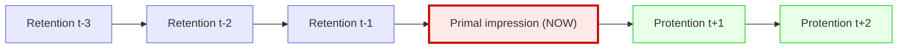

# Subjective Time

:::info Bridge from the previous chapter
The [emotion taxonomy](/docs/consciousness/phenomenology/emotional-taxonomy) considers how changes in a system may acquire experiential significance. Temporality adds another question: how are what has just happened, what is happening and what is expected connected in experience? UHM offers coordinates for formulating this question. Connecting those coordinates to reports of duration requires an observation model and experimental validation.
:::

:::note Notation and status
- $\Gamma\in\mathcal D(\mathbb C^7)$ is a positive semidefinite, unit-trace [coherence matrix](/docs/core/dynamics/coherence-matrix) in a declared semantic frame; $\gamma_{OE}$ is its O-E entry and $\gamma_{OO},\gamma_{EE}$ are populations.
- $t$ denotes time measured by a calibrated physical clock; $n$ denotes a reading of an independently specified model clock.
- $\tau_{\mathrm{model}}$ denotes an accumulated model quantity. Its identification with a particular duration judgment is a hypothesis.
- [D] marks a definition, [C] a consequence under stated assumptions, and [H/I] an empirical hypothesis or philosophical interpretation.
:::

### Chapter roadmap

1. Philosophical history and the structure of temporal experience
2. Distinct observables: duration, passage of time and temporal discrimination
3. The O-E statistic: its domain and exact bounds
4. Conditional clock models and temporal dilation
5. Danger, flow, boredom and meditation as separate empirical cases
6. A temporal overlap window and its limits as a memory measure
7. Connections between physical, geometric and categorical descriptions

---

## Philosophical History: What Is Time? {#история}

### Augustine (354–430): the paradox of time

**Saint Augustine** in the "Confessions" (Book XI) formulated one of the most famous paradoxes:

> "What then is time? If no one asks me, I know; if I wish to explain it to one that asks, I know not."

Augustine noted a fundamental difficulty: **the past no longer exists**, **the future does not yet exist**, and the **present** is merely a fleeting point without extension. Where, then, does time exist? His answer: time exists **in the soul** — as memory (the past), perception (the present), and expectation (the future). Time is not an objective river in which we swim, but a **structure of our consciousness**.

### Bergson (1889): duration vs spatial time

**Henri Bergson** in "Time and Free Will" (1889) drew a radical distinction:

- **Spatial time** (temps) — the time of physics, measured by clocks. It is homogeneous: every second is equal to every other. It can be decomposed into points, like space.
- **Duration** (durée) — the time of consciousness, the time of experience. It is non-homogeneous: a minute of waiting is not equal to a minute of joy. It cannot be decomposed into points — it is a continuous flow where the past penetrates the present.

Bergson insisted: genuine reality is durée, not temps. Physical time is a **spatial metaphor** imposed on duration. When we say "five minutes have passed", we are already spatialising time, slicing it into pieces.

### Husserl (1905): retention, protention, primal impression

**Edmund Husserl** in the lectures "On the Phenomenology of the Internal Time-Consciousness" (1905) gave the most subtle analysis. Every moment of consciousness contains three layers:

- **Primal impression** (Urimpression) — the experience of "now", the fleeting point of the present
- **Retention** — the "just-passed", still held in consciousness (not a recollection, but the "tail" of the present)
- **Protention** — the "about-to-come", anticipation of the immediate future

Retention is not recollection. When you hear a melody, the previous note is not "remembered" — it still **sounds** in consciousness, gradually fading. It is precisely thanks to retention that you hear a *melody*, not separate sounds.

### UHM position: distinct questions within one model

These accounts motivate three different tasks: representing remembered and anticipated content, explaining variation in duration judgments, and modelling the integration of successive events. A state trajectory, a history-dependent readout and a memory mechanism can make these tasks precise. Their philosophical interpretations remain distinct; a single coherence entry does not establish equivalence with Augustine, Bergson or Husserl.

## Motivation: Clocks and Temporal Judgments {#мотивация}

The [canonical construction of emergent time](/docs/core/operators/emergent-time) distinguishes a chosen clock, its correlations with a system, and calibration. The O basis axis in $\mathbb C^7$ does not supply a tensor clock or a physical time scale by itself.

For subjective temporality, the observable must also be specified:

| Observable | Example of a measurement | What is being assessed |
|---|---|---|
| Prospective duration judgment | Estimate an interval after being told to attend to its duration | Timing under an explicit instruction |
| Retrospective duration judgment | Estimate an interval without a prior timing instruction | Reconstruction after the event |
| Passage-of-time judgment | Report whether time seemed to pass quickly or slowly | A rating of temporal experience |
| Temporal discrimination | Distinguish stimuli separated by different short intervals | Resolution or sensitivity in a specified task |

The richness of a moment and the impression that an afternoon passed quickly can therefore coexist without contradiction. They become predictions of a model only after their measurement procedures are fixed. Equating all four observables with one scalar would be an additional, restrictive hypothesis.

## Definition of the O-E Tempo Statistic (D.1) {#субъективный-темп}

:::tip Definition D.1 [D]
In the declared semantic frame, on the domain $\gamma_{OO}>0$, retain the candidate tempo statistic

$$
\mathcal T(\Gamma):=\frac{|\gamma_{OE}|}{\gamma_{OO}}.
$$

This dimensionless ratio measures an off-diagonal entry relative to one population. Calling it a rate of subjective time requires a separate empirical bridge. Neither the population nor the coherence is already a measured tick frequency or quantity of experience.
:::

### Exact domain and bound [C]

Write $a=\gamma_{OO}$, $c=\gamma_{EE}$ and $b=\gamma_{OE}$. Positivity of the O-E principal minor and unit trace give

$$
|b|^2\le ac,\qquad a+c\le1,\qquad
0\le\mathcal T\le\sqrt{\frac ca}\le\sqrt{\frac{1-a}{a}}.
$$

Thus $\mathcal T$ has **no universal upper bound of one**. For the valid pure state

$$
|\psi\rangle=\sqrt{0.01}|O\rangle+\sqrt{0.99}|E\rangle,
\qquad \Gamma=|\psi\rangle\langle\psi|,
\qquad \mathcal T=\sqrt{99},
$$

the ratio is already approximately $9.95$. At $a=0$, positivity forces $b=0$, and the quotient is undefined. A population floor $a\ge\delta>0$ bounds it by $\sqrt{(1-\delta)/\delta}$, for $\delta\le1$. Near a small population, uncertainty in the denominator must be propagated.

If a normalized coherence is wanted, one can instead define $q_{OE}=|b|/\sqrt{ac}\in[0,1]$ when $ac>0$. This is a different statistic, also without a derived phenomenological interpretation. Declaring either statistic does not identify it from data: an observation procedure must distinguish states with different proposed rates, or report the remaining ambiguity.

## Temporal Dilation (C.1) {#дилатация}

### A calibrated rate model

Specify a nonnegative, integrable, dimensionless rate $q_\theta(t)$, computed from the observed state and any explicitly admitted context or history. Define

$$
\tau_{\mathrm{model}}(t)-\tau_{\mathrm{model}}(t_0)
:=\int_{t_0}^{t}q_\theta(s)\,ds.
$$

The accumulated quantity is nondecreasing [C]. It is strictly increasing exactly when the integral over every positive-length time interval is positive. Whether it predicts a specified duration judgment is [H/I]; a report model, calibration data and uncertainty remain necessary. A zero rate does not establish absence of experience.

One possible choice is $q_\theta=\mathcal T/\mathcal T_{\mathrm{ref}}$, with a fixed positive reference and a population floor. For a constant rate over an interval this gives

$$
\Delta\tau_{\mathrm{model}}
=\Delta t\,\frac{\mathcal T}{\mathcal T_{\mathrm{ref}}}.
$$

For example, $\Delta t=3$ seconds, $\mathcal T=0.8$ and $\mathcal T_{\mathrm{ref}}=0.5$ give $4.8$ model seconds. This is an illustration of the chosen rate law, not a measurement of danger, meditation or additional time available for action. Additivity itself must be tested if this model is used for retrospective judgments.

### What Page–Wootters supplies

For an independently supplied tensor product $\mathcal H_C\otimes\mathcal H_S$, a joint density operator $\Gamma_{CS}$ and an orthogonal clock reading $|n\rangle_C$, set

$$
\Pi_n=|n\rangle\langle n|_C\otimes I_S,\qquad
p_n=\operatorname{Tr}(\Pi_n\Gamma_{CS}),\qquad
\rho_S(n)=\frac{\operatorname{Tr}_C(\Pi_n\Gamma_{CS}\Pi_n)}{p_n},
\quad p_n>0.
$$

This is a well-defined conditional density operator [C]. A Page–Wootters **dynamical** result requires further data: a clock Hamiltonian, a compatible system/history construction and a support constraint for the total Hamiltonian. Mere stationarity of a joint mixed state is insufficient. The exact assumptions are given in [emergent time](/docs/core/operators/emergent-time#page-wootters).

The O axis of a seven-dimensional state is not the factor $\mathcal H_C$. A lift to a joint state and a readout back to $\gamma_{OE}$ must be supplied if the constructions are to be connected. Conditional quantum dynamics alone does not yield the rate $q_\theta$ or a law of temporal experience.

## Danger and Time Slowing {#опасность}

A report that an event seemed unusually long raises at least two distinct questions: whether its duration was later overestimated, and whether finer temporal distinctions were possible during it. In a controlled free-fall study, participants retrospectively estimated their own fall as longer than other people’s falls, while the tested visual discrimination did not show improved temporal resolution. This result applies to that protocol; it does not determine every effect of danger. [Stetson, Fiesta and Eagleman (2007)](https://doi.org/10.1371/journal.pone.0001295).

A UHM hypothesis can connect independently estimated state features to these separate outcomes. It must specify the direction and size of the proposed effect before testing. No measured O-E profile has been established here. Greater $\mathcal T$ by definition does not imply photographic memory, impaired reasoning, or additional physical time to react.

## Flow States (Flow) {#flow}

Flow is discussed here as absorption in an activity, with attention directed toward its unfolding. Its temporal description should distinguish involvement, awareness of passing time and later estimation of duration. An absorbing musical performance can illustrate those distinctions without requiring every performer to report the same combination.

A candidate UHM model [H/I] could test whether action–experience coupling, attention and memory jointly predict those reports. Assignments to $\gamma_{DE}$, $\gamma_{AE}$ or $\gamma_{LL}$ require a fixed observation procedure and valid full density matrices. Independent entries with invented “typical values” are not an empirical profile. Even $\mathrm{Gap}(D,E)\approx0$, where that quantity is defined, does not by itself diagnose flow or its temporal character.

The constructive question is which measured feature predicts which judgment after task difficulty, instruction and recall conditions are controlled. A distinction between online processing and later reconstruction makes that question testable; it does not predetermine their signs.

## Boredom {#скука}

Boredom provides a useful contrast between insufficient engagement and explicit attention to waiting. These are candidate explanatory variables, not synonymous states of a single matrix entry. A model can test the hypothesis that monitoring elapsed time changes passage-of-time ratings even when engagement is low [H/I].

This hypothesis must use the same definitions and calibration in engaging and boring conditions. Adding a new explanation after every reversed effect would prevent falsification. In particular, a low value of $\mathcal T$ cannot be assigned both “fast” and “slow” passage without an independently specified contextual model.

No theorem here establishes boredom only above $L2$, or excludes it in a particular species. The canonical $R=1/(7P)$ and reconstruction score $R_M$ are [distinct diagnostics](/docs/consciousness/foundations/self-observation#формы-r); neither becomes a validated boredom criterion by choosing a threshold.

## Meditation and Temporal Perception {#медитация}

Meditative practices offer ways of varying attention, response to distraction and observation of ongoing experience. Their temporal effects require the same distinctions between observables as other tasks. They do not acquire a unique $\Gamma$ profile merely from a practice name.

### Concentration (shamatha)

Practices described as concentration or calm abiding can motivate an experimental comparison of sustained attention with a matched control condition. A proposed relation between an attention readout, O-E coherence and time judgments is [H/I]. The report “time disappeared” is a report about experience; it does not imply a stationary full state $\Gamma$, a stopped physical clock, or loss of experience.

### Insight (vipassanā)

Practices described as insight or observation of changing experience motivate a different question: can the system improve discrimination of its own changing processes? A specified self-model $M$, its reconstruction error and the temporal task provide possible operational variables. An increase in $R_M$ would concern that model and tested domain. It does not follow from increasing canonical $R$, and a threshold $R_M\ge1/3$ has not been established as a necessary condition for meditation. See [self-observation](/docs/consciousness/foundations/self-observation).

:::info An empirical distinction
In two studies of a mindfulness exercise, duration judgments shifted in opposite directions at seconds and minutes scales, while participants reported faster passage of time relative to the control exercise. This supports measuring those outcomes separately; it supplies no numerical calibration of UHM coherences and does not cover all contemplative traditions. [Droit-Volet et al. (2019)](https://doi.org/10.1371/journal.pone.0223567).
:::

The philosophical significance can still be substantial: attention to change, reduced preoccupation with anticipation and a different relation to one's own experience are questions worth investigating. Their relation to liberation, impermanence or spiritual practice is discussed in [the comparative synthesis](/docs/consciousness/ethics-meaning/spiritual-synthesis), with traditions and empirical claims kept explicit.

## Temporal Memory Window {#окно-памяти}

First specify an experience-related state readout $\rho_E(t)=\Lambda_E(\Gamma(t))$. Here $\Lambda_E:\mathcal D(\mathbb C^7)\to\mathcal D(\mathcal H_E)$ is supplied model data; if it is a quantum channel, it must be CPTP. A partial trace is available only after a genuine tensor factorization or extension has been given. An E basis axis alone does not define $\operatorname{Tr}_{-E}\Gamma$.

:::tip Definition D.2 (Temporal overlap window) [D]
For a supplied finite history $[t-H,t]$, $H>0$, and a threshold $0<\theta<1$, define

$$
k_E(t,s):=\frac{\operatorname{Tr}(\rho_E(t)\rho_E(s))}
{\sqrt{\operatorname{Tr}(\rho_E(t)^2)\operatorname{Tr}(\rho_E(s)^2)}},
\qquad
T_{\mathrm{mem}}^{(\theta,H)}(t)
:=\inf\{u\in(0,H]:k_E(t,t-u)<\theta\}.
$$

In finite dimension the denominator is positive, $0\le k_E\le1$ by Hilbert–Schmidt Cauchy–Schwarz, and $k_E(t,t)=1$. Use $\inf\varnothing=+\infty$ as a **no-crossing flag within the observed horizon**, not as evidence of infinite memory. This retains the historical symbol $T_{\mathrm{mem}}$ for a specified overlap proxy.
:::

Normalization avoids confusing low purity with immediate decorrelation. Nevertheless, the overlap is a state-similarity statistic, not automatically a centered stochastic autocorrelation or a measure of retained information. A constant maximally mixed readout has $k_E=1$ at every delay even if it carries no information about past inputs. Recurrences can also restore overlap after a first crossing.

To measure memory, independently vary an encoded past input and test what can be recovered at each later delay, with a declared decoder, intervening inputs and error criterion. That experiment can ground a history-dependent model of retention. It gives substantive content to the connection with [attention and memory](/docs/consciousness/states/attention-memory#память) and the History component of [interiority theory](/docs/consciousness/foundations/interiority-theory), without identifying Husserlian retention with one overlap threshold.

A numerical “present window” in milliseconds also needs a calibrated time scale and an integration task. Dimensionless populations cannot derive a universal 300 ms interval. In particular, $\gamma_{OO}=1$ forces all other populations and O-E coherence to vanish; combining it with $|\gamma_{OE}|=0.3$ violates positivity and unit trace.

## Connection to Physical Time {#связь-с-физическим}

The canonical [emergent-time chapter](/docs/core/operators/emergent-time) no longer identifies four temporal constructions without further assumptions:

| Construction | Supplied structure and scope |
|---|---|
| Page–Wootters | A tensor clock, joint state, reading instrument and compatible dynamical constraint |
| Information geometry | Bures length along a chosen path; it is zero on a stationary path and is not itself a physical clock |
| Categorical history | Composable transitions; durations and a clock interpretation require additional data |
| Terminal object or stratification | A structural relation that alone specifies no rate or sequence of clock readings |

Mappings between specified descriptions may be proved under explicit assumptions. Their existence does not identify clock calibration, report statistics and phenomenal duration. A physical trajectory together with observable history, calibrated readouts and a tested report model provides a coherent route for investigating their connection.

---

### What we established {#итоги}

1. The O-E tempo statistic has a precise domain and a population-dependent bound; its temporal interpretation remains a hypothesis.
2. A supplied nonnegative rate defines an accumulated model duration. Connecting that duration to a report requires calibration and validation.
3. Page–Wootters conditions a supplied clock–system state; the O axis alone does not construct such a clock.
4. Danger, flow, boredom and meditation require distinct measurements of duration, passage of time and discrimination.
5. An overlap window is well defined under an explicit readout, but memory requires evidence about recoverable past information.

:::tip Bridge to the next chapter
Temporal experience concerns how events are retained, encountered and anticipated. [Intentionality](/docs/consciousness/phenomenology/intentionality) takes up the related question of how experience is directed toward an object, with its own formal definitions and interpretive bridges.
:::

## Related Documents

- [Ground (O)](/docs/core/structure/dimension-o) — the semantic role underlying the O coordinate
- [Emergent time](/docs/core/operators/emergent-time) — canonical clock constructions and their assumptions
- [Coherence matrix](/docs/core/dynamics/coherence-matrix) — populations, positivity and coherences
- [Self-observation](/docs/consciousness/foundations/self-observation) — distinct state and reconstruction diagnostics
- [Interiority theory](/docs/consciousness/foundations/interiority-theory) — experience-related readouts and history
- [Attention and memory](/docs/consciousness/states/attention-memory) — retention and recoverable information
- [Spiritual traditions and UHM](/docs/consciousness/ethics-meaning/spiritual-synthesis) — comparative interpretation and its limits
