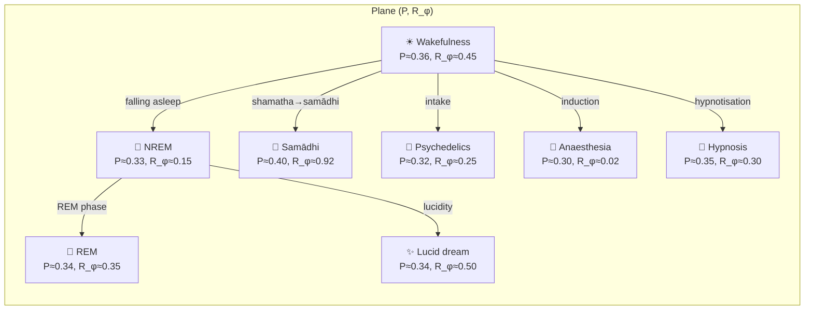
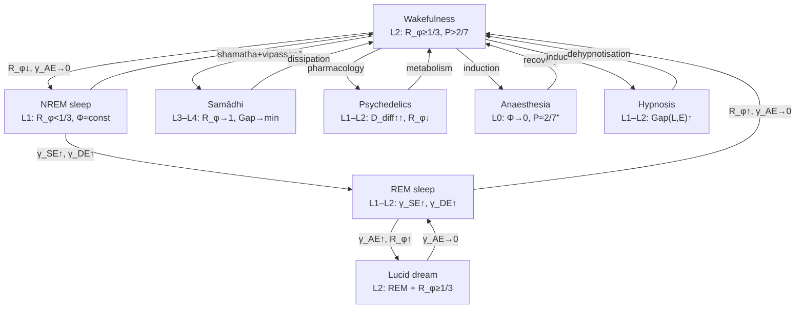

# Altered States of Consciousness

:::info Bridge from the previous chapter
In the section "Structure of Experience" we described *what* conscious experience is made of: [21 types of qualia](/docs/consciousness/phenomenology/qualia-structure), [emotions](/docs/consciousness/phenomenology/emotional-taxonomy), [subjective time](/docs/consciousness/phenomenology/temporal-consciousness), [intentionality](/docs/consciousness/phenomenology/intentionality). All these phenomena are determined by the current state of the matrix $\Gamma$. But $\Gamma$ does not stand still — it evolves. Now we ask: **what happens when $\Gamma$ deviates from typical wakefulness?** Sleep, meditation, psychedelics, anaesthesia — each of these states is a specific *trajectory* in the space $\mathcal{D}(\mathcal{H})$.
:::

:::note On notation
In this document:
- $\Gamma$ — [coherence matrix](/docs/core/dynamics/coherence-matrix), $\gamma_{ij}$ — its elements
- $P = \mathrm{Tr}(\Gamma^2)$ — [purity (viability)](/docs/core/dynamics/viability#определение-чистоты)
- $R_\varphi$ — reflection as **self-model quality**, $R_\varphi = 1 - \lVert\Gamma - \varphi(\Gamma)\rVert_F^2/\lVert\Gamma\rVert_F^2 \in [0,1]$, working threshold $R_{\varphi,\text{th}} = 1/3$ **[I]**; distinct from the canonical $R = 1/(7P)$ of the L2 predicate — the two are told apart in [the three working forms of R](/docs/consciousness/foundations/self-observation#формы-r)
- $\Phi$ — [integration measure](/docs/core/structure/dimension-u#мера-интеграции-φ)
- $\mathrm{Gap}(i,j) = |\sin(\arg(\gamma_{ij}))|$ — [gap measure](/docs/core/dynamics/gap-operator#определение)
- $D_{\text{diff}} = \exp(S_{vN}(\rho_E)) \in [1, 7]$ — experiential differentiation: the effective number of distinguishable experiential states (threshold $D_{\min} = 2$, T-151); $S_{vN}$ — [von Neumann entropy](/docs/core/dynamics/coherence-matrix#энтропия-фон-неймана)
- L0–L4 — [interiority levels](/docs/consciousness/hierarchy/interiority-hierarchy)
- Full notation table — in [Notation](/docs/reference/notation)
:::

:::warning Document status
The description of altered states as trajectories in $\Gamma$-space has status **[C]** — conditional on the interpretation of the $\Gamma$-trajectory as phenomenological content. The mathematical apparatus (dynamics of $\Gamma$, Gap profiles) — **[T]**; the identification of specific states with specific Gap configurations — **[I]**.
:::

:::warning Extended formalism for $D_{\text{diff}}$
The differentiation measure $D_{\text{diff}} = \exp(S_{vN}(\rho_E))$ requires the definition $\rho_E = \mathrm{Tr}_{-E}(\Gamma)$ — the partial trace over all dimensions except $E$. This operation is defined in the extended 42D formalism ($\mathcal{H} = \mathbb{C}^{42}$) and requires PW-reconstruction of the full state from the 7D coherence matrix. In the minimal 7D formalism, $D_{\text{diff}}$ is computed approximately via the spectrum of $\Gamma$.
:::

### Chapter roadmap

1. **Historical perspective** — from Tart's ASC cartography to trajectories in $\Gamma$-space
2. **ASC as trajectories** — formal definition via deviation of the quintuple $(R_\varphi, \Phi, D_{\text{diff}}, P, \overline{\mathrm{Gap}})$
3. **Sleep** — NREM (return to L1) and REM (dreams)
4. **Meditation** — shamatha, vipassanā, samādhi as systematic control of $\Gamma$
5. **Psychedelics** — expansion of $D_{\text{diff}}$ with destabilisation of $R_\varphi$
6. **Anaesthesia** — global decoherence, transition to L0
7. **Hypnosis and lucid dreaming** — two special modes of $\Gamma$ control
8. **Summary table** — all ASC classes in one table
9. **Geometry of transitions** — bifurcations between states

---

## 1. Historical Perspective {#история}

### 1.1 Charles Tart and the cartography of states

In 1969, American psychologist Charles Tart published *"Altered States of Consciousness"*, proposing the first systematic classification of altered states of consciousness (ASC). Tart viewed consciousness as a **system** possessing stable configurations — "discrete states of consciousness" (DSC). Each DSC is characterised by a set of "subsystems": input (perception), processing (thinking), output (behaviour), energy (attention), etc. Transition between DSCs is a destabilisation of one configuration and a transition to another.

**Tart's key idea:** Normal wakefulness is merely *one* of the possible configurations, not privileged from the standpoint of "truth". Sleep, meditation, the psychedelic state — these are equally legitimate configurations with their own regularities.

### 1.2 From Tart to UHM

The UHM (Unitary Holonomic Monism) formalism takes up and refines Tart's intuition:

| Tart concept | UHM formalism |
|--------------|---------------|
| Discrete state of consciousness (DSC) | Attractor $\Gamma^*$ in $\mathcal{D}(\mathcal{H})$ |
| Subsystems | 7 dimensions $\{A, S, D, L, E, O, U\}$ |
| Transition between DSCs | Trajectory $\Gamma(\tau)$ passing through a [bifurcation](/docs/core/dynamics/gap-dynamics#бифуркации) |
| Stability of DSC | Basin of attraction of the attractor |
| Energy for transition | Change in $\kappa$ (regeneration intensity) or $\Gamma_2$ (decoherence rate) |

The advantage of the formalism: in Tart, "subsystems" are described qualitatively, while in UHM every parameter is a numerical quantity admitting measurement and comparison.

### 1.3 Predecessors and context

Before Tart, altered states were studied in a fragmented way: William James (1902, *"The Varieties of Religious Experience"*) described mystical states; Ludwig (1966) introduced the very term "altered states of consciousness"; Masters and Houston (1966) systematised psychedelic experience. But only Tart proposed a *unified framework* for all types of ASC.

In the 2000s, the neuroscience of ASC received a powerful impulse: fMRI studies of meditation (Lutz et al., 2004), neuroimaging of psychedelic states (Carhart-Harris et al., 2012), formalisation of the "entropic brain" (Carhart-Harris, 2014). The entropic brain hypothesis is the direct precursor of the parameter $D_{\text{diff}}$ in UHM.

---

## 2. Altered States as Trajectories in Γ-Space {#траектории}

Every state of consciousness is described by a point in the space $\mathcal{D}(\mathcal{H})$ — the space of [coherence matrices](/docs/core/dynamics/coherence-matrix). An altered state is a **trajectory** $\Gamma(\tau)$ that deviates from the typical basin of attraction of wakefulness.

:::info Definition (Altered state) [D]
**Altered state of consciousness (ASC)** — a trajectory $\Gamma(\tau)$ in $\mathcal{D}(\mathcal{H})$, characterised by a significant deviation of at least one parameter of the quintuple $\{R_\varphi, \Phi, D_{\text{diff}}, P, \overline{\mathrm{Gap}}\}$ from the values of typical wakefulness:

$$
\exists\, X \in \{R_\varphi, \Phi, D_{\text{diff}}, P, \overline{\mathrm{Gap}}\}: \quad |X(\Gamma_{\text{ASC}}) - X(\Gamma_{\text{wake}})| > \delta_X
$$

where $\delta_X$ is the significance threshold for parameter $X$, $\overline{\mathrm{Gap}} = \frac{1}{21}\sum_{i<j} \mathrm{Gap}(i,j)$ — mean Gap.
:::

**Motivation.** Why is the formal quintuple $(R_\varphi, \Phi, D_{\text{diff}}, P, \overline{\mathrm{Gap}})$ needed? Because $\Gamma$ is a $7 \times 7$ matrix with 21 independent coherences. Working in 21-dimensional space is inconvenient. The quintuple is an *aggregated description* that allows all main classes of ASC to be distinguished. Each parameter addresses its own aspect:

- $R_\varphi$ — "who is observing?" (self-model quality)
- $\Phi$ — "how much is bound together?" (integration)
- $D_{\text{diff}}$ — "how rich is the experience?" (differentiation)
- $P$ — "is the system alive?" (viability)
- $\overline{\mathrm{Gap}}$ — "how transparent?" (mean opacity)

**An everyday analogy.** Imagine a state of consciousness as the position of the tuning knob on an old radio with five controls: $R_\varphi$ (reception clarity), $\Phi$ (volume), $D_{\text{diff}}$ (number of channels heard simultaneously), $P$ (signal power), $\overline{\mathrm{Gap}}$ (noise level). Wakefulness is the standard setting. ASC is any significant deviation of at least one control.

### 2.1 State space: visualisation

The full space $\mathcal{D}(\mathcal{H})$ is too high-dimensional for visualisation. But it can be projected onto the plane of the two most informative parameters — $P$ (viability) and $R_\varphi$ (self-model quality):

In this diagram each ASC is a point (attractor) in the plane $(P, R_\varphi)$. Arrows show typical transition trajectories. The vertical axis is $R_\varphi$: states above the working threshold $R_{\varphi,\text{th}} = 1/3$ **[I]** are those where the self-model functions (L2 and above, given the remaining conditions). The plane is genuinely two-dimensional precisely because $R_\varphi$ is not a function of $P$ — the canonical $R$-condition of the L2 predicate is equivalent to $P \leq 3/7$ and appears here as the vertical strip $2/7 < P \leq 3/7$, not as a horizontal line ([the three working forms of R](/docs/consciousness/foundations/self-observation#формы-r)). The horizontal axis is $P$: everything to the left of the vertical $P = 2/7 \approx 0.286$ is non-viable — no attractor sits there; anaesthesia keeps $P$ just above the line, on external support (§6).

---

## 3. Sleep {#сон}

Sleep is the most universal and regular ASC: every person spends a third of their life asleep. From the UHM perspective, sleep is not a "switching off" of consciousness, but a **systematic redistribution of coherences** while viability is maintained ($P > P_{\text{crit}}$).

### 3.1 NREM sleep (deep dreamless sleep) {#nrem}

In the NREM phase, the self-model is deactivated, but the system's integration is preserved:

$$
\text{NREM:} \quad R_\varphi \downarrow\downarrow, \quad \Phi \approx \Phi_{\text{wake}}, \quad D_{\text{diff}} \downarrow
$$

Let us unpack each parameter:

- **$R_\varphi < R_{\varphi,\text{th}} = 1/3$** — the system is **below the working threshold of self-model quality**. The measure $R_\varphi$ (see [the three working forms of R](/docs/consciousness/foundations/self-observation#формы-r)) captures how accurately the self-model $\varphi(\Gamma)$ reproduces the true state $\Gamma$. During sleep the self-model is "defocused": $\varphi(\Gamma)$ deviates strongly from $\Gamma$. The [interiority](/docs/consciousness/hierarchy/interiority-hierarchy) level drops from L2 to L1 (canonically, the L2 predicate fails through differentiation: $D_{\text{diff}} = 1.3 < 2$).

- **$\Phi \approx \Phi_{\text{wake}}$** — the integration measure ([definition](/docs/core/structure/dimension-u#мера-интеграции-φ)) remains stable. Thalamocortical connections preserve global coherence. This is critically important: deep sleep is not a coma and not anaesthesia.

- **$\gamma_{AE} \to 0$** — the attention–experience channel is deactivated. There is no conscious attention to experiences.

- **$\mathrm{Gap}(A,E) \to 1$** — maximal opacity in the attention channel (the [vanishing-coherence convention](/docs/core/dynamics/gap-operator#конвенция-нулевой-когерентности)): even if some experience is occurring, attention does not "reach" it.

**Numerical example.** Comparing five parameters of wakefulness and NREM:

| Parameter | Wakefulness | NREM sleep | Change |
|-----------|:-----------:|:----------:|:------:|
| $R_\varphi$ | $0.45$ | $0.15$ | $-67\%$ |
| $\Phi$ | $1.8$ | $1.5$ | $-17\%$ |
| $P$ | $0.36$ | $0.33$ | $-8\%$ |
| $\overline{\mathrm{Gap}}$ | $0.30$ | $0.50$ | $+67\%$ |
| $D_{\text{diff}}$ | $2.4$ | $1.3$ | $-46\%$ |

Self-model quality fell below the working threshold ($R_\varphi = 0.15 < 1/3$), experiential differentiation dropped below the canonical threshold ($D_{\text{diff}} = 1.3 < 2$, T-151), but viability and integration are preserved — the system is "alive, but not self-aware".

:::info Interpretation [I]
NREM is not a "switching off" of consciousness, but a **return to L1**: interiority is preserved ($\Gamma \neq 0$), phenomenal geometry ($\mathrm{rank}(\rho_E) > 1$) may be active, but the reflexive circuit $\varphi$ does not function ($R_\varphi < R_{\varphi,\text{th}}$). This explains why upon waking from deep sleep a person sometimes says "I don't remember anything" — not because there was no experience, but because there was no reflexive access to record it.

Neurophysiological correspondence: slow-wave activity (0.5–4 Hz) in NREM reflects global synchronisation with reduced differentiation — precisely the pattern $\Phi \approx \text{const}$, $D_{\text{diff}} \downarrow$.
:::

### 3.2 REM sleep (dreaming) {#rem}

In the REM phase, coherence is reorganised without external constraints:

$$
\text{REM:} \quad \mathcal{R}[\Gamma, E] \gg \mathcal{D}_\Omega, \quad \gamma_{SE} \uparrow, \quad \gamma_{DE} \uparrow
$$

What does each of these conditions mean?

- **$\mathcal{R}[\Gamma, E] \gg \mathcal{D}_\Omega$** — the [regenerative term](/docs/core/dynamics/evolution#3-регенеративный-член) over the E-sector **dominates** the dissipative term $\mathcal{D}_\Omega$, which describes loss of coherence. (Note: $\mathcal{R}$ is regeneration, not the reflection measure — the notational distinction of the [Axiom of Septicity](/docs/core/foundations/axiom-septicity).) Simply put: the system is actively generating "inner experience" faster than it loses it.

- **$\gamma_{AE} \approx 0$** — conscious attention is absent. We do not "decide" what to look at in a dream.

- **$\gamma_{SE}, \gamma_{DE}$ elevated** — the structure–experience and dynamics–experience coherences are strengthened. This means vivid imagery ($S \to E$: structural content is "projected" into experience) and intense emotions ($D \to E$: dynamic processes colour experience).

- **$\mathrm{Gap}(S,E) \downarrow$** — the transparency of structure–experience increases, hence the phenomenal vividness of dreams.

**Numerical example.** REM profile compared with NREM and wakefulness:

| Parameter | Wakefulness | NREM | REM |
|-----------|:-----------:|:----:|:---:|
| $R_\varphi$ | $0.45$ | $0.15$ | $0.35$ |
| $\Phi$ | $1.8$ | $1.5$ | $1.6$ |
| $\gamma_{AE}$ | $0.12$ | $0.02$ | $0.03$ |
| $\gamma_{SE}$ | $0.08$ | $0.04$ | $0.15$ |
| $\gamma_{DE}$ | $0.10$ | $0.05$ | $0.18$ |
| $\mathrm{Gap}(S,E)$ | $0.25$ | $0.60$ | $0.12$ |

Self-model quality is restored to almost the working threshold ($R_\varphi = 0.35 \approx R_{\varphi,\text{th}}$), but the attention channel remains switched off ($\gamma_{AE} \approx 0.03$). It is precisely this combination that creates the phenomenon of "conscious but non-critical" experience: in a dream we *see* (high $\gamma_{SE}$), *feel* (high $\gamma_{DE}$), even partially *are aware* ($R_\varphi$ close to the threshold), but do not *control* or *evaluate* ($\gamma_{AE} \approx 0$, $\gamma_{LE} \approx 0$).

**Analogy.** A dream is like a cinema without a ticket inspector. The screen ($\gamma_{SE}$) shines brightly, emotions ($\gamma_{DE}$) are overwhelming, but the critic ($\gamma_{AE}$, $\gamma_{LE}$) is absent. This is why in dreams we accept absurdity as reality — there is no logic–experience channel to check for coherence.

:::tip Theorem (Condition for dreaming) [C]
Condition: interpretation of the $\Gamma$-trajectory. A dream arises when:

$$
\gamma_{AE} \approx 0, \quad |\gamma_{SE}|^2 + |\gamma_{DE}|^2 > \varepsilon_{\text{dream}}, \quad \mathrm{Gap}(S,E) < 1
$$

i.e. when attention is disconnected ($\gamma_{AE} \to 0$) but non-trivial coherences in channels $(S,E)$ and $(D,E)$ are preserved. The content of the dream is determined by the **phase profile** $\{\theta_{SE}, \theta_{DE}\}$.

**Derivation.** The first condition ($\gamma_{AE} \approx 0$) follows from the suppression of noradrenergic activity during sleep — the neurotransmitter that supports the attention channel is switched off. The second condition ($|\gamma_{SE}|^2 + |\gamma_{DE}|^2 > \varepsilon_{\text{dream}}$) — from cortical reactivation by pontogeniculooccipital (PGO) waves, which elevate coherences $\gamma_{SE}$ and $\gamma_{DE}$. The third condition ($\mathrm{Gap}(S,E) < 1$) — from the reduction of inhibitory control, allowing "images" to project freely into experience.
:::

---

## 4. Meditation {#медитация}

Meditation is a unique ASC, distinguished by the fact that the transition into it is **voluntary** (carried out by a conscious decision) and **systematic** (practised regularly with a cumulative effect). From the UHM perspective, meditation is **voluntary manipulation** of the parameters of the $\Gamma$-matrix.

Three main meditative traditions correspond to three different strategies of $\Gamma$ control:

### 4.1 Shamatha (focusing attention) {#шаматха}

Shamatha (Skt. "abiding in calm") — a practice directed at strengthening concentration. In UHM formalism:

$$
\text{Shamatha:} \quad \gamma_{AE} \uparrow, \quad R_\varphi \uparrow, \quad \sigma^2_{\{|\gamma_{AX}|\}} \uparrow
$$

Unpacking:

- **$|\gamma_{AE}| \uparrow$** — the practitioner consciously directs attention toward the meditation object. The coherence of the attention–experience channel grows.

- **From the normalisation $\mathrm{Tr}(\Gamma) = 1$:** an increase in $|\gamma_{AE}|$ *inevitably* is accompanied by a decrease in the remaining $|\gamma_{AX}|$ for $X \neq E$. This is the **spotlight effect** — described in detail in [Attention and memory](/docs/consciousness/states/attention-memory#внимание). Formally: for fixed $\gamma_{AA}$ (fraction of attention in total energy), the Cauchy–Schwarz inequality $\sum_X |\gamma_{AX}|^2 \leq \gamma_{AA}$ sets the upper bound. Increasing one term requires decreasing the rest.

- **$R_\varphi \uparrow$** — result of training: the self-model $\varphi(\Gamma)$ tracks the actual state ever more closely, so $R_\varphi = 1 - \lVert\Gamma - \varphi(\Gamma)\rVert_F^2/\lVert\Gamma\rVert_F^2$ grows. Systematic observation of $\Gamma$ optimises the balance of coherences. (The canonical $R = 1/(7P)$ is untouched by practice except through $P$ — see [the three working forms of R](/docs/consciousness/foundations/self-observation#формы-r).)

- **$\sigma^2_{\{|\gamma_{AX}|\}} \uparrow$** — the variance of the moduli of A-sector coherences grows: one channel is strengthened, the rest are weakened. This is the mathematical expression of the "sharpening" of attention.

**Numerical example: progression of shamatha practice.**

| Stage | $|\gamma_{AE}|$ | $R_\varphi$ | $\overline{\mathrm{Gap}}$ | Subjective experience |
|-------|:------:|:---:|:---:|:---|
| Beginner | $0.10$ | $0.40$ | $0.30$ | Thoughts constantly distract |
| 20 min practice | $0.22$ | $0.55$ | $0.25$ | Periods of stable concentration |
| 1 year regularly | $0.15$ (baseline) | $0.50$ (baseline) | $0.25$ (baseline) | Heightened awareness in daily life |
| Master (10+ years) | $0.25$ (in practice) | $0.70$ | $0.18$ | Stable one-pointedness |

Notice: after a year of practice, the **baseline** values (outside meditation) shift. This is the cumulative effect: systematic training of coherence $\gamma_{AE}$ reorganises the [effective Hamiltonian](/docs/core/dynamics/evolution) $H_{\text{eff}}$, making the elevated level of reflection the "default norm". The mechanism is [procedural memory](/docs/consciousness/states/attention-memory#память): the skill of concentration is "written into" the structure of $H_{\text{eff}}$. The two-timescale structure — fast state, slowly trainable target of the self-model — is formalized in [§4.7 of the φ-formalization](/docs/proofs/categorical/formalization-phi#механизмы-rφ).

### 4.2 Vipassanā (insight) {#випассана}

Vipassanā (Skt. "clear seeing") — the practice of observing one's own experience without intervention. If shamatha is directed at $R_\varphi \uparrow$ (strengthening the self-model), vipassanā is directed at $\overline{\mathrm{Gap}} \downarrow$ (increasing transparency):

$$
\text{Vipassanā:} \quad \mathrm{Gap}(i,E) \to 0 \quad \text{for an increasing number of pairs}
$$

- **Goal:** $\mathrm{Gap}(i,E) \to 0$ for the maximum number of E-sector channels. The practitioner systematically discovers "gaps" between various dimensions and experience, and the very act of discovery triggers their reduction.

- **Mechanism:** observation of one's own Gap profiles triggers a [bifurcation](/docs/core/dynamics/gap-dynamics#бифуркации) — an abrupt reduction of Gap. Formally: when $R_\varphi$ exceeds a certain threshold in channel $(i,E)$, the partial reflection $R_{ij}$ becomes sufficient to "capture" the coherence $\gamma_{iE}$ by the operator $\varphi$ — and the Gap abruptly decreases.

- **Phenomenology:** the practitioner describes this moment as an "insight" — a sudden awareness of a previously unnoticed aspect of experience. The Buddhist tradition identifies a sequence of such insights (*ñānas*), each corresponding to a Gap reduction in a specific channel.

**Numerical example: vipassanā retreat (10 days).**

| Day | Gap(S,E) | Gap(D,E) | Gap(L,E) | $\overline{\mathrm{Gap}}$ | Subjective experience |
|-----|:--------:|:--------:|:--------:|:---:|:---|
| 1 | $0.35$ | $0.40$ | $0.30$ | $0.32$ | Distraction, boredom |
| 3 | $0.20$ | $0.35$ | $0.28$ | $0.28$ | Bodily sensations sharpen |
| 5 | $0.12$ | $0.25$ | $0.25$ | $0.23$ | "Seeing" emotions directly |
| 7 | $0.10$ | $0.15$ | $0.20$ | $0.18$ | Thoughts observed "as objects" |
| 10 | $0.08$ | $0.12$ | $0.18$ | $0.15$ | Experience of clarity and "openness" |

Note the order: Gap(S,E) (body–experience) decreases first, then Gap(D,E) (dynamics–experience), and last Gap(L,E) (logic–experience). This order is not accidental: the somatic channel is the most "low-level" and is most easily brought to awareness; the logical channel is the most "high-level" and is brought to awareness last.

**Analogy.** Vipassanā is like wiping windows: each Gap is a smudged pane. The practitioner systematically finds dirty panes and wipes them. But by the [theorem on incomplete transparency](/docs/consciousness/states/unconscious#теорема-неполная-прозрачность), at least 3 of the 21 windows **must** remain opaque — this is not a failure of practice, but a structural necessity of fault tolerance.

### 4.3 Samādhi (deep absorption) {#самадхи}

Samādhi (Skt. "concentration") — a state of deep meditative absorption that the Buddhist tradition describes as "the cessation of mental fluctuations". In the UHM formalism:

$$
\text{Samādhi:} \quad \Phi \to \max, \quad R_\varphi \to 1, \quad \overline{\mathrm{Gap}} \to \min
$$

This is a transitory approximation to [L4](/docs/consciousness/hierarchy/interiority-hierarchy) — the highest level of interiority:

- **$\Phi \to \Phi_{\max}$** — maximum integration of all dimensions. All seven dimensions are coherent with each other; the system functions as a single whole.

- **$R_\varphi \to 1$** — the self-model is identical to the system ($\varphi(\Gamma) \approx \Gamma$). Literally: the system "knows itself completely" (within the Hamming bound). Note that $P$ rises simultaneously — the clearest demonstration that $R_\varphi$ is not a function of $P$ (the canonical $R = 1/(7P)$ *decreases* slightly here, from $0.397$ to $0.357$, staying inside its conscious band $[1/3, 1/2)$).

- **$\overline{\mathrm{Gap}} \to \min$** — almost all channels are transparent. The boundaries between dimensions "dissolve" (but no fewer than 3 channels with $\mathrm{Gap} > 0$ are preserved by the [Hamming bound](/docs/consciousness/hierarchy/gap-characterization#граница-хэмминга)).

**Numerical example: wakefulness vs. samādhi.**

| Parameter | Wakefulness | Samādhi | Interpretation |
|-----------|:-----------:|:-------:|:---|
| $R_\varphi$ | $0.45$ | $0.92$ | Self-model is nearly exact |
| $\Phi$ | $1.8$ | $3.5$ | Maximum integration |
| $\overline{\mathrm{Gap}}$ | $0.30$ | $0.08$ | Almost all channels are transparent |
| $P$ | $0.36$ | $0.40$ | Viability elevated |
| $D_{\text{diff}}$ | $2.4$ | $2.1$ | Differentiation reduced by one-pointedness, above the threshold $D_{\min} = 2$ |

Subjectively: "everything is clear, everything is one, I and the world are one". But this state is **transitory** — after leaving samādhi the parameters return to baseline values. Why? Because samādhi = approximation to the fixed point $\varphi(\Gamma^*) = \Gamma^*$, but in the absence of practice dissipative processes ($\Gamma_2$) return the system to the ordinary attractor.

:::warning Limitation [C]
By the [Hamming bound](/docs/consciousness/hierarchy/gap-characterization#граница-хэмминга), even in samādhi $\geq 3$ of 21 channels retain $\mathrm{Gap} > 0$. Complete transparency is incompatible with fault tolerance. This is the mathematical justification for the Buddhist claim about the impossibility of "complete enlightenment": the structural necessity of the unconscious = the impossibility of $\overline{\mathrm{Gap}} = 0$.
:::

### 4.4 Comparison of three practices

| | Shamatha | Vipassanā | Samādhi |
|--|:-------:|:---------:|:-------:|
| **Target parameter** | $R_\varphi \uparrow$ | $\overline{\mathrm{Gap}} \downarrow$ | $\Phi \to \max$, $R_\varphi \to 1$ |
| **Mechanism** | Strengthening $\gamma_{AE}$ | Observation of Gap profiles | Approximation to $\Gamma^*$ |
| **Duration of effect** | Minutes | Days–weeks | Minutes (transitory) |
| **Cumulativeness** | High ($H_{\text{eff}}$) | High (Gap reduction) | Low (return to attractor) |
| **Analogy** | Adjusting the camera focus | Wiping windows | View from the mountain top |

---

## 5. Psychedelics {#психоделики}

### 5.1 General profile

Psychedelic exposure (psilocybin, LSD, DMT, mescaline) is characterised by simultaneous changes in several parameters:

$$
\text{Psychedelics:} \quad D_{\text{diff}} \uparrow\uparrow, \quad R_\varphi \downarrow, \quad \overline{\mathrm{Gap}} \downarrow, \quad P \to P_{\text{crit}}
$$

Let us unpack each parameter:

- **$D_{\text{diff}} \uparrow\uparrow$** — the entropy of $\rho_E$ sharply increases. In terms of experience: the space of experiences "expands" — synaesthesias, geometric visualisations, new associations appear. Neurophysiological correlate: an increase in the entropy of spontaneous brain activity (Carhart-Harris, 2014).

- **$R_\varphi \downarrow$** — the self-model is destabilised. Subjectively this is experienced as "ego dissolution". Formally: $\varphi(\Gamma)$ ceases to be a good approximation to $\Gamma$, because $\Gamma$ evolves rapidly while $\varphi$ does not have time to "restructure". (The canonical $R = 1/(7P)$ meanwhile *rises* slightly as $P$ falls — ego dissolution is a collapse of self-model quality, not an exit from the conscious window.) The collapse rate is bounded by the [bandwidth theorem T-250](/docs/proofs/categorical/formalization-phi#теорема-полосы-rφ): reorganizing the self-model costs state-space path length.

- **$\overline{\mathrm{Gap}} \downarrow$** — global decrease in Gap. Channels previously opaque ([unconscious](/docs/consciousness/states/unconscious#определение)) become accessible. Hence the therapeutic potential: repressed contents "surface".

- **$P \to P_{\text{crit}} = 2/7$** — at high doses [viability](/docs/core/dynamics/viability) approaches the critical threshold. The system is "shaken" — up to the risk of disintegration.

### 5.2 Therapeutic window

**Analogy.** A psychedelic is like simultaneously opening all the windows of a house during a storm. Fresh air ($\overline{\mathrm{Gap}} \downarrow$) and new views ($D_{\text{diff}} \uparrow\uparrow$) rush in, but with them — wind and rain. The walls (the self-model, $R_\varphi$) are shaken, and if the storm is too strong ($P \to P_{\text{crit}}$), the house may collapse.

**Numerical example.** Trajectory at a moderate dose of psilocybin (step-by-step profile):

| Time | $R_\varphi$ | $D_{\text{diff}}$ | $\overline{\mathrm{Gap}}$ | $P$ | Phase |
|------|:---:|:---------:|:---:|:---:|:-----|
| $\tau = 0$ (intake) | $0.45$ | $2.4$ | $0.30$ | $0.36$ | Wakefulness |
| $\tau = 30$ min | $0.38$ | $2.8$ | $0.25$ | $0.35$ | Onset: mild visual effects |
| $\tau = 90$ min (peak) | $0.25$ | $3.5$ | $0.15$ | $0.32$ | Peak: ego dissolution, visualisations |
| $\tau = 3$ hours | $0.30$ | $3.0$ | $0.20$ | $0.33$ | Plateau: integration of insights |
| $\tau = 6$ hours | $0.42$ | $2.5$ | $0.28$ | $0.35$ | Return to baseline profile |

At the peak ($\tau = 90$ min): self-model quality is below its working threshold ($R_\varphi = 0.25 < R_{\varphi,\text{th}} = 1/3$), while the canonical window remains satisfied ($P = 0.32 \in (2/7, 3/7]$) — the subject stays inside the conscious window, but the familiar structure of "I" collapses. Experiential differentiation has almost doubled ($D_{\text{diff}} = 3.5$), Gap has halved ($\overline{\mathrm{Gap}} = 0.15$) — previously unconscious contents become accessible.

:::tip Theorem (Psychedelic window) [C]
Condition: interpretation of the $\Gamma$-trajectory at $D_{\text{diff}} \uparrow$. The therapeutic efficacy of the psychedelic experience is maximal in the window:

$$
R_{\varphi,\text{th}}/2 < R_\varphi < R_{\varphi,\text{th}}, \quad P > P_{\text{crit}} + \delta_P
$$

In this window the self-model is **weakened but not destroyed** ($R_\varphi$ is below its working threshold, but substantially above zero), and viability is preserved ($P$ is above the critical threshold by a margin $\delta_P$ — the canonical window conditions hold throughout). Gap reduction allows previously inaccessible coherences to be reorganised.

**Justification.** Lower bound $R_\varphi > R_{\varphi,\text{th}}/2 = 1/6 \approx 0.167$: if $R_\varphi$ falls below this, the self-model is so defocused that no reorganisation of coherences can be "fixed" — insights are not retained. Upper bound $R_\varphi < R_{\varphi,\text{th}} = 1/3$: if $R_\varphi$ remains above the threshold, the self-model is too stable for restructuring — habitual Gap patterns reproduce themselves. Condition $P > P_{\text{crit}} + \delta_P$: viability must be preserved with a margin so that the system does not fall apart.

**Numerical value:** at $R_{\varphi,\text{th}} = 1/3$, window: $0.167 < R_\varphi < 0.333$, $P > 0.286 + \delta_P$.
:::

### 5.3 Connection to the entropic brain model

The "entropic brain" hypothesis (Carhart-Harris, 2014) states that psychedelics increase the entropy of neural dynamics, while normal wakefulness is a state of reduced entropy (relative to the critical point). In the UHM formalism:

- Brain entropy $\leftrightarrow$ $S_{vN}(\rho_E)$ (in corpus units: $D_{\text{diff}} = \exp S_{vN}$)
- "Critical point" $\leftrightarrow$ phase transition II→I in the [Gap phase diagram](/docs/core/dynamics/gap-phase-diagram#три-фазы)
- Psychedelic peak $\leftrightarrow$ approaching the phase transition from below

---

## 6. Anaesthesia {#анестезия}

Anaesthesia is **global** decoherence, in contrast to the **selective** decoherence of sleep. This is the most important distinction: sleep suppresses reflection while preserving integration; anaesthesia destroys both.

### 6.1 Sequence of coherence loss

Anaesthetics destroy coherences in a specific order, from "higher" to "lower":

$$
\gamma_{EU} \to 0 \quad \Rightarrow \quad \gamma_{LE} \to 0 \quad \Rightarrow \quad \gamma_{AE} \to 0 \quad \Rightarrow \quad \gamma_{SE} \to 0
$$

Each step means loss of a specific aspect of conscious experience:

1. **Unity–experience** ($\gamma_{EU} \to 0$): loss of the sense of wholeness. Subjectively: "everything blurs", "I cannot gather my thoughts".
2. **Logic–experience** ($\gamma_{LE} \to 0$): loss of coherent thinking. Subjectively: "thoughts do not add up", "I cannot count back from 100".
3. **Attention–experience** ($\gamma_{AE} \to 0$): loss of conscious perception. Subjectively: "I cannot concentrate on anything", the last conscious experience before "switching off".
4. **Structure–experience** ($\gamma_{SE} \to 0$): loss of sensory experience. Complete loss of phenomenology.

**Numerical example: induction of anaesthesia (propofol).**

| Stage | $\gamma_{EU}$ | $\gamma_{LE}$ | $\gamma_{AE}$ | $\gamma_{SE}$ | $\Phi$ | $R_\varphi$ |
|-------|:---:|:---:|:---:|:---:|:---:|:---:|
| Wakefulness | $0.08$ | $0.10$ | $0.12$ | $0.08$ | $1.8$ | $0.45$ |
| Sedation | $0.02$ | $0.06$ | $0.09$ | $0.07$ | $1.0$ | $0.25$ |
| Loss of consciousness | $0.01$ | $0.02$ | $0.03$ | $0.05$ | $0.5$ | $0.10$ |
| Surgical anaesthesia | $\approx 0$ | $\approx 0$ | $\approx 0$ | $\approx 0$ | $0.2$ | $0.02$ |

**Analogy.** Falling under anaesthesia is like sequentially switching off floors in a building. First the top floor goes dark (unity, meaning), then the middle ones (logic, attention), and finally the ground floor (basic sensations). On awakening, the floors switch on in reverse order — first feelings, then thoughts, then understanding "who I am and where I am".

### 6.2 Distinction from sleep

:::info Definition (Anaesthetic decoherence) [D]
Anaesthesia is characterised by a **global** loss of integration:

$$
\Phi \to 0, \quad \text{all } |\gamma_{iE}| \to 0 \quad (i \neq E)
$$

in contrast to sleep, where only $\gamma_{AE} \to 0$ while $\Phi$ is preserved. Anaesthesia is a transition from L2 to L0 (not to L1 as in sleep).
:::

**Numerical example: NREM sleep vs. anaesthesia.**

| Parameter | NREM sleep | Anaesthesia | Difference |
|-----------|:----------:|:-----------:|:----------:|
| $R_\varphi$ | $0.15$ | $0.02$ | 7 times lower |
| $\Phi$ | $1.5$ | $0.2$ | 7.5 times lower |
| $P$ | $0.33$ | $0.30$ | Near $P_{\text{crit}} = 2/7 \approx 0.286$ |
| Level | L1 | L0 | 1 level lower |
| Self-maintenance | Yes | Only with support | Requires ventilation |

The key distinction: in NREM, integration is preserved ($\Phi = 1.5$, level L1) and the system is viable with a margin ($P = 0.33$). In anaesthesia integration collapses ($\Phi \to 0$) while purity stays just above the threshold ($P = 0.30 > P_{\text{crit}} = 2/7 \approx 0.286$) — in agreement with the canonical criterion of [Death and Continuity](/docs/consciousness/ethics-meaning/death-continuity): anaesthesia is reversible precisely because $P > P_{\text{crit}}$ is maintained. The margin, however, is small, and regeneration $\mathcal{R}[\Gamma, E]$ is pharmacologically weakened — without external support (mechanical ventilation, monitoring) $P$ would drift below the threshold. This is precisely why general anaesthesia requires life support equipment.

### 6.3 Awareness during anaesthesia (intraoperative awareness)

A rare but clinically significant complication is awareness during surgical anaesthesia (1–2 cases per 1000). In UHM formalism this means **incomplete decoherence**:

$$
\gamma_{AE} > \varepsilon_{\text{aware}}, \quad \mathrm{Gap}(A,E) < 1
$$

Meanwhile $\gamma_{LE} \approx 0$: the patient *feels* (the channel $A \to E$ is partially working), but cannot *make sense of* or *report* the experience (channels $L \to E$ and $L \to D$ are blocked). This is a Gap profile analogous to the [Jungian shadow](/docs/consciousness/states/unconscious#тень), but pharmacologically induced.

---

## 7. Hypnosis and Lucid Dreaming {#гипноз-осознанные-сновидения}

### 7.1 Hypnosis {#гипноз}

Hypnosis is a state of heightened suggestibility, achieved through directed relaxation and focusing of attention. In UHM formalism, hypnosis is a **dissociation of the attention channel from the logic channel**:

$$
\text{Hypnosis:} \quad |\gamma_{AE}| \uparrow, \quad \mathrm{Gap}(L,E) \uparrow, \quad R_\varphi \downarrow \text{ (moderately)}
$$

What is happening here?

- $|\gamma_{AE}| \uparrow$ — attention is intensely directed toward the hypnotist's voice (or an inner object). In this respect hypnosis resembles shamatha.
- $\mathrm{Gap}(L,E) \uparrow$ — but, unlike shamatha, logical control **is switched off**. The subject "hears" and "executes", but does not "evaluate critically".
- $R_\varphi \downarrow$ — self-model quality is moderately reduced, but remains above $R_{\varphi,\text{th}}/2$. Hypnosis is not a loss of consciousness, but its reorganisation.

**Numerical example.**

| Parameter | Wakefulness | Hypnosis | Shamatha |
|-----------|:---:|:------:|:-------:|
| $|\gamma_{AE}|$ | $0.12$ | $0.20$ | $0.22$ |
| $\mathrm{Gap}(L,E)$ | $0.25$ | $0.70$ | $0.20$ |
| $R_\varphi$ | $0.45$ | $0.30$ | $0.55$ |
| $\overline{\mathrm{Gap}}$ | $0.30$ | $0.35$ | $0.25$ |

The critical difference from shamatha: in meditation Gap(L,E) decreases (logic becomes more transparent), while in hypnosis it increases (logical control weakens). This explains heightened suggestibility: commands pass directly through the channel $A \to E$, bypassing the critical check $L \to E$.

**Analogy.** Hypnosis is like an audio system with the equaliser switched off: the sound (command) goes directly to the speakers (experience) without processing (logical filtering).

### 7.2 Lucid dreaming {#люцидность}

A lucid dream is REM sleep in which the sleeper *is aware* that they are dreaming and can partially control the content. In UHM formalism:

$$
\text{Lucidity:} \quad \text{REM profile} + \gamma_{AE} > 0 + R_\varphi \geq R_{\varphi,\text{th}}
$$

In other words, the typical REM profile (high $\gamma_{SE}$, $\gamma_{DE}$, low $\gamma_{LE}$) is **supplemented** by the restoration of the attention channel ($\gamma_{AE} > 0$) and of self-model quality ($R_\varphi \geq R_{\varphi,\text{th}}$). The sleeper rises from L1 (ordinary REM) to L2 (awareness).

**Numerical example: ordinary REM vs. lucid dream.**

| Parameter | Ordinary REM | Lucid dream |
|-----------|:----------:|:---------------------:|
| $\gamma_{AE}$ | $0.03$ | $0.10$ |
| $R_\varphi$ | $0.35$ | $0.48$ |
| $\gamma_{SE}$ | $0.15$ | $0.14$ |
| $\gamma_{DE}$ | $0.18$ | $0.16$ |
| $\gamma_{LE}$ | $0.02$ | $0.06$ |
| Level | L1–L2 | L2 |

A lucid dream is an intermediate state between sleep and wakefulness: the vividness of imagery ($\gamma_{SE}$) is preserved from REM, but reflexive control ($R_\varphi > R_{\varphi,\text{th}}$, $\gamma_{AE} > 0$) is added. Training in lucid dreaming is, in essence, training the ability to restore $\gamma_{AE}$ and $R_\varphi$ from the REM state.

---

## 8. Summary Table: All ASC Classes {#сводная-таблица}

| Parameter | Wake | NREM | REM | Samādhi | Psyched. | Anaesth. | Hypnosis | Lucid sl. |
|-----------|:-----:|:----:|:---:|:-------:|:-------:|:------:|:------:|:--------:|
| $R_\varphi$ | $\geq 1/3$ | $< 1/3$ | $\sim 1/3$ | $\to 1$ | $\downarrow$ | $\to 0$ | $\downarrow$ | $\geq 1/3$ |
| $\Phi$ | $\geq 1$ | $\approx \Phi_0$ | $\approx \Phi_0$ | $\to \max$ | $\sim \Phi_0$ | $\to 0$ | $\sim \Phi_0$ | $\approx \Phi_0$ |
| $D_{\text{diff}}$ | Moderate | $\downarrow$ | $\uparrow$ | Moderate | $\uparrow\uparrow$ | $\to 1$ | Moderate | $\uparrow$ |
| $\overline{\mathrm{Gap}}$ | $0.2$–$0.4$ | $0.4$–$0.6$ | $0.3$–$0.5$ | $\to \min$ | $\downarrow$ | N/a | $0.3$–$0.4$ | $0.2$–$0.4$ |
| $P$ | $> 2/7$ | $> 2/7$ | $> 2/7$ | $> 2/7$ | $\to 2/7$ | $\approx 2/7^{+}$ | $> 2/7$ | $> 2/7$ |
| Level | L2 | L1 | L1–L2 | L3–L4 | L1–L2 | L0 | L1–L2 | L2 |
| $\gamma_{AE}$ | $+$ | $\approx 0$ | $\approx 0$ | $+$ | $\downarrow$ | $\approx 0$ | $\uparrow$ | $+$ |
| Gap(L,E) | Low | High | High | $\to 0$ | Low | Max | $\uparrow$ | Moderate |

---

## 9. Geometry of Transitions {#геометрия}

Transitions between states are trajectories in $\mathcal{D}(\mathcal{H})$ passing through [bifurcations](/docs/core/dynamics/gap-dynamics#бифуркации). Each transition has a characteristic "profile" — a pattern of parameter changes over time.

### 9.1 Types of transitions

- **Falling asleep** (wakefulness $\to$ NREM): crossing the working threshold $R_\varphi = R_{\varphi,\text{th}}$ from above — a [saddle-node bifurcation](/docs/core/dynamics/gap-dynamics#бифуркации). The transition is gradual (5–15 minutes), characterised by a gradual decrease in $\gamma_{AE}$.

- **Onset of dreaming** (NREM $\to$ REM): reactivation of E-sector coherences without restoration of $\gamma_{AE}$. The transition is rapid (seconds), triggered by PGO waves.

- **Entry into samādhi**: approach to the [fixed point](/docs/core/dynamics/gap-dynamics#единая-теорема) $\varphi(\Gamma^*) = \Gamma^*$. The transition is gradual (minutes to hours), requires prior preparation (shamatha + vipassanā).

- **Psychedelic peak**: passage near the [phase transition](/docs/core/dynamics/gap-phase-diagram#три-фазы) II $\to$ I. The transition is rapid (minutes), subjectively perceived as a "jump".

- **Hypnotic induction** (wakefulness $\to$ hypnosis): gradual increase in $\gamma_{AE}$ with simultaneous growth of $\mathrm{Gap}(L,E)$. The transition takes 5–20 minutes.

- **Lucidity in sleep** (REM $\to$ lucid REM): abrupt restoration of $\gamma_{AE}$ and $R_\varphi$ with preservation of the REM profile. The transition is instantaneous (the moment of "realising I am asleep").

### 9.2 Transition diagram

**Analogy.** Transitions between ASC are like phase transitions of water: falling asleep is the "freezing" of reflection (gradual passage of $R_\varphi$ through the working threshold), the psychedelic peak is the "boiling" of experience ($D_{\text{diff}}$ sharply increases), anaesthesia is "absolute zero" ($\Phi \to 0$). Each transition has its own "temperature" and "pressure" — the parameters $\Gamma_2$ (rate of decoherence) and $\kappa$ (intensity of regeneration) play this role.

For more on [correction strategies](/docs/consciousness/states/pathological#коррекция) for pathological transitions. The connection with the [CC theorems](/docs/applied/coherence-cybernetics/theorems) — in the part on dynamic attractors.

---

### What we learned {#итоги}

1. **Historical line**: Tart (1969) introduced systematic ASC cartography; UHM transforms it into a quantitative theory with numerical parameters and predictions
2. **ASC** — a trajectory in $\mathcal{D}(\mathcal{H})$ with deviation of at least one parameter from the quintuple $(R_\varphi, \Phi, D_{\text{diff}}, P, \overline{\mathrm{Gap}})$
3. **NREM** — return to L1 ($R_\varphi < 1/3$), integration preserved; **REM** — L1–L2 without attention ($\gamma_{AE} \approx 0$), vivid imagery ($\gamma_{SE} \uparrow$)
4. **Meditation** — systematic control: shamatha ($R_\varphi \uparrow$), vipassanā ($\mathrm{Gap} \downarrow$), samādhi (approach to L4)
5. **Psychedelics** — $D_{\text{diff}} \uparrow\uparrow$, $R_\varphi \downarrow$, $\overline{\mathrm{Gap}} \downarrow$; therapeutic window: $R_{\varphi,\text{th}}/2 < R_\varphi < R_{\varphi,\text{th}}$
6. **Anaesthesia** — global decoherence, $\Phi \to 0$, transition to L0 (as opposed to L1 in sleep)
7. **Hypnosis** — dissociation of attention from logic: $\gamma_{AE} \uparrow$, $\mathrm{Gap}(L,E) \uparrow$
8. **Lucid dreaming** — REM + restoration of reflection: $R_\varphi \geq R_{\varphi,\text{th}}$, $\gamma_{AE} > 0$
9. **Transitions** — bifurcations of the Gap landscape; each type of ASC has a characteristic transition geometry

:::tip Bridge to the next chapter
ASC show how $\Gamma$ deviates from the norm. But some coherences always remain **inaccessible to consciousness** — this is the unconscious. In the next chapter — [Unconscious](/docs/consciousness/states/unconscious) — we will show that the unconscious = the set of channels with $\mathrm{Gap} \to 1$, and that complete transparency is **impossible** by the Hamming theorem.
:::

## Related Documents

- **Dynamics of Γ:** [Evolution of Γ](/docs/core/dynamics/evolution) — equations of motion
- **Viability:** [Viability measure](/docs/core/dynamics/viability) — threshold $P_{\text{crit}} = 2/7$
- **Level hierarchy:** [Interiority hierarchy](/docs/consciousness/hierarchy/interiority-hierarchy) — definitions of L0–L4
- **Gap characterisation:** [Gap characterisation of levels](/docs/consciousness/hierarchy/gap-characterization) — signatures
- **Bifurcations:** [Gap dynamics](/docs/core/dynamics/gap-dynamics#бифуркации) — theory of transitions
- **Unconscious:** [Unconscious](/docs/consciousness/states/unconscious) — Gap structure of inaccessible sectors
- **Pathology:** [Pathology of consciousness](/docs/consciousness/states/pathological) — deviations from the norm
- **CC theorems:** [Coherence Cybernetics](/docs/applied/coherence-cybernetics/theorems) — applied consequences for dynamic attractors
- **Entropic brain:** [Phase diagram](/docs/core/dynamics/gap-phase-diagram) — connection to Carhart-Harris's hypothesis
