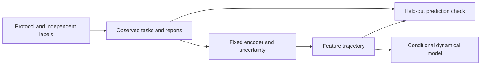

# Altered States of Consciousness

Sleep, meditation, psychedelics, anaesthesia, hypnosis and lucid dreaming motivate different research protocols. Their identification with matrix trajectories is a bridge hypothesis **[H/I]**, not a consequence of naming the axes of $\Gamma$. The chapter separates the state model, observations, task capabilities and clinical outcomes.

:::note Typed quantities
In a declared native frame, $\Gamma\in\mathcal D(\mathbb C^7)$, $P=\mathrm{Tr}\Gamma^2$, $Q=\sum_i\gamma_{ii}^2$, $\Phi=P/Q-1$ and $R=1/(7P)$. For a specified numerical self-model $M:D_7\to D_7$, $R_M=1-\|\Gamma-M\Gamma\|_F^2/P$ is a different score; it can be negative (orthogonal pure input and output give $R_M=-1$). It is not the logical support reflector. For $\gamma_{ij}\ne0$, phase $\mathrm{Gap}(i,j)=|\sin\arg\gamma_{ij}|$ ignores amplitude and oriented phase information; at zero coherence its phase is undefined. A mean over 21 pairs is defined only when all those phases are defined; otherwise the support/missing-value convention must be reported.
:::

:::warning Capability and physical interpretation
The chosen gate $\mathrm{Cap}_2$ requires $P>2/7$, $R\ge1/3$, $\Phi\ge1$ and $D_{\mathrm{diff}}\ge2$. The purity interval $(2/7,3/7]$ checks only its first two clauses. L3 requires an independent nontrivial metamodel prediction certificate; L4 is the ideal compatible tower of such certificates. A high $R_M$, low Gap, fixed point or practice label supplies none of these missing tests. Identifying the gates with physical consciousness or clinical condition remains **[H]**. See the [mathematical kernel](/docs/reference/mathematical-kernel) and [hierarchy](/docs/consciousness/hierarchy/interiority-hierarchy).
:::

:::note Differentiation and extension
$D^{\mathrm{ext}}=\exp S_{vN}(\rho_E)$ needs a normalized state on a declared experiential space. A tensor factor permits a partial trace. A direct-sum E-sector instead uses its positive-weight compressed block divided by its trace. The 7D basis axis E is one-dimensional and cannot supply a multidimensional entropy by taking a partial trace over the other axes. The hierarchy's $D^{7D}=1+6\mathrm{Coh}_E$ is a separate stipulated proxy, not an approximation theorem for the extension spectrum. A 7D marginal does not uniquely determine an extension: $\Gamma\otimes\rho_E$ has the same marginal $\Gamma$ for every $\rho_E$, with different experiential entropies. See [7D/42D typing](/docs/core/structure/dimension-e#rho-e-7d-42d).
:::

### Chapter roadmap

Historical context; declared trajectories and observation models; research hypotheses for sleep and meditation; intervention outcomes; anaesthesia, hypnosis and dreaming; conditional transition dynamics.

## 1. Historical Perspective {#история}

### 1.1 Charles Tart and the cartography of states

In 1969, American psychologist Charles Tart published *"Altered States of Consciousness"*, proposing the first systematic classification of altered states of consciousness (ASC). Tart viewed consciousness as a **system** possessing stable configurations — "discrete states of consciousness" (DSC). Each DSC is characterised by a set of "subsystems": input (perception), processing (thinking), output (behaviour), energy (attention), etc. Transition between DSCs is a destabilisation of one configuration and a transition to another.

**Tart's key idea:** Normal wakefulness is merely *one* of the possible configurations, not privileged from the standpoint of "truth". Sleep, meditation, the psychedelic state — these are equally legitimate configurations with their own regularities.

### 1.2 From Tart to UHM

Tart's system perspective motivates a state-space model **[I/H]**. A measured configuration can be represented by $\Gamma$ only after defining a validated observation map. A stable category is an attractor only in a separately specified dynamics; changes between categories need not be bifurcations. The seven named axes, their numerical scores and their relation to Tart's subsystems are modeling choices, not an automatic translation theorem.

### 1.3 Predecessors and context

Before Tart, altered states were studied in a fragmented way: William James (1902, *"The Varieties of Religious Experience"*) described mystical states; Ludwig (1966) introduced the very term "altered states of consciousness"; Masters and Houston (1966) systematised psychedelic experience. But only Tart proposed a *unified framework* for all types of ASC.

In the 2000s, the neuroscience of ASC received a powerful impulse: fMRI studies of meditation (Lutz et al., 2004), neuroimaging of psychedelic states (Carhart-Harris et al., 2012), formalisation of the "entropic brain" (Carhart-Harris, 2014). The entropic brain hypothesis is the direct precursor of the parameter $D_{\text{diff}}$ in UHM.

---

## 2. Altered States as Trajectories in Γ-Space {#траектории}

**Model definition [D].** A trajectory $\Gamma(\tau)$ and a specified numerical model $M_\tau$ yield a feature trajectory $s(\tau)=(P,\Phi,R_M,D,G)$ where each component is defined. Relative to a calibrated baseline, a declared criterion $|s_k(\tau)-s_k^{\mathrm{base}}|>\delta_k$ marks a *model feature deviation*. The thresholds, uncertainty and timescale are part of the protocol. A deviation does not by itself establish an altered conscious state, clinical condition or unique experience **[H]**.

The state space of $7\times7$ density matrices has real dimension $48$ in its interior: six free diagonal populations and 21 complex off-diagonal entries. Five aggregates discard information and do not automatically distinguish all classes. Estimate the class from independently observed labels and validated distributions, not by defining it from the same features under evaluation.

### 2.1 State space: visualisation

A $(P,R_M)$ plot is a projection, not a complete classification. For a fixed $M$, $R_M$ need not be a function of $P$; the canonical $R$ always is. The strip $2/7<P\le3/7$ is a scalar gate condition, not a boundary of life, a clinical norm or proof of experience. Estimated clusters may overlap and need not be attractors. Show uncertainty and independent labels; omit fabricated numerical coordinates for sleep, meditation or drug effects.

## 3. Sleep {#сон}

Sleep labels and reports must be obtained independently of the matrix score **[Pr]**. The following are candidate feature associations; they do not assign a universal capability level or infer absent experience from absent report.

### 3.1 NREM sleep (deep dreamless sleep) {#nrem}

**Candidate [H].** Compare independently identified NREM periods with self-model prediction accuracy, differentiation in a declared experiential model and task/report accessibility. The former assignments $R_M<1/3\Rightarrow\mathrm{L1}$ and “integration necessarily preserved above $\Phi=1$” are not derived. A measured $D<2$ would fail that chosen clause of $\mathrm{Cap}_2$, without proving the presence or absence of physical experience.

Vanishing $\gamma_{AE}$ does not imply $G_{AE}=1$: its phase is undefined at zero. Failure to remember or report content cannot distinguish absent content from failed encoding or access without additional tests. No universal purity value for NREM is asserted.

### 3.2 REM sleep (dreaming) {#rem}

**Candidate [H].** Relate independently identified REM periods and dream reports to features of a fixed encoding. Neither a sum of selected coherence moduli nor a low phase Gap is a sufficient condition for dreaming. Oriented phases and amplitudes may be investigated as predictors, but phase alone does not determine dream content. The relation between neural observations and entries named $(S,E)$ or $(D,E)$ requires an explicit observation model; matrix labels do not derive it.

A lucid or non-lucid report and a formal L-label are different outcomes. Report higher capabilities only after their full task certificates, and leave missing certificates unknown **[Pr]**.

## 4. Meditation {#медитация}

Practice labels suggest different task designs **[H/I]**. A voluntary instruction is an external protocol variable, not a demonstrated direct manipulation of matrix entries.

### 4.1 Shamatha (focusing attention) {#шаматха}

**Candidate [H].** A focusing practice can be tested against an independently measured sustained-attention task and specified numerical self-model predictions. An increase of $|\gamma_{AE}|$ does not force other moduli to fall: the trace-one family $(1-t)I_7/7+tuu^\dagger$ raises all off-diagonal moduli simultaneously. The bound $\sum_{X\ne A}|\gamma_{AX}|^2\le\gamma_{AA}(1-\gamma_{AA})$ is not a conserved budget. A tradeoff requires an additional controller law, as proved in [Attention and memory](/docs/consciousness/states/attention-memory#внимание).

A change in $R_M$ or fitted generator parameters is a separate measurement. Neither monotone practice improvement nor a one-year or ten-year numerical trajectory follows from normalization or a two-timescale model. Such effects must be estimated from an actual protocol **[Pr]**.

### 4.2 Vipassanā (insight) {#випассана}

**Candidate [H].** Compare reports of noticing previously unreported content with changes in a calibrated access task and separately estimated phases. A noticed discrepancy does not mathematically force Gap reduction or a bifurcation. A fixed score threshold has no universal order of bodily, emotional and logical “insights”.

Complete phase transparency is possible: the positive family in §4.1 has all 21 Gaps zero whenever $t>0$. Hamming's code theorem does not require three of these pairs to remain opaque. Whether broader access improves a specified outcome must be tested independently; a phase statistic is not access itself.

### 4.3 Samādhi (deep absorption) {#самадхи}

A report of deep absorption does not certify L3 or L4 **[H/I]**. Self-model agreement and access to nontrivial higher-order predictions are distinct.

**Counterexample to the former fixed-point proof [T].** For $M=\mathrm{Id}$, every state is a fixed point and $R_M=1$. At $\Gamma=I_7/7$, $P=1/7$ and $\Phi=0$, so $\mathrm{Cap}_2$ fails. Thus perfect self-agreement does not establish even the chosen base capability, much less a compatible metamodel tower or complete self-knowledge. The identity is a valid frozen CPTP map, so imposing CPTP does not fix the implication.

**Feasibility check [T].** Since $Q\ge1/7$, $\Phi\le7P-1$. Within $\mathrm{Cap}_2$, $P\le3/7$ gives $\Phi\le2$. The old sample $P=0.40$, $\Phi=3.5$ cannot be a density-matrix certificate: its bound is $1.8$. Maximizing $\Phi$ over all states yields $6$ at a uniform pure state, whose $R=1/7$ fails the access cut. Consequently “maximal integration” cannot replace the gate or the higher-order tests.

A study of absorption can test independent reports, tasks and metamodel predictions, including perturbations and held-out targets **[Pr]**. A stable state requires stability of a specified flow; a fixed point of $M$ alone supplies neither attraction nor a retention time.

### 4.4 Comparison of three practices

| Practice label | Proposed independent target [H/Pr] | What is not inferred |
|---|---|---|
| Shamatha | Sustained-attention performance | Conserved coherence budget |
| Vipassanā | Access/report discrimination | Mandatory phase-gap reduction |
| Samādhi | Absorption reports and higher-order task tests | L4 from $R_M=1$ or a fixed point |

The table compares research designs; it supplies no universal matrix profile or ordering of practice proficiency.

## 5. Psychedelics {#психоделики}

A matrix account of an intervention is a candidate model **[H]**. Its reconstructed features and independently assessed outcomes must remain separate. No dose, efficacy or safety recommendation is derived here.

### 5.1 General profile

Changes in $D$, $R_M$, $P$ or phase features can be studied under a fixed encoder, but their directions are not imposed by the matrix axioms. Reported “ego dissolution” is not equivalent to a fall in $R_M$, and a fall in Gap does not prove that suppressed records have become accessible. Rapid state motion does not by itself establish self-model prediction failure: that requires a task, target and an error readout. Approaching the chosen $P=2/7$ cut does not by itself establish a physiological danger threshold.

### 5.2 Therapeutic window

The former theorem of maximal therapeutic efficacy at $1/6<R_M<1/3$ is **withdrawn [✗]**. Neither bound follows from the definition of $R_M$, and purity alone does not certify the full gate or clinical safety.

**Counterexample to the score implication.** For a pure $\Gamma=|0\rangle\langle0|$, choose the valid replacement-channel output $M\Gamma=(1-a)|0\rangle\langle0|+a|1\rangle\langle1|$. Then $R_M=1-2a^2$; $a=\sqrt{0.4}$ gives $R_M=0.2$ inside the proposed window, while $P=1$ gives canonical $R=1/7$ outside $\mathrm{Cap}_2$. The window thus certifies neither base capability nor a clinical outcome. An independent outcome variable can differ while the same $(\Gamma,M)$ and score are retained; no outcome function is supplied by the score definition.

**Research programme [H/Pr].** If an intervention hypothesis uses a model feature, preregister the observation model and an independently assessed benefit outcome, compare alternatives on held-out data, and assess clinical safety independently. Do not infer a treatment window, retained insight, dose or duration from $R_M$, Gap or the purity interval. The former timed numerical drug profile had no identified measurement basis and is withdrawn.

### 5.3 Connection to the entropic brain model

The entropic-brain proposal is a motivating hypothesis, not an identification theorem **[H/I]**. Entropy of an observed neural time series, $S_{vN}(\rho_E)$ and $\exp S_{vN}(\rho_E)$ are different quantities. Relating them requires an encoder, units and a validated statistical model. A “critical point” in a neural model is not automatically a phase boundary of the chosen Gap potential, and neither entropy measure alone establishes a phenomenal or therapeutic effect.

## 6. Anaesthesia {#анестезия}

A proposed model of anaesthesia must be linked to independent observations and outcome criteria **[H/Pr]**. A loss of selected matrix coherences is a mathematical process; equating it with a clinical state requires an additional validated bridge.

### 6.1 Sequence of coherence loss

A declared dephasing channel can drive off-diagonal entries toward zero while preserving trace and populations **[T]**. Its rates and order of channel suppression depend on the actual generator; the universal sequence $(E,U)\to(L,E)\to(A,E)\to(S,E)$ does not follow from positivity or the seven-axis names. The former numerical induction table was an unvalidated assignment rather than reconstructed data.

For a nonzero entry approaching zero along different phases, Gap may stay at $0$, $1$, or another value until its phase becomes undefined. Hence vanishing coherence does not determine a phase-opacity progression or the instant at which physical experience ends.

### 6.2 Distinction from sleep

A fitted model can compare independently identified sleep and anaesthesia conditions. It cannot define their distinction as “L1 versus L0” from $R_M$ or $\Phi$ alone. Every valid density matrix satisfies the hierarchy's basic $A_0$ predicate; failing $\mathrm{Cap}_2$ does not determine which lower predicates hold or establish physical unconsciousness.

**Counterexample to purity-based reversibility.** A replacement channel sends every input record to a fixed pure state with $P=1>2/7$ yet destroys distinguishability of those records at its output. A unitary channel preserves distinguishability at any input purity. Purity above the chosen cut therefore does not prove recoverability, survival or recovery of a person. Clinical support requirements are not deduced from this matrix inequality.

### 6.3 Awareness during anaesthesia (intraoperative awareness)

The candidate relation between independently assessed awareness and selected features requires an outcome protocol **[H/Pr]**. A threshold $|\gamma_{AE}|>\varepsilon$ with $G_{AE}<1$ does not prove felt experience, ability to report or a particular clinical complication. The encoder, observation noise and independent access/report measures must be specified. No rate or diagnosis is inferred from the matrix statistics here.

## 7. Hypnosis and Lucid Dreaming {#гипноз-осознанные-сновидения}

These labels can motivate distinct protocols; they do not supply a unique Γ-profile or capability certificate.

### 7.1 Hypnosis {#гипноз}

**Candidate [H].** Compare independently measured response to suggestion, task attention and report with a fixed matrix model. Hypnosis is not defined by increased $G_{LE}$ or decreased $R_M$, and neither score establishes “logical control switched off”. A bypass from one named channel to another requires an actual causal model and intervention evidence; it is not inferred from index names or a static correlation.

### 7.2 Lucid dreaming {#люцидность}

**Candidate [H/Pr].** Independently verified lucid-dream reports can be compared with task-dependent access and self-model prediction measures. A positive $\gamma_{AE}$ plus $R_M\ge1/3$ is not a sufficient dreaming or L2 criterion. It omits $\Phi$, canonical $R$, differentiation and the observation bridge. Formal capability certification and a report of knowing that one is dreaming are recorded separately; no universal training trajectory or matrix values are asserted.

## 8. Summary Table: All ASC Classes {#сводная-таблица}

| Independently assigned condition | Candidate study target [H/Pr] | Capability result |
|---|---|---|
| Wakefulness | Calibrated baseline tasks and reports | Requires full certificate |
| NREM / REM | Independently identified sleep periods and access/report tasks | Not fixed by sleep label |
| Meditation / absorption | Practice reports, attention and metamodel tasks | L3/L4 not inferred from a fixed point |
| Psychedelic condition | Separate feature estimates and intervention outcomes | No score-derived therapeutic window |
| Anaesthesia | Independent observations and outcome criteria | Purity does not prove recovery |
| Hypnosis | Independently measured response/task outcomes | Not determined by phase Gap |
| Lucid dreaming | Verified report and task-specific access | Not determined by $R_M\ge1/3$ |

The former universal numerical profiles and L-assignments are withdrawn. Missing gate clauses or certificates remain unknown rather than imputed from the condition name.

## 9. Geometry of Transitions {#геометрия}

A trajectory may cross a feature threshold without any change in the stability of its underlying flow. A clinical transition, a score crossing and a mathematical bifurcation are three distinct claims.

### 9.1 Types of transitions

**Conditional saddle-node result [C].** For a declared one-dimensional smooth flow $\dot x=f(x,\mu)$, a saddle-node at $(x_0,\mu_0)$ requires $f=0$, $f_x=0$, $f_{xx}\ne0$ and $f_\mu\ne0$, with the usual local hypotheses. In higher dimensions a simple zero eigenvalue and the corresponding center-manifold nondegeneracy/transversality conditions are needed. A scalar readout $R_M=1/3$ supplies none of these derivatives. See [Ghrist, bifurcation theory](https://www2.math.upenn.edu/~ghrist/preprints/ADS-DRAFT.pdf).

**Counterexample to the former threshold proof [T].** The family $\dot x=-x+\mu$ has a unique globally stable equilibrium $x^*=\mu$ and eigenvalue $-1$ for every $\mu$. Its readout crosses $1/3$ at $\mu=1/3$ without a saddle-node. Likewise a fixed point $M\Gamma=\Gamma$ is not proof of a transition, attractor or cognitive level.

Falling asleep, entering a practice or changes in report may motivate a fitted model **[H]**. A Hopf, saddle-node or phase-transition interpretation requires the declared dynamics and independently estimated controls. No universal sequence, abruptness or clinical timescale is assigned here.

### 9.2 Transition diagram

```mermaid
graph LR
    P["Protocol and independent labels"] --> O["Observed tasks and reports"]
    O --> M["Fixed encoder and uncertainty"]
    M --> F["Feature trajectory"]
    F --> V["Held-out prediction check"]
    O --> V
    F --> D["Conditional dynamical model"]
```

This diagram describes a research workflow **[Pr]**, not a universal transition graph between clinical or phenomenal states. A dynamical model must explain observations beyond the score curve; successful prediction is assessed independently of its fitted features.

### What we learned {#итоги}

1. Matrix features, task capabilities, reports and clinical outcomes have distinct types. Their correspondences are testable bridge hypotheses.
2. The purity strip is only part of $\mathrm{Cap}_2$; a self-model score or phase Gap does not replace the remaining gate or higher-order prediction tests.
3. An identity self-model has perfect agreement even at $I_7/7$, which fails the gate. A fixed point does not certify complete self-knowledge or L4.
4. Full phase transparency is possible, while zero coherence has undefined phase. Hamming coding supplies no three-opaque-pair requirement.
5. The proposed therapeutic score window and clinical numerical assignments are withdrawn; benefit, safety and recovery require independent outcome evidence.
6. Crossing a scalar threshold is not a bifurcation. Conditional transition claims need a specified flow and verified nondegeneracy/transversality.

The [Unconscious](/docs/consciousness/states/unconscious) continues this distinction between phase, stored content and access; it does not identify every Gap $=1$ with a physically unconscious channel.

## Related Documents

- **Dynamics of Γ:** [Evolution of Γ](/docs/core/dynamics/evolution) — equations of motion
- **Viability:** [Viability measure](/docs/core/dynamics/viability) — threshold $P_{\text{crit}} = 2/7$
- **Level hierarchy:** [Interiority hierarchy](/docs/consciousness/hierarchy/interiority-hierarchy) — definitions of L0–L4
- **Gap characterisation:** [Gap characterisation of levels](/docs/consciousness/hierarchy/gap-characterization) — signatures
- **Bifurcations:** [Gap dynamics](/docs/core/dynamics/gap-dynamics#бифуркации) — theory of transitions
- **Unconscious:** [Unconscious](/docs/consciousness/states/unconscious) — Gap structure of inaccessible sectors
- **Pathology:** [Pathology of consciousness](/docs/consciousness/states/pathological) — deviations from the norm
- **CC theorems:** [Coherence Cybernetics](/docs/applied/coherence-cybernetics/theorems) — applied consequences for dynamic attractors
- **Entropic brain:** [Phase diagram](/docs/core/dynamics/gap-phase-diagram) — connection to Carhart-Harris's hypothesis
