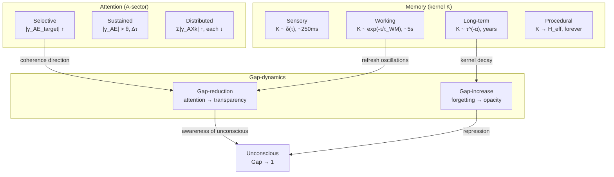
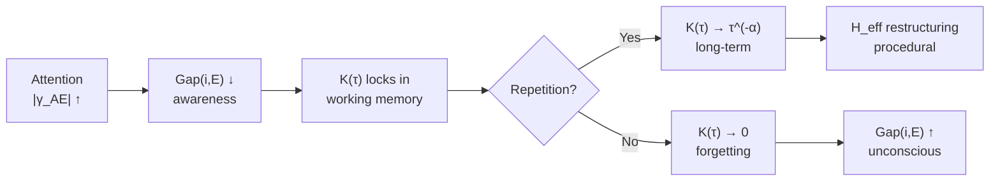

# Attention and Memory

:::info Bridge from the previous chapter
In [the Unconscious](/docs/consciousness/states/unconscious) we saw that the boundary between conscious and unconscious is determined by the Gap-structure — the opacity of channels. But what governs this boundary *in real time*? Two mechanisms: **attention** (redistribution of coherence 'here and now') and **memory** (the influence of the past through the non-Markovian kernel). Attention decides *what* enters the focus of consciousness. Memory determines *how long* it remains accessible.
:::

:::note On notation
In this document:
- $\Gamma$ — [coherence matrix](/docs/core/dynamics/coherence-matrix), $\gamma_{ij}$ — its elements
- $\mathrm{Tr}(\Gamma) = 1$ — normalisation (trace condition)
- $P = \mathrm{Tr}(\Gamma^2)$ — [purity (viability)](/docs/core/dynamics/viability#определение-чистоты)
- $\gamma_{AX}$ — coherences between dimension $A$ (articulation/attention) and other dimensions $X$
- $K(\tau)$ — memory kernel ([non-Markovian dynamics](/docs/applied/coherence-cybernetics/non-markovian#ядро-памяти))
- $H_{\text{eff}}$ — effective Hamiltonian ([evolution of Γ](/docs/core/dynamics/evolution))
- $R$ — [reflection measure](/docs/consciousness/foundations/self-observation#мера-рефлексии-r)
- Full notation table — see [Notation](/docs/reference/notation)
:::

:::warning Document status
Definitions of attention and memory via the structure of $\Gamma$ — **[D]** (definitions by convention). Memory typology via forms of the kernel $K(\tau)$ — **[C]** (conditional on non-Markovian dynamics of coherences). Phenomenological interpretations — **[I]**.
:::

### Chapter roadmap

1. **Historical perspective** — from William James through filter models to UHM
2. **Attention** — definition, spotlight mechanism, three types, connection to Gap
3. **Historical perspective on memory** — from Ebbinghaus through multi-level models to UHM
4. **Memory** — four types from the form of kernel $K(\tau)$: sensory, working, long-term, procedural
5. **Forgetting** — two mechanisms (kernel decoherence and Gap increase)
6. **Integration** — how attention, memory and Gap form a unified system

---

## 1. Historical perspective: attention {#история-внимание}

### 1.1 William James (1890)

> "Everyone knows what attention is. It is the taking possession by the mind, in clear and vivid form, of one out of what seem several simultaneously possible objects or trains of thought."
>
> — William James, *The Principles of Psychology* (1890), ch. 11

James formulated the key intuition: attention is a *selection* from a set of possible contents. This intuition translates directly into the UHM formalism: 'the set of possible objects' = the set of coherences $\{\gamma_{AX}\}$; 'taking possession of one' = increasing $|\gamma_{AE_{\text{target}}}|$ at the expense of the others.

### 1.2 Filter models (1950–1970s)

**Broadbent (1958): early selection filter.** Information passes through a narrow 'bottleneck' — only one channel is fully processed, the rest are blocked. In UHM: $|\gamma_{AE_{\text{target}}}| \gg |\gamma_{AE_{\text{distractor}}}|$ — hard filtering.

**Treisman (1964): attenuation model.** Non-target channels are not fully blocked but *attenuated*. In UHM: $|\gamma_{AE_{\text{distractor}}}| > 0$, but $|\gamma_{AE_{\text{distractor}}}| \ll |\gamma_{AE_{\text{target}}}|$ — soft filtering. This explains the 'cocktail party effect': you can hear your own name in a nearby conversation because the distractor channel is not fully blocked.

**Deutsch and Deutsch (1963): late selection filter.** All information is fully processed; selection occurs at the response stage. In UHM: all $|\gamma_{AX}|$ are moderate; selection occurs via channel $(A,D)$ — attention influences *action* ($D$), not *perception* ($E$).

### 1.3 Posner: components of attention (1980–1990s)

Michael Posner identified three neural 'attention networks':
- **Alerting** (vigilance) — maintenance of the tonic level $\gamma_{AA}$
- **Orienting** (orientation) — redirecting coherence: $\gamma_{AE_1} \to \gamma_{AE_2}$
- **Executive** (executive control) — resolving conflict between channels

In UHM, all three networks are described by the unified mechanism of redistribution of A-sector coherences.

### 1.4 From classical models to UHM

| Classical model | UHM formalism |
|---------------------|---------------|
| Broadbent's filter | $|\gamma_{AE_{\text{target}}}| \gg 0$, $|\gamma_{AE_{\text{distr}}}| \approx 0$ |
| Treisman's attenuation | $|\gamma_{AE_{\text{target}}}| > |\gamma_{AE_{\text{distr}}}| > 0$ |
| Late selection | All $|\gamma_{AX}|$ moderate; selection via $(A,D)$ |
| Alerting (Posner) | $\gamma_{AA}$ — tonic level |
| Orienting (Posner) | $\gamma_{AE_1} \to \gamma_{AE_2}$ — redistribution |
| Executive (Posner) | Resolution of $|\gamma_{AX_1}| \stackrel{?}{>} |\gamma_{AX_2}|$ |

---

## 2. Attention as redistribution of coherence {#внимание}

### 2.1 Definition

:::info Definition (Attention) [D]
**Attention** to a pair of dimensions $(i,j)$ is a temporary increase in the modulus of coherence $|\gamma_{AX}|$ with a simultaneous decrease in other $|\gamma_{AY}|$ ($Y \neq X$), constrained by the normalisation $\mathrm{Tr}(\Gamma) = 1$:

$$
\text{Attention to } X: \quad |\gamma_{AX}|(\tau) \uparrow \quad \Rightarrow \quad \sum_{Y \neq X} |\gamma_{AY}|(\tau) \downarrow
$$

More formally: attention is a unitary (or near-unitary) transformation of $\Gamma$ that redistributes coherence from A-sector channels into the target channel $(A,X)$.
:::

### 2.2 The 'spotlight' mechanism: detailed derivation

Why does increasing one coherence *inevitably* lead to decreasing others? This is a direct consequence of trace normalisation.

**Step 1.** Trace condition: $\mathrm{Tr}(\Gamma) = \sum_{k=1}^{7} \gamma_{kk} = 1$.

**Step 2.** Cauchy-Schwarz inequality for each element:

$$
|\gamma_{AX}|^2 \leq \gamma_{AA} \cdot \gamma_{XX}
$$

**Step 3.** The sum of all A-sector coherences is bounded:

$$
\sum_{X \neq A} |\gamma_{AX}|^2 \leq \gamma_{AA} \cdot \sum_{X \neq A} \gamma_{XX} = \gamma_{AA} \cdot (1 - \gamma_{AA})
$$

The right-hand side is a fixed constant for a given $\gamma_{AA}$. Consequently, the sum of squared moduli is bounded, and increasing one term requires decreasing at least one other. This is the **'spotlight' mechanism**.

**Everyday analogy.** You have a limited attention budget — like a limited amount of water in a bucket. You can water one bed abundantly (focused attention on $\gamma_{AE}$) and leave the others dry. Or water all of them a little (distributed attention). But the total volume of water is fixed — that is $\mathrm{Tr}(\Gamma) = 1$. You cannot 'create' more attention, you can only redistribute it.

**Numerical example: attention budget.** Let $\gamma_{AA} = 0.15$ (the fraction of attention in the total 'energy'). Then:

$$
\sum_{X \neq A} |\gamma_{AX}|^2 \leq 0.15 \cdot (1 - 0.15) = 0.1275
$$

This is the 'budget'. It can be distributed as follows:

| Scenario | $|\gamma_{AE}|$ | $|\gamma_{AS}|$ | $|\gamma_{AD}|$ | $|\gamma_{AL}|$ | Sum $|\cdot|^2$ | SNR for $E$ |
|----------|:---:|:---:|:---:|:---:|:---:|:---:|
| Full focus | $0.12$ | $0.01$ | $0.01$ | $0.01$ | $0.0147$ | $36.0$ |
| Moderate focus | $0.10$ | $0.04$ | $0.03$ | $0.03$ | $0.0134$ | $3.7$ |
| Distributed | $0.06$ | $0.06$ | $0.06$ | $0.06$ | $0.0144$ | $1.0$ |

With full focus, the SNR (signal-to-noise ratio) for the target channel $E$ is 36 — excellent 'reception'. With distributed attention, SNR = 1 — on the detection threshold. This is why attempting to simultaneously read, listen, and think about a third thing results in none of the activities being performed well.

### 2.3 Connection to the [21-pair taxonomy of qualia](/docs/consciousness/phenomenology/qualia-structure#таксономия)

From the [qualia table](/docs/consciousness/phenomenology/qualia-structure#полная-таблица-21-типа-квалиа):
- $\gamma_{AE}$ — **Apperception** (quale #4): discrimination that has entered interiority
- $\gamma_{AS}$ — **Morphogenesis** (quale #1): crystallisation of forms
- $\gamma_{AD}$ — **Actualisation** (quale #2): actualisation of distinction in process
- $\gamma_{AL}$ — **Predication** (quale #3): distinction as logical predicate

The direction of attention = the choice of which qualitative type dominates. When you contemplate a painting, $\gamma_{AS}$ dominates (forms); when listening to an argument — $\gamma_{AL}$ (logic); when meditating — $\gamma_{AE}$ (pure awareness).

### 2.4 Types of attention

:::tip Theorem (Types of attention from normalisation) [D]
From the normalisation $\mathrm{Tr}(\Gamma) = 1$ and the Cauchy-Schwarz inequality $|\gamma_{AX}|^2 \leq \gamma_{AA} \cdot \gamma_{XX}$ three attention modes follow:

**(a) Selective (focused) attention:**

$$
|\gamma_{AE_{\text{target}}}| \uparrow, \quad |\gamma_{AE_{\text{distractor}}}| \downarrow
$$

One target channel is amplified at the expense of the others. Signal-to-noise ratio:

$$
\mathrm{SNR} = \frac{|\gamma_{AE_{\text{target}}}|^2}{\sum_{X \neq E_{\text{target}}} |\gamma_{AX}|^2}
$$

Example: reading a book in a noisy room. $|\gamma_{AL}| \uparrow$ (text), $|\gamma_{AS}| \downarrow$ (visual distractors), $|\gamma_{AD}| \downarrow$ (background sounds).

**(b) Sustained attention:**

Maintaining elevated $|\gamma_{AE}|$ over the interval $[\tau_0, \tau_0 + \Delta\tau]$:

$$
|\gamma_{AE}(\tau)| \geq |\gamma_{AE}|_{\text{th}} \quad \forall\, \tau \in [\tau_0, \tau_0 + \Delta\tau]
$$

Energy cost — maintaining $\gamma_{AA}$ against [dissipation](/docs/core/dynamics/evolution#full-equation-of-motion). Over time $\gamma_{AA}$ decreases due to dissipation, and attention 'tires' — active maintenance is required (effort of will).

Example: driving a car on a long straight road. $|\gamma_{AE}| > \theta$ must be maintained continuously, which requires constant 'expenditure' of $\gamma_{AA}$.

**(c) Distributed (divided) attention:**

Several $|\gamma_{AX_k}|$ are simultaneously elevated, but each is lower than under focused attention:

$$
\sum_k |\gamma_{AX_k}|^2 \leq \gamma_{AA} \cdot \sum_k \gamma_{X_k X_k} \quad \Rightarrow \quad |\gamma_{AX_k}| < |\gamma_{AX_k}|_{\text{focus}}
$$

Consequence: distributed attention is **inevitably weaker** than focused attention for each individual channel — a direct consequence of normalisation.

Example: driving while simultaneously talking on the phone. $|\gamma_{AS}|$ (road) and $|\gamma_{AL}|$ (conversation) are both elevated, but each is lower than under focused attention. Research shows a 30–50% reduction in reaction speed — a direct spotlight effect.
:::

### 2.5 Attention and Gap

Directing attention at channel $(i,j)$ can reduce $\mathrm{Gap}(i,j)$ — this is the mechanism underlying [meditative practices](/docs/consciousness/states/altered-states#медитация):

$$
\frac{\partial\,\mathrm{Gap}(i,E)}{\partial |\gamma_{AE}|} < 0
$$

**Motivation.** Why does attention reduce Gap? Formally: increasing $|\gamma_{AE}|$ intensifies the information flow between $A$ and $E$. The intensified flow allows the $\varphi$-operator to more accurately 'see' the state of channel $(i,E)$. A more accurate self-model leads to detection of misalignment (Gap), and detected misalignment triggers correction (Gap-reduction).

**Numerical example.** A mindfulness practitioner directs attention at the breath (channel $S \to E$):

| Time | $|\gamma_{AE}|$ | $\mathrm{Gap}(S,E)$ | $\mathrm{Gap}(D,E)$ | Subjective experience |
|-------|:---:|:---:|:---:|:---|
| $\tau = 0$ | $0.08$ | $0.40$ | $0.45$ | Distracted |
| $\tau = 5$ min | $0.15$ | $0.30$ | $0.42$ | "Starting to feel the breath" |
| $\tau = 15$ min | $0.20$ | $0.18$ | $0.35$ | "I see tension in the body" |
| $\tau = 30$ min | $0.22$ | $0.12$ | $0.25$ | "I notice emotions as bodily sensations" |

Strengthening the attention–experience channel correlates with a reduction in opacity in E-sector channels. This formalises the intuition: 'that to which attention is directed becomes more transparent'. Formally, this means that attention is one of the mechanisms by which content transitions from the [unconscious](/docs/consciousness/states/unconscious#динамика) to the conscious.

---

## 3. Historical perspective: memory {#история-память}

### 3.1 Hermann Ebbinghaus (1885)

Ebbinghaus was the first researcher to apply the experimental method to the study of memory. His main discoveries:

- **Forgetting curve**: information is forgotten according to a *power* law — quickly at first, then ever more slowly. Ebbinghaus approximated this as $b(\tau) \sim \tau^{-\beta}$, $\beta \approx 0.3$.
- **Learning curve**: repetition improves retention, but with diminishing returns.
- **Spacing effect**: distributed repetition is more effective than massed practice.

In the UHM formalism, Ebbinghaus's forgetting curve is a direct consequence of the **power-law kernel** $K(\tau) \sim \tau^{-\alpha}$ (section 4.5).

### 3.2 Atkinson and Shiffrin (1968): modal model

The 'three-store' model:
- **Sensory register** — instantaneous snapshot (duration ~250 ms)
- **Short-term (working) memory** — 7 ± 2 items, duration ~20 s
- **Long-term memory** — virtually unlimited capacity and duration

In UHM, these three 'stores' are not separate systems, but **three forms** of the same kernel $K(\tau)$:

| Atkinson-Shiffrin model | UHM formalism |
|---------------------------|---------------|
| Sensory register | $K(\tau) \sim \delta(\tau)$ — Markovian limit |
| Working memory | $K(\tau) \sim e^{-\tau/\tau_{WM}}$ — exponential kernel |
| Long-term memory | $K(\tau) \sim \tau^{-\alpha}$ — power-law kernel |

### 3.3 Tulving (1972): types of memory

Endel Tulving introduced the distinction:
- **Episodic memory** — memory of specific events ('I was at the café yesterday')
- **Semantic memory** — knowledge of facts ('Paris is the capital of France')
- **Procedural memory** — skills ('how to ride a bicycle')

In UHM:
- Episodic and semantic memory differ in the *shape* of the power-law kernel (different values of $\alpha$)
- Procedural memory is fundamentally different — it is embedded in $H_{\text{eff}}$ (section 4.6)

---

## 4. Types of memory from the non-Markovian kernel {#память}

### 4.1 The memory kernel and cognitive memory

[Non-Markovian dynamics](/docs/applied/coherence-cybernetics/non-markovian) describes coherences with **memory**: the current evolution $\gamma_{ij}(\tau)$ depends on the entire preceding history through the kernel $K(\tau - s)$:

$$
\frac{d\gamma_{ij}}{d\tau} = -i\Delta\omega_{ij}\,\gamma_{ij}(\tau) + \int_0^\tau K_{ij}(\tau - s)\, \gamma_{ij}(s)\, ds + \mathcal{R}_{ij}
$$

(see [Gap-dynamics, section 4](/docs/core/dynamics/gap-dynamics#немарковские-эффекты))

Let us examine each term:
- **$-i\Delta\omega_{ij}\,\gamma_{ij}(\tau)$** — free evolution (phase accumulation)
- **$\int_0^\tau K_{ij}(\tau - s)\, \gamma_{ij}(s)\, ds$** — *memory*: the influence of all past states. This is a *convolutional* integral — the current state depends on a weighted sum of past states
- **$\mathcal{R}_{ij}$** — regeneration ([operator ℛ](/docs/core/dynamics/evolution))

The form of the kernel $K(\tau)$ determines the **type of cognitive memory**. Analogy: $K(\tau)$ is a 'filter of the past'. Delta function = 'I remember only the present'. Exponential = 'I remember recent events, but forget quickly'. Power function = 'I remember for a long time, I forget slowly'.

### 4.2 Memory typology

:::info Definition (Types of memory) [C]
Condition: [non-Markovian dynamics of coherences](/docs/core/dynamics/gap-dynamics#немарковские-эффекты). Four types of memory are defined by the form of the kernel $K(\tau)$:

| Memory type | Kernel $K(\tau)$ | Characteristic | Time scale |
|------------|----------------|----------------|-------------------|
| **Sensory** | $K(\tau) \sim \delta(\tau - \tau')$ | Instantaneous, no persistence | $\tau_{\text{mem}} \to 0$ |
| **Working** | $K(\tau) \sim e^{-\tau/\tau_{WM}}$ | Exponential decay | $\tau_{WM} \sim$ seconds |
| **Long-term** | $K(\tau) \sim (\tau)^{-\alpha}$, $\alpha \in (0,1)$ | Power-law decay, slow fading | $\tau_{\text{mem}} \to \infty$ |
| **Procedural** | Embedded in $H_{\text{eff}}$ | Structure of evolution | Unbounded |

:::

### 4.3 Sensory memory

$$
K_{\text{sens}}(\tau) = -\Gamma_2 \cdot \delta(\tau)
$$

**Markovian limit** — no memory. The current coherence state is determined only by current conditions. Physical analogue: an instantaneous sensory imprint that disappears when the stimulus ceases.

**Motivation.** Why introduce 'zero memory' as a separate type? Because it is the *limiting case* required for completeness of the classification. The delta function $\delta(\tau)$ means: 'the past does not influence the present'. Formally: the convolution integral degenerates:

$$
\int_0^\tau K_{\text{sens}}(\tau - s)\, \gamma_{ij}(s)\, ds = -\Gamma_2\, \gamma_{ij}(\tau)
$$

— simply exponential decay with constant $\Gamma_2$.

**Analogy.** Sensory memory is like a fingerprint on a fogged-up window: it exists while the finger is on the glass and disappears instantly. In the formalism: kernel $K = \delta$, there is no 'tail' — the past does not influence the present.

**Numerical example.** Iconic memory (visual sensory buffer): at $\Gamma_2 = 4$ Hz, the half-life is $\tau_{1/2} = \ln 2 / \Gamma_2 \approx 170$ ms. Sperling's experiment (1960): subjects remembered up to 12 letters for ~300 ms, then complete loss. Prediction: $\tau_{\text{mem}} \propto 1/\Gamma_2 = 250$ ms — consistent with the data.

### 4.4 Working memory

$$
K_{WM}(\tau) = -\Gamma_2 \omega_c \cdot e^{-\omega_c \tau}, \quad \tau_{WM} = 1/\omega_c
$$

Exponential kernel — the standard model from [non-Markovian dynamics](/docs/applied/coherence-cybernetics/non-markovian#экспоненциальное-ядро).

**Detailed derivation.** By [Theorem 5.1 of Gap-dynamics](/docs/core/dynamics/gap-dynamics#немарковские-эффекты), at finite $\omega_c$ the solution of the convolution equation contains damped oscillations:

$$
\gamma_{ij}(\tau) \propto e^{-\gamma\tau} \cos(\omega_r \tau), \quad \omega_r = \sqrt{\omega_c \Gamma_2 - \gamma^2}
$$

where $\gamma$ is the decay rate, $\omega_r$ is the oscillation frequency (refresh rate).

**Interpretation of oscillations.** Coherence does not simply decay, but *oscillates*: the subject 'returns' to the content before its final disappearance. Each oscillation cycle is one 'run' of working memory (subvocal rehearsal, visual revision). While $|\gamma_{ij}(\tau)| > \varepsilon_{\min}$, content is 'held'; when damping prevails — content is lost.

**Numerical example (detailed).** Holding a phone number:

- $\tau_{WM} = 1/\omega_c = 5$ s (typical working memory duration without rehearsal)
- $\Gamma_2 = 0.3$ s$^{-1}$ (decoherence rate)
- $\omega_c = 0.2$ Hz (kernel frequency)
- Refresh frequency: $\omega_r = \sqrt{0.2 \times 0.3 - \gamma^2} \approx 0.15$ Hz at $\gamma = 0.1$ s$^{-1}$
- During holding (5 s): $\omega_r \times 5 \approx 0.75$ cycles — ~6 'runs'

This is consistent with data on subvocal rehearsal: internally articulating the number at ~2 syllables/s, one can complete ~6 rehearsals of a 7-digit number in 5 seconds.

:::info Interpretation [I]
Working memory oscillations correspond to 'cycling through' the content: coherence does not simply decay but oscillates — the subject 'returns' to the content before its final disappearance. The frequency $\omega_r$ determines the 'refresh rate' of working memory.

Neurophysiological correlate: gamma oscillations (30–80 Hz) in the prefrontal cortex during information maintenance in working memory. These oscillations are the neural implementation of $\omega_r$.
:::

### 4.5 Long-term memory

$$
K_{LTM}(\tau) \sim -\Gamma_2 \cdot \tau^{-\alpha}, \quad 0 < \alpha < 1
$$

Power-law decay — the kernel decreases more slowly than an exponential. This is a 'heavy tail': information is preserved indefinitely, though the intensity gradually falls.

**Motivation.** Why specifically a power law? Exponential decay ($e^{-\tau/\tau_0}$) implies a *characteristic scale* $\tau_0$: information 'lives' for approximately $\tau_0$, then disappears. But empirical data show that memory has no characteristic scale — forgetting does not speed up or slow down at a particular time horizon. The power law $\tau^{-\alpha}$ is the only function without a characteristic scale (scale invariance).

:::tip Theorem (Power law of forgetting) [C]
Condition: power-law kernel $K(\tau) \sim \tau^{-\alpha}$. The coherence amplitude under a power-law kernel decays as:

$$
|\gamma_{ij}(\tau)| \sim |\gamma_{ij}(0)| \cdot \tau^{-\beta}, \quad \beta = \frac{\alpha}{2}
$$

This reproduces the **Ebbinghaus forgetting curve** at $\alpha \approx 0.5$–$0.7$ (empirical result $\beta \approx 0.25$–$0.35$).

**Argument.** Laplace image $\hat{K}(s) \sim s^{\alpha - 1}$ at $\alpha < 1$ (fractional operator). The convolution equation $d\gamma/d\tau = \int_0^\tau K(\tau-s)\gamma(s)ds$ in Laplace representation: $s\hat{\gamma} = \hat{K} \cdot \hat{\gamma}$, solution: $\hat{\gamma}(s) \sim s^{-1} \cdot s^{1-\alpha} = s^{-\alpha}$. Inverse transform: $\gamma(\tau) \sim \tau^{\alpha-1}$. Accounting for the initial condition and factor $\Gamma_2$: $|\gamma(\tau)| \sim |\gamma(0)| \cdot \tau^{-\alpha/2}$, i.e. $\beta = \alpha/2$.
:::

**Numerical example: Ebbinghaus forgetting curve.** A learned poem with initial coherence $|\gamma_{ij}(0)| = 0.30$ and $\alpha = 0.6$ ($\beta = 0.3$):

| Time $\tau$ | $|\gamma_{ij}(\tau)|$ | Fraction of initial | Subjectively |
|:---:|:---:|:---:|:---|
| 1 day | $0.30 \cdot 1^{-0.3} = 0.30$ | 100% | Remember well |
| 7 days | $0.30 \cdot 7^{-0.3} \approx 0.17$ | 56% | Remember the main points |
| 30 days | $0.30 \cdot 30^{-0.3} \approx 0.10$ | 34% | Remember individual stanzas |
| 365 days | $0.30 \cdot 365^{-0.3} \approx 0.05$ | 17% | Remember the theme, individual lines |
| 10 years ($3650$ days) | $0.30 \cdot 3650^{-0.3} \approx 0.025$ | 8% | Vague recollection |
| 50 years ($18250$ days) | $0.30 \cdot 18250^{-0.3} \approx 0.015$ | 5% | Traces remain |

Note: even after 50 years $|\gamma| = 0.015 > 0$ — traces remain! This is a fundamental difference from exponential decay, under which after 50 years $|\gamma| \approx e^{-50/5} \approx 5 \times 10^{-5}$ — practically zero. The power-law tail explains why elderly people remember events from 60 years ago — the 'tail' of the kernel decays slowly.

### 4.6 Procedural memory

$$
\text{Procedural memory:} \quad K \hookrightarrow H_{\text{eff}}
$$

Procedural memory is not a kernel in the coherence equation, but the **structure of the Hamiltonian itself** $H_{\text{eff}}$. A skill is 'encoded' in the parameters of evolution: frequencies $\omega_i$, coupling constants, Lindblad operators.

**Motivation.** Why does procedural memory differ so fundamentally from the others? Because it stores not *content* (coherence $\gamma_{ij}$), but a *rule* (how $\gamma_{ij}$ evolves). Declarative memory is the 'what', procedural is the 'how'.

:::info Interpretation [I]
Procedural memory is fundamentally different from all other types: it does not decay, since it does not depend on the kernel $K(\tau)$, but is embedded in the mechanism of evolution itself. To 'forget' procedural memory = to change $H_{\text{eff}}$, which requires a structural restructuring of the system, not merely the decoherence of individual coherences.

**Analogy.** Declarative memory (working + long-term) — notes on a blackboard that gradually fade. Procedural memory — the shape of the blackboard itself: you can erase all the notes, but the board will remain rectangular. The ability to ride a bicycle is 'encoded' not in the coherences $\gamma_{ij}$ (which decay), but in the structure of $H_{\text{eff}}$ (which is restructured only under fundamental changes).

Another analogy: declarative memory — the source code of a program (data that can be deleted); procedural — the compiler (the tool that processes the data). The compiler can only be 'forgotten' by reinstalling the operating system.
:::

**Numerical example: why cycling is not forgotten.** A person learned to ride a bicycle at age 7. By age 70:

| Memory type | Content | Kernel | After 63 years |
|------------|-----------|------|:---:|
| Episodic | "Dad was holding the handlebars" | $K \sim \tau^{-0.6}$ | $|\gamma| \approx 0.01$ (faintly) |
| Semantic | "A bicycle has two wheels" | $K \sim \tau^{-0.4}$ | $|\gamma| \approx 0.05$ (remembers) |
| Procedural | Riding skill | $K \hookrightarrow H_{\text{eff}}$ | Fully preserved |

Procedural memory does not depend on the kernel — it is 'hardwired' into $H_{\text{eff}}$. Neurophysiological correlate: procedural memory is stored in the cerebellum and basal ganglia, not the hippocampus (like declarative memory) — different neural substrates for different 'records'.

---

## 5. Forgetting as kernel decoherence {#забывание}

:::info Definition (Forgetting) [D]
**Forgetting** — a decrease in the amplitude of the memory kernel $|K(\tau)|$ over time, leading to a weakening of the influence of past states on the current dynamics:

$$
\text{Forgetting:} \quad |K(\tau)| \to 0 \quad \text{as} \quad \tau \to \infty
$$

In the Markovian limit ($K \to \delta$) forgetting is instantaneous. With a finite kernel — it is gradual.
:::

### 5.1 Two mechanisms of forgetting

| Mechanism | Description | Formula | Reversibility | Analogy |
|----------|----------|---------|:-----------:|----------|
| **Kernel decoherence** | $K(\tau)$ decreases | $\lvert K(\tau)\rvert \to 0$ | Irreversible | Book burned |
| **Gap increase** | Coherence opaque | $\mathrm{Gap}(i,j) \to 1$ | Reversible | Book locked in a safe |

The distinction is fundamental: if content is 'forgotten' through kernel decoherence, recovery is impossible — information is physically lost. If — through Gap increase, the content is preserved in $\gamma_{ij}$ but inaccessible (= in the [unconscious](/docs/consciousness/states/unconscious#определение)). Therapy and meditation work with the second case.

**Analogy (extended).** Kernel decoherence — the book has burned: the text is lost forever, and no archaeologist can restore the letters from ash. Gap increase — the book is locked in a safe: the text is intact but inaccessible; the key can be picked (therapy), the safe forced open (crisis), or a spare key found (meditation). The difference is colossal for [corrective strategies](/docs/consciousness/states/pathological#коррекция): there is no point in 'opening the safe' if the book has already burned.

**Numerical example: two types of 'forgotten' phone number.**

Case 1 (kernel decoherence): a number heard 5 years ago without being written down. $K_{WM}(\tau)$ has long decayed ($\tau_{WM} = 5$ s), and the power-law kernel $K_{LTM}$ as well: $|\gamma| \approx 0.001$. Recovery is impossible.

Case 2 (Gap increase): a former partner's number, consciously 'forgotten' after a breakup. $|\gamma_{LE}| = 0.08$ (coherence preserved — you 'know' the number), but $\mathrm{Gap}(L,E) = 0.90$ (consciously blocked). With an unexpected stimulus (meeting on the street) Gap can temporarily decrease — and the number is 'remembered'.

### 5.2 Forgetting rate and viability

:::tip Theorem (Forgetting and viability) [C]
Condition: non-Markovian dynamics. The forgetting rate (rate of decrease of $|K|$) is bounded from below by the [viability](/docs/core/dynamics/viability) condition:

$$
\frac{d|K|}{d\tau} \geq -\frac{\kappa}{P - P_{\text{crit}}} \cdot |K|
$$

At $P \to P_{\text{crit}} = 2/7$ forgetting **accelerates** without bound — a system at the edge of viability loses memory faster.

**Derivation.** Viability $P$ determines the 'resource' available for maintaining coherences. The closer $P$ is to $P_{\text{crit}}$, the less resource for maintaining the kernel $K(\tau)$, and the faster it decays. Formally: the decay rate $\propto 1/(P - P_{\text{crit}})$, which gives a singularity at $P = P_{\text{crit}}$.
:::

**Numerical example: cognitive decline.**

| State | $P$ | $P - P_{\text{crit}}$ | Relative forgetting rate | Clinical analogue |
|-----------|:---:|:---:|:---:|:---|
| Healthy adult | $0.36$ | $0.074$ | $\times 1$ (baseline) | Normal memory |
| Onset of decline | $0.33$ | $0.044$ | $\times 1.7$ | Mild cognitive impairment |
| Moderate dementia | $0.30$ | $0.014$ | $\times 5.3$ | Noticeable memory loss |
| Severe dementia | $0.29$ | $0.004$ | $\times 18.5$ | Catastrophic |
| Critical | $0.2875$ | $0.0015$ | $\times 49$ | Loss of identity |

This explains the clinical observation: in dementia, cognitive decline *accelerates* — slowly at first, then catastrophically. A small decrease in $P$ near $P_{\text{crit}}$ leads to a dramatic acceleration of forgetting. The formula $\propto 1/(P - P_{\text{crit}})$ reproduces this nonlinear pattern.

---

## 6. Integration: attention, memory and Gap {#интеграция}

**Key cycle:** Attention ($|\gamma_{AE}| \uparrow$) reduces Gap — content transitions from unconscious to conscious. Kernel decay ($|K| \to 0$) raises Gap — content recedes back into the unconscious. Working memory keeps content 'afloat' through oscillations. Procedural memory exits this cycle — it is embedded in the structure of the system.

### 6.1 Interaction of attention and memory

This cycle formalises the intuition of 'attention as the key to consciousness' and explains why mindfulness practices are therapeutically effective: systematically directing attention ($|\gamma_{AE}| \uparrow$) gradually reduces Gap in the channels to which it is directed. With regular repetition, content transitions from working memory ($K \sim e^{-\tau/\tau_{WM}}$) to long-term ($K \sim \tau^{-\alpha}$), and the mindfulness skill — to procedural ($K \hookrightarrow H_{\text{eff}}$). For more detail — see the [CC theorems](/docs/applied/coherence-cybernetics/theorems) (T-103, T-104).

---

### What we learned {#итоги}

1. **Historical line of attention**: James (1890, 'everyone knows what attention is') → Broadbent (1958, filter) → Treisman (1964, attenuation) → Posner (1980s, three networks) → UHM (redistribution of A-sector coherences)
2. **Attention** = redistribution of coherence in the A-sector; three types (selective, sustained, distributed) follow from the normalisation $\mathrm{Tr}(\Gamma) = 1$
3. Attention **reduces Gap** in target channels — formal justification for mindfulness practices
4. **Historical line of memory**: Ebbinghaus (1885, forgetting curve) → Atkinson-Shiffrin (1968, three stores) → Tulving (1972, types of memory) → UHM (forms of kernel $K(\tau)$)
5. **Four types of memory** are determined by the form of kernel $K(\tau)$: sensory ($\delta$), working ($e^{-\tau/\tau_{WM}}$), long-term ($\tau^{-\alpha}$), procedural ($H_{\text{eff}}$)
6. The Ebbinghaus forgetting curve is reproduced by the power-law kernel at $\alpha \approx 0.5$–$0.7$ [C]
7. **Two mechanisms of forgetting**: kernel decoherence (irreversible, 'book burned') and Gap increase (reversible, 'book in a safe')
8. At $P \to P_{\text{crit}}$ forgetting **accelerates** by the law $\propto 1/(P - P_{\text{crit}})$ — formal explanation of cognitive decline in dementia

:::tip Bridge to the next chapter
Attention and memory are normal mechanisms of coherence control. But what happens when these mechanisms *break down*? Specific failures of the Gap-profile give rise to pathological states: alexithymia, dissociation, depression, psychosis. In the next chapter — [Pathology of consciousness](/docs/consciousness/states/pathological) — we will show that each pathology = a characteristic Gap-pattern, and that therapy = targeted Gap-reduction.
:::

## Connections

- **Coherence matrix:** [Definition of Γ](/docs/core/dynamics/coherence-matrix) — A-sector coherences
- **Evolution:** [Equations of motion](/docs/core/dynamics/evolution) — full equation for $\gamma_{ij}(\tau)$
- **Non-Markovian dynamics:** [Memory kernel](/docs/applied/coherence-cybernetics/non-markovian) — forms of $K(\tau)$
- **Gap-dynamics:** [Non-Markovian oscillations](/docs/core/dynamics/gap-dynamics#немарковские-эффекты) — Gap oscillations
- **Qualia:** [21-pair taxonomy](/docs/consciousness/phenomenology/qualia-structure) — qualia types associated with the A-dimension
- **Unconscious:** [Gap-structure of the unconscious](/docs/consciousness/states/unconscious) — connection between forgetting and the unconscious
- **ASC:** [Meditation and attention](/docs/consciousness/states/altered-states#медитация) — shamatha as training of $|\gamma_{AE}|$
- **CC Theorems:** [Coherence Cybernetics](/docs/applied/coherence-cybernetics/theorems) — T-103 (hedonic vector) and T-104 (stability)
