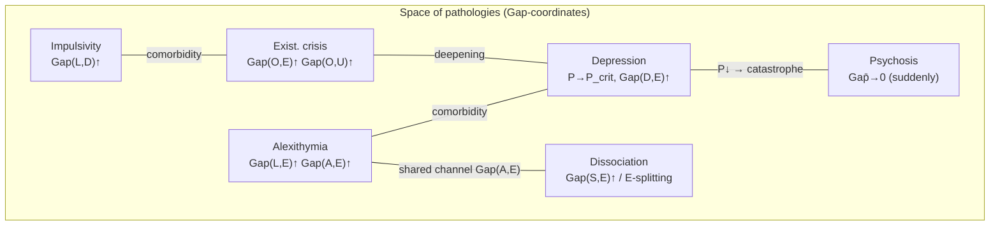
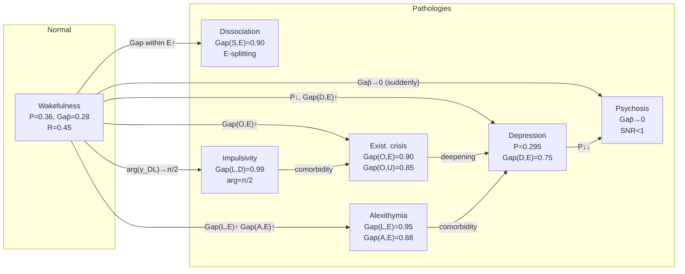

# Pathology of Consciousness

:::info Bridge from the previous chapter
In [Attention and Memory](/docs/consciousness/states/attention-memory) we examined the *normal* mechanisms of coherence control: attention as a 'spotlight', memory as the kernel $K(\tau)$, forgetting as decoherence. Now we ask: **what happens when these mechanisms malfunction?** When certain channels get 'stuck' in an opaque state ($\mathrm{Gap} \to 1$), or conversely, all channels suddenly become transparent? Each pathology is not a 'breakdown', but a **specific Gap-profile**: a configuration of $\Gamma$ amenable to formal description and — potentially — targeted correction.
:::

:::note On notation
In this document:
- $\Gamma$ — [coherence matrix](/docs/core/dynamics/coherence-matrix), $\gamma_{ij}$ — its elements
- $\mathrm{Gap}(i,j) = |\sin(\arg(\gamma_{ij}))|$ — [gap measure](/docs/core/dynamics/gap-operator#определение)
- $P = \mathrm{Tr}(\Gamma^2)$ — [purity (viability)](/docs/core/dynamics/viability#определение-чистоты)
- $P_{\text{crit}} = 2/7$ — [viability threshold](/docs/core/dynamics/viability) **[T]**
- $R$ — [reflection measure](/docs/consciousness/foundations/self-observation#мера-рефлексии-r)
- $\overline{\mathrm{Gap}} = \frac{1}{21}\sum_{i<j} \mathrm{Gap}(i,j)$ — mean Gap
- L0–L4 — [levels of interiority](/docs/consciousness/hierarchy/interiority-hierarchy)
- Full notation table — see [Notation](/docs/reference/notation)
:::

:::warning Document status
All material in this document has status **[I]** — interpretation/application. Pathology of consciousness is an operationalisation of the [Gap-diagnostics](/docs/applied/research/gap-diagnostics) formalism; empirical validation requires a separate [research programme](/docs/applied/research/measurement-protocol). Mathematical definitions of Gap-profiles — **[D]**; identification with clinical categories — **[I]**.
:::

### Chapter roadmap

1. **Historical perspective** — from Kraepelin through DSM to RDoC and UHM
2. **Pathological Gap-patterns** — six clinical categories
3. **Summary table** — all pathologies in a single table
4. **Correspondence of Gap-patterns to DSM-5** — translation of the formalism
5. **Diagnostic protocol** — how to distinguish pathologies by Gap-profile
6. **Comorbidity** — superposition of Gap-patterns
7. **Corrective strategies** — therapy as targeted Gap-reduction
8. **Dynamics of transitions** — bifurcations of entry/exit from pathology
9. **Pathology space** — mermaid visualisation
10. **Phase diagram** — where pathologies are located

---

## 1. Historical perspective {#история}

### 1.1 Emil Kraepelin (1883): classification by course

Kraepelin — the father of nosological psychiatry. His key idea: mental diseases should be classified by *course* (outcome), rather than by *symptoms* (current picture). He distinguished two main forms:
- **Dementia praecox** (schizophrenia) — progressive deterioration
- **Manic-depressive psychosis** (bipolar disorder) — cyclical course

In the UHM formalism: schizophrenia — *monotone* decrease in the number of functional channels ($|\{(i,j): \mathrm{Gap} > \varepsilon_{\text{noise}}\}| \downarrow$); bipolar disorder — *oscillations* of $P(\tau)$ (Hopf bifurcation).

### 1.2 DSM: categorical approach (1952–2013)

The Diagnostic and Statistical Manual (DSM) — a categorical classification: each disorder is defined by a list of symptoms and inclusion/exclusion criteria. DSM has gone through 5 editions (I–5), gradually moving from psychodynamic concepts toward a descriptive approach.

**Problem with DSM:** categoricality. A patient 'has' or 'does not have' a disorder; the boundaries between categories are arbitrary; comorbidity (overlapping diagnoses) is the rule, not the exception. More than 50% of patients with depression have a comorbid anxiety disorder.

### 1.3 RDoC: dimensional approach (2010–present)

Research Domain Criteria (RDoC) — an initiative of the NIMH (National Institute of Mental Health, USA), proposing a *dimensional* approach: mental disorders are described not by categories but by *dimensions* (domains):
- Negative valence (fear, anxiety)
- Positive valence (reward, motivation)
- Cognitive systems (attention, memory)
- Social processes
- Arousal/regulatory systems

### 1.4 From RDoC to UHM

| Classical approach | UHM formalism |
|---------------------|---------------|
| DSM category (yes/no) | Gap-profile (continuous vector) |
| RDoC domain | Specific channel $\mathrm{Gap}(i,j)$ |
| Comorbidity | Superposition of Gap-patterns |
| Severity | Amplitude of Gap-deviation from norm |
| Course (Kraepelin) | Trajectory $\Gamma(\tau)$ |
| Therapy | Targeted Gap-reduction |

UHM combines the strengths of all three approaches: Kraepelinian nosological specificity (specific Gap-patterns), DSM operationality (numerical thresholds), RDoC dimensionality (continuous parameters).

---

Pathological states of consciousness are not 'breakdowns' of the mechanism, but **specific Gap-profiles**: configurations of the coherence matrix $\Gamma$ in which certain channels are anomalously opaque ($\mathrm{Gap} \to 1$) or anomalously transparent ($\mathrm{Gap} \to 0$). This document extends [Gap-diagnostics](/docs/applied/research/gap-diagnostics) with a systematic analysis of pathological patterns.

**Everyday analogy.** Healthy consciousness — like a house with windows of varying transparency: some are wide open, some are closed, but all are functional. Pathology — when certain windows get 'stuck': the emotion window permanently plastered shut (alexithymia), all windows flung open at once (psychosis), or when the whole house slowly sinks toward the foundation (depression at $P \to P_{\text{crit}}$).

---

## 2. Pathological Gap-patterns {#паттерны}

### 2.1 Alexithymia {#алекситимия}

:::info Definition (Alexithymia) [I]
**Alexithymia** (from Greek *a-lexis-thymos* — 'without words for feelings') — the inability to identify and verbalise emotions. Gap-profile:

$$
\mathrm{Gap}(L,E) \to 1, \quad \mathrm{Gap}(A,E) \to 1
$$

Both channels — logic–experience and attention–experience — are opaque. The subject can neither **notice** ($A$) nor **understand** ($L$) their own experiences ($E$).
:::

**Motivation for the definition.** Why exactly two channels, and not one? Alexithymia is a *double* deficit: (1) the person does not notice the emotion (Gap(A,E) is high — Jung's 'shadow') and (2) cannot verbalise it (Gap(L,E) is high — Freud's 'repression'). If only Gap(L,E) were high, the subject would notice the emotion but could not name it — that would be 'mild alexithymia'. Full alexithymia = double opacity.

Additional feature: $|\gamma_{SE}|$ can be high ($\mathrm{Gap}(S,E) < 1$) — the body 'feels', but the experience is neither registered by attention nor processed by logic. This explains *somatisation* in alexithymia: the experience 'bypasses' consciousness and manifests in the body (pain, fatigue, tension without a consciously felt emotion).

**Numerical example.** Full Gap-profile of a patient with alexithymia (E-sector channels):

| Channel | $|\gamma_{ij}|$ | $\mathrm{Gap}(i,j)$ | Interpretation |
|-------|:---:|:---:|:---|
| $(L,E)$ | $0.15$ | $0.95$ | Cannot name the feeling |
| $(A,E)$ | $0.10$ | $0.88$ | Does not notice the feeling |
| $(S,E)$ | $0.12$ | $0.20$ | Body responds (increased heart rate, sweating) |
| $(D,E)$ | $0.18$ | $0.30$ | Emotion is active, partially manifests |
| $(O,E)$ | $0.05$ | $0.45$ | Connection to ground is weakened |
| $(U,E)$ | $0.07$ | $0.40$ | Integration is moderate |

To the question 'what do you feel?' the patient answers: 'my pulse quickens' (body channel $S \to E$ is transparent), not 'I am afraid' (logic channel $L \to E$ is opaque).

**DSM-5 correspondence.** Alexithymia is not a separate DSM-5 diagnosis, but is present as a trait in: somatic symptom disorders (F45), autism spectrum disorders (F84), post-traumatic stress disorder (F43.1).

Comparison with [the alexithymia model in Gap-dynamics](/docs/core/dynamics/gap-dynamics#модельные-системы): that model considered a simplified one-channel (S,E) case; here — an extended model with two opaque channels.

### 2.2 Split neurosis (dissociation) {#невроз}

:::info Definition (Dissociation) [I]
**Split neurosis** — dissociation **within** the E-dimension. Gap-profile:

$$
\mathrm{Gap}(E_1, E_2) \to 1 \quad \text{within the E-sector}
$$

Formally: if the E-dimension is decomposed into subspaces $E = E_1 \oplus E_2$, then the coherences between them are opaque. The subject possesses two 'islands' of experience, unconnected to each other.
:::

In the 7-dimensional model without subspace decomposition, dissociation manifests as:

$$
\mathrm{Gap}(S,E) \to 1, \quad \mathrm{Gap}(D,E) \approx 0 \quad \text{(or vice versa)}
$$

— different aspects of experience (somatic vs. dynamic) are isolated from each other through differing transparency relative to E.

**Numerical example.** Patient with dissociative disorder (depersonalisation):

| Channel | Normal $\mathrm{Gap}$ | Dissociation $\mathrm{Gap}$ | Difference |
|-------|:---:|:---:|:---|
| $(S,E)$ | $0.20$ | $0.90$ | Body 'is not felt' |
| $(D,E)$ | $0.25$ | $0.15$ | Emotions 'work' |
| $(A,E)$ | $0.20$ | $0.30$ | Attention moderately reduced |
| $(L,E)$ | $0.25$ | $0.25$ | Logic preserved |

Subjectively: 'I see my hands, but they are not mine', 'I understand that I am happy, but I don't feel it in my body'. The body channel $(S,E)$ is blocked, the emotional channel $(D,E)$ is preserved — the 'islands' of experience are not connected.

**DSM-5 correspondence.** Dissociative disorders (F44): depersonalisation/derealisation (F48.1), dissociative identity disorder (F44.81), dissociative amnesia (F44.0).

**Analogy.** Dissociation — like a house divided by a wall: the left half knows about itself, the right — about itself, but they do not know about each other. One 'island' of experience may be emotionally rich ($\mathrm{Gap}(D,E) \approx 0$), and another — somatically aware ($\mathrm{Gap}(S,E) \approx 0$), but between them — a wall (Gap between these aspects $\to 1$).

### 2.3 Impulsivity {#импульсивность}

:::info Definition (Impulsivity) [I]
**Impulsivity** — action without logical processing. Gap-profile:

$$
\mathrm{Gap}(L,D) \to 1
$$

The logic–dynamics channel is opaque: dynamic processes ($D$) proceed without logical governance ($L$). At the same time $\mathrm{Gap}(D,E)$ may be low — the subject **feels** the impulse but cannot **evaluate** it.
:::

Additional characteristic:

$$
|\gamma_{DL}| > 0, \quad \arg(\gamma_{DL}) \approx \pi/2
$$

The connection between dynamics and logic **exists** (strong coherence $|\gamma_{DL}| > 0$), but is purely imaginary — the phase $\approx \pi/2$ means maximum gap between the 'external' (observed behaviour) and the 'internal' (logical evaluation). This is the key insight: **coherence does not imply transparency**. Coherence is a *connection*; Gap is the *opacity* of that connection.

**Numerical example.** An impulsive person:

| Parameter | Value | Interpretation |
|----------|:---:|:---|
| $|\gamma_{DL}|$ | $0.22$ | Connection is strong — 'knowledge' exists |
| $\arg(\gamma_{DL})$ | $1.45$ rad ($\approx \pi/2$) | Phase — maximum Gap |
| $\mathrm{Gap}(L,D) = |\sin(1.45)|$ | $0.99$ | Channel almost fully opaque |
| $\mathrm{Gap}(D,E)$ | $0.15$ | Feels the impulse |
| $R$ | $0.35$ | Self-aware (above threshold) |

This formalises the clinical observation: impulsive people often *know* that their behaviour is illogical (connection $|\gamma_{DL}|$ is high), but cannot *apply* this knowledge at the moment of action (the channel is opaque due to phase $\approx \pi/2$). 'I knew I shouldn't, but I couldn't stop' — a precise description of Gap(L,D) $\to 1$ with $|\gamma_{LD}| > 0$.

**DSM-5 correspondence.** Impulsivity is a transdiagnostic trait, present in: ADHD (F90), borderline personality disorder (F60.3), impulse control disorders (F63), addictions (F10–F19).

### 2.4 Existential crisis {#кризис}

:::info Definition (Existential crisis) [I]
**Existential crisis** — the experience of losing connection with the ground of being. Gap-profile:

$$
\mathrm{Gap}(O,E) \to 1
$$

The ground–experience channel is opaque: experience ($E$) is disconnected from the ontological ground ($O$). The subject experiences 'meaninglessness' — experience exists, but is deprived of deep connection to its source.
:::

Extended profile in deep existential crisis:

$$
\mathrm{Gap}(O,E) \to 1, \quad \mathrm{Gap}(O,U) \to 1
$$

Loss of connection of the ground with both experience and unity — 'a world without meaning and without wholeness'.

**Numerical example.** Comparison of a healthy person and a person in existential crisis (O-sector channels):

| Channel | Normal | Crisis | Subjectively |
|-------|:---:|:---:|:---|
| $(O,E)$ | $0.25$ | $0.90$ | 'Life is meaningless' |
| $(O,U)$ | $0.30$ | $0.85$ | 'The world is fragmented' |
| $(O,S)$ | $0.35$ | $0.50$ | 'The body is alien' |
| $(O,L)$ | $0.25$ | $0.55$ | 'Logic doesn't help' |
| $(O,D)$ | $0.30$ | $0.40$ | 'Actions are purposeless' |
| $(O,A)$ | $0.20$ | $0.35$ | 'Attention is scattered' |

The coherences $|\gamma_{OE}|$ and $|\gamma_{OU}|$ remain non-zero (objectively the connection to the ground *exists*), but subjectively it is 'not felt'. This is precisely why existential therapy is aimed at reducing $\mathrm{Gap}(O,E)$ — restoring the *experience* of connection, not creating it.

**DSM-5 correspondence.** Existential crisis is not a DSM-5 diagnosis, but overlaps with: major depressive disorder (F32/F33), generalised anxiety disorder (F41.1), adjustment disorder (F43.2).

### 2.5 Depression {#депрессия}

:::tip Interpretation (Depression as stagnation) [I]
**Depression** — stagnation of viability near the critical threshold:

$$
P \to P_{\text{crit}} + \varepsilon, \quad \frac{dP}{d\tau} \approx 0, \quad \varepsilon \ll 1
$$

The system 'hangs' just above the viability threshold $P_{\text{crit}} = 2/7 \approx 0.286$: sufficient coherence for existence, but insufficient for development. The rate of change of $P$ is close to zero — neither improvement nor deterioration.
:::

**Motivation.** Why is depression defined through $P$, and not only through Gap? Because depression is a *systemic* state: not one specific channel is blocked, but the entire system has 'sunk' toward the threshold. Gap-profile in depression:

- $\overline{\mathrm{Gap}}$ is elevated (overall opacity)
- $\mathrm{Gap}(D,E) \uparrow$ — dynamics disconnected from experience (*anhedonia*: inability to experience pleasure)
- $\mathrm{Gap}(D,U) \uparrow$ — dynamics disconnected from unity (loss of purposiveness)
- $R$ may be normal or even elevated — *depressive rumination* is a form of reflection, but directed at an unchanging Gap-profile

**Numerical example (detailed).**

| Parameter | Healthy | Mild depression | Severe depression |
|----------|:---:|:---:|:---:|
| $P$ | $0.36$ | $0.31$ | $0.295$ |
| $P - P_{\text{crit}}$ | $0.074$ | $0.024$ | $0.009$ |
| $dP/d\tau$ | $+0.005$ | $\approx 0$ | $\approx 0$ |
| $\mathrm{Gap}(D,E)$ | $0.20$ | $0.50$ | $0.75$ |
| $\overline{\mathrm{Gap}}$ | $0.28$ | $0.40$ | $0.52$ |
| $R$ | $0.45$ | $0.45$ | $0.50$ (rumination) |
| Subjectively | 'Life is normal' | 'Everything is grey' | 'Grey emptiness' |

The system literally 'balances on the edge' — too close to $P_{\text{crit}}$ to develop, but far enough not to die. The absence of positive $dP/d\tau$ is experienced as [anhedonia](/docs/consciousness/phenomenology/emotional-taxonomy#базовые-координаты): valence $\approx$ 0, activation $\approx$ 0 — 'grey emptiness'.

**Important:** $R$ in depression can be *elevated*. Rumination (endless 'chewing over' of thoughts) raises reflection, but is directed at an unchanging Gap-profile. This explains the *depressive realism* paradox: depressed patients often have more accurate probability estimates and assessments of their own capabilities — their $\varphi(\Gamma)$ more accurately reflects $\Gamma$, but the $\Gamma$ itself is pathological.

**DSM-5 correspondence.** Major depressive disorder (F32/F33): depressed mood, anhedonia, sleep/appetite disturbances, suicidal ideation. In UHM: $P \to P_{\text{crit}}$, $\mathrm{Gap}(D,E) \uparrow$, $dP/d\tau \approx 0$.

### 2.6 Psychosis {#психоз}

:::info Definition (Psychosis) [I]
**Psychosis** — sudden global decrease of Gap while maintaining $R$:

$$
\overline{\mathrm{Gap}} \to 0 \quad \text{(suddenly)}, \quad R \geq R_{\text{th}}
$$

All boundaries between dimensions **dissolve simultaneously** — the system becomes 'fully transparent', but without preparation and without noise immunity.
:::

**Key distinction: psychosis vs. samādhi.** Both states are characterised by low $\overline{\mathrm{Gap}}$ — 'all windows are open'. But:

| | Samādhi | Psychosis |
|--|:-------:|:------:|
| Mechanism of Gap-reduction | Controlled ($\varphi$-optimisation) | Uncontrolled ([catastrophe](/docs/core/dynamics/gap-dynamics#бифуркации)) |
| Speed | Gradual (hours–days) | Sudden (minutes–hours) |
| Hamming bound | Functionally satisfied ($\geq 3$ channels with $\mathrm{Gap} > \varepsilon_{\text{noise}}$) | Functionally violated ($< 3$ channels with $\mathrm{Gap} > \varepsilon_{\text{noise}}$) |
| Error correction | Works | Does not work |
| Reversibility | Natural return | Requires pharmacotherapy |

Unlike [samādhi](/docs/consciousness/states/altered-states#самадхи), in psychosis:
- Gap-reduction is **uncontrolled** (not through $\varphi$-optimisation, but through [catastrophe](/docs/core/dynamics/gap-dynamics#бифуркации))
- The [Hamming bound](/docs/consciousness/hierarchy/gap-characterization#граница-хэмминга) is **structurally satisfied** ($\geq 3$ channels with $\mathrm{Gap} > 0$), but **functionally violated** — fewer than 3 channels maintain $\mathrm{Gap} > \varepsilon_{\text{noise}}$ (see [section 8.3](#психоз-хэмминг) [T])
- Error correction $\varphi$ is impossible — the remaining channels have signal-to-noise ratio $< 1$

**Numerical example.** Normal vs. psychosis:

| Parameter | Normal | Psychosis | Samādhi |
|----------|:---:|:---:|:---:|
| $\overline{\mathrm{Gap}}$ | $0.28$ | $0.05$ | $0.08$ |
| Gaps $> \varepsilon_{\text{noise}}$ | $\sim 18$ | $\sim 1$ | $\sim 5$ |
| $R$ | $0.45$ | $0.40$ | $0.92$ |
| Noise immunity | Normal | Lost | Preserved |
| Subjectively | Ordinary experience | 'Everything is connected, everything is significant' | 'Everything is clear, everything is one' |

In psychosis: 'everything is connected, everything is significant' — because Gap $\to 0$ for all channels. But unlike samādhi, there are no 'check' channels to separate real connections from noise. Hence — delusions (false connections taken as real) and hallucinations (internal coherences perceived as external).

**Analogy.** Psychosis vs. samādhi: both — 'all windows are open'. But samādhi is a controlled opening, in which the remaining closed windows (at minimum 3) reliably lock out interference. Psychosis is a hurricane that has torn off all the shutters: the windows are open, but the house is unprotected, and any gust of wind (noise, external stimulus) freely enters.

**DSM-5 correspondence.** Schizophrenia (F20), schizoaffective disorder (F25), brief psychotic disorder (F23). Positive symptoms (delusions, hallucinations) = $\overline{\mathrm{Gap}} \to 0$; negative symptoms (avolition, alogia) = $\mathrm{Gap}(D,E) \uparrow$, $\mathrm{Gap}(L,E) \uparrow$.

---

## 3. Summary table of pathologies {#сводная-таблица}

| Pathology | Key channels | $\overline{\mathrm{Gap}}$ | $P$ | $R$ | Level |
|-----------|----------------|:-------------------------:|:---:|:---:|:-------:|
| **Alexithymia** | Gap(L,E)↑, Gap(A,E)↑ | Moderate | Normal | Normal | L2 |
| **Dissociation** | Gap within E-sector | High | Normal | Normal | L2 |
| **Impulsivity** | Gap(L,D)↑ | Moderate | Normal | Reduced | L2 |
| **Exist. crisis** | Gap(O,E)↑, Gap(O,U)↑ | Elevated | Reduced | Normal/↑ | L2 |
| **Depression** | Gap(D,E)↑, Gap(D,U)↑ | Elevated | $\to P_{\text{crit}}$ | Normal/↑ | L2 (stag.) |
| **Psychosis** | All Gap↓ (suddenly) | $\to 0$ | Varies | Normal | L2 (unstab.) |

---

## 4. Correspondence of Gap-patterns to DSM-5 diagnoses {#dsm-таблица}

| Gap-pattern | DSM-5 category | Code | Key parameter |
|-------------|----------------|:---:|:---|
| Gap(L,E)↑ + Gap(A,E)↑ | Somatic symptom disorders | F45 | Alexithymia |
| Gap(L,E)↑ + Gap(A,E)↑ | ASD | F84 | Emotional opacity |
| Gap within E-sector | Dissociative disorders | F44 | Depersonalisation |
| Gap(L,D)↑ | ADHD | F90 | Impulsivity |
| Gap(L,D)↑ | Borderline personality disorder | F60.3 | Impulsivity + affect |
| Gap(O,E)↑ | Adjustment disorder | F43.2 | Loss of meaning |
| Gap(D,E)↑, $P \to P_{\text{crit}}$ | Major depressive disorder | F32/F33 | Anhedonia + stagnation |
| $\overline{\mathrm{Gap}} \to 0$ (suddenly) | Schizophrenia | F20 | Loss of noise immunity |
| Oscillations $P(\tau)$ | Bipolar disorder | F31 | Hopf bifurcation |
| Gap(D,E)↑ + Gap(A,E)↑ | PTSD | F43.1 | Avoidance + anhedonia |
| Gap(A,E)↑ (sustained) | Generalised anxiety disorder | F41.1 | Hypervigilance + opacity |

**Important:** the correspondence is not one-to-one. One Gap-pattern can occur in multiple DSM diagnoses, and one diagnosis can include multiple Gap-patterns. This reflects the real clinical picture: comorbidity is the rule, not the exception.

---

## 5. Diagnostic protocol {#протокол}

The full 'Dual Interview' protocol is described in [Gap-diagnostics](/docs/applied/research/gap-diagnostics#протокол). For pathological states it is supplemented by:

### 5.1 Steps of pathological diagnosis

1. **Construction of Gap-profile** — standard protocol from [Gap-diagnostics](/docs/applied/research/gap-diagnostics#карта-прозрачности)
2. **Identification of key channels** — channels with $\mathrm{Gap}(i,j) > 0.8$
3. **Comparison with patterns** — table from [section 3](#сводная-таблица)
4. **Assessment of viability** — $P$ and $dP/d\tau$
5. **Determination of the dynamic regime** — stagnation, oscillations or bifurcation (see [bifurcation theory](/docs/core/dynamics/gap-dynamics#бифуркации))

### 5.2 Differential diagnosis

:::tip Interpretation (Distinguishing pathologies by Gap-profile) [I]
Two pathologies are distinguishable if and only if there exists a channel $(i,j)$ for which their Gap-values differ substantially:

$$
\text{Distinguishability:} \quad \exists\, (i,j): |\mathrm{Gap}_1(i,j) - \mathrm{Gap}_2(i,j)| > \delta_{\text{diagn}}
$$

where $\delta_{\text{diagn}}$ — the diagnostic distinguishability threshold.
:::

**Example of differential diagnosis: alexithymia vs. dissociation.**

| Channel | Alexithymia | Dissociation | Difference |
|-------|:---:|:---:|:---:|
| Gap(L,E) | $\to 1$ | $< 1$ | $> 0.5$ |
| Gap(A,E) | $\to 1$ | $< 1$ | $> 0.5$ |
| Gap(S,E) | $< 1$ | $\to 1$ | $> 0.5$ |
| Gap(D,E) | $< 1$ | Varies | Varies |

Key distinction: in alexithymia the 'higher-order' channels (attention, logic) are opaque; in dissociation — the 'lower-order' ones (structure, body). A diagnostic threshold $\delta_{\text{diagn}} \geq 0.3$ ensures reliable differentiation.

**Example: depression vs. existential crisis.**

| Channel | Depression | Exist. crisis | Difference |
|-------|:---:|:---:|:---:|
| Gap(D,E) | $\to 1$ (anhedonia) | Moderate | $> 0.3$ |
| Gap(O,E) | Moderate | $\to 1$ (meaninglessness) | $> 0.3$ |
| $P$ | $\to P_{\text{crit}}$ | Reduced, not critical | $> 0.02$ |
| $R$ | Normal/↑ (rumination) | Normal/↑ | $\approx 0$ |

In depression, the key channel is dynamics ($D$); in crisis — the ground channel ($O$). Both can coexist (comorbidity, section 6).

---

## 6. Comorbidity as superposition of Gap-patterns {#коморбидность}

### 6.1 Superposition principle

Comorbidity — the simultaneous presence of multiple pathologies — is described in UHM as **superposition of Gap-patterns**: if pathology A is characterised by $\mathrm{Gap}_A(i,j) \to 1$ for a set of channels $C_A$, and pathology B — for set $C_B$, then comorbidity A+B = $C_A \cup C_B$.

$$
\mathbf{G}_{\text{comor}} = \max(\mathbf{G}_A, \mathbf{G}_B)
$$

(channel-by-channel: for each $(i,j)$ we take the maximum Gap from the two patterns).

### 6.2 Examples of comorbidity

**Depression + alexithymia** (clinically common):

| Channel | Depression | Alexithymia | Comorbidity |
|-------|:---:|:---:|:---:|
| Gap(D,E) | $0.75$ | $0.30$ | $0.75$ |
| Gap(L,E) | $0.30$ | $0.95$ | $0.95$ |
| Gap(A,E) | $0.25$ | $0.88$ | $0.88$ |
| Gap(D,U) | $0.70$ | $0.35$ | $0.70$ |
| $\overline{\mathrm{Gap}}$ | $0.40$ | $0.38$ | $0.52$ |
| $P$ | $0.295$ | $0.34$ | $0.29$ |

Result: in comorbidity, $\overline{\mathrm{Gap}}$ and $P$ deteriorate multiplicatively — not simply 'the sum of two problems', but mutual amplification. The patient can neither recognise emotions (alexithymia) nor act on the unrecognised ones (depression) — a deadlock.

**Impulsivity + existential crisis** (borderline disorder):

| Channel | Impulsivity | Exist. crisis | Comorbidity |
|-------|:---:|:---:|:---:|
| Gap(L,D) | $0.99$ | $0.40$ | $0.99$ |
| Gap(O,E) | $0.30$ | $0.90$ | $0.90$ |
| Gap(O,U) | $0.35$ | $0.85$ | $0.85$ |

Subjectively: 'life is meaningless and I cannot control my actions' — the typical phenomenology of borderline personality disorder (F60.3).

### 6.3 Visualisation of pathology space



---

## 7. Corrective strategies {#коррекция}

### 7.1 Principles of correction

Each pathology is a specific Gap-profile. Correction = targeted modification of Gap in specific channels:

:::info Definition (Therapeutic target) [I]
**Therapeutic target** for a pathology with Gap-profile $\mathbf{G}_{\text{pat}}$ — bringing it to the target profile $\mathbf{G}_{\text{target}}$:

$$
\text{Goal:} \quad \mathbf{G}(\Gamma(\tau)) \to \mathbf{G}_{\text{target}} \quad \text{as} \quad \tau \to \infty
$$

while maintaining $P > P_{\text{crit}}$ and $R \geq R_{\text{th}}$ throughout the trajectory.

**Key constraint:** $\mathbf{G}_{\text{target}} \neq \mathbf{0}$ — full transparency is impossible and dangerous (see [psychosis](#психоз)). The goal is not to 'cure everything' but to bring the Gap-profile to a functional state where all pathological channels are below the threshold and the 'check' channels (Hamming bound) are preserved.
:::

### 7.2 Three correction modalities

| Modality | Mechanism | Target parameters | Speed | Examples |
|-------------|----------|-------------------|:--------:|---------|
| **Therapy** | Targeted Gap-reduction | Specific $\mathrm{Gap}(i,j) \downarrow$ | Months | CBT: Gap(L,E)↓; somatic: Gap(S,E)↓ |
| **Medications** | Global shift of parameters | $\Gamma_2, \kappa, \omega_c$ | Weeks | Antidepressants: $\kappa \uparrow$; antipsychotics: $\overline{\mathrm{Gap}} \uparrow$ |
| **Practices** | Voluntary $\varphi$-optimisation | $R \uparrow$, E-sector Gap$\downarrow$ | Months–years | [Meditation](/docs/consciousness/states/altered-states#медитация) |

**Numerical example: three modalities for depression.**

| Modality | Before | After | Time | Mechanism |
|-------------|:---:|:---:|:---:|:---|
| CBT | Gap(D,E)=0.75 | Gap(D,E)=0.35 | 3–6 months | Verbalisation of emotions |
| SSRI | $P=0.295$ | $P=0.33$ | 2–4 weeks | Increase of $\kappa$ (serotonin) |
| Mindfulness | $\overline{\mathrm{Gap}}=0.52$ | $\overline{\mathrm{Gap}}=0.35$ | 6–12 months | $R \uparrow$, global Gap-reduction |

Optimal strategy: a *combination* of modalities. SSRI raises $P$ from the critical zone (fast effect); CBT reduces the specific Gap(D,E) (medium effect); mindfulness restructures the overall Gap-profile (long-term effect).

### 7.3 Correspondence of therapeutic approaches and channels

| Channel | Therapeutic approach | Goal | Numerical target |
|-------|----------------------|------|:-----------------:|
| Gap(L,E)↓ | CBT, psychoanalysis | Verbalisation — understanding of experiences | From 0.90 to 0.25 |
| Gap(A,E)↓ | Mindfulness, gestalt | Awareness — noticing of experiences | From 0.85 to 0.20 |
| Gap(S,E)↓ | Body-oriented therapy | Somatic awareness | From 0.80 to 0.25 |
| Gap(D,E)↓ | Expressive therapy | Restoration of affective contact | From 0.75 to 0.20 |
| Gap(O,E)↓ | Existential therapy | Restoration of connection to the ground | From 0.90 to 0.30 |
| Gap(L,D)↓ | Behavioural therapy | Logical control of impulses | From 0.95 to 0.30 |

### 7.4 Limitations of correction

By the [Theorem on incomplete transparency](/docs/consciousness/states/unconscious#теорема-неполная-прозрачность), even ideal therapy cannot bring $\overline{\mathrm{Gap}} = 0$: at minimum 3 out of 21 channels retain a non-zero Gap. The goal of correction is not the elimination of all Gaps, but the **redistribution** of opacity from pathological channels into 'check' channels (structurally necessary).

**Analogy.** The goal of therapy is not to knock down all the walls in the house (full transparency is impossible and dangerous — see psychosis), but to move the walls to where they perform a load-bearing function, removing them from where they impede life. The three 'load-bearing walls' (Hamming bound) will always remain.

---

## 8. Dynamics of pathological transitions {#динамика}

### 8.1 Entry into pathology

The transition from normal to pathological state — a [bifurcation](/docs/core/dynamics/gap-dynamics#бифуркации) of the Gap-landscape:

| Bifurcation type | Transition | Clinical analogue | Speed |
|----------------|---------|---------------------|:--------:|
| Saddle-node | Sudden loss of stable Gap-profile | Acute crisis, psychotic episode | Hours–days |
| Pitchfork | Splitting into two Gap-profiles | Dissociation, existential choice | Weeks |
| Hopf | Stationary → oscillating Gap | Bipolar disorder | Months |

(For more detail — [Gap-dynamics, section 3](/docs/core/dynamics/gap-dynamics#бифуркации))

**Numerical example: bipolar disorder as Hopf bifurcation.**

In the normal state: $P = 0.36$, $dP/d\tau \approx 0$ (stationary point). At Hopf bifurcation, the stationary point loses stability and $P(\tau)$ begins to oscillate:

$$
P(\tau) = P_0 + A \cdot \sin(\omega \tau) = 0.36 + 0.05 \cdot \sin(\omega \tau)
$$

| Phase | $P$ | $dP/d\tau$ | $\mathrm{Gap}(D,E)$ | Subjectively |
|------|:---:|:---:|:---:|:---|
| Mania (maximum) | $0.41$ | $> 0$ | $0.10$ | Euphoria, grandiosity |
| Transition | $0.36$ | $0$ | $0.20$ | Instability |
| Depression (minimum) | $0.31$ | $< 0$ | $0.50$ | Anhedonia, helplessness |
| Transition | $0.36$ | $0$ | $0.20$ | Instability |

The oscillation period ~weeks–months, consistent with the clinical picture of bipolar disorder type I.

### 8.2 Exit from pathology

Therapeutic exit — reverse bifurcation or gradual shift of parameters. By [non-Markovian dynamics](/docs/applied/coherence-cybernetics/non-markovian), the exit speed is determined by the memory depth:

$$
\tau_{\text{exit}} \propto \tau_{\text{mem}} \cdot \max_{(i,j) \in \text{pat}} \mathrm{Gap}(i,j)
$$

The longer the memory ($\tau_{\text{mem}}$) and the deeper the opacity, the longer the therapy. For more on non-Markovian effects — see [Attention and Memory](/docs/consciousness/states/attention-memory#память).

**Numerical example: exit time from different pathologies.**

| Pathology | $\tau_{\text{mem}}$ | $\max \mathrm{Gap}$ | $\tau_{\text{exit}}$ | In practice |
|-----------|:---:|:---:|:---:|:---|
| Mild impulsivity | 1 year | $0.80$ | $\propto 0.8$ | 3–6 months of therapy |
| Moderate depression | 3 years | $0.75$ | $\propto 2.25$ | 6–12 months |
| Alexithymia (from childhood) | 20 years | $0.95$ | $\propto 19$ | 2–5 years |
| Dissociation (traumatic) | 15 years | $0.90$ | $\propto 13.5$ | 2–4 years |

#### Definition of ε_noise from first principles [T] {#определение-epsilon-noise}

:::info Definition (Functional detectability threshold)
**Functional noise threshold** of channel (i,j):

$$\varepsilon_{\text{noise}} := \frac{\mathrm{Gap}_{\min}}{\mathrm{SNR}_{\text{th}}}$$

where:
- $\mathrm{Gap}_{\min} = \bar{\varepsilon} \approx 0.023$ — the minimum non-zero Gap from the sectoral bound [T-80 [T]](/docs/physics/gauge-symmetry/fano-selection-rules): for non-O coherences $\mathrm{Gap}(i,j) \leq \bar{\varepsilon}$ under O-sector dominance
- $\mathrm{SNR}_{\text{th}} = 1$ — standard signal detection threshold (signal-to-noise ratio = 1, detection at 50% error probability)

$$\varepsilon_{\text{noise}} \approx 0.023$$

This value is **derived** from the octonionic structure (O-sector dominance [T]) and standard signal detection theory — not postulated.
:::

**Interpretation:** A channel $(i,j)$ with $\mathrm{Gap}(i,j) < \varepsilon_{\text{noise}}$ has SNR $< 1$ for error correction of the self-model $\varphi$. Structurally Gap $> 0$ (Hamming bound [T-41g]), but functionally the channel is 'deaf' — $\varphi$-errors in this channel are not corrected.

### 8.3 Psychosis and the Hamming bound {#психоз-хэмминг}

:::warning Theorem (Structural vs. functional loss) [T] (T-90)
The Hamming bound is a **structural** property of the code H(7,4), holding for any L2-system: $|\{(i,j): \text{Gap}(i,j) > 0\}| \geq 3$ **[T]** (41g). Psychosis is a **functional** loss, not a structural violation: $|\{(i,j): \text{Gap}(i,j) > \varepsilon_{\text{noise}}\}| < 3$, while formally Gap $> 0$ for $\geq 3$ pairs. The Hamming bound guarantees Gap $> 0$, but does not guarantee Gap $> \varepsilon_{\text{noise}}$ **[T]**.
:::

Thus, in psychosis:
- The Hamming bound is **not violated** — at minimum 3 channels with $\mathrm{Gap}(i,j) > 0$ always exist (structural theorem)
- However, the remaining channels have signal-to-noise ratio $< 1$: $\mathrm{Gap}(i,j) < \varepsilon_{\text{noise}} \approx 0.023$
- The system is **formally** viable (L2), but **functionally** loses noise immunity of self-modelling
- Antipsychotics restore Gap in the 'check' channels **above** $\varepsilon_{\text{noise}}$, restoring functional error correction

Empirical verification: correlation between psychotic symptom scales and the number of channels with $\mathrm{Gap} > \varepsilon_{\text{noise}}$ in the [measurement protocol](/docs/applied/research/measurement-protocol). Connection to [CC theorems](/docs/applied/coherence-cybernetics/theorems) — through T-90 and the Hamming bound.

---

## 9. Pathology space: visualisation {#пространство-патологий}



---

## 10. Map of pathologies on the phase diagram {#фазовая-диаграмма}

Pathological states are projected onto the [phase diagram](/docs/core/dynamics/gap-phase-diagram):

```
    t (T_eff/T_c)
    │
  2 ┤    Phase II (L0): Gap uniform
    │    Psychosis: jump here from Phase I
    │
  1 ┤─ ─ ─ ─ ─ ─ ─ ─ ─ ─ ─ ─ ─ ─ ─ ─ ─
    │  Alexithymia,   Depression: P → P_crit
    │  Neurosis,      (stagnation)
    │  Impulsivity
    │  (Phase I: anisotropic Gap)
    │
  0 ┤═══════════════════════════════════════
    │    Phase III: dead zone (r < r_c)
    └──────────────────────────────────── r
         r_c                           →
```

**Interpretation:**
- **Phase I** (anisotropic Gap) — normal consciousness and most pathologies. The Gap-profile is inhomogeneous: some channels are transparent, others opaque. Alexithymia, dissociation, impulsivity, existential crisis — all reside here, differing in their Gap-profile configuration.
- **Depression** — a special position in Phase I: near the lower boundary ($P \to P_{\text{crit}}$, $r \to r_c$). The system 'slides' toward the phase transition I→III (dead zone).
- **Psychosis** — a jump from Phase I to Phase II (uniform low Gap). Phase transition I→II, triggered by a [catastrophe](/docs/core/dynamics/gap-dynamics#бифуркации).
- **Phase III** — below $r_c$: the system loses viability. Clinical analogue: coma, vegetative state.

---

### What we learned {#итоги}

1. **Historical line**: Kraepelin (nosology) → DSM (categories) → RDoC (dimensions) → UHM (Gap-profiles as continuous dimensional patterns)
2. **Six pathologies** formalised as specific Gap-profiles: alexithymia, dissociation, impulsivity, existential crisis, depression, psychosis
3. **DSM-5 correspondence**: each Gap-pattern maps to one or several DSM categories; comorbidity = superposition of patterns
4. **Depression** = stagnation at $P \to P_{\text{crit}} + \varepsilon$; **psychosis** = uncontrolled Gap-reduction with functional loss of noise immunity
5. **Differential diagnosis** reduces to comparing Gap-profiles in key channels
6. **Comorbidity** = channel-by-channel superposition of Gap-patterns ($\max$), leading to multiplicative deterioration
7. **Therapy** = targeted Gap-reduction in pathological channels; three modalities (talk, pharmacological, practice)
8. **$\varepsilon_{\text{noise}} \approx 0.023$** — the functional 'detectability' threshold of a channel, derived from first principles [T]
9. **Bifurcations** determine entry/exit dynamics: saddle-node (crisis), pitchfork (dissociation), Hopf (bipolar disorder)

:::tip Bridge to the next chapter
We have completed the section 'States of consciousness': ASC, unconscious, attention/memory, pathology. Next we move to the section 'Subjects of consciousness' — what *types* of systems possess consciousness? The first chapter — [Pre-linguistic subjects](/docs/consciousness/subjects/pre-linguistic) — examines consciousness prior to the emergence of language: infants, higher animals, and the formal conditions of the L1-L2 transition without a verbal channel.
:::

## Connections

- **Gap-diagnostics:** [Applied Gap-diagnostics](/docs/applied/research/gap-diagnostics) — protocol and diagnostic patterns
- **Gap-dynamics:** [Bifurcations of the Gap-landscape](/docs/core/dynamics/gap-dynamics#бифуркации) — transition theory
- **Unconscious:** [Gap-structure of the unconscious](/docs/consciousness/states/unconscious) — definition of opaque sectors
- **Gap-characterisation of levels:** [Gap-signatures](/docs/consciousness/hierarchy/gap-characterization) — normal profiles for L0–L4
- **Altered states:** [ASC](/docs/consciousness/states/altered-states) — psychedelics and meditation as therapeutic trajectories
- **Viability:** [Viability measure](/docs/core/dynamics/viability) — threshold $P_{\text{crit}} = 2/7$
- **Measurement protocol:** [Measurement of Γ](/docs/applied/research/measurement-protocol) — empirical validation
- **CC Theorems:** [Coherence Cybernetics](/docs/applied/coherence-cybernetics/theorems) — T-90, Hamming bound, corrective strategies
