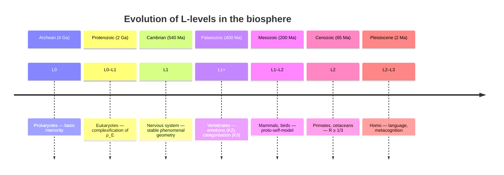

# Animal Consciousness

:::info Bridge from the previous chapter
In the previous chapter on [pre-linguistic consciousness](./pre-linguistic) we proved that language is **not** a necessary condition for consciousness. Now let us ask a concrete question: if consciousness is possible without language, then **which animals precisely** possess it — and at what level? This document constructs a systematic taxonomy, mapping biological species onto the L0–L4 levels of the UHM formalism.
:::

## Chapter roadmap

1. **The problem of other minds** — why we cannot simply 'ask'
2. **Historical context** — from Descartes to the Cambridge Declaration
3. **G-mapping** — bridge between biology and the $\Gamma$ formalism
4. **Full taxonomy** — from stone (L0) to primate (L2), step by step
5. **Cambridge Declaration (2012)** — compatibility with UHM
6. **Criteria for L-assignment** — operational indicators
7. **Plants and fungal networks** — non-obvious subjects
8. **Social systems** — when a flock is 'smarter' than the individual
9. **Evolutionary dynamics** — how L-levels grew over 4 billion years
10. **Falsifiability criterion** — how to refute the taxonomy

:::note On notation
In this document:
- $\Gamma$ — [coherence matrix](/docs/core/dynamics/coherence-matrix), $\gamma_{ij}$ — its elements
- $P = \mathrm{Tr}(\Gamma^2)$ — [purity (viability)](/docs/core/dynamics/viability#определение-чистоты)
- $P_{\text{crit}} = 2/7$ — [critical purity](/docs/core/dynamics/viability#критическая-чистота), status **[T]**
- $R$ — [reflection measure](/docs/consciousness/foundations/self-observation#мера-рефлексии-r), threshold $R_{\text{th}} = 1/3$ **[T]**
- $\Phi$ — [integration measure](/docs/core/structure/dimension-u#мера-интеграции-φ), threshold $\Phi_{\text{th}} = 1$ **[T]** (T-129)
- $\rho_E$ — [reduced experience matrix](/docs/consciousness/foundations/interiority-theory)
- L0–L4 — [interiority levels](/docs/consciousness/hierarchy/interiority-hierarchy)
- K1–K5 — [cognitive levels](/docs/consciousness/comparative/cognitive-hierarchy)
- Full notation table — in [Notation](/docs/reference/notation)
:::

## The problem of other minds {#проблема-других-разумов}

We will begin with the fundamental difficulty that has haunted the philosophy of consciousness since Descartes: **the problem of other minds**.

You know that **you** are conscious — it is the one thing you cannot doubt (cogito ergo sum). But how can you know that **another person** is conscious? You see their behaviour — a smile, tears, words — but have no direct access to their experiences. You conclude by analogy: 'they resemble me, so they probably experience things in the same way'.

With animals this problem sharpens many times over. You cannot ask a dog what it feels. You cannot ask an octopus to describe its experience. Behavioural analogies with humans become increasingly shaky as one moves further along the evolutionary tree: the 'facial expression' of a fish does not mean the same thing as that of a human.

UHM offers **a way out of the deadlock**. Instead of reasoning by analogy ('it winces, therefore it is in pain'), we ask precise questions about the coherence matrix:
- $\mathrm{rank}(\rho_E) > 1$? — Is there a non-trivial [phenomenal geometry](/docs/consciousness/hierarchy/interiority-hierarchy)?
- $R \geq 1/3$? — Does the system model its own states?
- $\Phi \geq 1$? — Are the dimensions of the system integrated?

These questions, in principle, have **operational answers** — via the [protocol for measuring $\Gamma$](/docs/applied/research/measurement-protocol). The problem of other minds does not disappear (we still need a G-mapping), but it is transformed from a philosophical deadlock into an **empirical programme**.

## Historical context: from Descartes to the Cambridge Declaration {#исторический-контекст}

### Descartes: animals as automata (1637)

René Descartes in the "Discourse on the Method" (1637) drew a sharp boundary between human and animal. The human possesses **res cogitans** (thinking substance) — a soul that thinks, feels, and is aware. Animals are merely **res extensa** (extended substance) — complex mechanisms, automata that respond to stimuli but experience nothing.

According to Descartes, the cry of a dog when struck is not an expression of pain but a mechanical reaction, akin to the creaking of door hinges. This position justified cruel treatment of animals in scientific experiments and everyday life for centuries.

In UHM terms: Descartes argued that $\mathrm{rank}(\rho_E) = 0$ for all animals — they have no interiority whatsoever. This is an extreme position, incompatible with modern neuroscientific data.

### Darwin: the continuity of consciousness (1872)

Charles Darwin in "The Expression of the Emotions in Man and Animals" (1872) made a revolution by showing **continuity** between the emotions of humans and animals. If humans descended from animals through gradual evolution, then their psyche — including consciousness — must have **precursors** in the animal world. Darwin described fear in dogs, curiosity in monkeys, grief in elephants — and insisted that these are **real** emotions, not mechanical reactions.

In UHM terms: Darwin intuitively described a **continuum of L-levels** — from the simplest organisms to complex ones, without a sharp boundary between consciousness and unconsciousness.

### Griffin: cognitive ethology (1976)

Donald Griffin in the book "The Question of Animal Awareness" (1976) founded **cognitive ethology** — the science of animal thought. He was the first to seriously raise the question: do animals possess **conscious experience**? His work opened the way to the systematic study of the cognitive capacities of animals: tool use, social modelling, self-recognition.

### The Cambridge Declaration on Consciousness (2012)

On 7 July 2012, a group of neuroscientists led by Philip Low signed the "Cambridge Declaration on Consciousness" at the University of Cambridge (in the presence of Stephen Hawking). The key thesis:

> "The convergence of evidence indicates that non-human animals possess the neurological substrates that generate consciousness. Non-human animals, including all mammals and birds, and many other creatures, including octopuses, possess these neurological substrates."

This was a historic moment: the scientific community officially acknowledged that **consciousness is not an exclusively human property**.

### UHM: formalisation and extension

UHM goes **further** than all predecessors:
- Further than Descartes: consciousness is not binary, but graduated (L0–L4)
- Further than Darwin: not only continuity, but **formal criteria**
- Further than Griffin: not only description, but **quantitative measures** ($R$, $\Phi$)
- Further than the Cambridge Declaration: not only vertebrates, but **all systems** with $\Gamma \neq 0$

## Interpretation I.1 (Taxonomic assignment of L-levels) {#таксономическое-присвоение}

:::info Interpretation I.1 (Taxonomic assignment of L-levels) [I]
Each biological taxon is assigned a range of L-levels based on **assessment** of the parameters of $\Gamma$ through observable behaviour and neurophysiological data. The assignment is an **interpretation**, not a theorem: the formal conditions of L-levels are strictly defined, but their mapping onto biological systems requires a G-mapping (see below).
:::

## G-functor: bridge between biology and $\Gamma$ {#g-функтор}

### What is a functor? A simple explanation

Before introducing the G-mapping formally, let us explain the key concept of a **functor** in plain terms.

Imagine two worlds: the **world of biology** (neurons, synapses, behaviour) and the **world of $\Gamma$** (coherence matrices, 7 dimensions, numbers). These are two different 'languages of description' for the same reality.

**A functor** is a 'translator' between worlds that preserves structure. A good translator does not merely translate words — it translates **relations**: if in biology 'neuron A excites neuron B', the translation must preserve this relation — 'coherence $\gamma_{ij}$ is non-zero'. Formally:

- Each biological state ($b$) is mapped by the functor to a matrix $\Gamma = G(b)$
- Each biological process ($f: b_1 \to b_2$) is mapped by the functor to a quantum channel $G(f): \Gamma_1 \to \Gamma_2$
- Composition is preserved: if $b_1 \xrightarrow{f} b_2 \xrightarrow{g} b_3$, then $G(g \circ f) = G(g) \circ G(f)$

The last condition — **functoriality** — means that the 'translation' of a sequence of processes coincides with the sequence of 'translations'. The translator does not distort the logic of the narrative.

#### Definition D.2 (G-mapping BioState → Γ) [D+C] {#g-отображение}

The G-mapping is defined as a functor $G: \mathbf{Bio} \to \mathbf{Hol}_7$ with three properties:

1. **Functoriality:** $G(f \circ g) = G(f) \circ G(g)$ — composition is preserved
2. **Viability:** $G(\text{living}) \in \mathcal{V}$ — living organisms are mapped to viable states ($P > P_{\text{crit}}$)
3. **L-compatibility:** $\text{Level}(G(b)) \geq \text{Level}_{\text{behav}}(b)$ — the formal level is no lower than the behaviourally assessed one

Upon fixing 7 observables, the mapping G is unique up to $G_2$-transformation ([T-42 [T]](/docs/proofs/categorical/uniqueness-theorem)). The construction of a concrete G for biological systems is an **empirical programme** [D+C], not a gap in the theory (proof of uniqueness: [T-42](/docs/proofs/categorical/uniqueness-theorem)).

**The uniqueness of G** is the key result. It means: if two researchers independently construct G-mappings, fixing the same 7 observables (viability, structure, dynamics, logic, interiority, observation, unity), their mappings will coincide **up to $G_2$-symmetry**. This is analogous to how two cartographers, having independently measured distances, will obtain the same map up to rotation and scale.

:::warning Biological L-levels [H]
The assignment of specific organisms to L-levels is a **hypothesis** [H], not a measured fact. A strict definition of L-level requires knowing the $\Gamma$ of the system. For biological systems, the protocol $\pi_{\text{bio}}$ is defined ([C31](/docs/applied/research/measurement-protocol)), but has **not been experimentally validated**. The correspondences given are well-grounded extrapolations from behavioural data.
:::

### Operationalisation of the G-mapping [I] {#операционализация-g}

$G: \mathrm{BioState} \to \mathcal{D}(\mathbb{C}^7)$ is unique up to $G_2$ [T T-42]. A concrete $G$ for biological systems is an **empirical programme** [I].

How in practice can one measure $\gamma_{kk}$ in a living organism? Each of the 7 dimensions can be assigned a **proxy** — an observable quantity correlating with the population:

**Proxy candidates for $\gamma_{kk}$:**
| Dimension | Proxy | Measurement method | What it reflects |
|-----------|--------|----------------|---------------------|
| A (action) | Boundary integrity | Metabolic intensity / surface area | How much the system is bounded from its environment |
| S (distinction) | Structural stability | Synaptic density (electron microscopy) | How stable the internal structures are |
| D (dynamics) | Dynamic range | Spike rate variability (MEA) | How diverse the system's dynamics are |
| L (learning) | Neuroplasticity | LTP/LTD coefficients | How capable the system is of change |
| E (interiority) | Differentiation | PCI (Perturbational Complexity Index) | How rich the internal experience is |
| O (observation) | Interoception | Insular activity (fMRI) | How much the system observes itself from within |
| U (integration) | Synchronisation | Global EEG coherence (gamma-band) | How much the parts of the system are unified into a whole |

**Falsification:** If independent operationalisations $G_1, G_2$ for the same organism systematically yield $\|\Gamma_1 - \Gamma_2\|_F > \varepsilon$ ($\varepsilon = 0.1$ in units of $\|\Gamma\|_F$), then $G$ is ambiguous and the theory requires revision.

## Full taxonomy of L-levels {#полная-таксономия}

Let us now apply the formalism to specific biological taxa — from stone to primate. For each level we provide: the formal condition, description, examples of organisms, an approximate $\Gamma$-profile, and justification.

### Stone: below L0 {#камень}

Strictly speaking, by [Axiom Ω⁷](/docs/core/foundations/axiom-omega), **any** physical system possesses $\Gamma \neq 0$ and, consequently, L0. But for non-living systems $\Gamma \approx I/7$ (maximally mixed state) — all dimensions are equally probable, coherences are zero.

$$
\Gamma_{\text{stone}} \approx \frac{1}{7}I_7, \quad P \approx \frac{1}{7} < P_{\text{crit}} = \frac{2}{7}
$$

A stone 'possesses' L0, but its $P$ is below the viability threshold. This is analogous to how a stone 'has' a temperature, but it means nothing for its 'experiences'.

### L0: Basic interiority {#l0}

**Condition:** $\Gamma \in \mathcal{D}(\mathcal{H})$, $\dim \mathcal{H} \geq 1$.

Any physical system possesses L0 — this is a consequence of [the universality of interiority](/docs/consciousness/hierarchy/interiority-hierarchy#уровень-0-интериорность-interiority). L0 is more a **potentiality** than actual experience. The system has an internal state but does not distinguish its aspects.

| Taxon | $\Gamma$-characteristic | Approximate profile $(\gamma_{AA}, \gamma_{SS}, \gamma_{DD}, \gamma_{LL}, \gamma_{EE}, \gamma_{OO}, \gamma_{UU})$ | Note |
|--------|------------------------|------|------------|
| Bacteria | $\Gamma \neq 0$, minimal coherence | $(0.20, 0.15, 0.18, 0.05, 0.05, 0.02, 0.05)$ | Chemotaxis as a $dP/d\tau$-response; high $\gamma_{AA}$, $\gamma_{DD}$ (action, dynamics) |
| Plants | $\gamma_{SD} > 0$ (phototropism) | $(0.18, 0.17, 0.16, 0.04, 0.03, 0.02, 0.10)$ | Slow dynamics, high $\gamma_{UU}$ (root integration) |
| Fungi | $\gamma_{SD} > 0$ (network structure) | $(0.15, 0.18, 0.14, 0.05, 0.03, 0.02, 0.13)$ | Mycelium as distributed $\Gamma$ |
| Viruses | $\Gamma \approx 0$ outside the host cell | — | Borderline case: viability ($P > P_{\text{crit}}$) only in symbiosis |

**Notes on the bacterium profile.** A bacterium (e.g. E. coli) is a small system with powerful action ($\gamma_{AA}$ — division, movement) and dynamics ($\gamma_{DD}$ — rapid response to the environment). Its 'logic' ($\gamma_{LL}$) is minimal — no nervous system, no learning. Interiority ($\gamma_{EE}$) is nearly zero — there is no basis for thinking that a bacterium 'experiences' anything. Nevertheless, chemotaxis (movement towards nutrients) formally looks like a $dP/d\tau$-response: the bacterium 'strives' towards states with higher viability.

### L0–L1: Transitional zone {#l0-l1}

**Transition condition:** $\mathrm{rank}(\rho_E) > 1$ — non-trivial [phenomenal geometry](/docs/consciousness/hierarchy/interiority-hierarchy).

The transition L0 → L1 is the moment when the system begins to **distinguish** its internal states. A simple analogy: a thermometer at L0 'has' a temperature, but does not distinguish 'hot' and 'cold' as different **states**. An L1 system — does distinguish.

Formally: $\mathrm{rank}(\rho_E) > 1$ means that the partial trace $\rho_E = \mathrm{Tr}_{-E}(\Gamma)$ has more than one non-zero eigenvalue. This means that the 'experiential space' of the system is not one-dimensional — it has **distinguishable directions**. If $\mathrm{rank}(\rho_E) = 1$, all experiences have 'collapsed' into a single point; if $> 1$, a **metric** emerges — some experiences are closer to each other, others more distant.

| Taxon | L1 features | $\mathrm{rank}(\rho_E)$ estimate | K-level | Concrete example |
|--------|-------------|-------------------------------|-----------|-------------------|
| Insects | Nociception, basic learning | $\geq 2$ (in some) | K1–K2 | The fruit fly (Drosophila) turns away from a painful stimulus and remembers it |
| Molluscs (simple) | Conditioned reflexes | $\sim 2$ | K1–K2 | Aplysia (sea hare): classical conditioning studied by Eric Kandel |
| Worms (C. elegans) | 302 neurons, chemotaxis | $\sim 1$–$2$ | K1 | Exactly 302 neurons; full connectome map is known |

### L1: Phenomenal geometry {#l1}

**Condition:** $\mathrm{rank}(\rho_E) > 1$ — stably.

At level L1 there is **structured experience**: the [Fubini–Study](/docs/consciousness/foundations/interiority-theory#fubini-study-metric) metric on the space of qualities is non-trivial. The system 'distinguishes' interiority states but does not reflect them ($R < R_{\text{th}}$).

This is like the difference between a camera that records video (L0 — data exists, but no one is 'watching'), and a viewer who **sees** the picture but is not aware of watching (L1 — there is experience, but no reflection). A fish probably **feels** pain, but does not **know** that it feels pain.

| Taxon | Key coherences | Emotions (K2) | Categories (K3) | Numerical example of $\Gamma$-profile |
|--------|----------------------|-------------|----------------|------|
| Fish | $\gamma_{DE}$ (pain/pleasure), $\gamma_{AE}$ | Fear, relief | Predator/food | $(0.18, 0.16, 0.17, 0.08, 0.12, 0.08, 0.10)$; $\gamma_{DE} \approx 0.06$ |
| Amphibians | $\gamma_{SE}$, $\gamma_{DE}$ | Basic | Limited | $(0.17, 0.15, 0.16, 0.07, 0.10, 0.07, 0.10)$; $\gamma_{SE} \approx 0.05$ |
| Reptiles | $\gamma_{DE}$, $\gamma_{SD}$ (territoriality) | Fear, aggression | Territory/stranger | $(0.18, 0.16, 0.18, 0.09, 0.11, 0.08, 0.09)$; $\gamma_{SD} \approx 0.07$ |

**Notes on the $\Gamma$-profile of fish.** A fish (e.g. a goldfish) has:
- Moderate $\gamma_{AA}$, $\gamma_{DD}$ (action, dynamics) — swims, reacts
- Significant $\gamma_{EE} = 0.12$ — there is non-trivial interiority (pain, pleasure)
- Coherence $\gamma_{DE} \approx 0.06$ — connection between dynamics and experience (fear when a predator attacks)
- Low $\gamma_{LL}$ — minimal learning

This profile gives $P \approx 0.16$ — above $P_{\text{crit}} = 2/7 \approx 0.286$? No, the profile is approximate; for a viable fish $P$ must exceed the threshold, which means more pronounced coherences than shown in the simplified example.

:::warning L1 status for fish [C]
Assigning fish stable L1 is conditional on the interpretation of nociception as $\mathrm{rank}(\rho_E) > 1$. Alternative interpretation: nociception is purely reflex-based ($\gamma_{DE}$ without contribution to $\rho_E$). Resolution requires an operational [Γ measurement protocol](/docs/applied/research/measurement-protocol) for biological systems.
:::

### Ethical case: Animal rights and L-levels {#кейс-права-животных}

The L-level taxonomy has direct **ethical** implications. If a fish is at level L1, it **experiences** pain (through $\gamma_{DE}$), even though it does not reflect on it (L2). This creates a **graduated** ethics:

| L-level | Moral status | Practical implication |
|-----------|-----------------|----------------------|
| L0 | Minimal (potentiality) | No prohibition on use, but precautionary principle |
| L1 | Substantial (there is experience) | Prohibition on causing unnecessary suffering |
| L1–L2 | High (reflection possible) | Restrictions on captivity, experiments |
| L2 | Full (cognitive qualia) | Rights analogous to human (in principle) |

This is not abstract philosophy. A concrete implication: if fish possess L1, then industrial fishing in which fish suffocate in nets for hours **causes suffering** ($dP/d\tau < 0$ at $\mathrm{rank}(\rho_E) > 1$) — and this is ethically significant, even if the fish is incapable of reflecting on it.

For more on the ethical implications — see [UHM Ethics](/docs/consciousness/ethics-meaning/value-consciousness#необходимость-жизнеспособности).

### L1–L2: Candidates for cognitive qualia {#l1-l2}

**Condition for L2:** $R \geq 1/3$ and $\Phi \geq 1$.

The transitional zone L1–L2 is the most scientifically interesting. Here we find animals that **probably** possess reflection, but for which the data are ambiguous.

Key criteria for assessing $R$ in animals:

| Criterion | Connection to $R$ | Assessment method | What it shows |
|----------|-------------|--------------|----------------------|
| **Self-recognition** (mirror test) | High $R$ — the system models itself | Gallup's mark test (1970) | If the animal removes a mark from its face while looking in a mirror, it 'knows' that the reflection is itself |
| **Tool use** | High $\gamma_{DL}$ — [proto-logic](/docs/consciousness/subjects/pre-linguistic#протологика) | Observation in the wild | A tool is a means separated from the goal; this requires abstraction |
| **Social modelling** | High $R$ via a model of the other (Theory of Mind) | Competitive tasks | If the animal predicts the actions of another, it models another's consciousness — and hence its own |
| **Metacognition** | Direct evidence $R > R_{\text{th}}$ | "Confidence" in response | If the animal "doubts" the correctness of its choice (prefers easy tasks over hard ones), it is reflecting |

| Taxon | Mirror | Tools | ToM | Metacognition | L-assessment | Note |
|--------|---------|--------|-----|-------------|----------|------------|
| Crows (Corvidae) | Yes (magpie) | Yes (New Caledonian) | Partially | Possible | L1–L2 | Pallium neuron density comparable to primates |
| Parrots | Yes (some) | Limited | Partially | Unclear | L1–L2 | Alex (the grey parrot) understood the concept of zero |
| Octopuses | Unclear | Yes (coconut shell) | Unclear | Unclear | L1–L2 | 500 million neurons, 2/3 — in the arms (distributed $\Gamma$!) |

**The case of the New Caledonian crow** is particularly remarkable. These birds do not merely use tools — they **manufacture** them: they bend wire into a hook, trim pandanus leaves to the required shape. Moreover, they pass the tool-making technology to the next generation — this is **cultural transmission** ($\gamma_{SL}^{(\text{comp})}$ in [collective consciousness](./collective-consciousness)). In terms of neuron count in the pallium (the analogue of the cortex), crows are comparable to small primates.

**The case of the octopus** poses a unique problem for UHM. In the octopus, 2/3 of the neurons are located not in the brain but in the arms. Each arm can act **semi-autonomously**. This means that the octopus's $\Gamma$ may be **distributed** — more like a collective $\Gamma_{\text{comp}}$ than an individual $\Gamma$. The question: is the octopus a single subject — or nine (brain + 8 arms)?

### L2: Cognitive qualia {#l2}

**Condition:** $R(\Gamma) \geq R_{\text{th}} = 1/3$ **[T]**, $\Phi(\Gamma) \geq \Phi_{\text{th}} = 1$ **[T]** (T-129).

At level L2 there is genuine **reflection** — the system is aware of its own interiority states. These are [cognitive qualia](/docs/consciousness/hierarchy/interiority-hierarchy#l2-когнитивные-квалиа) in the strict sense.

| Taxon | $R$ (estimate) | $\Phi$ (estimate) | Evidence of L2 | Numerical example of $\Gamma$-profile |
|--------|-------------|-----------------|-----------------|------|
| Great apes | $0.35$–$0.5$ | $> 1$ | Mirror test, tools, ToM, symbols | $(0.16, 0.15, 0.15, 0.13, 0.14, 0.13, 0.14)$; significant coherences |
| Cetaceans (dolphins) | $0.3$–$0.45$ | $> 1$ | Mirror, social cognition, names | $(0.17, 0.14, 0.16, 0.12, 0.14, 0.12, 0.15)$ |
| Elephants | $0.3$–$0.4$ | $> 1$ | Mirror, empathy, death rituals | $(0.15, 0.14, 0.15, 0.11, 0.15, 0.14, 0.16)$ |

**Elephants' 'death rituals'** are among the most striking pieces of evidence for L2 in the animal world. Elephants return to the remains of deceased conspecifics, touch them with their trunks, and 'freeze' nearby for tens of minutes. They bring branches and soil, covering the remains. Young elephants encountering a dead conspecific for the first time display signs of confusion and distress.

In $\Gamma$ terms: this indicates high [empathy](/docs/consciousness/subjects/collective-consciousness#мера-эмпатии) ($\mathrm{Empathy}(A,B) \approx 1$) and reflection ($R \geq 1/3$) — the ability not merely to experience but to **be aware of** loss. The suffering of an elephant at the sight of a dead conspecific is $dP/d\tau < 0$ at $R \geq 1/3$: reflective suffering, not merely a pain reflex.

**Dolphins** display yet another remarkable piece of evidence for L2: **names**. Each bottlenose dolphin has a unique 'signature whistle' used by other dolphins to address it. The dolphin responds to its own whistle even in recordings. This is evidence of $\gamma_{LU}$ (logic–unity) — a symbolic marker for 'self', tied to individuality.

### L2–L3: Upper boundary {#l2-l3}

**Condition for L3:** $R^{(2)} \geq R^{(2)}_{\text{th}} = 1/4$ (metastable).

L3 is **reflection on reflection**: the system not only is aware of its states, but is aware of **the process of awareness itself**. 'I know that I know'. This requires $\varphi^{(2)}$ — a second-order self-model.

| Taxon | $R^{(2)}$ (estimate) | Conditions | Note |
|--------|-------------------|---------|------------|
| Human | $\geq 1/4$ (meditation, deep reflection) | Metastable | Stable L3 — [rare state](/docs/consciousness/hierarchy/interiority-hierarchy#l3-сетевое-сознание) |
| Bonobo (hypothesis) | $\sim 0.15$–$0.2$? | Social play? | Insufficient data |

Even for humans, L3 is a **metastable** state: it is reached in meditation, deep reflection, but is not maintained continuously. Most of the time we function at level L2.

## The Cambridge Declaration on Consciousness (2012) {#кембриджская-декларация}

### Interpretation I.2 (Compatibility with UHM) [I] {#совместимость-с-декларацией}

:::info Interpretation I.2 [I]
The Cambridge Declaration on Consciousness (2012) asserts the presence of 'conscious states' in mammals, birds, and other creatures with analogous neuroanatomical, neurochemical, and neurophysiological substrates.

This is consistent with UHM:
- 'Conscious states' $\leftrightarrow$ minimum L1 (phenomenal geometry)
- Neuroanatomical substrates $\leftrightarrow$ physical realisation of coherences $\gamma_{ij}$
- The Declaration covers **all** organisms with L1+, which in UHM includes all vertebrates and a number of invertebrates (cephalopods)
:::

However, UHM goes **further** than the Cambridge Declaration:

| Aspect | Cambridge Declaration | UHM |
|--------|------------------------|-----|
| Coverage | Mammals, birds, cephalopods | All systems with $\Gamma \neq 0$ (L0+) |
| Gradations | Binary: present/absent | 5 levels L0→L4 |
| Criterion | Neuroanatomical | Formal: $R$, $\Phi$, $\rho_E$ |
| Plants | Not mentioned | L0 (interiority) |
| Insects | Not mentioned | L0–L1 (possibly L1 for some) |
| Quantitative measure | None | $R$, $\Phi$, $P$ — computable |

The main advantage of UHM: **gradedness**. The Cambridge Declaration is forced to draw a sharp boundary: 'these creatures are conscious, those are not'. UHM says: all creatures are located on a continuum of L0–L4, and the question 'is it conscious?' is replaced by 'how conscious is it?'

## Key criteria for L-assignment {#критерии}

### Definition D.1 (Operational criteria for L-assignment for biological systems) [D] {#операциональные-критерии}

:::tip Definition D.1 [D]
For a biological system $\mathfrak{B}$, the L-level is determined via observable indicators:

| Indicator | Assesses | Method | Threshold |
|-----------|-----------|-------|-------|
| Nociception / hedonia | $\mathrm{rank}(\rho_E) > 1$ (L1) | Pharmacological tests | Presence of opioid receptors |
| Self-recognition | $R \geq R_{\text{th}}$ (L2) | Mark test, mirror test | Attempt to remove the mark |
| Tool use | $\gamma_{DL}$ — [proto-logic](/docs/consciousness/subjects/pre-linguistic#протологика) | Ethological observation | Manufacturing, not just using |
| Social cognition (ToM) | $R$ via conspecific models in $\Gamma_{\text{composite}}$ | Competitive paradigms | Predicting another's behaviour |
| Emotional complexity | [Sectoral signature](/docs/consciousness/phenomenology/emotional-taxonomy#карта-эмоций) $\sigma(\Gamma)$ | Affective neuroscience | More than 2 distinguishable emotional states |
| Metacognition | $R^{(2)} > 0$ (L3 potential) | "Confidence in response" tasks | Preference for easy tasks after an error |

This is a **convention**: the formal criteria for L-levels are defined in the [interiority hierarchy](/docs/consciousness/hierarchy/interiority-hierarchy), and their operationalisation through behavioural indicators is a separate task.
:::

## Plants and fungal networks {#растения-и-грибы}

### Plants: L0 with intriguing properties

Plants have no nervous system, but demonstrate complex behaviour:
- **Phototropism** — growth towards light ($\gamma_{AD}$ — action–dynamics, $\gamma_{SD}$ — structure–dynamics)
- **Gravitropism** — downward root growth
- **Response to damage** — emission of volatile substances warning neighbouring plants
- **Resource sharing** through mycorrhizal networks ('mother trees' share nutrients with seedlings)

In UHM: plants unquestionably possess L0. The question of L1 ($\mathrm{rank}(\rho_E) > 1$) remains open. Plant 'experience' (if it exists) would be radically different from animal experience: slow (hours and days instead of milliseconds), chemical (rather than electrical), distributed (no central 'processing').

### Fungal networks: distributed L0–L1?

Mycelium (the fungal body) is a network of hyphae (thin filaments) that can extend for kilometres. Recent research (work by Merlin Sheldrake, 2020) showed that fungal networks:

- **Transmit electrical signals** between nodes (analogous to neural activity)
- **Distribute resources** between trees via mycorrhiza ('Wood Wide Web')
- **Respond** to damage and alter the network architecture

In $\Gamma$ terms: a fungal network is a **distributed system**, where $\Gamma$ is not localised. This is closer to a [composite system](/docs/core/dynamics/composite-systems) $\Gamma_{\text{comp}}$ than to an individual $\Gamma$. Potentially, a fungal network the size of a forest could possess collective coherence inaccessible to an individual mycelium.

This is a **speculative** interpretation [H], but it illustrates the breadth of application of the UHM formalism.

## Composite Γ in social systems {#социальные-системы}

Animals do not exist in isolation. For flocks, families, and colonies it is necessary to account for the [composite coherence matrix](/docs/core/dynamics/composite-systems#составная-матрица):

$$
\Gamma_{\text{flock}} \in \mathcal{D}(\mathbb{C}^{7^N})
$$

Collective cognitive capacities (flock coordination, collective problem-solving in ants) may correspond to an L-level **exceeding** the individual one.

**A starling murmuration** is a classic example. Thousands of birds manoeuvre synchronously, forming complex three-dimensional shapes (murmurations). No individual bird 'knows' the overall shape — each tracks only 6–7 of its nearest neighbours. But the resulting pattern possesses coherence inaccessible to the individual: $\gamma_{DU}^{(\text{comp})} \gg \gamma_{DU}^{(\text{indiv})}$.

**An ant colony** demonstrates 'superorganismicity': the colony as a whole makes decisions (choosing the location of a new nest) that no individual ant is capable of making. The mechanism is **stigmergy**: communication through environmental modification (pheromone trails). In $\Gamma$ terms: stigmergy is $\gamma_{SD}^{(\text{comp})}$ (structure–dynamics in collective space), mediated by shared environment $E_{\text{shared}}$.

For more detail — [collective consciousness](./collective-consciousness).

## Evolutionary dynamics of L-levels {#эволюция}

### Why do L-levels grow?

The evolution of L-levels follows the logic of [viability](/docs/core/dynamics/viability): systems with a higher L more effectively maintain $P > P_{\text{crit}}$ in complex environments.

The mechanism is simple:
1. **The environment becomes more complex** — more predators, competitors, opportunities
2. **Simple systems (L0) cannot react quickly enough** — their $P$ fluctuates dangerously close to $P_{\text{crit}}$
3. **Systems with L1 (phenomenal geometry) distinguish threats better** — their $P$ is more stable
4. **Systems with L2 (reflection) are capable of planning** — their $P$ is actively maintained through self-modelling ($\varphi$)

This is not 'progress for the sake of progress' but **selection pressure**: in an environment with many threats and opportunities, a system capable of reflection ($R \geq 1/3$) responds faster to a decrease in $P$ and directs the [regenerative term](/docs/core/dynamics/evolution#3-регенеративный-член) $\mathcal{R}[\Gamma, E]$ more precisely.

Analogy: in a simple forest a tree needs only to grow upward (L0-strategy). In a complex ecosystem with competitors, parasites, and unpredictable weather, those that **model** the environment (L1) and **model themselves** in the environment (L2) survive — to adapt their strategy before $P$ falls below the critical threshold.

## Falsifiability criterion {#критерий-фальсифицируемости}

A scientific theory must be falsifiable. The L-level taxonomy is falsifiable via the following criterion:

**Criterion.** If two independent operationalisations of the G-mapping ($G_1$ and $G_2$) for the same organism systematically yield:

$$
\|\Gamma_1 - \Gamma_2\|_F > \varepsilon, \quad \varepsilon = 0.1 \text{ in units of } \|\Gamma\|_F
$$

then the G-mapping is ambiguous, and the L-level taxonomy for the given organism **has no predictive power**.

Concrete predictions for testing:
1. **All organisms that have passed the mirror test** must have $R \geq 0.25$ (lower estimate via behavioural proxies)
2. **All organisms with nociception** must have $\mathrm{rank}(\rho_E) \geq 2$
3. **The collective L-level of a flock** must be no lower than the individual: $\text{Level}(\Gamma_{\text{comp}}) \geq \max_i \text{Level}(\Gamma_i)$

If even one of these predictions is systematically violated with a correct G-mapping, the theory requires revision.

---

### What we learned {#что-мы-узнали}

1. **The problem of other minds** is transformed from a philosophical deadlock into an empirical programme: instead of analogies — measurable quantities ($R$, $\Phi$, $\rho_E$).
2. **From Descartes to UHM** — four centuries: from denial of animal consciousness to a 5-level taxonomy.
3. **The G-functor is unique** (theorem T-42), but its concrete construction for biology is an open empirical programme.
4. **Stone → bacterium → insect → fish → bird → mammal → primate** — continuous growth from L0 to L2, formalised via $\Gamma$-profiles.
5. **Great apes, dolphins, and elephants** — the most probable candidates for L2, with numerous behavioural pieces of evidence.
6. **Fish and reptiles** — at level L1, with non-trivial phenomenal experience (pain, fear).
7. **Plants and fungi** — L0, but with intriguing properties; fungal networks — possibly collective L0–L1.
8. **The evolution of L-levels** correlates with the complexification of ecological niches — this is a consequence of viability pressure.
9. **Ethical gradation** is unavoidable: the higher the L, the weightier the moral status.
10. **The theory is falsifiable**: $\varepsilon > 0.1$ on $\|\Gamma_1 - \Gamma_2\|_F$ refutes the uniqueness of G.

:::tip Bridge to the next chapter
We have examined biological subjects of consciousness. But what about **artificial** ones? Can a computer reach L2? In the next chapter — [AI Consciousness](./ai-consciousness) — we formulate precise criteria, analyse current LLMs, and describe the architectural path to AGI with cognitive qualia.
:::

---

**Related documents:**
- [Interiority hierarchy](/docs/consciousness/hierarchy/interiority-hierarchy) — canonical definition of L0→L4
- [Cognitive hierarchy](/docs/consciousness/comparative/cognitive-hierarchy) — K1–K5 levels and connection with L
- [Pre-linguistic consciousness](./pre-linguistic) — linguistic independence of L2 conditions
- [Collective consciousness](./collective-consciousness) — composite $\Gamma$ for social systems
- [Emotional taxonomy](/docs/consciousness/phenomenology/emotional-taxonomy) — animal emotions via $dP/d\tau$
- [Composite systems](/docs/core/dynamics/composite-systems) — formalism $\Gamma_{AB}$
- [Structure of qualia](/docs/consciousness/phenomenology/qualia-structure) — 21-pair coherence taxonomy
- [Γ measurement protocol](/docs/applied/research/measurement-protocol) — operationalisation for AI (adaptation for biology — [open question](/docs/applied/coherence-cybernetics/research-programs))
- [UHM Ethics](/docs/consciousness/ethics-meaning/value-consciousness) — moral status of conscious systems
