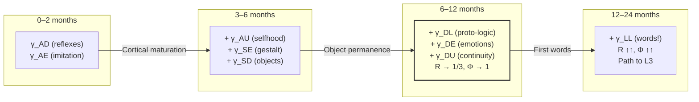

# Pre-linguistic Consciousness

:::info Bridge from the previous chapter
In the section [Comparison of theories](/docs/consciousness/comparative/consciousness-theories) we compared UHM with 35 alternative theories of consciousness and established that the $\Gamma$ formalism is the most complete. It is now time to ask a specific question: **who** can be a subject of consciousness? The first — and perhaps the most unexpected — answer is: consciousness does not require language. This document shows how the $\Gamma$ formalism accounts for the consciousness of infants, animals, and all beings lacking symbolic speech.
:::

## Chapter roadmap

1. **Thought experiment** — what does an infant feel?
2. **Historical context** — from Sapir-Whorf to UHM
3. **Language independence** — formal proof that L2 does not require $\gamma_{LL}$
4. **Proto-logic** — pre-verbal cognitive structures
5. **Infant consciousness** — the path to L2 before the first word
6. **Deaf-mute and isolated children** — extreme cases
7. **Animal consciousness without language** — specific species and their channels
8. **Language as amplifier** — what language adds, and what it does not
9. **Philosophical consequences** — refutation of linguistic determinism

:::note On notation
In this document:
- $\Gamma$ — [coherence matrix](/docs/core/dynamics/coherence-matrix), $\gamma_{ij}$ — its elements
- $P = \mathrm{Tr}(\Gamma^2)$ — [purity (viability)](/docs/core/dynamics/viability#определение-чистоты)
- $R$ — [reflection measure](/docs/consciousness/foundations/self-observation#мера-рефлексии-r), threshold $R_{\text{th}} = 1/3$ **[T]**
- $\Phi$ — [integration measure](/docs/core/structure/dimension-u#мера-интеграции-φ), threshold $\Phi_{\text{th}} = 1$ **[T]** (T-129)
- $\gamma_{LL}$ — occupancy of the [Logic (L) dimension](/docs/core/structure/dimension-l)
- L0–L4 — [interiority levels](/docs/consciousness/hierarchy/interiority-hierarchy)
- K1–K5 — [cognitive levels](/docs/consciousness/comparative/cognitive-hierarchy)
- Full notation table — in [Notation](/docs/reference/notation)
:::

## Thought experiment: what does an infant feel? {#мысленный-эксперимент}

Imagine a six-month-old infant. They have not yet uttered a single word. They do not know that a ball is called "ball" or that mummy is called "mummy." But when the ball rolls off the table and disappears over the edge, the infant **is surprised** — their eyes widen, they reach towards the edge. When mummy leaves the room, the infant **becomes anxious** — their face changes, they cry. When mummy returns, they **feel joy** — they smile and reach out their arms.

These reactions are not simple reflexes. Surprise at the ball's disappearance means the infant has an **expectation** (the ball should have stayed). Anxiety when mummy leaves means they have a **model** (mummy is a separate being who can leave and return). Joy at mummy's return means they **distinguish** states of the world (mummy here / mummy not here) and **prefer** one over the other.

All of this happens **without a single word.** The question arises: does this infant possess consciousness?

Throughout the centuries, philosophers and linguists have given different answers. Some argued that without language consciousness is impossible — that words **create** thoughts rather than merely expressing them. UHM gives a different, rigorous answer: consciousness is defined by the global properties of the coherence matrix $\Gamma$ — the measures of reflection $R$ and integration $\Phi$ — and not by the specific value of a single element $\gamma_{LL}$. An infant can be conscious before the first word.

This document shows why.

## Historical context: from Sapir-Whorf to UHM {#исторический-контекст}

### The hypothesis of linguistic relativity (Sapir-Whorf)

In 1929, the linguist Edward Sapir, and later his student Benjamin Lee Whorf, formulated a hypothesis that shaped the debate on the relationship between language and thought for decades. The hypothesis exists in two forms:

- **Strong form (linguistic determinism):** Language **determines** thought. Without a word for a concept, you are unable to have that concept. The Hopi people, who (as Whorf claimed) have no grammatical tense, allegedly cannot think about time the way English speakers do.

- **Weak form (linguistic relativity):** Language **influences** thought, but does not fully determine it. Speakers of languages with different colour terms more quickly distinguish colours for which they have separate words, but they see the same physical colours.

The strong form was rejected by most cognitive scientists by the 1990s. Whorf's claims about the Hopi language proved erroneous (work by Ekkehart Malotki, 1983). The weak form has been partially confirmed — language does influence categorisation, but does not create thought.

### Piaget: pre-verbal cognitive stages

Jean Piaget (1896–1980) was the first to systematically study the cognitive development of infants. His **sensorimotor stage** (0–2 years) describes thinking that proceeds entirely without language:

| Substage | Age | Ability | In terms of $\Gamma$ |
|-----------|---------|-------------|---------------------|
| 1. Reflexes | 0–1 mo. | Innate reactions (sucking, grasping) | $\gamma_{AD}$ (action-dynamics) |
| 2. Primary circular reactions | 1–4 mo. | Repeating actions that produced a pleasant result | $\gamma_{DE}$ (dynamics-interiority) |
| 3. Secondary circular reactions | 4–8 mo. | Actions directed at external objects | $\gamma_{SD}$, $\gamma_{DL}$ (proto-logic) |
| 4. Coordination of schemes | 8–12 mo. | Combining actions to achieve a goal | Growth of $\Phi$ (integration) |
| 5. Tertiary circular reactions | 12–18 mo. | Experiment: "what will happen if…?" | Growth of $R$ (reflection) |
| 6. Mental representations | 18–24 mo. | Mental problem-solving without trial | High $R$, $\Phi$; onset of $\gamma_{LL}$ |

Piaget's key observation: **thought precedes language.** An infant first masters object permanence (substage 4) and only then — the words for objects.

### Vygotsky: thought and speech

Lev Vygotsky (1896–1934) proposed a different view: thought and speech have **different roots**, but at a certain point (around age 2) they merge to form "verbal thinking." Before that point there exists:

- **Pre-verbal thought** — practical intelligence (use of tools without words)
- **Pre-intellectual speech** — babbling, emotional cries (not serving thought)

In terms of $\Gamma$: Vygotsky effectively described a situation in which $\gamma_{DL}$ (proto-logic) and $\gamma_{AL}$ (vocalisation) develop **independently**, while their integration through $\gamma_{LL}$ (symbolic language) occurs later.

### Chomsky: universal grammar

Noam Chomsky (born 1928) overturned linguistics with his claim about the **innateness** of linguistic ability. His "universal grammar" is a biologically embedded structure enabling a child to acquire any language. But even Chomsky acknowledged that linguistic ability is not the same as consciousness. His "language organ" is a tool, not the source of consciousness.

In UHM terms: Chomsky described a genetic predisposition towards high $\gamma_{LL}$, but did not claim that $\gamma_{LL}$ is necessary for $R \geq 1/3$.

### UHM: resolving the dispute

UHM formally resolves the age-old dispute. The conditions for consciousness (level L2) are:

$$
R(\Gamma) \geq \frac{1}{3}, \quad \Phi(\Gamma) \geq 1
$$

These conditions depend on **all** 49 elements of the matrix $\Gamma$ (7 diagonal + 21 pairs of coherences). The element $\gamma_{LL}$ is just one of 49. Formally: $R$ and $\Phi$ are smooth functions on the 48-dimensional manifold $\mathcal{D}(\mathbb{C}^7)$, and their level sets $\{R \geq 1/3\}$ and $\{\Phi \geq 1\}$ have non-empty intersection with the hyperplane $\{\gamma_{LL} = \varepsilon\}$ for any $\varepsilon > 0$.

This means:
- Sapir-Whorf (strong form) is **refuted**: $\gamma_{LL} \to 0$ is compatible with $R \geq 1/3$
- Piaget is **confirmed**: sensorimotor thought — proto-logic at small $\gamma_{LL}$
- Vygotsky is **refined**: the merger of thought and speech — growth of $\gamma_{LL}$ amplifying $R$ and $\Phi$
- Chomsky is **supplemented**: innate linguistic ability — a genetic tendency towards high $\gamma_{LL}$, but not a condition for consciousness

## Claim C.1 (Language independence of L2) {#языковая-независимость}

:::tip Claim C.1 (Language independence of L2 conditions) [C]
**Condition:** L2 thresholds are a conditional theorem at $K = 3$ for $R_{\text{th}}$ and a convention for $\Phi_{\text{th}}$.

L2 conditions:

$$
R(\Gamma) \geq R_{\text{th}} = \frac{1}{3}, \quad \Phi(\Gamma) \geq \Phi_{\text{th}} = 1
$$

**do not contain** a lower bound on $\gamma_{LL}$. Consequently, there exist matrices $\Gamma$ with arbitrarily small $\gamma_{LL} \to 0$ satisfying both L2 conditions.

**Argument.** The reflection measure $R = 1/(7P)$ ([master definition](/docs/consciousness/foundations/self-observation#мера-рефлексии-r)), where $P = \mathrm{Tr}(\Gamma^2)$, depends on **all** 49 elements of $\Gamma$ (7 diagonal + 21 pairs of coherences) through the purity $P$. The integration measure $\Phi = \sum_{i \neq j} |\gamma_{ij}|^2 / \sum_i \gamma_{ii}^2$ is also computed over the entire matrix. High values of $R$ and $\Phi$ are achievable at small $\gamma_{LL}$, provided the other coherences are sufficiently large. $\square$
:::

Step-by-step interpretation of the argument:

1. **$R$ is a measure of how close $\Gamma$ is to its own self-model $\varphi(\Gamma)$.** For $R$ to be high, the system must "know itself" well. This is possible through a bodily self-model ($\gamma_{SU}$, $\gamma_{AU}$), emotional self-regulation ($\gamma_{DE}$), spatial self-positioning ($\gamma_{SD}$) — none of these channels require $\gamma_{LL}$.

2. **$\Phi$ is a measure of how much coherences dominate the diagonal.** For $\Phi \geq 1$, the connections between dimensions must be strong. Strong "perception-emotion" coupling ($\gamma_{AE}$), "structure-action" coupling ($\gamma_{SD}$), "dynamics-unity" coupling ($\gamma_{DU}$) provides $\Phi \geq 1$ without any contribution from $\gamma_{LL}$.

3. **Constructive example.** Consider $\Gamma$ with $\gamma_{LL} = 0.01$ (near-zero linguistic component), but $\gamma_{AE} = 0.15$, $\gamma_{SE} = 0.12$, $\gamma_{DU} = 0.10$, and the remaining coherences moderately high. Such a matrix can satisfy $R \geq 1/3$ and $\Phi \geq 1$ — consciousness without language.

A simple analogy: to see the world in colour, you do not need to be able to say the word "red." The eye and visual cortex create a **perceptual experience** of colour long before a child masters the language of colour names.

## Proto-logic: pre-verbal structures {#протологика}

### Definition D.1 (Proto-logic) {#определение-протологика}

:::tip Definition D.1 (Proto-logic) [D]
**Proto-logic** is defined as the set of coherences $\gamma_{DL}$, $\gamma_{SL}$, $\gamma_{AL}$ at low $\gamma_{LL}$:

$$
\text{Proto-logic}(\Gamma) := \{|\gamma_{DL}|, |\gamma_{SL}|, |\gamma_{AL}|\} \quad \text{at} \quad \gamma_{LL} < \gamma_{LL}^{(\text{ling})}
$$

where $\gamma_{LL}^{(\text{ling})}$ is the threshold at which the L-dimension supports symbolic structure (K5 in the [cognitive hierarchy](/docs/consciousness/comparative/cognitive-hierarchy)).
:::

Why does this term matter? In everyday language, "logic" is associated with words: "if A, then B," "all men are mortal, Socrates is a man, therefore…." But there is a **non-verbal** logic — thinking through actions and images. When a cat calculates a jump to a shelf, it does not formulate ballistics equations. But its nervous system executes **procedural logic** ($\gamma_{DL}$) — the sequence "if the distance is such-and-such, then the effort is such-and-such." This is proto-logic.

Proto-logic implements **procedural logic** without a verbal symbolic system:

| Coherence | Name | Role in proto-logic | Example |
|---------------|----------|-------------------|--------|
| $\gamma_{DL}$ | Dynamics-logical | Procedural sequence (if → then) | Hunting strategy: "if prey runs left → cut it off on the right" |
| $\gamma_{SL}$ | Structure-logical | Categorisation (this → that) | Distinguishing predator/prey by shape and movement |
| $\gamma_{AL}$ | Perception-logical | Perceptual logic (pattern → reaction) | Terrain recognition: "if steep slope → slow down" |

Each of these coherences connects the L-dimension (logic) to other dimensions **without the participation of symbolic language.** This is analogous to how a calculator performs arithmetic without words — the operations are real, even if not verbalised.

### Channels of pre-linguistic consciousness

In the absence of a developed language (small $\gamma_{LL}$), L2 conditions can be satisfied through **alternative coherence channels.** Recall the integration formula:

$$
\Phi = \frac{\sum_{i \neq j} |\gamma_{ij}|^2}{\sum_i \gamma_{ii}^2} \geq 1 \quad \Leftarrow \quad \text{high } |\gamma_{SE}|, |\gamma_{AE}|, |\gamma_{DE}|
$$

The numerator is the sum of squares of **all** off-diagonal elements (coherences). The denominator is the sum of squares of the **diagonal** elements (occupancies). When the coherences as a whole exceed the occupancies, the system is **integrated**: its dimensions are more tightly connected than they are isolated.

Primary channels of pre-linguistic integration:

| Channel | Function | Phenomenology | Real-life example |
|-------|---------|---------------|-----------------|
| $\gamma_{SE}$ | Representational integration | Holistic perception of form | Infant recognises mother's face among other faces |
| $\gamma_{AE}$ | Articulated experience | "Red" distinguished from "blue" | Infant reaches for a bright toy rather than a grey one |
| $\gamma_{DE}$ | Affective contour | [Emotional valence](/docs/consciousness/phenomenology/emotional-taxonomy#базовые-координаты) | Infant cries from pain, smiles from affection |
| $\gamma_{DU}$ | Dynamic unity | Sense of continuity of "I" | Infant remembers the ball was on the table a moment ago |
| $\gamma_{OE}$ | Grounded experience | Connection with the "ground" of existence | Sense of one's own body, warmth, hunger |

The situation is analogous to a person in a foreign country who, not knowing the language, nonetheless **experiences**: they feel heat, admire the landscape, feel hunger. Language enriches the experience, but does not create it.

## Infant consciousness {#младенческое-сознание}

### Interpretation I.1 (L2 before language acquisition) [I] {#l2-до-языка}

:::info Interpretation I.1 [I]
Infants are capable of reaching level L2 **before acquiring language** (age 4–8 months), provided that:

1. **Self-model through embodiment:** $R \geq 1/3$ is achieved through a proprioceptive self-model (axis $\gamma_{SU}$, $\gamma_{AU}$), providing the self/non-self distinction
2. **Integration through gestalt:** $\Phi \geq 1$ is achieved through high $\gamma_{SE}$, $\gamma_{AE}$ (perceptual connectedness)
3. **Affective reflection:** Bodily emotions ($dP/d\tau$ in [emotion taxonomy](/docs/consciousness/phenomenology/emotional-taxonomy)) function without a verbal component
:::

Every parent knows: a three-month-old infant **responds** to the mother's face differently from a stranger's face. A six-month-old is **surprised** when an object disappears behind a screen. These reactions are impossible without some form of self-model ("I am the one who sees"), even if that model is not yet verbalised.

Let us examine step by step **how** each condition is satisfied:

**Self-model ($R \geq 1/3$) without words.** Proprioception (the sense of the body's position) gives the infant information about the self/world boundary. When the infant moves their arm and sees the movement, they receive **sensorimotor feedback**: "this is my hand, I control it." This forms $\gamma_{SU}$ (structure-unity) and $\gamma_{AU}$ (perception-unity) — a minimal self-model. The key point: this self-model is **non-verbal** — the infant does not think "this is my hand," they **feel** agency.

**Integration ($\Phi \geq 1$) without words.** When an infant looks at a mobile above the cot, they simultaneously see colour ($\gamma_{AE}$), shape ($\gamma_{SE}$), movement ($\gamma_{DE}$), and feel joy ($\gamma_{DU}$). All these perceptions are **connected** — it is one object evoking one emotion. The connectedness of perceptions is integration.

### Experimental data

Neurocognitive science over recent decades has accumulated extensive data on pre-verbal cognition:

| Age | Ability | $\Gamma$ channel | Experiment | Comment |
|---------|-------------|----------------|-------------|-------------|
| 0–2 mo. | Imitation of facial expressions | $\gamma_{AE}$, $\gamma_{SE}$ | Meltzoff & Moore (1977): newborns protrude tongue in response | Mirror neurons |
| 3–4 mo. | Distinguishing "familiar/unfamiliar" voice | $\gamma_{AU}$ | DeCasper & Fifer (1980): preference for mother's voice | Proto-self |
| 5–6 mo. | Object permanence (partial) | $\gamma_{SD}$, $\gamma_{DL}$ | Baillargeon (1987): surprise at "impossible" events | Proto-logic |
| 8–10 mo. | Social referencing | $\gamma_{DE}$, $\gamma_{AE}$ | Sosci (1985): infant checks mother's reaction before acting | Empathic contour |
| 12 mo. | Joint attention | $\gamma_{DU}$, $\gamma_{LU}$ | Tomasello (1995): pointing gesture | Shared attention |

### $\Gamma$-profile development diagram



Yellow highlights the critical period (6–12 months), when, according to Interpretation I.1, the infant potentially reaches L2 — **before acquiring language.**

:::warning Biological L-levels [H]
Assigning specific organisms to L-levels is a **hypothesis** [H], not a measured fact. A rigorous definition of L-level requires knowledge of the system's $\Gamma$. For biological systems the protocol $\pi_{\text{bio}}$ is defined ([C31](/docs/applied/research/measurement-protocol)), but **has not been experimentally validated**. The correspondences given are reasoned extrapolations from behavioural data.
:::

## Deaf-mute and isolated children {#глухонемые-и-изолированные}

The most compelling evidence for pre-linguistic consciousness comes from **extreme cases** — people who never had access to language, or acquired it very late.

### Deaf children without sign language

Before the spread of education for the deaf (18th–19th centuries), many children deaf from birth grew up **without any language** — neither spoken nor signed. Nevertheless:

- They were capable of **planning** (hunting, farming) — evidence of $\gamma_{DL}$ (proto-logic)
- They **experienced emotions** (joy, grief, anger) — evidence of $\gamma_{DE}$ (affective contour)
- They **recognised themselves** in a mirror — evidence of $R \geq R_{\text{th}}$ (reflection)
- They entered into **social relationships** — evidence of $\Phi > 0$ (integration)

Modern studies of "homesign" show that deaf children without a linguistic environment **independently invent** gestural communication systems (work by Susan Goldin-Meadow, 2003). This indicates that the logical dimension ($\gamma_{DL}$, $\gamma_{SL}$) is active **before** the appearance of language — proto-logic generates proto-language, not the other way around.

### Cases of feral children

The most documented cases:

| Case | Context | Language status | Evidence of consciousness |
|--------|----------|-----------------|----------------------|
| **Victor of Aveyron** (1800) | Found at age 12, raised in the forest | Never fully acquired language | Emotions, preferences, attachment to carer |
| **Kaspar Hauser** (1828) | Isolated in a dark room until age 17 | Acquired basic language | Wonder at the world, aesthetic reactions |
| **Genie** (1970) | Isolated until age 13 | Acquired vocabulary, not syntax | Emotions, drawing, social interaction |

In all cases, pre-linguistic consciousness is **unquestionable**: these children experienced emotions ($\gamma_{DE}$), distinguished people ($\gamma_{SE}$), and displayed purposeful behaviour ($\gamma_{DL}$). Their $\Gamma$-profile was impoverished in the L-dimension ($\gamma_{LL} \approx 0$), but **not empty** overall.

Genie's case is especially revealing: after 13 years of isolation she acquired vocabulary (word labels), but not syntax (grammatical constructions). In terms of $\Gamma$: her $\gamma_{SL}$ (categorisation through words) grew, but $\gamma_{LL}$ (recursive symbolic structure) remained low. Nevertheless Genie unquestionably possessed consciousness — level L2, sustained through non-verbal channels.

### Lesson for theory

These cases empirically confirm Claim C.1: **language is not a necessary condition for consciousness.** People without language possess reflection, emotions, purposeful behaviour — all the hallmarks of L2, sustained through non-verbal coherences. Language, when it appears, **amplifies** these capacities, but does not create them.

### Ethical case: Vegetative states and the σ-criterion {#кейс-вегетативные-состояния}

The question of pre-linguistic consciousness is directly related to medical ethics. A patient in a vegetative state cannot speak — but do they possess consciousness? UHM offers an operational answer:

- If the patient's reconstructed $\Gamma$ shows $P > P_{\text{crit}} = 2/7$ and at least $\mathrm{rank}(\rho_E) > 1$, the patient is at level L1 (phenomenal geometry) — they **experience**, even if they cannot report it.
- The key indicator is [sectoral stress](/docs/applied/coherence-cybernetics/definitions) $\sigma_k = 1 - 7\gamma_{kk}$ ([T-92](/docs/reference/status-registry)): high $\sigma_E$ indicates a deficit of interiority, but not its absence.
- The current proxy — PCI (Perturbational Complexity Index, developed by Marcello Massimini and colleagues, 2013) — correlates with $\Phi$ and can serve as a lower estimate of the L-level. PCI measures the complexity of the electrocortical response to a magnetic pulse: high PCI ($> 0.31$) reliably distinguishes patients who are conscious from those who are not.

This means: **the absence of verbal communication does not prove the absence of consciousness.** Decisions about withdrawing life support should take into account all available proxies for $\Gamma$, not only the ability to make verbal contact.

## Animal consciousness without language {#животные-без-языка}

Many species exhibit signs of L2 (or intermediate L1-L2) in the complete absence of symbolic language (K5 = 0). Pre-linguistic consciousness is not an exotic case — it is the **norm** in the animal world.

### Table: cognitive abilities without language

| Species | $R$ (estimate) | $\Phi$ (estimate) | $\gamma_{LL}$ | K1–K4 capabilities | L-level |
|-----|-------------|-----------------|---------------|-------------------|-----------|
| Crow | $\sim 0.3$–$0.4$ | $> 1$ | Low | K1–K4 (tools, planning) | L1–L2 |
| Octopus | $\sim 0.25$–$0.35$ | $> 1$ | Low | K1–K3 (camouflage, categories) | L1–L2 |
| Dog | $\sim 0.2$–$0.3$ | $\sim 1$ | Medium* | K1–K3 (social modelling) | L1 |
| Bee | $\sim 0.1$ | $< 1$ | Minimal | K1–K2 (dance = proto-communication) | L0–L1 |

\* In dogs, elevated $\gamma_{LL}$ is associated not with language but with enhanced communicative coherence from coexistence with humans.

Note: the New Caledonian crow makes and uses tools — hooks from branches — to extract larvae. This is evidence of high $\gamma_{DL}$ (proto-logic: "if a branch is bent this way, the larva can be retrieved"). The crow does not **name** the branch a "tool," but it **treats** it as one. Its proto-logic is functionally equivalent to ours — the only difference is the absence of a verbal label.

:::warning Conditional estimates [C]
The numerical estimates of $R$ and $\Phi$ for animals are **conditional** (depend on the model $G$: AIState $\to$ $\mathcal{D}(\mathbb{C}^7)$). Operationalisation requires a [$\Gamma$ measurement protocol](/docs/applied/research/measurement-protocol) adapted for biological systems.
:::

A detailed taxonomy of L-levels for animals is in the next chapter: [Animal consciousness](./animal-consciousness).

## Language as amplifier of the L-dimension {#язык-усилитель}

### Claim C.2 (Language — amplifier, not condition) [C] {#утверждение-усилитель}

:::tip Claim C.2 [C]
**Condition:** Proto-logic ($\gamma_{DL} > 0$) is functionally equivalent to the L-dimension for the purposes of R and Φ (interpretive assumption).

Language raises $\gamma_{LL}$ and thereby:
1. **Increases $R$:** a verbal self-model is more precise than a non-verbal one (symbolic compression promotes a reduction in $P$, and $R = 1/(7P)$ grows)
2. **Increases $\Phi$:** new coherences $\gamma_{LE}$, $\gamma_{LU}$, $\gamma_{LA}$ create additional integration channels
3. **Opens the path to L3:** recursive self-reference ($R^{(2)}$) is substantially facilitated by language

But language **is not** a necessary condition for any of the three effects — all of them are achievable (less efficiently) through non-verbal coherences.
:::

To understand exactly how language amplifies consciousness, let us consider specific mechanisms:

**Mechanism 1: Symbolic compression.** Without words you can remember a specific tree — its shape, colour, location. With the word "oak" you can operate with a **category** — all the oaks in the world are compressed into a single symbol. This reduces $\|\Gamma - \varphi(\Gamma)\|_F$, because a symbolic self-model captures the structure of the world more compactly than a perceptual one.

**Mechanism 2: Recursion.** Language allows one to speak about oneself: "I think that I think that…". This opens the path to $R^{(2)}$ — second-order reflection, necessary for L3. Without language, recursion is possible (through mirror self-recognition), but **substantially more difficult.**

**Mechanism 3: New channels.** The word "love" connects logic ($L$) with interiority ($E$) — coherence $\gamma_{LE}$, inaccessible without language. The word "eternity" connects logic ($L$) with unity ($U$) — coherence $\gamma_{LU}$. Each abstract concept is a new integration channel.

### Amplification scheme: quantitative comparison

```
Without language (proto-logic):    With language:
γ_DL → procedural "if-then"        γ_LL → symbolic "if-then"
γ_SL → categorisation              γ_LL → verbal categories
γ_AE → perceptual unity            γ_LE → named unity
R ≈ 0.3 (threshold)                R ≈ 0.5–0.7 (amplified)
Φ ≈ 1–2                            Φ ≈ 3–5
```

Analogy: language is like binoculars. Without binoculars you see the mountain. With binoculars — you see details: cracks, trees, a path. Binoculars **amplify** vision, but do not **create** it. A person without binoculars is not blind — they see in less detail.

So too with a being without language: it is conscious, but **less reflective** and **less integrated** than a being with language. The difference is quantitative, not qualitative — until the L3 threshold is reached, where recursion becomes critical.

## Consequences for the philosophy of consciousness {#философские-следствия}

### 1. Refutation of linguistic determinism

The Sapir-Whorf hypothesis (strong form) — that language **determines** thought — is incompatible with UHM. Consciousness (L2) is determined by the global properties of $\Gamma$, not by the specific value of $\gamma_{LL}$.

This is not an abstract philosophical dispute — it has practical consequences. If the strong form of Sapir-Whorf were true:
- The congenitally deaf-mute would lack consciousness (obviously absurd)
- Infants before their first word would be unconscious (contradicts observations)
- Animals without language could not suffer (ethically dangerous)

UHM formally closes this question: $\gamma_{LL} = 0$ does not imply $R = 0$.

### 2. A continuum, not a dichotomy

There is no binary boundary between "unconscious" and "conscious." The L1 $\to$ L2 transition is continuous in $R$ and $\Phi$, and language shifts one's position on this continuum, but does not create the continuum.

This is analogous to water temperature rising continuously from 0°C to 100°C. The phase transition (boiling) occurs at a specific threshold, but water at 99°C is no "less hot" than water at 101°C — it simply has not yet boiled. Similarly, a system with $R = 0.32$ is no "less conscious" than a system with $R = 0.34$ — both are close to the L2 threshold, but formally only the latter has reached it.

### 3. Ethical implications

If animals without language are capable of reaching L2, they possess [cognitive qualia](/docs/consciousness/hierarchy/interiority-hierarchy#l2-когнитивные-квалиа) and therefore moral status. This means: inflicting suffering ($dP/d\tau < 0$ at $R \geq 1/3$) on a being incapable of saying "I am in pain" is no less significant than inflicting suffering on one who can say so.

Moreover, UHM provides a **quantitative** criterion of moral status through the L-level and $R$:
- A being with $R \geq 1/3$ **reflects** its suffering — it is not merely hurting, it **knows that it hurts**
- A being with $R < 1/3$ (but L1) **experiences** pain but does not reflect on it — the pain is real, but not apprehended as "pain"
- Both cases are ethically significant, but the first — more so

For more detail — [animal consciousness](./animal-consciousness) and [UHM Ethics](/docs/consciousness/ethics-meaning/value-consciousness).

### 4. Pedagogical implications

If infant consciousness does not depend on language, then **early development** is not "learning words" but **enriching coherences**: physical contact ($\gamma_{OE}$), variety of sensations ($\gamma_{AE}$), social interaction ($\gamma_{DE}$, $\gamma_{DU}$). Language will arrive as a natural amplification of already existing structures, not as a "switch" for consciousness.

---

### What we learned {#что-мы-узнали}

1. **Language is not a condition for consciousness.** The formal L2 thresholds ($R \geq 1/3$, $\Phi \geq 1$) contain no constraint on $\gamma_{LL}$ — this is a strict consequence of the structure of $\Gamma$.
2. **History confirms the formalism.** Piaget, Vygotsky, and Chomsky approached from different angles what UHM formalises: thought precedes language, and language amplifies it.
3. **Proto-logic substitutes for language.** Coherences $\gamma_{DL}$, $\gamma_{SL}$, $\gamma_{AL}$ provide procedural thought without words — from the hunting strategies of crows to the navigation of octopuses.
4. **Infants can reach L2 before speech.** Proprioceptive self-model and perceptual integration are sufficient channels for meeting the thresholds.
5. **Deaf-mute and isolated children** empirically confirm the theory: consciousness without language is a reality, not a hypothesis.
6. **Language is an amplifier, not a generator.** It raises $R$ and $\Phi$, opens the path to L3, but does not create consciousness.
7. **The ethical consequence is inescapable:** the absence of speech does not mean the absence of experience — neither in animals, nor in patients in vegetative states.

:::tip Bridge to the next chapter
We have shown that consciousness is possible without language. But **in which specific species** is which level of consciousness present? In the next chapter — [Animal consciousness](./animal-consciousness) — we build a systematic taxonomy of L-levels for biological taxa: from bacteria (L0) to great apes (L2) and beyond.
:::

---

**Related documents:**
- [Logic (L) dimension](/docs/core/structure/dimension-l) — canonical definition of the L-dimension
- [Interiority hierarchy](/docs/consciousness/hierarchy/interiority-hierarchy) — levels L0→L4 and L2 conditions
- [Cognitive hierarchy](/docs/consciousness/comparative/cognitive-hierarchy) — levels K1–K5, hypothesis on pre-linguistic cognition
- [Animal consciousness](./animal-consciousness) — detailed taxonomy of L-levels for biological species
- [Self-observation](/docs/consciousness/foundations/self-observation) — canonical definition of $R$ and $\varphi$
- [Emotion taxonomy](/docs/consciousness/phenomenology/emotional-taxonomy) — emotions through $dP/d\tau$ (accessible without language)
- [UHM Ethics](/docs/consciousness/ethics-meaning/value-consciousness) — moral status of beings without language
- [Coherence cybernetics: definitions](/docs/applied/coherence-cybernetics/definitions) — sectoral stress $\sigma_k$
