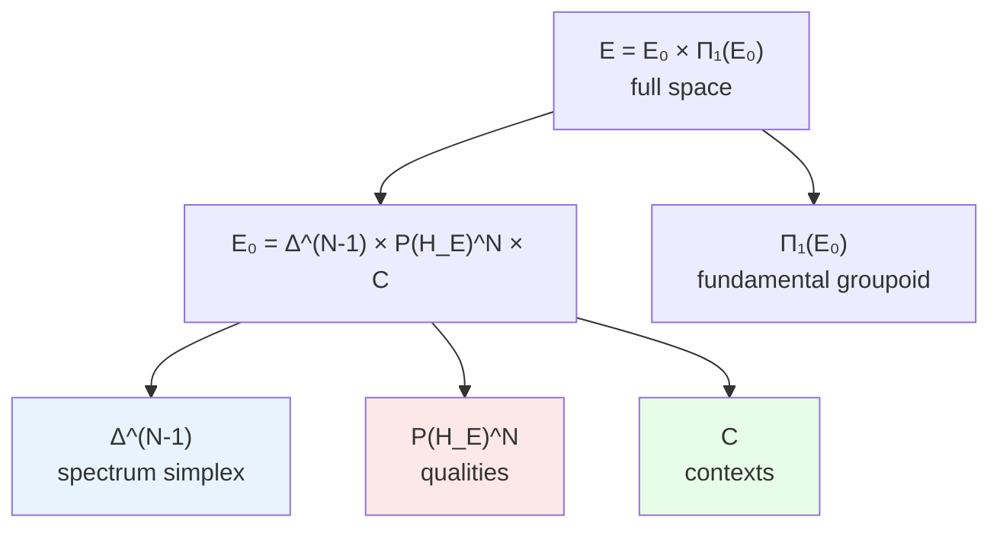

# Category Exp

In this chapter we will construct the mathematical space in which every possible experience "lives" — the category $\mathbf{Exp}$. The reader will learn what a point of experience consists of, what "transformation of experience" means, which metric measures the distance between experiences, and why this space is structured in a fundamentally different way from familiar mathematical structures (it is not a topos, but it possesses a rich fibered geometry).

:::info DRY: Master definition
The complete specification of the category Exp, including topos structure and metric enrichment, is in [Categorical Formalism](/docs/proofs/categorical/categorical-formalism#2-категория-exp).
:::

:::info Compatibility with Ω⁷
In UHM documentation the requirement of "compatibility with Ω⁷" appears frequently. Formally this means the following. Let $\mathbf{Sh}_\infty(\mathcal{C})$ be the ∞-topos of sheaves on the single category $\mathcal{C}$, and $\Omega$ its subobject classifier with atomic subobjects $S_k$ ($k = 1, \ldots, 7$) and characteristic morphisms $\chi_{S_k}: 1 \to \Omega$. A CPTP-channel $\Phi$ is called **Ω⁷-compatible** if the functor it induces commutes with the characteristic morphisms:

$$
F(\Phi) \circ \chi_{S_k} = \chi_{S_k} \circ F(\Phi) \quad \forall\, k = 1, \ldots, 7
$$

This guarantees that the logical structure of the holon (which subobjects are "true" and "false") is preserved under physical transformation. Compatibility with Ω⁷ is a necessary condition for the morphisms of $\mathbf{Exp}$ to be correctly defined via the [functor $F$](/docs/core/categories/functor-f).
:::

---

## Precursor: why a separate category for experience

### The space of all possible experiences

Imagine a map. Each point on the map is one particular experience: a specific pain, a specific joy, a specific shade of red combined with the smell of coffee. The entire map is the set of *all* possible experiences.

But a map is more than a set of points. It contains:
- **Distances**: some experiences are "closer" to each other (light red and dark red), others are "far apart" (red and the sound of a trumpet)
- **Paths**: one experience can smoothly transition into another (dawn — a gradual change in the shade of the sky)
- **Structure**: some aspects of experiences change independently of others

The category $\mathbf{Exp}$ is the mathematical formalization of such a "map of experience." Its objects are points of experience, morphisms are admissible transitions between them, and additional structures (metric, fibration) describe the geometry of the space of experiences.

### Why a separate category

Can one simply work with $\mathbf{DensityMat}$ — the category of density matrices? No, and here is why:

1. **Different matrices — one experience.** Two matrices $\rho_1 \neq \rho_2$ can give the same experience if they differ only in components not connected with [Interiority](/docs/core/structure/dimension-e). The functor $F$ "glues" such matrices into a single point of experience.

2. **Different geometry.** The distance between experiences is not the same as the distance between density matrices. The metric on $\mathbf{Exp}$ is a factor-metric from the [Bures metric](/docs/proofs/categorical/categorical-formalism), taking into account only "experientially significant" differences.

3. **Own structure.** The space of experience has a fibered structure (intensities, qualities, context — different "layers") that is not visible in $\mathbf{DensityMat}$.

---

## Definition

**Definition (Experiential space).** The base experiential space (objects of the category $\mathbf{Exp}$):

$$
\mathcal{E}_0 := \Delta^{N-1} \times_{\text{Spec}} \mathbb{P}(\mathcal{H}_E)^N \times \mathcal{C}
$$

The full experiential space (with emergent history):

$$
\mathcal{E} := \mathcal{E}_0 \times \Pi_1(\mathcal{E}_0)
$$

Let us examine each component.

### Simplex $\Delta^{N-1}$: the pie of intensities

$$
\Delta^{N-1} = \{(\lambda_1, \ldots, \lambda_N) : \lambda_i \geq 0, \; \sum_{i=1}^N \lambda_i = 1\}
$$

This is an $(N-1)$-dimensional **simplex** — a generalization of a triangle to an arbitrary number of dimensions. For UHM $N = 7$ (the dimension of the [Hilbert space](/docs/core/structure/holon) of the Holon), so $\Delta^6$ is a six-dimensional simplex.

**Analogy with a pie.** Imagine a pie cut into $N$ pieces. Each piece is the share of a certain quality in the overall experience. Together the pieces make up the whole pie ($\sum \lambda_i = 1$), each piece is non-negative ($\lambda_i \geq 0$). If one piece occupies the entire pie ($\lambda_1 = 1$, the rest $= 0$), the experience is "pure" — a single quality. If the pieces are equal ($\lambda_i = 1/N$ for all $i$), the experience is maximally "mixed" — all qualities are equally intense.

**Geometry of the simplex.** $\Delta^{N-1}$ is a compact convex set. Its vertices are the pure states $(1, 0, \ldots, 0)$, $(0, 1, \ldots, 0)$, ..., $(0, \ldots, 0, 1)$. The center is the maximally mixed state $(1/N, \ldots, 1/N)$. The natural metric on $\Delta^{N-1}$ is the **Fisher metric** (information metric), which is inherited from the Bures metric on diagonal matrices (see [canonical metric](#каноническая-метрика) below).

### Projective space $\mathbb{P}(\mathcal{H}_E)^N$: the space of qualities

$$
\mathbb{P}(\mathcal{H}_E) = \mathbb{CP}^{\dim(\mathcal{H}_E) - 1}
$$

This is a complex projective space — the space of all "directions" in the [Hilbert space of Interiority](/docs/core/structure/dimension-e). Each point of $\mathbb{P}(\mathcal{H}_E)$ is one "pure quality" of experience.

**Why projective?** A vector $|\psi\rangle$ and $c|\psi\rangle$ (for any $c \in \mathbb{C}^*$) describe the same quality — they cannot be distinguished from within experience. Projective space is precisely the set of equivalence classes $[|\psi\rangle] = \{c|\psi\rangle : c \neq 0\}$.

**Analogy with the color wheel.** Projective space is a generalized "color wheel" for experience. Each point is a certain "shade" of experience. The distance between points (the Fubini–Study metric) shows how much two qualities differ. Orthogonal vectors ($\langle\psi|\phi\rangle = 0$) give maximally different qualities — like red and green.

The notation $\mathbb{P}(\mathcal{H}_E)^N$ means: to each of the $N$ eigenvalues of the spectrum $\lambda_i$ there corresponds its own quality $[|\psi_i\rangle]$. This is the $N$-fold product of the projective space.

:::note Fibered product $\times_{\text{Spec}}$
The notation $\Delta^{N-1} \times_{\text{Spec}} \mathbb{P}(\mathcal{H}_E)^N$ is a **fibered product** over the spectrum, not simply a Cartesian product. This means that the components $\lambda_i$ and $[|\psi_i\rangle]$ are linked: the $i$-th eigenvalue $\lambda_i$ corresponds to the $i$-th quality $[|\psi_i\rangle]$. When the spectrum is degenerate ($\lambda_i = \lambda_j$), the corresponding qualities are defined only up to a rotation in the eigenspace — this is generalized via the [Grassmannian](/docs/proofs/categorical/categorical-formalism#33-проблема-вырождения-спектра).
:::

### Context space $\mathcal{C}$: the non-E sector of the density matrix {#пространство-контекстов}

The context space $\mathcal{C}$ is the **principal submatrix** of the density matrix $\Gamma$, obtained by removing the E-row and E-column:

$$
\mathcal{C} := \{(\gamma_{ij})_{i,j \in \{A,S,D,L,O,U\}}\} \subset \mathcal{D}(\mathbb{C}^6)
$$

Formally: if $\Pi_{\neg E}: \mathbb{C}^7 \to \mathbb{C}^6$ is the projector removing the E-component, then $\mathcal{C} = \Pi_{\neg E}\, \mathcal{D}(\mathbb{C}^7)\, \Pi_{\neg E}^\dagger$ — the set of $6 \times 6$ positive semidefinite matrices with $\mathrm{tr}\, c \leq 1$ (equality is achieved when $\gamma_{EE} = 0$). The space $\mathcal{C}$ includes both the diagonal elements $\gamma_{kk}$ (populations of the sectors A, S, D, L, O, U) and the off-diagonal elements $\gamma_{ij}$ (coherences between them).

Context is the "stage decorations" against which experience plays out. The states of [Articulation](/docs/core/structure/dimension-a), [Structure](/docs/core/structure/dimension-s), [Dynamics](/docs/core/structure/dimension-d), [Logic](/docs/core/structure/dimension-l), [Foundation](/docs/core/structure/dimension-o), [Unity](/docs/core/structure/dimension-u) set the conditions in which an experience exists, but are not themselves its "content."

**Analogy.** The same C-major chord sounds different on a piano and on a guitar. The spectrum (intensities of overtones) and qualities (timbre characteristics) — these are about the sound. The context (instrument, room, listener's mood) — these are about everything else.

:::warning Correction: metric on C is not discrete
In earlier versions of the document it was claimed that the context was endowed with a **discrete metric** ($d = 0$ or $d = \infty$). This simplification is incorrect: the elements $\gamma_{ij}$ change continuously, and $\mathcal{C}$ is a subset of $\mathcal{D}(\mathbb{C}^6)$, not a discrete set. In the canonical construction the metric on $\mathcal{C}$ is **induced** by the Bures metric on $\mathcal{D}(\mathbb{C}^7)$, restricted to the $\{A,S,D,L,O,U\}$-sector:

$$
d_{\mathcal{C}}(c_1, c_2) := d_B\!\big(\Pi_{\neg E}\,\rho_1\,\Pi_{\neg E}^\dagger,\; \Pi_{\neg E}\,\rho_2\,\Pi_{\neg E}^\dagger\big)
$$

This metric is continuous and inherits the monotonicity of the Bures metric (Chentsov–Petz theorem).
:::

---

## Full experiential space: history as emergent structure

$$
\mathcal{E} = \mathcal{E}_0 \times \Pi_1(\mathcal{E}_0)
$$

where $\Pi_1(\mathcal{E}_0)$ is the **fundamental groupoid** of the space $\mathcal{E}_0$.

### What the fundamental groupoid is

The fundamental groupoid $\Pi_1(X)$ of a space $X$ is the category whose objects are points of $X$ and whose morphisms are classes of homotopically equivalent paths between points. Simply put, it is the "memory of all possible journeys" through the space $X$.

**Analogy.** If $\mathcal{E}_0$ is a city (a set of places), then $\Pi_1(\mathcal{E}_0)$ is the network of all routes between places, where two routes are considered the same if one can be smoothly deformed into the other (without breaking). The route from home to work through the park and through the shop are different routes (if the park and the shop cannot be circumnavigated around each other).

### Why history is in the definition of experience

:::warning Clarification: history as emergent structure
In the canonical definition **history does not enter as a primitive into the objects** of the category Exp. It is **derived** from the 2-categorical structure $\mathbf{Exp}_2$ and the ∞-groupoid $\mathbf{Exp}_\infty$ (section [§10](/docs/proofs/categorical/categorical-formalism#10-infty-группоид-и-infty-топос-для-эмерджентного-времени) of the categorical formalism). The inclusion of $\Pi_1(\mathcal{E}_0)$ in $\mathcal{E}$ is a way to record the result of this derivation in the formula.
:::

Substantively: experience includes not only "what is being experienced now," but also "where this experience came from." The same instantaneous pain is experienced differently depending on whether it was intensifying or subsiding. The fundamental groupoid encodes this "path history" in the space of experience.

This is deeply connected to [emergent time](/docs/core/operators/emergent-time): time in UHM is not postulated but derived from the structure of paths in $\mathbf{Exp}$.

---

## Morphisms

Morphisms of $\mathbf{Exp}$ are triples of transformations:

$$
(f, g, h): \mathcal{E}_1 \to \mathcal{E}_2
$$

where $f$ is the transformation of spectra, $g$ of qualities, $h$ of contexts.

### Three variants of the definition of morphisms

In [Categorical Formalism](/docs/proofs/categorical/categorical-formalism#22-морфизмы-в-категории-exp) three variants of the definition of morphisms are considered:

| Variant | Definition | Character |
|---------|-------------|----------|
| **A** (paths) | Continuous paths in $\mathcal{E}$ | Most general, but not all paths are physically realizable |
| **B** (component-wise) | A quadruple $(f_\lambda, f_q, f_c, f_h)$ | Convenient for computations |
| **C** (induced) | $\mathrm{Mor}_\mathcal{E}^{\mathrm{ind}} := \mathrm{Im}(F)$ | Canonical definition |

**Variant C** is adopted as canonical: morphisms of $\mathbf{Exp}$ are precisely the images of CPTP-channels under the action of the [functor $F$](/docs/core/categories/functor-f). This means that every "admissible transformation of experience" is realized by a physical process.

**Intuition:** A morphism in $\mathbf{Exp}$ is a "transition between experiences." But not every conceivable transition is admissible: one cannot instantly switch from deep sleep to ecstatic joy without an intermediate physical process. Variant C fixes: exactly those transitions that are generated by CPTP-channels are admissible.

### Composition and identities

The composition of morphisms is defined via composition in $\mathbf{DensityMat}$:

$$
F(\Psi) \circ F(\Phi) := F(\Psi \circ \Phi)
$$

The identity morphism:

$$
\mathrm{id}_{\mathcal{Q}} := F(\mathrm{id}_\rho), \quad \text{where } F(\rho) = \mathcal{Q}
$$

Associativity and identity axioms are inherited from $\mathbf{DensityMat}$ via the functoriality of $F$.

### Why Variant C is not a vicious circle

At first glance, the definition $\mathrm{Mor}_\mathcal{E}^{\mathrm{ind}} := \mathrm{Im}(F)$ may seem circular: we define morphisms of $\mathbf{Exp}$ via the functor $F$, which itself maps into $\mathbf{Exp}$. However, this is a **constructive definition**, not a characterization. We explicitly specify the set of morphisms as the image of a known mapping — this is a standard and correct mathematical construction (analogous to how a subgroup is defined as the image of a homomorphism).

The non-trivial content of Variant C is not that $F$ is surjective on morphisms (this is true by construction), but that **the image $\mathrm{Im}(F)$ possesses a rich geometric structure**: a fibration over $\Delta^{N-1}$, a canonical metric without free parameters, an ∞-groupoid extension. It is precisely these properties that constitute the substantive theorems.

Variant A (paths in $\mathcal{E}$) serves as an **independent characterization**, which coincides with Variant C for an appropriate topology. The coincidence of two definitions is a separate non-trivial theorem confirming the consistency of the construction.

---

## Key properties

### Non-topos nature

- **Exp is not a topos** — it does not have a subobject classifier ([§6](/docs/proofs/categorical/categorical-formalism#6-топосная-структура))

What does this mean and why is it important?

A **topos** is a category that possesses a very rich logical structure: in it one can define "truth," "falsehood," "and," "or," implication — a full internal logic. The classical example is the category of sets $\mathbf{Set}$, where the subobject classifier is the two-element set $\{0, 1\}$ (true/false).

The category $\mathbf{Exp}$ **is not a topos**, because in the space of experience there is no natural notion of "subobject" with a binary classifier. Experience is not "completely present or completely absent" — it always has a degree of intensity ($\lambda_i \in [0, 1]$). This is the mathematical expression of the fact that consciousness is not discrete (on/off), but graded.

:::info Topos structure of the ∞-category
Although $\mathbf{Exp}$ is not a topos, the extended category $\mathbf{Exp}_\infty$ (∞-groupoid) embeds into the ∞-topos $\mathbf{Sh}_\infty(\mathcal{C})$ — the category of ∞-sheaves on the single category $\mathcal{C}$. It is $\mathcal{C}$ (not $\mathbf{Exp}$) that is the [true primitive](/docs/proofs/categorical/categorical-formalism#infty-топос-как-истинный-примитив) of UHM theory.
:::

### Fibered structure

**Exp is a fibration over $\Delta^{N-1}$**

What is a fibration? Imagine a stack of sheets of paper, where each sheet lies horizontally and the entire stack stands vertically. The "base" is the vertical axis (the numbering of the sheets), and the "fiber" is the horizontal sheet. A fibration is a space that "locally" looks like the product of the base and the fiber, but "globally" may be twisted (like a Möbius strip).

In our case:
- **Base**: $\Delta^{N-1}$ — the simplex of spectra (intensities)
- **Fiber over a point $\vec{\lambda} \in \Delta^{N-1}$**: $\mathbb{P}(\mathcal{H}_E)^N \times \mathcal{C}$ — the space of qualities and contexts at a fixed spectrum

This means: by fixing the intensities ($\vec{\lambda}$), we obtain a "sheet" — the space of all possible qualitative contents for a given palette of intensities. By varying $\vec{\lambda}$, we move between "sheets."

**Physical meaning:** The fibered structure reflects the asymmetry between "how much" (intensities) and "what" (qualities). Changing intensities is changing the "volume" of experience, which affects all qualities simultaneously. Changing qualities at a fixed spectrum is changing the "content" of experience without changing its "structure."

### Metric enrichment

$\mathbf{Exp}$ is endowed with a metric induced from $\mathbf{DensityMat}$ via the functor $F$. Details — in the next section.

### ∞-extension

$\mathbf{Exp}_\infty$ is an ∞-groupoid containing not only points and paths, but also "paths between paths" (homotopies), "paths between paths between paths," and so on. This extension is connected with [emergent time](/docs/core/operators/emergent-time) — higher homotopies encode finer temporal structures.

---

## Canonical metric on Exp [T] {#каноническая-метрика}

:::tip Theorem (Induced metric without free parameters) [T]
The functor $F: \mathbf{DensityMat} \to \mathbf{Exp}$ induces a **canonical** metric on $\mathcal{E}$ via factorization over fibers:

$$d_{\mathcal{E}}(e_1, e_2) := \inf\{d_B(\rho_1, \rho_2) : F(\rho_1) = e_1, F(\rho_2) = e_2\}$$

This metric **contains no free parameters**.
:::

### Intuitive explanation

The distance between two experiences $e_1$ and $e_2$ is the **minimum physical distance** between the density matrices that generate these experiences. Out of all pairs $(\rho_1, \rho_2)$ with $F(\rho_1) = e_1$, $F(\rho_2) = e_2$ we choose the pair with the smallest Bures distance $d_B$.

**Analogy.** Two cities on a map can be connected by many roads. The distance between cities is the length of the *shortest* road. Similarly, two experiences can be "generated" by many pairs of density matrices, and the distance between experiences is the shortest distance between the generating matrices.

### Proof

**(a) Well-definedness.** $F$ is surjective on objects (by construction). The fibers $F^{-1}(e) \subseteq \mathcal{D}(\mathbb{C}^7)$ are closed subsets of a compact set, so the infimum is attained.

**(b) Metric properties.** Non-negativity and symmetry — obvious. Triangle inequality: for any $e_1, e_2, e_3$ and $\varepsilon > 0$ there exist $\rho_i \in F^{-1}(e_i)$ with $d_B(\rho_1, \rho_2) < d_{\mathcal{E}}(e_1, e_2) + \varepsilon$ and $d_B(\rho_2, \rho_3) < d_{\mathcal{E}}(e_2, e_3) + \varepsilon$, from which $d_{\mathcal{E}}(e_1, e_3) \leq d_B(\rho_1, \rho_3) \leq d_B(\rho_1, \rho_2) + d_B(\rho_2, \rho_3) < d_{\mathcal{E}}(e_1, e_2) + d_{\mathcal{E}}(e_2, e_3) + 2\varepsilon$.

**(c) Non-degeneracy.** $d_{\mathcal{E}}(e_1, e_2) = 0 \iff \exists\, \rho_1, \rho_2$ with $d_B(\rho_1, \rho_2) = 0 \iff \rho_1 = \rho_2 \iff F(\rho_1) = F(\rho_2) \iff e_1 = e_2$.

**(d) Canonicity.** The Bures metric $d_B$ is the **unique** (up to scale) monotone Riemannian metric on $\mathcal{D}(\mathcal{H})$ by the Chentsov–Petz theorem [T]. The functor $F$ is canonical (G₂-rigidity, T-42a [T]). Consequently, $d_{\mathcal{E}}$ is a canonical factor-metric defined **without free parameters**.

**(e) Component-wise decomposition.** On $\mathcal{E} = \Delta^{N-1} \times_{\text{Spec}} \mathbb{P}(\mathcal{H}_E)^N \times \mathcal{C}$ the induced metric decomposes:
- On $\Delta^{N-1}$ (spectra): **Fisher metric** — induced by Bures on diagonal matrices
- On $\mathbb{P}(\mathcal{H}_E)$ (qualities): **Fubini–Study metric** — induced by Bures on eigenspaces
- On $\mathcal{C}$ (context): **induced Bures metric** — restriction to the $\{A,S,D,L,O,U\}$-sector (see [§ above](#пространство-контекстов))

All three components are **standard canonical metrics**, not free parameters. $\blacksquare$

### What the component-wise decomposition means

The Fisher metric on the simplex $\Delta^{N-1}$ is well known in statistics — it is the **information metric**, measuring the statistical distinguishability of two distributions. For spectra $\vec{\lambda}$ and $\vec{\lambda}'$:

$$
ds^2_{\text{Fisher}} = \sum_{i=1}^N \frac{d\lambda_i^2}{4\lambda_i}
$$

The Fubini–Study metric on $\mathbb{P}(\mathcal{H}_E)$ is the standard metric on projective space, defined via the inner product:

$$
d_{FS}([|\psi\rangle], [|\phi\rangle]) = \arccos |\langle\psi|\phi\rangle|
$$

Both metrics are canonical (unique up to scale) and contain no fitting parameters.

:::warning Connection with previous notation
If the documentation contains parameters $\alpha, \beta, \gamma$ in the experience metric, they are now interpreted as **weighting coefficients** setting the relative scale of the Fisher/Fubini-Study/Bures-context components. By the theorem above, when using the factor-metric from Bures these weights are **fixed**: $\alpha = \beta = \gamma = 1$. Free parameters are absent.
:::

### Formal structure of morphisms

Let us examine each component of the triple $(f, g, h)$ in more detail.

**Component $f$: spectrum transformation.** The map $f: \Delta^{N-1} \to \Delta^{N-1}$ sends one probability distribution to another. This is a **stochastic map** — it preserves normalization ($\sum \lambda'_i = 1$) and non-negativity ($\lambda'_i \geq 0$). Intuitively: $f$ redistributes "volume" between aspects of experience without violating the "whole pie" condition.

**Component $g$: quality transformation.** The map $g: \mathbb{P}(\mathcal{H}_E)^N \to \mathbb{P}(\mathcal{H}_E)^N$ rotates the eigenvectors in projective space. This changes the "colors" of experience: red can become orange, pain can become discomfort. The distance between old and new qualities is measured by the Fubini–Study metric.

**Component $h$: context transformation.** The map $h: \mathcal{C} \to \mathcal{C}$ changes the "stage decorations" — the states of the dimensions A, S, D, L, O, U. Since $\mathcal{C} \subset \mathcal{D}(\mathbb{C}^6)$ is endowed with the induced Bures metric, $h$ is a continuous map consistent with the CPTP-channel $\Phi$.

:::note Consistency of components
The three components $(f, g, h)$ are not independent: they are connected via the CPTP-channel $\Phi$ whose image is the morphism. One cannot arbitrarily change the spectrum without affecting the qualities — the physical process $\Phi$ changes the density matrix as a whole, and all three components are determined jointly.
:::

---

## Concrete example: a point in Exp

For a holon with $N = 7$ let us consider a concrete point of experience $\mathcal{Q} \in \mathbf{Exp}$:

$$
\mathcal{Q} = \big(\underbrace{(0.5, 0.2, 0.15, 0.08, 0.04, 0.02, 0.01)}_{\vec{\lambda} \in \Delta^6}, \; \underbrace{([|\psi_1\rangle], \ldots, [|\psi_7\rangle])}_{\vec{q} \in \mathbb{P}(\mathcal{H}_E)^7}, \; \underbrace{c}_{\in \mathcal{C}}\big)
$$

- **Spectrum $\vec{\lambda}$:** The first quality dominates ($\lambda_1 = 0.5$, half the "pie"). The next two are noticeable ($0.2$ and $0.15$). The rest are at the periphery. Purity: $P = \sum \lambda_i^2 = 0.33 > 2/7$ — the threshold is passed.
- **Qualities $\vec{q}$:** Seven different "colors of experience," each a point in $\mathbb{CP}^{n-1}$. The first quality $[|\psi_1\rangle]$ is the brightest.
- **Context $c$:** Fixed states of A, S, D, L, O, U — the "stage decorations."

---

## Diagram: structure of Exp

The base space $\mathcal{E}_0$ consists of three components: the spectrum simplex (blue) sets the "volume," the projective space (pink) sets the "color," the context space (green) sets the "stage." The full space $\mathcal{E}$ adds history via the fundamental groupoid.

---

## Chapter summary

In this chapter we constructed the category $\mathbf{Exp}$ — the mathematical space of all possible experiences. Key results:

| Structure | Description | Mathematics |
|-----------|----------|------------|
| Objects | Points of experience | $(\vec{s}, \vec{q}, c) \in \Delta^{N-1} \times_{\text{Spec}} \mathbb{P}(\mathcal{H}_E)^N \times \mathcal{C}$ |
| Morphisms | Admissible transitions | Triples $(f, g, h)$ induced by CPTP-channels |
| Metric | Distance between experiences | Factor-metric from Bures, no free parameters **[T]** |
| Fibration | "Volume" vs "content" | Fibration over $\Delta^{N-1}$ |
| Not a topos | No binary classifier | Experience is graded, not discrete |
| ∞-extension | Emergent time | $\mathbf{Exp}_\infty$ — ∞-groupoid |

The category $\mathbf{Exp}$ is not an arbitrary construction. It is uniquely determined by the [functor $F$](/docs/core/categories/functor-f) and G₂-rigidity ([T-42a](/docs/proofs/categorical/uniqueness-theorem) **[T]**). Its metric is canonical (Chentsov–Petz theorem), the fibered structure reflects the fundamental asymmetry between "how much" and "what" in experience, and the ∞-extension connects experience with [emergent time](/docs/core/operators/emergent-time).

---

## Connections

- **Mapped from:** [DensityMat](/docs/core/categories/category-hol) via [functor F](/docs/core/categories/functor-f)
- **Connected with:** [Interiority hierarchy](/docs/proofs/consciousness/interiority-hierarchy) — levels L0-L4 are defined in Exp
- **∞-extension:** [Emergent time](/docs/core/operators/emergent-time) — ∞-groupoid $\mathbf{Exp}_\infty$
- **Dimension E:** [Interiority](/docs/core/structure/dimension-e) — source of the projective space of qualities
- **Full specification:** [Categorical formalism §2](/docs/proofs/categorical/categorical-formalism#2-категория-exp)
