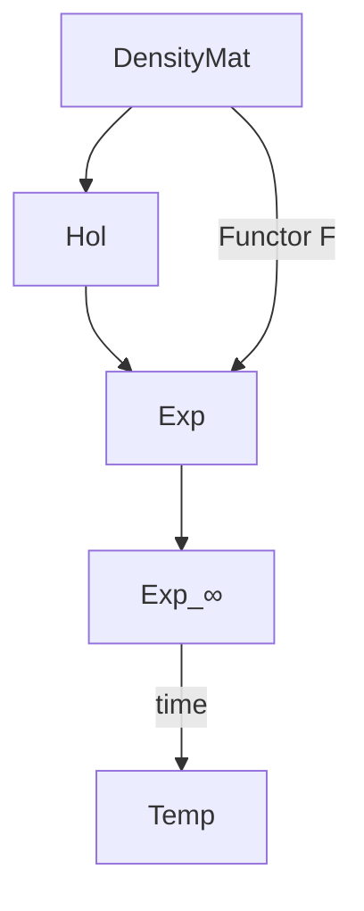
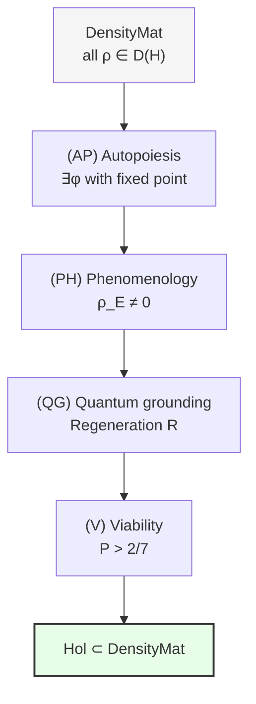

# Category of Holons Hol

In this chapter we will construct two categories — $\mathbf{DensityMat}$ (the category of all density matrices) and $\mathbf{Hol}$ (the category of holons) — and show how they are connected to each other. The reader will learn what a category is, why CPTP-channels are needed as morphisms, how $\mathbf{Hol}$ is singled out inside $\mathbf{DensityMat}$ as the subcategory of "living" configurations, and why the product of two living systems is not necessarily living.

:::info DRY: Master definition
The complete specification of the category DensityMat and the category of Holons Hol is in [Categorical Formalism](/docs/proofs/categorical/categorical-formalism#категория-голономов-hol).
:::

---

## Precursor: what a category is

Before constructing specific categories, let us clarify the concept itself.

### Objects and arrows

A **category** is a mathematical structure consisting of three ingredients:

1. **Objects** — the "things" we study (numbers, spaces, systems...)
2. **Morphisms (arrows)** — the "connections" between objects (functions, transformations, processes...)
3. **Composition rules** — how to "glue" arrows together

**Analogy with cities and roads.** Imagine a map:
- **Objects** — cities
- **Morphisms** — roads between cities
- **Composition** — if there is a road from A to B and a road from B to C, then a route from A to C exists (travel the first road, then the second)

Rules of a category:
- **Associativity:** the route A→B→C→D does not depend on how we "bracket" it — (A→B→C)→D = A→(B→C→D)
- **Identity:** for each city there exists a "stand still" — a trivial road from the city to itself

These two rules are all that is needed. No additional requirements. It is precisely this minimality that makes category theory such a powerful tool: it applies everywhere there are objects and processes.

### Why categories in UHM

In UHM theory the categorical language is necessary for three reasons:

1. **Single primitive.** The category $\mathcal{C}$ (∞-topos) is the sole primitive of the theory. Everything else — [holons](/docs/core/structure/holon), [dimensions](/docs/core/structure/dimensions), dynamics — is constructed as structures inside $\mathcal{C}$.

2. **Connection between the physical and the experiential.** The [functor $F$](/docs/core/categories/functor-f) is a categorical mapping from $\mathbf{DensityMat}$ to $\mathbf{Exp}$. Without the language of categories it is impossible to precisely formulate what the "bridge between the physical and the mental" is.

3. **Rigidity.** Categorical structure tightly constrains the possible constructions. [G₂-rigidity](/docs/proofs/categorical/uniqueness-theorem) (T-42a **[T]**) proves that the functor $F$ is unique — this could not have been formulated without the categorical apparatus.

---

## Category DensityMat

### Motivation: the "passport" of a quantum system

In quantum mechanics the state of a system is described by a **density matrix** $\rho$ — a Hermitian positive definite operator with unit trace. This is the complete description of the system: knowing $\rho$, one can compute the probability of any measurement, the expectation value of any observable, the entropy, and so on.

**Analogy with a passport.** The density matrix is the "passport" of a quantum system. All relevant information is recorded in the passport:
- **Hermiticity** ($\rho^\dagger = \rho$): observable quantities are real (one cannot measure an "imaginary temperature")
- **Positive definiteness** ($\rho \geq 0$): probabilities are non-negative
- **Unit trace** ($\mathrm{Tr}(\rho) = 1$): probabilities are normalized (the system is definitely located *somewhere*)

### Formal definition

**Definition (Category DensityMat).** The category of density matrices $\mathbf{DensityMat}$:

**Objects:**
$$
\mathrm{Ob}(\mathbf{DensityMat}) = \{\rho \in \mathcal{L}(\mathcal{H}) : \rho^\dagger = \rho, \, \rho \geq 0, \, \mathrm{Tr}(\rho) = 1\}
$$

where $\mathcal{L}(\mathcal{H})$ is the space of linear operators on the Hilbert space $\mathcal{H}$.

**Morphisms:** CPTP-channels $\Phi: \rho_1 \to \rho_2$

$$
\mathrm{Mor}_{\mathbf{DM}}(\rho_1, \rho_2) = \{\Phi : \mathcal{L}(\mathcal{H}) \to \mathcal{L}(\mathcal{H}) \mid \Phi \text{ is CPTP}, \, \Phi(\rho_1) = \rho_2\}
$$

### What a CPTP-channel is

CPTP is an abbreviation for "Completely Positive Trace-Preserving." This is the mathematical formalization of **admissible operations** on a quantum system.

**Analogy with admissible operations.** Imagine a kitchen. Admissible operations are recipes: you can cut, mix, heat, cool ingredients. But you cannot "multiply" food from nothing or "destroy" it without a trace. Similarly:

- **Trace preservation (TP):** $\mathrm{Tr}(\Phi(\rho)) = \mathrm{Tr}(\rho) = 1$ — probabilities remain normalized. The operation does not "create" or "destroy" the system.
- **Complete positivity (CP):** Even if the system is entangled with another (which we do not touch), the result remains a valid density matrix. This is stronger than simply "positivity": the operation is safe not only for an isolated system, but for any subsystem.

CPTP-channels have a convenient **Kraus representation**:

$$
\Phi(\rho) = \sum_i K_i \rho K_i^\dagger, \quad \sum_i K_i^\dagger K_i = I
$$

where $K_i$ are Kraus operators. The condition $\sum K_i^\dagger K_i = I$ ensures trace preservation.

:::info Examples of CPTP-channels
1. **Identity channel:** $\Phi(\rho) = \rho$. One Kraus operator: $K_1 = I$. "Doing nothing."
2. **Unitary evolution:** $\Phi(\rho) = U\rho U^\dagger$. One operator: $K_1 = U$. Reversible process (analogous to a rotation).
3. **Depolarization:** $\Phi(\rho) = (1-p)\rho + p \cdot I/N$. The system "forgets" its state with probability $p$. Irreversible process.
4. **Measurement:** $\Phi(\rho) = \sum_i P_i \rho P_i$. Projection onto eigenspaces of an observable. Irreversible "collapse."
:::

### Why CPTP is the right choice of morphisms

CPTP-channels are chosen as morphisms in $\mathbf{DensityMat}$ (rather than, say, arbitrary linear maps) because:

1. **Physical correctness:** CPTP-channels are the only maps that guarantee the result is a valid density matrix. An arbitrary linear map may give negative probabilities.
2. **Closure under composition:** The composition of two CPTP-channels is again a CPTP-channel. This is necessary for the structure of a category.
3. **Physical interpretation:** Every CPTP-channel is physically realizable — via the unitary evolution of an extended system (Stinespring's theorem).

### Category axioms

**Theorem.** $\mathbf{DensityMat}$ is a category. [T]

Verification:

1. **Composition:** Let $\Phi: \rho_1 \to \rho_2$ and $\Psi: \rho_2 \to \rho_3$ be CPTP-channels. Then $\Psi \circ \Phi$ is also CPTP (composition of TP = TP, composition of CP = CP), and $(\Psi \circ \Phi)(\rho_1) = \Psi(\rho_2) = \rho_3$.

2. **Associativity:** $(\Xi \circ \Psi) \circ \Phi = \Xi \circ (\Psi \circ \Phi)$ — follows from the associativity of function composition.

3. **Identities:** For each $\rho$ the identity channel $\mathrm{id}_\rho(\sigma) = \sigma$ is CPTP (Kraus operator $K_1 = I$), and $\mathrm{id}_\rho(\rho) = \rho$.

[Full proof →](/docs/proofs/categorical/categorical-formalism#13-аксиомы-категории-для-densitymat)

:::note The set of morphisms can be empty
For some pairs $(\rho_1, \rho_2)$ there is no CPTP-channel mapping $\rho_1$ to $\rho_2$. For example, a pure state cannot be mapped to the maximally mixed state $I/N$ by an invertible CPTP-channel. An empty set of morphisms does not violate the definition of a category.
:::

---

## Category of Holons

### Motivation: why a subcategory

The category $\mathbf{DensityMat}$ is too "broad" for describing conscious systems. It contains all density matrices — including trivial ones ($I/N$), degenerate ones, and ones entirely unconnected to the 7-dimensional UHM structure. A [holon](/docs/core/structure/holon) is a special configuration $\Gamma$ satisfying the strict conditions of autopoiesis, phenomenology, quantum grounding, and viability. The category $\mathbf{Hol}$ singles out precisely these configurations and the admissible processes between them.

### Formal definition

**Definition (Hol).** The category of Holons $\mathbf{Hol}$ — subcategory of $\mathbf{DensityMat}$:

**Objects:** [Holons](/docs/core/structure/holon) — coherence matrices $\Gamma \in \mathcal{D}(\mathbb{C}^7)$ satisfying four conditions:

| Condition | Name | Meaning |
|---------|----------|----------|
| **(AP)** | [Autopoiesis](/docs/core/foundations/axiom-septicity#prerequisite-autonomy) | A self-modeling $\varphi$ with a fixed point exists |
| **(PH)** | Phenomenology | $\rho_E \neq 0$ — the [Interiority dimension](/docs/core/structure/dimension-e) is non-trivial |
| **(QG)** | Quantum grounding | Dynamics includes [regeneration](/docs/core/dynamics/evolution) |
| **(V)** | Viability | $P(\Gamma) > P_{\text{crit}} = 2/7$ **[T]** — [purity](/docs/core/dynamics/viability#определение-чистоты) is above the threshold |

**Morphisms:** CPTP-channels preserving the 7-dimensional structure:
$$
\mathrm{Mor}_{\mathbf{Hol}}(\Gamma_1, \Gamma_2) = \{\Phi \in \mathrm{Mor}_{\mathbf{DM}} : \Phi \text{ is compatible with } \Omega^7\}
$$

"Compatibility with $\Omega^7$" means two requirements:
1. **Preservation of viability:** $P(\Phi(\Gamma)) > P_{\text{crit}}$ if $P(\Gamma) > P_{\text{crit}}$
2. **Preservation of autopoiesis:** $\varphi_2 \circ \Phi = \Phi \circ \varphi_1$ — the channel $\Phi$ commutes with self-modeling

### Subcategory, but not full

$\mathbf{Hol}$ is a subcategory of $\mathbf{DensityMat}$, but **not a full one**.

What does this mean? A **full subcategory** is one where objects of a certain kind are taken along with *all* morphisms between them from the ambient category. **Not full** means that objects are selected, but morphisms are restricted by additional conditions.

In our case: not every CPTP-channel between two holons is admissible in $\mathbf{Hol}$ — only those that preserve viability and autopoiesis. There exist CPTP-channels that map one holon to another but "along the way" destroy autopoiesis or lower the purity below the threshold.

**Analogy.** All cities are connected by roads, but the "admissible routes" for a truck are restricted: it cannot travel on pedestrian paths (too narrow) or over weight-limited bridges. A truck can get from A to B, but not on any road — only "compatible" ones.

:::info Theorem on the subcategory [T]
$\mathbf{Hol} \hookrightarrow \mathbf{DensityMat}$ is a subcategory.

**Proof:**
1. **Inclusion of objects:** A holon $\Gamma \in \mathcal{D}(\mathbb{C}^7)$ is a special case of a density matrix.
2. **Closure of composition:** If $\Phi, \Psi$ preserve viability and commute with $\varphi$, then $\Psi \circ \Phi$ does too.
3. **Identity:** $\mathrm{id}_\Gamma$ is CPTP and preserves everything.

[Full proof →](/docs/proofs/categorical/categorical-formalism#122-теорема-о-подкатегории)
:::

### The substantive meaning of each condition

The four conditions (AP)+(PH)+(QG)+(V) are not an arbitrary set. Each of them answers a specific question about the system:

**(AP) Autopoiesis — "Can the system sustain itself?"**

Autopoiesis (from Greek αὐτο — "self" and ποίησις — "creation") is the ability of a system to self-reproduce its organization. Formally: there exists an endomorphism $\varphi: \Gamma \to \Gamma$ (self-modeling) with a fixed point $\varphi(\Gamma^*) = \Gamma^*$. This means the system possesses an "internal model of itself" and can return to its characteristic configuration after perturbations. More details: [Axiom of septicity — autonomy condition](/docs/core/foundations/axiom-septicity#prerequisite-autonomy).

**(PH) Phenomenology — "Does the system have inner experience?"**

The condition $\rho_E \neq 0$ requires the [Interiority dimension](/docs/core/structure/dimension-e) to be non-trivial — the system must "populate" the E-component of its coherence matrix. Without this the [functor $F$](/docs/core/categories/functor-f) extracts empty experience (zero spectrum, undefined qualities).

**(QG) Quantum grounding — "Is the system being updated?"**

The system's dynamics must include [regeneration](/docs/core/dynamics/evolution) $\mathcal{R}$ — a mechanism for replacing the state with the categorical self-model $\varphi(\Gamma)$. Without regeneration the system degrades to $I/7$ (theorem T-39a **[T]** on the primitivity of the linear part $\mathcal{L}_0$).

**(V) Viability — "Is the system sufficiently distinct from noise?"**

The threshold $P(\Gamma) > 2/7$ **[T]** guarantees that the coherence matrix contains enough information for [distinguishability of measurements](/docs/proofs/dynamics/theorem-purity-critical). Below the threshold the system is indistinguishable from random noise — "sleeping without dreams."

### Connection with 7D-structure

Objects of $\mathbf{Hol}$ live in $\mathcal{D}(\mathbb{C}^7)$ — the space of $7 \times 7$ density matrices. The number 7 is not arbitrary: it is derived from the [axiom of septicity](/docs/core/foundations/axiom-septicity) via a categorical argument (the minimum dimension in which all conditions (AP)+(PH)+(QG)+(V) are compatible, see the [minimality theorem](/docs/proofs/minimality/theorem-minimality-7) **[T]**).

The seven basis vectors correspond to seven [dimensions](/docs/core/structure/dimensions):
- $|A\rangle$ — [Articulation](/docs/core/structure/dimension-a)
- $|S\rangle$ — [Structure](/docs/core/structure/dimension-s)
- $|D\rangle$ — [Dynamics](/docs/core/structure/dimension-d)
- $|L\rangle$ — [Logic](/docs/core/structure/dimension-l)
- $|E\rangle$ — [Interiority](/docs/core/structure/dimension-e)
- $|O\rangle$ — [Foundation](/docs/core/structure/dimension-o)
- $|U\rangle$ — [Unity](/docs/core/structure/dimension-u)

The matrix $\Gamma$ contains $7 \times 7 = 49$ elements (of which 7 are diagonal — the "populations" of the dimensions, and $7 \times 6 / 2 = 21$ independent off-diagonal pairs — the "coherences" between dimensions).

---

## Hierarchy of categories

### How the categories are connected to each other

| Category | Objects | Morphisms | Role in UHM |
|-----------|---------|----------|------------|
| **DensityMat** | $\rho \in \mathcal{D}(\mathcal{H})$ | CPTP-channels | All quantum states and processes |
| **Hol** | $\Gamma \in \mathcal{D}(\mathbb{C}^7)$, (AP)+(PH)+(QG)+(V) | Ω⁷-compatible CPTP | Conscious systems and admissible transformations |
| **Exp** | $(s, q, c) \in \mathcal{E}$ | Triples of transformations | Space of experience |
| **Exp_∞** | ∞-groupoid | Paths + homotopies | Experience with emergent time |

The arrow $\mathbf{DensityMat} \to \mathbf{Hol}$ — inclusion of the subcategory (not every $\rho$ is a holon, but every holon is a density matrix). The arrow $\mathbf{DensityMat} \xrightarrow{F} \mathbf{Exp}$ — the [functor $F$](/docs/core/categories/functor-f) connecting the physical and experiential descriptions. The arrow $\mathbf{Exp} \to \mathbf{Exp}_\infty$ — inclusion into the ∞-groupoid (adding higher homotopies). The arrow $\mathbf{Exp}_\infty \to \mathbf{Temp}$ — [emergent time](/docs/core/operators/emergent-time).

### Interiority functor

There exists a functor $\mathcal{I}: \mathbf{Hol} \to \mathbf{Exp}$ — the **restriction** of $F$ to the subcategory of holons. On objects:

$$
\mathcal{I}(\Gamma) := F(\Gamma) = (\mathrm{Spec}(\rho_E), [|\psi_i\rangle], \Gamma_{-E})
$$

This functor assigns to each holon its experiential content — what "it is like to be this holon." [More details →](/docs/proofs/categorical/categorical-formalism#123-функтор-интериорности)

---

## Non-monoidality of Hol_V

:::warning Monoidality of the subcategory $\mathbf{Hol}_\mathcal{V}$
The full subcategory of viable holons $\mathbf{Hol}_\mathcal{V} := \{\Gamma \in \mathbf{Hol} : P(\Gamma) > P_{\text{crit}}\}$ **is not a monoidal** subcategory: the tensor product $\Gamma_1 \otimes \Gamma_2$ of two viable holons is not necessarily viable (the purity of the product $P(\Gamma_1 \otimes \Gamma_2) = P(\Gamma_1) \cdot P(\Gamma_2)$, and $P_1, P_2 > 2/7$ does not guarantee $P_1 P_2 > 2/7$ in the composite space). The monoidal unit $I/7$ is also non-viable ($P = 1/7$). The correct monoidal structure for composite systems is defined in [composite systems](/docs/core/dynamics/composite-systems).
:::

### Detailed explanation

A **monoidal category** is a category with an operation of "product" of objects (tensor product $\otimes$) satisfying conditions of associativity and the existence of a unit. In physics the tensor product describes composite systems: if system A is described by $\rho_A$ and system B by $\rho_B$, then the composite system AB is described by $\rho_A \otimes \rho_B$ (for independent systems).

The problem: **the product of two living systems is not necessarily living**. Here is a concrete example.

Let two holons have purity $P_1 = P_2 = 0.3$ (slightly above the threshold $P_{\text{crit}} = 2/7 \approx 0.286$). Their tensor product has purity:

$$
P(\Gamma_1 \otimes \Gamma_2) = P(\Gamma_1) \cdot P(\Gamma_2) = 0.3 \times 0.3 = 0.09
$$

But $0.09 < 2/7 \approx 0.286$ — the composite system is **non-viable** in the 49-dimensional space!

**Intuition.** Two living organisms placed side by side do not necessarily form a single "superorganism." Each is alive separately, but their totality is simply two separate organisms, not a unified living system. For the composite system to be "living" in the UHM sense, [Gap-entanglement](/docs/core/dynamics/composite-systems) is needed — a non-trivial quantum correlation between subsystems that does not arise automatically from the tensor product.

A second aspect: **the monoidal unit is non-viable**. The monoidal unit for $\otimes$ is $I/N$ (the maximally mixed state), for which $P(I/N) = 1/N = 1/7 < 2/7$. Thus $I/7 \notin \mathbf{Hol}_\mathcal{V}$, which violates the monoidal category axiom.

:::note Consequence for the theory of consciousness
The non-monoidality of $\mathbf{Hol}_\mathcal{V}$ is not a technical defect, but a deep result. It formalizes the intuition that **consciousness is not additive**: two conscious beings do not automatically form a "unified consciousness." The merging of consciousnesses requires a special mechanism — Gap-entanglement, formalized via [composite systems](/docs/core/dynamics/composite-systems).
:::

---

## Concrete example: objects and morphisms of Hol

Consider two holons $\Gamma_1, \Gamma_2 \in \mathcal{D}(\mathbb{C}^7)$.

**Holon $\Gamma_1$** — "waking" configuration:
- Diagonal: $(\gamma_{AA}, \gamma_{SS}, \gamma_{DD}, \gamma_{LL}, \gamma_{EE}, \gamma_{OO}, \gamma_{UU}) = (0.20, 0.15, 0.15, 0.10, 0.15, 0.10, 0.15)$
- Purity: $P(\Gamma_1) = 0.33 > 2/7$ — viable
- Off-diagonal elements are non-zero — there is coherence between dimensions

**Holon $\Gamma_2$** — "sleepy" configuration:
- Diagonal: $(0.15, 0.14, 0.14, 0.14, 0.15, 0.14, 0.14)$
- Purity: $P(\Gamma_2) \approx 0.143 \approx 1/7$ — **non-viable** (close to $I/7$)
- $\Gamma_2 \notin \mathbf{Hol}$, because $P < P_{\text{crit}}$

**Morphism $\Phi: \Gamma_1 \to \Gamma_1'$** — a CPTP-channel describing, for example, learning. If $\Phi$ preserves $P > 2/7$ and commutes with autopoiesis, then $\Phi \in \mathrm{Mor}_{\mathbf{Hol}}$. If, however, $\Phi$ is a depolarization (forgetting) that lowers $P$ below the threshold, then $\Phi \notin \mathrm{Mor}_{\mathbf{Hol}}$, even though $\Phi \in \mathrm{Mor}_{\mathbf{DM}}$.

---

## Diagram: conditions for membership in Hol

Every holon passes through all four "filters." If even one condition is violated, the configuration $\Gamma$ does not belong to $\mathbf{Hol}$, even though it may be a valid density matrix in $\mathbf{DensityMat}$.

---

## Chapter summary

In this chapter we constructed two categories — $\mathbf{DensityMat}$ and $\mathbf{Hol}$ — and investigated their properties. Key results:

| Result | Status | Meaning |
|-----------|--------|----------|
| $\mathbf{DensityMat}$ is a category | **[T]** | CPTP-channels are closed under composition |
| $\mathbf{Hol} \hookrightarrow \mathbf{DensityMat}$ | **[T]** | Holons form a subcategory |
| $\mathbf{Hol}$ is not a full subcategory | **[T]** | Not all CPTP-channels are compatible with $\Omega^7$ |
| $\mathbf{Hol}_\mathcal{V}$ is not monoidal | **[T]** | Consciousness is not additive — two consciousnesses ≠ one |
| $N = 7$ is minimal | **[T]** | The smallest dimension for (AP)+(PH)+(QG)+(V) |

The category $\mathbf{Hol}$ is the "heart" of UHM theory: its objects are conscious configurations, morphisms are admissible transformations between them, and non-monoidality formalizes the fundamental non-additivity of consciousness. Via the [functor $F$](/docs/core/categories/functor-f) every holon receives its experiential content in the [category $\mathbf{Exp}$](/docs/core/categories/category-exp).

---

## Connections

- **Functor F:** $\mathbf{DensityMat} \to \mathbf{Exp}$ — [definition](/docs/core/categories/functor-f)
- **Experiential space:** [Category Exp](/docs/core/categories/category-exp) — image of the functor $F$
- **CPTP-channels:** via [Kraus representation](/docs/proofs/categorical/categorical-formalism#12-структура-морфизмов-cptp-каналы)
- **Holon:** [Definition and conditions (AP)+(PH)+(QG)+(V)](/docs/core/structure/holon)
- **Composite systems:** [Gap-entanglement and monoidal structure](/docs/core/dynamics/composite-systems)
- **Derived categories:** IC-cohomology ([§13](/docs/proofs/categorical/categorical-formalism#производные-категории))
- **Full specification:** [Categorical formalism](/docs/proofs/categorical/categorical-formalism)
