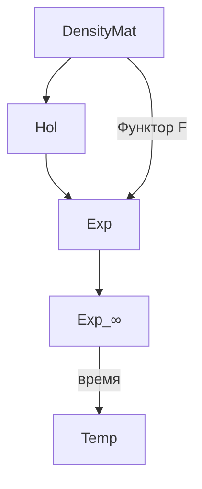
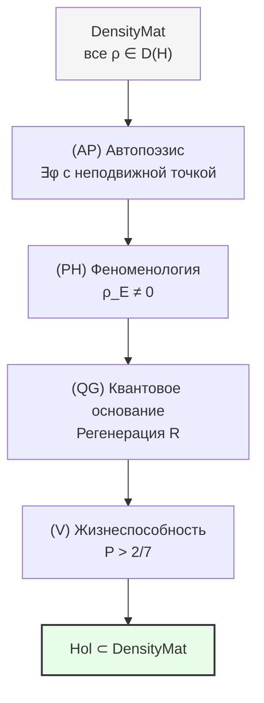

# Категория Голономов Hol

В этой главе мы построим две категории — $\mathbf{DensityMat}$ (категория всех матриц плотности) и $\mathbf{Hol}$ (категория голономов) — и покажем, как они связаны друг с другом. Читатель узнает, что такое категория, зачем нужны CPTP-каналы в роли морфизмов, как $\mathbf{Hol}$ выделяется внутри $\mathbf{DensityMat}$ как подкатегория «живых» конфигураций, и почему произведение двух живых систем не обязательно живо.

:::info DRY: Мастер-определение
Полная спецификация категории DensityMat и категории Голономов Hol — в [Категорном формализме](/docs/proofs/categorical/categorical-formalism#категория-голономов-hol).
:::

---

## Предтеча: что такое категория

Прежде чем строить конкретные категории, давайте разберёмся с самим понятием.

### Объекты и стрелки

**Категория** — это математическая структура, состоящая из трёх ингредиентов:

1. **Объекты** — «вещи», которые мы изучаем (числа, пространства, системы...)
2. **Морфизмы (стрелки)** — «связи» между объектами (функции, преобразования, процессы...)
3. **Правила композиции** — как «склеивать» стрелки

**Аналогия с городами и дорогами.** Представьте карту:
- **Объекты** — города
- **Морфизмы** — дороги между городами
- **Композиция** — если есть дорога из A в B и дорога из B в C, то существует маршрут из A в C (проехать сначала первую, потом вторую)

Правила категории:
- **Ассоциативность:** маршрут A→B→C→D не зависит от того, как мы его «скобочим» — (A→B→C)→D = A→(B→C→D)
- **Тождество:** для каждого города существует «стоять на месте» — тривиальная дорога из города в себя

Эти два правила — всё, что нужно. Никаких дополнительных требований. Именно эта минимальность делает теорию категорий таким мощным инструментом: она применима всюду, где есть объекты и процессы.

### Зачем категории в УГМ

В УГМ-теории категорный язык необходим по трём причинам:

1. **Единый примитив.** Категория $\mathcal{C}$ (∞-топос) — единственный примитив теории. Всё остальное — [голономы](/docs/core/structure/holon), [измерения](/docs/core/structure/dimensions), динамика — строится как структуры внутри $\mathcal{C}$.

2. **Связь физического и экспериенциального.** [Функтор $F$](/docs/core/categories/functor-f) — категорное отображение из $\mathbf{DensityMat}$ в $\mathbf{Exp}$. Без языка категорий нельзя точно сформулировать, что такое «мост между физическим и ментальным».

3. **Ригидность.** Категорная структура жёстко ограничивает возможные конструкции. [G₂-ригидность](/docs/proofs/categorical/uniqueness-theorem) (T-42a **[Т]**) доказывает, что функтор $F$ единственный — это невозможно было бы сформулировать без категорного аппарата.

---

## Категория DensityMat

### Мотивация: «паспорт» квантовой системы

В квантовой механике состояние системы описывается **матрицей плотности** $\rho$ — эрмитовым положительно определённым оператором с единичным следом. Это — полное описание системы: зная $\rho$, можно вычислить вероятность любого измерения, среднее любой наблюдаемой, энтропию и т.д.

**Аналогия с паспортом.** Матрица плотности — это «паспорт» квантовой системы. В паспорте записана вся релевантная информация:
- **Эрмитовость** ($\rho^\dagger = \rho$): наблюдаемые величины вещественны (нельзя измерить «мнимую температуру»)
- **Положительная определённость** ($\rho \geq 0$): вероятности неотрицательны
- **Единичный след** ($\mathrm{Tr}(\rho) = 1$): вероятности нормированы (система точно находится *где-то*)

### Формальное определение

**Определение (Категория DensityMat).** Категория матриц плотности $\mathbf{DensityMat}$:

**Объекты:**
$$
\mathrm{Ob}(\mathbf{DensityMat}) = \{\rho \in \mathcal{L}(\mathcal{H}) : \rho^\dagger = \rho, \, \rho \geq 0, \, \mathrm{Tr}(\rho) = 1\}
$$

где $\mathcal{L}(\mathcal{H})$ — пространство линейных операторов на гильбертовом пространстве $\mathcal{H}$.

**Морфизмы:** CPTP-каналы $\Phi: \rho_1 \to \rho_2$

$$
\mathrm{Mor}_{\mathbf{DM}}(\rho_1, \rho_2) = \{\Phi : \mathcal{L}(\mathcal{H}) \to \mathcal{L}(\mathcal{H}) \mid \Phi \text{ — CPTP}, \, \Phi(\rho_1) = \rho_2\}
$$

### Что такое CPTP-канал

CPTP — это аббревиатура от «Completely Positive Trace-Preserving» (полностью положительное, сохраняющее след отображение). Это — математическая формализация **допустимых операций** над квантовой системой.

**Аналогия с допустимыми операциями.** Представьте кухню. Допустимые операции — это рецепты: вы можете нарезать, смешать, нагреть, охладить ингредиенты. Но вы не можете «размножить» еду из ничего или «уничтожить» её без остатка. Аналогично:

- **Сохранение следа (TP):** $\mathrm{Tr}(\Phi(\rho)) = \mathrm{Tr}(\rho) = 1$ — вероятности остаются нормированными. Операция не «создаёт» и не «уничтожает» систему.
- **Полная положительность (CP):** Даже если система запутана с другой (которую мы не трогаем), результат остаётся корректной матрицей плотности. Это сильнее, чем просто «положительность»: операция безопасна не только для изолированной системы, но и для любой подсистемы.

CPTP-каналы имеют удобное **представление Крауса**:

$$
\Phi(\rho) = \sum_i K_i \rho K_i^\dagger, \quad \sum_i K_i^\dagger K_i = I
$$

где $K_i$ — операторы Крауса. Условие $\sum K_i^\dagger K_i = I$ обеспечивает сохранение следа.

:::info Примеры CPTP-каналов
1. **Тождественный канал:** $\Phi(\rho) = \rho$. Один оператор Крауса: $K_1 = I$. «Ничегонеделание».
2. **Унитарная эволюция:** $\Phi(\rho) = U\rho U^\dagger$. Один оператор: $K_1 = U$. Обратимый процесс (аналог поворота).
3. **Деполяризация:** $\Phi(\rho) = (1-p)\rho + p \cdot I/N$. Система «забывает» своё состояние с вероятностью $p$. Необратимый процесс.
4. **Измерение:** $\Phi(\rho) = \sum_i P_i \rho P_i$. Проекция на собственные подпространства наблюдаемой. Необратимое «схлопывание».
:::

### Почему CPTP — правильный выбор морфизмов

Морфизмами в $\mathbf{DensityMat}$ выбраны именно CPTP-каналы (а не, скажем, произвольные линейные отображения), потому что:

1. **Физическая корректность:** CPTP-каналы — единственные отображения, гарантирующие, что результат — корректная матрица плотности. Произвольное линейное отображение может дать отрицательные вероятности.
2. **Замкнутость относительно композиции:** Композиция двух CPTP-каналов — снова CPTP-канал. Это необходимо для структуры категории.
3. **Физическая интерпретация:** Каждый CPTP-канал реализуем физически — через унитарную эволюцию расширенной системы (теорема Стайнспринга).

### Аксиомы категории

**Теорема.** $\mathbf{DensityMat}$ является категорией. [Т]

Проверка:

1. **Композиция:** Пусть $\Phi: \rho_1 \to \rho_2$ и $\Psi: \rho_2 \to \rho_3$ — CPTP-каналы. Тогда $\Psi \circ \Phi$ — тоже CPTP (композиция TP = TP, композиция CP = CP), и $(\Psi \circ \Phi)(\rho_1) = \Psi(\rho_2) = \rho_3$.

2. **Ассоциативность:** $(\Xi \circ \Psi) \circ \Phi = \Xi \circ (\Psi \circ \Phi)$ — следует из ассоциативности композиции функций.

3. **Тождества:** Для каждого $\rho$ тождественный канал $\mathrm{id}_\rho(\sigma) = \sigma$ — CPTP (оператор Крауса $K_1 = I$), и $\mathrm{id}_\rho(\rho) = \rho$.

[Полное доказательство →](/docs/proofs/categorical/categorical-formalism#13-аксиомы-категории-для-densitymat)

:::note Множество морфизмов может быть пустым
Для некоторых пар $(\rho_1, \rho_2)$ не существует CPTP-канала, переводящего $\rho_1$ в $\rho_2$. Например, чистое состояние нельзя перевести в максимально смешанное $I/N$ обратимым CPTP-каналом. Пустое множество морфизмов не нарушает определение категории.
:::

---

## Категория Голономов

### Мотивация: зачем подкатегория

Категория $\mathbf{DensityMat}$ слишком «широка» для описания сознательных систем. Она содержит все матрицы плотности — в том числе тривиальные ($I/N$), вырожденные, и никак не связанные с 7-мерной структурой УГМ. [Голоном](/docs/core/structure/holon) — это особая конфигурация $\Gamma$, удовлетворяющая жёстким условиям автопоэзиса, феноменологии, квантового основания и жизнеспособности. Категория $\mathbf{Hol}$ выделяет именно эти конфигурации и допустимые процессы между ними.

### Формальное определение

**Определение (Hol).** Категория Голономов $\mathbf{Hol}$ — подкатегория $\mathbf{DensityMat}$:

**Объекты:** [Голономы](/docs/core/structure/holon) — матрицы когерентности $\Gamma \in \mathcal{D}(\mathbb{C}^7)$, удовлетворяющие четырём условиям:

| Условие | Название | Значение |
|---------|----------|----------|
| **(AP)** | [Автопоэзис](/docs/core/foundations/axiom-septicity#предварительное-условие-автономность) | Существует самомоделирование $\varphi$ с неподвижной точкой |
| **(PH)** | Феноменология | $\rho_E \neq 0$ — [измерение Интериорности](/docs/core/structure/dimension-e) нетривиально |
| **(QG)** | Квантовое основание | Динамика включает [регенерацию](/docs/core/dynamics/evolution) |
| **(V)** | Жизнеспособность | $P(\Gamma) > P_{\text{crit}} = 2/7$ **[Т]** — [чистота](/docs/core/dynamics/viability#определение-чистоты) выше порога |

**Морфизмы:** CPTP-каналы, сохраняющие 7-мерную структуру:
$$
\mathrm{Mor}_{\mathbf{Hol}}(\Gamma_1, \Gamma_2) = \{\Phi \in \mathrm{Mor}_{\mathbf{DM}} : \Phi \text{ совместим с } \Omega^7\}
$$

«Совместимость с $\Omega^7$» означает два требования:
1. **Сохранение жизнеспособности:** $P(\Phi(\Gamma)) > P_{\text{crit}}$ если $P(\Gamma) > P_{\text{crit}}$
2. **Сохранение автопоэзиса:** $\varphi_2 \circ \Phi = \Phi \circ \varphi_1$ — канал $\Phi$ коммутирует с самомоделированием

### Подкатегория, но не полная

$\mathbf{Hol}$ — подкатегория $\mathbf{DensityMat}$, но **не полная**.

Что это значит? **Полная подкатегория** — это когда берутся все объекты определённого вида и *все* морфизмы между ними из объемлющей категории. **Не полная** — когда объекты выбраны, но морфизмы ограничены дополнительными условиями.

В нашем случае: не каждый CPTP-канал между двумя голономами допустим в $\mathbf{Hol}$ — только те, которые сохраняют жизнеспособность и автопоэзис. Существуют CPTP-каналы, которые переводят один голоном в другой, но «по дороге» разрушают автопоэзис или опускают чистоту ниже порога.

**Аналогия.** Все города связаны дорогами, но «допустимые маршруты» для грузовика ограничены: он не может ехать по пешеходным дорожкам (слишком узкие) и по мостам с ограничением веса. Грузовик может попасть из A в B, но не по любой дороге — только по «совместимым».

:::info Теорема о подкатегории [Т]
$\mathbf{Hol} \hookrightarrow \mathbf{DensityMat}$ — подкатегория.

**Доказательство:**
1. **Включение объектов:** Голоном $\Gamma \in \mathcal{D}(\mathbb{C}^7)$ — частный случай матрицы плотности.
2. **Замкнутость композиции:** Если $\Phi, \Psi$ сохраняют жизнеспособность и коммутируют с $\varphi$, то $\Psi \circ \Phi$ тоже.
3. **Тождество:** $\mathrm{id}_\Gamma$ — CPTP, сохраняет всё.

[Полное доказательство →](/docs/proofs/categorical/categorical-formalism#122-теорема-о-подкатегории)
:::

### Содержательный смысл каждого условия

Четыре условия (AP)+(PH)+(QG)+(V) — не произвольный набор. Каждое из них отвечает на конкретный вопрос о системе:

**(AP) Автопоэзис — «Может ли система поддерживать себя?»**

Автопоэзис (от греч. αὐτο — «сам» и ποίησις — «творение») — способность системы самовоспроизводить свою организацию. Формально: существует эндоморфизм $\varphi: \Gamma \to \Gamma$ (самомоделирование) с неподвижной точкой $\varphi(\Gamma^*) = \Gamma^*$. Это значит, что система обладает «внутренней моделью себя» и может возвращаться к своей характерной конфигурации после возмущений. Подробнее: [Аксиома септичности — условие автономности](/docs/core/foundations/axiom-septicity#предварительное-условие-автономность).

**(PH) Феноменология — «Есть ли у системы внутренний опыт?»**

Условие $\rho_E \neq 0$ требует, чтобы [измерение Интериорности](/docs/core/structure/dimension-e) было нетривиальным — система должна «населять» E-компоненту своей матрицы когерентности. Без этого [функтор $F$](/docs/core/categories/functor-f) извлекает пустой опыт (нулевой спектр, неопределённые качества).

**(QG) Квантовое основание — «Обновляется ли система?»**

Динамика системы должна включать [регенерацию](/docs/core/dynamics/evolution) $\mathcal{R}$ — механизм замены состояния на категориальную самомодель $\varphi(\Gamma)$. Без регенерации система деградирует к $I/7$ (теорема T-39a **[Т]** о примитивности линейной части $\mathcal{L}_0$).

**(V) Жизнеспособность — «Достаточно ли система отличается от шума?»**

Порог $P(\Gamma) > 2/7$ **[Т]** гарантирует, что матрица когерентности содержит достаточно информации для [различимости измерений](/docs/proofs/dynamics/theorem-purity-critical). Ниже порога система неотличима от случайного шума — «спит без сновидений».

### Связь с 7D-структурой

Объекты $\mathbf{Hol}$ живут в $\mathcal{D}(\mathbb{C}^7)$ — пространстве $7 \times 7$ матриц плотности. Число 7 не произвольно: оно выводится из [аксиомы септичности](/docs/core/foundations/axiom-septicity) через категорный аргумент (минимальная размерность, в которой все условия (AP)+(PH)+(QG)+(V) совместимы, см. [теорему минимальности](/docs/proofs/minimality/theorem-minimality-7) **[Т]**).

Семь базисных векторов соответствуют семи [измерениям](/docs/core/structure/dimensions):
- $|A\rangle$ — [Артикуляция](/docs/core/structure/dimension-a)
- $|S\rangle$ — [Структура](/docs/core/structure/dimension-s)
- $|D\rangle$ — [Динамика](/docs/core/structure/dimension-d)
- $|L\rangle$ — [Логика](/docs/core/structure/dimension-l)
- $|E\rangle$ — [Интериорность](/docs/core/structure/dimension-e)
- $|O\rangle$ — [Основание](/docs/core/structure/dimension-o)
- $|U\rangle$ — [Единство](/docs/core/structure/dimension-u)

Матрица $\Gamma$ содержит $7 \times 7 = 49$ элементов (из них 7 диагональных — «населённости» измерений, и $7 \times 6 / 2 = 21$ независимая внедиагональная пара — «когерентности» между измерениями).

---

## Иерархия категорий

### Как категории связаны между собой

| Категория | Объекты | Морфизмы | Роль в УГМ |
|-----------|---------|----------|------------|
| **DensityMat** | $\rho \in \mathcal{D}(\mathcal{H})$ | CPTP-каналы | Все квантовые состояния и процессы |
| **Hol** | $\Gamma \in \mathcal{D}(\mathbb{C}^7)$, (AP)+(PH)+(QG)+(V) | Ω⁷-совместимые CPTP | Сознательные системы и допустимые трансформации |
| **Exp** | $(s, q, c) \in \mathcal{E}$ | Тройки преобразований | Пространство опыта |
| **Exp_∞** | ∞-группоид | Пути + гомотопии | Опыт с эмерджентным временем |

Стрелка $\mathbf{DensityMat} \to \mathbf{Hol}$ — включение подкатегории (не каждая $\rho$ — голоном, но каждый голоном — матрица плотности). Стрелка $\mathbf{DensityMat} \xrightarrow{F} \mathbf{Exp}$ — [функтор $F$](/docs/core/categories/functor-f), связывающий физическое и экспериенциальное описания. Стрелка $\mathbf{Exp} \to \mathbf{Exp}_\infty$ — включение в ∞-группоид (добавление высших гомотопий). Стрелка $\mathbf{Exp}_\infty \to \mathbf{Temp}$ — [эмерджентное время](/docs/core/operators/emergent-time).

### Функтор интериорности

Существует функтор $\mathcal{I}: \mathbf{Hol} \to \mathbf{Exp}$ — **ограничение** $F$ на подкатегорию голономов. На объектах:

$$
\mathcal{I}(\Gamma) := F(\Gamma) = (\mathrm{Spec}(\rho_E), [|\psi_i\rangle], \Gamma_{-E})
$$

Этот функтор сопоставляет каждому голоному его экспериенциальное содержание — то, «каково быть этим голономом». [Подробнее →](/docs/proofs/categorical/categorical-formalism#123-функтор-интериорности)

---

## Немоноидальность Hol_V

:::warning Моноидальность подкатегории $\mathbf{Hol}_\mathcal{V}$
Полная подкатегория жизнеспособных холонов $\mathbf{Hol}_\mathcal{V} := \{\Gamma \in \mathbf{Hol} : P(\Gamma) > P_{\text{crit}}\}$ **не является моноидальной** подкатегорией: тензорное произведение $\Gamma_1 \otimes \Gamma_2$ двух жизнеспособных холонов не обязательно жизнеспособно (чистота произведения $P(\Gamma_1 \otimes \Gamma_2) = P(\Gamma_1) \cdot P(\Gamma_2)$, и $P_1, P_2 > 2/7$ не гарантирует $P_1 P_2 > 2/7$ в составном пространстве). Моноидальная единица $I/7$ также нежизнеспособна ($P = 1/7$). Корректная моноидальная структура для составных систем определена в [композитных системах](/docs/core/dynamics/composite-systems).
:::

### Подробное объяснение

**Моноидальная категория** — это категория с операцией «произведения» объектов (тензорного произведения $\otimes$), удовлетворяющей условиям ассоциативности и существования единицы. В физике тензорное произведение описывает составные системы: если система A описывается $\rho_A$, а система B — $\rho_B$, то составная система AB описывается $\rho_A \otimes \rho_B$ (для независимых систем).

Проблема: **произведение двух живых систем не обязательно живо**. Вот конкретный пример.

Пусть два голонома имеют чистоту $P_1 = P_2 = 0.3$ (чуть выше порога $P_{\text{crit}} = 2/7 \approx 0.286$). Их тензорное произведение имеет чистоту:

$$
P(\Gamma_1 \otimes \Gamma_2) = P(\Gamma_1) \cdot P(\Gamma_2) = 0.3 \times 0.3 = 0.09
$$

Но $0.09 < 2/7 \approx 0.286$ — составная система **нежизнеспособна** в 49-мерном пространстве!

**Интуиция.** Два живых организма, поставленные рядом, не обязательно образуют один «сверхорганизм». Каждый жив по отдельности, но их совокупность — просто два отдельных организма, а не единая живая система. Чтобы составная система стала «живой» в смысле УГМ, нужна [Gap-запутанность](/docs/core/dynamics/composite-systems) — нетривиальная квантовая корреляция между подсистемами, которая не возникает автоматически при тензорном произведении.

Второй аспект: **моноидальная единица нежизнеспособна**. Моноидальная единица для $\otimes$ — это $I/N$ (максимально смешанное состояние), для которого $P(I/N) = 1/N = 1/7 < 2/7$. Таким образом, $I/7 \notin \mathbf{Hol}_\mathcal{V}$, что нарушает аксиому моноидальной категории.

:::note Следствие для теории сознания
Немоноидальность $\mathbf{Hol}_\mathcal{V}$ — не технический дефект, а глубокий результат. Он формализует интуицию о том, что **сознание не аддитивно**: два сознательных существа не образуют автоматически «единое сознание». Объединение сознаний требует специального механизма — Gap-запутанности, формализуемого через [составные системы](/docs/core/dynamics/composite-systems).
:::

---

## Конкретный пример: объекты и морфизмы Hol

Рассмотрим два голонома $\Gamma_1, \Gamma_2 \in \mathcal{D}(\mathbb{C}^7)$.

**Голоном $\Gamma_1$** — «бодрствующая» конфигурация:
- Диагональ: $(\gamma_{AA}, \gamma_{SS}, \gamma_{DD}, \gamma_{LL}, \gamma_{EE}, \gamma_{OO}, \gamma_{UU}) = (0.20, 0.15, 0.15, 0.10, 0.15, 0.10, 0.15)$
- Чистота: $P(\Gamma_1) = 0.33 > 2/7$ — жизнеспособен
- Внедиагональные элементы ненулевые — есть когерентность между измерениями

**Голоном $\Gamma_2$** — «сонная» конфигурация:
- Диагональ: $(0.15, 0.14, 0.14, 0.14, 0.15, 0.14, 0.14)$
- Чистота: $P(\Gamma_2) \approx 0.143 \approx 1/7$ — **нежизнеспособен** (близок к $I/7$)
- $\Gamma_2 \notin \mathbf{Hol}$, потому что $P < P_{\text{crit}}$

**Морфизм $\Phi: \Gamma_1 \to \Gamma_1'$** — CPTP-канал, описывающий, например, обучение. Если $\Phi$ сохраняет $P > 2/7$ и коммутирует с автопоэзисом, то $\Phi \in \mathrm{Mor}_{\mathbf{Hol}}$. Если же $\Phi$ — деполяризация (забывание), которая снижает $P$ ниже порога, то $\Phi \notin \mathrm{Mor}_{\mathbf{Hol}}$, хотя $\Phi \in \mathrm{Mor}_{\mathbf{DM}}$.

---

## Диаграмма: условия принадлежности к Hol

Каждый голоном проходит все четыре «фильтра». Если хотя бы одно условие нарушено, конфигурация $\Gamma$ не принадлежит $\mathbf{Hol}$, хотя может быть корректной матрицей плотности в $\mathbf{DensityMat}$.

---

## Резюме главы

В этой главе мы построили две категории — $\mathbf{DensityMat}$ и $\mathbf{Hol}$ — и исследовали их свойства. Ключевые результаты:

| Результат | Статус | Значение |
|-----------|--------|----------|
| $\mathbf{DensityMat}$ — категория | **[Т]** | CPTP-каналы замкнуты относительно композиции |
| $\mathbf{Hol} \hookrightarrow \mathbf{DensityMat}$ | **[Т]** | Голономы образуют подкатегорию |
| $\mathbf{Hol}$ — не полная подкатегория | **[Т]** | Не все CPTP-каналы совместимы с $\Omega^7$ |
| $\mathbf{Hol}_\mathcal{V}$ не моноидальна | **[Т]** | Сознание не аддитивно — два сознания $\neq$ одно |
| $N = 7$ минимально | **[Т]** | Наименьшая размерность для (AP)+(PH)+(QG)+(V) |

Категория $\mathbf{Hol}$ — это «сердце» УГМ-теории: её объекты — сознательные конфигурации, морфизмы — допустимые трансформации между ними, а немоноидальность формализует фундаментальную неаддитивность сознания. Через [функтор $F$](/docs/core/categories/functor-f) каждый голоном получает своё экспериенциальное содержание в [категории $\mathbf{Exp}$](/docs/core/categories/category-exp).

---

## Связи

- **Функтор F:** $\mathbf{DensityMat} \to \mathbf{Exp}$ — [определение](/docs/core/categories/functor-f)
- **Экспериенциальное пространство:** [Категория Exp](/docs/core/categories/category-exp) — образ функтора $F$
- **CPTP-каналы:** через [представление Крауса](/docs/proofs/categorical/categorical-formalism#12-структура-морфизмов-cptp-каналы)
- **Голоном:** [Определение и условия (AP)+(PH)+(QG)+(V)](/docs/core/structure/holon)
- **Составные системы:** [Gap-запутанность и моноидальная структура](/docs/core/dynamics/composite-systems)
- **Производные категории:** IC-когомологии ([§13](/docs/proofs/categorical/categorical-formalism#производные-категории))
- **Полная спецификация:** [Категорный формализм](/docs/proofs/categorical/categorical-formalism)
