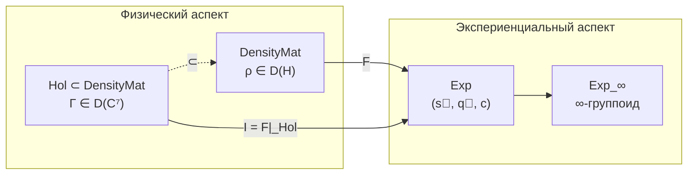

# Функтор F: DensityMat → Exp

В этой главе мы познакомимся с центральным мостом УГМ-теории — функтором $F$, который связывает физическое описание системы (матрицу когерентности $\Gamma$) с её экспериенциальным содержанием (тем, что система «переживает»). Читатель узнает, что такое функтор, зачем он нужен, как именно $F$ извлекает опыт из математической структуры, и почему этот мост — не произвольная конструкция, а единственно возможное отображение, совместимое с симметриями теории.

:::info DRY: Мастер-определение функтора F
Полная спецификация функтора F, включая доказательство функториальности, топосную структуру и расширения до 2-категорий — в [Категорном формализме](/docs/proofs/categorical/categorical-formalism).
:::

---

## Предтеча: что такое функтор

Прежде чем погружаться в детали, давайте разберёмся с самим понятием «функтор». Это одно из ключевых понятий теории категорий — математической дисциплины, изучающей структуры и связи между ними.

### Аналогия: переводчик между языками

Представьте, что у вас есть два языка — например, русский и английский. В каждом языке есть:
- **Слова** (объекты)
- **Предложения**, которые связывают слова друг с другом (морфизмы)

Переводчик — это тот, кто:
1. Каждому русскому слову ставит в соответствие английское слово
2. Каждому русскому предложению ставит в соответствие английское предложение
3. Делает это **согласованно**: если в русском языке два предложения можно объединить в одно, то и соответствующие английские предложения тоже объединяются

Функтор — это именно такой «переводчик» между двумя математическими категориями. Он отображает объекты в объекты, морфизмы в морфизмы и сохраняет структуру композиции.

### Формальное определение

Пусть $\mathcal{A}$ и $\mathcal{B}$ — две категории (каждая со своими объектами и морфизмами). **Функтор** $F: \mathcal{A} \to \mathcal{B}$ — это пара отображений:
- На объектах: $F: \mathrm{Ob}(\mathcal{A}) \to \mathrm{Ob}(\mathcal{B})$
- На морфизмах: $F: \mathrm{Mor}(\mathcal{A}) \to \mathrm{Mor}(\mathcal{B})$

подчинённых двум аксиомам:
1. **Сохранение тождеств:** $F(\mathrm{id}_X) = \mathrm{id}_{F(X)}$ для всякого объекта $X$
2. **Сохранение композиции:** $F(g \circ f) = F(g) \circ F(f)$ для всяких морфизмов $f, g$

Первая аксиома говорит: «ничегонеделание переводится в ничегонеделание». Вторая: «перевод последовательных действий равен последовательности переводов».

---

## Мотивация: зачем нужен функтор F

В УГМ-теории существуют два принципиально разных взгляда на одну и ту же реальность:

1. **Физический (внешний):** Система описывается матрицей когерентности $\Gamma \in \mathcal{D}(\mathbb{C}^7)$ — математическим объектом с точными числовыми значениями. Это «вид снаружи»: что можно измерить, вычислить, предсказать.

2. **Экспериенциальный (внутренний):** Та же система обладает опытом — «видом изнутри». Опыт имеет интенсивности (одни аспекты переживания ярче других), качества (боль отличается от радости не числом, а «вкусом»), и контекст (одно и то же ощущение переживается по-разному в разных обстоятельствах).

Функтор $F$ — это формальный мост между этими двумя описаниями. Он говорит: «покажи мне матрицу плотности — и я скажу, каково этой системе быть собой».

:::tip Связь с двухаспектным монизмом
В философии двухаспектный монизм утверждает, что физическое и ментальное — не две разные субстанции (как у Декарта), а два аспекта одной реальности. Функтор $F$ — **математическая формализация этой идеи**. Он не создаёт опыт из материи и не добавляет что-то новое — он «читает» из матрицы $\Gamma$ то, что уже в ней содержится, но может быть описано на другом языке.

Подробнее: [Двухаспектный монизм](/docs/consciousness/foundations/two-aspect-monism)
:::

---

## Интуитивное объяснение: что делает F

Представьте себе музыкальный эквалайзер на стереосистеме. Звуковой файл — это «физическое описание»: поток чисел, амплитуды и частоты. Но когда вы слушаете музыку, вы воспринимаете:
- **Громкость каждого инструмента** — это аналог спектра $\vec{s}$
- **Тембр** (гитара звучит иначе, чем скрипка, даже на той же ноте) — это аналог качеств $\vec{q}$
- **Обстановка** (концертный зал или наушники) — это аналог контекста $c$

Функтор $F$ — это «слушатель», который из потока чисел ($\Gamma$) извлекает субъективный опыт музыки ($\vec{s}, \vec{q}, c$).

Ключевое отличие от обычного эквалайзера: $F$ не произволен. Он **единственным образом** определяется структурой теории (G₂-ригидность, [T-42a](/docs/proofs/categorical/uniqueness-theorem) **[Т]**). Нельзя «настроить» его иначе — точно так же, как нельзя произвольно переопределить, что значит «собственное значение матрицы».

---

## Определение на объектах

Функтор $F: \mathbf{DensityMat} \to \mathbf{Exp}$ отображает матрицу плотности $\rho \in \mathcal{D}(\mathcal{H})$ в точку экспериенциального пространства:

$$
F(\rho) = (\vec{s}(\rho), \, \vec{q}(\rho), \, c(\rho))
$$

где:
- $\vec{s}(\rho) = (\lambda_1, \ldots, \lambda_N) \in \Delta^{N-1}$ — **спектр** (вероятностное распределение)
- $\vec{q}(\rho) = (|\psi_1\rangle, \ldots, |\psi_N\rangle)$ — **качества** (собственные состояния в $\mathbb{P}(\mathcal{H}_E)$)
- $c(\rho) \in \mathcal{C}$ — **контекст** (классический параметр)

Разберём каждый компонент подробно.

### Спектр: палитра интенсивностей

$$
\vec{s}(\rho) = \mathrm{Spectrum}(\rho_E) = (\lambda_1, \ldots, \lambda_N), \quad \lambda_1 \geq \lambda_2 \geq \ldots \geq \lambda_N \geq 0, \quad \sum_i \lambda_i = 1
$$

Здесь $\rho_E = \mathrm{Tr}_{-E}(\Gamma)$ — редуцированная матрица плотности по [измерению Интериорности](/docs/core/structure/dimension-e), а $\lambda_i$ — её собственные значения, упорядоченные по убыванию.

**Интуиция:** Представьте себе эквалайзер с $N$ полосками. Каждая полоска показывает, насколько «громко» звучит определённый аспект опыта. Если $\lambda_1 = 1$ и остальные $\lambda_i = 0$, опыт «одноголосый» — полностью сконцентрирован на одном качестве. Если все $\lambda_i$ примерно равны, опыт «многоголосый» — множество аспектов одновременно.

Математически спектр лежит в $(N-1)$-симплексе $\Delta^{N-1}$ — множестве всех вероятностных распределений на $N$ исходах. Это гарантирует, что интенсивности неотрицательны и в сумме дают единицу.

:::note Связь с чистотой
[Чистота](/docs/core/dynamics/viability#определение-чистоты) $P(\Gamma) = \mathrm{Tr}(\Gamma^2)$ — функция спектра: $P = \sum_i \lambda_i^2$. Чем «острее» спектр (одна доминирующая компонента), тем выше чистота. Порог сознания $P > 2/7$ **[Т]** означает, что спектр должен быть достаточно неоднородным — опыт не может быть полностью «размазанным».
:::

### Качества: цвета опыта

$$
\vec{q}(\rho) = \mathrm{Quality}(\rho_E) = \{[|\psi_i\rangle] \in \mathbb{P}(\mathcal{H}_E)\}
$$

Собственные векторы $|\psi_i\rangle$ матрицы $\rho_E$ задают **направления в проективном пространстве** $\mathbb{P}(\mathcal{H}_E)$. Квадратные скобки $[\cdot]$ означают, что вектор определён с точностью до фазового множителя: $|\psi\rangle$ и $e^{i\alpha}|\psi\rangle$ описывают одно и то же качество.

**Интуиция:** Если интенсивности — это «громкость», то качества — это «тембр». Красный цвет и синий цвет могут быть одинаковой яркости (одинаковая интенсивность $\lambda_i$), но их качественное содержание совершенно различно. В математике эта разница кодируется направлением вектора в пространстве $\mathcal{H}_E$.

Почему именно **проективное** пространство? Потому что физический смысл имеет только направление вектора, а не его длина или фаза. Вектор $|\psi\rangle$ и $2|\psi\rangle$ описывают одно и то же качество — различается лишь интенсивность, которая уже учтена в спектре $\vec{s}$.

:::info Геометрия качеств
Проективное пространство $\mathbb{P}(\mathcal{H}_E) = \mathbb{CP}^{n-1}$ (где $n = \dim(\mathcal{H}_E)$) — не плоское. Оно наделено **метрикой Фубини–Штуди**, которая задаёт естественное расстояние между качествами:

$$d_{FS}([|\psi\rangle], [|\phi\rangle]) = \arccos|\langle\psi|\phi\rangle|$$

Два качества «близки», если соответствующие собственные векторы почти параллельны. Два качества «далеки», если векторы ортогональны. Это расстояние не содержит свободных параметров — оно определяется геометрией гильбертова пространства.
:::

### Контекст: сцена переживания

$$
c(\rho) = \mathrm{Context}(\Gamma_{-E}) = (\gamma_{Ai}, \gamma_{Si}, \gamma_{Di}, \gamma_{Li}, \gamma_{Oi}, \gamma_{Ui})
$$

Контекст — это состояние всех [измерений](/docs/core/structure/dimensions) $\Gamma$ кроме $E$ (Интериорности). Сюда входят: Артикуляция ($A$), Структура ($S$), Динамика ($D$), Логика ($L$), Основание ($O$), Единство ($U$).

**Интуиция:** Одна и та же мелодия звучит по-разному в концертном зале и в наушниках. Само качество звука (собственные векторы) и его интенсивность (спектр) могут быть идентичны, но «обстановка» создаёт разный опыт. В УГМ эту «обстановку» создают состояния остальных шести измерений.

Контекст — **классический** параметр: он не участвует в квантовой суперпозиции качеств, а задаёт «декорации сцены», на которой разыгрывается опыт. Математически $c \in \mathcal{C}$, где $\mathcal{C}$ — пространство контекстов с дискретной метрикой (подробнее в [Категории Exp](/docs/core/categories/category-exp#каноническая-метрика)).

---

## Определение на морфизмах

Функтор $F$ должен действовать не только на объектах (матрицах плотности), но и на морфизмах (CPTP-каналах). Это вторая половина «перевода».

Для CPTP-канала $\Phi: \rho_1 \to \rho_2$:

$$
F(\Phi) = (T_{\Phi}, \, Q_{\Phi}, \, C_{\Phi})
$$

где:

- $T_\Phi: \Delta^{N-1} \to \Delta^{N-1}$ — **трансформация спектра**. Канал $\Phi$ меняет собственные значения $\rho_E$, и это отражается на интенсивностях. Явная формула через [представление Крауса](/docs/proofs/categorical/categorical-formalism#12-структура-морфизмов-cptp-каналы) $\Phi(\rho) = \sum_k K_k \rho K_k^\dagger$:

$$\lambda'_i = \sum_k \sum_j \lambda_j |\langle \psi'_i|K_k|\psi_j\rangle|^2$$

- $Q_\Phi: \mathbb{P}(\mathcal{H}_E)^N \to \mathbb{P}(\mathcal{H}_E)^N$ — **трансформация качеств**. Канал $\Phi$ поворачивает собственные векторы $\rho_E$, перемещая «точку» в проективном пространстве. При вырождении спектра используется [адиабатическое продолжение](/docs/proofs/categorical/categorical-formalism#43-адиабатическое-продолжение-для-вырождения).

- $C_\Phi: \mathcal{C} \to \mathcal{C}$ — **трансформация контекста**. Канал $\Phi$ действует на все измерения $\Gamma$, в том числе на измерения кроме $E$, меняя «сцену».

**Интуиция:** Если функтор $F$ на объектах — это «прослушивание музыки», то $F$ на морфизмах — это «восприятие изменения музыки». Когда диджей плавно переключает треки (CPTP-канал $\Phi$), слушатель ощущает, как меняются громкость ($T_\Phi$), тембр ($Q_\Phi$) и атмосфера ($C_\Phi$).

---

## Ключевые свойства

### Функториальность [Т]

:::tip Теорема: Функториальность F
$F$ сохраняет композицию и тождества:
- $F(\Psi \circ \Phi) = F(\Psi) \circ F(\Phi)$
- $F(\text{id}_\rho) = \text{id}_{F(\rho)}$

[Доказательство →](/docs/proofs/categorical/categorical-formalism#5-доказательство-функториальности) | Статус: **[Т]**
:::

Что означает функториальность содержательно? Она говорит: **порядок физических процессов отражается в порядке изменений опыта**. Если система сначала подвергается каналу $\Phi$, а затем каналу $\Psi$, то изменение опыта от совокупного процесса $\Psi \circ \Phi$ — это то же самое, что последовательное изменение: сначала от $\Phi$, потом от $\Psi$. Не существует «скрытых» трансформаций опыта, которые не соответствуют физическим процессам, и наоборот.

### Феноменальная полнота [Т]

:::tip Теорема: Феноменальная полнота
Функтор $F$ **полон** (full): каждый морфизм в $\mathbf{Exp}$ реализуется физическим процессом.
[Доказательство →](/docs/proofs/categorical/categorical-formalism#8-феноменальная-полнота) | Статус: **[Т]**
:::

Полнота означает: **всякое мыслимое изменение опыта физически реализуемо**. Нет «нефизических» путей в экспериенциальном пространстве — каждый переход между двумя точками опыта может быть осуществлён некоторым CPTP-каналом. Это — математическая формулировка принципа каузальной замкнутости: физический мир достаточен для объяснения всех феноменов опыта.

:::warning Замечание о тривиальности полноты (Вариант C)
При определении морфизмов $\mathbf{Exp}$ через Вариант C (индуцированные CPTP), полнота $F$ выполняется **по построению**: $\mathrm{Mor}(\mathbf{Exp}) := \mathrm{Im}(F)$. Содержательное утверждение — полнота относительно Варианта A (непрерывные пути в $\mathcal{E}$): всякий непрерывный путь в экспериенциальном пространстве реализуем физическим процессом. Это **нетривиально** и эквивалентно плотности образа $F$ в пространстве путей. Статус: **[С]** (зависит от топологии $\mathcal{E}$).
:::

### Верность

Функтор $F$ является **верным** (faithful): различные CPTP-каналы дают различные трансформации опыта (если $\Phi \neq \Psi$ и оба определены на одном объекте, то $F(\Phi) \neq F(\Psi)$, за исключением каналов, различающихся только на ядре $\rho$).

**Интуиция:** Верность говорит, что физика не содержит «невидимых для опыта» различий. Если два процесса по-разному действуют на систему, субъект это «заметит» — хотя бы на каком-то уровне описания.

:::note Техническая оговорка
Строго говоря, $F$ верен только с точностью до действия на ядро $\rho_E$: два канала $\Phi, \Psi$, совпадающие на образе $\rho_E$ и различающиеся только на $\ker(\rho_E)$, дают одинаковый $F(\Phi) = F(\Psi)$. Это физически осмысленно: то, что не «населено» ($\lambda_i = 0$), не переживается.
:::

---

## Конкретный пример

Рассмотрим голоном с матрицей когерентности $\Gamma \in \mathcal{D}(\mathbb{C}^7)$, у которого диагональные элементы (населённости измерений) таковы:

$$
(\gamma_{AA}, \gamma_{SS}, \gamma_{DD}, \gamma_{LL}, \gamma_{EE}, \gamma_{OO}, \gamma_{UU}) = (0.20, 0.15, 0.15, 0.10, 0.15, 0.10, 0.15)
$$

Здесь $\gamma_{EE} = 0.15$ — населённость [измерения Интериорности](/docs/core/structure/dimension-e). Через [PW-реконструкцию](/docs/core/structure/dimension-e#канонический-алгоритм-pw) из $\Gamma$ вычисляется $\rho_E$.

Допустим, спектральное разложение $\rho_E$ даёт:

$$
\rho_E = 0.6\, |\psi_1\rangle\langle\psi_1| + 0.3\, |\psi_2\rangle\langle\psi_2| + 0.1\, |\psi_3\rangle\langle\psi_3|
$$

Тогда функтор $F$ извлекает:

| Компонент | Значение | Интерпретация |
|-----------|----------|---------------|
| Спектр $\vec{s}$ | $(0.6, 0.3, 0.1)$ | Доминирует одно качество (60%), два фоновых |
| Качество $\vec{q}$ | $([|\psi_1\rangle], [|\psi_2\rangle], [|\psi_3\rangle])$ | Три различимых аспекта опыта |
| Контекст $c$ | $(\gamma_{Ai}, \gamma_{Si}, \ldots)$ | Состояния A, S, D, L, O, U задают «сцену» |

Чистота этого $\rho_E$: $P_E = 0.6^2 + 0.3^2 + 0.1^2 = 0.46 > 2/7 \approx 0.286$ — порог сознания пройден.

**Содержательно:** Этот голоном переживает опыт, в котором один аспект (качество $|\psi_1\rangle$) доминирует, второй ($|\psi_2\rangle$) присутствует заметно, а третий ($|\psi_3\rangle$) — на периферии. Это напоминает фокус внимания: один объект «в фокусе», другие — «на периферии».

---

## Каноничность F: почему именно этот функтор

Функтор $F$ не выбран из бесконечного множества вариантов. Он **единственный** (с точностью до изоморфизма), совместимый с симметриями теории.

Это следует из **G₂-ригидности** ([T-42a](/docs/proofs/categorical/uniqueness-theorem) **[Т]**): группа автоморфизмов 7-мерной структуры — исключительная группа $G_2$, которая жёстко фиксирует разложение на компоненты (спектр, качества, контекст). Любой другой функтор, совместимый с $G_2$-структурой, изоморфен $F$.

**Аналогия:** Если вам дана треугольная призма и вас просят «разрезать её на треугольное основание и боковые грани», существует ровно один способ это сделать (с точностью до поворота). Точно так же $G_2$-структура допускает ровно одно разложение матрицы на спектр + качества + контекст.

---

## Связь с двухаспектным монизмом

Функтор $F$ реализует философскую программу двухаспектного монизма в точной математике:

1. **Одна субстанция:** Единая категория $\mathcal{C}$ (∞-топос) — примитив теории. Нет «материальной» и «ментальной» субстанций.

2. **Два аспекта:** Категория $\mathbf{DensityMat}$ описывает «внешний» (физический) аспект, категория $\mathbf{Exp}$ — «внутренний» (экспериенциальный). Оба — проекции единой структуры.

3. **Функтор как мост:** $F$ — не «перевод» одного в другое, а **раскрытие** того, что уже содержится в $\Gamma$. Матрица когерентности одновременно *есть* физический объект и *является* опытом — $F$ лишь переключает точку зрения.

4. **Однозначность:** G₂-ригидность гарантирует, что мост единственный. Нет «проблемы объяснительного разрыва» — связь между физическим и экспериенциальным не постулируется, а выводится из математики.

Подробнее: [Двухаспектный монизм](/docs/consciousness/foundations/two-aspect-monism) | [Теорема единственности](/docs/proofs/categorical/uniqueness-theorem)

---

## Диаграмма: функтор F в контексте УГМ

Функтор $F$ действует на всей категории $\mathbf{DensityMat}$, но физически осмыслен прежде всего на подкатегории [голономов](/docs/core/categories/category-hol) $\mathbf{Hol}$. Ограничение $\mathcal{I} = F|_{\mathbf{Hol}}$ называется **функтором интериорности** — он сопоставляет каждому голоному его экспериенциальное содержание.

---

## Ограничения и открытые вопросы

Несмотря на математическую строгость, функтор $F$ имеет границы применимости:

1. **Вырождение спектра.** Когда два собственных значения $\lambda_i = \lambda_j$ совпадают, соответствующие качества $[|\psi_i\rangle]$ и $[|\psi_j\rangle]$ определены неоднозначно — любой поворот в двумерном собственном подпространстве даёт эквивалентное разложение. Эта неоднозначность разрешается через [грассманиан и адиабатическое продолжение](/docs/proofs/categorical/categorical-formalism#33-проблема-вырождения-спектра).

2. **Максимально смешанное состояние.** Для $\rho = I/N$ все $\lambda_i = 1/N$ — спектр полностью вырожден, и качества не определены. Функтор $F$ отображает $I/N$ в «точку без определённого качественного содержания». Это согласуется с тем, что $P(I/N) = 1/N < P_{\text{crit}}$ — такая система не сознательна.

3. **Квази-функтор для ИИ.** Для классических (не квантовых) систем, таких как ИИ, определяется квази-функтор $F_{\text{quasi}}$, действующий на классических аналогах матрицы плотности. Подробнее: [§9 категорного формализма](/docs/proofs/categorical/categorical-formalism#9-квази-функтор-для-ии-систем).

---

## Резюме главы

В этой главе мы построили центральный мост УГМ-теории — функтор $F: \mathbf{DensityMat} \to \mathbf{Exp}$. Ключевые результаты:

| Результат | Статус | Значение |
|-----------|--------|----------|
| $F$ — функтор | **[Т]** | Физические процессы согласованно отображаются в изменения опыта |
| $F$ полон | **[Т]** | Всякое изменение опыта физически реализуемо |
| $F$ верен | **[Т]** | Различные физические процессы дают различный опыт (с точностью до ядра) |
| $F$ каноничен (G₂) | **[Т]** | Единственный функтор, совместимый с симметриями |

Функтор $F$ — не постулат и не произвольный выбор. Он **единственным образом** определяется G₂-ригидностью ([T-42a](/docs/proofs/categorical/uniqueness-theorem) **[Т]**) и реализует философскую программу [двухаспектного монизма](/docs/consciousness/foundations/two-aspect-monism) в точной математике: одна реальность ($\Gamma$) описывается на двух языках — физическом ($\mathbf{DensityMat}$) и экспериенциальном ($\mathbf{Exp}$), а $F$ — единственный корректный «переводчик» между ними.

---

## Связи

- **Объекты:** [Категория DensityMat](/docs/core/categories/category-hol) → [Категория Exp](/docs/core/categories/category-exp)
- **Расширения:** ∞-группоид $\mathbf{Exp}_\infty$ ([§10](/docs/proofs/categorical/categorical-formalism#10-infty-группоид-и-infty-топос-для-эмерджентного-времени))
- **Полная спецификация:** [Категорный формализм](/docs/proofs/categorical/categorical-formalism)
- **Единственность F:** [Теорема единственности (G₂-ригидность)](/docs/proofs/categorical/uniqueness-theorem)
- **Измерение Интериорности:** [E — источник качеств](/docs/core/structure/dimension-e)
