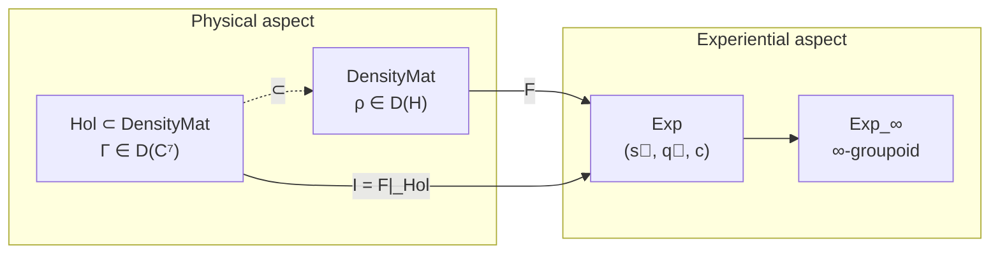

# Functor F: DensityMat → Exp

In this chapter we will become acquainted with the central bridge of UHM theory — the functor $F$, which connects the physical description of a system (the coherence matrix $\Gamma$) with its experiential content (what the system "experiences"). The reader will learn what a functor is, why it is needed, exactly how $F$ extracts experience from a mathematical structure, and why this bridge is not an arbitrary construction but the only possible mapping compatible with the symmetries of the theory.

:::info DRY: Master definition of functor F
The complete specification of functor F, including the proof of functoriality, topos structure, and extensions to 2-categories, is in [Categorical Formalism](/docs/proofs/categorical/categorical-formalism).
:::

---

## Precursor: what a functor is

Before diving into the details, let us clarify the very concept of "functor." It is one of the key concepts of category theory — the mathematical discipline studying structures and connections between them.

### Analogy: a translator between languages

Imagine you have two languages — say, Russian and English. In each language there are:
- **Words** (objects)
- **Sentences** that connect words to each other (morphisms)

A translator is someone who:
1. Maps each Russian word to an English word
2. Maps each Russian sentence to an English sentence
3. Does this **consistently**: if two sentences in Russian can be combined into one, then the corresponding English sentences also combine

A functor is precisely such a "translator" between two mathematical categories. It maps objects to objects, morphisms to morphisms, and preserves the composition structure.

### Formal definition

Let $\mathcal{A}$ and $\mathcal{B}$ be two categories (each with its own objects and morphisms). A **functor** $F: \mathcal{A} \to \mathcal{B}$ is a pair of mappings:
- On objects: $F: \mathrm{Ob}(\mathcal{A}) \to \mathrm{Ob}(\mathcal{B})$
- On morphisms: $F: \mathrm{Mor}(\mathcal{A}) \to \mathrm{Mor}(\mathcal{B})$

subject to two axioms:
1. **Preservation of identities:** $F(\mathrm{id}_X) = \mathrm{id}_{F(X)}$ for every object $X$
2. **Preservation of composition:** $F(g \circ f) = F(g) \circ F(f)$ for all morphisms $f, g$

The first axiom says: "doing nothing is translated to doing nothing." The second: "the translation of sequential actions equals the sequence of translations."

---

## Motivation: why functor F is needed

In UHM theory there are two fundamentally different views on the same reality:

1. **Physical (external):** The system is described by a coherence matrix $\Gamma \in \mathcal{D}(\mathbb{C}^7)$ — a mathematical object with precise numerical values. This is the "view from outside": what can be measured, computed, predicted.

2. **Experiential (internal):** The same system possesses experience — a "view from inside." Experience has intensities (some aspects of the experience are brighter than others), qualities (pain differs from joy not by a number but by "taste"), and context (the same sensation is experienced differently in different circumstances).

The functor $F$ is the formal bridge between these two descriptions. It says: "show me the density matrix — and I will tell you what it is like for this system to be itself."

:::tip Connection with dual-aspect monism
In philosophy, dual-aspect monism asserts that the physical and the mental are not two different substances (as in Descartes), but two aspects of a single reality. Functor $F$ is the **mathematical formalization of this idea**. It does not create experience from matter and adds nothing new — it "reads" from the matrix $\Gamma$ what is already contained in it, but can be described in a different language.

More details: [Dual-aspect monism](/docs/consciousness/foundations/two-aspect-monism)
:::

---

## Intuitive explanation: what F does

Imagine a music equalizer on a stereo system. A sound file is the "physical description": a stream of numbers, amplitudes and frequencies. But when you listen to music, you perceive:
- **The volume of each instrument** — this is the analogue of the spectrum $\vec{s}$
- **Timbre** (a guitar sounds different from a violin even on the same note) — this is the analogue of the qualities $\vec{q}$
- **The setting** (concert hall or headphones) — this is the analogue of the context $c$

Functor $F$ is the "listener" who extracts the subjective experience of music ($\vec{s}, \vec{q}, c$) from the stream of numbers ($\Gamma$).

The key difference from an ordinary equalizer: $F$ is not arbitrary. It is **uniquely** determined by the structure of the theory (G₂-rigidity, [T-42a](/docs/proofs/categorical/uniqueness-theorem) **[T]**). One cannot "tune" it differently — just as one cannot arbitrarily redefine what "eigenvalue of a matrix" means.

---

## Definition on objects

The functor $F: \mathbf{DensityMat} \to \mathbf{Exp}$ maps a density matrix $\rho \in \mathcal{D}(\mathcal{H})$ to a point in the experiential space:

$$
F(\rho) = (\vec{s}(\rho), \, \vec{q}(\rho), \, c(\rho))
$$

where:
- $\vec{s}(\rho) = (\lambda_1, \ldots, \lambda_N) \in \Delta^{N-1}$ — **spectrum** (probability distribution)
- $\vec{q}(\rho) = (|\psi_1\rangle, \ldots, |\psi_N\rangle)$ — **qualities** (eigenstates in $\mathbb{P}(\mathcal{H}_E)$)
- $c(\rho) \in \mathcal{C}$ — **context** (classical parameter)

Let us examine each component in detail.

### Spectrum: palette of intensities

$$
\vec{s}(\rho) = \mathrm{Spectrum}(\rho_E) = (\lambda_1, \ldots, \lambda_N), \quad \lambda_1 \geq \lambda_2 \geq \ldots \geq \lambda_N \geq 0, \quad \sum_i \lambda_i = 1
$$

Here $\rho_E = \mathrm{Tr}_{-E}(\Gamma)$ is the reduced density matrix over the [Interiority dimension](/docs/core/structure/dimension-e), and $\lambda_i$ are its eigenvalues, ordered in decreasing order.

**Intuition:** Imagine an equalizer with $N$ sliders. Each slider shows how "loudly" a particular aspect of experience sounds. If $\lambda_1 = 1$ and the rest $\lambda_i = 0$, the experience is "single-voiced" — fully concentrated on one quality. If all $\lambda_i$ are approximately equal, the experience is "many-voiced" — multiple aspects simultaneously.

Mathematically the spectrum lies in the $(N-1)$-simplex $\Delta^{N-1}$ — the set of all probability distributions over $N$ outcomes. This guarantees that intensities are non-negative and sum to one.

:::note Connection with purity
[Purity](/docs/core/dynamics/viability#определение-чистоты) $P(\Gamma) = \mathrm{Tr}(\Gamma^2)$ is a function of the spectrum: $P = \sum_i \lambda_i^2$. The "sharper" the spectrum (one dominant component), the higher the purity. The consciousness threshold $P > 2/7$ **[T]** means the spectrum must be sufficiently non-uniform — experience cannot be completely "spread out."
:::

### Qualities: colors of experience

$$
\vec{q}(\rho) = \mathrm{Quality}(\rho_E) = \{[|\psi_i\rangle] \in \mathbb{P}(\mathcal{H}_E)\}
$$

The eigenvectors $|\psi_i\rangle$ of the matrix $\rho_E$ specify **directions in the projective space** $\mathbb{P}(\mathcal{H}_E)$. The square brackets $[\cdot]$ mean that the vector is defined up to a phase factor: $|\psi\rangle$ and $e^{i\alpha}|\psi\rangle$ describe the same quality.

**Intuition:** If intensities are "volume," then qualities are "timbre." Red and blue can have the same brightness (the same intensity $\lambda_i$), but their qualitative content is completely different. In mathematics this difference is encoded by the direction of the vector in the space $\mathcal{H}_E$.

Why precisely **projective** space? Because only the direction of the vector has physical meaning, not its length or phase. The vector $|\psi\rangle$ and $2|\psi\rangle$ describe the same quality — only the intensity differs, and that is already accounted for in the spectrum $\vec{s}$.

:::info Geometry of qualities
The projective space $\mathbb{P}(\mathcal{H}_E) = \mathbb{CP}^{n-1}$ (where $n = \dim(\mathcal{H}_E)$) is not flat. It is endowed with the **Fubini–Study metric**, which specifies the natural distance between qualities:

$$d_{FS}([|\psi\rangle], [|\phi\rangle]) = \arccos|\langle\psi|\phi\rangle|$$

Two qualities are "close" if the corresponding eigenvectors are nearly parallel. Two qualities are "far apart" if the vectors are orthogonal. This distance contains no free parameters — it is determined by the geometry of the Hilbert space.
:::

### Context: the stage of experience

$$
c(\rho) = \mathrm{Context}(\Gamma_{-E}) = (\gamma_{Ai}, \gamma_{Si}, \gamma_{Di}, \gamma_{Li}, \gamma_{Oi}, \gamma_{Ui})
$$

The context is the state of all [dimensions](/docs/core/structure/dimensions) of $\Gamma$ except $E$ (Interiority). This includes: Articulation ($A$), Structure ($S$), Dynamics ($D$), Logic ($L$), Foundation ($O$), Unity ($U$).

**Intuition:** The same melody sounds different in a concert hall and in headphones. The quality of the sound itself (eigenvectors) and its intensity (spectrum) may be identical, but the "setting" creates a different experience. In UHM this "setting" is created by the states of the other six dimensions.

The context is a **classical** parameter: it does not participate in the quantum superposition of qualities, but specifies the "stage decorations" against which experience plays out. Mathematically $c \in \mathcal{C}$, where $\mathcal{C}$ is the context space with a discrete metric (more details in [Category Exp](/docs/core/categories/category-exp#каноническая-метрика)).

---

## Definition on morphisms

The functor $F$ must act not only on objects (density matrices), but also on morphisms (CPTP-channels). This is the second half of the "translation."

For a CPTP-channel $\Phi: \rho_1 \to \rho_2$:

$$
F(\Phi) = (T_{\Phi}, \, Q_{\Phi}, \, C_{\Phi})
$$

where:

- $T_\Phi: \Delta^{N-1} \to \Delta^{N-1}$ — **spectrum transformation**. The channel $\Phi$ changes the eigenvalues of $\rho_E$, and this is reflected in the intensities. Explicit formula via the [Kraus representation](/docs/proofs/categorical/categorical-formalism#12-структура-морфизмов-cptp-каналы) $\Phi(\rho) = \sum_k K_k \rho K_k^\dagger$:

$$\lambda'_i = \sum_k \sum_j \lambda_j |\langle \psi'_i|K_k|\psi_j\rangle|^2$$

- $Q_\Phi: \mathbb{P}(\mathcal{H}_E)^N \to \mathbb{P}(\mathcal{H}_E)^N$ — **quality transformation**. The channel $\Phi$ rotates the eigenvectors of $\rho_E$, moving the "point" in projective space. For degenerate spectra, [adiabatic continuation](/docs/proofs/categorical/categorical-formalism#43-адиабатическое-продолжение-для-вырождения) is used.

- $C_\Phi: \mathcal{C} \to \mathcal{C}$ — **context transformation**. The channel $\Phi$ acts on all dimensions of $\Gamma$, including the dimensions other than $E$, changing the "stage."

**Intuition:** If the functor $F$ on objects is "listening to music," then $F$ on morphisms is "perceiving a change in the music." When a DJ smoothly switches tracks (CPTP-channel $\Phi$), the listener feels how the volume ($T_\Phi$), timbre ($Q_\Phi$), and atmosphere ($C_\Phi$) change.

---

## Key properties

### Functoriality [T]

:::tip Theorem: Functoriality of F
$F$ preserves composition and identities:
- $F(\Psi \circ \Phi) = F(\Psi) \circ F(\Phi)$
- $F(\text{id}_\rho) = \text{id}_{F(\rho)}$

[Proof →](/docs/proofs/categorical/categorical-formalism#5-доказательство-функториальности) | Status: **[T]**
:::

What does functoriality mean substantively? It says: **the order of physical processes is reflected in the order of changes in experience**. If a system first undergoes channel $\Phi$ and then channel $\Psi$, then the change in experience from the combined process $\Psi \circ \Phi$ is the same as the sequential change: first from $\Phi$, then from $\Psi$. There are no "hidden" transformations of experience that do not correspond to physical processes, and vice versa.

### Phenomenal completeness [T]

:::tip Theorem: Phenomenal completeness
The functor $F$ is **full**: every morphism in $\mathbf{Exp}$ is realized by a physical process.
[Proof →](/docs/proofs/categorical/categorical-formalism#8-феноменальная-полнота) | Status: **[T]**
:::

Fullness means: **every conceivable change in experience is physically realizable**. There are no "non-physical" paths in the experiential space — every transition between two points of experience can be effected by some CPTP-channel. This is the mathematical formulation of the principle of causal closure: the physical world is sufficient to explain all phenomena of experience.

:::warning Remark on the triviality of fullness (Variant C)
When morphisms of $\mathbf{Exp}$ are defined via Variant C (induced by CPTP), fullness of $F$ holds **by construction**: $\mathrm{Mor}(\mathbf{Exp}) := \mathrm{Im}(F)$. The substantive claim is fullness relative to Variant A (continuous paths in $\mathcal{E}$): every continuous path in experiential space is realizable by a physical process. This is **non-trivial** and equivalent to the density of the image of $F$ in the space of paths. Status: **[C]** (depends on the topology of $\mathcal{E}$).
:::

### Faithfulness

The functor $F$ is **faithful**: distinct CPTP-channels give distinct transformations of experience (if $\Phi \neq \Psi$ and both are defined on the same object, then $F(\Phi) \neq F(\Psi)$, except for channels differing only on the kernel of $\rho$).

**Intuition:** Faithfulness says that physics contains no differences that are "invisible to experience." If two processes act differently on a system, the subject will "notice" it — at least at some level of description.

:::note Technical caveat
Strictly speaking, $F$ is faithful only up to action on the kernel of $\rho_E$: two channels $\Phi, \Psi$ that coincide on the image of $\rho_E$ and differ only on $\ker(\rho_E)$ give the same $F(\Phi) = F(\Psi)$. This is physically meaningful: what is not "populated" ($\lambda_i = 0$) is not experienced.
:::

---

## Concrete example

Consider a holon with coherence matrix $\Gamma \in \mathcal{D}(\mathbb{C}^7)$ whose diagonal elements (populations of dimensions) are:

$$
(\gamma_{AA}, \gamma_{SS}, \gamma_{DD}, \gamma_{LL}, \gamma_{EE}, \gamma_{OO}, \gamma_{UU}) = (0.20, 0.15, 0.15, 0.10, 0.15, 0.10, 0.15)
$$

Here $\gamma_{EE} = 0.15$ is the population of the [Interiority dimension](/docs/core/structure/dimension-e). Via [PW-reconstruction](/docs/core/structure/dimension-e#канонический-алгоритм-pw), $\rho_E$ is computed from $\Gamma$.

Suppose the spectral decomposition of $\rho_E$ gives:

$$
\rho_E = 0.6\, |\psi_1\rangle\langle\psi_1| + 0.3\, |\psi_2\rangle\langle\psi_2| + 0.1\, |\psi_3\rangle\langle\psi_3|
$$

Then the functor $F$ extracts:

| Component | Value | Interpretation |
|-----------|----------|---------------|
| Spectrum $\vec{s}$ | $(0.6, 0.3, 0.1)$ | One quality dominates (60%), two background ones |
| Quality $\vec{q}$ | $([|\psi_1\rangle], [|\psi_2\rangle], [|\psi_3\rangle])$ | Three distinguishable aspects of experience |
| Context $c$ | $(\gamma_{Ai}, \gamma_{Si}, \ldots)$ | States of A, S, D, L, O, U set the "stage" |

Purity of this $\rho_E$: $P_E = 0.6^2 + 0.3^2 + 0.1^2 = 0.46 > 2/7 \approx 0.286$ — the consciousness threshold is passed.

**Substantively:** This holon experiences an experience in which one aspect (quality $|\psi_1\rangle$) dominates, the second ($|\psi_2\rangle$) is noticeably present, and the third ($|\psi_3\rangle$) is at the periphery. This resembles a focus of attention: one object "in focus," others "at the periphery."

---

## Canonicity of F: why this particular functor

The functor $F$ is not chosen from an infinite set of options. It is **unique** (up to isomorphism), compatible with the symmetries of the theory.

This follows from **G₂-rigidity** ([T-42a](/docs/proofs/categorical/uniqueness-theorem) **[T]**): the automorphism group of the 7-dimensional structure is the exceptional group $G_2$, which rigidly fixes the decomposition into components (spectrum, qualities, context). Any other functor compatible with the $G_2$-structure is isomorphic to $F$.

**Analogy:** If you are given a triangular prism and asked to "cut it into a triangular base and lateral faces," there is exactly one way to do this (up to rotation). In the same way, the $G_2$-structure admits exactly one decomposition of the matrix into spectrum + qualities + context.

---

## Connection with dual-aspect monism

Functor $F$ realizes the philosophical program of dual-aspect monism in precise mathematics:

1. **One substance:** The single category $\mathcal{C}$ (∞-topos) is the primitive of the theory. There are no "material" and "mental" substances.

2. **Two aspects:** The category $\mathbf{DensityMat}$ describes the "external" (physical) aspect, the category $\mathbf{Exp}$ the "internal" (experiential) one. Both are projections of a single structure.

3. **Functor as bridge:** $F$ is not a "translation" of one into the other, but a **revelation** of what is already contained in $\Gamma$. The coherence matrix simultaneously *is* a physical object and *is* an experience — $F$ merely switches the point of view.

4. **Uniqueness:** G₂-rigidity guarantees that the bridge is unique. There is no "explanatory gap problem" — the connection between the physical and the experiential is not postulated but derived from mathematics.

More details: [Dual-aspect monism](/docs/consciousness/foundations/two-aspect-monism) | [Uniqueness theorem](/docs/proofs/categorical/uniqueness-theorem)

---

## Diagram: functor F in the context of UHM

The functor $F$ acts on the entire category $\mathbf{DensityMat}$, but is physically meaningful primarily on the subcategory of [holons](/docs/core/categories/category-hol) $\mathbf{Hol}$. The restriction $\mathcal{I} = F|_{\mathbf{Hol}}$ is called the **interiority functor** — it assigns to each holon its experiential content.

---

## Limitations and open questions

Despite mathematical rigor, the functor $F$ has limits of applicability:

1. **Spectral degeneracy.** When two eigenvalues $\lambda_i = \lambda_j$ coincide, the corresponding qualities $[|\psi_i\rangle]$ and $[|\psi_j\rangle]$ are defined ambiguously — any rotation in the two-dimensional eigenspace gives an equivalent decomposition. This ambiguity is resolved via the [Grassmannian and adiabatic continuation](/docs/proofs/categorical/categorical-formalism#33-проблема-вырождения-спектра).

2. **Maximally mixed state.** For $\rho = I/N$ all $\lambda_i = 1/N$ — the spectrum is completely degenerate and qualities are undefined. The functor $F$ maps $I/N$ to "a point without definite qualitative content." This is consistent with the fact that $P(I/N) = 1/N < P_{\text{crit}}$ — such a system is not conscious.

3. **Quasi-functor for AI.** For classical (non-quantum) systems such as AI, a quasi-functor $F_{\text{quasi}}$ is defined, acting on classical analogues of the density matrix. More details: [§9 of the categorical formalism](/docs/proofs/categorical/categorical-formalism#9-квази-функтор-для-ии-систем).

---

## Chapter summary

In this chapter we constructed the central bridge of UHM theory — the functor $F: \mathbf{DensityMat} \to \mathbf{Exp}$. Key results:

| Result | Status | Meaning |
|-----------|--------|----------|
| $F$ is a functor | **[T]** | Physical processes are consistently mapped to changes in experience |
| $F$ is full | **[T]** | Every change in experience is physically realizable |
| $F$ is faithful | **[T]** | Distinct physical processes give distinct experiences (up to the kernel) |
| $F$ is canonical (G₂) | **[T]** | The unique functor compatible with the symmetries |

The functor $F$ is not a postulate and not an arbitrary choice. It is **uniquely** determined by G₂-rigidity ([T-42a](/docs/proofs/categorical/uniqueness-theorem) **[T]**) and realizes the philosophical program of [dual-aspect monism](/docs/consciousness/foundations/two-aspect-monism) in precise mathematics: one reality ($\Gamma$) is described in two languages — physical ($\mathbf{DensityMat}$) and experiential ($\mathbf{Exp}$), and $F$ is the unique correct "translator" between them.

---

## Connections

- **Objects:** [Category DensityMat](/docs/core/categories/category-hol) → [Category Exp](/docs/core/categories/category-exp)
- **Extensions:** ∞-groupoid $\mathbf{Exp}_\infty$ ([§10](/docs/proofs/categorical/categorical-formalism#10-infty-группоид-и-infty-топос-для-эмерджентного-времени))
- **Full specification:** [Categorical formalism](/docs/proofs/categorical/categorical-formalism)
- **Uniqueness of F:** [Uniqueness theorem (G₂-rigidity)](/docs/proofs/categorical/uniqueness-theorem)
- **Interiority dimension:** [E — source of qualities](/docs/core/structure/dimension-e)
