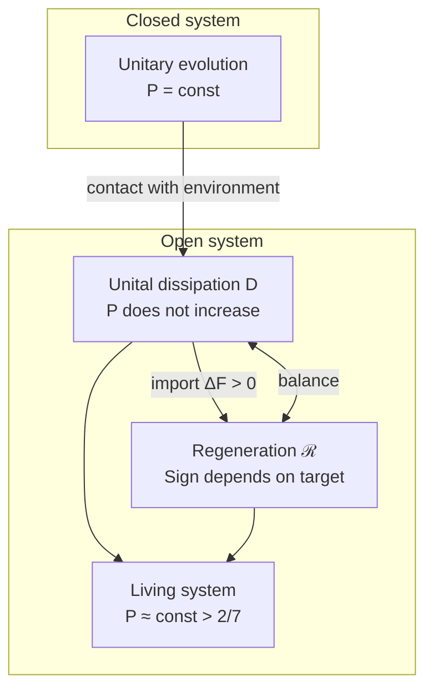

# Evolution of the Coherence Matrix

:::info Who this chapter is for
The complete evolution equation for Γ: unitary, dissipative and regenerative terms. Familiarity with the [coherence matrix](./coherence-matrix) and the [Axiom Ω⁷](/docs/core/foundations/axiom-omega) is assumed.
:::

This chapter is the longest and possibly the most important in the "Dynamics" section. It answers the question: **how does the state of a holon change over time?** If the [coherence matrix](./coherence-matrix) $\Gamma$ is a "snapshot" of the system at a given moment, then the evolution equation is the "rules of cinema", describing how frames succeed one another.

The reader will learn which inputs specify the linear GKSL part, how nonlinear feedback changes the state, which premises preserve positivity and trace, and which separate conditions ensure convergence and viability. The unitary term preserves purity; unital dephasing decreases it; regeneration can increase or decrease it depending on the overlap with its target. A biological interpretation requires an empirical model.

## Terminal Object T and dynamical attractors {#терминальный-объект}

A categorical terminal object is defined by $\forall X,\ \exists! f:X\to T$ **in a specified category**. A dynamical attractor is a limit of trajectories of a specified equation. These are different properties; one does not imply the other. In the category of all finite-dimensional quantum systems and CPTP maps the one-dimensional system is terminal, since its only channel from any system is the trace. A selected seven-dimensional equilibrium is not thereby terminal.

### Conditions for a unique attractor {#свойства-t}

For the **linear**, time-independent, primitive, unital generator $\mathcal L_0$ used below, the stationary state is $I/7$ and every trajectory converges to it. Primitivity must be verified for the chosen Hamiltonian and jumps; dephasing alone preserves every diagonal state. In the nonlinear equation, a unique attractor requires a separate contraction or Lyapunov argument. The examples with $\varphi_s$ below have several attractors, and those with $\varphi_J$ have a sink and a saddle in a specified parameter range.

### Arrow of time and convergence {#стрела-времени-эволюция}

When the chosen flow has a globally attracting stationary state $\Gamma_*$, one may write $\lim_{t\to\infty}\Gamma(t)=\Gamma_*$. Neither $\Delta F>0$ nor $\mathcal D\ne0$ alone proves this limit. The cyclic Page–Wootters reading $\tau\in\mathbb Z_7$ has no infinite-time limit; the dissipative parameter $t$ and the cumulative depth index are distinguished in [emergent time](/docs/proofs/dynamics/emergent-time#112-конечные-периодические-часы). A monotone decrease of stratal dimension is an additional model condition, not a consequence of the density-matrix equation.

---

## Full equation of motion {#полное-уравнение-движения}

:::info Emergent time
The **cyclic clock** τ ∈ ℤ₇ is derived from the structure of the category $\mathcal{C}$ via the Page–Wootters mechanism. The equation below, with its dissipative and regenerative terms, runs in the parameter $t$ of the Lindblad semigroup, which this clock does not supply (relative to a clock of period seven every dynamics is periodic). Its finite carrier is the [depth register](../../proofs/dynamics/emergent-time#114-регистр-глубины): $N+1$ readings ordered as a chain in the O-registers of $\lceil\log_7(N+1)\rceil$ holons, under a Feynman–Kitaev constraint with two holons as environment. One state-independent constraint gives the conditional states **exactly** $e^{n\Delta t\,\mathcal{L}}\rho_0$ at every reading, and each solution of the full equation with $\mathcal{R}$ is reproduced exactly by a constraint fitted to it (Theorems 11.1–11.4): **T-53b [T]** relative to the depth register (it was [C at an aperiodic time parameter] until 2026-09-25). What is not derived is the register from the axioms: the timeless form of the constraint is an assumption of A5, as for the O-clock. An earlier version of this box said that time as such is derived and not an external parameter without naming the carrier; that is retracted. See [Theorem on emergent time](../../proofs/dynamics/emergent-time).
:::

The evolution of $\Gamma$ is described by the **logical Liouvillian**:

$$
\frac{d\Gamma(\tau)}{d\tau} = \mathcal{L}_\Omega[\Gamma(\tau)]
$$

where the **logical Liouvillian** $\mathcal{L}_\Omega$ specifies the chosen realization of dynamics:

$$
\mathcal{L}_\Omega[\Gamma] = -i[H_{eff}, \Gamma] + \mathcal{D}_\Omega[\Gamma] + \mathcal{R}[\Gamma, E]
$$

where:
- τ — the evolution parameter; for the dissipative and regenerative terms it must be aperiodic, which the conditional states relative to [O](../structure/dimension-o) do not provide; the [depth register](../../proofs/dynamics/emergent-time#114-регистр-глубины) provides it (T-53b, [T])
- $H_{eff}$ — effective Hamiltonian from the Page–Wootters constraint
- $-i[H_{eff}, \Gamma]$ — unitary evolution (preserves $P$)
- $\mathcal{D}_\Omega[\Gamma]$ — **logical dissipation** (operators L_k from Ω)
- $\mathcal{R}[\Gamma, E]$ — specified regenerative vector field

:::info Realization of logical structure
The selected atomic/Fano structure defines projectors after choosing a Hilbert-space frame. Unique numerical operators, rates and applicability to an observed system do not follow from the abstract classifier without additional input.
:::

### Applicability: a linear GKSL part and a nonlinear state equation {#markovian-scope}

With prescribed, state-independent $H=H^\dagger$, operators $L_j$ and nonnegative rates $\gamma_j$, the **linear part**

$$
\mathcal L_0(X)=-i[H,X]+\sum_j\gamma_j\bigl(L_jXL_j^\dagger-\tfrac12\{L_j^\dagger L_j,X\}\bigr)
$$

generates a CPTP semigroup in the time-independent finite-dimensional case. A time-dependent generator of this form, under the usual existence assumptions, yields CPTP propagators. Its coefficients and empirical adequacy are additional specifications. Adding $a(\Gamma)(\varphi(\Gamma)-\Gamma)$ generally gives a **nonlinear ODE on states**, not a linear superoperator or a CPTP semigroup. Positivity of its trajectories is proved [below](#теорема-сохранение-состояний).

#### Theorem (Bures data processing) [T]

For a common linear CPTP channel $\mathcal E$,

$$
d_B(\mathcal E(\rho),\mathcal E(\sigma))\le d_B(\rho,\sigma).
$$

This follows from fidelity monotonicity; see [Watrous, Chapter 3](https://cs.uwaterloo.ca/~watrous/TQI/TQI.3.pdf). Equality does not require a globally unitary channel: dephasing leaves two diagonal states unchanged. For a linear semigroup with stationary $\sigma$, $d_B(\mathcal E_t(\rho),\sigma)$ is non-increasing. This proves neither a unique stationary state nor strict contraction. Applying different channels chosen from different input states does not satisfy the common-channel premise.

#### Physical scope and identification

A CP-divisible linear dynamics admits CPTP intermediate propagators; in the differentiable invertible setting its time-local generator has GKSL form with nonnegative rates. A reduced evolution obtained from a fixed product initial state and a unitary system–bath dynamics is CPTP at each time, but need not be CP-divisible. Initial correlations and a restricted preparation domain require further care.

A Born–Markov approximation requires a justified weak coupling and separation of correlation times; a secular or another positivity-preserving limit is also needed before asserting GKSL form. Millisecond neural dynamics, classical macroscopic limits and a chosen quantum device do not establish these assumptions by their time scales alone. The present chapter specifies a finite-dimensional model; applicability must be checked for each experiment. Memory may instead be represented by an enlarged state or a separate non-Markovian model.

A state-preserving ODE, a physical quantum channel and an empirical reconstruction are distinct objects. The latter requires an observation model and informational sufficiency, as set out in [reconstruction and identifiability](/docs/applied/research/reconstruction-identifiability); an ODE's unique solution does not make its hidden state observable.

:::note On notation
$\mathcal D$ is the dissipative term, $\mathcal R$ the regenerative term, and $R$ the reflection measure. The complete vector field $\mathcal L_\Omega$ is called a logical Liouvillian by convention; when it is nonlinear, $e^{t\mathcal L_\Omega}$ denotes a flow only, not a matrix exponential or a linear channel.
:::

#### Iterative scheme: resolving the apparent circularity of ℒ_Ω and φ {#итеративная-схема}

:::info Iterative scheme
The full equation $\mathcal{L}_\Omega[\Gamma] = -i[H_{eff}, \Gamma] + \mathcal{D}_\Omega[\Gamma] + \mathcal{R}[\Gamma, E]$ contains regeneration $\mathcal{R}$, which uses $\rho^* = \varphi(\Gamma)$ — the categorical self-model. At the same time, $\varphi$ is formally defined through the dynamics $\mathcal{L}_\Omega$. This apparent circularity is resolved through an **iterative (fixed-point) scheme**:

1. **Linear part** $\mathcal{L}_0 = -i[H_{eff}, \cdot] + \mathcal{D}_\Omega$ has a unique attractor $\rho^*_{\mathrm{diss}} = I/7$ [T-39a] — **without dependence on φ**
2. **Zeroth iteration**: $\varphi^{(0)}(\Gamma) := \rho^*_{\mathrm{diss}} = I/7$
3. **n-th iteration**: $\varphi^{(n+1)}(\Gamma) := \lim_{\tau \to \infty} \exp(\tau \cdot \mathcal{L}_\Omega^{(n)})[\Gamma]$, where $\mathcal{R}^{(n)}$ uses $\varphi^{(n)}$
4. **Convergence**: for an embodied holon under backbone dominance, $\mu > L_{\mathcal{R}} + \kappa_{\max}$, every iterate is defined and the sequence converges geometrically to one self-model from any anchor ([T-191](/docs/proofs/categorical/formalization-phi#t-191-сходимость-φ-башни), restated 2026-09-25). For an isolated holon the $n$-th iteration is not defined in general — the gate makes the flow bistable, and the limit depends on $\Gamma$ — and with the canonical $\varphi_{\mathrm{coh}}$ the scheme stays at $I/7$. (Until 2026-09-25 this item read "for $\kappa < \kappa_{max}$ (T-96), the sequence converges"; T-96 bounds no $\kappa$.)

The reflection measure $R = 1/(7P)$ is defined through $\rho^*_{\mathrm{diss}} = I/7$ (iteration level 0) and **does not depend** on the full $\varphi$.
:::

:::info Split-step method: resolving apparent circularity
The nonlinearity $\mathcal{R}$ (dependence on $\varphi(\Gamma)$) is resolved by **step splitting** (Lie–Trotter):

1. **Linear step:** $\Gamma' = e^{\Delta\tau \cdot \mathcal{L}_0}[\Gamma]$ — the linear part is applied (Hamiltonian + dissipator), **not depending on φ**
2. **Nonlinear step:** $\Gamma'' = (1-\alpha)\Gamma' + \alpha\,\varphi(\Gamma')$ — regeneration with φ computed from the *previous* state $\Gamma'$

Analogue: operator splitting in numerical PDE. *Corrected 2026-09-25:* the box said that "the scheme converges to the fixed point by the Banach theorem, since φ is a contracting map with coefficient $k = 1 - R < 1$". The factor $k$ multiplies the deviation from $I/7$, $\varphi_{\mathrm{coh}}(\Gamma) - I/7 = k\,\mathcal{P}_\alpha(\Gamma - I/7)$; it is not a Lipschitz constant, and $\varphi_{\mathrm{coh}}$ is not a contraction: along $\Gamma = (1-s)I/7 + s\,e_0$ its derivative at the pure state $s = 1$ is $54/49 > 1$, and its largest value on that ray is $9/8$, at $s = 1/\sqrt2$, $P = 4/7$ — the Lipschitz constant of $\varphi_{\mathrm{coh}}$ ([three maps](/docs/core/operators/phi-operator#три-определения)). What is true [T]: for $\varphi_{\mathrm{coh}}$ one step $S = [(1-\alpha)\,\mathrm{id} + \alpha\varphi_{\mathrm{coh}}] \circ e^{\Delta\tau\mathcal{L}_0}$ gives $\|S(\Gamma) - I/7\|_F \leq (1 - \alpha/7)\|\Gamma - I/7\|_F$ ($e^{\Delta\tau\mathcal{L}_0}$ is unital and does not increase the Hilbert–Schmidt norm, $k \leq 6/7$, $\|\mathcal{P}_\alpha\| \leq 1$), so the scheme converges geometrically — to $I/7$, as [dead isolation](#теорема-мёртвая-изоляция) requires. For a self-model that keeps an isolated holon alive no global contraction exists: at $H = 0$ the step with $\varphi_s$ has at least eight fixed points ($I/7$ and every $e_m$), and the scheme converges only locally, near a hyperbolic attractor (`test_phi_coh_contracts_toward_i7_but_is_not_a_contraction`).
:::

## Components of the equation

### 1. Unitary term {#1-unitary-term}

$$
-i[H_{eff}, \Gamma(\tau)] = -i(H_{eff}\Gamma - \Gamma H_{eff})
$$

where $H_{eff}$ is a specified effective Hamiltonian, compatible with the independently supplied [Page–Wootters constraint](../../proofs/dynamics/emergent-time#33-формальная-конструкция).

:::note Page–Wootters constraint (T-87: supplied clock and support constraint [C])
$\hat{C}\,\Gamma_{\text{total}} = 0$ — Wheeler–DeWitt constraint, equivalently $\mathrm{supp}\,\Gamma_{\text{total}} \subseteq \ker\hat{C}$. It implies the stationarity condition $[\hat{C}, \Gamma_{\text{total}}] = 0$ but does not follow from it: a mixed state spread over two eigenvalues of $\hat{C}$ is stationary without being annihilated. The tensor clock/register and its reading instrument are independently supplied; a direct-sum clock axis does not define a tensor factor. The support constraint is a further assumption (T-87). An earlier version of this note wrote the constraint as the commutator and called it derived from A1–A4; retracted. Time $\tau$ is emergent from correlations between the "clock" and "system" subsystems. Full derivation: [Emergent time](/docs/proofs/dynamics/emergent-time).
:::

**Definition [D] (Wheeler–DeWitt constraint).** {#ограничение-wdw}

$$
\hat{C} = H_O \otimes \mathbb{1}_{6D} + \mathbb{1}_O \otimes H_{6D} + H_{\mathrm{int}}
$$

— the full energy operator. Physical states satisfy $\hat{C}\,\Gamma_{\mathrm{total}} = 0$, that is $\mathrm{supp}\,\Gamma_{\mathrm{total}} \subseteq \ker\hat{C}$ (T-87, step 4, an assumption, [C]); this implies $[\hat{C}, \Gamma_{\mathrm{total}}] = 0$. Conditional time labels are defined using the specified clock instrument. Autonomous Schrödinger evolution additionally requires the relevant clock spectrum, support and coupling assumptions; an arbitrary interaction does not supply it.

#### Derivation of the constraint from axiom A5 {#вывод-wdw}

The Page–Wootters constraint (analogue of the Wheeler–DeWitt equation) is **stated** in A5:

**Step 1.** A5 establishes: $\mathcal{H} = \mathcal{H}_O \otimes \mathcal{H}_{\text{rest}}$ with coupling operator $\hat{C} = H_O \otimes \mathbb{1} + \mathbb{1} \otimes H_{\text{rest}} + H_{\text{int}}$.

**Step 2.** The global state lies in the kernel of the constraint, $\hat{C}\,\Gamma_{\text{total}} = 0$ — the Universe *as a whole* does not evolve. (Global stationarity, $[\hat{C}, \Gamma_{\text{total}}] = 0$, is weaker and does not imply it for mixed states.)

**Step 3.** With a specified covariant clock and matching spectra, conditioning gives the unitary relation proved in §1.1 when the interaction vanishes. Interaction generally couples conditional times; it does not follow that its diagonal clock block is an exact local Hamiltonian.

The unitary part of the dynamics is a **consequence** of the static structure of $\Gamma_{\text{total}}$ [T]. An earlier version of Step 3 also derived the dissipator, $d\Gamma/d\tau = -i[H_{\text{eff}}, \Gamma] + \mathcal{D}[\Gamma]$, with status [T]; that is retracted — the Page–Wootters construction yields no dissipator, and relative to a clock of period seven ticks a dissipative evolution would be constant ([emergent time, §9.1](/docs/proofs/dynamics/emergent-time#9-следствия)).

**Properties:**
- Preserves $\mathrm{Tr}(\Gamma) = 1$
- Preserves $P = \mathrm{Tr}(\Gamma^2)$
- Deterministic (reversible) evolution

### 1.1 A conditional clock realization of the Hamiltonian {#вывод-h_eff}

Specify a **separate extended model** $\mathcal H_C\otimes\mathcal H_S$, its Hamiltonians and a physical state supported in $\ker C$. The minimal seven-dimensional $\mathbb C^7$ does not factor into a clock and a six-dimensional system; $\mathbb C^7\otimes\mathbb C^6$ has dimension $42$ and is a different space.

For $H_{\mathrm{int}}=0$, assume matching spectra: on the physical support, clock energy $E_k$ is paired with system energy $-E_k$. Let $|t\rangle_C=e^{-iH_Ct}|0\rangle_C$, with probability $p(t)>0$, and define

$$
\rho_S(t)=\frac{\operatorname{Tr}_C[(|t\rangle\langle t|\otimes I)\rho_{CS}]}{p(t)}.
$$

Then $p(t)=p(0)$ and

$$
\rho_S(t)=e^{-iH_St}\rho_S(0)e^{iH_St}.
$$

**Proof.** Every pure vector in $\ker(H_C\otimes I+I\otimes H_S)$ is a sum $\sum_k|E_k\rangle_C|\psi_{-E_k}\rangle_S$. Conditioning multiplies each amplitude by $e^{iE_kt}=e^{-i(-E_k)t}$, the same system unitary. Its norm is constant. Mixed physical states follow by linearity of the unnormalized readout. $\blacksquare$

For finite equally spaced clock energies, the seven DFT tick states $|t_n\rangle$ are orthonormal; the continuous covariant family between ticks is not. Chosen energies, period, system-spectrum matching and a nonempty $\ker C$ are premises of this realization. Conditional unitary motion supplies no dissipator and does not force a physical time unit.

With interaction, write a pure history as $|\Psi\rangle=\sum_l|t_l\rangle|\psi_l\rangle$. Exact projection of $C|\Psi\rangle=0$ gives coupled equations

$$
\sum_l(H_C)_{kl}|\psi_l\rangle+H_S|\psi_k\rangle+\sum_l(H_{\mathrm{int}})_{kl}|\psi_l\rangle=0.
$$

The diagonal block $\langle t_k|H_{\mathrm{int}}|t_k\rangle$ does not replace the last sum: other blocks couple distinct conditional times. The corresponding continuous formulation is time-nonlocal; see [Smith–Ahmadi (2019)](https://arxiv.org/abs/1712.00081). The expression $H_{\mathrm{eff}}(t)=H_S+\langle t|H_{\mathrm{int}}|t\rangle$ is only a separately justified local ansatz/approximation; weak interaction alone does not make omitted blocks vanish.

Returning to the minimal seven-dimensional model requires an explicitly chosen embedding or a new $H_{\mathrm{eff}}\in\mathrm{Herm}_7$. The option $H_6\oplus0$ specifies the O-action, but is a choice [D], not an inverse derivation of general 7D dynamics from a $6\times6$ conditional state.

### 2. Dissipative term: a specified GKSL realization {#логический-лиувиллиан}

$$
\mathcal D_\Omega(\Gamma)=\sum_k\gamma_k\bigl(L_k\Gamma L_k^\dagger-\tfrac12\{L_k^\dagger L_k,\Gamma\}\bigr),\qquad \gamma_k\ge0.
$$

#### Structural choice of jumps from a selected frame

In a chosen seven-dimensional frame, the model uses atomic projectors $L_k^{\mathrm{atom}}=|k\rangle\langle k|$ or Fano-line projectors $L_p^{\mathrm{Fano}}=\Pi_p/\sqrt3$; see [Lindblad operators](/docs/core/operators/lindblad-operators). This is a Hilbert-space realization of the selected combinatorial structure. An abstract subobject classifier alone supplies neither these operator matrices, their normalization and rates nor a unique empirical basis.

The identity $\sum_k(L_k^{\mathrm{atom}})^\dagger L_k^{\mathrm{atom}}=I$ is Kraus completeness for the **finite dephasing channel** $X\mapsto\sum_kL_kXL_k^\dagger$. It is not a required normalization of Lindblad jumps: the GKSL anticommutator guarantees zero generator trace for arbitrary jumps and nonnegative rates. The resulting propagator is CPTP by GKSL.

Self-adjoint dephasing jumps decrease purity, while general transition jumps may purify. Dephasing alone preserves populations, so it does not necessarily drive the system to $I/7$. A primitive unital generator combining a Hamiltonian and these jumps can have that unique attractor, under the conditions verified in the cited model.

#### Interpretations by stratum

Casimir projectors, recovery transitions, thermally calibrated jumps and operators representing gluing are possible **model-specific** choices. A Čech coboundary $C^k\to C^{k+1}$ is not automatically an operator on the fixed state Hilbert space; an explicit finite-dimensional realization and its domain are needed before inserting it into GKSL. Diagonal thermal weights multiplying projectors only dephase and do not thermalize populations. Claims of thermalization require population-changing jumps satisfying the declared bath balance conditions.

### 3. Regenerative term [D] {#3-регенеративный-член}

The replacement-direction model is

$$
\mathcal R[\Gamma,E]=a(\Gamma,E)\bigl(\varphi(\Gamma,E)-\Gamma\bigr),\qquad
 a=\kappa g_V\ge0,
$$

with a chosen state-valued self-model $\varphi$ and a locally Lipschitz nonnegative rate. The commonly used gate is

$$
g_V(P)=\mathrm{clamp}\!\left(\frac{P-P_{\mathrm{crit}}}{P_{\mathrm{opt}}-P_{\mathrm{crit}}},0,1\right),
\qquad P_{\mathrm{opt}}>P_{\mathrm{crit}}.
$$

This is a **model definition**, not a unique consequence of the axioms or of Landauer's principle. The choice of $\varphi$, its physical realization, the rate and the gate must be specified separately. The [rate model](/docs/core/foundations/axiom-septicity#структурный-анзац-kappa0) fixes the dimensions and kinetic assumptions; an adjunction alone supplies no numerical rate or norm of a natural transformation.

:::warning Correction, 2026-10-03
The previous claims T-39f, T-39g and T-39h — unique CPTP/Bures-optimal regeneration, a Landauer-derived unique clamp and a fully axiomatic evolution law — are withdrawn. The valid statements are state preservation, frozen-target CPTP realizability and conditional BKM descent, proved below. Turning regeneration off below a purity threshold does not establish invariance of the region above it; see [viability](/docs/core/dynamics/viability#viability-kernel).
:::

#### Theorem T-261: frozen-target BKM descent [T under the stated premises] {#теорема-регенерация-градиентный-спуск}

Fix $\rho_*\in\mathcal D(\mathbb C^N)$ independently of $\Gamma$, and let $\Gamma>0$. With natural logarithms define $F_*(\Gamma)=D(\rho_*\|\Gamma)$ and

$$
K_\Gamma(Y)=\int_0^\infty(\Gamma+sI)^{-1}Y(\Gamma+sI)^{-1}\,ds,
\qquad g_{\mathrm{BKM},\Gamma}(X,Y)=\operatorname{Tr}XK_\Gamma(Y).
$$

On the trace-one manifold,

$$
\operatorname{grad}_{\mathrm{BKM}}F_*=\Gamma-\rho_*,\qquad
\dot\Gamma=a(\Gamma,t)(\rho_*-\Gamma)
\Longrightarrow
\dot F_*=-a\,g_{\mathrm{BKM},\Gamma}(\rho_*-\Gamma,\rho_*-\Gamma)\le0.
$$

**Proof.** For traceless Hermitian $X$, $dF_*(X)=-\operatorname{Tr}XK_\Gamma(\rho_*)$. Since $K_\Gamma(\Gamma)=I$, the same expression is $g_{\mathrm{BKM},\Gamma}(X,\Gamma-\rho_*)$. This proves the gradient and the dissipation identity. A singular fixed target is allowed because only $\log\Gamma$ is differentiated; the metric calculation is on the full-rank domain. $\blacksquare$

If instead $\rho_* = \varphi(\Gamma)$ varies, the vector field is a **frozen-target descent direction at each state**, but need not be the gradient of the composite functional $D(\varphi(\Gamma)\|\Gamma)$. For differentiable, full-rank $\varphi(\Gamma)$ its differential has the additional term

$$
\operatorname{Tr}\bigl(D\varphi_\Gamma[X]\,[\log\varphi(\Gamma)-\log\Gamma]\bigr).
$$

This term has no fixed sign. Additional work is required for a global Lyapunov functional. Nor does dimensionless relative entropy become thermodynamic free energy without an energy/temperature model.

#### Theorem T-262: conditional geometric identities {#теорема-динамическая-трихотомия}

For a common prescribed Hamiltonian, unitary conjugation preserves all spectral functionals and every unitarily covariant metric. Its vector field annihilates differentials of spectral functionals; it is not orthogonal to **every** gradient. For a fixed target, it preserves $D(\rho_*\|\Gamma)$ for all $\Gamma$ precisely when $[H,\rho_*]=0$.

For the Fano dephasor with $L_p=\Pi_p/\sqrt3$ and positive line rates, the following exact identities hold on full-rank states:

$$
\mathcal D(\Gamma)=-\tfrac16\sum_p\gamma_p[\Pi_p,[\Pi_p,\Gamma]]
=-\mathcal K_\Gamma^W(\log\Gamma),
$$

$$
\mathcal K_\Gamma^W(A)=\tfrac16\sum_p\gamma_p[\Pi_p,\Lambda_\Gamma([\Pi_p,A])],\qquad
(\Lambda_\Gamma A)_{mn}=A_{mn}\frac{\lambda_m-\lambda_n}{\log\lambda_m-\log\lambda_n},
$$

using the continuous value $\lambda_m$ at equal eigenvalues. The chain rule $[X,\Gamma]=\Lambda_\Gamma([X,\log\Gamma])$ follows entry by entry in the eigenbasis. For $F_D=D(\Gamma\|I/7)$,

$$
\dot F_D=-\tfrac16\sum_p\gamma_p\operatorname{Tr}\bigl([\Pi_p,\log\Gamma]^\dagger
\Lambda_\Gamma([\Pi_p,\log\Gamma])\bigr)\le0.
$$

The Onsager operator $\mathcal K_\Gamma^W$ is positive semidefinite but has **every diagonal tangent** in its kernel. Dephasing alone is not ergodic and does not define a nondegenerate Riemannian transport metric on the entire state manifold. A gradient description may be given on a fixed-diagonal leaf; invoking the full [Carlen–Maas theorem](https://arxiv.org/abs/1609.01254) requires its ergodicity and detailed-balance hypotheses. Combining this identity with T-261 is valid for a frozen target; it does not prove a single potential, the GENERIC degeneracy axioms or a universal optimal learning law for a state-dependent self-model.

#### Theorem T-263: local optimality in a specified geometry {#теорема-наилучший-обучающий-поток}

For the **fixed** potential and BKM metric of T-261, let $v=\rho_*-\Gamma\ne0$. Among traceless Hermitian directions $X$ with $\|X\|_{\mathrm{BKM}}=\|v\|_{\mathrm{BKM}}$, $X=v$ uniquely maximizes $-dF_*(X)$.

**Proof.** $-dF_*(X)=g_{\mathrm{BKM}}(X,v)\le\|X\|_{\mathrm{BKM}}\|v\|_{\mathrm{BKM}}$, with equality under this positive speed constraint only at $X=v$. At $v=0$ the prescribed speed is zero. For a constant rate $a>0$ and frozen target,

$$
\Gamma(t)=\rho_*+e^{-at}(\Gamma_0-\rho_*)
$$

is an affine mixture path. $\blacksquare$

This is local steepest descent **after choosing a potential, metric and speed**, not an optimality theorem over all learning algorithms, measurements or environments. The affine path need not be a Bures geodesic. Statistical convergence rates and multiparameter measurement attainability require their own identifiable observation model and regularity assumptions; they do not follow from this ODE. The former universal “best algorithm” and rate claims of T-263 are withdrawn.

:::note Engineering parameters
A lower bound such as $k\ge0.15$ in a particular self-model is an implementation choice. It is distinct from imposing $g_V\ge0.15$, which removes the zero gate and changes the genesis and boundary arguments. Every modification must specify which coefficient changes and recheck the resulting flow.
:::

#### Metric choices and normalization {#почему-эта-геометрия}

On full-rank states, symmetric monotone quantum metrics with the same classical Fisher normalization have the form

$$
g_f(A,A)=\sum_{i,j}\frac{|\widetilde A_{ij}|^2}{m_f(\lambda_i,\lambda_j)}.
$$

Allowed means arise from normalized symmetric operator-monotone functions. Arithmetic, logarithmic and harmonic means give SLD, BKM and the maximal symmetric metric, respectively. Inverting the means gives $g_{\mathrm{SLD}}\le g_{\mathrm{BKM}}\le g_{\max}$. The classification and SLD minimality with this common normalization are given by [Petz–Sudár](https://arxiv.org/abs/quant-ph/0102132).

For the distance used here, $d_B^2=2(1-f)$, the infinitesimal metric is **$g_B=g_{\mathrm{SLD}}/4$**. It cannot be compared to T-261's BKM normalization without this factor. Metric monotonicity contracts tangent norms under CPTP processing; comparisons of finite distances require their respective definitions.

SLD has a separate operational basis: for one known parametric direction and the appropriate regularity assumptions, measurement in its eigenbasis attains the local SLD quantum Fisher information. One measurement basis need not attain a multiparameter optimum simultaneously. This does not derive a unique encoder, learning geometry or greatest global speed.

Choosing BKM and the fixed potential $D(\rho_*\|\Gamma)$ gives T-261's exact gradient formula. T-263 selects an instantaneous direction after metric, potential and speed are fixed. It does not compare all algorithms, statistical costs or global durations. Other monotone metrics and potentials remain mathematical choices.

#### Physical free energy and available resources {#свободная-энергия-и-градиент-δf}

For a declared Hamiltonian $H$, bath temperature $T>0$ and entropy in nats,

$$
F_T(\rho)=\operatorname{Tr}\rho H-k_BT S(\rho),\qquad
\tau_T=\frac{e^{-H/(k_BT)}}{Z},\qquad
F_T(\rho)-F_T(\tau_T)=k_BT D(\rho\|\tau_T).
$$

This exact identity gives an energetic meaning to relative entropy **for this Hamiltonian and Gibbs reference**. Its units are energy. A resource **power** has units energy/time; it cannot be equated to a state free-energy difference without a time scale.

#### Operationalization of the environment {#операционализация-delta-f}

The environment must specify the interacting degrees of freedom, couplings and resource fluxes. A Gibbs bath, chemical work and externally powered computation are different physical models. A difference $F_T(\Gamma_{\mathrm{env}})-F_T(\Gamma)$ between equal-sized formal states does not alone establish available work, the direction of transfer or a regeneration rate. Entropies of input and output data are informational quantities; converting their difference to work requires a physical implementation and its reservoirs. Metabolic rates, data throughput and a binary resource indicator may be independently calibrated proxies [H], with stated units and validity ranges.

#### Bures resource score: a geometric definition {#каноническое-delta-f}

For compatibility with the geometric model, retain the dimensionless score

$$
\Delta F_B(\Gamma):=d_B^2(\Gamma,I/7)-d_B^2(\Gamma,\varphi(\Gamma)),\qquad
 d_B^2(\rho,\sigma)=2-2\operatorname{Tr}\sqrt{\sqrt\rho\,\sigma\sqrt\rho}.
$$

The earlier notation $\Delta F$ for this score conflated it with physical free energy. Its sign compares two distances; it is not a Landauer bound, a chemical potential, a metabolic power or a certificate of purification. Multiplication by an energy scale can define an energy-valued phenomenological proxy, but its physical adequacy needs calibration.

For traceless Hermitian $\delta$ near $I/N$,

$$
d_B^2(I/N+\delta,I/N)=\frac N4\|\delta\|_F^2+O(\|\delta\|_F^3),\qquad
D(I/N+\delta\|I/N)=\frac N2\|\delta\|_F^2+O(\|\delta\|_F^3).
$$

These follow by expanding square roots and logarithms of the eigenvalues. They explain a local quadratic correspondence with a specified reference, not equality with trace distance squared, a general KL identity for a difference of distances or a formula determined only by purity. The [viability chapter](/docs/core/dynamics/viability#критическая-чистота) gives equal-purity spectra with different Bures distances. No metabolic frequency law follows from these expansions.

#### Regeneration rate κ {#скорость-регенерации}

The rate is a nonnegative model function with $[\kappa]=\mathrm{time}^{-1}$; see the [kinetic definition and its approximation regime](/docs/core/foundations/axiom-septicity#структурный-анзац-kappa0). The legacy parameterization $\kappa=\kappa_{\mathrm{bootstrap}}+\kappa_0\mathrm{Coh}_E(\Gamma)$ is a possible choice [D], after defining and bounding its dimensionless coherence factor. An adjunction has no canonical numerical norm that fixes $\kappa_0$.

Even a positive bootstrap rate does **not** produce genesis from $I/7$ when $g_V(1/7)=0$ and $\mathcal L_0(I/7)=0$: the entire vector field vanishes there. An external state injection or a modified model is required to leave that state. The physical energy budget and the existence of a nontrivial stationary state are additional conditions.

The target is the specified map $\rho_*=\varphi(\Gamma,E)\in\mathcal D(\mathbb C^7)$. A chosen formula is single-valued; categorical existence of an abstract self-model does not uniquely select that numerical formula or make a nonlinear state map CPTP.

:::info Distinction between attractors
- $\rho^*_{\mathrm{diss}} = I/7$ — attractor of the linear part $\mathcal{L}_0 = -i[H,\cdot] + \mathcal{D}$ (without regeneration), $P = 1/7$. Uniqueness from [primitivity](/docs/core/operators/lindblad-operators#примитивность-ℒω) [T]. Used in [definition of R](/docs/consciousness/foundations/self-observation#мера-рефлексии-r).
- $\rho^*_\Omega \neq I/7$ — nontrivial attractor of full dynamics $\mathcal{L}_\Omega = \mathcal{L}_0 + \mathcal{R}$; every such point has $P(\rho^*_\Omega) > 1/7$ [T] ([T-96](#теорема-нетривиальность-аттрактора)). Whether one exists depends on the self-model: with the canonical unital $\varphi_{\mathrm{coh}}$ an isolated holon has none ([dead isolation](#теорема-мёртвая-изоляция) [T]); with the self-registering $\varphi_s$ it has at least seven, each with $P > 2/7$ ([self-sustaining attractors](#теорема-самоподдерживающийся-аттрактор) [T]); with the collineation anchor $\varphi_J$ and $\kappa > \kappa_c(\alpha)$ it has one inside the conscious window, in $\mathcal{V}_{\mathrm{full}}$ ([living attractor in the window](#теорема-живой-аттрактор-в-окне) [T]); an embodied model requires the actual injection/overlap conditions of [T-149](/docs/proofs/consciousness/substrate-closure#t-149), which do not follow from embodiment alone.
:::

:::tip Specified target
Once a formula $\varphi$ is chosen, $\rho_*=\varphi(\Gamma)$ is single-valued. Different admissible formulas give different targets and attractors; existence of a categorical adjunction does not identify their numerical realizations.
:::

:::info The regeneration target is not a resource optimum (T-222) [T]
By the restated [T-222](/docs/proofs/categorical/fundamental-closures#t-222) (2026-09-26), on the purity window $2/7 < P \leq 3/7$ at high temperature every state is strictly dominated on every Rényi free energy $F_\alpha$ by partial depolarisation $\rho_t = (1-t)\rho + t\,I/7$; the Pareto set of the closure lies on the sphere $P = 2/7$; $F_1$ and $F_\infty$ are minimised by different spectra ($\Gamma_{1/\sqrt6}$: $H_1 = 1.602$, $H_\infty = 0.708$; the three-level $s_3$: $1.391$, $1.178$); under unital channels no window state is terminal. For the regeneration this means: $\rho_* = \varphi(\Gamma)$ is a target fixed by the self-model, not a resource optimum, and $\mathcal{R}$ does not improve a resource vector as such — it holds the holon at the viability bound, away from the resource-cheap direction toward $I/7$; a choice of point on the Pareto sphere needs a weight on the Rényi orders that neither $\varphi$ nor $\mathcal{L}_\Omega$ supplies. The former box ("MRQT-resource universality": $\rho^* = \varphi(\Gamma)$ the Lawvere fixed point and Pareto-optimal for 25 monotones at once, $\mathcal{R}$ the universal resource-monotone CPTP morphism, UHM MRQT-complete) is retracted [✗] with the former T-222: $\varphi(\Gamma)$ is not a fixed point of $\mathcal{L}_\Omega$ (T-96), and no simultaneous optimum exists.
:::

:::caution Formal uncomputability of $\rho_*$
The target state $\rho_* = \varphi(\Gamma)$ is defined through the operator $\varphi$ — a [categorical left adjoint](/docs/core/operators/phi-operator), concretely realized via $\varphi_{\mathrm{coh}}$ ([Fano channel](/docs/core/operators/phi-operator#каноническая-конструкция-φ_coh-из-фано-структуры)). Computing $\varphi_{\mathrm{coh}}(\Gamma)$ in the 7D formalism requires $O(N^2)$ operations ($N = 7$). In the 42D formalism ($N=42$) an analogous Fano structure on the extended space is required, which makes the evolution equation formally closed but **practically costly** for the extended formalism without approximations.
:::

#### Theorem T-96 (Conditional characterization of fixed points) [T] {#теорема-нетривиальность-аттрактора}

Let $F(\Gamma)=\mathcal L_0(\Gamma)+a(\Gamma)(\varphi(\Gamma)-\Gamma)$, $a\ge0$, with a state-valued self-model. Assume $\mathcal L_0(I/7)=0$ and either $a(I/7)=0$ or $\varphi(I/7)=I/7$. Then $I/7$ is a fixed point. Every different state satisfies $P>1/7$, independently of dynamics, because $P=1/7+\|\Gamma-I/7\|_{\mathrm{HS}}^2$.

If $\mathcal L_0$ is primitive with unique fixed state $I/7$, every different stationary state has $a>0$ and $\varphi(\Gamma)\ne\Gamma$: otherwise stationarity would give $\mathcal L_0(\Gamma)=0$.

For the further conclusion $P_{\mathrm{coh}}>0$, additionally assume $\mathcal L_0=-i[H,\cdot]-\alpha\,\mathrm{offdiag}$, $\alpha>0$, a connected graph of nonzero $H_{ij}$, and that $\varphi$ sends diagonal states to diagonal states. At a stationary point,

$$
\alpha P_{\mathrm{coh}}=a\bigl(\operatorname{Tr}(\Gamma\varphi(\Gamma))-P\bigr).
$$

If $P_{\mathrm{coh}}=0$, the off-diagonal equation is $H_{ij}(\gamma_{jj}-\gamma_{ii})=0$; connectedness forces $\Gamma=I/7$. Thus a different stationary state has positive coherence and positive excess overlap. These conclusions do not hold for every model: at $H=0$, a diagonal pure fixed point of $\varphi_s$ has $P_{\mathrm{coh}}=0$ and $\varphi_s(\Gamma)=\Gamma$. It violates the primitive/connected hypothesis, not the purity identity. Existence and attraction of nontrivial fixed points require the separate model theorems below.

:::warning Resolution of the ρ* self-reference paradox
In earlier versions ρ* was defined as "the unique stationary state of the full $\mathcal{L}_\Omega$" (via primitivity T-39a). This created a paradox: at $\rho_* = \rho^*_\Omega$ the regeneration vanishes ($\mathcal{R}[\rho^*_\Omega] = \kappa \cdot (\rho^*_\Omega - \rho^*_\Omega) = 0$), and the only solution to $\mathcal{L}_0[\rho^*_\Omega] = 0$ is $I/7$. The paradox is resolved by replacement: $\rho_*$ in $\mathcal{R}$ is defined as the **categorical self-model** $\varphi(\Gamma)$ of the current state (Definition 1 of the [φ operator](/docs/core/operators/phi-operator)), not as the dynamical limit. In this case $\varphi(\rho^*_\Omega) \neq \rho^*_\Omega$ (the system does not achieve perfect self-knowledge), and regeneration **does not vanish** in the stationary regime — it is precisely compensated by dissipation.
:::

T-96 says what a nontrivial fixed point must look like; it does not say that one exists. The next four theorems settle existence for an isolated holon — a holon that imports free energy (the rate $\kappa$) but no state from outside. With the canonical $\varphi_{\mathrm{coh}}$ there is none, and the reason is general: a self-model that is unital cannot raise purity. Replacing the anchor $I/7$ by the holon's own self-registration gives self-sustaining attractors, but above the conscious window. A self-model blind to the phases of the basis cannot hold a hyperbolic attractor in $\mathcal{V}_{\mathrm{full}}$ near $H = 0$; the anchor fixed by the collineations of the Fano plane can, and does.

#### Theorem (Dead isolation: a unital self-model sustains no life) [T] {#теорема-мёртвая-изоляция}

:::tip Theorem (Dead isolation) [T]
Let $\mathcal{L}_0 = -i[H,\cdot] + \mathcal{D}$ be a primitive unital GKSL generator, and let the regeneration target be $\varphi(\Gamma) = \Phi_\Gamma(\Gamma)$, where for every state $\Gamma$ the map $\Phi_\Gamma$ is a **unital** CPTP channel, $\Phi_\Gamma(I) = I$; the scalars $\kappa(\Gamma) \geq 0$ and $g_V(P) \geq 0$ are arbitrary. Then:

1. $I/7$ is the only stationary state of $\dot\Gamma = \mathcal{L}_0[\Gamma] + \kappa(\Gamma)\,g_V(P)\,(\varphi(\Gamma) - \Gamma)$, and the purity $P$ does not increase along any trajectory.
2. The canonical $\varphi_{\mathrm{coh}}$ (anchor $I/7$) is of this kind for every $\alpha$ and every $k$. With the Fano dissipator $\mathcal{D}_\Omega[\Gamma] = \tfrac23(\mathrm{diag}\,\Gamma - \Gamma)$, every trajectory converges to $I/7$.
3. A linear CPTP self-model covariant under $G_2$ or under the frame group $\Gamma_{\mathrm{oct}}$ is unital. So is the self-consistent choice "anchor = the attractor itself": at $\Gamma = \rho$ the target $k\mathcal{P}_\alpha(\rho) + R\rho$ is the image of $\rho$ under the unital channel $k\mathcal{P}_\alpha + R\,\mathrm{id}$.

Hence a nontrivial fixed point needs a self-model that is not unital there, with overlap $f^* = \mathrm{Tr}(\rho^*\varphi(\rho^*)) > P(\rho^*)$ (step 3 of T-96): the self-model must be sharper than the state.
:::

**Proof.** (1) Along a trajectory $\tfrac{d}{d\tau}P = 2\,\mathrm{Tr}(\Gamma\,\mathcal{L}_0[\Gamma]) + 2\kappa g_V\,(\mathrm{Tr}(\Gamma\varphi(\Gamma)) - P)$; the Hamiltonian term drops out. A unital trace-preserving positive map contracts the Hilbert–Schmidt norm (D. Pérez-García, M. M. Wolf, D. Petz, M. B. Ruskai, "Contractivity of positive and trace-preserving maps under $L_p$ norms", *J. Math. Phys.* **47**, 083506 (2006)). Applied to $e^{\tau\mathcal{L}_0}$ this makes the first term $\leq 0$; applied to $\Phi_\Gamma$ with Cauchy–Schwarz, $\mathrm{Tr}(\Gamma\Phi_\Gamma(\Gamma)) \leq \|\Gamma\|_2\|\Phi_\Gamma(\Gamma)\|_2 \leq P$, so the second term is $\leq 0$. At a stationary state $\rho$ both terms vanish. If $\kappa g_V > 0$, equality in Cauchy–Schwarz gives $\Phi_\rho(\rho) = c\rho$, and $c = 1$ by the trace, so the regenerative term vanishes; if $\kappa g_V = 0$ it vanishes anyway. Then $\mathcal{L}_0[\rho] = 0$, and primitivity gives $\rho = I/7$.

(2) $\mathcal{P}_\alpha$ and the replacement $X \mapsto \mathrm{Tr}(X)\,I/7$ are unital, hence so is $\varphi_{\mathrm{coh}}$; explicitly $\mathrm{Tr}(\Gamma\varphi_{\mathrm{coh}}(\Gamma)) \leq P - (P - 1/7)/(7P)$. With the Fano dissipator, $\mathrm{Tr}(\Gamma\mathcal{D}_\Omega[\Gamma]) = -\tfrac23 P_{\mathrm{coh}}$, so $P$ is non-increasing and bounded, and by LaSalle's invariance principle (H. K. Khalil, *Nonlinear Systems*, 3rd ed., Theorem 4.4) every trajectory approaches the largest invariant set on which $dP/d\tau = 0$. On it $\Gamma(\tau)$ is diagonal at all times, and $\varphi_{\mathrm{coh}}$ keeps it diagonal; the off-diagonal part of the equation then forces $[H, \Gamma] = 0$, and connectedness of the graph of $H$ (primitivity, as in step 3 of T-96) gives $\Gamma = I/7$.

(3) If $\Phi(UXU^\dagger) = U\Phi(X)U^\dagger$ for every $U$ of a representation that is irreducible on $\mathbb{C}^7$, then $\Phi(I)$ commutes with the representation and is a multiple of $I$ by Schur's lemma (W. Fulton, J. Harris, *Representation Theory*, Springer 1991, Lemma 1.7), equal to $I$ by trace preservation. $G_2$ acts irreducibly on $\mathbb{C}^7$, and so does $\Gamma_{\mathrm{oct}}$: the commutant of its 1344 signed permutation matrices is one-dimensional. The 168 Fano collineations without signs leave a two-dimensional commutant, spanned by $I$ and the all-ones matrix. The last claim is (1) applied at the point $\rho$. $\blacksquare$

**Numerical check** (`test_unital_self_model_keeps_an_isolated_holon_dead` in `website/scripts/check_core_numbers.py`). Canonical $\varphi_{\mathrm{coh}}$, $\alpha = 1/2$, a random $H$ of scale $0.3$ and $\kappa = 10$: along six pure starts $P$ falls at every one of 1500 integration steps, and all six end within $10^{-3}$ of $I/7$ by $\tau = 30$; 200 iterations of $\varphi_{\mathrm{coh}}$ from a pure state give $P = 1/7$ to $10^{-12}$.

#### Theorem (Self-sustaining attractors of the self-registering self-model) [T] {#теорема-самоподдерживающийся-аттрактор}

**Definition [D].** The **self-registering self-model** replaces the anchor $I/7$ of $\varphi_{\mathrm{coh}}$ by the state the holon is left in after registering its own state as an effect:

$$
\varphi_s(\Gamma) = k\,\mathcal{P}_\alpha(\Gamma) + R\,\sigma(\Gamma), \qquad \sigma(\Gamma) = \frac{\sqrt{\Gamma}\,\Gamma\,\sqrt{\Gamma}}{\mathrm{Tr}(\Gamma^2)} = \frac{\Gamma^2}{P}, \qquad R = \frac{1}{7P},\; k = 1 - R .
$$

$\sigma(\Gamma)$ is the Lüders update of $\Gamma$ on the effect $\Gamma$; it uses nothing but the holon's own state. Frozen at a state $g$, the map $X \mapsto k\mathcal{P}_\alpha(X) + R\,\sigma(g)\,\mathrm{Tr}\,X$ is CPTP and, unless $g$ has a flat spectrum, not unital. Why an anchor of this kind is the natural one — every unitarily covariant anchor is a reweighting of the spectrum of $\Gamma$, and $\Gamma^2/P$ is the lowest-degree reweighting that sharpens it — is shown on the [φ-operator page](/docs/core/operators/phi-operator#phi-s).

:::tip Theorem (Self-sustaining attractors) [T]
Take the full dynamics $\dot\Gamma = -i[H,\Gamma] + \mathcal{D}_\Omega[\Gamma] + \kappa(\Gamma)\,g_V(P)\,(\varphi_s(\Gamma) - \Gamma)$ with the Fano dissipator, the gate $g_V = \mathrm{clamp}(7P - 2, 0, 1)$ and a smooth $\kappa(\Gamma) > 0$ (for instance $\kappa_{\mathrm{bootstrap}} + \kappa_0\,\mathrm{Coh}_E$); $c = (1 - \alpha)/3$.

1. **Sharper than the state.** $\mathrm{Tr}(\Gamma\,\sigma(\Gamma)) = \mathrm{Tr}\,\Gamma^3/\mathrm{Tr}\,\Gamma^2 \geq P$, with equality exactly when the spectrum of $\Gamma$ is flat on its support.
2. **Exact self-knowledge at $H = 0$.** Each basis state $e_m = |m\rangle\langle m|$ is stationary and satisfies $\varphi_s(e_m) = e_m$. It is a hyperbolic sink: on traceless Hermitian operators the Jacobian is diagonal in the matrix-unit basis, with eigenvalue $-\kappa/7$ on the 6 diagonal directions, $-(2/3 + 6\kappa(1 - c)/7)$ on the 12 real directions of the coherences with $m$, and $-(2/3 + \kappa(1 - 6c/7))$ on the 30 real directions of the other coherences ($\kappa = \kappa(e_m)$).
3. **Persistence.** There is $h_0 > 0$, depending on $\kappa$ and $\alpha$, such that for every Hamiltonian with $\|H\| < h_0$ the dynamics has seven distinct stationary states $\Gamma_m(H)$, one near each $e_m$, smooth in $H$, locally exponentially stable, with $P(\Gamma_m(H)) > 2/7$ (and $\to 1$ as $H \to 0$). T-96 and the balance T-98 hold at each; for $H$ whose graph is connected, $P_{\mathrm{coh}} > 0$ and $\varphi_s(\Gamma_m) \neq \Gamma_m$.
4. **No uniqueness.** The living attractor is not unique: there are at least seven, and $I/7$ attracts as well (for primitive $\mathcal{L}_0$ the gate is shut on the ball $P < 2/7$, where the flow is $\mathcal{L}_0$).
:::

**Proof.** (1) With eigenvalues $\lambda_i$ of $\Gamma$ read as probabilities, $\mathrm{Tr}\,\Gamma^3 = \mathbb{E}[\lambda\cdot\lambda]$ and $P = \mathbb{E}[\lambda]$, so $\mathrm{Tr}\,\Gamma^3 \geq P^2$ is $\mathrm{Var}(\lambda) \geq 0$ (Chebyshev's sum inequality), with equality iff $\lambda$ is constant on the support.

(2) $e_m$ is diagonal, so $\mathcal{D}_\Omega[e_m] = 0$, $\mathcal{P}_\alpha(e_m) = e_m$, $\sigma(e_m) = e_m$, hence $\varphi_s(e_m) = (k + R)\,e_m = e_m$, and with $H = 0$ there is no Hamiltonian term. Linearise at $e_m$: derivatives of $\kappa$ and $g_V$ multiply $\varphi_s(e_m) - e_m = 0$; derivatives of $k$ and $R$ multiply $\mathcal{P}_\alpha(e_m)$ and $\sigma(e_m)$, both equal to $e_m$, and $dk + dR = 0$; $g_V \equiv 1$ near $P = 1$. So $DF(X) = \mathcal{D}_\Omega[X] + \kappa\bigl(\tfrac67\mathcal{P}_\alpha(X) + \tfrac17 D\sigma(X) - X\bigr)$ with $D\sigma(X) = e_mX + Xe_m - 2X_{mm}e_m$, which keeps exactly the coherences $X_{mj}$, $X_{jm}$. On diagonal entries $DF$ multiplies by $\kappa(\tfrac67 - 1) = -\kappa/7$; on coherences with $m$ by $-\tfrac23 + \kappa(\tfrac67 c + \tfrac17 - 1)$; on other coherences by $-\tfrac23 + \kappa(\tfrac67 c - 1)$.

(3) Near $e_m$ the vector field is smooth on the affine space of trace-one Hermitian matrices ($g_V \equiv 1$ for $P > 3/7$, and $P \geq 1/7$ keeps $\sigma$ smooth), and $DF$ is invertible by (2), so the implicit function theorem gives a unique zero $\Gamma_m(H)$ near $e_m$, smooth in $H$; its spectrum stays in $\mathrm{Re} < 0$ for small $H$. Frozen at any state, the generator is of GKSL form, so the flow keeps states states; a state close enough to $\Gamma_m(H)$ flows into it, hence $\Gamma_m(H)$ is a state. Continuity gives $P \to 1$. (4) The seven are near seven different points. $\blacksquare$

**Numerical check** (`test_self_registration_sustains_seven_living_attractors`). $\kappa = 1$, $\alpha = 1/2$. At $H = 0$ the Jacobian spectrum at $e_0$ is $\{-1/7, -1.381, -1.524\}$, equal to the formulas of item 2 to $10^{-6}$. With a random $H$ of operator norm $0.213$ the seven starts $e_m$ end at seven stationary states with $P = 0.889, 0.884, 0.873, 0.833, 0.783, 0.821, 0.891$, residuals below $10^{-12}$, largest $\mathrm{Re}\,\lambda$ between $-0.181$ and $-0.167$, pairwise distances at least $1.21$ in Frobenius norm; the balance T-98 (with $\kappa g_V$) holds at each to $10^{-12}$. **How large $H$ may be:** with $\kappa = 1$ all seven survive at $\|H\| = 0.43$, six at $0.55$, one at $0.85$, none at $1.07$; with $\kappa = 3$ all seven survive up to $1.07$ and none at $2.56$ — the admissible Hamiltonian grows with the regeneration rate.

**What the theorem does and does not give.** It gives an isolated holon that stays alive on its own: energy from outside (the rate $\kappa$, $\Delta F > 0$), form from inside (the anchor is the holon's own self-registration). Two limits are stated as they are. The living states are localised: at $\|H\| = 0.213$ the largest diagonal entry is $0.88$–$0.94$ — the localisation that [Fano-channel Theorem 9.1(c)](/docs/proofs/gap/fano-channel#необходимость-phi-coh) calls pathological. And they sit above the conscious window: in every run the smallest living $P$ was $0.430 > 3/7$, so $R < 1/3$; $\varphi_s$ gave no self-sustained attractor inside $(2/7, 3/7]$. The next theorem shows why no self-model of this kind can give one in $\mathcal{V}_{\mathrm{full}}$ near $H = 0$, and the one after it gives one. Which self-model a physical holon has is not fixed by the axioms [Pr]; what is fixed [T] is that it must be non-unital to keep an isolated holon alive.

#### Theorem (Phase-reference obstruction) [T] {#теорема-фазовое-препятствие}

:::tip Theorem (Phase-reference obstruction) [T]
Let the self-model be covariant under the diagonal unitaries, $\varphi(U\Gamma U^\dagger) = U\varphi(\Gamma)U^\dagger$ for $U = \mathrm{diag}(e^{i\theta_1}, \dots, e^{i\theta_7})$ — as are $\varphi_{\mathrm{coh}}$, $\varphi_s$, every intrinsic (spectral) anchor and every anchor built from the Fano projectors $\Pi_p$ — and let $\kappa$ be a function of $\Gamma$ invariant under the same unitaries. At $H = 0$:

1. a stationary state with a nonzero coherence $\gamma_{ij}$ lies on a curve of stationary states, so its Jacobian has the eigenvalue $0$ and it is not hyperbolic;
2. hence every hyperbolic stationary state is diagonal, and the attractor it continues into for small $\|H\|$ has integration $\Phi = P_{\mathrm{coh}}/P_{\mathrm{diag}} = O(\|H\|^2)$ — outside $\mathcal{V}_{\mathrm{full}}$, which requires $\Phi \geq 1$.

A hyperbolic attractor in $\mathcal{V}_{\mathrm{full}}$ near the Hamiltonian-free limit therefore needs a self-model that is not phase-covariant: a phase reference.
:::

**Proof.** At $H = 0$ the vector field commutes with conjugation by $U$: $\mathrm{diag}(U\Gamma U^\dagger) = U\,\mathrm{diag}(\Gamma)\,U^\dagger$, the $\Pi_p$ commute with $U$, and $P$, $R$, $g_V$, $\kappa$ are invariant. (1) If $\Gamma_0$ is stationary, so is $U_\theta\Gamma_0U_\theta^\dagger$ for $U_\theta = e^{i\theta|i\rangle\langle i|}$; the tangent $X = i[\,|i\rangle\langle i|, \Gamma_0]$ has entry $i\gamma_{ij} \neq 0$ at $(i, j)$, and $DF(\Gamma_0)X = 0$. (2) A diagonal hyperbolic $\Gamma_0$ continues, by the implicit function theorem, to $\Gamma^*(H) = \Gamma_0 + O(\|H\|)$; its coherences are $O(\|H\|)$, so $P_{\mathrm{coh}} = O(\|H\|^2)$, while $P_{\mathrm{diag}} \geq 1/7$. $\blacksquare$

**Two examples** (`test_phase_symmetric_self_models_hold_no_coherent_hyperbolic_state`). (a) The spectral anchor $\Gamma^8/\mathrm{Tr}\,\Gamma^8$ ($\alpha = 1/2$, $\kappa = 40$) holds at $H = 0$ a coherent stationary state in the window ($P = 0.3213$, $\Phi = 1.249$), but its Jacobian has 6 zero eigenvalues and 6 above $1$ (largest $2.21$); with a random $H$ of norm $0.3$ the flow leaves it for a localised state with $P = 0.9988$. (b) **Fano-line registration** [D]: the anchor $\Pi_{p^*}/3$, where $p^*$ maximises the Fano-channel probability $\mathrm{Tr}(\Pi_p\Gamma)/3$ — the flat state on the composite atom the holon most likely registers; it jumps only where two lines tie. At $H = 0$ each $\Pi_p/3$ is a hyperbolic sink for every $\kappa > 0$ and every $\alpha$, with $P = 1/3$ inside the window, $R = 3/7$, spread over three axes, and Jacobian spectrum $-\kappa/7$ on the 6 diagonal directions and $-2/3 - (\kappa/3)(1 - 4c/7)$ on the 42 coherent ones [T] (near $\Pi_p/3$ the line $p$ is strictly the most probable, $1/3$ against $1/9$, so the anchor is constant, and the derivatives of $k$, $R$, $g_V$ multiply $\mathcal{P}_\alpha(\Pi_p/3) - \Pi_p/3 = 0$; $g_V = 1/3$, $k = 4/7$). By the obstruction its attractors have $\Phi = O(\|H\|^2)$: the window by purity is reached without a phase reference, $\mathcal{V}_{\mathrm{full}}$ is not.

#### Theorem (Living attractor in the conscious window) [T] {#теорема-живой-аттрактор-в-окне}

**Definition [D] (collineation-anchored self-model).**

$$
\varphi_J(\Gamma) = k\,\mathcal{P}_\alpha(\Gamma) + R\,uu^\dagger, \qquad u = \tfrac{1}{\sqrt7}(1, 1, \dots, 1), \qquad R = \frac{1}{7P},\; k = 1 - R .
$$

$uu^\dagger = J/7$ is the only pure state fixed by the 168 collineations of the Fano plane acting as permutations of the basis: the permutation representation is the trivial one plus an irreducible six-dimensional one, and its commutant is spanned by $I$ and the all-ones matrix $J$. A self-model of the replacement form that is covariant under these permutations therefore has an anchor $(1 - t)\,I/7 + t\,uu^\dagger$ with $t \in [-1/6, 1]$, and $t = 1$ is the pure one. Frozen at a state, $\varphi_J$ is a linear CPTP channel, covariant under the collineations and not unital. Why this anchor, and what it costs — a phase reference — is discussed on the [φ-operator page](/docs/core/operators/phi-operator#phi-j).

:::tip Theorem (Living attractor in the conscious window) [T]
Take $\dot\Gamma = -i[H,\Gamma] + \mathcal{D}_\Omega[\Gamma] + \kappa\,g_V(P)\,(\varphi_J(\Gamma) - \Gamma)$ with the Fano dissipator, the gate $g_V = \mathrm{clamp}(7P - 2, 0, 1)$, a constant $\kappa > 0$, $\alpha \in [0, 1]$, $c = (1 - \alpha)/3$, and

$$
Q(\eta) = (6\eta^2 - 1)\Bigl[\frac{1 - c\eta}{\eta(1 + 6\eta^2)} - (1 - c)\Bigr], \qquad \eta \in \bigl[1/\sqrt6,\ 1/\sqrt3\bigr].
$$

1. **Classification at $H = 0$.** Every stationary state with $P > 2/7$ is $\Gamma_\eta = (1 - \eta)\,I/7 + \eta\,uu^\dagger$ with $\kappa Q(\eta) = 2/3$ — the family of [T-124](/docs/proofs/consciousness/conscious-window#t-124), with $P = (1 + 6\eta^2)/7$, $\Phi = 6\eta^2$ and diagonal $1/7$. None has $P \geq 3/7$.
2. **Count.** $Q$ is strictly concave. With $\kappa_c(\alpha) = 2/(3\max Q)$: for $\kappa < \kappa_c$ there is no stationary state with $P > 2/7$; for $\kappa > \kappa_c$ there are exactly two, a saddle $\Gamma_{\eta_-}$ and a sink $\Gamma_{\eta_+}$, $\eta_- < \eta_+$. Numerically $\kappa_c = 16.63$ ($\alpha = 0$), $29.25$ ($\alpha = 1/2$), $59.34$ ($\alpha = 1$).
3. **Spectrum.** At $\Gamma_\eta$ the Jacobian on traceless Hermitian operators has the eigenvalue $\kappa\eta Q'(\eta)$ on the direction $uu^\dagger - I/7$, $-\kappa g R$ on the 6 diagonal directions and $-(2/3 + \kappa g(1 - kc))$ on the other 41, with $g = 6\eta^2 - 1$, $R = 1/(1 + 6\eta^2)$. At $\eta_+$, $Q' < 0$: a hyperbolic sink; at $\eta_-$, $Q' > 0$: one unstable direction.
4. **In the window.** The sink has $P \in (P_c(\alpha), P_\infty(\alpha))$, where $P_c$ is the purity at the maximum of $Q$, with $P_c > 2/7$ and $P_\infty \leq 5/14 < 3/7$, $\Phi \in (1, 3/2]$, $R \geq 2/5$ and every diagonal entry $1/7$ ($\sigma_k = 0$): $\Gamma_{\eta_+} \in \mathcal{V}_{\mathrm{full}}$, spread evenly over all seven axes. $P_c = 0.318, 0.308, 0.301$ and $P_\infty = 5/14, 0.334, 0.317$ at $\alpha = 0, 1/2, 1$.
5. **Persistence.** There is $h_0 > 0$ such that for $\|H\| < h_0$ the sink continues smoothly to a locally exponentially stable stationary state in $\mathcal{V}_{\mathrm{full}}$; the balance T-98 holds at it.
:::

**Proof.** (1) $\mathcal{D}_\Omega$ and $\mathcal{P}_\alpha$ keep the diagonal of $\Gamma$, and the diagonal of $uu^\dagger$ is $I/7$; so the diagonal of the equation reads $\kappa g_V R\,(I/7 - \mathrm{diag}\,\Gamma) = 0$, and for $g_V > 0$ the diagonal is $I/7$. Each coherence obeys $-\tfrac23\gamma_{ij} + \kappa g_V(kc\,\gamma_{ij} + R/7 - \gamma_{ij}) = 0$, so all of them equal $\eta/7$ with $\eta = \kappa g_V R/(2/3 + \kappa g_V(1 - kc))$: $\Gamma = \Gamma_\eta$. With $P = (1 + 6\eta^2)/7$, $1 - kc = 1 - c + cR$ and, for $P \leq 3/7$, $g_V = 6\eta^2 - 1$, $R = 1/(1 + 6\eta^2)$, the equation becomes $h(\eta) := \kappa g_V R - (2/3 + \kappa g_V(1 - kc))\eta = \eta\,(\kappa Q(\eta) - 2/3) = 0$. For $P \geq 3/7$ the gate is $1$ and $h = \kappa R(1 - c\eta) - (2/3 + \kappa(1 - c))\eta$ strictly decreases in $P$; at $P = 3/7$, $h = \kappa/3 - (2/3 + \kappa(1 - 2c/3))/\sqrt3 < 0$, since $1/\sqrt3 < 1 - 2c/3$ for $c \leq 1/3$. So no root has $P \geq 3/7$.

(2) Write $Q = f_1 - c\,g_1 - (1 - c)(6\eta^2 - 1)$ with $f_1 = (6\eta^2 - 1)/(\eta(1 + 6\eta^2))$, $g_1 = (6\eta^2 - 1)/(1 + 6\eta^2)$. Then $f_1'' = 2(216\eta^6 - 324\eta^4 - 18\eta^2 - 1)/(\eta^3(1 + 6\eta^2)^3) < 0$, because $216\eta^6 - 324\eta^4 = 108\eta^4(2\eta^2 - 3) < 0$; $-c\,g_1'' = 24c\,(18\eta^2 - 1)/(1 + 6\eta^2)^3 \leq 24c/4 \leq 2$, the fraction decreasing on $\eta^2 \in [1/6, 1/3]$ from $1/4$; and the last term contributes $-12(1 - c) \leq -8$. So $Q'' < -6$, and $\kappa Q = 2/3$ has at most two roots, exactly two when $\kappa\max Q > 2/3$.

(3) The field at $\Gamma_\eta$ is $h(\eta)\,(uu^\dagger - I/7)$, so the family is invariant and the eigenvalue along $Y = uu^\dagger - I/7$ is $h'(\eta) = \kappa\eta Q'(\eta)$ at a root. The linearisation is $L + Y \otimes \ell$: $L = \mathcal{D}_\Omega + \kappa g_V(k\mathcal{P}_\alpha - \mathrm{id})$ is diagonal in the matrix-unit basis ($-\kappa g_V R$ on the diagonal, $-(2/3 + \kappa g_V(1 - kc))$ on coherences), and the derivatives of $g_V$, $R$, $k$ — functions of $P$ — multiply $\varphi_J(\Gamma_\eta) - \Gamma_\eta$ and $uu^\dagger - \mathcal{P}_\alpha(\Gamma_\eta)$, both multiples of $Y$. $Y$ is an eigenvector of the self-adjoint $L$, so $Y^\perp$ is $L$-invariant and the linearisation is block-triangular: its spectrum is $h'(\eta)$ together with that of $L$ on $Y^\perp$.

(4) The sink lies right of the maximum of $Q$ and left of its zero $\eta_\infty$, where $Q > 0$. The bracket in $Q$ decreases in $\eta$ and at $\eta = 1/2$ equals $(3c - 1)/5 \leq 0$, so $\eta_\infty \leq 1/2$ and $P_\infty \leq (1 + 6/4)/7 = 5/14$; $\eta_+ \in (1/\sqrt6, 1/2]$ gives $\Phi \in (1, 3/2]$ and $R \geq 2/5$. $\Gamma_{\eta_+}$ is the state $\Gamma_\lambda$ of T-124 with $\lambda = \eta_+$, which lies in $\mathcal{V}_{\mathrm{full}}$. (5) Near $\Gamma_{\eta_+}$ the field is smooth ($g_V$ is linear on $(2/7, 3/7)$), and the implicit function theorem applies as in item 3 of the [self-sustaining attractors theorem](#теорема-самоподдерживающийся-аттрактор); the conditions $P \in (2/7, 3/7)$, $\Phi > 1$, $\gamma_{kk} > 0$ are open. T-98 is an identity at every fixed point. $\blacksquare$

**Numerical check** (`test_collineation_anchor_holds_a_living_attractor_in_the_window`). The 168 collineations are found by brute force, and their commutant has dimension 2; $Q'' < 0$ on a grid of 4001 points for seven values of $c$. At $\alpha = 1/2$, $\kappa = 40$: the saddle has $P = 0.2962$ ($\eta = 0.4230$, unstable eigenvalue $12.85$), the sink $P = 0.3213$ ($\eta = 0.4563$, $\Phi = 1.249$, $R = 0.4446$), with Jacobian spectrum $\{-13.01;\ -4.434 \times 6;\ -9.717 \times 41\}$ equal to item 3 to $10^{-5}$ and the balance T-98 (with $\kappa g_V$) to $10^{-12}$. With a random $H$ of operator norm $1$ the stationary state has $P = 0.3208$, $\Phi = 1.238$, diagonal entries $0.128$–$0.152$, largest $\mathrm{Re}\,\lambda = -4.43$; at norm $3$ still $P = 0.313$, $\Phi = 1.13$; at norm $4$ only $I/7$ remains. At $\kappa = 20 < \kappa_c(1/2)$ the flow from $uu^\dagger$ ends at $I/7$ ($P = 1/7$ to $10^{-9}$ at $\tau = 30$). From ten starts per run (four pure, three of rank two, $e_0$, $uu^\dagger$, $\Gamma_{0.45}$) with $\|H\| = 0.3$–$2$ and $\kappa = 20$–$100$ above threshold, every trajectory either reached the sink or fell below $P = 0.15$, where the gate is shut and the flow is $\mathcal{L}_0$, on its way to $I/7$.

**What the theorem gives, and at what price.** An isolated holon lives inside $\mathcal{V}_{\mathrm{full}}$ — $P$ in the window, $\Phi > 1$, the diagonal uniform — and the constructive witness of T-124 is not only a point of the window but the attractor of the dynamics. For $\kappa > \kappa_c$ the living attractor is unique: at $H = 0$ the only other stationary state with $P > 2/7$ is a saddle. Three prices, as they stand after T-334 — T-336. (a) The rate: $\kappa > \kappa_c(\alpha)$, 25 to 89 times the Fano decoherence rate $2/3$ (the gate $g_V = 6\eta^2 - 1$ is small near the lower edge of the window). This is not a defect of $\varphi_J$: no self-model of replacement form, with any anchor and any Hamiltonian, holds a stationary state in $\mathcal{V}_{\mathrm{full}}$ below $17.8$, $31.4$, $64.0$ times that rate ([T-336](#t-336)); $\varphi_J$ needs at most $1.41$ times the floor. (b) The phase reference: $u$ singles out equal phases of the basis states. For the $H$-free dynamics these phases are a gauge, and the anchor is derived up to it ([T-334](/docs/core/operators/phi-operator#phi-j)); a phase-covariant self-model cannot provide a reference (obstruction above), and a self-model covariant under the signed frame group $\Gamma_{\mathrm{oct}}$ is unital (item 3 of [dead isolation](#теорема-мёртвая-изоляция)). (c) The anchor must be nearly pure: for the anchor $(1 - t)I/7 + t\,uu^\dagger$ the same analysis replaces $1 - c\eta$ by $t - c\eta$ in $Q$, and a living state exists for some $\kappa$ exactly when $t > (2 - c)/\sqrt6$, i.e. $t > 0.680$ at $\alpha = 0$ and $t > 0.816$ at $\alpha = 1$ ($Q_t$ is concave, vanishes at $1/\sqrt6$, and its slope there has the sign of the bracket); for any anchor with uniform diagonal the condition is $P(\rho_a) - 1/7 > (2 - c)^2/7$ (T-334). Near $t = 1$ the threshold is steep: $\kappa_c = 29.25$, $44.15$, $75.56$ at $t = 1$, $0.95$, $0.90$ ($\alpha = 1/2$). Which self-model a physical holon has is fixed by the principle (Eq-V) of T-334 [Pr], equivalently [T] by its one-clause form (MaxΦ): the anchor is a state of maximal integration, $\Phi = 6$ ([T-334, item 6](/docs/core/operators/phi-operator#phi-j)); what is derived is what each choice gives.

#### Theorem T-335 (Constant anchors: the window attractor in closed form) [T] {#t-335}

:::tip Theorem T-335 (Constant anchors) [T]
Take the dynamics of the previous theorem with a self-model $\varphi(\Gamma) = k\,\mathcal{P}_\alpha(\Gamma) + R\,\rho_a$, $\rho_a$ any fixed state, $d = \sum_k (\rho_a)_{kk}^2$, $s = \sum_{i \neq j}|(\rho_a)_{ij}|^2 > 0$, and write $A(P) = 2/3 + \kappa g_V(1 - kc)$, $B(P) = \kappa g_V R$ (functions of $P$ through $g_V$, $R$, $k$).

1. **$H = 0$.** Every stationary state with $P > 2/7$ is $\Gamma(\eta) = (1 - \eta)\,\mathrm{diag}\,\rho_a + \eta\,\rho_a$, where $\eta \in (0, 1)$ is a root of $h(\eta) = B(P) - \eta A(P)$ with $P = d + \eta^2 s$. Its Jacobian on traceless Hermitian operators has the eigenvalue $h'(\eta)$ along $\rho_a - \mathrm{diag}\,\rho_a$, $-\kappa g_V R$ on the 6 diagonal directions and $-A$ on the other 41. It lies in $\mathcal{V}_{\mathrm{full}}$ iff $P \le 3/7$, $\eta^2 s \ge d$ and every $(\rho_a)_{kk} > 0$.
2. **Diagonal $H$.** For $H = \mathrm{diag}(\omega_1, \dots, \omega_7)$ — the energies of the frame axes — every stationary state with $P > 2/7$ has $\mathrm{diag}\,\Gamma = \mathrm{diag}\,\rho_a$ and $\gamma_{ij} = B(P)\,(\rho_a)_{ij}/\bigl(A(P) + i(\omega_i - \omega_j)\bigr)$, with $P$ a root of $d + \sum_{i \neq j} |(\rho_a)_{ij}|^2 B^2/\bigl(A^2 + (\omega_i - \omega_j)^2\bigr) = P$.
3. **The window survives detuning.** For $\varphi_J$ and diagonal $H$ with $\max_{i,j}|\omega_i - \omega_j| \le \Omega_c(\kappa, \alpha)$, where $\Omega_c^2 = \max_{P \in (2/7, 3/7]}\bigl[\tfrac67 B^2/(P - \tfrac17) - A^2\bigr]$, there is a stationary state in $\mathcal{V}_{\mathrm{full}}$ with every diagonal entry $1/7$. $\Omega_c = 0.41$, $1.84$, $3.86$, $7.61$ at $\kappa = 30$, $40$, $60$, $100$ ($\alpha = 1/2$) and $1.11$, $2.74$, $4.20$, $7.04$, $12.6$ at $\kappa = 20$, $30$, $40$, $60$, $100$ ($\alpha = 0$).
4. **Commuting Hamiltonians.** Every $H$ in $\mathrm{span}\{I, J\}$ commutes with each $\Gamma_\eta$, so it leaves the sink of $\varphi_J$ where it is, whatever its norm.
:::

**Proof.** (1) $\mathcal{D}_\Omega$ and $\mathcal{P}_\alpha$ keep the diagonal, so its equation is $\kappa g_V R\,(\mathrm{diag}\,\rho_a - \mathrm{diag}\,\Gamma) = 0$. Each coherence obeys $-\tfrac23\gamma_{ij} + \kappa g_V(kc\,\gamma_{ij} + R(\rho_a)_{ij} - \gamma_{ij}) = -A\gamma_{ij} + B(\rho_a)_{ij} = 0$, with the same $A$, $B$ for every pair, so $\gamma_{ij} = \eta(\rho_a)_{ij}$ with $\eta = B/A$, which is $h = 0$. $\Gamma(\eta)$ is a convex combination of two states; $\eta \lt 1$ because $R \le 1/2 \lt 2/3 \le 1 - kc$. The field is $F(\Gamma) = \mathcal{L}(P)\Gamma + b(P)\rho_a$ with $\mathcal{L}(P) = \mathcal{D}_\Omega + \kappa g_V(k\mathcal{P}_\alpha - \mathrm{id})$ and $b = \kappa g_V R$, so $DF = \mathcal{L} + W \otimes dP$ with $W = \partial_P F$. $\mathcal{L}$ is self-adjoint and diagonal in the matrix-unit basis ($-\kappa g_V R$ on the diagonal, $-A$ on coherences). At a stationary point the derivatives of $g_V$, $R$, $k$ multiply $\varphi(\Gamma) - \Gamma = \tfrac{2}{3}\eta\,Y/(\kappa g_V)$ and $\rho_a - \mathcal{P}_\alpha(\Gamma) = (1 - c\eta)Y$, $Y = \rho_a - \mathrm{diag}\,\rho_a$; so $W \parallel Y$. $Y$ is an eigenvector of $\mathcal{L}$, $Y^\perp$ is $\mathcal{L}$-invariant, and $DF$ is block-triangular: its spectrum is that of $\mathcal{L}$ on $Y^\perp$ together with the eigenvalue along $Y$, which is $h'(\eta)$ because $F(\Gamma(\eta)) = h(\eta)Y$ and $\Gamma(\eta) - \Gamma(\eta_0) = (\eta - \eta_0)Y$. In $\mathcal{V}_{\mathrm{full}}$: $\Phi = \eta^2 s/d$, $\sigma_k = \mathrm{clamp}(1 - 7(\rho_a)_{kk}, 0, 1)$. (2) For diagonal $H$ the diagonal of $[H, \Gamma]$ vanishes, and each coherence obeys $-(A + i(\omega_i - \omega_j))\gamma_{ij} + B(\rho_a)_{ij} = 0$. (3) For $u$, $|(\rho_a)_{ij}|^2 = 1/49$ on 42 ordered pairs. Put $G(P) = \tfrac{1}{49}\sum_{i \neq j} B^2/(A^2 + (\omega_i - \omega_j)^2) - (P - \tfrac17)$; stationary states are its roots. $G \ge G_\Omega := \tfrac67 B^2/(A^2 + \Omega^2) - (P - \tfrac17)$, and $\Omega \le \Omega_c$ gives $G(P_1) \ge G_\Omega(P_1) \ge 0$ at some $P_1$. $G(3/7) \le G_0(3/7) \lt 0$, since $G_0$ has the sign of $h$ and $h(3/7) \lt 0$ (item 1 of the previous theorem). So $G$ has a root in $[P_1, 3/7)$; there $P > 2/7$, the diagonal is $1/7$ and $\Phi = 7P - 1 > 1$. (4) $\Gamma_\eta \in \mathrm{span}\{I, J\}$. $\blacksquare$

**Numerical check** (`test_constant_anchor_window_attractor_is_explicit`). $\alpha = 1/2$. A rephased anchor $D\,uu^\dagger D^\dagger$ with random phases ($\kappa = 40$) gives the sink $D\,\Gamma_{\eta_+}D^\dagger$, $P = 0.3213$; an admixture of $3\,\%$ of a random pure state ($\kappa = 50$) gives $P = 0.3185$, $\Phi = 1.227$, diagonal $0.139$–$0.154$; a pure anchor with amplitudes $1 \pm 0.3$ and random phases ($\kappa = 50$) gives $P = 0.3299$, $\Phi = 1.148$, diagonal $0.105$–$0.204$. All three are sinks in $\mathcal{V}_{\mathrm{full}}$, the state equals $(1 - \eta)\,\mathrm{diag}\,\rho_a + \eta\rho_a$ to $10^{-10}$ and the spectrum equals item 1 to $10^{-5}$. Diagonal $H$ with energy spread $0.99\,\Omega_c$ ($\kappa = 40$): the stationary state equals item 2 to $10^{-10}$, $P \approx 0.32$, largest $\mathrm{Re}\,\lambda \approx -4.3$ — a sink. $H = 3I + 50J$ (operator norm $353$) leaves the sink stationary to $10^{-11}$.

**Robustness of $\varphi_J$.** *Phases.* The anchor $D\,uu^\dagger D^\dagger$ is exactly the gauge image of $uu^\dagger$; with a Hamiltonian its attractor is $D$ times that of $uu^\dagger$ under $D^\dagger H D$ times $D^\dagger$, so every bound on $\|H\|$ holds for all $D$ at once. *Non-collineation-symmetric parts of the anchor.* Item 1 is exact for every constant anchor: the sink moves continuously and stays in $\mathcal{V}_{\mathrm{full}}$, and the threshold rises — for a random pure admixture of weight $\varepsilon \le 0.05$, $\kappa_c$ grows by about $110\varepsilon$ at $\alpha = 0$ and $230\varepsilon$ at $\alpha = 1/2$ (five samples each; a grid computation of item 1) [C]. *Hamiltonian.* Diagonal $H$ up to the spread $\Omega_c$ and $H \in \mathrm{span}\{I, J\}$ of any norm are covered exactly (items 3, 4); for a general $H$ persistence below some $h_0$ is item 5 of the previous theorem, and the size of $h_0$ is numerical [C]: continuation in four random directions keeps a sink in $\mathcal{V}_{\mathrm{full}}$ up to $\|H\|_{\mathrm{op}} = 0.4$–$0.5$, $1.8$–$2.5$, $4.2$–$6.5$, $7.0$–$14.8$ at $\kappa = 30$, $40$, $60$, $100$ ($\alpha = 1/2$), close to $\Omega_c$. The admissible Hamiltonian grows roughly linearly with $\kappa - \kappa_c$.

#### Theorem T-336 (Rate floor of the conscious window) [T] {#t-336}

:::tip Theorem T-336 (Rate floor) [T]
Let an isolated holon evolve by $\dot\Gamma = -i[H,\Gamma] + \mathcal{D}_\Omega[\Gamma] + \kappa(\Gamma)\,g_V(P)\,(\varphi(\Gamma) - \Gamma)$ with any Hamiltonian, any positive $\kappa(\Gamma)$, $\alpha \in [0, 1]$, and any self-model of replacement form $\varphi(\Gamma) = k\,\mathcal{P}_\alpha(\Gamma) + R\,\sigma(\Gamma)$ with $\sigma(\Gamma)$ a state depending on $\Gamma$ in any way — $\varphi_{\mathrm{coh}}$, $\varphi_s$, $\varphi_J$, the spectral and Fano-line anchors, every constant anchor. A stationary state $\Gamma^* \in \mathcal{V}_{\mathrm{full}}$ requires

$$
\kappa(\Gamma^*) \;\ge\; \kappa_{\mathrm{floor}}(\alpha) = \min_{\substack{P \in (2/7,\,3/7]\\B_\alpha(P)>0}} \frac{P/3}{(7P - 2)\Bigl[\dfrac{1 + \sqrt{6(7P - 1)}}{49P} - \dfrac17 - \Bigl(1 - \dfrac{1}{7P}\Bigr)(1 - c)\dfrac{P}{2}\Bigr]} ,
$$

Here $B_\alpha(P)$ denotes the square bracket in the denominator. Restrict to $B_\alpha(P)>0$: a nonpositive overlap upper bound cannot support the stationary purity balance and must not enter the minimization. Without this domain restriction the displayed rational function has a pole/negative branch and its minimum is not the stated positive rate floor.

$\kappa_{\mathrm{floor}} = 11.83$, $20.91$, $42.64$ at $\alpha = 0$, $1/2$, $1$, i.e. $17.8$, $31.4$, $64.0$ times the decoherence rate $2/3$. At $H = 0$ the floor is $13.11$, $23.21$, $47.35$, attained as a limit by constant pure anchors whose attractor sits at $\Phi = 1$. $\varphi_J$ needs $\kappa_c/\kappa_{\mathrm{floor}} = 1.405$, $1.399$, $1.392$.
:::

**Proof.** The Hamiltonian does not change purity, so stationarity of $P$ is the balance T-98 with the gate: $\tfrac23 P_{\mathrm{coh}} = \kappa g_V (f - P)$, $f = \mathrm{Tr}(\Gamma\varphi(\Gamma)) = k(P_{\mathrm{diag}} + cP_{\mathrm{coh}}) + R\,\mathrm{Tr}(\Gamma\sigma)$. With $RP = 1/7$ this is $f - P = R\,\mathrm{Tr}(\Gamma\sigma) - \tfrac17 - k(1 - c)P_{\mathrm{coh}}$. $\mathrm{Tr}(\Gamma\sigma) \le \lambda_{\max}(\Gamma) \le (1 + \sqrt{6(7P - 1)})/7$ (the largest eigenvalue at fixed purity is largest when the other six are equal). In $\mathcal{V}_{\mathrm{full}}$, $\Phi \ge 1$ gives $P_{\mathrm{coh}} \ge P/2$ and $g_V = 7P - 2$. The required $\kappa g_V = \tfrac23 P_{\mathrm{coh}}/(f - P)$ increases with $P_{\mathrm{coh}}$, so it is at least its value at $P_{\mathrm{coh}} = P/2$ with $\mathrm{Tr}(\Gamma\sigma)$ replaced by the bound; minimising over $P$ gives the floor. At $H = 0$ stationarity involves $\sigma$ only through $\sigma(\Gamma^*)$, so T-335 applies to the constant anchor $\sigma(\Gamma^*)$: $\Gamma^* = (1 - \eta)\,\mathrm{diag}\,\sigma^* + \eta\sigma^*$, $\kappa = \tfrac23\eta/\bigl(g_V(R - \eta(1 - c + cR))\bigr)$, which increases in $\eta$; $\Phi \ge 1$ and $s \le 1 - d$, $d \le P/2$ give $\eta^2 = (P - d)/s \ge P/(2 - P)$, with equality for a pure anchor with $d = P/2$. $\blacksquare$

**Numerical check** (`test_no_self_model_holds_the_window_below_the_rate_floor`). The three floors and the three $H = 0$ floors to $2 \cdot 10^{-3}$; the $H = 0$ floor at $\alpha = 0$ is reached by a pure anchor with $d = P^*/2$ (a stationary state in $\mathcal{V}_{\mathrm{full}}$ exists at $\kappa = 13.2$ and not at $12.9$); at the sink of $\varphi_J$ with a random $H$ of norm $1$ ($\alpha = 1/2$, $\kappa = 40$) the balance holds to $10^{-10}$ and every inequality of the proof holds.

**The physical window.** The regeneration rate of an isolated holon that stays in the conscious window must exceed the Fano decoherence rate by a factor of at least $17.8$ ($\alpha = 0$) — for every self-model of this form, not only $\varphi_J$. With $\varphi_J$: $\kappa/(2/3) > 24.9$, $43.9$, $89.0$ at $\alpha = 0$, $1/2$, $1$; above the threshold the admissible Hamiltonian grows with $\kappa$ (T-335, items 3–4). The ratio could not be pushed below the floor: the only freedom that lowers the threshold at $H = 0$ — a non-uniform anchor diagonal — buys $21\,\%$ and puts the attractor on the edge $\Phi = 1$. Which rate above the floor a holon has is fixed by no route of the isolated dynamics ([T-346](#t-346)), nor by selection, interaction or flux in a population of holons ([T-351](#t-351)).

#### Theorem T-346 (The regeneration rate is fixed by no route) [T] {#t-346}

:::tip Theorem T-346 (No route fixes $\kappa$) [T]
Take the dynamics of the [living attractor theorem](#теорема-живой-аттрактор-в-окне) with $\varphi_J$, $\alpha \in \{0, \tfrac12, 1\}$, and write $\eta_+(\kappa)$ for its sink. Five routes that could fix the rate $\kappa$ fix none of it.

1. **The threshold has no closed form.** $\kappa_c(\alpha)$ is the only real root of an irreducible integer polynomial of degree 7 — at $\alpha = 0$ of $317898\kappa^7 - 5257737\kappa^6 - 455850\kappa^5 - 245068\kappa^4 + 65616\kappa^3 - 13040\kappa^2 + 672\kappa - 64$ — whose Galois group is $S_7$; the same holds for the position $\eta_*$ of the maximum of $Q$ ($288\eta^7 + 96\eta^5 + 36\eta^4 + 16\eta^3 - 24\eta^2 - 1 = 0$ at $\alpha = 0$). No expression in radicals of $7$, $3$, $168$, $2/7$, $3/7$ gives $\kappa_c$.
2. **No interior optimum.** $\eta_+(\kappa)$ strictly increases, so every functional of the attractor is a function of $\eta_+$ alone. $\Phi(\kappa) = 6\eta_+^2$ is strictly increasing and strictly concave, from $\Phi_c = 1.2261$, $1.1584$, $1.1046$ at $\kappa_c$ to $\Phi_\infty = 3/2$, $1.3396$, $1.2188$ as $\kappa \to \infty$; the spectral gap of the Jacobian, the detuning bound $\Omega_c$ of T-335, and both divided by $\kappa$ strictly increase. An extremum over the state or over robustness therefore selects only $\kappa_c$ or $\kappa \to \infty$. A benefit per unit rate, $(\Phi - a)/\kappa$, has exactly one maximiser, and $a \mapsto \kappa_*(a)$ is an increasing bijection of $(-\infty, \Phi_\infty)$ onto $(\kappa_c, \infty)$: $a = 0$ gives $1.0102\,\kappa_c$, $a = 1$ (the edge $\Phi = 1$ of $\mathcal{V}_{\mathrm{full}}$) gives $1.1512\,\kappa_c$ ($\alpha = 0$); the same holds for $\Phi - \lambda\kappa$ with $\lambda = \Phi'(\kappa)$. Optimality trades $\kappa$ for a price.
3. **Criticality is not a working point.** At $\kappa_c$ the sink meets the saddle, the eigenvalue $\kappa\eta Q'(\eta)$ vanishes and the return time diverges. There $\Omega_c(\kappa_c) = 0$, and $\Omega_c \approx C\sqrt{\kappa - \kappa_c}$ with $C = 0.547$, $0.472$, $0.393$: at $\kappa = \kappa_c$ every diagonal Hamiltonian with a nonzero energy spread leaves no stationary state with $P > 2/7$. For a general $H$ the fold moves up: numerically $\kappa_c(H) - \kappa_c = (2.4\text{–}4.5)\,\lVert H\rVert_{\mathrm{op}}^2$ in three random traceless directions ($\alpha = 1/2$, $\lVert H\rVert_{\mathrm{op}} = 0.05$–$0.2$) [C].
4. **No normalisation reaches the window.** At every stationary state in $\mathcal{V}_{\mathrm{full}}$ — any self-model $k\mathcal{P}_\alpha(\Gamma) + R\sigma(\Gamma)$, any $H$, any $\kappa(\Gamma)$ — $\kappa g_V \ge 4/\bigl(3(\sqrt6 - 2 + c)\bigr) = 1.703$, $2.164$, $2.966$. On traceless operators the frozen regeneration $\varphi_\Gamma - \mathrm{id}$ has singular values $R$ ($\times 6$) and $1 - kc$ ($\times 42$), and $\mathcal{D}_\Omega$ has $0$ ($\times 6$) and $2/3$ ($\times 42$); since $1 - kc \ge 2/3$, $\lVert\mathcal{D}_\Omega\rVert \le \lVert\varphi_\Gamma - \mathrm{id}\rVert$ in every unitarily invariant norm. A normalisation $\kappa g_V\lVert\varphi_\Gamma - \mathrm{id}\rVert = \lVert\mathcal{D}_\Omega\rVert$ (trace, Frobenius, operator or any Schatten norm) forces $\kappa g_V \le 1$, and its ungated form forces $\kappa \le 1 < 11.83$. The historical product-rate model [D] $\kappa(\Gamma) = \omega_0\bigl(1/7 + \lvert\gamma_{OE}\rvert\lvert\gamma_{OU}\rvert\,\mathrm{Coh}_E/\gamma_{OO}\bigr)$ ([master definition](/docs/core/foundations/axiom-septicity#структурный-анзац-kappa0)) fixes $\kappa$ in units of $\omega_0$, not of the decoherence rate: $\kappa(\Gamma) \le 9\omega_0/14$, so in the units of $\mathcal{D}_\Omega$ (decoherence rate $2/3$) the window needs $\omega_0 \ge 18.4$, $32.5$, $66.3$ for every self-model, and with $\varphi_J$ it needs $\omega_0 > 111.35$, $196.45$, $399.40$.
5. **Composition has only trivial fixed points.** (i) Rescaling $H$, $\mathcal{D}_\Omega$ and $\kappa$ by $b$ multiplies the generator by $b$: block-time coarse-graining keeps $\kappa$ over the decoherence rate. (ii) For two holons with the product generator, product states stay product and each marginal obeys the one-holon equation with the same $\kappa$. (iii) A unital coarse-graining covariant under the 168 collineations and the diagonal phases acts on the family $\Gamma_\eta$ as $\eta \mapsto t\eta$, $t$ real, $\lvert t\rvert \le 1$; the coarse-grained attractor is the sink for $\kappa' = 2/(3Q(t\eta_+))$, and $\kappa' = \kappa$ only for $t = 1$. For $t < 1$, $\kappa' < \kappa$ and the iteration leaves the sink branch after finitely many steps ($t = 0.99$ from $2\kappa_c$ at $\alpha = 0$: $\kappa' = 26.34$ after one step, off the branch after 8). In (i) and (ii) every $\kappa$ is fixed, in (iii) none is.

The rate over the decoherence rate, $\kappa/(2/3)$, is therefore a free parameter of UHM, restricted by $\kappa > \kappa_c(\alpha)$ for $\varphi_J$ and by $\kappa \ge \kappa_{\mathrm{floor}}(\alpha)$ for every self-model (T-336).
:::

**Proof.** (1) Eliminating $\eta$ between the numerators of $\kappa Q(\eta) - 2/3$ and $Q'(\eta)$ (resultant) gives the degree-7 polynomials; the coefficients at $\alpha = 1/2$ and $1$ are listed in the test. Modulo $37$, $13$, $5$ (for $\alpha = 0$, $1/2$, $1$) the polynomial is irreducible and the prime does not divide the leading coefficient, so it is irreducible over $\mathbb{Q}$ and its Galois group is transitive of prime degree 7; modulo $53$, $29$, $89$, which do not divide the discriminant, it factors as $2 + 5$, so the group contains a permutation of cycle type $(2, 5)$, whose fifth power is a transposition. A transitive group of prime degree containing a transposition is the full symmetric group; $S_7$ is not solvable. The polynomial for $\eta_*$ is the numerator of $Q'$; the same primes give types $(7)$ and $(2, 5)$. (2) On the sink branch $Q' < 0$ and $d\eta_+/d\kappa = -2/(3\kappa^2 Q'(\eta_+)) > 0$. The maximiser of $(\Phi - a)/\kappa$ satisfies $a = \Phi - \kappa\Phi'$, and $d(\Phi - \kappa\Phi')/d\kappa = -\kappa\Phi'' > 0$ by concavity; at the fold $\Phi' \to \infty$ (the branch is a square root in $\kappa - \kappa_c$), as $\kappa \to \infty$ $\kappa\Phi' \to 0$. Concavity and the monotonicity of the gaps are checked on a grid of $10^5$ points of the branch. (3) By T-335 (item 2) every stationary state with $P > 2/7$ under a diagonal $H$ is a root of $G(P) = \tfrac{1}{49}\sum_{i \ne j} B^2/(A^2 + (\omega_i - \omega_j)^2) - (P - \tfrac17)$. With some $\omega_i \ne \omega_j$ and $B > 0$, $G < G_0$, and $G_0$ has the sign of $h = \eta(\kappa Q - 2/3)$, which at $\kappa = \kappa_c$ is $\le 0$ on the whole window (and $< 0$ for $P \ge 3/7$). So $G < 0$: no root. (4) The bound is the proof of T-336 read for $\kappa g_V$: $\kappa g_V \ge (P/3)/\bigl[R\lambda_{\max}(P) - \tfrac17 - k(1 - c)P/2\bigr]$; the right side is smallest at the lower edge $P \to 2/7$, where $R = 1/2$, $\lambda_{\max} = (1 + \sqrt6)/7$. On traceless $X$ the term $R\,\mathrm{Tr}(X)\sigma$ vanishes, and $k\mathcal{P}_\alpha - \mathrm{id}$ and $\mathcal{D}_\Omega$ are diagonal in the matrix units; $1 - kc \ge 1 - c \ge 2/3$ gives weak majorisation of the singular values (Ky Fan), hence the norm inequality. For that historical product-rate ansatz $\lvert\gamma_{OE}\rvert\lvert\gamma_{OU}\rvert/\gamma_{OO} \le \sqrt{\gamma_{EE}\gamma_{UU}} \le 1/2$ and $\mathrm{Coh}_E \le 1$; on $\Gamma_\eta$ it equals $\omega_0\bigl(1/7 + \eta^2(1 + 12\eta^2)/(49(1 + 6\eta^2))\bigr)$, and the threshold is $\omega_0 = 2/\bigl(3\max_\eta m(\eta)Q(\eta)\bigr)$. (5) (iii) Covariance under the diagonal phases makes the channel a Schur multiplier on the coherences; 2-transitivity of the collineations on the seven points makes the multiplier a constant $t$ and, with unitality, keeps the diagonal $I/7$. $Q$ is injective on the sink branch, so $\kappa' = \kappa$ iff $t\eta_+ = \eta_+$; for $t < 1$, $Q(t\eta_+) > Q(\eta_+)$ while $t\eta_+ > \eta_*$. $\blacksquare$

**Numerical check** (`test_t346_regeneration_rate_is_fixed_by_no_route`). The three polynomials have $\kappa_c$ as their only real root (to $10^{-6}$), with factorisation types $(7)$ and $(2, 5)$ at the named primes; on the branch $\Phi$ is concave, $a(\kappa)$ increasing, the gap and gap$/\kappa$ increasing; $\Omega_c(\kappa_c) = 0$ to $10^{-8}$, $\Omega_c/\kappa$ increasing, and at $\kappa_c$ a spread of $10^{-3}$ leaves $G < 0$ on the window; the edge bound $1.703$, $2.164$, $2.966$ is the minimum over the window; the singular values of $\varphi_\Gamma - \mathrm{id}$ and $\mathcal{D}_\Omega$ on the 48 traceless directions equal item 4 to $10^{-12}$; the thresholds $111.35$, $196.45$, $399.40$; the coarse-graining numbers of item 5.

**What is left.** The rate is not a gap in the derivation that a better principle could close within the isolated dynamics: the only values singled out by the branch are the fold, which no detuning survives, and $\kappa \to \infty$, where the attractor becomes the fixed point $\Gamma_{\eta_\infty}$ of $\varphi_J$; every finite value between them is the optimum of some price, and the normalisations that tie $\kappa$ to $\mathcal{D}_\Omega$ or to $\omega_0$ either fall short of the window by a factor of at least $1.70$ or move the freedom into $\omega_0$ over the decoherence rate. It is recorded as a free parameter in the [premises](/docs/reference/premises#свободные-параметры).

#### Theorem T-351 (Population principles move the rate into the environment) [T]

T-346 closes every route inside one holon. A second principle has to come from outside it, and the natural candidates live one level up: a population of holons with different rates, competing for a common supply, exchanging state, or maximising a flux. Each is modelled below with the dynamics of the [living attractor theorem](#теорема-живой-аттрактор-в-окне) ($\varphi_J$, $H = 0$ unless stated, sink $\eta_+(\kappa)$), and each gives the same verdict: the population selects a rate only through a quantity that is not a number of UHM.

:::tip Theorem T-351 (No population principle fixes $\kappa$) [T]; item 2(i) [C]
Let $\sigma(\eta) = \tfrac47\,\eta\ln\dfrac{1 + 6\eta}{1 - \eta}$ be the entropy production of $\mathcal{D}_\Omega$ at $\Gamma_\eta$ — the mathematical entropy-production rate for this dephasing model. Interpreting it as upkeep/free-energy flux requires a specified reservoir, energy model and resource balance [D/H]; Landauer alone does not make it the universal minimal maintenance flux.

1. **Common resource (evolutionary stability).** Holons of rate $\kappa$ share a free-energy supply $E$; the per-capita growth is $r(\kappa, E) = a(E) - d(\kappa)$ with $a$ strictly increasing and upkeep $d(\kappa) = \sigma(\eta_+(\kappa)) + m$, $m \ge 0$; a holon with no living state dies. (i) $\sigma \circ \eta_+$ strictly increases on $(\kappa_c, \infty)$, from $0.4942$ at the fold to $\tfrac27\ln 8 = 0.5941$ ($\alpha = 0$). The invasion fitness of a mutant $\kappa'$ in a resident population at equilibrium is $s_\kappa(\kappa') = d(\kappa) - d(\kappa')$: every viable mutant with a smaller rate invades, there is no evolutionarily singular strategy, and selection runs down to the fold $\kappa_c$, where no detuning survives (T-346, item 3). (ii) In an environment with diagonal $H = \mathrm{diag}(\omega_1, \dots, \omega_7)$ the living rates are exactly $\kappa > \kappa_H$, where $\kappa_H$ is the root of $\max_{P \in (2/7, 3/7]} G_\kappa(P) = 0$ with $G_\kappa$ of T-335 (item 2); $\kappa_H = \kappa_c$ only for zero spread, $\kappa_H \le \kappa_\Omega = \Omega_c^{-1}(\Omega)$ for spread $\Omega$ (T-335, item 3), and for $H = tH_0$ with non-degenerate $H_0$, $t \mapsto \kappa_{tH_0}$ is an increasing bijection of $[0, \infty)$ onto $[\kappa_c, \infty)$. The evolutionary end point in that environment is $\kappa_H$: at $\alpha = 1/2$, equal spacing $\omega_i = \Omega i/6$ gives $\kappa_H = 29.541$, $30.358$, $33.171$ at $\Omega = 0.5$, $1$, $2$ (against $\kappa_\Omega = 30.331$, $33.154$, $41.474$). (iii) With an intake proportional to integration, $r = \Phi\,a(E) - d(\kappa)$, the end point minimises $d/\Phi$; $(\sigma + m)/\Phi$ strictly decreases along the branch for every $m \ge 0$, so it is $\kappa \to \infty$; an interior end point needs a price $w$ per unit rate in $d$, and moves with it.
2. **Interacting holons.** Two holons with rates $\kappa$, the chosen extension of $\mathcal{R}$ to $A \otimes B$ and a coupling of strength $g$. (i) **Hamiltonian coupling** $gH_{\mathrm{int}}$ [C]: the mean of the two marginals has $\bar\eta = \eta_+ - \psi g^2 + o(g^2)$ with $\psi > 0$ for all 16 couplings tried (12 random traceless on $\mathbb{C}^{49}$, 4 local $h \otimes I + I \otimes h$) at 8 points ($\alpha = 0$: $\kappa = 20, 40$; $\alpha = 1/2$: $32, 40, 60, 100$; $\alpha = 1$: $65, 100$); the rate of the isolated holon with that attractor is $\kappa_{\mathrm{agg}} = 2/(3Q(\bar\eta))$, with $\kappa_{\mathrm{agg}} - \kappa$ between $-3.85g^2$ and $-0.67g^2$. A coupling that commutes with $\Gamma_{\eta_+} \otimes \Gamma_{\eta_+}$ (the swap, $J \otimes J$) leaves the product state stationary and $\kappa_{\mathrm{agg}} = \kappa$ for every $\kappa$ [T]. The aggregation map has no fixed point other than these trivial ones: iterated, it lowers the rate by a finite amount per level, so a tower of such aggregates is alive for finitely many levels (compare T-348, item d). (ii) **Exchange coupling** $g(\bar\Gamma - \Gamma)$ with the population mean $\bar\Gamma$ (the marginal of a partial swap): the reduction to the family $\Gamma_\eta$ is exact, a resident population stands at $\eta_+(\kappa)$ for every $\kappa$ and $g$, and a mutant has $\eta'$ with $\eta'(\kappa' Q(\eta') - \tfrac23) + g(\eta_+ - \eta') = 0$. For fitness $\Phi - w\kappa$ the singular strategy solves $w = w^*(\kappa) = 12\eta_+^2 Q(\eta_+)/\bigl(g - \kappa\eta_+ Q'(\eta_+)\bigr)$; $w^*$ decreases from $8\eta_*^2/(g\kappa_c)$ at the fold to $0$, so $\kappa^*(w, g)$ is a bijection in $w$, convergence-stable and an ESS ($\partial^2 s/\partial\kappa'^2 < 0$). At $\alpha = 1/2$, $g = 0.5$: $w = 0.0211$ gives $\kappa^* = 29.604$, $w = 0.00528$ gives $34.541$; at $g = 2$ the same $w = 0.00528$ gives $33.280$. As $g \to 0$ this is the price route of T-346 (item 2). Coherence becomes a public good: a mutant with no regeneration at all, $\kappa' = 0$, lives in the window as soon as $g > (2/3)/(\sqrt6\,\eta_+ - 1)$ — $3.523$ ($\alpha = 0$, $\kappa = 2\kappa_c$), $5.662$ ($\alpha = 1/2$, $\kappa = 40$), $7.555$ ($\alpha = 1$, $\kappa = 2\kappa_c$).
3. **Maximal flux.** $\sigma \circ \eta_+$ strictly increases, so maximal entropy production selects $\kappa \to \infty$, the fixed point $\Gamma_{\eta_\infty}$ of $\varphi_J$. A population on a supply $F$ at the Landauer upkeep holds $F/\sigma$ holons and produces entropy $F$ for every $\kappa$ — the principle is flat. If regeneration is implemented as a reset (collision) process — at rate $\kappa g_V R$ the holon is swapped with a fresh copy of $uu^\dagger$ and the discarded copy is erased — its cost is at least $W = \kappa g_V R\,S(\Gamma)$, and the efficiency $\sigma/W$ strictly decreases from $0.191$, $0.141$, $0.097$ at the fold ($\alpha = 0$, $1/2$, $1$): efficiency selects the fold. Flux per unit rate has interior maxima close to it — $\sigma/\kappa$ at $1.0084$, $1.0043$, $1.0020\,\kappa_c$, $D(\Gamma\Vert I/7)/\kappa$ at $1.0082$, $1.0043$, $1.0020\,\kappa_c$, $\Phi/\kappa$ at $1.0102$, $1.0053$, $1.0024\,\kappa_c$ — three functionals, three numbers.

No population principle fixes $\kappa$ from the numbers of UHM: the only rates singled out without an outside quantity are the fold (item 1, efficiency in item 3) and $\kappa \to \infty$ (items 1(iii), 3); a finite rate above the fold is the image of the environment's energy spread (item 1(ii)), of a price and a coupling (item 2(ii)) or of a choice of functional (item 3), bijectively.
:::

**Proof.** (1) (i) $\sigma$ is a product of two positive increasing functions, and $\eta_+$ increases (T-346, item 2). With a resident of rate $\kappa$ at equilibrium, $a(E^*) = d(\kappa)$, so $s_\kappa(\kappa') = r(\kappa', E^*) = d(\kappa) - d(\kappa')$; the selection gradient $-d'(\kappa)$ is negative on the whole branch. This is the pessimisation principle for a one-dimensional environmental feedback (S. D. Mylius, O. Diekmann, "On evolutionarily stable life histories, optimization and the need to be specific about density dependence", *Oikos* **74**, 218 (1995); J. A. J. Metz, S. D. Mylius, O. Diekmann, "When does evolution optimize?", *Evol. Ecol. Res.* **10**, 629 (2008)); singular strategies and their stability in the sense of S. A. H. Geritz, É. Kisdi, G. Meszéna, J. A. J. Metz, *Evol. Ecol.* **12**, 35 (1998). (ii) At fixed $P$, $B^2/(A^2 + \Delta^2) = 1/\bigl((A/B)^2 + (\Delta/B)^2\bigr)$, and $A/B$, $\Delta/B$ decrease in $\kappa$, so $G_\kappa(P)$ strictly increases in $\kappa$ and the living set is an up-ray; its edge is $\kappa_c$ at zero spread and above $\kappa_c$ otherwise (T-346, item 3), and at most $\kappa_\Omega$ (T-335, item 3). $G$ strictly decreases in $t$ for $t > 0$, and for non-degenerate $H_0$ it tends to $-(P - 1/7) < 0$ as $t \to \infty$ at every fixed $\kappa$. (iii) The equilibrium supply of a resident is $a^{-1}(d/\Phi)$, and a mutant invades iff its $d/\Phi$ is smaller; $m/\Phi$ decreases, and $\sigma/\Phi = \tfrac{2}{21}\ln\frac{1 + 6\eta}{1 - \eta}/\eta$ decreases on the branch (grid of $2 \cdot 10^4$ points for each $\alpha$). (2) (i) Numerical: the pair is integrated to stationarity from the product of the sinks (residual $\le 1.7 \cdot 10^{-10}$), at $g = 0.05$, $0.1$, $0.2$ the ratio $(\bar\eta - \eta_+)/g^2$ is constant to $1\,\%$. If $[H_{\mathrm{int}}, \rho \otimes \rho] = 0$, the product of the sinks is stationary for every $g$, since the regenerative and dissipative terms do not see $g$. (ii) $\bar\Gamma - \Gamma_{\eta'} = (\eta_+ - \eta')Y$ with $Y = uu^\dagger - I/7$, so the family is invariant and the field along it is $h_{\kappa'}(\eta') + g(\eta_+ - \eta')$; the exchange adds $-g$ to every eigenvalue of the Jacobian of T-335 (item 1). Implicit differentiation at $\kappa' = \kappa$ (where $\kappa Q = 2/3$) gives $\partial\eta'/\partial\kappa' = \eta_+ Q/(g - \kappa\eta_+ Q')$, hence $w^*$; at the fold $Q' = 0$, and $Q(\eta_+) \to 0$ as $\kappa \to \infty$; the monotonicity of $w^*$ is checked on a grid of 400 points from $1.001\kappa_c$ to $20\kappa_c$, and the second derivative at 18 singular points. With $\kappa' = 0$ the field is $-\tfrac23\eta' + g(\eta_+ - \eta')$, so $\eta' = g\eta_+/(g + 2/3)$, and $\eta' > 1/\sqrt6$ is the window. (3) The Landauer count is $N\sigma = F$. In the reset process the swapped-out copy carries $\Gamma$, and erasing it costs at least $S(\Gamma)$ (Landauer); unitality of the dephasing part does not by itself establish zero implementation cost; the quoted reset efficiency is conditional on the chosen degenerate-memory bath/reset resource model. The maxima are found on a grid of $2 \cdot 10^5$ points of the branch. $\blacksquare$

**Numerical check** (`test_t351_population_principles_move_the_rate_into_the_environment`). Monotonicity of $\sigma$ and of $\kappa(\eta)$ on the branch, $(\sigma + m)/\Phi$ decreasing for $m = 0$, $0.5$, $5$; $\kappa_H = 29.541$, $30.358$, $33.171$ with $\kappa_c < \kappa_H < \kappa_\Omega$ and a sign change of $\max G$ across $\kappa_H$; the pair with a random $H_{\mathrm{int}}$ (seed 351) at $\alpha = 1/2$, $\kappa = 40$: $\bar\eta - \eta_+ = -\psi g^2$, $\psi \in (5 \cdot 10^{-4}, 2 \cdot 10^{-3})$, the same to $2\,\%$ at $g = 0.1$ and $0.2$, and $\kappa_{\mathrm{agg}} < \kappa$; the swap gives no shift; $w^*$ decreasing below $8\eta_*^2/(g\kappa_c)$ at $g = 0.5$, $2$; the free-rider threshold $5.662$; the maxima $1.0084\,\kappa_c$ and $1.0082\,\kappa_c$ ($\alpha = 0$).

**What the second principle would have to be.** The self-reference of one holon gives a corridor and no point ([T-346](#t-346)); a population gives a point, but the point belongs to the niche. Selection on a common resource is a contraction toward the lower edge of what the environment allows — the fold at $H = 0$, $\kappa_H$ in an environment $H$ — so the rate a population settles at measures its environment's energy spread, not UHM. Interaction does not help: Hamiltonian coupling only lowers the effective rate, exchange coupling turns regeneration into a public good whose stable level is set by a price and the coupling. A principle that fixes $\kappa/(2/3)$ from 7, $2/7$, $3/7$ and the Fano weights would have to be neither a property of one holon's attractor nor an optimum over a population on a scalar resource; none is known, and the rate stays a free parameter in the [premises](/docs/reference/premises#свободные-параметры).

#### Hierarchy of fixed points [D] {#иерархия-неподвижных-точек}

| Level | Object | Definition | $P$ | Physical meaning |
|-------|--------|------------|-----|-----------------|
| 0 | $\rho^*_{\mathrm{diss}} = I/7$ | $\mathcal{D}_\Omega[\rho^*_{\mathrm{diss}}] = 0$ | $1/7$ | Thermal death (entropy maximum) |
| 1 | $\rho^*_\Omega$ | $\mathcal{L}_\Omega[\rho^*_\Omega] = 0$ | $> 1/7$ [T] | Post-Genesis attractor (balance of $\mathcal{D}$ and $\mathcal{R}$) |
| 2 | $\Gamma^*_{\mathrm{coh}}$ | $\varphi_{\mathrm{coh}}(\Gamma^*_{\mathrm{coh}}) = \Gamma^*_{\mathrm{coh}}$ | $1/7$ ($\Gamma^*_{\mathrm{coh}} = I/7$) | Exact self-knowledge; for the canonical $\varphi_{\mathrm{coh}}$ it coincides with level 0; for $\varphi_s$ the fixed points include every flat frame state $\Pi_S/\lvert S\rvert$; for $\varphi_J$ the only fixed point is $\Gamma_{\eta_\infty}$, inside the window, the $\kappa \to \infty$ limit of the [living attractor](#теорема-живой-аттрактор-в-окне) |

*Corrected 2026-09-25:* level 2 was listed with $P = 2/7$, "viability boundary". $\varphi_{\mathrm{coh}}$ multiplies each coherence by $k(1 - \alpha)/3 < 1$ and pulls the diagonal toward $I/7$ with weight $1 - k = R > 0$, so its only fixed point is $I/7$ ([φ operator](/docs/core/operators/phi-operator#неподвижная-точка-phi-coh)).

The reflection measure $R$ uses $\rho^*_{\mathrm{diss}} = I/7$ as **reference** (distance from thermal death), not as the regeneration target. More details: [self-observation](/docs/consciousness/foundations/self-observation#иерархия-аттракторов).

:::tip Unified lemma: three contexts of $\rho_*$ are compatible [T]
Three contexts in which the symbol $\rho_*$ (or $\rho^*$) appears in UHM dynamics are **related but distinct** objects; the iterative scheme above reconciles them unambiguously.

| Context | Object | Definition | Role |
|---|---|---|---|
| (a) Dynamical attractor | $\rho^*_\Omega$ | Fixed point of $\mathcal L_\Omega[\Gamma] = 0$ other than $I/7$ (T-96 [T]); none for an isolated holon with the canonical $\varphi_{\mathrm{coh}}$, at least seven with $\varphi_s$, one in $\mathcal{V}_{\mathrm{full}}$ with $\varphi_J$ for $\kappa > \kappa_c$, one for an embodied holon under backbone dominance ([T-124c](#теорема-единственность-нетривиального-аттрактора)) | Long-time limit of evolution; $P(\rho^*_\Omega) > 1/7$ |
| (b) Categorical self-model | $\varphi(\Gamma)$ | Left adjoint $\varphi \dashv i: \mathrm{Sub}(\Gamma)\hookrightarrow\mathbf{Sh}_\infty$ applied to current $\Gamma$ (T-62 [T]) | Instantaneous self-representation |
| (c) Regeneration target | $\rho_*$ in $\mathcal R[\Gamma,E] = \kappa(\Gamma)(\rho_* - \Gamma) g_V(P)$ | Defined **as** $\varphi(\Gamma)$ via the iterative scheme above | Drives non-equilibrium relaxation |

**Relations.**
1. (c) **is** (b) by definition of the iterative scheme [iterative scheme](#итеративная-схема): the regeneration target equals the current categorical self-model.
2. (a) is **not** equal to (b) at the stationary point: $\varphi(\rho^*_\Omega) \neq \rho^*_\Omega$ (the system does not achieve perfect self-knowledge — [resolution of the ρ* paradox](#теорема-нетривиальность-аттрактора)).
3. (a) and (b) are **compatible at stationarity**: at $\rho^*_\Omega$, the regeneration term $\mathcal R[\rho^*_\Omega,E] = \kappa(\varphi(\rho^*_\Omega) - \rho^*_\Omega) g_V$ does not vanish; it balances dissipation exactly. The nontrivial fidelity $f^* = \operatorname{Tr}(\rho^*_\Omega \varphi(\rho^*_\Omega)) < 1$ measures the **imperfection of self-knowledge** and directly determines $P(\rho^*_\Omega)$ via the purity balance (§Attractor purity balance above).

**Convergence of the iteration.** For an embodied holon under backbone dominance the sequence $\varphi^{(n)}$ of §Iterative scheme converges geometrically to one self-model $\varphi^*$ from any anchor ([T-191 [T]](/docs/proofs/categorical/formalization-phi#t-191-сходимость-φ-башни), restated 2026-09-25: Banach contraction with $q = \kappa_{\max}/(\mu - L_{\mathcal{R}}) < 1$ when $\mu > L_{\mathcal{R}} + \kappa_{\max}$); at convergence $\varphi^{(\infty)} = \varphi^*$ matches the categorical self-model $\varphi$ of T-62, and the triple (a)–(c) is globally consistent. For an isolated holon consistency does not go through the tower: (c) is (b) by definition, and (a) exists or not according to the self-model (T-124c). (The former sentence — convergence for every holon with $q = \kappa_{\max}/(\lambda_{\mathrm{gap}} + \kappa_{\min})$ — is retracted with the former T-191.)

**Consequence.** Any document referencing "$\rho_*$" or "$\rho^*$" implicitly commits to one of these three contexts. This lemma serves as the cross-reference for all such occurrences.
:::

#### Theorem (Attractor purity balance) [T] {#теорема-баланс-чистоты-аттрактора}

At any nontrivial fixed point $\rho^*_\Omega \neq I/7$ the purity is given by the formula:

$$
P(\rho^*_\Omega) = \frac{\alpha \cdot P_{\mathrm{diag}} + a \cdot f^*}{\alpha + a}
$$

where $\alpha = 2/3$ (Fano decoherence rate), $a = \kappa(\rho^*_\Omega)g_V(P)$, $f^* = \mathrm{Tr}(\rho^*_\Omega \cdot \varphi(\rho^*_\Omega))$.

**Proof.** From purity balance (step 3 of [T-96](#теорема-нетривиальность-аттрактора)):

$$
2\alpha \cdot P_{\mathrm{coh}} = 2a(f^* - P), \quad P = P_{\mathrm{diag}} + P_{\mathrm{coh}}
$$

Substituting $P_{\mathrm{coh}} = P - P_{\mathrm{diag}}$:

$$
\alpha(P - P_{\mathrm{diag}}) = a(f^* - P) \implies P(\alpha + a) = \alpha P_{\mathrm{diag}} + a f^*
$$

∎

**Scope (2026-09-25).** The rate in the balance is the effective rate $a=\kappa g_V(P)$ at the fixed point, since the gate multiplies the regenerative term; for $P \geq 3/7$ one has $a=\kappa$. The formula is an identity at every fixed point. With the canonical unital $\varphi_{\mathrm{coh}}$ an isolated holon has no fixed point other than $I/7$ ([dead isolation](#теорема-мёртвая-изоляция)); at the seven attractors of the self-registering $\varphi_s$ the balance holds to $10^{-12}$ ([self-sustaining attractors](#теорема-самоподдерживающийся-аттрактор)), and at the attractor of $\varphi_J$ in the window as well ([living attractor in the window](#теорема-живой-аттрактор-в-окне)).

#### T-98a: additional purity flux {#следствие-t98a}

For isotropic Fano dephasing with rate $\alpha_D=2/3$, effective regeneration rate $a=\kappa g_V$ and an additional vector field $B(\Gamma)$, stationarity gives the exact balance

$$
P=\frac{\alpha_D P_{\mathrm{diag}}+a f^*+q_B}{\alpha_D+a},\qquad
q_B=\operatorname{Tr}\Gamma B(\Gamma),\quad f^*=\operatorname{Tr}\Gamma\varphi(\Gamma).
$$

Thus the lower bound obtained by dropping $q_B$ holds **under the additional premise $q_B\ge0$ at the stationary state in question**. CPTP realizability of added channels does not ensure this sign. For injection $B=\mu(\sigma-\Gamma)$, $q_B=\mu(\operatorname{Tr}\Gamma\sigma-P)$; a higher-purity target $\sigma$ alone is insufficient. The previous unconditional proof is withdrawn.

:::tip Stability under a separate check
Purity $P>2/7$ alone does not prove stability: the constructions below include a saddle in that region. At a hyperbolic sink whose Jacobian has strictly negative real-part eigenvalues on the tangent space, locally $\|\Gamma(t)-\Gamma_*\|\le C_\eta e^{-\eta t}\|\Gamma(0)-\Gamma_*\|$ for $0<\eta<-\max\operatorname{Re}\operatorname{spec}(DF)$ and sufficiently close initial states. A prefactor of one requires an additional contraction estimate in the chosen norm.
:::

#### Theorem (Count of nontrivial attractors; T-124c, restated 2026-09-25) [T] {#теорема-единственность-нетривиального-аттрактора}

:::warning Retracted (2026-09-25): "at most one nontrivial fixed point; exactly two fixed points in all" [✗]
The statement below, with its proof, is retracted. For the canonical $\varphi_{\mathrm{coh}}$ an isolated holon has no nontrivial fixed point at all ([dead isolation](#теорема-мёртвая-изоляция)), so "exactly two fixed points, one viable and one dead" is false; with the self-registering $\varphi_s$ it has at least seven ([self-sustaining attractors](#теорема-самоподдерживающийся-аттрактор)), so "at most one" is false. The proof fails at three places. Step 1 treats $\mathcal{L}_0 + \kappa(\Gamma)g_V(P)(\rho - \Gamma)$ as a linear generator, but $\kappa$ and $g_V$ depend on $\Gamma$. Step 2 uses $\varphi_i(\Gamma) = (1-k)\Gamma + k\rho_i$ with the candidate attractors $\rho_i$ as anchors, which is neither $\varphi_{\mathrm{coh}}$ (anchor $I/7$, weight $1 - k$) nor the regeneration target. Step 3 needs $\kappa_{\max} < \lambda_{\mathrm{gap}}$, which is not shown.
:::

:::tip Theorem (Count of nontrivial attractors) [T]
1. An isolated holon with the canonical $\varphi_{\mathrm{coh}}$ has no stationary state other than $I/7$ ([dead isolation](#теорема-мёртвая-изоляция)).
2. An isolated holon with the self-registering $\varphi_s$ and $\|H\| < h_0$ has at least seven locally stable stationary states with $P > 2/7$, besides $I/7$ ([self-sustaining attractors](#теорема-самоподдерживающийся-аттрактор)).
3. **Backbone dominance.** Let an embodied holon carry the backbone term $\mu(\sigma - \Gamma)$ ([T-148](/docs/proofs/consciousness/substrate-closure#t-148)), and let $L_{\mathcal{R}}$ be a Lipschitz constant, in trace norm on $\mathcal{D}(\mathbb{C}^7)$, of $\Gamma \mapsto \kappa(\Gamma)g_V(P)(\varphi(\Gamma) - \Gamma)$. If $\mu > L_{\mathcal{R}}$, the dynamics has exactly one stationary state, and every trajectory converges to it at rate $\mu - L_{\mathcal{R}}$.
4. An isolated holon with the collineation anchor $\varphi_J$ at $H = 0$ has no stationary state with $P > 2/7$ for $\kappa < \kappa_c(\alpha)$ and exactly two for $\kappa > \kappa_c(\alpha)$: a hyperbolic sink in $\mathcal{V}_{\mathrm{full}}$ and a saddle ([living attractor in the window](#теорема-живой-аттрактор-в-окне)).
5. With any constant anchor $\rho_a$ at $H = 0$ every stationary state with $P > 2/7$ is $(1 - \eta)\,\mathrm{diag}\,\rho_a + \eta\rho_a$, $\eta$ a root of one scalar equation ([T-335](#t-335)); if the anchor's diagonal is uniform there are none for $\kappa < \kappa_c(s)$ and exactly two — a hyperbolic sink in $\mathcal{V}_{\mathrm{full}}$ and a saddle — for $\kappa > \kappa_c(s)$, $s = P(\rho_a) - 1/7$ ([T-334](/docs/core/operators/phi-operator#phi-j); $Q_t$ is concave for every $t \in (0, 1]$).
:::

**Proof of 3.** The regenerative map is Lipschitz on the compact set of states: $\kappa$ is smooth, $g_V$ is Lipschitz and $1/P \leq 7$. For two trajectories, $-i[H,\cdot] + \mathcal{D}_\Omega$ generates trace-preserving CP maps, which do not increase the trace norm of the Hermitian difference; the backbone contributes $-\mu(\Gamma_1 - \Gamma_2)$, and regeneration at most $L_{\mathcal{R}}\|\Gamma_1 - \Gamma_2\|_1$. Hence $\|\Gamma_1(\tau) - \Gamma_2(\tau)\|_1 \leq e^{-(\mu - L_{\mathcal{R}})\tau}\|\Gamma_1(0) - \Gamma_2(0)\|_1$; the time-$\tau$ maps are contractions of the complete space $\mathcal{D}(\mathbb{C}^7)$, and their common fixed point is the unique stationary state. $\blacksquare$

**Retracted statement and proof (kept for the record).** The full nonlinear dynamics $\mathcal{L}_\Omega = \mathcal{L}_0 + \mathcal{R}$ has **at most one** nontrivial fixed point $\rho^*_\Omega \neq I/7$ in the viable set $\mathcal{V}_P = \{\Gamma : P(\Gamma) > P_{\mathrm{crit}}\}$.

**Proof.**

**Step 1 (Definition of the iteration map $\Psi$).** For a fixed candidate target $\rho \in \mathcal{D}(\mathbb{C}^7)$, consider the **linear** Lindbladian $\mathcal{L}_\Omega^{(\rho)}[\Gamma] := \mathcal{L}_0[\Gamma] + \kappa(\Gamma) \cdot (\rho - \Gamma) \cdot g_V(P)$ where $\rho$ is held fixed (not evolved). This is a contractive CPTP semigroup generator with a **unique** attractor $\Psi(\rho) := \lim_{\tau \to \infty} \exp(\tau \cdot \mathcal{L}_\Omega^{(\rho)})[\Gamma_0]$. The limit is independent of $\Gamma_0$ because (a) the linear part $\mathcal{L}_0$ is primitive (T-39a [T], unique attractor $I/7$) and (b) the regeneration toward fixed $\rho$ is a contractive replacement channel (T-62 [T]). Their sum is a contractive semigroup whose unique attractor is $\Psi(\rho)$. This defines a map $\Psi: \mathcal{D}(\mathbb{C}^7) \to \mathcal{D}(\mathbb{C}^7)$. A fixed point $\rho^*_\Omega$ of the full dynamics $\mathcal{L}_\Omega$ satisfies $\Psi(\rho^*_\Omega) = \rho^*_\Omega$ — it is a fixed point of $\Psi$ (by the [iterative scheme](#итеративная-схема)).

**Step 2 (Contraction estimate).** Let $\rho_1, \rho_2$ be two candidate nontrivial fixed points. The regeneration $\mathcal{R}[\Gamma; \rho_i] = \kappa(\Gamma) \cdot (\varphi_i(\Gamma) - \Gamma) \cdot g_V(P)$ differs only in the target $\varphi_i$. By the replacement channel structure:

$$
\|\mathcal{L}_\Omega[\Gamma; \rho_1] - \mathcal{L}_\Omega[\Gamma; \rho_2]\|_F = \kappa(\Gamma) \cdot g_V(P) \cdot \|\varphi_1(\Gamma) - \varphi_2(\Gamma)\|_F
$$

Since $\varphi_i(\Gamma) = (1-k)\Gamma + k\rho_i$ (replacement form [T]):

$$
\|\varphi_1(\Gamma) - \varphi_2(\Gamma)\|_F = k \cdot \|\rho_1 - \rho_2\|_F
$$

The contraction coefficient is $k = 1 - R < 1$ for any viable state ($R = 1/(7P) > 0$).

**Step 3 (Banach fixed-point theorem).** The map $\Psi$ on $\mathcal{D}(\mathbb{C}^7)$ (a complete metric space with the Frobenius norm) satisfies:

$$
\|\Psi(\rho_1) - \Psi(\rho_2)\|_F \leq q \cdot \|\rho_1 - \rho_2\|_F
$$

where $q = \kappa_{\max} \cdot k_{\max} / (\lambda_{\text{gap}} + \kappa_{\min}) < 1$ under the condition $\kappa < \kappa_{\max}$ (T-96 [T]). The contractivity $q < 1$ is verified:

- Numerator: $\kappa_{\max} \cdot k_{\max} \leq \kappa_{\max} \cdot 1 = \kappa_{\max}$ (since $k \leq 1$)
- Denominator: $\lambda_{\text{gap}} + \kappa_{\min} \geq \lambda_{\text{gap}} + \kappa_{\text{bootstrap}} > \kappa_{\max}$ whenever $\kappa_{\max} < \lambda_{\text{gap}}$ (the clustering condition from T-117)

By Banach's theorem, $\Psi$ has a **unique** fixed point.

**Step 4 (Exclusion of multiple basins).** A second nontrivial fixed point $\tilde{\rho}^*_\Omega$ would have to satisfy $\Psi(\tilde{\rho}^*_\Omega) = \tilde{\rho}^*_\Omega$, contradicting uniqueness from Step 3.

**Conclusion:** The nontrivial attractor $\rho^*_\Omega$ of $\mathcal{L}_\Omega$ is **unique** in $\mathcal{V}_P$. Combined with the trivial fixed point $I/7$, the dynamics has **exactly two** fixed points: one viable ($\rho^*_\Omega$) and one dead ($I/7$). $\blacksquare$

**Dependencies of the retracted proof:** T-39a [T] (primitivity, spectral gap), T-96 [T] ($\kappa < \kappa_{\max}$), [iterative scheme](#итеративная-схема) [T]. Standard mathematics: Banach fixed-point theorem.

#### Conditional viability of a stationary state {#теорема-жизнеспособность-аттрактора}

For an already existing stationary point with uniform diagonal, isotropic dephasing $\alpha_D=2/3$ and no additional input, the balance is $P_*=(\alpha_D/7+af^*)/(\alpha_D+a)$, $a=\kappa g_V$, $f^*=\operatorname{Tr}\Gamma_*\varphi(\Gamma_*)$. Hence

$$
P_*>2/7\iff a(f^*-2/7)>\alpha_D/7.
$$

This is an exact conditional identity [T], not proof of existence or stability. With an additional field $B$, use T-98a's actual flux $q_B$. A nonuniform diagonal needs the full balance with $P_{\mathrm{diag}}$. Embodiment, environment purity and a nominal rate do not automatically establish $f^*$ or compensating flux; [T-149](/docs/proofs/consciousness/substrate-closure#t-149) includes an explicit no-crossing regime.

Separate selected self-models give constructive results: at $H=0$, $\varphi_s$ has pure-axis attractors that persist under the stated small perturbations; $\varphi_J$ has a window sink for $\kappa>\kappa_c$ with the declared readout. Their Jacobians and all gate conjuncts are checked in those theorems. These examples do not make every isolated or embodied model viable.

#### Theorem (Attractor consistency; T-157, restated 2026-09-25) [T] {#теорема-согласованность-аттракторов}

:::warning Retracted (2026-09-25): "$\rho^*_\Omega \approx \Gamma^*_{\mathrm{coh}} + O(\bar\varepsilon)$", "$\|\rho^*_\Omega - \Gamma^*_{\mathrm{coh}}\|_F \leq \|H_{\mathrm{eff}}\|_{\mathrm{op}}/(\alpha + \kappa)$" [✗]
$\Gamma^*_{\mathrm{coh}} = I/7$ ([φ operator](/docs/core/operators/phi-operator#неподвижная-точка-phi-coh)), so the bound says that a living attractor lies within $\|H\|/(\alpha + \kappa)$ of thermal death. At $H = 0$ it would force $\rho^*_\Omega = I/7$, while the living attractors at $H = 0$ are $e_m$ (distance $\sqrt{6/7}$ from $I/7$) and $\Gamma_{\eta_+}$ (distance $\eta_+\sqrt{6/7}$). The proof in [T-157](/docs/proofs/consciousness/substrate-closure#t-157) replaced the target by $\Gamma^*_{\mathrm{coh}}$ and then wrote "$\approx$" for a first-order expansion, and its last inequality $2/(\alpha + \kappa g_V) \leq 1/(\alpha + \kappa)$ is false for every $g_V \in [0, 1]$: it would need $\alpha + \kappa(2 - g_V) \leq 0$.
:::

:::tip Theorem (Attractor consistency) [T]
Level 1 is the attractor $\rho^*$ of the full dynamics, level 2 the fixed point of the self-model (exact self-knowledge).

1. **Self-knowledge defect (any self-model).** At every stationary state $\kappa g_V\,(\varphi(\rho^*) - \rho^*) = -\mathcal{L}_0[\rho^*]$, hence

$$
\|\varphi(\rho^*) - \rho^*\|_F \leq \frac{2\|H\|_{\mathrm{op}}\,\|\rho^* - I/7\|_F + \tfrac23\sqrt{P_{\mathrm{coh}}(\rho^*)}}{\kappa\,g_V(P(\rho^*))} .
$$

2. **Hamiltonian shift ($\varphi_s$).** The attractor $\Gamma_m(H)$ of the [self-sustaining attractors theorem](#теорема-самоподдерживающийся-аттрактор) continues the exact fixed point $e_m$ of $\varphi_s$, and to first order exactly

$$
\|\Gamma_m(H) - e_m\|_F = \frac{\sqrt2\,\bigl(\sum_{j \neq m}\lvert H_{jm}\rvert^2\bigr)^{1/2}}{\tfrac23 + \tfrac67\kappa(1 - c)} + O(\|H\|^2) \leq \frac{\sqrt2\,\|H\|_{\mathrm{op}}}{\tfrac23 + \tfrac67\kappa(1 - c)} + O(\|H\|^2).
$$

3. **Dissipative shift ($\varphi_J$).** At $H = 0$ the only fixed point of $\varphi_J$ is $\Gamma_{\eta_\infty}$ ($Q(\eta_\infty) = 0$), and the attractor $\Gamma_{\eta_+}$ of the [living attractor theorem](#теорема-живой-аттрактор-в-окне) satisfies

$$
\|\Gamma_{\eta_+} - \Gamma_{\eta_\infty}\|_F = \sqrt{6/7}\,(\eta_\infty - \eta_+) \leq \sqrt{6/7}\;\frac{2\eta_+/3}{\lvert\lambda_Y\rvert} = O(1/\kappa),
$$

where $\lambda_Y = \kappa\eta_+Q'(\eta_+)$ is the stability exponent along $uu^\dagger - I/7$.
:::

**Proof.** (1) Stationarity is $\mathcal{L}_0[\rho^*] + \kappa g_V(\varphi(\rho^*) - \rho^*) = 0$. $[H, \rho^*] = [H, \rho^* - I/7]$ and $\|[H, X]\|_F \leq 2\|H\|_{\mathrm{op}}\|X\|_F$; $\|\mathcal{D}_\Omega[\rho^*]\|_F = \tfrac23\|\rho^* - \mathrm{diag}\,\rho^*\|_F = \tfrac23\sqrt{P_{\mathrm{coh}}}$. (2) By the implicit function theorem $\Gamma_m(H) = e_m + DF^{-1}(i[H, e_m]) + O(\|H\|^2)$, with $DF$ the Jacobian at $e_m$, $H = 0$. $[H, e_m]$ has non-zero entries only at $(j, m)$ and $(m, j)$, $j \neq m$, where $DF$ is the multiplication by $-(2/3 + 6\kappa(1 - c)/7)$ (item 2 of that theorem), and $\|[H, e_m]\|_F = \sqrt2\,(\sum_{j \neq m}\lvert H_{jm}\rvert^2)^{1/2} \leq \sqrt2\|H\|_{\mathrm{op}}$. (3) $\varphi_J(\Gamma) = \Gamma$ forces diagonal $I/7$ and equal coherences $\eta/7$ with $\eta(1 - kc) = R$; the left side increases and the right decreases in $\eta$, so the root $\eta_\infty$ is unique, and it is the zero of the bracket in $Q$. $\|uu^\dagger - I/7\|_F = \sqrt{6/7}$. On $[\eta_+, \eta_\infty]$, $Q$ is concave and decreasing, so $2/(3\kappa) = Q(\eta_+) - Q(\eta_\infty) \geq \lvert Q'(\eta_+)\rvert(\eta_\infty - \eta_+)$. $\blacksquare$

**Numerical check** (`test_attractor_consistency_is_first_order_in_the_hamiltonian`). $\varphi_s$, $\kappa = 1$, $\alpha = 1/2$, $H = \varepsilon H_1$ with a random $H_1$: the ratio of $\|\Gamma_0(H) - e_0\|_F$ to the first-order term of item 2 is $1$ within $2\cdot10^{-3}$ at $\varepsilon = 10^{-3}$ and within $2\cdot10^{-2}$ at $\varepsilon = 10^{-2}$; the identity of item 1 holds to $10^{-12}$. $\varphi_J$, $\alpha = 1/2$, $\kappa = 40$: $\eta_\infty = 0.4725$, $\eta_+ = 0.4563$, distance $0.0150$ against the bound $0.0217$.

What remains of the former reading. The correction to the self-model is controlled by the Hamiltonian where the self-model's own fixed point is diagonal ($\varphi_s$: item 2), and by $1/\kappa$ where it is coherent ($\varphi_J$: item 3). The estimate $\|H_{\mathrm{eff}}\| = O(\bar\varepsilon)$ with $\bar\varepsilon \approx 0.027$ ([sector hierarchy](/docs/core/dynamics/gap-thermodynamics#теорема-секторная-иерархия-ε), [C at (SV)]; $0.023$ until 2026-09-25, retracted with the audit A-83) enters item 2 as the size of $H$, conditionally on (SV).

### Genesis with an external state input {#генезис-средовое-сопряжение}

If $\mathcal L_0$ is unital and $g_V(1/7)=0$, the isolated state $I/7$ is stationary regardless of the bootstrap rate. This is a conditional **no-genesis-from-that-state** result, not proof that every isolated model lacks living states: the constructions with $\varphi_s$ and $\varphi_J$ below already provide alternatives with other initial states.

For the specified external injection $\Gamma_{n+1}=\beta\Gamma_n+(1-\beta)\sigma$, $0<\beta<1$, starting at $I/7$, one has

$$
\Gamma_n=\beta^n I/7+(1-\beta^n)\sigma,\qquad
P_n=1/7+(1-\beta^n)^2(P(\sigma)-1/7).
$$

If $P(\sigma)>2/7$, the purity threshold is crossed in finite time when $\beta^n<1-1/\sqrt{7P(\sigma)-1}$. This statement concerns the specified injection; added dissipation changes the bound and requires the [backbone dominance analysis](/docs/proofs/consciousness/substrate-closure#t-148). Crossing the purity threshold alone does not satisfy all conjuncts of consciousness.

### Positivity preservation {#сохранение-положительности}

Under the regularity and state-valuedness assumptions of the [state-preservation theorem](#теорема-сохранение-состояний), the nonlinear ODE preserves density matrices. A useful first-order split step is

$$
\Gamma'=e^{h\mathcal L_0}\Gamma,\qquad
\Gamma''=(1-\alpha)\Gamma'+\alpha\varphi(\Gamma'),\qquad
\alpha=h\,a(\Gamma')\in[0,1].
$$

Every step is a density matrix by convexity. This scheme is consistent to first order under the stated regularity; the second expression is not an exact finite-time solution of the general nonlinear ODE. A uniform bound $a\le a_{\max}$ permits $h\le1/a_{\max}$; if $a_{\max}=0$ regeneration is absent. This numerical condition controls positivity, not trajectory viability or accuracy for arbitrary step sizes.

#### Theorem (CPTP structure with frozen coefficients) [T] {#теорема-cptp-закрытость}

For **fixed** $\sigma\in\mathcal D$ and fixed $\alpha\in[0,1]$, the operator-linear map

$$
\mathcal C_\sigma(X)=\operatorname{Tr}(X)\sigma,\qquad
\mathcal T_\alpha(X)=(1-\alpha)X+\alpha\mathcal C_\sigma(X)
$$

is CPTP. If $\sigma=\sum_mp_m|u_m\rangle\langle u_m|$, its replacement-channel Kraus operators are

$$
K_{mn}=\sqrt{p_m}|u_m\rangle\langle n|,\qquad
\sum_{m,n}K_{mn}^\dagger K_{mn}=I,
$$

for any orthonormal input basis $\{|n\rangle\}$. Summing $K_{mn}XK_{mn}^\dagger$ gives $\operatorname{Tr}(X)\sigma$, which proves the claim. Add $\sqrt{1-\alpha}I$ and multiply the replacement Kraus operators by $\sqrt\alpha$ for $\mathcal T_\alpha$.

Selecting $\sigma=\varphi(\Gamma)$ or $\alpha=ha(\Gamma)$ from the input makes the overall state update generally nonlinear. It is then state-preserving but cannot be called a single CPTP channel. It can be realized as a family of frozen channels controlled by a **separate declared classical record**; acquiring that record from an unknown input state is an additional measurement/preparation protocol.

### A chosen extension to composite systems {#расширение-r-на-составные-системы}

A nonlinear state map $\varphi_A$ has no defined tensor product with $\mathrm{id}_B$ as a linear quantum channel. Specify instead a family of **linear CPTP channels** $\mathcal E_A[\sigma]$, indexed by a local unconditioned state $\sigma$, with

$$
\mathcal E_A[\sigma](\sigma)=\varphi_A(\sigma).
$$

Such a family exists: choose the frozen replacement channel $\mathcal E_A[\sigma](X)=\operatorname{Tr}(X)\varphi_A(\sigma)$. This is a choice of realization, not a unique extension; other channels can act differently on correlations while agreeing at $\sigma$.

For $\Gamma_A=\operatorname{Tr}_B\Gamma_{AB}$ and $a_A(\Gamma_A)\ge0$ define

$$
\widetilde{\mathcal R}_A(\Gamma_{AB})=a_A(\Gamma_A)
\bigl((\mathcal E_A[\Gamma_A]\otimes\mathrm{id}_B)(\Gamma_{AB})-\Gamma_{AB}\bigr).
$$

For product inputs it equals $\mathcal R_A(\Gamma_A)\otimes\Gamma_B$. Its $A$-marginal is the desired local state vector field. The frozen tensor channel is CPTP; the complete input-dependent map is generally nonlinear. In the replacement realization it sends the joint state to $\varphi_A(\Gamma_A)\otimes\Gamma_B$ and hence explicitly erases correlations. Such an operation needs a physical implementation if interpreted as an actual quantum dynamics.

### Remote marginal identity and its scope {#запрет-сигнализации}

For each unconditioned joint input and the stated realization,

$$
\operatorname{Tr}_A\widetilde{\mathcal R}_A(\Gamma_{AB})=0.
$$

**Proof.** At the current input freeze $\mathcal E_A[\Gamma_A]$ and choose its Kraus operators $K_m$. Trace preservation gives $\sum_mK_m^\dagger K_m=I_A$, so

$$
\operatorname{Tr}_A\sum_m(K_m\otimes I_B)\Gamma_{AB}(K_m^\dagger\otimes I_B)
=\operatorname{Tr}_A\bigl((\sum_mK_m^\dagger K_m\otimes I_B)\Gamma_{AB}\bigr)=\Gamma_B.
$$

Subtracting $\Gamma_B$ and multiplying by the local scalar $a_A$ proves the identity, including for entangled states. $\blacksquare$

#### Assumptions for the marginal identity {#условия-ns}

| Condition | Exact premise |
|---|---|
| NS1 | The selected channel acts on $A$ tensor the identity on $B$ |
| NS2 | Its control record and scalar rate depend only on the local unconditioned state and declared local inputs |
| NS3 | Every frozen $\mathcal E_A[\sigma]$ is linear CPTP; $\varphi_A$ itself need only be state-valued |

:::warning Marginal identity is weaker than a full no-signalling theorem
For a nonlinear flow $\Phi_t$, generally $\Phi_t(\sum_kp_k\rho_k)\ne\sum_kp_k\Phi_t(\rho_k)$. A remote measurement may prepare different ensembles of conditional states with the same average. Evolving each selected state and then averaging can produce different statistics. Dependence on a density matrix alone does not remove this mechanism; see [Polchinski (1991)](https://journals.aps.org/prl/abstract/10.1103/PhysRevLett.66.397) and the explicit [ensemble-independence analysis](/docs/proofs/physics/physics-correspondence#85-ансамблевая-независимость). The proved identity applies to the **declared unconditioned-marginal dynamics**. Extending it to an operational measurement theory requires a consistent rule for preparations and selective updates [C]; it does not follow from positivity or the scalar character of $\kappa$.
:::

## Thermodynamic constraint

A physical implementation must declare work sources, reservoirs, energy changes and entropy production. For a fixed bath reference the free-energy identity above and the stated Landauer assumptions give the appropriate constraints. There is no general theorem $\dot P\le\dot F/(k_BT)$: purity and von Neumann entropy have independent variations in dimension at least three. A state model that maintains $P>2/7$ is a structural model of viability; a biological interpretation additionally needs calibrated measurements and a resource balance.

## Evolution regimes

### Unitary regime (closed system)

$$
\frac{d\Gamma}{d\tau} = -i[H, \Gamma]
$$

**Characteristics:**
- Coherence is preserved
- Deterministic evolution
- $P = \mathrm{const}$

**Example:** Isolated quantum system.

### Dissipative regime (decoherence)

$$
\frac{d\Gamma}{d\tau} = \mathcal{D}[\Gamma]
$$

**Characteristics:**
- Coherences decay: $\gamma_{ij} \to 0$ for $i \neq j$
- $P \to 1/7$ (maximally mixed state)
- System "classicalizes"

**Example:** Quantum system in contact with a thermostat.

### Living regime (open system with regeneration)

$$
\frac{d\Gamma}{d\tau} = -i[H, \Gamma] + \mathcal{D}[\Gamma] + \mathcal{R}[\Gamma, E]
$$

**Characteristics:**
- Balance of $\mathcal{D}$ and $\mathcal{R}$
- $P$ is maintained above the [critical value](./viability#критическая-чистота): $P > P_{\text{crit}} = 2/7 \approx 0.286$
- Requires continuous import of free energy

**Example:** A living organism maintaining homeostasis.

### Conditions for convergence {#связь-с-t}

Unitary motion preserves the spectrum and generally has no limit. Dephasing converges to the initial state's diagonal; convergence to $I/7$ requires a primitive unital full linear part. Nonlinear regeneration may produce several equilibria, saddles or oscillations. A unique global limit is established by a separate argument, such as strict backbone dominance in the theorem below.

## Purity dynamics {#динамика-чистоты}

For Hermitian states,

$$
\dot P=2\operatorname{Tr}\Gamma\dot\Gamma
=2\operatorname{Tr}\Gamma\mathcal D(\Gamma)
+2a(\Gamma)\bigl(\operatorname{Tr}\Gamma\varphi(\Gamma)-P\bigr),
$$

because $\operatorname{Tr}\Gamma[H,\Gamma]=0$. The regenerative term is nonnegative **if and only if** its overlap is at least $P$ when $a>0$. A higher-purity target alone is insufficient; an orthogonal pure target can initially lower purity. The Fano dephasor is unital and has $\dot P|_{\mathcal D}\le0$, but a general non-unital GKSL dissipator can increase purity. For self-adjoint Fano jumps,

$$
\dot P\big|_{\mathcal D}=-\tfrac13\sum_p\gamma_p\|[\Pi_p,\Gamma]\|_F^2\le0.
$$

An instantaneous nonnegative total derivative is a local growth test; strict viability over time requires the [trajectory criterion](/docs/core/dynamics/viability#viability-kernel). The full conscious-window predicate is the conjunction specified in the [mathematical kernel](/docs/reference/mathematical-kernel#thresholds), not a positive purity derivative or a scalar product of metrics.

## Living stationarity is turnover, not rest {#стационарность-оборот}

Two situations look identical on every dashboard: «nothing is changing». A web
service under steady load shows flat graphs — and requests are pouring through
it; a crashed service shows the same flat graphs — and nothing flows at all.
The state does not distinguish them; the **fluxes** do. UHM has both kinds of
«flat graph», and the distinction is a theorem, not a metaphor: the dead
stationarity is the equilibrium $I/7$ (all voices equal, all couplings silent,
both flows zero), and the living stationarity is a **turnover** — the state is
held in place by two opposing, individually nonzero flows: dissipation
$\mathcal{D}_\Omega$ tearing coherence down and regeneration $\mathcal{R}$
rebuilding it toward the self-model.

  
  

#### Corollary (turnover in a selected depolarizing model) [T] {#следствие-оборот-живого}

Specify $\mathcal L_0=-i[H,\cdot]+g_D(I/7-\cdot)$, $g_D>0$, and $\mathcal R=a(\Gamma)(\rho_*(\Gamma)-\Gamma)$. This is a **depolarizing** model, not the population-preserving Fano dephasor used above. A stationary state $\sigma\ne I/7$ has both $\mathcal R(\sigma)\ne0$ and $\mathcal D(\sigma)\ne0$: the linear part has unique fixed state $I/7$.

In a fixed eigenbasis of $H$, put $\omega_{jk}=h_j-h_k$ (Hamiltonian eigenvalues, not state eigenvalues). Stationarity gives $g_D(1/7-p_i)+a((\rho_*)_{ii}-p_i)=0$ and

$$
(\mathcal D+\mathcal R)(\sigma)_{jk}=i\omega_{jk}\sigma_{jk},\qquad
|(\mathcal D+\mathcal R)(\sigma)_{jk}|=|\omega_{jk}|\,|\sigma_{jk}|.
$$

These follow entrywise from the stated equation; the second identity does not imply that the dissipative and regenerative summands are individually radial. For Fano dephasing, populations have no dissipative restoration term, so its diagonal balance is different. A static state does not identify its separate fluxes without a calibrated dynamics model.

The instrument (the engine's canonical tick,
$dt = 0.01$, $g_D = 0.2$, reference self-model at $P = 0.45$) shows the
portrait in numbers `[С]`: pump strengths $\omega_0 \in \{0, 1, 10\}$ all
die into $I/7$ (fluxes $0.0000$), $\omega_0 \in \{100, 500\}$ live at
$P_\infty = 0.4443 / 0.4493$ with both flows nonzero; the **life/death fold**
sits at $\omega_0^* \approx 19.5$; below the wall ($P < 2/7$) the pump does
not help — the gate $g_V = 0$ `[Т]` and the finale is $I/7$. The orbit
identity holds at $0.9999$–$1.0000$ across all six sounding couplings, the
per-voice two-stroke balance to machine zero ($2.6 \cdot 10^{-12}$), and the
return time after a kick grows $\times 26$ toward the fold ($\tau_{1e}$:
$0.010$ at $\omega_0 = 500$ against $0.260$ near $\omega_0^*$) — **critical
slowing**: fragility is proximity to the fold, and the return-time $\tau$ is
the same quantity that the awakening thread measures as stability.

The fold itself decomposes cleanly `[С]`. On the pump-aligned ray
$\Gamma(a) = a\rho^* + (1-a)\,I/7$ both flows are parallel to the ray, so
the rotation-free dynamics never leaves it, and the purity balance yields the
fold in closed form: $\omega_0^* = \Lambda^* g_D$ with dimensionless
$\Lambda^* = 50.5$ at the reference self-model — verified by intervention:
with the unitary sandwich switched off the measured fold lands on the formula
to bisection precision (ratio $1.000$ at $g_D = 0.1/0.2/0.4$). The full
dynamics sits higher — $\times 3.07$, $\times 1.93$, $\times 1.38$ — and
the surcharge is the **price of rotation**: $H_{\text{eff}}$ continuously
turns the phases out from under the self-model, and the slower the
dissipation, the further they slip before the pump catches them. So the
threshold of life is not one pump-to-decay ratio — it is three-scaled
($g_D$, $\omega_0$, the $\omega_{jk}$ spectrum), and the vibration that
sings in the living state also raises its rent.

  
  

#### Theorem T-292 (Conditional self-model discrepancy balance) [T] {#теорема-эго-градиент}

For $\mathcal R=a(\Gamma)(\varphi(\Gamma)-\Gamma)$, an exactly matching target makes the regenerative term zero **at that state**. If $\varphi(\Gamma(t))=\Gamma(t)$ throughout a trajectory, it follows the linear field; convergence to $I/7$ additionally requires a relaxing primitive unital linear model. Equality at one instant does not by itself determine future targets. At a stationary point of such a primitive model different from $I/7$, the target discrepancy cannot vanish (T-96 under its premises).

At any stationary point with $a>0$, the exact balance is

$$
a\|\varphi(\Gamma)-\Gamma\|_F=\|\mathcal L_0(\Gamma)\|_F.
$$

For the selected depolarizing field in the turnover corollary,

$$
a^2\|\varphi(\Gamma)-\Gamma\|_F^2=g_D^2\|\Gamma-I/7\|_F^2+\|[H,\Gamma]\|_F^2.
$$

The cross term is zero because $\operatorname{Tr}(\Gamma-I/7)[H,\Gamma]=0$. Thus the simpler ratio $g_D/a$ holds only when the commutator vanishes; the effective rate is $a=\kappa g_V$, not $\kappa$ alone. Summing diagonal absolute values does not prove an identity for the full matrix norm. Small discrepancy requires a large effective rate relative to the actual linear flux, not merely nonzero regeneration.

The gate uses $P(\Gamma)$ by definition [D]. With unital relaxing $\mathcal L_0$ and $P\le2/7$, purity cannot increase while the gate is closed, and the trajectory approaches $I/7$. Nonunital input, another gate or external injection changes that conclusion. Numerical sweeps of a particular anchor/feedback time constant are model-specific simulations; they do not establish a universal effect of “ego dissolution”, biological death or contemplative practice [H/I].

#### The chord: frequencies are the instrument, amplitudes are the person {#аккорд-вибрации}

  
  

$H_{\text{eff}}$ is diagonal, so every coupling $\gamma_{jk}$ is an
oscillator at the Bohr frequency $\omega_{jk} = |\lambda_j - \lambda_k|$.
Of the 21 frequencies only **10 are distinct**: the degeneracies bind
couplings into **choirs** that beat as one ($\omega = 1.00$: AD SL DO EO;
$\omega = 0.60$: AS DL EU; $\omega = 0.40$: LO OU SD; …). The frequencies
are fixed by the design — the same for every human (the concrete spectrum
$[0, 0.6, 1.0, 1.6, 3.0, 2.0, 2.4]$ is the engine's pinned constant `[О]`
with the A5-motivated spectral order, $\lambda_E$ highest — the *ordering*
carries the theory, the numeric values are a calibration convention);
**which strings sound and how loudly** is fixed by the self-model
$\rho^*$ — the person. At the
reference self-model six strings sound (EO loudest at $|\gamma| = 0.2215$)
and fifteen are silent. So «everything is vibration» has an exact reading in
the model: **a living stationary state is a chord** — the set of pairs
$(\omega_{jk}, |\gamma_{jk}|)$; and the whole section above says the chord
does not merely decorate the stationarity — the tangential rotation *is* what
the two radial flows jointly sustain.

#### Kalāpas and Nāda: two old reports of the same structure [I] {#калапы-и-нада}

The Abhidhamma tradition reports matter as *kalāpas* — clusters that arise
and pass with enormous rapidity, so that nothing persists except the pattern
of renewal (*khaṇa-vāda*, the doctrine of momentariness). That is a
first-person report of exactly the structure proved above: at the living
stationary point nothing is static — the state is a standing balance of
continuous destruction and rebuilding, and what persists is the pattern
$\Gamma$, not a substance (see
[two-aspect monism](/docs/consciousness/foundations/two-aspect-monism) and
substrate closure). The Nāda-Brahma tradition («the world is sound») reports
the same stationarity from its vibrational side — the chord layer above.
Status `[И]`: these are structural correspondences between contemplative
report traditions and the model's stationary structure; neither proves the
other, and the theorem stands on its own. One wrapper is explicitly **not**
taken over: no cosmological claim «the universe is stationary» is needed
anywhere — the corollary uses only the stationarity of the living regime
itself.

#### The celestial ladder: which window closes which cycle {#небесная-лестница-циклов}

The machinery reads the sky as a shared quasi-periodic clock, and every
instrument window closes only the cycles that fit into it (reference sidereal
periods `[О]`): a 60-day diary window closes **only the Moon** ($2.196$
cycles); a year closes the Sun ($1.000$); a century still does not close
Neptune ($0.607$) or Pluto ($0.403$) — which is why the **epoch shift** of any
census is structural, not a defect (measured: $\approx 1.1$ points in the
$87.6/91.6$ decomposition of the
[encoder census](/docs/applied/research/homoholograph)). Returns and
oppositions of the macro-cycles are already a product instrument
, and the encoder's two line-locks are antipodal reads of two
celestial **axes** — each one cycle read twice in counter-phase. Below the
Moon the ladder continues inward on diary data: a planted weekly rhythm of
amplitude $0.8\sigma$ is detectable at $n = 60$ with power $88\,\%$ under a
calibrated AR(1)-surrogate null (false alarms $5\,\%$), while the lunar
period itself ($29.5$ d) at the same amplitude reaches only $44\,\%$ — two
waves per window are honestly too few, wait for $120+$ days. And two echoes
already inside the theory close the loop: $\kappa_0$ is *derived from cycle
flux* (King–Altman,
[axiom-septicity](/docs/core/foundations/axiom-septicity#вывод-kappa0-cycle-flux)),
and the circular-shift null of the diary instruments assumes stationarity of
the series — the method mirrors the matter it measures.

## Regime diagram

## Theorem on state preservation {#теорема-сохранение-состояний}

Let $\mathcal L_0$ be a prescribed finite-dimensional GKSL generator and $\varphi:\mathcal D\to\mathcal D$. Assume $a\ge0$ and the full vector field

$$
F(\Gamma)=\mathcal L_0(\Gamma)+a(\Gamma)(\varphi(\Gamma)-\Gamma)
$$

has a locally Lipschitz extension to a neighborhood of $\mathcal D$ in the affine Hermitian trace-one space. Then for every initial state there is a unique global state-valued solution of $\dot\Gamma=F(\Gamma)$, provided the prescribed coefficients are finite on bounded time intervals. Time-dependent versions require continuity in time and local Lipschitz bounds uniform on these intervals.

**Proof.** Each term is Hermitian and trace zero. For a boundary state and any vector $v$ with $\Gamma v=0$,

$$
\langle v,F(\Gamma)v\rangle
=\sum_j\gamma_j\langle L_j^\dagger v,\Gamma L_j^\dagger v\rangle
+a(\Gamma)\langle v,\varphi(\Gamma)v\rangle\ge0.
$$

The Hamiltonian and anticommutator contributions vanish on such vectors. This is the tangent-cone condition for the positive-semidefinite cone; together with zero trace it puts $F(\Gamma)$ in the tangent cone of the closed convex state set. The finite-dimensional invariance theorem for locally Lipschitz ODEs therefore preserves $\mathcal D$. Local uniqueness is the ordinary ODE theorem. Compactness of $\mathcal D$ and locally bounded coefficients prevent finite-time blow-up and extend the solution globally. $\blacksquare$

The result covers the smooth self-models $\varphi_{\mathrm{coh}},\varphi_s$ and the specified $\varphi_J$ construction when their denominators stay nonzero and the chosen rates satisfy these assumptions. It guarantees state validity, not a unique equilibrium, purity increase, dynamic viability, empirical identifiability or a linear CPTP flow.

---

## Conditional structure of regeneration {#вывод-формы-регенерации}

:::warning Withdrawn uniqueness claims
T-39f/g/h are replaced by the conditional results below. A category, an information metric, a primitive linear dissipator and a thermodynamic inequality do not uniquely determine a nonlinear regeneration law.
:::

### Frozen-target replacement semigroup [T]

For a fixed $\rho_*$ and a fixed $c>0$,

$$
L_*(X)=c\bigl(\operatorname{Tr}(X)\rho_*-X\bigr),\qquad
 e^{tL_*}(X)=e^{-ct}X+(1-e^{-ct})\operatorname{Tr}(X)\rho_*
$$

is a CPTP semigroup with unique stationary state $\rho_*$. This follows from the Kraus construction above and the explicit solution. Its constant-output channel is unique **within the class of channels stipulated to replace every input by that same output**. This restricted observation does not prove uniqueness among CPTP relaxations toward $\rho_*$.

For example, add any positive multiple of dephasing in an eigenbasis of $\rho_*$. The resulting generator is different, has the same unique stationary state and contracts Bures distance toward it: dephasing fixes $\rho_*$ and commutes with replacement. Thus even a fixed target and strict contraction leave infinitely many relaxation laws.

Joint convexity of squared Bures distance gives the valid uniform bound

$$
d_B^2((1-\alpha)\Gamma+\alpha\rho_*,\rho_*)\le(1-\alpha)d_B^2(\Gamma,\rho_*).
$$

The previous bound with $(1-\alpha)$ multiplying **the distance itself** is false: for orthogonal pure states and $\alpha=1/2$, the distance after mixing is $\sqrt{2-\sqrt2}>\sqrt2/2$. No exact Bures-optimality conclusion follows.

### T-122: population dynamics and conditional diagonal freeze {#теорема-диагональный-freeze}

In a fixed physical basis the exact formula is

$$
\dot\gamma_{kk}=2\sum_j\operatorname{Im}(H_{kj}\gamma_{jk})
+(\mathcal D\Gamma)_{kk}+a(\Gamma)\bigl(\varphi(\Gamma)_{kk}-\gamma_{kk}\bigr).
$$

The diagonal is stationary only when the **sum** vanishes. Pure Fano dephasing has zero diagonal contribution. A diagonal Hamiltonian and a population-preserving self-model then give diagonal freeze for all states. Alternatively any actual stationary state freezes all entries by definition; this gives no invariant population profile along transient learning.

The previous proof incorrectly set the diagonal of $-i[H,\Gamma]$ to zero: a purely imaginary commutator becomes real after multiplication by $-i$. With $H=\sigma_x$ and $\Gamma=|(1,i)/\sqrt2\rangle\langle(1,i)/\sqrt2|$ on a two-dimensional subspace, its first diagonal derivative is $1$. Consequently $W=\sum_k|\gamma_{kk}-1/N|$ is not a general dynamical invariant. A gate that vanishes at $I/7$ and a unital $\mathcal L_0$ also exclude spontaneous departure from $I/7$; diagonal genesis requires an additional input.

:::info Hybrid backbone update [D]
The update $\Gamma'=\alpha\mathcal E_h(\Gamma)+(1-\alpha)\pi(\mathcal B(x))$, for $\alpha\in[0,1]$, a CPTP $\mathcal E_h$ and a state-valued encoder, is valid by convexity. With fixed external $x$, fixed target and state-independent $\alpha$, it has a CPTP operator-linear extension. This proves neither a unique hybrid law nor uniqueness of $\pi$ up to $G_2$; the encoder requires an [identifiability test](/docs/applied/research/reconstruction-identifiability).
:::

### Bures gradient and replacement direction

On a smooth full-rank neighborhood of a fixed target, let $d_g$ be the Riemannian geodesic distance of the metric normalized to the local Bures chordal distance. Then

$$
\operatorname{grad}_g\tfrac12d_g^2(\Gamma,\rho_*)=-\operatorname{Log}_\Gamma(\rho_*).
$$

In a smooth affine chart this has first-order term $\Gamma-\rho_*$; the chordal squared distance has the same first-order gradient. The previous extra factor $1/2$ was incorrect for this normalization. Such local agreement does not make the affine replacement flow the exact Bures gradient globally. Bures is the smallest member of a family of monotone quantum metrics, not the unique member; T-261 gives an exact identity for another metric and a specified potential.

### Thermodynamic constraints: the actual Landauer statement {#термодинамическая-необходимость}

For an initially uncorrelated system and a Gibbs reservoir at inverse temperature $\beta=(k_BT)^{-1}$, undergoing joint unitary evolution, put $\Delta S=S(\rho_S)-S(\rho'_S)$ and let $Q_R$ be heat absorbed by the reservoir. The [Reeb–Wolf equality](https://arxiv.org/abs/1306.4352) is

$$
\beta Q_R=\Delta S+I(S':R')+D(\rho'_R\|\tau_R)\ge\Delta S.
$$

These hypotheses matter. The bound concerns entropy reduction and reservoir heat; it does not assert $\dot P\ge0$ for regeneration, identify purity with entropy, equate a Bures score to physical work, or prescribe a state threshold or switching function. Physical available work requires a separate resource accounting.

### Gate model and a separate viability criterion {#теорема-v-preservation-gate}

The chosen clamp satisfies $0\le g_V\le1$, is continuous and locally Lipschitz, vanishes at $P\le P_{\mathrm{crit}}$ and equals one at $P\ge P_{\mathrm{opt}}$. These properties do not make it unique: $g_V^2$ has all of them with the same endpoints and no new parameter. Nor is zero regeneration a reflecting barrier: the remaining dissipator may still decrease purity through the boundary.

A sufficient strict viability condition for the **full** vector field is, for locally integrable $b(t)\ge0$ along relevant trajectories,

$$
\dot P\ge-b(t)(P-P_{\mathrm{crit}}),\qquad P(0)>P_{\mathrm{crit}}.
$$

Grönwall gives $P(t)-P_{\mathrm{crit}}\ge(P(0)-P_{\mathrm{crit}})e^{-\int_0^t b(s)ds}>0$ at every finite time. A robust viable kernel additionally states controls, disturbances and the quantified horizon; see [viability](/docs/core/dynamics/viability#viability-kernel). Neither condition follows from the clamp alone.

#### Choice of g_V {#вывод-gv}

The interval $P_{\mathrm{crit}}<P_{\mathrm{opt}}$ and an affine interpolation define the displayed clamp. The historical value $P_{\mathrm{opt}}=3/7$ is a parameter of this gate. It is not a thermodynamic boundary derived from Landauer. Thresholds and the full conjunction defining the conscious window are stated in the [mathematical kernel](/docs/reference/mathematical-kernel#thresholds). A positive floor imposed on this gate defines a different model.

### Conditional model specification {#объединённая-теорема-r}

A concrete evolution requires the following independent inputs:

| Input | Role | Mathematical consequence once supplied |
|---|---|---|
| Prescribed $H$, jumps, nonnegative rates | Linear GKSL part [D] | CPTP propagators; primitivity requires a separate check |
| State-valued $\varphi$ and regularity | Self-model [D] | Tangent-cone state preservation with a nonnegative rate |
| $\kappa$, resource and clock calibration | Rate model [D/H] | Defined units and a testable time scale |
| Gate $g_V$ | Feedback law [D] | Bounded nonnegative effective rate; no automatic viability |
| Explicit contraction or barrier inequalities | Stability/viability premises | The corresponding conditional theorem |
| Observation model and sufficient data | Empirical linkage [H] | Identifiability only when its observation fibers allow it |

The exact algebraic consequences of these choices are theorems; the choices themselves remain explicit. Existing constructions with $H=0$, $\varphi_s$, $\varphi_J$ and the Hamiltonian perturbation bounds retain their stated hypotheses. They provide models and counterexamples to universal uniqueness, rather than an axiomatic selection of one law.

### BIBD decoherence analysis [T]

:::info Theorem (Decoherence rate of BIBD dissipators) [T]
For a BIBD$(7, k, \lambda)$-dissipator with $L_p = \Pi_p$ (rank-$k$ projections), the coherence decay rate:

$$
\Gamma_{\text{dec}}(i,j) = r - \lambda, \quad r = \frac{\lambda(v-1)}{k-1}
$$

| Design | $k$ | $\lambda$ | $r$ | $\Gamma_{\text{dec}}$ |
|--------|:---:|:---------:|:---:|:---------------------:|
| Fano (7,3,1) | 3 | 1 | 3 | **2** |
| Fano complement (7,4,2) | 4 | 2 | 4 | **2** |

Both designs have the same unnormalized dephasing rate. Neither this equality nor primitivity selects Fano over its complement; dephasing alone is not primitive. A selected Fano realization remains a structural choice. The former universal septicity bridge is withdrawn; see [axiom-septicity](/docs/core/foundations/axiom-septicity#теорема-s-семимерность--следствие-из-аксиомы).
:::

---

## Continual limit and applicability {#континуальный-предел}

For a named family of step maps $M_h$ satisfying $M_h(\Gamma)=\Gamma+hF(\Gamma)+O(h^2)$ uniformly on a controlled region, with a locally Lipschitz field and a stable consistent scheme, discrete trajectories converge to the specified ODE as $h\to0$ [T under these numerical assumptions]. A small observed state increment alone neither defines a generator nor proves a uniform error bound.

Fixed linear CPTP steps yield a GKSL semigroup only with a specified continuous semigroup/differentiable-generator limit. A closed finite-dimensional unitary limit remains unitary; dissipation requires an open-system reduction, collision model or other declared scaling/approximation. Input-dependent replacement gives a nonlinear state-preserving field instead of a single linear Lindbladian. Neither high purity nor an asserted fundamental chronon supplies this construction. Close to a gate, check nonsmoothness, error bounds and event crossing; strong clock-system interaction may make conditional dynamics nonlocal in relational time.

### Conditional relational time

An extended clock model describes conditional correlations given a Hilbert decomposition, Hamiltonian, physical support and clock observable. The condition $[C,\rho]=0$ does not imply $C\rho=0$ or determine a unique time evolution. A relational reading of time alone establishes neither background independence, an endogenous base space nor Theory-of-Everything status.

### Stratification dynamics {#стратификационная-динамика}

Relating $\Gamma(t)$ to strata of $X=|N\mathcal C|$ requires an explicit realization map and a filtration/stratification of $X$. A density matrix is not automatically a nerve point, and tick count is not stratum dimension. One can separately stipulate transitions only to lower-dimensional strata [D/H]; their dimensional monotonicity is then built into that rule. General GKSL motion and nonlinear state-preserving ODEs do not prove such collapse. Motion toward a categorical terminal object likewise does not follow from the existence of a unique morphism to it.

---

### Non-associative structure {#неассоциативная-структура}

:::info Octonionic non-associativity and realization [D/I]
For a declared octonionic product, $[x,y,z]=(xy)z-x(yz)$ can be nonzero. Artin's theorem says that the subalgebra generated by two elements is associative; it does not say that every triple of independent elements has nonzero associator. Matrix multiplication and composition of state maps remain associative. An empirical “associator anomaly” therefore needs an explicit octonionic realization and triple observable; merely grouping ordinary CPTP maps differently cannot create it. The [octonionic representation](/docs/proofs/minimality/theorem-octonionic-derivation) retains its named algebraic/physical premises.
:::

## Internal environment (E_int) {#внутренняя-среда}

:::info Definition (Internal environment) [D]
**Internal environment** $E_{\text{int}}$ — the totality of reactivated Γ-traces acting as an internal source of perturbation alongside the external environment $E_{\text{ext}}$:

$$
E_{\text{int}}(\text{memory}) = \sum_\alpha c_\alpha(\tau) \cdot \delta\Gamma_\alpha
$$

where $\delta\Gamma_\alpha$ — Γ-trace of the $\alpha$-th memory, $c_\alpha(\tau) \in [0,1]$ — reactivation coefficient.
:::

The full evolution equation taking the internal environment into account:

$$
\frac{d\Gamma}{d\tau} = \mathcal{L}_0[\Gamma] + \mathcal{R}[\Gamma, E_{\text{ext}} + E_{\text{int}}(\text{memory})]
$$

The unified Enc-functor processes both sources: $\text{Enc}: E_{\text{ext}} + E_{\text{int}} \to \delta\Gamma$. The difference between perception and memory is in the **source**, not the **mechanism**.

**Spectrum of $E_{\text{int}} / E_{\text{ext}}$ ratios:**

| Regime | $E_{\text{int}} / E_{\text{ext}}$ | Description |
|--------|-----------------------------------|-------------|
| Normal perception | $\ll 1$ | External input dominates |
| Daydreaming | $\approx 1$ | Parity of internal and external |
| Sleep / REM | $\gg 1$ | Internal input dominates |
| Flashback | $\gg 1$ for $\lVert\sigma\rVert > \sigma_{\text{alert}}$ | Traumatic reactivation |

:::note Connection with SYNARC
In the SYNARC-Ω architecture, the internal environment is implemented through Enc_assoc (fast associative path) — the embodiment layer.
:::

---

## Reconsolidation of Γ-trace {#реконсолидация}

:::info Definition (Reconsolidation) [D]
Upon reactivation of a Γ-trace ($c_\alpha > c_{\text{recall}}$), the trace becomes **labile** and is subjected to updating by the current context:

$$
\frac{d\Gamma_{\text{trace}}}{d\tau} = (1 - \lambda_{\text{stab}}) \cdot (\Gamma_{\text{present}} - \Gamma_{\text{trace}}) \quad \text{at} \quad \text{active}(\Gamma_{\text{trace}})
$$

where $\lambda_{\text{stab}} = \mathrm{sigmoid}(w_{\text{stab}} \cdot \text{age}(\text{trace}) + b_{\text{stab}}) \in [0,1]$ — stability factor growing with trace age.
:::

**Model scope.** Convex interpolation permits this update but does not make reconsolidation necessary or unique. A living fixed-anchor model need not change its target. The age-dependent sigmoid increases with age only if its selected age coefficient is positive. Mapping this chosen memory rule to biological reconsolidation requires independent evidence.

**Properties:**

| Property | Formulation |
|----------|-------------|
| Lability | active($\Gamma_{\text{trace}}$) $\Rightarrow$ trace is open to modification |
| Stabilization | $\lambda_{\text{stab}} \to 1$ with age $\Rightarrow$ older traces are more stable |
| State validity | Fixed target and rate give CPTP replacement; state-dependent coefficients preserve states under the ODE premises |
| Therapeutic potential | Controlled reactivation + new context $\Rightarrow$ overwriting of maladaptive traces |

:::note Biological analogue
Memory reconsolidation (Nader, Schafe, LeDoux, 2000): upon retrieval, consolidated memory again becomes labile and requires re-consolidation. This motivates a separate reconsolidation model [H]; a particular law does not follow from convex interpolation alone.
:::

---

**Related documents:**
- [Theorem on emergent time](../../proofs/dynamics/emergent-time) — derivation of τ, including stratification time
- [Axiom Ω⁷](../foundations/axiom-omega) — final axiomatics with terminal object T
- [Consequences](../foundations/consequences) — cohomological monism and the arrow of time
- [Axiom of Septicity](../foundations/axiom-septicity) — derivation of κ₀ and P_crit
- [Coherence matrix](./coherence-matrix) — definition of Γ
- [Viability](./viability) — conditions of existence and $P_{\text{crit}}$
- [Spacetime](../foundations/spacetime) — base space X and metric d_strat
- [Foundation (dimension O)](../structure/dimension-o) — role of the internal clock
- [Categorical formalism](../../proofs/categorical/categorical-formalism) — ∞-topos and derived categories
- [Self-observation](/docs/consciousness/foundations/self-observation) — operator φ and measure R
- [Formalization of φ](../../proofs/categorical/formalization-phi) — spectral formula for φ and $R^{(n)}$
- [Interiority hierarchy](../../proofs/consciousness/interiority-hierarchy) — levels L0→L4 and L3 metastability
- [Γ measurement protocol](/docs/applied/research/measurement-protocol) — operationalization for AI (research program)
