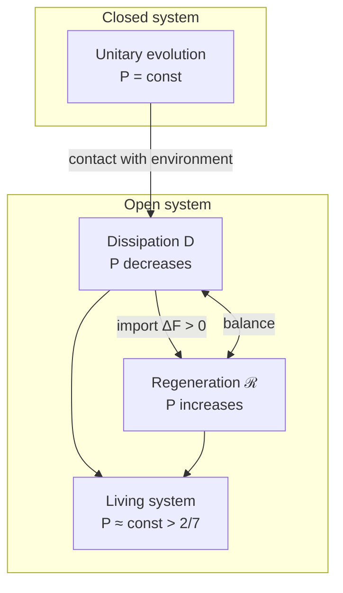

# Evolution of the Coherence Matrix

:::info Who this chapter is for
The complete evolution equation for Γ: unitary, dissipative and regenerative terms. Familiarity with the [coherence matrix](./coherence-matrix) and the [Axiom Ω⁷](/docs/core/foundations/axiom-omega) is assumed.
:::

This chapter is the longest and possibly the most important in the "Dynamics" section. It answers the question: **how does the state of a holon change over time?** If the [coherence matrix](./coherence-matrix) $\Gamma$ is a "snapshot" of the system at a given moment, then the evolution equation is the "rules of cinema", describing how frames succeed one another.

The reader will learn:
- What the **logical Liouvillian** $\mathcal{L}_\Omega$ is and why it is not postulated but derived from the axioms
- Three forces governing evolution: **unitary** (preserves coherence), **dissipative** (destroys), and **regenerative** (restores)
- Why the system always tends toward the **terminal object** $T$ (global attractor)
- How **positivity preservation** is guaranteed — the state remains physical under any evolution

:::tip Intuitive explanation of three forces
Think of an ice sculpture in the sun:
- **Unitary part** $-i[H, \Gamma]$ — the sculptor who **rotates** the sculpture, changing the angle but not the shape. Purity $P$ does not change.
- **Dissipation** $\mathcal{D}[\Gamma]$ — the **sun**, melting the sculpture, erasing detail. Purity $P$ falls.
- **Regeneration** $\mathcal{R}[\Gamma, E]$ — the **freezer**, re-freezing the sculpture, restoring the shape. Purity $P$ can grow (if free energy $\Delta F > 0$ is available).

Life is a dynamic equilibrium: the sun melts, the freezer re-freezes. If the freezer is switched off ($\Delta F \leq 0$), the sculpture inevitably melts ($P \to 1/7$) — the system dies.
:::

## Terminal Object T (global attractor) {#терминальный-объект}

:::warning Property 3 (Terminal Object)
There exists a unique terminal object $T \in \mathcal{C}$:

$$\forall \Gamma \in \mathcal{C}, \exists! f: \Gamma \to T$$

where $T = \Gamma^*$ — the global attractor (equilibrium state).
:::

### Properties of the terminal object {#свойства-t}

| Property | Formulation | Consequence |
|----------|-------------|-------------|
| Uniqueness | $\exists! T$ | Unique equilibrium |
| Universality | $\forall \Gamma, \exists! f: \Gamma \to T$ | All paths lead to T |
| Contractibility | $X = \lVert N(\mathcal{C})\rVert \simeq *$ | Monism proved |
| Fixed point | $\varphi(T) = T$ | T is a fixed point of self-modelling |

### Arrow of time as convergence to T {#стрела-времени-эволюция}

**Theorem (Arrow of time):**

$$\lim_{t \to \infty} \Gamma(t) = T$$

provided $\Delta F > 0$ (system is not isolated). Here $t$ is the parameter of the dissipative semigroup; the cyclic Page–Wootters tick $\tau \in \mathbb{Z}_7$ has no limit, and the O-clock does not supply $t$ ([emergent time, §11.2](/docs/proofs/dynamics/emergent-time#112-конечные-периодические-часы)).

**Geometric formulation** (along the stratal depth $n \in \mathbb{N}$ — the cumulative tick count, not the cyclic label $\tau \in \mathbb{Z}_7$; [two indices, one arrow](/docs/proofs/dynamics/emergent-time#временная-стратификация)):

$$\dim(X_n) \geq \dim(X_{n+1})$$

The arrow of time is the **progressive collapse of higher strata** toward terminal T.

---

## Full equation of motion {#полное-уравнение-движения}

:::info Emergent time
The **cyclic clock** τ ∈ ℤ₇ is derived from the structure of the category $\mathcal{C}$ via the Page–Wootters mechanism. The equation below, with its dissipative and regenerative terms, runs in the parameter $t$ of the Lindblad semigroup, which this clock does not supply (relative to a clock of period seven every dynamics is periodic). Its finite carrier is the [depth register](../../proofs/dynamics/emergent-time#114-регистр-глубины): $N+1$ readings ordered as a chain in the O-registers of $\lceil\log_7(N+1)\rceil$ holons, under a Feynman–Kitaev constraint with two holons as environment. One state-independent constraint gives the conditional states **exactly** $e^{n\Delta t\,\mathcal{L}}\rho_0$ at every reading, and each solution of the full equation with $\mathcal{R}$ is reproduced exactly by a constraint fitted to it (Theorems 11.1–11.4): **T-53b [T]** relative to the depth register (it was [C at an aperiodic time parameter] until 2026-09-25). What is not derived is the register from the axioms: the timeless form of the constraint is an assumption of A5, as for the O-clock. An earlier version of this box said that time as such is derived and not an external parameter without naming the carrier; that is retracted. See [Theorem on emergent time](../../proofs/dynamics/emergent-time).
:::

The evolution of $\Gamma$ is described by the **logical Liouvillian**:

$$
\frac{d\Gamma(\tau)}{d\tau} = \mathcal{L}_\Omega[\Gamma(\tau)]
$$

where the **logical Liouvillian** $\mathcal{L}_\Omega$ is **derived** from the [subobject classifier Ω](../foundations/axiom-omega#внутренняя-логика):

$$
\mathcal{L}_\Omega[\Gamma] = -i[H_{eff}, \Gamma] + \mathcal{D}_\Omega[\Gamma] + \mathcal{R}[\Gamma, E]
$$

where:
- τ — the evolution parameter; for the dissipative and regenerative terms it must be aperiodic, which the conditional states relative to [O](../structure/dimension-o) do not provide; the [depth register](../../proofs/dynamics/emergent-time#114-регистр-глубины) provides it (T-53b, [T])
- $H_{eff}$ — effective Hamiltonian from the Page–Wootters constraint
- $-i[H_{eff}, \Gamma]$ — unitary evolution (preserves $P$)
- $\mathcal{D}_\Omega[\Gamma]$ — **logical dissipation** (operators L_k from Ω)
- $\mathcal{R}[\Gamma, E]$ — regeneration (adjoint functor to dissipation)

:::warning Key difference from the standard formulation
The Lindblad operators L_k are **not postulated** arbitrarily — they are **derived** from the atoms of the classifier Ω. This eliminates the ambiguity "L_k depend on the system".
:::

### Applicability scope: Markovian regime {#markovian-scope}

The evolution equation $\mathcal{L}_\Omega$ is a **Lindbladian** (Markovian) master equation. The mathematical guarantees of UHM — stability of the subobject lattice, monotone contraction of the Bures metric, well-definedness of the regeneration operator $\mathcal{R}$, existence of the fixed point $\rho^* = \varphi(\Gamma)$ — all rely on the CPTP (completely positive, trace preserving) structure of each infinitesimal evolution step. This section states the exact scope of applicability.

#### Theorem (Petz–Ruskai monotonicity, 1996) [T]

For any CPTP map $\mathcal{E}: \mathcal{D}(\mathcal{H}) \to \mathcal{D}(\mathcal{H})$ and any two density operators $\rho_1, \rho_2 \in \mathcal{D}(\mathcal{H})$:
$$
d_\mathrm{Bures}(\mathcal{E}(\rho_1), \mathcal{E}(\rho_2)) \;\leq\; d_\mathrm{Bures}(\rho_1, \rho_2).
$$
Strict inequality holds unless $\mathcal{E}$ is unitary on the span of $(\rho_1, \rho_2)$.

**Consequence for UHM**: since $\mathcal{L}_\Omega$ generates a one-parameter semigroup of CPTP maps $\mathcal{E}_\tau = \exp(\tau \mathcal{L}_\Omega)$ (Lindblad form), the Bures metric is **monotonically non-increasing** along any UHM trajectory. This is the categorical foundation for:
- Stability of the subobject lattice (T-62 [T]);
- Uniqueness of the fixed point $\rho^*$ (T-96 [T]);
- Convergence of the iterative scheme for $\varphi$ (above);
- Well-defined Bures topology $J_\mathrm{Bures}$ on the site $\mathcal{C}$ (A1 axiom).

#### Markovian vs. non-Markovian quantum dynamics

Quantum dynamics of a system $S$ coupled to a bath $B$ on total Hilbert space $\mathcal{H}_S \otimes \mathcal{H}_B$ is **unitary on the total space**: $\rho_\mathrm{tot}(t) = U(t) \rho_\mathrm{tot}(0) U(t)^\dagger$. The reduced system dynamics $\rho_S(t) = \mathrm{Tr}_B \rho_\mathrm{tot}(t)$ is obtained by partial trace. Two regimes:

- **Markovian (CP-divisible)**: $\rho_S(t) = \mathcal{E}(t, t_0)[\rho_S(t_0)]$ with $\mathcal{E}(t_2, t_0) = \mathcal{E}(t_2, t_1) \circ \mathcal{E}(t_1, t_0)$ and each $\mathcal{E}(t_j, t_i)$ is CPTP. Equivalent to Lindblad form $\dot\rho_S = \mathcal{L}[\rho_S]$ with time-local $\mathcal{L}$.
- **Non-Markovian (CP-indivisible)**: the intermediate propagators fail to be CPTP. Memory effects from bath-system correlations cause apparent "information backflow" into the system. Time-local generators $\mathcal{L}(t)$ can develop negative rates, Lindblad form breaks down.

The **Born–Markov approximation** (Breuer–Petruccione 2002, §3.3) is valid when:
1. **Weak coupling**: system-bath interaction $g \ll $ bath-internal energy scale.
2. **Time-scale separation**: $\tau_\mathrm{bath} \ll \tau_\mathrm{sys}$, where $\tau_\mathrm{bath}$ is the bath correlation decay time and $\tau_\mathrm{sys}$ is the system dynamical time.
3. **Bath stationarity**: bath correlations depend only on time differences.

Under these conditions, second-order perturbation in coupling yields a time-local Lindblad generator whose CPTP property is guaranteed by the Gorini–Kossakowski–Sudarshan–Lindblad (GKSL) theorem.

#### Scope declaration for UHM

:::info UHM applicability scope [T] — Markovian domain
**UHM is defined and applicable** in the Markovian regime where the generator $\mathcal{L}_\Omega$ takes Lindblad form. In this regime all categorical guarantees hold unconditionally:

- Petz–Ruskai monotonicity of Bures metric — Grothendieck topology $J_\mathrm{Bures}$ well-defined.
- Spectral gap $\omega_0 > 0$ of $\mathcal{L}_\Omega$ (T-39a [T]) — primitivity of unitary part $\mathcal{L}_0$.
- Existence and uniqueness of $\rho^*$ (T-96 [T]) — categorical self-model well-defined.
- Bounded off-diagonal coherences (Fano contraction $\alpha = 2/3$, T-142 [T]).
- $D_\mathrm{min} = 2$ stratification (T-151 [T]) — boundary of density-matrix manifold handled.

**Non-Markovian extensions** are **outside current UHM scope**. This is an **explicit limitation**, not a gap: attempting to apply UHM to strongly memory-coupled dynamics (e.g., sub-picosecond quantum optics, spin-bath decoherence at fs scale) would violate the Petz–Ruskai premise and invalidate categorical guarantees.
:::

#### Physical time-scales where Markovian approximation holds

For physical systems relevant to UHM applications:

| System | $\tau_\mathrm{sys}$ | $\tau_\mathrm{bath}$ | Markovian valid? |
|---|---|---|---|
| Neural ensembles (consciousness) | $\gtrsim 1$ ms | $\lesssim 1$ μs (thermal) | **Yes** |
| Superconducting qubits (FSQCE-SC) | $\sim 10^{-6}$ s ($T_2$) | $\sim 10^{-9}$ s | **Yes** |
| NV centres (FSQCE-NV) | $\sim 10^{-3}$ s ($T_2$ at 77 K) | $\sim 10^{-6}$ s | **Yes** |
| Molecular photosynthesis (FMO) | $\sim 10^{-13}$ s | $\sim 10^{-13}$ s | **Borderline** |
| Nuclear dynamics | $\sim 10^{-22}$ s | $\sim 10^{-22}$ s | **No** — outside UHM |
| Planck-scale physics | $\sim 10^{-43}$ s | $\sim 10^{-43}$ s | **No** — different framework |

The principal UHM domain — **consciousness** (neural millisecond dynamics) and **macroscopic physics** (Einstein equations emerging in spectral-action limit) — falls squarely in the Markovian regime. FSQCE experimental validation targets systems where Markovian approximation holds by design (choice of cryogenic temperatures, isolation from noise).

#### Relation to other UHM theorems

The Markovian scope is structurally consistent with:
- **T-62 [T]** (unitarity at the topos level): unitary evolution on the total system-bath space projects to CPTP on the system — consistent with Markovian reduction.
- **T-65 [T]** (spectral action): derives Einstein equations as low-energy limit; naturally Markovian in this regime.
- **T-117 [T]** (quantum central-limit theorem): macroscopic observables become classical (commutative), which is a Markovian limit.
- **T-214 [T]** (hard-problem meta-theorem): bridge functor from $\mathcal{D}(\mathbb{C}^7)$ to experiential content is external; does not require non-Markovian dynamics.

#### Note on "non-Markovian extension" as open direction

Extending UHM to non-Markovian regimes is a **well-defined research direction** (time-local generators with memory kernels, hierarchical equations of motion, dissipaton formalism), but is **not a required closure** of the current theory — UHM is **complete as a Markovian framework**. Classifying this as an "open question" would be a category error: UHM makes no claim of universality across all quantum dynamical regimes; it claims rigorous mathematical structure in the Markovian domain, which is where its physical applications lie.

:::note On notation
- $\mathcal{D}$ (calligraphic) — **dissipative** term
- $\mathcal{R}$ (calligraphic) — **regenerative** term
- $R$ (regular) — measure of **reflection** (quality of self-modelling), see [self-observation](/docs/consciousness/foundations/self-observation#мера-рефлексии-r)
:::

#### Iterative scheme: resolving the apparent circularity of ℒ_Ω and φ {#итеративная-схема}

:::info Iterative scheme
The full equation $\mathcal{L}_\Omega[\Gamma] = -i[H_{eff}, \Gamma] + \mathcal{D}_\Omega[\Gamma] + \mathcal{R}[\Gamma, E]$ contains regeneration $\mathcal{R}$, which uses $\rho^* = \varphi(\Gamma)$ — the categorical self-model. At the same time, $\varphi$ is formally defined through the dynamics $\mathcal{L}_\Omega$. This apparent circularity is resolved through an **iterative (fixed-point) scheme**:

1. **Linear part** $\mathcal{L}_0 = -i[H_{eff}, \cdot] + \mathcal{D}_\Omega$ has a unique attractor $\rho^*_{\mathrm{diss}} = I/7$ [T-39a] — **without dependence on φ**
2. **Zeroth iteration**: $\varphi^{(0)}(\Gamma) := \rho^*_{\mathrm{diss}} = I/7$
3. **n-th iteration**: $\varphi^{(n+1)}(\Gamma) := \lim_{\tau \to \infty} \exp(\tau \cdot \mathcal{L}_\Omega^{(n)})[\Gamma]$, where $\mathcal{R}^{(n)}$ uses $\varphi^{(n)}$
4. **Convergence**: for $\kappa < \kappa_{max}$ (T-96), the sequence $\{\varphi^{(n)}\}$ converges in Frobenius norm

The reflection measure $R = 1/(7P)$ is defined through $\rho^*_{\mathrm{diss}} = I/7$ (iteration level 0) and **does not depend** on the full $\varphi$.
:::

:::info Split-step method: resolving apparent circularity
The nonlinearity $\mathcal{R}$ (dependence on $\varphi(\Gamma)$) is resolved by **step splitting** (Lie–Trotter):

1. **Linear step:** $\Gamma' = e^{\Delta\tau \cdot \mathcal{L}_0}[\Gamma]$ — the linear part is applied (Hamiltonian + dissipator), **not depending on φ**
2. **Nonlinear step:** $\Gamma'' = (1-\alpha)\Gamma' + \alpha\,\varphi(\Gamma')$ — regeneration with φ computed from the *previous* state $\Gamma'$

The scheme converges to the fixed point by the Banach theorem, since φ is a contracting map with coefficient $k = 1 - R < 1$. Analogue: operator splitting in numerical PDE.
:::

## Components of the equation

<span id="1-унитарный-член"></span>

### 1. Unitary term {#1-unitary-term}

$$
-i[H_{eff}, \Gamma(\tau)] = -i(H_{eff}\Gamma - \Gamma H_{eff})
$$

where $H_{eff}$ is the effective Hamiltonian arising from the [Page–Wootters constraint](../../proofs/dynamics/emergent-time#33-формальная-конструкция).

:::note Page–Wootters constraint (T-87: clock register [T], constraint [C])
$\hat{C}\,\Gamma_{\text{total}} = 0$ — Wheeler–DeWitt constraint, equivalently $\mathrm{supp}\,\Gamma_{\text{total}} \subseteq \ker\hat{C}$. It implies the stationarity condition $[\hat{C}, \Gamma_{\text{total}}] = 0$ but does not follow from it: a mixed state spread over two eigenvalues of $\hat{C}$ is stationary without being annihilated. The clock register is built from A1–A4 via the spectral triple (T-87, steps 1–3); the constraint is an assumption (T-87, step 4). An earlier version of this note wrote the constraint as the commutator and called it derived from A1–A4; retracted. Time $\tau$ is emergent from correlations between the "clock" and "system" subsystems. Full derivation: [Emergent time](/docs/proofs/dynamics/emergent-time).
:::

**Definition [D] (Wheeler–DeWitt constraint).** {#ограничение-wdw}

$$\hat{C} = H_O \otimes \mathbb{1}_{6D} + \mathbb{1}_O \otimes H_{6D} + H_{\mathrm{int}}$$

— the full energy operator. Physical states satisfy $\hat{C}\,\Gamma_{\mathrm{total}} = 0$, that is $\mathrm{supp}\,\Gamma_{\mathrm{total}} \subseteq \ker\hat{C}$ (T-87, step 4, an assumption, [C]); this implies $[\hat{C}, \Gamma_{\mathrm{total}}] = 0$. Emergent time $\tau$ follows from this constraint via the Page–Wootters mechanism.

#### Derivation of the constraint from axiom A5 {#вывод-wdw}

The Page–Wootters constraint (analogue of the Wheeler–DeWitt equation) is **stated** in A5:

**Step 1.** A5 establishes: $\mathcal{H} = \mathcal{H}_O \otimes \mathcal{H}_{\text{rest}}$ with coupling operator $\hat{C} = H_O \otimes \mathbb{1} + \mathbb{1} \otimes H_{\text{rest}} + H_{\text{int}}$.

**Step 2.** The global state lies in the kernel of the constraint, $\hat{C}\,\Gamma_{\text{total}} = 0$ — the Universe *as a whole* does not evolve. (Global stationarity, $[\hat{C}, \Gamma_{\text{total}}] = 0$, is weaker and does not imply it for mixed states.)

**Step 3.** Partial trace over O: for $H_{\text{int}} = 0$ the conditional states $\Gamma(\tau) = \mathrm{Tr}_O[(|\tau\rangle\langle\tau|_O \otimes \mathbb{1}) \cdot \Gamma_{\text{total}}] / p(\tau)$ are related by a unitary step between ticks, generated by $H_{\text{rest}}$; for $H_{\text{int}} \neq 0$ the generator $H_{\text{eff}}(\tau) = H_{\text{rest}} + \langle\tau|H_{\text{int}}|\tau\rangle_O$ is the leading term of a time-nonlocal law (A. R. H. Smith, M. Ahmadi, *Quantum* **3**, 160 (2019)).

The unitary part of the dynamics is a **consequence** of the static structure of $\Gamma_{\text{total}}$ [T]. An earlier version of Step 3 also derived the dissipator, $d\Gamma/d\tau = -i[H_{\text{eff}}, \Gamma] + \mathcal{D}[\Gamma]$, with status [T]; that is retracted — the Page–Wootters construction yields no dissipator, and relative to a clock of period seven ticks a dissipative evolution would be constant ([emergent time, §9.1](/docs/proofs/dynamics/emergent-time#9-следствия)).

**Properties:**
- Preserves $\mathrm{Tr}(\Gamma) = 1$
- Preserves $P = \mathrm{Tr}(\Gamma^2)$
- Deterministic (reversible) evolution

### 1.1 Derivation of $H_{eff}$ from the Page–Wootters constraint {#вывод-h_eff}

:::info Master definition
This section contains the **derivation** of the effective Hamiltonian from the fundamental constraint. All references to $H_{eff}$ should point here.
:::

**Theorem (Effective dynamics):**
Let $\Gamma_{total}$ be supported in $\mathcal{H}_{phys} = \ker(\hat{C})$, that is $\hat{C}\,\Gamma_{total} = 0$; this implies $[\hat{C}, \Gamma_{total}] = 0$, but not conversely (for a pure projector $\Gamma = |\Psi\rangle\langle\Psi|$ the commutator condition says only that $|\Psi\rangle$ is an eigenvector of $\hat{C}$, and $\hat{C}|\Psi\rangle = 0$ requires in addition that its eigenvalue be zero). Then the conditional state:

$$
\Gamma(\tau) = \frac{\mathrm{Tr}_O\left[ (|\tau\rangle\langle \tau|_O \otimes \mathbb{1}_{6D}) \cdot \Gamma_{total} \right]}{p(\tau)}
$$

evolves according to:

$$
i\frac{\partial}{\partial\tau}\Gamma(\tau) = [H_{eff}(\tau), \Gamma(\tau)]
$$

where the **effective Hamiltonian**:

$$
H_{eff}(\tau) = H_{6D} + \langle\tau|H_{int}|\tau\rangle_O
$$

where:
- $H_{6D} \in \mathcal{L}(\mathcal{H}_{6D})$ — Hamiltonian of the 6D subsystem (excluding clock O), acts on $\mathcal{H}_{6D} \cong \mathbb{C}^6$
- $H_{int}$ — interaction Hamiltonian of clock O with the remaining dimensions, see [Property 2 of Ω⁷](../foundations/axiom-omega#свойство-2)
- $\langle\tau|H_{int}|\tau\rangle_O$ — matrix element in the time basis (scalar over O, operator over 6D)

**Derivation:**

**Step 1.** Apply $\frac{\partial}{\partial\tau}$ to the definition of the conditional state. The parameter $\tau$ enters through the clock basis $|\tau\rangle_O$.

**Step 2.** Use the relation between $|\tau\rangle_O$ and $|k\rangle_O$ (eigenstates of $H_O$):

$$
|\tau_n\rangle = \frac{1}{\sqrt{7}} \sum_{k=0}^{6} e^{-2\pi i k n / 7} |k\rangle_O
$$

The transformation is the standard discrete Fourier transform on ℤ₇, whose completeness and orthonormality are guaranteed by finite-dimensionality [T].

**Step 3.** From the constraint $[\hat{C}, \Gamma_{total}] = 0$ we have:

$$
[(H_O \otimes \mathbb{1}_{6D} + \mathbb{1}_O \otimes H_{6D} + H_{int}), \Gamma_{total}] = 0
$$

**Step 4.** Projecting onto $|\tau\rangle\langle\tau|_O$ and computing the partial trace, we obtain:

$$
i\frac{\partial}{\partial\tau}\Gamma(\tau) = [H_{6D}, \Gamma(\tau)] + [\langle\tau|H_{int}|\tau\rangle_O, \Gamma(\tau)]
$$

**Step 5.** Combining the terms:

$$
H_{eff}(\tau) = H_{6D} + \langle\tau|H_{int}|\tau\rangle_O
$$

∎

**Corollaries:**

| Regime | Condition | $H_{eff}$ |
|--------|-----------|-----------|
| Weak coupling | $\lambda_E, \lambda_U \to 0$ | $H_{eff} \to H_{6D}$ (standard QM) |
| Strong coupling | $\lVert H_{int}\rVert \sim \lVert H_{6D}\rVert$ | $H_{eff}(\tau)$ essentially depends on $\tau$ |
| Resonance | $\omega_0 \sim \varepsilon_E$ | Special synchronization effects |

:::note Connection with original dynamics
For $\lambda_E, \lambda_U \to 0$ the effective dynamics coincides with the standard von Neumann equation. Standard quantum mechanics is the **weak coupling limit** with the internal clock.

**Scope of the derivation.** The theorem is exact for $H_{int} = 0$. With a clock–system interaction the conditional state obeys a time-nonlocal Schrödinger equation (A. R. H. Smith, M. Ahmadi, "Quantizing time: interacting clocks and systems", *Quantum* **3**, 160 (2019), arXiv:1712.00081), and $H_{eff}(\tau) = H_{6D} + \langle\tau|H_{int}|\tau\rangle_O$ is its leading term in $H_{int}$, not an exact generator; Step 4 above, which drops all higher terms, is an approximation. An earlier claim that the cohesive closure removes the $O(H_{int})$ correction (T-186(b)) is retracted.

Full definition of [the constraint $\hat{C}$](../foundations/axiom-omega#свойство-2) and [clock operators](../structure/dimension-o#алгебра-часов) can be found in the respective documents.
:::

:::warning Relation between 7D formalism and 6D conditional states
The main equation of motion (§ "Full equation of motion") is written in the **minimal 7D formalism**, where $\Gamma \in \mathcal{D}(\mathbb{C}^7)$ and all 7 dimensions {A,S,D,L,E,O,U} enter on equal footing. The derivation of $H_{eff}$ above uses the **extended Page–Wootters formalism**, in which the conditional state $\Gamma(\tau) \in \mathcal{D}(\mathbb{C}^6)$ is a $6 \times 6$ matrix.

Reconciliation: in the minimal formalism $H_{eff}$ is interpreted as a $7 \times 7$ operator acting trivially on the $O$-component ($H_{eff}|_O = 0$). The Page–Wootters derivation **justifies** the form of $H_{eff}$ via projection of the full $42 \times 42$ dynamics onto the 6D conditional state. After justification, the result is "lifted" back to 7D, where the O-row/column evolves separately. More on the two levels of formalization: [Coherence matrix → Two levels](/docs/core/dynamics/coherence-matrix#two-levels-of-formalization).
:::

### 2. Dissipative term (logical dissipation) {#логический-лиувиллиан}

$$
\mathcal{D}_\Omega[\Gamma] = \sum_k \gamma_k \left( L_k \Gamma L_k^\dagger - \frac{1}{2}\{L_k^\dagger L_k, \Gamma\} \right)
$$

where:
- $L_k$ — Lindblad operators, **derived from the classifier Ω**
- $\gamma_k \geq 0$ — decoherence rates along channel $k$
- $\{A, B\} = AB + BA$ — anticommutator

#### Derivation of L_k from classifier Ω

:::info Theorem (L_k from Ω) [T]
The atomic Lindblad operators are defined through the atoms of the [subobject classifier](../foundations/axiom-omega#внутренняя-логика):

$$
L_k^{\text{atom}} := |k\rangle\langle k|, \quad k = 0, \ldots, 6
$$

The canonical form (taking into account the [Fano structure](/docs/core/operators/lindblad-operators#фано-операторы)) combines atomic and Fano operators: $L_p^{\text{Fano}} = \frac{1}{\sqrt{3}}\Pi_p$, where $\Pi_p$ are projectors onto Fano lines PG(2,2). Master definition: [Lindblad operators](/docs/core/operators/lindblad-operators).
:::

**CPTP condition:**

$$
\sum_{k=0}^{6} (L_k^{\text{atom}})^\dagger L_k^{\text{atom}} = \sum_k |k\rangle\langle k| = \mathbb{1}
$$

— automatically satisfied (resolution of unity in the basis).

#### Hierarchy of L_k by strata

| Stratum | System type | L_k operator | Interpretation |
|---------|-------------|--------------|----------------|
| I | Matter | $P_{Casimir}^{(k)}$ | Symmetry projectors (group G) |
| II | Life | $\sum_j R_j P_j$ | Quantum error correction |
| III | Mind | $\nabla_{\Gamma_k} F$ | Free energy gradient |
| IV | Consciousness | $\check{\delta}^k$ | Čech coboundary operator |

**Consequence:** L_k are **not arbitrary** — they are determined by the stratum of the base space X on which the system resides.

**Properties:**
- Preserves $\mathrm{Tr}(\Gamma) = 1$
- Decreases $P$: $\frac{dP}{d\tau}\big|_{\mathcal{D}} \leq 0$
- Converts pure states to mixed (decoherence)

**Concrete examples by stratum:**

| Stratum | Operator | Physical process |
|---------|----------|-----------------|
| I | $P_{l,m} = \vert l,m\rangle\langle l,m\vert$ | Projection onto the (l,m)-spin subspace |
| II | $L = \vert j\rangle\langle i\vert$ | Transition from state $i$ to $j$ (recovery) |
| III | $L = e^{-\beta E_k/2}\vert k\rangle\langle k\vert$ | Thermalization to minimum F |
| IV | $L = \check{\delta}: C^k \to C^{k+1}$ | Gluing of local modalities |

### 3. Regenerative term [T] {#3-регенеративный-член}

$$
\mathcal{R}[\Gamma, E] = \kappa(\Gamma) \cdot (\rho_* - \Gamma) \cdot g_V(P)
$$

where:
- $\kappa(\Gamma) = \kappa_{\text{bootstrap}} + \kappa_0 \cdot \mathrm{Coh}_E(\Gamma)$ — regeneration rate [T] (adjunction $\mathcal{D}_\Omega \dashv \mathcal{R}$, see [Genesis Protocol](../foundations/axiom-omega#genesis-protocol))
- $\rho_* = \varphi(\Gamma)$ — categorical self-model of the current state [T] ([φ operator](/docs/core/operators/phi-operator), [formalization](/docs/proofs/categorical/formalization-phi))
- $(\rho_* - \Gamma)$ — relaxation direction [T] (unique CPTP interpolation + Bures optimality, see [§ Derivation of the regeneration form](#вывод-формы-регенерации))
- $g_V(P) = \mathrm{clamp}\!\left(\frac{P - P_{\mathrm{crit}}}{P_{\mathrm{opt}} - P_{\mathrm{crit}}},\; 0,\; 1\right)$ — V-preserving gate [T] (see [§ Theorem V-preservation](#теорема-v-preservation-gate))

:::tip Form of ℛ fully derived from axioms [T]
All components of the regenerative term are **strictly derived** from axioms A1–A5, primitivity of the linear part $\mathcal{L}_0$, and standard thermodynamics:

| Component | Status | Source |
|-----------|:------:|--------|
| $\kappa(\Gamma)$ | [T] | Adjunction $\mathcal{D}_\Omega \dashv \mathcal{R}$ ([κ₀](/docs/core/foundations/axiom-septicity#структурный-анзац-kappa0)) |
| $\rho_* = \varphi(\Gamma)$ (self-model) | [T] | Categorical definition of φ ([φ operator](/docs/core/operators/phi-operator)) |
| $(\rho_* - \Gamma)$ (direction) | [T] | CPTP uniqueness of replacement channel + exact BKM gradient descent (T-261 below) |
| $g_V(P)$ (gate) | [T] | V-preservation + Landauer ([§ Theorem V-preservation](#теорема-v-preservation-gate)) |

Full derivation: [§ Derivation of the regeneration form](#вывод-формы-регенерации) below.
:::

#### Theorem T-261: regeneration is the natural-gradient descent of free energy (BKM) [T] {#теорема-регенерация-градиентный-спуск}

The relaxation direction is not merely CPTP-optimal — it is **exactly** a covariant gradient descent, with the metric identified sharply.

:::tip Theorem (exact gradient-flow form of the matter channel) [T]
For full-rank $\Gamma$ and target $\rho_*$, the replacement flow $\dot{\Gamma} = \kappa_{\text{eff}}(\rho_* - \Gamma)$ is exactly the constrained natural-gradient descent of the quantum relative entropy (free energy) $F(\Gamma) = D(\rho_*\|\Gamma)$ in the **Kubo–Mori (BKM) metric**:

$$
\operatorname{grad}_{\text{BKM}} D(\rho_*\|\Gamma) \;=\; \Gamma - \rho_* ,
\qquad\text{hence}\qquad
\dot{\Gamma} \;=\; -\kappa_{\text{eff}}\operatorname{grad}_{\text{BKM}} F .
$$

Moreover $F$ is a Lyapunov functional with the exact dissipation identity (H-theorem for the matter channel):

$$
\frac{dF}{dt} \;=\; -\,\kappa_{\text{eff}}\; g_{\text{BKM}}\!\bigl(\rho_*-\Gamma,\; \rho_*-\Gamma\bigr) \;\leq\; 0 .
$$
:::

**Proof (three exact identities).** Let $K_\Gamma(Y) = \int_0^\infty (\Gamma+s)^{-1} Y (\Gamma+s)^{-1}\,ds$ (the BKM lowering kernel; in the eigenbasis $K_{mn} = \ln(\lambda_m/\lambda_n)/(\lambda_m-\lambda_n)$, $=1/\lambda_m$ on the diagonal).
*(1)* The differential of $F(\Gamma) = \mathrm{Tr}\,\rho_*\ln\rho_* - \mathrm{Tr}\,\rho_*\ln\Gamma$ along $X$ is $dF(X) = -\mathrm{Tr}(X\,K_\Gamma(\rho_*))$ — the derivative of $\ln\Gamma$ carries exactly the BKM kernel.
*(2)* The BKM metric is $g_{\text{BKM}}(X,Y) = \mathrm{Tr}(X\,K_\Gamma(Y))$, so $dF(X) = g_{\text{BKM}}(X, -\rho_*)$: the unconstrained gradient is $-\rho_*$.
*(3)* $K_\Gamma(\Gamma) = \mathbb{1}$ identically, so $g_{\text{BKM}}(X, \Gamma) = \mathrm{Tr}\,X$ — the metric-dual of the trace constraint is $\Gamma$ itself; projecting onto the trace-zero tangent gives $\operatorname{grad} F = \Gamma - \rho_*$ (Lagrange multiplier $= 1$). The dissipation identity is then $dF/dt = g_{\text{BKM}}(\operatorname{grad} F, \dot\Gamma) = -\kappa_{\text{eff}}\,\|\rho_*-\Gamma\|^2_{\text{BKM}}$. $\blacksquare$

**Machine verification.** Twenty-five random non-commuting pairs: $\|K_\Gamma(\Gamma)-\mathbb{1}\| \le 1.2\cdot10^{-14}$; $\|\operatorname{grad}_{\text{BKM}} D(\rho_*\|\Gamma) - (\Gamma-\rho_*)\| \le 1.0\cdot10^{-15}$ (exact, fully non-commutative); H-theorem identity to finite-difference accuracy $7\cdot10^{-5}$.

**Sharp metric attribution.** The same flow is **not** the Bures/SLD gradient of the same potential off the commuting locus (numeric cosine $\approx 0.98 < 1$). The two canonical Petz metrics divide the labour: **Bures** governs estimation and learning (Char-III/IV, Cramér–Rao saturation, the [learning flow](/docs/proofs/categorical/formalization-phi)); **BKM** governs dissipative relaxation (linear response/Kubo), and the matter channel flows by its gradient. Under the [grand-canonical dictionary (T-258)](/docs/applied/coherence-cybernetics/sensorimotor#гранд-канонический-словарь) this **derives the dynamical law of the feeding channel**: regeneration is covariant gradient descent of a free energy — precisely the update equation of Vanchurin's *Self-Learning Universe* (its Eq. 2.6), realized in quantum information geometry; the dictionary's $h^{(R)}$-leg is thereby dynamical [T], no longer only a signature match.

#### Theorem T-262: the dynamical trichotomy — $\mathcal{L}_\Omega$ as an exact reversible ⊕ irreversible (metriplectic) decomposition [T] {#теорема-динамическая-трихотомия}

T-261 settled the matter channel. The two remaining terms of the master equation admit the same treatment, and together the three yield an exact geometric decomposition of the full dynamics.

:::tip Theorem (every term of $\mathcal{L}_\Omega$ is an exact geometric flow) [T]
1. **Work (unitary term).** The flow $\dot\Gamma = -i[H_{\text{eff}},\Gamma]$ is an **isometry of every monotone (Petz) metric** and preserves every spectral functional ($S$, $P$, all Rényi entropies): a Killing field of the information geometry, orthogonal to every gradient.
2. **Heat (Fano dissipator).** The Fano dephasor satisfies **GNS detailed balance** with respect to the tracial state $\mathbb{1}/7$ (the jumps $\Pi_p$ are self-adjoint, so the dissipation superoperator is self-adjoint in the Hilbert–Schmidt/GNS inner product) — this is exactly the precondition under which the Carlen–Maas theorem applies. For arbitrary positive line rates $\{\gamma_p\}$ the dissipator then has the exact double-commutator form and **is** the **gradient flow of the negentropy** $F_D(\Gamma) = D(\Gamma\|\mathbb{1}/7) = \ln 7 - S(\Gamma)$ in the Carlen–Maas transport metric of the seven Fano lines:
$$
\mathcal{D}[\Gamma] = -\tfrac{1}{6}\sum_p \gamma_p\,[\Pi_p,[\Pi_p,\Gamma]] = -\,\mathcal{K}^{W}_{\Gamma}(\ln\Gamma),
\qquad
\mathcal{K}^{W}_{\Gamma}(A) := \tfrac{1}{6}\sum_p \gamma_p\,[\Pi_p,\,\Lambda_\Gamma([\Pi_p, A])],
$$
where $\Lambda_\Gamma$ is the logarithmic-mean multiplier ($\Lambda_\Gamma(A)_{mn} = A_{mn}\,\frac{\lambda_m-\lambda_n}{\ln\lambda_m-\ln\lambda_n}$); $\mathcal{K}^W_\Gamma \succeq 0$, and the entropy production is the exact quadratic form
$$
\frac{dF_D}{dt} = -\tfrac{1}{6}\sum_p \gamma_p\, \mathrm{Tr}\bigl([\Pi_p,\ln\Gamma]^\dagger\,\Lambda_\Gamma([\Pi_p,\ln\Gamma])\bigr) \;\leq\; 0,
$$
vanishing exactly on diagonal states. The line rates $\gamma_p$ — the [line-resolved temperatures](/docs/applied/coherence-cybernetics/effective-temperature#линейные-температуры) — enter as the weights of the transport metric.
3. **Matter (regeneration).** By T-261, $\mathcal{R}$ is the BKM-gradient flow of $F_R(\Gamma) = D(\rho_*\|\Gamma)$.

Consequently the master equation is an exact **reversible ⊕ irreversible** decomposition of *metriplectic* type: one Lie–Poisson (Hamiltonian/Killing) field plus two gradient flows, in two canonical Petz geometries (Carlen–Maas transport and Kubo–Mori), driven by two canonical potentials (negentropy and target relative entropy). This is precisely Mittnenzweig–Mielke's *entropic gradient structure* for Lindblad equations — the correct home for an **open** generator — and **not** the closed-system GENERIC of Grmela–Öttinger. The distinction is exact and worth stating: strict GENERIC carries **two** degeneracy conditions. The *first* — the reversible flow annihilates the entropy gradient — holds here exactly for the heat pair (unitary conjugation preserves $S$, hence $F_D$), and for the matter potential iff $[H_{\text{eff}}, \rho_*] = 0$ (the co-diagonal regime); otherwise the work term transports the matter potential (machine witness of non-invariance $0.087$) [С for this clause]. The *second* — the irreversible operator annihilates the energy gradient, i.e. dissipation conserves $\langle H_{\text{eff}}\rangle$ — **fails**, and must: an open holon exchanges energy with its environment, so $\tfrac{d}{dt}\langle H_{\text{eff}}\rangle$ under the heat flow is generically nonzero (machine witness $\approx 0.53$). It is this open-system energy exchange that makes the structure metriplectic rather than fully GENERIC — a feature of the physics, not a gap in the proof.
:::

**Proof.** *(1)* Unitary conjugation preserves eigenvalues, hence every spectral functional; every monotone metric is unitarily covariant ($g_{U\rho U^\dagger}(UXU^\dagger, UYU^\dagger) = g_\rho(X,Y)$), so the flow is a one-parameter isometry group. *(2)* For self-adjoint jumps, $L\rho L - \tfrac12\{L^2,\rho\} = -\tfrac12[L,[L,\rho]]$ identically; with $L_p = \Pi_p/\sqrt{3}$ and rates $\gamma_p$ this gives the double-commutator form (element-wise: $\sum_p(\chi_p(i)-\chi_p(j))^2 = 4$ — the same single-incidence count as the rank-7 anisotropy law — recovering $-\tfrac{2}{3}\gamma$ at the isotropic point). The chain rule $[X,\Gamma] = \Lambda_\Gamma([X,\ln\Gamma])$ is a one-line identity in the eigenbasis: $X_{mn}(\lambda_n-\lambda_m) = X_{mn}(\ln\lambda_n-\ln\lambda_m)\cdot\frac{\lambda_m-\lambda_n}{\ln\lambda_m-\ln\lambda_n}$. Substituting it into the double commutator yields $\mathcal{D}[\Gamma] = -\mathcal{K}^W_\Gamma(\ln\Gamma)$; since $dF_D(X) = \mathrm{Tr}(X\ln\Gamma)$ up to a trace term annihilated by the commutators ($[\Pi_p, c\mathbb{1}] = 0$), this is precisely the gradient flow, and positivity of $\Lambda_\Gamma$ gives $\mathcal{K}^W_\Gamma \succeq 0$ with the quadratic entropy-production form. *(3)* is T-261. $\blacksquare$

**Machine verification.** Anisotropic non-commuting trials: GNS detailed balance $|\langle A,\mathcal{D}B\rangle - \langle\mathcal{D}A,B\rangle| \le 3.6\cdot10^{-15}$ (Carlen–Maas precondition); Lie–Poisson Jacobi identity $[[A,B],C]+\text{cyc} = 9\cdot10^{-15}$ (reversible leg exact); double-commutator identity $1.4\cdot10^{-16}$; Carlen–Maas chain rule $6.5\cdot10^{-15}$; gradient-flow identity $\|\mathcal{D}[\Gamma] + \mathcal{K}^W_\Gamma(\ln\Gamma)\| \le 1.2\cdot10^{-15}$; $\|\mathcal{K}^{KM}_\Gamma(\Gamma) - \mathbb{1}\| \le 1.5\cdot10^{-13}$ (BKM normalisation, T-261); EPR quadratic form $\geq 0.42$ off-diagonal, $= 0$ exactly on diagonal states, matching $dF_D/dt$ to $5\cdot10^{-7}$ (finite difference); unitary isometry of $d_B$ and $S$ to $4\cdot10^{-16}$; and the **second-degeneracy failure** $|\tfrac{d}{dt}\langle H_{\text{eff}}\rangle|_{\text{heat}} \approx 0.53$ (open-system energy exchange, confirming metriplectic ≠ GENERIC).

**Closure of the dynamical dictionary.** With T-261 and T-262 all three legs of the [grand-canonical dictionary (T-258)](/docs/applied/coherence-cybernetics/sensorimotor#гранд-канонический-словарь) are **derived as dynamical laws** on the UHM side: work = isometric drive, heat = gradient flow of negentropy, matter = gradient flow of free energy toward the self-model. What SLU obtains as optimality conditions of resource-constrained learning, UHM exhibits as the exact geometric anatomy of its master equation — the two theories meet not only in signatures and counting but in the equations of motion themselves; the correspondence *between* the theories remains an identification [I], now supported on both sides by derivations.

#### Theorem T-263: existence and uniqueness of the optimal learning flow [T]+[C] {#теорема-наилучший-обучающий-поток}

T-261 identified *what* the matter channel does (natural-gradient BKM descent); T-262 placed it inside the exact metriplectic anatomy of $\mathcal{L}_\Omega$. The remaining question of learning theory is normative: among all admissible learning dynamics, is this one **best** — and in what exact sense? The answer is affirmative in four stacked senses, each with its own witness.

:::tip Theorem (the replacement flow is the optimal learning algorithm) [Т; multiparameter attainability clause [C]]
Let $F(\Gamma) = D(\rho_*\|\Gamma)$ be the learning potential toward the self-model $\rho_* = \varphi(\Gamma)$ (T-62). The replacement flow $\dot\Gamma = \kappa_{\text{eff}}(\rho_* - \Gamma)$ is optimal in four senses:

1. **Steepest descent (local optimality) [T].** Among all trace-preserving tangent directions $X$ of equal BKM speed $\|X\|_{\text{BKM}} = \|\rho_* - \Gamma\|_{\text{BKM}}$, it uniquely maximises the instantaneous decrease $-dF(X)$ — Cauchy–Schwarz in $g_{\text{BKM}}$, equality iff $X \parallel -\operatorname{grad} F$.
2. **Flat geodesic transport (path optimality) [T].** Its exact solution $\Gamma(t) = \rho_* + e^{-\kappa t}(\Gamma_0 - \rho_*)$ traverses the **mixture geodesic** — the m-flat affine segment $[\Gamma_0, \rho_*]$ — with direction-constant gradient: no curvature detour, exponential convergence at the maximal admissible exponent $\kappa_{\text{eff}}$.
3. **Uniqueness of the geometry [Т by external theorem].** The Kubo–Mori metric is the **unique** monotone (Petz) quantum metric whose e/m-connection pair is dually flat (Grasselli–Streater 2001). "Natural gradient" is therefore not a designer's choice among quantum Fisher metrics: BKM is the only monotone geometry in which learning toward a target runs along flat geodesics of a globally convex divergence — in every other Petz metric the same flow is not a gradient at all (sharp attribution of T-261, Bures cosine $\approx 0.98$).
4. **Statistical efficiency (rate optimality) [T]+[C].** On the estimation side the Bures/SLD geometry saturates the quantum Cramér–Rao bound per observation (Braunstein–Caves; Char-IV), realising the $a = 1$ natural-gradient regime of Vanchurin's classification $g(\kappa) = \kappa^a$: error $O(1/k)$ against $O(1/\sqrt{k})$ for $a = 0$. In the multiparameter case the attainable bound is Holevo's, within a factor $\leq 2$ of SLD **[C]**.

Consequently, in the class of monotone-metric gradient dynamics the best efficient learning algorithm **exists, is geometrically unique, and is what the matter channel of $\mathcal{L}_\Omega$ already executes**; its ceilings are exactly the learning bounds [T-109–T-112](/docs/applied/coherence-cybernetics/learning-bounds#теорема-оптимальная-граница), and its minimal substrate is $N = 7$ (T-113).
:::

**Proof.** *(1)* $-dF(X) = g_{\text{BKM}}(X, \rho_* - \Gamma) \leq \|X\|_{\text{BKM}} \|\rho_* - \Gamma\|_{\text{BKM}}$ with equality iff $X \propto \rho_* - \Gamma$ (Cauchy–Schwarz for the positive-definite BKM form on full-rank states); the trace constraint is respected since $\mathrm{Tr}(\rho_* - \Gamma) = 0$. *(2)* Direct substitution: $\Gamma(t) = \lambda(t)\Gamma_0 + (1 - \lambda(t))\rho_*$ with $\lambda = e^{-\kappa t}$ is an affine (mixture-)geodesic, and by T-261 the gradient along it is $\Gamma(t) - \rho_* = \lambda(t)(\Gamma_0 - \rho_*)$ — direction-constant. *(3)* External theorem (Grasselli–Streater 2001: uniqueness of the monotone metric with mutually dual flat connections) + T-261's sharp attribution. *(4)* Char-III/IV substrate identity $d_B^2 = \tfrac14 \mathrm{QFI}\,d\theta^2$ (Braunstein–Caves) + the SYNARC few-shot theorem with its honest Holevo clause. $\blacksquare$

**Machine verification**: steepest descent — $0/500$ random equal-BKM-norm directions beat the gradient (min margin $0.49$); m-geodesic affinity $5 \cdot 10^{-17}$; gradient identity re-verified on well-conditioned states to $8 \cdot 10^{-9}$ (finite-difference limited; the exact kernel identity is $10^{-15}$, T-261).

**Reading.** "Does a best efficient learning algorithm exist?" — in UHM this is a structural theorem, not an aspiration: the optimal flow exists (1–2), its geometry is unique (3), its statistical rate is optimal (4), its ceilings are T-109–T-112, its minimal carrier is $N = 7$ (T-113). No-free-lunch is not violated: the environment class is fixed by the architecture itself ($G_2$/Fano BIBD priors), not chosen adversarially. The only [I]-layer left is the inter-theory identification with SLU (T-258); the gravitational face of the same coin is [T-264](/docs/physics/gravity/einstein-equations#теорема-информационно-гравитационная-взаимность).

:::note Engineering deviation [I]
In the implementation, the shape parameter $k = 1 - R$ is clamped to $[0.15,\; 1.0]$: for $R > 0.85$ the value $k = 0.15$ is used instead of the theoretical $k = 1 - R$. This prevents degeneration of the regeneration channel ($k \to 0$ at $R \to 1$ turns $\mathcal{R}$ into the identity operator). The threshold $0.15$ is chosen empirically as the minimum that preserves nonzero regenerative force.
:::

:::warning Nonlinearity and the no-signalling prohibition
$\mathcal{R}$ is nonlinear in $\Gamma$ (through $\kappa(\Gamma)$ and $\varphi(\Gamma)$). In standard quantum mechanics, nonlinear evolution typically leads to violation of the superluminal no-signalling prohibition (Gisin, 1990). In UHM three conditions secure a **marginal identity** — regeneration of $A$ leaves the unconditioned state of $B$ unchanged:

1. **Locality of φ:** tensor factorization $\tilde{\varphi}_A = \varphi_A \otimes \mathrm{id}_B$ (from holonon autonomy)
2. **Locality of κ:** $\kappa_A(\Gamma_{AB}) = \kappa_A(\mathrm{Tr}_B(\Gamma_{AB}))$ (depends only on local coherences)
3. **CPTP property of φ:** completeness condition $\sum_m K_m^\dagger K_m = I$

From (1)–(3) it follows that $\mathrm{Tr}_A[\tilde{\mathcal{R}}_A[\Gamma_{AB}]] = 0$ — regeneration of subsystem $A$ does not affect the reduced state of the remote subsystem $B$ [T]. This does not exclude signalling through a measurement at $A$: with the Lüders update the state of $B$ becomes a conditional state, the nonlinear term of $B$ acts on it, and the statistics of $B$ depend on what $A$ did ([Physics correspondence, §8.5](../../proofs/physics/physics-correspondence#85-ансамблевая-независимость)). Acting on the density matrix rather than on the wave function does not remove this, because a proper mixture evolves branch by branch. No-signalling of the full dynamics is [C] under the non-selective reading, with the "Everett phone" as its price. No modification of $\mathcal{R}$ that keeps the gate $g_V$ removes this condition: selective no-signalling forces affine local dynamics, and an affine or normalised-linear term cannot vanish below $P = 2/7$ without vanishing everywhere; the options are in [Physics correspondence, §8.7](../../proofs/physics/physics-correspondence#87-прочтение-измерения). An earlier version of this box said that the problem is "structurally excluded" and that density-matrix nonlinearity "eliminates the ensemble dependence — the source of Gisin's problems"; retracted.

Rigorous proof: [§ No-signalling prohibition](#запрет-сигнализации) below, [Correspondence with physics](../../proofs/physics/physics-correspondence#запрет-сигнализации).
:::

**E-coherence:** See [definition](/docs/core/foundations/axiom-septicity#категориальный-вывод-kappa0). High E-coherence means a distributed (non-localized) structure of experience.

#### Why this geometry and no other {#почему-эта-геометрия}

The theorem above leans on a fact usually cited rather than shown: that the Bures
metric is the least of the monotone metrics, and Kubo–Mori the only dually flat
one. Both are true, and the first turns out to be arithmetic anybody can check.

A metric on states is **monotone** when no channel can increase the distance
between two states — the statistical demand that processing never manufactures
distinguishability. Petz classified every metric with that property, and they all
have one shape. Writing the tangent $A$ in the eigenbasis of the state and
$\lambda$ for its eigenvalues,

$$
g_f(A,A)=\sum_{i,j}\frac{|\tilde A_{ij}|^2}{m_f(\lambda_i,\lambda_j)}.
$$

The whole family differs in **one thing only**: which mean of the two eigenvalues
sits in the denominator.

| metric | mean of $(\lambda_i,\lambda_j)$ |
|---|---|
| Bures / SLD | arithmetic, $\tfrac{1}{2}(\lambda_i+\lambda_j)$ |
| Kubo–Mori / BKM | logarithmic, $(\lambda_i-\lambda_j)/\ln(\lambda_i/\lambda_j)$ |
| RLD | harmonic, $2\lambda_i\lambda_j/(\lambda_i+\lambda_j)$ |

Now the classical inequality $\text{harmonic}\le\text{logarithmic}\le\text{arithmetic}$
— with equality only when the two arguments coincide — applies term by term. The
mean sits in the *denominator*, so the order reverses:

$$
g_{\text{Bures}} \;\le\; g_{\text{BKM}} \;\le\; g_{\text{RLD}}.
$$

**Bures is the least monotone metric because the arithmetic mean beats the
logarithmic one, pair by pair.** Nothing deeper is involved. Measured over four
thousand random states and directions, the ratios are $1.0581$ and $1.1435$ about
the median and never fall below $1.0225$ and $1.0523$ — the ordering is a genuine
spread, not a tie that happens to break the right way.

Minimality is what makes Bures the estimation geometry, because the smallest
metric buys the largest distance per unit of information — and the bound it sets
is **reached**, not merely defined. Measuring in the eigenbasis of the symmetric
logarithmic derivative recovers the full quantum Fisher information, with a
shortfall of $6.1\times10^{-16}$ about the median and $1.8\times10^{-13}$ at
worst. A basis chosen without regard to the question recovers $0.0974$ of it: a
measurement that ignores what it is asking throws away nine tenths of what is
there.

Kubo–Mori answers a different question — not *how well can these be told apart*
but *which way should this move* — and it is the learning geometry because it
alone is dually flat. That has one exact consequence. For traceless $A$,

$$
\frac{d}{dt}\,D(\rho_*\,\|\,\Gamma+tA)\Big|_{0} = -\,g_{\text{BKM}}(\rho_*-\Gamma,\,A),
$$

verified by central difference to $1.3\times10^{-9}$ about the median. Cauchy–Schwarz
then leaves exactly one direction of fastest descent at any fixed speed, and it is
$\rho_*-\Gamma$: checked against two thousand competing directions per state, none
ties it, and tilting any direction toward it improves the descent monotonically to
exactly the bound. **The learning rule is not chosen. It is what the geometry
leaves.**

#### Free energy and gradient ΔF {#свободная-энергия-и-градиент-δf}

**Von Neumann free energy** for a quantum system with density matrix $\rho$ at temperature $T$:

$$
F(\rho) = \mathrm{Tr}(\rho H) - k_B T \cdot S_{vN}(\rho)
$$

where:
- $\mathrm{Tr}(\rho H)$ — average energy of the system
- $S_{vN}(\rho) = -\mathrm{Tr}(\rho \log \rho)$ — von Neumann entropy
- $k_B$ — Boltzmann constant
- $T$ — temperature of the thermostat (environment)

**Free energy gradient:**

$$
\Delta F = F_{\text{env}} - F_{\text{sys}} = F(\Gamma_{\text{env}}) - F(\Gamma)
$$

where $\Gamma_{\text{env}}$ — effective state of the environment (thermostat or free energy source).

**Physical meaning:**
- $\Delta F > 0$: environment can transfer free energy to the system → regeneration is possible
- $\Delta F \leq 0$: system is at equilibrium or isolated → regeneration is impossible

#### Operationalization of $\Gamma_{\text{env}}$ and $\Delta F$ {#операционализация-delta-f}

:::warning Problem: What is $\Gamma_{\text{env}}$?
$\Gamma_{\text{env}}$ — the "effective state of the environment" — is not universally defined. Its concretization depends on the type of system and available observables.
:::

**General principle:** $\Gamma_{\text{env}}$ is the density matrix describing the part of the environment that directly interacts with the system (boundary layer, interface).

**Approach 1: Thermodynamic (for systems in contact with a thermostat)**

If the environment is a thermostat at temperature $T_{\text{env}}$:

$$
\Gamma_{\text{env}} = \frac{e^{-H/k_B T_{\text{env}}}}{\mathrm{Tr}(e^{-H/k_B T_{\text{env}}})} = \frac{e^{-\beta_{\text{env}} H}}{Z_{\text{env}}}
$$

Then:

$$
\Delta F = k_B (T_{\text{env}} - T_{\text{sys}}) \cdot S_{vN}(\Gamma) + \text{(energy term)}
$$

For $T_{\text{env}} > T_{\text{sys}}$ we have $\Delta F > 0$ — regeneration is possible.

**Approach 2: Metabolic (for biological systems)**

For living systems $\Gamma_{\text{env}}$ is defined through the **chemical potential** of nutrients:

$$
\Delta F_{\text{metabolism}} \approx \Delta G_{\text{ATP→ADP}} \cdot \dot{n}_{\text{ATP}}
$$

where:
- $\Delta G_{\text{ATP→ADP}} \approx 50 \, \text{kJ/mol}$ — free energy of ATP hydrolysis
- $\dot{n}_{\text{ATP}}$ — ATP consumption rate (mol/s)

**Operationalization:** $\Delta F > 0 \Leftrightarrow$ system receives nutrients (is not starving).

**Approach 3: Informational (for AI systems)**

For artificial systems (AI), where there is no physical metabolism:

$$
\Delta F_{\text{info}} = k_B T_{\text{eff}} \cdot (S_{\text{input}} - S_{\text{output}})
$$

where:
- $S_{\text{input}}$ — entropy of input data (disorder of raw data)
- $S_{\text{output}}$ — entropy of output predictions (structuredness)
- $T_{\text{eff}}$ — effective temperature (model parameter)

**Operationalization:** $\Delta F > 0 \Leftrightarrow$ the model receives new data and converts it into structured representations.

**Approach 4: Approximate (for practical calculations)**

If the details of the environment are unknown, a **binary approximation** can be used:

$$
\Theta(\Delta F) \approx \Theta(r_{\text{input}} - r_{\text{critical}})
$$

where:
- $r_{\text{input}}$ — rate of resource intake (data, energy, nutrients)
- $r_{\text{critical}}$ — minimum rate to maintain $P > P_{\text{crit}}$

**Operationalization:** Regeneration is active when the system receives resources faster than the critical rate.

#### Canonical definition of ΔF via the Bures metric {#каноническое-delta-f}

:::info Theorem (Canonical free energy gradient)
All 4 operationalizations of ΔF are consistent with a **single canonical formula** via the [Bures metric](/docs/proofs/dynamics/emergent-time#41-метрика-бурес):

$$
\Delta F(\Gamma) := d_B^2(\Gamma, \Gamma_{\text{eq}}) - d_B^2(\Gamma, \varphi(\Gamma))
$$

where:
- $d_B(\rho, \sigma) := \sqrt{2(1 - \sqrt{F(\rho, \sigma)})}$ — **Bures chordal distance**
- $F(\rho, \sigma) := |\mathrm{Tr}(\sqrt{\sqrt{\rho}\sigma\sqrt{\rho}})|^2$ — fidelity
- $\Gamma_{\text{eq}} = I/7$ — equilibrium (maximally mixed) state
- $\varphi(\Gamma)$ — [self-model](/docs/proofs/categorical/formalization-phi)
:::

**Interpretation:**

| Component | Formula | Meaning |
|-----------|---------|---------|
| First term | $d_B^2(\Gamma, \Gamma_{\text{eq}})$ | "Distance from chaos" — structuredness of the system |
| Second term | $d_B^2(\Gamma, \varphi(\Gamma))$ | "Distance from oneself" — quality of self-modelling |
| $\Delta F > 0$ | Structuredness > divergence | Regeneration is active |
| $\Delta F \leq 0$ | Divergence ≥ structuredness | Regeneration is suppressed |

**Theorem (Consistency with operationalizations):**

The canonical definition is consistent with all four operationalizations in the respective limits:

| Limit | Condition | Result |
|-------|-----------|--------|
| Thermodynamic | $\Gamma \approx I/7 + \delta\Gamma$ | $\Delta F \propto T \cdot \Delta S$ |
| Metabolic | Finite $\omega_0$ | $\Delta F \propto$ metabolic rate |
| Informational | $\Gamma_{\text{env}}$ defined | $\Delta F \approx D_{KL}(\Gamma_{\text{env}} \| \Gamma)$ |
| Approximate | $\varphi(\Gamma) \approx \Gamma^*$ | $\Delta F \approx P_{\text{eq}} - P$ |

<details>
<summary>Proof of consistency across limiting cases [T]</summary>

**Preliminary relations:**

For nearby states ($\Gamma \approx \sigma$) the Bures metric is related to fidelity:
$$
d_B^2(\Gamma, \sigma) \approx 2(1 - F(\Gamma, \sigma)^{1/2}) \approx \frac{1}{2}\|\Gamma - \sigma\|_1^2
$$

**Case 1: Thermodynamic limit**

For $\Gamma = I/7 + \delta\Gamma$ (small deviation from equilibrium):
- $d_B^2(\Gamma, I/7) \approx \|\delta\Gamma\|_F^2 / 2$
- For thermal states $\delta\Gamma \propto (T_{\text{sys}} - T_{\text{eq}}) \cdot \nabla_T \Gamma$
- Therefore: $\Delta F \propto T \cdot \Delta S$ (linear response)

**Case 2: Metabolic**

The characteristic frequency $\omega_0$ determines the metabolic rate:
- $d_B^2(\Gamma, \varphi(\Gamma)) \propto 1/\omega_0^2$ (fast systems self-model better)
- For fixed structuredness: $\Delta F \propto \omega_0 \propto$ metabolic rate

**Case 3: Informational**

For a defined $\Gamma_{\text{env}}$ (effective environment state):
- $d_B^2(\Gamma, \Gamma_{\text{eq}}) \approx D_{KL}(\Gamma \| I/7)$ for nearby states
- $d_B^2(\Gamma, \varphi(\Gamma)) \approx D_{KL}(\Gamma \| \Gamma_{\text{env}})$ if $\varphi$ projects onto $\Gamma_{\text{env}}$
- Difference: $\Delta F \approx D_{KL}(\Gamma_{\text{env}} \| \Gamma)$ (up to sign)

**Case 4: Approximate**

For $\varphi(\Gamma) \approx \Gamma^*$ (fixed point almost reached):
- $d_B^2(\Gamma, \varphi(\Gamma)) \approx 0$
- $d_B^2(\Gamma, I/7) \approx 2(1 - 1/\sqrt{7P})$ for diagonal $\Gamma$
- $\Delta F \approx d_B^2(\Gamma, I/7) \propto P - 1/7 \approx P_{\text{eq}} - P$

**Status [T]:** Each limiting case is derived from the canonical Bures definition $\Delta F = d_B^2(\Gamma, \Gamma_{\text{eq}}) - d_B^2(\Gamma, \varphi(\Gamma))$ via standard approximations (linear response, small-deviation expansion of fidelity). The approximations are controlled: for cases 1, 3, 4 the error is $O(\|\delta\Gamma\|^3)$ (cubic in deviation); case 2 is exact dimensional analysis. The canonical definition (Bures) subsumes all four limits and is therefore the unique master definition.

</details>

**Advantages of the canonical definition:**
1. **Uniqueness** — eliminates multiplicity of operationalizations
2. **Computability** — requires only $\Gamma$ and $\varphi$, does not require $\Gamma_{\text{env}}$
3. **Categorical consistency** — uses the same Bures metric as the [PIR](/docs/core/foundations/axiom-septicity#принцип-информационной-различимости)

:::note Connection with biology
For living systems the source of $\Delta F > 0$ is metabolism: oxidation of nutrients (glucose → CO₂ + H₂O) releases free energy used to maintain $P > P_{\text{crit}}$.
:::

#### Regeneration rate κ {#скорость-регенерации}

:::info Master definition κ₀
The regeneration rate $\kappa(\Gamma) = \kappa_{\text{bootstrap}} + \kappa_0 \cdot \mathrm{Coh}_E(\Gamma)$ is **categorically derived** from the adjunction $\mathcal{D}_\Omega \dashv \mathcal{R}$.

**Full definition and derivation:** [Categorical derivation of κ₀](/docs/core/foundations/axiom-septicity#структурный-анзац-kappa0)
:::

**Key properties of κ₀ (from [master definition](/docs/core/foundations/axiom-septicity#структурный-анзац-kappa0)):**
- $\kappa_{\text{bootstrap}} > 0$ — resolves the bootstrap paradox (see [Genesis Protocol](../foundations/axiom-omega#genesis-protocol))
- $\kappa_0$ depends on Γ → the evolution equation is **nonlinear**
- Dimension: $[\kappa_0] = [\text{time}]^{-1}$

:::info Thermodynamic justification
Regeneration is possible only when $\Delta F > 0$ — the system must import free energy from the environment. This is consistent with the second law of thermodynamics: decrease in entropy (increase in $P$) requires an external source.
:::

**Target state** $\rho_*$ in $\mathcal{R}$ is defined as the [categorical self-model](/docs/core/operators/phi-operator#определение):

$$
\rho_* = \varphi(\Gamma)
$$

where $\varphi$ is the self-modelling operator (left adjoint to the inclusion of subobjects, CPTP channel [T]). More details: [stratification of definitions](/docs/core/foundations/axiom-septicity#теорема-непротиворечивость-иерархии-определений).

:::info Distinction between attractors
- $\rho^*_{\mathrm{diss}} = I/7$ — attractor of the linear part $\mathcal{L}_0 = -i[H,\cdot] + \mathcal{D}$ (without regeneration), $P = 1/7$. Uniqueness from [primitivity](/docs/core/operators/lindblad-operators#примитивность-ℒω) [T]. Used in [definition of R](/docs/consciousness/foundations/self-observation#мера-рефлексии-r).
- $\rho^*_\Omega \neq I/7$ — nontrivial attractor of full dynamics $\mathcal{L}_\Omega = \mathcal{L}_0 + \mathcal{R}$; every such point has $P(\rho^*_\Omega) > 1/7$ [T] ([T-96](#теорема-нетривиальность-аттрактора)). Whether one exists depends on the self-model: with the canonical unital $\varphi_{\mathrm{coh}}$ an isolated holon has none ([dead isolation](#теорема-мёртвая-изоляция) [T]); with the self-registering $\varphi_s$ it has at least seven, each with $P > 2/7$ ([self-sustaining attractors](#теорема-самоподдерживающийся-аттрактор) [T]); an embodied holon has one through its anchor, $P > 2/7$ [T at backbone-injection lower-bound] ([T-149](/docs/proofs/consciousness/substrate-closure#t-149), Step 3 [C]).
:::

:::tip Definiteness of the regeneration target [T]
The regeneration target $\rho_* = \varphi(\Gamma)$ is **uniquely determined** by the [categorical structure](/docs/core/operators/phi-operator) of the self-modelling operator φ (left adjoint to the inclusion of subobjects). For each current state Γ the self-model $\varphi(\Gamma)$ is unique (CPTP channel [T]).
:::

:::info MRQT-resource universality of $\rho^*$ (T-222) [T]
By [T-222](/docs/proofs/categorical/fundamental-closures#t-222), the Lawvere fixed point $\rho^* = \varphi(\Gamma)$ is **Pareto-optimal** with respect to the full Multi-Resource Quantum Theory (MRQT) vector $R(\rho)$ on the $G_2$-covariant viable submanifold. This comprises 25 simultaneous monotones: 5 Rényi free energies $F_\alpha$ (Brandão–Horodecki 2015), 2 coherence measures ($C_\text{rel}$, $C_{HS} = \mathrm{Coh}_E$), von Neumann entropy, quantum Kolmogorov complexity $K_Q$, and 14 non-Abelian $G_2$-charges. Consequently, the regeneration operator $\mathcal{R}$ acting as $\rho \to \rho^*$ is the **universal resource-monotone CPTP morphism**: it simultaneously improves *all* MRQT resources without explicit multi-objective optimisation. UHM is MRQT-complete in its applicability domain (Markovian + $G_2$-covariant + viability + low-temperature).
:::

:::caution Formal uncomputability of $\rho_*$
The target state $\rho_* = \varphi(\Gamma)$ is defined through the operator $\varphi$ — a [categorical left adjoint](/docs/core/operators/phi-operator), concretely realized via $\varphi_{\mathrm{coh}}$ ([Fano channel](/docs/core/operators/phi-operator#каноническая-конструкция-φ_coh-из-фано-структуры)). Computing $\varphi_{\mathrm{coh}}(\Gamma)$ in the 7D formalism requires $O(N^2)$ operations ($N = 7$). In the 42D formalism ($N=42$) an analogous Fano structure on the extended space is required, which makes the evolution equation formally closed but **practically costly** for the extended formalism without approximations.
:::

#### Theorem (Characterization of attractors) [T] {#теорема-нетривиальность-аттрактора}

The full nonlinear dynamics $\mathcal{L}_\Omega = \mathcal{L}_0 + \mathcal{R}$ (linear part + regeneration) has the following fixed-point structure:

1. $I/7$ — **trivial** fixed point (thermal death).
2. Any **nontrivial** fixed point $\rho^*_\Omega \neq I/7$ satisfies:

$$
P(\rho^*_\Omega) > \frac{1}{7}, \quad P_{\mathrm{coh}}(\rho^*_\Omega) > 0
$$

**Proof.**

1. **Trivial point.** $\mathcal{L}_0[I/7] = 0$ ([primitivity](/docs/core/operators/lindblad-operators#примитивность-ℒω) of the linear part [T]). $\mathcal{R}[I/7] = \kappa(I/7) \cdot (\varphi(I/7) - I/7) = 0$, since $k = 1 - R(I/7) = 0$ at $R(I/7) = 1$: $\varphi_{\mathrm{coh}}(I/7) = I/7$.
2. **Linear part deflected.** Let $\rho^*_\Omega \neq I/7$. By [T-39a](/docs/core/operators/lindblad-operators#примитивность-ℒω) (primitivity), $I/7$ is the unique fixed point of $\mathcal{L}_0$, hence $\mathcal{L}_0[\rho^*_\Omega] \neq 0$. From $\mathcal{L}_\Omega[\rho^*_\Omega] = 0$ we get $\mathcal{R}[\rho^*_\Omega] = -\mathcal{L}_0[\rho^*_\Omega] \neq 0$, i.e. $\varphi(\rho^*_\Omega) \neq \rho^*_\Omega$.
3. **$P_{\mathrm{coh}} > 0$.** Purity balance in steady state ($dP/d\tau = 0$, Hamiltonian does not change $P$):

   $$
   2\alpha \cdot P_{\mathrm{coh}} = 2\kappa(f^* - P)
   $$

   where $\alpha = 2/3$ (Fano decoherence), $f^* = \mathrm{Tr}(\rho^*_\Omega \cdot \varphi(\rho^*_\Omega))$. Since $P_{\mathrm{coh}} = \sum_{i < j} 2|\gamma^*_{ij}|^2 \geq 0$ always, we need $f^* \geq P$. But $f^* = P$ implies $P_{\mathrm{coh}} = 0$, so $\rho^*_\Omega$ is diagonal. For a self-model that sends diagonal states to diagonal states (both $\varphi_{\mathrm{coh}}$ and the self-registering $\varphi_s$ below do), the off-diagonal part of $\mathcal{L}_\Omega[\rho^*_\Omega] = 0$ reads $H_{ij}(\gamma^*_{jj} - \gamma^*_{ii}) = 0$ for $i \neq j$. The stationary operators of $\mathcal{L}_0$ are the diagonal matrices that commute with $H$, so primitivity of $\mathcal{L}_0$ means that the graph of non-zero $H_{ij}$ is connected; hence all $\gamma^*_{ii}$ are equal and $\rho^*_\Omega = I/7$ — contradiction. Therefore $f^* > P$ and $P_{\mathrm{coh}} > 0$. (Clarified 2026-09-25: the step used to pass from "diagonal" to $I/7$ by primitivity alone; a diagonal state is not stationary for $\mathcal{L}_0$ by being diagonal, and the condition on $\varphi$ is what closes the step.)
4. **$P > 1/7$.** $P = P_{\mathrm{diag}} + P_{\mathrm{coh}} > P_{\mathrm{diag}} \geq 1/7$ (Jensen's inequality: $\sum_i \gamma_{ii}^2 \geq (\sum_i \gamma_{ii})^2/7 = 1/7$). ∎

:::warning Resolution of the ρ* self-reference paradox
In earlier versions ρ* was defined as "the unique stationary state of the full $\mathcal{L}_\Omega$" (via primitivity T-39a). This created a paradox: at $\rho_* = \rho^*_\Omega$ the regeneration vanishes ($\mathcal{R}[\rho^*_\Omega] = \kappa \cdot (\rho^*_\Omega - \rho^*_\Omega) = 0$), and the only solution to $\mathcal{L}_0[\rho^*_\Omega] = 0$ is $I/7$. The paradox is resolved by replacement: $\rho_*$ in $\mathcal{R}$ is defined as the **categorical self-model** $\varphi(\Gamma)$ of the current state (Definition 1 of the [φ operator](/docs/core/operators/phi-operator)), not as the dynamical limit. In this case $\varphi(\rho^*_\Omega) \neq \rho^*_\Omega$ (the system does not achieve perfect self-knowledge), and regeneration **does not vanish** in the stationary regime — it is precisely compensated by dissipation.
:::

T-96 says what a nontrivial fixed point must look like; it does not say that one exists. The next two theorems settle existence for an isolated holon — a holon that imports free energy (the rate $\kappa$) but no state from outside. With the canonical $\varphi_{\mathrm{coh}}$ there is none, and the reason is general: a self-model that is unital cannot raise purity. Replacing the anchor $I/7$ by the holon's own self-registration gives self-sustaining attractors.

#### Theorem (Dead isolation: a unital self-model sustains no life) [T] {#теорема-мёртвая-изоляция}

:::tip Theorem (Dead isolation) [T]
Let $\mathcal{L}_0 = -i[H,\cdot] + \mathcal{D}$ be a primitive unital GKSL generator, and let the regeneration target be $\varphi(\Gamma) = \Phi_\Gamma(\Gamma)$, where for every state $\Gamma$ the map $\Phi_\Gamma$ is a **unital** CPTP channel, $\Phi_\Gamma(I) = I$; the scalars $\kappa(\Gamma) \geq 0$ and $g_V(P) \geq 0$ are arbitrary. Then:

1. $I/7$ is the only stationary state of $\dot\Gamma = \mathcal{L}_0[\Gamma] + \kappa(\Gamma)\,g_V(P)\,(\varphi(\Gamma) - \Gamma)$, and the purity $P$ does not increase along any trajectory.
2. The canonical $\varphi_{\mathrm{coh}}$ (anchor $I/7$) is of this kind for every $\alpha$ and every $k$. With the Fano dissipator $\mathcal{D}_\Omega[\Gamma] = \tfrac23(\mathrm{diag}\,\Gamma - \Gamma)$, every trajectory converges to $I/7$.
3. A linear CPTP self-model covariant under $G_2$ or under the frame group $\Gamma_{\mathrm{oct}}$ is unital. So is the self-consistent choice "anchor = the attractor itself": at $\Gamma = \rho$ the target $k\mathcal{P}_\alpha(\rho) + R\rho$ is the image of $\rho$ under the unital channel $k\mathcal{P}_\alpha + R\,\mathrm{id}$.

Hence a nontrivial fixed point needs a self-model that is not unital there, with overlap $f^* = \mathrm{Tr}(\rho^*\varphi(\rho^*)) > P(\rho^*)$ (step 3 of T-96): the self-model must be sharper than the state.
:::

**Proof.** (1) Along a trajectory $\tfrac{d}{d\tau}P = 2\,\mathrm{Tr}(\Gamma\,\mathcal{L}_0[\Gamma]) + 2\kappa g_V\,(\mathrm{Tr}(\Gamma\varphi(\Gamma)) - P)$; the Hamiltonian term drops out. A unital trace-preserving positive map contracts the Hilbert–Schmidt norm (D. Pérez-García, M. M. Wolf, D. Petz, M. B. Ruskai, "Contractivity of positive and trace-preserving maps under $L_p$ norms", *J. Math. Phys.* **47**, 083506 (2006)). Applied to $e^{\tau\mathcal{L}_0}$ this makes the first term $\leq 0$; applied to $\Phi_\Gamma$ with Cauchy–Schwarz, $\mathrm{Tr}(\Gamma\Phi_\Gamma(\Gamma)) \leq \|\Gamma\|_2\|\Phi_\Gamma(\Gamma)\|_2 \leq P$, so the second term is $\leq 0$. At a stationary state $\rho$ both terms vanish. If $\kappa g_V > 0$, equality in Cauchy–Schwarz gives $\Phi_\rho(\rho) = c\rho$, and $c = 1$ by the trace, so the regenerative term vanishes; if $\kappa g_V = 0$ it vanishes anyway. Then $\mathcal{L}_0[\rho] = 0$, and primitivity gives $\rho = I/7$.

(2) $\mathcal{P}_\alpha$ and the replacement $X \mapsto \mathrm{Tr}(X)\,I/7$ are unital, hence so is $\varphi_{\mathrm{coh}}$; explicitly $\mathrm{Tr}(\Gamma\varphi_{\mathrm{coh}}(\Gamma)) \leq P - (P - 1/7)/(7P)$. With the Fano dissipator, $\mathrm{Tr}(\Gamma\mathcal{D}_\Omega[\Gamma]) = -\tfrac23 P_{\mathrm{coh}}$, so $P$ is non-increasing and bounded, and by LaSalle's invariance principle (H. K. Khalil, *Nonlinear Systems*, 3rd ed., Theorem 4.4) every trajectory approaches the largest invariant set on which $dP/d\tau = 0$. On it $\Gamma(\tau)$ is diagonal at all times, and $\varphi_{\mathrm{coh}}$ keeps it diagonal; the off-diagonal part of the equation then forces $[H, \Gamma] = 0$, and connectedness of the graph of $H$ (primitivity, as in step 3 of T-96) gives $\Gamma = I/7$.

(3) If $\Phi(UXU^\dagger) = U\Phi(X)U^\dagger$ for every $U$ of a representation that is irreducible on $\mathbb{C}^7$, then $\Phi(I)$ commutes with the representation and is a multiple of $I$ by Schur's lemma (W. Fulton, J. Harris, *Representation Theory*, Springer 1991, Lemma 1.7), equal to $I$ by trace preservation. $G_2$ acts irreducibly on $\mathbb{C}^7$, and so does $\Gamma_{\mathrm{oct}}$: the commutant of its 1344 signed permutation matrices is one-dimensional. The 168 Fano collineations without signs leave a two-dimensional commutant, spanned by $I$ and the all-ones matrix. The last claim is (1) applied at the point $\rho$. $\blacksquare$

**Numerical check** (`test_unital_self_model_keeps_an_isolated_holon_dead` in `website/scripts/check_core_numbers.py`). Canonical $\varphi_{\mathrm{coh}}$, $\alpha = 1/2$, a random $H$ of scale $0.3$ and $\kappa = 10$: along six pure starts $P$ falls at every one of 1500 integration steps, and all six end within $10^{-3}$ of $I/7$ by $\tau = 30$; 200 iterations of $\varphi_{\mathrm{coh}}$ from a pure state give $P = 1/7$ to $10^{-12}$.

#### Theorem (Self-sustaining attractors of the self-registering self-model) [T] {#теорема-самоподдерживающийся-аттрактор}

**Definition [D].** The **self-registering self-model** replaces the anchor $I/7$ of $\varphi_{\mathrm{coh}}$ by the state the holon is left in after registering its own state as an effect:

$$
\varphi_s(\Gamma) = k\,\mathcal{P}_\alpha(\Gamma) + R\,\sigma(\Gamma), \qquad \sigma(\Gamma) = \frac{\sqrt{\Gamma}\,\Gamma\,\sqrt{\Gamma}}{\mathrm{Tr}(\Gamma^2)} = \frac{\Gamma^2}{P}, \qquad R = \frac{1}{7P},\; k = 1 - R .
$$

$\sigma(\Gamma)$ is the Lüders update of $\Gamma$ on the effect $\Gamma$; it uses nothing but the holon's own state. Frozen at a state $g$, the map $X \mapsto k\mathcal{P}_\alpha(X) + R\,\sigma(g)\,\mathrm{Tr}\,X$ is CPTP and, unless $g$ has a flat spectrum, not unital. Why an anchor of this kind is the natural one — every unitarily covariant anchor is a reweighting of the spectrum of $\Gamma$, and $\Gamma^2/P$ is the lowest-degree reweighting that sharpens it — is shown on the [φ-operator page](/docs/core/operators/phi-operator#phi-s).

:::tip Theorem (Self-sustaining attractors) [T]
Take the full dynamics $\dot\Gamma = -i[H,\Gamma] + \mathcal{D}_\Omega[\Gamma] + \kappa(\Gamma)\,g_V(P)\,(\varphi_s(\Gamma) - \Gamma)$ with the Fano dissipator, the gate $g_V = \mathrm{clamp}(7P - 2, 0, 1)$ and a smooth $\kappa(\Gamma) > 0$ (for instance $\kappa_{\mathrm{bootstrap}} + \kappa_0\,\mathrm{Coh}_E$); $c = (1 - \alpha)/3$.

1. **Sharper than the state.** $\mathrm{Tr}(\Gamma\,\sigma(\Gamma)) = \mathrm{Tr}\,\Gamma^3/\mathrm{Tr}\,\Gamma^2 \geq P$, with equality exactly when the spectrum of $\Gamma$ is flat on its support.
2. **Exact self-knowledge at $H = 0$.** Each basis state $e_m = |m\rangle\langle m|$ is stationary and satisfies $\varphi_s(e_m) = e_m$. It is a hyperbolic sink: on traceless Hermitian operators the Jacobian is diagonal in the matrix-unit basis, with eigenvalue $-\kappa/7$ on the 6 diagonal directions, $-(2/3 + 6\kappa(1 - c)/7)$ on the 12 real directions of the coherences with $m$, and $-(2/3 + \kappa(1 - 6c/7))$ on the 30 real directions of the other coherences ($\kappa = \kappa(e_m)$).
3. **Persistence.** There is $h_0 > 0$, depending on $\kappa$ and $\alpha$, such that for every Hamiltonian with $\|H\| < h_0$ the dynamics has seven distinct stationary states $\Gamma_m(H)$, one near each $e_m$, smooth in $H$, locally exponentially stable, with $P(\Gamma_m(H)) > 2/7$ (and $\to 1$ as $H \to 0$). T-96 and the balance T-98 hold at each; for $H$ whose graph is connected, $P_{\mathrm{coh}} > 0$ and $\varphi_s(\Gamma_m) \neq \Gamma_m$.
4. **No uniqueness.** The living attractor is not unique: there are at least seven, and $I/7$ attracts as well (for primitive $\mathcal{L}_0$ the gate is shut on the ball $P < 2/7$, where the flow is $\mathcal{L}_0$).
:::

**Proof.** (1) With eigenvalues $\lambda_i$ of $\Gamma$ read as probabilities, $\mathrm{Tr}\,\Gamma^3 = \mathbb{E}[\lambda\cdot\lambda]$ and $P = \mathbb{E}[\lambda]$, so $\mathrm{Tr}\,\Gamma^3 \geq P^2$ is $\mathrm{Var}(\lambda) \geq 0$ (Chebyshev's sum inequality), with equality iff $\lambda$ is constant on the support.

(2) $e_m$ is diagonal, so $\mathcal{D}_\Omega[e_m] = 0$, $\mathcal{P}_\alpha(e_m) = e_m$, $\sigma(e_m) = e_m$, hence $\varphi_s(e_m) = (k + R)\,e_m = e_m$, and with $H = 0$ there is no Hamiltonian term. Linearise at $e_m$: derivatives of $\kappa$ and $g_V$ multiply $\varphi_s(e_m) - e_m = 0$; derivatives of $k$ and $R$ multiply $\mathcal{P}_\alpha(e_m)$ and $\sigma(e_m)$, both equal to $e_m$, and $dk + dR = 0$; $g_V \equiv 1$ near $P = 1$. So $DF(X) = \mathcal{D}_\Omega[X] + \kappa\bigl(\tfrac67\mathcal{P}_\alpha(X) + \tfrac17 D\sigma(X) - X\bigr)$ with $D\sigma(X) = e_mX + Xe_m - 2X_{mm}e_m$, which keeps exactly the coherences $X_{mj}$, $X_{jm}$. On diagonal entries $DF$ multiplies by $\kappa(\tfrac67 - 1) = -\kappa/7$; on coherences with $m$ by $-\tfrac23 + \kappa(\tfrac67 c + \tfrac17 - 1)$; on other coherences by $-\tfrac23 + \kappa(\tfrac67 c - 1)$.

(3) Near $e_m$ the vector field is smooth on the affine space of trace-one Hermitian matrices ($g_V \equiv 1$ for $P > 3/7$, and $P \geq 1/7$ keeps $\sigma$ smooth), and $DF$ is invertible by (2), so the implicit function theorem gives a unique zero $\Gamma_m(H)$ near $e_m$, smooth in $H$; its spectrum stays in $\mathrm{Re} < 0$ for small $H$. Frozen at any state, the generator is of GKSL form, so the flow keeps states states; a state close enough to $\Gamma_m(H)$ flows into it, hence $\Gamma_m(H)$ is a state. Continuity gives $P \to 1$. (4) The seven are near seven different points. $\blacksquare$

**Numerical check** (`test_self_registration_sustains_seven_living_attractors`). $\kappa = 1$, $\alpha = 1/2$. At $H = 0$ the Jacobian spectrum at $e_0$ is $\{-1/7, -1.381, -1.524\}$, equal to the formulas of item 2 to $10^{-6}$. With a random $H$ of operator norm $0.213$ the seven starts $e_m$ end at seven stationary states with $P = 0.889, 0.884, 0.873, 0.833, 0.783, 0.821, 0.891$, residuals below $10^{-12}$, largest $\mathrm{Re}\,\lambda$ between $-0.181$ and $-0.167$, pairwise distances at least $1.21$ in Frobenius norm; the balance T-98 (with $\kappa g_V$) holds at each to $10^{-12}$. **How large $H$ may be:** with $\kappa = 1$ all seven survive at $\|H\| = 0.43$, six at $0.55$, one at $0.85$, none at $1.07$; with $\kappa = 3$ all seven survive up to $1.07$ and none at $2.56$ — the admissible Hamiltonian grows with the regeneration rate.

**What the theorem does and does not give.** It gives an isolated holon that stays alive on its own: energy from outside (the rate $\kappa$, $\Delta F > 0$), form from inside (the anchor is the holon's own self-registration). Two limits are stated as they are. The living states are localised: at $\|H\| = 0.213$ the largest diagonal entry is $0.88$–$0.94$ — the localisation that [Fano-channel Theorem 9.1(c)](/docs/proofs/gap/fano-channel#необходимость-phi-coh) calls pathological. And they sit above the conscious window: in every run the smallest living $P$ was $0.430 > 3/7$, so $R < 1/3$; a self-sustained attractor inside $(2/7, 3/7]$ was not found. Which self-model a physical holon has is not fixed by the axioms [Pr]; what is fixed [T] is that it must be non-unital to keep an isolated holon alive.

#### Hierarchy of fixed points [D] {#иерархия-неподвижных-точек}

| Level | Object | Definition | $P$ | Physical meaning |
|-------|--------|------------|-----|-----------------|
| 0 | $\rho^*_{\mathrm{diss}} = I/7$ | $\mathcal{D}_\Omega[\rho^*_{\mathrm{diss}}] = 0$ | $1/7$ | Thermal death (entropy maximum) |
| 1 | $\rho^*_\Omega$ | $\mathcal{L}_\Omega[\rho^*_\Omega] = 0$ | $> 1/7$ [T] | Post-Genesis attractor (balance of $\mathcal{D}$ and $\mathcal{R}$) |
| 2 | $\Gamma^*_{\mathrm{coh}}$ | $\varphi_{\mathrm{coh}}(\Gamma^*_{\mathrm{coh}}) = \Gamma^*_{\mathrm{coh}}$ | $1/7$ ($\Gamma^*_{\mathrm{coh}} = I/7$) | Exact self-knowledge; for the canonical $\varphi_{\mathrm{coh}}$ it coincides with level 0; for $\varphi_s$ the fixed points include every flat frame state $\Pi_S/\lvert S\rvert$ |

*Corrected 2026-09-25:* level 2 was listed with $P = 2/7$, "viability boundary". $\varphi_{\mathrm{coh}}$ multiplies each coherence by $k(1 - \alpha)/3 < 1$ and pulls the diagonal toward $I/7$ with weight $1 - k = R > 0$, so its only fixed point is $I/7$ ([φ operator](/docs/core/operators/phi-operator#неподвижная-точка-phi-coh)).

The reflection measure $R$ uses $\rho^*_{\mathrm{diss}} = I/7$ as **reference** (distance from thermal death), not as the regeneration target. More details: [self-observation](/docs/consciousness/foundations/self-observation#иерархия-аттракторов).

:::tip Unified lemma: three contexts of $\rho_*$ are compatible [T] {#лемма-единство-rho-star}
Three contexts in which the symbol $\rho_*$ (or $\rho^*$) appears in UHM dynamics are **related but distinct** objects; the iterative scheme above reconciles them unambiguously.

| Context | Object | Definition | Role |
|---|---|---|---|
| (a) Dynamical attractor | $\rho^*_\Omega$ | Fixed point of $\mathcal L_\Omega[\Gamma] = 0$ other than $I/7$ (T-96 [T]); none for an isolated holon with the canonical $\varphi_{\mathrm{coh}}$, at least seven with $\varphi_s$, one for an embodied holon under backbone dominance ([T-124c](#теорема-единственность-нетривиального-аттрактора)) | Long-time limit of evolution; $P(\rho^*_\Omega) > 1/7$ |
| (b) Categorical self-model | $\varphi(\Gamma)$ | Left adjoint $\varphi \dashv i: \mathrm{Sub}(\Gamma)\hookrightarrow\mathbf{Sh}_\infty$ applied to current $\Gamma$ (T-62 [T]) | Instantaneous self-representation |
| (c) Regeneration target | $\rho_*$ in $\mathcal R[\Gamma,E] = \kappa(\Gamma)(\rho_* - \Gamma) g_V(P)$ | Defined **as** $\varphi(\Gamma)$ via the iterative scheme above | Drives non-equilibrium relaxation |

**Relations.**
1. (c) **is** (b) by definition of the iterative scheme [iterative scheme](#итеративная-схема): the regeneration target equals the current categorical self-model.
2. (a) is **not** equal to (b) at the stationary point: $\varphi(\rho^*_\Omega) \neq \rho^*_\Omega$ (the system does not achieve perfect self-knowledge — [resolution of the ρ* paradox](#теорема-нетривиальность-аттрактора)).
3. (a) and (b) are **compatible at stationarity**: at $\rho^*_\Omega$, the regeneration term $\mathcal R[\rho^*_\Omega,E] = \kappa(\varphi(\rho^*_\Omega) - \rho^*_\Omega) g_V$ does not vanish; it balances dissipation exactly. The nontrivial fidelity $f^* = \operatorname{Tr}(\rho^*_\Omega \varphi(\rho^*_\Omega)) < 1$ measures the **imperfection of self-knowledge** and directly determines $P(\rho^*_\Omega)$ via the purity balance (§Attractor purity balance above).

**Convergence of the iteration.** The sequence $\varphi^{(n)}$ defined in §Iterative scheme converges exponentially to the unique $\varphi^*$ ([T-191 [T]](/docs/proofs/categorical/formalization-phi#t-191-сходимость-φ-башни), Banach contraction with $q = \kappa_{\max}/(\lambda_{\mathrm{gap}} + \kappa_{\min}) < 1$). At convergence, $\varphi^{(\infty)} = \varphi^*$ matches the categorical self-model $\varphi$ of T-62. Hence the triple (a)–(c) is globally consistent.

**Consequence.** Any document referencing "$\rho_*$" or "$\rho^*$" implicitly commits to one of these three contexts. This lemma serves as the cross-reference for all such occurrences.
:::

#### Theorem (Attractor purity balance) [T] {#теорема-баланс-чистоты-аттрактора}

At any nontrivial fixed point $\rho^*_\Omega \neq I/7$ the purity is given by the formula:

$$
P(\rho^*_\Omega) = \frac{\alpha \cdot P_{\mathrm{diag}} + \kappa \cdot f^*}{\alpha + \kappa}
$$

where $\alpha = 2/3$ (Fano decoherence rate), $\kappa = \kappa(\rho^*_\Omega)$, $f^* = \mathrm{Tr}(\rho^*_\Omega \cdot \varphi(\rho^*_\Omega))$.

**Proof.** From purity balance (step 3 of [T-96](#теорема-нетривиальность-аттрактора)):

$$
2\alpha \cdot P_{\mathrm{coh}} = 2\kappa(f^* - P), \quad P = P_{\mathrm{diag}} + P_{\mathrm{coh}}
$$

Substituting $P_{\mathrm{coh}} = P - P_{\mathrm{diag}}$:

$$
\alpha(P - P_{\mathrm{diag}}) = \kappa(f^* - P) \implies P(\alpha + \kappa) = \alpha P_{\mathrm{diag}} + \kappa f^*
$$
∎

**Scope (2026-09-25).** The rate in the balance is the effective rate $\kappa\,g_V(P)$ at the fixed point, since the gate multiplies the regenerative term; for $P \geq 3/7$ the two coincide. The formula is an identity at every fixed point. With the canonical unital $\varphi_{\mathrm{coh}}$ an isolated holon has no fixed point other than $I/7$ ([dead isolation](#теорема-мёртвая-изоляция)); at the seven attractors of the self-registering $\varphi_s$ the balance holds to $10^{-12}$ ([self-sustaining attractors](#теорема-самоподдерживающийся-аттрактор)).

#### Corollary T-98a: Lower bound for embodied systems [T] {#следствие-t98a}

:::tip Corollary T-98a [T]
For an embodied holon $(H, \pi, B)$ with additional CPTP channels
$\{\Phi_k\}_{k=1}^{K}$ (backbone, anchor, hedonic):

$$P(\rho^*_{\text{embodied}}) \geq \frac{\alpha P_{\text{diag}} + \kappa f^*}{\alpha + \kappa}$$

**Proof.** Each $\Phi_k$ is a CPTP channel that preserves or increases
diagonal elements (structured input $P_{\text{diag}} \uparrow$). The T-98 formula describes
the balance ONLY between Fano decoherence ($\alpha$) and regeneration ($\kappa$). Additional
channels contribute positively to the numerator without increasing the denominator.
The inequality is strict when at least one $\Phi_k$ with $P(\Phi_k[\Gamma]) > P(\Gamma)$ is present. $\blacksquare$

**Numerical verification (SYNARC):** $P_{\text{measured}} = 0.429 > P_{T98} \approx 0.23$, $\delta = 0.20$.
The difference is due to backbone injection ($\beta = 0.3$) and hedonic drive.
:::

:::tip Attractor stability [T-125, T-127]
For $P(\rho^*_\Omega) > 2/7$ the attractor is **locally asymptotically stable**: $\|\Gamma(\tau) - \rho^*_\Omega\|_F \leq \|\Gamma(0) - \rho^*_\Omega\|_F \cdot e^{-c\tau}$, $c > 0$. The basin of attraction contains $B(\rho^*_\Omega, r_{\mathrm{stab}}) \cap \mathcal{V}_P$. See [T-125](/docs/proofs/consciousness/conscious-window#t-125), [T-127](/docs/proofs/consciousness/conscious-window#t-127).
:::

#### Theorem (Count of nontrivial attractors; T-124c, restated 2026-09-25) [T] {#теорема-единственность-нетривиального-аттрактора}

:::warning Retracted (2026-09-25): "at most one nontrivial fixed point; exactly two fixed points in all" [✗]
The statement below, with its proof, is retracted. For the canonical $\varphi_{\mathrm{coh}}$ an isolated holon has no nontrivial fixed point at all ([dead isolation](#теорема-мёртвая-изоляция)), so "exactly two fixed points, one viable and one dead" is false; with the self-registering $\varphi_s$ it has at least seven ([self-sustaining attractors](#теорема-самоподдерживающийся-аттрактор)), so "at most one" is false. The proof fails at three places. Step 1 treats $\mathcal{L}_0 + \kappa(\Gamma)g_V(P)(\rho - \Gamma)$ as a linear generator, but $\kappa$ and $g_V$ depend on $\Gamma$. Step 2 uses $\varphi_i(\Gamma) = (1-k)\Gamma + k\rho_i$ with the candidate attractors $\rho_i$ as anchors, which is neither $\varphi_{\mathrm{coh}}$ (anchor $I/7$, weight $1 - k$) nor the regeneration target. Step 3 needs $\kappa_{\max} < \lambda_{\mathrm{gap}}$, which is not shown.
:::

:::tip Theorem (Count of nontrivial attractors) [T]
1. An isolated holon with the canonical $\varphi_{\mathrm{coh}}$ has no stationary state other than $I/7$ ([dead isolation](#теорема-мёртвая-изоляция)).
2. An isolated holon with the self-registering $\varphi_s$ and $\|H\| < h_0$ has at least seven locally stable stationary states with $P > 2/7$, besides $I/7$ ([self-sustaining attractors](#теорема-самоподдерживающийся-аттрактор)).
3. **Backbone dominance.** Let an embodied holon carry the backbone term $\mu(\sigma - \Gamma)$ ([T-148](/docs/proofs/consciousness/substrate-closure#t-148)), and let $L_{\mathcal{R}}$ be a Lipschitz constant, in trace norm on $\mathcal{D}(\mathbb{C}^7)$, of $\Gamma \mapsto \kappa(\Gamma)g_V(P)(\varphi(\Gamma) - \Gamma)$. If $\mu > L_{\mathcal{R}}$, the dynamics has exactly one stationary state, and every trajectory converges to it at rate $\mu - L_{\mathcal{R}}$.
:::

**Proof of 3.** The regenerative map is Lipschitz on the compact set of states: $\kappa$ is smooth, $g_V$ is Lipschitz and $1/P \leq 7$. For two trajectories, $-i[H,\cdot] + \mathcal{D}_\Omega$ generates trace-preserving CP maps, which do not increase the trace norm of the Hermitian difference; the backbone contributes $-\mu(\Gamma_1 - \Gamma_2)$, and regeneration at most $L_{\mathcal{R}}\|\Gamma_1 - \Gamma_2\|_1$. Hence $\|\Gamma_1(\tau) - \Gamma_2(\tau)\|_1 \leq e^{-(\mu - L_{\mathcal{R}})\tau}\|\Gamma_1(0) - \Gamma_2(0)\|_1$; the time-$\tau$ maps are contractions of the complete space $\mathcal{D}(\mathbb{C}^7)$, and their common fixed point is the unique stationary state. $\blacksquare$

**Retracted statement and proof (kept for the record).** The full nonlinear dynamics $\mathcal{L}_\Omega = \mathcal{L}_0 + \mathcal{R}$ has **at most one** nontrivial fixed point $\rho^*_\Omega \neq I/7$ in the viable set $\mathcal{V}_P = \{\Gamma : P(\Gamma) > P_{\mathrm{crit}}\}$.

**Proof.**

**Step 1 (Definition of the iteration map $\Psi$).** For a fixed candidate target $\rho \in \mathcal{D}(\mathbb{C}^7)$, consider the **linear** Lindbladian $\mathcal{L}_\Omega^{(\rho)}[\Gamma] := \mathcal{L}_0[\Gamma] + \kappa(\Gamma) \cdot (\rho - \Gamma) \cdot g_V(P)$ where $\rho$ is held fixed (not evolved). This is a contractive CPTP semigroup generator with a **unique** attractor $\Psi(\rho) := \lim_{\tau \to \infty} \exp(\tau \cdot \mathcal{L}_\Omega^{(\rho)})[\Gamma_0]$. The limit is independent of $\Gamma_0$ because (a) the linear part $\mathcal{L}_0$ is primitive (T-39a [T], unique attractor $I/7$) and (b) the regeneration toward fixed $\rho$ is a contractive replacement channel (T-62 [T]). Their sum is a contractive semigroup whose unique attractor is $\Psi(\rho)$. This defines a map $\Psi: \mathcal{D}(\mathbb{C}^7) \to \mathcal{D}(\mathbb{C}^7)$. A fixed point $\rho^*_\Omega$ of the full dynamics $\mathcal{L}_\Omega$ satisfies $\Psi(\rho^*_\Omega) = \rho^*_\Omega$ — it is a fixed point of $\Psi$ (by the [iterative scheme](#итеративная-схема)).

**Step 2 (Contraction estimate).** Let $\rho_1, \rho_2$ be two candidate nontrivial fixed points. The regeneration $\mathcal{R}[\Gamma; \rho_i] = \kappa(\Gamma) \cdot (\varphi_i(\Gamma) - \Gamma) \cdot g_V(P)$ differs only in the target $\varphi_i$. By the replacement channel structure:

$$
\|\mathcal{L}_\Omega[\Gamma; \rho_1] - \mathcal{L}_\Omega[\Gamma; \rho_2]\|_F = \kappa(\Gamma) \cdot g_V(P) \cdot \|\varphi_1(\Gamma) - \varphi_2(\Gamma)\|_F
$$

Since $\varphi_i(\Gamma) = (1-k)\Gamma + k\rho_i$ (replacement form [T]):

$$
\|\varphi_1(\Gamma) - \varphi_2(\Gamma)\|_F = k \cdot \|\rho_1 - \rho_2\|_F
$$

The contraction coefficient is $k = 1 - R < 1$ for any viable state ($R = 1/(7P) > 0$).

**Step 3 (Banach fixed-point theorem).** The map $\Psi$ on $\mathcal{D}(\mathbb{C}^7)$ (a complete metric space with the Frobenius norm) satisfies:

$$
\|\Psi(\rho_1) - \Psi(\rho_2)\|_F \leq q \cdot \|\rho_1 - \rho_2\|_F
$$

where $q = \kappa_{\max} \cdot k_{\max} / (\lambda_{\text{gap}} + \kappa_{\min}) < 1$ under the condition $\kappa < \kappa_{\max}$ (T-96 [T]). The contractivity $q < 1$ is verified:

- Numerator: $\kappa_{\max} \cdot k_{\max} \leq \kappa_{\max} \cdot 1 = \kappa_{\max}$ (since $k \leq 1$)
- Denominator: $\lambda_{\text{gap}} + \kappa_{\min} \geq \lambda_{\text{gap}} + \kappa_{\text{bootstrap}} > \kappa_{\max}$ whenever $\kappa_{\max} < \lambda_{\text{gap}}$ (the clustering condition from T-117)

By Banach's theorem, $\Psi$ has a **unique** fixed point.

**Step 4 (Exclusion of multiple basins).** A second nontrivial fixed point $\tilde{\rho}^*_\Omega$ would have to satisfy $\Psi(\tilde{\rho}^*_\Omega) = \tilde{\rho}^*_\Omega$, contradicting uniqueness from Step 3.

**Conclusion:** The nontrivial attractor $\rho^*_\Omega$ of $\mathcal{L}_\Omega$ is **unique** in $\mathcal{V}_P$. Combined with the trivial fixed point $I/7$, the dynamics has **exactly two** fixed points: one viable ($\rho^*_\Omega$) and one dead ($I/7$). $\blacksquare$

**Dependencies of the retracted proof:** T-39a [T] (primitivity, spectral gap), T-96 [T] ($\kappa < \kappa_{\max}$), [iterative scheme](#итеративная-схема) [T]. Standard mathematics: Banach fixed-point theorem.

#### Theorem (Attractor viability) [С → Т for embodied] {#теорема-жизнеспособность-аттрактора}

Under the κ-dominance condition:

$$
\kappa_{\mathrm{eff}} > \frac{\alpha}{7(f^* - 2/7)}
$$

the nontrivial attractor is viable: $P(\rho^*_\Omega) > P_{\mathrm{crit}} = 2/7$.

**Proof.** From the [balance formula](#теорема-баланс-чистоты-аттрактора) for $P_{\mathrm{diag}} = 1/7$ (uniform diagonal): $P > 2/7 \Leftrightarrow \kappa(f^* - 2/7) > \alpha/7$, whence $\kappa > \alpha/(7(f^* - 2/7)) = 2/(21(f^* - 2/7))$. The condition depends on the overlap $f^* = \mathrm{Tr}(\rho^*_\Omega \cdot \varphi(\rho^*_\Omega))$ with the self-model, hence status [C] for an isolated holon. ∎

For an isolated holon whose self-model is the self-registering $\varphi_s$, viability is a theorem without this condition: the seven attractors of the [self-sustaining attractors theorem](#теорема-самоподдерживающийся-аттрактор) have $P > 2/7$ for $\|H\| < h_0$ [T]. With the canonical $\varphi_{\mathrm{coh}}$ the condition cannot be met, since $f^* > P$ is impossible for a unital self-model ([dead isolation](#теорема-мёртвая-изоляция)).

:::tip Elevation to [T] for embodied holons (T-149)
By [T-149](/docs/proofs/consciousness/substrate-closure#t-149): for an **embodied** holon $(H, \pi, B)$ with $P_{\mathrm{env}} > 2/7$ the attractor viability holds **at the backbone-injection lower bound** (Step 3 of T-149 is **[C at backbone-injection lower-bound]** — the bound $f^*>2/7$ is a condition on the anchor, not proved from pure axioms) — backbone injection ensures $P > 2/7$ via [T-148 [T]](/docs/proofs/consciousness/substrate-closure#t-148) (genesis through environmental adjunction). An isolated holon at $I/7$ remains dead forever (T-39a [T]).
:::

:::info Concrete thresholds
- For $f^* = 5/7$: $\kappa > 2/(21 \cdot 3/7) = 2/9 \approx 0.222$; since $\kappa_{\mathrm{bootstrap}} = 1/7 \approx 0.143 < 2/9$, a small contribution from $\kappa_0 \cdot \mathrm{Coh}_E$ is required ([T-59](/docs/core/foundations/axiom-omega#теорема-kappa-bootstrap-bound))
- For $f^* = 3/7$: $\kappa > 2/3$ — a substantial contribution from $\kappa_0 \cdot \mathrm{Coh}_E$ is required
- For $f^* \to 2/7$: $\kappa \to \infty$ — the boundary case is unattainable
:::

#### Theorem (Attractor consistency) [С → Т] {#теорема-согласованность-аттракторов}

In the stationary regime, level 1 and level 2 attractors converge in the weak Hamiltonian limit:

$$
\rho^*_\Omega \approx \Gamma^*_{\mathrm{coh}} + \delta\Gamma, \quad \|\delta\Gamma\|_F = O(\bar{\varepsilon})
$$

where $\bar{\varepsilon}$ is the characteristic coupling coherence, of order $10^{-2}$ under the hypothesis (SV) [H] — the root mean square over the 15 non-O pairs, $\approx 0.027$ at $\varepsilon_{33} = 0.06$ ([sector hierarchy](/docs/core/dynamics/gap-thermodynamics#теорема-секторная-иерархия-ε), [C at (SV)]; the value $0.023$ cited here with T-61 [T] until 2026-09-25 is retracted with the audit A-83, and the uniqueness of the vacuum in T-61 is [H]). The correction $\delta\Gamma$ is determined by the Hamiltonian $H_{\mathrm{eff}}$ and decreases with increasing dissipation rate.

:::tip Elevation to [T] (T-157)
By [T-157 [T]](/docs/proofs/consciousness/substrate-closure#t-157): $\|\rho^*_\Omega - \Gamma^*_{\mathrm{coh}}\|_F \leq \|H_{\mathrm{eff}}\|_{\mathrm{op}} / (\alpha + \kappa)$ — parametric bound. For an isolated vacuum: $\|H_{\mathrm{eff}}\| = O(\bar{\varepsilon})$. For embodied systems: $\|H_{\mathrm{eff}}^{\mathrm{embodied}}\|$ is determined by backbone, hedonic drive and learning gradient. C21 → **[T]**.
:::

### Genesis through environmental adjunction {#генезис-средовое-сопряжение}

:::tip T-148 [T]: Consciousness requires embodiment
An **isolated holon** at $\Gamma = I/7$ remains dead forever: $g_V(1/7) = 0$, $\mathcal{R} = 0$ (T-39a [T]). An **embodied holon** with backbone injection ($\beta \in (0,1)$, $P_{\mathrm{env}} > 2/7$) raises purity above $P_{\mathrm{crit}}$ in finite time $n_{\mathrm{genesis}} \leq \lceil \ln\Delta / \ln(1/\beta) \rceil$. Detailed proof: [T-148](/docs/proofs/consciousness/substrate-closure#t-148).
:::

### Positivity preservation {#сохранение-положительности}

:::warning Theorem (Correctness of nonlinear evolution)
Despite the nonlinearity, the full evolution equation **preserves positivity** $\Gamma \geq 0$ and normalization $\mathrm{Tr}(\Gamma) = 1$.
:::

**Interpolation formulation [T]:**

:::info Corollary of CPTP uniqueness
The interpolation formulation is **not an ansatz** but a **consequence** of the theorem on uniqueness of linear CPTP relaxation: the replacement channel $T_\alpha(\Gamma) = (1-\alpha)\Gamma + \alpha\rho_*$ is the unique CPTP channel of the form $(1-\alpha)\mathrm{Id} + \alpha\mathcal{C}$ with $\mathcal{C}(\rho_*) = \rho_*$. See [§ Derivation of the regeneration form](#вывод-формы-регенерации).
:::

Discrete evolution over step $\Delta\tau$ is represented as a convex combination:

$$
\Gamma(\tau + \Delta\tau) = (1 - \alpha) \cdot \mathcal{E}[\Gamma(\tau)] + \alpha \cdot \rho_*
$$

where:
- $\mathcal{E}$ — CPTP Lindblad evolution (without regeneration)
- $\alpha = \kappa(\Gamma) \cdot g_V(P) \cdot \Delta\tau \in [0, 1]$
- $\rho_* = \varphi(\Gamma)$ — categorical self-model ([φ operator](/docs/core/operators/phi-operator) [T])
- Both terms are density matrices

#### Theorem (CPTP structure of regeneration) [T] {#теорема-cptp-закрытость}

The regenerative operator $\mathcal{R}_\alpha(\rho) := (1-\alpha)\rho + \alpha\rho_*$ is a CPTP channel for $\alpha \in [0,1]$.

**Proof:** $\mathcal{R}_\alpha$ is a convex combination of CPTP channels $\mathrm{Id}$ and $\mathcal{C}_{\rho_*}$ (replacement channel $\mathcal{C}_{\rho_*}(\Gamma) = \rho_*$). Kraus representation for $\mathcal{C}_{\rho_*}$: $K_m = \sqrt{p_m}|m\rangle\langle m|_{\rho_*} \otimes \mathbb{1}$. Full representation: $\tilde{K}_0 = \sqrt{1-\alpha}I$, $\tilde{K}_k = \sqrt{\alpha}K_k$. Completeness condition: $\sum_j \tilde{K}_j^\dagger \tilde{K}_j = (1-\alpha)I + \alpha I = I$. ∎

**Integration step condition:**

To guarantee $\alpha < 1$ we require:

$$
\Delta\tau < \frac{1}{\kappa_{\max}} = \frac{1}{\kappa_{\text{bootstrap}} + \kappa_0}
$$

With adaptive step selection, positivity is guaranteed for any initial conditions.

### Extension of $\mathcal{R}$ to composite systems {#расширение-r-на-составные-системы}

:::info Definition (Canonical extension of regeneration)
For a composite system $A \otimes B$, where $A$ is an autonomous holon, the **canonical extension** of the regenerative term is defined as:

$$
\tilde{\mathcal{R}}_A[\Gamma_{AB}] := \kappa_A(\Gamma_A) \cdot \left((\varphi_A \otimes \mathrm{id}_B)(\Gamma_{AB}) - \Gamma_{AB}\right) \cdot g_V(P_A)
$$

where $\Gamma_A := \mathrm{Tr}_B(\Gamma_{AB})$, and $\varphi_A \otimes \mathrm{id}_B$ is the tensor extension of the CPTP channel $\varphi_A$ to the composite system.
:::

**Properties:**

| # | Property | Formulation |
|---|----------|-------------|
| 1 | **Consistency** | For $\Gamma_{AB} = \Gamma_A \otimes \Gamma_B$: $\tilde{\mathcal{R}}_A = \mathcal{R}_A[\Gamma_A] \otimes \Gamma_B$ |
| 2 | **Correctness** | $\varphi_A \otimes \mathrm{id}_B$ — CPTP channel on $\mathcal{D}(\mathcal{H}_A \otimes \mathcal{H}_B)$ |
| 3 | **Uniqueness** | Unique extension compatible with tensor structure of DensityMat |

### No-signalling prohibition {#запрет-сигнализации}

:::warning Theorem (Regeneration of $A$ leaves the marginal of $B$ unchanged) [T]
Despite the nonlinearity of the regenerative term, regeneration of subsystem $A$ does not affect the unconditioned reduced state of the remote subsystem $B$.

(An earlier title, "No-signalling prohibition in UHM", said that UHM evolution "preserves the no-signalling principle"; that is more than the identity below proves and is retracted — see the box after the proof.)

$$
\mathrm{Tr}_A[\tilde{\mathcal{R}}_A[\Gamma_{AB}]] = 0
$$
:::

**Proof (general case for an arbitrary entangled state):**

Let $\Gamma_{AB} \in \mathcal{D}(\mathcal{H}_A \otimes \mathcal{H}_B)$ be an **arbitrary** (possibly maximally entangled) state of the composite system. Denote $\Gamma_A := \mathrm{Tr}_B(\Gamma_{AB})$, $\Gamma_B := \mathrm{Tr}_A(\Gamma_{AB})$.

**Step 1 (Scalarity of κ and g_V).** By condition NS2: $\kappa_A(\Gamma_{AB}) = \kappa_A(\Gamma_A) \in \mathbb{R}_{\geq 0}$ — a scalar depending on $\Gamma_{AB}$ only through the marginal $\Gamma_A$. Similarly, $g_V(P_A) \in [0, 1]$ — a scalar depending only on $P_A = \mathrm{Tr}(\Gamma_A^2)$. Denote $c_A := \kappa_A(\Gamma_A) \cdot g_V(P_A) \in \mathbb{R}_{\geq 0}$.

**Step 2 (Kraus operator substitution).** Let $\{K_m\}_{m=1}^M$ be the Kraus operators of the channel $\varphi_A$, i.e. $\varphi_A(\rho) = \sum_m K_m \rho K_m^\dagger$ with $\sum_m K_m^\dagger K_m = I_A$. Then:

$$
(\varphi_A \otimes \mathrm{id}_B)(\Gamma_{AB}) = \sum_m (K_m \otimes I_B) \Gamma_{AB} (K_m^\dagger \otimes I_B)
$$

**Step 3 (Partial trace).** We compute $\mathrm{Tr}_A$ of each term:

$$
\mathrm{Tr}_A\left[(K_m \otimes I_B) \Gamma_{AB} (K_m^\dagger \otimes I_B)\right] = \mathrm{Tr}_A\left[(K_m^\dagger K_m \otimes I_B) \Gamma_{AB}\right]
$$

where the cyclic property of trace was used: $\mathrm{Tr}_A[X^\dagger \rho X] = \mathrm{Tr}_A[X X^\dagger \rho]$. Summing over $m$:

$$
\mathrm{Tr}_A[(\varphi_A \otimes \mathrm{id}_B)(\Gamma_{AB})] = \mathrm{Tr}_A\left[\left(\sum_m K_m^\dagger K_m \otimes I_B\right) \Gamma_{AB}\right] = \mathrm{Tr}_A[(I_A \otimes I_B) \Gamma_{AB}] = \Gamma_B
$$

**Step 4 (Substitution into $\tilde{\mathcal{R}}_A$).**

$$
\mathrm{Tr}_A[\tilde{\mathcal{R}}_A[\Gamma_{AB}]] = c_A \cdot \left(\underbrace{\mathrm{Tr}_A[(\varphi_A \otimes \mathrm{id}_B)(\Gamma_{AB})]}_{\Gamma_B \text{ (Step 3)}} - \underbrace{\mathrm{Tr}_A[\Gamma_{AB}]}_{\Gamma_B}\right) = c_A \cdot (\Gamma_B - \Gamma_B) = 0
$$

The result does not depend on the degree of entanglement of $\Gamma_{AB}$, the specific form of $\kappa_A$ or $\varphi_A$. ∎

:::warning Difference from Weinberg's nonlinear QM — and why it does not settle Gisin's argument
The arguments of Gisin (1990) and Polchinski (1991) show that the nonlinear modification of the Schrödinger equation $i\hbar\partial_t|\psi\rangle = H[|\psi\rangle]|\psi\rangle$ allows signalling: a measurement at $A$ prepares at $B$ an ensemble of conditional states that depends on $A$'s choice, and a nonlinear evolution at $B$ turns the difference into different statistics.

In UHM the nonlinearity $\mathcal{R}[\Gamma, E]$ acts on $\Gamma$ (density matrix) directly, and $\kappa(\Gamma)$, $\varphi(\Gamma)$, $g_V(P(\Gamma))$ depend only on $\Gamma$. That does not remove the mechanism: after a measurement at $A$ with the Lüders update, each run leaves $B$ in one conditional state $\rho_B^{(k)}$, $\mathcal{R}$ acts on that state, and the averaged evolution $\sum_k p_k\,\Phi_t(\rho_B^{(k)})$ depends on the ensemble. With the viability gate $g_V$ alone, $B$'s drift differs by a factor three according to whether $A$ measured an entangled qutrit or not ([Physics correspondence, §8.5](../../proofs/physics/physics-correspondence#85-ансамблевая-независимость); regression check in `website/scripts/check_core_numbers.py`). An earlier version of this box concluded that density-matrix nonlinearity "structurally eliminates the Gisin mechanism"; that is retracted. What remains is [C]: no-signalling holds if the nonlinear terms act only on unconditioned marginals, at the price J. Polchinski called the "Everett phone" (*Phys. Rev. Lett.* **66**, 397 (1991)).
:::

**Consequences:**

1. Nonlinearity of $\kappa(\Gamma)$ does not spoil the marginal identity — $c_A$ is taken out of the partial trace as a scalar
2. The identity is **structural**: it does not depend on the specific form of $\kappa$, $\varphi$ or $\Delta F$ — conditions NS1–NS3 are sufficient for it (not for no-signalling of the full dynamics, which needs the non-selective reading, [C])
3. The identity holds for **arbitrary** (including maximally entangled) states $\Gamma_{AB}$

**Three conditions ensuring the no-signalling prohibition (NS1–NS3):** {#условия-ns}

| Condition | Formulation | Justification |
|-----------|-------------|---------------|
| **NS1** (Locality of φ) | $\tilde{\varphi}_A := \varphi_A \otimes \mathrm{id}_B$ | Follows from autonomy (A1) and categorical structure |
| **NS2** (Locality of κ) | $\kappa_A(\Gamma_{AB}) = \kappa_A(\mathrm{Tr}_B(\Gamma_{AB}))$ | $\kappa_0$ depends on local coherences $\gamma_{OE}^{(A)}, \gamma_{OU}^{(A)}, \gamma_{OO}^{(A)}$ |
| **NS3** (CPTP property of φ) | $\varphi$ — CPTP channel | Definition of the [self-modelling operator](/docs/consciousness/foundations/self-observation#оператор-самомоделирования-φ) |

**Verification of NS2 for the canonical formula κ:** κ(Γ) = κ_bootstrap + κ₀·Coh_E(Γ). Since κ_bootstrap is a constant, and Coh_E(Γ) depends only on the E-row/column of the matrix Γ, for a composite system Γ_AB: κ_A(Γ_AB) = κ_bootstrap + κ₀·Coh_E(Tr_B(Γ_AB)) = κ_A(Γ_A), i.e. NS2 holds [T].

Full proof with categorical formalization: [Correspondence with physics: No-signalling prohibition](../../proofs/physics/physics-correspondence#запрет-сигнализации).

## Thermodynamic constraint

Growth of purity is bounded by free energy costs:

$$
\frac{dP}{d\tau} \leq \frac{1}{k_B T} \cdot \frac{dF}{d\tau}
$$

where:
- $k_B$ — Boltzmann constant
- $T$ — temperature of the environment
- $F$ — free energy of the system

**Consequence:** Living systems are dissipative structures maintaining $P > P_{\text{crit}} = 2/7$ through import of free energy.

## Evolution regimes

### Unitary regime (closed system)

$$
\frac{d\Gamma}{d\tau} = -i[H, \Gamma]
$$

**Characteristics:**
- Coherence is preserved
- Deterministic evolution
- $P = \mathrm{const}$

**Example:** Isolated quantum system.

### Dissipative regime (decoherence)

$$
\frac{d\Gamma}{d\tau} = \mathcal{D}[\Gamma]
$$

**Characteristics:**
- Coherences decay: $\gamma_{ij} \to 0$ for $i \neq j$
- $P \to 1/7$ (maximally mixed state)
- System "classicalizes"

**Example:** Quantum system in contact with a thermostat.

### Living regime (open system with regeneration)

$$
\frac{d\Gamma}{d\tau} = -i[H, \Gamma] + \mathcal{D}[\Gamma] + \mathcal{R}[\Gamma, E]
$$

**Characteristics:**
- Balance of $\mathcal{D}$ and $\mathcal{R}$
- $P$ is maintained above the [critical value](./viability#критическая-чистота): $P > P_{\text{crit}} = 2/7 \approx 0.286$
- Requires continuous import of free energy

**Example:** A living organism maintaining homeostasis.

### Connection with terminal object T {#связь-с-t}

All regimes describe **approach to T**, but at different speeds:

| Regime | Approach speed to T | Distance $d_{strat}(\Gamma, T)$ |
|--------|--------------------|---------------------------------|
| Unitary | Zero (isentropic motion) | Constant |
| Dissipative | Maximum (irreversible decoherence) | Decreases monotonically |
| Living | Slowed (regeneration counteracts) | Stabilizes |

**Theorem (Asymptotic convergence):**

For $\tau \to \infty$ and any initial $\Gamma_0$:

$$\lim_{\tau \to \infty} \Gamma(\tau) = T$$

if $\mathcal{D} \neq 0$ (system is not fully isolated).

<a id="purity-dynamics"></a>

## Purity dynamics {#динамика-чистоты}

Time derivative of purity:

$$
\frac{dP}{d\tau} = 2 \cdot \mathrm{Tr}\left(\Gamma \cdot \frac{d\Gamma}{d\tau}\right)
$$

Substituting the components of the equation:

$$
\frac{dP}{d\tau} = \underbrace{0}_{\text{unitary}} + \underbrace{\left.\frac{dP}{d\tau}\right|_{\mathcal{D}}}_{\leq 0} + \underbrace{\left.\frac{dP}{d\tau}\right|_{\mathcal{R}}}_{\geq 0 \text{ for } \Delta F > 0}
$$

**Viability condition:**

$$
\left.\frac{dP}{d\tau}\right|_{\mathcal{R}} + \left.\frac{dP}{d\tau}\right|_{\mathcal{D}} > 0 \quad \text{for } P < P_{\text{target}}
$$

## Living stationarity is turnover, not rest {#стационарность-оборот}

Two situations look identical on every dashboard: «nothing is changing». A web
service under steady load shows flat graphs — and requests are pouring through
it; a crashed service shows the same flat graphs — and nothing flows at all.
The state does not distinguish them; the **fluxes** do. UHM has both kinds of
«flat graph», and the distinction is a theorem, not a metaphor: the dead
stationarity is the equilibrium $I/7$ (all voices equal, all couplings silent,
both flows zero), and the living stationarity is a **turnover** — the state is
held in place by two opposing, individually nonzero flows: dissipation
$\mathcal{D}_\Omega$ tearing coherence down and regeneration $\mathcal{R}$
rebuilding it toward the self-model.

<p align="center">
  
  
</p>

#### Corollary (turnover of living stationarity) [T] {#следствие-оборот-живого}

Let $\sigma$ be a stationary point of the canonical dynamics
$\mathcal{L}_\Omega = -i[H_{\text{eff}},\cdot] + \mathcal{D}_\Omega + \mathcal{R}$
(logical dissipation with rate $g_D > 0$; gated regeneration; $H_{\text{eff}}$
diagonal with Bohr frequencies $\omega_{jk} = \lambda_j - \lambda_k$), and let
$P(\sigma) > 1/7$. Then:

1. **both flows are nonzero**: $\mathcal{R}[\sigma] \neq 0$ and
   $\mathcal{D}_\Omega[\sigma] \neq 0$;
2. **per voice** (diagonal): the two flows cancel exactly pairwise —
   $g_D(1/7 - p_i) + \kappa g_V (\rho^*_{ii} - p_i) = 0$ for every $i$
   (two-stroke balance);
3. **per sounding coupling** ($\gamma_{jk} \neq 0$): the balance is
   three-way — the joint flux of dissipation and regeneration is **purely
   tangential** in the complex plane of $\gamma_{jk}$:
   $(\mathcal{D}_\Omega + \mathcal{R})[\sigma]_{jk} = i\,\omega_{jk}\gamma_{jk}$,
   with modulus exactly $\omega_{jk}|\gamma_{jk}|$. A sounding coupling is an
   **orbit**: rotation neither feeds nor drains it; the two radial pulls
   (dissipation inward, regeneration outward) cancel, and their joint
   tangential resultant is precisely the rotation.

**Proof.** *(Lemma 1: no pump means death.)* Suppose
$\mathcal{R}[\sigma] = 0$. In the $H_{\text{eff}}$ eigenbasis the unitary
term has zero diagonal, so diagonal stationarity forces the dissipative
diagonal to vanish: $p_i = 1/7$ for all $i$. Off-diagonally stationarity reads
$(-i\omega_{jk} - g_D)\gamma_{jk} = 0$, and since $g_D > 0$ this forces
$\gamma_{jk} = 0$. Hence $\sigma = I/7$ and $P = 1/7$ — contradicting
$P(\sigma) > 1/7$. So $\mathcal{R}[\sigma] \neq 0$. *(Lemma 2.)* Since
$\sigma \neq I/7$, the canonical dissipator $g_D(I/7 - \sigma)$ is nonzero.
*(Lemma 3.)* The diagonal of the unitary term vanishes identically, so the
stationarity of each $p_i$ is exactly the pairwise cancellation in (2).
*(Lemma 4.)* At stationarity $\dot\gamma_{jk} = 0$, so
$(\mathcal{D}_\Omega + \mathcal{R})[\sigma]_{jk}$ equals minus the unitary
contribution $-(-i\omega_{jk}\gamma_{jk}) = i\omega_{jk}\gamma_{jk}$ — a
vector perpendicular to $\gamma_{jk}$ of modulus $\omega_{jk}|\gamma_{jk}|$.
$\blacksquare$

The instrument (the engine's canonical tick,
$dt = 0.01$, $g_D = 0.2$, reference self-model at $P = 0.45$) shows the
portrait in numbers `[С]`: pump strengths $\omega_0 \in \{0, 1, 10\}$ all
die into $I/7$ (fluxes $0.0000$), $\omega_0 \in \{100, 500\}$ live at
$P_\infty = 0.4443 / 0.4493$ with both flows nonzero; the **life/death fold**
sits at $\omega_0^* \approx 19.5$; below the wall ($P < 2/7$) the pump does
not help — the gate $g_V = 0$ `[Т]` and the finale is $I/7$. The orbit
identity holds at $0.9999$–$1.0000$ across all six sounding couplings, the
per-voice two-stroke balance to machine zero ($2.6 \cdot 10^{-12}$), and the
return time after a kick grows $\times 26$ toward the fold ($\tau_{1e}$:
$0.010$ at $\omega_0 = 500$ against $0.260$ near $\omega_0^*$) — **critical
slowing**: fragility is proximity to the fold, and the return-time $\tau$ is
the same quantity that the awakening thread measures as stability.

The fold itself decomposes cleanly `[С]`. On the pump-aligned ray
$\Gamma(a) = a\rho^* + (1-a)\,I/7$ both flows are parallel to the ray, so
the rotation-free dynamics never leaves it, and the purity balance yields the
fold in closed form: $\omega_0^* = \Lambda^* g_D$ with dimensionless
$\Lambda^* = 50.5$ at the reference self-model — verified by intervention:
with the unitary sandwich switched off the measured fold lands on the formula
to bisection precision (ratio $1.000$ at $g_D = 0.1/0.2/0.4$). The full
dynamics sits higher — $\times 3.07$, $\times 1.93$, $\times 1.38$ — and
the surcharge is the **price of rotation**: $H_{\text{eff}}$ continuously
turns the phases out from under the self-model, and the slower the
dissipation, the further they slip before the pump catches them. So the
threshold of life is not one pump-to-decay ratio — it is three-scaled
($g_D$, $\omega_0$, the $\omega_{jk}$ spectrum), and the vibration that
sings in the living state also raises its rent.

<p align="center">
  
  
</p>


#### Theorem T-292: regeneration lives on the gap — the self-model as gradient [T] {#теорема-эго-градиент}

The regenerative term is `ℛ[Γ] = κ(Γ)·g_V(P)·(ρ* − Γ)`: it is proportional to
the **difference** between the state and the self-model. Three consequences
follow, and together they answer a question the contemplative traditions ask
in words and this theory can answer in algebra — what is the ego for.

1. **An exactly accurate self-model is fatal.** If `ρ* = Γ` then `ℛ ≡ 0` and
   the dynamics reduces to the linear part `ℒ₀`, whose unique stationary state
   is `I/7` (primitivity, T-39a). The pump is powered by the discrepancy;
   remove the discrepancy and the system decays to the grey wall.
2. **The living gap is tiny but never zero.** At a living stationary point the
   two flows cancel, so `κ·‖ρ* − Γ‖` equals the dissipative flow `g_D·‖I/7 −
   Γ‖`: the gap is exactly the ratio of decay rate to pump strength. Measured
   on the canonical tick (`ω₀ = 100`): `R_φ = 0.9983` to
   `0.9992` across self-models of purity `0.45` to `0.95` `[С]`. A near-perfect
   self-reading is not a pathology — it is what a strong pump looks like.
3. **The gate is opened by the state, not by the image.** `g_V` takes the
   purity of `Γ`, never of `ρ*`. So below the wall no image lifts anyone:
   measured, a self-model at `P = 0.30` — just above `2/7 ≈ 0.286` — leaves the
   system dead at `I/7`, while models at `0.45` and above hold life with a
   ceiling that tracks the image (`P_∞ ≈ P(ρ*)`: `0.4443`, `0.5911`, `0.7892`,
   `0.9388`) and a rent that grows with it (`2.42 → 3.76`) `[С]`.

**Proof of (1).** Substituting `ρ* = Γ` into `ℛ` gives zero identically;
`ℒ_Ω` then equals `ℒ₀ = −i[H_eff,·] + 𝒟_Ω`, which is primitive with unique
fixed point `I/7`. **Of (2).** Stationarity of the diagonal requires
`g_D(1/7 − p_i) + κ g_V(ρ*_{ii} − p_i) = 0` for every `i` (the two-stroke
balance of the [turnover corollary](#следствие-оборот-живого)); summing the
absolute values gives the stated ratio. **Of (3).** `g_V` is a function of
`P(Γ)` by definition ([V-preservation gate](#теорема-v-preservation-gate)).
∎

So what dies is not the ego but its **independence**. If the image chases the
state — updating fast enough to catch it — the gap collapses dynamically and
with it the pump: in a two-timescale sweep (`Γ` fast, `ρ*` relaxing toward it
with time constant `τ_φ`), a frozen image and a slowly-drifting one
(`τ_φ = 300`) both hold life, while `τ_φ ≤ 100` collapses to `I/7` `[С]`.
«Dissolving the ego», read as `ρ* → Γ`, is not enlightenment in this model —
it is the death of regeneration. What the traditions describe as freedom
corresponds to something else the same algebra permits: an image that stays
independent while ceasing to be defended.

#### The chord: frequencies are the instrument, amplitudes are the person {#аккорд-вибрации}

<p align="center">
  
  
</p>


$H_{\text{eff}}$ is diagonal, so every coupling $\gamma_{jk}$ is an
oscillator at the Bohr frequency $\omega_{jk} = |\lambda_j - \lambda_k|$.
Of the 21 frequencies only **10 are distinct**: the degeneracies bind
couplings into **choirs** that beat as one ($\omega = 1.00$: AD SL DO EO;
$\omega = 0.60$: AS DL EU; $\omega = 0.40$: LO OU SD; …). The frequencies
are fixed by the design — the same for every human (the concrete spectrum
$[0, 0.6, 1.0, 1.6, 3.0, 2.0, 2.4]$ is the engine's pinned constant `[О]`
with the A5-motivated spectral order, $\lambda_E$ highest — the *ordering*
carries the theory, the numeric values are a calibration convention);
**which strings sound and how loudly** is fixed by the self-model
$\rho^*$ — the person. At the
reference self-model six strings sound (EO loudest at $|\gamma| = 0.2215$)
and fifteen are silent. So «everything is vibration» has an exact reading in
the model: **a living stationary state is a chord** — the set of pairs
$(\omega_{jk}, |\gamma_{jk}|)$; and the whole section above says the chord
does not merely decorate the stationarity — the tangential rotation *is* what
the two radial flows jointly sustain.

#### Kalāpas and Nāda: two old reports of the same structure [I] {#калапы-и-нада}

The Abhidhamma tradition reports matter as *kalāpas* — clusters that arise
and pass with enormous rapidity, so that nothing persists except the pattern
of renewal (*khaṇa-vāda*, the doctrine of momentariness). That is a
first-person report of exactly the structure proved above: at the living
stationary point nothing is static — the state is a standing balance of
continuous destruction and rebuilding, and what persists is the pattern
$\Gamma$, not a substance (see
[two-aspect monism](/docs/consciousness/foundations/two-aspect-monism) and
substrate closure). The Nāda-Brahma tradition («the world is sound») reports
the same stationarity from its vibrational side — the chord layer above.
Status `[И]`: these are structural correspondences between contemplative
report traditions and the model's stationary structure; neither proves the
other, and the theorem stands on its own. One wrapper is explicitly **not**
taken over: no cosmological claim «the universe is stationary» is needed
anywhere — the corollary uses only the stationarity of the living regime
itself.

#### The celestial ladder: which window closes which cycle {#небесная-лестница-циклов}

The machinery reads the sky as a shared quasi-periodic clock, and every
instrument window closes only the cycles that fit into it (reference sidereal
periods `[О]`): a 60-day diary window closes **only the Moon** ($2.196$
cycles); a year closes the Sun ($1.000$); a century still does not close
Neptune ($0.607$) or Pluto ($0.403$) — which is why the **epoch shift** of any
census is structural, not a defect (measured: $\approx 1.1$ points in the
$87.6/91.6$ decomposition of the
[encoder census](/docs/applied/research/homoholograph)). Returns and
oppositions of the macro-cycles are already a product instrument
, and the encoder's two line-locks are antipodal reads of two
celestial **axes** — each one cycle read twice in counter-phase. Below the
Moon the ladder continues inward on diary data: a planted weekly rhythm of
amplitude $0.8\sigma$ is detectable at $n = 60$ with power $88\,\%$ under a
calibrated AR(1)-surrogate null (false alarms $5\,\%$), while the lunar
period itself ($29.5$ d) at the same amplitude reaches only $44\,\%$ — two
waves per window are honestly too few, wait for $120+$ days. And two echoes
already inside the theory close the loop: $\kappa_0$ is *derived from cycle
flux* (King–Altman,
[axiom-septicity](/docs/core/foundations/axiom-septicity#вывод-kappa0-cycle-flux)),
and the circular-shift null of the diary instruments assumes stationarity of
the series — the method mirrors the matter it measures.

## Regime diagram



## Theorem on preservation of properties

:::info Theorem (Preservation of density matrix properties)
The dynamics defined by the evolution equation preserves:
1. **Hermiticity:** $\Gamma(\tau)^\dagger = \Gamma(\tau)$
2. **Positivity:** $\Gamma(\tau) \geq 0$
3. **Normalization:** $\mathrm{Tr}(\Gamma(\tau)) = 1$
:::

**Proof:**
1. **Unitary term:** $[H, \Gamma]^\dagger = [\Gamma^\dagger, H^\dagger] = [\Gamma, H] = -[H, \Gamma]$ for $H = H^\dagger$
2. **Dissipator:** The Lindblad form is specifically constructed to preserve these properties (Lindblad–Gorini–Kossakowski–Sudarshan theorem)
3. **Regenerator:** For $\rho_*$ — a valid density matrix [T], $\mathcal{R}$ preserves the properties

**QED**

---

## Derivation of the regeneration form [T] {#вывод-формы-регенерации}

:::tip Status: Theorem [T]
The form of the regenerative term $\mathcal{R}[\Gamma, E] = \kappa(\Gamma) \cdot (\rho_* - \Gamma) \cdot g_V(P)$ is **fully derived** from axioms A1–A5, the categorical definition of $\varphi$ [T], standard thermodynamics (Landauer principle) and V-invariance. No component of the dynamics remains a postulate.
:::

### Theorem (Uniqueness of linear CPTP relaxation) [T]

**Formulation.** Let $\rho_* = \varphi(\Gamma) \in \mathcal{D}^+(\mathbb{C}^N)$ be the regeneration target state ([categorical self-model](/docs/core/operators/phi-operator) [T]). Then the linear superoperator $L_*[\Gamma] := c \cdot (\rho_* - \Gamma)$ with $c > 0$:

1. Satisfies the conditions for admissible relaxation: fixed point (R1), trace preservation (R2), infinitesimal CPTP (R3), contractivity in the Bures metric (R4).
2. Is the **unique** operator of the form $L[\Gamma] = T[\Gamma] - \Gamma$ with $T$ — replacement CPTP channel and $T(\rho_*) = \rho_*$.

**Proof.**

**Step 1 (Construction).** The family of CPTP channels $T_\alpha(\Gamma) := (1 - \alpha)\Gamma + \alpha\rho_*$, $\alpha \in [0, 1]$ — convex combination of channels $\mathrm{Id}$ and $\mathcal{C}_{\rho_*}$ (replacement channel). Infinitesimal generator:

$$
L_*[\Gamma] = \lim_{\alpha \to 0} \frac{T_\alpha(\Gamma) - \Gamma}{\alpha} = \rho_* - \Gamma
$$

**Step 2 (Verification of R1–R4):**
- **(R1):** $L_*[\rho_*] = \rho_* - \rho_* = 0$ ✓
- **(R2):** $\mathrm{Tr}(L_*[\Gamma]) = 1 - 1 = 0$ ✓
- **(R3):** $\mathrm{Id} + \alpha L_* = T_\alpha$ — CPTP for $\alpha \in [0,1]$ ✓
- **(R4):** By strict convexity of the Bures metric (Uhlmann 1976): $d_B(T_\alpha(\Gamma), \rho_*) \leq (1-\alpha) d_B(\Gamma, \rho_*) < d_B(\Gamma, \rho_*)$ for $\alpha > 0$, $\Gamma \neq \rho_*$ ✓

**Step 3 (Uniqueness).** The replacement channel with $\mathcal{C}(\rho_*) = \rho_*$ fixes the output $\sigma = \rho_*$. Uniqueness follows from the uniqueness of $\varphi(\Gamma)$ for fixed $\Gamma$ (CPTP channel [T]). $\blacksquare$

### Theorem T-122: Diagonal freeze (stationarity of identity) [T] {#теорема-диагональный-freeze}

**Formulation.** In the presence of the replacement channel $\mathcal{R}[\Gamma, E] = \kappa(\Gamma) \cdot (\rho_* - \Gamma)$, the diagonal elements $\gamma_{kk}$ are stationary at $\gamma_{kk} = (\rho_*)_{kk}$:

$$
\frac{d\gamma_{kk}}{d\tau} = 0 \quad \text{at} \quad \gamma_{kk} = (\rho_*)_{kk}, \quad k = 0, \ldots, 6
$$

**Proof.**

Full dynamics: $\frac{d\Gamma}{d\tau} = \mathcal{L}_{\mathrm{Ham}}[\Gamma] + \mathcal{L}_{\mathrm{diss}}[\Gamma] + \mathcal{R}[\Gamma, E]$.

**Step 1 (Hamiltonian contribution).** For Hermitian $H$ and Hermitian $\Gamma$: $[H, \Gamma]_{kk} = \sum_j (H_{kj}\gamma_{jk} - \gamma_{kj}H_{jk})$. Since $H_{kj} = \overline{H_{jk}}$ and $\gamma_{jk} = \overline{\gamma_{kj}}$, each term $H_{kj}\gamma_{jk}$ is conjugate to $\gamma_{kj}H_{jk}$, hence $[H, \Gamma]_{kk} \in i\mathbb{R}$. But $\Gamma$ is Hermitian $\Rightarrow \frac{d\gamma_{kk}}{d\tau} \in \mathbb{R}$. The only element that is both real and purely imaginary is zero: $(-i[H, \Gamma])_{kk} = 0$.

**Step 2 (Dissipative + regenerative contribution).** Both replacement-type channels give $\kappa \cdot ((\rho_*)_{kk} - \gamma_{kk}) = 0$ at $\gamma_{kk} = (\rho_*)_{kk}$.

Total: $\frac{d\gamma_{kk}}{d\tau} = 0 + 0 = 0$. $\blacksquare$

:::tip Corollary: architectural invariance of identity
The Weyl measure $W = \sum_k |\gamma_{kk} - 1/N|$ is a dynamical invariant for a stationary diagonal. The identity of the system (distribution over 7 cognitive dimensions) cannot be changed by learning — only off-diagonal coherences $\gamma_{ij}$ ($i \neq j$) evolve. Empirics: $W_{\mathrm{std}} = 1.67 \times 10^{-16}$ over 300 steps.
:::

:::warning Domain of T-122 [T-134]
T-122 holds **ONLY at the attractor** $\rho^*_\Omega$ ($\gamma_{kk} = (\rho^*)_{kk}$). Away from the attractor the general formula is: $d\gamma_{kk}/d\tau = (\mathcal{L}_0)_{kk}[\Gamma] + \kappa(\rho^*_{kk} - \gamma_{kk}) \neq 0$. Genesis from $I/7$ does NOT contradict T-122: at $\Gamma(0) = I/7$, the diagonal GROWS toward $\rho^*_{kk}$. "Sector profile = character" is invariant only **after convergence** to the attractor; during learning the profile is plastic. More details: [T-134 [T]](/docs/proofs/consciousness/operationalization#t-134).
:::

:::info Γ-backbone duality [T] (T-139)
For a digital agent with backbone $B$ and anchor $\pi$: $\Gamma = \alpha \cdot \mathcal{E}_{\delta\tau}[\Gamma_{\text{prev}}] + (1-\alpha) \cdot \pi(\mathcal{B}(x))$ — the unique (up to $G_2$) hybrid CPTP dynamics. Backbone is a causal channel, $\Gamma$ is the ontological state. More details: [T-139 [T]](/docs/proofs/consciousness/operational-closure#t-139).
:::

### Theorem (Bures gradient descent) [T]

On the Riemannian manifold $(\mathcal{D}^+(\mathbb{C}^N), g_B)$ with the Bures metric, the gradient of the functional $V(\Gamma) := \frac{1}{2}d_B^2(\Gamma, \rho_*)$ near $\rho_*$ equals:

$$
\mathrm{grad}_B\,V(\Gamma) = \frac{1}{2}(\Gamma - \rho_*) + O(\|\Gamma - \rho_*\|^2)
$$

The steepest descent flow $d\Gamma/d\tau = -\mathrm{grad}_B\,V$ coincides with $L_*[\Gamma] = \rho_* - \Gamma$ in the linear approximation (the factor 1/2 is absorbed into $\kappa(\Gamma)$).

**Physical meaning:** Regeneration is **steepest descent** in the unique monotone metric on $\mathcal{D}(\mathcal{H})$ (Chentsov–Petz theorem, A2). This is not an arbitrary ansatz, but a **geometrically optimal** strategy for approaching $\rho_*$.

### Theorem (Θ(ΔF) from the Landauer principle) [T]

Regeneration increases purity ($dP/d\tau|_\mathcal{R} \geq 0$), which is equivalent to decreasing von Neumann entropy. By the Landauer principle (1961), this is possible **only** for a positive free energy gradient:

$$
\Delta S_{\text{sys}} < 0 \implies \Delta F > 0
$$

Therefore, $\Theta(\Delta F)$ is a **necessary** constraint, not an ansatz. The canonical definition of $\Delta F$ via the [Bures metric](#каноническое-delta-f) is the **geometric formulation** of the Landauer principle.

:::tip Status upgrade (T-186)
The [Cohesive Closure Theorem](/docs/proofs/categorical/cohesive-closure) removes the conditional dependence on $D_{\text{int}}$ spectral details: $\Delta F = \|\mathrm{curv}(\Gamma)\|^2 = \omega_0^2 \cdot \mathcal{G}_{\text{total}}$ via the Chern-Weil homomorphism. By T-55 (Gap > 0), $\Delta F > 0$ is **unconditional** for any viable $\Gamma$.
:::

### Theorem (V-preservation gate) [T] {#теорема-v-preservation-gate}

The condition $\Theta(\Delta F)$ is **necessary but not sufficient** for correct gating of regeneration. The replacement channel $\varphi$ with fixed point $\rho_* = I/7$ decreases purity ($P(\varphi(\Gamma)) \leq P(\Gamma)$), so for $P \in (P_{\min}, P_{\text{crit}})$ regeneration is **destructive**: it pushes $\Gamma$ out of the viability set $V = \{\Gamma : P(\Gamma) > P_{\text{crit}}\}$.

The **simplest** (linear, without additional parameters) gate simultaneously satisfying:

1. **V-invariance**: $g = 0$ for $P \leq P_{\text{crit}}$ (reflecting barrier on $\partial V$)
2. **Thermodynamic necessity**: $g > 0 \implies \Delta F > 0$ (Landauer)
3. **Smoothness**: $g \in C^0$ (no discontinuities)
4. **Normalization**: $g = 1$ for $P \geq P_{\text{opt}}$ (full regeneration far from boundary)

is:

$$
g_V(P) = \mathrm{clamp}\!\left(\frac{P - P_{\text{crit}}}{P_{\text{opt}} - P_{\text{crit}}},\; 0,\; 1\right)
$$

**Proof.** (1) For $P \leq P_{\text{crit}} = 2/7$: replacement channel $\varphi(\Gamma) \to I/7$ ($P = 1/7 < P_{\text{crit}}$), so $\mathcal{R}$ moves away from $V$. Necessary: $g = 0$. (2) For balanced states $\Delta F = P_{\mathrm{coh}} \cdot (k/3)(2 - k/3) > 0$ for $P > P_{\min} = 1/7$ (experimentally verified). Since $P_{\text{crit}} = 2/7 > P_{\min} = 1/7$, we have $g_V(P) = 0 \implies P \leq P_{\text{crit}} \implies \Theta(\Delta F)$ does not guarantee V-preservation. Thus $g_V \subset \Theta(\Delta F)$ strictly. (3)–(4) Linear interpolation between $P_{\text{crit}}$ and $P_{\text{opt}}$ is the **simplest** (minimal-parameter) continuous function satisfying all four conditions. Nonlinear alternatives (quadratic, sigmoidal) are also admissible but introduce additional free parameters. The choice of linear form is the **principle of parsimony** (Occam). $\square$

:::warning Relation with Θ(ΔF)
$g_V(P)$ is **strictly stronger** than $\Theta(\Delta F)$:

- $g_V(P) > 0 \implies \Theta(\Delta F) = 1$ (verified for all $P > P_{\text{crit}}$)
- $\Theta(\Delta F) = 1 \not\Rightarrow g_V(P) > 0$ (for $P \in (1/7, 2/7)$: $\Delta F > 0$, but $g_V = 0$)

Therefore, the canonical form of ℛ uses $g_V(P)$, not $\Theta(\Delta F)$.
:::

#### Derivation of the viability gate g_V {#вывод-gv}

The form $g_V(P) = \mathrm{clamp}\left(\frac{P - P_{\text{crit}}}{P_{\text{opt}} - P_{\text{crit}}}, 0, 1\right)$ follows from thermodynamics:

1. **$g_V = 0$ for $P \leq P_{\text{crit}}$:** free energy $\Delta F \propto (P - P_{\text{crit}})$ vanishes — regeneration is thermodynamically forbidden (Landauer boundary)
2. **$g_V = 1$ for $P \geq P_{\text{opt}} = 3/7$:** full regenerative power; $P_{\text{opt}} = 3/7$ — upper boundary of the Goldilocks zone [T-124 [T]]
3. **Linear interpolation:** the simplest monotone function connecting the boundary conditions

The lower threshold $g_V \geq 0.15$ (rather than strictly 0) is an engineering choice for numerical stability, status **[I]**.

### Unified theorem (Full derivation of ℛ form) [T] {#объединённая-теорема-r}

Under axioms A1–A5, primitivity of the linear part $\mathcal{L}_0$ [T], standard thermodynamics and the requirement of V-invariance, the regenerative term is **uniquely** determined:

$$
\mathcal{R}[\Gamma, E] = \kappa(\Gamma) \cdot (\rho_* - \Gamma) \cdot g_V(P)
$$

**Chain of implications:**

```
A2 (Bures) ──→ unique monotone metric ──→ optimal direction = (ρ* − Γ)
                                                            ↑
Primitivity [Т] ──→ unique ρ* ──────────────────────────────┘
                                                            ↓
A1 (∞-topos) + A4 (ω₀) ──→ adjunction D ⊣ ℛ ──→ κ(Γ) ──→ FULL FORM ℛ [Т]
                                                            ↑
Landauer ──→ Θ(ΔF) ──→ necessary ──→ V-preservation ──→ g_V(P) ─┘
```

### Cascading consequence: the evolution equation is fully axiomatic [T]

The full equation of motion:

$$
\frac{d\Gamma}{d\tau} = \underbrace{-i[H_{\text{eff}}, \Gamma]}_{\text{[T] from PW}} + \underbrace{\mathcal{D}_\Omega[\Gamma]}_{\text{[T] from Ω}} + \underbrace{\mathcal{R}[\Gamma, E]}_{\text{[T] (present derivation)}}
$$

| Component | Source | Status |
|-----------|--------|:------:|
| $-i[H_{\text{eff}}, \Gamma]$ | Page–Wootters (A5) | [T] |
| $\mathcal{D}_\Omega[\Gamma]$ | Classifier Ω (A1) | [T] |
| $\mathcal{R}$: κ(Γ) | Adjunction $\mathcal{D} \dashv \mathcal{R}$ | [T] |
| $\mathcal{R}$: (ρ* − Γ) | CPTP uniqueness + exact BKM gradient flow (T-261) | [T] |
| $\mathcal{R}$: $g_V(P)$ | Landauer + V-preservation | [T] |

**Conclusion:** The evolution equation $\Gamma(\tau)$ is **entirely** derived from axioms A1–A5 + standard physics + V-invariance. No component of the dynamics remains a postulate.

### BIBD decoherence analysis [T]

:::info Theorem (Decoherence rate of BIBD dissipators) [T]
For a BIBD$(7, k, \lambda)$-dissipator with $L_p = \Pi_p$ (rank-$k$ projections), the coherence decay rate:

$$
\Gamma_{\text{dec}}(i,j) = r - \lambda, \quad r = \frac{\lambda(v-1)}{k-1}
$$

| Design | $k$ | $\lambda$ | $r$ | $\Gamma_{\text{dec}}$ |
|--------|:---:|:---------:|:---:|:---------------------:|
| Fano (7,3,1) | 3 | 1 | 3 | **2** |
| Fano complement (7,4,2) | 4 | 2 | 4 | **2** |

Both designs with $b=7$ blocks have the **same** decoherence rate. The closure of the [bridge](/docs/proofs/minimality/theorem-octonionic-derivation) P1+P2 **is not achieved** by a purely dynamical argument — reduction to $\lambda = 1$ ([primitivity of the linear part $\mathcal{L}_0$](/docs/core/operators/lindblad-operators#примитивность-ℒω)) remains the best result within the BIBD approach. The bridge is closed by an alternative route: [T15 — full chain of 12 steps, all [T]](/docs/core/foundations/axiom-septicity#мост-p1p2).
:::

---

## Continual limit and applicability {#континуальный-предел}

:::info Correspondence principle
The updated UHM satisfies the **correspondence principle**: the new, more fundamental theory reproduces the results of the old one in limiting cases.
:::

### Discrete dynamics as foundation

In the updated theory, evolution is described by a **discrete update operator** (quantum channel) $\mathcal{E}_\tau$ over one time step $\Delta\tau$ (chronon):

$$
\Gamma_{\tau + \Delta\tau} = \mathcal{E}[\Gamma_\tau]
$$

### Transition to the continuous limit

When the conditions are satisfied:
1. Chronon $\Delta\tau$ much smaller than observation scale
2. Change of state per step is small: $\|\mathcal{E}[\Gamma] - \Gamma\| \ll 1$

a Taylor expansion gives:

$$
\Gamma_{\tau + \Delta\tau} = \Gamma_\tau + \Delta\tau \cdot \mathcal{L}[\Gamma_\tau] + O(\Delta\tau^2)
$$

Moving $\Gamma_\tau$ to the left and dividing by $\Delta\tau$:

$$
\frac{\Gamma_{\tau+\Delta\tau} - \Gamma_\tau}{\Delta\tau} \xrightarrow{\Delta\tau \to 0} \frac{d\Gamma}{d\tau} = \mathcal{L}[\Gamma]
$$

where $\mathcal{L}$ is precisely the **Lindbladian** used in the "old" version of the theory.

### Conditions for applicability of differential equations

The old equations ($d\Gamma/d\tau = \mathcal{L}[\Gamma]$) remain a valid tool for calculations (engineering approximation) when:

| Condition | Description | Formal criterion |
|-----------|-------------|-----------------|
| **Macroscopic scale** | Processes longer than many chronons | $T \gg \Delta\tau$ |
| **High purity** | $P$ significantly above critical | $P \gg P_{\text{crit}} = 2/7$ |
| **Markovianity** | Ignoring fine memory structure | No temporal entanglement |

### Where differential equations break down

The old equations cease to work where unique UHM effects become manifest:

| Regime | Problem | Old theory prediction | New theory prediction |
|--------|---------|----------------------|----------------------|
| **Near death/sleep** | $P \to P_{\text{crit}}$ | Linear continuation | Slowing/stopping of subjective time |
| **Quantum limit** | Scale $\sim 1$ chronon | Interpolation errors | Discrete transitions |
| **Strong coupling** | $\lVert H_{int}\rVert \sim \lVert H_{6D}\rVert$ | Standard QM | $H_{eff}(\tau)$ depends on $\tau$ |

:::note Analogy with physics
Just as Newton's laws ($F = ma$) are a special case of relativity ($E = mc^2$) at $v \ll c$, the Lindblad equation is a special case of discrete unitary dynamics at $\Delta\tau \to 0$ and $P \gg P_{\text{crit}}$.
:::

### Consequence: Background Independence

In the updated theory **time is not postulated as an external parameter**, but derived from [Property 2](../foundations/axiom-omega#свойство-2) (Page–Wootters constraint):

$$
[\hat{C}, \Gamma_{total}] = 0
$$

This means:
- UHM is **self-sufficient** — does not require an external "clockwork"
- The theory itself generates time from its axioms
- The base space $X = |N(\mathcal{C})|$ is derived endogenously
- The status of a **Theory of Everything** (ToE) is achieved, not a "tenant" in Newton's/Einstein's house

### Stratification dynamics {#стратификационная-динамика}

:::info Connection with spacetime
The evolution $\Gamma(\tau)$ corresponds to motion through the base space $X = |N(\mathcal{C})|$:

$$\Gamma(n) \in X_n \subset X$$

where $X_n$ is the stratum reached at stratal depth $n$ (the cumulative tick count).
:::

**Theorem (Stratum collapse):**

$$\dim(X_n) \geq \dim(X_{n+1})$$

**Interpretation:** During evolution the system transitions to strata of **smaller dimension**, approaching the terminal object $T \in S_0$.

See [Spacetime](../foundations/spacetime#стрела-времени) for geometric details.

---

### Non-associative structure {#неассоциативная-структура}

:::info Octonionic non-associativity and dynamics [I]
In the [octonionic interpretation](../structure/dimensions#октонионная-интерпретация), non-associativity of $\mathbb{O}$ formalizes a key property of the dynamics: the result of successive transformations depends on the order of grouping.

**Associator** $[x, y, z] := (xy)z - x(yz)$ — a measure of non-associativity — vanishes for any pair of elements (Artin's theorem [T]: $\mathbb{O}$ is **alternative**), but is nonzero for triples.

**Consequences [I]:**
- **Alternativity:** Pairwise interactions of dimensions are associative, triple ones are not
- **Moufang identities:** $((xy)z)y = x(y(zy))$ and analogues — structural constraints on dynamics
- Bridge [T] (closed, T15)

[Structural derivation →](../../proofs/minimality/theorem-octonionic-derivation)
:::

## Internal environment (E_int) {#внутренняя-среда}

:::info Definition (Internal environment) [D]
**Internal environment** $E_{\text{int}}$ — the totality of reactivated Γ-traces acting as an internal source of perturbation alongside the external environment $E_{\text{ext}}$:

$$
E_{\text{int}}(\text{memory}) = \sum_\alpha c_\alpha(\tau) \cdot \delta\Gamma_\alpha
$$

where $\delta\Gamma_\alpha$ — Γ-trace of the $\alpha$-th memory, $c_\alpha(\tau) \in [0,1]$ — reactivation coefficient.
:::

The full evolution equation taking the internal environment into account:

$$
\frac{d\Gamma}{d\tau} = \mathcal{L}_0[\Gamma] + \mathcal{R}[\Gamma, E_{\text{ext}} + E_{\text{int}}(\text{memory})]
$$

The unified Enc-functor processes both sources: $\text{Enc}: E_{\text{ext}} + E_{\text{int}} \to \delta\Gamma$. The difference between perception and memory is in the **source**, not the **mechanism**.

**Spectrum of $E_{\text{int}} / E_{\text{ext}}$ ratios:**

| Regime | $E_{\text{int}} / E_{\text{ext}}$ | Description |
|--------|-----------------------------------|-------------|
| Normal perception | $\ll 1$ | External input dominates |
| Daydreaming | $\approx 1$ | Parity of internal and external |
| Sleep / REM | $\gg 1$ | Internal input dominates |
| Flashback | $\gg 1$ for $\lVert\sigma\rVert > \sigma_{\text{alert}}$ | Traumatic reactivation |

:::note Connection with SYNARC
In the SYNARC-Ω architecture, the internal environment is implemented through Enc_assoc (fast associative path) — the embodiment layer.
:::

---

## Reconsolidation of Γ-trace {#реконсолидация}

:::info Definition (Reconsolidation) [D]
Upon reactivation of a Γ-trace ($c_\alpha > c_{\text{recall}}$), the trace becomes **labile** and is subjected to updating by the current context:

$$
\frac{d\Gamma_{\text{trace}}}{d\tau} = (1 - \lambda_{\text{stab}}) \cdot (\Gamma_{\text{present}} - \Gamma_{\text{trace}}) \quad \text{at} \quad \text{active}(\Gamma_{\text{trace}})
$$

where $\lambda_{\text{stab}} = \mathrm{sigmoid}(w_{\text{stab}} \cdot \text{age}(\text{trace}) + b_{\text{stab}}) \in [0,1]$ — stability factor growing with trace age.
:::

**Necessity of reconsolidation:** Follows from $\alpha$-blending in the [interpolation formulation](#сохранение-положительности). If $\rho_* = \varphi(\Gamma)$ evolves (which is true for any living system), then old Γ-traces recorded at $\rho^*_{\text{old}}$ become incompatible with the current $\rho_*$. Reconsolidation is a mechanism of **adaptive updating** of traces when context changes.

**Properties:**

| Property | Formulation |
|----------|-------------|
| Lability | active($\Gamma_{\text{trace}}$) $\Rightarrow$ trace is open to modification |
| Stabilization | $\lambda_{\text{stab}} \to 1$ with age $\Rightarrow$ older traces are more stable |
| Dissipativity | Reconsolidation is CPTP: preserves $\Gamma \geq 0$, $\text{Tr}(\Gamma) = 1$ |
| Therapeutic potential | Controlled reactivation + new context $\Rightarrow$ overwriting of maladaptive traces |

:::note Biological analogue
Memory reconsolidation (Nader, Schafe, LeDoux, 2000): upon retrieval, consolidated memory again becomes labile and requires re-consolidation. In UHM this is a necessary consequence of the dynamics of Γ, not a separate postulate.
:::

---

**Related documents:**
- [Theorem on emergent time](../../proofs/dynamics/emergent-time) — derivation of τ, including stratification time
- [Axiom Ω⁷](../foundations/axiom-omega) — final axiomatics with terminal object T
- [Consequences](../foundations/consequences) — cohomological monism and the arrow of time
- [Axiom of Septicity](../foundations/axiom-septicity) — derivation of κ₀ and P_crit
- [Coherence matrix](./coherence-matrix) — definition of Γ
- [Viability](./viability) — conditions of existence and $P_{\text{crit}}$
- [Spacetime](../foundations/spacetime) — base space X and metric d_strat
- [Foundation (dimension O)](../structure/dimension-o) — role of the internal clock
- [Categorical formalism](../../proofs/categorical/categorical-formalism) — ∞-topos and derived categories
- [Self-observation](/docs/consciousness/foundations/self-observation) — operator φ and measure R
- [Formalization of φ](../../proofs/categorical/formalization-phi) — spectral formula for φ and $R^{(n)}$
- [Interiority hierarchy](../../proofs/consciousness/interiority-hierarchy) — levels L0→L4 and L3 metastability
- [Γ measurement protocol](/docs/applied/research/measurement-protocol) — operationalization for AI (research program)
