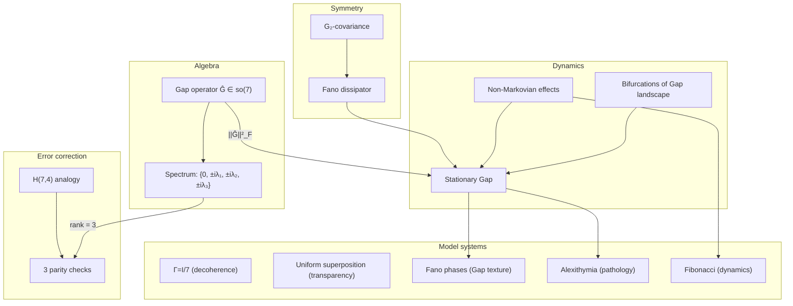

# Gap Dynamics

:::info Who this chapter is for
Dynamics of coherences: Choi–Jamiołkowski isomorphism, bifurcations, Hamming code. Familiarity with the [Gap operator](/docs/core/dynamics/gap-operator) and [Gap thermodynamics](/docs/core/dynamics/gap-thermodynamics) is assumed.
:::

This chapter is dedicated to **how the opaqueness** between the dimensions of a holon evolves. If the [Gap operator](/docs/core/dynamics/gap-operator) describes a "snapshot" of opaqueness, and [Gap thermodynamics](/docs/core/dynamics/gap-thermodynamics) describes the energy landscape, then this chapter answers the question: **how does the system move through this landscape over time?**

The reader will learn:
- How **self-modelling** $\varphi$ affects the Gap profile (via the Choi–Jamiołkowski isomorphism)
- Why a living system **must** preserve coherences (theorem on the necessity of generalized $\varphi$)
- How the **Hamming code H(7,4)** from information theory appears in the structure of Gap correction
- What **bifurcations** (sudden jumps) are possible in the Gap landscape
- How the **system's memory** generates damped Gap oscillations

:::tip Intuitive explanation
Let us return to the analogy with a **stained glass window**. In the [Gap operator](/docs/core/dynamics/gap-operator) we described how to measure the transparency of each panel. Now let us ask: **how does this transparency change over time?**

Imagine the stained glass is "alive" — it can change its transparency in response to light, temperature, and internal processes. Sometimes this change is smooth (a panel gradually becomes cloudy or clears). But sometimes **jumps** occur — a panel that has been cloudy for decades suddenly becomes transparent (an analogue of "insight"), or the reverse (an analogue of "trauma").

Particularly interesting is that a living stained glass has **memory**: past states influence current dynamics. Therefore, after an abrupt change (trauma), transparency **oscillates** — swings back and forth before settling in a new position (an analogue of "grief cycles").
:::

Gap dynamics describes the evolution of **opaqueness** between the dimensions of a holon. This document considers the bifurcation theory of the Gap landscape, non-Markovian memory effects, the connection with the Choi–Jamiołkowski isomorphism, the analogy with quantum error correction via the Hamming code H(7,4), and the $G_2$-covariance of the dissipator. The algebraic structure of the Gap operator is defined in the [Gap operator](/docs/core/dynamics/gap-operator).

---

## 1. Choi–Jamiołkowski isomorphism for φ {#чой-ямиолковский}

### 1.1 Definition (Choi state)

For a CPTP channel $\varphi: \mathcal{D}(\mathcal{H}) \to \mathcal{D}(\mathcal{H})$ the **Choi state** is defined as:

$$
J(\varphi) := (\varphi \otimes \mathrm{id})(|\Omega\rangle\langle\Omega|) \in \mathcal{L}(\mathcal{H} \otimes \mathcal{H})
$$

where the maximally entangled state is:

$$
|\Omega\rangle = \frac{1}{\sqrt{7}} \sum_{i=1}^{7} |i\rangle \otimes |i\rangle
$$

**Properties of the Choi state:**

| Property | Formulation | Consequence |
|----------|-------------|-------------|
| Dimension | $J(\varphi) \in \mathbb{C}^{49 \times 49}$ | Complete description of the channel |
| Hermiticity | $J(\varphi)^\dagger = J(\varphi)$ | Spectral decomposition exists |
| Positivity | $J(\varphi) \geq 0$ | Complete positivity of $\varphi$ |
| CPTP condition | $\mathrm{Tr}_1(J(\varphi)) = I/7$ | Trace preservation |
| Reconstruction | $\varphi(\Gamma) = 7 \cdot \mathrm{Tr}_2\left(J(\varphi) \cdot (\Gamma^T \otimes I)\right)$ | Channel recovery from Choi state |

### 1.2 Block structure and phase properties

:::tip Theorem 1.1 (Choi matrix and phase structure of φ) [Т]
**(a)** Block structure of the Choi matrix of canonical $\varphi$:

$$
J(\varphi)_{(ij),(kl)} = \frac{k}{7}\,\delta_{ij}\,\delta_{kl}\,\delta_{ik} + \frac{1-k}{7}\left[w_l \cdot \delta_{ij}\right]
$$

where $k$ is the compression parameter, $w_l$ are the anchor state weights.

**(b)** For $i \neq j$: $[\varphi(\Gamma)]_{ij} = 0$ — canonical $\varphi$ **destroys ALL coherences**.

**(c)** Target coherence: $\gamma^{\text{target}}_{ij} = 0$ for all $i \neq j$.
:::

The canonical form of φ (projection onto the diagonal) is the "ideal observer" — full decoherence. However, for a living system this is **unacceptable**.

### 1.3 Necessity of generalized φ

:::tip Theorem 1.2 (Necessity of generalized φ for viable Gap) [Т]
**(a)** Purity $P > P_{\text{crit}} = 2/7$ **requires** nonzero coherences $\gamma_{ij} \neq 0$ for some pairs $i \neq j$.

**(b)** If all $\gamma_{ij} = 0$ (for $i \neq j$), then $P = \sum_i \gamma_{ii}^2 \leq (\max_i \gamma_{ii})^2 + (1 - \max_i \gamma_{ii})^2 / 6$, and for a uniform distribution $P \approx 1/7 < P_{\text{crit}}$.

**(c)** Consequently, a living self-model **must** preserve coherences — the canonical decohering $\varphi$ is incompatible with viability.
:::

This motivates the transition to coherence-preserving $\varphi_{\text{coh}}$ via the [Fano structure](/docs/physics/gauge-symmetry/fano-selection-rules).

:::note Fano plane PG(2,2)
Projective plane over $\mathbb{F}_2$: 7 points and 7 lines, each line containing 3 points. In UHM: 7 points ↔ 7 dimensions, 7 lines ↔ 7 Fano triplets. More details: [Fano selection rules](/docs/physics/gauge-symmetry/fano-selection-rules).
:::

### 1.4 Phase structure of the target state

:::tip Theorem 1.3 (Phase structure of the target state) [Т]
The target phases of coherences are determined by the self-consistent equation:

$$
\theta_{ij}^{\text{target}} = \arg\left(\sum_{m,n} c_{mi}\, c_{nj}^*\, \gamma_{nm}\right)
$$

where $c_{mi}$ are the Kraus decomposition coefficients of the channel $\varphi$.
:::

**Consequences:**

- The target phase **depends** on the current state $\Gamma$ — feedback
- The self-consistent equation may have **multiple solutions** — there exist several stationary Gap profiles
- The selection of a specific solution is determined by initial conditions and the history of evolution

### 1.5 Self-consistency of the target phase

:::tip Theorem 1.4 (Self-consistency of the target Gap profile) [Т]
The target state $\rho_*$ satisfies the **fixed-point** condition of the self-modelling operator:

$$
\varphi(\rho_*) = \rho_*
$$

**(a)** The stationary solution of the evolution equation $\Gamma^{(\infty)}$ is modified compared to a fixed target state: $\theta^{\text{target}} = \theta^{\text{target}}(\Gamma^{(\infty)})$, which generates a **self-consistent equation** for the stationary phase.

**(b)** At level L4 (complete self-knowledge) this condition is satisfied exactly: $\varphi(\Gamma^*) = \Gamma^*$ means that the stationary Gap from the unified theorem ([section 7](#единая-теорема)) coincides with the target:

$$
\text{Gap}^{(\infty)} = |\sin(\theta^{\text{target}})| = |\sin(\theta^{(\infty)})| = \text{Gap}_{\text{actual}}
$$

**(c)** For levels L1–L3 self-consistency holds **approximately**, and the degree of deviation $\|\varphi(\Gamma) - \Gamma\|_F$ determines the accuracy of the Gap profile's awareness.
:::

:::warning Remark
The self-consistent equation $\varphi(\rho_*) = \rho_*$ may have **multiple solutions** — several stationary Gap profiles for the same system. Uniqueness of the solution is guaranteed only under sufficiently strong compression ($k < k_{\text{crit}}$), which excludes bifurcations ([section 3](#бифуркации)).
:::

---

## 2. Quantum error correction via Hamming code H(7,4) {#код-хэмминга}

#### Theorem H(7,4) — formal isomorphism [Т] {#теорема-h74-формальная}

:::tip Status [Т]
The structure of Lindblad operators $L_k = \sqrt{\chi_{S_k}}$ is isomorphic to the parity-check matrix of the Hamming code H(7,4) **[Т]**. The incidence "point $i \in$ line $k$" defines the matrix $H_{ki}$, which coincides exactly with the parity-check matrix of H(7,4) ($3 \times 7$, row weight 3, column weight 3). Isomorphism: $\mathrm{PG}(2,2) \cong H(7,4)$ — a classical result in coding theory.
:::

### 2.1 Structure of the code H(7,4)

The Hamming code H(7,4) is a linear code with parameters:
- **4 information bits** $\leftrightarrow$ A, S, D, L (structural dimensions)
- **3 parity bits** $\leftrightarrow$ E, O, U (metastructural dimensions)

Parity-check matrix:

$$
H = \begin{pmatrix}
1 & 0 & 1 & 0 & 1 & 0 & 1 \\
0 & 1 & 1 & 0 & 0 & 1 & 1 \\
0 & 0 & 0 & 1 & 1 & 1 & 1
\end{pmatrix}
$$

### 2.2 Analogy with UHM dimensions

| Hamming code | UHM | Role |
|-------------|-----|------|
| 4 information bits | A, S, D, L | Carry the "content" of the self-model |
| 3 parity bits | E, O, U | Ensure integrity / correction |
| Codeword | Gap profile | Admissible configuration |
| Bit error | Coherence violation | Self-modelling defect |
| Syndrome | E, O, U measurements | Violation diagnostics |

### 2.3 Coherence correction

:::tip Theorem 3.1 / T-93 (Coherence correction via H(7,4)) [Т]
**(a)** **Detection:** up to 2 coherence violations are detected via parity measurements (E, O, U).

**(b)** **Correction:** 1 coherence violation is **automatically** corrected by the regenerative operator $\mathcal{R}$.

**(c)** **Minimum distance:** $d = 3$ — the code corrects $\lfloor(d-1)/2\rfloor = 1$ error and detects $d - 1 = 2$.
:::

### 2.4 Quantum Hamming bound for Gap

:::tip Theorem 3.2 / T-93 (Quantum Hamming bound for Gap) [Т]
The number of simultaneously "transparent" channels (Gap $\approx 0$) is bounded above by:

$$
|\{(i,j): \text{Gap}(i,j) < \varepsilon\}| \leq 21 - \frac{21}{2^3 - 1} = 21 - 3 = 18
$$

where $r = 3$ is the number of parity-check bits of code H(7,4), and $2^r - 1 = 7$ is the code length, giving a lower bound on the number of "constrained" (parity-check) coherences.

A minimum of **3 coherences** out of 21 **must** have nonzero Gap. This corresponds to the 3 parity-check bits of H(7,4).
:::

**Interpretation:** Complete "transparency" between all pairs of dimensions is impossible — a structural constraint analogous to the Hamming bound guarantees minimal opaqueness. This is consistent with the fact that the stationary Gap profile always contains nonzero elements.

---

## 3. Bifurcation theory for Gap {#бифуркации}

### 3.1 Gap landscape

**Definition (Gap landscape):**

$$
\mathcal{G}: \mathcal{D}(\mathbb{C}^7) \to [0,1]^{21}
$$

maps the coherence matrix $\Gamma$ to a vector of 21 Gap values for all pairs $(i,j)$ with $i < j$.

### 3.2 Main bifurcations

:::tip Theorem 4.1 (Bifurcations of the Gap landscape) [Т]

**(a) Pitchfork bifurcation:**

$$
\text{Gap}^{(\infty)}(i,j;\, \mu) = \begin{cases}
\text{Gap}_0 & \text{for } \mu < \mu_c \\
\text{Gap}_0 \pm \sqrt{\mu - \mu_c} & \text{for } \mu > \mu_c
\end{cases}
$$

When the control parameter $\mu$ crosses the critical value, the unique stationary state splits into two.

**(b) Saddle-node bifurcation:**

The stationary Gap profile **disappears** at $\mu = \mu_{sn}$. Two stationary states (node + saddle) merge and annihilate.

**(c) Hopf bifurcation:**

The stationary Gap profile is replaced by an **oscillating** one:

$$
\text{Gap}(i,j;\, \tau) = \text{Gap}_0 + A(\mu) \sin(\omega_H \tau + \phi)
$$

where $A(\mu) \propto \sqrt{\mu - \mu_H}$ is the limit cycle amplitude, $\omega_H$ is the Hopf frequency.
:::

### 3.3 Interpretation of bifurcations

| Bifurcation | Psychological analogue | Clinical sign |
|------------|----------------------|---------------|
| Pitchfork | Existential choice | Moment of decision, irreversible change of Gap profile |
| Saddle-node | Acute crisis | Loss of stable Gap profile, disorientation |
| Hopf | Bipolar disorder | Cyclic alternation of Gap patterns |

### 3.4 Whitney catastrophes

:::tip Theorem 4.2 (Whitney catastrophes for the Gap landscape) [Т]
**(a)** $\dim = 1$: **fold** — disappearance of a stationary state. The system jumps to another basin of attraction.

**(b)** $\dim = 2$: **cusp** — bistability with hysteresis. The system can reside in one of two stable states; the transition between them is irreversible.
:::

**Consequence:**

- "Sudden insight": Gap $\approx 1 \to$ Gap $\approx 0$ **in a jump** — a fold catastrophe in reverse. Opaqueness between dimensions instantly disappears.
- "Sudden splitting": Gap $\approx 0 \to$ Gap $\approx 1$ **in a jump** — pitchfork bifurcation or fold. A previously transparent pair of dimensions becomes opaque.

---

## 4. Non-Markovian effects {#немарковские-эффекты}

### 4.1 Equation with memory kernel

**Definition (Non-Markovian Gap dynamics):**

$$
\frac{d\gamma_{ij}}{d\tau} = -i\Delta\omega_{ij}\,\gamma_{ij} + \int_0^\tau K_{ij}(\tau - s)\, \gamma_{ij}(s)\, ds + \mathcal{R}_{ij}
$$

where:
- $\Delta\omega_{ij} = \omega_i - \omega_j$ — frequency detuning between dimensions $i$ and $j$
- $K_{ij}(\tau - s)$ — **memory kernel**, describing non-Markovian effects
- $\mathcal{R}_{ij}$ — regenerative term

Unlike the Markovian approximation (where $K_{ij}(t) = -\Gamma_2 \delta(t)$ — instantaneous decoherence), the non-Markovian kernel allows **reverse information flow** from the environment into the system.

### 4.2 Gap oscillations with finite memory

#### Theorem 5.0 / T-94 (Exponential form of the memory kernel) [Т] {#теорема-ядро-экспоненциальное}

:::tip Formulation [Т]
The exponential form of the non-Markovian kernel $K(t) = -\Gamma_2 \omega_c e^{-\omega_c t}$ is a consequence of the compactness of the target space $(S^1)^{21}$ **[Т]**. On a compact torus the correlation function decomposes in eigenfunctions of the Laplacian; the minimal nonzero eigenvalue $\lambda_1 > 0$ (compactness!) determines $\omega_c = \lambda_1$ — the spectral gap. The exponential form is not a phenomenological assumption but a consequence of the discrete spectrum.

:::

:::tip Theorem 5.1 (Non-Markovian Gap oscillations) [Т]
For an exponential memory kernel $K(t) = -\Gamma_2 \omega_c \cdot e^{-\omega_c t}$ (justification of the form — [Theorem 5.0](#теорема-ядро-экспоненциальное) [Т]):

**(a)** Markovian limit ($\omega_c \to \infty$): standard exponential decoherence.

$$
\gamma_{ij}(\tau) \propto e^{-\Gamma_2 \tau}
$$

**(b)** Non-Markovian regime (finite $\omega_c$):

$$
\text{Gap}(i,j;\, \tau) = \text{Gap}^{(\infty)} + C \cdot e^{-\gamma\tau} \cos(\omega_r \tau)
$$

where $\omega_r = \sqrt{\omega_c \Gamma_2 - \gamma^2}$ is the damped oscillation frequency.

**(c)** For $\omega_c < \Gamma_2/4$: **overdamped** regime — no oscillations, purely exponential relaxation to the stationary state.
:::

:::info Discrete implementation [Т-135]
For a digital agent the non-Markovian kernel is discretized via Z-transform with $O(1)$ complexity per step (instead of $O(T^2)$): auxiliary variable $M[n]$ with recursion $M[n+1] = e^{-\omega_c\delta\tau}M[n] + (-\Gamma_2\omega_c)\Gamma[n+1]$. More details: [T-135 [Т]](/docs/proofs/consciousness/operationalization#t-135).
:::

### 4.3 Interpretation of non-Markovian effects

| Regime | Condition | Gap dynamics | Psychological analogue |
|--------|-----------|-------------|----------------------|
| Markovian | $\omega_c \gg \Gamma_2$ | Monotonic relaxation | Gradual forgetting |
| Oscillating | $\omega_c \sim \Gamma_2$ | Damped oscillations | "Flashes of clarity" during decoherence |
| Overdamped | $\omega_c < \Gamma_2/4$ | Slow relaxation | "Sticking" in a transient state |

**"Grief cycles"** — an example of non-Markovian Gap dynamics: after a trauma (abrupt change of the stationary value) Gap **oscillates** around the new stationary value before settling. The oscillation frequency $\omega_r$ is determined by the memory depth $\omega_c$ and decoherence rate $\Gamma_2$.

---

## 5. Gap operator: summary {#gap-оператор}

:::note Canonical definition
The complete definition of the Gap operator $\hat{\mathcal{G}} = \mathrm{Im}(\Gamma) \in \mathfrak{so}(7)$, its algebraic properties, spectral structure and opaqueness rank table are given in the [Gap operator](/docs/core/dynamics/gap-operator). Only a summary of the key results used in the dynamic sections is provided here.
:::

**Key results from the [Gap operator](/docs/core/dynamics/gap-operator):**

- $\hat{\mathcal{G}} \in \mathfrak{so}(7)$ — real antisymmetric matrix, $\mathrm{spec}(\hat{\mathcal{G}}) = \{0, \pm i\lambda_1, \pm i\lambda_2, \pm i\lambda_3\}$.
- **Total Gap:** $\mathcal{G}_{\text{total}} = \|\hat{\mathcal{G}}\|_F^2 = 2\sum_{i<j} |\gamma_{ij}|^2 \cdot \mathrm{Gap}(i,j)^2$ (see [norm convention](/docs/core/dynamics/gap-operator#g-total-definition)).
- **Connection with purity:** $P = P_{\text{sym}} + \mathcal{G}_{\text{total}}$ ([theorem 4.1](/docs/core/dynamics/gap-operator#связь-чистота)).
- **Spectral formula:** $\mathcal{G}_{\text{total}} = 2(\lambda_1^2 + \lambda_2^2 + \lambda_3^2)$ ([theorem 3.1](/docs/core/dynamics/gap-operator#спектр)).
- **Opaqueness rank** = number of nonzero $\lambda_k \in \{0, 1, 2, 3\}$; maximum rank 3 coincides with the number of parity checks of H(7,4) ([section 2](#код-хэмминга)).

---

## 6. $G_2$-covariance of the dissipator {#g2-ковариантность}

This section considers how the symmetry $G_2 = \mathrm{Aut}(\mathbb{O})$ interacts with dissipative dynamics. The detailed theory of $G_2$-structure is presented in [$G_2$-structure and Fano plane](/docs/physics/gauge-symmetry/g2-structure).

:::note DRY
Canonical proofs of $G_2$-covariance are in [Lindblad operators](/docs/core/operators/lindblad-operators#g2-ковариантность).
:::

### 6.1 Atomic dissipator breaks $G_2$

:::tip Theorem 11.1 (Atomic dissipator is NOT $G_2$-covariant) [Т]

$$
\exists g \in G_2:\quad \mathcal{D}_{\text{atom}}[g\Gamma g^\dagger] \neq g\,\mathcal{D}_{\text{atom}}[\Gamma]\,g^\dagger
$$

The diagonal projection (atomic observation) **does not commute** with $G_2$-transformations.
:::

### 6.2 Fano dissipator preserves $G_2$

:::tip Theorem 11.2 (Fano dissipator is $G_2$-covariant) [Т]

$$
\forall g \in G_2:\quad \mathcal{D}_{\text{Fano}}[g\Gamma g^\dagger] = g\,\mathcal{D}_{\text{Fano}}[\Gamma]\,g^\dagger
$$
:::

**Proof:** $G_2 = \mathrm{Aut}(\mathbb{O})$ preserves octonionic multiplication $\Rightarrow$ $g$ permutes Fano lines $\Rightarrow$ $g\Pi_p g^\dagger = \Pi_{\sigma_g(p)}$ $\Rightarrow$ the sum $\sum_p \Pi_p \Gamma \Pi_p$ is invariant under reindexing $\Rightarrow$ Fano dissipator is covariant. $\blacksquare$

### 6.3 Degree of $G_2$-violation

:::tip Theorem 11.3 (Degree of $G_2$-violation is proportional to $\alpha^*$) [Т]
**(a)** $\alpha = 0$ (pure Fano): **complete** $G_2$-covariance.

**(b)** $\alpha = 1$ (pure atomic): $G_2$ is **completely broken**.

**(c)** Intermediate values: $\Delta_{G_2}(\alpha^*) = \alpha^* \cdot \Delta_{\max}$

The measure of violation is **linear** in $\alpha$ — from the linearity of both channels.
:::

### 6.4 Modified gauge reduction

:::tip Theorem 11.4 (Modified gauge reduction) [Т]
**(a)** $\alpha = 0$: $48 - 14 = $ **34** independent parameters.

**(b)** Optimal $\alpha^*$: $34 + 14\alpha^*$ parameters.

**(c)** $\alpha = 1$: **48** parameters (full space).
:::

**Numerical examples:**

| System type | $P$ | $\alpha^*$ | Number of parameters | Reduction |
|------------|-----|-----------|---------------------|-----------|
| No self-knowledge (L0) | $\sim 1/7$ | $0$ | 34 | Maximum |
| Typical living (L2) | $\approx 0.5$ | $\approx 0.43$ | $\approx 40$ | Moderate |
| Highly coherent (L3) | $\approx 0.8$ | $\approx 0.64$ | $\approx 43$ | Weak |
| Complete self-knowledge (L4) | $1.0$ | $\approx 0.71$ | $\approx 44$ | Minimal |

**"The price of self-knowledge":** deeper self-knowledge $\to$ stronger $G_2$ violation $\to$ more parameters required to describe the system.

---

## 7. Unified theorem on self-observation and Gap {#единая-теорема}

:::note DRY
The canonical formulation is also in the [φ operator](/docs/core/operators/phi-operator#единая-теорема-самонаблюдения).
:::

:::tip Theorem 12.1 (Fano-coherent self-modelling) [Т]
The canonical coherence-preserving self-modelling for UHM is uniquely determined (up to the compression parameter $k$):

**(a) Algebraic structure:** The Fano plane $\mathrm{PG}(2,2)$ determines the compound atoms of the classifier $\Omega$, generating the Fano–Lindblad operators $L_p^{\text{Fano}}$.

**(b) Variational principle:** The balance of atomic and Fano observation $\alpha^*$ minimizes the functional:

$$
\mathcal{F} = S_{\text{spec}} + D_{KL}
$$

**(c) Phase properties:** Canonical $\varphi_{\text{coh}}$ **preserves** the phases of coherences. The target Gap coincides with the current Gap (amplitude scaling without phase distortion).

**(d) Symmetry:** $G_2$-covariance is partially broken by the atomic component. Degree of violation:

$$
\Delta_{G_2} = \alpha^* \cdot \Delta_{\max}
$$

**(e) Stationary Gap:**

$$
\text{Gap}^{(\infty)}(i,j) = \left|\sin\left(\theta_{ij} - \arctan\left(\frac{\Delta\omega_{ij}}{\Gamma_2 + \kappa}\right)\right)\right|
$$

where:
- $\theta_{ij}$ — phase of coherence $\gamma_{ij}$
- $\Delta\omega_{ij}$ — frequency detuning
- $\Gamma_2$ — decoherence rate
- $\kappa$ — regeneration rate
:::

**Physical meaning of stationary Gap:**

Even with phase-preserving $\varphi_{\text{coh}}$ the stationary Gap **differs** from the current one by the angle $\arctan(\Delta\omega/(\Gamma_2 + \kappa))$. This "shift" is caused by unitary rotation: the competition between free precession ($\Delta\omega$) and dissipative damping ($\Gamma_2 + \kappa$) generates stationary opaqueness even for pairs with initially zero Gap.

---

## 8. Model systems with exact Gap profiles {#модельные-системы}

Five analytically solvable configurations demonstrate the full spectrum of Gap profiles — from complete transparency to pathological opaqueness.

### 8.1 Model 1: Uniform system ($\Gamma = I/7$)

$$
\gamma_{ij} = \frac{1}{7}\delta_{ij}
$$

| Parameter | Value |
|-----------|-------|
| Coherences | All $\gamma_{ij} = 0$ for $i \neq j$ |
| Gap | Undefined (division by $\lvert\gamma_{ij}\rvert = 0$) |
| Purity | $P = 1/7$ (minimum) |

**Interpretation:** Fully decohered system. No connections between dimensions — no Gap. Corresponds to level L0 (no self-modelling).

### 8.2 Model 2: Pure state (uniform superposition)

$$
|\psi\rangle = \frac{1}{\sqrt{7}}\sum_{i=1}^{7} |i\rangle \quad \Rightarrow \quad \Gamma = |\psi\rangle\langle\psi|, \quad \gamma_{ij} = \frac{1}{7}
$$

| Parameter | Value |
|-----------|-------|
| Coherences | All $\gamma_{ij} = 1/7 \in \mathbb{R}$ |
| Gap | $\text{Gap}(i,j) = \lvert\sin(\arg(1/7))\rvert = \lvert\sin(0)\rvert = \mathbf{0}$ for all pairs |
| Purity | $P = 1$ (maximum) |

**Interpretation:** Ideal transparency. External = internal for all channels. All coherences are real — opaqueness rank 0 ([section 5](#gap-оператор)).

### 8.3 Model 3: Pure state with Fano phases

$$
|\psi\rangle = \frac{1}{\sqrt{7}}\sum_{i=1}^{7} e^{i\phi_i} |i\rangle \quad \Rightarrow \quad \gamma_{ij} = \frac{1}{7}e^{i(\phi_i - \phi_j)}
$$

- $|\gamma_{ij}| = 1/7$ for all pairs
- $\text{Gap}(i,j) = |\sin(\phi_i - \phi_j)|$
- $P = 1$

**Concrete example (phases from octonionic structure):**

Let $\phi_k = (k-1)\pi/7$, i.e. $\phi_1 = 0,\; \phi_2 = \pi/7,\; \phi_3 = 2\pi/7, \ldots, \phi_7 = 6\pi/7$.

| Pair | $\Delta\phi$ | Gap |
|------|:---:|:---:|
| A$\leftrightarrow$S | $\pi/7$ | $\sin(\pi/7) \approx 0.434$ |
| A$\leftrightarrow$D | $2\pi/7$ | $\sin(2\pi/7) \approx 0.782$ |
| A$\leftrightarrow$L | $3\pi/7$ | $\sin(3\pi/7) \approx 0.975$ |
| A$\leftrightarrow$E | $4\pi/7$ | $\sin(4\pi/7) \approx 0.975$ |
| A$\leftrightarrow$O | $5\pi/7$ | $\sin(5\pi/7) \approx 0.782$ |
| A$\leftrightarrow$U | $6\pi/7$ | $\sin(6\pi/7) \approx 0.434$ |
| S$\leftrightarrow$D | $\pi/7$ | $0.434$ |
| S$\leftrightarrow$L | $2\pi/7$ | $0.782$ |
| S$\leftrightarrow$E | $3\pi/7$ | $0.975$ |
| S$\leftrightarrow$O | $4\pi/7$ | $0.975$ |

:::info Observation
Gap grows monotonically with the "distance" between dimensions (in the sense of cyclic order). Neighboring dimensions are more transparent, distant ones more opaque. The A$\leftrightarrow$S connection (articulation–structure) is closer and more transparent than A$\leftrightarrow$L (articulation–logic).
:::

### 8.4 Model 4: Alexithymia ($\gamma_{SE} = |\gamma| \cdot e^{i\pi/2}$)

**Model of alexithymia** — pathological disconnection of S$\leftrightarrow$E (body–experience):

$$
\gamma_{SE} = |\gamma_{SE}| \cdot e^{i\pi/2}, \quad \text{remaining coherences} \in \mathbb{R}
$$

| Parameter | Value |
|-----------|-------|
| $\text{Gap}(S,E)$ | $\lvert\sin(\pi/2)\rvert = \mathbf{1}$ (maximum) |
| $\text{Gap}(i,j)$ for $(i,j) \neq (S,E)$ | $0$ |
| Opaqueness rank | 1 |

**Interpretation:** The body–experience connection **exists** ($|\gamma_{SE}| > 0$), but is completely opaque. The patient "feels" with the body but is not aware of the experience, and vice versa.

:::tip Hamming correction
Exactly 1 coherence is violated $\to$ by Theorem 3.1 ([section 2.3](#код-хэмминга)) the system can automatically correct via the $\varphi$-operator. **Therapeutic consequence:** restore one S$\leftrightarrow$E connection (somatic therapy), and the remaining coherences stabilize.
:::

### 8.5 Model 5: Fibonacci dynamics

Let $H_{\text{eff}}$ have eigenfrequencies from the Fibonacci sequence:

$$
\omega = (0,\; 1,\; 2,\; 3,\; 5,\; 8,\; 13) \quad \text{(normalized)}
$$

Difference frequencies $|\omega_i - \omega_j|$ determine Gap oscillations:

$$
\text{Gap}(i,j;\, \tau) = |\sin(\theta_{ij}(0) + (\omega_i - \omega_j)\tau)|
$$

**Dynamic properties:**

- Pairs with rational ratios $\Delta\omega / \Delta\omega'$ have **periodic** transparency windows.
- Pairs with irrational ratios $\Delta\omega / \Delta\omega'$ fill $[0,1]$ **ergodically** — Gap takes all values with equal probability.

:::info Remark (Golden ratio and Gap)
The golden ratio $\varphi_{\text{gold}} = (1+\sqrt{5})/2 \approx 1.618$ connects successive Fibonacci members. This means that for most pairs the difference frequencies are **irrationally related** to one another, and Gap **never** reaches exact zero. Complete transparency is a limit, not an achievable state.

If Fibonacci frequencies are indeed connected with biological rhythms (phyllotaxis, neuronal patterns), this is a speculative analogy not following from the UHM axioms. **Status: [И]** — interpretation/analogy.
:::

---

## 9. Connections with other sections {#связи}

### 9.1 Cross-references

| Topic | Document | Content |
|-------|----------|---------|
| Gap operator $\hat{\mathcal{G}}$ | [Gap operator](/docs/core/dynamics/gap-operator) | Definition of $\hat{\mathcal{G}}$, $\mathcal{G}_{\text{total}}$, spectrum, $G_2$-decomposition, stabilizers |
| Coherence matrix $\Gamma$ | [Coherence matrix](/docs/core/dynamics/coherence-matrix) | Definition of $\Gamma$, its properties and computation |
| Evolution equations | [Evolution of Γ](/docs/core/dynamics/evolution) | Full equation of motion, Liouvillian |
| Operator $\varphi$ | [φ operator](/docs/core/operators/phi-operator) | Master definition of self-modelling |
| Lindblad operators | [Lindblad operators](/docs/core/operators/lindblad-operators) | Derivation of $L_k$ from classifier $\Omega$ |
| $G_2$-structure | [$G_2$-structure](/docs/physics/gauge-symmetry/g2-structure) | Full theory of $G_2$-invariants and gauge reduction |
| Fano selection rules | [Fano selection rules](/docs/physics/gauge-symmetry/fano-selection-rules) | Yukawa texture and mass hierarchy |
| Gap thermodynamics | [Gap thermodynamics](/docs/core/dynamics/gap-thermodynamics) | Gap entropy, free energy of the Gap landscape |

### 9.2 Logic map

### 9.3 Status summary

| Result | Status | Section |
|--------|--------|---------|
| Choi matrix and phase structure of φ | **[Т]** | [1.2](#чой-ямиолковский) |
| Necessity of generalized φ for viability | **[Т]** | [1.3](#чой-ямиолковский) |
| Phase structure of the target state | **[Т]** | [1.4](#чой-ямиолковский) |
| Self-consistency of the target Gap profile | **[Т]** | [1.5](#чой-ямиолковский) |
| Coherence correction via H(7,4) | **[Т]** | [2.3](#код-хэмминга) |
| Quantum Hamming bound for Gap | **[Т]** | [2.4](#код-хэмминга) |
| Bifurcations of the Gap landscape | **[Т]** | [3.2](#бифуркации) |
| Whitney catastrophes for Gap | **[Т]** | [3.4](#бифуркации) |
| Exponential form of memory kernel K(t) | **[Т]** | [4.2](#теорема-ядро-экспоненциальное) |
| Non-Markovian Gap oscillations | **[Т]** | [4.2](#немарковские-эффекты) |
| Properties of Gap operator | **[Т]** | [Gap operator](/docs/core/dynamics/gap-operator#свойства) |
| Spectral interpretation of Gap | **[Т]** | [Gap operator](/docs/core/dynamics/gap-operator#спектр) |
| Atomic dissipator is not $G_2$-covariant | **[Т]** | [6.1](#g2-ковариантность) |
| Fano dissipator is $G_2$-covariant | **[Т]** | [6.2](#g2-ковариантность) |
| Degree of $G_2$-violation $\propto \alpha^*$ | **[Т]** | [6.3](#g2-ковариантность) |
| Modified gauge reduction | **[Т]** | [6.4](#g2-ковариантность) |
| Fano-coherent self-modelling (unified theorem) | **[Т]** | [7](#единая-теорема) |
| Model 1: Uniform system $\Gamma = I/7$ | **[Т]** | [8.1](#модельные-системы) |
| Model 2: Pure state (uniform superposition) | **[Т]** | [8.2](#модельные-системы) |
| Model 3: Pure state with Fano phases | **[Т]** | [8.3](#модельные-системы) |
| Model 4: Alexithymia ($\gamma_{SE} = \lvert\gamma\rvert \cdot e^{i\pi/2}$) | **[Т]** | [8.4](#модельные-системы) |
| Model 5: Fibonacci dynamics | **[Г]** | [8.5](#модельные-системы) |
| Coincidence of opaqueness rank and H(7,4) checks | **[Т]** | [Gap operator](/docs/core/dynamics/gap-operator#спектр) |

---

**Related documents:**
- [Gap operator](/docs/core/dynamics/gap-operator) — definition, spectrum and opaqueness rank
- [Gap thermodynamics](/docs/core/dynamics/gap-thermodynamics) — energy landscape, vacuum, potential V_Gap
- [Lindblad operators](/docs/core/operators/lindblad-operators) — dissipators and $G_2$-covariance
