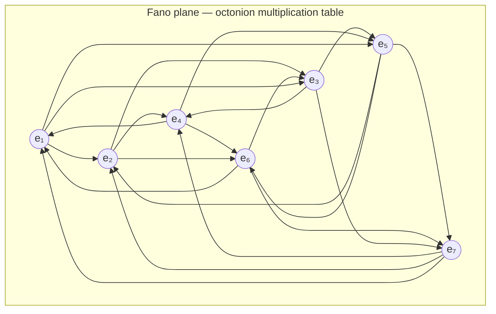
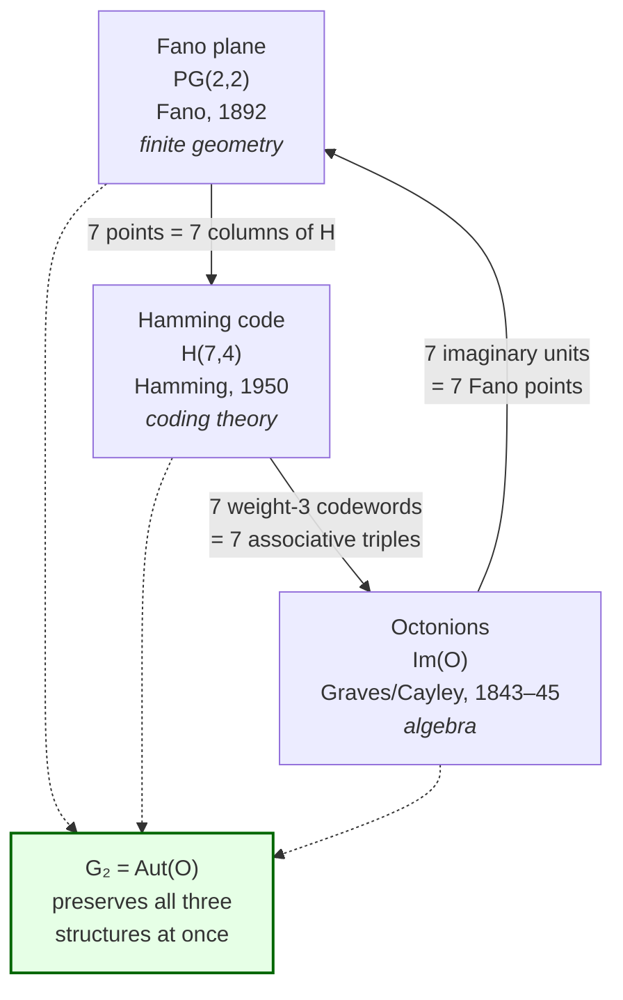

# Mathematical Foundations of the UHM

:::info Who this chapter is for
This chapter is the foundation on which the entire Unitary Holonomic Monism (UHM) is built. We trace a 150-year arc of mathematical thought—from the first abstract algebras of the 19th century to the $\infty$-toposes of the 21st—and show how each step was necessary to formulate the UHM.

**If you are not a mathematician**, do not be intimidated by the formulas. Every structure is accompanied by an analogy, a story of its creation, and an informal explanation. The point is to grasp the *logic*: why these 24 mathematical structures—and not others—turned out to be needed to describe consciousness.

**If you are a mathematician**, note the dependency tree (§1). Every structure answers three questions: what problem it solves, why *this* structure rather than an alternative, and what breaks in the theory if it is removed. None of the 24 is decorative.

**Key idea in one paragraph.** The UHM describes reality as an $\infty$-topos—a generalized “space” in which objects are tied together by an infinite hierarchy of relations. For that definition to work one needs: category theory (the language of relations), toposes (a world of coherent observations), the Bures metric (the canonical way to measure distance between quantum states), octonions (the source of the number 7), density matrices (quantum states), and open quantum dynamics (evolution). All of these tools were created independently over a century and a half—and all turned out to be necessary at once.
:::

> *“If I have seen further, it is by standing on the shoulders of giants.”* — Isaac Newton

What do an Irishman carving a formula into the stone of a bridge in 1843, a German schoolteacher classifying infinite groups in the solitude of a provincial town, a woman mathematician forbidden for four years to lecture under her own name, and an engineer annoyed by punch-card errors have in common? They are all builders of the foundation on which this theory rests.

The UHM is not invented from scratch. It is a synthesis of roughly twenty fundamental mathematical results produced over 150 years (1845–2009). Each is a **proved theorem** of classical mathematics, accepted by the mathematical community. None is a hypothesis or speculation. Each was created for a completely different purpose—and yet became a necessary brick in a building its creator never imagined.

This document is a **journey** through 150 years of mathematical thought. We follow each brick of the foundation: who made it, when, why, under what circumstances—and how it is used in the UHM. Behind every formula stands a specific person with a specific story, and those stories are part of the theory no less than the formulas themselves.

But the main thing is to see the **logic**: why each next structure appeared when it did, and why progress was impossible without it. Mathematics is not a warehouse of tools. It is a living history of questions and answers, in which each generation responds to a challenge left by the previous one. One of the most remarkable features of this history is that questions asked in the 19th century received answers only in the 21st, while answers given half a century ago turned out to be keys to locks nobody yet knew existed.

For each mathematical structure we answer three questions: (1) What **problem** does it solve? (2) Why **this** structure and not an alternative? (3) What **breaks** in the theory if it is removed? If any of the three lacks a clear answer, the structure is superfluous. None of the 24 structures below is superfluous.

---

## The great chain of ideas: from Cayley to Lurie {#великая-цепь}

Before diving into detail, it helps to grasp the big picture—a chronological thread tying 150 years of mathematics into one story.

**1843–1845: Numbers beyond imagination.** On 16 October 1843, William Hamilton, walking along the Royal Canal in Dublin, carved on Broom Bridge the formula $i^2 = j^2 = k^2 = ijk = -1$ in a flash of insight—thus quaternions were born. His friend John Graves, hearing of the discovery, asked whether one could go further. In December of the same year he wrote to Hamilton about octonions—8-dimensional numbers. Arthur Cayley, unaware of Graves’s work, independently published octonions in 1845, and his name has been attached to them ever since. The question hangs in the air: **how many times can one double?**

**1888–1898: The answer—a finite number of times.** Hurwitz proves: division algebras exist only in dimensions 1, 2, 4, and 8. Full stop. At the same time Killing and Cartan classify all simple Lie groups and discover five “exceptional” ones—fitting into no infinite series. The smallest, $G_2$, turns out to be the automorphism group of the octonions. The question: **what lies behind these exceptions?**

**1892: Seven points, seven lines.** Fano constructs the minimal finite projective plane—just 7 points and 7 lines, with remarkable symmetry. Half a century later it will turn out that this structure encodes the octonion multiplication table exactly.

**1918–1935: Symmetry as law, algebra as language.** Emmy Noether, overcoming resistance from an academy reluctant to recognize a woman mathematician, proves in 1918 the theorem that bears her name: every continuous symmetry yields a conserved quantity. This theorem is the bridge between geometry and physics that will connect $G_2$ symmetry with 14 physical charges. At the same time Noether creates abstract algebra—the theory of rings, ideals, modules—the language in which Grothendieck and Connes will later speak.

**1927: Salvaging non-associativity.** Artin proves that although octonions are non-associative, they enjoy **alternativity**: any subalgebra generated by two elements is associative. In other words, pairwise computation is safe. Without this result octonions would be unusable in physics.

**1932: Quantum formalization.** von Neumann—the “last universalist”—writes *Mathematische Grundlagen der Quantenmechanik*, turning quantum mechanics from a collection of recipes into a rigorous mathematical theory. The density matrix he introduces will become the central object of the UHM.

**1943: Space = algebra.** Gelfand and Naimark prove: a commutative $C^*$-algebra is **equivalent** to a topological space. This inverts the picture: not “space first, functions on it second,” but the opposite. Half a century later Connes uses this idea to derive spacetime from the algebra of observables.

**1945–1972: The categorical revolution.** Eilenberg and Mac Lane create category theory—the “language for describing languages.” Grothendieck uses this language to rebuild algebraic geometry: sheaves instead of points, toposes instead of spaces. Lawvere formalizes toposes as a universal foundation of logic and introduces the subobject classifier $\Omega$.

**1948–1950: Information as physics.** Shannon creates information theory. Hamming, annoyed by punch-card errors at Bell Labs, invents the $H(7,4)$ code—and its parity-check matrix is isomorphic to the Fano plane. Coincidence? No—a deep link between coding, projective geometry, and octonions.

**1960: A topological veto.** Adams, using state-of-the-art $K$-theory, proves: parallelizable spheres are only $S^0, S^1, S^3, S^7$. A topological confirmation of Hurwitz’s algebraic result. Two paths—one answer.

**1976–1996: Open systems and uniqueness.** Lindblad obtains the most general form of evolution for an open quantum system. Independently, Gorini–Kossakowski–Sudarshan (GKS) prove uniqueness of that form. Čencov and Petz prove uniqueness of the quantum metric. These results **close** the arbitrariness problem: both dynamics and the metric are uniquely fixed.

**1983: Time as illusion—or as relation?** Page and Wootters propose a radical solution to the “problem of time” in quantum gravity: time is not a backdrop on which physics unfolds but a **correlation** between subsystems. The universe as a whole is timeless; time arises inside it as a relation between “clocks” and “the rest.”

**1984: Memory without dynamics.** Berry discovers the geometric phase: a quantum system traversing a closed loop in parameter space “remembers” the path—even if it returns to its starting point. This topological memory will prove critical for the stability of coherences in the UHM.

**1982–2009: Geometry without space, toposes without finiteness.** Connes creates noncommutative geometry—a way to “see” space through algebra and the spectrum of the Dirac operator. Lurie generalizes Grothendieck’s toposes to $\infty$-toposes encoding all homotopical information. Two streams—algebraic and categorical—converge.

Each of these steps answered a concrete question of the previous generation. The UHM is a theory that **needs** all these answers at once, because it asks a question uniting them all: what is consciousness as a mathematical structure?

Notice a pattern: great mathematical revolutions often begin with a **renunciation** of what seemed obvious:

- Grothendieck renounced **points**—and obtained toposes
- Connes renounced **commutativity**—and obtained noncommutative geometry
- Lurie renounced **discreteness of morphisms**—and obtained $\infty$-toposes
- von Neumann renounced **definiteness of states**—and obtained density matrices
- Hurwitz renounced **associativity**—and discovered that the chain of algebras is finite
- Lindblad renounced **closedness of the system**—and obtained the unique form of dissipation

Each renunciation expanded the space of possibilities. Each was necessary for the UHM. A theory of consciousness requires all these renunciations at once: consciousness is not a point, not commutative, not discrete, not definite, not associative (in the sense of the octonionic interaction structure), and not closed.

---

## 1. Dependency tree {#дерево}

Before examining each item, consider the full picture: which mathematical structures feed which axioms and theorems of the UHM.

```mermaid
graph TD
    EM["Eilenberg, Mac Lane (1945)<br/>Category theory"] --> GR
    GR["Grothendieck (1957–72)<br/>Toposes, sheaves, sites"] --> LU
    LU["Lurie (2006/2009)<br/>∞-toposes"] --> A1["Axiom 1<br/>Sh∞(C)"]

    CH["Čencov (1978)<br/>Monotone metrics"] --> PE
    PE["Petz (1996)<br/>Bures = Petz-minimal"] --> A2["Axiom 2<br/>J_Bures"]

    CA["Cayley (1845)<br/>Octonions"] --> HU
    DI["Dickson (1919)<br/>Doubling of algebras"] --> HU
    HU["Hurwitz (1898)<br/>dim ∈ 1,2,4,8"] --> N7["Axiom 3<br/>N = 7"]
    AD["Adams (1960)<br/>S⁰,S¹,S³,S⁷"] --> N7
    FA["Fano (1892)<br/>PG(2,2)"] --> G2S["G₂ structure<br/>14 charges"]
    KC["Killing, Cartan (1890s)<br/>G₂ = Aut(O)"] --> G2S

    PW["Page, Wootters (1983)<br/>Internal time"] --> A5["Axiom 5<br/>Page–Wootters"]

    LI["Lindblad (1976)<br/>Open systems"] --> EV["Γ evolution<br/>ℒ₀ + ℛ"]
    GKS["GKS (1976)<br/>CPTP semigroups"] --> EV
    VN["von Neumann (1932)<br/>ρ, equation"] --> LI

    GN["Gelfand, Naimark (1943)<br/>C*-algebras"] --> CO
    CO["Connes (1990–96)<br/>Spectral triples"] --> M4["T-117..T-121<br/>Derivation of M⁴"]

    HA["Hamming (1950)<br/>H(7,4)"] --> HC["4+3 code<br/>Self-correction"]
    NO["Noether (1918)<br/>Symmetry → law"] --> G2S
    PF["Perron, Frobenius<br/>Primitivity"] --> PR["T-39a<br/>Unique ρ*"]

    LW["Lawvere (1964–69)<br/>Classifier Ω"] --> LK["L_k from Ω<br/>Lindblad operators"]
    LW --> PHI["φ operator<br/>Self-modeling"]

    style A1 fill:#e6f3ff,stroke:#0066cc
    style A2 fill:#e6f3ff,stroke:#0066cc
    style N7 fill:#e6f3ff,stroke:#0066cc
    style A5 fill:#e6f3ff,stroke:#0066cc
    style EV fill:#ffe6e6,stroke:#cc0000
    style M4 fill:#ffe6e6,stroke:#cc0000
    style G2S fill:#e6ffe6,stroke:#006600
```

**Legend:** blue blocks—UHM axioms; red—key theorems; green—physical consequences.

---

## 2. Category theory: from Eilenberg to $\infty$-toposes {#теория-категорий}

The first pillar of the foundation is the **language** in which the theory is written. That language is not ordinary mathematical notation (sets, formulas, equations) but category theory—an abstract formalism describing **relations** between objects rather than the objects themselves. The choice of language is not stylistic but substantive: the categorical language naturally describes quantum states, their transformations, and self-referential structures, whereas set-theoretic language is ill-suited for these purposes.

### 2.1 Eilenberg and Mac Lane (1942–1945) {#эйленберг-маклейн}

**Who.** Samuel Eilenberg (1913–1998)—Polish–American mathematician who fled Poland in 1939, shortly before the German invasion. Saunders Mac Lane (1909–2005)—American mathematician who studied in Göttingen under Bernays and Weyl.

**What they did.** Eilenberg and Mac Lane faced a concrete problem: in algebraic topology the same constructions (homology, cohomology, homotopy groups) kept reappearing in different contexts, and each time the same properties had to be proved anew. They needed a **single language** in which all these constructions are special cases of one general pattern. Thus **category theory** was born: a description of mathematical structures through **objects** and **arrows** (morphisms) between them.

At first colleagues greeted the new formalism skeptically. Category theory was called “abstract nonsense”—and the nickname stuck, though over time it turned from mockery into a term of respect.

**Analogy.** Imagine that all cities are “objects” and all roads between them are “arrows.” Category theory studies not particular cities and roads but general patterns: if there is a road from A to B and from B to C, then there is a route from A to C (composition). Instead of studying each object in isolation, we study **relations** between objects. The analogy goes deeper: category theory asserts that an object is **fully determined** by its relations to other objects. A city is its roads. A density matrix is its transformations. There is no “inner essence” not expressible through morphisms.

**Formally.** A category $\mathcal{C}$ consists of:
- A class of objects $\mathrm{Ob}(\mathcal{C})$
- For each pair of objects $A, B$, a set of morphisms $\mathrm{Hom}(A, B)$
- Composition $\circ: \mathrm{Hom}(A,B) \times \mathrm{Hom}(B,C) \to \mathrm{Hom}(A,C)$ (associative)
- Identity morphisms $\mathrm{id}_A \in \mathrm{Hom}(A,A)$ for each object

**Role in the UHM.** The entire theory is formulated in the language of categories. The concrete category underlying the UHM is:

**The category $\mathcal{C} = \mathbf{QState}_7$:**
- **Objects:** density matrices $\Gamma \in \mathcal{D}(\mathbb{C}^7)$—Hermitian positive semidefinite $7 \times 7$ matrices with unit trace: $\Gamma^\dagger = \Gamma$, $\Gamma \geq 0$, $\mathrm{Tr}(\Gamma) = 1$
- **Morphisms:** CPTP maps (Completely Positive, Trace-Preserving) $\Phi: \mathcal{D}(\mathbb{C}^7) \to \mathcal{D}(\mathbb{C}^7)$—quantum channels preserving physicality of states
- **Composition:** $\Phi_2 \circ \Phi_1$—sequential application of two channels (associative by definition)
- **Identity:** $\mathrm{id}_\Gamma$—the identity channel leaving the state unchanged

Why CPTP and not arbitrary linear maps? Because CPTP is the unique class of maps preserving all physical properties of a density matrix: Hermiticity (observables are real), positive semidefiniteness (probabilities are nonnegative), unit trace (probabilities sum to 1). Any map violating even one of these produces physically meaningless states (negative probabilities, unnormalized distributions).

**Terminal object** $T = I/7$—the maximally mixed state (uniform distribution over all 7 dimensions). Terminality holds in the **unital-channel refinement** of the morphism structure: with morphisms restricted to *unital* CPTP maps (those fixing $I/7$), reachability is exactly **majorization** ($\sigma \prec \rho$, Uhlmann), $I/7$ is the unique sink (no unital channel leaves it), and the dissipative flow $e^{\tau\mathcal{L}_0}$ is the canonical trajectory to it. (In the *full* CPTP category $T=I/7$ is **not** terminal — the constant channel $X\mapsto\mathrm{Tr}(X)\,\Gamma'$ maps every state to any $\Gamma'$, so morphisms into a state are neither unique nor into $I/7$ only; the second-law/arrow-of-time reading requires the unital refinement.) $T$ is the endpoint of all *dissipative* trajectories when regeneration $\mathcal{R}$ is switched off.

Besides objects and morphisms, **functors**—“maps between categories” preserving structure—play a fundamental role. A concrete example: the **forgetful functor** $U: \mathbf{QState}_7 \to \mathbf{Vect}$, which assigns to each density matrix a linear space, “forgetting” the conditions $\Gamma \geq 0$ and $\mathrm{Tr}(\Gamma) = 1$. This functor lets linear algebra be applied to quantum states—but the price of “forgetting” is that results must be checked for physicality.

An even more important notion is a **natural transformation**: a “morphism between functors.” If $F, G: \mathcal{C} \to \mathcal{D}$ are two functors, a natural transformation $\eta: F \Rightarrow G$ is a family of morphisms $\eta_A: F(A) \to G(A)$ (one for each object $A$) compatible with morphisms in $\mathcal{C}$. In the UHM: two different ways of “observing” the system (two functors $F,G$) are tied by a natural transformation if the passage from one observation to the other does not depend on the particular state $\Gamma$. This formalizes **gauge invariance**: physics should not depend on the choice of description.

Without categorical language the UHM is impossible. But Eilenberg and Mac Lane provided only the **language**. To build a whole world in that language, Grothendieck was needed.

### 2.2 Grothendieck (1957–1972) {#гротендик}

**Who.** Alexander Grothendieck (1928–2014)—one of the greatest mathematicians of the 20th century. Son of anarchists: his father Alexander Shapiro, from the Russian Empire, died in Auschwitz in 1942; his mother Hanka Grothendieck was a German journalist. Alexander’s childhood was spent in internment camps in Vichy France. After the war—stateless, penniless, without connections—he entered mathematics and in 15 years rebuilt it from the foundations.

Grothendieck worked with inhuman intensity. Over 12 years (1957–1969) he published thousands of pages, rewrote the foundations of algebraic geometry, and founded a school that shaped mathematics for decades. In 1966 he received the Fields Medal but refused to travel to Moscow for the ceremony in protest at the Soviet invasion of Czechoslovakia (1968, even before the official ceremony). In 1970 he left the Institut des Hautes Études Scientifiques (IHES) in protest at military funding. In later years he wrote *Récoltes et Semailles* (1985–1987)—over 1,000 pages of mathematical and human reflection analyzing not only his discoveries but the nature of mathematical creativity, relations with students, and his estrangement from the academic world. He also wrote *Esquisse d’un Programme* (1984)—a visionary text proposing the Teichmüller tower, *dessins d’enfants*, and other ideas decades ahead of their time. He spent the last two decades of his life as a recluse in the village of Lasserre at the foot of the Pyrenees, refusing contact with the mathematical world. He died in 2014, leaving tens of thousands of pages of unpublished manuscripts.

**What he did.** Grothendieck sought to prove the **Weil conjectures**—a series of statements about algebraic varieties over finite fields linking topology and arithmetic. For this he had to generalize the very notion of **space**. Ordinary topology (open sets) proved too weak for algebraic objects in characteristic $p$. Grothendieck took a radical step: instead of studying **points** of a space he studied **categories of covers**—which “families of observers” can jointly describe an object. Thus were born **sites** (categories with a topology), **sheaves** (coherent local data), and **toposes** (categories of sheaves). The monumental SGA (*Séminaire de Géométrie Algébrique*, 1960–1967)—12 seminar volumes the community took decades to absorb.

Grothendieck’s revolution was not accepted overnight. Many mathematicians found his approach excessively abstract. Yet that abstraction proved **necessary**: without it one cannot correctly define what it means to “observe locally” a quantum state.

**Analogy.** You do not know what a room looks like, but you have photographs from different angles. If the photographs are coherent (intersections agree), you can reconstruct the room. Grothendieck formalized this: a sheaf is “coherent local data,” and the **topology** on the category specifies which “angles” suffice for a full description. The analogy has an important limit: unlike photographs, sheaves in a topos can be “observations” not reducible to classical values—they may carry quantum information. This is what makes Grothendieck’s sheaves suitable for quantum theory whereas ordinary topology is not.

**Formally.** A Grothendieck topology $J$ on a category $\mathcal{C}$ assigns to each object $U$ a collection of families of morphisms $\{U_i \to U\}$ (covers) satisfying three axioms:

1. **Stability** (closure under base change): if $\{U_i \to U\}$ is a cover and $V \to U$ is any morphism, then $\{U_i \times_U V \to V\}$ is also a cover. Informally: if you have a good set of photos of a room and you move to an adjacent room (base change), you can obtain a good set of photos there too.
2. **Transitivity** (composition of covers): if $\{U_i \to U\}$ is a cover and for each $i$ covers $\{V_{ij} \to U_i\}$ are given, then $\{V_{ij} \to U\}$ is a cover. If you photograph a wall and then zoom in on each patch—the zoomed photos still cover the whole wall.
3. **Maximality**: the singleton $\{U \xrightarrow{\mathrm{id}} U\}$ is a cover. A “full-length photo” is trivially a good cover.

A **sheaf** $\mathcal{F}$ on a site $(\mathcal{C}, J)$ is a contravariant functor $\mathcal{F}: \mathcal{C}^{op} \to \mathbf{Set}$ satisfying the **gluing condition**: if $\{U_i \to U\}$ is a cover and sections $s_i \in \mathcal{F}(U_i)$ agree on overlaps ($s_i|_{U_i \times_U U_j} = s_j|_{U_i \times_U U_j}$), then there is a unique $s \in \mathcal{F}(U)$ with $s|_{U_i} = s_i$. In plain terms: coherent local observations determine a unique global section.

A **topos** is the category of all sheaves: $\mathbf{Sh}(\mathcal{C}, J)$. It is the “world” in which coherent observations live. That world has its own logic (subobject classifier $\Omega$), its own arithmetic (natural numbers object), and its own “spaces”—all derived from the structure of covers.

**Concrete UHM example.** Take $\mathcal{C} = \mathbf{QState}_7$. An object is $\Gamma \in \mathcal{D}(\mathbb{C}^7)$. A cover $\{U_i \to \Gamma\}$ is a family of CPTP channels “sufficient to recover” $\Gamma$. The topology $J_{Bures}$: a family $\{U_i\}$ is a cover if Bures balls around the $U_i$ cover a neighborhood of $\Gamma$. A sheaf $\mathcal{F}$ assigns to each state a set of “observable properties” coherent when passing from one state to a neighboring one. The subobject classifier $\Omega$ of this topos yields the projectors $|k\rangle\langle k|$—the Lindblad operators.

**Role in the UHM.** **Axiom 2**: the Grothendieck topology $J$ on the category of density matrices is induced by the Bures metric $d_B$. Covers fix when two states $\Gamma_1, \Gamma_2$ are distinguishable. This is not an arbitrary choice: the Bures metric is the **canonically selected** (Petz-minimal / extremal) member of the monotone-metric family — see [§4.5](#ченцов-петц) and [T-187](/docs/reference/status-registry). Crucially, all members of the Petz family are **bi-Lipschitz equivalent** on the compact $\mathcal{D}(\mathbb{C}^7)$, so they induce the **same** Grothendieck topology $J$, the same sheaves, and Petz-robust physics — the theory does **not** depend on the choice within the family, and Bures is the distinguished representative. See [Axiom Omega-7](./axiom-omega).

**Without Grothendieck’s toposes** in the UHM: one cannot define “local observation” of a quantum state. Ordinary topology (open sets) requires observables to be **continuous functions**—but quantum observables need not be continuous in the usual sense (projection measurements are discontinuous). Grothendieck topology fixes this by replacing “open sets” with “covers”—families of morphisms that may be discontinuous pointwise yet categorically coherent. Without this notion one cannot define a sheaf on $\mathcal{D}(\mathbb{C}^7)$—hence neither the subobject classifier $\Omega$, nor the operators $L_k$, nor the full dynamics.

Grothendieck supplied language and structure. But his toposes were “flat”: morphisms between objects were mere arrows with no internal structure. Two morphisms are either equal or not—*tertium non datur*. For quantum theory, where relations between states themselves carry nontrivial geometry (gauge equivalences, homotopies between paths in state space), that is insufficient. Another 37 years passed before Lurie generalized Grothendieck’s toposes to the infinite case.

Interestingly, Grothendieck himself foreshadowed this need. In *Poursuivant les champs* (1983) he introduced $\infty$-groupoids and sketched a program of “homotopical algebra” later realized by Lurie.

### 2.3 Lawvere and the subobject classifier (1964–1969) {#лавёр-классификатор}

Grothendieck built toposes as a tool for algebraic geometry. In parallel, other mathematicians saw in toposes something larger—**universal logic**.

**Who.** William Lawvere (1937–2023)—American mathematician, founder of elementary topos theory. Lawvere belonged to the generation that received Grothendieck’s ideas not merely as a tool for algebraic geometry but as a **foundation of mathematics**—an alternative to Zermelo–Fraenkel set theory. Myles Tierney (1937–2017) was his closest collaborator; together they laid the basis of elementary toposes.

**What they did.** In his landmark 1964 paper *An Elementary Theory of the Category of Sets* and in the subsequent series with Tierney (1969–1972), Lawvere developed the fundamental notion of the **subobject classifier** $\Omega$. They showed that every topos has an object $\Omega$ playing the role of a “set of truth values.” In ordinary set theory $\Omega = \{0, 1\}$ (true/false). In a topos $\Omega$ can be richer—intuitionistic logic with more than two “degrees of truth.”

:::note[Historical note]
In early versions of this document the subobject classifier $\Omega$ was mistakenly attributed to Jean Giraud (1936–2007). Giraud made an important contribution to topos theory—his theorem characterizes Grothendieck categories by exactness conditions (finite coproducts, effective equivalence relations). However, the **subobject classifier** $\Omega$ and the logic it encodes are due to **Lawvere** (1964) and **Lawvere–Tierney** (1969–1972). It was Lawvere who saw in a topos not only a geometric but a **logical** object, and it is the notion of $\Omega$ that became the bridge from logic to Lindblad operators in the UHM.
:::

**Analogy.** In classical logic every statement is either true or false—two values. In a topos there can be many “degrees of truth,” and $\Omega$ is the object embodying them. Each “subobject” (part of an object) is given by a “characteristic morphism” into $\Omega$, much as a subset $A \subseteq X$ is given by $\chi_A: X \to \{0,1\}$. The limit of the analogy matters: $\Omega$ is **not** a set of numbers from 0 to 1 (that would be fuzzy logic). $\Omega$ is a full-fledged object inside the topos with its own algebraic structure. That structure yields the operators $L_k$ in the UHM.

**Formally.** For every monomorphism $m: S \hookrightarrow X$ there is a unique characteristic morphism $\chi_S: X \to \Omega$ such that $S$ is the pullback of $\chi_S$ along the “truth” morphism $\top: 1 \to \Omega$.

**Role in the UHM.** From the subobject classifier $\Omega$ in $\mathbf{Sh}_\infty(\mathcal{C})$ one derives **atoms of subobjects**—canonical predicates $S_k = |k\rangle\langle k|$. The characteristic morphisms $\chi_{S_k}$ admit an operator realization as **Lindblad operators** $L_k$ [T]. Thus dissipative dynamics is not a postulate but a consequence of the logical structure of the topos. This is one of the most surprising results of the UHM: **physical dissipation follows from logic**. See [Axiom Omega-7: $L_k$ from $\Omega$](./axiom-omega#lk-из-omega), [Lindblad operators](../operators/lindblad-operators).

### 2.4 Lawvere: self-reference (1969) {#лавёр}

If the previous section showed how Lawvere gave the topos **logic**, here he gives it **self-reference**—perhaps his deepest contribution, because self-reference lies at the heart of some of the hardest problems in mathematics and philosophy.

**Prehistory: the paradox of self-reference.** “Can an eye see itself?”—a question that troubled philosophers from Plato to Wittgenstein. In mathematics it took the form of **Gödel’s incompleteness theorem** (1931): a sufficiently strong formal system cannot fully describe itself. Self-modeling would seem hopeless. Yet Lawvere showed something remarkable: **in the categorical world** self-modeling is not only possible but **inevitable**.

The difference from Gödel is the level of abstraction. Gödel worked with syntactic systems (formulas, proofs). Lawvere works with **structures** (objects, morphisms). Gödelian incompleteness says: “the system cannot prove all truths about itself.” Lawvere’s theorem says: “the system can contain its structural model—and that model has a fixed point.” This is not a contradiction: self-modeling is not the same as self-proof.

**What he did.** Lawvere developed categorical semantics: he showed how algebraic theories generate categories of models. The key result for the UHM is **Lawvere’s fixed-point theorem**: in an elementary topos, certain endomorphisms admit fixed points. Informally: if a system can model itself, there exists a state in which the model **coincides** with the original.

**Formally.** Let $\varphi: \mathrm{Ob}(\mathcal{C}) \to \mathrm{Ob}(\mathcal{C})$ be an endofunctor (structure-preserving map). If $\mathcal{C}$ is an elementary topos and $\varphi$ satisfies suitable continuity properties (preserves colimits), then there exists an object $\Gamma^*$ with $\varphi(\Gamma^*) \cong \Gamma^*$—a **fixed point**.

**Analogy.** If you stand before a mirror with another mirror behind you, you see an infinite regress of reflections: reflection of reflection of reflection… Lawvere’s theorem guarantees that such a recursion “settles”—there is a stable picture (a fixed point). What makes the theorem special is not merely “a fixed point exists” (Banach’s contraction principle would say that too). It says: “**in the world of categories** self-modeling is not exotic but a standard operation, and its result is structurally determined.”

Important: the theorem does **not** say the fixed point is **unique**—only that **at least one** exists. Uniqueness in the UHM is supplied additionally via operator primitivity (Perron–Frobenius theorem, [§7.3](#перрон-фробениус)).

**Concrete UHM example.** The $\varphi$-operator is a CPTP channel of self-modeling. In canonical form [T]:

$$
\varphi_k(\Gamma) = (1 - k)\Gamma + k\rho^*
$$

where $k = 1 - R$ is a compression parameter ($R$ is the [reflection measure](/docs/consciousness/foundations/self-observation#мера-рефлексии-r)) and $\rho^*$ is a target state. Fixed point: $\varphi_k(\Gamma^*) = \Gamma^*$, hence $(1-k)\Gamma^* + k\rho^* = \Gamma^*$, so $k(\rho^* - \Gamma^*) = 0$. If $k \neq 0$: $\Gamma^* = \rho^*$—the model coincides with the original. If $k = 0$ ($R = 1$, perfect reflection): every $\Gamma$ is a fixed point (a perfect mirror reflects everything). If $k = 1$ ($R = 0$, no reflection): $\varphi(\Gamma) = \rho^*$ for all $\Gamma$—the model does not depend on the original (a blind mirror always shows the same thing).

**Without Lawvere’s theorem** in the UHM: the operator $\varphi$ would be an **arbitrary construction**—we could define it but could not justify its *necessity*. Lawvere proves: if your theory lives in a topos, self-modeling is not optional but **inevitable**. This is fundamental: the $\varphi$-operator in the UHM is not an “added feature” but a **forced structure** whose existence follows from formulating the theory in the language of toposes.

**Role in the UHM.** Categorical necessity of the self-modeling operator $\varphi$. See [self-modeling $\phi$-operator](../operators/phi-operator), [Formalization of the $\phi$-operator](/docs/proofs/categorical/formalization-phi).

By the early 2000s the categorical foundation was in place: language (Eilenberg–Mac Lane), spaces (Grothendieck), logic and self-reference (Lawvere–Tierney). Three levels of abstraction, each needed for the UHM: without language one cannot formulate; without spaces one cannot define “local observation”; without logic one cannot derive Lindblad operators; without self-reference one cannot justify the self-modeling operator.

But a serious problem remained: Grothendieck’s toposes were “flat”—relations between objects had no internal structure. Two morphisms between the same objects are either equal or not—no third option. For physics, where **gauge equivalences** and **homotopies** are central, one must pass to the infinite-dimensional case. Two states of consciousness can be “equivalent” in one sense and “distinct” in another; distinctions between equivalences themselves form structure—and so on to infinity. An ordinary topos cannot capture this infinite hierarchy; an $\infty$-topos can.

### 2.5 Lurie (2006/2009) {#лурье}

**Who.** Jacob Lurie (b. 1977)—American mathematician, among the most influential of his generation. A prodigy: in 2000 he received his PhD from MIT at age 23 (advisor Michael Hopkins). In 2007 he became a professor at Harvard, and in 2009 one of the youngest professors in its history. The monograph *Higher Topos Theory* (925 pages) was largely written during graduate school; an early version appeared on arXiv in 2006 (math/0608040), and the book was published by Princeton University Press in 2009. In 2019 Lurie left Harvard for the Institute for Advanced Study (IAS) in Princeton—the same institute where Gödel and Einstein worked.

**What he did.** Lurie completed the program begun by Grothendieck, pushing it to a logical extreme. Grothendieck’s toposes work with ordinary categories: between two objects there either is a morphism or there is not. But in modern mathematics and physics **relations between relations** are fundamental: two arrows may be “equivalent” up to homotopy, which is itself defined up to higher homotopy, and so on. Lurie created the theory of **$\infty$-toposes**—a generalization of Grothendieck toposes in which ordinary categories are replaced by $(\infty,1)$-categories and **sets** of morphisms by **spaces** of morphisms (with nontrivial homotopy structure).

**Analogy.** An ordinary category is a “city with roads.” An $\infty$-category is a “city with roads, alleys between roads, passages between alleys, and so on to infinity.” Each level records how the connections of the previous level are related. Why does this matter? In quantum theory two states can be “physically the same” (gauge equivalent) yet admit several ways of identifying them, and the choice among those ways is itself physical information. An ordinary topos loses that information; an $\infty$-topos retains it.

**Formally.** An $\infty$-topos is an $(\infty,1)$-category equivalent to a left exact localization of $\mathbf{PSh}_\infty(\mathcal{C})$—the category of presheaves of $\infty$-groupoids on a small $(\infty,1)$-category $\mathcal{C}$. In particular, $\mathbf{Sh}_\infty(\mathcal{C}, J)$ is the $\infty$-category of sheaves on the site $(\mathcal{C}, J)$.

**Role in the UHM.** The **sole primitive** of the theory is $\mathfrak{T} := \mathbf{Sh}_\infty(\mathcal{C}, J_{\text{Bures}})$. Axiom 1 postulates that reality is described by an $\infty$-topos of sheaves. Lurie’s comparison theorem ensures independence from the choice of site presentation—much as in ordinary physics laws do not depend on the coordinate system. Without $\infty$-toposes the UHM would depend on a specific presentation of the category $\mathcal{C}$, the analogue of a “privileged frame of reference”—physically unacceptable. See [Axiom Omega-7: structured primitive](./axiom-omega#примитив).

**Without Lurie’s $\infty$-toposes** in the UHM: ordinary Grothendieck toposes do not distinguish two morphisms that are “almost the same but not quite”—two CPTP channels differing by a gauge transformation would be counted either “identical” or “distinct” with no intermediate gradations. That is a loss of information: the gauge structure $G_2$ requires distinguishing **ways of identifying** equivalent states. In an $\infty$-topos these “ways of identification” themselves form a space—a homotopy type—and its nontriviality yields nerve cohomology $H^*_{\text{loc}}(X, T) \cong \tilde{H}^{*-1}(S^6)$ responsible for nontrivial physics (interiority, Gap structure, gauge charges). Without $\infty$-structure the theory would be “flat”—mathematically consistent but physically empty.

---

The categorical foundation is the **language** and **logic** of the theory. Toposes fix how to observe, sheaves how to glue local observations, $\Omega$ how to derive operators. But language does not fix **dimension**—how many dimensions the state space of consciousness has. An $\infty$-topos works in **any** dimension; it does not care whether you have 3 or 300.

Answering the dimension question requires a quite different branch of mathematics, rooted in the 19th century—the algebra of hypercomplex numbers.

## 3. Algebra: octonions and exceptional structures {#алгебра}

The second pillar is the **dimension** of the state space. Why $N = 7$ rather than 3, 10, or 42? In most theories of consciousness dimension is taken “from experience” or left undefined altogether (IIT allows an arbitrary number of elements; global workspace theory does not fix dimension). The UHM claims: dimension is **derived** from algebraic constraints, and the answer is unique.

That answer comes from the algebra of hypercomplex numbers—a branch of mathematics born in the romantic era when Hamilton, Graves, and Cayley tried to generalize number beyond the complex plane. Their discoveries—quaternions and octonions—looked like mathematical curiosities. A century and a half passed before it became clear that these “curiosities” are keys to the structure of reality.

### 3.1 Cayley and Graves (1843–1845) {#кэли}

The story begins with one of the most romantic episodes in mathematics.

On 16 October 1843 William Rowan Hamilton walked with his wife along the Royal Canal in Dublin, bound for a meeting of the Royal Irish Academy. For 15 years he had wrestled with a problem: how to generalize complex numbers to three dimensions? Complex numbers are pairs $(a,b)$ with multiplication $(a,b)(c,d) = (ac-bd, ad+bc)$. Can one do the same for triples? The answer is no (as Hurwitz would later prove). Hamilton did not yet know this, but that October day it struck him: one needs not triples but **quadruples**! He carved on Broom Bridge the famous formula $i^2 = j^2 = k^2 = ijk = -1$. Thus were born **quaternions**—four-dimensional numbers in which multiplication is **noncommutative**: $ij = k$ but $ji = -k$.

Hamilton’s friend John Graves, learning of quaternions, asked: what if one goes further? Already in December 1843 he wrote to Hamilton about **octonions**—eight-dimensional numbers losing not only commutativity but also **associativity**: $(ab)c \neq a(bc)$. Graves did not publish, and two years later Arthur Cayley independently rediscovered and published them.

**Who.** Arthur Cayley (1821–1895)—British mathematician, a founder of matrix theory. Cayley was among the most prolific mathematicians in history: he published over 900 papers. Notably, for the first 14 years after Cambridge he practised law—mathematics was his hobby. Only in 1863, at age 42, did he take a chair in mathematics. During those 14 “legal” years he published over 300 mathematical papers—a pace full professors might envy.

**What he did.** He first published a full description of **octonions**—an 8-dimensional algebra over the reals. Historical fairness requires noting: octonions were independently discovered by John Graves in 1843, two years before Cayley, but Graves communicated them only in a letter to Hamilton and did not publish. Cayley published first in 1845.

**Analogy.** Everyone knows the real numbers (a line). Complex numbers are “numbers in the plane” (two directions). Hamilton’s quaternions are “numbers in 4D” (at the price of losing commutativity: $ij \neq ji$). Octonions are the next step: “numbers in 8D” that lose associativity as well: $(ab)c \neq a(bc)$ in general. Yet they are **last** in this chain: further doubling yields algebras without division. Each doubling step is like climbing a floor: the view widens but the floor grows less stable. After octonions the floor gives way—division becomes impossible.

Why did octonions remain exotic for over a century? Physics made do with quaternions (for spin) and complex numbers (for quantum mechanics). Octonions were seen as a “mathematical curiosity without physical applications.” Not everyone agreed: in his famous survey *The Octonions* (2002) John Baez wrote that octonions are the most exotic number system and seem tied to string theory, supersymmetry, and exceptional groups. The UHM claims the link runs deeper: octonions are not exoticism but the **foundation**.

### 3.2 Dickson and Cayley–Dickson doubling (1919) {#диксон}

**Who.** Leonard Eugene Dickson (1874–1954)—American mathematician, a leader of the American algebraic school in the early 20th century. Author of the three-volume *History of the Theory of Numbers* (1919–1923), systematizing number theory from the ancient Greeks to the early 20th century.

**What he did.** Cayley and Graves built octonions “by hand.” Dickson showed there is a **general mechanism** behind this—the Cayley–Dickson doubling construction. The idea is simple and elegant: from an algebra $\mathcal{A}$ of dimension $n$ one builds a new algebra $\mathcal{A}'$ of dimension $2n$. Elements of $\mathcal{A}'$ are pairs $(a,b)$ with $a, b \in \mathcal{A}$, and multiplication is given by:

$$
(a, b) \cdot (c, d) = (ac - \bar{d}b,\; da + b\bar{c})
$$

where $\bar{x}$ denotes conjugation in $\mathcal{A}$. This single formula generates the whole chain:

$$
\mathbb{R} \xrightarrow{\text{CD}} \mathbb{C} \xrightarrow{\text{CD}} \mathbb{H} \xrightarrow{\text{CD}} \mathbb{O} \xrightarrow{\text{CD}} \mathbb{S}
$$

At **each** doubling step a concrete algebraic property is lost—and that loss is irreversible:

| Step | Transition | What is lost | Why |
|---|---|---|---|
| 1 | $\mathbb{R} \to \mathbb{C}$ | **Ordering** | $\mathbb{C}$ admits no linear order compatible with the operations: one cannot say $3+i > 2-i$ |
| 2 | $\mathbb{C} \to \mathbb{H}$ | **Commutativity** | $ij = k$ but $ji = -k$; order of factors matters |
| 3 | $\mathbb{H} \to \mathbb{O}$ | **Associativity** | $(e_1 e_2)e_4 \neq e_1(e_2 e_4)$ in general; bracketing matters |
| 4 | $\mathbb{O} \to \mathbb{S}$ | **Division** | **Zero divisors** appear: a product of nonzero elements can be zero |

The fourth step is catastrophic. **Sedenions** $\mathbb{S}$ (dimension 16) are no longer a division algebra. A concrete zero divisor in $\mathbb{S}$:

$$
(e_3 + e_{10})(e_6 - e_{15}) = 0
$$

where $e_3, e_{10}, e_6, e_{15}$ are basis elements of the sedenions, each nonzero. Thus in $\mathbb{S}$ one cannot “divide”—the equation $ax = b$ may have no solution or infinitely many. For a physical theory in which invertibility of operations is a prerequisite for predictability, this is unacceptable. Octonions are the **last** algebra where division is possible.

The pattern of losses is no accident. Each doubling adds a new “imaginary direction” but pays with weakened structure. One may view this as a fundamental balance: **richness** (number of dimensions) grows while **order** (algebraic properties) declines. Octonions are the point of optimal balance: maximal dimension while division persists.

**Role in the UHM.** The Cayley–Dickson construction explains the **mechanism** of the break: octonions are the largest division algebra because the next doubling destroys a critical property (alternativity and division). This is not merely a “fact” but **understanding** of why 7 and only 7. See [Structural derivation of $N=7$](/docs/proofs/minimality/theorem-octonionic-derivation#кэли-диксон).

Dickson gave the doubling **mechanism** and showed that after octonions everything breaks. That was not yet a **proof of impossibility**. Might there be a 16-dimensional division algebra built another way, not by doubling? Hurwitz answered—and the answer was categorical: no.

### 3.3 Hurwitz (1898) {#гурвиц}

**Who.** Adolf Hurwitz (1859–1919)—German-Swiss mathematician, professor at the Swiss Federal Institute of Technology (ETH Zurich). Teacher of Hilbert, colleague of Minkowski. Hurwitz had unusual mathematical intuition: he did not merely prove theorems but sensed **the limits of the possible**—and knew how to turn that sense into rigorous proof.

**What he did.** Picture the moment: end of the 19th century, Hamilton and Graves found quaternions and octonions, Dickson showed how to build algebras of ever larger dimensions. Mathematicians worldwide hunt for a division algebra in dimensions 16, 32, 64… Then Hurwitz proves: **the search is futile**. Normed division algebras over $\mathbb{R}$ exist **only** in dimensions 1, 2, 4, and 8. Not “we have not found them in other dimensions” but “they **do not exist**.” Full stop. No construction—Cayley–Dickson doubling or any other—can produce a division algebra beyond this list.

$$
\dim(\mathcal{A}) \in \{1, 2, 4, 8\} \quad \Leftrightarrow \quad \mathcal{A} \in \{\mathbb{R}, \mathbb{C}, \mathbb{H}, \mathbb{O}\}
$$

Why is this stunning? Because four numbers—1, 2, 4, 8—are **all there is**. Among the infinite natural numbers only four admit a division algebra. This is not an empirical fact (“we looked and found nothing”) but **mathematical necessity** (“we proved there are no others”). Such results are rare. They speak not merely to what we know but to what mathematics itself knows about its bounds.

**Analogy.** It is like proving there are exactly five regular solids (tetrahedron, cube, octahedron, dodecahedron, icosahedron)—no engineering, pure mathematics forbids a sixth. And as Platonic solids show up in unexpected places (crystallography, virology, graph theory), so 1, 2, 4, 8 recur everywhere: dimensions of division algebras, parallelizable spheres, Hopf bundles, supersymmetric theories in certain dimensions. Each appearance is not coincidence but the same algebraic necessity surfacing again.

**Exercise for the curious reader.** Try to build a division algebra in dimension 3. Define multiplication on three basis elements $\{1, e_1, e_2\}$ with norm $|a + be_1 + ce_2|^2 = a^2 + b^2 + c^2$ and require $|xy| = |x||y|$. You will find multiplicativity of the norm leads to a **system of equations with no solution**. This is a “hands-on” proof of why 3 is not in Hurwitz’s list. The full proof is harder (it uses quadratic-form identities), but the idea is the same: multiplicativity of the norm is a very strong constraint.

**Role in the UHM.** The largest division algebra is $\mathbb{O}$ with $\dim(\mathbb{O}) = 8$. But $N = 7$, not 8. **Where did the unit go?**

Every octonion splits into real and imaginary parts: $x = a_0 \cdot 1 + \sum_{k=1}^{7} a_k e_k$. The real unit $1$ is **trivial**: it commutes with everything ($1 \cdot x = x \cdot 1 = x$), carries no structural information, and is invariant under the full group $G_2 = \mathrm{Aut}(\mathbb{O})$. Automorphisms act **only** on the imaginary part $\mathrm{Im}(\mathbb{O}) = \mathbb{R}^7$—there lives all nontrivial structure: the multiplication table, the Fano plane, $G_2$ symmetry.

In the density-matrix context: the real unit corresponds to the **normalization** $\mathrm{Tr}(\Gamma) = 1$. That constraint “consumes” one degree of freedom. The substantive degrees of freedom—the seven dimensions $\{A, S, D, L, E, O, U\}$—live in the imaginary part:

$$
\mathbb{O} = \underbrace{\mathbb{R} \cdot 1}_{\text{normalization}} \;\oplus\; \underbrace{\mathrm{Im}(\mathbb{O})}_{\text{7 dimensions}} \quad \Rightarrow \quad N = \dim(\mathrm{Im}(\mathbb{O})) = 7
$$

See [Structural derivation of $N=7$](/docs/proofs/minimality/theorem-octonionic-derivation#теорема-гурвица).

Hurwitz’s theorem is an algebraic result. But 20th-century mathematicians wanted to know: is there a **topological** reason the list 1, 2, 4, 8 is exactly what it is? The answer came from a different direction—homotopy theory.

### 3.4 Adams (1960) {#адамс}

**Who.** John Frank Adams (1930–1989)—British mathematician, a founder of stable homotopy theory. Adams died in a car accident before his 60th birthday. His proof of the Hopf invariant one theorem (1960) counts among the most beautiful in 20th-century topology.

**What he did.** He proved **Adams’s theorem**: the sphere $S^{n-1}$ admits an $H$-space structure (continuous multiplication with unit) if and only if $n \in \{1, 2, 4, 8\}$. The proof uses $K$-theory and Adams operations—powerful machinery built for this problem.

**Equivalent formulation:** the parallelizable spheres are only $S^0, S^1, S^3, S^7$. That is: only on these spheres can one define a continuous tangent vector field vanishing nowhere.

**Analogy.** Try to “comb the hedgehog”—place arrows on a sphere surface without “whirlpools.” For the ordinary sphere $S^2$ this is impossible (the hairy ball theorem). But $S^1$ (a circle), $S^3$, and $S^7$—one can. Moreover $S^7$ is the **last** sphere with this property.

**Role in the UHM.** Independent of Hurwitz, a confirmation of the uniqueness of $N = 7$: parallelizability of $S^6 \subset \mathrm{Im}(\mathbb{O})$ is needed for globally defined dynamics on state space [T]. See [Structural derivation of $N=7$](/docs/proofs/minimality/theorem-octonionic-derivation#теорема-адамса).

Two utterly different routes—algebraic (Hurwitz) and topological (Adams)—yield the same list: 1, 2, 4, 8. Such coincidence in mathematics always signals deep structure. Octonions are not accident but **necessity**. But how is multiplication in $\mathbb{O}$ organized? The answer is encoded in a remarkable geometric structure discovered six years before Hurwitz.

### 3.5 Fano (1892) {#фано}

**Who.** Gino Fano (1871–1952)—Italian mathematician of the brilliant Italian school of algebraic geometry. In 1938, after fascist racial laws were enacted, he was removed from teaching at the University of Turin. He emigrated to Switzerland and continued his work. His contribution to finite geometry is a small part of a large legacy, yet that part proved surprisingly relevant to physics.

**What he did.** He described the **Fano plane** $\mathrm{PG}(2,2)$—the smallest finite projective plane: **7 points, 7 lines**, each line contains exactly 3 points, each point lies on exactly 3 lines. This structure is a limit of simplicity: remove one point and the projective plane collapses. Remarkably the Fano plane has maximal symmetry among finite projective planes: every point is indistinguishable from every other (transitivity of the automorphism group). In the UHM this means: none of the seven dimensions is “privileged” *a priori*—their distinction arises dynamically via the sector profile.

**Analogy.** Imagine 7 people in a room. Split them into “committees” of 3 so that any two people sit together in exactly one committee. Try it! You will find it is possible in exactly one way—the Fano plane. (Hint: start with any triple, then try to add the rest while obeying “every pair lies in exactly one committee.” You will be struck by how rigidly the constraints fix the whole structure.)

**Formally.** Points: $\{1, 2, 3, 4, 5, 6, 7\}$. Lines: $\{1,2,4\}$, $\{2,3,5\}$, $\{3,4,6\}$, $\{4,5,7\}$, $\{5,6,1\}$, $\{6,7,2\}$, $\{7,1,3\}$.

**Octonion multiplication table via Fano.** The Fano plane is not an abstract gadget but a concrete **computational tool**. Each of the 7 points corresponds to an imaginary unit $e_1, \ldots, e_7$ of the octonions. Multiplication rule: if $(e_i, e_j, e_k)$ is an oriented Fano line (a triple ordered along the arrow), then

$$
e_i \cdot e_j = e_k, \quad e_j \cdot e_i = -e_k
$$

Thus the entire octonion multiplication table (49 products of basis imaginaries) is **fully** encoded by a diagram of 7 points and 7 directed lines.

Each closed triangle on the diagram is one Fano line defining an associative triple. For example, the line $\{1, 2, 4\}$ means: $e_1 e_2 = e_4$, $e_2 e_4 = e_1$, $e_4 e_1 = e_2$ (with opposite sign when the order is reversed). There are 7 such triples—the 7 Fano lines.

#### Complete multiplication table of octonion imaginary units {#таблица-умножения-октонионов}

The seven Fano lines determine all 21 products $e_i \cdot e_j$ ($i < j$). For each line $(e_a, e_b, e_c)$ oriented along the arrow: $e_a e_b = e_c$, $e_b e_a = -e_c$.

**7 Fano lines (associative triples):**

| Line | Triple | Products |
|-------|---------|-------------|
| $\ell_1$ | $(e_1, e_2, e_4)$ | $e_1 e_2 = e_4$, $e_2 e_4 = e_1$, $e_4 e_1 = e_2$ |
| $\ell_2$ | $(e_2, e_3, e_5)$ | $e_2 e_3 = e_5$, $e_3 e_5 = e_2$, $e_5 e_2 = e_3$ |
| $\ell_3$ | $(e_3, e_4, e_6)$ | $e_3 e_4 = e_6$, $e_4 e_6 = e_3$, $e_6 e_3 = e_4$ |
| $\ell_4$ | $(e_4, e_5, e_7)$ | $e_4 e_5 = e_7$, $e_5 e_7 = e_4$, $e_7 e_4 = e_5$ |
| $\ell_5$ | $(e_5, e_6, e_1)$ | $e_5 e_6 = e_1$, $e_6 e_1 = e_5$, $e_1 e_5 = e_6$ |
| $\ell_6$ | $(e_6, e_7, e_2)$ | $e_6 e_7 = e_2$, $e_7 e_2 = e_6$, $e_2 e_6 = e_7$ |
| $\ell_7$ | $(e_7, e_1, e_3)$ | $e_7 e_1 = e_3$, $e_1 e_3 = e_7$, $e_3 e_7 = e_1$ |

For the reverse order: $e_j e_i = -e_i e_j$ (anticommutativity of imaginaries). Also $e_i^2 = -1$ for all $i$.

**Full table of $e_i \cdot e_j$ (antisymmetric part):**

|  | $e_1$ | $e_2$ | $e_3$ | $e_4$ | $e_5$ | $e_6$ | $e_7$ |
|---|:---:|:---:|:---:|:---:|:---:|:---:|:---:|
| $e_1$ | $-1$ | $e_4$ | $e_7$ | $-e_2$ | $e_6$ | $-e_5$ | $-e_3$ |
| $e_2$ | $-e_4$ | $-1$ | $e_5$ | $e_1$ | $-e_3$ | $e_7$ | $-e_6$ |
| $e_3$ | $-e_7$ | $-e_5$ | $-1$ | $e_6$ | $e_2$ | $-e_4$ | $e_1$ |
| $e_4$ | $e_2$ | $-e_1$ | $-e_6$ | $-1$ | $e_7$ | $e_3$ | $-e_5$ |
| $e_5$ | $-e_6$ | $e_3$ | $-e_2$ | $-e_7$ | $-1$ | $e_1$ | $e_4$ |
| $e_6$ | $e_5$ | $-e_7$ | $e_4$ | $-e_3$ | $-e_1$ | $-1$ | $e_2$ |
| $e_7$ | $e_3$ | $e_6$ | $-e_1$ | $e_5$ | $-e_4$ | $-e_2$ | $-1$ |

**Check of non-associativity.** Octonions are **not** associative. A concrete example:

$$
(e_1 e_2) e_3 = e_4 \cdot e_3 = -e_6
$$

$$
e_1 (e_2 e_3) = e_1 \cdot e_5 = e_6
$$

The results **differ by sign**: $(e_1 e_2) e_3 = -e_1 (e_2 e_3)$. But for elements in one triple (e.g. $e_1, e_2, e_4$—line $\ell_1$) associativity holds: $(e_1 e_2) e_4 = e_4 \cdot e_4 = -1 = e_1 (e_2 e_4) = e_1 \cdot e_1 = -1$. This is **alternativity** (Artin’s theorem, [§3.7](#артин)).

**Without this structure** in the UHM: the multiplication table fixes **selection rules**—which triples of dimensions can cohere (via Fano triples). Without the multiplication table the coherences $\gamma_{ij}$ would be arbitrary—any three dimensions could interact with any others. That would destroy sector structure and, consequently, Fano dissipation channels, 14 Noether charges, Yukawa hierarchy, and the theory’s physical content.

**Role in the UHM.** The Fano plane encodes the **octonion multiplication table**. In the UHM: 7 points = 7 dimensions $\{A, S, D, L, E, O, U\}$, 7 lines = 7 Fano triples fixing selection rules for coherences and Yukawa couplings. This is neither analogy nor “resemblance”; it is exact mathematics: the automorphism group of the Fano plane ($GL(3, \mathbb{F}_2) \cong PSL(2,7)$, order 168) acts on the seven dimensions and determines which triples can interact. See [$G_2$ structure and Fano plane](/docs/physics/gauge-symmetry/g2-structure), [Fano selection rules](/docs/physics/gauge-symmetry/fano-selection-rules).

The Fano plane is static: it says **which** triples of dimensions are linked. To see **how many** conserved quantities that linkage produces, one needs the theory of continuous symmetries—Lie algebras.

### 3.6 Killing and Cartan (1888–1894) {#киллинг-картан}

**Who.** Wilhelm Killing (1847–1923)—German mathematician who spent his career as a schoolteacher and lecturer in small institutions far from the great centers. Despite isolation he single-handedly carried out one of the greatest classifications in the history of mathematics. His work had gaps filled by Élie Cartan (1869–1951)—French mathematician later recognized as one of the foremost geometers of the 20th century. The irony: Killing made the discovery, Cartan the correct proof; together they created a pillar of modern mathematics.

**What is a Lie algebra?** Before classification one must know what is being classified. A **Lie group** is a continuous symmetry group: rotations in space ($SO(3)$), unitary maps ($U(n)$), Lorentz transformations. A **Lie algebra** is the “infinitesimal version” of the group: instead of finite turns—infinitesimal ones. If the group is “all ways to turn a Rubik’s cube,” the algebra is “all elementary moves” (one face through a tiny angle).

Formally: a Lie algebra $\mathfrak{g}$ is a vector space with **bracket** $[X, Y] = XY - YX$ satisfying the Jacobi identity $[X, [Y, Z]] + [Y, [Z, X]] + [Z, [X, Y]] = 0$.

**Analogy.** A Lie group is like all possible routes on a map. A Lie algebra is like all possible **directions** at each point. Knowing all directions (the algebra) recovers all routes (the group)—via the exponential map $\exp: \mathfrak{g} \to G$.

**What they did.** Killing and Cartan asked: which simple Lie algebras exist? “Simple” means indecomposable into smaller pieces (an analogue of prime numbers for groups). The answer is one of the most beautiful results in mathematics: besides four infinite families ($A_n, B_n, C_n, D_n$) corresponding to “ordinary” symmetries (unitary, orthogonal, symplectic maps), there are exactly **five exceptional** simple Lie algebras:

$$
G_2 \quad F_4 \quad E_6 \quad E_7 \quad E_8
$$

with dimensions 14, 52, 78, 133, and 248 respectively. The five “anomalies” are not artifacts of classification: they reflect deep mathematical necessities tied to octonions. Classification proceeds via **Dynkin diagrams**—graphs encoding root-system structure. Each simple Lie algebra has exactly one diagram, and the full list of diagrams is **finite**. It is like a periodic table of symmetries: all possible “elements” are listed; there can be no new ones.

**Key fact.** $G_2 = \mathrm{Aut}(\mathbb{O})$—the automorphism group of the octonions. It is the only exceptional group that appears as the symmetry group of a division algebra. The link between exceptional groups and octonions is one of the deepest and least understood in mathematics. All five exceptional groups ($G_2, F_4, E_6, E_7, E_8$) relate to octonions: $G_2$ automorphisms of $\mathbb{O}$, $F_4$ automorphisms of the exceptional Jordan algebra $\mathcal{H}_3(\mathbb{O})$, while $E_6$, $E_7$, $E_8$ arise from Freudenthal–Tits constructions. The UHM needs precisely $G_2$—the smallest and “closest to the octonions.”

**The full exceptional series is the composition ladder.** $G_2$ governs a *single* holon, but *composition* reaches further along the very same series. The octonionic Jordan tower $\mathcal{H}_1(\mathbb{O}) \to \mathcal{H}_2(\mathbb{O}) \to \mathcal{H}_3(\mathbb{O})$ caps at rank 3—the Jordan–von Neumann–Wigner theorem states $\mathcal{H}_n(\mathbb{O})$ is a Jordan algebra **iff $n \leq 3$**—which is exactly $\mathrm{SAD}_{\max} = 3$ ([T-268](/docs/reference/status-registry); a third, algebraic derivation of the ceiling, see [Depth Tower](/docs/consciousness/hierarchy/depth-tower#критическая-чистота-sad)). A maximal subject's coordination symmetry then climbs $G_2 \to F_4 = \mathrm{Aut}(\mathcal{H}_3(\mathbb{O}))$, its pure-state space the octonionic projective plane $\mathbb{O}P^2$—the **terminal** projective geometry over any division algebra, since no $\mathbb{O}P^{n\geq3}$ exists (Desargues forces associativity; [T-269](/docs/reference/status-registry)). The whole series $G_2(14) \subset F_4(52) \subset E_6(78) \subset E_7(133) \subset E_8(248)$ is thus the **octonion-generated scaling ladder** of the TALOS architecture ([T-270](/docs/reference/status-registry)): expressiveness bounded per subject at $E_6/\mathbb{O}P^2$, unbounded across an ecology at $E_7, E_8$. The base theory nonetheless stays irreducibly $G_2$ (no reduction functor $F_4\text{-UHM} \to G_2\text{-UHM}$, [T-220](/docs/proofs/categorical/fundamental-closures#t-220)); $F_4$ and above appear only as emergent composite symmetry, never as a reducible base—so “UHM needs precisely $G_2$” and “composition climbs the exceptional series” are complementary, not contradictory.

**The interaction inversion: forces are derived, not fundamental (T-275) [Т for the embedding]+[И].** The same $G_2$ that governs a single holon *contains* the Standard Model gauge group as an algebraic sub-structure: $G_2 \supset SU(3) \times SU(2) \times U(1)$ ([Т], standard group theory; see [Standard Model](/docs/physics/gauge-symmetry/standard-model)). So the strong, weak, and electromagnetic interactions are not fundamental inputs but **derived sub-structures of the coherence symmetry**. The pre-interaction layer—what exists "before" the forces—is the triple $(\Gamma,\ G_2,\ \hat{\mathcal{G}})$: the coherence matrix, its octonionic symmetry, and the [Gap operator](/docs/core/dynamics/gap-operator) $\hat{\mathcal{G}} = \mathrm{Im}(\Gamma) \in \mathfrak{so}(7)$—the phase/opacity that carries meaning, requiring complex coherences ([T-132](/docs/proofs/consciousness/operationalization#t-132)). This **inverts the reductionist arrow** [И]: standard physics runs *forces → particles → (perhaps) mind*; UHM runs *topos/coherence → $G_2$ → forces derived*, with the same $\Gamma$ carrying an intrinsic, experiential aspect. Phenomena are derived *from under* phenomenology—the methodological core that lets UHM avoid the century-long search for an ever-smaller fundamental particle: the primitive is categorical, not corpuscular.

$$
\dim(G_2) = 14, \quad \mathrm{rank}(G_2) = 2
$$

**Analogy.** $G_2$ is the “rotation group” preserving octonion multiplication. As ordinary rotations preserve lengths and angles, $G_2$ preserves “octonionic angles.”

**Role in the UHM.** $G_2$-invariance of the Lagrangian yields 14 conserved Noether charges (7 Fano charges + 7 additional ones). $G_2$-rigidity ensures **uniqueness** of the holonomy representation (an analogue of the Stone–von Neumann theorem).

It is worth stressing why precisely $G_2$, not some other group—and why this matters for a closed theory.

In the Standard Model the gauge group $SU(3) \times SU(2) \times U(1)$ is an **input**: taken from experiment and inserted into the Lagrangian by hand. The theory does not explain *why* this group rather than $SU(5)$ or $SO(10)$. That is a fundamental openness: the theory describes **how** interactions work but not **why** they are arranged this way. Any “theory of everything” built on empirically chosen groups inherits this openness—it cannot be complete by definition because its foundation contains an unexplained choice.

In the UHM $G_2$ is **derived**, not chosen: $G_2 = \mathrm{Aut}(\mathbb{O})$—the unique group of automorphisms of the largest division algebra. The chain: axioms → octonions (Hurwitz) → $\mathrm{Aut}(\mathbb{O}) = G_2$ (Cartan). Each step is a theorem; there is no free parameter. The gauge group is a **consequence**, not an input. That is what makes a closed theory possible: there is no “why this group?”—because no other can occur.

See [$G_2$ structure](/docs/physics/gauge-symmetry/g2-structure), [Noether charges](/docs/physics/gauge-symmetry/noether-charges), [Uniqueness theorem](/docs/proofs/categorical/uniqueness-theorem).

### 3.7 Artin (1927) {#артин}

Octonions are non-associative—$(ab)c \neq a(bc)$ in general. That poses a serious problem: how to define physical operations (evolution, interactions) in an algebra where bracketing matters? Artin’s answer: one need not work with all three elements at once—it suffices to work with pairs.

**Who.** Emil Artin (1898–1962)—Austrian-American mathematician, one of the great algebraists of the 20th century. Born in Vienna, worked in Hamburg. In 1937 he emigrated to the United States (his wife was partly Jewish), taught at Princeton and Indiana, returned to Hamburg in 1958. His style—elegance and minimalism: each theorem says exactly what is needed, not a word more.

**What he did.** He proved **Artin’s theorem**: in an **alternative** algebra (where any two elements generate an associative subalgebra) every subalgebra generated by two elements is associative. Octonions are alternative—and one checks:

**Alternativity** means two identities for all $a, b$:
- Left: $(aa)b = a(ab)$
- Right: $(ab)b = a(bb)$

**Concrete check.** Take $a = e_1$, $b = e_2$:
- Left: $(e_1 e_1)e_2 = (-1)e_2 = -e_2$. And $e_1(e_1 e_2) = e_1 \cdot e_4 = -e_2$. Match! ✓
- Right: $(e_1 e_2)e_2 = e_4 \cdot e_2 = -e_1$. And $e_1(e_2 e_2) = e_1 \cdot (-1) = -e_1$. Match! ✓

But **associativity** in general **fails** (we already saw $(e_1 e_2) e_3 \neq e_1(e_2 e_3)$).

The point of Artin’s theorem: although three arbitrary octonions need not obey $(ab)c = a(bc)$, any **pair** of octonions behaves like ordinary associative numbers. All expressions involving only **two** distinct octonions (in any combination) evaluate unambiguously—bracketing does not matter. Trouble begins only with three or more distinct elements.

**Analogy.** Think of a dance pair: any two dancers can move in sync (associatively). Add a third and the order of interaction starts to matter. A trio can “tangle” if brackets are wrong. Artin proved: as long as we work with pairs, all is well.

**Role in the UHM.** Alternativity of octonions guarantees **pairwise** interactions between dimensions (coherences $\gamma_{ij}$) are well defined. Each Lindblad operator $L_k = |k\rangle\langle k|$ acts on the pair “dimension $k$—everything else,” and alternativity secures correctness of that action. Fano triples (dimension triples) are minimal associative subalgebras: inside each triple associativity holds (a subalgebra isomorphic to quaternions $\mathbb{H}$); between triples it does not. That yields rich yet controlled interaction structure.

**Without Artin’s theorem** in the UHM: Lindblad dynamics on octonionic space would be **ill defined**—the order of applying operators $L_k$ would matter, results would depend on bracketing, and uniqueness of evolution (Picard–Lindelöf) would fail. Alternativity is exactly what saves a non-associative algebra from chaos, making calculations unambiguous “almost everywhere” (for pairs and triples).

---

The categorical foundation (§2) gave **language** and **logic**. The algebraic foundation (§3) gave **dimension** $N = 7$ and **interaction structure** (Fano plane, $G_2$). A third pillar is now needed: **dynamics**—how states evolve in time. For that we turn to quantum theory.

## 4. Quantum theory: from von Neumann to Lindblad {#квантовая-теория}

### 4.1 von Neumann (1932) {#фон-нейман}

**Who.** John von Neumann (1903–1957)—Hungarian-American mathematician and physicist, often called the “last of the great mathematical universalists.” His scientific breadth is striking: mathematical foundations of quantum mechanics (1932), game theory (1944, with Morgenstern), computer architecture (von Neumann architecture, 1945), theory of self-reproducing automata, ergodic theory, functional analysis (von Neumann algebras), and participation in the Manhattan Project. Colleagues recalled his ability to switch instantly between unrelated fields and find unexpected links.

**What he did.** In 1932, at age 28, he published *Mathematische Grundlagen der Quantenmechanik*, which put quantum mechanics once and for all on a rigorous mathematical foundation. The key innovation is the **density matrix** $\rho$ for mixed states (when the system is in a statistical mixture of pure states) and the equation of motion for a closed system:

$$
\frac{d\rho}{dt} = -\frac{i}{\hbar}[H, \rho]
$$

**Analogy.** A pure state is like a point on a map: you know exactly where you are. A mixed state is like “I am certainly in one of three cities, but I do not know which.” The density matrix stores all that information—not only probabilities but also **coherences** (off-diagonal entries) describing quantum correlations between alternatives. Coherences are what make a quantum mixed state fundamentally different from classical ignorance: the system is not merely “in one of the states but we do not know which”—it is in **superposition**, with observable consequences. In consciousness, coherences $\Gamma$ are what bind different aspects of experience into a whole.

**Role in the UHM.** The coherence matrix $\Gamma \in \mathcal{D}(\mathbb{C}^7)$ is a 7-dimensional density matrix. The von Neumann equation is the special case of $\Gamma$ evolution without dissipation. See [$\Gamma$ evolution](../dynamics/evolution), [Coherence matrix](../dynamics/coherence-matrix).

But the von Neumann equation describes **closed** systems—isolated from the environment. Consciousness is intrinsically an **open** system: it continuously interacts with its surroundings, gains information, loses coherence. Describing such dynamics took another 44 years.

### 4.2 Lindblad (1976) {#линдблад}

**Who.** Göran Lindblad (1940–2008)—Swedish mathematical physicist at the Royal Institute of Technology (KTH) in Stockholm. His 1976 paper “On the generators of quantum dynamical semigroups” is among the most cited in mathematical physics (over 10,000 citations), though Lindblad himself remained relatively little known outside a narrow circle. Unlike von Neumann, whose name every physicist knows, Lindblad is known chiefly through his equation—yet that equation is used in quantum optics, condensed matter, quantum computing, and open-systems theory.

**What he did.** The problem was concrete: quantum lasers, quantum optics, spontaneous emission—all required describing a quantum system interacting with its environment. Naïve approaches (simply “adding friction” to Schrödinger’s equation) yielded physically meaningless results: negative probabilities. Lindblad solved this by finding the **most general form** of evolution preserving complete positivity and trace (CPTP):

$$
\frac{d\rho}{dt} = -i[H, \rho] + \sum_k \left( L_k \rho L_k^\dagger - \frac{1}{2}\{L_k^\dagger L_k, \rho\} \right)
$$

Let us unpack **each term** of this equation:

**Term 1: $-i[H, \rho]$—unitary (Hamiltonian) evolution.**  
The commutator is $[H, \rho] = H\rho - \rho H$. This term describes reversible, deterministic dynamics—the system’s “internal rhythm.” It preserves all eigenvalues of $\rho$ (hence purity $P = \mathrm{Tr}(\rho^2)$)—only “rotates” eigenvectors. Information is not lost: from the final state one recovers the initial one. The factor $-i$ ensures the derivative of the Hermitian matrix is real.

**Term 2: $L_k \rho L_k^\dagger$—“quantum jump.”**  
The operator $L_k$ acts on the state on the left, the adjoint $L_k^\dagger$ on the right. Physically: the system couples to the $k$th environmental channel and “jumps” to a new state. In the UHM $L_k = |k\rangle\langle k|$—projectors onto the seven dimensions, so each “jump” is the “question”: “does the system belong to dimension $k$?” That question is generated by the subobject classifier $\Omega$ (see [§2.3](#лавёр-классификатор)).

**Term 3: $-\frac{1}{2}\{L_k^\dagger L_k, \rho\}$—“anticommutator damper.”**  
The anticommutator is $\{A, B\} = AB + BA$. This term compensates the “gain” from quantum jumps, enforcing $\mathrm{Tr}(\dot{\rho}) = 0$—trace preservation. Without it the sum of probabilities would grow without bound. Its role is to subtract on average as much as the second term adds—but **on average**, not in each individual “jump.” That yields asymmetry: diagonal entries of $\rho$ keep normalization while off-diagonals (coherences) **decay**—this is decoherence.

**Net effect of the dissipative part** ($\sum_k$):
- Diagonal entries $\gamma_{kk}$ slowly mix → $\gamma_{kk} \to 1/7$ for all $k$
- Off-diagonal entries $\gamma_{ij}$ decay exponentially → $\gamma_{ij} \to 0$
- Purity $P = \mathrm{Tr}(\Gamma^2)$ decreases monotonically → $P \to 1/7$ (minimum)
- Limit: $\Gamma \to I/7$—“heat death” of coherence

**Numerical example.** Suppose $\Gamma(0)$ has $P = 0.4$ and $|\gamma_{AE}| = 0.15$. Under dissipation alone (no regeneration) over time $\tau \sim 1/\gamma$: $P(\tau) \approx 0.35$, $|\gamma_{AE}(\tau)| \approx 0.10$. Over $\tau \sim 5/\gamma$: $P \to 0.18 \approx 1/7$, $|\gamma_{AE}| \to 0.01$. The system “forgets” its structure.

In the UHM **regeneration** $\mathcal{R}[\Gamma]$—a nonlinear term countering decoherence—is added to Lindblad dissipation $\mathcal{D}[\Gamma]$. The full equation is $d\Gamma/d\tau = -i[H_{\text{eff}}, \Gamma] + \mathcal{D}[\Gamma] + \mathcal{R}[\Gamma]$. The balance of $\mathcal{D}$ and $\mathcal{R}$ fixes whether the system is “alive” ($P > P_{\text{crit}}$) or “dead” ($P \to 1/7$).

The relative strength of the two pieces sets the character of the system: dominance of the first yields “coherent” evolution (quantum computer); dominance of the second yields “classical” (boiling kettle). Systems with nonzero regeneration live in between: coherent enough to sustain $P > P_{\text{crit}}$, dissipative enough to couple to the world.

**Analogy.** Unitary evolution is an ideal frictionless pendulum. Lindblad’s equation adds “friction” with the environment—but mathematically correctly: the system stays physical (probabilities are nonnegative and sum to 1). Classical friction admits many descriptions (force linear in velocity, quadratic, etc.). In the quantum case the situation is radically simpler: there is **exactly one** form of “quantum friction” compatible with quantum mechanics—the Lindblad form. This is not a simplification; it is a theorem.

**Role in the UHM.** The dissipative part $\mathcal{D}[\Gamma]$ is the theory’s central mechanism. Operators $L_k = |k\rangle\langle k|$ are **derived** from the subobject classifier $\Omega$ (not postulated). Lindblad dynamics $\mathcal{L}_0$ is the linear part of the full evolution operator $\mathcal{L}_\Omega = \mathcal{L}_0 + \mathcal{R}$.

The bridge between Lindblad and Lawvere is one of the UHM’s key spans: the **logical** structure of the topos (subobject classifier $\Omega$) fixes **physical** dynamics (Lindblad operators $L_k$). This is not analogy or “inspiration” but a derivation: characteristic morphisms of atomic subobjects in $\mathbf{Sh}_\infty(\mathcal{C})$ admit an operator realization as projectors $|k\rangle\langle k|$, which are the $L_k$. Logic determines physics.

That link illustrates a broader principle: in the UHM boundaries between “mathematical formalisms” blur. Logic (Lawvere) fixes dynamics (Lindblad). Algebra (Hurwitz) fixes dimension. Geometry (Connes) fixes spacetime. Information theory (Čencov–Petz) fixes the metric. This is not eclecticism but **unity**: these formalisms are different facets of one structure.

See [Lindblad operators](../operators/lindblad-operators), [$\Gamma$ evolution](../dynamics/evolution).

### 4.3 Gorini, Kossakowski, and Sudarshan (1976) {#гкс}

A remarkable coincidence: in the same year 1976, independently of Lindblad, an Italian–Polish–Indian group reached the same result by another route.

**Who.** Vittorio Gorini, Andrzej Kossakowski, George Sudarshan. The paper appeared alongside Lindblad’s (1976). Sudarshan (1931–2018)—outstanding Indian-American physicist, also known for quantum optics and tachyons.

**What they proved.** The **GKLS theorem**: for finite-dimensional systems the Lindblad form is the **unique** form of the generator of a completely positive trace-preserving semigroup. Any Markovian evolution of a finite-dimensional quantum system is a Lindblad equation.

**Role in the UHM.** A guarantee of **uniqueness**: since the UHM works on $\mathcal{D}(\mathbb{C}^7)$ (finite dimension), dissipative evolution **must** take Lindblad form. This is not a choice but a theorem. Lindblad gave the **form**; GKLS proved that form is **the only** possibility. Together they close the question of arbitrariness in dynamics: whatever model of consciousness you build, if it uses finite-dimensional quantum states and allows coupling to an environment—the dynamics is Lindbladian.

Lindblad and GKLS settled the **form** of evolution. A deeper question remained: where does **time** come from in which this evolution runs? For a theory of consciousness this is critical: if time is an external parameter, the theory depends on a background; if time is an internal property of the system, the theory is self-contained.

### 4.4 Page and Wootters (1983) {#пейдж-вуттерс}

**Who.** Don Page (b. 1948)—Canadian physicist, also known as one of the few students of Stephen Hawking who became leading researchers in their own right. William Wootters (b. 1951)—American physicist, co-author of the no-cloning theorem (1982).

**What they did.** They proposed a mechanism of **internal time** (1983)—addressing one of the deepest problems of quantum gravity, the “problem of time.”

**The problem of time.** In classical mechanics and quantum field theory time is an external parameter “ticking” in the background. But in general relativity spacetime is a dynamical variable. When we try to quantize gravity, a paradox appears: the **Wheeler–DeWitt equation** for the wave function of the Universe contains no time variable:

$$
\hat{H}|\Psi\rangle = 0
$$

The Universe as a whole is “eternal”—its Hamiltonian is zero. Yet we observe change! Where does time come from?

**The Page–Wootters solution.** In a closed system obeying a global constraint $\hat{C} \cdot \Gamma = 0$, time arises through correlations between a “clock” subsystem and the remaining degrees of freedom. Time is not a background but a **relation** between parts of the system.

**Formally.** The full system splits as $\mathcal{H}_{total} = \mathcal{H}_{clock} \otimes \mathcal{H}_{rest}$; the global constraint $\hat{C}|\Psi\rangle = 0$ yields a conditional state:

$$
|\psi(\tau)\rangle_{rest} = \langle \tau | \Psi \rangle_{total}
$$

Here $|\tau\rangle$ is an eigenstate of the clock variable. “Time” $\tau$ is not an external parameter but the **value of an observable** of the clock subsystem. For an external observer (if one existed) the Universe would be stationary; from inside it evolves because part of the system serves as a chronometer for the rest.

**Analogy.** Imagine a room with no windows and no wall clock. You cannot know “how much time has passed” in an absolute sense. But if a candle burns and shortens, you can measure “time” by its length. The candle is your internal clock. The Page–Wootters mechanism formalizes this for quantum systems.

**Concrete UHM example: the $O$ dimension as clock.** In the UHM the [$O$ dimension](../structure/dimension-o) (Foundation) plays the role of internal clocks. The coherence matrix $\Gamma$ decomposes as

$$
\mathcal{H} = \mathcal{H}_O \otimes \mathcal{H}_{6D}
$$

The diagonal entry $\gamma_{OO}$ is monotonically tied to the system’s “age”—it changes slowly under dissipation, acting as an irreversible chronometer. Correlations between the $O$ subspace and the other six dimensions fix “which moment” the system occupies. This is not metaphor but a literal realization of the Page–Wootters scheme.

For a long time Page–Wootters was regarded as a “philosophical curiosity”—an elegant idea without experimental consequences. In 2017 Giovannetti, Lloyd, and Maccone published a result showing the PW mechanism can be tested in the lab with entangled photons. For the UHM this means Axiom 5 is not only mathematically motivated but potentially testable.

**Role in the UHM.** **Axiom 5**: the $O$ dimension acts as internal clocks. Time $\tau$ is not an external parameter but **derived** from the tensor decomposition $\mathcal{H} = \mathcal{H}_O \otimes \mathcal{H}_{6D}$. Four equivalent time constructions are proved mutually consistent [T]. See [Emergent time](../operators/emergent-time).

**Without Page–Wootters** in the UHM: time $\tau$ would remain an **external parameter**—Newtonian “absolute time” ticking somewhere outside the system. That would violate a core UHM principle: everything is derived from internal structure; nothing is imported from outside. Moreover, external time sits ill with quantum gravity (the Wheeler–DeWitt equation forbids an external time parameter for the Universe as a whole). PW is the only known way to reconcile quantum mechanics with the absence of external time, and it is what allows the UHM to be a **background-independent** theory.

**For the curious reader.** Picture a world where time is an external parameter. What would that mean? Some “cosmic clock” ticking “somewhere” beyond reality. But if it is “beyond”—who made it? What sets its rate? An infinite regress. PW cuts this Gordian knot: time is not a separate entity but a **relation** between parts of one system. The $O$ dimension does not “tick”—it changes slowly under dissipation, and that irreversibility builds the arrow of time from within.

We now have dynamics (Lindblad, GKLS), time (Page, Wootters), dimension (Hurwitz, Adams). One problem remains: the **metric**. How do we measure distance between two conscious states $\Gamma_1$ and $\Gamma_2$? Everything—topology, sheaves, covers, hence the whole topos structure—depends on that choice. If the metric is arbitrary, so is the theory.

### 4.5 Čencov and Petz {#ченцов-петц}

**Who.** Nikolai Čencov (1930–1992)—Soviet mathematician, co-founder of information geometry, at the Steklov Mathematical Institute. His monograph *Statistical Decision Rules and Optimal Inference* (1972) laid foundations for the geometric approach to statistics, although outside the USSR these ideas became widely known only after translation into English. Dénes Petz (1953–2018)—Hungarian mathematician at the Budapest University of Technology and Economics, specialist in quantum information theory.

**What they did.** Čencov (1978) posed and answered a fundamental question: what is the **natural** metric on the space of probability distributions? “Natural” means: it does not increase under **coarse-graining** of observations (a Markov map). In the classical case the answer is the **Fisher metric**—the unique Riemannian metric with this property. Petz (1996) showed the quantum case is genuinely different: monotone Riemannian metrics form an **infinite family** indexed by operator-monotone functions; the **Bures metric** is the **minimal** element of that family (classical Chentsov uniqueness does *not* survive quantization). UHM's choice of Bures is justified by this minimality together with the further characterizations of T-187.

$$
d_B(\rho, \sigma)^2 = 2\left(1 - \mathrm{Tr}\sqrt{\sqrt{\rho}\,\sigma\,\sqrt{\rho}}\right)
$$

Unpack the formula **step by step** (it looks intimidating, but each symbol has a clear meaning):

1. **$\sqrt{\rho}$**—the matrix square root of $\rho$ (the unique positive semidefinite root, exists for all $\rho \geq 0$)
2. **$\sqrt{\rho}\,\sigma\,\sqrt{\rho}$**—“$\sigma$ as seen through $\rho$.” Wrapping $\sigma$ in $\rho$ ensures the result is a positive semidefinite matrix
3. **$\sqrt{\sqrt{\rho}\,\sigma\,\sqrt{\rho}}$**—another matrix root. The eigenvalues of this matrix are the square roots of the eigenvalues of $\sqrt{\rho}\sigma\sqrt{\rho}$
4. **$\mathrm{Tr}(\ldots)$**—the trace: sum of eigenvalues. The result is the number $F(\rho, \sigma) = \mathrm{Tr}\sqrt{\sqrt{\rho}\,\sigma\,\sqrt{\rho}}$, called the **fidelity**. $F = 1$ if and only if $\rho = \sigma$; $F = 0$ if the states are orthogonal (perfectly distinguishable)
5. **$2(1 - F)$**—converts fidelity to distance: the closer $F$ is to 1, the smaller the distance

**Numerical example.** For two diagonal matrices $\rho = \mathrm{diag}(3/7, 1/7, 1/7, 1/7, 1/7, 0, 0)$ and $\sigma = I/7$:

$$
F(\rho, I/7) = \mathrm{Tr}\sqrt{\sqrt{\rho} \cdot \frac{I}{7} \cdot \sqrt{\rho}} = \frac{1}{\sqrt{7}} \sum_k \sqrt{\rho_{kk}} \approx 0.94
$$

$$
d_B \approx \sqrt{2(1 - 0.94)} = \sqrt{0.12} \approx 0.35
$$

A state $\rho$ with purity $P \approx 3/7$ lies at Bures distance ~0.35 from the “thermal equilibrium” $I/7$. This is a **measurable** quantity—a gauge of how far the system is “from chaos.”

**Analogy.** Many distances between probability distributions exist: Hellinger distance, Kullback–Leibler divergence, total variation. But if you insist that coarse observation (forgetting detail) **never increases** distance—**monotonicity**—the choice is unique.

**Monotonicity** means: for any CPTP map $\Phi$ (quantum channel),

$$
d_B(\Phi(\rho), \Phi(\sigma)) \leq d_B(\rho, \sigma)
$$

Coarse-graining cannot increase distinguishability. Intuitively: if we view the world “through frosted glass,” we cannot resolve more than a direct view. Čencov proved that monotonicity **fully** fixes the metric in the **classical** case (Fisher). In the quantum case Petz showed monotonicity leaves an **infinite family**; the Bures metric is its **minimal** element, singled out canonically by the additional characterizations of T-187.

**Role in the UHM.** **Axiom 2**: the Grothendieck topology $J_{Bures}$ is induced by the Bures metric. Different monotone metrics would in principle yield different topologies and sheaves; UHM fixes Bures by **minimality** within the Petz family plus the T-187 characterizations. Moreover, **Petz-robustness** (the R1-class of results that are invariant across the whole monotone family) guarantees that the dimensionless UHM predictions do not depend on this choice at all — a stronger guarantee than bare uniqueness would give. Details: [Axiom Omega-7](./axiom-omega#аксиоматика).

### 4.6 Berry (1984) {#берри}

Everything above in this section describes **local** dynamics: what happens at each instant. But some effects appear only under **cyclic** evolution—when the system returns to its initial state yet “remembers” that it completed a loop.

**Who.** Michael Berry (b. 1941)—British physicist, professor at the University of Bristol, knighted in 1996. He is known for extracting deep physics from everyday phenomena, from rainbows to coffee stains.

**What he did.** He discovered the **geometric phase** (1984): under adiabatic cyclic variation of Hamiltonian parameters the quantum state picks up an extra phase determined by the geometry (curvature) of parameter space, not by dynamical phase evolution. Similar effects were noticed earlier (Pancharatnam in optics, 1956), but Berry grasped their **universality**.

$$
\gamma_n = i \oint \langle n(\mathbf{R}) | \nabla_{\mathbf{R}} | n(\mathbf{R}) \rangle \cdot d\mathbf{R}
$$

**Analogy.** Carry a compass needle along a closed path on a sphere (parallel transport). Back at the start, the needle has rotated—even though you never twisted it locally. That “angle deficit” is a geometric phase fixed by the sphere’s curvature and the area enclosed by the path.

**Role in the UHM.** The Berry phase provides **topological protection** for the Gap operator: coherences shielded by a nontrivial geometric phase resist small perturbations. Details: [Gap dynamics](../dynamics/gap-dynamics).

**Without the Berry phase** in the UHM: coherences $\gamma_{ij}$ would be unprotected against thermal noise. At body temperature (~310 K) a typical thermal energy is $k_BT \approx 0.027$ eV. If the coherence $\gamma_{AE}$ that underpins the attention–interiority link were not topologically protected, it would decay on a timescale $\tau_{\text{decoh}} \sim \hbar / k_BT \sim 10^{-14}$ s—about ten orders of magnitude faster than cognitive processes require. The geometric phase builds an “energy barrier” around coherence: destroying it takes a full cycle in parameter space, not a mere “nudge.” Compare tipping a ball off a table (no barrier) with lifting it out of a well (barrier). Topological protection turns fragile quantum coherences into structures stable at biological temperatures.

**For the curious reader.** Try it: take a book, palm on the cover, move your palm along “up–right–toward you”—a closed loop. Your hand returns to the same place but your palm has **rotated** 90°. That is a geometric phase in action—not from “spin” but from the **curvature** of the space you traced. Berry showed quantum systems do the same—and that “rotation” stores noise-resilient information.

---

So far we built machinery for **internal** state space: its dimension (7), dynamics (Lindblad), metric (Bures), time (Page–Wootters). A theory claiming fundamentality must also answer: where does **external** spacetime come from? The answer comes from noncommutative geometry—a programme one might call “Grothendieck for the quantum world.”

## 5. Noncommutative geometry: Connes {#некоммутативная-геометрия}

### 5.1 Gelfand and Naimark (1943) {#гельфанд-наймарк}

**Who.** Israel Gelfand (1913–2009)—one of the major mathematicians of the 20th century, based in Moscow. His famous seminar at Moscow State University (1943–1989) was a world intellectual hub. Mark Naimark (1909–1978)—Soviet mathematician in functional analysis and representation theory.

**What they proved.** A result Connes later called the “basic duality of algebraic geometry”—the **Gelfand theorem**: every commutative $C^*$-algebra $\mathcal{A}$ is isomorphic to the algebra $C_0(X)$ of continuous functions vanishing at infinity on some locally compact Hausdorff space $X$, and conversely:

$$
\mathcal{A} \cong C_0(X) \quad \Leftrightarrow \quad X = \mathrm{Spec}(\mathcal{A})
$$

**Analogy.** Space is fully determined by functions on it. You need not “see” points—it suffices to know all measurements you can perform on them. Think of reconstructing a city from phone numbers and who calls whom, never visiting. More precisely: imagine you are blind but have access to every possible **instrument** on some space. You cannot “see” the space yet you can learn everything about it—dimension, topology, distances. Gelfand’s theorem says that suffices: space is **completely** recovered from the algebra of measurements.

**Role in the UHM.** Foundation for emergent spacetime: if we show the macroscopic observable algebra is commutative, Gelfand’s theorem automatically yields a **topological space**—no postulate needed. This reverses the usual order: not “first space, then functions on it,” but “first the algebra of observables, then space as its spectrum.” Details: [Emergent manifold](/docs/proofs/physics/emergent-manifold).

**Numerical example.** Take $\mathcal{A} = \mathbb{C}^3$—triples $(z_1, z_2, z_3)$ with componentwise multiplication. This algebra is commutative. By Gelfand: $\mathcal{A} \cong C(\{p_1, p_2, p_3\})$—functions on a three-point space. The spectrum $\mathrm{Spec}(\mathcal{A}) = \{p_1, p_2, p_3\}$ is discrete. Each “character” $\chi_k: \mathcal{A} \to \mathbb{C}$, $\chi_k(z_1, z_2, z_3) = z_k$, is a “point” of the space. Space is **rebuilt** from the algebra! In the UHM: the macroscopic observable algebra becomes commutative for many copies of $\Gamma$ (T-117 [T]), and its spectrum gives spacetime $M^4$.

**For the curious reader.** Turn it around: take the matrix algebra $M_2(\mathbb{C})$ (all $2 \times 2$ complex matrices). It is **noncommutative**: $AB \neq BA$ in general. Ask: “what space does it correspond to?” Gelfand’s answer: **none**—the theorem fails for noncommutative algebras. That is the crux: the quantum world is noncommutative, and ordinary geometry does not apply. To “see geometry” in noncommutative algebras took Connes.

**Without Gelfand–Naimark** in the UHM: spacetime could not be derived from an algebra. $M^4$ would have to be **postulated**—as in the Standard Model and GR. A postulate is a degree of freedom, an arbitrary choice. In the UHM $M^4$ is not a postulate but a **theorem**: T-120 [T].

Gelfand–Naimark works for **commutative** algebras—when $AB = BA$ for all observables. But quantum mechanics is intrinsically noncommutative: $\hat{x}\hat{p} \neq \hat{p}\hat{x}$. What then? We need geometry that works without commutativity. Connes built it.

### 5.2 Connes (1990–1996) {#конн}

**Who.** Alain Connes (b. 1947)—French mathematician, Fields medalist (1982), professor at the Collège de France and IHES—the institute Grothendieck left. Connes is among the few mathematicians whose programme explicitly aims to unify quantum mechanics and gravity. His approach differs radically from string theory and loop quantum gravity: instead of quantizing spacetime he proposes to **replace** spacetime with an algebra.

**What he built.** Connes asked whether geometry can survive without space. His answer—**noncommutative geometry**—matured over two decades. Landmarks:

- **1990**: with John Lott—first reconstruction of the Standard Model from noncommutative geometry
- **1994**: the monograph *Noncommutative Geometry* (Academic Press, 661 pp.)—systematic exposition of the programme
- **1996**: with Ali Chamseddine—the **spectral action**, from which both gravity and the Standard Model follow

The central notion is the **spectral triple** $(A, H, D)$. Each entry has a clear geometric and physical meaning:

| Element | Mathematical sense | Geometric sense | Physical sense |
|---|---|---|---|
| $A$ | (noncommutative) $*$-algebra | “functions on space” | algebra of observables |
| $H$ | Hilbert space | “spinors on space” | state space |
| $D$ | self-adjoint operator | **Dirac operator** | encodes metric + differential structure |

The key observation: **the Dirac operator $D$ encodes the metric**. In ordinary Riemannian geometry distance is the infimum of path lengths. In Connes’s noncommutative geometry distance is defined **dually**—via the algebra:

$$
d(p, q) = \sup\{|f(p) - f(q)| : \|[D, f]\| \leq 1\}
$$

The formula says: distance between two points is the maximal spread of a “function” $f$ subject to its “derivative” (the commutator $[D, f]$) being bounded by 1. In the commutative case (a manifold) this recovers geodesic distance. In the noncommutative case it **generalizes** distance to objects without ordinary points.

The flagship formula is the **spectral action** (Connes–Chamseddine, 1996):

$$
S = \mathrm{Tr}\left(f\!\left(\frac{D}{\Lambda}\right)\right) + \langle \psi, D\psi \rangle
$$

Both terms in detail:

**First term: $\mathrm{Tr}\left(f\!\left(\frac{D}{\Lambda}\right)\right)$—bosonic action.** This is the trace of $f$ applied to $D/\Lambda$. The operator $D$ has discrete spectrum $\{\lambda_n\}$, and the trace is $\sum_n f(\lambda_n / \Lambda)$. The cutoff $f$ suppresses high energies: for $|\lambda_n| \gg \Lambda$ the contribution is small. In the asymptotic expansion the trace takes the heat-kernel form:

$$
\mathrm{Tr}\left(f\!\left(\frac{D}{\Lambda}\right)\right) \sim f_0 \Lambda^4 a_0 + f_2 \Lambda^2 a_2 + f_4 a_4 + \ldots
$$

where $a_0, a_2, a_4$ are heat-kernel coefficients (Seeley–DeWitt invariants) and $f_0 = \int_0^\infty u f(u)\, du$, $f_2 = \int_0^\infty f(u)\, du$, $f_4 = f(0)$ are moments of the cutoff (the subscript of $f_{2k}$ matches the coefficient $a_{2k}$ it multiplies). Each $a_k$ expresses geometric invariants: $a_0$ is volume, $a_2$ is scalar curvature (yielding Einstein–Hilbert action!), $a_4$ combines quadratic curvature invariants with gauge fields and the Higgs field. One trace—much of physics.

**Second term: $\langle \psi, D\psi \rangle$—fermionic action.** This is the Dirac action for spinors $\psi$: matter (quarks, leptons). Together the two terms give the **full** Lagrangian: gravity + gauge fields + matter + Higgs.

A striking fact: for a suitable algebra $A$ (almost-commutative geometry $M^4 \times F$ with finite internal $F$), this **single** principle yields the Standard Model Lagrangian plus Einstein–Hilbert gravity. All gauge fields, the Higgs mechanism, fermion masses—everything follows from the spectrum of $D$ and the structure of $A$. Connes and Chamseddine did not tune a Lagrangian—they **computed** it from geometric data.

**Without Connes’s spectral action** in the UHM: spacetime $M^4$ and Einstein’s equations would have to be **postulated**—as in other theories. The link between inner structure $\Gamma$ (seven dimensions) and outer space (four dimensions) would remain unexplained. The spectral action is essentially the only known mechanism that derives both the dimensionality and the dynamics of spacetime from algebraic data.

**Analogy.** Ordinary geometry: you see space and put a metric on it. Noncommutative geometry: you “hear” space (the spectrum of $D$—eigenfrequencies of a drum), and that suffices to recover the geometry. Mark Kac’s famous question (1966), “Can one hear the shape of a drum?”, is generally **no**—isospectral drums exist. For Connes’s spectral triples the answer is **yes** if we know not only the spectrum of $D$ but also how $D$ interacts with the algebra $A$. A spectral triple is a “drum with algebra,” and such a drum fixes geometry uniquely.

Connes’s programme addresses the same broad goal as Grothendieck but in a different direction. Grothendieck generalized **classical** (topological, algebraic) geometry while staying commutative. Connes generalizes **differential** geometry by dropping commutativity. The UHM uses both: Lurie’s $\infty$-topoi (Grothendieck’s heirs) for structure and logic, Connes’s spectral triples for emergent spacetime.

The two approaches are not rivals but **complements**. Lurie’s topoi live in the “world of categories”; Connes’s spectral triples in the “world of operators.” In the UHM they meet: the category $\mathcal{C}$ defining the $\infty$-topos is the category of density matrices, and the spectral triple is built on the macroscopic algebra derived from those same matrices.

**Role in the UHM: step-by-step emergence of $M^4$.** A chain of five theorems (T-117–T-121) shows how $\Gamma \in \mathcal{D}(\mathbb{C}^7)$ yields four-dimensional spacetime:

1. **T-117 [T]**—Commutativity of the macroscopic algebra. For many copies ($n \to \infty$) the algebra of collective observables becomes commutative (a quantum central limit theorem). This opens the door to Gelfand’s theorem.
2. **T-118 [T]**—Temporal manifold. The algebra generated by the $O$ dimension is isomorphic to $C_0(\mathbb{R})$ by Gelfand. Its spectrum is $\mathbb{R}$—the time axis.
3. **T-119 [T]**—Spatial manifold. The algebra of the remaining dimensions is isomorphic to $C(\Sigma^3)$ (Gelfand + Connes’s reconstruction theorem). Spectral data recover a compact three-manifold $\Sigma^3$.
4. **T-120 [T]**—Product. The full spectral triple gives $M^4 = \mathbb{R} \times \Sigma^3$—four-dimensional spacetime.
5. **T-121 [T]**—Lovelock completion: dynamics on $M^4$ satisfy Einstein’s equations (up to a cosmological constant).

Bottom line: 4D spacetime is **derived**, not assumed. This is one of the UHM’s strongest results. The question “why do we live in four dimensions?”—which neither the Standard Model nor general relativity answers (they take $M^4$ as given)—gets a constructive answer. Four-dimensionality follows from commutativity of the macroscopic algebra (quantum CLT at $N=7$) and Connes’s reconstruction theorem. For a different $N$, spacetime dimension could differ. Details: [Emergent manifold](/docs/proofs/physics/emergent-manifold), [Spacetime](./spacetime).

---

We now have state space ($N=7$), dynamics (Lindblad), metric (Bures), time (Page–Wootters), external spacetime (Connes). One question remains: why is **7 = 4 + 3** not an arbitrary split but has internal logic? The answer comes from an unexpected source: error-correcting codes.

## 6. Coding theory {#теория-кодирования}

### 6.1 Shannon (1948) {#шеннон}

**Who.** Claude Shannon (1916–2001)—American mathematician and engineer, “father of information theory.” He worked at Bell Telephone Laboratories. His 1937 master’s thesis applying Boolean algebra to switching circuits is often ranked among the most influential master’s theses ever. Shannon was known for eccentricity as well as depth: juggling, unicycling the Bell Labs corridors, building “useless” machines.

**What he did.** In 1948 he published “A Mathematical Theory of Communication”—one of the most influential scientific papers of the 20th century. He founded **information theory**: entropy as uncertainty, the communication channel as an abstraction, channel capacity as a fundamental limit. He proved two coding theorems—source coding (compression) and channel coding (reliable transmission over noise). Before Shannon “information” was vague; after him it became a precise measurable quantity.

**Formally.** Shannon entropy:

$$
H(X) = -\sum_i p_i \log p_i
$$

Channel capacity $C = \max_{p(x)} I(X; Y)$, where $I(X;Y)$ is mutual information.

**Role in the UHM.** T-109 [T]—information-theoretic learning bound: number of observations $n \geq \frac{\ln(1/(2\delta))}{\xi_{QCB}}$, where $\xi_{QCB}$ is the quantum Chernoff distance. Shannon’s paradigm “information = distinguishability” underpins the principle of informational distinguishability. Shannon’s impact on the UHM runs deeper: his work showed information is not metaphor but a **physical quantity** with sharp mathematical properties. Without that, coherence $\Gamma$ could not be defined as an **informational** state.

### 6.2 Hamming (1950) {#хэмминг}

**Who.** Richard Hamming (1915–1998)—American mathematician at Bell Labs alongside Shannon. The story of his code shows how irritation begets mathematics. In the late 1940s Bell Labs used relay computers. When a punch-card error occurred the machine halted for an operator. On weekends there were no operators, so jobs Hamming started Friday were still broken Monday. “If the machine can detect an error,” he reasoned, “why can’t it correct it itself?” Practical annoyance spawned error-correcting-code theory.

**What he did.** He invented the **Hamming code** $H(7,4)$: a linear single-error-correcting code. Four message bits are encoded into a 7-bit word using three parity bits. It is the **smallest perfect** code: each of the $2^7 = 128$ binary 7-tuples is either a codeword or lies at Hamming distance exactly 1 from a **unique** codeword.

**Analogy.** You send a message over a noisy channel. Instead of four symbols you send seven, adding three “check” symbols. If one symbol flips you can locate and correct it. The consciousness analogy: four “informational” dimensions ($A, S, D, L$) carry content and three “structural” ones ($E, O, U$) provide stability. Limits matter: unlike Hamming codes, “errors” in consciousness are not random bit flips but dissipative loss of coherence, and “correction” is not a deterministic algorithm but regeneration $\mathcal{R}$.

**Formally.** Parity-check matrix:

$$
H = \begin{pmatrix} 1 & 0 & 1 & 0 & 1 & 0 & 1 \\ 0 & 1 & 1 & 0 & 0 & 1 & 1 \\ 0 & 0 & 0 & 1 & 1 & 1 & 1 \end{pmatrix}
$$

The columns of $H$ are the seven nonzero binary 3-vectors—the seven points of the Fano plane.

**Role in the UHM.** The seven holonomic dimensions = four “informational” $(A, S, D, L)$ + three “structural” $(E, O, U)$—a structure isomorphic to $H(7,4)$. This yields **self-correction**: damage to one dimension is detectable and can be compensated. Hamming $\leftrightarrow$ Fano is not analogy but identity: the columns of $H$ are the seven Fano points; the rows are three lines fixing the parity bits. What Hamming invented from punch-card frustration and Fano from finite geometry is the same object.

**Why perfect matters.** A code is **perfect** if every vector in $\mathbb{F}_2^n$ is either a codeword or lies at distance exactly 1 from a **unique** codeword—no “no-man’s land”; every error is uniquely correctable. Equivalently: radius-1 Hamming spheres around codewords **partition** the space:

$$
2^k \cdot (1 + n) = 2^n \quad \Rightarrow \quad 2^4 \cdot (1 + 7) = 16 \cdot 8 = 128 = 2^7 \quad \checkmark
$$

For $n = 8$: $2^k \cdot 9 = 2^8 = 256$, but $256/9 \approx 28.4$ is not a power of two—no perfect code. For $n = 6$: $2^k \cdot 7 = 2^6 = 64$, $64/7 \approx 9.14$—again no. **Only** $n = 7$ is the nontrivial length where a perfect single-error-correcting code exists (the Hamming bound holds with equality).

**Without Hamming’s code** in the UHM: the split 7 = 4 + 3 would be **arbitrary**. Why four message and three parity bits, not 5 + 2 or 3 + 4? Because only 4 + 3 makes the code **perfect**—every error is corrected, with no waste and no holes. The dimension pattern ($A, S, D, L$ + $E, O, U$) is not a theorist’s whim but the **unique** configuration for optimal error resilience. Details: [Structural derivation of $N = 7$](/docs/proofs/minimality/theorem-octonionic-derivation).

---

### 6.3 The great triangle: Fano — Hamming — Octonions {#великий-треугольник}

Pause for a moment and take in what follows.

An Italian mathematician in 1892 draws an abstract seven-point configuration—simply curious how minimal projective planes work. An American engineer in 1950, angry at punch cards, invents an error-correcting code. An Irish mathematician in 1843, walking by a canal, discovers a new number system. Three people, three eras, three motives—and **one** mathematical structure.

**Exact correspondence:**

| Fano plane | Hamming code $H(7,4)$ | Octonions $\mathbb{O}$ |
|---|---|---|
| 7 **points** | 7 **columns** of the parity-check matrix $H$ | 7 **imaginary units** $e_1, \ldots, e_7$ |
| 7 **lines** (point triples) | 7 **codewords** of weight 3 | 7 **associative triples** $(e_i, e_j, e_k)$ with $e_i e_j = e_k$ |
| Point–line incidence | A 1 in column $H$ | Belonging to a multiplication triple |
| $PSL(2,7)$, order 168 | Automorphism group of the code | Subgroup of $G_2$ |

Why not coincidence? All three rest on the same substrate: the **field of two elements** $\mathbb{F}_2$ and its projective geometry. The Fano plane is $\mathrm{PG}(2, \mathbb{F}_2)$. The Hamming code is a linear code over $\mathbb{F}_2$, the kernel of $H$ with binary entries. The octonion multiplication table is an orientation of the lines of $\mathrm{PG}(2, \mathbb{F}_2)$.

The group $G_2 = \mathrm{Aut}(\mathbb{O})$ **preserves all three structures at once**: it acts on the seven imaginary units, preserving multiplication (octonions), incidence (Fano), and Hamming distance (code). Not three symmetries but one—seen from three angles.

**Role in the UHM.** The triple identity Fano–Hamming–Octonions explains why the seven holonomic dimensions are not an arbitrary list but carry rich internal structure:
- As **geometry** (Fano): seven dimensions linked by seven triples defining selection rules
- As **information** (Hamming): the split 7 = 4 + 3 is optimal for self-correction
- As **algebra** (Octonions): multiplication of imaginary units fixes nonlinear cross-talk between dimensions

Three viewpoints—one structure. That structure is not a theorist’s choice but **mathematical necessity**: the unique finite projective plane that simultaneously is a perfect code and the multiplication table of a division algebra.

---

Earlier sections assembled specialized tools: topoi, octonions, Lindblad dynamics, noncommutative geometry, codes. Yet any physical theory also rests on a few “eternal” theorems of classical mathematics—so fundamental they appear in nearly every area of physics. The UHM is no exception.

## 7. Classical results {#классика}

### 7.1 Noether (1918) {#нётер}

**Who.** Emmy Noether (1882–1935)—German mathematician, co-founder of abstract algebra. Her path in science was a fight against institutional barriers. In 1915 David Hilbert invited Noether to Göttingen, but the philosophy faculty denied her the right to lecture—because she was a woman. Hilbert, indignant, told the faculty: “I do not see that the sex of the candidate is an argument against her admission as Privatdozent. After all, we are a university, not a bath house.” For four years Noether lectured formally under Hilbert’s name. She habilitated only in 1919. In 1933, after the Nazis took power, she was dismissed as Jewish and emigrated to Bryn Mawr College in the US. She died in 1935 at 53 from post-operative complications. Einstein’s *New York Times* obituary called her “the most significant creative mathematical genius thus far produced since the higher education of women began.”

**What she proved.** **Noether’s theorem** (1918): every continuous symmetry of a physical system corresponds to a conserved quantity (and conversely). Hilbert and Klein had asked her to clarify conservation laws in Einstein’s general relativity.

**Analogy.** If physical laws are unchanged in time—energy is conserved. If unchanged in space—momentum is conserved. If unchanged under rotation—angular momentum is conserved. Noether proved this in full generality for **any** continuous symmetry. The theorem turns **abstract** symmetry (a property of equations) into a **measurable** quantity (a physical charge). Thus $G_2$ symmetry of octonionic space, which might remain pure algebra, becomes a set of 14 physical charges.

**Formally.** If the action $S[\phi]$ is invariant under a continuous transformation $\phi \to \phi + \epsilon \delta\phi$, there exists a current $J^\mu$ with $\partial_\mu J^\mu = 0$ (conservation) and a charge $Q = \int J^0 d^3x$ with $dQ/dt = 0$ (time-independent).

**Role in the UHM.** $G_2$ invariance of the Gap Lagrangian $L_{\mathrm{Gap}}$ yields **14 Noether charges** ($\dim G_2 = 14$): seven Fano charges $Q_p^{(F)}$ and seven additional $Q_q^{(D)}$.

**Concrete example.** The Fano charge $Q_1^{(F)}$ corresponds to the line $\ell_1 = \{e_1, e_2, e_4\}$. It conserves total coherence inside the triple $(A, S, L)$ (if $e_1 \leftrightarrow A$, $e_2 \leftrightarrow S$, $e_4 \leftrightarrow L$):

$$
Q_1^{(F)} = |\gamma_{AS}|^2 + |\gamma_{SL}|^2 + |\gamma_{AL}|^2 = \mathrm{const}
$$

Coherences within a Fano triple may redistribute among themselves but their combined “mass” is fixed. If $|\gamma_{AS}|$ drops (morphogenesis weakens), $|\gamma_{SL}|$ or $|\gamma_{AL}|$ grows—nomos or predication strengthens. Coherence **flows** but does not vanish. There are seven such sector conservation laws—one per Fano line.

**Without Noether’s theorem** in the UHM: $G_2$ symmetry would remain abstract algebra with no physical consequences. Noether turns **mathematical symmetry** into **physical law**: from 14 generators of $G_2$ follow 14 charges, each a conserved quantity measurable (in principle) in experiment. That makes the theory falsifiable: if charges fail to conserve, $G_2$ invariance is broken and the theory is refuted. Details: [$G_2$ Noether charges](/docs/physics/gauge-symmetry/noether-charges).

### 7.2 Picard–Lindelöf {#пикар-линделёф}

**Who.** Émile Picard (1856–1941)—French mathematician, perpetual secretary of the French Academy of Sciences. Ernst Lindelöf (1870–1946)—Finnish mathematician, also known for complex analysis.

**What they proved.** **Existence and uniqueness** for ordinary differential equations: if the right-hand side $\dot{x} = f(t, x)$ is Lipschitz in $x$, a solution exists and is unique in some neighborhood of the initial data. This is a cornerstone of analysis; without it one cannot speak of a theory’s “predictivity”: non-unique solutions yield no predictions.

**Role in the UHM.** T-6.1 [T]—existence and uniqueness of the dynamics $\Gamma(\tau)$: given $\Gamma(0)$, evolution is uniquely defined. The generator $\mathcal{L}_\Omega$ is a bounded operator on finite-dimensional space, ensuring not only local but **global** existence on the full time axis.

**Without Picard–Lindelöf** in the UHM: we could not claim the theory is **predictive**. If the same initial data admitted different trajectories $\Gamma(\tau)$, the theory would describe, not predict. Uniqueness is needed for statements like “when $P > P_{\text{crit}}$ the system is viable” to mean **every** system with those data is viable—not “some branch among many.”

### 7.3 Perron–Frobenius {#перрон-фробениус}

**Who.** Oskar Perron (1880–1975)—German mathematician, among the long-lived of the field (died at 95). Georg Frobenius (1849–1917)—German mathematician at the University of Berlin, co-creator of representation theory.

**What they proved.** The **Perron–Frobenius theorem**: a primitive nonnegative matrix has a unique (up to normalization) positive eigenvalue of maximal modulus, and the corresponding eigenvector is positive.

**Analogy.** If every district of a city connects to every other (directly or through others), and you cannot “walk in loops” of fixed length, then after long enough wandering the population distribution stabilizes—in a unique way. Everyday intuition: a drop of ink in a glass of water eventually spreads evenly. Perron–Frobenius is the mathematical warrant that “equilibrium is unique” for systems of this class. Limits of the analogy: the “city” is not mere metaphor—seven “districts” are the seven dimensions of $\Gamma$, and “roads” are the nonzero entries of $\mathcal{L}_0$.

**Role in the UHM.** T-39a [T]—**primitivity** of $\mathcal{L}_0$: the linear part of the evolution generator is primitive, guaranteeing a **unique** attractor $I/7$ (maximally mixed state). Without Perron–Frobenius we could not assert that dissipative dynamics has a **unique** long-run outcome—and we could not separate systems with $P > P_{\text{crit}}$ (held away from $I/7$ by regeneration $\mathcal{R}$) from those with $P \to 1/7$ (collapsed to maximal chaos). The nonlinear part $\mathcal{R}$ (regeneration) counters dissipation and yields nontrivial equilibria $\rho^*$.

**For the curious reader.** Picture $\mathcal{L}_0$ as **gravity** pulling everything to the center ($I/7$), and $\mathcal{R}$ as a **rocket** keeping the system on orbit. Perron–Frobenius says the “center” is unique—there are not two distinct “bottoms” to fall toward. The whole drama of existence is the struggle between that unique floor and regeneration that prevents arrival. Viability $P > 2/7$ is “orbital speed,” pinned to several significant figures. Details: [Lindblad operators: primitivity](../operators/lindblad-operators#примитивность-ℒω).

---

## 8. Three lines meet: why these structures {#три-линии}

Looking back, the UHM’s mathematical foundation folds from three independent historical lines that for 150 years developed **apart**—then converged unexpectedly.

**Line 1: Structure (What exists?).** Eilenberg–Mac Lane $\to$ Grothendieck $\to$ Lawvere $\to$ Lurie. It starts with “how do we describe mathematical objects?” and ends with: the $\infty$-topos of sheaves—the broadest “universe” where quantum states, their observations, and self-referential structures can live. Each step answers a limit of the prior: Eilenberg–Mac Lane gave language without geometry; Grothendieck added geometry without logic; Lawvere added logic and recursion without homotopy; Lurie added homotopy.

**Line 2: Dimension (How many dimensions?).** Cayley $\to$ Dickson $\to$ Hurwitz $\to$ Adams $\to$ Fano $\to$ Killing–Cartan. It starts with “what number systems exist?” and ends with: the largest division algebra is the octonions, $\dim = 8$, imaginary part $\dim = 7$, automorphisms $G_2$. Remarkably **every** step is an **impossibility** theorem: Hurwitz—no dimension beyond 8; Adams—no parallelization beyond $S^7$; Killing–Cartan—exactly five exceptional groups.

**Line 3: Dynamics (How does everything change?).** von Neumann $\to$ Lindblad $\to$ GKLS $\to$ Čencov–Petz $\to$ Page–Wootters $\to$ Connes. It starts with “how do quantum states evolve?” and ends with: the CPTP dynamics (Lindblad/GKLS), the canonically-selected metric (Bures = Petz-minimal within the monotone family), internal time (Page–Wootters), emergent spacetime (Connes). The keyword is **canonicity**: at each step mathematics leaves no *arbitrary* choice (the metric step is a selection within the Petz family, not a naive uniqueness).

**Bridge** results tying the lines: Noether (Lines 2 and 3 via “symmetry $\to$ charge”), Shannon and Hamming (Lines 2 and 3 via “coding $\to$ 4+3 structure”), Berry (Line 3 to Line 1 topology via geometric phase).

That three independent lines meet at one point—a seven-dimensional density matrix with Lindblad dynamics on a sheaf $\infty$-topos with Bures metric—is this chapter’s main claim. Not “we picked convenient tools” but “mathematics left no other choice.”

Could this convergence have been foreseen? In hindsight—yes: all three lines share a root in **constraints**. Line 1 constrains what “observation” means (Grothendieck topology). Line 2 constrains how many dimensions are possible (Hurwitz, Adams). Line 3 constrains how states may evolve (GKLS, Čencov–Petz). When all constraints apply at once, the space of possibilities shrinks to a single point—and that point is the UHM.

---

## 9. Summary table: 24 structures and 5 axioms {#сводная-таблица}

| Mathematical structure | Author(s) | Year | Role in the UHM | Axiom / theorem | Status |
|---|---|---|---|---|---|
| Category theory | Eilenberg, Mac Lane | 1945 | Language of the theory | All | [T] |
| Topoi, sheaves, sites | Grothendieck | 1957–72 | Sheaves on $\mathcal{D}(\mathbb{C}^7)$ | A1, A2 | [T] |
| Subobject classifier $\Omega$ | Lawvere, Tierney | 1964–72 | $L_k$ from $\Omega$ | [Definition](./axiom-omega#lk-из-omega) | [T] |
| Fixed point in a topos | Lawvere | 1969 | $\varphi(\Gamma^*) = \Gamma^*$ | [$\varphi$ operator](../operators/phi-operator) | [T] |
| $\infty$-topoi | Lurie | 2006/2009 | Unique primitive $\mathfrak{T}$ | A1 | [T] |
| Day convolution | Day | 1970 | Non-Cartesian monoidal structure $\otimes_{\text{Day}}$ on $\mathbf{Sh}_\infty(\mathcal{C})$: encoding entanglement in the ∞-topos. $\otimes_{\text{Day}} \neq \times_{\mathfrak{T}}$ (Abramsky-Coecke) | [Axiom Ω⁷](./axiom-omega#топология-гротендика), [Categorical formalism](/docs/proofs/categorical/categorical-formalism#1451-completeness) | [T] |
| Octonions | Cayley / Graves | 1843–45 | $\mathbb{O}$, imaginary part $\mathbb{R}^7$ | A3 | [T] |
| Cayley–Dickson doubling | Dickson | 1919 | Chain stops at $\mathbb{O}$ | A3 | [T] |
| $\dim \in \{1,2,4,8\}$ | Hurwitz | 1898 | $\mathrm{Im}(\mathbb{O}) = \mathbb{R}^7 \Rightarrow N=7$ | A3 (Track B) | [T] |
| Parallelizable spheres | Adams | 1960 | $S^7$ last $\Rightarrow N=7$ | A3 (Track B) | [T] |
| Fano plane $\mathrm{PG}(2,2)$ | Fano | 1892 | 7 points, 7 lines, selection rules | [Fano channel](/docs/physics/gauge-symmetry/fano-selection-rules) | [T] |
| $G_2 = \mathrm{Aut}(\mathbb{O})$, $\dim = 14$ | Killing, Cartan | 1888–94 | 14 charges, uniqueness | [$G_2$ structure](/docs/physics/gauge-symmetry/g2-structure) | [T] |
| Alternative algebras | Artin | 1927 | Pairwise associativity | Structure of $L_k$ | [T] |
| Density matrix, $d\rho/dt$ | von Neumann | 1932 | $\Gamma \in \mathcal{D}(\mathbb{C}^7)$ | [Evolution](../dynamics/evolution) | [T] |
| Open-system equation | Lindblad | 1976 | Dissipation $\mathcal{D}[\Gamma]$ | [Lindblad operators](../operators/lindblad-operators) | [T] |
| CPTP semigroups | GKLS | 1976 | Uniqueness of generator form | [Evolution](../dynamics/evolution) | [T] |
| Internal time | Page, Wootters | 1983 | $\tau$ from correlations with $O$ | A5 | [T] |
| Canonical selection of Bures (Petz-minimal) | Čencov, Petz | 1978, 1996 | $J_{Bures}$ canonical (Petz-robust) | A2 | [T] |
| Geometric phase | Berry | 1984 | Topological Gap protection | [Gap dynamics](../dynamics/gap-dynamics) | [T] |
| $C^*$-algebra $\cong$ space | Gelfand, Naimark | 1943 | Emergence of $M^4$ | T-118, T-119 | [T] |
| Spectral triples, action | Connes, Chamseddine | 1990–96 | $M^4$, SM Lagrangian | T-53, T-65, T-120 | [T] |
| Code $H(7,4)$ | Hamming | 1950 | 4+3 structure, self-correction | [Minimality](/docs/proofs/minimality/theorem-octonionic-derivation) | [T] |
| Information theory | Shannon | 1948 | PID, learning bound | T-109 | [T] |
| Symmetry $\to$ conservation | Noether | 1918 | 14 $G_2$ charges | [Noether charges](/docs/physics/gauge-symmetry/noether-charges) | [T] |
| ODE existence | Picard, Lindelöf | 1890s | Uniqueness of $\Gamma(\tau)$ | T-6.1 | [T] |
| Primitivity | Perron, Frobenius | 1907–12 | Unique attractor $I/7$ | T-39a | [T] |

**Total:** 24 structures, each a proved theorem of classical mathematics. None is a mere hypothesis.

---

## 10. Two tracks to $N = 7$ {#два-трека}

The dimension $N = 7$—**Axiom 3**—is established by two tracks with complementary roles: Track A derives the **number** (seven functionally independent aspects, [Theorem S](/docs/proofs/minimality/theorem-minimality-7)); Track B derives the **structure** of the seven-dimensional system (Fano/octonionic, via the T15 bridge, which consumes the Track-A dimension at Step T8). The nontrivial fact is the **consistency closure**: the functionally derived count, 7, is exactly the imaginary dimension of the unique non-associative normed division algebra, $\dim\mathrm{Im}(\mathbb{O}) = 7$ — the functional requirement and the algebraic classification meet on the same number. The situation parallels Einstein’s two routes to general relativity: the equivalence principle (physical) supplies the demand, general covariance (mathematical) supplies the structure that satisfies it. When a functional count lands precisely on an exceptional algebraic object, it is either coincidence or a sign of deep structure. In mathematics, coincidences of this kind are rare.

### Track A: phenomenological {#трек-a}

This track asks: **what minimal demands does consciousness place on mathematical structure?**

Inputs: conditions (AP) autopoiesis + (PH) phenomenology + (QG) quantum grounding.

Chain:
1. (AP) needs self-modeling $\varphi$—at least 2 dimensions (system + model)
2. (PH) needs an interior—at least 1 extra dimension ($E$)
3. (QG) needs coherent dynamics—at least 1 dimension for grounding ($O$)
4. Viability (V) needs $P > P_{\text{crit}}$—headroom against noise
5. Joint satisfaction via [Theorem S](./axiom-septicity#теорема-s-семимерность--следствие-из-аксиомы): $N \geq 7$ [T]

Each requirement adds dimensions; together the minimum is exactly 7. Below 7, some requirement fails: at $N = 6$ there is insufficient stability margin ($P > P_{\text{crit}}$ cannot hold jointly with all structural demands). At $N = 5$ there is no room for a full clock/system tensor split. At $N = 4$ a self-referential model with interiority is impossible. Every $N < 7$ fails for a concrete, checkable reason.

### Track B: algebraic {#трек-b}

This track starts from a different question: **which algebraic structures admit nonlinear compositional dynamics?**

Inputs: postulates P1 (compositionality) + P2 (nonlinearity).

Chain:
1. P1 + P2 require a division algebra (composition + invertibility)
2. **Hurwitz’s theorem** [T]: $\dim \in \{1, 2, 4, 8\}$
3. **Adams’s theorem** [T]: parallelizability $\Rightarrow$ the same list
4. Maximal algebra: $\mathbb{O}$, $\dim = 8$, $\mathrm{Im}(\mathbb{O}) = \mathbb{R}^7$
5. $N = 7$ [T]

This track never mentions consciousness, phenomenology, or interiority—only algebraic structure of a dynamical system. Yet it still lands on 7. Note $N = 7$ is $\dim(\mathrm{Im}(\mathbb{O})) = 8 - 1$, where the “minus one” is the octonions’ real unit, which carries no direction in imaginary space. Not tuning—a fact: the imaginary part of the largest division algebra has dimension 7.

### Bridge between tracks

The bridge (AP)+(PH)+(QG)+(V) $\Rightarrow$ P1+P2 is the **full T15 chain of 15 steps, all [T]**. Details: [Bridge](/docs/proofs/minimality/theorem-octonionic-derivation#мост).

Agreement of the two tracks means: whether we start from “what consciousness needs” (Track A) or “what algebra needs” (Track B), the answer is **7**. Physics has seen this before: the Standard Model also “chooses” gauge groups $SU(3) \times SU(2) \times U(1)$ from several independent constraints—anomaly cancellation, renormalizability, the observed particle spectrum. In the UHM the convergence is deeper: one track is phenomenological (consciousness), the other purely algebraic (which division algebras exist). The questions have no obvious link—yet the answer is the same.

Moreover 7 appears in a third, combinatorial guise:
- The Fano plane $\mathrm{PG}(2,2)$ has exactly **7 points** and **7 lines**
- The Hamming code $H(7,4)$ uses **7-bit** words
- The minimal perfect projective covering has **7** pieces
- The group $PSL(2,7)$—Fano automorphisms—has order **168 = 7 × 24**

These “sevens” are not numerology but one structure: the field $\mathbb{F}_2$ and its projective geometry. The number $7 = 2^3 - 1$ counts nonzero vectors in $\mathbb{F}_2^3$ and is also the point count of the minimal projective plane over $\mathbb{F}_2$.

---

## 11. What is not in the foundations: explicit boundaries {#границы}

Mathematical honesty requires stating what **is** in the foundations—and what is **not**. Omitting certain structures is not weakness but design: every unused tool is an extra hypothesis one need not defend.

**The UHM does not use:**
- **String theory.** No extra (compactified) dimensions, no supersymmetry as input, no landscape of vacua. The UHM’s seven dimensions are seven “semantic” directions in $\mathcal{D}(\mathbb{C}^7)$, not spatial ones.
- **Loop quantum gravity.** No spin networks, no Planck-scale spatial discreteness as a postulate. Spacetime $M^4$ is a **consequence** (T-120 [T]), not an input.
- **A concrete model of quantum gravity.** Gravity comes from Connes’s spectral action (T-65 [T]), not from quantizing the metric.
- **A neurobiological substrate.** The theory is substrate-independent (T-153): $\Gamma$ may be realized in neural nets, silicon, or any physical system satisfying the axioms.

**The UHM does not assume:**
- A specific Hamiltonian $H$—the Hamiltonian is **derived** from structure
- A fixed spacetime dimension—$M^4$ is derived (T-120 [T])
- A fixed gauge group—$G_2$ follows from $\mathrm{Aut}(\mathbb{O})$
- A specific neurobiological mechanism—the theory operates at the level of information architecture, not neurons
- Classical vs. quantum nature of the substrate—it suffices that the substrate implements $\Gamma \in \mathcal{D}(\mathbb{C}^7)$

Comparison with other approaches:

- **IIT** (Tononi’s integrated information theory) postulates $\Phi$ as a primary measure but does not derive it from deeper principles. In the UHM $\Phi$ is **derived** from the topos structure with a sharp threshold ($\Phi_{th} = 1$, T-129 [T]).
- **Global Workspace Theory** (Baars, Dehaene) postulates a “workspace” architecture without explaining why that shape. In the UHM the architecture follows from octonion algebra and the Fano plane.
- **Orch-OR** (Penrose, Hameroff) uses gravity as a collapse mechanism without justifying a specific gravitational model. In the UHM gravity is derived via Connes’s spectral action.

The UHM postulates neither measures nor architecture nor mechanisms—all three follow from five axioms, each backed by classical theorems.

**Every input structure is classical mathematics with proofs.** Each “brick” in the Section 9 table is a theorem from the peer-reviewed literature, checked many times over by the community.

That difference matters. Many theories of consciousness (IIT, global workspace, predictive coding) lean on **new** mathematical constructions introduced ad hoc for the theory. If such a construction is wrong or ill-defined, the whole edifice falls.

The UHM introduces no new mathematics—it uses **only** results proved by others for other purposes. Hurwitz’s theorem has stood since 1898. Perron–Frobenius for ~114 years. The Lindblad equation for ~50. The novelty of the UHM lies in **combination** and **interpretation**, not in apparatus. That makes the foundation as solid as classical mathematics itself—about as solid as anything in science gets.

---

## 12. What we have learned {#итоги}

The UHM stands on roughly twenty mathematicians and physicists from 1843 to 2009—from Graves and Cayley to Lurie. Four pillars form the core:

1. **Grothendieck and Lurie** ($\infty$-topoi)—a single language and unique primitive $\mathfrak{T}$
2. **Hurwitz and Adams** (division algebras)—dimension $N = 7$
3. **Connes** (noncommutative geometry)—emergence of spacetime $M^4$
4. **Lindblad** (open-system dynamics)—evolution of $\Gamma$

Adjoining them: **Lawvere** (subobject classifier $\Omega$ $\to$ operators $L_k$; fixed point $\to$ self-modeling $\varphi$), **Čencov and Petz** (uniqueness of Bures $\to$ Axiom 2), **Page and Wootters** (internal time $\to$ Axiom 5), **Fano** (projective plane $\to$ selection rules), **Noether** (symmetry $\to$ 14 charges).

Every item is a **proved theorem**. No “we hope this is true.” No “this seems plausible.”

### Remarkable convergence

Note: none of these mathematicians was thinking about consciousness. Grothendieck pursued Weil conjectures. Lindblad described quantum lasers. Hamming fought punch cards. Noether answered Hilbert on conservation in GR. Adams proved the Hopf invariant one theorem. Connes built noncommutative geometry for particle physics. Lurie extended homotopy theory.

Yet their results, forged for utterly different ends, turn out to be **exactly** the tools a unified theory of reality needs. Either a deep coincidence—or a sign that the mathematics underlying physics and information is **the same** as what interiority and consciousness require.

There is something arresting here. Hamilton carved quaternion relations on a bridge stone—and long afterward that Irish mathematician’s flash became a first step toward explaining **why reality has an inside**. Hamming’s irritation with punch cards yielded a structure without which coherent self-correction is hard to formulate. Noether fought to lecture—and her theorem became the bridge from algebra to the charges that stabilize any system.

Mathematics seems to know more about reality than we ask of it. We pose questions about numbers, geometry, algebra—and answers come back about the world’s structure. If that makes you reach for pen and paper, you have felt what Hamilton, Hurwitz, and Grothendieck felt—and it is the best invitation to read the rest of the theory.

---

## 13. Bridge to the axioms {#мост}

Now that we know what the foundation is made of, we can turn to the building itself. Note: from the twenty-odd mathematical structures above, the UHM distills exactly **five** axioms—no more. Each axiom crystallizes an entire branch of mathematics into one statement.

The five UHM axioms:

| Axiom | Statement | Foundation |
|---|---|---|
| **A1 (Structure)** | $\mathbf{Sh}_\infty(\mathcal{C})$ | Eilenberg $\to$ Grothendieck $\to$ Lurie |
| **A2 (Metric)** | $J_{Bures}$ | Čencov $\to$ Petz |
| **A3 (Dimension)** | $N = 7$ | Cayley $\to$ Hurwitz $\to$ Adams |
| **A4 (Scale)** | $\omega_0 > 0$ | System parameter |
| **A5 (Page–Wootters)** | Tensor decomposition | Page $\to$ Wootters |

From these five axioms (and nothing else) follow: consciousness thresholds ($P_{crit} = 2/7$, $R_{th} = 1/3$, $\Phi_{th} = 1$), dynamics ($\mathcal{L}_\Omega$), spacetime ($M^4$), gauge structure ($G_2$), and the rest of the theory.

The pillars map onto the table as follows:
- **Eilenberg–Grothendieck–Lurie** give A1: the single primitive in which the theory lives
- **Čencov–Petz** give A2: the canonically-selected metric (Bures = Petz-minimal within the monotone family; classical uniqueness by Chentsov, quantum selection by extremality), ruling out arbitrariness up to Petz-robust bi-Lipschitz equivalence
- **Cayley–Hurwitz–Adams** give A3: the unique dimension compatible with algebra and consciousness
- **Page–Wootters** give A5: time as an internal property, not external background

A4 ($\omega_0 > 0$) alone has no “justifying theorem”: it is a free parameter fixing the system’s time scale. Even there the input is minimal—one real parameter for the whole theory. By contrast the Standard Model needs ~19 free parameters (quark masses, couplings, mixing angles). General relativity has none (once the cosmological constant is fixed). The UHM has one ($\omega_0$) plus a sector profile (a function fixing the system’s “character”). Minimality of inputs is a mark of a good fundamental theory, and the UHM meets it.

---

### Final remark: on mathematical necessity

A fair question: is picking these 24 structures **retrospective rationalization**—fitting tools to a foreknown answer? No, and here is why.

Each tool arrived with a **uniqueness** or **no-go** theorem:
- Dimension: Hurwitz (only 1, 2, 4, 8), Adams (only $S^0, S^1, S^3, S^7$)
- Metric: Čencov–Petz (only Bures)
- Dynamics: GKLS (only Lindblad form)
- Gauge group: $G_2 = \mathrm{Aut}(\mathbb{O})$ (unique)
- Self-reference: Lawvere (fixed point exists)
- Logic $\to$ dynamics: Lawvere ($\Omega$ exists and is unique)

Check item by item:

| Structure | Free choice? | Uniqueness theorem |
|---|---|---|
| Dimension $N=7$ | No | Hurwitz + Adams: only 1, 2, 4, 8 |
| Metric $d_B$ | No | Čencov–Petz: unique monotone |
| Form of dynamics | No | GKLS: unique CPTP generator |
| Gauge group $G_2$ | No | $G_2 = \mathrm{Aut}(\mathbb{O})$, unique |
| Operators $L_k$ | No | Lawvere: follow from $\Omega$ |
| Self-modeling $\varphi$ | No | Lawvere: fixed point exists |
| Spacetime $M^4$ | No | Connes + Gelfand: derived from algebra |

Not “we chose 7” but “mathematics left no alternatives.” Not “we chose Bures” but “there are no other monotone metrics.” Not “we chose Lindblad” but “there are no other CPTP generators.”

That is the difference from frameworks where every knob is a degree of freedom. In the UHM almost nothing is free: one parameter ($\omega_0$), one free function (sector profile), and the rest follows from theorems.

---

## 14. Navigation: where next {#навигация}

Mathematical foundations are the basement. Next come axiomatics and concrete derivations.

### Axioms (detailed)

| Axiom | Document |
|---|---|
| **A1** (Structure: $\infty$-topos) | [Axiom Omega-7](./axiom-omega) |
| **A2** (Metric: Bures) | [Axiom Omega-7: axiomatics](./axiom-omega#аксиоматика) |
| **A3** (Dimension: $N=7$) | [Septicity axiom](./axiom-septicity) |
| **A4** (Scale: $\omega_0$) | [Axiom Omega-7](./axiom-omega) |
| **A5** (Page–Wootters) | [Emergent time](../operators/emergent-time) |

### Key proofs

| Result | Document |
|---|---|
| Uniqueness of $N=7$ (Tracks A+B) | [Octonionic derivation](/docs/proofs/minimality/theorem-octonionic-derivation) |
| 7/7 minimality | [Minimality theorem](/docs/proofs/minimality/theorem-minimality-7) |
| Categorical formalism | [Categorical formalism](/docs/proofs/categorical/categorical-formalism) |
| $G_2$ uniqueness | [Uniqueness theorem](/docs/proofs/categorical/uniqueness-theorem) |
| Emergence of $M^4$ | [Emergent manifold](/docs/proofs/physics/emergent-manifold) |
| $\varphi$ operator | [Formalization of phi](/docs/proofs/categorical/formalization-phi) |

### Physics

| Topic | Document |
|---|---|
| $G_2$ structure and charges | [$G_2$ structure](/docs/physics/gauge-symmetry/g2-structure), [Noether charges](/docs/physics/gauge-symmetry/noether-charges) |
| Fano selection rules | [Fano channel](/docs/physics/gauge-symmetry/fano-selection-rules) |
| Spacetime | [Spacetime](./spacetime) |

### Consciousness

| Topic | Document |
|---|---|
| Reflection measure $R$ | [Self-observation](/docs/consciousness/foundations/self-observation) |
| Interiority hierarchy | [Hierarchy](/docs/consciousness/hierarchy/interiority-hierarchy) |
| Comparison with IIT, GWT, Orch-OR | [Theories of consciousness](/docs/consciousness/comparative/consciousness-theories) |

### Coherent cybernetics

| Topic | Document |
|---|---|
| Introduction | [Introduction to CC](/docs/applied/coherence-cybernetics/introduction) |
| Phase diagram | [Phase diagram](/docs/applied/coherence-cybernetics/phase-diagram-cc) |
| Learning bounds | [Learning bounds](/docs/applied/coherence-cybernetics/learning-bounds) |

Next step: [Axiom Omega-7](./axiom-omega)—full axiomatic exposition.

---

**Related documents:**
- [Axiom Ω⁷](/docs/core/foundations/axiom-omega)—$\infty$-topos, subobject classifier, terminal object
- [Septicity axiom](/docs/core/foundations/axiom-septicity)—derivation of $\kappa_0$, $P_{\text{crit}}$, categorical adjunction
