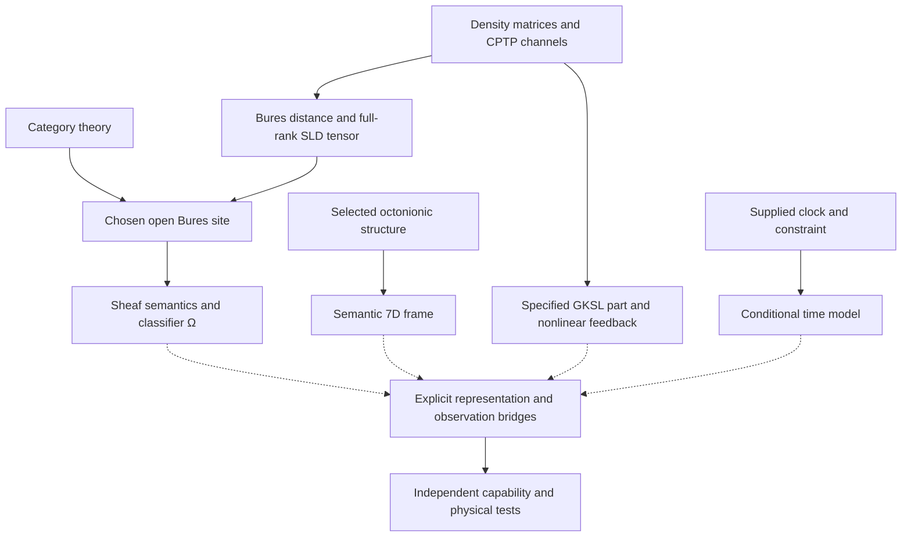
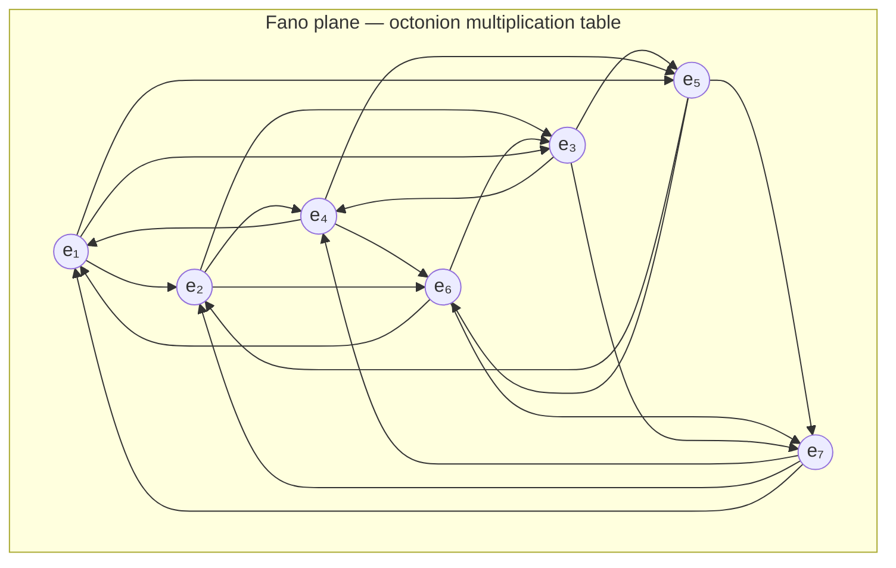

# Mathematical Foundations of the UHM

This chapter introduces standard mathematical tools used by UHM and distinguishes their theorems from the additional UHM choices and physical bridges. The existence of a classifier, an exceptional algebra or a monotone metric does not by itself derive a consciousness model, clock, Hamiltonian or observation law.

**Reading rule.** Standard results below have their stated hypotheses **[T]**. The selected open Bures site, semantic frame and numerical architecture are **[P/D]**; physical and phenomenal identifications remain **[H/I]** unless an explicit bridge is proved. The canonical interface is the [typed mathematical kernel](/docs/reference/mathematical-kernel). A proved mathematical ingredient does not turn every application of it into a theorem.

## The great chain of ideas: from Cayley to Lurie {#великая-цепь}

The historical strands are algebra (quaternions and octonions, normed division algebras, Lie groups), geometry and logic (categories, sites, sheaves and higher toposes), and state dynamics (density matrices, quantum channels and conditional clock models). They supply different kinds of structure. Hurwitz classifies normed division algebras; GKSL characterizes fixed linear CPTP semigroup generators; Petz classifies a family of monotone quantum metrics. None of these statements says that mathematics leaves only one physical consciousness theory.

Octonionic imaginary space has dimension seven after selecting that algebra. A clock requires a supplied subsystem and observables. Gelfand duality reconstructs a topological spectrum from a specified commutative algebra, not its spacetime dimension without further data. These distinctions govern the applications below.

## 1. Dependency tree {#дерево}

```mermaid
graph TD
    CAT["Category theory"] --> SITE["Chosen open Bures site"]
    SITE --> SH["Sheaf semantics and classifier Ω"]
    QM["Density matrices and CPTP channels"] --> MET["Bures distance and full-rank SLD tensor"]
    MET --> SITE
    QM --> FLOW["Specified GKSL part and nonlinear feedback"]
    OCT["Selected octonionic structure"] --> FRAME["Semantic 7D frame"]
    CLOCK["Supplied clock and constraint"] --> PW["Conditional time model"]
    SH -.-> BR["Explicit representation and observation bridges"]
    FRAME -.-> BR
    FLOW -.-> BR
    PW -.-> BR
    BR --> TEST["Independent capability and physical tests"]
```

Solid arrows name mathematical constructions; dashed arrows require additional bridge data. The classifier does not supply seven projectors or a clock, and a primitive linear channel does not settle a nonlinear feedback model.

## 2. Category theory: from Eilenberg to $\infty$-toposes {#теория-категорий}

The first pillar of the foundation is the **language** in which the theory is written. That language is not ordinary mathematical notation (sets, formulas, equations) but category theory—an abstract formalism describing **relations** between objects rather than the objects themselves. The choice of language is not stylistic but substantive: the categorical language naturally describes quantum states, their transformations, and self-referential structures, whereas set-theoretic language is ill-suited for these purposes.

### 2.1 Eilenberg and Mac Lane (1942–1945) {#эйленберг-маклейн}

**Who.** Samuel Eilenberg (1913–1998)—Polish–American mathematician who fled Poland in 1939, shortly before the German invasion. Saunders Mac Lane (1909–2005)—American mathematician who studied in Göttingen under Bernays and Weyl.

**What they did.** Eilenberg and Mac Lane faced a concrete problem: in algebraic topology the same constructions (homology, cohomology, homotopy groups) kept reappearing in different contexts, and each time the same properties had to be proved anew. They needed a **single language** in which all these constructions are special cases of one general pattern. Thus **category theory** was born: a description of mathematical structures through **objects** and **arrows** (morphisms) between them.

At first colleagues greeted the new formalism skeptically. Category theory was called “abstract nonsense”—and the nickname stuck, though over time it turned from mockery into a term of respect.

**Analogy.** Composition joins a route $A\to B$ and a route $B\to C$ into one $A\to C$. The Yoneda lemma makes the mathematical claim precise: an object is determined up to isomorphism by its representable functor, including all morphisms and their naturality relations. This does not prove that a chosen physical readout captures every physical or phenomenal property.

**Formally.** A category $\mathcal{C}$ consists of:
- A class of objects $\mathrm{Ob}(\mathcal{C})$
- For each pair of objects $A, B$, a set of morphisms $\mathrm{Hom}(A, B)$
- Composition $\circ: \mathrm{Hom}(B,C) \times \mathrm{Hom}(A,B) \to \mathrm{Hom}(A,C)$ (associative)
- Identity morphisms $\mathrm{id}_A \in \mathrm{Hom}(A,A)$ for each object

**Typed process category.** Objects are matrix algebras $M_N(\mathbb C)$, arrows are linear CPTP maps. The pointed version has objects $(N,\rho)$ and arrows $K$ satisfying $K(\rho)=\sigma$. Complete positivity is the additional requirement of positivity under arbitrary ancillas; ordinary state positivity and trace preservation alone do not imply it.

The tensor unit $M_1(\mathbb C)$ is terminal, with unique discarding $X\mapsto\operatorname{Tr}X$. No pointed state with $N>1$ is terminal: identity and replacement $X\mapsto\operatorname{Tr}(X)\rho$ are distinct endomorphisms fixing $\rho$. This remains a counterexample at $I_N/N$ for unital arrows. Majorization in a reachability preorder does not prove unique arrows in the channel category. A stationary state or dynamical attractor is a third, separate notion. The fixed-$N=7$ sector is not tensor closed; composition lives in $D_{49}$. A functor forgetting a pointed state sends $(N,\rho)$ to its underlying algebra, not to a uniquely inferred physical system.

### 2.2 Grothendieck (1957–1972) {#гротендик}

**Who.** Alexander Grothendieck (1928–2014)—one of the greatest mathematicians of the 20th century. Son of anarchists: his father Alexander Shapiro, from the Russian Empire, died in Auschwitz in 1942; his mother Hanka Grothendieck was a German journalist. Alexander’s childhood was spent in internment camps in Vichy France. After the war—stateless, penniless, without connections—he entered mathematics and in 15 years rebuilt it from the foundations.

Grothendieck worked with inhuman intensity. Over 12 years (1957–1969) he published thousands of pages, rewrote the foundations of algebraic geometry, and founded a school that shaped mathematics for decades. In 1966 he received the Fields Medal. In 1970 he left the Institut des Hautes Études Scientifiques (IHES) in protest at military funding. In later years he wrote *Récoltes et Semailles* (1985–1987)—over 1,000 pages of mathematical and human reflection analyzing not only his discoveries but the nature of mathematical creativity, relations with students, and his estrangement from the academic world. He also wrote *Esquisse d’un Programme* (1984)—a visionary text proposing the Teichmüller tower, *dessins d’enfants*, and other ideas decades ahead of their time. He spent the last two decades of his life as a recluse in the village of Lasserre at the foot of the Pyrenees, refusing contact with the mathematical world. He died in 2014, leaving tens of thousands of pages of unpublished manuscripts.

**What he did.** Grothendieck sought to prove the **Weil conjectures**—a series of statements about algebraic varieties over finite fields linking topology and arithmetic. For this he had to generalize the very notion of **space**. Ordinary topology (open sets) proved too weak for algebraic objects in characteristic $p$. Grothendieck took a radical step: instead of studying **points** of a space he studied **categories of covers**—which “families of observers” can jointly describe an object. Thus were born **sites** (categories with a topology), **sheaves** (coherent local data), and **toposes** (categories of sheaves). The monumental SGA (*Séminaire de Géométrie Algébrique*, 1960–1967)—12 seminar volumes the community took decades to absorb.

A sheaf packages declared local data and their compatibility. Applying that language to a quantum model requires specifying the site and observation assignment; the existence of quantum measurements does not make ordinary topology invalid.

**Analogy.** Compatible observations on overlapping regions can glue to a unique section when the sheaf condition holds. This formal gluing condition applies to the declared data; it does not prove a unique physical state for an incomplete collection of measurements or force a quantum interpretation of every sheaf.

**Formally.** A Grothendieck topology assigns covering sieves to objects, satisfying maximality, pullback stability and local character. On a category with pullbacks one can specify a generating pretopology using covering families; its standard axioms are given below. For the chosen open site, pullbacks are intersections.

1. **Stability** (closure under base change): if $\{U_i \to U\}$ is a cover and $V \to U$ is any morphism, then $\{U_i \times_U V \to V\}$ is also a cover. Informally: if you have a good set of photos of a room and you move to an adjacent room (base change), you can obtain a good set of photos there too.
2. **Transitivity** (composition of covers): if $\{U_i \to U\}$ is a cover and for each $i$ covers $\{V_{ij} \to U_i\}$ are given, then $\{V_{ij} \to U\}$ is a cover. If you photograph a wall and then zoom in on each patch—the zoomed photos still cover the whole wall.
3. **Maximality**: the singleton $\{U \xrightarrow{\mathrm{id}} U\}$ is a cover. A “full-length photo” is trivially a good cover.

A **sheaf** $\mathcal{F}$ on a site $(\mathcal{C}, J)$ is a contravariant functor $\mathcal{F}: \mathcal{C}^{op} \to \mathbf{Set}$ satisfying the **gluing condition**: if $\{U_i \to U\}$ is a cover and sections $s_i \in \mathcal{F}(U_i)$ agree on overlaps ($s_i|_{U_i \times_U U_j} = s_j|_{U_i \times_U U_j}$), then there is a unique $s \in \mathcal{F}(U)$ with $s|_{U_i} = s_i$. In plain terms: coherent local observations determine a unique global section.

A **topos** is the category of all sheaves: $\mathbf{Sh}(\mathcal{C}, J)$. It is the “world” in which coherent observations live. That world has its own logic (subobject classifier $\Omega$), its own arithmetic (natural numbers object), and its own “spaces”—all derived from the structure of covers.

**Chosen UHM site [P/D].** Set $\mathcal O_N=\operatorname{Open}(D_N,d_B)$, with inclusion arrows and covers $\bigcup_iU_i=U$. Pullback is intersection, so open covers satisfy the Grothendieck axioms **[T]**. This gives $\operatorname{Sh}_\infty(\mathcal O_N,J_{\mathrm{open}})$. A CPTP map is Bures-continuous; inverse images of opens relate process maps to sheaf semantics. Channels are not inclusion arrows or covers by definition.

The former ball-image cover proof on a channel category is withdrawn: contractivity does not establish inverse lifts, pullbacks or sieve stability. The choice of Bures supplies topology; it does not prove every metric-dependent prediction invariant. Smooth monotone tensors are comparable on compact full-rank subsets with a positive eigenvalue floor, not automatically globally bi-Lipschitz through all boundary states. Matrix expectation values are continuous; a projective instrument does not require abandoning ordinary topology. See [Axiom Ω⁷](./axiom-omega) and the [kernel](../../reference/mathematical-kernel#bures-site).

### 2.3 Lawvere and the subobject classifier (1964–1969) {#лавёр-классификатор}

Lawvere–Tierney logic uses a **subobject classifier**: for every monomorphism $S\hookrightarrow X$, a characteristic map $\chi_S:X\to\Omega$ classifies it by pullback of $\top:1\to\Omega$ **[T]**. In sheaves on a space, $\Omega(U)$ is the collection of open subsets of $U$.

**UHM boundary.** $\Omega$ is not a seven-element projection algebra. Connected $D_7$ has only two clopen subsets, while predicates $\rho_{ii}>0$ overlap. A chosen orthonormal frame supplies projectors $P_i=|i\rangle\langle i|$ and a seven-outcome instrument **[D]**. A GKSL model can use these projectors with declared rates, but its operators, Hamiltonian and clock are not derived from the logical classifier. The claimed bridge “logic forces physical dissipation” is withdrawn; see [operators from Ω](./axiom-omega#lk-из-omega).

### 2.4 Lawvere: self-reference (1969) {#лавёр}

**Lawvere's conditional theorem [T].** In a cartesian closed category, if a weakly point-surjective map $A\to B^A$ is supplied, every endomorphism of $B$ has a global fixed point. The diagonal construction uses that representability assumption; existence of a topos alone does not supply it. The result does not imply a unique numerical self-model, contraction, a physical fixed point or phenomenal self-awareness. See [Lawvere's original paper](https://www.its.caltech.edu/~matilde/LawvereDiagonalArgCartesianClosedCats.pdf).

The canonical logical support reflector is $\operatorname{im}_G:\mathcal E_{/G}\rightleftarrows\operatorname{Sub}_{\mathcal E}(G):i_G$ with $\operatorname{im}_G\dashv i_G$. It is the image construction in a slice, not a channel on $D_7$. A numerical $M:D_7\to D_7$ needs a separate definition; state-dependent coefficients generally make it nonlinear. For example $M(\rho)=(1-R(\rho))\mathcal P_\alpha(\rho)+R(\rho)\rho_a$, $R=1/(7\operatorname{Tr}\rho^2)$, is not automatically affine or CPTP. Frozen-parameter channels and the full feedback map must be distinguished. See [φ formalization](/docs/proofs/categorical/formalization-phi).

### 2.5 Lurie (2006/2009) {#лурье}

**Who.** Jacob Lurie (b. 1977)—American mathematician, among the most influential of his generation. A prodigy: in 2000 he received his PhD from MIT at age 23 (advisor Michael Hopkins). In 2007 he became a professor at Harvard, and in 2009 one of the youngest professors in its history. The monograph *Higher Topos Theory* (925 pages) was largely written during graduate school; an early version appeared on arXiv in 2006 (math/0608040), and the book was published by Princeton University Press in 2009. In 2019 Lurie left Harvard for the Institute for Advanced Study (IAS) in Princeton—the same institute where Gödel and Einstein worked.

**What he did.** Lurie completed the program begun by Grothendieck, pushing it to a logical extreme. Grothendieck’s toposes work with ordinary categories: each pair of objects has a set of morphisms. But in modern mathematics and physics **relations between relations** are fundamental: two arrows may be “equivalent” up to homotopy, which is itself defined up to higher homotopy, and so on. Lurie created the theory of **$\infty$-toposes**—a generalization of Grothendieck toposes in which ordinary categories are replaced by $(\infty,1)$-categories and **sets** of morphisms by **spaces** of morphisms (with nontrivial homotopy structure).

**Analogy.** An ordinary category is a “city with roads.” An $\infty$-category is a “city with roads, alleys between roads, passages between alleys, and so on to infinity.” Each level records how the connections of the previous level are related. Why does this matter? In quantum theory two states can be “physically the same” (gauge equivalent) yet admit several ways of identifying them, and the choice among those ways is itself physical information. An ordinary topos loses that information; an $\infty$-topos retains it.

**Formally.** An $\infty$-topos is an $(\infty,1)$-category equivalent to a left exact localization of $\mathbf{PSh}_\infty(\mathcal{C})$—the category of presheaves of $\infty$-groupoids on a small $(\infty,1)$-category $\mathcal{C}$. In particular, $\mathbf{Sh}_\infty(\mathcal{C}, J)$ is the $\infty$-category of sheaves on the site $(\mathcal{C}, J)$.

**Role [P/H].** UHM selects sheaves of spaces on the open Bures site. Comparison results apply only to presentations known to induce equivalent sheaf categories; they do not make every proposed channel site equivalent. Higher mapping spaces allow specified coherent identifications, but do not force nonzero homotopy, $H^7$, a seven-dimensional boundary sphere or a physical gauge theory. $D_7$ itself is convex and contractible. A relative or coefficient-dependent cohomology claim needs its actual pair, coefficient object and calculation; it cannot be inferred from the existence of an $\infty$-topos.

## 3. Algebra: octonions and exceptional structures {#алгебра}

Octonionic algebra supplies a seven-dimensional imaginary representation after that algebra has been selected. Semantic roles and a physical seven-dimensional readout require additional premises; algebraic classification alone does not count cognitive functions.

### 3.1 Cayley and Graves (1843–1845) {#кэли}

The story begins with one of the most romantic episodes in mathematics.

On 16 October 1843 William Rowan Hamilton walked with his wife along the Royal Canal in Dublin, bound for a meeting of the Royal Irish Academy. For 15 years he had wrestled with a problem: how to generalize complex numbers to three dimensions? Complex numbers are pairs $(a,b)$ with multiplication $(a,b)(c,d) = (ac-bd, ad+bc)$. Can one do the same for triples? The answer is no (as Hurwitz would later prove). Hamilton did not yet know this, but that October day it struck him: one needs not triples but **quadruples**! He carved on Broom Bridge the famous formula $i^2 = j^2 = k^2 = ijk = -1$. Thus were born **quaternions**—four-dimensional numbers in which multiplication is **noncommutative**: $ij = k$ but $ji = -k$.

Hamilton’s friend John Graves, learning of quaternions, asked: what if one goes further? Already in December 1843 he wrote to Hamilton about **octonions**—eight-dimensional numbers losing not only commutativity but also **associativity**: $(ab)c \neq a(bc)$. Graves did not publish, and two years later Arthur Cayley independently rediscovered and published them.

**Who.** Arthur Cayley (1821–1895)—British mathematician, a founder of matrix theory. Cayley was among the most prolific mathematicians in history: he published over 900 papers. Notably, for the first 14 years after Cambridge he practised law—mathematics was his hobby. Only in 1863, at age 42, did he take a chair in mathematics. During those 14 “legal” years he published over 300 mathematical papers—a pace full professors might envy.

**What he did.** He first published a full description of **octonions**—an 8-dimensional algebra over the reals. Historical fairness requires noting: octonions were independently discovered by John Graves in 1843, two years before Cayley, but Graves communicated them only in a letter to Hamilton and did not publish. Cayley published first in 1845.

**Analogy.** Everyone knows the real numbers (a line). Complex numbers are “numbers in the plane” (two directions). Hamilton’s quaternions are “numbers in 4D” (at the price of losing commutativity: $ij \neq ji$). Octonions are the next step: “numbers in 8D” that lose associativity as well: $(ab)c \neq a(bc)$ in general. Yet they are **last** in this chain: further doubling yields algebras without division. Each doubling step is like climbing a floor: the view widens but the floor grows less stable. After octonions the floor gives way—division becomes impossible.

Why did octonions remain exotic for over a century? Physics made do with quaternions (for spin) and complex numbers (for quantum mechanics). Octonions were seen as a “mathematical curiosity without physical applications.” Not everyone agreed: in his famous survey *The Octonions* (2002) John Baez wrote that octonions are the most exotic number system and seem tied to string theory, supersymmetry, and exceptional groups. The UHM claims the link runs deeper: octonions are not exoticism but the **foundation**.

### 3.2 Dickson and Cayley–Dickson doubling (1919) {#диксон}

**Who.** Leonard Eugene Dickson (1874–1954)—American mathematician, a leader of the American algebraic school in the early 20th century. Author of the three-volume *History of the Theory of Numbers* (1919–1923), systematizing number theory from the ancient Greeks to the early 20th century.

**What he did.** Cayley and Graves built octonions “by hand.” Dickson showed there is a **general mechanism** behind this—the Cayley–Dickson doubling construction. The idea is simple and elegant: from an algebra $\mathcal{A}$ of dimension $n$ one builds a new algebra $\mathcal{A}'$ of dimension $2n$. Elements of $\mathcal{A}'$ are pairs $(a,b)$ with $a, b \in \mathcal{A}$, and multiplication is given by:

$$
(a, b) \cdot (c, d) = (ac - \bar{d}b,\; da + b\bar{c})
$$

where $\bar{x}$ denotes conjugation in $\mathcal{A}$. This single formula generates the whole chain:

$$
\mathbb{R} \xrightarrow{\text{CD}} \mathbb{C} \xrightarrow{\text{CD}} \mathbb{H} \xrightarrow{\text{CD}} \mathbb{O} \xrightarrow{\text{CD}} \mathbb{S}
$$

At **each** doubling step a concrete algebraic property is lost—and that loss is irreversible:

| Step | Transition | What is lost | Why |
|---|---|---|---|
| 1 | $\mathbb{R} \to \mathbb{C}$ | **Ordering** | $\mathbb{C}$ admits no linear order compatible with the operations: one cannot say $3+i > 2-i$ |
| 2 | $\mathbb{C} \to \mathbb{H}$ | **Commutativity** | $ij = k$ but $ji = -k$; order of factors matters |
| 3 | $\mathbb{H} \to \mathbb{O}$ | **Associativity** | $(e_1 e_2)e_3 \neq e_1(e_2 e_3)$ in general; bracketing matters |
| 4 | $\mathbb{O} \to \mathbb{S}$ | **Division** | **Zero divisors** appear: a product of nonzero elements can be zero |

The fourth step is catastrophic. **Sedenions** $\mathbb{S}$ (dimension 16) are no longer a division algebra. A concrete zero divisor in $\mathbb{S}$:

$$
(e_3 + e_{10})(e_6 - e_{15}) = 0
$$

where $e_3, e_{10}, e_6, e_{15}$ are basis elements of the sedenions, each nonzero. Thus in $\mathbb{S}$ one cannot “divide”—the equation $ax = b$ may have no solution or infinitely many. For a physical theory in which invertibility of operations is a prerequisite for predictability, this is unacceptable. Octonions are the **last** algebra where division is possible.

The pattern of losses is no accident. Each doubling adds a new “imaginary direction” but pays with weakened structure. One may view this as a fundamental balance: **richness** (number of dimensions) grows while **order** (algebraic properties) declines. Octonions are the point of optimal balance: maximal dimension while division persists.

**Role [P/C].** Within the Cayley–Dickson normed-division chain, the octonionic step is the last normed division algebra. Selecting maximal normed division and its imaginary representation gives dimension seven. General composition, invertibility of some operations or nonlinearity of dynamics does not require this algebra; the [structural derivation](../../proofs/minimality/theorem-octonionic-derivation#кэли-диксон) retains its premises.

### 3.3 Hurwitz (1898) {#гурвиц}

**Who.** Adolf Hurwitz (1859–1919)—German-Swiss mathematician, professor at the Swiss Federal Institute of Technology (ETH Zurich). Teacher of Hilbert, colleague of Minkowski. Hurwitz had unusual mathematical intuition: he did not merely prove theorems but sensed **the limits of the possible**—and knew how to turn that sense into rigorous proof.

**What he did.** Picture the moment: end of the 19th century, Hamilton and Graves found quaternions and octonions, Dickson showed how to build algebras of ever larger dimensions. Mathematicians worldwide hunt for a division algebra in dimensions 16, 32, 64… Then Hurwitz proves: **the search is futile**. Normed division algebras over $\mathbb{R}$ exist **only** in dimensions 1, 2, 4, and 8. Not “we have not found them in other dimensions” but “they **do not exist**.” Full stop. No construction—Cayley–Dickson doubling or any other—can produce a normed division algebra beyond this list.

For a finite-dimensional unital real algebra with a positive-definite multiplicative norm, Hurwitz's classification gives

$$
\mathcal A\cong\mathbb R,\mathbb C,\mathbb H\ \text{or}\ \mathbb O,
\qquad\dim_{\mathbb R}\mathcal A\in\{1,2,4,8\}.
$$

Why is this stunning? Because four numbers—1, 2, 4, 8—are **all there is**. Among the infinite natural numbers only four admit such a normed division algebra. This is not an empirical fact (“we looked and found nothing”) but **mathematical necessity** (“we proved there are no others”). Such results are rare. They speak not merely to what we know but to what mathematics itself knows about its bounds.

**Analogy.** It is like proving there are exactly five regular solids (tetrahedron, cube, octahedron, dodecahedron, icosahedron)—no engineering, pure mathematics forbids a sixth. And as Platonic solids show up in unexpected places (crystallography, virology, graph theory), so 1, 2, 4, 8 recur everywhere: dimensions of division algebras, parallelizable spheres, Hopf bundles, supersymmetric theories in certain dimensions. Each appearance is not coincidence but the same algebraic necessity surfacing again.

**Exercise for the curious reader.** Try to build a division algebra in dimension 3. Define multiplication on three basis elements $\{1, e_1, e_2\}$ with norm $|a + be_1 + ce_2|^2 = a^2 + b^2 + c^2$ and require $|xy| = |x||y|$. You will find multiplicativity of the norm leads to a **system of equations with no solution**. This is a “hands-on” proof of why 3 is not in Hurwitz’s list. The full proof is harder (it uses quadratic-form identities), but the idea is the same: multiplicativity of the norm is a very strong constraint.

**Conditional dimension bridge.** Hurwitz classifies finite-dimensional unital real normed composition/division algebras. For a selected octonionic representation,

$$
\mathbb O=\mathbb R1\oplus\operatorname{Im}\mathbb O,\qquad\dim_{\mathbb R}\operatorname{Im}\mathbb O=7.
$$

Its scalar unit is not the trace-one condition of a complex density matrix. The latter reduces the real affine dimension of Hermitian $N\times N$ matrices from $N^2$ to $N^2-1$; it does not turn an eight-dimensional algebra into $D_7$, which has dimension $48$. The semantic identification requires an explicit representation bridge **[P/H]**. See [minimality](../../proofs/minimality/theorem-minimality-7).

### 3.4 Adams (1960) {#адамс}

Adams's Hopf-invariant-one result restricts the dimensions relevant to sphere multiplications. Parallelizable spheres are $S^0,S^1,S^3,S^7$ **[T]**. Parallelizability requires a global frame of tangent fields, not just one nowhere-zero field: every odd-dimensional sphere has a nowhere-zero tangent field. In particular $S^6$ is not parallelizable.

**UHM boundary.** Density-state dynamics is defined in the trace-one Hermitian affine space; it does not require parallelizing $S^6$. The theorem therefore does not independently derive a physical $N=7$, a universal cognitive depth or a global matrix flow. Its link to selected division-algebra structures is mathematical; applying it to an experiential representation needs additional premises.

### 3.5 Fano (1892) {#фано}

**Who.** Gino Fano (1871–1952)—Italian mathematician of the brilliant Italian school of algebraic geometry. In 1938, after fascist racial laws were enacted, he was removed from teaching at the University of Turin. He emigrated to Switzerland and continued his work. His contribution to finite geometry is a small part of a large legacy, yet that part proved surprisingly relevant to physics.

**What he did.** The Fano plane $\mathrm{PG}(2,2)$ has seven points and seven lines, with three points on each line and three lines through each point. Its finite automorphism group acts transitively on points and lines. This incidence symmetry does not prove a dynamically symmetric Hamiltonian, equal semantic roles or a unique physical frame; those require specified representations and couplings.

**Analogy.** Imagine 7 people in a room. Split them into “committees” of 3 so that any two people sit together in exactly one committee. Try it! You will find it is possible in exactly one way—the Fano plane. (Hint: start with any triple, then try to add the rest while obeying “every pair lies in exactly one committee.” You will be struck by how rigidly the constraints fix the whole structure.)

**Formally.** Points: $\{1, 2, 3, 4, 5, 6, 7\}$. Lines: $\{1,2,4\}$, $\{2,3,5\}$, $\{3,4,6\}$, $\{4,5,7\}$, $\{5,6,1\}$, $\{6,7,2\}$, $\{7,1,3\}$.

**Historical bridge.** As a *combinatorial* object (a Steiner triple system on 7 points, STS(7) = BIBD(7,3,1)) this structure predates Fano: it appears in Kirkman's 1847 work on triple systems — which is why the registry entry [T-41l] cites "Kirkman 1847" for BIBD$(7,3,1)$. Fano's 1892 contribution is the *projective-geometric* reading (the smallest projective plane and its axiomatics); the two names refer to one structure seen through two lenses.

**Octonion multiplication table via Fano.** The Fano plane is not an abstract gadget but a concrete **computational tool**. Each of the 7 points corresponds to an imaginary unit $e_1, \ldots, e_7$ of the octonions. Multiplication rule: if $(e_i, e_j, e_k)$ is an oriented Fano line (a triple ordered along the arrow), then

$$
e_i \cdot e_j = e_k, \quad e_j \cdot e_i = -e_k
$$

Thus the entire octonion multiplication table (49 products of basis imaginaries) is **fully** encoded by a diagram of 7 points and 7 directed lines.

```mermaid
graph TD
    subgraph "Fano plane — octonion multiplication table"
        E1((e₁)) --> E2((e₂))
        E2 --> E4((e₄))
        E4 --> E1

        E2 --> E3((e₃))
        E3 --> E5((e₅))
        E5 --> E2

        E3 --> E4
        E4 --> E6((e₆))
        E6 --> E3

        E4 --> E5
        E5 --> E7((e₇))
        E7 --> E4

        E5 --> E6
        E6 --> E1
        E1 --> E5

        E6 --> E7
        E7 --> E2
        E2 --> E6

        E7 --> E1
        E1 --> E3
        E3 --> E7
    end
```

Each closed triangle on the diagram is one Fano line defining an associative triple. For example, the line $\{1, 2, 4\}$ means: $e_1 e_2 = e_4$, $e_2 e_4 = e_1$, $e_4 e_1 = e_2$ (with opposite sign when the order is reversed). There are 7 such triples—the 7 Fano lines.

#### Complete multiplication table of octonion imaginary units {#таблица-умножения-октонионов}

The seven Fano lines determine all 21 products $e_i \cdot e_j$ ($i < j$). For each line $(e_a, e_b, e_c)$ oriented along the arrow: $e_a e_b = e_c$, $e_b e_a = -e_c$.

**7 Fano lines (associative triples):**

| Line | Triple | Products |
|-------|---------|-------------|
| $\ell_1$ | $(e_1, e_2, e_4)$ | $e_1 e_2 = e_4$, $e_2 e_4 = e_1$, $e_4 e_1 = e_2$ |
| $\ell_2$ | $(e_2, e_3, e_5)$ | $e_2 e_3 = e_5$, $e_3 e_5 = e_2$, $e_5 e_2 = e_3$ |
| $\ell_3$ | $(e_3, e_4, e_6)$ | $e_3 e_4 = e_6$, $e_4 e_6 = e_3$, $e_6 e_3 = e_4$ |
| $\ell_4$ | $(e_4, e_5, e_7)$ | $e_4 e_5 = e_7$, $e_5 e_7 = e_4$, $e_7 e_4 = e_5$ |
| $\ell_5$ | $(e_5, e_6, e_1)$ | $e_5 e_6 = e_1$, $e_6 e_1 = e_5$, $e_1 e_5 = e_6$ |
| $\ell_6$ | $(e_6, e_7, e_2)$ | $e_6 e_7 = e_2$, $e_7 e_2 = e_6$, $e_2 e_6 = e_7$ |
| $\ell_7$ | $(e_7, e_1, e_3)$ | $e_7 e_1 = e_3$, $e_1 e_3 = e_7$, $e_3 e_7 = e_1$ |

For the reverse order: $e_j e_i = -e_i e_j$ (anticommutativity of imaginaries). Also $e_i^2 = -1$ for all $i$.

**Full table of $e_i \cdot e_j$ (antisymmetric part):**

|  | $e_1$ | $e_2$ | $e_3$ | $e_4$ | $e_5$ | $e_6$ | $e_7$ |
|---|:---:|:---:|:---:|:---:|:---:|:---:|:---:|
| $e_1$ | $-1$ | $e_4$ | $e_7$ | $-e_2$ | $e_6$ | $-e_5$ | $-e_3$ |
| $e_2$ | $-e_4$ | $-1$ | $e_5$ | $e_1$ | $-e_3$ | $e_7$ | $-e_6$ |
| $e_3$ | $-e_7$ | $-e_5$ | $-1$ | $e_6$ | $e_2$ | $-e_4$ | $e_1$ |
| $e_4$ | $e_2$ | $-e_1$ | $-e_6$ | $-1$ | $e_7$ | $e_3$ | $-e_5$ |
| $e_5$ | $-e_6$ | $e_3$ | $-e_2$ | $-e_7$ | $-1$ | $e_1$ | $e_4$ |
| $e_6$ | $e_5$ | $-e_7$ | $e_4$ | $-e_3$ | $-e_1$ | $-1$ | $e_2$ |
| $e_7$ | $e_3$ | $e_6$ | $-e_1$ | $e_5$ | $-e_4$ | $-e_2$ | $-1$ |

**Check of non-associativity.** Octonions are **not** associative. A concrete example:

$$
(e_1 e_2) e_3 = e_4 \cdot e_3 = -e_6
$$

$$
e_1 (e_2 e_3) = e_1 \cdot e_5 = e_6
$$

The results **differ by sign**: $(e_1 e_2) e_3 = -e_1 (e_2 e_3)$. But for elements in one triple (e.g. $e_1, e_2, e_4$—line $\ell_1$) associativity holds: $(e_1 e_2) e_4 = e_4 \cdot e_4 = -1 = e_1 (e_2 e_4) = e_1 \cdot e_1 = -1$. This is **alternativity** (Artin’s theorem, [§3.7](#артин)).

**Role [T/P/H].** An oriented Fano labeling encodes the chosen multiplication table. Its unoriented incidence has 168 combinatorial automorphisms; continuous $G_2$ preserves octonion multiplication but does not preserve an arbitrary fixed set of seven axes as a finite permutation set. Only an appropriate frame subgroup relates these actions. The encoding does not prohibit generic off-diagonal density entries. Physical selection rules, couplings and semantic labels require a specified invariant model and observation bridge; no Yukawa spectrum or conserved charge follows from incidence alone.

### 3.6 Killing and Cartan (1888–1894) {#киллинг-картан}

**Who.** Wilhelm Killing (1847–1923)—German mathematician who spent his career as a schoolteacher and lecturer in small institutions far from the great centers. Despite isolation he single-handedly carried out one of the greatest classifications in the history of mathematics. His work had gaps filled by Élie Cartan (1869–1951)—French mathematician later recognized as one of the foremost geometers of the 20th century. The irony: Killing made the discovery, Cartan the correct proof; together they created a pillar of modern mathematics.

**What is a Lie algebra?** Before classification one must know what is being classified. A **Lie group** is a continuous symmetry group: rotations in space ($SO(3)$), unitary maps ($U(n)$), Lorentz transformations. A **Lie algebra** is the “infinitesimal version” of the group: instead of finite turns—infinitesimal ones. For example, the Lie algebra of a rotation group records infinitesimal rotations.

Formally, a Lie algebra is a vector space with a bilinear antisymmetric bracket satisfying the Jacobi identity $[X,[Y,Z]]+[Y,[Z,X]]+[Z,[X,Y]]=0$. For a matrix Lie algebra the bracket is $[X,Y]=XY-YX$. An abstract Lie bracket need not be defined by a pre-existing associative product.

**Analogy.** The Lie algebra records infinitesimal directions at the identity. It determines local group structure and, in finite dimension, its simply connected integration, but does not determine every global quotient group. The exponential map is local data and is not always globally surjective.

**What they did.** Killing and Cartan asked: which finite-dimensional simple complex Lie algebras exist? “Simple” means indecomposable into smaller pieces (an analogue of prime numbers for groups). The answer is one of the most beautiful results in mathematics: besides four infinite families ($A_n, B_n, C_n, D_n$) corresponding to “ordinary” symmetries (unitary, orthogonal, symplectic maps), there are exactly **five exceptional** simple Lie algebras:

$$
G_2 \quad F_4 \quad E_6 \quad E_7 \quad E_8
$$

with dimensions 14, 52, 78, 133, and 248 respectively. The five “anomalies” are not artifacts of classification: they reflect deep mathematical necessities tied to octonions. Classification proceeds via **Dynkin diagrams**—graphs encoding root-system structure. Each simple Lie algebra has exactly one diagram, and there are finitely many families and five exceptional diagrams, with unbounded ranks in the classical families. It is like a periodic table of symmetries: all possible “elements” are listed; there can be no new ones.

**Key fact.** $G_2 = \mathrm{Aut}(\mathbb{O})$—the automorphism group of the octonions. It is the only exceptional group that appears as the symmetry group of a division algebra. The link between exceptional groups and octonions is one of the deepest and least understood in mathematics. All five exceptional groups ($G_2, F_4, E_6, E_7, E_8$) relate to octonions: $G_2$ automorphisms of $\mathbb{O}$, $F_4$ automorphisms of the exceptional Jordan algebra $\mathcal{H}_3(\mathbb{O})$, while $E_6$, $E_7$, $E_8$ arise from Freudenthal–Tits constructions. The UHM needs precisely $G_2$—the smallest and “closest to the octonions.”

**Mathematical role.** $G_2=\operatorname{Aut}(\mathbb O)$, $\dim G_2=14$ and rank $2$ are algebraic results. The exceptional Jordan algebra $\mathcal H_3(\mathbb O)$ has rank three and automorphism group $F_4$. Its algebraic rank is not a proof of $\mathrm{SAD}_{\max}=3$ or a cap on an agent's predictive tower. A finite score, compatible tower, tensor composition and exceptional-group inclusion are different structures.

The rank obstruction excludes embedding $SU(3)\times SU(2)\times U(1)$ into $G_2$: rank $4$ exceeds rank $2$. $SU(3)\subset G_2$ stabilizes an imaginary unit, but the full Standard Model bridge needs extra geometry and representations. An exceptional-group architecture is a design hypothesis, not a theorem that every composite scales through $G_2,F_4,E_6,E_7,E_8$.

A Noether application requires an invariant variational action, not only covariance of a dissipative flow. Neither a logical classifier nor generic self-reference forces Cayley–Dickson doubling, orientation or a unique physical representation. See [uniqueness](../../proofs/categorical/uniqueness-theorem), [depth tower](/docs/consciousness/hierarchy/depth-tower) and [hypermathematics](./hypermathematics) for their explicit hypotheses.

### 3.7 Artin (1927) {#артин}

Octonions are non-associative—$(ab)c \neq a(bc)$ in general. That poses a serious problem: how to define physical operations (evolution, interactions) in an algebra where bracketing matters? Artin’s answer: one need not work with all three elements at once—it suffices to work with pairs.

**Who.** Emil Artin (1898–1962)—Austrian-American mathematician, one of the great algebraists of the 20th century. Born in Vienna, worked in Hamburg. In 1937 he emigrated to the United States (his wife was partly Jewish), taught at Princeton and Indiana, returned to Hamburg in 1958. His style—elegance and minimalism: each theorem says exactly what is needed, not a word more.

**What he did.** He proved **Artin’s theorem**: in an **alternative** algebra (satisfying the two alternative identities below) every subalgebra generated by two elements is associative. Octonions are alternative—and one checks:

**Alternativity** means two identities for all $a, b$:
- Left: $(aa)b = a(ab)$
- Right: $(ab)b = a(bb)$

**Concrete check.** Take $a = e_1$, $b = e_2$:
- Left: $(e_1 e_1)e_2 = (-1)e_2 = -e_2$. And $e_1(e_1 e_2) = e_1 \cdot e_4 = -e_2$. Match! ✓
- Right: $(e_1 e_2)e_2 = e_4 \cdot e_2 = -e_1$. And $e_1(e_2 e_2) = e_1 \cdot (-1) = -e_1$. Match! ✓

But **associativity** in general **fails** (we already saw $(e_1 e_2) e_3 \neq e_1(e_2 e_3)$).

The point of Artin’s theorem: although three arbitrary octonions need not obey $(ab)c = a(bc)$, any **pair** of octonions behaves like ordinary associative numbers. All expressions involving only **two** distinct octonions (in any combination) evaluate unambiguously—bracketing does not matter. Trouble begins only with three or more distinct elements.

**Analogy.** Think of a dance pair: any two dancers can move in sync (associatively). Add a third and the order of interaction starts to matter. A trio can “tangle” if brackets are wrong. Artin proved: as long as we work with pairs, all is well.

**Role [T/C].** Artin's theorem controls products in an alternative algebra; chosen Fano quaternionic subalgebras are associative. Standard $7\times7$ complex matrix multiplication and CPTP composition are associative independently of this theorem. Their Lindblad well-posedness does not rely on octonionic alternativity. Applying octonionic multiplication to a coupling model requires a separately defined representation; coherence entries are not themselves octonions by definition.

## 4. Quantum theory: from von Neumann to Lindblad {#квантовая-теория}

### 4.1 von Neumann (1932) {#фон-нейман}

**Who.** John von Neumann (1903–1957)—Hungarian-American mathematician and physicist, often called the “last of the great mathematical universalists.” His scientific breadth is striking: mathematical foundations of quantum mechanics (1932), game theory (1944, with Morgenstern), computer architecture (von Neumann architecture, 1945), theory of self-reproducing automata, ergodic theory, functional analysis (von Neumann algebras), and participation in the Manhattan Project. Colleagues recalled his ability to switch instantly between unrelated fields and find unexpected links.

**What he did.** In 1932, at age 28, he published *Mathematische Grundlagen der Quantenmechanik*, which put quantum mechanics once and for all on a rigorous mathematical foundation. The key innovation is the **density matrix** $\rho$ for mixed states (when the system is in a statistical mixture of pure states) and the equation of motion for a closed system:

$$
\frac{d\rho}{dt} = -\frac{i}{\hbar}[H, \rho]
$$

A density matrix describes pure and mixed states. Off-diagonal coherences depend on the declared basis; being mixed is not equivalent to possessing coherence, and a mixed state may be diagonal in its eigenbasis. Under a fixed Hermitian Hamiltonian, unitary motion preserves the spectrum and purity **[T]**. Selecting $D_7$ and identifying its entries with semantic or experiential roles are additional UHM choices **[P/H]**.

### 4.2 Lindblad (1976) {#линдблад}

**Who.** Göran Lindblad (1940–2008)—Swedish mathematical physicist at the Royal Institute of Technology (KTH) in Stockholm. His 1976 paper “On the generators of quantum dynamical semigroups” is among the most cited in mathematical physics (over 10,000 citations), though Lindblad himself remained relatively little known outside a narrow circle. Unlike von Neumann, whose name every physicist knows, Lindblad is known chiefly through his equation—yet that equation is used in quantum optics, condensed matter, quantum computing, and open-systems theory.

**GKSL scope [T].** A fixed finite-dimensional linear generator of a norm-continuous CPTP semigroup has the form

$$
\mathcal L(\rho)=-i[H,\rho]+\sum_k\left(L_k\rho L_k^\dagger-\tfrac12\{L_k^\dagger L_k,\rho\}\right).
$$

This characterizes a class of generators; it does not select $H$, channels or rates. The commutator derivative is Hermitian, not necessarily entrywise real. Seven chosen projectors provide one dephasing model, not a consequence of $\Omega$.

**Counterexample to the old mixing claim.** For $L_k=\sqrt\gamma|k\rangle\langle k|$, all diagonal populations are constant and off-diagonals decay at rate $\gamma$. The limit is the initial diagonal, not necessarily $I_7/7$. An amplitude-damping channel can increase purity and approach a pure state. Entropy increase and purity decrease require the relevant unital assumptions; convergence to $I_7/7$ additionally requires mixing/primitivity.

The numerical feedback flow

$$
\dot\rho=\mathcal L(\rho)+a(\rho)(M(\rho)-\rho),\qquad a\ge0,
$$

is generally nonlinear. For locally Lipschitz state-preserving $M,a$, it remains a well-posed state-domain flow under the kernel's conditions; it is not automatically a GKSL semigroup. Physical energy and environmental resource currents require their own model, and no biological life/death criterion follows from the GKSL form.

### 4.3 Gorini, Kossakowski, and Sudarshan (1976) {#гкс}

A remarkable coincidence: in the same year 1976, independently of Lindblad, an Italian–Polish–Indian group reached the same result by another route.

**Who.** Vittorio Gorini, Andrzej Kossakowski, George Sudarshan. The paper appeared alongside Lindblad’s (1976). Sudarshan (1931–2018)—outstanding Indian-American physicist, also known for quantum optics and tachyons.

Gorini, Kossakowski and Sudarshan independently obtained the finite-dimensional quantum dynamical semigroup characterization. Its assumptions include linearity, complete positivity and the semigroup law. Finite dimension and coupling to an environment alone do not imply Markovian semigroup dynamics: memory, time-dependent control and state-dependent feedback require separate analysis. The generator form also has representation freedoms; it is not a unique physical evolution law.

### 4.4 Page and Wootters (1983) {#пейдж-вуттерс}

**Who.** Don Page (b. 1948)—Canadian physicist, also known as one of the few students of Stephen Hawking who became leading researchers in their own right. William Wootters (b. 1951)—American physicist, co-author of the no-cloning theorem (1982).

Page and Wootters proposed conditional dynamics relative to a **supplied clock subsystem** and a global constraint. The equation $\hat C|\Psi\rangle=0$ constrains a state; it does not say the Hamiltonian operator is zero. See [the original paper](https://journals.aps.org/prd/abstract/10.1103/PhysRevD.27.2885).

Given $\mathcal H_{\mathrm{ext}}=\mathcal H_C\otimes\mathcal H_{\mathrm{sys}}$, a joint state and clock effects $E_\tau$, define

$$
\widetilde\rho_{\mathrm{sys}}(\tau)=\operatorname{Tr}_C\big[(\sqrt{E_\tau}\otimes I)\Gamma_{\mathrm{ext}}(\sqrt{E_\tau}\otimes I)\big],\qquad
\rho_{\mathrm{sys}}(\tau)=\frac{\widetilde\rho_{\mathrm{sys}}(\tau)}{\operatorname{Tr}\widetilde\rho_{\mathrm{sys}}(\tau)}
$$

when the denominator is positive. A covariant ideal clock and a suitable constraint yield the corresponding conditional evolution; a tensor split alone does not select it. The axis O in $\mathbb C^7$ is a one-dimensional summand, not a nontrivial clock factor. The chosen 42D model instead supplies a seven-dimensional clock factor and a six-dimensional system factor as extra data.

**T-53a scope.** A declared seven-element label set can be bijectively relabelled as $\mathbb Z_7$ or a chosen seven-point register **[T]**. This label-set equivalence does not prove that phase, dissipation or stratification generate the same clock, ordering, units or dynamics. Positional depth registers and scaling limits likewise require supplied order, embeddings and clock/constraint data; no aperiodic time or physical energy law is derived merely from O labels. Finite clock readouts, ideal conditional dynamics and the parameter of a dissipative flow must remain distinct. See [emergent time](../../proofs/dynamics/emergent-time).

### 4.5 Čencov and Petz {#ченцов-петц}

**Who.** Nikolai Čencov (1930–1992)—Soviet mathematician, co-founder of information geometry, at the Steklov Mathematical Institute. His monograph *Statistical Decision Rules and Optimal Inference* (1972) laid foundations for the geometric approach to statistics, although outside the USSR these ideas became widely known only after translation into English. Dénes Petz (1953–2018)—Hungarian mathematician at the Budapest University of Technology and Economics, specialist in quantum information theory.

Classical monotone metric uniqueness and quantum metric classification are different theorems. Petz's quantum metrics form an infinite family; Bures is the selected minimal SLD member under a fixed normalization, not the only monotone metric and not a unique MaxEnt inference rule. See [Petz (1996)](https://www.sciencedirect.com/science/article/pii/0024379594002118).

With root fidelity $f(\rho,\sigma)=\operatorname{Tr}\sqrt{\sqrt\rho\sigma\sqrt\rho}$ and squared fidelity $F=f^2$,

$$
d_B^2=2(1-f)=2(1-\sqrt F).
$$

For full-rank $\rho$ with eigenvalues $\lambda_i>0$ and Hermitian trace-zero tangent $X$, the Bures tensor is

$$
g_B(X,X)=\frac12\sum_{i,j}\frac{|X_{ij}|^2}{\lambda_i+\lambda_j}
=\frac14\operatorname{Tr}(\rho L_X^2),\qquad
X=\tfrac12(\rho L_X+L_X\rho).
$$

Thus it is **one quarter of SLD Fisher information**, not the unscaled tensor. A metric distance extends to boundary states; this formula's full-rank denominators must not be treated as a globally smooth boundary tensor. CPTP maps contract $d_B$ **[T]**. Smooth monotone metrics are comparable on compact full-rank subsets, with constants depending on the eigenvalue floor; this is not a universal boundary bi-Lipschitz or physical-prediction equivalence.

**Corrected numerical example.** For $\rho=\operatorname{diag}(3/7,1/7,1/7,1/7,1/7,0,0)$ and $\sigma=I_7/7$,

$$
P(\rho)=13/49,\quad f=(\sqrt3+4)/7\approx0.8188644,\quad d_B\approx0.6018897.
$$

These are state-space numbers, not a clinical distance from “chaos”. The chosen open Bures site uses ordinary open covers; metric tensors and physical readout data add further structure.

### 4.6 Berry (1984) {#берри}

Everything above in this section describes **local** dynamics: what happens at each instant. But some effects appear only under **cyclic** evolution—when the system returns to its initial state yet “remembers” that it completed a loop.

**Who.** Michael Berry (b. 1941)—British physicist, professor at the University of Bristol, knighted in 1996. He is known for extracting deep physics from everyday phenomena, from rainbows to coffee stains.

**What he did.** He discovered the **geometric phase** (1984): under adiabatic cyclic variation of Hamiltonian parameters the quantum state picks up an extra phase determined by the geometry (curvature) of parameter space, not by dynamical phase evolution. Similar effects were noticed earlier (Pancharatnam in optics, 1956), but Berry grasped their **universality**.

$$
\gamma_n = i \oint \langle n(\mathbf{R}) | \nabla_{\mathbf{R}} | n(\mathbf{R}) \rangle \cdot d\mathbf{R}
$$

**Analogy.** Carry a compass needle along a closed path on a sphere (parallel transport). Back at the start, the needle has rotated—even though you never twisted it locally. That “angle deficit” is a geometric phase fixed by the sphere’s curvature and the area enclosed by the path.

**Role [C/H].** A Berry phase records the geometry of a supplied adiabatic cyclic eigenstate bundle. It is not automatically a quantized topological invariant, an energy barrier or protection against decoherence. Protection requires a specified encoding, spectral gap, perturbation model and error estimate. Temperature alone does not fix a coherence lifetime as $\hbar/(k_BT)$. Relating a geometric phase to the phase Gap statistic or biological memory remains an explicit bridge hypothesis; see [Gap dynamics](../dynamics/gap-dynamics).

## 5. Noncommutative geometry: Connes {#некоммутативная-геометрия}

### 5.1 Gelfand and Naimark (1943) {#гельфанд-наймарк}

**Who.** Israel Gelfand (1913–2009)—one of the major mathematicians of the 20th century, based in Moscow. His famous seminar at Moscow State University (1943–1989) was a world intellectual hub. Mark Naimark (1909–1978)—Soviet mathematician in functional analysis and representation theory.

**What they proved.** A result Connes later called the “basic duality of algebraic geometry”—the **Gelfand theorem**: every commutative $C^*$-algebra $\mathcal{A}$ is isomorphic to the algebra $C_0(X)$ of continuous functions vanishing at infinity on some locally compact Hausdorff space $X$, and conversely:

$$
\mathcal{A} \cong C_0(X) \quad \Leftrightarrow \quad X = \mathrm{Spec}(\mathcal{A})
$$

**Analogy.** A commutative $C^*$-algebra recovers its locally compact Hausdorff spectrum and topology. Distances and smooth structure are additional data; they do not follow from the topological algebra alone. A spectral triple adds a representation and Dirac operator to address metric geometry.

**Role [C/H].** A supplied commutative $C^*$-algebra has a locally compact Hausdorff spectrum **[T]**. For example $\mathbb C^3$ has a three-point spectrum. The theorem reconstructs topology, not a metric or four-dimensional spacetime from commutativity alone. Macroscopic means and quantum central-limit fluctuations are different scalings; fluctuations need not be commutative. A UHM spacetime interpretation requires the actual limiting algebra, embeddings and geometric data. See [emergent manifold](../../proofs/physics/emergent-manifold).

### 5.2 Connes (1990–1996) {#конн}

**Who.** Alain Connes (b. 1947)—French mathematician, Fields medalist (1982), professor at the Collège de France and IHES—the institute Grothendieck left. Connes is among the few mathematicians whose programme explicitly aims to unify quantum mechanics and gravity. His approach differs radically from string theory and loop quantum gravity: instead of quantizing spacetime he proposes to **replace** spacetime with an algebra.

**What he built.** Connes asked whether geometry can survive without space. His answer—**noncommutative geometry**—matured over two decades. Landmarks:

- **1990**: with John Lott—first reconstruction of the Standard Model from noncommutative geometry
- **1994**: the monograph *Noncommutative Geometry* (Academic Press, 661 pp.)—systematic exposition of the programme
- **1996**: with Ali Chamseddine—the **spectral action**, from which both gravity and the Standard Model follow

The central notion is the **spectral triple** $(A, H, D)$. Each entry has a clear geometric and physical meaning:

| Element | Mathematical sense | Geometric sense | Physical sense |
|---|---|---|---|
| $A$ | (noncommutative) $*$-algebra | “functions on space” | algebra of observables |
| $H$ | Hilbert space | “spinors on space” | state space |
| $D$ | self-adjoint operator | **Dirac operator** | encodes metric + differential structure |

The key observation: **the Dirac operator $D$ encodes the metric**. In ordinary Riemannian geometry distance is the infimum of path lengths. In Connes’s noncommutative geometry distance is defined **dually**—via the algebra:

$$
d(p, q) = \sup\{|f(p) - f(q)| : \|[D, f]\| \leq 1\}
$$

The formula says: distance between two points is the maximal spread of a “function” $f$ subject to its “derivative” (the commutator $[D, f]$) being bounded by 1. In the commutative case (a manifold) this recovers geodesic distance. In the noncommutative case it **generalizes** distance to objects without ordinary points.

The flagship formula is the **spectral action** (Connes–Chamseddine, 1996):

$$
S = \mathrm{Tr}\left(f\!\left(\frac{D}{\Lambda}\right)\right) + \langle \psi, D\psi \rangle
$$

Both terms in detail:

**First term: $\mathrm{Tr}\left(f\!\left(\frac{D}{\Lambda}\right)\right)$—bosonic action.** This is the trace of $f$ applied to $D/\Lambda$. The operator $D$ has discrete spectrum $\{\lambda_n\}$, and the trace is $\sum_n f(\lambda_n / \Lambda)$. The cutoff $f$ suppresses high energies: for $|\lambda_n| \gg \Lambda$ the contribution is small. In the asymptotic expansion the trace takes the heat-kernel form:

$$
\mathrm{Tr}(f(D/\Lambda))\sim\Lambda^4 A_0(f,D)+\Lambda^2 A_2(f,D)+A_4(f,D)+\ldots
$$

Here a supplied regular four-dimensional spectral geometry and compatible cutoff are assumed. The coefficients include the appropriate cutoff moments and heat invariants; this expansion does not infer dimension from an arbitrary density matrix.

**Second term: $\langle \psi, D\psi \rangle$—fermionic action.** This is the Dirac action for spinors $\psi$: matter (quarks, leptons). Together the two terms give the **full** Lagrangian: gravity + gauge fields + matter + Higgs.

A striking fact: for a suitable algebra $A$ (almost-commutative geometry $M^4 \times F$ with finite internal $F$), this **single** principle yields the Standard Model Lagrangian plus Einstein–Hilbert gravity. All gauge fields, the Higgs mechanism, fermion masses—everything follows from the spectrum of $D$ and the structure of $A$. Connes and Chamseddine did not tune a Lagrangian—they **computed** it from geometric data.

**UHM scope [C/H].** The spectral triple and action are tools conditional on their supplied algebra, representation, Dirac operator, regularity and dimension. A four-dimensional heat-kernel expansion uses four-dimensional geometric data; it does not derive four dimensions from an arbitrary $7\times7$ state. Gelfand duality alone fixes neither metric nor smoothness. Reconstruction theorems require their hypotheses, and an almost-commutative Standard Model construction supplies finite internal data rather than deriving them from $\Omega$.

Time-register limits, spatial-charge interpretations and a product $\mathbb R\times\Sigma^3$ require independent algebraic and physical bridges. The linked [emergent-manifold programme](../../proofs/physics/emergent-manifold) is the place for those conditions; this overview does not claim they follow universally from $D_7$ or that all structural/physical questions are closed.

## 6. Coding theory {#теория-кодирования}

### 6.1 Shannon (1948) {#шеннон}

**Who.** Claude Shannon (1916–2001)—American mathematician and engineer, “father of information theory.” He worked at Bell Telephone Laboratories. His 1937 master’s thesis applying Boolean algebra to switching circuits is often ranked among the most influential master’s theses ever. Shannon was known for eccentricity as well as depth: juggling, unicycling the Bell Labs corridors, building “useless” machines.

**What he did.** In 1948 he published “A Mathematical Theory of Communication”—one of the most influential scientific papers of the 20th century. He founded **information theory**: entropy as uncertainty, the communication channel as an abstraction, channel capacity as a fundamental limit. He proved two coding theorems—source coding (compression) and channel coding (reliable transmission over noise). Before Shannon “information” was vague; after him it became a precise measurable quantity.

**Formally.** Shannon entropy:

$$
H(X) = -\sum_i p_i \log p_i
$$

Channel capacity $C = \max_{p(x)} I(X; Y)$, where $I(X;Y)$ is mutual information.

**Role [C/H].** Coding or learning bounds require a specified alphabet/ensemble, observation channel, priors, loss criterion and sample protocol. A quantum Chernoff exponent is an asymptotic discrimination quantity, not a universal finite-sample observation bound derived by Shannon for every cognitive task. Information measures and physical energy/experience have distinct types; relating them requires additional data.

### 6.2 Hamming (1950) {#хэмминг}

**Who.** Richard Hamming (1915–1998)—American mathematician at Bell Labs alongside Shannon. The story of his code shows how irritation begets mathematics. In the late 1940s Bell Labs used relay computers. When a punch-card error occurred the machine halted for an operator. On weekends there were no operators, so jobs Hamming started Friday were still broken Monday. “If the machine can detect an error,” he reasoned, “why can’t it correct it itself?” Practical annoyance spawned error-correcting-code theory.

**What he did.** He invented the **Hamming code** $H(7,4)$: a linear single-error-correcting code. Four message bits are encoded into a 7-bit word using three parity bits. It is the **perfect single-error-correcting** code: each of the $2^7 = 128$ binary 7-tuples is either a codeword or lies at Hamming distance exactly 1 from a **unique** codeword.

**Analogy.** You send a message over a noisy channel. Instead of four symbols you send seven, adding three “check” symbols. If one symbol flips you can locate and correct it. The consciousness analogy: four “informational” dimensions ($A, S, D, L$) carry content and three “structural” ones ($E, O, U$) provide stability. Limits matter: unlike Hamming codes, “errors” in consciousness are not random bit flips but dissipative loss of coherence, and “correction” is not a deterministic algorithm but regeneration $\mathcal{R}$.

**Formally.** Parity-check matrix:

$$
H = \begin{pmatrix} 1 & 0 & 1 & 0 & 1 & 0 & 1 \\ 0 & 1 & 1 & 0 & 0 & 1 & 1 \\ 0 & 0 & 0 & 1 & 1 & 1 & 1 \end{pmatrix}
$$

The columns of $H$ are the seven nonzero binary 3-vectors—the seven points of the Fano plane.

**Coding result [T].** The binary $(7,4,3)$ Hamming code is perfect for one-error correction: $16(1+7)=128$. More generally Hamming lengths are $2^r-1$, so seven is not the only nontrivial perfect length. The parity-check columns are Fano points; weight-three codeword supports are the lines, after matching coordinate labels. For the octonion table above, the unit-to-column permutation is $(1,2,4,3,6,7,5)$; line sums then vanish in $\mathbb F_2^3$.

The split of semantic roles into four informational and three structural ones is a chosen architecture **[D/H]**, not a binary code by definition. Correction of one bit requires that code's encoder, channel and decoder; it does not prove correction of a damaged cognitive dimension, three opaque Gap pairs, viability, or a universal depth ceiling.

### 6.3 The great triangle: Fano — Hamming — Octonions {#великий-треугольник}

The exact finite correspondence is: seven projective points are parity-check columns, and seven projective lines are weight-three codeword supports. An additional oriented labeling encodes octonion multiplication. These are related mathematical structures with different data, not identical objects.

The finite Fano automorphism group and an appropriate signed frame subgroup of $G_2$ relate chosen labelings. Generic continuous $G_2$ transformations rotate the imaginary basis and do not act as permutations of the fixed binary code. Translating this finite correspondence into physical selection rules or self-correction requires a declared representation, coupling model and readout **[H]**; it does not fix seven semantic roles or cognitive depth universally.

## 7. Classical results {#классика}

### 7.1 Noether (1918) {#нётер}

**Who.** Emmy Noether (1882–1935)—German mathematician, co-founder of abstract algebra. Her path in science was a fight against institutional barriers. In 1915 David Hilbert invited Noether to Göttingen, but the philosophy faculty denied her the right to lecture—because she was a woman. Hilbert, indignant, told the faculty: “I do not see that the sex of the candidate is an argument against her admission as Privatdozent. After all, we are a university, not a bath house.” For four years Noether lectured formally under Hilbert’s name. She habilitated only in 1919. In 1933, after the Nazis took power, she was dismissed as Jewish and emigrated to Bryn Mawr College in the US. She died in 1935 at 53 from post-operative complications. Einstein’s *New York Times* obituary called her “the most significant creative mathematical genius thus far produced since the higher education of women began.”

**What she proved.** Noether's first theorem associates an on-shell conserved current with a differentiable one-parameter variational symmetry of a supplied action. A conserved integrated charge also requires suitable boundary conditions. This conditional statement does not apply to every symmetry of an arbitrary dissipative physical system.

**Analogy.** Time translation, spatial translation and rotation symmetries of an appropriate action lead to energy, momentum and angular-momentum currents. Applying this reasoning to $G_2$ requires an actual $G_2$ action on fields and a variational model, rather than the automorphism group alone.

**Formally.** If the action $S[\phi]$ is invariant under a continuous transformation $\phi \to \phi + \epsilon \delta\phi$, there exists a current $J^\mu$ with $\partial_\mu J^\mu = 0$ (conservation) and a charge $Q = \int J^0 d^3x$ with $dQ/dt = 0$ (time-independent).

**Conditional application.** An invariant global variational action may produce currents associated with its Lie generators, subject to boundary conditions and independence constraints **[C]**. Covariance of a dissipative flow alone is not Noether conservation, and $\dim G_2=14$ alone does not prove fourteen independent nonzero physical charges or a split into seven Fano plus seven other charges.

**Counterexample.** The depolarizing flow $\dot\Gamma=\lambda(I_7/7-\Gamma)$ is $G_2$-covariant, but $|\gamma_{AS}|^2+|\gamma_{SL}|^2+|\gamma_{AL}|^2$ decays as $e^{-2\lambda\tau}$ whenever initially nonzero. It is not the claimed universal conserved Fano charge. A valid Noether statement must use the actual action and moment map; see [Noether charges](../../physics/gauge-symmetry/noether-charges).

### 7.2 Picard–Lindelöf {#пикар-линделёф}

**Who.** Émile Picard (1856–1941)—French mathematician, perpetual secretary of the French Academy of Sciences. Ernst Lindelöf (1870–1946)—Finnish mathematician, also known for complex analysis.

**What they proved.** **Existence and uniqueness** for ordinary differential equations: if the right-hand side $\dot{x} = f(t, x)$ is Lipschitz in $x$, a solution exists and is unique in some neighborhood of the initial data. This is a cornerstone of analysis; without it one cannot speak of a theory’s “predictivity”: non-unique solutions yield no predictions.

**Typed application [T].** Local Lipschitz coefficients give local uniqueness. For the kernel's numerical flow, positivity/trace tangent conditions make compact $D_N$ forward invariant, giving global forward continuation. Finite dimension or a bounded linear part alone does not prove this for arbitrary nonlinear feedback or negative times. Uniqueness of trajectories is not uniqueness of an attractor, capability, experience or physical interpretation.

### 7.3 Perron–Frobenius {#перрон-фробениус}

**Who.** Oskar Perron (1880–1975)—German mathematician, among the long-lived of the field (died at 95). Georg Frobenius (1849–1917)—German mathematician at the University of Berlin, co-creator of representation theory.

**What they proved.** A primitive nonnegative matrix has a positive simple Perron eigenvalue strictly greater in modulus than every other eigenvalue, and a positive eigenvector unique after normalization. To interpret normalized powers as probability evolution, one additionally supplies a stochastic normalization.

**Analogy.** A primitive stochastic transition matrix on a finite graph forgets its initial probability distribution and approaches its unique stationary distribution. Irreducibility and aperiodicity are the relevant hypotheses. A quantum generator acts on matrices and is not the seven-point nonnegative transition matrix of this analogy.

**Conditional channel analogue.** A primitive finite-dimensional quantum channel has a unique faithful stationary state and mixing behavior; that state is $I_N/N$ only with the corresponding unital assumptions. For a generator, primitivity concerns the resulting positive evolution maps, not calling the generator matrix nonnegative.

Dephasing with diagonal projectors has a whole simplex of fixed diagonal states, so it is not primitive. Adding a stated Hamiltonian or mixing channels may change this and requires proof. Even a primitive unital linear part does not prove contraction or a unique equilibrium of state-dependent nonlinear feedback. A support reflector and a terminal object supply no missing attractor argument.

## 8. Three lines meet: why these structures {#три-линии}

The three strands provide compatible tools after their data and bridges are supplied. Category theory distinguishes processes from logical predicates; algebra supplies selected representation structure; state geometry and dynamics organize numerical models. Their joint use is a research design, not a theorem excluding every alternative consciousness model.

## 9. Summary table: 24 structures and 5 axioms {#сводная-таблица}

| Mathematical ingredient | Standard result [T] | UHM application and remaining inputs |
|---|---|---|
| Categories and channels | Composition and tensor products | Chosen process category and physical readout |
| Sites and sheaves | Open covers give a Grothendieck topology | Selected open Bures site [P] |
| Classifier $\Omega$ | Classifies subobjects | No automatic projectors or clocks |
| Lawvere diagonal theorem | Fixed points under weak point-surjectivity | Numerical M is separate; no forced CPTP map |
| Higher toposes | Coherent higher mapping data | No forced nontrivial homotopy or depth |
| Octonions, Hurwitz, Adams | Stated algebraic/topological classifications | Seven-role representation retains its premises |
| Fano and Hamming | Finite incidence/code correspondence | Oriented labeling, encoder/noise/decoder supplied |
| $G_2$ and exceptional groups | Automorphism and representation facts | No universal agent-depth or composition ladder |
| Density matrices and GKSL | State domain and fixed semigroup generators | Hamiltonian, rates, memory and feedback supplied |
| Page–Wootters | Conditional clock construction | Tensor clock, constraint and readout supplied |
| Bures and Petz | Contractive distance; full-rank monotone family | Bures=SLD/4; metric choice is extra structure |
| Berry phase | Adiabatic cyclic geometric phase | Protection requires additional encoding/gap/noise data |
| Gelfand and Connes | Spectrum and conditional spectral geometry | Limiting algebra, dimension and Dirac data supplied |
| Shannon and discrimination | Bounds for specified statistical models | Ensemble, channel, priors and finite-sample scope |
| Noether | Conserved currents for invariant variational systems | Action and currents, not dissipative covariance alone |
| ODE/Perron–Frobenius | Conditional well-posedness and primitive mixing | Domain invariance; nonlinear attraction separately |

The legacy heading enumerates the historical catalogue. The table now separates mathematical results from model choices; it does not label every UHM bridge [T].

## 10. Two tracks to $N = 7$ {#два-трека}

The two tracks compare a conditional lower bound on a declared representation with an algebraic construction. They do not independently prove seven universal cognitive functions.

### Track A: phenomenological {#трек-a}

The [minimality theorem](../../proofs/minimality/theorem-minimality-7) uses a stated perfect-diagnosability/independence premise. Seven functional names alone are not seven linearly independent coordinates; roles can overlap or be encoded by a lower-dimensional model if that premise is absent. No count follows merely by adding “system”, “model”, “experience” and “ground”, and a six-dimensional state may have purity above $2/6$. The physical representation and task observations must establish the premise **[H]**.

### Track B: algebraic {#трек-b}

Selecting a unital real normed division algebra and requiring nonassociativity chooses $\mathbb O$ within Hurwitz's list; selecting its imaginary representation gives dimension seven **[C]**. Generic nonlinearity and compositionality do not imply these algebraic premises. A general nonlinear flow on $D_N$ exists in many dimensions. The scalar octonion unit and trace normalization are not the same construction.

### Bridge between tracks

Agreement of a selected functional model and an octonionic representation is a compatibility result with explicit inputs. The finite Fano/code correspondence still requires coordinate matching and orientation; the semantic and physical bridges are not supplied by the number seven. The [structural derivation](../../proofs/minimality/theorem-octonionic-derivation#мост) states the additional premises. No universal reduction from (AP)+(PH)+(QG)+(V) to a normed division algebra is asserted here.

## 11. What is not in the foundations: explicit boundaries {#границы}

The selected mathematical model does not by itself fix a neurobiological substrate, a unique Hamiltonian, a four-dimensional spacetime, a gauge interaction, a clock or a reconstruction map. Those choices and empirical bridges must be stated where used. Substrate independence is a modeling goal; successful implementation of a density-state statistic does not prove identical phenomenal content.

UHM's $\Phi=P/\sum_i\rho_{ii}^2-1$ is a chosen native-frame coherence ratio, distinct from other theories' measures with the same symbol. Its threshold is a declared criterion with exact algebraic consequences, not a universal consciousness result from topos structure. Comparisons to other research frameworks must therefore concern matched operational definitions and data. No claim that all architecture or mechanisms follow from the existence of the five named axioms is retained.

## 12. What we have learned {#итоги}

Standard mathematics supplies state spaces, channel composition, open sites, logical image reflection, conditional metric geometry and well-posed evolution under explicit hypotheses. UHM additionally selects its semantic representation, numerical feedback and task interpretation. A logical $\varphi$, numerical $M$, clock readout and capability gate must remain typed separately. The resulting programme is mathematically reviewable without claiming universal phenomenal or physical conclusions from its ingredients.

### Remarkable convergence

The historical tools arose from distinct problems. Their compatibility motivates research; it does not turn their empirical interpretation into a proved theorem or eliminate alternative representations.

## 13. Bridge to the axioms {#мост}

The named axioms organise a **structured model**: sheaf semantics on a chosen site, Bures geometry, a selected seven-dimensional representation, a time scale, and supplied Page–Wootters data. Standard theorems describe consequences once these inputs are fixed. The classifier does not choose the Hamiltonian or channels; metric minimality does not choose a MaxEnt inference; tensor labels do not choose a clock constraint.

An implementation must also specify $H$, dissipative rates/channels, numerical $M$, feedback coefficients, environment, observation law and capability probes. Their freedom is not reduced to one number and one sector profile by the listed mathematical results. See [Axiom Ω⁷](./axiom-omega), [Axiom of Septicity](./axiom-septicity) and the [kernel](../../reference/mathematical-kernel).

### Final remark: on mathematical necessity

A uniqueness or no-go theorem restricts the objects in its hypotheses. It does not choose those hypotheses for a physical system. The theory is strengthened by recording each premise, representation and empirical bridge explicitly, rather than identifying different categories or treating conditional classifications as universal necessity.

## 14. Navigation: where next {#навигация}

Mathematical foundations are the basement. Next come axiomatics and concrete derivations.

### Axioms (detailed)

| Axiom | Document |
|---|---|
| **A1** (Structure: $\infty$-topos) | [Axiom Omega-7](./axiom-omega) |
| **A2** (Metric: Bures) | [Axiom Omega-7: axiomatics](./axiom-omega#аксиоматика) |
| **A3** (Dimension: $N=7$) | [Septicity axiom](./axiom-septicity) |
| **A4** (Scale: $\omega_0$) | [Axiom Omega-7](./axiom-omega) |
| **A5** (Page–Wootters) | [Emergent time](../operators/emergent-time) |

### Key proofs

| Result | Document |
|---|---|
| Uniqueness of $N=7$ (Tracks A+B) | [Octonionic derivation](/docs/proofs/minimality/theorem-octonionic-derivation) |
| 7/7 minimality | [Minimality theorem](/docs/proofs/minimality/theorem-minimality-7) |
| Categorical formalism | [Categorical formalism](/docs/proofs/categorical/categorical-formalism) |
| $G_2$ uniqueness | [Uniqueness theorem](/docs/proofs/categorical/uniqueness-theorem) |
| Emergence of $M^4$ | [Emergent manifold](/docs/proofs/physics/emergent-manifold) |
| $\varphi$ operator | [Formalization of phi](/docs/proofs/categorical/formalization-phi) |

### Physics

| Topic | Document |
|---|---|
| $G_2$ structure and charges | [$G_2$ structure](/docs/physics/gauge-symmetry/g2-structure), [Noether charges](/docs/physics/gauge-symmetry/noether-charges) |
| Fano selection rules | [Fano channel](/docs/physics/gauge-symmetry/fano-selection-rules) |
| Spacetime | [Spacetime](./spacetime) |

### Consciousness

| Topic | Document |
|---|---|
| Reflection measure $R$ | [Self-observation](/docs/consciousness/foundations/self-observation) |
| Interiority hierarchy | [Hierarchy](/docs/consciousness/hierarchy/interiority-hierarchy) |
| Comparison with IIT, GWT, Orch-OR | [Theories of consciousness](/docs/consciousness/comparative/consciousness-theories) |

### Coherent cybernetics

| Topic | Document |
|---|---|
| Introduction | [Introduction to CC](/docs/applied/coherence-cybernetics/introduction) |
| Phase diagram | [Phase diagram](/docs/applied/coherence-cybernetics/phase-diagram-cc) |
| Learning bounds | [Learning bounds](/docs/applied/coherence-cybernetics/learning-bounds) |

Next step: [Axiom Omega-7](./axiom-omega)—full axiomatic exposition.

---

**Related documents:**
- [Axiom Ω⁷](/docs/core/foundations/axiom-omega)—$\infty$-topos, subobject classifier, terminal object
- [Septicity axiom](/docs/core/foundations/axiom-septicity)—derivation of $\kappa_0$, $P_{\text{crit}}$, categorical adjunction
