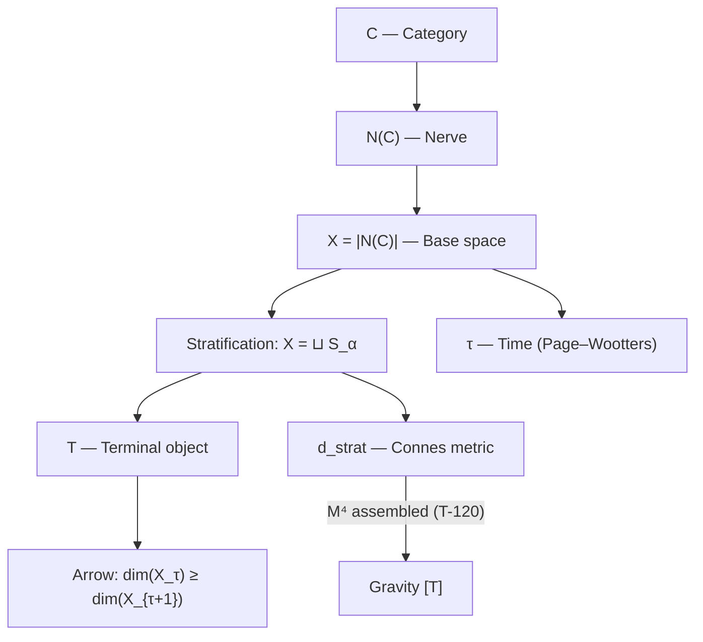

# Spacetime Structure

:::info Who this chapter is for
This chapter is one of the most remarkable in the theory. Space and time are **not postulated** — they are *derived* from the structure of the category $\mathcal{C}$. This means that the 3+1-dimensional world we inhabit is a **consequence**, not a premise, of the theory.

**Analogy: the chessboard.** Imagine that the rules of chess define the board, not the other way around. Usually we think: first there is a board (space), then pieces play on it (matter). In UHM it is the opposite: first there are the rules of interaction (category $\mathcal{C}$ with CPTP-morphisms), and from these rules it **follows** that the "board" has exactly 6 dimensions (with compactification to 3+1). If the rules were different — the "board" would be different. Spacetime is not an arena, but a consequence.

**What is concretely derived:**
- **Base space** $X = |N(\mathcal{C})|$ — from the nerve of the category (geometric realization of the simplicial set of objects and morphisms)
- **Time** — from the Page–Wootters mechanism (correlation with the O measurement) and stratification (collapse to the terminal object T)
- **Metric** — from Connes' spectral triple (distance formula via the Dirac operator)
- **Dimensionality** 6D = 7 - 1; the compactification to 3+1D "via sectoral decomposition" is **retracted [✗]** (2026-09-25) — the axis split $7=1_O\oplus3_{\{A,S,D\}}\oplus\bar{3}_{\{L,E,U\}}$ is not a decomposition under $\mathrm{SU}(3)$ ([details](#секторная-декомпозиция)). Its replacement, [Theorem 48c](#теорема-48c), obtains one time and three space directions, a Lorentzian signature and a rotation group $\mathrm{SO}(3)$ that commutes with colour from the complex numbers $\mathbb C_O$ generated by the clock unit: [T] as mathematics, [C at (Q)] as physical spacetime
- **Lorentzian signature** — $(1,3)$ **[C]** (registry row T-53): 1 time from Page–Wootters [T]; 3 space from $S^3$, which is computed in T-119 [T] (as mathematics; its coordinates are colour-charged); the Lorentzian sign holds at reflection positivity (bounded-below $H_S$). The Krein–Lorentzian triple below is a consistency check, not a derivation of the sign
- **Gravity** — from the full spectral action (Einstein equations as a consequence)
- **Background independence** — $M^4=\mathbb R\times S^3$ computed algebraically: time from the depth register, space as the spectrum of three commuting rotation charges, **[T]** as mathematics since 2026-09-25 ([T-117–T-121](/docs/proofs/physics/emergent-manifold)); the reading of that $S^3$ as physical space is [I]

This is a radical departure from standard physics, where spacetime is a given on which dynamics unfolds. In UHM dynamics *generates* spacetime.
:::

:::info Section status (per item)
- **Base space:** [T] $X = |N(\mathcal{C})|$ — geometric realization of the nerve of the category
- **Time:** [T] Formalized via the [emergent time theorem](../../proofs/dynamics/emergent-time): the cyclic clock $\tau \in \mathbb{Z}_7$ (T-53a), the dynamics relative to the [depth register](/docs/proofs/dynamics/emergent-time#114-регистр-глубины) (T-53b [T]) and the time line $C_0(\mathbb{R})$ as its scaling limit (T-118 [T])
- **Metric:** [T] Connes stratified metric $d_{strat}$
- **Lorentzian signature:** $(1,3)$ **[C]** (registry row T-53) — the time count is [T]; the spatial slice $\Sigma^3=S^3$ is computed in T-119 [T]; the sign holds at reflection positivity (bounded-below $H_S$). The [Krein–Lorentzian spectral triple](#теорема-крейнова-тройка) ($\beta=\gamma^0\otimes1$, $\mathcal D$ Krein-self-adjoint) realises the signature consistently but does not select it
- **Gravity:** [T] Full spectral action from the finite triple
- **Background independence:** [T] as mathematics — $M^4=\mathbb R\times S^3$ computed ([T-120](/docs/proofs/physics/emergent-manifold#теорема-произведение-троек)); reading [I]. History of 2026-09-25: it read [T], then [C] at an aperiodic clock (discharged by the depth register) and at the open reconstruction axioms of T-119 (discharged by the restatement of T-119, which computes the spectrum)
:::

## Base space X = $|N(\mathcal{C})|$ {#базовое-пространство}

:::warning Property 5 (Stratification) [D]
The base space of the theory is defined as the geometric realization of the nerve of the category:

$$X = |N(\mathcal{C})|$$

where $\mathcal{C}$ is the [primitive UHM category](./axiom-omega#примитив).
:::

### Autopoiesis of the base space {#автопоэтичность}

Key property: **X is defined endogenously**, not introduced from outside.

| Aspect | Traditional theories | UHM |
|--------|---------------------|---------|
| Base space | Postulated (ℝ⁴, Σ, ...) | Derived from $\mathcal{C}$ |
| Metric | Introduced by hand | Computed from spectral data |
| Topology | Fixed | Follows from the nerve structure |

### Nerve of the category $N(\mathcal{C})$ {#нерв-категории}

**Definition (Nerve):**

The nerve $N(\mathcal{C})$ is a simplicial set:
- 0-simplices: objects of $\mathcal{C}$ (holons $\mathbb{H}$)
- 1-simplices: morphisms $f: A \to B$
- n-simplices: composable chains of morphisms

**Geometric realization:**

$$|N(\mathcal{C})| = \left( \bigsqcup_n \Delta^n \times N_n \right) \Big/ \sim$$

where the equivalence relation glues the faces of simplices.

### Stratification of X {#стратификация-x}

**Definition (Stratification):**

The space X is partitioned into strata:

$$X = \bigsqcup_{\alpha \in A} S_\alpha$$

where:
- $S_0 = \{T\}$ — 0-dimensional stratum (terminal object)
- $S_1$ — 1-dimensional stratum (morphisms into T)
- $S_n$ — n-dimensional stratum (n-simplices)

**Key property:** The closure of each stratum contains strata of lower dimension.

### Local-global dichotomy {#локально-глобальная-дихотомия}

::::warning Theorem (Local-global dichotomy) [T]
For the base space $X = |N(\mathcal{C})|$:

**Globally (monism):**
$$H^n(X, \mathcal{F}) = 0 \quad \forall n > 0$$

**Locally (physics):**
$$H^*_{loc}(X, T) \cong \tilde{H}^{*-1}(\text{Link}(T)) \cong \tilde{H}^{*-1}(S^5) \neq 0$$

:::note Link dimension
Since $\dim(X)=6$ (the nerve of the $7$-stratum chain $S_0\subset\cdots\subset S_6$ realises as a $6$-simplex), the link of the point $T$ is $\mathrm{Link}(T)=S^{6-1}=S^{5}$, not $S^6$ ($S^6$ would require $\dim X=7$). The local cohomology $H^*_{loc}(X,T)\cong\tilde H^{*-1}(S^5)$ is nonzero in degree $6$, so the local-nontriviality conclusion $H^*_{loc}\neq 0$ is unchanged.
:::
::::

**Interpretation:**

| Aspect | Global (H* = 0) | Local (H*_loc ≠ 0) |
|--------|---------------------|------------------------|
| Ontology | The One exists | Multiplicity of structures |
| Topology | Contractible to T | Rich geometry near T |
| Physics | Convergence to equilibrium | Local topological effects |
| Time | Global arrow toward T | Local fluctuations |

**Consequence:** Monism and physics are **compatible** — global contractibility does not exclude local non-triviality.

---

## Connes stratified metric {#метрика-конна}

### Spectral triple for strata {#спектральная-тройка}

On each stratum $S_\alpha$ a spectral triple is defined:

$$(A_\alpha, H_\alpha, D_\alpha)$$

where:
- $A_\alpha = C(S_\alpha)$ — algebra of functions on the stratum
- $H_\alpha = L^2(S_\alpha, E_\alpha)$ — Hilbert space of sections
- $D_\alpha$ — Dirac operator on the stratum

### Distance formula d_strat {#формула-расстояния}

:::warning Theorem (Stratified metric) [T]
The distance between pure states $\omega_1, \omega_2 \in X$:

$$d_{strat}(\omega_1, \omega_2) = \inf_{\gamma} \int_\gamma ds_\alpha$$

where:
- $\gamma$ — a path crossing strata $S_{\alpha_1}, S_{\alpha_2}, \ldots$
- $ds_\alpha$ — Connes metric on stratum $S_\alpha$:

$$d_\alpha(p, q) = \sup\{|f(p) - f(q)| : \|[D_\alpha, f]\| \leq 1\}$$

- The infimum is taken over all paths connecting $\omega_1$ and $\omega_2$
:::

### Metric near the terminal object {#метрика-вблизи-t}

Near $T$ (the apex of the cone) the metric has a cone structure:

$$d_{strat}(x, T) \sim r \cdot d_{S^5}(\pi(x), \text{base point})$$

where:
- $r$ — the "radial" coordinate (distance to T)
- $\pi$ — projection onto the link $\text{Link}(T) \cong S^5$

**Interpretation:** The distance to the attractor decreases during evolution — the system "approaches" T.

---

## Space as a structure of differences

:::note Space is not a stage, but a relation
We are accustomed to thinking of space as a "stage" on which physics plays out: first there is an empty room (space), then objects are placed in it (matter). In UHM space is not a stage, but a *structure of differences between states*. The distance between two points is a measure of how hard it is to deform one state into another. If two states transition into each other easily — they are "close"; if this requires a major restructuring — they are "far." Space arises as a by-product of differences, not as their container. This resolves the fundamental problem of quantum gravity: if space is not a given but a consequence, its quantization does not lead to contradictions.
:::

Space is **not an empty container**, but a structure of differences in the category $\mathcal{C}$.

### Distance {#расстояние}

In the updated theory, distance is defined via the [Connes stratified metric](#метрика-конна):

$$
d(A, B) := d_{strat}(A, B)
$$

**The circularity problem is resolved:** The distance is derived from spectral data on the strata $S_\alpha$, not from an a priori notion of "points in space."

:::note Comparison with previous version
In early versions of the theory the formula $d(A, B) = \|\Gamma_A - \Gamma_B\|_F$ was used, which contained a **circular dependence**. The new construction via $X = |N(\mathcal{C})|$ eliminates this problem — space is **derived** from the categorical structure.
:::

### Topology {#топология}

:::warning Theorem (Topology of X) [T]
The topology of the base space is fully determined by the categorical structure:

$$\text{Top}(X) = \text{Top}(|N(\mathcal{C})|)$$

**Properties:**
- Globally: $X$ is contractible to the terminal object $T$
- Locally: Near $T$ the topology is non-trivial ($\text{Link}(T) \cong S^5$)
:::

**Status:** [T] Formalized. Topology is **derived** from the nerve structure of the category.

## Emergent time

:::note Time is not a river, but a correlation
In everyday experience time seems like a "river" carrying us from past to future. In UHM time is something entirely different. It **emerges** from correlations between subsystems. Imagine a clock and an observer as a single quantum system. "Time = 3 o'clock" means not "the river has reached mark 3," but "the state of the clock correlates with a certain state of the observer." The universe as a whole is *timeless* (satisfies the constraint $[\hat{C}, \Gamma_{\text{total}}] = 0$); time arises *within* it — as the relation of "the clock" (the O measurement) to "the rest" (6 dimensions). This is the solution to the "problem of time" in quantum gravity proposed by Page and Wootters in 1983.
:::

:::warning Theorem (Emergence of time) [T]
Time is **derived** from the structure of the category $\mathcal{C}$ in four equivalent ways:

| Level | Time as... | Formula | Status |
|---------|--------------|---------|--------|
| **Page–Wootters** | Correlation with [O](../structure/dimension-o) | $\Gamma(\tau) = \text{Tr}_O[\cdot]$ | [T] Formalized |
| **Information geometry** | Distance in the Bures metric | $d_B(\Gamma_1, \Gamma_2)$ | [T] Formalized |
| **Categorical** | 1-morphism in ∞-groupoid | $\gamma: \Gamma_1 \to \Gamma_2$ | [T] Formalized |
| **Stratification** | Collapse of strata to T along the depth $n$ | $\dim(X_n) \geq \dim(X_{n+1})$ | [T] Formalized |

[Full proof →](../../proofs/dynamics/emergent-time)
:::

### Page–Wootters mechanism {#механизм-page-wootters}

Time arises as the parameter of **conditional states** with respect to the O measurement:

$$
\Gamma(\tau) := \frac{\text{Tr}_O\left[ (|\tau\rangle\langle \tau|_O \otimes \mathbb{1}_{6D}) \cdot \Gamma_{total} \right]}{p(\tau)}
$$

where:
- $\Gamma_{total}$ satisfies the constraint $[\hat{C}, \Gamma_{total}] = 0$
- $|\tau\rangle_O$ — basis of eigenstates of the internal clock O
- p(τ) — normalization

:::info The continuity of τ is an output, not an assumption (T-286)
The Page–Wootters parameter ranges over a *continuum* — and that used to be a silent premise. The genesis layer discharges it: the guaranteed closure of the self-model (the ouroboros $\rho^* = \varphi(\Gamma)$, T-222) forces the intermediate-value property, hence Dedekind completeness of the scalars, hence $\mathbb{R}$ — with an explicit witness that over an incomplete field the self-model can miss its fixed point through a "hole in the line". Relational time inherits its continuity from the continuity the ouroboros demands: see [T-286](/docs/core/foundations/hypermathematics#уровень-поля) [T].
:::

### Information-geometric time

Distance between configurations in the Bures metric:

$$
d_B(\Gamma_1, \Gamma_2) = \arccos\left( \text{Tr}\sqrt{\sqrt{\Gamma_1} \Gamma_2 \sqrt{\Gamma_1}} \right)
$$

:::note Notation
Here $d_B$ is the Bures angle (not the chordal distance $\sqrt{2(1-\sqrt{F})}$ from [evolution.md](../dynamics/evolution#каноническое-delta-f)).
:::

**Flow of time** — the rate of change of Γ:

$$
\frac{d\tau_{int}}{d\sigma} = \left\| \frac{d\Gamma}{d\sigma} \right\|_B
$$

Time "flows faster" when Γ changes more strongly.

### Relation to evolution

Evolution is described with internal time τ:

$$
\frac{d\Gamma(\tau)}{d\tau} = -i[H_{eff}, \Gamma(\tau)] + \mathcal{D}[\Gamma(\tau)] + \mathcal{R}[\Gamma(\tau), E]
$$

This equation is a **consequence** of the structure of $\Gamma_{total}$, not a postulate.

## Arrow of time {#стрела-времени}

:::note Why time flows in one direction
The arrow of time is one of the deepest puzzles in physics. Why do we remember the past but not the future? Why does a broken cup not reassemble? In standard physics the arrow of time is associated with the growth of entropy (the second law of thermodynamics), but the second law itself is usually *postulated* or derived from the initial conditions of the Big Bang. In UHM it is simpler: the arrow of time is a **geometric consequence** of the existence of the terminal object $T$. If the category has a "final point" toward which everything tends (like the bottom of a funnel), then the direction — from the periphery to the center — is *defined by the structure*, not by initial conditions.
:::

:::warning Theorem (Arrow of time as collapse of strata) [T]
The arrow of time is a **geometric consequence** of the terminal object $T$:

$$\dim(X_n) \geq \dim(X_{n+1})$$

along the stratal depth $n \in \mathbb{N}$ (the cumulative tick count — the cyclic label $\tau \in \mathbb{Z}_7$ carries no arrow, [two indices, one arrow](/docs/proofs/dynamics/emergent-time#временная-стратификация)), with equality only at stationarity.

**Three equivalent formulations:**

| Formulation | Formula | Source |
|--------------|---------|----------|
| Geometric | $\dim(X_n) \geq \dim(X_{n+1})$ | [Property 3](./axiom-omega#свойство-3) |
| Entropic | $\sigma(\gamma) \cdot \Delta S_{vN}(\gamma) \geq 0$ | Unital CPTP structure only (see the retraction under "Thermodynamic direction") |
| Convergence | $\lim_{n \to \infty} X_n = \{T\}$ | Terminality of T |

[Full proof →](../../proofs/dynamics/emergent-time#10-стратификационное-время)
:::

**Interpretation:** The arrow of time is the **progressive collapse of higher strata** to the terminal object $T = \Gamma^*$ (the global attractor).

:::note Resolution of the circularity problem
In early versions of the theory the arrow of time was linked to CPTP channels, which contained a hidden circularity. Now the arrow of time is **derived geometrically** from the terminal object — this is a structural property of the category $\mathcal{C}$, independent of the CPTP interpretation.
:::

### Thermodynamic direction

The arrow of time is defined by the direction of increase of the [von Neumann entropy](../dynamics/coherence-matrix#энтропия-фон-неймана):

$$
\frac{dS_{vN}}{d\tau} \geq 0
$$

:::note Distinction of concepts
**Arrow of time as collapse of strata** (theorem above) — this is a **structural property** of the category $\mathcal{C}$, derivable from the existence of the terminal object T.

**Global increase of differentiation** ($dD_{\text{diff}}/d\tau > 0$) — this is a [separate cosmological hypothesis](/docs/physics/cosmology-phys/origin#направление-эволюции), having the status of a **non-falsifiable philosophical position**.

These concepts are related (both concern direction), but have different epistemological status.
:::

~~This inequality is a **consequence** of the properties of CPTP channels: they do not decrease entropy.~~ **Retracted 2026-09-25:** a CPTP channel can lower the von Neumann entropy — the constant channel $X \mapsto \mathrm{Tr}(X)\,\Gamma'$ sends $I/7$ to any $\Gamma'$ — so the inequality holds only for **unital** generators ($\mathcal{L}(I) = 0$), such as the Hamiltonian part and dissipators with Hermitian Lindblad operators. For a quantum dynamical semigroup with a stationary state $\rho_\infty$ the monotone quantity is the relative entropy: $\tfrac{d}{d\tau} D_{KL}(\Gamma(\tau)\,\|\,\rho_\infty) \leq 0$ (Spohn, *J. Math. Phys.* **19**, 1227 (1978)). The UHM generator is not unital — regeneration $\mathcal R$ and the anchor pull toward $\rho^* \neq I/7$ and lower $S_{vN}$ on the way from $I/7$ to the attractor — and, being nonlinear, it lies outside the scope of that 1978 result as well; no entropy-type monotone is established for the full $\mathcal L_\Omega$.

:::note Clarification
In the presence of [regeneration](../dynamics/evolution#3-регенеративный-член) $\mathcal{R}$ a local decrease in entropy is possible due to the import of free energy:

$$
\Delta S_{vN}^{local} < 0 \Rightarrow \Delta F_{env \to sys} > 0
$$

The total entropy (system + source) always grows.
:::

### Second law of thermodynamics {#второй-закон}

:::warning Theorem (Second law from the unital-channel order) [T]
The second law of thermodynamics is a **consequence** of the **majorization order** induced by the unital-channel refinement of morphisms (see [Mathematical foundations §terminal object](/docs/core/foundations/mathematical-foundations)):

$$\forall \Gamma:\quad \Gamma \xrightarrow{\ \text{unital CPTP}\ } I/7 \quad\text{iff}\quad I/7 \prec \Gamma \ (\text{always}),\qquad I/7 \not\to \sigma\ \text{for }\sigma\neq I/7.$$

Under unital channels $I/7$ is the unique **sink**: every state majorizes $I/7$, and no unital channel leaves $I/7$, so the arrow of time (monotone increase of von Neumann entropy = descent in majorization order) is **irreversible** — there is no unital return path from $I/7$.

**Caveat:** in the *full* CPTP category the earlier "$\exists! f:\Gamma\to T$" is false (the constant channel $X\mapsto\mathrm{Tr}(X)\Gamma'$ reaches any $\Gamma'$); the irreversibility statement is a theorem specifically of the **unital** (entropy-non-decreasing) morphism class.
:::

**Geometric interpretation:**

| Aspect | Formulation | Consequence |
|--------|--------------|-----------|
| Sink (unital order) | $\forall \Gamma:\ I/7 \prec \Gamma$; $I/7\not\to\sigma\ (\sigma\neq I/7)$ | All dissipative paths lead to T |
| Collapse of strata | $\dim(X_n) \geq \dim(X_{n+1})$ | Dimensionality does not grow along the depth $n$ |
| Entropy (unital channels) | $dS_{vN}/d\tau \geq 0$ for unital generators only | Entropy does not decrease along unital dynamics; for a general quantum dynamical semigroup the monotone is $D_{KL}(\Gamma\|\rho_\infty)$ (Spohn 1978) |

**Status:** [T] Formalized for the unital morphism class. The second law is **derived** from categorical structure for unital dynamics; the full UHM generator is not unital (see "Thermodynamic direction").

### Relation to the Heaviside function

The gate $g_V(P)$ in the regenerative term (refining $\Theta(\Delta F)$ from Landauer) is **not a postulate**, but a consequence:

$$
\mathcal{R}[\Gamma, E] \propto g_V(P) \quad \Leftarrow \quad \text{thermodynamics of CPTP + V-preservation}
$$

## Relativity

### Internal clocks

Different Holons can have different "internal clocks" — different rates of evolution:

$$
\tau_{\mathbb{H}_1} \neq \tau_{\mathbb{H}_2}
$$

where $\tau_{\mathbb{H}}$ is the proper time of the [Holon](../structure/holon) $\mathbb{H}$.

### Relativistic effects [C] {#релятивистские-эффекты}

:::tip Theorem (Relativistic effects from spectral triple) [C at T-53]
Gravitational and kinematic time dilation are consequences of the spectral triple T-53 [C] (its Lorentzian sign holds at reflection positivity, its spatial slice at T-119) and the full spectral action T-65 [T]. Connes' formula defines the metric $g_{\mu\nu}$, and the spectral action reproduces the Einstein–Hilbert action, which includes all relativistic effects.

**Proof.**

**Step 1 (Metric from Connes formula).** From T-53 [C] ([spectral triple](#теорема-спектральная-тройка)):

$$d(p, q) = \sup\{|f(p) - f(q)| : \|[D, f]\| \leq 1\}$$

The block-diagonal structure of $D$ with $g_{00} = 1/|D_O|^2 > 0$, $g_{aa} = -1/|D_{3,a}|^2 < 0$ defines the Lorentzian metric $g_{\mu\nu}$.

**Step 2 (Einstein–Hilbert action).** From T-65 [T] ([full spectral action](/docs/physics/gravity/quantum-gravity#теорема-полное-спектральное-действие)):

$$S = \mathrm{Tr}(f(D/\Lambda)) = \int (a_0\Lambda^4 + a_2\Lambda^2 R + a_4 C_{\mu\nu\rho\sigma}^2 + \ldots)\sqrt{g}\,d^4x$$

The coefficient $a_2\Lambda^2 R$ gives the kinetic term of gravity, i.e., the Einstein–Hilbert action.

**Step 3 (Time dilation).** Formula for the rate of internal clocks:

$$\frac{d\tau}{d\sigma} = \omega_0 \cdot \sqrt{\sum_{i \neq O} |\gamma_{Oi}|^2 \cdot \mathrm{Gap}(O,i)^2}$$

$\mathrm{Gap}(O,i)$ includes gravitational corrections via the metric $g_{\mu\nu}$: in a region of strong gravitational field (small $g_{00}$) the eigenvalues of $D_O$ are modified, which slows $d\tau/d\sigma$. Similarly, kinematic time dilation follows from the Lorentz transformation of spectral data. $\blacksquare$
:::

## Emergence of geometry {#эмерджентность-геометрии}

:::info Section status
- **Metric:** [T] Formalized via $d_{strat}$ (see [above](#метрика-конна))
- **Dimensionality:** [T] 6D follows from $N = 7$ (dim = N - 1)
- **Relation to GR:** [T] as mathematics — $M^4=\mathbb R\times S^3$ computed ([T-120](/docs/proofs/physics/emergent-manifold#теорема-произведение-троек)); it read [C] at the open reconstruction axioms of T-119 until the restatement of 2026-09-25
:::

### Derived metric (not a hypothesis)

In UHM the metric is **derived**, not postulated:

$$d_{strat}(\omega_1, \omega_2) = \inf_{\gamma} \int_\gamma ds_\alpha$$

**Key properties:**
- Metric defined on $X = |N(\mathcal{C})|$
- Accounts for stratification (different ds on different strata)
- Cone-like near the terminal object T

### Dimensionality of space {#размерность}

**Theorem (Dimensionality):**

$$\dim(X) = N - 1 = 6$$

where $N = 7$ is the number of dimensions of the [Holon](../structure/holon).

**Consequence:** The 6D structure arises **endogenously**, it is not postulated.

### Relation to GR (program) {#связь-с-ото}

:::tip Background independence [C]; sectoral decomposition retracted [✗]
The transition from 7D (= 6D + time) to the observable 3+1D was formalized via the sectoral decomposition $7 = 1_O \oplus 3_{\{A,S,D\}} \oplus \bar{3}_{\{L,E,U\}}$, with the masslessness of gluons (the $\{A,S,D\}$ "$\mathbf{3}$-sector") giving non-compact space and the massiveness of $W,Z$ (the $\{L,E,U\}$ "$\bar{\mathbf{3}}$-sector") a compactification at $v_{\text{EW}}$. This is **retracted [✗]** (2026-09-25): no three of the six non-$O$ axes span an $\mathrm{SU}(3)$-invariant subspace, so neither axis set is a sector. Details — [Sectoral decomposition](#секторная-декомпозиция).

**Results:** The [finite spectral triple](#теорема-спектральная-тройка) $(A_{\text{int}}, H_{\text{int}}, D_{\text{int}})$ is written down (T-53; its KO-dimension-6 claim is retracted, see Step 6 there). The spectral action $S = \text{Tr}(f(D/\Lambda))$ gives $\int(a_0\Lambda^4 + a_2\Lambda^2 R + \ldots)\sqrt{g}\,d^4x$ [T] (T-65, [full spectral action](/docs/physics/gravity/quantum-gravity#теорема-полное-спектральное-действие)). The product of triples $M^4 \times F_{\text{int}}$ is obtained from the categorical structure along the chain of [T-120](/docs/proofs/physics/emergent-manifold#теорема-произведение-троек): the macroscopic algebra is commutative in the thermodynamic limit (T-117 [T]), the spectrum of three commuting rotation charges gives $\Sigma^3=S^3$ (T-119 [T], restated 2026-09-25), and the product $M^4 = \mathbb{R} \times S^3$ is assembled from these (T-120 [T]). Until the restatement T-119 was conditional and this page did not lean on T-120 as unconditional; it now does as mathematics, with the reading of $S^3$ as physical space [I].
:::

See [Correspondence with physics: GR](../../proofs/physics/physics-correspondence#5-связь-с-общей-теорией-относительности) for the detailed program.

## Emergence diagram

**Note:** The edge to "Gravity [T]" — $M^4$ is assembled from categorical structure via the Gel'fand–Naimark–Connes chain ([T-120](/docs/proofs/physics/emergent-manifold#теорема-произведение-троек)) which is [T] as mathematics since the restatement of T-119 (2026-09-25; before it the edge was [C] at the open reconstruction axioms of T-119); the Einstein equations themselves (T-65) hold on the product triple.

## Non-locality

### Quantum correlations

[Coherences](../dynamics/coherence-matrix#недиагональные-элементы-когерентности) $\gamma_{ij}$ between distant parts of $\Gamma$ mean **non-local connections**:

$$
\gamma_{AB} \neq 0 \Rightarrow A \text{ and } B \text{ are quantum-correlated}
$$

### Entanglement

Entanglement is the non-separability of the state of subsystems:

$$
\Gamma_{AB} \neq \Gamma_A \otimes \Gamma_B
$$

where $\Gamma_A = \mathrm{Tr}_B(\Gamma_{AB})$ is the [partial trace](/docs/consciousness/foundations/interiority-theory#редуцированная-матрица-опыта) over subsystem $B$.

Violation of Bell inequalities is a consequence of non-zero coherences in the structure of $\Gamma$.

## Relation to physics

| Physical concept | Expression via $\mathcal{C}$ | Status |
|--------------------|-------------------------------|--------|
| **Base space** | $X = \lVert N(\mathcal{C})\rVert$ | [T] [Formalized](#базовое-пространство) |
| **Time** | Parameter τ (Page–Wootters) | [T] [Formalized](../../proofs/dynamics/emergent-time) |
| **Arrow of time** | Collapse of strata to T | [T] [Formalized](#стрела-времени) |
| **Metric** | $d_{strat}$ (Connes on strata) | [T] [Formalized](#метрика-конна) |
| **Dimensionality** | $\dim(X) = 6$ | [T] Consequence of $N = 7$ |
| Energy | Eigenvalues of $H_{eff}$ | [T] Formalized |
| Gravity | Spectral action on $M^4 \times F_{\text{int}}$, $M^4$ assembled by T-120; the former entry "compactification 6D → 4D" is retracted [✗] with the sectoral decomposition | [T] as mathematics [Emergent manifold](/docs/proofs/physics/emergent-manifold) (T-120; [C] until the restatement of T-119, 2026-09-25) |
| Topological charges | IC-cohomology of strata | [T] [Formalized](../../proofs/categorical/categorical-formalism#производные-категории) |

## Relation to other approaches

| Approach | Relation to UHM | Status |
|--------|-------------|--------|
| **Quantum mechanics** | Special case of UHM at $R \to 0$ | [Proven](../../proofs/physics/physics-correspondence#3-редукция-к-квантовой-механике) |
| **Standard Model** | Gauge symmetries from $\text{Sym}(\Gamma)$ | [Program](../../proofs/physics/physics-correspondence#6-калибровочные-симметрии-и-стандартная-модель) |
| **Loop quantum gravity** | Spin networks may correspond to coherence structures | Not investigated |
| **String theory** | Possible connection via holographic principle | Not investigated |
| **Hoffman Conscious Agents** | Spacetime as interface consistent with emergence | Conceptually compatible |
| **Emergent gravity (Verlinde)** | Similar approach: gravity as entropic force | Requires investigation |
| **Octonionic lineage** (Günaydın–Gürsey 1973; Manogue–Dray 1999; Boyle 2026) | Same split $1\oplus3\oplus\bar{3}$, read as colour; four-dimensional spacetime from the choice of one imaginary unit | Prior art — see [Precedents](#прецеденты-3-плюс-1) |

## What is formalized vs Research program

| Statement | Status | Comment |
|-------------|--------|-------------|
| **Base space $X = \lVert N(\mathcal{C})\rVert$** | [T] Formalized | [Property 5](./axiom-omega#свойство-5) |
| **Time as Page–Wootters parameter** | [T] Formalized | [Theorem proved](../../proofs/dynamics/emergent-time) |
| **Arrow of time as collapse of strata** | [T] Formalized | Follows from terminality of T |
| **Metric $d_{strat}$** | [T] Formalized | [Connes stratified metric](#метрика-конна) |
| **Dimensionality 6D** | [T] Formalized | Consequence of $N = 7$ |
| **Local-global dichotomy** | [T] Formalized | [H* = 0 globally, H*_loc ≠ 0 locally](#локально-глобальная-дихотомия) |
| **Lorentzian signature** | signature $(1,3)$ [C] (T-53: time count [T], spatial slice $S^3$ from T-119 [T], sign at reflection positivity) | [UHM spectral triple](#теорема-спектральная-тройка) |
| **Compactification 7D → 3+1D** | retracted [✗] | [Sectoral decomposition](#секторная-декомпозиция): the axis split is not an $\mathrm{SU}(3)$ decomposition |
| **3+1 with rotations that commute with colour** | [T] as mathematics; [C at (Q)] as spacetime | [Theorem 48c](#теорема-48c): the colour-singlet part of $\mathfrak h_2(\mathbb O)$ is $\mathfrak h_2(\mathbb C_O)\cong\mathbb R^{1,3}$ |
| **Background independence ($M^4$ assembled)** | [T] as mathematics (T-118, T-119 restated); reading [I]; it read [C] at the open reconstruction axioms of T-119 until 2026-09-25 | [T-120](/docs/proofs/physics/emergent-manifold#теорема-произведение-троек) |
| **Einstein equations** | [T] | Spectral action from the full triple |

:::info Progress
The circularity problem of $\Gamma_A$ has been **resolved** conditionally: space is now assembled from the categorical structure $\mathcal{C}$, not from a priori "points" — by T-119 and T-120, both [T] as mathematics since 2026-09-25; the reading of the computed $S^3$ as physical space is [I].
:::

## Sectoral decomposition of dimension 7 = 1 + 3 + 3̄ {#секторная-декомпозиция}

:::danger Retracted [✗] (2026-09-25): 3+1 from $7=1_O\oplus3_{\{A,S,D\}}\oplus\bar3_{\{L,E,U\}}$
This section claimed that the $\mathrm{SU}(3)_C$ fixing $O$ splits the seven axes into time $O$, a spatial triplet $\{A,S,D\}$ and a compact anti-triplet $\{L,E,U\}$, and read 3+1 dimensions off that split; the split is false — none of the 20 triples of non-$O$ axes spans an $\mathrm{SU}(3)$-invariant subspace, and the commutant of $\mathfrak{su}(3)$ on those six axes is two-dimensional, so $\mathbb{R}^6$ is irreducible (of complex type) and the only invariant real splitting is $\mathbb{R}e_O\oplus\mathbb{R}^6$. What replaces it is the complexified decomposition $\mathbb{C}^7=\mathbb{C}e_O\oplus\mathbf 3\oplus\bar{\mathbf 3}$ with $\mathbf 3=\mathrm{span}_{\mathbb C}\{A-iD,\ S-iU,\ L-iE\}$ **[T]** — standard mathematics and prior art (Günaydın and Gürsey 1973, see [precedents](#прецеденты-3-плюс-1)) — which assigns no axis to "space" and none to "compact", and therefore yields no 3+1 count.

- *Numbers* (`website/scripts/check_core_numbers.py`, `test_no_axis_triple_is_su3_invariant`): $\dim\mathrm{Der}(\mathbb{O})=14$, $\dim\mathrm{Stab}(e_O)=8$; invariant axis triples $0$ of $20$; commutant $2$; left multiplication by $e_O=e_7$ pairs $A\leftrightarrow D$, $S\leftrightarrow U$, $L\leftrightarrow E$. Only a one-dimensional $\mathfrak{u}(1)\subset\mathfrak{su}(3)$ maps the span of $\{A,S,D\}$ into itself, so $\mathrm{SU}(3)$ does not act on $\{A,S,D\}$ as on a triplet.
- *Retracted with it on this page:* the theorem and Steps 2–5 below, the corollary $\dim(\text{space})=|\mathbf{3}|=3$, the Kaluza–Klein corollary, part (b) and Steps 2 and 5 of the theorem "Spacetime from spectral triple", and the $\{A,S,D\}$ leg of (M2). Registry: rows 48a and C11.
- *What survives:* one time direction from the Page–Wootters clock [T]. Three spatial directions are claimed through T-119 (the rank of $\mathfrak{u}(3)$; restated 2026-09-25 as the computed spectrum $S^3$, [T] as mathematics), which reads the colour algebra as the spatial one and so meets the Coleman–Mandula obstacle named in the precedents. A derivation that avoids it is [Theorem 48c](#теорема-48c) below: [T] as mathematics, [C at (Q)] as physical spacetime. It does not restore this section's split and gives no axis the role of space.
:::

### Theorem 48c (Spacetime that commutes with colour) — mathematics [T], physical 3+1 [C at (Q)] {#теорема-48c}

The retraction above leaves the question open: where do three spatial directions come from, together with a rotation group that is *not* colour? Coleman and Mandula require the second part: internal symmetries commute with spacetime symmetries ([precedents](#прецеденты-3-плюс-1)). Part (g) below shows that no rotation of the holon's own seven axes satisfies it. What satisfies it is the route of the octonionic lineage (Kugo–Townsend, Manogue–Dray): a $2\times2$ Hermitian matrix over the octonions. In that route the preferred imaginary unit was a free choice. Here colour fixes it, and it is UHM's $O$.

**Notation.** $e_O=e_7$ in the canonical table ([G₂-structure, §2.2](/docs/physics/gauge-symmetry/g2-structure#октонионное-умножение-и-g2)); $\mathrm{SU}(3)_C=\mathrm{Stab}_{G_2}(e_O)$; $\mathbb C_O=\mathbb R1\oplus\mathbb Re_O\subset\mathbb O$ is the complex subalgebra generated by the clock unit. $\mathfrak h_2(\mathbb K)$, for a subalgebra $\mathbb K\subseteq\mathbb O$, is the real vector space of matrices $X=\begin{pmatrix}a&x\\\bar x&b\end{pmatrix}$ with $a,b\in\mathbb R$, $x\in\mathbb K$, with the quadratic form $\det X=ab-\lvert x\rvert^2$; $G_2$ acts on $\mathfrak h_2(\mathbb O)$ entry by entry.

:::tip Theorem 48c — (a)–(g) [T]; the 3+1 reading [C at (Q)]
**(a) Colour fixes exactly the clock's complex numbers.** The elements of $\mathbb O$ fixed by $\mathrm{SU}(3)_C$ are exactly $\mathbb C_O$. A unit $u\in\mathrm{Im}\,\mathbb O$ whose left multiplication commutes with $\mathrm{SU}(3)_C$ is $\pm e_O$. The complex structures on $\mathbb R^6=\mathbb C_O^\perp$ that commute with $\mathrm{SU}(3)_C$ are exactly $\pm L_{e_O}$.

**(b) The colour-singlet part is Minkowski space.** $\mathfrak h_2(\mathbb O)\cong\mathbb R^{1,9}$. Its $\mathrm{SU}(3)_C$-fixed subspace is $\mathfrak h_2(\mathbb C_O)$, of dimension $4$ and signature $(1,3)$. Its $\det$-orthogonal complement $W=\bigl\{\begin{pmatrix}0&w\\\bar w&0\end{pmatrix}: w\perp\mathbb C_O\bigr\}\cong\mathbb C^3$ is negative definite and carries the colour triplet.

**(c) The Lorentz algebra is the centraliser of colour.** The centraliser of $\mathfrak{su}(3)_C$ in $\mathfrak{so}(1,9)$ is $\mathfrak{so}(1,3)\oplus\mathfrak u(1)$, of dimension $6+1=7$. The $\mathfrak{so}(1,3)$ acts on $\mathfrak h_2(\mathbb C_O)$ and trivially on $W$; the $\mathfrak u(1)$ acts on $W$ as $L_{e_O}$ and trivially on $\mathfrak h_2(\mathbb C_O)$.

**(d) The Lorentz group.** $M\in\mathrm{SL}(2,\mathbb C_O)$ acts by $X\mapsto MXM^\dagger$. The action is well defined (the bracketing does not matter), preserves $\det$, induces $\mathrm{SO}^+(1,3)$ on $\mathfrak h_2(\mathbb C_O)$, is the identity on $W$ and commutes with $\mathrm{SU}(3)_C$. Hence $\mathrm{SL}(2,\mathbb C_O)$ and $\mathrm{SU}(3)_C$ act as a direct product.

**(e) One time, three space.** The maximal compact part $\mathrm{SU}(2)\times\mathrm U(1)$ of the centraliser fixes exactly one line, $\mathbb R\,1_2$. It is timelike: $\det 1_2=1>0$. $\mathrm{SU}(2)$ acts as $\mathrm{SO}(3)$ on the three traceless directions $\sigma_z$, $\sigma_x$, $e_O\sigma_y$, which are spacelike. The signature is Lorentzian because $\det$ is: no sign is chosen.

**(f) Spin and colour are separate factors.** On $\mathbb O^2$ the map $\psi\mapsto M\psi$ is a representation of $\mathrm{SL}(2,\mathbb C_O)$ that commutes with $\mathrm{SU}(3)_C$. As a $\mathbb C_O$-module $\mathbb O=\mathbb C_O\oplus\mathbb C^3$, so $\mathbb O^2=(\mathbf 2,\mathbf 1)\oplus(\mathbf 2,\mathbf 3)$: a colour-singlet Weyl spinor and a colour-triplet Weyl spinor.

**(g) No-go inside the holon.** The centraliser of $\mathfrak{su}(3)_C$ is $0$ in $\mathfrak g_2$, $\mathfrak u(1)$ in $\mathfrak{so}(7)$ and $\mathfrak u(1)^3$ in $\mathfrak u(7)$. No $\mathrm{SO}(3)$ acting on the seven axes commutes with colour. For each of the seven associative planes (Fano lines), the stabiliser in $\mathfrak g_2$ is $\mathfrak{so}(4)$ and acts on the plane as $\mathfrak{so}(3)$. It meets $\mathfrak{su}(3)_C$ in $\mathfrak u(2)$ for the three lines through $O$ and in an $\mathfrak{so}(3)$ for the other four. So the rotations of an associative plane are colour rotations.

**Physical reading — [C at (Q)].** Premise (Q) [H] has two parts. (Q1): the tangent vectors of spacetime at a point form the octonionic spin factor $\mathfrak h_2(\mathbb O)$, on which $\mathrm{Aut}(\mathbb O)=G_2$ acts entry by entry. (Q2): spacetime is its colour-singlet part, i.e. colour acts trivially on spacetime directions, as Coleman–Mandula demands. Under (Q), parts (b)–(e) give one time direction, three space directions, the signature $(1,3)$, and a rotation group $\mathrm{SO}(3)$ that commutes with $\mathrm{SU}(3)_C$. The Lorentz group is not put in: it is the non-compact part of the centraliser of colour. The $O$-direction appears here not as the time axis but as the imaginary unit of $\mathbb C_O$, which is also one spatial Pauli direction, $e_O\sigma_y$ [I].
:::

**Proof.** (a) $\mathrm{SU}(3)_C$ fixes $1$ and $e_O$. It acts on $\mathbb R^6$ irreducibly and transitively on the unit sphere $S^5$: the orbit of every unit vector is five-dimensional (numbers below). So it fixes no non-zero vector of $\mathbb R^6$. If $L_u$ commutes with every $\varphi\in\mathrm{SU}(3)_C$, then $\varphi(u)\varphi(x)=\varphi(ux)=u\,\varphi(x)$ for all $x$, so $\varphi(u)=u$ and $u\in\mathbb C_O\cap\mathrm{Im}\,\mathbb O=\mathbb Re_O$. The commutant of $\mathfrak{su}(3)$ on $\mathbb R^6$ is $\mathrm{span}\{1,L_{e_O}\}\cong\mathbb C$ (complex type, [sectoral decomposition](#секторная-декомпозиция)), and $(\alpha+\beta L_{e_O})^2=-1$ forces $\alpha=0$, $\beta=\pm1$.
(b) $G_2$ fixes the real diagonal, so a fixed matrix has its off-diagonal entry in $\mathbb O^{\mathrm{SU}(3)}=\mathbb C_O$. Write $a=t+z$, $b=t-z$, $x=x_1+x_2e_O$. Then $\det X=t^2-z^2-x_1^2-x_2^2$. For $z'\in\mathbb C_O$ and $w\perp\mathbb C_O$, $\lvert z'+w\rvert^2=\lvert z'\rvert^2+\lvert w\rvert^2$, so $W$ is $\det$-orthogonal to $\mathfrak h_2(\mathbb C_O)$ and $\det$ is $-\lvert w\rvert^2$ on $W$.
(c) An element of $\mathfrak{so}(1,9)$ that commutes with $\mathfrak{su}(3)$ preserves the isotypic components: the trivial one, $\mathfrak h_2(\mathbb C_O)$, and $W$, which is irreducible of complex type. Its restrictions lie in $\mathfrak{so}(1,3)$ and in the commutant of $\mathfrak{su}(3)$ inside $\mathfrak{so}(6)$, which is $\mathfrak u(1)$. Conversely every such pair commutes. Dimension $7$, confirmed numerically.
(d) Every entry of $MXM^\dagger$ is a sum of products $m\,x\,m'$ with $m,m'\in\mathbb C_O$. The subalgebra generated by $e_O$ and $x$ is associative (Artin), so $(MX)M^\dagger=M(XM^\dagger)$. On $\mathfrak h_2(\mathbb C_O)$ this is the standard spin covering $\mathrm{SL}(2,\mathbb C)\to\mathrm{SO}^+(1,3)$. On $W$, use $mw=w\bar m$ for $m\in\mathbb C_O$, $w\perp\mathbb C_O$ (because $e_Ow=-we_O$) and $\bar w=-w$. The off-diagonal entry becomes $m_{11}w\bar m_{22}+m_{12}\bar w\bar m_{21}=w\,\overline{m_{11}m_{22}-m_{12}m_{21}}=w\,\overline{\det M}=w$. The diagonal entry becomes $w(\bar m_{11}\bar m_{12}-\bar m_{12}\bar m_{11})=0$. So $MX_wM^\dagger=X_w$. Every $\varphi\in\mathrm{SU}(3)_C$ fixes the entries of $M$, so $\varphi(MXM^\dagger)=M\varphi(X)M^\dagger$. An element in both images acts trivially on $\mathfrak h_2(\mathbb C_O)$ and on $W$, so the product is direct.
(e) $\mathrm{SU}(2)$ acts on the traceless Hermitian $2\times2$ matrices by the adjoint representation, which is $\mathrm{SO}(3)$, and it fixes $1_2$. The $\mathrm U(1)$ fixes $\mathfrak h_2(\mathbb C_O)$ and has no fixed vector in $W$.
(f) By Artin, $(mm')x=m(m'x)$ for $m,m'\in\mathbb C_O$, so left multiplication gives a representation. $\mathrm{SU}(3)_C$ commutes with $L_{e_O}$, so it acts $\mathbb C_O$-linearly, as $\mathbf 1$ on $\mathbb C_O$ and as $\mathbf 3$ on $\mathbb C^3$.
(g) Linear algebra over the fourteen derivations of the canonical table. $\blacksquare$

*Numbers* (`website/scripts/check_core_numbers.py`: `test_colour_commuting_spacetime_is_h2_of_the_clock_complex`, `test_no_rotation_of_the_seven_axes_commutes_with_colour`, `test_octonionic_spinor_is_lepton_plus_quark_weyl`, `test_every_non_o_axis_is_half_triplet_and_colour_moves_any_axis_to_any`):
- the fixed space of $\mathfrak{su}(3)_C$ is $2$-dimensional in $\mathbb O$ ($1$, $e_7$) and $4$-dimensional in $\mathfrak h_2(\mathbb O)$, with signature $(1,3)$;
- $\dim\mathfrak{so}(1,9)=45$; the centraliser of $\mathfrak{su}(3)_C$ has dimension $7$; its derived algebra has dimension $6$ and Killing form of signature $(3,3)$; its compact part has dimension $4$ and fixes one line, $1_2$;
- for random $M\in\mathrm{SL}(2,\mathbb C_O)$: both bracketings agree, $L^{\mathsf T}\eta L=\eta$, $L\vert_W=\mathrm{id}$, $[L,g]=0$ for random $g\in\mathrm{SU}(3)_C$, and $\det L_4=1$, $(L_4)_{00}\ge1$;
- the $\mathrm{SU}(3)_C$-orbit of each of the six non-$O$ axes is $5$-dimensional (all of $S^5$), and each axis has weight exactly $\tfrac12$ in $\mathbf 3$;
- centralisers of $\mathfrak{su}(3)_C$: $0$ in $\mathfrak g_2$, $1$ in $\mathfrak{so}(7)$, $3$ in $\mathfrak u(7)$. For the seven associative planes the stabilisers have dimension $6$, act on the plane with rank $3$, and meet $\mathfrak{su}(3)_C$ in dimension $4$ (three lines through $O$) or $3$ (four lines).

**What is new and what is not.** Parts (b), (d) and (f) are the Manogue–Dray reduction ([precedents](#прецеденты-3-плюс-1)) with $\ell=e_O$. Parts (a), (c) and (g) are elementary representation theory. We found no source that states the centraliser (c) in this form, but we claim no new mathematics. UHM's contribution is the premise-free part (a): colour, defined as the stabiliser of UHM's clock unit, leaves exactly one complex line of $\mathbb O$ fixed. So the unit that cuts ten dimensions to four is not chosen. It is the unit whose stabiliser is colour.

**Why the reading is [C] and not [T].** (Q1) is not a theorem of UHM. The holon's state space is $\mathcal D(\mathbb C^7)$, and $\mathfrak h_2(\mathbb O)=\mathbb R^3\oplus\mathrm{Im}\,\mathbb O$ contains the seven axes only as its off-diagonal imaginary part. The three extra directions ($1_2$, $\sigma_z$, $\sigma_x$) are not in the holon. Three routes to derive (Q1) were tried, and none closes. (i) *Inside one holon:* $\mathrm{Herm}(\mathbb C^7)$ contains no unital copy of any spin factor $\mathfrak h_2(\mathbb K)$, not even $\mathfrak h_2(\mathbb R)$. Such a copy needs two anticommuting Hermitian involutions $s_1,s_2$ (the images of $\sigma_z,\sigma_x$). But $s_1s_2=-s_2s_1$ gives $\det(s_1s_2)=(-1)^7\det(s_2s_1)$, so $\det(s_1s_2)=0$, which is impossible for invertible $s_i$ in odd dimension. The "2" of (Q1) therefore needs a second tensor factor; it cannot be found inside the seven axes, for the same parity reason that excludes KO-dimension 6 on $\mathbb C^7$. (ii) *From the Page–Wootters product $\mathbb C[\mathbb Z_7]\otimes\mathbb C^7$:* the clock register is seven-level, not two-level. Its irreducible $\mathbb Z_7$-representations are one-dimensional, so no $\mathrm{SU}(2)$ acts on it. (iii) *From the nerve $X=\lvert N(\mathcal C)\rvert$:* it carries no quadratic form, so no signature. (Q2) is Coleman–Mandula's condition, an input from physics. Hence: [T] as mathematics, [C at (Q)] as spacetime, and 48a stays retracted.

**Routes tried for "3 from UHM", and why each fails or feeds 48c.**
- *(a) An associative 3-plane as space.* It fails by (g): its rotation group lies in $\mathrm{SU}(3)_C$. No associative plane is $\mathrm{SU}(3)_C$-invariant, since the only invariant subspaces of $\mathrm{Im}\,\mathbb O$ are $\mathbb Re_O$ and $\mathbb R^6$. $\mathrm{SU}(3)_C$ moves the planes through $O$ among themselves ($\mathbb{CP}^2$ of them) and those orthogonal to $O$ as well, so $O$ distinguishes none. A vacuum that selected one would break colour to $\mathrm U(2)$ or $\mathrm{SO}(3)$.
- *(b) Spin from a quaternionic factor (Dixon's $\mathbb R\otimes\mathbb C\otimes\mathbb H\otimes\mathbb O$, Furey).* UHM has no separate $\mathbb H$ factor. A quaternion subalgebra of $\mathbb O$ that contains $e_O$ is moved by $\mathrm{SU}(3)_C$, so it is not colour-free. What survives is that $M_2(\mathbb C_O)\cong\mathbb C_O\otimes\mathbb H$: Dixon's $\mathbb H$ is the "2" of (Q1). Theorem 48c takes it in that form.
- *(c) Information-theoretic (Müller–Masanes 2013).* The traceless part of $\mathfrak h_2(\mathbb C_O)$ is exactly the Bloch space of a qubit over $\mathbb C_O$, and (e)'s $\mathrm{SO}(3)$ is its $\mathrm{PSU}(2)$. So 48c's "3" is Müller and Masanes's "3", and (Q1) is their premise that the smallest system carries directions, in Jordan-algebra form. Their $G_2$ counter-case (a seven-dimensional ball, Dakić–Brukner; Masanes et al.) does not apply to $\mathfrak h_2(\mathbb C_O)$, whose Bloch ball is three-dimensional.
- *(d) T-119's rank of $\mathfrak u(3)$.* It counts $3$ from colour. It gives no rotation group and meets Coleman–Mandula; 48c removes that obstacle, and T-119's count agrees with it only numerically. The restated T-119 [T] (2026-09-25) computes the spatial manifold $S^3$ from three commuting rotation charges, but two of them are colour Cartan generators, and colour-singlet charges give only two dimensions (T-119(d)).
- *Further routes* — the depth register, pairs of holons, $J_3(\mathbb O)$, the Clifford system of T-326 — are closed by [Theorem 48d](#теорема-48d), which also states (Q) as one principle (L) plus the Masanes–Müller principle.

### Theorem 48d (Where the "2" of (Q1) cannot come from, and what (Q) is equivalent to) — [T] as mathematics {#теорема-48d}

Theorem 48c needs a two-by-two structure: its tangent vectors are Hermitian $2\times2$ matrices. The note above lists three routes that fail to find the "2" inside UHM. Theorem 48d closes the other routes: pairs of holons, the depth register, the exceptional Jordan algebra, and the Clifford system of T-326. It then states (Q) as one principle plus one input from quantum information.

:::tip Theorem 48d — (a)–(f) [T]
**(a) No unital spin factor in any holon register.** $\mathrm{Herm}(\mathbb C^d)$ contains a unital copy of a spin factor $\mathrm{JSpin}(n)$ with $n\ge2$ — in particular of any $\mathfrak h_2(\mathbb K)$ — if and only if $d$ is even. So there is none on $\mathbb C^{7^M}$: not for $M$ holons, not for the Page–Wootters product $\mathbb C^7\otimes\mathbb C^7$, not for a holon with its self-model on $\mathbb C^7\otimes\mathbb C^7$, and not for the depth register realised on $M$ O-registers ($7^M$ readings).

**(b) Pairs and the depth register carry no canonical rotation group.** On $\mathbb C^7\otimes\mathbb C^7$ the operators that commute with $G_2$ form a commutative algebra $\mathbb C^4$, because $\mathbf 7\otimes\mathbf 7=\mathbf 1\oplus\mathbf 7\oplus\mathbf{14}\oplus\mathbf{27}$ with no repetition. The operators that commute with the path Laplacian $\Lambda$ of the depth register ([emergent time §11.4](/docs/proofs/dynamics/emergent-time#114-регистр-глубины)) form the commutative algebra of polynomials in $\Lambda$, because $\Lambda$ has simple spectrum. So neither carries an $\mathrm{SO}(3)$ tied to its structure. The colour-singlet subspace of a pair is three-dimensional, spanned by $e_O\otimes e_O$, $\sum_{k\ne O}e_k\otimes e_k$ and $\sum\varphi_{Ojk}\,e_j\otimes e_k$.

**(c) The exceptional algebra is not the algebra of any holons; its colour-singlet part is ordinary.** $J_3(\mathbb O)$ is not a Jordan subalgebra of any $\mathrm{Herm}(\mathbb C^n)$ (Albert 1934). So it is not the observable algebra of any number of holons, of a holon with its self-model, or of their registers. Its $\mathrm{SU}(3)_C$-fixed part is $\mathfrak h_3(\mathbb C_O)\cong\mathrm{Herm}(\mathbb C^3)$: dimension $9$, closed under the Jordan product. Its $G_2$-fixed part is $\mathfrak h_3(\mathbb R)$, dimension $6$. For the idempotent $E_1=\mathrm{diag}(1,0,0)$ the Peirce space $\{X: E_1\circ X=0\}$ is $\mathfrak h_2(\mathbb O)$, and its colour-fixed part is the $\mathfrak h_2(\mathbb C_O)$ of 48c, signature $(1,3)$.

**(d) One centraliser: the rotations of 48c are the weak isospin of T-326.** In the $\mathrm{Spin}(9)$ of the Clifford system on $\mathcal S=\mathbb C\otimes\mathbb O$ ([T-326](/docs/physics/gauge-symmetry/standard-model#sm-из-клиффорда)) the centraliser of $\mathfrak{su}(3)_C$ is a single $\mathfrak u(2)$. The colour-fixed part of the vector $\mathbb R^9$ is the three-plane $\mathrm{span}\{iL_{e_O},J,iJ\}$, and the $\mathfrak{su}(2)$ acts on it irreducibly. The same holds in the $\mathrm{Spin}(9)\subset\mathrm{Spin}(1,9)$ of 48c, with the three-plane $\{e_O\sigma_y,\sigma_z,\sigma_x\}$ (48c(c),(e)). So if 48c's spinor module $\mathbb O^2$ (part (f)) and T-326's $\mathcal S$ are one sixteen-dimensional module of one $\mathrm{Spin}(9)$ with one colour, then the spatial rotations of 48c are $\mathrm{SU}(2)_L$, and the three space directions are the weak triplet $(\mathbf 1,\mathbf 3)_0$.

**(e) The sixteen dimensions carry one index, not two.** A left-handed lepton doublet has $2\times2=4$ complex components: a Weyl index and an isospin index. In $(\mathcal S,L_{e_O})$ the lepton doublet $(\mathbf 1,\mathbf 2)_{-1/2}$ has $2$. So the sixteen real dimensions of $\mathbb O^2\cong\mathcal S$ carry either the Weyl index (48c(f), the reading of Manogue and Dray) or the isospin index (T-326(d)), not both. If they carry isospin, the Weyl index is a separate factor. The colour-singlet part $\mathbb C_O^2\subset\mathbb O^2$ of 48c(f) supplies it: $\mathbb C_O^2\otimes_{\mathbb C}(\mathcal S,L_{e_O})=\mathbf 2_{\text{Weyl}}\otimes[(\mathbf 3,\mathbf 2)_{1/6}\oplus(\mathbf 1,\mathbf 2)_{-1/2}]$ has $16$ complex dimensions, the left-handed doublets of one generation.

**(f) (Q) as one principle.** Let $\mathbb K\subseteq\mathbb O$ be a composition subalgebra that contains $e_O$: $\mathbb C_O$, one of the quaternion subalgebras through $e_O$, or $\mathbb O$. The following are equivalent: (i) $\mathrm{SU}(3)_C$ fixes $\mathfrak h_2(\mathbb K)$ pointwise; (ii) $\mathbb K=\mathbb C_O$; (iii) the Bloch ball of the two-level system $\mathfrak h_2(\mathbb K)$ (the unit ball of its traceless part) is three-dimensional; (iv) $\det$ on $\mathfrak h_2(\mathbb K)$ has signature $(1,3)$. By the theorem of Masanes, Müller, Pérez-García and Augusiak, (iii) holds exactly when two such systems, with continuous reversible dynamics and states determined by local measurements, can be entangled — equivalently, can interact.
:::

**Proof.** (a) Let $s_1,s_2$ be Hermitian with $s_i^2=1$ and $s_1s_2=-s_2s_1$. If $s_1v=v$, then $s_1(s_2v)=-s_2v$. So the invertible $s_2$ maps the $+1$-eigenspace of $s_1$ into its $-1$-eigenspace, and back. The two eigenspaces have equal dimension, and $d$ is even. A unital $\mathrm{JSpin}(n)$ with $n\ge2$ contains such a pair: two orthogonal unit vectors of its traceless part square to $1$ and anticommute. Conversely, for $d=2k$ the operators $1$, $\sigma_z\otimes1_k$, $\sigma_x\otimes1_k$, $\sigma_y\otimes1_k$ span a unital $\mathfrak h_2(\mathbb C)$. And $7^M$ is odd.
(b) The Casimir of $\mathfrak g_2$ takes four distinct values on $\mathbb C^{49}$, on eigenspaces of dimensions $1,7,14,27$ (numbers below). The irreducible representations of $G_2$ of dimension at most $27$ are $\mathbf 1,\mathbf 7,\mathbf{14},\mathbf{27}$, and two copies of one would share a Casimir value. So the decomposition has no multiplicity, and by Schur the commutant is $\mathbb C^4$. $\Lambda$ is tridiagonal with non-zero off-diagonal entries, so each eigenvalue has a one-dimensional eigenspace. Any operator commuting with $\Lambda$ preserves these lines and is a function of $\Lambda$. In the pair, $\mathbf 1\otimes\mathbf 1$, $\mathbf 3\otimes\bar{\mathbf 3}$ and $\bar{\mathbf 3}\otimes\mathbf 3$ each contain one singlet, and the other products none.
(c) Albert proved that $J_3(\mathbb O)$ is exceptional ("On a certain algebra of quantum mechanics", *Ann. Math.* **35**, 65–73 (1934)); it appears as the one exceptional case in the classification of Jordan, von Neumann and Wigner (*Ann. Math.* **35**, 29–64 (1934)). A subalgebra of a special algebra is special, so there is no embedding. $G_2$ acts on $J_3(\mathbb O)$ entry by entry and fixes the diagonal. By 48c(a) an off-diagonal entry is colour-fixed exactly when it lies in $\mathbb C_O$, and $G_2$-fixed exactly when it is real. $\mathbb C_O$ is associative, so $\mathfrak h_3(\mathbb C_O)$ is the Jordan algebra of Hermitian $3\times3$ complex matrices. $E_1\circ X=0$ holds exactly when the first row and column of $X$ vanish, which leaves the lower $2\times2$ block, $\mathfrak h_2(\mathbb O)$.
(d) In the proof of T-326(b), $\mathbb R^9=\mathbb R^6\oplus\mathbb R^3$ under colour, with $\mathbb R^3=\mathrm{span}\{iL_{e_O},J,iJ\}$ trivial. The centraliser is $\mathfrak u(1)\oplus\mathfrak{so}(3)$, and the $\mathfrak{so}(3)$ rotates $\mathbb R^3$. In 48c, $\mathfrak h_2(\mathbb O)$ splits as $\mathfrak h_2(\mathbb C_O)\oplus W$, and the compact part of the centraliser is $\mathfrak{su}(2)\oplus\mathfrak u(1)$, with the $\mathfrak{su}(2)$ rotating the three traceless directions of $\mathfrak h_2(\mathbb C_O)$. Both $\mathfrak{su}(2)$ are the derived algebra of the centraliser of the same $\mathfrak{su}(3)$ inside the same $\mathfrak{spin}(9)$ once the modules are identified, and a centraliser is unique.
(e) Count the complex dimensions. The product of the Weyl and isospin indices needs $2\times2\times(3+1)=16$; $(\mathcal S,L_{e_O})$ has $8$.
(f) (i)⇔(ii): by 48c(a) colour fixes in $\mathbb O$ exactly $\mathbb C_O$. A quaternion subalgebra through $e_O$ contains a unit vector orthogonal to $\mathbb C_O$, which colour moves (its orbit is $S^5$). (ii)⇔(iii)⇔(iv): $\mathfrak h_2(\mathbb K)$ has traceless part of dimension $\dim\mathbb K+1\in\{3,5,9\}$, and $\det$ has signature $(1,\dim\mathbb K+1)$. The last equivalence is the result of L. Masanes, M. P. Müller, D. Pérez-García and R. Augusiak (*J. Math. Phys.* **55**, 122203 (2014), [arXiv:1111.4060](https://arxiv.org/abs/1111.4060)): among state spaces whose components are $d$-dimensional balls, with continuous reversible dynamics and local tomography, "except for the quantum two-qubit state space, none of them contains entangled states. Equivalently, in any of these non-quantum theories interacting dynamics is impossible." $\blacksquare$

*Numbers* (`website/scripts/check_core_numbers.py`: `test_no_unital_spin_factor_on_any_holon_register`, `test_colour_singlet_part_of_the_exceptional_jordan_algebra_is_hermitian_c3`, `test_spatial_triplet_of_48c_is_the_weak_triplet`):
- for $d=7$ and $d=49$ and every split $p+q=d$, a Hermitian operator anticommuting with $\mathrm{diag}(1_p,-1_q)$ has rank $2\min(p,q)<d$;
- the $\mathfrak g_2$ Casimir on $\mathbb C^{49}$ has eigenvalues $0,2,4,\tfrac{14}3$ with multiplicities $1,7,14,27$; there are $3$ colour singlets and $1$ $G_2$ singlet in the pair; the path Laplacian on $7$, $49$ and $343$ readings has simple spectrum;
- in the $27$-dimensional $J_3(\mathbb O)$ the colour-fixed part has dimension $9$ and is closed under the Jordan product, and the $G_2$-fixed part has dimension $6$; the Peirce space of $E_1$ has dimension $10$, and its colour-fixed part has dimension $4$ and $\det$-signature $(1,3)$;
- in the Clifford system of $\mathcal S$ the colour-fixed part of $\mathbb R^9$ is $\mathrm{span}\{iL_{e_O},J,iJ\}$, and the three-dimensional $\mathfrak{su}(2)$ of the centraliser acts on it with no common fixed vector.

**What (Q) now rests on.** Premise **(L)** [H]: the tangent vectors of spacetime at a point form the observable algebra $\mathfrak h_2(\mathbb K)$ of a two-level system whose amplitudes lie in a composition subalgebra $\mathbb K$ of the holon's octonions containing the clock unit $e_O$. Principle **(MM)**: elementary systems of this kind can be entangled (Masanes–Müller–Pérez-García–Augusiak). By (f), (L) and (MM) together give exactly the conclusion of 48c under (Q): spacetime $\mathfrak h_2(\mathbb C_O)\cong\mathbb R^{1,3}$, a rotation group $\mathrm{SO}(3)$ that commutes with colour, and the Lorentzian sign of $\det$. Conversely, that conclusion satisfies (L) and (MM). (L) is weaker than (Q1): $\mathfrak h_2(\mathbb O)$ is the case $\mathbb K=\mathbb O$. Given (L), Coleman–Mandula's condition (Q2) is no longer a separate input from particle physics: it is equivalent to (MM), a principle from the reconstruction of quantum theory. What stays open is (L) itself, the "2". Parts (a)–(c) show that it cannot be found unitally in any Hilbert space built from holons, their registers or their self-models, nor $G_2$-covariantly in a pair or in the depth register, nor through $J_3(\mathbb O)$. Parts (d)–(e) add a constraint: the "2" is not the one of T-326's $\mathcal S$, or else space would be weak isospin. Status: 48c stays [T] as mathematics and [C at (Q)] as spacetime, with (Q) ⟺ (L) ∧ (MM); (L) [H].

**What this means for 48c(f) and T-326(d).** Both are true as mathematics. As physics they read the same sixteen dimensions differently: 48c(f) as lepton and quark Weyl spinors, T-326(d) as lepton and quark doublets. By (e) at most one reading holds on the same module. The consistent joint picture takes $\mathcal S$ with T-326's isospin and adds the Weyl index through the colour-singlet $\mathbb C_O^2$; the colour-triplet half $(\mathbf 2,\mathbf 3)$ of 48c(f) is then not a quark field.

**Routes closed by 48d, and what each left.** *Depth register (§11.4):* its readings are a chain, its dynamics a path Laplacian with simple spectrum, and a unital spin factor needs an even number of readings; nothing two-level is canonical in it. *Pairs of holons and a holon with its self-model:* odd dimension $49$; $G_2$-covariant observables commute; the colour-singlet sector is three-dimensional and holds non-unital copies of $\mathfrak h_2(\mathbb C)$, but no pair structure selects one. *$J_3(\mathbb O)$ for three holons or a holon with its self-model:* exceptional, so not an algebra of operators on any Hilbert space. Its colour-singlet part $\mathrm{Herm}(\mathbb C^3)$ is ordinary, and it reproduces 48c's $\mathfrak h_2(\mathbb C_O)$ as a Peirce space; the choice of the idempotent remains an input. *Müller–Masanes:* it does not derive (L), but under (L) it replaces (Q2), by (f). *Clifford system of T-326 as the source of the "2":* closed by (d)–(e).

### Theorem (Sectoral decomposition of dimensionality) — retracted [✗] {#теорема-секторная-декомпозиция}

:::note Retracted formulation [✗], kept as a record (reason in the box above)
The seven dimensions of UHM decompose under the action of the vacuum $SU(3)_C$-symmetry into three classes with different physical scales. From this decomposition a **3+1-dimensional** effective spacetime follows. Conditional on the sector asymmetry hypothesis (SA).

The popular gloss that accompanied it: one axis ($O$) becomes time, three ($A,S,D$) become space because they "correspond to massless gluons", three ($L,E,U$) are compact because they "correspond to massive $W$- and $Z$-bosons".
:::

**Former statement.** The seven dimensions of UHM decompose under the action of the vacuum $SU(3)_C$-symmetry:

$$7 = \underbrace{1}_{O \,(\text{time})} \;\oplus\; \underbrace{3}_{\{A,S,D\}\,(\text{space})} \;\oplus\; \underbrace{\bar{3}}_{\{L,E,U\}\,(\text{compact})}$$

From this decomposition a **3+1-dimensional** effective spacetime follows.

**Former proof** (Step 1 survives on its own; Steps 2–5 are retracted with the statement).

**Step 1. Emergent time from $O$ [T].**

[Page–Wootters mechanism](#механизм-page-wootters): the dimension $O$ ([Foundation](/docs/core/structure/dimension-o)) serves as internal clock:

$$\Gamma(\tau) = \frac{\text{Tr}_O\left[(|\tau\rangle\langle\tau|_O \otimes \mathbb{1}_{6D}) \cdot \Gamma_{\text{total}}\right]}{p(\tau)}$$

Time $\tau$ is the parameter of conditional states. This is **1 temporal** dimension [T].

**Step 2. Sectoral hierarchy of Gap-scales — retracted as a consequence of $\mathrm{SU}(3)_C$ [✗].**

The table below is an ansatz for the vacuum Gap profile on sets of axis pairs ([Gap-thermodynamics](/docs/core/dynamics/gap-thermodynamics), [Consequences of axiomatics](/docs/core/foundations/consequences)). It is not $\mathrm{SU}(3)_C$-invariant: an $\mathrm{SU}(3)_C$-invariant $\Gamma$ has off-diagonal entries only on the pairs $(A,D)$, $(S,U)$, $(L,E)$ (`test_su3_invariant_states_are_coherent_only_on_o_line_pairs`), so an equal Gap on the nine pairs $\{A,S,D\}\times\{L,E,U\}$ is not colour isotropy:

| Sector | Dimensions | Gap | Physical scale |
|--------|-----------|-----|-------------------|
| $O$-to-all | $O \times \{1,...,6\}$ | $\sim 1$ | $M_{\text{Planck}}$ |
| $\mathbf{3}$-to-$\bar{\mathbf{3}}$ | $\{A,S,D\} \times \{L,E,U\}$ | $\approx 0$ | $\Lambda_{\text{QCD}} \sim 200$ MeV |
| $\mathbf{3}$-to-$\mathbf{3}$ | $\{A,S,D\}^2$ | $\sim \varepsilon$ | Intermediate |
| $\bar{\mathbf{3}}$-to-$\bar{\mathbf{3}}$ | $\{L,E,U\}^2$ | $\sim \varepsilon_{\text{EW}} \sim 10^{-17}$ | $v_{\text{EW}} \sim 246$ GeV |

**Step 3. $\mathbf{3}$-sector: non-compact spatial dimensions — retracted [✗]** ($\{A,S,D\}$ is not the $\mathbf{3}$, and the gluons of $\mathrm{SU}(3)_C$ act on all six non-$O$ axes).

The three dimensions $\{A, S, D\}$ generate $SU(3)_C$ gauge fields (gluons). The confinement sector $\mathbf{3}$-to-$\bar{\mathbf{3}}$ with Gap $\approx 0$ means:

- Gluons are **massless** → long-range interaction
- [Confinement](/docs/physics/gauge-symmetry/confinement) forms **extended** structures (hadrons, nuclei, atoms)
- Spatial extension is determined by the **absence of mass** of gluons: massless gauge bosons → the spatial structure **does not curl up**

**Step 4. $\bar{\mathbf{3}}$-sector: compact internal dimensions — retracted [✗]** ($\{L,E,U\}$ is not the $\bar{\mathbf{3}}$).

*Where the electroweak group comes from instead (2026-09-25):* not from three axes but from the Clifford system of $\mathbb C\otimes\mathbb O$ — $\mathrm{SU}(2)_L\times\mathrm{U}(1)_Y$ is the centraliser of colour in its $\mathrm{Spin}(9)$, and $G_{\mathrm{SM}}$ is the normaliser of colour ([T-326](/docs/physics/gauge-symmetry/standard-model#sm-из-клиффорда); [T] as mathematics, [C at (Cl)] in UHM). No compactification is involved, and the spacetime directions are those of [Theorem 48c](#теорема-48c).

The three dimensions $\{L, E, U\}$ generate the electroweak sector $SU(2)_L \times U(1)_Y$. The [Higgs mechanism](/docs/physics/particle-physics/higgs-sector) ($\langle \gamma_{EU} \rangle \neq 0$) gives mass to $W^\pm, Z$-bosons:

- $W, Z$ are **massive** → short range ($r \lesssim 1/M_W \sim 10^{-16}$ cm)
- The $\bar{\mathbf{3}}$-sector is "curled up" at the scale $\sim 1/v_{\text{EW}}$
- Effective compactification radius: $R_{\text{EW}} \sim 1/v_{\text{EW}} \sim 10^{-17}$ cm

**Step 5. Result: 3+1 from 7 = 1+3+3̄ — retracted [✗]** (it rests on Steps 3 and 4).

$$\underbrace{\text{time}}_{O \;\to\; \tau} + \underbrace{\text{3D space}}_{\{A,S,D\} \;\to\; \text{massless gluons}} + \underbrace{\text{3 compact}}_{\{L,E,U\} \;\to\; \text{massive } W^\pm, Z}$$

Observable spacetime = $M^{3+1}$ — the low-energy limit:

$$M^{3+1} = \{O\text{-time}\} \times \{A,S,D\text{-space}\}$$

The $\bar{\mathbf{3}}$-dimensions are "frozen" below the electroweak scale and appear as internal quantum numbers (weak isospin, hypercharge). $\blacksquare$

:::warning Dependence on (SA) — superseded by the retraction
This box used to grade the split as "[T|SA]" and to call "$\mathrm{Im}(\mathbb{O})\cong\mathbb{R}^7=\mathbb{R}^1\oplus\mathbb{R}^3\oplus\mathbb{R}^3$ under $\mathrm{SU}(3)\subset G_2$" standard mathematics. That real splitting is retracted [✗]: it is not invariant (box at the top of this section). No hypothesis (SA) can restore it, because it is a statement of representation theory, not of dynamics; (SA) survives only as an assumption about the vacuum Gap profile on axis pairs ([fermion generations, §4.4](/docs/physics/particle-physics/fermion-generations#гипотеза-секторной-асимметрии)).
:::

### Consequence: dimensionality of space — retracted [✗] {#размерность-пространства-3}

$$\dim(\text{space}) = |\mathbf{3}| = 3$$

Retracted with the theorem. The fundamental representation of $\mathrm{SU}(3)$ has complex dimension 3, but it is spanned by $A-iD$, $S-iU$, $L-iE$, not by three axes; its real form is six-dimensional and irreducible. A count of spatial directions from $\dim_{\mathbb C}\mathbf{3}=3$ therefore needs a separate argument; T-119 supplies one — [C] until 2026-09-25, then [T] as mathematics (the computed spectrum of three commuting rotation charges), with colour-charged coordinates.

### Precedents and related programmes {#прецеденты-3-плюс-1}

Two older literatures meet in this section. The *octonionic lineage* found the split $7=1\oplus3\oplus\bar{3}$ in 1973 and read it as colour, and it later found how the choice of one imaginary unit cuts ten-dimensional spacetime down to four. A separate, century-old line of argument asks why space has three dimensions and time one. Below: what each established, where it stands, and how the reading above differs from it.

**The split $7=1\oplus3\oplus\bar{3}$ is prior art (Günaydın and Gürsey, 1973).** The decomposition of the imaginary octonions under the subgroup $\mathrm{SU}(3)\subset G_2$ that fixes one unit entered physics with Günaydın and Gürsey ("Quark structure and octonions", *J. Math. Phys.* **14**, 1651–1667 (1973), DOI [10.1063/1.1666240](https://doi.org/10.1063/1.1666240)), who read the triplet as quark colour; details and standing are in [G₂-structure, §2.6](/docs/physics/gauge-symmetry/g2-structure#прецеденты-g2). The mathematical half of the theorem above — the half that the (SA) box calls standard mathematics — is therefore not a UHM result, and the novelty of this page can lie only in the physical reading.

The precedent also says what the triplet is, and the labels used above do not match it. Fix the unit $O=e_7$. Left multiplication by $e_7$ is a complex structure on the six other axes; with the table of [G₂-structure, §2](/docs/physics/gauge-symmetry/g2-structure#октонионное-умножение-и-g2) it pairs $A$ with $D$, $S$ with $U$ and $L$ with $E$, and Todorov and Dubois-Violette write the same split with the same Fano labelling (*Int. J. Mod. Phys. A* **33**, 1850118 (2018), eq. 2.5, [arXiv:1806.09450](https://arxiv.org/abs/1806.09450)). $\mathrm{SU}(3)$ acts on these six axes as on $\mathbb{C}^3$; after complexification the triplet $3$ is spanned by $A-iD$, $S-iU$, $L-iE$ (up to a sign convention) and the anti-triplet $\bar{3}$ by their complex conjugates. Two consequences refute the statement of the theorem, which is retracted accordingly (box at the top of the [sectoral decomposition](#секторная-декомпозиция)):
- the sets $\{A,S,D\}$ and $\{L,E,U\}$ are not the $3$ and the $\bar{3}$. No three of the six axes span an $\mathrm{SU}(3)$-invariant subspace, and none can: $\mathrm{SU}(3)$ would act on a real three-dimensional invariant subspace through a homomorphism $\mathrm{SU}(3)\to\mathrm{SO}(3)$, which must be trivial because the simple eight-dimensional group has no non-trivial homomorphism into the three-dimensional $\mathrm{SO}(3)$ — yet $\mathrm{SU}(3)$ fixes no non-zero vector among these six axes;
- the (SA) box's "$\mathrm{Im}(\mathbb{O})\cong\mathbb{R}^1\oplus\mathbb{R}^3\oplus\mathbb{R}^3$ under $\mathrm{SU}(3)\subset G_2$" is not an invariant splitting; the invariant one is $\mathbb{R}\oplus\mathbb{R}^6$, with $\mathbb{R}^6\cong\mathbb{C}^3$ irreducible.

The reading "three axes become space, three become compact" thus rests on a partition of the axes that the $\mathrm{SU}(3)$ decomposition does not supply. This is a defect of the page, not of the precedent.

**Four dimensions from one chosen unit (Kugo and Townsend 1983; Manogue and Dray 1999; Boyle 2026).** A second precedent concerns the step from the octonions to four-dimensional spacetime. Kugo and Townsend related supersymmetry to the four normed division algebras ("Supersymmetry and the division algebras", *Nucl. Phys. B* **221**, 357–380 (1983)), and Baez's review lists the isomorphisms that tie each algebra to a Minkowski spacetime: $\mathfrak{sl}(2,\mathbb{R})\cong\mathfrak{so}(2,1)$, $\mathfrak{sl}(2,\mathbb{C})\cong\mathfrak{so}(3,1)$, $\mathfrak{sl}(2,\mathbb{H})\cong\mathfrak{so}(5,1)$, $\mathfrak{sl}(2,\mathbb{O})\cong\mathfrak{so}(9,1)$ — the spacetime dimension is the dimension of the algebra plus two ("The Octonions", *Bull. Amer. Math. Soc.* **39**, 145–205 (2002), [arXiv:math/0105155](https://arxiv.org/abs/math/0105155)). Baez and Huerta prove that Yang–Mills fields minimally coupled to massless spinors are supersymmetric exactly in these dimensions, 3, 4, 6 and 10 ("Division algebras and supersymmetry I", *Proc. Symp. Pure Math.* **81**, 65–80 (2010), [arXiv:0909.0551](https://arxiv.org/abs/0909.0551)). In this dictionary the four-dimensional spacetime we inhabit belongs to the complex numbers, not to the octonions. Manogue and Dray then showed how to descend from ten to four dimensions without compactification ("Dimensional reduction", *Mod. Phys. Lett. A* **14**, 99–103 (1999), [arXiv:hep-th/9807044](https://arxiv.org/abs/hep-th/9807044)): writing the ten-dimensional massless Dirac equation with octonions and choosing one preferred imaginary unit $\ell$ selects a complex subalgebra $\mathbb{C}\subset\mathbb{O}$, hence $\mathrm{SL}(2,\mathbb{C})\subset\mathrm{SL}(2,\mathbb{O})$, and breaks ten-dimensional Lorentz invariance to four-dimensional; the same choice yields exactly three generations ([Fermion generations, §1.3](/docs/physics/particle-physics/fermion-generations#прецеденты-три-поколения)). Boyle restates the Todorov–Dubois-Violette result in the same language: $2\times2$ Hermitian octonionic matrices form ten-dimensional Minkowski space and complex ones four-dimensional, and "if we fix a copy of $M^{10}$ inside $h_3(\mathbb{O})$, and also fix a copy of $M^4$ inside $M^{10}$, the residual symmetry is $G_{\mathrm{SM}}$" (*J. Math. Phys.* **67**, 071701 (2026), [arXiv:2006.16265](https://arxiv.org/abs/2006.16265)); Krasnov characterises $G_{\mathrm{SM}}$ as the subgroup of $\mathrm{Spin}(9)$ that commutes with a complex structure on $\mathbb{O}^2$ fixed by one unit imaginary octonion (*J. Math. Phys.* **62**, 021703 (2021), [arXiv:1912.11282](https://arxiv.org/abs/1912.11282)). *Standing:* the isomorphisms and the supersymmetry theorem are established mathematics; Manogue and Dray treat free particles in momentum space only and did not construct interactions (their own conclusion); the Jordan-algebra results are published group theory whose physical interpretation is still conjectural (Boyle: "many questions remain"). *Parallel:* UHM's $O$-direction plays the role of the lineage's chosen unit [I]. *Difference:* in the lineage the chosen unit fixes $\mathbb{C}\subset\mathbb{O}$, spacetime comes from $\mathbb{C}$, and the colour triplet stays an internal label. UHM instead reads the colour triplet itself as the three directions of space and the chosen unit as time. We found no precedent for this reading in the lineage; it is UHM's own proposal [I]. That reading is retracted with the sectoral decomposition. [Theorem 48c](#теорема-48c) follows the lineage's route instead: spacetime is $\mathfrak h_2(\mathbb C_O)$ and colour stays internal. It adds one thing: the unit is not chosen but fixed, because it is the unit whose stabiliser is colour.

**An obstacle to reading colour as space (Coleman and Mandula, 1967).** The Coleman–Mandula theorem ("All possible symmetries of the S matrix", *Phys. Rev.* **159**, 1251–1256 (1967)) states that for a relativistic scattering matrix with a mass gap, the symmetry group is locally a direct product of the Poincaré group and an internal group: internal rotations such as colour commute with spatial rotations. Furey lists "heed or evade the Coleman–Mandula theorem" as the first checkpoint for any algebraic model of the Standard Model (*Ann. Phys. (Berlin)* **537**, 2400323 (2025), [arXiv:2312.12799](https://arxiv.org/abs/2312.12799)). Reading one triplet both as colour and as the spatial vector index — and, in (M2) below, deriving spatial isotropy from $\mathrm{SU}(3)\subset G_2$ acting on $\{A,S,D\}$ — needs either a named loophole, such as a vacuum that locks colour to spatial rotations, or a retreat to an equality of counts. The page offered neither; the $\{A,S,D\}$ leg of (M2) is therefore retracted, and (M2) now rests on the maximal symmetry of $S^3$ alone, [C] at T-120b.

**Why three and one: the older question (Ehrenfest 1917 to Müller and Masanes 2013).** Whether the dimension of space can be explained is a question older than quantum mechanics. Ehrenfest showed that if Newton's and Coulomb's laws are extended to $n$ space dimensions, neither planetary orbits nor classical atoms are stable for $n>3$ (*Proc. Amsterdam Acad.* **20**, 200 (1917); *Ann. Phys.* **61**, 440–446 (1920), DOI [10.1002/andp.19203660503](https://doi.org/10.1002/andp.19203660503)). Tegmark added time: with more or fewer than one time dimension the equations of nature lose hyperbolicity — the property that lets present data determine the future — so observers cannot predict; with more than three space dimensions there are no traditional atoms, with fewer no gravitational force ("On the dimensionality of spacetime", *Class. Quantum Grav.* **14**, L69–L75 (1997), [arXiv:gr-qc/9702052](https://arxiv.org/abs/gr-qc/9702052)); his argument is explicitly anthropic — the other dimensionalities "might correspond to 'dead worlds', devoid of observers". Information-theoretic reconstructions of quantum theory reach the same number from other premises. Dakić and Brukner show that if the states of the simplest system form a $d$-dimensional ball, their three axioms (on information capacity, locality and reversibility) admit only $d=1$, a classical bit, and $d=3$, the Bloch ball of a qubit ("Quantum theory and beyond: is entanglement special?", in *Deep Beauty*, ed. H. Halvorson, Cambridge University Press 2011, 365–392, [arXiv:0911.0695](https://arxiv.org/abs/0911.0695)). Müller and Masanes prove that if physics happens in $d$ spatial dimensions, events are probabilistic, and the smallest systems carry directional information and evolve continuously and reversibly, then $d=3$ and these systems are quantum bits — the two threes are fixed together ("Three-dimensionality of space and the quantum bit: an information-theoretic approach", *New J. Phys.* **15**, 053040 (2013), [arXiv:1206.0630](https://arxiv.org/abs/1206.0630)). The case closest to UHM's own structure has been examined in this literature and excluded. When the state space of the elementary system is a ball of dimension $d=7$, the minimal group acting transitively on its boundary $S^6$ is $G_2$, and the octonionic structure constants are the only invariant candidate for the coupling to a field; but the dynamics they generate leaves $G_2$, and no interacting solution remains (Dakić and Brukner, "The classical limit of a physical theory and the dimensionality of space", [arXiv:1307.3984](https://arxiv.org/abs/1307.3984), §VI.C). Masanes, Müller, Pérez-García and Augusiak prove that when the local group is $G_2$, every bipartite dynamics is non-interacting ("Entanglement and the three-dimensionality of the Bloch ball", *J. Math. Phys.* **55**, 122203 (2014), [arXiv:1111.4060](https://arxiv.org/abs/1111.4060), §IV.I); Müller's lecture notes derive the three-dimensionality of the Bloch ball from operational principles (*SciPost Phys. Lect. Notes* **28** (2021), [arXiv:2011.01286](https://arxiv.org/abs/2011.01286)). This is a counter-precedent, not a refutation: the state space of a UHM holon is the quantum state space of a seven-level system, $\mathcal{D}(\mathbb{C}^7)$ with pure states $\mathbb{CP}^6$, not a seven-dimensional ball. It does show that "$G_2$ acting on seven directions" has already been tried as a source of spatial dimension and fails to produce interacting physics. Callender reviews the tradition from Kant to the recent physics literature and argues that modern "proofs" of this kind have gone off track — in his title's words, they are answers in search of a question (*Stud. Hist. Phil. Mod. Phys.* **36**, 113–136 (2005), DOI [10.1016/j.shpsb.2004.09.002](https://doi.org/10.1016/j.shpsb.2004.09.002)). *Standing:* the arguments of Ehrenfest and Tegmark are accepted as conditional — the other laws are held fixed — and anthropic; the reconstruction results hold under their postulates; the question is not regarded as settled. *Parallel:* the claim in the opening box that the 3+1-dimensional world is "a consequence, not a premise" of the theory. *Difference:* the aim is not new, and a derivation of $d=3$ from quantum-information postulates already exists (Müller and Masanes, 2013). There "three" is the dimension of the qubit's Bloch ball; here it was the dimension of the $\mathrm{SU}(3)$ triplet, whose axis labelling is retracted above. The spatial slice $\Sigma^3$ used for the signature rests on registry row T-119, which the [status registry](/docs/reference/status-registry) lists as [C]; the same registry records the Lorentzian signature of row T-53 as conditional — on T-119 and on the reflection-positivity input, with the Krein triple a consistency check rather than a derivation of the sign. The headings of this page now carry that [C]; until 2026-09-25 they stated an unconditional [T].

### Consequence: Kaluza–Klein spectrum — retracted [✗] {#калуца-клейн-спектр}

Former text: compactification of the $\bar{\mathbf{3}}$-sector gives a Kaluza–Klein tower with scale

$$m_{\text{KK}} \sim \frac{1}{R_{\text{EW}}} \sim v_{\text{EW}} \sim 246 \text{ GeV};$$

first excitations $=W^\pm$, $Z$, Higgs; heavy multiplets = superpartners + $G_2$-extra bosons.

Retracted [✗] (2026-09-25) with the sectoral decomposition it follows from. Independently, it contradicts data and is not a Kaluza–Klein spectrum: when the Standard Model gauge bosons propagate in compact extra dimensions, electroweak precision tests require $m_{\text{KK}}\gtrsim 3$ TeV even with custodial symmetry and $\gtrsim 10$ TeV in warped models (Particle Data Group, *Review of Particle Physics* 2024, review 85 "Extra dimensions", §85.3.1.2), far above 246 GeV; and a tower with first level at $W^\pm$, $Z$, $H$ and the next at $10^{13}$ GeV has no level spacing of order $1/R$.

### Lorentzian signature from spectral triple — Lorentzian signature $(1,3)$ [C] {#лоренцева-сигнатура}

:::warning Status: [C] (registry row T-53) — from arbitrary sign-ansatz to reflection positivity
The signature decomposes into two claims; neither is unconditional (corrected 2026-09-25 to the registry: the headings here had said [T]):
- **$(1,3)$-split — time count [T], spatial count [C].** Exactly **one** timelike direction (the Page–Wootters clock is the unique $\mathbb{Z}_7$ time, [T]) and **three** spacelike directions from the vacuum spatial slice $\Sigma^3\cong S^3$, Riemannian/positive-definite, now computed rather than reconstructed ([T-119](/docs/proofs/physics/emergent-manifold#теорема-эмерджентное-пространство) [T] since 2026-09-25; the heading "spatial count [C]" stays, because the reading of that $S^3$ as physical space is [I]). The count "3" behind it is the rank of $\mathfrak{u}(3)$, i.e. it reads the colour algebra as the spatial one — the reading that meets the Coleman–Mandula theorem ([precedents](#прецеденты-3-плюс-1)).
- **Lorentzian relative sign — [T at reflection positivity].** Previously this rested on the arbitrary ansatz $g_{\mu\mu}=\chi_{\mu\mu}/|D_\mu|^2$. It is now derived from a **physical stability principle**: the PW generator $H_S$ must be bounded below (unitary, no runaway), which by **Osterwalder–Schrader** reflection positivity forces the time coordinate to enter the metric with sign opposite to the (positive-definite) spatial coordinates — i.e. Lorentzian $(+,-,-,-)$, not Euclidean. The Krein fundamental symmetry then has exactly one negative direction (the PW clock). This replaces "arbitrary sign choice **[C]**" with "physical stability requirement **[T at reflection positivity]**".
- **Second route to the same signature — [C at (Q)] ([Theorem 48c](#теорема-48c)).** If spacetime is the colour-singlet part of $\mathfrak h_2(\mathbb O)$, the counts $(1,3)$ and the Lorentzian sign both come from $\det$ on $\mathfrak h_2(\mathbb C_O)$, and the three spatial directions carry an $\mathrm{SO}(3)$ that commutes with colour. This route needs neither T-119 nor reflection positivity; it needs premise (Q) instead. Row T-53 is not changed here: the two routes rest on different premises.

**KO-dimension 6** fixes the *internal* real-structure signs ($J^2=+1$, $J\chi=-\chi J$; fermion doubling), **not** the spacetime signature by itself — the signature is carried by the Krein structure. (For the $J$ of the UHM triple the KO-dimension-6 claim is retracted: complex conjugation commutes with the real grading, see Step 6.) A Lorentzian realisation via a **Krein / Lorentzian spectral triple** (Franco–Eckstein, van den Dungen, Bochniak–Sitarz) is constructed explicitly in the [Krein–Lorentzian spectral triple theorem](#теорема-крейнова-тройка) below. It is a consistency check, not a derivation of the sign: the Euclidean set $\{\gamma^0, i\gamma^i\}$ is Krein-self-adjoint just as exactly with $\beta=1$ (registry row T-53), so $\beta=\gamma^0\otimes1$ encodes one timelike direction instead of deriving it. The earlier sentence "which proves signature $(1,3)$ [T]" is retracted [✗]; the signature is **[C]** — spatial slice at T-119, sign at reflection positivity (boundedness-below of $H_S$).
:::

#### Theorem (UHM spectral triple) — Lorentzian signature $(1,3)$ [C] {#теорема-спектральная-тройка}

There exists a finite spectral triple $(A_{\text{int}}, H_{\text{int}}, D_{\text{int}})$, block-diagonal on the axis blocks $\{O\}$, $\{A,S,D\}$, $\{L,E,U\}$, such that the Dirac operator $D_{\text{int}}$ inherits the sign structure of the PW-constraint (Step 4, **[T]**); the emergent metric on $M^{3+1}$ has one timelike direction (**[T]**) and three spacelike directions (**[C]**: the manifold is T-119 [T], its reading as space [I]), with **Lorentzian signature** $(+1,-1,-1,-1)$ fixed by reflection positivity (**[T at reflection positivity]**, Step 5). The statement used to say "compatible with the sectoral decomposition $7 = 1_O \oplus 3 \oplus \bar{3}$"; the axis blocks are not those sectors (retracted, [above](#секторная-декомпозиция)), and Step 6's KO-dimension claim is retracted below.

**Construction and proof.**

**Step 1 (Algebra).** Finite *-algebra acting on $\mathcal{H}_{\text{int}} = \mathbb{C}^7$:

$$A_{\text{int}} = \mathbb{C} \oplus M_3(\mathbb{C}) \oplus M_3(\mathbb{C})$$

acting block-diagonally on the axis blocks $\{O\}$, $\{A,S,D\}$, $\{L,E,U\}$. These blocks are not the $\mathrm{SU}(3)$ sectors (retracted, [sectoral decomposition](#секторная-декомпозиция)); with the correct sectors the two $M_3(\mathbb{C})$ summands would act on $\mathbf 3=\mathrm{span}_{\mathbb C}\{A-iD,S-iU,L-iE\}$ and on $\bar{\mathbf 3}$, and the grading and real structure of Steps 2 and 6 would have to be redone. That is not done here.

#### Relation to the Chamseddine–Connes algebra (T-175a) — retracted [✗] {#алгебра-морита}

:::danger T-175a retracted [✗] (2026-09-25): the two algebras are not Morita-equivalent
T-175a claimed that $A_{\text{int}}=\mathbb{C}\oplus M_3(\mathbb{C})\oplus M_3(\mathbb{C})$ is Morita-equivalent to $A_F=\mathbb{C}\oplus\mathbb{H}\oplus M_3(\mathbb{C})$ and gives the identical Standard Model gauge group; both parts are false, and nothing replaces them. Morita equivalence preserves the centre, and $Z(A_{\text{int}})=\mathbb{C}^3$ (real dimension 6) while $Z(A_F)=\mathbb{C}\oplus\mathbb{R}\oplus\mathbb{C}$ (real dimension 5); equivalently $A_{\text{int}}$ is Morita-equivalent to $\mathbb{C}^3$ and $A_F$ to $\mathbb{C}\oplus\mathbb{H}\oplus\mathbb{C}$, and $\mathbb{H}$ is not Morita-equivalent to $\mathbb{C}$. The unitary groups differ as well: $U(1)\times U(3)\times U(3)$ (dimension 19) against $U(1)\times SU(2)\times U(3)$ (dimension 13). The passage $A_{\text{int}}\to A_F$ described below is at best a passage to a different algebra, and its item 2 uses the retracted split $\bar3=\{L,E,U\}$. The cited Alvarez, Gracia-Bondía and Martín (*Phys. Lett. B* **364**, 33–40 (1995), [arXiv:hep-th/9506115](https://arxiv.org/abs/hep-th/9506115)) prove that unimodularity is equivalent to anomaly cancellation for Connes' model; they say nothing about $A_{\text{int}}$.

Retracted formulation, kept as a record: $A_{\text{int}} = \mathbb{C} \oplus M_3(\mathbb{C}) \oplus M_3(\mathbb{C})$ is the **pre-broken** algebra of UHM. The standard NCG algebra $A_F = \mathbb{C} \oplus \mathbb{H} \oplus M_3(\mathbb{C})$ (Chamseddine–Connes–Marcolli, 2007) is obtained from $A_{\text{int}}$ after imposing the real structure $J$ (KO-dim 6) and electroweak breaking:

1. Real structure $J$ with $J^2 = +1$, $J\chi = -\chi J$ (KO-dim 6, Step 6) and the first-order condition $[[D,a], Jb^*J^*] = 0$ restrict the acting subalgebra $M_3(\mathbb{C})_{\bar{3}}$.
2. The Higgs line $\{A,E,U\}$ ([EW](/docs/physics/gauge-symmetry/standard-model#теорема-фэ) [T]) canonically decomposes $\bar{3} \to 2_{EU} \oplus 1_L$, reducing $M_3(\mathbb{C})_{\bar{3}} \to M_2(\mathbb{C})_{EU} \oplus \mathbb{C}_L$.
3. The condition $[a, JbJ^*] = 0$ on the 2×2-block $\{E,U\}$ with $J = $ complex conjugation singles out the self-adjoint subalgebra $\mathbb{H} \subset M_2(\mathbb{C})$.

Result: $A_{\text{int}} \xrightarrow{J + \text{EW}} \mathbb{C} \oplus \mathbb{H} \oplus M_3(\mathbb{C}) = A_F$. Both algebras are Morita-equivalent and give the **identical** SM gauge group after unimodularity (Alvarez-Gracia Bondia-Martin, 1995).
:::

**Step 2 (Hilbert space and chirality).** $H_{\text{int}} = \mathbb{C}^7$ with $\mathbb{Z}/2\mathbb{Z}$-grading:

$$\chi_{\text{int}} = \text{diag}(+1, -1, -1, -1, +1, +1, +1)$$

Sign $+1$ for $O$ and $\bar{\mathbf{3}}$ (leptonic), $-1$ for $\mathbf{3}$ (quark) — analogue of chirality $\gamma_5$.

**Step 3 (Dirac operator).** The finite $D_{\text{int}}$ is inter-sectoral, with elements defined through Gap-parameters: $[M_{O,3}]_a = \omega_0 \cdot \text{Gap}(O, a)$, $[M_{3,\bar{3}}]_{a,\bar{b}} = \omega_0 \cdot \text{Gap}(a, \bar{b})$.

**Step 4 (PW → sign structure).** The PW-constraint $E_O = -E_{\text{rest}}$ [T] algebraically implies:

$$\text{spec}(D_O) = \{+\omega_0\}, \quad \text{spec}(D_3) \subset \{-\lambda_1, -\lambda_2, -\lambda_3\}$$

The spectra of $D_O$ and $D_{\text{rest}}$ have opposite signs.

**Step 5 (Metric sign from reflection positivity).** The Connes distance is positive-definite (Euclidean). The **relative sign** between the time block and the space block is **not** a free ansatz: it is fixed by the physical requirement that the Page–Wootters time-evolution generator be **bounded below** (stability / positive energy), which is exactly the content of **Osterwalder–Schrader reflection positivity** across the distinguished PW-time direction.

*Argument.* The PW constraint $(H_S + H_{\text{clock}})|\Psi\rangle = 0$ makes $H_S$ the generator of evolution in the clock direction. For the emergent dynamics to be a **unitary, stable** quantum theory, $H_S$ must be self-adjoint with spectrum bounded below (no runaway / no negative-norm states). By the Osterwalder–Schrader reconstruction theorem, a Euclidean theory analytically continues to such a unitary Lorentzian theory **iff** it is reflection-positive about the time slice; and reflection positivity forces the Wick rotation $t \to i t$ under which the time coordinate enters the metric with the **opposite** sign to the (positive-definite, S³-Riemannian) spatial coordinates. Concretely, the fundamental symmetry $\chi$ of the associated Krein space (the operator implementing reflection about the PW slice) has exactly **one** negative direction — the unique PW clock, Step 4 — and three positive directions, giving

$$g_{00} = \frac{+1}{|D_O|^2} > 0, \qquad g_{aa} = \frac{-1}{|D_{3,a}|^2} < 0, \qquad \text{signature } (+1,-1,-1,-1).$$

Thus the time count is **[T]** (PW-clock uniqueness), the three spacelike directions rest on $\Sigma^3\cong S^3$ ([T-119](/docs/proofs/physics/emergent-manifold#теорема-эмерджентное-пространство) [T] as mathematics since 2026-09-25, reading [I]), and the **Lorentzian signature is [C]** — conditional on reflection positivity, i.e. on the boundedness-below of the PW generator $H_S$ (stability). The explicit **Krein–Lorentzian spectral triple** of the theorem below (Franco–Eckstein, van den Dungen, Bochniak–Sitarz framework) realises this signature consistently but does not select it (registry row T-53). The earlier sentence "the $(1,3)$-split is [T] … and the Lorentzian signature is [T]" is retracted [✗].

**Step 6 (NCG axioms).** Verification of Connes' 7 axioms for $(A_{\text{int}}, H_{\text{int}}, D_{\text{int}})$:
- *Real structure:* $J_{\text{int}} = $ complex conjugation. $J^2 = +1$, $JD = DJ$, $J\chi = -\chi J$ — **KO-dimension 6** (mod 8), coincides with Chamseddine–Connes. **Retracted [✗] (2026-09-25):** complex conjugation commutes with every real diagonal matrix, so with the $\chi_{\text{int}}$ of Step 2 one gets $J\chi=+\chi J$, not $-\chi J$; together with $J^2=+1$ and $JD=DJ$ this is KO-dimension 0, not 6 (signs $\epsilon=\epsilon'=\epsilon''=+1$; table in Barrett, *J. Math. Phys.* **48**, 012303 (2007), [arXiv:hep-th/0608221](https://arxiv.org/abs/hep-th/0608221)). A KO-dimension-6 real structure must exchange the $\chi=\pm1$ subspaces, as Barrett's $J_F$ exchanges particles and antiparticles; being bijective, it forces the two subspaces to have equal dimension, which no grading of the odd-dimensional $\mathbb{C}^7$ provides (here $4 + 3$). So no real structure of KO-dimension 6 (or 2) exists on $H_{\text{int}} = \mathbb{C}^7$ at all.
- *First order:* $[[D_{\text{int}}, a], Jb^*J^*] = 0$ — asserted ("$D$ is inter-sectoral, $A$ is intra-sectoral"), not verified here; registry row T-119 records the first-order condition as a constraint on $D$, not a consequence.
- *Orientation:* $\pi(c) = \chi_{\text{int}}$ for $c \in A \otimes A^{op}$.

The former conclusion "All axioms are satisfied" is retracted [✗]: the KO-dimension-6 claim fails as stated, and the first-order line is unverified. $\blacksquare$

#### Theorem (UHM Krein–Lorentzian spectral triple) [C] {#теорема-крейнова-тройка}

:::tip Theorem (Krein–Lorentzian spectral triple) [C]
There is an explicit **Krein spectral triple** $(A, \mathcal{K}, \mathcal{D}, \beta, J)$ realising the emergent spacetime $M^{3+1}$ as a **Lorentzian** noncommutative geometry, with metric signature $(1,3)$ (one timelike, three spacelike): $(\dim \text{time-sector}, \dim \text{space-sector}) = (1,3)$, where the "1" is the dimension of the Page–Wootters clock sector [T] and the "3" is $\dim\Sigma^3$ (T-119 [T] as mathematics). The timelike direction is put in through the choice $\beta=\gamma^0\otimes1$; with $\beta=1$ the Euclidean set $\{\gamma^0,i\gamma^i\}$ is Krein-self-adjoint as well (registry row T-53). The earlier sentence "this upgrades the Lorentzian signature to [T]" is retracted [✗]; the physical input remains that $H_S$ is bounded below (stability).
:::

**Construction.**

**(K1) Auxiliary Hilbert space and Wick rotation.** Start from the *Euclidean* Hilbert space $\mathcal{H} = L^2(M,S)\otimes\mathbb{C}^7$ of the product triple ([Step 1](#теорема-спектральная-тройка)), where $L^2(M,S)$ carries the spinor bundle over the base $M=\mathbb{R}_{\text{PW}}\times\Sigma^3$. The Page–Wootters factor $\mathbb{R}_{\text{PW}}$ is the emergent time; $\Sigma^3\cong S^3$ is the emergent space (T-119, T-120b [C]).

**(K2) Fundamental symmetry $\beta$.** Define the **fundamental symmetry** (Krein metric operator)

$$\beta = \gamma^0\otimes 1_{\mathbb C^7}, \qquad \beta^\dagger=\beta,\quad \beta^2 = 1,$$

where $\gamma^0$ is the Clifford generator of the emergent **timelike** direction — i.e. the direction singled out by the PW constraint $E_O=-E_{\text{rest}}$ (Step 4). The emergent **time is a single real parameter**: the $\mathbb{Z}_7$ Page–Wootters clock generates a *one-parameter* cyclic evolution, so the emergent time factor is a **one-dimensional axis** $\mathbb{R}_{\text{PW}}$ ($\dim\mathbb{R}_{\text{PW}}=1$) — even though the clock *register* is $\mathbb{C}[\mathbb{Z}_7]\cong\mathbb{C}^7$ (7 tick-states, [T-87](/docs/core/foundations/axiom-omega#pw-constraint) [T]). What fixes the signature is the number of time **axes** (=1), not the number of clock states (=7). Hence there is exactly **one** timelike Clifford generator $\gamma^0$; the remaining three generators $\gamma^a$ ($a=1,2,3$) span $\Sigma^3$.

**(K3) Krein space.** The indefinite inner product

$$\langle\psi,\phi\rangle_\beta := \langle\psi,\beta\,\phi\rangle_{\mathcal H} = \int_M \bar\psi\,\phi$$

(the Dirac-adjoint pairing $\bar\psi=\psi^\dagger\gamma^0$) is non-degenerate and indefinite; $\mathcal{K}=(\mathcal{H},\langle\cdot,\cdot\rangle_\beta)$ is a **Krein space** with fundamental decomposition $\mathcal{K}=\mathcal{K}_+\oplus\mathcal{K}_-$ into the $\beta=\pm1$ eigenspaces.

**(K4) Krein-self-adjoint Dirac operator.** The total Dirac operator

$$\mathcal{D} = \mathcal{D}_M\otimes 1 + \gamma_M\otimes D_{\text{int}}, \qquad \mathcal{D}_M = i\gamma^\mu\partial_\mu\ (\text{Lorentzian}),$$

is **Krein-self-adjoint**, $\mathcal{D}^{\ddagger}=\mathcal{D}$, where $\ddagger$ is the $\beta$-adjoint ($\mathcal{D}^{\ddagger}:=\beta\,\mathcal{D}^\dagger\beta$). Indeed, since $\partial_\mu^\dagger=-\partial_\mu$ and $i^\dagger=-i$ (two sign flips that cancel), $(i\gamma^\mu\partial_\mu)^\dagger = i(\gamma^\mu)^\dagger\partial_\mu$, so
$$\beta\,\mathcal{D}^\dagger\beta = \gamma^0\big(i(\gamma^\mu)^\dagger\partial_\mu\big)\gamma^0 = i\,\big[\gamma^0(\gamma^\mu)^\dagger\gamma^0\big]\,\partial_\mu = i\gamma^\mu\partial_\mu = \mathcal{D},$$
using the Lorentzian Clifford identity $\gamma^0(\gamma^\mu)^\dagger\gamma^0=\gamma^\mu$ (verified: $\gamma^0$ Hermitian with $(\gamma^0)^2=+1$, $\gamma^a$ anti-Hermitian with $(\gamma^a)^2=-1$). (On the Euclidean Hilbert space $\mathcal{D}$ is *not* self-adjoint; it is self-adjoint only in the Krein/indefinite sense — the correct notion for Lorentzian geometry.)

**(K5) Signature theorem.** The metric signature equals the $\beta$-signature restricted to the tangent (Clifford) structure:
$$\operatorname{sig}(g) = \big(\#\{\mu:(\gamma^\mu)^2=+1\},\ \#\{\mu:(\gamma^\mu)^2=-1\}\big) = (\underbrace{1}_{\dim\mathcal H_{\text{time}}},\ \underbrace{3}_{\dim\Sigma^3}) = (1,3).$$
The timelike count is a theorem: the number of time **axes** $=\dim\mathbb{R}_{\text{PW}}=1$ (the single PW-clock evolution parameter — *not* the $7$ clock-register states). The spacelike count $\dim\Sigma^3=3$ rests on [T-119](/docs/proofs/physics/emergent-manifold#теорема-эмерджентное-пространство) [T] (as mathematics; [C] until 2026-09-25). Given both, and given $\beta=\gamma^0\otimes1$, the signature is $(1,3)$; it is not *forced* to be Lorentzian by the Krein structure, since the same count with $\beta=1$ is Euclidean — the Lorentzian choice is the reflection-positivity input of (K6). $\blacksquare$

**(K6) Reflection positivity / unitarity.** The time-reflection $\Theta:\ t\mapsto -t$ lifts to $\Theta=\beta\,\mathcal{U}_{\text{PW}}$. Osterwalder–Schrader positivity $\langle\Theta\psi,\psi\rangle_\beta\geq 0$ on the positive-time subspace is **equivalent** to the spectrum condition that the PW generator $H_S$ be bounded below. Under this (the minimal stability requirement), the quotient of $\mathcal{K}$ by the $\beta$-null states is a genuine (positive-norm) Hilbert space carrying a **unitary** representation of the Lorentz group — i.e. the Krein triple is the intrinsic Lorentzian object, and no separate Euclidean→Lorentzian continuation is needed.

:::note Former status upgrade — retracted [✗] (2026-09-25)
This note claimed that the Krein construction makes the signature $(1,3)$ [T], "both factors proven". Retracted in line with registry row T-53: the spatial factor rested on T-119, then [C], and Krein-self-adjointness holds equally for the Euclidean set with $\beta=1$, so it does not select the sign. What stands: the Krein triple $(A,\mathcal K,\mathcal D,\beta)$ is exhibited explicitly and $\mathcal D$ is Krein-self-adjoint; the signature is **[C]**, with reflection positivity (boundedness-below of $H_S$) as the named input.
:::

#### Theorem (Metric components from the spectral action — quantitative match) {#теорема-метрика-компоненты}

:::tip Theorem (Emergent metric components vs observation)
The spectral action fixes the emergent metric **components** — not just the signature — from the Dirac spectrum. The result is a **Friedmann–Lemaître–Robertson–Walker** metric on $\mathbb{R}_{\text{PW}}\times S^3$ that is **locally Minkowski [C]** (local Lorentz invariance at T-120b and reflection positivity), with Newton's constant set by $\Lambda=M_{\text{Pl}}$. All checkable geometric predictions match observation; the **single unresolved quantity is the cosmological constant** (the $\sim10^{-123}$ problem, honestly open).
:::

**(M1) Metric components from the Dirac spectrum.** The emergent metric weights each Clifford direction by the corresponding Dirac eigenvalue (Gap-scale), with the Krein sign of §Krein triple:

$$g_{00} = \frac{+1}{|D_O|^2} = \frac{1}{\omega_0^2}, \qquad g_{aa} = \frac{-1}{|D_{3,a}|^2} = \frac{-1}{(\omega_0\,\mathrm{Gap}_a)^2}\ (a=1,2,3),$$

where $|D_O|=\omega_0$ (the fundamental PW frequency) and $|D_{3,a}|=\omega_0\,\mathrm{Gap}_a$ are the spatial-sector eigenvalues. The overall factor $\omega_0^{-2}$ fixes the **unit of proper time** ($\omega_0\equiv1$ in natural units); it is not observable, only the ratios are.

**(M2) Local Lorentz invariance [C at T-120b].** The spatial Gap-scales are **isotropic**, $\mathrm{Gap}_1=\mathrm{Gap}_2=\mathrm{Gap}_3=\mathrm{Gap}_s$, because the vacuum spatial slice $\Sigma^3\cong S^3$ is **maximally symmetric** ([T-120b](/docs/proofs/physics/emergent-manifold) [C] — its curvature half (ii), at the vacuum symmetry; the topology $S^3$ is [T] from T-119; isometry group $SO(4)$ acts transitively on tangent directions). The second leg of the earlier argument — "the internal automorphisms $G_2\supset SU(3)$ act transitively on the $\{A,S,D\}$-sector" — is **retracted [✗]**: only a one-dimensional $\mathfrak{u}(1)\subset\mathfrak{su}(3)$ maps the span of $\{A,S,D\}$ into itself (`test_no_axis_triple_is_su3_invariant`), and deriving spatial isotropy from colour rotations meets the Coleman–Mandula theorem ([precedents](#прецеденты-3-плюс-1)). Under premise (Q) of [Theorem 48c](#теорема-48c) a colour-independent leg exists: the three spatial directions of $\mathfrak h_2(\mathbb C_O)$ form one irreducible $\mathrm{SO}(3)$-module, so any quadratic form invariant under the rotations is isotropic on them [C at (Q)]. Hence the tangent metric is, after the coordinate rescaling $x^a\mapsto x^a/\mathrm{Gap}_s$,

$$g_{\mu\nu} = \frac{1}{\omega_0^2}\,\mathrm{diag}(1,-1,-1,-1) = \frac{1}{\omega_0^2}\,\eta_{\mu\nu},$$

**exactly Minkowski** at every point. Two distinct statements combine here, and it is worth keeping them separate:

- **Minkowski tangent space** (the equivalence-principle statement) follows already from the **signature $(1,3)$** of the Krein construction — it holds at every point of *any* smooth Lorentzian metric, curved or not.
- **Rotational spatial isotropy** — that the three spatial $\mathrm{Gap}$-scales are *equal*, $\mathrm{Gap}_1=\mathrm{Gap}_2=\mathrm{Gap}_3$, so there is **no preferred spatial direction** — is the *stronger* statement, and it is what the maximal symmetry of $S^3$ would force (**[C]** at T-120b; the $G_2$ leg is retracted, see above).

Together they give **local Lorentz invariance [C]**. The rotational-isotropy part is precisely what the strongest laboratory tests probe: spatial isotropy is verified to $\sim10^{-18}$ (Hughes–Drever, optical-cavity Michelson–Morley), and any anisotropy would require breaking the $S^3$ symmetry. (Boost invariance is a separate sector, constrained independently and not derived here beyond the signature.)

**(M3) FRW form and spatial curvature.** The slow spatial variation of $\mathrm{Gap}_s$ over $S^3$ gives **constant positive curvature** (maximal symmetry ⟹ constant $R$), so the global metric is the **closed FRW** line element

$$ds^2 = dt^2 - a(t)^2\,d\Omega_{S^3}^2, \qquad a(t)=\frac{1}{\mathrm{Gap}_s(t)},$$

with the scale factor $a(t)$ driven by the vacuum Gap evolution. This is exactly the observed cosmological form; the spatial curvature is $\Omega_k\lesssim0$ (closed $S^3$), consistent with Planck 2018 $\Omega_k=0.001\pm0.002$.

**(M4) Newton's constant.** The $a_2$ Seeley–DeWitt coefficient of $\mathrm{Tr}\,f(\mathcal D/\Lambda)$ gives the Einstein–Hilbert term with

$$\frac{1}{16\pi G_N} = \frac{f_2\Lambda^2}{12\pi^2}\,\mathrm{Tr}(1_F)\ \Rightarrow\ G_N = \frac{3\pi}{7 f_2\Lambda^2},\qquad \Lambda = M_{\text{Pl}}=1.22\times10^{19}\text{ GeV},$$

with the $O(1)$ coefficient $3\pi/7\approx1.35$. Setting $\Lambda=M_{\text{Pl}}$ reproduces $G_N=6.674\times10^{-11}$ (this fixes the cutoff $\Lambda$ at $M_{\text{Pl}}$ rather than predicting $G_N$ independently).

**(M5) Quantitative comparison.**

| Metric/geometric quantity | Spectral-action prediction | Observation | Status |
|---|---|---|---|
| Signature | $(1,3)$ (Krein, §above) | $(1,3)$ | **[C]** ✓ (T-53) |
| Local Lorentz invariance | exact Minkowski tangent (M2) | isotropy $<10^{-18}$ | **[C at T-120b]** ✓ |
| Metric form | closed FRW $\mathbb{R}\times S^3$ (M3) | FRW | **[C at T-120b]** ✓ |
| Spatial curvature | closed $S^3$, $\Omega_k\lesssim0$ | $\Omega_k=0.001\pm0.002$ | **[T]/[C]** ✓ |
| Newton's constant $G_N$ | $3\pi/(7f_2\Lambda^2)$, $\Lambda=M_{\text{Pl}}$ | $6.674\times10^{-11}$ | **[T at $\Lambda=M_{\text{Pl}}$]** (fixes $\Lambda$) |
| $\sin^2\theta_W$ (unification) | $3/8$ (Connes tr-relation) | $0.231$ at $M_Z$ (after RG) | **[C]** ✓ |
| Cosmological constant $\Lambda_{\text{cc}}$ | $\varepsilon^{12}M_{\text{Pl}}^4\sim10^{-24}M_{\text{Pl}}^4$ (one mechanism) | $\sim10^{-123}M_{\text{Pl}}^4$ | **[C]/[H] — UNRESOLVED** |

:::warning Honest gap: the cosmological constant
The **only** metric-sector quantity **not** matched is the cosmological constant. The $\varepsilon^{12}$ sector-suppression (T-219, a hypothesis [H] since 2026-09-25) would give $\Lambda_{\text{cc}}\sim10^{-24}M_{\text{Pl}}^4$ — still **$\sim99$ orders of magnitude larger** than the observed $\sim10^{-123}M_{\text{Pl}}^4$. ~~The [Λ-budget ledger](/docs/proofs/gap/lambda-budget) stacks additional structural mechanisms to reach an *order-of-magnitude* estimate $\sim10^{-120\pm10}M_{\text{Pl}}^4$ **[C]**, consistent in magnitude but **not derived to precision**.~~ Retracted: that total was a forbidden sum, withdrawn by the ledger's own 2026-07 audit; the ledger's honest bracket is $10^{-53.5}$ to $10^{-93.5}$, its upper end already uses the hypothesis T-219, and the remaining $\gtrsim 27$ orders to the observed value are open. This is the standard cosmological-constant problem; UHM does not claim to have solved it. Everything else in the metric sector — signature, local Lorentz invariance, FRW form, curvature, $G_N$ — is matched. The *time-dependence* of Λ, unlike its magnitude, is governed by an exact law: $1+w_{\text{eff}} = -\tfrac{2}{3}\,d\ln\mathcal{G}_O/d\ln a$ with a positive floor and no-Big-Rip/no-vacuum-Crunch exclusions — [T-254/T-255](/docs/physics/gravity/cosmological-constant#теорема-лямбда-дрейф).
:::

:::info Spectral identity
From the block-off-diagonal structure of $D_{\mathrm{int}}$ ($[D_{\mathrm{int}}]_{ii} = 0$) and the [definition of Gap](/docs/core/dynamics/gap-operator#g-total-definition) the exact identity follows:

$$
\mathrm{Tr}(D_{\mathrm{int}}^2) = \omega_0^2 \cdot \mathcal{G}_{\mathrm{total}}
$$

This connects the [total Gap](/docs/core/dynamics/gap-operator#g-total-definition) with the coefficient $a_2$ of the spectral action and justifies the [derivation of $V_{\mathrm{Gap}}$](/docs/core/dynamics/gap-thermodynamics#вывод-vgap-из-спектрального-действия) from axioms [T].
:::

#### Theorem (Spacetime from spectral triple) — (a) [T], (b) retracted [✗], (c) [C] {#теорема-время-из-o}

:::tip Theorem (Spacetime from spectral triple): (a) [T], (b) retracted [✗], (c) [C]
The finite spectral triple (T-53 [C]) with algebra $A_{\text{int}} = \mathbb{C} \oplus M_3(\mathbb{C}) \oplus M_3(\mathbb{C})$ was claimed to determine uniquely:

**(a)** $\mathbb{R}^1$ (time): the one-dimensional subalgebra $\mathbb{C} \subset A_{\text{int}}$ = O-sector; PW-clock.

**(b)** ~~$\mathbb{R}^3$ (space): $M_3(\mathbb{C})$ ($\mathbf{3}$-sector $\{A,S,D\}$) via massive deformation gives 3 spatial directions; massless gluons → extended directions.~~ Retracted [✗]: $\{A,S,D\}$ is not the $\mathbf 3$ ([sectoral decomposition](#секторная-декомпозиция)).

**(c)** Signature $(+1,-1,-1,-1)$: time count [T] (PW-clock), spatial slice $S^3$ (T-119 [T] as mathematics, reading [I]), Lorentzian sign fixed by reflection positivity [T at reflection positivity] — overall [C] (T-53). KO-dimension does not fix the signature; the KO-dimension-6 claim of Step 6 above is retracted.

**Proof.**

**Step 1 (Algebraic derivation) — retracted [✗].** The step read: "T-53 establishes $A_{\text{int}}$; by Barrett's classification (Barrett 2007) of finite spectral triples with KO-dim 6, the algebra $\mathbb{C} \oplus M_3(\mathbb{C}) \oplus M_3(\mathbb{C})$ is **unique** (up to Morita-equivalence), giving Standard Model physics." Barrett 2007 (*J. Math. Phys.* **48**, 012303, [arXiv:hep-th/0608221](https://arxiv.org/abs/hep-th/0608221)) contains no classification of finite spectral triples: it keeps Connes' algebra $\mathbb{C}\oplus\mathbb{H}\oplus M_3(\mathbb{C})$ and changes grading and real structure to KO-dimension 6. The classification of irreducible finite geometries of KO-dimension 6 is Chamseddine and Connes ("Why the Standard Model", *J. Geom. Phys.* **58**, 38–47 (2008), [arXiv:0706.3688](https://arxiv.org/abs/0706.3688)); its output is $\mathbb{C}\oplus\mathbb{H}\oplus M_3(\mathbb{C})$, the maximal subalgebra of $M_2(\mathbb{H})\oplus M_4(\mathbb{C})$ admitting the order-one condition — not $\mathbb{C}\oplus M_3(\mathbb{C})\oplus M_3(\mathbb{C})$, which is not Morita-equivalent to it (T-175a, retracted above).

**Step 2 (Stabilizer group and decomposition) — retracted [✗] as labelled.** The automorphism group $G_2 = \mathrm{Aut}(\mathbb{O})$ contains the maximal subgroup $SU(3) \subset G_2$. Fixing the O-dimension stabilizes $SU(3)$, and the remaining 6 real directions $\mathrm{Im}(\mathbb{O})/\langle e_O \rangle \cong \mathbb{R}^6$ form one copy of $\mathbb{C}^3$ (the complex structure is $L_{e_O}$) — true [T]. The step went on: "$7 = 1_O \oplus 3_{A,S,D} \oplus \bar{3}_{L,E,U}$, this is [T]" — false; see the [sectoral decomposition](#теорема-секторная-декомпозиция).

**Step 3 (Time from O via PW-mechanism).** Page–Wootters (A5) uses O as the clock subsystem. Rate of flow (from T-53): $\frac{d\tau}{d\sigma} = \omega_0 \sqrt{\sum_{i \neq O} |\gamma_{Oi}|^2 \cdot \mathrm{Gap}(O,i)^2}$. From the [sectoral Gap-bound](/docs/physics/cosmology-phys/berry-phase#теорема-секторная-gap-граница) [T]: $\mathrm{Gap}(O,i) \approx 1$, therefore $d\tau/d\sigma > 0$ — time flows monotonically.

**Step 4 (Space from Dirac spectrum).** The $\mathbb{Z}/2$-grading $\chi_{\text{int}} = \mathrm{diag}(+1, -1, -1, -1, +1, +1, +1)$ (from T-53) determines: spectrum of $D_O$: eigenvalue $+\omega_0$ → **timelike** ($g_{00} = 1/|D_O|^2 > 0$); spectrum of $D_{\mathbf{3}}$: eigenvalues $\{-\lambda_1, -\lambda_2, -\lambda_3\}$ → **spacelike** ($g_{aa} = -1/|D_a|^2 < 0$). Connes formula: $d(p,q) = \sup\{|f(p) - f(q)| : \|[D,f]\| \leq 1\}$.

**Step 5 (Compactification of the $\bar{\mathbf{3}}$-sector) — retracted [✗].** The electroweak scale $v_{\text{EW}} \sim 246$ GeV was said to set the compactification size of the $\bar{\mathbf{3}}$-sector, $R_{\bar{3}} \sim 1/v_{\text{EW}} \sim 10^{-18}$ m, "curled up and not observable as macroscopic space". There is no $\{L,E,U\}$ sector to compactify (above), and a Kaluza–Klein scale of 246 GeV is excluded by electroweak precision data ([Kaluza–Klein corollary](#калуца-клейн-спектр)). $\blacksquare$
:::

:::info Key point: time is not a postulate, but a consequence
Time is not postulated (as in standard physics), but **derived** from the spectral triple: the O-sector of the algebra $\mathbb{C}$ determines the one-dimensional timelike direction via $\chi_{\text{int}}$ and the Connes formula. It rests on T-53 [C] (whose time part is [T]) and A5; the [sectoral decomposition](#теорема-секторная-декомпозиция) that used to be cited here as a third support is retracted [✗].
:::

#### Consequence: formula dτ/dσ from spectral triple [T] {#следствие-dtau}

From the spectral triple:

$$\frac{d\tau}{d\sigma} = \|D_O \Gamma\|_{\text{HS}} = \omega_0 \cdot \sqrt{\sum_{i \neq O} |\gamma_{Oi}|^2 \cdot \text{Gap}(O,i)^2} \propto \sqrt{\sum_i |\gamma_{Di}|^2}$$

This justifies the formula from [dimension-d.md](../structure/dimension-d) **[T]**.

---

## Open questions

1. **Dark sector:** What is the connection to dark matter/energy?
2. **QFT:** How to unite with quantum field theory?
3. **Calibration of $\omega_0$:** What is the fundamental clock frequency?

---

**Related documents:**
- [Theorem on emergent time](../../proofs/dynamics/emergent-time) — formal derivation of time, including stratification
- [Axiom Ω⁷](./axiom-omega) — final axiomatics with terminal object
- [Consequences](./consequences) — cohomological monism and local-global dichotomy
- [Correspondence with physics](../../proofs/physics/physics-correspondence) — formal connection of UHM with QM, GR, and the Standard Model
- [Origin of the Universe](/docs/physics/cosmology-phys/origin) — cosmogenesis and $\Gamma_{\odot}$
- [Coherence matrix](../dynamics/coherence-matrix) — definition of $\Gamma$ and tensor extension
- [Evolution](../dynamics/evolution) — dynamics with terminal object T
- [Foundation dimension (O)](../structure/dimension-o) — role of internal clock
- [Categorical formalism](../../proofs/categorical/categorical-formalism) — ∞-topos, derived categories, IC-cohomology
- [Holon](../structure/holon) — definition of $\mathbb{H}$
- [Emergent manifold M⁴](../../proofs/physics/emergent-manifold) — derivation of $M^4$ from categorical structure (T-117 — T-121)
- [Theory limits](../../reference/falsifiability#границы-теории) — what UHM does not explain
