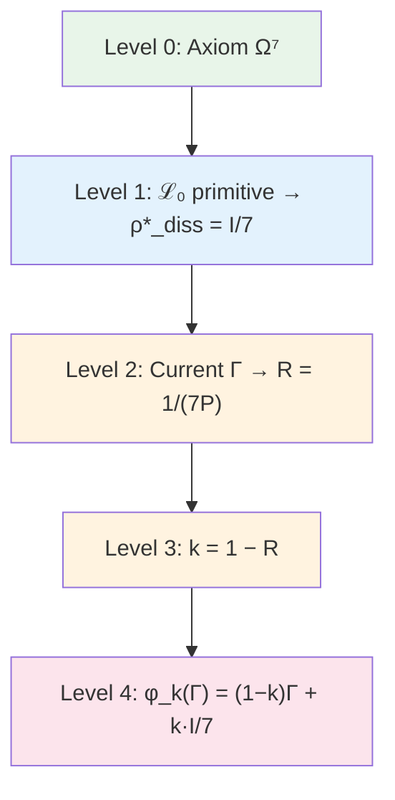

# The Self-Modelling Operator φ

This chapter describes how a system builds a model of itself — one of the central questions in consciousness science, philosophy, and cybernetics alike. What does it mean to "know oneself"? How can a system composed of parts encompass itself as a whole — including the very mechanism by which it does so?

The operator $\varphi$ is the mathematical answer to this question. It takes the current state of the Holon (the coherence matrix $\Gamma$) and returns a *model* of that state — an approximate reflection constructed by the system itself. When the reflection coincides with the original ($\varphi(\Gamma^*) = \Gamma^*$), the system achieves **self-consistency** — its self-model is exact.

:::info DRY: Master definition of φ
This is the **canonical definition** of the self-modelling operator $\varphi$ in the theory section. The full formalisation, proofs of the equivalence of the three definitions, and the fixed-point theorem are in [Formalisation of the operator φ](/docs/proofs/categorical/formalization-phi).
:::

---

## Historical Precursors

The problem of self-reference is one of the deepest in intellectual history.

**Douglas Hofstadter** in the book *Gödel, Escher, Bach* (1979) described *strange loops* — structures that, ascending through levels of a hierarchy, unexpectedly return to the starting point. The Gödel number encodes statements about numbers *through* numbers. Escher's hands draw each other. Bach's canon climbs through keys and returns to the original. Hofstadter suggested that precisely such self-referential loops underlie consciousness.

**Robert Rosen** (1991) in *Life Itself* formalised the idea of *closure under efficient causation*: a living system is a system that is its own model. His (M,R)-systems anticipated the autopoietic axiom of UHM.

**Karl Friston** (2006–) in the framework of the *Free Energy Principle* showed that living systems minimise free energy, which is equivalent to building a predictive model of the environment (and of themselves). The variational definition of φ in UHM is a formal analogue of Friston's principle, but derived from axioms rather than postulated.

---

## Intuitive Explanation: A Mirror for the Holon {#интуиция-зеркало}

Imagine that the Holon is a creature living in a room without external mirrors. The only way to "see" itself is to build an internal model: to picture how it looks, based on what it feels.

The operator $\varphi$ is that "mirror". The Holon looks into it ($\varphi(\Gamma)$) and sees an approximate reflection of itself. But the mirror is imperfect:
- It may be *cloudy* — losing detail (the base decohering form $\varphi_{\text{base}}$, which erases all connections between dimensions)
- It may be *defocused* — seeing not individual pixels but groups of 3 (the Fano form $\varphi_{\text{coh}}$, which preserves connections but weakens them)

The **fixed point** $\Gamma^*$ is the state in which the reflection coincides with the original. A Holon in state $\Gamma^*$ sees itself *exactly as it is*. This is the state of complete self-consistency.

---

## Bootstrap: How the Apparent Circularity Is Resolved {#бутстрап}

At first glance, the definition of φ appears to be a vicious circle: φ defines the self-model $\Gamma^*$, while $\Gamma^*$ enters the definition of φ. But this is not a vicious circle — it is a **bootstrap**, a self-consistent construction.

Analogy: a recursive picture. Imagine a painter painting a picture that depicts a painter painting a picture that depicts... The definition seems infinitely recursive. But if one finds *that* picture in which the depicted picture coincides with the picture itself — the recursion closes. That is the fixed point.

Mathematically, the circularity is resolved rigorously:

:::warning Bootstrap nature of the definition of φ
The operator φ defines the "self-model" of the system, i.e. φ(Γ) ≈ Γ — the system models itself. This appears to be a **circular** definition. The circularity is resolved via the **fixed-point theorem**: the operator φ is defined **independently** (as the left adjoint to the inclusion of subobjects), and the fixed point Γ* with φ(Γ*) = Γ* **exists and is unique** by Banach's theorem (φ is a contractive mapping with parameter k < 1). A detailed account of the resolution of circularity is in [Formalisation of the operator φ: resolution of circularity](/docs/proofs/categorical/formalization-phi#категориальное-определение-φ).
:::

---

## Definition

The self-modelling operator $\varphi: \mathcal{D}(\mathcal{H}) \to \mathcal{D}(\mathcal{H})$ is defined in three equivalent ways:

| # | Definition | Formula |
|---|-------------|---------|
| 1 | **Categorical** | $\varphi \dashv i: \text{Sub}(\Gamma) \hookrightarrow \mathbf{Sh}_\infty(\mathcal{C})$ |
| 2 | **Dynamical** | $\varphi(\Gamma) = \lim_{\tau \to \infty} e^{\tau \mathcal{L}_\Omega}[\Gamma]$ |
| 3 | **Idempotent** | $\varphi \circ \varphi = \varphi$, $\exists \Gamma^*: \varphi(\Gamma^*) = \Gamma^*$ |

### The Three Definitions in Plain Language

Each of the three definitions answers the same question — "how does the system build a model of itself?" — but from a different point of view.

**Definition 1 (Categorical): "Best approximation from below".**
Imagine you have a complex object (the Holon) and a collection of simpler objects (subobjects of the classifier). The categorical φ is the way to find the *best approximation* of the complex object through the simpler ones. "Left adjoint to inclusion" is the mathematical way of saying "optimal projection onto a subset". Analogy: you describe your appearance to a friend over the phone. From an infinite number of details you select the most important (height, hair colour, build). That is the "best approximation" — $\varphi$ of your full appearance.

**Definition 2 (Dynamical): "What the system converges to in the end".**
Run the evolution and wait infinitely long. The state the system converges to is $\varphi(\Gamma)$. Analogy: drop a ball into a funnel. Regardless of where you dropped it, it will end up at the lowest point. That lowest point is the fixed point $\Gamma^*$.

**Definition 3 (Idempotent): "A double reflection adds nothing new".**
If you look in a mirror twice, you see the same thing as the first time. $\varphi \circ \varphi = \varphi$ means that the model of the model coincides with the model. Analogy: photograph a photograph — you get (approximately) the same photograph.

:::tip Theorem: Equivalence of the definitions of φ
The three definitions specify the same operator $\varphi$.
[Proof →](/docs/proofs/categorical/formalization-phi#эквивалентность-определений-phi) | Status: **[Т]**
:::

## Base Form φ_base (Decohering Self-Observation) {#phi-base}

For a [Holon](/docs/core/structure/holon) with $\mathcal{H} = \mathbb{C}^7$, the **base** (decohering) form is:

$$
\varphi_{\text{base}}(\Gamma) = \sum_{k=1}^{7} \Pi_k \, \Gamma \, \Pi_k = \mathrm{diag}(\Gamma)
$$

where $\Pi_k = |e_k\rangle\langle e_k|$ are projectors onto the [basis dimensions](/docs/core/structure/dimensions).

:::warning Φ_base is insufficient as the canonical form
This form **destroys** all coherences ($\gamma_{ij} \to 0$ for $i \neq j$), which is incompatible with viability at uniform weights. The canonical form for living systems is the generalised operator $\varphi_{\text{coh}}$ with [Fano structure](#каноническая-конструкция-φ_coh-из-фано-структуры) (see below). The canonical form in [Formalisation of the operator φ](/docs/proofs/categorical/formalization-phi#26-каноническая-форма-φ-для-угм) uses $\varphi_{\text{UHM}} = k \cdot \mathcal{P}_{\text{pred}} + (1-k) \cdot I/7$, which when $\mathcal{P}_{\text{pred}} = \mathcal{P}_{\text{base}}$ coincides with $\varphi_{\text{base}}$ (with anchor $I/7$). Generalisation to $\mathcal{P}_{\text{pred}} = \mathcal{P}_\alpha$ (convex combination of $\mathcal{P}_{\text{base}}$ and $\mathcal{P}_{\text{Fano}}$) gives $\varphi_{\text{coh}}$.
:::

## Свойства

1. **CPTP channel:** $\varphi$ is a completely positive, trace-preserving map
2. **Idempotence (of ideal φ):** $\varphi \circ \varphi = \varphi$ — for the idempotent definition (Definition 3). The canonical form $\varphi_{\text{coh}}$ with compression parameter $k = 1 - R < 1$ [Т] is a **contractive** mapping (not idempotent); the idempotent projection is the limit $\lim_{n\to\infty} \varphi_{\text{coh}}^n$
3. **Purity monotonicity:** $P(\varphi_{\text{base}}(\Gamma)) \leq P(\Gamma)$ for the base form (decoherence decreases purity); $P(\varphi_{\text{coh}}(\Gamma))$ depends on the parameter $\alpha$ — at $\alpha < 1$ the Fano component partially preserves coherences. The fixed point of the canonical $\varphi_{\mathrm{coh}}$ has $P(\Gamma^*_{\mathrm{coh}}) = P_{\text{crit}} = 2/7$
4. **Fixed point:** $\exists! \, \Gamma^*_{\mathrm{coh}}: \varphi_{\mathrm{coh}}(\Gamma^*_{\mathrm{coh}}) = \Gamma^*_{\mathrm{coh}}$

:::tip Theorem: Fixed point of φ_coh
$\exists! \, \Gamma^*_{\mathrm{coh}} \in \mathcal{D}(\mathbb{C}^7)$: $\varphi_{\mathrm{coh}}(\Gamma^*_{\mathrm{coh}}) = \Gamma^*_{\mathrm{coh}}$ with $P(\Gamma^*_{\mathrm{coh}}) = P_{\text{crit}} = 2/7$.
[Proof →](/docs/proofs/categorical/formalization-phi#3-теорема-о-существовании-неподвижной-точки) | Status: **[Т]**
:::

:::warning Distinction between fixed points
$\Gamma^*_{\mathrm{coh}}$ (fixed point of $\varphi_{\mathrm{coh}}$, $P = 2/7$) **differs** from $\rho^*_{\mathrm{diss}} = I/7$ (attractor of the dissipator, $P = 1/7$). The canonical definition of the [reflexion measure R](/docs/consciousness/foundations/self-observation#мера-рефлексии-r) uses $\rho^*_{\mathrm{diss}} = I/7$: $R = 1/(7P)$. Details: [stratification of definitions](/docs/core/foundations/axiom-septicity#теорема-непротиворечивость-иерархии-определений).
:::

---

## Necessity of generalised φ for living systems

:::warning Canonical φ_base is insufficient
The canonical $\varphi_{\text{base}}$ (decohering self-observation, projection onto the diagonal) **destroys** all coherences: $[\varphi_{\text{base}}(\Gamma)]_{ij} = 0$ for $i \neq j$. This is incompatible with viability: when $\gamma_{ii} \approx 1/7$ we get $P \approx 1/7 < P_{\text{crit}} = 2/7$. To achieve $P > P_{\text{crit}}$ without coherences, a pathological localisation of one dimension is required.
:::

:::tip Theorem: Necessity of a coherence-preserving φ
A living self-model **must** preserve coherences: $\exists\, (i,j): [\varphi(\Gamma)]_{ij} \neq 0$. A generalised $\varphi_{\text{coh}}$ is required.
[Proof →](/docs/proofs/gap/fano-channel#необходимость-phi-coh) | Status: **[Т]**
:::

---

## Canonical construction of φ_coh from the Fano structure {#каноническая-конструкция-φ_coh-из-фано-структуры}

### Why the Fano channel is needed: defocused vision {#интуиция-фано}

Before turning to formulas, let us understand *why* the Fano structure is needed.

Imagine that the Holon's mirror can operate in two modes:
- **Pixel mode** ($\varphi_{\text{base}}$): the mirror sees each "pixel" (dimension) separately, but completely loses the connections between pixels. As if you cut a photograph into 7 squares and shuffled them — you know the content of each square, but not how they are connected.
- **Defocused mode** ($\mathcal{P}_{\text{Fano}}$): the mirror sees not individual pixels, but *groups of 3* (Fano lines). This is like defocused vision — you lose fine details, but preserve *connections* between dimensions. Each group of three dimensions is observed as a whole.

Why groups of 3? Because the [Fano plane](/docs/physics/gauge-symmetry/fano-selection-rules) PG(2,2) is the unique structure on 7 points where every pair of points lies on exactly one line of 3 points. This is the **maximally democratic** observation: no pair of dimensions is privileged.

Key result: the pixel mirror *kills* the system (with uniform weights, purity drops below the threshold $P_{\text{crit}} = 2/7$). The defocused mirror *preserves life*, because it preserves the connections (coherences) between dimensions. Living self-observation **must** be partially defocused.

#### Mathematics of channel mixing {#математика-смешивания}

Why the convex combination $\mathcal{P}_\alpha = \alpha\,\mathcal{P}_{\text{base}} + (1-\alpha)\,\mathcal{P}_{\text{Fano}}$ works:

1. **$\mathcal{P}_{\text{base}}$ alone**: destroys all coherences → with uniform weights $P \approx 1/7 < P_{\text{crit}}$ → the system dies
2. **$\mathcal{P}_{\text{Fano}}$ alone**: coherences are scaled by $1/3$, phases are preserved → $P$ remains above the threshold
3. **Convex combination**: $\mathcal{P}_\alpha$ is a CPTP channel (a convex combination of CPTP channels is CPTP)
4. **At $\alpha = 0$**: pure Fano, maximum coherence preservation, but less accurate predictive model
5. **At $\alpha = 1$**: pure atomic, ideal predictive accuracy, but the system dies
6. **The variational principle** finds the optimum $\alpha^* \in (0,1)$ balancing accuracy and survivability

### Two types of classifier atoms

:::note DRY: Master definition
Complete definitions of atomic and Fano Lindblad operators are in [Lindblad Operators](/docs/core/operators/lindblad-operators#атомы-классификатора). Below are the key formulas needed for the construction of φ_coh.
:::

The [classifier Ω](/docs/core/foundations/axiom-omega) contains not only **atomic** subobjects $S_k = |k\rangle\langle k|$, but also **composite** ones. The [Fano plane](/docs/physics/gauge-symmetry/fano-selection-rules) $PG(2,2)$ defines 7 linear subobjects — projections onto 3-dimensional subspaces:

$$
\Pi_p = \sum_{i \in \mathrm{line}_p} |i\rangle\langle i|, \quad p = 1, \ldots, 7
$$

:::tip Theorem: Completeness of Fano atoms
Each dimension lies on exactly 3 Fano lines. Therefore: $\sum_{p=1}^{7} \Pi_p = 3I$.
[Proof →](/docs/proofs/gap/fano-channel#фано-канал) | Status: **[Т]**
:::

### Fano predictive channel $\mathcal{P}_{\text{Fano}}$

For each Fano line $p = (i,j,k)$ a [Lindblad operator](/docs/core/operators/lindblad-operators) is defined:

$$
L_p^{\text{Fano}} := \frac{1}{\sqrt{3}}\,\Pi_p = \frac{1}{\sqrt{3}}(|i\rangle\langle i| + |j\rangle\langle j| + |k\rangle\langle k|)
$$

The Fano predictive channel:

$$
\mathcal{P}_{\text{Fano}}(\Gamma) := \sum_{p=1}^{7} L_p^{\text{Fano}}\,\Gamma\,(L_p^{\text{Fano}})^\dagger = \frac{1}{3}\sum_{p=1}^{7} \Pi_p\,\Gamma\,\Pi_p
$$

:::info CPTP verification
$\sum (L_p^{\text{Fano}})^\dagger L_p^{\text{Fano}} = I$ — full proof in [Lindblad Operators](/docs/core/operators/lindblad-operators#фано-операторы).
:::

### Theorem: The Fano channel preserves coherences

:::tip Theorem: Preservation of coherences by the Fano channel
For an arbitrary coherence matrix $\Gamma$:

**(a)** Diagonal elements are preserved exactly: $[\mathcal{P}_{\text{Fano}}(\Gamma)]_{ii} = \gamma_{ii}$

**(b)** Coherences are preserved with coefficient $1/3$: $[\mathcal{P}_{\text{Fano}}(\Gamma)]_{ij} = \frac{1}{3}\gamma_{ij}$ for $i \neq j$

**(c)** Phases of coherences are preserved exactly: $\arg([\mathcal{P}_{\text{Fano}}(\Gamma)]_{ij}) = \arg(\gamma_{ij})$

Key difference from $\varphi_{\text{base}}$: the Fano channel **scales** coherence amplitudes without phase distortion, whereas $\varphi_{\text{base}}$ destroys them entirely.
[Proof →](/docs/proofs/gap/fano-channel#теорема-фано-канал) | Status: **[Т]**
:::

### Canonical form of φ_coh

:::tip Theorem: Canonical form of φ_coh
Canonical coherence-preserving self-modelling:

$$
\varphi_{\text{coh}}(\Gamma) = k \cdot \left[\alpha \cdot \mathcal{P}_{\text{base}}(\Gamma) + (1 - \alpha) \cdot \mathcal{P}_{\text{Fano}}(\Gamma)\right] + (1 - k) \cdot \Gamma_{\text{anchor}}
$$

where:
- $\mathcal{P}_{\text{base}}(\Gamma) = \sum_m P_m\,\Gamma\,P_m = \mathrm{diag}(\Gamma)$ — atomic channel (from [φ formalisation](/docs/proofs/categorical/formalization-phi))
- $\mathcal{P}_{\text{Fano}}(\Gamma) = \frac{1}{3}\sum_p \Pi_p\,\Gamma\,\Pi_p$ — Fano channel
- $\alpha \in [0, 1]$ — **decoherence depth parameter** (balance between atomic and Fano observation)
- $k = 1 - R$ — compression parameter determined by the [reflexion measure](/docs/consciousness/foundations/self-observation#теорема-k-из-r) $R = 1 - \|\Gamma - \rho^*\|_F^2/\|\Gamma\|_F^2$ **[Т]**. Not a free parameter
- $\Gamma_{\text{anchor}} = \rho^*_{\mathrm{diss}} = I/7$ — **anchor state**, coinciding with the attractor of the dissipative part $\mathcal{L}_0$. This choice is dictated by the primitivity of $\mathcal{L}_0$ [Т-39a]: the unique stationary state of the linear dynamics is the maximally mixed $I/7$. Under full compression ($k \to 1$, $R \to 0$) the self-model tends to $I/7$ — the state of complete absence of information about itself.

$\mathcal{P}_\alpha = \alpha\,\mathcal{P}_{\text{base}} + (1-\alpha)\,\mathcal{P}_{\text{Fano}}$ — a convex combination of CPTP channels, hence CPTP.
[Proof →](/docs/proofs/gap/fano-channel#phi-coh) | Status: **[Т]**
:::

### Target coherences of φ_coh

:::tip Theorem: Target coherences of φ_coh
**(a)** Magnitude of the target coherence (with diagonal anchor): $|\gamma_{ij}^{\text{target}}| = \frac{k(1-\alpha)}{3} \cdot |\gamma_{ij}|$

**(b)** Target phase is **preserved**: $\theta_{ij}^{\text{target}} = \theta_{ij}$

**(c)** Target Gap is **preserved**: $\mathrm{Gap}^{\text{target}}(i,j) = \mathrm{Gap}(i,j)$

The canonical $\varphi_{\text{coh}}$ **does not seek to change the Gap** — it reproduces the Gap with a reduced amplitude, scaling coherences without phase distortion.
[Proof →](/docs/proofs/gap/fano-channel#phi-coh) | Status: **[Т]**
:::

---

## Explicit coefficients $c_{mn}$

General form of the coherence-preserving channel from the definition of $\varphi_{\text{coh}}$:

$$
\mathcal{P}_{\text{coh}}(\Gamma) = \sum_{m,n} c_{mn}\,|m\rangle\langle n|\,\Gamma\,|n\rangle\langle m|
$$

:::tip Theorem: Explicit coefficients $c_{mn}$
The coefficients of the canonical $\varphi_{\text{coh}}$ are fully determined:

$$
c_{mn} = \begin{cases} \alpha^* k & m = n \text{ (atomic part)} \\ (1-\alpha^*) k / 3 & m \neq n,\, (m,n) \text{ on a common Fano line} \\ 0 & m \neq n,\, (m,n) \text{ not on a common Fano line} \end{cases}
$$

The coefficients are determined through:
- The [Fano structure](/docs/physics/gauge-symmetry/fano-selection-rules) $PG(2,2)$ (algebraic geometry)
- The variational principle ($\alpha^*$ via $P$ and $P_{\text{crit}}$)
- The compression parameter $k$ (from [φ formalisation](/docs/proofs/categorical/formalization-phi))

[Proof →](/docs/proofs/gap/fano-channel#phi-coh) | Status: **[Т]**
:::

:::info Kraus operators
Atomic operators (7 total): $K_m^{(\text{atom})} = \sqrt{\alpha^* k / 7} \cdot |m\rangle\langle m|$. Fano operators (7 total): $K_p^{(\text{Fano})} = \sqrt{(1-\alpha^*) k / 3} \cdot \Pi_p$. Anchor operator: $K_0 = \sqrt{(1-k)/7} \cdot I$. Verification: $\sum (K^{(\text{atom})})^\dagger K^{(\text{atom})} + \sum (K^{(\text{Fano})})^\dagger K^{(\text{Fano})} + K_0^\dagger K_0 = \alpha^* k \cdot I + (1-\alpha^*) k \cdot I + (1-k) \cdot I = I$.
:::

---

## Variational definition of α*

:::tip Theorem: Variational definition of α*
The optimal parameter $\alpha^*$ is determined by the [variational principle](/docs/proofs/dynamics/fep-derivation):

$$
\alpha^* = \arg\min_{\alpha \in [0,1]} \mathcal{F}[\mathcal{P}_\alpha; \Gamma] = \arg\min_{\alpha} \left[S_{\text{spec}}(\mathcal{P}_\alpha(\Gamma)) + D_{KL}(\mathcal{P}_\alpha(\Gamma) \| \Gamma)\right]
$$

Approximate formula for a system with purity $P > P_{\text{crit}}$:

$$
\alpha^* \approx 1 - \frac{P_{\text{crit}}}{P} = 1 - \frac{2}{7P}
$$

| Purity $P$ | $\alpha^*$ | Interpretation |
|------------|-----------|----------------|
| $P = 1$ (pure state) | $\approx 0.71$ | Substantial Fano contribution |
| $P = 0.5$ | $\approx 0.43$ | Balance of atomic and Fano |
| $P \to P_{\text{crit}}$ | $\to 0$ | Almost purely Fano (minimal coherence destruction) |

[Proof →](/docs/proofs/gap/fano-channel#alpha-star) | Status: **[Т]**
:::

:::info Physical meaning of the balance
At $\alpha = 1$ (purely atomic channel) — maximum predictive accuracy, but complete destruction of coherences. At $\alpha = 0$ (purely Fano) — coherences preserved with coefficient $1/3$, but a less accurate predictive model. The optimum $\alpha^* \in (0,1)$ is a balance between predictive accuracy and structure preservation.
:::

#### Sketch of the derivation of α* {#эскиз-вывода-alpha}

The functional $\mathcal{F}[\alpha] = S_{\text{spec}}(\mathcal{P}_\alpha(\Gamma)) + D_{KL}(\mathcal{P}_\alpha(\Gamma) \| \Gamma)$.

The channel $\mathcal{P}_\alpha$ acts as follows: the diagonal is preserved, coherences $\gamma_{ij} \mapsto \frac{(1-\alpha)}{3}\gamma_{ij}$. Therefore the purity of the self-model: $P_\alpha \approx P_{\text{diag}} + \left(\frac{1-\alpha}{3}\right)^2 P_{\text{coh}}$.

The spectral entropy $S_{\text{spec}}$ increases as $\alpha$ decreases (weakening coherences → mixing). The Kullback–Leibler divergence $D_{KL}$ increases as $\alpha$ increases (greater deviation from $\Gamma$). The stationarity condition $\partial\mathcal{F}/\partial\alpha = 0$ for typical $\Gamma$ with purity $P$ gives:

$$\alpha^* \approx 1 - \frac{P_{\text{crit}}}{P} = 1 - \frac{2}{7P}$$

The formula is **approximate** — the exact solution requires numerical optimisation for arbitrary $\Gamma$.

### Numerical example {#числовой-пример-phi}

Let $\Gamma$ have purity $P = 0.4$ (a viable system). We compute:

1. **Parameter $\alpha^*$:** $\alpha^* \approx 1 - 2/(7 \times 0.4) = 1 - 0.714 = 0.286$
2. **Reflexion measure:** $R = 1/(7P) = 1/2.8 \approx 0.357$
3. **Compression parameter:** $k = 1 - R = 0.643$
4. **Target coherence:** $|\gamma_{ij}^{\text{target}}| = \frac{k(1-\alpha^*)}{3}|\gamma_{ij}| = \frac{0.643 \times 0.714}{3}|\gamma_{ij}| \approx 0.153\,|\gamma_{ij}|$

The self-model retains ~15% of each coherence amplitude — a "defocused" but not destroyed reflection. The purity of the self-model $P(\varphi_{\text{coh}}(\Gamma))$ converges to $P_{\text{crit}} = 2/7$ under iteration — the viability threshold acts as an **attractor** of self-modelling.

---

## Unified theorem of self-observation

:::tip Theorem: Fano-coherent self-modelling (unified theorem)
The canonical coherence-preserving self-modelling for UHM is determined **completely uniquely** (the compression parameter $k = 1 - R$ is defined by the [reflexion measure](/docs/consciousness/foundations/self-observation#теорема-k-из-r) [Т]) through:

**(a)** **Algebraic structure:** The [Fano plane](/docs/physics/gauge-symmetry/fano-selection-rules) $PG(2,2)$ defines the composite atoms of the classifier $\Omega$, generating the Fano [Lindblad operators](/docs/core/operators/lindblad-operators) $L_p^{\text{Fano}}$.

**(b)** **Variational principle:** The balance between atomic and Fano observation $\alpha^*$ minimises the functional $\mathcal{F} = S_{\text{spec}} + D_{KL}$.

**(c)** **Phase properties:** The canonical $\varphi_{\text{coh}}$ **preserves** the phases of coherences. The target Gap coincides with the current Gap.

**(d)** **Symmetry:** [G₂-covariance](/docs/physics/gauge-symmetry/g2-structure) is partially broken by the atomic component. The degree of breaking $\Delta_{G_2} = \alpha^* \cdot \Delta_{\max}$ depends on purity $P$. The Fano dissipator is G₂-covariant; the atomic one is not.

**(e)** **Stationary Gap:** upon substitution $\theta_{ij}^{\text{target}} = \theta_{ij}$:

$$
\mathrm{Gap}^{(\infty)}(i,j) = \left|\sin\left(\theta_{ij} - \arctan\frac{\Delta\omega_{ij}}{\Gamma_2 + \kappa}\right)\right|
$$

The stationary Gap is **shifted** relative to the current one by the angle $\arctan(\Delta\omega/(\Gamma_2 + \kappa))$ due to unitary rotation.

[Proofs →](/docs/proofs/gap/fano-channel) | Status: **[Т]**
:::

---

## Three definitions of φ and their equivalence {#три-определения}

In the documentation φ appears in three forms. They do not contradict each other — each subsequent one is a **consequence** of the previous. Here all three definitions are collected with explicit references to the theorems linking them into a single chain.

### Three forms

| # | Name | Formula | Location |
|---|------|---------|----------|
| 1 | **Categorical φ** | $\varphi \dashv i: \mathrm{Sub}(\Gamma) \hookrightarrow \mathbf{Sh}_\infty(\mathcal{C})$ | [Axiom Ω⁷](/docs/core/foundations/axiom-omega), [FEP derivation](/docs/proofs/dynamics/fep-derivation#2-категориальные-основы) |
| 2 | **Variational φ** | $\varphi = \arg\min_{\psi \in \mathcal{CPTP}} \mathbb{E}_\Gamma[S_{\mathrm{spec}}(\psi(\Gamma)) + D_{KL}(\psi(\Gamma) \| \Gamma)]$ | [Theorem 3.1, FEP derivation](/docs/proofs/dynamics/fep-derivation#32-центральная-теорема) |
| 3 | **Replacement φ_k** | $\varphi_k(\Gamma) = (1-k)\Gamma + k\rho^*_{\mathrm{diss}},\ k = 1 - R$ | [Self-observation](/docs/consciousness/foundations/self-observation#физическая-реализация-phi) |

### Connection (1) ↔ (2): Theorem 3.1

:::tip Theorem 3.1 (Variational characterisation) [Т]
The categorically defined $\varphi$ (as the left adjoint to the inclusion $i: \mathrm{Sub}(\Gamma) \hookrightarrow \mathcal{E}$) **coincides** with the minimiser of the variational functional:

$$
\varphi = \arg\min_{\psi \in \mathcal{CPTP}} \mathbb{E}_{\Gamma \sim \mu}\left[S_{\mathrm{spec}}(\psi(\Gamma)) + D_{KL}(\psi(\Gamma) \| \Gamma)\right]
$$

The invariant measure $\mu$ is unique by the primitivity of the linear part $\mathcal{L}_0$ [Т-39a].
[Full proof →](/docs/proofs/dynamics/fep-derivation#32-центральная-теорема) | Status: **[Т]**
:::

Thus: the variational principle is **not an axiom**, but a **theorem** about the categorically defined φ.

### Connection (2) ↔ (3): the replacement channel as a minimiser

:::tip Theorem (Replacement channel as CPTP-minimiser) [Т]
The minimiser of the functional $\mathcal{F}[\psi; \Gamma] = S_{\mathrm{spec}}(\psi(\Gamma)) + D_{KL}(\psi(\Gamma) \| \Gamma)$ over the class of CPTP channels on $\mathcal{D}(\mathbb{C}^7)$ is the replacement channel

$$
\varphi_k(\Gamma) = (1 - k)\,\Gamma + k\,\rho^*_{\mathrm{diss}}, \qquad k = 1 - R
$$

**Key proof steps.**
1. **Convexity:** $\mathcal{F}[\psi; \Gamma]$ is a strictly convex functional on the convex compact $\mathcal{CPTP}$ — the minimiser exists and is unique.
2. **Form of the minimiser:** From the stationarity conditions (variation over $\psi$ under the CPTP constraint) the minimiser takes the form of a convex combination of $\mathrm{Id}$ and the constant channel $\mathcal{C}_{\rho^*}$, i.e. $\psi^*(\Gamma) = (1-k)\Gamma + k\rho^*$.
3. **Value of $k$:** From the Banach principle (contracting mapping with constant $(1-k) < 1$) and the consistency condition with the reflexion measure: $k = 1 - R = 1 - 1/(7P)$.

[Proof of physical realisation →](/docs/consciousness/foundations/self-observation#физическая-реализация-phi) | [Parameter k from reflexion →](/docs/consciousness/foundations/self-observation#теорема-k-из-r) | Status: **[Т]**
:::

### Unified chain: φ_cat → φ_var → φ_k

```
φ_cat (categorical)
   — left adjoint to i: Sub(Γ) ↪ Sh_∞(C)
   — defined axiomatically through the structure of the ∞-topos
         |
         | Theorem 3.1 [Т]
         ↓
φ_var (variational)
   — argmin [S_spec + D_KL] over all CPTP channels
   — variational principle as a CONSEQUENCE, not an axiom
         |
         | convexity + Banach principle [Т]
         ↓
φ_k (replacement)
   — φ_k(Γ) = (1−k)Γ + k·ρ*_diss,  k = 1−R
   — explicit, computable form for D(ℂ⁷)
```

### Absence of circularity

:::info Resolution of circularity
The definition of φ **contains no vicious circle**. The derivation order is strictly linear:

1. **$\rho^*_{\mathrm{diss}} = I/7$** is determined from the primitivity of the linear part $\mathcal{L}_0$ [Т-39a] — this is a property of the **dynamics**, independent of φ.
2. **$R(\Gamma) = 1/(7P(\Gamma))$** is determined only by the current state $\Gamma$ and the constant $\rho^*_{\mathrm{diss}} = I/7$ — not through $\varphi$.
3. **$k = 1 - R$** is a function of the state $\Gamma$, not a free parameter.
4. **$\varphi_k(\Gamma)$** is fully determined through $\Gamma$, $\rho^*_{\mathrm{diss}}$, and $k$ without self-reference.



Each level depends **only on the previous ones** — a closed directed acyclic graph (DAG).

The apparent "circularity" (φ defines $\rho^*$, and $\rho^*$ enters φ) is resolved by splitting: $\rho^*_{\mathrm{diss}} = I/7$ is the **dissipative** attractor of the linear part $\mathcal{L}_0$, whereas φ is the **nonlinear** regeneration operator. They reside at different levels of the hierarchy [O] (see [attractor hierarchy](/docs/consciousness/foundations/self-observation#иерархия-аттракторов)).
:::

---

## Connections

- **Derived from:** [Axiom Ω⁷](/docs/core/foundations/axiom-omega) → $\mathcal{L}_\Omega$ → $\varphi$
- **Fano channel:** [Fano selection rules](/docs/physics/gauge-symmetry/fano-selection-rules) → $\Pi_p$ → $\mathcal{P}_{\text{Fano}}$
- **Used in:** [Self-observation](/docs/consciousness/foundations/self-observation), [Evolution](/docs/core/dynamics/evolution), [Gap dynamics](/docs/core/dynamics/gap-dynamics)
- **Full formalisation:** [Formalisation of the φ operator](/docs/proofs/categorical/formalization-phi)
- **Proofs of Fano theorems:** [Fano channel and Gap theorems](/docs/proofs/gap/fano-channel)
- **Variational characterisation:** [FEP derivation from UHM](/docs/proofs/dynamics/fep-derivation)
- **G₂ structure:** [G₂ = Aut(O)](/docs/physics/gauge-symmetry/g2-structure) — covariance of the Fano dissipator
