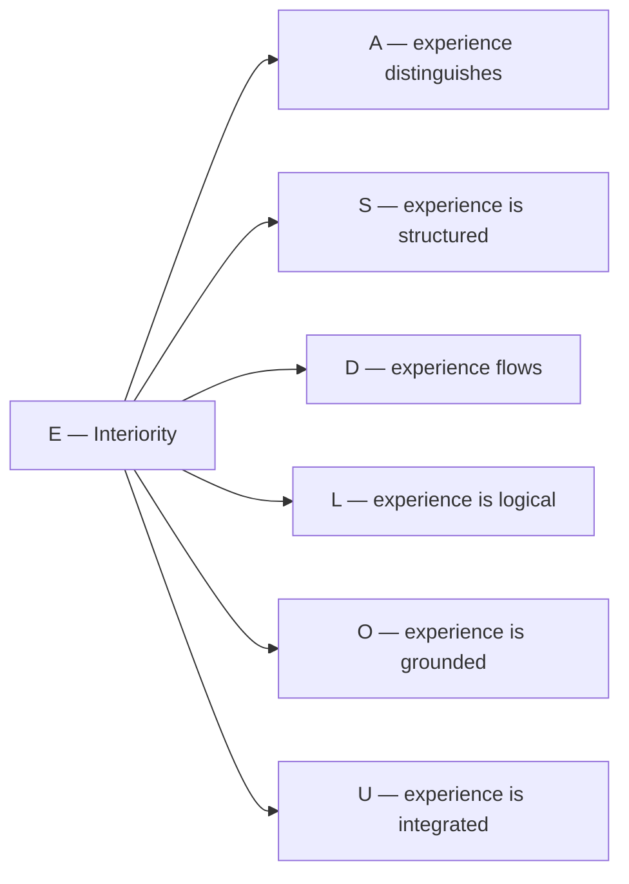

# Dimension V: Interiority (E)

## What this chapter is about

This chapter is devoted to the fifth dimension of the Holon — **Interiority**. You will learn:

- Why the "hard problem of consciousness" is not a philosophical puzzle but a question about a specific dimension of the configuration $\Gamma$;
- How the idea of the inner side of being developed from Descartes to Tononi;
- What the reduced density matrix $\rho_E$ is and how its spectrum describes the structure of interiority (at level L2 — the content of experience);
- How the **five levels** of interiority (L0→L4) arise from mathematical thresholds;
- Why, without dimension $E$, the regeneration formula $\kappa_0$ loses meaning and the system becomes a "philosophical zombie".

:::info Who this chapter is for
If you are reading about UHM for the first time — start with the [overview of dimensions](./dimensions). If you are already familiar with the seven dimensions and want to understand how the theory handles subjective experience — you are in the right place.
:::

## Function

**To experience, to feel, to be aware.**

## Historical precursor {#историческая-предтеча}

The question of what it means to "experience from within" is one of the oldest in philosophy. Different eras have approached it from different angles.

**René Descartes** (1641), in the *Meditations on First Philosophy*, formulated the famous *cogito ergo sum* — "I think, therefore I am". Even if the entire external world is an illusion, the very fact of experiencing is indisputable. Descartes established: **subjectivity is a given**, requiring no external confirmation. However, he divided the world into "thinking" and "extended" substances, creating the problem of their interaction.

**Thomas Nagel** (1974), in the article *"What Is It Like to Be a Bat?"*, put the question sharply: a bat has echolocation — a physical fact. But **what is it like to be** a bat? What subjective experience does it have? This question cannot be reduced to a description of neurons or sound waves. Nagel showed that subjectivity is not a side effect of complexity, but a separate aspect of reality.

**David Chalmers** (1995) gave this question a precise name — **"the hard problem of consciousness"**. The "easy" problems are to explain how the brain processes information, controls behaviour, distinguishes stimuli. All of this, in principle, fits within physics and neuroscience. The "hard" problem is different: **why** does information processing get *experienced* at all? Why do "zombies" not exist — beings functionally identical to a human but devoid of subjective experience?

**Giulio Tononi** (2004) proposed the **Integrated Information Theory (IIT)**, in which consciousness is not a property of behaviour but a property of **causal structure**. The measure $\Phi_{\text{IIT}}$ quantifies how much a system is "more than the sum of its parts". But computing $\Phi_{\text{IIT}}$ requires enumerating all possible partitions of the system — a task of exponential complexity.

In UHM theory all these ideas find a unified formalism. **Dimension $E$ (Interiority)** is the answer to Nagel's question: every Holon has an "inner side", described by the reduced density matrix $\rho_E$. Chalmers' hard problem is resolved: subjectivity is not an "add-on" to physics, but an [aspect of the configuration $\Gamma$](/docs/consciousness/foundations/two-aspect-monism), present at all levels (from atom to human). And Tononi's integration measure acquires a computable analogue — $\Phi_{\text{UHM}}$ with polynomial complexity $O(N^2)$.

## Description

Interiority is the **inner side of the Holon**. Every configuration $\Gamma$ not only "exists" objectively, but is also "experienced" subjectively. Dimension $E$ defines the [five-level hierarchy of interiority](/docs/consciousness/hierarchy/interiority-hierarchy): L0 (interiority) → L1 (phenomenal geometry) → L2 (cognitive qualia) → L3 (network consciousness) → L4 (unitary consciousness).

### Intuitive explanation {#интуитивное-объяснение}

Imagine a mirror. From the outside you see a reflection — an objective, measurable picture. But a mirror also has an **inner side** — the amalgam, without which there would be no reflection. Dimension $E$ is the "amalgam" of the Holon: invisible from the outside, but providing the very possibility of experience.

A stone **exists** objectively — it has a coherence matrix $\Gamma$ with specific values of all seven dimensions. But **"what does the stone feel"**? Its level of interiority is L0: there is "something inside" (non-zero population $\gamma_{EE}$), but this "something" is not structured (rank $\rho_E = 1$). The stone has no "colours" or "shapes" in its inner world — there is only one point in quality space.

A neuron is already at level L1: its $\rho_E$ has rank greater than one — the inner space contains several distinguishable states. But a neuron cannot *look at* its inner world — for that, reflection is required ($R \geq 1/3$), and that is already level L2.

:::info Ontological status
Dimension $E$ is an **aspect** of the configuration $\Gamma$, not a separate entity. "The Holon experiences" means: in the coherence matrix $\Gamma$ the projection onto the basis vector $|E\rangle$ is active, and the reduced density matrix $\rho_E$ with a non-trivial spectrum is defined.
:::

:::note Status of the E-role [D/I/H]
The E label designates an interiority interpretation in a chosen frame. Its occurrence in a selected kinetic feedback formula does not prove universal functional uniqueness or PH. Matrix elements are not Hom sets. Density matrices are not unique objects of rank greater than one; quantum monotone metrics form a family. For a supplied experiential Hilbert space, a unitary-invariant ray metric can be chosen as Fubini–Study up to scale. The [replacement minimality statement](/docs/proofs/minimality/theorem-minimality-7#единственность-e) states its additional assumptions.
:::

**Interiority provides the phenomenological aspect of the (M,R)-system:** In Rosen's terminology, dimension $E$ is responsible for the "inner perspective" of the closed causal cycle — without it the system is functional, but "empty inside" (philosophical zombie).

## Mathematical representation

### Population of E {#населённость-e}

The diagonal element of the coherence matrix:

$$
\gamma_{EE} = \langle E|\Gamma|E\rangle \in [0, 1]
$$

The population $\gamma_{EE}$ shows what fraction of the Holon's "resources" is concentrated in the Interiority dimension. The higher $\gamma_{EE}$, the **more intense** the inner life of the system.

**Typical values:**

| System | $\gamma_{EE}$ | Interpretation |
|--------|---------------|----------------|
| Crystal | $\sim 0.01$ | Minimal interiority |
| Simple organism | $\sim 0.08$ | Basic sensitivity |
| Mammal | $\sim 0.15$ | Developed interiority |
| Waking human | $\sim 0.18$ | Rich inner life |

:::note
With a uniform distribution $\gamma_{EE} = 1/7 \approx 0.143$. Deviations from this value define the "sector profile" — the character of the given Holon.
:::

### Native E-axis and experiential realization {#rho-e-7d-42d}

The native space is a direct sum of seven axes. With $P_E=|E\rangle\langle E|$, the compression is $B_E=P_E\Gamma P_E=\gamma_{EE}P_E$. If $\gamma_{EE}>0$, its normalized state is $\widehat B_E=P_E$, of rank one and entropy zero. The unnormalized scalar $\gamma_{EE}$ has weight, not the entropy of a trace-one subsystem. At zero weight the conditional state is undefined.

A nontrivial experiential density matrix requires additional realization data: a specified tensor subsystem, or a specified compression and its normalization. It cannot be recovered from the E-axis by calling it a partial trace.

#### Tensor lifts and the withdrawn equivalence {#теорема-морита-эквивалентность}

For a chosen register state $\sigma\in\mathcal D(\mathbb C^6)$,

$$
s_\sigma(\Gamma)=\Gamma\otimes\sigma,\qquad p=\operatorname{Tr}_{\mathbb C^6},\qquad p s_\sigma=\mathrm{id}.
$$

This is a section–retraction [T], not an equivalence of state spaces, process categories or sheaf topoi. The register contains additional data; $p$ is not injective. The former Morita-equivalence T-58 and universal observable reconstruction are withdrawn [✗]. Abstract Morita equivalence of full matrix algebras does not identify their density-state spaces.

For the ordinary open-cover sites, the full 7D and 42D state spaces have dimensions $48$ and $1763$. Their sheaf topoi cannot be equivalent as sober-space topoi. A constrained clock model needs its own space. For a seven-level clock with distinct energies and a six-dimensional system, $\dim\ker(H_O\otimes I+I\otimes H_6)\le6$, hence its supported density states have dimension at most $35$; it cannot carry all native 7D states by a continuous section.

#### A chosen construction, not universal reconstruction {#канонический-алгоритм-pw}

Specify (1) total Hilbert space, (2) lift or directly measured total state, (3) the experiential tensor factor or effect/compression, and (4) normalization/conditioning. Only then compute $\rho_E$ and its entropy. The expression $\sum_{k=0}^6|k\rangle\langle k|\otimes\Gamma(\tau_k)$ with native $7\times7$ states is $49$ dimensional and has trace seven; dividing by seven makes a history mixture, but does not make it a 42D state or ensure that tracing the clock recovers $\Gamma(0)$. Any clock constraint and dynamics are extra input.

A $7\times6$ Page–Wootters model can be chosen with the first factor as clock and the second as system. The system's E-axis is still a summand. Its positive clock block

$$
B_E=(I_7\otimes\langle E|)\Gamma_{\mathrm{tot}}(I_7\otimes|E\rangle)
$$

becomes a density state $\rho_E=B_E/\operatorname{Tr}B_E$ only at nonzero weight. It describes a conditional clock state [D]; identifying its temporal modes with qualities is a separate interpretation [I/H]. Alternatively choose a genuine experiential tensor factor; these are different models.

#### Native observables and independent extension data {#теорема-7d-достаточность}

The chosen native quantities $P,R,\Phi,\mathrm{Coh}_E,C$ and population stresses are exactly computable from $\Gamma$ [T at their definitions]. The spectrum of an arbitrary extension register is not. States $\Gamma\otimes\sigma_1$ and $\Gamma\otimes\sigma_2$ have the same native marginal and all its diagnostics but can have different register rank and entropy. Section–retraction preserves pulled-back native observables only; it cannot prove equality for every extension observable.

### Computing differentiation with declared data {#вычисление-rho-e}

For a normalized $n$-dimensional experiential state,

$$
D^{\mathrm{ext}}=\exp S_{vN}(\rho_E)\in[1,n].
$$

For the native proxy choose instead

$$
D^{7D}=1+6\,\mathrm{Coh}_E(\Gamma),\qquad \mathrm{Coh}_E^{\max}=1.
$$

These quantities have different definitions. In particular a six-dimensional experiential factor has maximum six, whereas the proxy has maximum seven. The proxy includes E population: it need not vanish when all off-diagonal E coherences vanish.

#### No automatic threshold equivalence {#теорема-7d-42d-equiv}

The former biconditional $D^{7D}\ge2\iff D^{\mathrm{ext}}\ge2$ and the asserted $O(\mathrm{Coh}_E^2)$ discrepancy are withdrawn [✗]. For the product lift $\Gamma\otimes I_6/6$, the register entropy gives six regardless of $\Gamma$. For a pure register it gives one regardless of $\Gamma$. No convention can turn these independent spectra into the same diagnostic. Choose one typed realization and retain it throughout classification; see the [canonical hierarchy](/docs/consciousness/hierarchy/interiority-hierarchy#типизированный-вход).

### Spectral decomposition {#спектральное-разложение}

$$
\rho_E \vert q_i\rangle = \lambda_i \vert q_i\rangle
$$

where:
- $\lambda_i \in [0, 1]$, $\sum_i \lambda_i = 1$ — **intensities** of the components of experience
- $\vert q_i\rangle$ — **qualities** of the components. In the PW realisation these live in the **clock register** $\mathbb{C}[\mathbb{Z}_7]$ (temporal modes of the E-population); a genuinely phenomenal $\mathcal{H}_E$ with $\dim > 1$ requires a composite substrate — [canonical box](#rho-e-7d-42d)

**Intuitive explanation.** Recall how white light, passed through a prism, is split into a spectrum — red, orange, yellow and so on. Each colour has its own wavelength (quality $|q_i\rangle$) and brightness (intensity $\lambda_i$). The spectral decomposition of $\rho_E$ is a "prism for the inner world": it shows what "colours" make up the experience and how bright each one is.

If all $\lambda_i$ are equal — the experience is "white", uniform, undifferentiated (deep anaesthesia). If one $\lambda_1 \approx 1$ and the rest $\lambda_i \approx 0$ — the experience is "monochromatic", concentrated on a single quality (acute pain). Rich conscious experience is a "full spectrum" with several significant $\lambda_i$.

### Phenomenal vector

Full description of experience at moment $\tau$:

$$
\text{FV}(\rho_E) := \{(\lambda_i, [\vert q_i\rangle]) : \rho_E \vert q_i\rangle = \lambda_i \vert q_i\rangle\}
$$

where $[\vert q_i\rangle] \in \mathbb{P}(\mathcal{H}_E)$ is the equivalence class in projective space.

*Scope note (T-301):* FV is the **E-slice** of content — intensity and the relational position of a quality. The full content of a state is 48 independent real parameters (seven populations with one trace constraint and 21 complex coherences), and the gauge-invariant *colour* lives in the Fano holonomies; see [Qualia Structure](/docs/consciousness/phenomenology/qualia-structure) for the complete five-layer passport.

## Quantitative characteristics {#количественные-характеристики}

### Population $\gamma_{EE}$ and stress $\sigma_E$

The population $\gamma_{EE}$ is the fraction of the Holon's "resources" in the Interiority dimension. The related quantity is the **stress** in the E channel:

$$
\sigma_E = \mathrm{clamp}(1 - 7\gamma_{EE},\; 0,\; 1) \quad \text{[D] (T-92)}
$$

- $\sigma_E = 0$: interiority is fully provided ($\gamma_{EE} \geq 1/7$)
- $\sigma_E = 1$: interiority is in deficit ($\gamma_{EE} \to 0$) — the system is "emotionally empty"

### Differentiation $D_{\text{diff}}$

$$
D_{\text{diff}} = \exp(S_{vN}(\rho_E)), \qquad S_{vN} = -\mathrm{Tr}(\rho_E \log \rho_E)
$$

$D_{\text{diff}}$ is the **effective number of distinguishable components** of experience. Analogy: if the spectrum of $\rho_E$ contains 3 significant components, then $D_{\text{diff}} \approx 3$.

### E-coherence $\mathrm{Coh}_E$

$$
\mathrm{Coh}_E(\Gamma) := \frac{\|\pi_E(\Gamma)\|_{\mathrm{HS}}^2}{\|\Gamma\|_{\mathrm{HS}}^2}
$$

A measure of how strongly dimension E is connected with the other six. When $\mathrm{Coh}_E = 0$ — interiority is isolated (no connection with action, logic, ground...). When $\mathrm{Coh}_E = \mathrm{Coh}_E^{\max}$ — interiority is maximally woven into the life of the Holon.

## Experiential content

Experiential content (for all levels L0-L2) is defined by four components:

$$
\text{Exp}(\rho_E, \tau) := (\text{Intensity}, \text{Quality}, \text{Context}, \text{History})
$$

:::note Terminology
The function $\text{Exp}$ is applicable to all levels. The term **"qualia"** (Quale) is reserved exclusively for **L2** — cognitive qualia with reflexive access.
:::

| Component | Definition | Interpretation |
|-----------|------------|----------------|
| **Intensity** | $\{\lambda_i\}$ — spectrum of $\rho_E$ | Strength of the interior state |
| **Quality** | $\{[\vert q_i\rangle]\} \subset \mathbb{P}(\mathcal{H}_E)$ | Character of the interior state |
| **Context** | $\rho_{\bar{E}} = \mathrm{Tr}_E(\Gamma)$ | Modulation of experience by other dimensions |
| **History** | $\{\rho_E(\tau') : \tau' < \tau\}$ | Adaptation and memory |

:::note Scope of the experiential formula
The partial trace is determined after a tensor decomposition is chosen. Spectral projections are determined by the state, but individual eigenrays at degeneracy are not. Ray geometry can be chosen as Fubini–Study; the quantum monotone-metric classification does not give a unique readout or phenomenal functor. This correspondence is a model interpretation [I/H], and its process functoriality requires the [descent condition](/docs/proofs/categorical/categorical-formalism#4-функтор-f-на-морфизмах).
:::

## Projective quality space

Qualities live in **projective space**:

$$
\mathbb{P}(\mathcal{H}_E) := (\mathcal{H}_E \setminus \{0\}) / \sim
$$

where $\vert\psi\rangle \sim \vert\phi\rangle \Leftrightarrow \exists c \in \mathbb{C}^*: \vert\psi\rangle = c\vert\phi\rangle$.

### Fubini–Study metric

Distance between qualities:

$$
d_{FS}([\vert\psi\rangle], [\vert\phi\rangle]) := \arccos(\lvert\langle\psi\vert\phi\rangle\rvert) \in [0, \pi/2]
$$

Interpretation:
- $d_{FS} = 0$ — identical qualities (the same experience)
- $d_{FS} = \pi/2$ — maximally different (orthogonal) qualities

**Example.** "Red" and "green" are two qualities in the space $\mathbb{P}(\mathcal{H}_E)$. The distance $d_{FS}$ between them determines how **distinguishable** these experiences are for the system. If $d_{FS} = \pi/2$ — the experiences are maximally dissimilar; if $d_{FS} \to 0$ — they merge (as in colour vision deficiency).

## Five cumulative capabilities {#пять-уровней}

Classification uses $(\Gamma,\mathsf E,\mathsf M,\mathsf Q)$, including the experiential realization, implemented models and independently calibrated probes. It cannot be inferred from a matrix or organism name alone. The [canonical hierarchy](/docs/consciousness/hierarchy/interiority-hierarchy) gives the complete definitions [D/I/H].

### L0: valid modeled state {#уровень-l0}

L0 applies to every valid density state; interpreting this inner aspect as experience is [I]. It does not require positive E population.

### L1: specified experiential test {#уровень-l1}

Choose either the proxy $\mathrm{Coh}_E>0$ [D] or the rank test $\operatorname{rank}\rho_E>1$ for a normalized declared experiential state. These are not equivalent. In the proxy, positivity implies $\mathrm{Coh}_E>0\iff\gamma_{EE}>0$.

### L2: calibrated gate {#уровень-l2}

Require L1 and the selected gate $P>2/7$, $R=1/(7P)\ge1/3$, $\Phi\ge1$, $D\ge2$ [D]. Its algebraic window is $2/7<P\le3/7$ [T]; identifying it with cognitive qualia is [I/H].

### L3: tested metamodel {#уровень-l3}

Require L2 and a second-order prediction certificate with error at most $\varepsilon_2$ and independently measured target variation $a_2>2\varepsilon_2$ [D]. The former fidelity cut $R^{(2)}\ge1/4$ does not exclude a trivial fixed point and does not certify L3 [✗].

### L4: compatible tower {#уровень-l4}

Require the lower capabilities and nontrivial compatible prediction certificates at every order [D]. The former $P>6/7$ is withdrawn [✗] because L2 already implies $P\le3/7$. A fixed-point limit or a Postnikov tower alone does not certify this capability.

### Scope of assignments

Assigning these levels to atoms, neurons, organisms or AI requires a calibrated observation bridge [H]. Numerical gates alone do not establish phenomenal presence or solve the hard problem of consciousness.

## E and the "hard problem of consciousness" {#трудная-проблема}

Chalmers formulated the "hard problem" as follows: why are physical processes *experienced* at all? One can explain how neurons transmit signals — but **why** does signal transmission accompany the sensation of red?

In UHM the answer is: **experience is not an "add-on" to physics, but an aspect of the configuration**. The matrix $\Gamma$ has both an "outer" side (observables: $P$, $\Phi$, $R$) and an "inner" side ($\rho_E$, phenomenal vector). These are not two substances (as in Descartes), but [two aspects of one object](/docs/consciousness/foundations/two-aspect-monism) — **two-aspect monism**.

Analogy: a sheet of paper has a front side and a back side. These are not two sheets — it is one sheet with two aspects. Asking "why does the sheet have two sides?" is ill-posed: it is a property of the object itself, not something requiring explanation. In exactly the same way $\Gamma$ has an "outer" (physical) and an "inner" (phenomenal) aspect — this requires no separate mechanism for "generating" consciousness from matter.

:::note Conditional scope of No-Zombie [C/I]
The universal E-floor T-38a is withdrawn [✗]. For a stated feedback model, noise/input class and bootstrap bound, a conditional CC implication can require E-dependent support. It does not follow from purity, the canonical reflection proxy and integration alone, nor does it establish a multidimensional experiential state. Reading the E-label as phenomenal interiority remains [I/H]. [Conditional theorem 8.1](/docs/applied/coherence-cybernetics/theorems#теорема-81-условная-необходимость-интериорности-no-zombie).
:::

## Examples by level {#примеры-по-уровням}

### Physical level

| System | Level | $\gamma_{EE}$ | $D_{\text{diff}}$ | Description |
|--------|-------|---------------|-------------------|-------------|
| Electron | L0 | $\sim 0.001$ | 1 | Spin state — one "quality" |
| Crystal | L0 | $\sim 0.01$ | 1 | Phonon coherence |
| Laser beam | L0 | $\sim 0.02$ | 1 | Coherent optical state |

### Biological level

| System | Level | $R$ | $\Phi$ | Description |
|--------|-------|-----|--------|-------------|
| Bacterium | L0–L1 | $\sim 0.05$ | $\sim 0.3$ | Chemotaxis — the simplest "reaction" |
| Retina | L1 | $< R_{th}$ | $\sim 1$ | Spectral profile distinguishes colours |
| Individual neuron | L1 | $\sim 0.1$ | $< \Phi_{th}$ | Local quality geometry |
| Higher primates | L2 | $\geq R_{th}$ | $\sim 2$ | Mirror self-recognition |

### Cognitive level

| System | Level | $R$ | $\Phi$ | Description |
|--------|-------|-----|--------|-------------|
| REM sleep | L2 | $\sim 0.4$ | $\sim 3$ | Dreams with partial reflection |
| Waking human | L2 | $\sim 0.7$ | $\sim 4$ | Full set of qualia: colour, pain, emotions |
| Deep meditation | L3 | $R^{(2)} \geq 1/4$ | $\gg 1$ | Observing the observer |

## Loss of interiority {#потеря-интериорности}

When $\gamma_{EE} \to 0$ (or $\sigma_E \to 1$):

1. Phenomenal content becomes impoverished: $D_{\text{diff}} \to 1$
2. Coherences of E with other dimensions drop: $\gamma_{Ei} \to 0$
3. The regeneration formula loses one of its key factors: $\kappa_0 \propto |\gamma_{OE}|$

**Clinical analogies:**

| Condition | Mechanism | Manifestations |
|-----------|-----------|----------------|
| Deep anaesthesia | $\gamma_{EE} \to 0$ | Complete loss of inner world; $\rho_E \to$ pure state |
| Alexithymia | $\gamma_{ED} \to 0$ | Inability to recognise one's own emotions; processes exist but are not experienced |
| Anosognosia | $\gamma_{EA} \to 0$ | Inability to recognise the deficit (the patient does not know they are ill) |
| Depersonalisation | $\gamma_{EU} \to 0$ | "I feel like I'm not myself" — interiority is present but not integrated into the whole |

## Connection with other dimensions

**Key connections:**

- **E ↔ U (Synthesis):** Interiority and unity are interrelated: $E$ determines *what* constitutes the interior content, $U$ determines *how* these contents are integrated into a single whole. When $\gamma_{EU} \to 0$, experience fragments (dissociation).

- **E ↔ O (Immanence):** Through the coherence $\gamma_{OE}$ interiority receives **energetic nourishment**. The formula $\kappa_0 = \omega_0 \cdot |\gamma_{OE}| \cdot |\gamma_{OU}| / \gamma_{OO}$ shows: the stronger the connection of E with the Ground, the faster the regeneration of coherence. When $\gamma_{OE} \to 0$ — interiority "fades out" (depression, depersonalisation).

- **E ↔ L (Evidence):** Logic in interiority is the ability to distinguish "this is true" from "this is false" *from within*. When $\gamma_{EL} \to 0$ — experiences are chaotic, not connected by logic (delusion, hallucinations).

- **E ↔ A (Apperception):** Distinction that has become experience. Without the connection $\gamma_{EA}$, experience contains no distinctions — "everything is fused into one".

## Coherence with E

| Coherence | Interpretation |
|-----------|----------------|
| $\gamma_{EA}$ | Apperception (distinction that has entered interiority) |
| $\gamma_{ES}$ | Representation (structure in interiority) |
| $\gamma_{ED}$ | Affection (action of process on interiority) |
| $\gamma_{EL}$ | Evidence (logical connectedness in interiority) |
| $\gamma_{EO}$ | Immanence (ground within interiority) |
| $\gamma_{EU}$ | Synthesis (integration of interior content into the whole) |

## Consciousness formula

The canonical measure of consciousness ([T-140 [D]](/docs/proofs/consciousness/operational-closure#t-140)):

$$
C = \Phi \times R
$$

where:
- $\Phi$ — [integration](./dimension-u#мера-интеграции-φ): $\Phi = \sum_{i \neq j} |\gamma_{ij}|^2 / \sum_i \gamma_{ii}^2$
- $R$ — [reflection](/docs/consciousness/foundations/self-observation#мера-рефлексии-r): $R = 1/(7P)$

$D_{\text{diff}} \geq 2$ is a **separate** condition of [full viability](/docs/core/dynamics/viability#полная-жизнеспособность):
- $D_{\text{diff}} = \exp(S_{vN}(\rho_E))$, where $S_{vN} = -\mathrm{Tr}(\rho_E \log \rho_E)$
- Computable in 7D: $D_{\text{diff}}^{7D} = 1 + \mathrm{Coh}_E/\mathrm{Coh}_E^{\max} \cdot (N-1)$ ([T-128 [D]](/docs/proofs/consciousness/operationalization#t-128))

:::note On notation
$D_{\text{diff}}$ is a measure of **differentiation** of experience. Not to be confused with dimension **D (Dynamics)**.
:::

### Tensor realization and independent proxy {#tensor-factorization-ddiff}

For a declared tensor factor $\mathcal H_E$ of dimension $n$, $\rho_E=\operatorname{Tr}_{\bar E}\rho$ and $D_E=\exp S(\rho_E)\in[1,n]$ [T]. Choosing $\mathbb C^7\otimes\mathbb C^6$ gives factors of dimensions seven and six; it does not make a labelled native $E$ axis a third tensor factor. If the six-dimensional register is selected as the experiential factor, its maximum is six, not seven.

The native proxy $D_{\mathrm{proxy}}=1+6\mathrm{Coh}_E$ is a separate definition [D]. It neither equals reduced-state entropy nor has universal boundary/threshold agreement with it. For a pure native $E$ state, $\mathrm{Coh}_E=1$ and the proxy is seven, while a pure product experiential register has $D_E=1$. Product embeddings with the same native state and different register states give different $D_E$ without changing the proxy. The old exact-consistency and $O(\mathrm{Coh}_E^2)$ claims are withdrawn [✗].

Likewise $C=\Phi R\ge1/3$ is necessary for the conjunction $\Phi\ge1$, $R\ge1/3$, but is not sufficient: a uniform pure state has $C=6/7$, $R=1/7$. Use the full conjunction with independently specified differentiation, and distinguish model capacity from a validated consciousness interpretation.

### Differentiation threshold $D_{\min} = 2$ {#differentiation-threshold-dmin-2}

**Justification:** Cognitive qualia require **distinction** — at minimum two distinguishable components of experience.

$$
D_{\text{diff}} \geq D_{\min} = 2 \Leftrightarrow S_{vN}(\rho_E) \geq \log 2
$$

**Geometric interpretation:** $S_{vN} = \log 2$ corresponds to a state with effective dimension 2 (two equiprobable components). This is the minimum for:
1. **Distinction** — there must be something to distinguish (at minimum 2 qualities)
2. **Choice** — there must be the possibility of choosing between alternatives
3. **Information** — at minimum 1 bit of phenomenal content

:::note Connection with information theory
$D_{\min} = 2$ means that cognitive access requires at minimum 1 bit of information in the phenomenal content. A system experiencing only one indistinguishable quality ($D_{\text{diff}} = 1$) has no material for reflection.
:::

**Consciousness threshold** **[D T-140]:**

$$
C \geq C_{\text{th}} := \Phi_{\text{th}} \times R_{\text{th}} = 1 \times \frac{1}{3} = \frac{1}{3}
$$

with the separate viability condition $D_{\text{diff}} \geq D_{\min} = 2$.

### Octonionic context {#октонионный-контекст}

:::note Chosen octonionic correspondence [D/I]
The assignment $E=e_5\in\operatorname{Im}\mathbb O$ belongs to the declared oriented orthonormal frame. For a specified positive octonionic three-form, its stabilizer is $G_2$ [T]. This group identity does not uniquely assign functional names to axes or determine a physical encoder. The former universal T-42a rigidity is withdrawn [✗]; [reversible-identification assumptions](/docs/proofs/categorical/uniqueness-theorem#теорема-единственности) give a conditional comparison theorem. Incidence can constrain labels **after** the required marks are supplied; those marks and the remaining label convention are model data. The [structural derivation](/docs/proofs/minimality/theorem-octonionic-derivation) states the additional algebraic inputs, and [the frame discussion](./dimensions#октонионная-интерпретация) distinguishes its symmetries from physical gauge equivalence.
:::

---

**Related documents:**
- [Logic (L)](./dimension-l) — previous dimension
- [Ground (O)](./dimension-o) — next dimension
- [Interiority hierarchy](../../proofs/consciousness/interiority-hierarchy) — formal definitions L0→L1→L2→L3→L4
- [Theory of interiority](/docs/consciousness/foundations/interiority-theory) — complete mathematical theory
- [Two-aspect monism](/docs/consciousness/foundations/two-aspect-monism) — ontology of interiority
- [Self-observation](/docs/consciousness/foundations/self-observation) — reflection measure R
- [Operationalisation](/docs/proofs/consciousness/operationalization) — derivation of D_diff and thresholds
