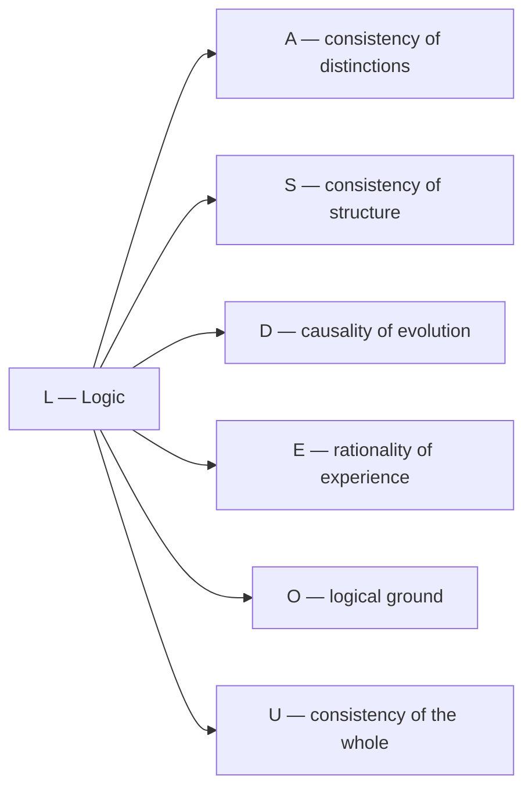

# Dimension IV: Logic (L)

:::info Who this chapter is for
Dimension L: coordination, commutators, logical closure. Assumes familiarity with the [seven dimensions](/docs/core/structure/dimensions) and the basics of categorical logic.
:::

## Why this chapter

We are accustomed to thinking of logic as something abstract — a set of rules for "correct thinking". At school one learns: if A then B; if B then C; therefore, if A then C. But in the Unitary Holonomic Monism (UHM) logic is something far more fundamental. It is an **aspect of reality itself**, determining which configurations are possible and which are contradictory and therefore cannot exist.

In this chapter you will learn:
- why logic in UHM is not a tool of human thinking but a **filter of reality**, sieving out the impossible;
- how the L-role, Lindblad operators and Liouvillian are related through an explicitly chosen realization;
- what three levels of logic exist — from the full (HoTT) to the classical (Boolean);
- why Gödel's incompleteness theorem is not a problem but a **resource** for evolution;
- how logic is connected with causal relations and the other dimensions of the Holon;
- on which Fano lines L lies and why its combinatorial profile is unique.

## Historical precursor

Logic as a science has one of the longest histories.

**Aristotle** (384–322 BC) created **formal logic** — a system of syllogisms enabling reliable conclusions to be drawn from premises. "All men are mortal; Socrates is a man; therefore Socrates is mortal." This was the first attempt to formalise **the rules of thinking**, separating them from content. Aristotelian logic is bivalent: every statement is either true or false. There is no third option.

**George Boole** (1815–1864) translated logic into the language of **algebra**. He showed that "AND", "OR", "NOT" obey the same formal laws as multiplication and addition. Boolean algebra is the foundation of digital computers: every transistor implements a Boolean operation. But Boolean logic remains bivalent.

**Luitzen Brouwer** (1881–1966) questioned the law of the excluded middle. He founded **intuitionism** — a movement asserting that a statement is true only when we can **construct** its proof. "Statement P is true or false" is not an axiom but something that must be proved for each particular P. There are statements that are neither true nor false — they are **undetermined**.

**Arend Heyting** (1898–1980), Brouwer's student, formalised intuitionism as **Heyting algebra** — a generalisation of Boolean algebra in which the law of the excluded middle ($P \lor \neg P = \top$) is not obligatory. It was precisely Heyting algebra that turned out to be the natural logic of **toposes** — categorical generalisations of spaces. Every topos has a subobject classifier $\Omega$, and its logical structure is a Heyting algebra.

**Homotopy Type Theory (HoTT)** is a modern (2013+) development unifying logic, type theory and homotopy theory. In HoTT a "proof" is not simply "yes/no" but an entire **space of proofs** that can have non-trivial topology. This is ∞-categorical logic, the most complete known. In UHM it is precisely HoTT that is the full internal logic of the ∞-topos $\mathbf{Sh}_\infty(\mathcal{C})$.

:::note The path of deepening
Aristotle → Boole → Brouwer → Heyting → HoTT — this is not simply "progress". Each step is a recognition that logic is **richer** than it seemed. Bivalent → many-valued → constructive → ∞-categorical. UHM uses this entire spectrum: Boolean logic for decisive dimensions, Heyting algebra for the standard topos, HoTT for the full ∞-structure.
:::

:::info Why the history of logic matters for understanding UHM
Note: each historical step **expanded** the space of logically admissible. Aristotle allowed only "yes/no". Brouwer added "undetermined". HoTT added an infinite hierarchy of "ways of being true". UHM claims that reality uses **all** these levels simultaneously: elementary particles "live" in Boolean logic (spin up or down), borderline states of consciousness — in Heyting logic (neither waking nor sleeping), and the full ∞-topos structure — in HoTT. The deeper the level of reality, the richer the logic.
:::

:::warning Notation conventions: three meanings of the letter L
In UHM the letter **L** is used for three related but distinct objects:

| Notation | Font | Meaning |
|----------|------|---------|
| $L$ (upright, no index) | Roman | **Logic dimension** — component of $\Gamma$, population $\gamma_{LL}$ |
| $L_k$ (with index) | Italic | **Lindblad operators** — dissipative channels |
| $\mathcal{L}_\Omega$ (calligraphic) | Script | **Liouvillian** — full generator of evolution |

The logical role L, Lindblad operators and the Liouvillian have different mathematical types. Their related notation reflects a proposed model correspondence [I], not an identity derived from the subobject classifier. The [typed realization](../../proofs/categorical/categorical-formalism#l-унификация) replaces the former L-unification theorem [✗].
:::

## Function

**To connect, to coordinate, to verify consistency.**

## Description

The following functional descriptions are model interpretations [I/H]. Positivity of Γ is a mathematical constraint; logical competence is not determined by a single population.

Logic is the dimension of **self-consistency**. It determines which configurations $\Gamma$ are possible and which are contradictory. Logic is the filter of reality: states with $\gamma_{LL} \to 0$ cannot exist stably.

:::info Ontological status
Logic is an **aspect** of the configuration $\Gamma$, not a separate entity. "The Holon is logical" means: in the coherence matrix $\Gamma$ the projection onto the basis vector $|L\rangle$ is active, and the algebra of operators satisfies the commutation relations.
:::

:::info Clarification: L as aspect, not filter
The L-dimension **is not a filter** acting on Γ from outside. L is an **aspect** of Γ itself, reflecting the degree of internal consistency:

- **Population $\gamma_{LL}$** — the fraction of the system's "resource" directed toward maintaining logical coherence
- **High $\gamma_{LL} \gg 1/7$:** the system strictly applies internal rules (dogmatism, rigidity)
- **Low $\gamma_{LL} \ll 1/7$:** the system weakly applies rules (creativity, but potential incoherence)
- **$\gamma_{LL} = 1/7$:** equilibrium — the logical function receives its "fair share" of resource

Stress of the L-dimension: $\sigma_L = \mathrm{clamp}(1 - 7\gamma_{LL}, 0, 1)$ — [formula T-92 [D]](/docs/core/structure/dimension-a#вывод-формулы-напряжения).
:::

## Logical and numerical structures {#категориальное-определение}

In the canonical sheaf topos on state-space opens, $\Omega(U)=\operatorname{Open}(U)$, with restriction by intersection. A logical predicate is a characteristic morphism of a subobject; its truth value is not a matrix or a probability. $\Omega$ is already $0$-truncated in the $\infty$-topos. Internal homotopy type theory encompasses other higher types; it is not obtained by equating higher cognitive levels with $\Omega$ truncations.

### Logic and a chosen finite context {#три-уровня-логики}

The topology's open-set logic is Heyting logic. A chosen orthonormal seven-axis frame gives the different Boolean context of diagonal projections $P_S=\sum_{i\in S}|i\rangle\langle i|$. This context is isomorphic to $2^7$ [T at the chosen frame]. It is not $\operatorname{Dec}(\Omega)$: global decidable opens of the connected density-matrix space are only empty and full. The old $L=\Omega\cap\Gamma$ and $L_k=\sqrt{\chi_{S_k}}$ formulas are withdrawn [✗] as untyped identifications.

### Numerical filters and dynamical roles {#иерархия-lk}

For **chosen** effects $E_a\ge0$, $\sum_a E_a=I$, the Kraus operators $K_a=\sqrt{E_a}$ define a CPTP nonselective channel. For chosen Fano coordinate line projectors, $K_p=\Pi_p/\sqrt3$ satisfy $\sum_pK_p^\dagger K_p=I$, since each point lies on three lines. This correct incidence calculation does not require or establish the withdrawn categorical T-41b derivation. All these projectors commute; products are intersections, with at most fifteen nonempty-word maps and the identity for the empty word.

Physical dissipators, rates, clock constraints and the interpretation of an L-role require additional data. An internal temporal modality must be supplied and verified separately; the existence of $\Omega$ does not derive a clock shift or a state-dependent regenerative rate. Cognitive metaphors for Boolean/Heyting/homotopy structures are [I], not levels derived from a mathematical truncation.

## Mathematical representation

### Operator algebra

Logical relations between dimensions are described by the **commutator**:

$$
[A, B] := AB - BA
$$

The commutator is a measure of the non-commutativity of operators:
- $[A, B] = 0$ — the order of operations does not matter (compatibility)
- $[A, B] \neq 0$ — the order matters (non-commutativity)

:::info Simple example of non-commutativity
Put on socks, then shoes — fine. Put on shoes, then socks — problem. The operations "put on socks" (A) and "put on shoes" (B) are non-commutative: $AB \neq BA$. In quantum mechanics the non-commutativity of position and momentum ($[x, p] = i\hbar$) gives rise to the Heisenberg uncertainty principle.
:::

### Connection with the basis state

The projection onto $|L\rangle$ determines the **degree of logical connectedness** of the configuration:

$$
\gamma_{LL} = \langle L|\Gamma|L\rangle
$$

Physical interpretation: $\gamma_{LL}$ is a measure of how internally consistent the system is.

:::info What high and low γ_LL mean
- **High $\gamma_{LL}$ (close to 1/7 or above):** The system is logically integral. All its parts are consistent with one another, there are no internal contradictions. Example: a well-functioning mathematical theory, a healthy brain in a state of clear thinking.
- **Low $\gamma_{LL}$ (close to 0):** The system is logically "disintegrating". Its parts contradict each other, there is no consistency. Example: a delusional state in which a person simultaneously believes incompatible things; a malfunctioning computer program; a contradictory scientific theory.
- **$\gamma_{LL} = 0$:** Logic is completely absent. Such a system cannot exist stably — without a logical "framework" any configuration immediately falls apart.
:::

### Logical load and the population diagnostic {#логическая-согласованность}

The canonical stress is the chosen population diagnostic

$$
\sigma_L=\max(0,1-7\gamma_{LL})\in[0,1].
$$

It is not a quantum mutual information or a consequence of $\Omega$. A state with $\gamma_{LL}=0$ can be a stationary density matrix (for example under zero dynamics); its stability must be checked for the supplied vector field.

#### Verification information requires a measurement {#определение-i-verify}

Choose an ensemble label $X$ and an implemented verification instrument with classical outcome $Y$. The operational information is $I_{\mathrm{verify}}:=I(X:Y)$ [D], computed from their joint distribution. If a bipartite quantum realization is declared instead, its mutual information is $I(A:B)=S(\rho_A)+S(\rho_B)-S(\rho_{AB})$. The native L-axis is a one-dimensional summand, not a tensor subsystem. The former $S(\rho)-S(\rho\mid L)=I(\Gamma:L)$ without an instrument or tensor factor is withdrawn [✗].

#### Capacity requires a timescale {#определение-theta-l}

An entropy budget $b_L:=\gamma_{LL}\log7$ can be stipulated [D]. A throughput additionally needs a time unit: for example $\theta_L=b_L/t_L$ with calibrated $t_L>0$. Neither the timescale nor this capacity model follows from the classifier. A verification information *rate* $\dot I_{\mathrm{verify}}$ may then be compared to $\theta_L$.

#### Distinct load and stress {#строгое-определение-sigma-l}

Define an operational load $\ell_L:=\dot I_{\mathrm{verify}}/\theta_L$ when the denominator is positive [D]. It is a separate diagnostic from $\sigma_L$. The former reduced-entropy formula and approximation $7(1-\gamma_{LL})/6$ are withdrawn [✗]: no native partial trace over the other six axes exists, and the stated small-population expansion did not imply that approximation. Population stress, verification information and throughput require their own data and should not share an unproved equality.

## Types of logical relations

| Relation | Condition | Interpretation | Consequence |
|----------|-----------|----------------|-------------|
| Compatibility | $[A, B] = 0$ | Simultaneous measurability | Definite joint values |
| Incompatibility | $[A, B] \neq 0$ | Uncertainty principle | $\Delta A \cdot \Delta B \geq \frac{1}{2}\lvert\langle[A,B]\rangle\rvert$ |
| Implication | $P_A \leq P_B$ | $A$ implies $B$ | $\langle A \rangle \leq \langle B \rangle$ |
| Contradiction | $P_A \cdot P_B = 0$ | Incompatible subspaces | Mutual exclusion |

where $P_A$, $P_B$ are projectors onto the corresponding subspaces.

## Logical constraints on $\Gamma$

Dimension $L$ ensures that the fundamental constraints on the coherence matrix are satisfied:

### Hermiticity

$$
\Gamma^\dagger = \Gamma
$$

Mathematically: all eigenvalues are real. Interpretation: probabilities are real numbers.

### Positivity

$$
\langle\psi|\Gamma|\psi\rangle \geq 0 \quad \forall |\psi\rangle \in \mathcal{H}
$$

Mathematically: all eigenvalues are non-negative. Interpretation: probabilities cannot be negative.

### Normalisation

$$
\mathrm{Tr}(\Gamma) = 1
$$

Mathematically: the sum of eigenvalues equals 1. Interpretation: the total probability is unity.

### Cauchy–Schwarz inequality

$$
|\gamma_{ij}|^2 \leq \gamma_{ii} \cdot \gamma_{jj}
$$

Constrains the magnitude of coherences relative to the diagonal elements.

:::info Why these constraints are needed
The four constraints above are not arbitrary rules, but **necessary conditions** for $\Gamma$ to make sense as a density matrix (a probabilistic description of the system). Violation of any of them leads to physically meaningless results: negative probabilities, complex mean values, or probabilities that do not sum to unity. The L-dimension "watches over" compliance with these conditions.
:::

:::note Logical constraints — like the walls of a building
Imagine a building. The walls are the logical constraints. They do not "restrict" life inside the building — they **make it possible**. Without walls there is no roof, no protection from rain, no rooms. The L-constraints work the same way: they do not narrow the space of admissible states — they **create** that space, cutting off meaningless (negative probabilities, normalisation violation) configurations.
:::

## Causality requires a directed process model {#связь-с-каузальностью}

Closure of CPTP maps under composition proves closure of allowed quantum operations. It does not define a causal partial order. With all CPTP maps allowed, every state reaches every other state by the reset $X\mapsto\operatorname{Tr}(X)\rho$, so reachability is not antisymmetric.

### Causality in detail {#каузальность-подробнее}

Unitary channels have CPTP inverses; reset channels can reduce von Neumann entropy. Thus CPTP alone neither forbids loops nor proves an entropy arrow. A causal model must additionally specify events, their time ordering, admissible operations/interventions and any spacetime or no-signalling constraints. A selected semigroup has its own irreversible behavior; contraction of relative entropy to a common stationary state is a theorem only under its stated hypotheses.

### Causality and agency {#каузальность-и-свобода}

Attributing intentions or agency to the L-role is an interpretation [I/H]. The classifier and positivity constraints do not prove either determinism or free will. They delimit well-typed logical predicates and valid quantum states; a causal/behavioral bridge remains separate.

## Examples

| Level | Example | Logical function | Details |
|-------|---------|------------------|---------|
| Physical | Uncertainty principle | $[x, p] = i\hbar$ | It is impossible to simultaneously know position and momentum exactly — this is not a technical limitation but a **logical** property of reality |
| Physical | Conservation laws | $[A, H] = 0 \Rightarrow dA/d\tau = 0$ | If operator $A$ commutes with the Hamiltonian, the corresponding quantity does not change in time |
| Physical | Pauli exclusion | Antisymmetry of fermions | Two identical fermions cannot occupy the same quantum state — a logical prohibition at the level of wave-function symmetry |
| Biological | Genetic code | Uniqueness of translation | Each codon encodes **exactly one** amino acid — logical unambiguity ensures reproducibility |
| Biological | Metabolic cycles | Closure of biochemical pathways | The Krebs cycle is closed: each intermediate product is regenerated, ensuring **self-consistency** of metabolism |
| Cognitive | Inference rules | Modus ponens, modus tollens | "If rain then wet; it is raining; therefore it is wet" — a basic logical rule at the level of mind |
| Cognitive | Rationality | Transitivity of preferences | If you prefer A over B and B over C, logic requires preferring A over C. Violation is a sign of a "malfunction" in the L-dimension |
| Cognitive | Cognitive dissonance | Overload of the L-dimension | Simultaneously holding contradictory beliefs — $\sigma_L \to 1$, logical verification at its limit |

### Expanded examples {#развёрнутые-примеры}

#### The uncertainty principle as a logical property

The Heisenberg uncertainty principle ($\Delta x \cdot \Delta p \geq \hbar/2$) is often explained as "disturbance by measurement": to know the position of a particle, one must "illuminate" it with a photon, which changes the momentum. But this is the **wrong** interpretation. In UHM the uncertainty principle is a **logical** property: the operators of position and momentum are *non-commutative* ($[x, p] = i\hbar$), and this means that simultaneous exact values of both are **logically impossible**. This is not a limitation of our instruments — it is a limitation of *reality*.

#### Cognitive dissonance as σ_L overload

When a person simultaneously holds two incompatible beliefs (for example, "smoking is harmful" and "I smoke because I enjoy it"), their L-dimension is overloaded: $\sigma_L$ grows, approaching 1. The brain experiences discomfort — this is the subjective experience of logical overload. Resolving the dissonance (changing one of the beliefs) is a decrease of $\sigma_L$ back into the safe zone.

#### The genetic code as a logical invariant

The genetic code is one of the clearest examples of the L-function in biology. Each nucleotide triplet (codon) encodes **exactly one** amino acid. If one codon could encode *different* amino acids depending on context, proteins would be synthesised unpredictably — logical consistency would be violated. The unambiguity of the genetic code is Boolean logic ($L_k$ at stratum II): each predicate "codon X encodes amino acid Y" is strictly true or false.

## Connection with other dimensions

**Key connection L ↔ D:** Logic and dynamics are interrelated:
- $D$ determines *how* the system evolves
- $L$ determines *which* trajectories are admissible

**L ↔ S (Logic ↔ Structure):** Logic ensures the **consistency** of structure. Coherence $\gamma_{LS}$ — "laws of structure": axioms determining admissible configurations. If $\gamma_{LS} \to 0$, the structure may be internally contradictory.

**L ↔ E (Logic ↔ Interiority):** Coherence $\gamma_{LE}$ is responsible for the **rationality of experience**. High $|\gamma_{LE}|$ — logically coherent subjective experience. Low — chaotic, incoherent experiences (as in delirium or the early stages of dreaming).

**L ↔ O (Logic ↔ Ground):** Coherence $\gamma_{LO}$ — "fundamentality of logic". The O-dimension supplies "new information" that expands the logical space of L. This is the mechanism for overcoming Gödelian incompleteness (see below).

**L ↔ U (Logic ↔ Unity):** Coherence $\gamma_{LU}$ — "global consistency". High $|\gamma_{LU}|$ means that all parts of the system are **logically compatible** with one another. This is the cohomological condition $H^1 = 0$ at stratum IV.

**L ↔ A (Logic ↔ Articulation):** Coherence $\gamma_{LA}$ — "logicality of distinctions". Every distinction drawn by the A-dimension must be **consistent** with the others. L "checks" distinctions for consistency.

## Coherence with L

The elements $\gamma_{Li}$ of the coherence matrix describe the connection of logic with other dimensions:

| Coherence | Interpretation |
|-----------|----------------|
| $\gamma_{LA}$ | Logicality of distinctions (consistency of categories) |
| $\gamma_{LS}$ | Laws of structure (axioms of the system) |
| $\gamma_{LD}$ | Causality (causal connection) |
| $\gamma_{LE}$ | Rationality of experience (logical coherence of interior states) |
| $\gamma_{LO}$ | Fundamentality of logic (rootedness in the ground) |
| $\gamma_{LU}$ | Consistency of the whole (global non-contradiction) |

## Incompleteness and consistency

### Gödel's theorems: a simple explanation {#теоремы-гёделя}

Kurt Gödel in 1931 proved two results that overturned the understanding of logic:

**First incompleteness theorem:** In any sufficiently rich consistent formal system there exist true statements that **cannot be proved** within that system.

:::info Analogy
Imagine a city map. The map can be very detailed, but it **cannot contain itself** — for then it would have to show a map of the map, and on that a map of the map of the map, and so on. A formal system is like a map: it describes truths, but cannot describe **all** truths about itself.
:::

**Second incompleteness theorem:** A consistent formal system cannot prove its **own** consistency.

This seems catastrophic: we can never be **logically** certain that our logic contains no contradictions!

:::info Even simpler: a mirror and a photograph
First theorem: You cannot photograph **everything**, including the camera itself *at the moment of shooting*. There will always be something "behind the camera". A formal system "photographs" truths, but cannot capture itself whole.

Second theorem: You cannot look in a mirror and verify that the mirror does not distort. For that you need **another** mirror to check the first. But who checks the second? A formal system cannot verify its own consistency — an *external* viewpoint is required.
:::

### Applicability of Gödel's theorems

Gödel's theorems apply to **formal systems** operating in dimension $L$. But $\Gamma$ has 7 dimensions, and $L \subsetneq \Gamma$.

:::warning On the limits of applicability
Gödel's theorems are proved for formal systems satisfying certain conditions (formality, expressiveness, consistency). Applying them to $\Gamma$ as a whole is a categorical error, since $\Gamma$ is not a formal system.
:::

### Two types of truth

| Type | Definition | Domain |
|------|------------|--------|
| **Logical provability** | $p \in \text{Prov}(L)$ — $p$ is derivable from axioms | Dimension $L$ |
| **Coherence-truth** | $\langle p \vert \Gamma \vert p \rangle > 0$ — $p$ is consistent with $\Gamma$ | All 7 dimensions |

Formally:

$$
\text{Prov}(L) \subsetneq \text{Coh}(\Gamma)
$$

where:
- $\text{Prov}(L)$ — the set of statements provable in the formal system associated with $L$
- $\text{Coh}(\Gamma)$ — the set of states coherent with the full matrix $\Gamma$

:::info What this means in practice
There exist statements that **cannot be proved** by purely logical means (through L), but that are **true** in the full sense of coherence with $\Gamma$. Example: "I exist" cannot be proved formally (it would lead to infinite regress), but it is coherent with $\Gamma$ of any living Holon ($P > P_{\text{crit}}$ → the system exists → the statement is coherent).
:::

:::note More examples of two types of truth
- **"Red differs from blue"** — cannot be *proved* logically, but is coherent with $\Gamma$ of any sighted observer ($\gamma_{AE} > 0$, distinctions are articulated and experienced).
- **Arithmetic axioms** — the consistency of Peano arithmetic is *not provable* within arithmetic itself (Gödel's second theorem), but is *coherent* with $\Gamma$ — arithmetic works, bridges do not fall, computers calculate.
- **Ethical intuitions** — "torturing the innocent is evil" is not derivable from the axioms of L, but is coherent with $\Gamma$ of a healthy conscious Holon (through the E and U dimensions).
:::

### Consistency through autopoiesis

Gödel's second theorem forbids *logical* proof of consistency. UHM demonstrates consistency **existentially**:

The existence of a viable Holon $\mathbb{H}$ with $P(\Gamma) > P_{\text{crit}}$ demonstrates that the configuration $\Gamma$ is consistent — contradictory configurations cannot sustain coherence above the critical threshold.

:::tip Principle
**Consistency is enacted, not proven** — consistency is **enacted** by the existence of a functioning system, not proved logically.
:::

### Incompleteness as a resource

Gödelian incompleteness in $L$ is not a limitation but a **mechanism of evolution**:

1. Undecidable problems create "singularities" in logical space
2. The system turns to [Ground (O)](./dimension-o) for new information
3. Expansion of the axiomatics restores coherence at a new level

:::info Analogy with scientific revolutions
Gödelian incompleteness in UHM works like the mechanism of scientific revolutions according to Kuhn. Normal science (working within the framework of L) accumulates "anomalies" — facts that cannot be explained within the current paradigm. When anomalies become too numerous ($\sigma_L \to 1$), a "revolution" occurs: the system turns to O for new information, expands the axiomatics, and moves to a new level. Incompleteness is the **engine** of evolution, not a bug.
:::

### Incompleteness in everyday experience {#неполнота-повседневность}

Gödelian incompleteness may seem remote from life, but in fact we encounter it constantly:

**A child and rules.** A child learns rules: "No hitting", "You must share". But sooner or later they encounter a situation the *rules do not cover*: "What if another child is hitting my friend — can I hit back in defence?" This is a Gödelian sentence: within the current axiomatics (rules of behaviour) the question is *undecidable*. The child turns to the "ground" (parent, teacher) for new information, expands their "axiomatics", and moves to a deeper level of moral reasoning.

**The liar paradox.** "This sentence is false." If it is true, then it is false. If false, then true. At the Boolean level — an unsolvable paradox. At the Heyting level — simply an *undefined* predicate. At the HoTT level — an element with non-trivial homotopic structure: the space of "proofs" of this statement has a loop.

See [Gödel's theorems and the completeness of UHM](../foundations/consequences#10-теоремы-гёделя-и-полнота-угм) for a full analysis.

## Logic and the Fano plane {#логика-и-фано}

Dimension L ($e_4$ in the octonionic correspondence) belongs to three [Fano lines](/docs/core/structure/dimensions#октонионная-интерпретация):

| Fano line | Sector type | Physical meaning |
|-----------|-------------|-----------------|
| $\{A, S, L\}$ | **3**–**3**–$\bar{\mathbf{3}}$ | Structural articulation regulated by logic |
| $\{D, L, U\}$ | **3**–$\bar{\mathbf{3}}$–$\bar{\mathbf{3}}$ | Dynamic logic of unity: causal integration |
| $\{L, E, O\}$ | $\bar{\mathbf{3}}$–$\bar{\mathbf{3}}$–$1_O$ | Logic of interiority, rooted in the ground |

:::info Combinatorial profile of L
Of the seven dimensions, L is the **only** element of the $\bar{\mathbf{3}}$-sector that does **not** lie on the Higgs line $\{E, U, A\}$. This gives L a unique role: while E and U are connected to the "interiority" and "unifying" aspects through the Higgs channel, L stands "apart", providing an **independent** consistency check. It is like a referee who is not a participant in the game.

[Theorem T-177](/docs/core/structure/dimensions#комбинаторная-единственность) claimed the semantic role of L combinatorially unique; the claim is retracted [✗] (2026-09-25) with T-48a — restated (T-177), incidence fixes $L$ only together with the binary convention that fixes $E$ versus $U$ ($L$ is the third point of the line through $O$ and $E$).
:::

### What the Fano lines say about logic {#фано-линии-логика}

Each of the three Fano lines containing L reveals a distinct aspect of logic:

**Line $\{A, S, L\}$ — "the foundation of logic".** Articulation ($A$) draws distinctions, structure ($S$) fixes them, logic ($L$) checks consistency. This is the "construction" triad: distinguish → fix → verify. Example: formulating a scientific law. Observation identifies a pattern ($A$), formalisation fixes it in an equation ($S$), verification checks whether the new law contradicts already known ones ($L$).

**Line $\{D, L, U\}$ — "causal integration".** The same line that contains [Dynamics (D)](./dimension-d). Logic ($L$) determines admissible trajectories, dynamics ($D$) realises movement along them, unity ($U$) ensures the integrity of the process. This is the triad of *action*: admissible → realisable → integrated. Example: a chess game. Rules ($L$) determine which moves are possible, a move ($D$) performs the action, strategy ($U$) unites the moves into a single plan.

**Line $\{L, E, O\}$ — "the root of logic".** Logic ($L$), interiority ($E$), and ground ($O$) are connected directly. This is the "deep" triad: logic is rooted in the ground and experienced from within. Through $O$, logic gains access to new information, overcoming Gödelian incompleteness. Through $E$, logical operations are experienced as "understanding", "insight", "self-evidence". Example: the moment of illumination when "everything falls into place" — the L-E-O correlation is maximal.

Note that L shares Fano line $\{D, L, U\}$ with [dimension D (Dynamics)](./dimension-d) — this is the mathematical expression of a fundamental connection: **logic and dynamics are inseparable**. Admissible trajectories (L) and actual trajectories (D) are determined by the same associative subalgebra.

### Octonionic context {#октонионный-контекст}

:::note Chosen octonionic correspondence [D/I]
The assignment $L=e_4\in\operatorname{Im}\mathbb O$ belongs to the declared oriented orthonormal frame. For a specified positive octonionic three-form, its stabilizer is $G_2$ [T]. This group identity does not uniquely assign functional names to axes or determine a physical encoder. The former universal T-42a rigidity is withdrawn [✗]; [reversible-identification assumptions](/docs/proofs/categorical/uniqueness-theorem#теорема-единственности) give a conditional comparison theorem. Incidence can constrain labels **after** the required marks are supplied; those marks and the remaining label convention are model data. The [structural derivation](/docs/proofs/minimality/theorem-octonionic-derivation) states the additional algebraic inputs, and [the frame discussion](./dimensions#октонионная-интерпретация) distinguishes its symmetries from physical gauge equivalence.
:::

## Key conclusions of the chapter {#ключевые-выводы}

Logical predicates, state validity, numerical filtering and causal models have distinct types. A chosen frame supplies the Fano incidence and the L-name [D/I]; it does not establish functional uniqueness or a causal arrow. The canonical population stress and separately calibrated verification load must be kept distinct.

---

**Related documents:**
- [Dynamics (D)](./dimension-d) — previous dimension
- [Interiority (E)](./dimension-e) — next dimension
- [Minimality theorem](../../proofs/minimality/theorem-minimality-7#случай-n--3-удаление-логики-l) — proof of the necessity of L
- [Emergent time](../../proofs/dynamics/emergent-time) — τ from the structure of Γ
- [Internal logic Ω](../foundations/axiom-omega#внутренняя-логика) — categorical source of L
- [Evolution equation](../dynamics/evolution) — use of $L_k$ operators
- [Categorical formalism](../../proofs/categorical/categorical-formalism) — ∞-topos and the classifier
- [Dimensions of the Holon](./dimensions) — overview of all 7 dimensions
- [Lindblad operators](../operators/lindblad-operators) — $L_k$ formalism
